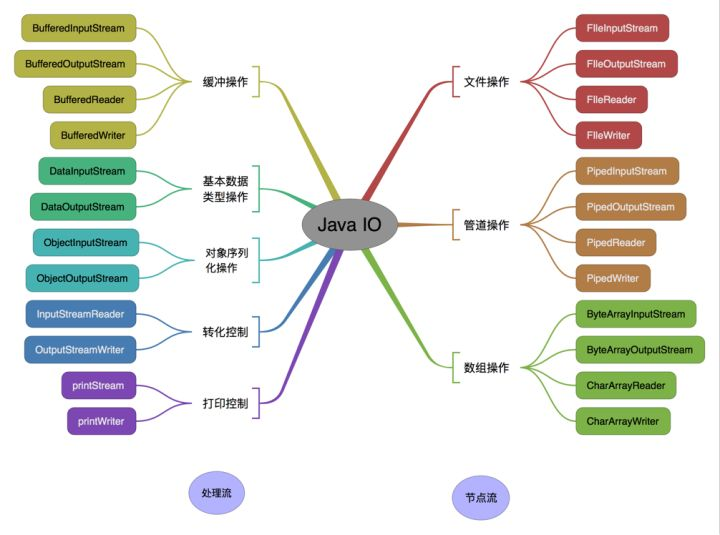

## 1. IO 体系总结

**IO 流的分类：**

- 按照流的流向分，可以分为**输入流和输出流**；
- 按照操作单元划分，可以划分为**字节流(8 bit)和字符流(16 bit)**；
- 按照流的角色划分，可以划分为**节点流和处理流**。

Java IO流共涉及40多个类，这些类看上去很杂乱，但实际上很有规则，而且彼此之间存在非常紧密的联系， Java IO流的40多个类都是从如下4个抽象类基类中派生出来的。

- **InputStream/Reader**： 所有的输入流的抽象基类，前者是字节输入流，后者是字符输入流。
- **OutputStream/Writer**：所有输出流的抽象基类，前者是字节输出流，后者是字符输出流。

|   分类   |     字节输入流     |     字节输出流      |    字符输入流    |    字符输出流     |
| :------: | :----------------: | :-----------------: | :--------------: | :---------------: |
| 抽象基类 | **InputStream(~)** | **OutputStream(-)** |  **Reader(#)**   |   **Writer($)**   |
|   文件   |     **File~**      |      **File-**      |    **File#**     |     **File$**     |
|   数组   |     ByteArray~     |     ByteArray-      |    CharArray#    |    CharArray$     |
|   管道   |       Piped~       |       Piped-        |      Piped#      |      Piped$       |
|  字符串  |                    |                     |     String#      |      String$      |
|   缓冲   |   **Buffered~**    |    **Buffered-**    |  **Buffered#**   |   **Buffered$**   |
|   转换   |                    |                     | **InputStream#** | **OutputStream$** |
|   对象   |    **Object~**     |     **Object-**     |                  |                   |
|   过滤   |      Filter~       |       Filter-       |     Filter#      |      Filter$      |
|   打印   |                    |     PrintStream     |                  |      Print$       |
| 推回输入 |     Pushback~      |                     |    Pushback#     |                   |
| 基本数据 |       Data~        |        Data-        |                  |                   |

按操作对象分类结构图：




## 2. 既然有了字节流，为什么还要有字符流

问题本质想问：**不管是文件读写还是网络发送接收，信息的最小存储单元都是字节，那为什么 I/O 流操作要分为字节流操作和字符流操作呢？**

回答：字符流是由 Java 虚拟机将字节转换得到的，问题就出在这个过程还算是非常耗时，并且，如果我们不知道编码类型就很容易出现乱码问题。所以， I/O 流就干脆提供了一个直接操作字符的接口，方便我们平时对字符进行流操作。如果音频、视频、图片等媒体文件用字节流比较好，如果涉及到字符的话使用字符流比较好。


## 3. IO 流的常用方法

IO 流的操作一般分为4步：**File类的实例化、流的实例化、读取写入操作、资源的关闭**，为了保证流资源一定可以执行关闭操作，需要使用try-catch-finally进行处理。

InputStream和Reader是所有输入流的抽象基类，本身并不能创建实例来执行输入，但它们的方法是所有输入流都可使用的方法。

* **int read()**：从输入流中读取单个字节/字符，返回所读取的字节/字符数据（字节数据可直接转换为int类型）。
* **int read(byte[]/char[] b)**：从输入流中最多读取b.length个字节/字符的数据，并将其存储在字节/字符数组b中，返回实际读取的字节/字符数。
* **int read(byte[]/char[] b, int off, int len)**：从输入流中最多读取len个字节/字符的数据，并将其存储在数组b中，放入数组b中时，并不是从数组起点开始，而是从off位置开始，返回实际读取的字节/字符数。

OutputStream和Writer是所有输出流的抽象基类，也有类似用法。不过Writer还可以用字符串来代替字符数组，即以String对象作为参数。

- **void write(byte[]/char[] buf)**：将字节/字符数组中的数据输出到指定输出流中。
- **void write(byte[]/char[] buf, int off, int len )**：将字节/字符数组中从off位置开始，长度为len的字节/字符输出到指定输出流中。
- **void write(String str)**：将str字符串中包含的字符输出到指定输出流中。

### 缓冲流

以介质是硬盘为例，字节流和字符流的弊端： 在每一次读写的时候，都会访问硬盘。 如果读写的频率比较高的时候，其性能表现不佳。 为了解决以上弊端，采用缓冲流。 缓冲流在读取的时候，**会一次性读较多的数据到缓冲区中**，以后每一次的读取，都是在缓冲中访问，直到缓存中的数据读取完毕，再到硬盘中读取。

缓冲流在写入数据的时候，会先把数据写入到缓冲区，直到缓冲区达到一定的量，才把这些数据**一起写入到硬盘中去**。按照这种操作模式，就不会像字节流，字符流那样**每写一个字节都访问硬盘**，从而减少了IO操作。下面使用缓冲流实现复制视频等大文件的功能：

```java
public class CopyMovie {
    public static void main(String[] args) {
        BufferedInputStream bis = null;
        BufferedOutputStream bos = null;

        try {
            bis = new BufferedInputStream(new FileInputStream("pic1.jpg"));
            bos = new BufferedOutputStream(new FileOutputStream("pic3.jpg"));

            byte[] buff = new byte[1024];	// 使用byte字节数组
            int len;	// len表示实际读取的字节数
            while ((len = bis.read(buff)) != -1) {
                bos.write(buff, 0, len);
            }

        } catch (IOException e) {
            e.printStackTrace();
        } finally {
            try {
                if (bis != null)	// 防止空指针异常
                    bis.close();
            } catch (IOException e) {
                e.printStackTrace();
            }
            try {	// 分两次try，确保流都可以关闭
                if (bos != null)
                    bos.close();
            } catch (IOException e) {
                e.printStackTrace();
            }
        }
    }
}
```

### 转换流

**获取键盘输入常用的两种方法**

方法1：通过 Scanner

```java
Scanner input = new Scanner(System.in);
String s = input.nextLine();
input.close();
```

方法2：通过 BufferedReader

```java
// 使用转换流InputStreamReader将System.in字节输入流转换为字符输入流
BufferedReader input = new BufferedReader(new InputStreamReader(System.in)); 
String s = input.readLine();
input.close();
```

### 对象流(序列化)

**序列化就是把Java对象转换为字节序列的过程；反序列化就是把字节序列恢复为对象的过程。**对象序列化主要有两种用途：一是把对象的字节序列永久地保存到硬盘上，通常存放在一个文件中；二是在网络上传送对象的字节序列。

一个类若想被序列化，则需要实现 ``java.io.Serializable`` 接口，该接口中没有定义任何方法，是一个标识性接口。在序列化时，**static 和 transient 修饰的变量是无法序列化的**。如果A包含了B的引用，那么在序列化A时也会将B一并序列化；如果此时A可以序列化，B无法序列化，那么在序列化A时就会发生异常。这时就需要将B的引用设为``transient``，该关键字只能修饰变量，不能修饰类和方法。

首先我们定义一个实现了Serializable接口的简单类：

```java
public class Person implements Serializable {
    // 序列化ID，Java序列化的机制是通过判断类的serialVersionUID来验证版本一致的。
    // 序列化操作时会把系统当前类的serialVersionUID写入到序列化文件中；
    // 当进行反序列化时，JVM会把传来的字节流中的serialVersionUID于本地相应实体类的serialVersionUID进行比较。如果相同说明是一致的，可以进行反序列化，否则会出现反序列化版本一致的异常。
    private static final long serialVersionUID = 472987949L;

    private String name;    // String类实现了Serializable
    private int age;    // 默认基本数据类型可序列化

    public Person(String name, int age) {
        this.name = name;
        this.age = age;
    }

    public String getName() {
        return name;
    }

    public int getAge() {
        return age;
    }
}
```

接下来我们分别使用 ObjectOutputStream 和 ObjectInputStream 对象流进行序列化和反序列化：

```java
// 使用ObjectOutputStream序列化
ObjectOutputStream oos = new ObjectOutputStream(new FileOutputStream("object.dat"));
oos.writeObject("hello world");
oos.flush();
oos.writeObject(new Person("peter", "male", 23));
oos.flush();
oos.close();

// 使用ObjectInputStream反序列化
ObjectInputStream ois = new ObjectInputStream(new FileInputStream("object.dat"));
String str = (String) ois.readObject();    // 反序列化顺序必须与序列化顺序相同
Person p = (Person) ois.readObject();
System.out.println(str);    // hello world
System.out.println(p.getName());    // peter
System.out.println(p.getSex());    // null（不能反序列化）
System.out.println(p.getAge());    // 23
ois.close();
```


## 4. 


## 5. BIO、NIO 和 AIO

- **BIO (Blocking I/O)：** 同步阻塞I/O模式，数据的读取写入必须阻塞在一个线程内等待其完成。在活动连接数不是特别高（小于单机1000）的情况下，这种模型是比较不错的，可以让每一个连接专注于自己的 I/O 并且编程模型简单，也不用过多考虑系统的过载、限流等问题。线程池本身就是一个天然的漏斗，可以缓冲一些系统处理不了的连接或请求。但是，当面对十万甚至百万级连接的时候，传统的 BIO 模型是无能为力的。因此，我们需要一种更高效的 I/O 处理模型来应对更高的并发量。
- **NIO (New I/O)：** NIO是一种同步非阻塞的I/O模型，在Java 1.4 中引入了NIO框架，对应 java.nio 包，提供了 Channel , Selector，Buffer等抽象。NIO中的N可以理解为Non-blocking，不单纯是New。它支持面向缓冲的，基于通道的I/O操作方法。 NIO提供了与传统BIO模型中的 `Socket` 和 `ServerSocket` 相对应的 `SocketChannel` 和 `ServerSocketChannel` 两种不同的套接字通道实现，两种通道都支持阻塞和非阻塞两种模式。阻塞模式使用就像传统中的支持一样，比较简单，但是性能和可靠性都不好；非阻塞模式正好与之相反。对于低负载、低并发的应用程序，可以使用同步阻塞I/O来提升开发速率和更好的维护性；对于高负载、高并发的（网络）应用，应使用 NIO 的非阻塞模式来开发
- **AIO (Asynchronous I/O)：** AIO 也就是 NIO 2。在 Java 7 中引入了 NIO 的改进版 NIO 2，它是异步非阻塞的IO模型。异步 IO 是基于事件和回调机制实现的，也就是应用操作之后会直接返回，不会堵塞在那里，当后台处理完成，操作系统会通知相应的线程进行后续的操作。AIO 是异步IO的缩写，虽然 NIO 在网络操作中，提供了非阻塞的方法，但是 NIO 的 IO 行为还是同步的。对于 NIO 来说，我们的业务线程是在 IO 操作准备好时，得到通知，接着就由这个线程自行进行 IO 操作，IO操作本身是同步的。查阅网上相关资料，我发现就目前来说 AIO 的应用还不是很广泛，Netty 之前也尝试使用过 AIO，不过又放弃了。


随机存取文件流RamdomAccessFile直接继承与Object类，实现了DataInput和DataOutpt接口，既可以作为输入流，又可以作为输出流。如果RamdomAccessFile作为输出流时，写出的文件若不存在，则在执行过程中自动创建，若已存在，则会对原有文件覆盖（默认从头开始覆盖）

