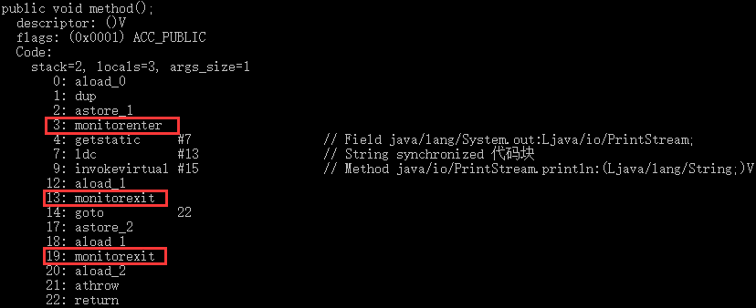
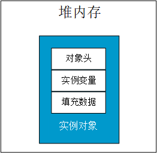
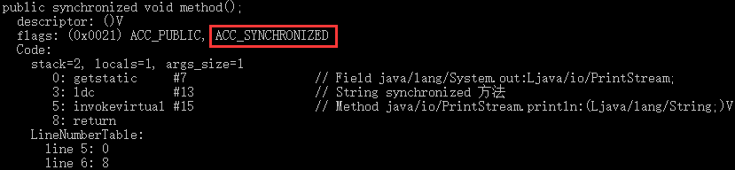

## 1. 进程和线程

进程和线程的对比这一知识点由于过于基础，所以在面试中很少碰到，但是极有可能会在笔试题中碰到。常见的提问形式是这样的：**“什么是线程和进程?，请简要描述线程与进程的关系、区别及优缺点？ ”**。

### 1.1 何为进程?

进程是程序的一次执行过程，是系统运行程序的基本单位，因此进程是动态的。系统运行一个程序即是一个进程从创建，运行到消亡的过程。在 Java 中，当我们启动 main 函数时其实就是启动了一个 JVM 的进程，而 main 函数所在的线程就是这个进程中的一个线程，也称主线程。

如下图所示，在 windows 中通过查看任务管理器的方式，我们就可以清楚看到 window 当前运行的进程（.exe 文件的运行）。


### 1.2 何为线程?

线程与进程相似，但线程是一个比进程更小的执行单位。一个进程在其执行的过程中可以产生多个线程。与进程不同的是同类的多个线程**共享进程的堆和方法区资源**，但每个**线程有自己的程序计数器、虚拟机栈和本地方法栈**，所以系统在产生一个线程，或是在各个线程之间作切换工作时，负担要比进程小得多，也正因为如此，线程也被称为轻量级进程。

操作系统在分配资源时是把资源分配给进程的，但是**CPU资源**比较特殊，它是被分配到线程的，因为真正要占用CPU运行的是线程，所以也说线程是CPU分配的基本单位。Java 程序天生就是多线程程序，我们可以通过 JMX 来看一下一个普通的 Java 程序有哪些线程，代码如下。

```java
public class MultiThread {
    public static void main(String[] args) {
        // 获取Java线程管理 MXBean
        ThreadMXBean threadMXBean = ManagementFactory.getThreadMXBean();
        // 不需要获取同步的 monitor 和 synchronizer 信息，仅获取线程和线程堆栈信息
        ThreadInfo[] threadInfos = threadMXBean.dumpAllThreads(false, false);
        // 遍历线程信息，仅打印线程 ID 和线程名称信息
        for (ThreadInfo threadInfo : threadInfos) {
            System.out.println("[" + threadInfo.getThreadId() + "] " + threadInfo.getThreadName());
        }
    }
}
```

上述程序输出如下（输出内容可能不同，不用太纠结每个线程的作用，只用知道main线程执行main方法即可）：

```
[1] main //main线程,程序入口
[2] Reference Handler //清除 reference 线程
[3] Finalizer //调用对象 finalize 方法的线程
[4] Signal Dispatcher //分发处理给 JVM 信号的线程
[5] Attach Listener //添加事件
```

从上面的输出内容可以看出：**一个 Java 程序的运行是 main 线程和多个其他线程同时运行**。

### 1.3 从 JVM 角度说进程和线程之间的关系（重要） 	

#### 1.3.1 图解进程和线程的关系

下图是 Java 内存区域，通过下图我们从 JVM 的角度来说一下线程和进程之间的关系。


从上图可以看出：一个进程中可以有多个线程，多个线程共享进程的**堆**和**方法区 (JDK1.8 之后的元空间)**资源，但是每个线程有自己的**程序计数器**、**虚拟机栈** 和 **本地方法栈**。

下面来思考这样一个问题：为什么**程序计数器**、**虚拟机栈**和**本地方法栈**是线程私有的呢？为什么堆和方法区是线程共享的呢？

#### 1.3.2 程序计数器为什么是私有的?

程序计数器主要有下面两个作用：

1. 字节码解释器通过改变程序计数器来依次读取指令，从而实现代码的流程控制，如：顺序执行、选择、循环、异常处理。
2. 在多线程的情况下，程序计数器用于记录当前线程执行的位置，从而当线程被切换回来的时候能够知道该线程上次运行到哪儿了。

需要注意的是，如果执行的是 native 方法，那么程序计数器记录的是 undefined 地址，只有执行的是 Java 代码时程序计数器记录的才是下一条指令的地址。

所以，程序计数器私有主要是为了**线程切换后能恢复到正确的执行位置**。

#### 1.3.3 虚拟机栈和本地方法栈为什么是私有的?

- **虚拟机栈：**每个 Java 方法在执行的同时会创建一个栈帧用于存储局部变量表、操作数栈、常量池引用等信息。从方法调用直至执行完成的过程，就对应着一个栈帧在 Java 虚拟机栈中入栈和出栈的过程。
- **本地方法栈：**和虚拟机栈所发挥的作用非常相似，区别是： **虚拟机栈为虚拟机执行 Java 方法 （也就是字节码）服务，而本地方法栈则为虚拟机使用到的 Native 方法服务。** 在 HotSpot 虚拟机中和 Java 虚拟机栈合二为一。

所以，为了**保证线程中的局部变量不被别的线程访问到**，虚拟机栈和本地方法栈是线程私有的。

#### 1.3.4 一句话简单了解堆和方法区

堆和方法区是所有线程共享的资源，其中堆是进程中最大的一块内存，主要用于存放新创建的对象 (所有对象都在这里分配内存)，方法区主要用于存放已被加载的类信息、常量、静态变量、即时编译器编译后的代码等数据。


## 2. 多线程并发编程

### 2.1 并发与并行

- **并发**：同一**时间段**内，多个任务同时执行 (单位时间内不一定同时执行)；
- **并行**：**单位时间**内，多个任务同时执行。

在多线程编程实践中，线程的个数往往多于CPU的个数，所以一般都称多线程并发编程，而不是多线程并行编程。

### 2.2 同步和异步 

* **同步**：同步方法调用一旦开始，调用者必须等到方法调用返回后，才能继续后续的行为。
* **异步**：异步方法调用更像一个消息传递，一旦开始，方法调用就会立即返回，调用者可以继续后续的操作。

### 2.3 阻塞和非阻塞

非阻塞指在不能立刻得到结果之前，该函数不会阻塞当前线程，而会立刻返回，而阻塞与之相反。

### 2.4 为什么要使用多线程?

先从总体上来说：

- **从计算机底层来说：**线程可以比作是轻量级的进程，是程序执行的最小单位，线程间的切换和调度的成本远远小于进程。另外，多核 CPU 时代意味着多个线程可以同时运行，这减少了线程上下文切换的开销。
- **从当代互联网发展趋势来说：**现在的系统动不动就要求百万级甚至千万级的并发量，而多线程并发编程正是开发高并发系统的基础，利用好多线程机制可以大大提高系统整体的并发能力以及性能。

再深入到计算机底层来探讨：

- **单核时代：** 在单核时代多线程主要是为了提高 CPU 和 IO 设备的综合利用率。举个例子：当只有一个线程的时候会导致 CPU 计算时，IO 设备空闲；进行 IO 操作时，CPU 空闲。我们可以简单地说这两者的利用率目前都是 50%左右。但是当有两个线程的时候就不一样了，当一个线程执行 CPU 计算时，另外一个线程可以进行 IO 操作，这样两个的利用率就可以在理想情况下达到 100%了。	
- **多核时代：** 多核时代多线程主要是为了提高 CPU 利用率。举个例子：假如我们要计算一个复杂的任务，我们只用一个线程的话，CPU 只会一个 CPU 核心被利用到，而创建多个线程就可以让多个 CPU 核心被利用到，这样就提高了 CPU 的利用率。

### 2.5 使用多线程可能带来的问题

并发编程的目的就是为了能提高程序的执行效率提高程序运行速度，但是并发编程并不总是能提高程序运行速度的，而且并发编程可能会遇到很多问题，比如：内存泄漏、上下文切换、死锁，还有受限于硬件和软件的资源闲置问题。


## 3. 线程的创建与运行

### 3.1 继承 Thread 类

优点：在 run() 方法中获取当前线程可以直接使用 this，无须使用 Thread.currentThread()，可以在子类中添加成员变量，通过 set 方法设置参数或通过构造函数进行传递。

缺点：Java 不支持多继承，如果继承了 Thread 类，那么就不能再继承其他类。


```java
public class ThreadTest {
    public static void main(String[] args) {
        MyThread myThread = new MyThread();
        myThread.start();	// MyThread
    }
}

class MyThread extends Thread {
    @Override
    public void run() {
        System.out.println("MyThread");
    }
}
```
### 3.2 实现 Runnable 接口

优点：由于 Java 单继承多接口，线程类可以继承其他类。

缺点：任务没有返回值，获取当前线程需要使用 Thread.currentThread()，且只能使用主线程中的 final 变量。

注：Thread 类实现了 Runnable 接口，两种方式都需要重写 run()，且启动线程都是调用 Thread 类中的 start()。

```java
public class ThreadTest {
    public static void main(String[] args) {
        Runnable runnable = new MyRunnable();
        Thread thread = new Thread(runnable);
        thread.start();		// MyRunnable
    }
}

class MyRunnable implements Runnable {
    @Override
    public void run() {
        System.out.println("MyRunnable");
    }
}
```

### 3.3 实现 Callable 接口

优点：支持泛型，call() 方法有返回值，且可以抛出异常，被外面的操作捕获。

缺点：获取当前线程需要使用 Thread.currentThread()。

```java
public class ThreadTest {
    public static void main(String[] args) {
        MyCallable myCallable = new MyCallable();
        FutureTask<String> futureTask = new FutureTask<>(myCallable);
        new Thread(futureTask).start();

        try {
            String result = futureTask.get();
            System.out.println(result);		// MyCallable
        } catch (Exception e) {
            e.printStackTrace();
        }
    }
}

class MyCallable implements Callable<String> {
    @Override
    public String call() throws Exception {
        return "MyCallable";
    }
}
```

### 3.4 使用线程池

使用线程池可以提高响应速度、降低资源消耗、便于线程管理，也是最推荐的一种方式。另外，《阿里巴巴 Java 开发手册》在第一章第六节并发处理这一部分也强调“线程资源必须通过线程池提供，不允许在应用中自行显示创建线程”。

```java
public class ThreadTest {
    public static void main(String[] args) {
        ExecutorService es = Executors.newFixedThreadPool(10);
        es.execute(new MyRunnable());   // 适用于Runnable，无返回值
        es.submit(new MyCallable());    // 适用于Callable，有返回值
        es.shutdown();  // 关闭连接池
    }
}
```


## 4. 线程的生命周期和常用方法

### 4.1 线程的生命周期和状态

Java 线程在运行的生命周期中的指定时刻只可能处于下面 6 种不同状态的其中一个状态。

| 状态名称     | 说明                                                         |
| :----------- | :----------------------------------------------------------- |
| NEW          | 初始状态，线程被构建，但是还没有调用start()方法              |
| RUNNABLE     | 运行状态，Java 线程将操作系统中的就绪和运行两种状态笼统地称作“运行中” |
| BLOCKED      | 阻塞状态，表示线程阻塞于锁                                   |
| WAITING      | 等待状态，表示线程进入等待状态，进入该状态表示当前线程需要等待其他线程做出一些特定动作（通知或中断） |
| TIME_WAITING | 超时等待状态，该状态不同于WAITING，它是可以在指定的时间自行返回的 |
| TERMINATED   | 终止状态，表示当前线程已经执行完毕                           |

线程在生命周期中并不是固定处于某一个状态而是随着代码的执行在不同状态之间切换。Java 线程状态变迁如下图所示（图源《Java 并发编程艺术》4.1.4 节）：


由上图可以看出：线程创建之后它将处于 **NEW（新建）** 状态，调用 `start()` 方法后开始运行，线程这时候处于 **READY（可运行）** 状态。可运行状态的线程获得了 CPU 时间片（timeslice）后就处于 **RUNNING（运行）** 状态。

> 操作系统隐藏 Java 虚拟机（JVM）中的 RUNNABLE 和 RUNNING 状态，它只能看到 RUNNABLE 状态，所以 Java 系统一般将这两个状态统称为 **RUNNABLE（运行中）** 状态 。


当线程执行 `wait()`方法之后，线程进入 **WAITING（等待）**状态。进入等待状态的线程需要依靠其他线程的通知才能够返回到运行状态，而 **TIME_WAITING(超时等待)** 状态相当于在等待状态的基础上增加了超时限制，比如通过 `sleep（long millis）`方法或 `wait（long millis）`方法可以将 Java 线程置于 TIMED WAITING 状态。当超时时间到达后 Java 线程将会返回到 RUNNABLE 状态。当线程调用同步方法时，在没有获取到锁的情况下，线程将会进入到 **BLOCKED（阻塞）** 状态。线程在执行 Runnable 的` run() `方法之后将会进入到 **TERMINATED（终止）** 状态。

### 4.2 线程的常用方法

- **start()**：Thread类中的方法，调用该方法后，线程并没有马上执行，而是处于就绪状态，表示已经获取了除CPU资源外的其它资源，等待获取CPU后才会真正运行。

  > 为什么我们调用 start() 方法时会执行 run() 方法，为什么不能直接调用 run() 方法？
  >
  > start() 会执行线程的相应准备工作，然后线程获取时间片后，会自动执行 run() 方法的内容，这是真正的多线程工作。而直接执行run()方法，会把 run() 方法当成一个 main 线程下的普通方法去执行，并不会在某个线程中执行它，所以这并不是多线程工作。也就是说，调用 start() 方法方可启动线程并使线程进入就绪状态，而 run() 方法只是 thread 的一个普通方法调用，还是在主线程里执行。

- **wait()**：**Object 类**中的方法，调用前线程需要先获取对象的监视器锁（同步代码块或同步方法），否则就会抛出 `IllegalMonitorStateException` 异常。调用后线程会被阻塞挂起，并释放当前共享变量上的锁（其它共享变量上的锁不会释放），直到发生下面两件事之一才返回：其他线程调用了该共享对象的 notify() 或 notifyAll() 方法；或者其他线程调用该线程的 interrupt() 方法，导致该线程抛出异常。

  为了防止虚假唤醒，wait() 方法需要在一个循环中进行。所谓**虚假唤醒**，就是一个线程可以从挂起状态变为可运行状态（被唤醒），即使该线程没有被其他线程调用 notify() 或 notifyAll() 方法进行通知，也没有被中断或超时等待。

  ```java
  synchronized (obj) {	// 获取对象的监视器锁
      while (条件) {	// 防止虚假唤醒
          obj.wait();	// 调用者必须是同步监视器
      }
  }
  ```

- **wait(long timeout)**：线程调用共享对象的该方法挂起，若没有在指定的 timeout 毫秒时间内被其他线程唤醒，也会因为超时而返回。在 wait() 方法内部调用了 wait(0)，二者效果一样。

- **notify() / notifyAll()**：**Object 类**中的方法，调用前线程需要先获取对象的监视器锁（同步代码块或同步方法），调用后会唤醒一个/所有在该共享变量上调用 wait 系列方法后被挂起的线程。

- **join()**：Thread 类中的方法，等待线程执行终止，比如多个线程加载资源，需要等待多个线程全部加载完毕再汇总处理。

- **sleep(long millis)**：Thread 类中的**静态**方法，调用该方法后，线程会暂时让出指定时间的执行权，即不参与CPU调度，但是它所拥有的监视器资源，比如锁还是持有不让出的。指定睡眠时间到了后该方法会正常返回，线程就处于就绪状态，然后参与CPU调度运行。

  > sleep(long millis) 与 wait(long timeout) 方法的异同：
  >
  > 同：一旦执行方法，都可以使得当前线程进入阻塞状态
  >
  > 异：(1) 声明的位置不同：Thread 类中声明 sleep()，Object 类中声明 wait()；
  >
  > ​		(2) 调用的要求不同：sleep() 可以在任何场景下使用，wait() 必须在同步代码块或同步方法中使用；
  >
  > ​		(3) 是否释放锁：在同步代码块或同步方法中，sleep() 不会释放锁，wait() 会释放锁；
  >
  > ​		(4) 主要作用不同：sleep() 通常用于暂停线程执行，wait() 通常被用于线程间交互/通信。

- **yield()**：Thread 类中的静态方法，调用该方法，实际上是在暗示线程调度器当前线程请求让出自己的 CPU 使用权，但是线程调度器可以无条件忽略这个暗示。一般很少使用这个方法。

  > sleep(long millis) 与 yield() 方法的区别：
  >
  > 当线程调用 sleep 方法时，会被阻塞挂起指定的时间，在这期间线程调度器不会去调度该线程；
  >
  > 当调用 yield() 方法时，线程只是让出自己剩余的时间片，并没有被阻塞挂起，而是处于就绪状态，线程调度器下一次调度还是有可能调度到该线程执行。

- **interrupt()**：Thread 类中的方法，中断**此线程**（此线程不一定是当前线程，而是指调用该方法的 Thread 实例所代表的线程），但实际上只是给线程**设置一个中断标志**，线程仍会继续运行。

- **isInterrupted()**：Thread 类中的方法，检测**此线程**是否被中断（检查中断标志），且**不清除中断标志**，“此线程”指的是调用该方法的线程。

- **interrupted()**：Thread 类中的**静态方法**，检测**当前线程**是否被中断，且**清除中断状态**，第二次再调用时中断状态已经被清除，将返回一个false，“当前线程”指的是该方法所处的当前线程，因为是静态方法，所以**与调用者无关**。

  ```java
  public class ThreadTest {
      public static void main(String[] args) {
          ChildThread childThread = new ChildThread();
          childThread.start();
          childThread.interrupt();	// 将中断标志设为true，但线程不会真正中断
          System.out.println(childThread.isAlive());   // true
          System.out.println(childThread.isInterrupted()); // true
          System.out.println(childThread.isInterrupted()); // true
          System.out.println(childThread.interrupted());   // false，当前线程是main线程
          System.out.println(childThread.interrupted());   // false
  
          Thread mainThread = Thread.currentThread();
          mainThread.interrupt();
          System.out.println(mainThread.isAlive()); // true
          System.out.println(mainThread.isInterrupted());   // true
          System.out.println(mainThread.isInterrupted());   // true
          System.out.println(mainThread.interrupted()); // true
          System.out.println(mainThread.interrupted()); // false，main线程中断标志已被清除
      }
  }
  
  class ChildThread extends Thread {
      @Override
      public void run() {
      }
  }
  ```

  

## 5. 线程的其他基础知识

### 5.1 线程优先级

**理论上**来说系统会根据优先级来决定首先使哪个线程进入运行状态。当 CPU 比较闲的时候，设置线程优先级几乎不会有任何作用，而且很多操作系统压根不会理会你设置的线程优先级，所以不要让业务过度依赖于线程的优先级。

另外，**线程优先级具有继承特性**，比如 A 线程启动 B 线程，则 B 线程的优先级和 A 是一样的。**线程优先级还具有随机性**，也就是说线程优先级高的不一定每一次都先执行完。

Thread 类中包含的成员变量代表了线程的某些优先级。如**Thread.MIN_PRIORITY（常数 1）**，**Thread.NORM_PRIORITY（常数 5）**，**Thread.MAX_PRIORITY（常数 10）**。其中每个线程的优先级都在 1 到10 之间，在默认情况下优先级都是 5。

**一般情况下，不会对线程设定优先级别，更不会让某些业务严重地依赖线程的优先级别，比如权重，借助优先级设定某个任务的权重，这种方式是不可取的，一般定义线程的时候使用默认的优先级就好了。**

相关方法：

```java
public final void setPriority(int newPriority) //为线程设定优先级
public final int getPriority() //获取线程的优先级
```
设置线程优先级方法源码：

```java
public final void setPriority(int newPriority) {
    ThreadGroup g;
    checkAccess();
    //线程优先级不能小于 1 也不能大于 10，否则会抛出异常
    if (newPriority > MAX_PRIORITY || newPriority < MIN_PRIORITY) {
        throw new IllegalArgumentException();
    }
    //如果指定的线程优先级大于该线程所在线程组的最大优先级，那么该线程的优先级将设为线程组的最大优先级
    if((g = getThreadGroup()) != null) {
        if (newPriority > g.getMaxPriority()) {
            newPriority = g.getMaxPriority();
        }
        setPriority0(priority = newPriority);
    }
}
```

### 5.2 守护线程和用户线程

**守护线程和用户线程简介:**

- **用户 (User) 线程：**运行在前台，执行具体的任务，如程序的主线程、连接网络的子线程等都是用户线程
- **守护 (Daemon) 线程：**运行在后台，为其他前台线程服务。也可以说守护线程是 JVM 中非守护线程的 **“佣人”**。一旦所有用户线程都结束运行，守护线程会随 JVM 一起结束工作。

main 函数所在的线程就是一个用户线程，main 函数启动的同时在 JVM 内部同时还启动了好多守护线程，比如垃圾回收线程。main 线程运行结束后，JVM 会自动启动一个叫做 `DestroyJavaVM` 的线程，该线程会等待所有用户线程结束后终止 JVM 进程。

**那么守护线程和用户线程有什么区别呢**？比较明显的区别之一是用户线程结束，JVM 退出，不管这个时候有没有守护线程运行。而守护线程不会影响 JVM 的退出。

```java
public class ThreadTest {
    public static void main(String[] args) {
        MyThread myThread = new MyThread();
        // myThread.setDaemon(true);
        myThread.start();
        System.out.println("main thread over");
    }
}

class MyThread extends Thread {
    @Override
    public void run() {
        while (true){
        }
    }
}
```

从运行结果上看，main 线程已经运行结束了，但 JVM 进程并没有退出。说明了当父线程结束后，子线程还是可以继续存在的，也就是**子线程的生命周期并不受父线程的影响**。这也说明了在用户线程还存在的情况下 JVM 进程并不会终止。若取消注释，则可以正常结束 JVM 进程。

**注意事项：**

1.  `setDaemon(true)`必须在`start()`方法前执行，否则会抛出 `IllegalThreadStateException` 异常
2.  在守护线程中产生的新线程也是守护线程
3.  不是所有的任务都可以分配给守护线程来执行，比如读写操作或者计算逻辑
4.  守护 (Daemon) 线程中不能依靠 finally 块的内容来确保执行关闭或清理资源的逻辑。因为我们上面也说过了一旦所有用户线程都结束运行，守护线程会随 JVM 一起结束工作，所以守护 (Daemon) 线程中的 finally 语句块可能无法被执行。

### 5.3 上下文切换

在多线程编程中，线程的个数一般都大于 CPU 核心的个数，而每个 CPU 同一时刻只能被一个线程使用，为了让用户感觉多个线程是同时执行的，CPU 资源的分配采用**时间片轮转**的策略。当一个线程使用完时间片后，就会处于就绪状态并让出 CPU 给其他线程使用，这就是**上下文切换**。切换线程上下文时，需要保存当前线程的执行现场，当再次执行时根据保存的执行现场信息进行恢复。

上下文切换通常是计算密集型的。也就是说，它需要相当可观的处理器时间，在每秒几十上百次的切换中，每次切换都需要纳秒量级的时间。所以，上下文切换对系统来说意味着消耗大量的 CPU 时间，事实上，可能是操作系统中时间消耗最大的操作。 

Linux 相比与其他操作系统（包括其他类 Unix 系统）有很多的优点，其中有一项就是，其上下文切换和模式切换的时间消耗非常少。

### 5.4 线程死锁

#### 5.4.1 什么是线程死锁

死锁是指两个或两个以上的线程在执行过程中，因争夺资源而造成的互相等待的现象，在无外力作用的情况下，这些线程会一直相互等待而无法继续运行下去。

如下图所示，线程 A 持有资源 2，线程 B 持有资源 1，他们同时都想申请对方的资源，所以这两个线程就会互相等待而进入死锁状态。


下面通过一个例子来说明线程死锁，代码模拟了上图的死锁的情况 (代码来源于《并发编程之美》)：

```java
public class DeadLockDemo {
    private static Object resource1 = new Object();	// 资源1
    private static Object resource2 = new Object();	// 资源2

    public static void main(String[] args) {
        new Thread(() -> {
            synchronized (resource1) {
                System.out.println(Thread.currentThread() + "get resource1");
                try {
                    Thread.sleep(1000);
                } catch (InterruptedException e) {
                    e.printStackTrace();
                }
                System.out.println(Thread.currentThread() + "waiting get resource2");
                synchronized (resource2) {
                    System.out.println(Thread.currentThread() + "get resource2");
                }
            }
        }, "线程1").start();

        new Thread(() -> {
            synchronized (resource2) {
                System.out.println(Thread.currentThread() + "get resource2");
                try {
                    Thread.sleep(1000);
                } catch (InterruptedException e) {
                    e.printStackTrace();
                }
                System.out.println(Thread.currentThread() + "waiting get resource1");
                synchronized (resource1) {
                    System.out.println(Thread.currentThread() + "get resource1");
                }
            }
        }, "线程2").start();
    }
}
```

线程 A 通过 synchronized (resource1) 获得 resource1 的监视器锁，然后通过` Thread.sleep(1000);`让线程 A 休眠 1s 为的是让线程 B 得到执行然后获取到 resource2 的监视器锁。线程 A 和线程 B 休眠结束了都开始企图请求获取对方的资源，然后这两个线程就会陷入互相等待的状态，这也就产生了死锁。上面的例子符合产生死锁的四个必要条件。

学过操作系统的朋友都知道产生死锁必须具备以下四个条件：

1. 互斥条件：该资源任意一个时刻只由一个线程占用。
1. 请求与保持条件：一个进程因请求资源而阻塞时，对已获得的资源保持不放。
1. 不剥夺条件：线程已获得的资源在末使用完之前不能被其他线程强行剥夺，只有自己使用完毕后才释放资源。
1. 循环等待条件：若干进程之间形成一种头尾相接的循环等待资源关系。

#### 5.4.2 如何避免线程死锁

我们只要破坏产生死锁的四个条件中的其中一个就可以了。

**破坏互斥条件**

这个条件我们没有办法破坏，因为我们用锁本来就是想让他们互斥的（临界资源需要互斥访问）。

**破坏请求与保持条件**

一次性申请所有的资源（资源浪费、饥饿现象）。

**破坏不剥夺条件**

占用部分资源的线程进一步申请其他资源时，如果申请不到，可以主动释放它占有的资源（增加系统开销）。

**破坏循环等待条件**

靠按序申请资源来预防。按某一顺序申请资源，释放资源则反序释放。破坏循环等待条件（资源浪费）。

我们对线程 2 的代码修改成下面这样就不会产生死锁了。

```java
        new Thread(() -> {
            synchronized (resource1) {
                System.out.println(Thread.currentThread() + "get resource1");
                try {
                    Thread.sleep(1000);
                } catch (InterruptedException e) {
                    e.printStackTrace();
                }
                System.out.println(Thread.currentThread() + "waiting get resource2");
                synchronized (resource2) {
                    System.out.println(Thread.currentThread() + "get resource2");
                }
            }
        }, "线程2").start();
```

我们分析一下上面的代码为什么避免了死锁的发生?

线程 1 首先获得到 resource1 的监视器锁，这时候线程 2 就获取不到了。然后线程 1 再去获取 resource2 的监视器锁，可以获取到。然后线程 1 释放了对 resource1、resource2 的监视器锁的占用，线程 2 获取到就可以执行了。这样就破坏了破坏循环等待条件，因此避免了死锁。


## 6. 锁的概述

### 6.1 乐观锁与悲观锁

根据看待并发同步的角度，锁可以分乐观锁与悲观锁：

* **悲观锁**：指对数据被外界修改持保守态度，认为数据很容易就会被其他线程修改，所以**在数据被处理前先对数据进行加锁，并在整个数据处理过程中，使数据处于锁定状态**。悲观锁的实现往往依靠数据库提供的锁机制，即在数据库中，在对数据记录操作前给记录加排它锁。如果获取锁失败，则说明数据正在被其他线程修改，当前线程则等待或者抛出异常。如果获取锁成功，则对记录进行操作，然后提交事务后释放排它锁。
* **乐观锁**：乐观锁是相对悲观锁来说的，它认为数据在一般情况下不会造成冲突，所以**在访问记录前不会加排它锁，而是在进行数据提交更新时，才会正式对数据冲突与否进行检测**。乐观锁并不会使用数据库提供的锁机制，一般在表中添加 version 字段或者使用业务状态来实现。乐观锁直到提交时才锁定，所以不会产生任何死锁。

### 6.2 公平锁与非公平锁

根据线程获取锁的抢占机制，锁可以分为公平锁和非公平锁：

* **公平锁**：线程获取锁的顺序是按照线程请求锁的时间早晚来决定的，也就是**最早请求锁的线程将最早获取到锁**。
* **非公平锁**：可以在运行时闯入，也就是**先来不一定先得**。在没有公平性需求的前提下尽量使用非公平锁，因为公平锁会带来性能开销。

### 6.3 独占锁与共享锁

根据锁只能被单个线程持有还是能被多个线程共同持有，锁可以分为独占锁和共享锁：

* **独占锁**：保证任何时候都**只有一个线程能得到锁**，例如 **ReentrantLock 互斥锁**。独占锁是一种悲观锁，由于每次访问资源都先加上互斥锁，这限制了并发性，因为读操作并不会影响数据的一致性。
* **共享锁**：**可以同时由多个线程持有锁**，例如 **ReadWriteLock 读写锁**。共享锁则是一种乐观锁，它放宽了加锁的条件，允许多个线程同时进行读操作。

### 6.4 可重入锁

可重入锁又叫递归锁，是指**一个线程再次获取它已经获取的锁时，不会被阻塞**。也就是该线程获取了该锁，那么可以无限次（实际上是有限次）地进入被锁锁住的代码。Synchronized 内部锁和 ReetrantLock 都是可重入锁，可重入锁可一定程度避免死锁。

### 6.5 自旋锁

自旋锁是指当前线程在获取锁时，如果发现锁已经被其他线程占有，它**不会马上阻塞自己**，而是在不放弃CPU使用权的情况下，**采用循环的方式来尝试获取锁**（默认次数是10，可以使用-XX:PreBlockSpinsh参数设置该值），很有可能在后面几次尝试中其他线程已经释放了锁。

这样做的优点是减少了线程上下文切换的开销，缺点是循环会消耗CPU资源。由此可见，自旋锁是使用CPU时间换取线程阻塞与调度的开销。


## 7. synchronized 关键字

### 7.1 线程安全问题

线程安全问题是指当**多个线程同时读写一个共享资源**并且没有任何同步措施时，导致出现脏数据或者其他不可预见的结果的问题。线程安全问题的本质其实就是内存可见性问题、指令重排序问题、原子操作问题。

* **内存可见性问题**：多个线程访问同一个共享变量时，其中一个线程对这个共享变量值的修改，其他线程能够立刻获得修改以后的值。Java内存模型规定，将所有的变量都存放在主内存中，**当线程使用变量时，会把主内存里面的变量复制到自己的工作空间（工作内存）进行读写操作**。这就可能造成一个线程在主内存中修改了共享变量的值，而另一个线程还继续使用它工作内存中的变量值的拷贝，造成数据的不一致。**synchronized、volatile、final** 都可以解决内存可见性问题。

  > 线程读取 volatile 变量值时等价于线程进入 synchronized 块，都是先清空本地内存变量值，再从主内存获取最新值；线程写入 volatile 变量值时等价于线程退出 synchronized 块，都是把写入工作内存中的变量值同步到主内存。

* **指令重排序问题**：编译器和处理器对指令重排序以提高运行性能，且只会对不存在数据依赖性的指令重排序，即编写的代码顺序和最终执行的指令顺序是不一致的。重排序可能会导致多线程程序出现内存可见性问题。**synchronized、volatile**可以解决指令重排序问题。

* **原子操作问题**：所谓原子性操作，是指执行一系列操作时，这些操作要么全部执行，要么全部不执行，不存在只执行其中一部分的情况。Java 中提供了两个高级指令 `monitorenter`和 `monitorexit`，也就是对应的**synchronized** 同步锁来保证原子性。需要注意的是，volatile 关键字是不能保证原子性的。

### 7.2 synchronized 的三种使用方式

#### 7.2.1 synchronized 修饰实例方法

**修饰实例方法，作用于当前对象实例加锁，进入同步代码前要获得当前对象实例的锁**。如果多个线程访问的是同一个对象，哪个线程先执行带 synchronized 关键字的方法，则哪个线程就持有该方法，那么其他线程只能等待。如果多个线程访问的是多个对象则不一定，因为多个对象会产生多个锁。

```java
public class ThreadSafety implements Runnable {
    private static int num = 0;	// 共享资源

    // synchronized修饰实例方法，锁是当前对象实例
    private synchronized void add() {
        num++;
    }

    @Override
    public void run() {
        for (int i = 0; i < 100000; i++) {
            add();
        }
    }

    public static void main(String[] args) throws Exception {
        ThreadSafety threadSafety = new ThreadSafety();
        Thread t1 = new Thread(threadSafety);
        Thread t2 = new Thread(threadSafety);
        t1.start();
        t2.start();
        t1.join();
        t2.join();
        System.out.println(num);    // 200000
    }
}
```

上述代码中，我们开启两个线程操作同一个共享资源即变量num。由于num++操作并不具备原子性，该操作是先读取值，接着递增计算，最后写回一个新值，因此 add() 方法必须使用 synchronized 修饰，以保证线程安全。在这种情况下，当前线程的锁便是实例对象 threadSafety，注意线程同步锁可以是任意对象，且每个对象对应只有一把锁。

#### 7.2.2 synchronized 修饰静态方法

**修饰静态方法，作用于当前类对象加锁，进入同步代码前要获得当前类对象的锁** 。也就是给当前类加锁，会作用于类的所有对象实例。如果一个线程A调用一个实例对象的非静态 synchronized 方法，而线程B需要调用这个实例对象所属类的静态 synchronized 方法，是允许的，不会发生互斥现象，**因为访问静态 synchronized 方法占用的锁是当前类的锁，而访问非静态 synchronized 方法占用的锁是当前实例对象锁**。

```java
public class ThreadSafety implements Runnable {
    private static int num = 0;	// 共享资源

    // synchronized修饰静态方法，锁是当前类对象
    private static synchronized void add() {
        num++;
    }

    @Override
    public void run() {
        for (int i = 0; i < 100000; i++) {
            add();
        }
    }

    public static void main(String[] args) throws Exception {
        Thread t1 = new Thread(new ThreadSafety());
        Thread t2 = new Thread(new ThreadSafety());
        t1.start();
        t2.start();
        t1.join();
        t2.join();
        System.out.println(num);    // 200000
    }
}
```

上述代码中，如果去掉 static 关键字，结果 ≤ 200000，这是因为两个线程访问的是两个不同的对象，多个对象会产生多个锁，线程安全问题依然存在。加上 static 关键字后，当前线程的锁便是 threadSafety 类对应的Class对象，不管new了多少个对象，它都只有一份，所以对该类的所有对象都加了锁。

#### 7.2.3 synchronized 修饰代码块

**修饰代码块，指定加锁对象，对给定对象加锁，进入同步代码块前要获得给定对象的锁。** ``synchronized(this) `` 代码块等价于 synchronized 修饰实例方法，都是锁定当前对象；``synchronized(class)`` 代码块等价于synchronized 修饰 static 静态方法，都是给 Class 类上锁。另外需要注意的是：尽量不要使用 synchronized(String a)，因为 JVM 中，字符串常量池具有缓冲功能。

```java
for (int i = 0; i < 100000; i++) {
    // this，锁是当前对象实例
    synchronized (this) {
        num++;
    }
}

for (int i = 0; i < 100000; i++) {
    // .class，锁是当前类对象
    synchronized (ThreadSafety.class) {
        num++;
    }
}
```

在实现 Runnable 接口创建多线程方式中，我们可以考虑使用 this 充当锁；而在继承 Thread 类创建多线程方式中，慎用 this 充当锁，可以考虑使用当前类充当锁。因为一般情况下，我们只会创建一个 Runnable 对象，然后作为参数传递给Thread；而会创建多个 Thread 对象。

### 7.3 synchronized 的底层原理

#### 7.3.1 synchronized 代码块底层原理

```java
public class SynchronizedDemo {
	public void method() {
		synchronized (this) {
			System.out.println("synchronized 代码块");
		}
	}
}
```

通过 JDK 自带的 javap 命令查看 SynchronizedDemo 类的相关字节码信息：首先切换到类的对应目录执行 `javac -encoding UTF-8 SynchronizedDemo.java` 命令生成编译后的 .class 文件，然后执行`javap -c -s -v -l SynchronizedDemo.class`命令进行反编译。



从上面我们可以看出：**synchronized 同步语句块的实现使用的是 monitorenter 和 monitorexit 指令，其中 monitorenter 指令指向同步代码块的开始位置，monitorexit 指令则指明同步代码块的结束位置。** 当执行 monitorenter 指令时，线程试图获取锁也就是获取 monitor 的持有权。如果计数器为 0 则可以成功获取，获取后将锁计数器加1（重入锁时也会加1）；如果其他线程已经拥有了该 monitor 的持有权，那当前线程将被阻塞，直到锁被另外一个线程释放为止。相应的在执行 monitorexit 指令后，将锁计数器设为 0，表明锁被释放。

> 在 JVM 中，对象在内存中的布局分为三块区域：对象头、实例变量和填充数据，如下图所示。
>
> monitor 对象（也称为管程或监视器锁）存在于每个Java对象的对象头中，synchronized 锁便是通过这种方式获取锁的，也是为什么Java中任意对象可以作为锁的原因，同时也是 notify/notifyAll/wait 等方法必须在synchronized 代码块或者 synchronized 方法中调用的原因。



值得注意的是编译器将会确保方法中调用过的每条 monitorenter 指令都有执行其对应 monitorexit 指令，而无论这个方法是正常结束还是异常结束。为了保证在方法异常完成时 monitorenter 和 monitorexit 指令依然可以正确配对执行，编译器会自动产生一个异常处理器，声明可处理所有的异常，目的就是用来执行 monitorexit 指令。从字节码中也可以看出多了一个 monitorexit 指令，它就是异常结束时被执行的释放 monitor 的指令。

#### 7.3.2 synchronized 方法底层原理

```java
public class SynchronizedDemo2 {
    public synchronized void method() {
        System.out.println("synchronized 方法");
    }
}
```

采用同样的方法进行反编译，查看 SynchronizedDemo2 类的相关字节码信息：



从上面我们可以看出：**synchronized 修饰的方法并没有 monitorenter 指令和 monitorexit 指令，取而代之的是 ACC_SYNCHRONIZED 标识，该标识指明了该方法是一个同步方法**，JVM 通过该 ACC_SYNCHRONIZED 访问标志来辨别一个方法是否声明为同步方法，从而执行相应的同步调用。

在 Java 早期版本中，synchronized 属于重量级锁，效率低下，因为监视器锁（monitor）是依赖于底层的操作系统的 Mutex Lock 来实现的，Java 的线程是映射到操作系统的原生线程之上的。如果要挂起或者唤醒一个线程，都需要操作系统帮忙完成，而操作系统实现线程之间的切换时需要从用户态转换到内核态，这个状态之间的转换需要相对比较长的时间，时间成本相对较高，这也是为什么早期的 synchronized 效率低的原因。

庆幸的是在 Java 6 之后 Java 官方对从 JVM 层面对synchronized 较大优化，所以现在的 synchronized 锁效率也优化得很不错了。Java 6 对锁的实现引入了大量的优化，如自旋锁、适应性自旋锁、锁消除、锁粗化、偏向锁、轻量级锁等技术来减少锁操作的开销。

#### 7.3.3 synchronized 优化

锁主要存在四种状态，依次是：无锁状态、偏向锁、轻量级锁、重量级锁，他们是通过对象头中的字段来表明的，会随着竞争的激烈而逐渐升级。注意锁可以升级不可降级，这种策略是为了提高获得锁和释放锁的效率。

1. **偏向锁**

   指一段同步代码一直被一个线程所访问，那么该线程会自动获取锁，降低获取锁的代价。

   **引入偏向锁的目的和引入轻量级锁的目的很像，他们都是为了没有多线程竞争的前提下，减少传统的重量级锁使用操作系统互斥量产生的性能消耗。但是不同是：轻量级锁在无竞争的情况下使用 CAS 操作去代替使用互斥量。而偏向锁在无竞争的情况下会把整个同步都消除掉**。

   偏向锁的“偏”就是偏心的偏，它的意思是会偏向于第一个获得它的线程，如果在接下来的执行中，该锁没有被其他线程获取，那么持有偏向锁的线程就不需要进行同步！关于偏向锁的原理可以查看《深入理解Java虚拟机：JVM高级特性与最佳实践》第二版的13章第三节锁优化。

   但是对于锁竞争比较激烈的场合，偏向锁就失效了，因为这样场合极有可能每次申请锁的线程都是不相同的，因此这种场合下不应该使用偏向锁，否则会得不偿失，需要注意的是，偏向锁失败后，并不会立即膨胀为重量级锁，而是先升级为轻量级锁。

2. **轻量级锁**

   指当锁是偏向锁的时候，被另一个线程所访问，偏向锁就会升级为轻量级锁，其他线程会通过自旋的形式尝试获取锁，不会阻塞，提高性能。

   倘若偏向锁失败，虚拟机并不会立即升级为重量级锁，它还会尝试使用一种称为轻量级锁的优化手段(1.6之后加入的)。**轻量级锁不是为了代替重量级锁，它的本意是在没有多线程竞争的前提下，减少传统的重量级锁使用操作系统互斥量产生的性能消耗，因为使用轻量级锁时，不需要申请互斥量。另外，轻量级锁的加锁和解锁都用到了CAS操作。** 

   **轻量级锁能够提升程序同步性能的依据是“对于绝大部分锁，在整个同步周期内都是不存在竞争的”，这是一个经验数据。如果没有竞争，轻量级锁使用 CAS 操作避免了使用互斥操作的开销。但如果存在锁竞争，除了互斥量开销外，还会额外发生CAS操作，因此在有锁竞争的情况下，轻量级锁比传统的重量级锁更慢！如果锁竞争激烈，那么轻量级将很快膨胀为重量级锁！**

3. **重量级锁**

   指当锁为轻量级锁的时候，另一个线程虽然是自旋，但自旋不会一直持续下去，当自旋一定次数的时候，还没有获取到锁，就会进入阻塞，该锁膨胀为重量级锁。重量级锁会让他申请的线程进入阻塞，性能降低。

4.  **自旋锁和自适应自旋**

   轻量级锁失败后，虚拟机为了避免线程真实地在操作系统层面挂起，还会进行一项称为自旋锁的优化手段。

   互斥同步对性能最大的影响就是阻塞的实现，因为挂起线程/恢复线程的操作都需要转入内核态中完成（用户态转换到内核态会耗费时间）。

   **一般线程持有锁的时间都不是太长，所以仅仅为了这一点时间去挂起线程/恢复线程是得不偿失的。** 所以，虚拟机的开发团队就这样去考虑：“我们能不能让后面来的请求获取锁的线程等待一会而不被挂起呢？看看持有锁的线程是否很快就会释放锁”。**为了让一个线程等待，我们只需要让线程执行一个忙循环（自旋），这项技术就叫做自旋**。

   自旋锁在 JDK1.6 之前其实就已经引入了，不过是默认关闭的，需要通过`--XX:+UseSpinning`参数来开启。JDK1.6及1.6之后，就改为默认开启的了。需要注意的是：自旋等待不能完全替代阻塞，因为它还是要占用处理器时间。如果锁被占用的时间短，那么效果当然就很好了！反之，相反！自旋等待的时间必须要有限度。如果自旋超过了限定次数任然没有获得锁，就应该挂起线程。**自旋次数的默认值是10次，用户可以修改`--XX:PreBlockSpin`来更改**。

   另外,**在 JDK1.6 中引入了自适应的自旋锁。自适应的自旋锁带来的改进就是：自旋的时间不再固定了，而是和前一次同一个锁上的自旋时间以及锁的拥有者的状态来决定，虚拟机变得越来越“聪明”了**。

5. **锁消除**

   锁消除理解起来很简单，它指的就是虚拟机即使编译器在运行时，如果检测到那些共享数据不可能存在竞争，那么就执行锁消除。锁消除可以节省毫无意义的请求锁的时间。

6. **锁粗化**

   原则上，我们在编写代码的时候，总是推荐将同步块的作用范围限制得尽量小，只在共享数据的实际作用域才进行同步，这样是为了使得需要同步的操作数量尽可能变小，如果存在锁竞争，那等待线程也能尽快拿到锁。

   大部分情况下，上面的原则都是没有问题的，但是如果一系列的连续操作都对同一个对象反复加锁和解锁，那么会带来很多不必要的性能消耗。

### 7.4 synchronized 的其他知识

#### 7.4.1 synchronized 可重入性

synchronized 是基于原子性的内部锁机制，是可重入的。需要特别注意的是，当子类继承父类时，子类也是可以通过可重入锁调用父类的同步方法。由于 synchronized 是基于 monitor 实现的，因此每次重入，monitor 中的计数器仍会加1。

```java
public synchronized void setA() throws Exception {
    Thread.sleep(1000);
    setB();	// synchronized的可重入性
}

public synchronized void setB() throws Exception {
    Thread.sleep(1000);
}
```

#### 7.4.2  synchronized 等待不可中断

线程的中断操作对于正在等待获取锁对象的 synchronized 方法或者代码块并不起作用，也就是对于synchronized来说，如果一个线程在等待锁，那么结果只有两种，要么它获得这把锁继续执行，要么它就保存等待，即使调用中断线程的方法，也不会生效。

```java
public class SynchronizedDemo3 {
    private static final Object o1 = new Object();
    private static final Object o2 = new Object();

    public static void main(String[] args) throws InterruptedException {
        // 两个线程形成死锁，相互等待获取锁
        t1.start();
        t2.start();
        Thread.sleep(2000);

        // 死锁过程中断两个线程，但没有捕获到异常，即线程未被中断，JVM也未退出
        System.out.println("before interrupt");
        t1.interrupt();
        t2.interrupt();
        System.out.println("end interrupt");
    }

    static Thread t1 = new Thread(() -> {
       synchronized (o1){
           try {
               System.out.println("start t1");
               Thread.sleep(1000);
               synchronized (o2){
                   System.out.println("t1 lock o2");
               }
           } catch (InterruptedException e) {
               System.out.println("t1 interrupted");
               e.printStackTrace();
           }
       }
    });

    static Thread t2 = new Thread(() -> {
       synchronized (o2){
           try {
               System.out.println("start t2");
               Thread.sleep(1000);
               synchronized (o1){
                   System.out.println("t2 lock o1");
               }
           } catch (InterruptedException e) {
               System.out.println("t2 interrupted");
               e.printStackTrace();
           }
       }
    });
}
```

### 7.5 Synchronized 与 ReenTrantLock 对比

1. **两者都是可重入锁**

2. **synchronized 依赖于 JVM 而 ReenTrantLock 依赖于 API**

   synchronized 是依赖于 JVM 实现的，前面介绍了在 JDK1.6 为 synchronized 关键字进行了很多优化，但是这些优化都是在虚拟机层面实现的，并没有直接暴露给我们。ReenTrantLock 是 JDK 层面实现的（也就是 API 层面，需要 lock() 和 unlock() 方法配合 try/finally 语句块来完成），所以我们可以通过查看它的源代码，来看它是如何实现的。

3. **ReenTrantLock 比 synchronized 增加了一些高级功能**

   相比synchronized，ReenTrantLock增加了一些高级功能。主要来说主要有三点：**①等待可中断；②可实现公平锁；③可实现选择性通知（锁可以绑定多个条件）**

   * **ReenTrantLock 提供了一种能够中断等待锁的线程的机制**，通过 lock.lockInterruptibly() 来实现这个机制。也就是说正在等待的线程可以选择放弃等待，改为处理其他事情。
   * **ReenTrantLock 可以指定是公平锁还是非公平锁。而synchronized只能是非公平锁。** ReenTrantLock默认情况是非公平的，可以通过 ReenTrantLock类的`ReentrantLock(boolean fair)`构造方法来制定是否是公平的。
   * synchronized 关键字与 wait() 和 notify/notifyAll() 方法相结合可以实现等待/通知机制，ReentrantLock类当然也可以实现，但是需要借助于 Condition 接口与 newCondition() 方法。Condition 是JDK1.5之后才有的，它具有很好的灵活性，比如可以实现多路通知功能，也就是在一个Lock对象中可以创建多个Condition实例（即对象监视器），**线程对象可以注册在指定的Condition中，从而可以有选择性的进行线程通知，在调度线程上更加灵活。 在使用notify/notifyAll()方法进行通知时，被通知的线程是由 JVM 选择的，用ReentrantLock类结合Condition实例可以实现“选择性通知”** ，这个功能非常重要，而且是Condition接口默认提供的。而synchronized关键字就相当于整个Lock对象中只有一个Condition实例，所有的线程都注册在它一个身上。如果执行notifyAll()方法的话就会通知所有处于等待状态的线程这样会造成很大的效率问题，而Condition实例的signalAll()方法 只会唤醒注册在该Condition实例中的所有等待线程。

4. **性能已不是选择标准**

   在JDK1.6之前，synchronized 的性能是比 ReenTrantLock 差很多。具体表示为：synchronized 关键字吞吐量随线程数的增加，下降得非常严重。而ReenTrantLock 基本保持一个比较稳定的水平。**JDK1.6 之后，synchronized 和 ReenTrantLock 的性能基本是持平了。所以网上那些说因为性能才选择 ReenTrantLock 的文章都是错的！JDK1.6之后，性能已经不是选择synchronized和ReenTrantLock的影响因素了！而且虚拟机在未来的性能改进中会更偏向于原生的synchronized，所以还是提倡在synchronized能满足你的需求的情况下，优先考虑使用synchronized关键字来进行同步！优化后的synchronized和ReenTrantLock一样，在很多地方都是用到了CAS操作**。


## 8. volatile 关键字

### 8.1 volatile 解决内存可见性

volatile 修饰的成员变量在每次被线程访问时，都**强迫从主内存中重读该成员变量的值**；当成员变量发生变化时，**强迫线程将变化值回写到主内存**，而不是在线程各自的工作内存中进行读写操作。这样在任何时刻，两个不同的线程总是看到某个成员变量的同一个值，也就保证了同步数据的可见性。

```java
public class VolatileVisibility {
    public static void main(String[] args) throws Exception {
        MyThread thread = new MyThread();
        thread.start();
        Thread.sleep(1000);
        thread.setRunning(false);
        System.out.println("already set false");
    }
}

class MyThread extends Thread {
    private boolean isRunning = true;	// 没有加volatile

    public void setRunning(boolean isRunning) {
        this.isRunning = isRunning;
    }

    @Override
    public void run() {
        System.out.println("enter run method");
        while (isRunning == true) {
            int a = 2;
            int b = 3;
            int c = a + b;
        }
        System.out.println("thread over");
    }
}
```

运行以上代码会出现死循环，这是因为 isRunning 变量虽然被修改但是没有被写到主存中，导致该线程在本地内存中的值一直为true。解决办法很简单：isRunning 变量前加上volatile关键字即可。
需要注意的是，假如在 while 循环代码中加上任意一个输出语句或者sleep方法，你会发现死循环也会停止，不管isRunning 变量是否被加上了上 volatile 关键字。

```java
while (isRunning == true) {
    int a = 2;
    int b = 3;
    int c = a + b;
    
    // System.out.println(c);
    try {
        Thread.sleep(1000);
    } catch (InterruptedException e) {
        e.printStackTrace();
    }
}
```

这时因为 JVM 会尽力保证内存的可见性，即便这个变量没有加同步关键字。换句话说，只要CPU有时间，JVM 就会尽力去保证变量值的更新。这与 volatile 关键字的不同在于，volatile 会强制保证线程的可见性。最开始的代码，一直处于死循环中，CPU一直处于占用的状态，这个时候CPU没有时间，JVM 也不能强制要求CPU分点时间去取最新的变量值。而加了输出或者sleep语句之后，CPU就可能有时间去保证内存的可见性，于是while循环可以被终止。

### 8.2 volatile 解决指令重排序

重排序在多线程下会导致非预期的程序执行结果，而**使用 volatile 可以禁止 JVM 的指令重排**，保证在多线程环境下也能正常运行。写 volatile 变量时，可以确保 volatile 写之前的操作不会被编译器重排序到 volatile 写之后。读 volatile 变量时，可以确保 volatile 读之后的操作不会被编译器重排序到 volatile 读之前。


```java
// 双重校验锁实现对象单例（线程安全）
public class Singleton {
    private volatile static Singleton uniqueInstance;

    private Singleton() {
    }

    public static Singleton getUniqueInstance() {
       // 先判断对象是否已经实例过，没有实例化过才进入加锁代码
        if (uniqueInstance == null) {
            // 类对象加锁
            synchronized (Singleton.class) {
                if (uniqueInstance == null) {
                    uniqueInstance = new Singleton();
                }
            }
        }
        return uniqueInstance;
    }
}
```

这里 uniqueInstance 采用 volatile 关键字修饰是很有必要的， uniqueInstance = new Singleton(); 这段代码其实是分为三步执行：

1. 为 uniqueInstance 分配内存空间
2. 初始化 uniqueInstance
3. 将 uniqueInstance 指向分配的内存地址

但是由于 JVM 具有指令重排的特性，执行顺序有可能变成 1->3->2。指令重排在单线程环境下不会出现问题，但是在多线程环境下会导致一个线程获得还没有初始化的实例。例如，线程 T1 执行了 1 和 3，此时 T2 调用 getUniqueInstance() 后发现 uniqueInstance 不为空，因此返回 uniqueInstance，但此时 uniqueInstance 还未被初始化。

### 8.3 volatile 与 synchronized 对比

1. volatile 本质是告诉 JVM 当前变量在自身工作内存（比如寄存器）中是不稳定的，需要从主存中读取，**主要用于解决内存可见性**。synchronized 则是锁定当前变量，只有当前线程可以访问该变量，其它线程被阻塞，**主要用于解决资源同步性**。
2. volatile 是线程同步的**轻量级实现**，所以 volatile 性能肯定比 synchronized 关键字要好。但是 synchronized 在 Java 1.6 之后进行了各种优化，效率有了显著提升，实际开发中使用 synchronized 还是更多一些。
3.  volatile 关键字**只能用于变量**，而 synchronized 关键字**可以修饰方法以及代码块**。
4. 多线程访问 volatile 关键字**不会发生阻塞**，而 synchronized 关键字可能**会发生阻塞**。
5. volatile 和 synchronized 关键字都能解决内存可见性问题、指令重排序问题，**但只有 synchronized 能保证原子性**。


## 参考

1. 《Java 并发编程之美》

2. 《Java 并发编程的艺术》

3. [深入理解Java并发之synchronized实现原理](https://blog.csdn.net/javazejian/article/details/72828483?depth_1-utm_source=distribute.pc_relevant.none-task&utm_source=distribute.pc_relevant.none-task)