## 1. ThreadLocal

### 1.1 ThreadLocal 简介

通常情况下，我们创建的变量是可以被任何一个线程访问并修改的。那么如果想**实现每一个线程都有自己的专属本地变量**该如何解决呢？JDK中提供的`ThreadLocal`类正是为了解决这样的问题，它提供了线程本地变量，也就是如果你**创建了一个`ThreadLocal`变量，每个线程都会复制一个变量到自己的本地内存，这样每个线程都会有这个变量的本地副本**，从而避免了线程安全问题。

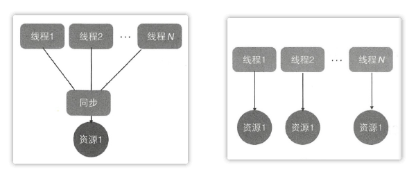

下面给出`ThreadLocal`的使用示例：

```java
public class ThreadLocalTest {
    static ThreadLocal<String> threadLocal = new ThreadLocal<>();

    public static void main(String[] args) {
        Thread t1 = new Thread(() -> {
            // 使用set()方法来设置当前线程所存的副本值
            threadLocal.set("thread one");
            // 使用get()方法来获取线程本地变量的副本值
            System.out.println(threadLocal.get());	// thread one
            // 使用remove()删除线程本地变量的副本值
            threadLocal.remove();
            System.out.println(threadLocal.get());	// null
        });

        Thread t2 = new Thread(() -> {
            // 两个线程本地变量互不影响
            threadLocal.set("thread two");
            System.out.println(threadLocal.get());	// thread two 
            threadLocal.remove();
            System.out.println(threadLocal.get());	// null
        });

        t1.start();
        t2.start();
    }
}
```


### 1.3 ThreadLocal 实现原理

首先看一下`ThreadLocal`类的类图结构：

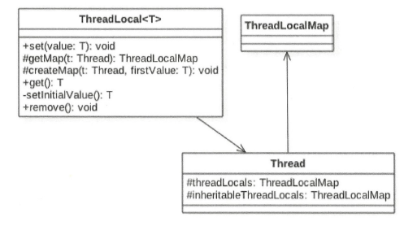

**Thread 类中有一个 `threadLocals` 和一 个 `inheritableThreadLocals`， 它们都
是 `ThreadLocalMap` 类型的变量**，而 `ThreadLocalMap` 是一个定制化的 `HashMap`，因此每个线程可以关联多个 `ThreadLocal` 变量。

```java
public class Thread implements Runnable {
    // ThreadLocalMap是ThreadLocal中的静态内部类
    // 与此线程有关的ThreadLocal值，由ThreadLocal类维护
    ThreadLocal.ThreadLocalMap threadLocals = null;

    // 与此线程有关的InheritableThreadLocal值，由InheritableThreadLocal类维护
    ThreadLocal.ThreadLocalMap inheritableThreadLocals = null;
}
```

在默认情况下，每个线程中的这两个变量都为 null，只有当前线程第一次调用 `ThreadLocal` 的 set() 或 get() 方法时才会创建它们。**其实每个线程的本地变量不是存放在 `ThreadLocal` 实例里面，而是存放在调用线程的 `threadLocals` 变量里面**。也就是说，`ThreadLocal` 类型的本地变量存放在具体的线程内存空间中。如果当前线程一直不终止， 那么这些本地变量会一直存在， 所以可能会造成内存泄漏，因此使用完毕后要记得调用 remove() 方法删除对应线程的本地变量。

```java
public class ThreadLocal<T> {
    public void set(T value) {
        Thread t = Thread.currentThread();
        // 将当前线程作为key，获取当前线程对应的threadLocals
        ThreadLocalMap map = getMap(t);
        if (map != null) {
            // key为ThreadLocal实例对象的引用，value为方法传递过来的值
            map.set(this, value);
        } else {
            // 第一次调用就创建当前线程对应的threadLocals
            createMap(t, value);
        }
    }
    
    ThreadLocalMap getMap(Thread t) {
        return t.threadLocals;
    }
    
    void createMap(Thread t, T firstValue) {
        t.threadLocals = new ThreadLocalMap(this, firstValue);
    }
    // ...
}
```


### 1.4 ThreadLocal 内存泄漏

`ThreadLocalMap` 中使用的 key 为 `ThreadLocal` 的弱引用，而 value 是强引用。所以，如果 `ThreadLocal` 没有被外部强引用的情况下，在垃圾回收的时候 key 会被清理掉，而 value 不会被清理掉。这样一来，`ThreadLocalMap` 中就会出现 key 为 null 的 Entry。假如我们不做任何措施的话，value 永远无法被 GC 回收，这个时候就可能产生内存泄露。

```java
	static class ThreadLocalMap {
        static class Entry extends WeakReference<ThreadLocal<?>> {
            Object value;

            Entry(ThreadLocal<?> k, Object v) {
                super(k);	// key为弱引用（WeakReference）
                value = v;	// value默认为强引用
            }
        }
	}
```

其实 `ThreadLocalMap` 已经考虑了这种情况，在调用 `set()`、`get()`、`remove()` 方法的时候，会找一些时机清理掉 key 为 null 的 Entry，但是这些清理不是必须发生的。因此在使用完 `ThreadLocal`后，最好还是手动在 try-finally 块中调用`remove()`方法，防止发生内存泄漏。


### 1.5 InheritableThreadLocal 类

 `ThreadLocal` 是不支持继承的，即同一个 `ThreadLocal` 变量在父线程中被设置值后， 在子线程中是获取不到的，根据上面的介绍，这应该是正常现象，因为它们是不同的线程。那么有没有办法让**子线程能访问到父线程中的设置的本地变量**? `inheritableThreadLocal` 就可以解决这个问题，它继承自 `ThreadLocal` ，并重写了其中的 3 个方法。

```java
public class InheritableThreadLocal<T> extends ThreadLocal<T> {
    // 当父线程创建子线程时，构造函数会把父线程中inheritableThreadLocals变量里面的本地变量
    // 复制一份保存到子线程的inheritableThreadLocals变量里面，具体可查看Thread类的默认构造函数
    protected T childValue(T parentValue) {
        return parentValue;
    }

    // 当调用get()方法时，获取的是inheritableThreadLocals，而不再是threadLocals
    ThreadLocalMap getMap(Thread t) {
       return t.inheritableThreadLocals;
    }

    // 当第一次调用set()方法时，创建的是当前线程的inheritableThreadLocals变量的实例，而不再是threadLocals
    void createMap(Thread t, T firstValue) {
        t.inheritableThreadLocals = new ThreadLocalMap(this, firstValue);
    }
}
```


## 2. ThreadLocalRandom

### 2.1 伪共享

#### 2.1.1 什么是伪共享

为了解决主存与CPU之间的速度差问题，会在CPU与主存之间添加一级或多级高速缓冲存储器（Cache）。Cache 一般被集成到CPU内部，它是按行存储的，其中每一行称为一个 Cache 行。**Cache 行是 Cache 与主存进行数据交换的单位，其大小一般是 2 的幂次数字节**。

当 CPU 访问某个变量时，首先会去看 Cache 内是否有该变量，如果有则直接从中获取，否则就去主存中获取，然后把该变量所在内存区域的一个 Cache 行大小的内存复制到 Cache 中。由于存放到 Cache 行的是内存块而不是单个变量，所以可能会把多个变量存放到一个 Cache 行中。**当多个线程同时修改一个缓存行里面的多个变量时，由于同时只能有一个线程操作缓存行，所以相比将每个变量放到一个缓存行，性能会有所下降，这就是伪共享**。

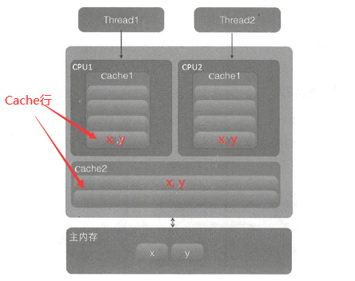

这也是为什么二维数组按行访问比按列访问快的原因。数组中元素的内存地址是连续的，当访问数组第一个元素时，会把其后的若干元素一块放入 Cache 行，这样按行访问时会在 Cache 行直接命中，而不会去读取内存。而按列访问是跳跃式的，它破坏了程序的局部性原理，由于 Cache 有容量限制，会导致 Cache 行中元素还未被读取就被替换掉了。

所以在单个线程下顺序修改一个缓存行中的多个变量，会充分利用程序的局部性原理，从而加速程序的运行。而在多线程下并发修改一个缓存行中的多个变量时就会竞争缓存行，从而降低程序运行性能。

#### 2.1.2 如何避免伪共享

在 JDK 8 之前一般都是通过**字节填充**的方式来避免该问题，也就是创建一个变量时，使用填充字段填充该变量所在的缓存行，这样就避免了将多个变量存放在同一个缓存行中，例如如下代码：

```java
public final static class FilledLong {
    // 假如缓存行为64字节，那么我们在FlledLong类里面填充了6个long类型的变量，
    // 每个long类型变量占用8字节，加上value变量的8字节总共56字节。
    // 由于类对象字节码的对象头占用8字节，所以一个FilledLong对象实际会占用64字节的内存，即一个缓存行
    public volatile 1ong value = 0L;
	public long p1, p2, p3, p4, p5, p6;
}
```

JDK 8 提供了一个 **sun.misc.Contended 注解**，用来解决伪共享问题。需要注意的是，默认情况下, @Contended 注解只用于 Java 核心类，比如 rt 包下的类。如果用户类路径下的类需要使用这个注解，则需要添加 JVM 参数: `-XX:-RestrictContended`，填充的宽度默认为128，要自定义宽度则可以设置`-XX:ContendedPaddingWidth`参数。将上面代码修改如下：

```java
@sun.misc.Contended
public final static class FilledLong {
	public volatile long value = 0L;
}
```

### 2.2 Random 类及其局限性

在 JDK 7 之前包括现在，java.util.Random 都是使用比较广泛的随机数生成工具类。随机数的生成需要一个默认的种子，这个种子其实是一个long类型的数字，可以在创建 Random 对象时通过构造函数指定，如果不指定则在默认构造函数内部生成一个默认的值。

```java
public class Random implements java.io.Serializable {
    public int nextInt(int bound) {
        if (bound <= 0)	// 参数检查
            throw new IllegalArgumentException(BadBound);
		
        // 1.根据老的种子生成新的种子
        int r = next(31);	
        // 2.根据新的种子计算随机数
        // ...
        return r;
    }
    
    protected int next(int bits) {
        long oldseed, nextseed;
        AtomicLong seed = this.seed;
        do {
            oldseed = seed.get();	// 获取当前原子变量种子的值
            nextseed = (oldseed * multiplier + addend) & mask;	// 计算新种子
        } while (!seed.compareAndSet(oldseed, nextseed));	// CAS操作
        return (int)(nextseed >>> (48 - bits));
    }
}
```

新的随机数的生成需要两个步骤：①根据老的种子生成新的种子，可以抽象为 seed = f(seed)，其中 f 是一个固定的函数；②根据新的种子来计算新的随机数，可以抽象为 g(seed, bound)，其中 g 也是一个固定的函数。

在单线程下每次调用 `nextInt()` 方法时，步骤①可以保证随机数产生的随机性。但是在多线程下，多个线程可能都拿到同一个老的种子去计算生成新的种子，导致新种子是一样的，由于步骤②算法固定，所以多个线程会产生相同的随机值。**因此步骤①要保证原子性，Random 函数使用一个原子变量达到了这个效果**。CAS 操作保证只有一个线程可以更新老的种子为新的，失败的线程会通过循环重新获取更新后的种子作为当前种子去计算新的种子，这就解决了上面提到的问题，保证了随机数的随机性。但是 **CAS 操作会造成大量线程进行自旋重试，降低并发性**。

### 2.3 ThreadLocalRandom 实现原理

为了弥补多线程高并发情况下 Random 的缺陷，在 JUC 包下新增了 `ThreadLocalRandom` 类。下面首先给出它的使用示例：

```java
public class RandomTest {
    public static void main(String[] args) {
        // 获取当前线程的随机数生成器
        ThreadLocalRandom random = ThreadLocalRandom.current();
        for (int i = 0; i < 10; i++) {
            System.out.println(random.nextInt(5));
        }
    }
}
```

 `ThreadLocalRandom` 实现与 `ThreadLocal` 类似，通过**让每个线程维护一个种子变量**，使得每个线程在生成随机数时都根据自己老的种子计算新的种子，再根据新种子计算随机数，这样就避免了多个线程对原子变量更新的竞争，大大提高了并发性。

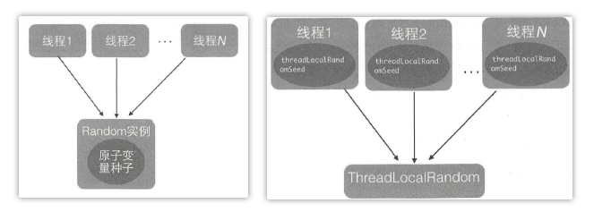

`ThreadLocalRandom` 类继承了 `Random` 类并重写了 nextInt() 方法，在 `ThreadLocalRandom` 类中并没有使用继承自 `Random` 类的原子性种子变量，**具体的种子存放在具体调用线程的`threadLocalRandomSeed` 变量里面**。`ThreadLocalRandom` 类似于 `ThreadLocal` 类，就是个工具类。当线程调用 `ThreadLocalRandom` 的 current() 方法时，`ThreadLocalRandom` 负责初始化调用线程的 `threadLocalRandomSeed` 变量，也就是初始化种子。需要注意的是，`threadLocalRandomSeed` 变量就是 Thread 类中的一个普通 long 变量，它并不是原子性变量。这是因为这个变量是线程级别的，所以根本不需要使用原子性变量。


## 3. Atomic 原子类

JUC（`java.util.concurrent.atomic`）包提供了一系列的原子性操作类，这些类都是使用非阻塞算法 CAS 实现的，相比使用锁实现原子性操作，在性能上有很大提高。

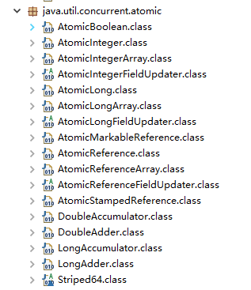

根据操作的数据类型和 JDK 版本，可以将 JUC 包中的原子类分为 5 类：

1. **基本类型**：`AtomicInteger`、`AtomicLong`、`AtomicBoolean `
2. **数组类型**：`AtomicIntegerArray`、`AtomicLongArray`、`AtomicReferenceArray `
3. **引用类型**：`AtomicReference`、`AtomicReferenceFieldUpdater``AtomicMarkableReference `
4. **对象的属性修改类型**：`AtomicIntegerFieldUpdater`、`AtomicLongFieldUpdater`、`AtomicStampedReference `、`AtomicMarkableReference`
5. **JDK 8 新增**：`LongAdder`、`LongAccumulator`、`DoubleAdder`

### 3.1 CAS 操作

CAS 即 Compare and Swap，其是 JDK 提供的非阻塞原子性操作，它通过硬件保证了比较—更新操作的原子性。JDK 里面的 `Unsafe` 类提供了一系列的 compareAndSwap* 方法。

关于 CAS 操作有个经典的 **ABA 问题**。假如线程Ⅰ使用 CAS 修改初始值为 A 的变量 X，那么线程Ⅰ首先去获取变量 X 的值（为 A），然后开始做其他事情。此时，线程Ⅱ使用 CAS 修改了变量 X 的值为 B，然后又使用 CAS 修改了变量 X 的值为 A。所以虽然线程Ⅰ执行 CAS 时 X 的值是 A，但是这个 A 已经不是线程Ⅰ获取时的 A 了。

ABA 问题的产生是因为**变量的状态值产生了环形转换**，就是变量的值可以从 A 到 B，然后再从 B 到 A。JDK中的 `AtomicStampedReference` 类给每个变量的状态值都配备了一个时间戳，从而避免了 ABA 问题的产生。

### 3.2 Unsafe 类

JDK 的 rt.jar 包中的 Unsafe 类提供了**硬件级别的原子性操作**，该类中的方法都是 native方法，使用 JNI 的方式访问本地 C++ 实现库。由于 **Unsafe 类可以直接操作内存**，这是不安全的，所以 JDK 开发组特意做了限制，不让开发人员在正规渠道使用 Unsafe 类（可以使用反射获取 Unsafe 类的实例），而是在 rt.jar 包下的核心类中使用 Unsafe 功能。

```java
public class UnsafeTest {
    // 使用getUnsafe()获取不到Unsafe的实例。查看源码可知：
    // 调用该方法时会判断UnsafeTest是否由BootstrapClassLoader加载，
    // 由于UnsafeTest是自定义类，由AppClassLoader加载，所以会抛出异常
	//    static final Unsafe unsafe = Unsafe.getUnsafe();
    static final Unsafe unsafe;

    // 记录变量state在类UnSafeTest中的偏移值
    static final long stateOffset;
    private volatile long state = 0;

    static {
        try {
            // 使用反射获取Unsafe的成员变量theUnsafe
            Field field = Unsafe.class.getDeclaredField ("theUnsafe");
            field.setAccessible (true) ;
            unsafe = (Unsafe) field.get(null);

            // 获取state变量在类TestUnSafe中的偏移值
            stateOffset = unsafe.objectFieldOffset(UnsafeTest.class.
                    getDeclaredField("state"));
        } catch (Exception ex) {
            System.out.println(ex.getLocalizedMessage());
            throw new Error(ex);
        }
    }

    public static void main(String[] args) {
        UnsafeTest test = new UnsafeTest();
        // 如果test对象中内存偏移量为stateOffset的state变量的值为0，则更新该值为1
        boolean b = unsafe.compareAndSwapInt(test, stateOffset, 0, 1);
        System.out.println(b);  // true
    }
}
```


### 3.3 原子性操作类

原子性操作类的原理类似，下面以  `AtomicLong` 为例进行介绍。

1. **AtomicLong 常用方法**

   ```java
   public final long get()	// 获取当前值
   public final long getAndSet(int newValue)	// 获取当前值，并设置新值
   public final long getAndIncrement()	// 获取当前值，并自增1
   public final long getAndDecrement() // 获取当前值，并自减1
   public final long getAndAdd(int delta)	// 获取当前值，并加上预期值
   boolean compareAndSet(int expect, int update)	// 如果原子变量中的value值等于expect预期值，则使用update值更新该值并返回true，否则返回false
   public final void lazySet(int newValue)	// 最终设置为newValue，使用lazySet设置之后可能导致其他线程在之后的一小段时间内还是可以读到旧值
   ```

2. **AtomicLong 源码分析**

   ```java
   public class AtomicLong extends Number implements java.io.Serializable {
       // 获取Unsafe实例，使用Unsafe.compareAndSwapLong进行更新
       private static final Unsafe unsafe = Unsafe.getUnsafe();
       // 存放变量value的偏移量
       private static final long valueOffset;
   
       // 判断JVM是否支持Long类型无锁CAS
       static final boolean VM_SUPPORTS_LONG_CAS = VMSupportsCS8();
       private static native boolean VMSupportsCS8();
   
       static {
           try {
               // 获取value在AtomicLong中的偏移量
               valueOffset = unsafe.objectFieldOffset
                   (AtomicLong.class.getDeclaredField("value"));
           } catch (Exception ex) { throw new Error(ex); }
       }
   
       // 实际变量值，volatile保证内存可见性
       private volatile long value;
   
       public AtomicLong(long initialValue) {
           value = initialValue;
       }
       
       // 调用unsafe方法，原始值+1，并返回原始值
       public final long getAndIncrement() {
           return unsafe.getAndAddLong(this, valueOffset, 1L);
       }
       // 调用unsafe方法，原始值-1，并返回原始值
       public final long getAndDecrement() {
           return unsafe.getAndAddLong(this, valueOffset, -1L);
       }
       // 调用unsafe方法，原始值+1，并返回递增后的值
       public final long incrementAndGet() {
           return unsafe.getAndAddLong(this, valueOffset, 1L) + 1L;
       }
       // 调用unsafe方法，原始值-1，并返回递减后的值
       public final long decrementAndGet() {
           return unsafe.getAndAddLong(this, valueOffset, -1L) - 1L;
       }
       
       // 内部仍然是调用unsafe.compareAndSwapLong实现
       public final boolean compareAndSet(long expect, long update) {
           return unsafe.compareAndSwapLong(this, valueOffset, expect, update);
       }
       // ...
   }
   ```

   ```java
   	// Unsafe类的getAndAddLong()源码
   	// 内部调用了compareAndSwapLong()，循环尝试进行设置，直至成功
   	public final long getAndAddLong(Object var1, long var2, long var4) {
           long var6;
           do {
               var6 = this.getLongVolatile(var1, var2);
           } while(!this.compareAndSwapLong(var1, var2, var6, var6 + var4));
   
           return var6;
       }
   ```

   总结：`AtomicLong` 内部使用 `Unsafe` 类来实现，主要利用 CAS + volatile + native 方法来保证原子操作，从而避免 synchronized 的高开销，执行效率大为提升。值得注意的是，value 是一个 volatile 变量，在内存中可见，因此 JVM 可以保证任何时刻任何线程总能拿到该变量的最新值。

3. **AtomicLong 与 synchronized  使用对比**

   ```java
   public class Test {
       private volatile long count = 0;
   
       // 若要线程安全执行count++，需要加锁synchronized
       public synchronized void increment() {
           count++;
       }
   
       public long getCount() {
           return count;
       }
   }
   ```

   ```java
   public class Test2 {
       private AtomicLong atomicLong = new AtomicLong();
   
       public void increment() {
           atomicLong.incrementAndGet();
       }
   
       // 使用AtomicLong之后，不需要加锁，也可以实现线程安全
       public long getCount() {
           return atomicLong.get();
       }
   }
   ```


### 3.4 LongAdder

在高并发情况下 `AtomicLong` 仍然存在性能问题，由于大量线程会同时去竞争更新同一个原子变量，但只有一个线程的 CAS 操作会成功，这就造成大量线程竞争失败后，会通过无限循环不断进行自旋尝试 CAS 操作，浪费 CPU 资源。

因此 JDK 8 新增了一个原子性递增或者递减类 `LongAdder` 用来克服在高并发下使用 `AtomicLong` 的缺点。该类通过内部 cells 数组分担了高井发下多线程同时对一个原子变量进行更新时的竞争量，让多个线程可以同时对 cells 数组里面的元素进行并行的更新操作。另外，数组元素 Cell 使用 @sun.misc.Contended 注解进行修饰，这避免了cells 数组内多个原子变量被放入同一个缓存行，也就是避免了伪共享，对性能也是一个提升。

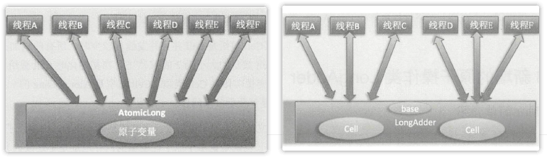

### 3.5 LongAccumulator

LongAdder 类是LongAccumulator 类的一个特例，LongAccumulator 比LongAdder的功能更强大，可以让用户自定义累加规则。例如下面的构造函数：

```java
public LongAccumulator(LongBinaryOperator accumulatorFunction, long identity) {
    this.function = accumulatorFunction;	// 自定义的双目运算器
    base = this.identity = identity;	// 初始值
}
```

LongAccumulator 相比于LongAdder，可以为累加器提供非 0 的初始值，后者只能提供默认的 0 值。另外，前者还可以指定累加规则，比如不进行累加而进行相乘，只需要在构造 LongAccumulator 时传入自定义的双目运算器即可，后者则内置累加的规则。


## 4. 并发包中锁原理

### 4.1 AQS 抽象队列同步器

#### 4.1.1 AQS 实现原理

AQS 的全称 `AbstractQueuedSynchronizer`（抽象队列同步器），它是实现同步器的基础组件，并发包中锁的底层就是使用 AQS 实现的，诸如 `ReentrantLock`，`ReentrantReadWriteLock`，`Semaphore`，`CountDownLatch`，`SynchronousQueue`，`FutureTask` 等等皆是基于 AQS 的。

AQS 是一个 **FIFO 的双向队列**，其内部通过节点 head 和 tail 记录队首和队尾元素，**队列元素的类型为 Node**。AQS 中还维持了一个**状态信息 state**，对不同的同步器实现，它的含义是不一样的。

* 对于`ReentrantLock` 的实现来说， state 可以用来表示当前线程获取锁的可重入次数；
* 对于读写锁 `ReentrantReadWriteLock` 来说， state 的高16 位表示读状态，也就是获取该读锁的次数，低16 位表示获取到写锁的线程的可重入次数；
* 对于 `semaphore` 来说， state 用来表示当前可用信号的个数；
* 对于 `CountDownlatch` 来说，state 用来表示计数器当前的值。

```java
public abstract class AbstractQueuedSynchronizer extends AbstractOwnableSynchronizer
    implements java.io.Serializable {
    // AQS队列的队首元素
    private transient volatile Node head;
    // AQS队列的队尾元素
    private transient volatile Node tail;
    
	// 线程状态信息，使用volatile保证内存可见性 	
	private volatile int state;

    protected final int getState() {
        return state;
    }

    protected final void setState(int newState) {
        state = newState;
    }

	// 使用CAS操作对state进行修改
    protected final boolean compareAndSetState(int expect, int update) {
        return unsafe.compareAndSwapInt(this, stateOffset, expect, update);
    }
    // ...
}
```

**Node 类是 AQS 的内部类**，它是 AQS 队列以及条件队列（condition queues）的元素节点类型。

```java
	static final class Node {
        // 标记线程是因获取“共享资源”时被阻塞挂起放入AQS队列的
        static final Node SHARED = new Node();
        // 标记线程是因获取“独占资源”时被阻塞挂起放入AQS队列的
        static final Node EXCLUSIVE = null;

        // waitStatus为该值表示：线程被取消
        static final int CANCELLED =  1;
        // waitStatus为该值表示：线程需要被唤醒
        static final int SIGNAL    = -1;
        // waitStatus为该值表示：线程在条件队列里面等待
        static final int CONDITION = -2;
        // waitStatus为该值表示：释放共享资源时需要通知其它节点
        static final int PROPAGATE = -3;

        // 记录当前线程等待状态，一般通过CAS操作进行修改
        volatile int waitStatus;

        // 前驱节点
        volatile Node prev;
        // 后续节点
        volatile Node next;

        // 存在进入AQS队列的线程，构造时初始化，使用后置空
        volatile Thread thread;

        // 条件队列的后继节点
        Node nextWaiter;
        // ...
    }
```

**ConditionObject 也是 AQS 的内部类**，用来结合锁实现线程同步。它是条件变量，对应一个**单向链表队列**，其内部通过节点 firstWaiter 和 lastWaiter 记录队首和队尾元素，**队列元素的类型为 Node**，用于存放调用条件变量的 `await()` 方法后被阻塞的进程。

**类似于 notify() 和 wait() 是配合 synchronized 内置锁实现线程间同步的，条件变量的 signal() 和 await() 方法也是用来配合锁（使用 AQS 实现的锁）实现线程间同步的**。它们的不同在于，synchronized 同时只能与一个共享变量的 notify() 或 wait() 方法实现同步，而 AQS 的一个锁可以对应多个条件变量。注意，在调用条件变量的 signal() 和 await() 方法前必须先获取条件变量对应的锁。

```java
	public class ConditionObject implements Condition, java.io.Serializable {
        // 条件队列的队首元素
        private transient Node firstWaiter;
        // 条件队列的队尾元素
        private transient Node lastWaiter;
       
        // 必须先调用锁的lock()方法获取锁，下同
        public final void await() throws InterruptedException {
            if (Thread.interrupted())
                throw new InterruptedException();
            // 创建一个类型为Node.CONDITION的Node节点，并插入到条件队列的尾部
            Node node = addConditionWaiter();
            // 释放当前线程获取的锁，即会操作state变量
            int savedState = fullyRelease(node);
            int interruptMode = 0;
            // 调用park方法阻塞挂起当前线程
            while (!isOnSyncQueue(node)) {
                LockSupport.park(this);
                if ((interruptMode = checkInterruptWhileWaiting(node)) != 0)
                    break;
            }
            // ...
        }
        
        public final void signal() {
            if (!isHeldExclusively())
                throw new IllegalMonitorStateException();
            Node first = firstWaiter;
            if (first != null)
                // 将条件队列头元素移动到AQS队列，激活该线程
                doSignal(first);
        }
        
        // ...
    }
```

**总结**：**一个锁对应一个 AQS 阻塞队列，对应多个条件变量， 每个条件变量有自己的一个条件队列**。

1. 当多个线程同时调用 `lock.lock()` 方法获取锁时，只有一个线程获取到了锁，其他线程会被转换为 Node 节点插入到 lock 锁对应的 AQS 阻塞队列里面，并做自旋 CAS 尝试获取锁。
2. 如果获取到锁的线程又调用了对应的条件变量的 `await()` 方法，则该线程会释放获取到的锁，并被转换为 Node 节点插入到条件变量对应的条件队列里面。
3. 这时候因为调用 `lock.lock()` 方法被阻塞到 AQS 队列里面的一个线程会获取到被释放的锁，如果该线程也调用了条件变量的 await() 方法则该线程也会被放入条件变量的条件队列里面。
4. 当另外一个线程调用条件变量的 `signal()` 或者 `signalAll()` 方法时， 会把条件队列里面的一个或者全部 Node 节点移动到 AQS 的阻塞队列里面， 等待时机获取锁。

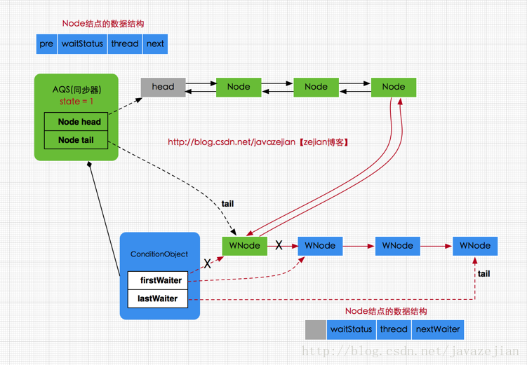


#### 4.1.2 AQS 资源共享方式

对于 AQS 来说，**线程同步的关键是对状态值 state 进行操作**。根据 state 是否属于一个线程，操作 state 的方式分为**独占方式和共享方式**。

1. **独占方式**

   **使用独占方式获取的资源是与具体线程绑定的**，就是说如果一个线程获取到了资源，就会标记是这个线程获取到了，其他线程再尝试操作 state 获取资源时会发现当前该资源不是自己持有的，就会在获取失败后被阻塞。

   比如独占锁 `ReentrantLock` 的实现， 当一个线程获取了 `ReentrantLock` 的锁后，在 AQS 内部会首先使用 CAS 操作把 state 状态值从 0 变为 1 ，然后设置当前锁的持有者为当前线程，当该线程再次获取锁时发现它就是锁的持有者，则会把状态值从 1 变为2 ，也就是设置可重入次数，而当另外一个线程获取锁时发现自己并不是该锁的持有者就会被放入 AQS 阻塞队列后挂起。

   在独占方式下， 获取与释放资源的流程如下：

   * **当一个线程调用 acquire() 方法获取独占资源时，会首先使用 tryAcquire() 方法尝试获取资源**， 具体是设置状态变量 state 的值，成功则直接返回，失败则将当前线程封装为类型为 Node. EXCLUSIVE 的 Node 节点后插入到 AQS 阻塞队列的尾部，并调用 LockSupport.park(this) 方法挂起自己。
   * **当一个线程调用 release() 方法时，会首先使用 tryRelease() 尝试释放资源**，这里是设置状态变量 state 的值，然后调用 LockSupport.unpark(thread) 方法激活 AQS 队列里面被阻塞的一个线程。被激活的线程则使用 tryAcquire() 尝试，看当前状态变量 state 的值是否能满足自己的需要，满足则该线程被激活，然后继续向下运行，否则还是会被放入 AQS 队列并被挂起。

2. **共享方式**

   **共享方式的资源与具体线程是不相关的**，当多个线程去请求资源时通过 CAS 方式竞争获取资源，当一个线程获取到了资源后，另外一个线程再次去获取时如果当前资源还能满足它的需要，则当前线程只需要使用CAS 方式进行获取即可。

   比如 `Semaphore` 信号量（操作系统 PV 操作）， 当一个线程通过 acquire() 方法获取信号量时，会首先看当前信号量个数是否满足需要， 不满足则把当前线程放入阻塞队列，如果满足则通过自旋 CAS 获取信号量。

   在共享方式下，获取与释放资源的流程如下：

   * **当一个线程调用 acquireShared() 获取共享资源时，会首先使用 trγacquireShared() 尝试获取资源**， 具体是设置状态变量 state 的值，成功则直接返回，失败则将当前线程封装为类型为Node.SHARED 的 Node 节点后插入到 AQS 阻塞队列的尾部，并使用 LockSupport.park(this) 方法挂起自己。
   * **当一个线程调用 releaseShared() 时，会首先使用 tryReleaseShared() 尝试释放资源**，这里是设置状态变量state 的值，然后使用 LockSupport.unpark(thread) 激活 AQS 队列里面被阻塞的一个线程。被激活的线程则使用 trγacquireShared() 查看当前状态变量 state 的值是否能满足自己的需要，满足则该线程被撤活，然后继续向下运行，否则还是会被放入 AQS 队列并被挂起。

最后说明一下，acquire() 和 acquireInterruptibly()、acquireShared() 和 acquireSharedInterruptibly() 之间的区别：

1. **不带 Intenuptibly 关键字的方法的不对中断进行响应**，也就是线程在调用该方法获取资源或者获取资源失败被挂起时，其他线程中断了该线程， 那么该线程不会因为被中断而抛出异常，它还是继续获取资源或者被挂起，即不对中断进行响应，忽略中断。
2. **带 Intenuptibly 关键字的方法要对中断进行l响应**，也就是线程在调用该方法获取资源时或者获取资源失败被挂起时，其他线程中断了该线程，那么该线程会抛出 InterruptedException 异常而返回。


#### 4.1.3 AQS 模板模式

```java
protected boolean tryAcquire(int arg);	// 独占方式：尝试获取资源
protected boolean tryRelease(int arg);	// 独占方式：尝试释放资源
protected int tryAcquireShared(int arg);	// 共享方式：尝试获取资源
protected boolean tryReleaseShared(int arg);	// 共享方式：尝试释放资源
protected boolean isHeldExclusively();	// 判断锁是被当前线程独占还是共享。该方法只会在ConditionObject类内部被调用，因此当条件变量没有被使用时不需要重写
```

以上 5 个方法在 AQS 类中默认都抛出`UnsupportedOperationException`异常，这意味着它们必须由具体的子类来实现，因此子类需要自定义 state 状态值的含义，以及根据具体场景使用 CAS 操作尝试修改 state。这就是模板模式。

> 模板模式又叫模板方法模式，它在一个抽象类中公开定义了执行的方法/模板，它的子类可以按需要重写方法实现，但调用将以抽象类中定义的方式进行。也就是说，模板模式**定义一个操作的算法骨架，而将一些步骤延迟到子类中，使得子类可以不改变算法结构，就可以重定义某些特定步骤**。


### 4.2 独占锁 ReentrantLock

ReentrantLock 是可重入的独占锁，同时只能有一个线程可以获取该锁，其他获取该锁的线程会被阻塞而被放入该锁的 AQS 阻塞队列里面。

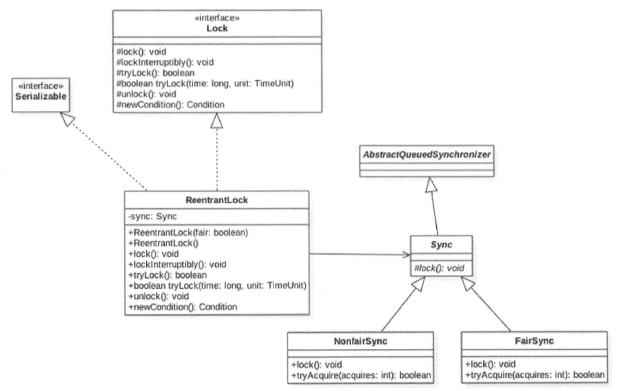

从类图可以看到， ReentrantLock 最终还是使用 AQS 来实现的，并且根据参数来决定其内部是一个**公平还是非公平锁，默认是非公平锁**。其中 Sync 类直接继承自 AQS ，它的子类 NonfairSync 和 FairSync 分别实现了获取锁的非公平与公平策略。

```java
	private final Sync sync;
	
	public ReentrantLock() {
        sync = new NonfairSync();
    }

    public ReentrantLock(boolean fair) {
        sync = fair ? new FairSync() : new NonfairSync();
    }
```

在这里， **AQS 的 state 状态值表示线程获取该锁的可重入次数**， 在默认情况下，state 的值为 0 表示当前锁没有被任何线程持有。当一个线程第一次获取该锁时会尝试使用 CAS 设置state 的值为 1，如果 CAS 成功则当前线程获取了该锁，然后记录该锁的持有者为当前线程。在该线程没有释放锁的情况下第二次获取该锁后，状态值被设置为 2 ， 这就是可重入次数。在该线程释放该锁时，会尝试使用 CAS 让状态值减1 ， 如果减 1 后状态值为 0，则当前线程释放该锁。

```java
public void lock();	// 获取锁
public void lockInterruptibly();	// 获取锁时对中断进行响应
public boolean tryLock();	// 尝试获取锁，获取到锁返回true，否则false。该方法不会引起当前线程阻塞
public boolean tryLock(long timeout, TimeUnit unit);	// 设置超时时间，尝试获取锁
public void unlock();	// 释放锁
```

以上是 ReentrantLock 的常用方法，下面着重介绍 lock() 方法是如何实现非公公平锁与公平锁的。

```java
	// 委托给Sync类，根据构造函数选择Sync的实现是NonfairSync还是FairSync	
	public void lock() {
        sync.lock();
    }	
```

```java
	// 静态内部类，非公平锁
	static final class NonfairSync extends Sync {
        private static final long serialVersionUID = 7316153563782823691L;

        final void lock() {
            if (compareAndSetState(0, 1))	// CAS设置状态值，尝试将state值从0设为1
                setExclusiveOwnerThread(Thread.currentThread());	// 设置锁持有者是当前线程
            else	// CAS失败则调用AQS的acquire方法，内部调用tryAcquire方法
                acquire(1);
        }

        protected final boolean tryAcquire(int acquires) {
            return nonfairTryAcquire(acquires);	// acquires=1
        }
    }

	// 该方法位于静态内部类Sync中，由于NonfairSync继承自Sync，所以可以直接调用
	final boolean nonfairTryAcquire(int acquires) {
            final Thread current = Thread.currentThread();
            int c = getState();
        	// 若当前AQS的state状态值为0，说明锁空闲，再次尝试CAS获取锁
            if (c == 0) {	
                if (compareAndSetState(0, acquires)) {
                    setExclusiveOwnerThread(current);
                    return true;
                }
            }	// 不为0说明锁被某个线程持有，判断当前线程是否是该锁持有者
            else if (current == getExclusiveOwnerThread()) {
                int nextc = c + acquires;	// 状态值加1，acquires由参数传入
                if (nextc < 0) // 可重入次数溢出
                    throw new Error("Maximum lock count exceeded");
                setState(nextc);
                return true;
            }
            return false;	// 当前线程不是该锁持有者，返回false，会被放入AQS阻塞队列
        }
```

```java
	// 静态内部类，公平锁
	static final class FairSync extends Sync {
        private static final long serialVersionUID = -3000897897090466540L;

        final void lock() {
            acquire(1);
        }

        protected final boolean tryAcquire(int acquires) {
            final Thread current = Thread.currentThread();
            int c = getState();
            if (c == 0) {
                // 公平性策略hasQueuedPredecessors()：如果当前线程节点有前驱节点则返回true，
                // 否则如果当前AQS队列为空或当前线程节点是AQS的第一个节点则返回false
                if (!hasQueuedPredecessors() &&
                    compareAndSetState(0, acquires)) {
                    setExclusiveOwnerThread(current);
                    return true;
                }
            }
            else if (current == getExclusiveOwnerThread()) {
                int nextc = c + acquires;
                if (nextc < 0)
                    throw new Error("Maximum lock count exceeded");
                setState(nextc);
                return true;
            }
            return false;
        }
    }
```

**总结**：公平锁和非公平锁只有两处不同：

1. 非公平锁在调用 lock 后，**首先就会调用 CAS 进行一次抢锁**，如果这个时候恰巧锁没有被占用，那么直接就获取到锁返回了。
2. 非公平锁在 CAS 失败后，和公平锁一样都会进入到 tryAcquire 方法，**在 tryAcquire 方法中，如果发现锁这个时候被释放了（state == 0），非公平锁会直接 CAS 抢锁**，但是公平锁会判断等待队列是否有线程处于等待状态，如果有则不去抢锁，乖乖排到后面。

公平锁和非公平锁就这两点区别，如果这两次 CAS 都不成功，那么后面非公平锁和公平锁是一样的，都要进入到阻塞队列等待唤醒。相对来说，非公平锁会有更好的性能，因为它的吞吐量比较大。当然，非公平锁让获取锁的时间变得更加不确定，可能会导致在阻塞队列中的线程长期处于饥饿状态。


### 4.3 读写锁 ReentrantReadWriteLock

由于 ReentrantLock 是独占锁， 某时只有一个线程可以获取该锁，而实际中会有写少读多的场景，显然 ReentrantLock 满足不了这个需求。而 **ReentrantReadWriteLock 采用读写分离的策略，允许多个线程可以同时获取读锁**。

读写锁的实现与 ReentrantLock 类似，其内部维护了一个 ReadLock 和一个 WriteLock ，它们依赖 Sync 实现具体功能。而 Sync 继承自 AQS ，因此也提供了公平和非公平的实现。在这里，**state 状态值的高16 位表示读状态，也就是获取到读锁的次数；使用低16 位表示获取到写锁的线程的可重入次数**。

下面展示一个使用读写锁的例子：

```java
public class ReentrantLockList {
    private ArrayList<String> list = new ArrayList<>();	// 线程不安全的list
    
    private final ReentrantReadWriteLock lock = new ReentrantReadWriteLock();
    private final Lock readLock = lock.readLock();
    private final Lock writeLock = lock.writeLock();

    public void add(String e) {
        writeLock.lock();
        try {
            list.add(e);
        } finally {
            // 使用finally是为了防止发生异常而没有释放锁
            writeLock.unlock();
        }
    }

    public String get(int index) {
        readLock.lock();
        try {
            return list.get(index);
        } finally {
            readLock.unlock();
        }
    }
}
```


## 5. 线程池

### 5.1 线程池简介

池化技术已经屡见不鲜了，它的思想主要是为了减少每次获取资源的消耗，提高对资源的利用率。线程池、数据库连接池、Http 连接池等都是对这个思想的应用。这里**使用线程池的好处有**：

- **降低资源消耗**。通过重复利用已创建的线程降低线程创建和销毁造成的消耗。
- **提高响应速度**。当任务到达时，任务可以不需要的等到线程创建就能立即执行。
- **提高线程的可管理性**。线程是稀缺资源，如果无限制的创建，不仅会消耗系统资源，还会降低系统的稳定性，使用线程池可以进行统一的分配，调优和监控。

下面先看一下与线程池有关的类图：

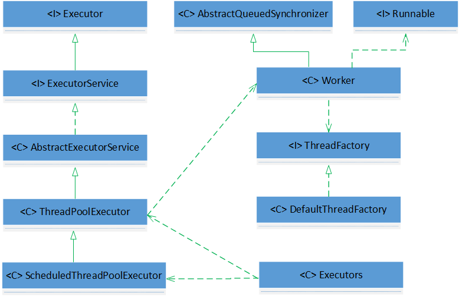

`Executors` 是一个工具类，里面提供了好多静态方法，这些方法根据用户选择返回不同的线程池实例。`ThreadPoolExecutor` 继承了 `AbstractExecutorService` ，成员变量 ctl 是一个 Integer 的原子变量，用来**记录线程池状态和线程池中线程个数**，类似于 `ReentrantReadWriteLock` 使用一个变量来保存两种信息。线程池状态含义（5种）如下：

* **RUNNING**：接收新任务并且处理阻塞队列里的任务；

* **SHUTDOWN**：拒绝新任务但是处理阻塞队列里的任务；

* **STOP**：拒绝新任务并且抛弃阻塞队列里的任务，同时会中断正在处理的任务；
* **TIDYING**：所有任务都执行完（包含阻塞队列里的任务）后当前线程池活动线程数为0，将要调用 terminated 方法；
* **TERMINATED**：终止状态，terminated 方法调用完成以后的状态。


### 5.2 ThreadPoolExecutor

#### 5.2.1 线程池参数

`ThreadPoolExecutor` 类提供了四个构造方法，我们来看最长的那个，其余三个都是在这个构造方法的基础上产生的，只不过给定了某些默认的参数。

```java
public ThreadPoolExecutor(int corePoolSize,	// 线程池核心线程数
                              int maximumPoolSize,	// 线程池最大线程个数
                              long keepAliveTime,	// 非核心线程闲置超时时长
                              TimeUnit unit,	// keepAliveTime的单位
                              BlockingQueue<Runnable> workQueue,	// 任务队列
                              ThreadFactory threadFactory,	// 创建线程的工厂
                              RejectedExecutionHandler handler) 	//  饱和策略
```

1. **corePoolSize**：线程池核心线程数。在创建完线程池之后，核心线程先不创建，在接到任务之后才会创建核心线程。并且会**一直存在于线程池中（即使这个线程啥都不干）**，有任务要执行时，如果核心线程没有被占用，会优先用核心线程执行任务。数量一般情况下设置为CPU核数的二倍即可。
2. **maximumPoolSize**：线程池最大线程个数。其中**线程总数 = 核心线程数 + 非核心线程数**，非核心线程简单理解，就是核心线程都被占用，但还有任务要做，就创建非核心线程。
3. **keepAliveTime**：非核心线程闲置超时时长。当线程池中线程的数量大于核心线程数，并且是闲置状态（任务少，线程多），则这些**闲置的线程在等待超过了 `keepAliveTime` 会被回收销毁**，但是核心线程会保留。
4. **unit**： keepAliveTime 的单位。是一个枚举类型，其包括：DAYS（天）、HOURS（时）、MINUTES（分）、SECONDS（秒）、MILLISECONDS（毫秒）、MICROSECONDS（微秒）、NANOSECONDS（纳秒）。
5. **workQueue**：保存等待执行任务的阻塞队列。默认情况下，任务进来之后先分配给核心线程执行，核心线程如果都被占用，并不会立刻开启非核心线程执行任务，而是将任务插入任务队列等待执行，核心线程会从任务队列取任务来执行，**任务队列可以设置最大值，一旦插入的任务足够多，达到最大值，才会创建非核心线程执行任务**。常见的 workQueue 有四种：
   * `SynchronousQueue`：这个队列接收到任务时，会直接提交给线程处理，而不保留它。如果所有线程都在工作，则新建一个线程来处理这个任务。因此，为了保证不出现“线程数达到最大线程数而不能新建线程”的错误，使用该类型队列时，maximumPoolSize 一般指定为 Integer.MAX_VALUE，即无限大。
   * `LinkedBlockingQueue`：这个队列接收到任务时，如果当前已经创建的核心线程数小于 corePoolSize，则新建核心线程处理任务；否则进入队列等待。因此，所有超过核心线程数的任务都会被添加到队列中，这也就导致了 maximumPoolSize 设定失效。
   * `ArrayBlockingQueue`：可以限定队列的长度，接收到任务时，如果没有达到 corePoolSize，则新建核心线程执行任务；如果达到了，则入队等候；如果队列已满，则新建非核心线程执行任务。又如果总线程数达到了 maximumPoolSize，且队列已满，则会发生错误或执行饱和策略。
   * `DelayQueue`：队列内元素必须实现 Delayed 接口，这意味着传进去的任务必须先实现 Delayed 接口。这个队列接收到任务时，首先先入队，只有达到了指定的延时时间，才会执行任务。
6. **threadFactory**：创建线程的工厂。可以用线程工厂给每个创建出来的线程设置名字，一般情况下无须设置该参数。
7. **handler**：饱和策略。这是**当任务队列和线程池都满了时所采取的应对策略**，有如下 4 种：
   * `AbordPolicy`：**默认策略**，无法处理新任务，并抛出 RejectedExecutionException 异常；
   * `CallerRunsPolicy`：用调用者所在的线程来处理任务，也就是直接在调用`execute`方法的线程中运行被拒绝的任务，如果执行程序已关闭，则会丢弃该任务。因此这种策略会降低对于新任务提交速度，影响程序的整体性能。另外，这个策略喜欢增加队列容量，如果你的应用程序可以承受此延迟并且不能丢弃任何一个任务请求的话，可以选择该策略；
   * `DiscardPolicy`：默默丢弃，不抛出异常；
   * `DiscardOldestPolicy`：丢弃队列中最早的未处理的任务，执行当前的任务。

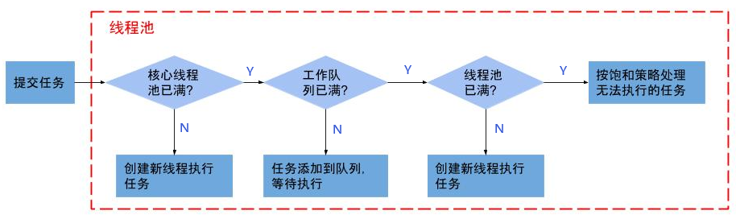

#### 5.2.2 线程池类型

`Executors` 类为我们提供了 4 种线程池 `FixedThreadPool`、`CachedThreadPool`、`SingleThreadExecutor`、`ScheduledThreadPool`，几乎可以满足我们大部分的需要了：

1. **FixedThreadPool：固定线程数的线程池**。以下方法创建一个核心线程个数和最大线程个数都为 nThreads 的线程池，也就是**只有固定数量的核心线程，不存在非核心线程**；keepAliveTime = 0L 说明只要线程个数比核心线程个数多并且当前空闲则回收；任务队列采用的是 `LinkedBlockingQueue`。

   ```java
   public static ExecutorService newFixedThreadPool(int nThreads) {
       return new ThreadPoolExecutor(nThreads, nThreads,
                                     0L, TimeUnit.MILLISECONDS,
                                     new LinkedBlockingQueue<Runnable>());
   }
   ```

2. **CachedThreadPool：根据需要创建线程的线程池**。以下方法创建一个核心线程个数为 0 ，最大线程个数为 Integer.MAX_VALUE 的线程池，也就是**没有核心线程，全部都是非核心线程，且没有上限**；keeyAliveTime = 60L 说明只要当前线程在 60 秒内空闲则回收；任务队列采用的是 `SynchronousQueue`，因此加入同步队列的任务会被马上执行，同步队列里面最多只有一个任务。

   ```java
   public static ExecutorService newCachedThreadPool() {
       return new ThreadPoolExecutor(0, Integer.MAX_VALUE,
                                     60L, TimeUnit.SECONDS,
                                     new SynchronousQueue<Runnable>());
   }
   ```

3. **SingleThreadExecutor：使用单个线程工作的线程池**。以下方法创建一个核心线程个数和最大线程个数都为  1 的线程池，也就是**只有一个核心线程**；任务队列采用的是 `LinkedBlockingQueue`，先进先出保证了任务按序执行。

   ```java
   public static ExecutorService newSingleThreadExecutor() {
       return new FinalizableDelegatedExecutorService
           (new ThreadPoolExecutor(1, 1,
                                   0L, TimeUnit.MILLISECONDS,
                                   new LinkedBlockingQueue<Runnable>()));
   }
   ```

4. **ScheduledThreadPool：能实现定时和周期性任务的线程池**。以下方法创建一个核心线程个数为  corePoolSize，最大线程个数为 Integer.MAX_VALUE 的线程池；任务队列采用的是 `DelayedWorkQueue`，由于该任务队列是无解的，所以 maximumPoolSize 参数无效。

   ```java
   public static ScheduledExecutorService newScheduledThreadPool(int corePoolSize) {
       return new ScheduledThreadPoolExecutor(corePoolSize);
   }
   
   // ScheduledThreadPoolExecutor类的构造方法
   public ScheduledThreadPoolExecutor(int corePoolSize) {
       super(corePoolSize, Integer.MAX_VALUE,
             DEFAULT_KEEPALIVE_MILLIS, MILLISECONDS,
             new DelayedWorkQueue());
   }
   ```

在《阿里巴巴 Java 开发手册》的“并发处理”章节，明确指出线程资源必须通过线程池提供，不允许在应用中自行显示创建线程。

> 使用线程池的好处是减少在创建和销毁线程上所消耗的时间以及系统资源开销，解决资源不足的问题。如果不使用线程池，有可能会造成系统创建大量同类线程而导致消耗完内存或者“过度切换”的问题。

另外《阿里巴巴 Java 开发手册》中强制线程池不允许使用 Executors 去创建，而是通过 `ThreadPoolExecutor` 构造函数的方式，这样的处理方式让写的同学更加明确线程池的运行规则，规避资源耗尽的风险。

> Executors 返回的线程池对象的弊端如下：
>
> - `FixedThreadPool` 和 `SingleThreadExecutor` ： 允许请求的队列长度为 Integer.MAX_VALUE，可能堆积大量的请求，从而导致 OOM。
> - `CachedThreadPool` 和 `ScheduledThreadPool` ：允许创建的线程数量为 Integer.MAX_VALUE ，可能会创建大量线程，从而导致 OOM。


#### 5.2.3 线程池使用示例

线程池的使用一般有如下 3 步：

1. 主线程首先要创建实现 `Runnable` 或者 `Callable` 接口的任务对象；
2. 把创建完成的实现 `Runnable`/`Callable` 接口的对象直接交给 `ExecutorService` 执行。如果执行的是 `submit()` 方法，`ExecutorService` 将返回一个实现 `Future` 接口的对象；
3. 主线程可以执行 `FutureTask.get()` 方法来等待任务执行完成，主线程也可以执行 `FutureTask.cancel()`来取消此任务的执行。

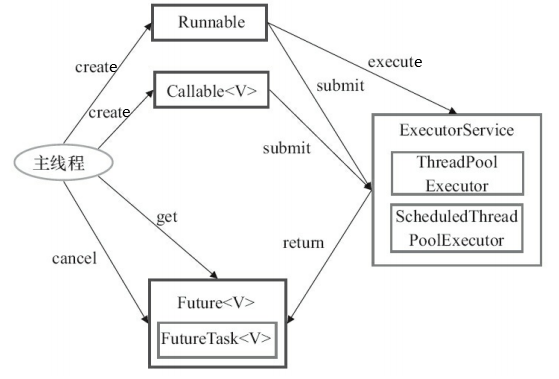

我们这里以阿里巴巴推荐的方式：使用 `ThreadPoolExecutor` 构造函数自定义参数来创建线程池。

```java
public class ThreadPoolExecutorDemo {
    private static final int CORE_POOL_SIZE = 5;	// 核心线程数为5
    private static final int MAX_POOL_SIZE = 10;	// 最大线程数为10
    private static final int QUEUE_CAPACITY = 100;	// 等待队列容量为100
    private static final Long KEEP_ALIVE_TIME = 1L;	// 等待时间为1秒

    public static void main(String[] args) {
        ThreadPoolExecutor executor = new ThreadPoolExecutor(
                CORE_POOL_SIZE, MAX_POOL_SIZE, KEEP_ALIVE_TIME, TimeUnit.SECONDS,
                new ArrayBlockingQueue<>(QUEUE_CAPACITY),
                new ThreadPoolExecutor.CallerRunsPolicy());

        for (int i = 0; i < 10; i++) {
            // 创建实现Runnable接口的任务对象
            Runnable runnable = new MyRunnable();
            // 把创建完成的对象交给ThreadPoolExecutor执行
            executor.execute(runnable);
        }

        // 终止线程池：线程池不再接受新的任务，但是任务队列中的任务还是要执行完毕
        executor.shutdown();
        // 在终止线程池后，若所有任务都完成则返回true：确保所有任务执行完成后，最后输出语句
        while (!executor.isTerminated()) {
        }
        System.out.println("Finished all threads");
    }
}

class MyRunnable implements Runnable {
    @Override
    public void run() {
        System.out.println(Thread.currentThread().getName() + " Start. Time = " + new Date());
        processCommand();
        System.out.println(Thread.currentThread().getName() + " End. Time = " + new Date());
    }

    private void processCommand() {
        try {
            Thread.sleep(5000);
        } catch (InterruptedException e) {
            e.printStackTrace();
        }
    }
}
```


#### 5.2.4 线程池实现原理

在上一节中，我们使用了 execute 方法，它的作用是提交任务 command 到线程池进行执行。实际上，`ThreadPoolExecutor` 的实现是一个**生产消费模型**，execute 方法添加任务相当于生产者生产元素，而 workers 线程执行任务则相当于消费者消费元素。

```java
	public void execute(Runnable command) {
        // 如果任务为null，则抛出空指针异常
        if (command == null)
            throw new NullPointerException();
        
        // 获取当前线程池的状态+线程个数变量的组合值
        int c = ctl.get();
        // 1.如果当前线程池中线程个数小于corePoolSize，则开启新线程运行
        if (workerCountOf(c) < corePoolSize) {
            if (addWorker(command, true))
                return;
            c = ctl.get();
        }
        // 2.如果线程池处于RUNNING状态，则添加任务到阻塞队列
        if (isRunning(c) && workQueue.offer(command)) {
            // 2.1 二次检查，如果线程池状态不是RUNNING，则从队列中删除任务，并执行拒绝策略
            int recheck = ctl.get();
            if (! isRunning(recheck) && remove(command))
                reject(command);
            // 2.2 否则如果当前线程池为空，则开启新线程运行
            else if (workerCountOf(recheck) == 0)
                addWorker(null, false);
        }
        // 3.如果队列满，则新增线程，新增失败则执行拒绝策略
        else if (!addWorker(command, false))
            reject(command);
    }
```


#### 5.2.5 几个常见的对比

1. **`Runnable` vs `Callable` **

   * Runnable：该接口自 Java 1.0 以来一直存在，**不会返回结果或抛出检查异常**。
   * Callable：该接口在 Java 1.5 中引入，**会返回结果且抛出检查异常**。

   ```java
   // 注：工具类Executors可以实现Runnable对象和Callable对象之间的相互转换：
   // 1. Executors.callable(Runnable task) 
   // 2. Executors.callable(Runnable task, Object resule)
   
   @FunctionalInterface
   public interface Runnable {
       // 被线程执行，没有返回值也无法抛出异常
       public abstract void run();
   }
   
   @FunctionalInterface
   public interface Callable<V> {
       // 计算结果，或在无法这样做时抛出异常
       V call() throws Exception;
   }
   ```

   下面使用 Callable + ThreadPoolExecutor 的方式再给一个使用示例：

   ```java
   public class CallableDemo {
       private static final int CORE_POOL_SIZE = 5;    // 核心线程数为5
       private static final int MAX_POOL_SIZE = 10;    // 最大线程数为10
       private static final int QUEUE_CAPACITY = 100;    // 等待队列容量为100
       private static final Long KEEP_ALIVE_TIME = 1L;    // 等待时间为1秒
   
       public static void main(String[] args) {
           ThreadPoolExecutor executor = new ThreadPoolExecutor(
                   CORE_POOL_SIZE, MAX_POOL_SIZE, KEEP_ALIVE_TIME, TimeUnit.SECONDS,
                   new ArrayBlockingQueue<>(QUEUE_CAPACITY),
                   new ThreadPoolExecutor.CallerRunsPolicy());
   
           List<Future<String>> futureList = new ArrayList<>();
           // 创建实现Callable接口的任务对象
           Callable<String> callable = new MyCallable();
           for (int i = 0; i < 10; i++) {
               // 把创建完成的对象交给ThreadPoolExecutor执行
               Future<String> future = executor.submit(callable);
               // 将返回值future添加到list
               futureList.add(future);
           }
   
           for (Future<String> future : futureList) {
               try {
                   // 注意get()会阻塞当前线程，结果分2次输出，但会有3种不同的时间结果
                   // 如果new Date()位于future.get()之后，则只会有2种不同的时间结果
                   System.out.println(new Date() + "::" + future.get());
               } catch (Exception e) {
                   e.printStackTrace();
               }
           }
           executor.shutdown();    // 关闭线程池
       }
   }
   
   class MyCallable implements Callable<String> {
       @Override
       public String call() throws Exception {
           Thread.sleep(5000);
           return Thread.currentThread().getName();
       }
   }
   ```

   

2. **`execute()` vs `submit()`**

   * execute()：**用于提交不需要返回值的任务**，所以无法判断任务是否被线程池执行成功与否。
   * submit()：**用于提交需要返回值的任务**。线程池会返回一个 `Future` 类型的对象，通过这个对象可以判断任务是否执行成功。通过调用 `Future` 的 `get()`方法可以获取返回值，该方法会阻塞当前线程直到任务完成，而使用 `get(long timeout，TimeUnit unit)` 方法则会阻塞当前线程一段时间后立即返回，这时候有可能任务没有执行完。

3. **`shutdown()` vs `shutdownNow()`**

   * shutdown() ：关闭线程池，线程池的状态变为 `SHUTDOWN`。线程池不会再接受新任务，但是**任务队列中的任务还是要执行完毕**。
   * shutdownNow()：关闭线程池，线程的状态变为 `STOP`。线程池不会再接受新的任务，并且**会丢弃任务队列中的任务， 正在执行的任务也会被中断**。该方法会立刻返回，返回值为队列中被丢弃的任务列表。

4. **`isShutdown()` vs `isTerminated()`**

   * isShutDown()：当调用 shutdown()/shutdownNow() 方法关闭线程池后，返回 true。
   * isTerminated()：当调用 shutdown()/shutdownNow() 方法后，**且所有提交的任务完成后**，返回 true。


## 6. 线程同步器

### 6.1 信号量 Semaphore


### 6.2 倒计时器 CountDownLatch


### 6.3 循环栅栏 CyclicBarrier


