## 1. Java内存区域

Java 虚拟机在执行 Java 程序的过程中会把它管理的内存划分成若干个不同的数据区域。JDK 8 和之前的版本略有不同，下面会介绍到。其中程序计数器、虚拟机栈、本地方法栈是线程私有的；堆、方法区、直接内存 (非运行时数据区的一部分)是线程共享的。

**JDK 8之前：**


**JDK 8：**


### 1.1 程序计数器

程序计数器是一块较小的内存空间，可以看作是当前线程所执行的字节码的行号指示器。**字节码解释器工作时通过改变这个计数器的值来选取下一条需要执行的字节码指令**，分支、循环、跳转、异常处理、线程恢复等功能都需要依赖这个计数器来完成。

另外，**为了线程切换后能恢复到正确的执行位置，每条线程都需要有一个独立的程序计数器**，各线程之间计数器互不影响，独立存储，我们称这类内存区域为“线程私有”的内存。

注意：如果线程执行的是 Java 方法， 这个计数器记录的是正在执行的虚拟机字节码指令的地址；如果正在执行的是 native 方法，这个计数器的值为 undefined。**程序计数器是唯一一个不会出现 OutOfMemoryError (OOM) 的内存区域，它的生命周期随着线程的创建而创建，随着线程的结束而死亡。**


### 1.2 虚拟机栈

与程序计数器一样，Java 虚拟机栈也是线程私有的，它的**生命周期和线程相同**，描述的是 Java 方法执行的内存模型：**每个方法在执行的同时都会创建一个栈帧（Stack Frame），用于存储局部变量表、操作数栈、动态链接、方法返回地址（ returnAddress）信息。每一个方法调用直至执行完成的过程，就对应着一个栈帧在虚拟机栈中入栈到出栈的过程。**Java方法有两种返回函数的方式：一种是正常的函数返回，使用return指令；另外一种是抛出异常。不管使用哪种方式，都会导致栈帧被弹出。

1. **局部变量表**：定义为一个数字数组，主要用于存储**方法参数和方法体内的局部变量**，这些数据类型包括8种基本数据类型、对象引用(reference) ，以及 returnAddress 类型（指向了一条字节码指令的地址），它所需的内存空间在编译期完成分配，且在方法运行期间不会改变大小。

   局部变量表最基本的存储单元是**Slot(变量槽)**，32位以内的类型只占用一个slot（包括returnAddress类型）；64位的类型（long和double）占用两个slot。如果当前帧是由构造方法或实例方法创建的，那么该对象引用 this 将会存放在 index 为 0 的 slot 处，这也是为什么在静态方法中不能使用 this 的原因。

   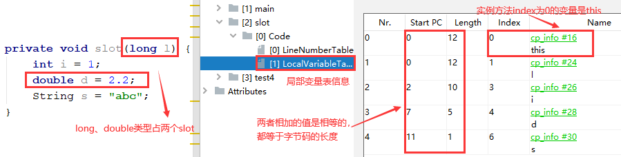

2. **操作数栈**：主要用于保存计算过程的中间结果，同时作为计算过程中变量临时的存储空间。它所需的内存空间也是在编译期完成分配的。

3. **动态链接**：也称为**指向运行时常量池的方法引用**，能够在程序运行期将调用方法的符号引用转换为直接引用，而静态链接是在编译期进行转换的。

**Java 虚拟机栈会出现两种异常：StackOverFlowError 和 OutOfMemoryError**。如果虚拟机栈固定长度，那么当线程请求的栈深度大于虚拟机所允许的最大深度时，将抛出 StackOverFlowError 异常。如果虚拟机栈允许动态扩展，那么当线程请求栈时内存用完了，无法再动态扩展，将抛出 OutOfMemoryError 异常。


### 1.3 本地方法栈

和虚拟机栈所发挥的作用非常相似，本地方法栈也会抛出 StackOverFlowError 和 OutOfMemoryError 两种异常，甚至在 HotSpot 虚拟机中两者合二为一。唯一的区别是： **虚拟机栈为虚拟机执行 Java 方法（也就是字节码）服务，而本地方法栈则为虚拟机使用到的 Native 方法服务。**


### 1.4 堆

《Java虚拟机规范》规定，堆可以处于物理上不连续的内存空间中，但在逻辑上它应该被视为连续的。堆是 Java 虚拟机所管理的内存中最大的一块，是所有线程共享的一块内存区域，在虚拟机启动时创建。**此内存区域的唯一目的就是存放对象实例，几乎所有的对象实例以及数组都在这里分配内存**。

堆这里最容易出现 OutOfMemoryError 异常，并且出现这种异常之后的表现形式还会有几种，比如：

1. **`OutOfMemoryError: GC Overhead Limit Exceeded`** ：当 JVM 花太多时间执行垃圾回收，并且只能回收很少的堆空间时，就会抛出该异常。
2. **`java.lang.OutOfMemoryError: Java heap space`** ：当堆中没有内存完成实例分配，且无法扩展时（可通过 `-Xmx 和 -Xms` 设置），就会抛出该异常。

#### 1.4.1 堆的划分

Java 堆是垃圾收集器管理的主要区域，因此也被称作 **GC 堆（Garbage Collected Heap）**。从内存回收的角度来看，由于现在收集器基本都采用分代垃圾收集算法，所以 Java 堆还可以细分为：新生代和老年代；再细致一点有：Eden 空间、From Survivor、To Survivor 空间等。**进一步划分的唯一目的就是优化 GC 性能**。

在 JDK 7 中，堆内存通常被分为下面三部分：新生代(Young Generation)、老年代(Old Generation)、永久代(Permanent Generation)。其中 Eden 区、两个 Survivor 区都属于新生代（为了区分，这两个 Survivor 区域按照顺序被命名为 from 和 to，也叫做 S0 和 S1）。在 JDK 8 中，方法区（HotSpot 的永久代）被彻底移除，取而代之是元空间，元空间使用的是直接内存。

> 默认情况下，堆的内存大小及空间大小划分如下（这些都可以通过参数进行设置）：
>
> 1. 堆空间的初始初始内存大小：电脑物理内存大小 / 64；最大内存大小：电脑物理内存大小 / 4
> 2. 新生代 : 老年代 = 1 : 2（即新生代占堆空间的 1/3，老年代占堆空间的 2/3）
> 3. Eden : S0 : S1 = 8 : 1 : 1（JVM 会自适应调整，所以查看时可能不是这个比例）


#### 1.4.2 堆一定是线程共享的吗

从分配内存角度看，所有线程共享的 Java 堆，还可以划分出**线程私有的缓冲区 TLAB**（Thread Local Allocation Buffer），以提升对象分配时的效率。

由于对象实例的创建在 JVM 中非常频繁，因此在并发环境下从堆区中划分内存空间是线程不安全的。为了避免多个线程操作同一地址，需要使用加锁等机制，进而影响分配速度。因此，从内存模型而不是垃圾收集的角度，JVM 为每个线程分配了一个私有缓存区域 TLAB，它包含在 Eden 区。默认情况下，TLAB 内存非常小，仅占整个 Eden 空间的1%。

多线程同时分配内存时，使用 TLAB 可以避免一系列的非线程安全问题，同时还能够提升内存分配的吞吐量，因此我们可以将这种内存分配方式称之为**快速分配策略**。尽管不是所有的对象实例都能够在 TLAB 中成功分配内存，但 JVM 确实是将 TLAB 作为内存分配的首选。一旦对象在 TLAB 空间分配内存失败时，JVM 就会尝试通过使用加锁机制确保数据操作的原子性，从而直接在 Eden 空间中分配内存。

#### 1.4.3 对象一定分配在堆上吗

随着 JIT 编译期的发展与逃逸分析技术逐渐成熟，栈上分配、标量替换优化技术将会导致一些微妙的变化，所有的对象都分配到堆上也渐渐变得不那么“绝对”了。

**逃逸分析（Escape Analysis）**指当一个对象在方法中被定义后，如果对象只在方法内部使用，则认为没有发生逃逸；如果它被外部方法所引用，则认为发生逃逸。如果经过逃逸分析后发现，一个对象并没有逃逸出方法的话，那么就可能被**优化成栈上分配**。HotSpot 在 JDK 7中默认开启了逃逸分析，如何快速判断是否发生了逃逸，只要看 new 的对象实体是否有可能在方法外被调用。


### 1.5 方法区

方法区与堆一样，是各个线程共享的内存区域，它用于存储已被虚拟机加载的**类型信息、常量、静态变量、即时编译器编译后的代码等数据**。虽然 **《Java虚拟机规范》把方法区描述为堆的一个逻辑部分**，但是它却有一个别名叫做 **Non-Heap（非堆）**，目的应该是与 Java 堆区分开来。

方法区与堆一样，可以选择固定大小或者进行扩展。它的大小决定了系统可以保存多少个类，如果系统定义了太多的类导致方法区溢出，虚拟机同样会抛出 OutOfMemoryError 异常。

#### 1.5.1 方法区和永久代的关系

《Java 虚拟机规范》只是规定了有方法区这么个概念和它的作用，并没有规定如何去实现它。那么，在不同的 JVM 上方法区的实现肯定是不同的了。  **方法区和永久代的关系很像 Java 中接口和类的关系，类实现了接口，而永久代就是 HotSpot 虚拟机对虚拟机规范中方法区的一种实现方式。** 也就是说，方法区是标准/规范，而永久代是实现，其他的虚拟机实现并没有永久代这一说法。

#### 1.5.2 HotSpot 方法区的变化

网上关于这部分的说法很多都是错误的，最权威的方法是查阅[官方文档](https://openjdk.java.net/jeps/122)，下面是其中一部分关于方法区的介绍：

> The proposed implementation will allocate class meta-data in native memory and move interned Strings and class statics to the Java heap.

官方文档明确说明了在 JDK 8 中字符串常量池位于堆中。移动的原因是永久代的回收效率很低，导致 StringTable 的回收效率不高。而我们开发中会有大量的字符串被创建，回收效率低会导致永久代内存不足，而放到堆里能及时回收内存。

| 版本        | 变化内容                                                     |
| ----------- | ------------------------------------------------------------ |
| JDK 6及之前 | 有永久代，字符串常量池、静态变量存放在永久代上               |
| JDK 7       | 有永久代，但已经逐步“去永久代”，**字符串常量池、静态变量移除，保存在堆中** |
| JDK 8及之后 | 无永久代，类型信息、字段、方法、常量保存在本地内存的元空间，但**字符串常量池、静态变量仍在堆中** |

注意区分运行时常量池和字符串常量池：**运行时常量池一直都存放在永久代（元空间）上，没有移动到堆中；而字符串常量池则在 JDK 7 中移动到堆中，之前是存放在永久代的运行时常量池中**。

#### 1.5.3 为什么要将永久代(PermGen) 替换为元空间 (MetaSpace)

1. 整个永久代有一个 JVM 本身设置固定大小上限，无法进行调整，而元空间使用的是直接内存，受本机可用内存的限制，虽然元空间仍旧可能溢出，但是比原来出现的几率会更小。
2. 元空间里面存放的是类的元数据，这样加载多少类的元数据就不由 `MaxPermSize` 控制了，而由系统的实际可用空间来控制，这样能加载的类就更多了。  
3. 在 JDK8，合并 HotSpot 和 JRockit 的代码时， JRockit 从来没有一个叫永久代的东西，合并之后就没有必要额外设置永久代了。


### 1.6  运行时常量池

**运行时常量池（Runtime Constant Pool）**是方法区的一部分，因此受到方法区内存的限制，当它无法再申请到内存时就会抛出 OutOfMemoryError 异常。

Class 文件中除了有类的版本、字段、方法、接口等描述信息外，还有**常量池表（Constant Pool Table）**信息，用于存放编译期生成的各种**字面量和符号引用**，这部分内容将**在类加载后放到运行时常量池中**。运行时常量池相对于 Class 文件常量池的另一重要特征是**具备动态性**。


#### 1.6.1 基本数据类型与常量池

```java
public class BaiscDataTypeTest {
    public static void main(String[] args) {
        Integer i1 = 22;
        Integer i2 = 22;
        System.out.println(i1 == i2);   // true
        Integer i3 = 333;
        Integer i4 = 333;
        System.out.println(i3 == i4);   // false
        Double d1 = 1.2;
        Double d2 = 1.2;
        System.out.println(d1 == d2);   // false

        Integer i5 = 0;
        Integer i6 = new Integer(22);
        System.out.println(i1 == i6);   // false
        System.out.println(i1.equals(i6));  // true
        System.out.println(i1 + i5 == i2);  // true
        System.out.println(i1 + i5 == i6);  // true
    }
}
```

**说明：**

1. Java 基本类型的包装类的大部分都实现了常量池技术，即 Byte、Short、Integer、Long、Character、Boolean，**这 6 种包装类默认创建了数值位于 [-128，127] 的相应类型的缓存数据，超出此范围仍然会去创建新的对象**。 设置为该区间，主要考虑性能和资源之间的权衡。

   ```java
   // Integer缓存源代码，IntegerCache是Integer的静态内部类
   public static Integer valueOf(int i) {
       if (i >= IntegerCache.low && i <= IntegerCache.high)
           return IntegerCache.cache[i + (-IntegerCache.low)];
       return new Integer(i);
   }
   ```

2. 两种浮点数类型的包装类 **Float、Double 并没有实现常量池技术**。

3. Integer i1 = 22 ：Java 在编译的时候会直接将代码封装成 `Integer i1 = Integer.valueOf(22)`，从而使用常量池中的对象。而 Integer i6 = new Integer(22)：会在堆中直接创建新的对象。

4. i1 + i5 == i6：`+` 运算符不适用于 Integer 对象，因此 i1 首先进行自动拆箱，与 i5 进行数值相加。然后 Integer 对象无法与数值进行直接比较，所以 i6 也自动拆箱，最终这条语句转为 22 == 22 进行数值比较。


#### 1.6.2 String 类与字符串常量池

**字符串常量池（String Table）是一个固定大小的 Hashtable，所以池中不会存储相同内容的字符串**。我们可使用`-XX: StringTableSize`设置它的长度。

> 在 JDK 6 中，String Table 的长度默认是 1009，所以如果池中的字符串过多，就会导致效率下降很快，而StringTableSize 的设置没有要求；
>
> 在 JDK 7 中，StringTable 的长度默认是 60013，StringTableSize 的设置仍然没有要求；
> 在 JDK 8 中，StringTable 的长度默认是 60013，StringTableSize 可设置的最小值是 1009。

* **字符串创建的两种方式及拼接操作**

```java
public class StringTest {
    public static void main(String[] args) {
        String str1 = new String("ab"); // 首先在池中创建"ab"对象，然后在堆中创建"ab"对象并返回
        String str2 = new String("ab"); // 直接在堆中创建"ab"对象并返回
        String str3 = "ab"; // 直接返回池中的"ab"对象
        String str4 = "ab"; // 直接返回池中的"ab"对象

        String str5 = "abcd";	// 在池中创建"abcd"对象并返回
        String str6 = "ab" + "cd";	// 直接返回池中的"abcd"对象
        String str7 = str3 + "cd";	// 直接在堆中创建"abcd"对象并返回
        String str8 = (str3 + "cd").intern();	// 直接返回池中的"abcd"对象

        System.out.println(str1 == str2);   // false
        System.out.println(str3 == str4);   // true

        System.out.println(str5 == str6);   // true
        System.out.println(str5 == str7);   // false
        System.out.println(str5 == str8);   // true
    }
}
```

**说明：**

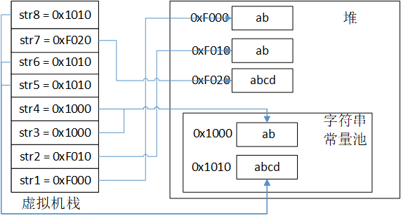

1. String str3 = "ab"：采用**字面值的方式创建**一个字符串时，JVM 首先会去**字符串常量池**中查找是否存在"ab"这个对象。
   - 如果不存在，则在字符串常量池中创建"ab"这个对象，然后将池中"ab"这个对象的引用地址返回并赋给 str3，这样 str3 就指向了字符串常量池中"ab"这个字符串对象。
   - 如果存在，则不创建任何对象，直接将池中"ab"这个对象的地址返回并赋给str3。
2. String str1 = new String("ab")：采用**new关键字创建**一个字符串时，JVM 同样首先去**字符串常量池**中查找是否存在"ab"这个对象。
   - 如果不存在，则首先在字符串常量池中创建一个"ab"字符串对象，然后再在**堆**中创建一个“ab”对象，最后将堆中的这个“ab”对象的引用地址返回并赋给 str1。
   - 如果存在，则不在字符串常量池中再去创建"ab"这个对象了，直接在**堆**中创建一个“ab”对象，然后将堆中的这个“ab”对象的引用地址返回并赋给 str1。
3. 关于 String 的**拼接操作**：常量与常量的拼接结果仍然在字符串常量池中，原理是编译期优化。只要**其中有一个是变量，则相当于在堆中 new 出一个新的字符串对象**，原理是 StringBuilder（在 JDK 8中可通过反编译查看，JDK 9又进行了优化，使用的是 InvokeDynamic 指令）。如果拼接的结果调用 intern() 方法，则主动将字符串常量池中还没有的字符串对象放入池中，并返回此对象的地址。

* **new String() 到底创建了几个对象**

```java
public class StringNewTest {
    public static void main(String[] args) {
        // 方式一：创建了2个对象
        String str1 = new String("abc");
        // 方式二：创建了6个对象
        String str2 = new String("a") + new String("b");
    }
}
```

**说明：**

1. 方式一将创建 1 或 2 个字符串对象。如果字符串常量池中已经存在“abc”，则只会在堆空间创建一个字符串常量“abc”。如果池中没有“abc"，那么将首先在池中创建，然后再在堆中创建，因此将创建 2 个字符串对象。
2. 方式二将创建 6 个对象。这种方式就是变量的拼接操作，首先 `new String("a")` 和 `new String("b")` 分别创建了2个对象，然后创建了一个 StringBuilder 对象用于拼接操作，最后将 StringBuilder 转换为 String 又创建了一个对象（底层 toString() 方法使用 new 生成）。**特别注意在字符串常量池中，没有生成"ab”对象**。

* **intern() 方法使用总结**

```java
public class StringInternTest {
    public static void main(String[] args) {
        String s1 = new String("a");	// 首先在池中创建"a"对象，然后在堆中创建"a"对象并返回
        s1.intern();	// 池中已经存在"a"，该方法没起作用 
        String s2 = "a";	// 直接返回池中的"a"对象
        System.out.println(s1 == s2);   // JDK6/7/8 false

        String s3 = new String("a") + new String("b");  // 池中不存在"ab"对象
        // JDK 6中，复制堆中对象，在池中创建了一个新的对象"ab"，也就有新的地址
        // JDK 7中，池中并没有创建"ab"新对象，而是创建了一个指向堆中"ab"对象的引用
        s3.intern();    
        String s4 = "ab";	// JDK 7中通过池中保存的引用，间接指向了堆中"ab"对象
        System.out.println(s3 == s4);   // JDK6 false, JDK7/8 true
    }
}
```

**说明：**

1. 在 JDK 6中调用 intern() 方法，尝试将字符串对象放入字符串常量池中。如果池中已经存在，则不会放入，返回池中已有对象的地址；如果不存在，会把**此对象复制一份**，放入池中，并返回池中该对象的地址。
2. 在 JDK 7及之后调用 intern() 方法。如果池中已经存在，则不会放入，返回池中已有对象的地址（与 JDK 6相同）；如果不存在，则会把**对象的引用地址复制一份**，放入池中，并返回池中该引用的地址。
3. intern() 是一个 native 方法，对于程序中大量存在的字符串，尤其是存在很多重复字符串时，使用 intern() 可以节省内存空间。


### 1.7 直接内存

**直接内存并不是虚拟机运行时数据区的一部分，也不是虚拟机规范中定义的内存区域**，但是这部分内存也被频繁地使用。直接内存的分配不会受到 Java 堆的限制，但是仍然会受到物理内存的限制，因此也可能会抛出 OutOfMemoryError 异常。

JDK1.4 中新加入的 **NIO(New Input/Output) 类**，引入了一种基于通道（Channel）与缓存区（Buffer）的 I/O 方式，它可以使用 Native 函数库直接**分配堆外内存**，然后通过一个存储在 Java 堆中的 `DirectByteBuffer` 对象作为这块内存的引用进行操作。这样就能在一些场景中显著提高性能，因为**避免了在 Java 堆和 Native 堆之间来回复制数据**。


## 2. HotSpot 虚拟机对象

### 2.1 对象的创建

**创建对象的方式：**

1. **使用 new 关键字**：最常见的方式，包括调用自身静态方式，以及调用 Builder/Factory 的静态方法。
2. **使用反射**：调用 Class 类的 newInstance() 方法，该方法只能调用空参构造器，且权限必须是 public，所以在 JDK 9 被标注为过时，建议使用`clazz.getDeclaredConstructor().newInstance()` ，即调用 Constructor 类的 newInstance() 方法，这种方式可以调用空参、带参的构造器，且权限没有要求。
3. **使用 clone() 方法**：不调用任何构造器，当前类需要实现 Cloneable 接口，实现 clone() 方法。
4. **使用反序列化**：从文件、网络中获取一个对象的二进制流来生成对象
5. **使用第三方库Objenesis**


**创建对象的步骤：**

下图便是 Java 对象的创建过程，建议最好能默写出来，并且要掌握每一步在做什么。


**Step 1：类加载检查**

虚拟机遇到一条 new 指令时，首先将去检查这个指令的参数是否能在常量池中定位到一个类的符号引用，并且检查这个符号引用代表的类是否已被加载、解析和初始化过。如果没有，那必须先执行相应的类加载过程。

> Java 类在何时被加载：启动 main 方法、创建父类的实例、创建子类的实例、访问类的静态方法、访问类的静态变量、反射。具体参见 6.1.5 小节。

**Step 2：分配内存**

在**类加载检查**通过后，接下来虚拟机将为新生对象**分配内存**。对象所需的内存大小在类加载完成后便可确定，为对象分配空间的任务等同于把一块确定大小的内存从 Java 堆中划分出来。**分配方式有 “指针碰撞” 和 “空闲列表” 两种，**选择哪种分配方式由 Java 堆是否规整决定，而 Java 堆是否规整又由所采用的垃圾收集器是否带有压缩整理功能决定。

> **内存分配的两种方式：**
>
> 1. **指针碰撞**：适用于堆内存规整的情况，即所有用过的内存放在一边，空闲的内存放在另一边，中间有一个分界值指针，分配内存时只需要向空闲空间那边移动与对象大小相等的距离。Serial、ParNew 等收集器采用该方式。
> 2. **空闲列表**：适用于堆内存不规整的情况，即已使用的内存和空闲的内存相互交错，虚拟机会维护一个列表，记录哪些内存是可用的。分配内存时，从列表中找到一块足够大的空间划分给对象实例，并更新列表。CMS 收集器采用该方式。
>
> **内存分配的并发问题：**
>
> 除了如何划分可用空间外，还需要考虑线程安全问题。因为在实际开发过程中，创建对象是很频繁的行为，作为虚拟机来说，必须要保证线程是安全的，通常有下面两种方案：
>
> 1. **CAS+失败重试：** CAS 是乐观锁的一种实现方式。所谓乐观锁就是，每次不加锁而是假设没有冲突而去完成某项操作，如果因为冲突失败就重试，直到成功为止。**虚拟机采用 CAS 配上失败重试的方式保证更新操作的原子性。**
>
> 2. **TLAB：** 每个线程预先在堆中的 Eden 区分配一小块内存，称为**本地线程分配缓冲（Thread Local Allocation Buffer）**。JVM 在给线程中的对象分配内存时，首先在 TLAB 分配，当对象大于 TLAB 中的剩余内存或 TLAB 的内存已用尽时，再采用上述的 CAS 进行内存分配。

**Step 3：初始化零值**

内存分配完成后，虚拟机需要将分配到的内存空间都初始化为零值（不包括对象头），这一步操作保证了对象的实例字段在 Java 代码中可以不赋初始值就直接使用，程序能访问到这些字段的数据类型所对应的零值。

**Step 4：设置对象头**

初始化零值完成之后，**虚拟机要对对象进行必要的设置**，例如这个对象是那个类的实例、如何才能找到类的元数据信息、对象的哈希码、对象的 GC 分代年龄等信息。 **这些信息存放在对象头中。** 另外，根据虚拟机当前运行状态的不同，如是否启用偏向锁等，对象头会有不同的设置方式。

**Step 5：执行 init 方法**

在上面工作都完成之后，从虚拟机的视角来看，一个新的对象已经产生了，但从 Java 程序的视角来看，对象创建才刚开始，`<init>` 方法还没有执行，所有的字段都还为零。所以一般来说，执行 new 指令之后会接着执行 `<init>` 方法，把对象按照程序员的意愿进行初始化，这样一个真正可用的对象才算完全产生出来。

### 2.2 对象的内存布局

在 Hotspot 虚拟机中，对象在内存中的布局可以分为 **3 块区域：对象头、实例数据和对齐填充**。

1. **对象头包括两部分信息**，**第一部分是运行时元数据（Mark Word）**，包括哈希值、GC 分代年龄、锁状态标志、线程持有的锁等，**另一部分是类型指针**，即对象指向它的类元数据的指针，虚拟机通过这个指针来确定这个对象是哪个类的实例。

2. **实例数据部分是对象真正存储的有效信息**，也是在程序中所定义的各种类型的字段内容，包括从父类继承下来和自身拥有的字段。

3. **对齐填充部分不是必然存在的，也没有什么特别的含义，仅仅起占位作用。** 因为 Hotspot 虚拟机的自动内存管理系统要求对象起始地址必须是 8 字节的整数倍，换句话说就是对象的大小必须是 8 字节的整数倍。而对象头部分正好是 8 字节的倍数（1 倍或 2 倍），因此，当对象实例数据部分没有对齐时，就需要通过对齐填充来补全。

### 2.3 对象的访问定位

建立对象就是为了使用对象，Java 程序通过栈上的 reference 数据来操作堆上的具体对象。对象的访问方式由虚拟机实现而定，目前主流的访问方式有**使用句柄**和**直接指针**两种：

1. **句柄：** 如果使用句柄的话，那么 Java 堆中将会划分出一块内存来作为句柄池，**reference 中存储的就是对象的句柄地址**，而句柄中包含了对象实例数据与类型数据各自的具体地址信息；

   

2. **直接指针：**  如果使用直接指针访问，那么 Java 堆对象的布局中就必须考虑如何放置访问类型数据的相关信息，而 **reference 中存储的直接就是对象的地址**。HotSpot 虚拟机使用的就是这种方式，比如：`Person person = new Person()`，那么 Person 对象类型就在方法区，person 引用就在 Java虚拟机栈的局部变量表中，而 new Person() 对象则分配在堆中。

   

这两种对象访问方式各有优势。**使用句柄来访问的最大好处是 reference 中存储的是稳定的句柄地址，在对象被移动时（GC时移动对象是普遍行为）只会改变句柄中的实例数据指针，而 reference 本身不需要修改。使用直接指针访问方式最大的好处就是速度快，它节省了一次指针定位的时间开销**。


## 3. JVM 垃圾回收

垃圾是指在运行程序中**没有任何指针指向的对象**，这个对象就是需要被回收的垃圾。由于程序计数器、虚拟机栈、本地方法栈是线程私有的，它们随线程而生、随线程而灭，当方法结束或线程结束时，内存会自然跟着回收，因此不需要过多考虑回收问题。而堆和方法区则不一样，尤其是堆，几乎存放着所有对象的实例。**垃圾回收（Garbage Collection，GC）**需要考虑3件事情：**哪些内存需要回收？什么时候回收？如何回收？**

### 3.1 对象已死吗

#### 3.1.1 引用计数法

给对象中添加一个引用计数器，每当有一个地方引用它，计数器就加 1；当引用失效，计数器就减 1；任何时候计数器为 0 的对象就是不可能再被使用的。

**这个方法实现简单，效率高，但是目前主流的虚拟机中并没有选择这个算法来管理内存，其最主要的原因是它很难解决对象之间相互循环引用的问题**（Python 支持引用计数法，它解决循环引用的方式是：**手动解除和弱引用**）。 所谓对象之间的相互引用问题，如下面代码所示：除了对象 objA 和 objB 相互引用着对方之外，这两个对象之间再无任何引用。但是他们因为互相引用对方，导致它们的引用计数器都不为 0，于是引用计数算法无法通知 GC 收集器回收它们。

```java
public class ReferenceCountingGc {
    Object instance = null;

    public static void main(String[] args) {
        ReferenceCountingGc objA = new ReferenceCountingGc();
        ReferenceCountingGc objB = new ReferenceCountingGc();
        objA.instance = objB;
        objB.instance = objA;
        objA = null;
        objB = null;
    }
}
```

#### 3.1.2 可达性分析算法

这个算法的基本思想就是通过一系列的称为 **“GC Roots”** 的对象作为起点，从这些节点开始向下搜索，节点所走过的路径称为引用链，当一个对象到 GC Roots 没有任何引用链相连的话，则证明此对象是不可用的。

可作为"GC Roots“的对象包括：虚拟机栈中引用的对象、本地方法栈中 JNI 引用的对象、方法区中类静态属性和常量引用的对象（以上3个都是堆周边的引用）、同步锁持有的对象等。


补充：**内存泄漏（Memory Leak）指的是对象不会被程序用到，但是 GC 又不能回收它们**。内存泄漏不会立刻引起程序崩溃，但是程序中的可用内存会被逐步蚕食，直至耗尽内存，出现 OOM 异常。比如可达性分析算法中引用链忘记断开，就会导致内存泄漏问题。下面举两个具体例子：

1. 单例的生命周期和应用程序是一样长的，所以单例模式中，如果持有对外部对象的引用，那么这个外部对象是不能被回收的，则会导致内存泄漏。
2. 一些提供 close 的资源未关闭导致内存泄漏，数据库连接、网络连接、和 IO连接必须手动关闭，否则是不能被回收的。


#### 3.1.3 再谈引用

无论是通过引用计数法判断对象引用数量，还是通过可达性分析法判断对象的引用链是否可达，判定对象的存活都与“引用”有关。

JDK1.2 之前，Java 中引用的定义很传统：如果 reference 类型的数据存储的数值代表的是另一块内存的起始地址，就称这块内存代表一个引用。

JDK1.2 以后，Java 对引用的概念进行了扩充，将引用分为强引用、软引用、弱引用、虚引用四种（引用强度逐渐减弱）

1. **强引用（Strong Reference）**

   我们使用的大部分引用实际上都是强引用，这是使用最普遍的引用。如果一个对象具有强引用，**垃圾回收器绝不会回收它**。当内存空间不足，Java 虚拟机宁愿抛出 OutOfMemoryError 异常，使程序异常终止，也不会靠随意回收具有强引用的对象来解决内存不足问题。

2. **软引用（Soft Reference）**

   如果一个对象只具有软引用，**当内存空间足够，垃圾回收器就不会回收它；当内存空间不足，就会回收这些对象的内存**。只要垃圾回收器没有回收它，该对象就可以被程序使用。软引用可用来实现内存敏感的高速缓存。

3. **弱引用（Weak Reference）**

   弱引用与软引用的区别在于：只具有弱引用的对象拥有更短暂的生命周期。垃圾回收器一旦发现了只具有弱引用的对象，**不管当前内存空间是否足够，都会回收它的内存**。不过，由于垃圾回收器是一个优先级很低的线程， 因此不一定会很快发现那些只具有弱引用的对象。 

4. **虚引用（Phantom Reference）**

   "虚引用"顾名思义，就是形同虚设，与其他几种引用都不同，虚引用并不会决定对象的生命周期。如果一个对象仅持有虚引用，那么它就**和没有任何引用一样，在任何时候都可能被垃圾回收**。为一个对象设置虚引用的唯一目的是：能在这个对象被收集器回收时收到一个系统通知。

**总结：强引用不回收，软引用内存不足即回收，弱引用发现即回收，虚引用对象回收跟踪**。特别注意，在程序设计中一般很少使用弱引用与虚引用，使用软引用的情况较多，这是因为**软引用可以加速 JVM 对垃圾内存的回收速度**，可以维护系统的运行安全，防止内存溢出（OOM）等问题的产生。


#### 3.1.4 不可达对象并非“非死不可”

即使在可达性分析法中不可达的对象，也并非是“非死不可”的，这时候它们暂时处于“缓刑阶段”，要真正宣告一个对象死亡，**至少要经历两次标记过程**：可达性分析法中**不可达的对象被第一次标记**并且进行一次筛选，筛选的条件是此对象是否有必要执行 finalize() 方法。

1. 当对象没有覆盖 finalize() 方法，或 finalize() 方法已经被虚拟机调用过时（ 因此finalize() 方法只会被调用一次），虚拟机将这两种情况视为没有必要执行。

2. 被判定为需要执行 finalize() 方法的对象将会被放在一个队列中进行**第二次标记**，除非这个对象在 finalize() 中”自我拯救“，即与引用链上的任何一个对象建立关联，否则就会被真的回收。

#### 3.1.5 回收方法区

《Java虚拟机规范》中没有要求必须在方法区实现垃圾收集，实际上，**方法区垃圾回收的性价比通常比较低**，主要回收两部分内容：废弃常量和无用类。

1. **如何判断一个常量是废弃常量**

   HotSpot 虚拟机对常量池的回收策略是很明确的，与回收 Java 堆中的对象类似，只要常量池中的常量没有被任何地方引用，就可以被回收。

2. **如何判断一个类是无用类**

   判定一个常量是否是“废弃常量”比较简单，而要判定一个类是否是“无用的类”的条件则相对苛刻许多。类需要同时满足下面 3 个条件才能算是“无用的类”：

   - 该类所有的实例都已经被回收，也就是 Java 堆中不存在该类及其任何派生子类的任何实例。
   - 加载该类的 ClassLoader 已经被回收。
   - 该类对应的 java.lang.Class 对象没有在任何地方被引用，无法在任何地方通过反射访问该类的方法。

   虚拟机可以对满足上述 3 个条件的无用类进行回收，这里说的仅仅是“可以”，而并不是和对象一样不使用了就会必然被回收。


### 3.2 垃圾收集算法

#### 3.2.1 标记-清除算法（Mark-Sweep）

该算法分为**“标记”和“清除”阶段**：首先标记出所有需要回收的对象，在标记完成后统一回收所有被标记的对象。也可以反过来，标记存活的对象，统一回收所有未被标记的对象。它是最基础的收集算法，后续的算法都是对其不足进行改进得到。这种垃圾收集算法会带来两个明显的问题：**效率问题**（标记、清除效率随对象数量增加而降低）、**空间问题**（标记清除后会产生大量不连续的碎片）。


#### 3.2.2 标记-复制算法（Mark-Copy）

为了解决效率问题，“标记-复制”算法出现了。它可以将内存分为大小相同的两块，每次使用其中的一块。当这一块的内存使用完后，就将还存活的对象复制到另一块去，然后再把使用的空间一次清理掉。这样就使每次的内存回收都是对内存区间的一半进行回收。这种垃圾收集算法**浪费空间**（内存缩小一半），且如果内存中多数对象都是存活的，将会产生大量的**复制开销**。由于新生代中大部分对象都是**“朝生夕死”**的，所以大多数虚拟机**采用这种算法回收新生代**，也不需要按照1 : 1的比例来划分新生代空间。


#### 3.2.3 标记-整理算法（Mark-Compact）

根据**老年代**的特点提出的一种标记算法，标记过程仍然与“标记-清除”算法一样，但后续步骤不是直接对可回收对象回收，而是让所有存活的对象向一端移动，然后直接清理掉端边界以外的内存。


**上述 3 种垃圾收集算法对比：**

|          |  Mark-Sweep  |   Mark-Copy    |  Mark-Compact  |
| :------: | :----------: | :------------: | :------------: |
|   速度   |     中等     |      最快      |      最慢      |
| 空间开销 | 小，存在碎片 | 大，不存在碎片 | 小，不存在碎片 |
| 移动对象 |      否      |       是       |       是       |


#### 3.2.4 分代收集算法

当前虚拟机的垃圾收集基本都采用分代收集算法，这种算法没有什么新的思想，只是根据对象存活周期的不同将内存分为几块。一般将 java 堆分为新生代和老年代，这样就可以根据各个年代的特点选择合适的垃圾收集算法（**频繁收集新生代，较少收集老年代，基本不动方法区**）。

**比如在新生代中，每次收集都会有大量对象死去，所以可以选择“标记-复制”算法，只需要付出少量对象的复制成本就可以完成每次垃圾收集。而老年代的对象存活几率是比较高的，而且没有额外的空间对它进行分配担保，所以我们必须选择“标记-清除”或“标记-整理”算法进行垃圾收集**。这也是为什么 HotSpot 要分为新生代和老年代的原因，目的是为了提高 GC 的效率。


### 3.3 垃圾收集器

如果说垃圾收集算法是内存回收的方法论，那么垃圾收集器就是内存回收的具体实现。垃圾收集器没有万能的，需要根据具体的应用场景进行选择。下图展示了七种作用于不同分代的收集器：

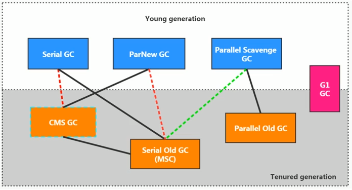

1. 两个收集器间有连线，表明它们可以搭配使用。其中 Serial old 作为 CMS 出现"Concurrent Mode Failure" 失败的后备预案。
2. **红色虚线**组合在 JDK 8 中声明为废弃，并在 JDK 9 中完全移除。**绿色虚线**组合在 JDK 14 中弃用。**青色虚线**即 CMS 收集器在 JDK 14 中完全移除。
3. **蓝色**收集器使用“标记-复制”算法回收新生代。**橙色**收集器使用“标记-整理”算法回收老年代（CMS 使用“标记-清除”）。**红色**即 G1 收集器可以同时回收新生代和老年代。
4. HotSpot虚拟机默认的垃圾收集器：在 JDK 6/7/8 中是“Parallel Scavenge + Parallel Old”组合，在 JDK 9 及之后是 G1。

#### 3.3.1 Serial 收集器

Serial（串行）收集器收集器是最基本、历史最悠久的垃圾收集器了。大家看名字就知道这个收集器是一个单线程收集器了。它的 **“单线程”** 的意义不仅仅意味着它只会使用一条垃圾收集线程去完成垃圾收集工作，更重要的是它在进行垃圾收集工作的时候必须暂停其他所有的工作线程（ **"Stop The World"** ），直到它收集结束。

> STW 是 JVM 在后台自动发起和完成的，在用户不可见的情况下，把用户正常的工作线程全部停掉。所有的 GC 收集器都会发生 STW，哪怕是 G1 也不能完全避免 STW 的发生，只能说垃圾回收器越来越优秀，回收效率越来越高，尽可能地缩短了暂停时间。开发中不要使用 System.gc() ，它会触发Full GC（不保证），导致 STW 的发生。


Serial 收集器的缺点是**用户线程有停顿时间**，但是它**简单而高效（与其他收集器的单线程相比）**。Serial 收集器由于没有线程交互的开销，自然可以获得很高的单线程收集效率，它依然是 HotSpot 虚拟机运行在 Client 模式下的默认新生代收集器。

#### 3.3.2 ParNew 收集器

ParNew 收集器其实就是 **Serial 收集器的多线程版本**，除了使用多线程进行垃圾收集外，其余行为（控制参数、收集算法、回收策略等等）和 Serial 收集器完全一样。它是许多运行在 Server 模式下的虚拟机的首要选择，除了 Serial 收集器外，只有它能与 CMS 收集器配合工作。

> * **串行（Serial）**：相较于并行的概念，单线程执行垃圾收集。如Serial、Serial Old。
>
> - **并行（Parallel）** ：指多条垃圾收集线程并行工作，但此时用户线程仍然处于等待状态。如 ParNew、Parallel Scavenge、Parallel Old。
> - **并发（Concurrent）**：指用户线程与垃圾收集线程同时执行（但不一定是并行，可能会交替执行），用户程序在继续运行，而垃圾收集器运行在另一个 CPU 上。如 CMS 和 G1。


#### 3.3.3 Parallel Scavenge 收集器

**Parallel Scavenge（/ˈskævɪndʒ/） 收集器关注点是吞吐量（高效率的利用 CPU）。CMS 等垃圾收集器的关注点更多的是用户线程的停顿时间（提高用户体验）。所谓吞吐量就是 CPU 中用于运行用户代码的时间与 CPU 总消耗时间的比值。** Parallel Scavenge 收集器提供了很多参数供用户找到最合适的停顿时间或最大吞吐量，当然它也有**自适应的调节策略**，可以动态调整这些参数。

#### 3.3.4 Serial Old 收集器

**Serial 收集器的老年代版本**，它同样是一个单线程收集器。它主要有两大用途：一种用途是在 JDK 5 以及以前的版本中与 Parallel Scavenge 收集器搭配使用，另一种用途是作为 CMS 收集器的后备方案。

#### 3.3.5 Parallel Old 收集器

**Parallel Scavenge 收集器的老年代版本**，在注重吞吐量以及 CPU 资源的场合，都可以优先考虑 Parallel Scavenge 收集器和 Parallel Old 收集器。

#### 3.3.6 CMS 收集器

**CMS（Concurrent Mark Sweep）收集器是一种以获取最短回收停顿时间为目标的收集器。它非常符合在注重用户体验的应用上使用**。它是 HotSpot 虚拟机第一款真正意义上的并发收集器，实现了让垃圾收集线程与用户线程（基本上）同时工作。

从名字中的**Mark Sweep**这两个词可以看出，CMS 收集器是一种 **“标记-清除”算法**实现的，它的运作过程相比于前面几种垃圾收集器来说更加复杂一些。整个过程分为四个步骤：

- **初始标记**：暂停所有的其他线程，并记录下**与 GC Roots 直接相连**的对象，速度很快 ；
- **并发标记**：从 GC Roots 的直接关联对象开始遍历整个对象图的过程，这个过程**耗时较长但是不需要停顿用户线程**，可以与垃圾收集线程一起并发运行；
- **重新标记**：为了修正并发标记期间，因用户程序继续运行而导致标记产生变动的那一部分对象的标记记录，这个阶段的停顿时间一般会比初始标记阶段的时间稍长，远远比并发标记阶段时间短；
- **并发清除**：开启用户线程，同时 GC 线程开始对标记的区域做清扫。


CMS 收集器的主要优点：**并发收集、低停顿**，但是它有下面三个明显的缺点：**对 CPU 资源敏感、无法处理浮动垃圾、它使用的“标记-清除”回收算法会导致大量空间碎片产生**。浮动垃圾是指在并发标记阶段如果产生新的垃圾对象，CMS将无法对这些垃圾对象进行标记，最终会导致这些新产生的垃圾对象没有被及时回收。

#### 3.3.7 G1 收集器

**G1 (Garbage-First) 是一款面向服务器的垃圾收集器**，主要针对配备多颗处理器及大容量内存的机器，以极高概率满足 GC 停顿时间要求的同时，还具备高吞吐量性能特征。**在 JDK 9 中，G1 取代 Parallel Scavenge 和 Parallel Old 组合，成为了服务器模式下的默认垃圾收集器；同时在 JDK 14 中， G1 又取代了CMS**。它具备以下优势：

- **并行与并发**：G1 能充分利用 CPU、多核环境下的硬件优势，使用多个 CPU（CPU 或者 CPU 核心）来缩短 Stop-The-World 停顿时间。部分其他收集器原本需要停顿 Java 线程执行的 GC 动作，G1 收集器仍然可以通过并发的方式让 java 程序继续执行。
- **分代收集**：虽然 G1 可以不需要其他收集器配合就能独立管理整个 GC 堆，但是还是保留了分代的概念。
- **空间整合**：与 CMS 的“标记-清理”算法不同，G1 从整体来看是基于“标记-整理”算法实现的收集器；从局部上来看是基于“标记-复制”算法实现的。
- **可预测的停顿**：这是 G1 相对于 CMS 的另一个优势，降低停顿时间是 G1 和 CMS 共同的关注点，但 G1 除了追求低停顿外，还能建立可预测的停顿时间模型，能让使用者明确指定在一个长度为 M 毫秒的时间片段内。

使用 G1 收集器时，它将整个 Java 堆划分成约 2048 个大小相同的独立 **Region 块**，每个 Region 块大小根据堆空间的实际大小而定，整体被控制在 1MB 到 32MB 之间，且为 2 的 N 次幂（可以通过`-XX:G1HeapRegionSize`设定）。所有的 Region 大小相同，且在 JVM 生命周期内不会被改变。

**G1 收集器在后台维护了一个优先列表，每次根据允许的收集时间，优先选择回收价值最大的 Region（这也就是它的名字 Garbage-First 的由来）**。这种使用 Region 划分内存空间以及有优先级的区域回收方式，保证了 G1 收集器在有限时间内可以尽可能高的收集效率（把内存化整为零）。

**上述 7 种垃圾收集器对比：**

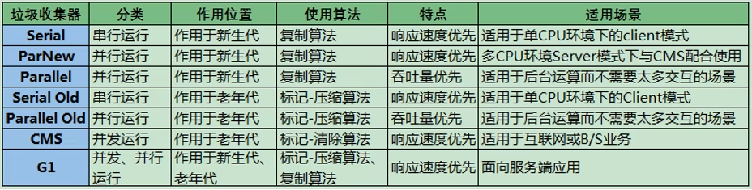


### 3.4 内存分配与回收策略

#### 3.4.1  对象优先在 Eden 区分配

目前主流的垃圾收集器都会采用分代回收算法，因此需要将堆内存分为新生代和老年代，这样我们就可以根据各个年代的特点选择合适的垃圾收集算法。

大多数情况下，对象在新生代中 Eden 区分配。当 Eden 区没有足够空间进行分配时，虚拟机将发起一次 Minor GC。

1. **部分收集（Partical GC）**：指目标不是完整收集整个 Java 堆的垃圾收集，其中又分为：
   * **新生代收集（Minor/Young GC）**：指目标只是新生代的垃圾收集，Minor GC 非常频繁，回收速度一般也比较快。
   * **老年代收集（Major/Old GC）**：指目标只是老年代的垃圾收集，出现了 Major GC 经常会伴随至少一次的 Minor GC（并非绝对），Major GC 的速度一般会比 Minor GC 的慢 10 倍以上。如果 Major GC 后，内存还不足，就会出现 OOM 异常。
   * **混合收集（Mixed GC）**：指目标是整个新生代和部分老年代的垃圾收集，目前只有 G1 收集器有这种行为。
2. **整堆收集（Full GC）**：指目标是整个 Java 堆和方法区的垃圾收集。

#### 3.4.2 大对象直接进入老年代

大对象就是需要大量连续内存空间的对象（比如：字符串、数组）。这样做的目的是：为了避免为大对象分配内存时由于分配担保机制带来的复制而降低效率。

#### 3.4.3 长期存活的对象将进入老年代

既然虚拟机采用了分代收集的思想来管理内存，那么内存回收时就必须能识别哪些对象应放在新生代，哪些对象应放在老年代中。为了做到这一点，虚拟机给每个对象一个对象年龄（Age）计数器。


上图所示的 eden 区、s0("From") 区、s1("To") 区都属于新生代，tentired 区属于老年代。大部分情况，对象都会首先在 Eden 区域分配，当 Eden 区满时会触发一次 Minor GC**（Surivor 区满不会触发GC）**。如果对象还存活，则会进入 s1("To")，并且对象的年龄还会加 1（Eden 区->Survivor 区后对象的初始年龄变为 1），当它的年龄增加到一定程度**（默认为 15 岁），就会被晋升到老年代中**。对象晋升到老年代的年龄阈值，可以通过参数 `-XX:MaxTenuringThreshold` 来设置。经过这次GC后，Eden区和"From"区已经被清空。这个时候，"From"和"To"会交换他们的角色，也就是新的"To"就是上次GC前的“From”，新的"From"就是上次GC前的"To"。不管怎样，都会**保证名为 To 的 Survivor 区域是空的**。Minor GC会一直重复这样的过程，直到“To”区被填满，"To"区被填满之后，会将所有对象移动到老年代中。

> **空间分配担保**：在发生 Minor GC 之前，虛拟机必须先检查老年代最大可用的连续空间是否大于新生代所有对象总空间，如果条件成立，那这一次 Minor GC 可以确保是安全的。如果不成立，则虚拟机会继续检查老年代最大可用的连续空间是否大于历次晋升到老年代对象的平均大小（赌概率），如果大于，将尝试进行一次 Minor GC，尽管这次 Minor GC 是有风险的；如果小于，那就只能进行一次 Full GC。

#### 3.4.4 动态对象年龄判定

为了更好的适应不同程序的内存情况，虚拟机不是永远要求对象年龄必须达到了某个值才能进入老年代，如果 Survivor 空间中相同年龄所有对象大小的总和大于 Survivor 空间的一半，年龄大于或等于该年龄的对象就可以直接进入老年代，无需达到要求的年龄。


## 4. JVM 性能监控

### 4.1 JDK 命令行工具

| 命令    | 作用                         | 命令     | 作用                   |
| ------- | ---------------------------- | -------- | ---------------------- |
| `jps`   | 查看虚拟机进程               | `jmap`   | 生成堆转储快照         |
| `jstat` | 监视虚拟机运行状态信息       | `jhat`   | 分析堆转储快照         |
| `jinfo` | 实时查看和修改虚拟机各项参数 | `jstack` | 堆栈跟踪，生成线程快照 |

这些命令在 JDK 安装目录下的 bin 目录下，下面详细进行介绍：

1. **`jps [options] [hostid]`**：即 JVM Process Status，查看正在运行的虚拟机进程，并显示虚拟机执行主类名称以及本地虚拟机唯一ID（LVMID）

   * -l：输出主类的全名，如果进程执行的是 Jar 包，输出 Jar 路径
   * -m：输出虚拟机进程启动时传递给主类 main() 函数的参数
   * -v：输出虚拟机进程启动时的 JVM 参数

   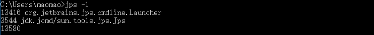

2. **`jstat [option vmid [interval[s|ms] [count]]]`**：即 JVM Statistics Monitoring Tool，监视虚拟机各种运行状态信息， 它可以显示本地或者远程（需要远程主机提供 RMI 支持）虚拟机进程中的类加载、内存、垃圾收集、JIT 即时编译等运行数据

   * -class：显示 ClassLoader 的相关信息
   * -compiler：显示 JIT 即时编译的相关信息
   * -gc | gcnew | -gcold ：显示与 GC 相关的堆信息、新生代信息、老年代和永久代的信息
   * -gccapacity | gcnewcapcacity | gcoldcapacity | gcpermcapacity：显示各个代、新生代、老年代、永久代的容量及使用情况
   * -gcutil：与-gc基本相同，但主要关注已使用空间占总空间的百分比

   说明：如果是本地虚拟机，参数 VMID 与 LVMID 是一致的；如果是远程虚拟机，VMID 格式为`[protocol:][//]lvmid[@hostname[:port]/servername]`。而参数 interval 和 count 代表查询的间隔和次数，如果省略则只查询一次。

   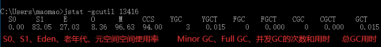

3. **`jinfo [option] vmid`**：即 Configuration Info for Java，实时查看和修改虚拟机各项参数。它可以在不重启虚拟机的情况下，动态修改 JVM 的参数

   * -flag [+|-]name：输出对应名称参数的具体值，其中[+|-]表示开启或关闭对应名称的参数。

   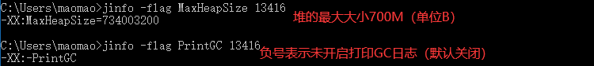

4. **`jmap [option] vmid`**：即 Memory Map for Java，用于生成堆转储快照（一般称为heapdump或dump文件）。除此之外，它还可以查询 finalizer 执行队列、Java 堆和永久代的详细信息，如空间使用率、当前使用的是哪种收集器等。和`jinfo`一样，`jmap`有不少功能在 Windows 平台下也是受限制的。

   * -dump:[live,]format=b,file=\<filename\>：生成堆转储快照，其中live表示是否只dump出存活的对象
   * -histo：显示堆中对象统计信息，包括类、实例数量、合计容量

   

5. **`jhat <filename>`**：即 JVM Heap Analysis Tool，与 jamp 搭配使用，来分析堆转储快照。它内置了一个微型的 HTTP/Web 服务器，让用户可以在浏览器中查看。

   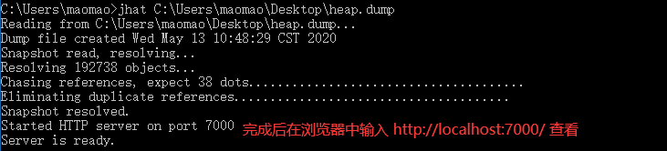

6. **`jstack [option] vmid`**：即Stack Trace for Java，用于生成虚拟机当前时刻的线程快照（一般成为threaddump文件）。线程快照就是当前虚拟机内每一条线程正在执行的方法堆栈的集合。

   生成线程快照的目的主要是定位线程长时间出现停顿的原因，如线程死锁、死循环、请求外部资源导致的长时间等待等。通过`jstack`来查看各个线程的调用堆栈，就可以知道没有响应的线程到底在后台做些什么事情，或者在等待些什么资源。

   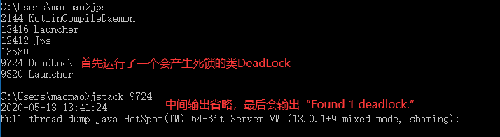


### 4.2 JDK 可视化分析工具

#### 4.2.1 JConsole：Java 监视与管理控制台

JConsole 是一款基于 JMX 的可视化监视、管理工具，可以很方便的监视本地及远程服务器的 java 进程的内存、线程的使用情况。

1. **启动 JConsole**：直接在控制台输出 `jconsole` 命令，或在 JDK/bin 目录下找到 `jconsole.exe` 双击启动

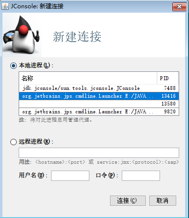

2. **内存监控**：JConsole 可以显示当前内存的详细信息，相当于可视化的 `jstat` 命令。不仅包括堆内存/非堆内存的整体信息，还可以细化到 eden 区、survivor 区等的使用情况，点击右边的“执行 GC(G)”按钮可以强制应用程序执行一个 Full GC。

   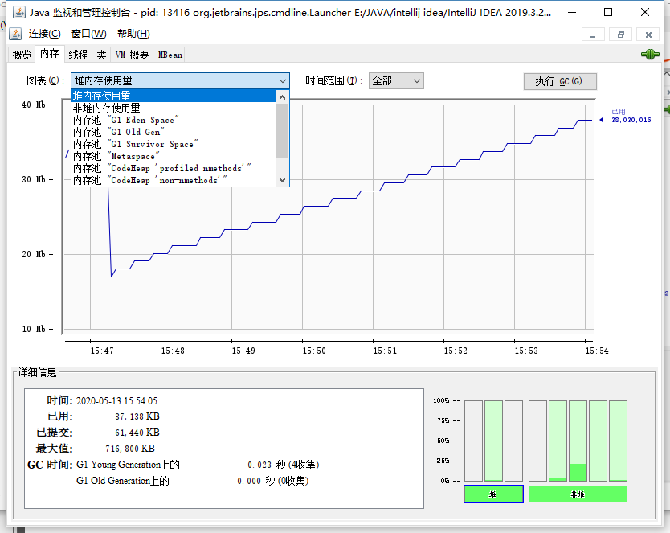

3. **线程监控**：相当于可视化的 `jstack` 命令，最下面有一个"检测死锁 (D)"按钮，点击这个按钮可以找到发生死锁的线程以及它们的详细信息 。


#### 4.2.2 JVisualVM：多合一故障处理工具

JVisualVM 是到目前为止随 JDK 发布的功能最强大的运行监视和故障处理程序，它具备插件扩展的功能，除了运行监视、故障处理外，还提供了很多其他方面的功能，如性能分析（Profiling）。

1. **启动 JVisualVM**：直接在控制台输出 `jvisualvm` 命令，或在 JDK/bin 目录下找到 `JVisualVM.exe` 双击启动


## 5. 类文件结构

在 Java 中，JVM 可以理解的代码就叫做**字节码**（即扩展名为 `.class` 的文件），它不面向任何特定的处理器，只面向虚拟机。Java 语言通过字节码的方式，在一定程度上解决了传统解释型语言执行效率低的问题，同时又保留了解释型语言可移植的特点。**可以说`.class`文件是不同的语言在 Java 虚拟机之间的重要桥梁，同时也是支持 Java 跨平台很重要的一个原因**。

下图展示了不同的语言被不同的编译器编译成`.class`文件最终运行在 Java 虚拟机之上。`.class`文件的二进制格式可以使用 [WinHex](https://www.x-ways.net/winhex/) 查看。


### 5.1 概述

根据 Java 虚拟机规范，类文件由单个 ClassFile 结构组成：

```java
ClassFile {
    u4             magic;	// Class文件的标志
    u2             minor_version;	// Class的小版本号
    u2             major_version;	// Class的大版本号
    u2             constant_pool_count;	// 常量池的数量
    cp_info        constant_pool[constant_pool_count-1];	// 常量池
    u2             access_flags;	// Class 的访问标记
    u2             this_class;	// 当前类
    u2             super_class;	// 父类
    u2             interfaces_count;	// 接口个数
    u2             interfaces[interfaces_count];	// 一个类可以实现多个接口
    u2             fields_count;	// 字段个数
    field_info     fields[fields_count];	// 字段表集合
    u2             methods_count;	// 方法个数
    method_info    methods[methods_count];	// 方法表集合
    u2             attributes_count;	// 属性个数
    attribute_info attributes[attributes_count];	// 属性表集合
}
```

**Class文件字节码结构组织示意图**：


### 5.2 魔数与Class文件版本

```java
    u4             magic;	// Class文件的标志
    u2             minor_version;	// Class的小版本号
    u2             major_version;	// Class的大版本号
```

每个 Class 文件的头四个字节称为魔数（Magic Number），它的唯一作用是**确定这个文件是否为一个能被虚拟机接收的 Class 文件**。 程序设计者很多时候都喜欢用一些特殊的数字表示固定的文件类型或者其它特殊的含义。

紧接着魔数的四个字节存储的是 Class 文件的版本号：第五和第六是**次版本号**，第七和第八是**主版本号**。高版本的 Java 虚拟机可以执行低版本编译器生成的 Class 文件，但是低版本的 Java 虚拟机不能执行高版本编译器生成的 Class 文件。所以，我们在实际开发的时候要确保开发的的 JDK 版本和生产环境的 JDK 版本保持一致。

### 5.3 常量池

```java
    u2             constant_pool_count;	// 常量池的数量
    cp_info        constant_pool[constant_pool_count-1];	// 常量池
```

紧接着主次版本号之后的是常量池，常量池的数量是 constant_pool_count（**常量池计数器是从1开始计数的，将第0项常量空出来是有特殊考虑的，索引值为0代表“不引用任何一个常量池项”**）。

常量池主要存放两大常量：字面量和符号引用。字面量比较接近于 Java 语言层面的的常量概念，如**文本字符串、声明为 final 的常量值**等，而符号引用则属于编译原理方面的概念。

### 5.4 访问标志

```java
    u2             access_flags;	// Class 的访问标记
```

在常量池结束之后，紧接着的 2 个字节代表访问标志，这个标志用于**识别一些类或者接口层次的访问信息**，包括：这个 Class 是类还是接口，是否为 public 或者 abstract 类型，如果是类的话是否声明为 final 等等。

### 5.5 类索引、父类索引与接口索引集合

```java
    u2             this_class;	// 当前类
    u2             super_class;	// 父类
    u2             interfaces_count;	// 接口个数
    u2             interfaces[interfaces_count];	// 一个类可以实现多个接口
```

**类索引用于确定这个类的全限定名，父类索引用于确定这个类的父类的全限定名**。由于 Java 语言的单继承，所以父类索引只有一个，除了 `java.lang.Object` 之外，所有的 java 类都有父类，因此除了 `java.lang.Object` 外，所有 Java 类的父类索引都不为 0。

**接口索引集合用来描述这个类实现了那些接口**，这些被实现的接口将按`implements`(如果这个类本身是接口的话则是`extends`) 后的接口顺序从左到右排列在接口索引集合中。

### 5.6 字段表集合

```java
    u2             fields_count;	// 字段个数
    field_info     fields[fields_count];	// 字段表集合
```

字段表（field info）用于描述接口或类中声明的变量。字段包括类变量以及实例变量，但不包括在方法内部声明的局部变量。

### 5.7 方法表集合

```java
    u2             methods_count;	// 方法个数
    method_info    methods[methods_count];	// 方法表集合
```

Class 文件存储格式中对方法的描述与对字段的描述几乎采用了完全一致的方式。方法表的结构如同字段表一样，依次包括了访问标志、名称索引、描述符索引、属性表集合几项。 

### 5.8 属性表集合

```java
    u2             attributes_count;	// 属性个数
    attribute_info attributes[attributes_count];	// 属性表集合
```

在 Class 文件，字段表，方法表中都可以携带自己的属性表集合，以用于描述某些场景专有的信息。与 Class 文件中其它的数据项目要求的顺序、长度和内容不同，属性表集合的限制稍微宽松一些，不再要求各个属性表具有严格的顺序，并且只要不与已有的属性名重复，任何人实现的编译器都可以向属性表中写入自己定义的属性信息，Java 虚拟机运行时会忽略掉它不认识的属性。


## 6. 虚拟机类加载机制

Class 文件需要加载到虚拟机中之后才能运行和使用，那么虚拟机是如何加载这些 Class 文件呢？

系统加载 Class 类型的文件主要三步：**加载 -> 连接 -> 初始化**。连接过程又可分为三步：**验证 -> 准备 -> 解析**。

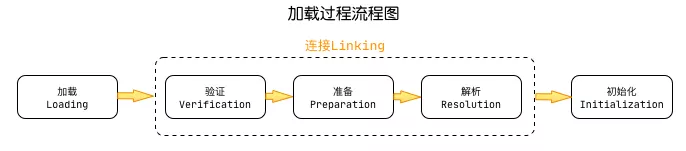

### 6.1 类加载过程

#### 6.1.1 加载

加载（Loading）是类加载过程的第一步，主要完成以下3件事情：

1. 通过类的全限定名（全类名）来获取定义此类的二进制字节流
2. 将字节流所代表的静态存储结构转换为**方法区**的运行时数据结构
3. **在内存中生成一个代表该类的 Class 对象**，作为方法区这些数据的访问入口

《Java虚拟机规范》对上面这3点没有具体要求，因此是非常灵活的。比如："通过全类名获取定义此类的二进制字节流" 并没有指明具体从哪里获取、怎样获取。比如：比较常见的就是从 ZIP 包中读取（日后出现的 JAR、WAR格式的基础）、其他文件生成（典型应用就是JSP）等等。

**非数组类的加载阶段（准确说，是加载阶段获取类的二进制字节流的动作）是可控性最强的阶段，这一步我们可以自定义类加载器去控制字节流的获取方式。数组类型不通过类加载器创建，它由 Java 虚拟机直接创建。**

加载阶段和连接阶段的部分内容是交叉进行的，即加载阶段尚未结束，连接阶段可能就已经开始了。但这两个阶段的开始时间仍然是有先后顺序的。

#### 6.1.2 验证

验证（Verification）阶段是连接阶段的第一步，目的是确保 Class 文件的字节流中包含信息符合当前虚拟机要求，**保证被加载类的正确性**，不会危害虚拟机自身安全。主要包括四种验证：文件格式验证、元数据验证、字节码验证、符号引用验证。比如，第一阶段验证字节流是否符合Class文件格式的规范：是否以魔数 0xCAFFBABY 开头等。

#### 6.1.3 准备

准备（Preparation）阶段**为类变量分配内存，并设置类变量的默认初始值，即零值**，这些内存都将在方法区中分配。对于该阶段有以下几点需要注意：

1. 这时候进行内存分配的**仅包括类变量（static），而不包括实例变量**，实例变量会在对象实例化时随着对象一块分配在 Java 堆中，并进行默认赋值。
2. 这里所设置的初始值"通常情况“下是数据类型默认的零值（如0、0L、null、false等）。比如我们定义了`public static int value = 1` ，那么 value 变量在准备阶段的初始值就是 0 而不是1（初始化阶段才会赋值为1）。当给 value 变量加上了 fianl 关键字`public static final int value = 1` ，那么准备阶段 value 的值就会被赋值为 1，因为此时 value 不是变量，而是常量。

#### 6.1.4 解析

解析（Resolution）阶段是虚拟机**将常量池内的符号引用替换为直接引用的过程**。解析动作主要针对类或接口、字段、类方法、接口方法、方法类型、方法句柄和调用限定符7类符号引用进行。

**符号引用**就是一组符号来描述目标，可以是任何字面量。**直接引用**就是直接指向目标的指针、相对偏移量或一个间接定位到目标的句柄。Java 代码在进行编译时，并不像C和C++那样有“连接”这一步，因此在Class文件中不会保存各个方法、字段最终在内存中的布局信息，这些字段、方法的符号引用不经过虚拟机运行期转换的话，是无法得到真正的内存入口地址，也就无法直接被虚拟机使用。

#### 6.1.5 初始化

初始化（Initialization）是类加载过程的最后一步，也是**真正执行类中定义的 Java 程序代码(字节码)，初始化阶段是执行类构造器 `<clinit> ()`方法的过程**。

`<clinit> ()`方法不同于类的构造器（虚拟机下的`<init>()`方法），它不需要定义，是由 javac 编译器自动收集类中的所有**类变量的赋值动作和静态代码块**中的语句合并产生的，换句话说，如果没有这些语句就不会生成`<clinit> ()`方法。对于该方法的调用，虚拟机会自己确保多线程安全，因为 `<clinit>（）` 方法是带锁线程安全，所以在多线程环境下进行类初始化的话可能会引起死锁，并且这种死锁很难被发现。

对于初始化阶段，虚拟机严格规范了**有且只有** 5 种情况下，必须对类进行初始化：

1. 当遇到 new 、 getstatic、putstatic 或 invokestatic 这4条直接码指令时，比如 new 一个类，读取一个静态字段(未被 final 修饰)、或调用一个类的静态方法时。
2. 使用 `java.lang.reflect` 包的方法对类进行反射调用时 ，如果类没初始化，需要触发其初始化。
3. 初始化一个类，如果其父类还未初始化，则先触发该父类的初始化。
4. 当虚拟机启动时，用户需要定义一个要执行的主类 (包含 main 方法的那个类)，虚拟机会先初始化这个类。
5. 当使用 JDK1.7 的动态动态语言时，如果一个 MethodHandle 实例的最后解析结构为 REF_getStatic、REF_putStatic、REF_invokeStatic、的方法句柄，并且这个句柄没有初始化，则需要先触发器初始化。


### 6.2 类加载器

#### 6.2.1 类加载器分类

所有的类（除了数组）都由类加载器加载，作用就是将 .class 文件加载到内存。JVM 支持两种类型的类加载器：**引导类加载器和自定义类加载器**。《Java虚拟机规范》将**所有派生于抽象类 `java.lang.ClassLoader` 的类加载器**都划分为自定义加载器，因此它包括了扩展类加载器、系统类加载器、以及用户自定义的加载器。所以，如果我们要自定义类加载器，需要继承 `ClassLoader`，然后重写 `findClass()` 方法。

1. **BootstrapClassLoader(启动/引导类加载器)** ：最顶层的加载类，由C++实现（所以不会继承自 ClassLoader），负责加载 `%JAVA_HOME%/lib`目录下的jar包和类或者或被 `-Xbootclasspath`参数指定的路径中的所有类，同时也负责加载扩展类加载器和系统类加载器，并指定为它们的父类加载器。
2. **ExtensionClassLoader(扩展类加载器)** ：主要负责加载目录 `%JRE_HOME%/lib/ext` 目录下的jar包和类，或被 `java.ext.dirs` 系统变量所指定的路径下的jar包。
3. **AppClassLoader(应用程序/系统类加载器)** ：面向我们用户的加载器，负责加载当前应用 classpath 下的所有jar包和类。

```java
public class ClassLoaderTest {
    public static void main(String[] args) {
        // 获取系统类加载器
        ClassLoader systemClassLoader = ClassLoader.getSystemClassLoader();
        // jdk.internal.loader.ClassLoaders$AppClassLoader@3fee733d
        System.out.println(systemClassLoader);

        // 获取其上层：扩展类加载器
        ClassLoader extClassLoader = systemClassLoader.getParent();
        // jdk.internal.loader.ClassLoaders$PlatformClassLoader@723279cf
        System.out.println(extClassLoader); // JDK9将扩展类加载器改为了平台类加载器

        // 试图获取其上层：获取不到引导类加载器
        ClassLoader bootstrapClassLoader = extClassLoader.getParent();
        System.out.println(bootstrapClassLoader);   // null

        // 对于用户自定义类来说：默认使用系统类加载器
        ClassLoader classLoader1 = ClassLoaderTest.class.getClassLoader();
        // jdk.internal.loader.ClassLoaders$AppClassLoader@3fee733d
        System.out.println(classLoader1);

        // 对于Java系统核心类库来说，默认使用引导类加载器
        ClassLoader classLoader2 = String.class.getClassLoader();
        System.out.println(classLoader2);   // null
    }
}
```

#### 6.2.2 双亲委派模型

**1. 双亲委派模型介绍**

每一个类都有一个对应它的类加载器。系统中的 ClassLoader 在协同工作的时候会默认使用 **双亲委派模型** 。即在类加载的时候，系统会首先判断当前类是否被加载过。已经被加载的类会直接返回，否则才会尝试加载。加载的时候，首先会把该请求委派该父类加载器的 `loadClass()` 处理，因此所有的请求最终都应该传送到顶层的启动类加载器 `BootstrapClassLoader` 中。当父类加载器无法处理时，才由自己来处理。当父类加载器为null时，会使用启动类加载器 `BootstrapClassLoader` 作为父类加载器。


**2. 双亲委派模型实现源码**

双亲委派模型的实现代码非常简单，逻辑非常清晰，都集中在 `java.lang.ClassLoader` 的 `loadClass()` 中，相关代码如下所示。

```java
	private final ClassLoader parent; 
	protected Class<?> loadClass(String name, boolean resolve)
        throws ClassNotFoundException
    {
        synchronized (getClassLoadingLock(name)) {
            // 首先，检查请求的类是否已经被加载过
            Class<?> c = findLoadedClass(name);
            if (c == null) {
                long t0 = System.nanoTime();
                try {
                    if (parent != null) {
                    	// 父加载器不为空，调用父加载器loadClass()方法处理
                        c = parent.loadClass(name, false);
                    } else {
                    	// 父加载器为空，使用启动类加载器 BootstrapClassLoader 加载
                        c = findBootstrapClassOrNull(name);
                    }
                } catch (ClassNotFoundException e) {
                   //抛出异常说明父类加载器无法完成加载请求
                }
                
                if (c == null) {
                    long t1 = System.nanoTime();
                    // 自己尝试加载
                    c = findClass(name);

                    sun.misc.PerfCounter.getParentDelegationTime().addTime(t1 - t0);
                    sun.misc.PerfCounter.getFindClassTime().addElapsedTimeFrom(t1);
                    sun.misc.PerfCounter.getFindClasses().increment();
                }
            }
            if (resolve) {
                resolveClass(c);
            }
            return c;
        }
    }
```

**3. 双亲委派模型的好处**

双亲委派模型保证了Java程序的稳定运行，可以**避免类的重复加载**（JVM 区分不同类的方式不仅仅根据类名，相同的类文件被不同的类加载器加载产生的是两个不同的类），也**保证了 Java 的核心 API 不被篡改**。如果没有使用双亲委派模型，而是每个类加载器加载自己的话就会出现一些问题，比如我们编写一个称为 `java.lang.String` 类的话，那么程序运行的时候，系统就会出现多个不同的 `String` 类。

```java
package java.lang;

public class String {
    // 报错，原因是双亲委派机制导致该类由引导类加载器加载，但是核心库中的String类并没有main方法可执行
    // 假如程序其他地方用到了String类，那么不会因为该String类导致不可用，防止核心API不被篡改（沙箱安全机制）
    public static void main(String[] args) {
        System.out.println("自定义的String类");
    }
}
```


## 7. JVM 参数指南

详细的参数说明可查看[官网文档](https://docs.oracle.com/javase/8/docs/technotes/tools/unix/java.html)。根据 JVM 参数开头可以区分参数类型：

1. **标准参数（-）：所有 JVM 都必须实现这些参数的功能，而且向后兼容**；
2. **非标准参数（-X）：默认 JVM 实现这些参数的功能，但并不保证所有 JVM 实现都满足，且不保证向后兼容**；
3. **非Stable参数（-XX）：此类参数各个 JVM 实现会有所不同，将来可能会随时取消，需要慎重使用**。

### 7.1 堆相关

| 参数                      | 含义                                            |
| ------------------------- | ----------------------------------------------- |
| `-Xms<size>`              | 初始堆空间内存（默认为物理内存的1/64）          |
| `-Xmx<size>`              | 最大堆空间内存（默认为物理内存的1/4）           |
| `-Xmn<size>`              | 新生代的大小（初始值及最大值）                  |
| `-XX:NewRatio=<int>`      | 堆中老年代与新生代空间的比例（默认值是 2）      |
| `-XX:SurvivorRatio=<int>` | 新生代中 Eden 和 S0/S1 空间的比例（默认值是 8） |


### 7.2 方法区相关

| 参数                          | 含义                                                    |
| ----------------------------- | ------------------------------------------------------- |
| `-XX:PermSize=<size>`         | 永久代的初始大小（默认值是 20.75 M）                    |
| `-XX:MaxPermSize=<size>`      | 永久代的最大大小（64位机器默认值是 82 M）               |
| `-XX:MetaspaceSize=<size>`    | 元空间的初始大小（默认值约为 21 M，并根据需求动态调整） |
| `-XX:MaxMetaspaceSize=<size>` | 元空间的最大大小（默认值是 -1，即它只受系统内存的限制） |


### 7.3 垃圾收集相关

| 参数                             | 含义                                                         |
| -------------------------------- | ------------------------------------------------------------ |
| `-XX:+PrintGCDetails`            | 输出详细的 GC 处理日志                                       |
| `-XX:MaxTenuringThreshold=<int>` | 新生代垃圾的最大年龄（默认值是 15）                          |
| `-XX:+Use<name>GC`               | 手动指定垃圾收集器（name可以为 Serial、ParNew、Parallel、ConcMarkSweep、G1） |
| `-XX: +UseAdaptiveSizePolicy`    | 开启 Parallel Scavenge 收集器的自适应调节策略                |
| `-XX:G1HeapRegionSize`           | G1 收集器每个 Region 的大小，值是2的幂，范围是1MB 到32MB之间（默认为堆内存的 1 /2000） |
| `-XX:MaxGCPauseMillis`           | G1 收集器期望达到的最大 GC 停顿时间指标，JVM 会尽力实现，但不保证达到（默认值是200 ms） |


### 7.4 其他

| 参数                         | 含义                                               |
| ---------------------------- | -------------------------------------------------- |
| `-XX:+PrintFlagsInitial`     | 查看所有参数的默认初始值                           |
| `-XX:+PrintFlagsFinal`       | 查看所有参数的最终值（可能存在修改，不再是初始值） |
| `-XX:+PrintCommandLineFlags` | 查看命令行相关参数                                 |
|                              |                                                    |


## 参考

1. 《深入理解Java虚拟机（第3版）周志明》
2. [2020最新-JVM-Java虚拟机-从入门到精通-尚硅谷](https://www.bilibili.com/video/BV1BJ41177cp?from=search&seid=13768760941024075430)
3. [Oracle 官方文档](https://docs.oracle.com/javase/specs/index.html)