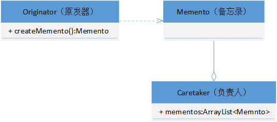

## 一 设计模式基础

### 1.1 设计模式七大原则

* **单一职责原则**：对类来说的，**即一个类应该只负责一项职责**。如类A负责两个不同职责：职责1、职责2。当职责1需求变更而改变A时，可能造成职贵2执行错误，所以需要将类A的粒度分解为A1、A2。
* **接口隔离原则**：客户端不应该依赖它不需要的接口，即**一个类对另一个类的依赖应该建立在最小的接口上**。
* **依赖倒转原则**：抽象不应该依赖细节，细节应该依赖抽象，其中心思想是**面向接口编程**。相对于细节的多变性，抽象的东西要稳定的多。在Java中，抽象指的是接口或抽象类，细节就是具体的实现类。使用**接口或抽象类的目的是制定好规范**，而不涉及任何具体的操作，把展现细节的任务交给他们的实现类去完成。
* **里氏替换原则**：父类中凡是已经实现好的方法，实际上是在设定规范，虽然它不强制要求所有的子类必须遵循，但是如果子类对这些已经实现的方法任意修改，就会对整个继承体系造成破坏。里氏替换原则中，**子类尽量不要重写或重载父类的方法**，同时**任何父类可以出现的地方，子类一定可以出现**。
* **开闭原则（OCP原则）**：**最基础、最重要**的设计原则，即**对扩展开放，对修改关闭**。在程序需要进行拓展的时候，不能去修改原有的代码，而是扩展原有代码，实现一个热插拔的效果。
* **迪米特原则（最少知道原则）**：**一个类对自己依赖的类知道的越少越好**，也就是说无论被依赖的类多么复杂，都应该将逻辑封装在方法的内部，通过public方法提供给外部。这样当被依赖的类变化时，才能最小的影响该类。它的另一个表达方式是：**只与直接的朋友通信**。我们称出现为**成员变量、方法参数、方法返回值**中的类为直接朋友，而局部变量、临时变量则不是直接朋友。也是就说，陌生的类不要作为局部变量出现在类中。
* **合成复用原则**：原则是**尽量首先使用合成/聚合**的方式，而不是使用继承。


### 1.2 UML 类图

​	

* **依赖(dependence)**：类A使用到了类B，则称类A依赖于类B，使用**虚线箭头**表示。使用的含义包括：B作为A的成员属性、方法接收的参数或返回值、方法内部使用。
* **继承/泛化(generalization)**：继承是依赖的特例，使用**空心三角形+实线**表示。
* **实现(implementation)**：实现是依赖的特例，使用**空心三角形+虚线**表示。
* **关联(association)**：关联表示拥有的联系，具有导航性（单向/双向）和多重性（n对m），它是依赖关系的特例，使用**实线箭头**表示。
* **聚合(aggregation)**：聚合表示弱的拥有关系（has-a），强调**整体和部分可以分开**，它是关联的特例，使用**空心菱形+实线箭头**表示。
* **组合(composition)**：组合表示强的拥有关系（contains-a），强调**整体和部分不可以分开**，它是关联的特例，使用**实心菱形+实线箭头**表示。


## 二 创建型模式

创建型模式(Creational Pattern)**对类的实例化过程进行了抽象**，能够将软件模块中对象的创建和对象的使用分离。为了使软件的结构更加清晰，外界对于这些对象只需要知道它们共同的接口，而不清楚其具体的实现细节，使整个系统的设计更加符合单一职责原则。

### 2.1 单例模式

1. **单例模式简介**

   所谓单例模式，就是采取一定的方法保证在整个系统中，**对某个类只能存在一个对象实例**。对于一些需要频繁创建和销毁的对象，使用单例模式可以节约系统资源，提高系统性能。

   单例模式的适用场景：需要频繁创建和销毁的对象、创建对象时耗时过多或耗费资源过多（即重量级对象），但又经常用到的对象、工具类对象、频繁访问数据库或文件的对象（如数据源、session 工厂等）。

   单例模式的应用实例：java.lang包下的 Runtime 类。

2. **单例模式的实现**

   通常单例模式在Java语言中，有两种构造方式：**饿汉式**——指单例实例在**类装载时创建**；**懒汉式**——指单例实例在**第一次被使用时创建**。不管是何种创建方式，它们都有相似之处，如单例类构造函数必须私有化，确保外部不能生成对象；singleton 成员变量和 getSingleton() 方法必须是 static 的。

* 饿汉式（静态变量）

  ```java
  // 优点：写法比较简单，在类装载的时候就完成实例化，避免了线程同步问题
  // 缺点：在类装载时完成实例化，没有达到懒加载的效果，若从始至终都未使用过这个实例，则会造成内存浪费
  // 结论：这种单例模式可用，但可能造成内存浪费
  public class Singleton {
      // 构造函数私有化，外部不能new
      private Singleton() {
      }
  
      // 本类内部创建对象实例
      private static Singleton singleton = new Singleton();
  
      // 提供一个共有的静态方法，返回实例对象
      public static Singleton getSingleton() {
          return singleton;
      }
  }
  ```

* 饿汉式（静态代码块）

  ```java
  // 优缺点、结论与饿汉式（静态变量）相同
  public class Singleton {
  	private Singleton() {
  	}
  
  	private static Singleton singleton;
  
  	// 在静态代码块中创建单例对象
  	static {
  		singleton = new Singleton();
  	}
  
  	public static Singleton getSingleton() {
  		return singleton;
  	}
  }
  ```

* 懒汉式（线程不安全）

  ```java
  // 优点：起到了懒加载的效果，但只能在单线程下使用
  // 缺点：在多线程下会产生多个实例
  // 结论：实际开发中，不要使用这种方式
  public class Singleton {
      private Singleton() {
      }
  
      private static Singleton singleton;
  
      // 当使用到该方法时，才去创建实例，即懒汉式
      public static Singleton getSingleton() {
          if (singleton == null) {
              singleton = new Singleton();
          }
          return singleton;
      }
  }
  ```

* 懒汉式（线程安全）

  ```java
  // 优点：解决了线程安全问题
  // 缺点：效率太低，每个线程在获取类的实例时，都要进行同步
  // 结论：实际开发中，不推荐使用
  public class Singleton {
      private Singleton() {
      }
  
      private static Singleton singleton;
  
      // 加入同步处理的代码，解决线程安全问题
      public static synchronized Singleton getSingleton() {
          if (singleton == null) {
              singleton = new Singleton();
          }
          return singleton;
      }
  }
  ```

* **懒汉式（双重检查）**

  ```java
  // 结论：线程安全，延迟加载，效率较高，推荐使用
  public class Singleton {
      private Singleton() {
      }
  
      private static volatile Singleton singleton;
  
      // 加入双重检查代码，解决线程安全问题和懒加载问题
      public static synchronized Singleton getSingleton() {
          if (singleton == null) {
              synchronized (Singleton.class) {
                  if (singleton == null) {
                      singleton = new Singleton();
                  }
              }
          }
          return singleton;
      }
  }
  ```

* **懒汉式（静态内部类）**

  ```java
  // 结论：线程安全，延迟加载，效率高，推荐使用
  public class Singleton {
      private Singleton() {
      }
  
      // 提供一个静态内部类，它在Singleton类被装载时不会立即实例化，而是在需要实例化时，调用getSingleton()进行装载
      private static class SingletonInstance {
          // 类的静态属性只会在第一次加载类时初始化，IVM保证了线程安全
          private static final Singleton SINGLETON = new Singleton();
      }
  
      public static synchronized Singleton getSingleton() {
          return SingletonInstance.SINGLETON;
      }
  }
  ```

* **饿汉式（枚举）**

  ```java
  // 结论：线程安全，还可防止反序列化重新创建对象，推荐使用
  public enum Singleton {
  	SINGLETON;
  }
  ```

  

### 2.2 工厂方法模式

1. **工厂模式简介**

   工厂模式在基类中定义创建对象的一个接口，让子类决定实例化哪个类，工厂方法让一个类的实例化延迟到子类中进行。**工厂模式分为简单工厂模式、工厂方法模式、抽象工厂模式**，它**将对象的创建和使用分离**，创建过程由工厂来统一管理，所以一旦发生业务逻辑变化，只需要修改工厂，从而提高项目的扩展性和可维护性，这也更加符合“单一职责原则”。

   工厂模式的适用场景：客户端不关心对象的创建过程。

   工厂模式的应用实例：Java中的 Calendar 类使用了简单工厂模式。

2. **简单工厂模式的实现**

   严格的说，简单工厂模式并不是23种常用的设计模式之一，它只算工厂模式的一个特殊实现。简单工厂模式在实际中的应用相对于其他2个工厂模式用的还是相对少得多，因为它只适应很多简单的情况。

   假设创建一个可以绘制不同形状的绘图工具，绘制圆形、正方形、矩形。简单工厂模式的类图关系如下：

   

   第一步，我们创建一个接口：

   ```java
   public interface Shape {
      void draw();
   }
   ```

   第二步，创建3个实现接口的实体类：

   ```java
   public class Circle implements Shape {
       @Override
       public void draw() {
           System.out.println("Draw Circle");
       }
   }
   ```

   ```java
   public class Square implements Shape {
       @Override
       public void draw() {
           System.out.println("Draw Square");
       }
   }
   ```

   ```java
   public class Rectangle implements Shape {
       @Override
       public void draw() {
           System.out.println("Draw Rectangle");
       }
   }
   ```

   第三步，创建工厂类：

   ```java
   public class ShapeFactory {
       public static Shape getShape(String shapeType) {
           if (shapeType.equalsIgnoreCase("CIRCLE")) {
               return new Circle();
           } else if (shapeType.equalsIgnoreCase("RECTANGLE")) {
               return new Rectangle();
           } else if (shapeType.equalsIgnoreCase("SQUARE")) {
               return new Square();
           }
           return null;
       }
   }
   ```

   最后，进行测试：

   ```java
   public class Test {
       public static void main(String[] args) {
           Shape circle = ShapeFactory.getShape("CIRCLE");
           circle.draw();	// Draw Circle
   
           Shape rectangle = ShapeFactory.getShape("RECTANGLE");
           rectangle.draw();	// Draw Rectangle
   
           Shape square = ShapeFactory.getShape("SQUARE");
           square.draw();	// Draw Square
       }
   }
   ```

   总结：简单工厂模式简单易操作，但是它**违反了开放封闭原则**，即对扩展开放，对修改关闭。当我们要新增产品（如三角形）时，就需要修改工厂类中的getShape()方法，在switch-case 语句（或者if-else 语句）中添加分支条件。

3. **工厂方法模式的实现**

   工厂方法模式应该是工厂模式中使用最多的模式，它是简单工厂的进一步深化。在工厂方法模式中，我们不再提供一个统一的工厂类来创建所有的对象，而是针对不同的对象提供不同的工厂，也就是说**每个对象都有一个与之对应的工厂**。

   同样是上面的案例，工厂方法模式的类图关系如下：

   

   第一步，我们增加一个工厂接口：

   ```java
   public interface Factory {
       public Shape getShape();
   }
   ```

   第二步，增加3个实现工厂接口的工厂类：

   ```java
   public class CircleFactory implements Factory {
       @Override
       public Shape getShape() {
           return new Circle();
       }
   }
   ```

   ```java
   public class RectangleFactory implements Factory {
       @Override
       public Shape getShape() {
           return new Rectangle();
       }
   }
   ```

   ```java
   public class SquareFactory implements Factory {
       @Override
       public Shape getShape() {
           return new Square();
       }
   }
   ```

   最后，进行测试：

   ```java
   public class Test {
       public static void main(String[] args) {
           Factory circleFactory = new CircleFactory();
           Shape circle = circleFactory.getShape();
           circle.draw();  // Draw Circle
       }
   }
   ```

   总结：当我们要新增产品（如三角形）时，除了增加一个 Triangle 类外，还需要额外增加一个具体的工厂类 TriangleFactory，而不用再修改原有的代码逻辑。但是当产品类增加过多时，相应的工厂类也会随之增加，软件的维护性和扩展性并不是特别好。

   

### 2.3 抽象工厂模式

1. **抽象工厂模式的实现**

   抽象工厂模式是工厂方法模式的进一步深化，在这个模式中的工厂类不单单可以创建一种产品，而是可以创建一组产品。

   假设创建一个绘图工具，不仅可以绘制不同形状：圆形、正方形、矩形，还可以绘制不同颜色：红色、绿色、蓝色。如果仍然使用工厂方法模式，则需要创建对应的6个具体工厂类，可见其扩展性并不好；而如果使用抽象工厂模式，则只需要两个具体工厂类，抽象工厂模式的类图关系如下：

   

   我们仍然使用上一节的描述形状的接口，以及3个具体的实现类。第一步，我们再新增一个描述颜色的接口，以及3个具体的实现类。

   ```java
   public interface Color {
       void fill();
   }
   ```

   ```java
   public class Red implements Color {
       @Override
       public void fill() {
           System.out.println("Fill Red");
       }
   }
   ```

   ```java
   public class Green implements Color {
       @Override
       public void fill() {
           System.out.println("Fill Green");
       }
   }
   ```

   ```java
   public class Blue implements Color {
       @Override
       public void fill() {
           System.out.println("Fill Blue");
       }
   }
   ```

   第二步，新增一个抽象工厂，以及2个实现抽象工厂中抽象方法的具体工厂：

   ```java
   public abstract class AbstractFactory {
       public abstract Color getColor(String color);
   
       public abstract Shape getShape(String shape);
   }
   ```

   ```java
   public class ShapeFactory extends AbstractFactory {
       @Override
       public Shape getShape(String shape) {
           if (shape.equalsIgnoreCase("CIRCLE")) {
               return new Circle();
           } else if (shape.equalsIgnoreCase("RECTANGLE")) {
               return new Rectangle();
           } else if (shape.equalsIgnoreCase("SQUARE")) {
               return new Square();
           }
           return null;
       }
   
       @Override
       public Color getColor(String color) {
           return null;
       }
   }
   ```

   ```java
   public class ColorFactory extends AbstractFactory {
       @Override
       public Shape getShape(String shapeType) {
           return null;
       }
   
       @Override
       public Color getColor(String color) {
           if (color.equalsIgnoreCase("RED")) {
               return new Red();
           } else if (color.equalsIgnoreCase("GREEN")) {
               return new Green();
           } else if (color.equalsIgnoreCase("BLUE")) {
               return new Blue();
           }
           return null;
       }
   }
   ```

   第三步，创建一个工厂生成器类，通过传递形状或颜色信息来获取工厂：

   ```java
   public class FactoryProducer {
       public static AbstractFactory getFactory(String choice) {
           if (choice.equalsIgnoreCase("SHAPE")) {
               return new ShapeFactory();
           } else if (choice.equalsIgnoreCase("COLOR")) {
               return new ColorFactory();
           }
           return null;
       }
   }
   ```

   最后，进行测试：

   ```java
   public class Test {
       public static void main(String[] args) {
           AbstractFactory shapeFactory = FactoryProducer.getFactory("SHAPE");
           Shape shape = shapeFactory.getShape("CIRCLE"); 
           shape.draw();   // Draw Circle
   
           AbstractFactory colorFactory = FactoryProducer.getFactory("COLOR");
           Color color = colorFactory.getColor("RED");
           color.fill();   // Fill Red
       }
   }
   ```

2. **工厂方法与抽象工厂对比**

   | 工厂方法模式                                   | 抽象工厂模式                                   |
   | :--------------------------------------------- | :--------------------------------------------- |
   | 针对的是**单个**产品等级结构                   | 针对的是**多个**产品等级结构                   |
   | **一个**抽象产品类                             | **多个**抽象产品类                             |
   | 可以派生出多个具体产品类                       | 每个抽象产品类可以派生出多个具体产品类         |
   | 一个抽象工厂类，可以派生出多个具体工厂类       | 一个抽象工厂类，可以派生出多个具体工厂类       |
   | 每个具体工厂类只能创建**一个**具体产品类的实例 | 每个具体工厂类可以创建**多个**具体产品类的实例 |

 

### 2.4 原型模式

1. **原型模式简介**

   在软件系统中，有些对象的创建过程较为复杂，且有时需要频繁创建，原型模式通过给出一个原型对象来指明所要创建的对象的类型，然后用复制这个原型对象的办法，创建出更多同类型的对象，这就是原型模式的意图所在。简单的说就是：**使用原型实例指定将要创建的对象类型，通过复制这个实例创建新的对象**。

   在使用原型模式克隆对象时，**根据其成员对象是否也克隆**，可以分为两种形式**深克隆和浅克隆**。由于Object类提供一个clone()方法，可以将对象复制一份，因此Java语言中的原型模式实现很简单。

   原型模式的适用场景：通过 new 产生一个对象需要非常繁琐的数据准备或访问权限、一个对象多个修改者。

   原型模式的应用实例：Java中的 Object clone() 方法、Spring中原型bean的创建。

2. **原型模式的角色**

   原型模式的类图如下，其中有3个角色：

   * **Prototype**：抽象原型类，负责**定义**用于复制现有实例来生成新实例的方法。

   * **ConcretePrototype**：具体原型类，负责**实现**复制现有实例并生成新实例的方法。

   * **Client**：客户类/使用者，负责使用复制实例的方法生成新的实例。

   

3. **原型模式的实现**

   第一步，我们自定义一个颜色类，用于验证是深拷贝还是浅拷贝：

   ```java
   public class Color{
       private String color;
   
       public Color(String color){
           this.color = color;
       }
   }
   ```

   第二步，创建一个抽象原型类，定义一个用于复制现有实例的抽象方法：

   ```java
   public abstract class Shape implements Cloneable {
       private Color color;  // 对象成员变量
   
       public void setColor(Color color) {
           this.color = color;
       }
   
       public Color getColor() {
           return color;
       }
   
       abstract void draw();
   
       abstract Shape creatClone();
   }
   ```

   第三步，我们创建一个具体原型类，实现抽象类中定义的复制方法：

   ```java
   public class Circle extends Shape {
       @Override
       public void draw() {
           System.out.println("Draw Circle");
       }
   
       @Override
       public Shape creatClone() {
           Shape shape = null;
           try {
               // 直接调用Object类中的clone()方法
               shape = (Shape) super.clone();
           } catch (CloneNotSupportedException e) {
               e.printStackTrace();
           }
           return shape;
       }
   }
   ```

   最后，直接在客户类中使用复制实例的方法进行测试：

   ```java
   public class Client {
       public static void main(String[] args) {
           Shape circle1 = new Circle();
           Color color1 = new Color("Red");
           circle1.setColor(color1);
   
           Shape circle2 = circle1.creatClone();
           Color color2 = circle2.getColor();
           circle2.draw(); // Draw Circle
   
           System.out.println(circle1 == circle2); // false
           System.out.println(circle1.hashCode()); // 189568618
           System.out.println(circle2.hashCode()); // 793589513
   
           System.out.println(color1 == color2); // true
           System.out.println(color1.hashCode()); // 495053715
           System.out.println(color2.hashCode()); // 495053715
       }
   }
   ```

   可以看出，直接调用Object类中的clone()方法，实现的是对象的浅拷贝功能。

4. **深拷贝的两种实现**

* **重写clone()方法**

  首先，我们修改颜色类，让它实现 ``Cloneable`` 接口，并实现clone()方法：

  ```java
  public class Color implements Cloneable {
      private String color;
  
      public Color(String color) {
          this.color = color;
      }
  
      @Override
      protected Color clone() {
          Color color = null;
          try {
              // 直接调用Object类中的clone()方法
              color = (Color) super.clone();
          } catch (CloneNotSupportedException e) {
              e.printStackTrace();
          }
          return color;
      }
  }
  ```

  然后，我们修改具体原型类，对其中包含的成员对象也调用clone()方法进行拷贝：

  ```java
  public class Circle extends Shape {
      @Override
      public void draw() {
          System.out.println("Draw Circle");
      }
  
      @Override
      public Shape creatClone() {
          Shape shape = null;
          try {
              // 直接调用Object类中的clone()方法
              shape = (Shape) super.clone();
              // 包含的对象成员变量同样调用clone()方法
              Color color = this.getColor().clone();
              shape.setColor(color);
          } catch (CloneNotSupportedException e) {
              e.printStackTrace();
          }
          return shape;
      }
  }
  ```

  最后，运行客户类进行测试，会发现两个color对象不相等，即实现了对象的深拷贝功能。

* **使用对象序列化（推荐）**

  首先，为了能够序列化，我们修改颜色类，让它实现 ``Serializable`` 接口：

  ```java
  public class Color implements Cloneable, Serializable
  ```

  同样地，我们让形状类实现 ``Serializable`` 接口，并定义一个深拷贝的抽象方法：

  ```java
  public abstract class Shape implements Cloneable, Serializable {
  	// 抽象类中的其它内容不变
      abstract Object deepClone();
  }
  ```

  然后，我们修改具体原型类，实现抽象类中刚刚定义的深拷贝方法：

  ```java
  @Override
  public Object deepClone() {
      ByteArrayOutputStream bos = null;
      ObjectOutputStream oos = null;
      ByteArrayInputStream bis = null;
      ObjectInputStream ois = null;
      
      try {
          // 序列化
          bos = new ByteArrayOutputStream();
          oos = new ObjectOutputStream(bos);
          oos.writeObject(this);
  		// 反序列化
          bis = new ByteArrayInputStream(bos.toByteArray());
          ois = new ObjectInputStream(bis);
          Object object = ois.readObject();
          return object;
      
      } catch (Exception e) {
          e.printStackTrace();
          return null;
      } finally {
          try {
              if (oos != null)
                  oos.close();
          } catch (IOException e) {
              e.printStackTrace();
          }
           try {
              if (ois != null)
                  ois.close();
           } catch (IOException e) {
              e.printStackTrace();
           }
      }
  }
  ```

  最后，修改客户类并运行，同样也实现了对象的深拷贝功能。


### 2.5 建造者模式

1. **建造者模式简介**

   建造者模式又名生成器模式，它可以**将产品本身与产品的创建过程解耦，使得相同的创建过程可以创建不同的产品对象**。建造者模式所创建的产品一般具有较多的共同点，其组成部分相似，如果产品之间的差异性很大，则不适合使用建造者模式。与工厂模式相比，建造者模式更加**关注零件装配的顺序**。

   由于具体建造者都相对独立，因此增加新的具体建造者时无须修改原有代码，**符合开闭原则**，同时用户使用不同的具体建造者可以得到不同的产品对象。但是，如果产品的内部变化复杂，可能会导致需要定义很多具体建造者类来实现这种变化，导致系统变得很庞大。

   建造者模式的适用场景：需要生成的对象具有复杂的内部结构、需要生成的对象内部属性本身相互依赖。

   建造者模式的应用实例：Java中的 StringBuilder。

2. **建造者模式的角色**

   建造者模式的类图如下，其中有4个角色：

   

   * **Product**：产品角色，一个具体的产品对象。
   * **Builder**：抽象建造者，创建一个Product对象的各个部件指定的抽象接口。
   * **ConcreteBuilder**：具体建造者，实现抽象接口，构建和装配各个部件。
   * **Director**：指挥者，构建一个使用Builder接口的对象。它主要是用于创建一个复杂的对象，主要有两个作用：一是隔离了客户与对象的生产过程，二是负责控制产品对象的生产过程。

3. **建造者模式的实现**

   建造者模式可以用于描述KFC如何创建套餐：套餐是一个复杂对象，它一般包含主食（如汉堡、鸡肉卷等）和饮料（如果汁、可乐等）等组成部分，不同的套餐有不同的组成部分，而KFC的服务员可以根据顾客的要求，一步一步装配这些组成部分，构造一份完整的套餐，然后返回给顾客。

   第一步，我们创建一个具体的产品对象（Product）：

   ```java
   public class Meal {
       private String food;
       private String drink;
   
       public void setFood(String food) {
           this.food = food;
       }
   
       public void setDrink(String drink) {
           this.drink = drink;
       }
   
       @Override
       public String toString() {
           return "Meal{" +
                   "food='" + food + '\'' +
                   ", drink='" + drink + '\'' +
                   '}';
       }
   }
   ```

   第二步，创建一个Product对象的各个部件指定的抽象建造者（Builder）：

   ```java
   public abstract class MealBuilder {
       Meal meal = new Meal();
   
       // 抽象出产品的创建过程，与产品本身分离
       public abstract void buildFood();
   
       public abstract void buildDrink();
   
       public Meal getMeal() {
           return meal;
       }
   }
   ```

   第三步，创建两个套餐，实现抽象建造者中的方法，构建和装配各个部件（ConcreteBuilder）：

   ```java
   public class MealA extends MealBuilder{
       public void buildDrink() {
           meal.setDrink("可乐");
       }
   
       public void buildFood() {
           meal.setFood("薯条");
       }
   }
   ```

   ```java
   public class MealB extends MealBuilder{
       public void buildDrink() {
           meal.setDrink("柠檬果汁");
       }
   
       public void buildFood() {
           meal.setFood("鸡翅");
       }
   }
   ```

   第四步，创建服务员，负责产品的生成过程，并将其与客户隔离（Director）：

   ```java
   public class KFCWaiter {
       private MealBuilder mealBuilder;
   
       public KFCWaiter(MealBuilder mealBuilder) {
           this.mealBuilder = mealBuilder;
       }
   
       public Meal construct(){
           mealBuilder.buildFood();    // 准备食物
           mealBuilder.buildDrink();   //准备饮料
           return mealBuilder.getMeal();   // 返回套餐
       }
   }
   ```

   最后，进行测试：

   ```java
   public class Test {
       public static void main(String[] args) {
           MealA a = new MealA();
           KFCWaiter waiter = new KFCWaiter(a);
           Meal mealA = waiter.construct();
           System.out.println(mealA.toString());   // Meal{food='薯条', drink='可乐'}
       }
   }
   ```

   

## 三 结构型模式

结构型模式(Structural Pattern)描述如何**将类或者对象结合在一起**形成更大的结构，就像搭积木，可以通过简单积木的组合形成复杂的、功能更为强大的结构。

### 3.1 适配器模式

1. **适配器模式简介**

   适配器模式**将某个类的接口转换成客户端期望的另一个接口表示**，主要目的是兼容性，让原本因接口不匹配而不能一起工作的那些类可以一起工作。适配器模式与装饰模式一样具有包装的功能，此外，它还具有委托的意思。注意，适配器不是在详细设计时添加的，而是解决正在服役的项目问题。

   适配器模式的适用场景：已经存在的类的接口不符合需求。

   适配器模式的应用实例：SpringMVC中的 HandlerAdapter。

2. **适配器模式的角色**

   适配器模式的类图如下，其中有4个角色：**Adaptee（被适配者）、Adapter（适配器）、Target（目标接口）、Client（客户端）**。

   

   根据被适配者在适配器 Adapter 中的形式不同，可以将适配器模式分为3种：

   * 类适配器：被适配者在 Adapter 中作为一个**类，继承**；
   * 对象适配器：被适配者在 Adapter 中作为一个**对象，持有**；
   * 接口适配器：被适配者在 Adapter 中作为一个**接口，实现**。

3. **类适配器模式**

   以生活中充电器的例子为例，充电器本身就相当于适配器，220 V交流电相当于被适配者，我们的目标是5 V直流电，手机则是客户端。
   
   第一步，我们创建一个220 V的交流电（Adaptee）：
   
   ```java
   public class Voltage220 {
       public int output220V() {
           int src = 220;
           System.out.println("当前电压为" + src + "V");
           return src;
       }
   }
   ```
   
   第二步，创建一个5 V直流电的目标接口（Target）：
   
   ```java
   public interface IVoltage5 {
       public int output5V();
   }
   ```
   
   第三步，创建可以将220 V电压转换为5 V电压的充电器（Adapter）：
   
   ```java
   // 类适配器模式：Adapter适配器继承被适配者
   public class Charger extends Voltage220 implements IVoltage5 {
       @Override
       public int output5V() {
           int src = output220V(); // 获取220V电压
           System.out.println("充电器转换电压中...");
           int dst = src / 44; // 转换为5V电压
           return dst;
       }
   }
   ```
   
   第四步，创建手机客户端（Client）：
   
   ```java
   public class Phone {
       public void charging(IVoltage5 iVoltage5) {
           if (iVoltage5.output5V() == 5) {
               System.out.println("当前电压为5V，可以充电");
           } else if (iVoltage5.output5V() > 5) {
               System.out.println("当前电压大于5V，不可以充电");
           }
       }
   }
   ```
   
   最后，进行测试：
   
   ```java
   public class Test {
       public static void main(String[] args) {
           Phone phone = new Phone();
           phone.charging(new Charger());	// 当前电压为5V，可以充电
       }
   }
   ```
   
   总结：通过继承的方式，Adapter 适配器可以根据需求重写 Adaptee 被适配者中的方法，增加了灵活性。但是由于Java是单继承的，使得我们的目标只能是个接口，且 Adaptee 中的方法在适配器中暴露出来，增加了使用成本。     

4. **对象适配器模式**

   对象适配器模式的思路与类适配器模式基本相同，只是将Adapter类稍作修改，不是继承被适配者，而是**持有被适配者类的实例**，以解决兼容性问题。这也符合**“合成复用原则”**，在系统中尽量使用关联关系（聚合）来替代继承关系。

   我们只修改充当适配器角色的充电器，使用关联关系（聚合）实现：

   ```java
   public class Charger implements IVoltage5 {
       private Voltage220 voltage220;  // 关联关系（聚合）
   
       // 通过构造器，传入一个Voltage220的实例
       public Charger(Voltage220 voltage220) {
           this.voltage220 = voltage220;
       }
   
       @Override
       public int output5V() {
           int src = voltage220.output220V(); // 获取220V电压
           System.out.println("充电器转换电压中...");
           int dst = src / 44; // 转换为5V电压
           return dst;
       }
   }
   ```

   最后，进行测试：

   ```java
   public class Test {
       public static void main(String[] args) {
           Phone phone = new Phone();
           phone.charging(new Charger(new Voltage220()));	// 当前电压为5V，可以充电
       }
   }
   ```

5. **接口适配器模式**

   接口适配器模式的核心思路：当**不需要全部实现接口提供的方法**时，可先设计一个**抽象类实现接口**，并为该接口中每个方法提供一个**默认实现(空方法)**，那么该抽象类的子类可有选择地覆盖父类的某些方法来实现需求。因此，它适用于不想使用一个接口中所有方法的情况。

   比如在 java.awt.event 包下的 MouseListener 接口，其中定义了5个抽象方法。但是我们只需要使用其中的一个方法，如果不使用适配器，那么我们每次使用时都需要将其中的定义的方法全部实现。下面使用接口适配器进行实现。

   首先，我们让接口适配器对MouseListener接口中的每一个抽象方法都提供默认实现（空实现）：

   ```java
   public abstract class MouseListenerAdapter implements MouseListener {
       @Override
       public void mouseClicked(MouseEvent e) {
       }
   
       @Override
       public void mousePressed(MouseEvent e) {
       }
   
       @Override
       public void mouseReleased(MouseEvent e) {
       }
   
       @Override
       public void mouseEntered(MouseEvent e) {
       }
   
       @Override
       public void mouseExited(MouseEvent e) {
       }
   }
   ```

   然后，进行测试，以后当使用到MouseListener 时，只需要重写我们需要的接口方法即可：

   ```java
   public class Client {
       public static void main(String[] args) {
           JFrame jFrame = new JFrame();
           jFrame.setSize(200, 200);
           jFrame.setVisible(true);
           jFrame.addMouseListener(new MouseListenerAdapter(){
               // 只需要重写我们需要的接口方法，不用全部实现
               @Override
               public void mouseClicked(MouseEvent e) {
                   System.out.println("鼠标按下并释放触发");
               }
           });
       }
   }
   ```

   

### 3.2 桥接模式

1. **桥接模式简介**

   桥接模式将实现与抽象放在两个不同的类层次中，使得两者可以独立变化，提高系统的灵活性。它**将类与类之间的继承关系，变为抽象类/接口与接口之间的关联关系**，既减少了子类的个数，又将实现与抽象解耦。

   桥接模式的适用场景：因多层次继承导致类爆炸的系统。

   桥接模式的应用实例：JDBC的 Driver 接口。

2. **桥接模式的角色**

   桥接模式的类图如下，其中有4个角色：

   

   * **Abstraction**：抽象化角色，充当桥接类，持有实现化角色的引用。
   * **RefinedAbstraction**：修正抽象化角色，实现 Abstraction 中的业务方法。
   * **Implementor**：实现化角色，供修正抽象化角色调用，它是底层操作的抽象，而 Abstraction 是更高一层的抽象。
   * **ConcreteImplementor**：具体实现化角色，给出 Implementor 的具体实现。

3. **桥接模式的实现**

   假设手机有两种类型：折叠式、直立式，每一种类型都有华为、小米、苹果等品牌，要求对不同类型的不同品牌手机实现开机/关机操作。

   第一步，我们创建手机品牌的接口（Implementor）：

   ```java
   public interface Brand {
       void open();
       void close();
   }
   ```

   第二步，创建不同品牌的手机，实现开机/关机操作（ConcreteImplementor）：

   ```java
   public class HuaWei implements Brand {
       @Override
       public void open() {
           System.out.println("华为手机开机");
       }
   
       @Override
       public void close() {
           System.out.println("华为手机关机");
       }
   }
   ```

   ```java
   public class XiaoMi implements Brand {
       @Override
       public void open() {
           System.out.println("小米手机开机");
       }
   
       @Override
       public void close() {
           System.out.println("小米手机关机");
       }
   }
   ```

   第三步，创建手机抽象类，持有一个品牌接口（Abstraction）：

   ```java
   public abstract class Phone {
       private Brand brand;
   
       public Phone(Brand brand) {
           this.brand = brand;
       }
   
       protected void open(){
           this.brand.open();
       }
   
       protected void close(){
           this.brand.close();
       }
   }
   ```

   第四步，创建不同类型的手机（RefinedAbstraction）：

   ```java
   public class FoldedPhone extends Phone {
       public FoldedPhone(Brand brand) {
           super(brand);
       }
   
       @Override
       protected void open() {
           System.out.print("折叠的");
           super.open();
       }
   
       @Override
       protected void close() {
           System.out.print("折叠的");
           super.close();
       }
   }
   ```

   ```java
   public class UpRightPhone extends Phone {
       public UpRightPhone(Brand brand) {
           super(brand);
       }
   
       @Override
       protected void open() {
           System.out.print("直立的");
           super.open();
       }
   
       @Override
       protected void close() {
           System.out.print("直立的");
           super.close();
       }
   }
   ```

   最后，进行测试：

   ```java
   public class Test {
       public static void main(String[] args) {
           Phone phone = new FoldedPhone(new HuaWei());
           phone.open();	// 折叠的华为手机开机
           phone = new UpRightPhone(new XiaoMi());
           phone.close();	// 直立的小米手机关机
       }
   }
   ```

   

### 3.3 组合模式

1. **组合模式简介**

   组合模式又叫部分整体模式，它**依据树形结构来组合对象，用来表示部分以及整体层次**，同时能让用户以一致的方式处理个别对象和组合对象。

   组合模式的适用场景：需要处理的对象具有树形结构。

   组合模式的应用实例：Java中的 HashMap 。

2. **组合模式的角色**

   组合模式的类图如下，其中有3个角色：

   

   * **Component**：抽象根节点，用于访问和管理子节点（叶子节点和非叶子节点）。
   * **Composite**：非叶子节点，存储子节点，实现抽象根节点中关于子节点的相关操作。
   * **Leaf**：叶子节点，其下再无分支，是系统层次遍历的最小单位。

3. **组合模式的实现**

   电子科技大学由多个院系组成，其中包括计算机学院、信息工程学院。学院又由多个专业组成，比如计算机学院包括计算机科学与技术、软件工程、网络工程；信息工程学院包括通信工程和信息工程。要求展示学校院系结构。

   第一步，我们创建一个组织类作为抽象根节点（Component）：

   ```java
   public abstract class Organization {
       private String name;
   
       public Organization(String name) {
           this.name = name;
       }
   
       public String getName() {
           return name;
       }
   
       // 叶子节点不能再存储子节点，因此不能为抽象方法
       protected void add(Organization o) {
           throw new UnsupportedOperationException();
       }
   
       protected void remove(Organization o) {
           throw new UnsupportedOperationException();
       }
   
       protected abstract void show();
   }
   ```

   第二步，由于学校和学院都可以再分，因此作为非叶子节点创建（Composite）：

   ```java
   public class College extends Organization {
       private List<Organization> organizations;
   
       public College(String name) {
           super(name);
           organizations = new ArrayList<>();
       }
   
       @Override
       protected void add(Organization o) {
           organizations.add(o);
       }
   
       @Override
       protected void remove(Organization o) {
           organizations.remove(o);
       }
   
       @Override
       protected void show() {
           System.out.println(getName() + "组成：");
           for (Organization o : organizations) {
               o.show();
           }
       }
   }
   ```

   ```java
   public class Faculty extends Organization {
       private List<Organization> organizations;
   
       public Faculty(String name) {
           super(name);
           organizations = new ArrayList<>();
       }
   
       @Override
       protected void add(Organization o) {
           organizations.add(o);
       }
   
       @Override
       protected void remove(Organization o) {
           organizations.remove(o);
       }
   
       @Override
       protected void show() {
           System.out.println(getName() + "组成：");
           for (Organization o : organizations) {
               o.show();
           }
       }
   }
   ```

   第三步，由于专业不可以再分，因此作为叶子节点创建（Leaf）：

   ```java
   public class Major extends Organization {
       public Major(String name) {
           super(name);
       }
   
       @Override
       protected void show() {
           System.out.println(getName());
       }
   }
   ```

   最后，进行测试：

   ```java
   public class Test {
       public static void main(String[] args) {
           Organization uestc = new College("电子科技大学");
           Organization computerFaculty = new Faculty("计算机学院");
           Organization infoEngineerFaculty = new Faculty("信息工程学院");
   
           computerFaculty.add(new Major("计算机科学与技术"));
           computerFaculty.add(new Major("软件工程"));
           computerFaculty.add(new Major("网络工程"));
           infoEngineerFaculty.add(new Major("通信工程"));
           infoEngineerFaculty.add(new Major("信息工程"));
           uestc.add(computerFaculty);
           uestc.add(infoEngineerFaculty);
   
           uestc.show();	// 电子科技大学组成： -> 计算机学院组成：... -> 信息工程学院组成：...
           computerFaculty.show();	// 计算机学院组成：...
       }
   }
   ```

   

### 3.4 装饰者模式

1. **装饰者模式简介**

   装饰者模式创建了一个装饰类，用来包装原有的类，它允许**向一个现有的对象动态地添加新的功能，同时又不改变其结构**。在对象功能扩展方面，装饰者模式比继承更有弹性，同时也体现了开闭原则。

   装饰模式的适用场景：动态扩展/撤销一个类的功能。

   装饰模式的应用实例：Java中的 IO 结构。

2. **装饰者模式的角色**

   适配器模式的类图如下，其中有4个角色：

   

   * **Component**：抽象构件者，定义一个抽象接口，规范准备添加职责的对象。
   * **ConcreteComponent**：具体构件者，定义一个添加职责的类。
   * **Decorator**：抽象装饰者，持有一个Component实例的引用，并定义一个与Component接口一致的接口。
   * **ConcreteDecorator**：具体装饰者，负责给构件者添加职责。

3. **装饰者模式的实现**

   假设一个咖啡馆中，咖啡的种类有：摩卡(MochaCoffee)、拿铁(LatteCoffee)、白咖啡(WhiteCoffee)；调料的种类有：牛奶(Milk)、糖(Sugar)。要求计算客户订单的费用，其中客户可以只点咖啡，也可以咖啡加调料的组合。

   第一步，我们创建一个coffee接口（Component）：

   ```java
   public interface Coffee {
       String item();
       int cost();
   }
   ```

   第二步，创建3种咖啡类（ConcreteComponent）：

   ```java
   public class MochaCoffee implements Coffee {
       private final int price = 10;
   
       @Override
       public String item() {
           return "摩卡*" + price;
       }
   
       @Override
       public int cost() {
           return price;
       }
   }
   ```

   ```java
   public class LatteCoffee implements Coffee {
       private final int price = 12;
   
       @Override
       public String item() {
           return "拿铁*" + price;
       }
   
       @Override
       public int cost() {
           return price;
       }
   }
   ```

   ```java
   public class WhiteCoffee implements Coffee {
       private final int price = 13;
   
       @Override
       public String item() {
           return "白咖啡*" + price;
       }
   
       @Override
       public int cost() {
           return price;
       }
   }
   ```

   第三步，创建调料类（Decorator）：

   ```java
   public abstract class Flavour implements Coffee {
       // 持有抽象构件者的引用
       protected Coffee coffee;
   
       public Flavour(Coffee coffee) {
           this.coffee = coffee;
       }
   }
   ```

   第四步，创建2种调料（ConcreteDecorator）：

   ```java
   public class Milk extends Flavour {
       private final int price = 5;
   
       public Milk(Coffee coffee) {
           super(coffee);
       }
   
       @Override
       public String item() {
           return coffee.item() + " 牛奶*" + price;
       }
   
       @Override
       public int cost() {
           return coffee.cost() + price;
       }
   }
   ```

   ```java
   public class Sugar extends Flavour {
       private final int price = 3;
   
       public Sugar(Coffee coffee) {
           super(coffee);
       }
   
       @Override
       public String item() {
           return coffee.item() + " 糖*" + price;
       }
   
       @Override
       public int cost() {
           return coffee.cost() + price;
       }
   }
   ```

   最后，进行测试，以后如果要增加咖啡种类或调料种类，只需要增加相应的类即可，而不用修改原有的代码（开闭原则）：

   ```java
   public class CoffeeBar {
       public static void main(String[] args) {
           Coffee coffee = new LatteCoffee();
           System.out.println(coffee.item());  // 拿铁*12
           System.out.println(coffee.cost());  // 12
   
           coffee = new Milk(coffee);
           System.out.println(coffee.item());  // 拿铁*12 牛奶*5
           System.out.println(coffee.cost());  // 17
   
           coffee = new Sugar(coffee);
           System.out.println(coffee.item());  // 拿铁*12 牛奶*5 糖*3
           System.out.println(coffee.cost());  // 20
       }
   }
   ```

   

### 3.5 外观模式

1. **外观模式简介**

   外观模式通过定义一个一致的接口，用以**屏蔽内部子系统的细节，使得客户端只需要调用这个接口**，而无需关心子系统的内部细节，即它让客户端与子系统解耦，使得子系统更易维护和扩展，同时更好的划分访问层次。

   外观模式的适用场景：系统需要分层设计、为子系统提供外部访问的模块。

   外观模式的应用实例：Java的三层开发模式。

2. **外观模式的角色**

   外观模式的类图如下，其中有3个角色：

   

   * **Facade**：外观角色，熟悉子系统的功能，为多个子系统对外提供一个共同的接口，是外观模式的核心。
   * **SubSystem**：子系统角色，实现系统的部分功能，内部可以有系统内的相互交互。
   * **Client**：客户端，通过调用外观角色来完成功能。

3. **外观模式的实现**

   假设需要建设一个家庭影院，系统包括DVD播放器、投影仪、自动屏幕。观赏电影的流程包括准备（放下屏幕，打开投影仪，打开DVD）、播放（播放DVD）、暂停（暂停DVD）、结束（关闭DVD，关闭投影仪，收起屏幕），要求实现流程。

   第一步，我们分别创建DVD播放器、投影仪、自动屏幕（SubSystem）：

   ```java
   public class DVDPlayer {
       // 使用单例模式生成实例
       private static DVDPlayer dvdPlayer = new DVDPlayer();
   
       public static DVDPlayer getInstance() {
           return dvdPlayer;
       }
   
       public void on() {
           System.out.println("DVD on");
       }
   
       public void off() {
           System.out.println("DVD off");
       }
   
       public void play() {
           System.out.println("DVD play");
       }
   
       public void pause() {
           System.out.println("DVD pause");
       }
   }
   ```

   ```java
   public class Projector {
       private static Projector projector = new Projector();
   
       public static Projector getInstance() {
           return projector;
       }
   
       public void on() {
           System.out.println("Projector on");
       }
   
       public void off() {
           System.out.println("Projector off");
       }
   }
   ```

   ```java
   public class Screen {
       private static Screen screen = new Screen();
   
       public static Screen getInstance() {
           return screen;
       }
   
       public void up() {
           System.out.println("Screen up");
       }
   
       public void down() {
           System.out.println("Screen down");
       }
   }
   ```

   第二步，创建家庭影院，整合上面的三个子系统，并提供给客户端调用（Facade）：

   ```java
   public class HomeTheater {
       private DVDPlayer dvdPlayer;
       private Projector projector;
       private Screen screen;
   
       public HomeTheater() {
           this.dvdPlayer = DVDPlayer.getInstance();
           this.projector = Projector.getInstance();
           this.screen = Screen.getInstance();
       }
   
       public void ready() {
           screen.down();
           projector.on();
           dvdPlayer.on();
       }
   
       public void play() {
           dvdPlayer.play();
       }
   
       public void pause() {
           dvdPlayer.pause();
       }
   
       public void end() {
           dvdPlayer.off();
           projector.off();
           screen.up();
       }
   }
   ```

   第三步，使用客户端进行测试（Client）：

   ```java
   public class Client {
       public static void main(String[] args) {
           HomeTheater homeTheater = new HomeTheater();
           homeTheater.ready();
           homeTheater.play();
           homeTheater.end();
       }
   }
   ```

   

### 3.6 享元模式

1. **享元模式简介**

   享元意为“共享对象”，该模式常用于系统底层开发，主要用于**减少创建对象的数量，以减少内存占用和提高性能**。享元模式将对象的信息分为两部分：内部状态和外部状态，在使用时需要进行划分。

   * **内部状态**：指对象共享出来的信息，存储在享元对象内部，且不会随环境改变而改变。
   * **外部状态**：指对象得以依赖的一个标记，是随环境改变而改变的、不可共享的状态。

   比如围棋，棋子的颜色（黑白）就是内部状态，棋子的坐标就是外部状态。

   享元模式的适用场景：系统中存在耗内存的大量对象。

   享元模式的应用实例：Java中的 Integer 类和 String 类、数据库连接池和缓冲池。

2. **享元模式的角色**

   享元模式的类图如下，其中有4个角色：

   

   * **Flyweight**：抽象享元角色，它是产品的抽象类，同时定义了对象的外部状态和内部状态的接口或实现。
   * **ConcreteFlyweight**：具体享元角色，它是具体的产品类，实现抽象角色定义的业务。
   * **UnsharedConcreteFlyweight**：不可共享角色，一般不会出现在享元工厂中。
   * **FlyweightFactory**：享元工厂，用于构造一个池容器（集合），同时提供从池中获得对象的方法。

3. **享元模式的实现**

   假设一个小型的外包项目，给某个客户做一个产品展示网站，后来其它客户也希望做这样的产品展示网站，但要求发布形式有些不同：新闻形式、博客形式、微信公众号形式。
   
   其实这里客户需要的网站结构相似度很高，而且都不是高访问量网站，如果分成多个虚拟空间来处理，相当于一个相同网站的实例对象很多，造成服务器的资源浪费。如果整合到一个网站中，共享其相关的代码和数据，那么对于硬盘、内存、CPU、数据库空间等服务器资源都可以达成共享，减少服务器资源；而对于代码，由于是一份实例，维护和扩展都更加容易。
   
   第一步，我们创建用户类，它作为享元模式中的外部状态：
   
   ```java
   public class User {
       private String name;
   
       public User(String name) {
           this.name = name;
       }
   
       public String getName() {
           return name;
       }
   }
   ```
   
   第二步，创建网站抽象类（Flyweight）：
   
   ```java
   public abstract class WebSite {
       abstract void use(User user);
   }
   ```
   
   第三步，根据不同发布形式，创建具体网站（ConcreteFlyweight）：
   
   ```java
   public class ConcreteWebSite extends WebSite {
       private String type; // 共享部分，内部状态
   
       public ConcreteWebSite(String type) {
           this.type = type;
       }
   
       @Override
       void use(User user) {
           System.out.println("网站发布形式为：" + type + " 用户为：" + user.getName());
       }
   }
   ```
   
   第四步，创建网站工厂，用于获取具体网站（FlyweightFactory）：
   
   ```java
   public class WebSiteFactory {
       private Map<String, ConcreteWebSite> map = new HashMap<>();
   
       public WebSite getWebSite(String type) {
           if (!map.containsKey(type)) {
               map.put(type, new ConcreteWebSite(type));
           }
           return map.get(type);
       }
   
       public int getWebSiteCount(){
           return map.size();
       }
   }
   ```
   
   最后，进行测试：
   
   ```java
   public class Test {
       public static void main(String[] args) {
           WebSiteFactory factory = new WebSiteFactory();
   
           WebSite webSite1 = factory.getWebSite("新闻");
           webSite1.use(new User("Peter"));	// 网站发布形式为：新闻 用户为：Peter
           WebSite webSite2 = factory.getWebSite("博客");
           webSite2.use(new User("Paker"));	// 网站发布形式为：博客 用户为：Paker
           WebSite webSite3 = factory.getWebSite("博客");
           webSite3.use(new User("Peter"));	// 网站发布形式为：博客 用户为：Peter
   
           System.out.println("网址类型种类为：" + factory.getWebSiteCount());	// 2
       }
   }
   ```
   
   

### 3.7 代理模式

1. **代理模式简介**

   代理模式为一个对象提供一个替身，以控制对这个对象的访问，即**通过代理对象访问目标对象**。这样做的好处是：可以在目标对象实现的基础上，增强额外的功能操作，即**扩展目标对象的功能**。根据代理类的创建方式不同，我们可以将代理模式分为**静态代理和动态代理**两种形式。

   代理模式与适配器模式的区别：适配器模式主要改变所考虑对象的接口，而代理模式不能改变所代理类的接口。与装饰者模式的区别：装饰者模式是为装饰的对象增强功能，而代理模式是对代理的对象加以控制，但不对对象本身的功能进行增强。

   代理模式的适用场景：目标对象（被代理的对象）是远程对象，或创建开销很大，或需要安全控制。

   代理模式的应用实例：Spring AOP 使用了动态代理模式。

2. **静态代理模式的角色**

   静态代理模式的类图如下，其中有4个角色：

   

   * **Subject**：抽象主题，代理者和被代理者的公共接口，定义公共对外方法。
   * **Proxied**：被代理者（目标对象），实现抽象主题，是最终引用的对象。
   * **Proxy**：代理者，实现抽象主题，并持有它的引用，从而可以操作被代理者，同时附加其它操作。
   * **Client**：客户端，使用代理者和抽象主题完成工作。

3. **静态代理模式的实现**

   第一步，我们创建一个 ITeacher 接口（Subject）：

   ```java
   public interface ITeacher {
       void teach();
   }
   ```

   第二步，创建一个实现 ITeacher 接口的 Teacher 类（Proxied）：

   ```java
   public class Teacher implements ITeacher {
       @Override
       public void teach() {
           System.out.println("老师授课中...");
       }
   }
   ```

   第三步，创建代理老师，实现抽象主题，并持有它的引用（Proxy）：

   ```java
   public class ProxyTeacher implements ITeacher {
       private ITeacher iTeacher;
   
       public ProxyTeacher(ITeacher iTeacher) {
           this.iTeacher = iTeacher;
       }
   
       @Override
       public void teach() {
           System.out.println("代理开始");
           iTeacher.teach();
           System.out.println("代理结束");
       }
   }
   ```

   最后，使用客户端进行测试：

   ```java
   public class Client {
       public static void main(String[] args) {
           Teacher teacher = new Teacher();
           ProxyTeacher pt = new ProxyTeacher(teacher);
           pt.teach();	// 代理开始 -> 老师授课中... -> 代理结束
       }
   }
   ```

   总结：静态代理模式在不修改被代理者功能的前提下，能通过代理对象进行扩展。但是，因为代理者与被代理者都实现同一个接口，一旦接口增加方法，两者都要维护。

4. **动态代理模式的实现**

   动态代理模式的角色与静态代理相同，区别是**代理者不用实现抽象主题的接口**，它使用Java中的**反射机制**获得代理对象。下面我们增加一个动态代理类：

   ```java
   public class ProxyFactory {
       private Object target;  // 维护一个目标对象
   
       public ProxyFactory(Object target) {
           this.target = target;
       }
   
       public Object getProxyInstance() {
           // ClassLoader loader：目标对象的类加载器
           // Class<?> interfaces：目标对象实现的接口
           // InvocationHandler h：事件处理，执行目标对象方法时触发，会把该方法作为参数传入
           return Proxy.newProxyInstance(target.getClass().getClassLoader(), target.getClass().getInterfaces(), new InvocationHandler() {
               @Override
               public Object invoke(Object proxy, Method method, Object[] args) throws Throwable {
                   System.out.println("动态代理开始");
                   Object result = method.invoke(target, args);
                   System.out.println("动态代理结束");
                   return result;
               }
           });
       }
   }
   ```

   最后，进行测试：

   ```java
   public class Client {
       public static void main(String[] args) {
           Teacher teacher = new Teacher();
           ITeacher proxy = (ITeacher) new ProxyFactory(teacher).getProxyInstance();
           proxy.teach();	// 动态代理开始 -> 老师授课中... -> 动态代理结束
       }
   }
   ```


## 四 行为型模式

行为型模式(Behavioral Pattern)是**对在不同的对象之间划分责任和算法的抽象化**。行为型模式不仅仅关注类和对象的结构，而且重点关注它们之间的相互作用。通过行为型模式，可以更加清晰地划分类与对象的职责，并研究系统在运行时实例对象之间的交互。在系统运行时，对象并不是孤立的，它们可以通过相互通信与协作完成某些复杂功能，一个对象在运行时也将影响到其他对象的运行。 

### 4.1 职责链模式

1. **职责链模式简介**

   职责链模式又叫责任链模式，它将请求的发送者和接收者进行解耦，**为请求创建了一个接收者对象的链**。这种模式通常每个接收者都包含对另一个接收者的引用，如果一个对象不能处理该请求，那么它会把相同的请求传给下一个接收者，依次类推（链状）。但是当链比较长的时候，性能会受到影响，且它采用了类似递归的方式，调试不方便。

   职责链模式的适用场景：有多个对象可以处理同一个请求。

   职责链模式的应用实例：SpringMVC 中的 HandlerExecutionChain 类。

2. **职责链模式的角色**

   职责链模式的类图如下，其中有3个角色：

   

   * **Request**：请求实体，表示一个请求。
   * **Handler**：抽象处理者，定义一个处理请求的接口，同时持有一个自身的引用。
   * **ConcreteHandler**：具体处理者，处理自身负责的请求，如果可以处理当前请求，则处理；否则将该请求转发给它的后继者处理。从而形成一个职责链。

3. **职责链模式的实现**

   假设学校采购一批教学器材，如果金额 ≤ 5000，由教学主任审批；如果金额 ≤ 20000，由院长审批；如果金额 ≥ 20000，由校长审批，要求根据金额完成项目审批。

   如果采用传统方式处理，客户端根据不同金额使用分支判断，调用对应的审批人来处理。但是这样客户端必须明确知道有多少个审批级别，且如果各个级别的人员审批金额发生变化，客户端也需要变化。即采购请求与审批人存在强耦合关系，不利于代码的扩展和维护。下面使用职责链模式实现：

   第一步，我们创建一个购买请求实体类（Request）：

   ```java
   public class PurchaseRequest {
       private float price;
   
       public PurchaseRequest(float price) {
           this.price = price;
       }
   
       public float getPrice() {
           return price;
       }
   }
   ```

   第二步，创建购买请求的抽象审批者，它持有对自身的引用（Handler）：

   ```java
   public abstract class Approver {
       protected String name;    // 处理者的名字
       protected Approver nextApprover;  // 下一个处理者
   
       public Approver(String name) {
           this.name = name;
       }
   
       public void setNextApprover(Approver nextApprover) {
           this.nextApprover = nextApprover;
       }
   
       abstract void handleRequest(PurchaseRequest request);
   }
   ```

   第三步，创建3个具体审批人，符合条件则自身处理，否则交给下一个审批人（ConcreteHandler）：

   ```java
   public class MajorApprover extends Approver {
       public MajorApprover(String name) {
           super(name);
       }
   
       @Override
       void handleRequest(PurchaseRequest request) {
           if(request.getPrice() < 5000){
               System.out.println(this.name + "进行审批");
           } else {
               nextApprover.handleRequest(request);
           }
       }
   }
   ```

   ```java
   public class FacultyApprover extends Approver {
       public FacultyApprover(String name) {
           super(name);
       }
   
       @Override
       void handleRequest(PurchaseRequest request) {
           if (5000 < request.getPrice() && request.getPrice() < 20000) {
               System.out.println(this.name + "进行审批");
           } else {
               nextApprover.handleRequest(request);
           }
       }
   }
   ```

   ```java
   public class CollegeApprover extends Approver{
       public CollegeApprover(String name) {
           super(name);
       }
   
       @Override
       void handleRequest(PurchaseRequest request) {
           if(request.getPrice() > 20000){
               System.out.println(this.name + "进行审批");
           } else {
               nextApprover.handleRequest(request);
           }
       }
   }
   ```

   最后，进行测试：

   ```java
   public class Test {
       public static void main(String[] args) {
           MajorApprover majorApprover = new MajorApprover("主任");
           FacultyApprover facultyApprover = new FacultyApprover("院长");
           CollegeApprover collegeApprover = new CollegeApprover("校长");
   
           // 责任链形成环，请求可以交给任一个处理者，否则需要交给第一个处理者
           majorApprover.setNextApprover(facultyApprover);
           facultyApprover.setNextApprover(collegeApprover);
           collegeApprover.setNextApprover(majorApprover);
   
           PurchaseRequest request = new PurchaseRequest(3000);
           facultyApprover.handleRequest(request); // 主任进行审批
       }
   ```

   

### 4.2 命令模式

1. **命令模式简介**：

   在软件设计中，我们经常需要向某些对象发送请求，但是并不知道请求的接收者是谁，也不知道被请求的操作是哪个，我们只需在程序运行时指定具体的请求接收者即可。此时，可以使用命令模式来设计，它可以**将发送者和接收者完全解耦**，使得发送者与接收者之间没有直接引用关系，发送请求的对象只需要知道如何发送请求，而不必知道如何完成请求。

   命令模式的适用场景：需要将请求调用者和请求接收者解耦、需要支持命令的撤销操作和恢复操作。

   命令模式的应用实例：Spring框架中 jdbc Template应用。

2. **命令模式的角色**：

   命令模式的类图如下，其中有5个角色：

   

   * **Command**：抽象命令者，为所有命令声明了一个接口，调用execute()执行操作，调用undo()撤销操作。
   * **ConcreteCommand**：具体命令者，将接收者和动作绑定，调用接收者相应的操作来实现execute()。
   * **Invoker**：调用者，持有抽象命令者的引用，在某时刻调用命令对象的execute()方法，将请求付诸实行。
   * **Receiver**：接收者，知道如何执行一个请求的相关操作。
   * **Client**：客户端，创建一个具体命令对象并确定其接收者，包括把其他角色串连在一起。

3. **命令模式的实现**：

   假设有一套智能家电，包括电灯、风扇、冰箱、电视等，这些家电来自不同厂商，但我们不想针对每一种家电都安装一个APP，而希望只用一个APP就可以控制所有家电。

   第一步，我们创建一个抽象命令（Command）：

   ```java
   public interface Command {
       void execute(); // 执行操作
       void undo();    // 撤销操作
   }
   ```

   第二步，创建电灯实体，执行打开、关闭操作，其它电器类似（Receiver）：

   ```java
   public class LightReceiver {
       public void on(){
           System.out.println("light on");
       }
   
       public void off(){
           System.out.println("light off");
       }
   }
   ```

   第三步，创建电灯具体的打开、关闭命令，调用电灯实体的方法来实现操作（ConcreteCommand）：

   ```java
   public class LightOnCommand implements Command {
       LightReceiver lightReceiver;
   
       public LightOnCommand(LightReceiver lightReceiver) {
           this.lightReceiver = lightReceiver;
       }
   
       @Override
       public void execute() {
           lightReceiver.on();
       }
   
       @Override
       public void undo() {
           lightReceiver.off();
       }
   }
   ```

   ```java
   public class LightOffCommand implements Command {
       LightReceiver lightReceiver;
   
       public LightOffCommand(LightReceiver lightReceiver) {
           this.lightReceiver = lightReceiver;
       }
   
       @Override
       public void execute() {
           lightReceiver.off();
       }
   
       @Override
       public void undo() {
           lightReceiver.on();
       }
   }
   ```

   第四步，创建APP，用于远程操作各种电器（Invoker）：

   ```java
   public class RemoteController {
       private static final int NUM = 4;   // 电器的个数
       private Command[] onCommands;   // 所有电器的开
       private Command[] offCommands;  // 所有电器的关
       private Command undoCommand;    // 撤销命令
   
       public RemoteController() {
           onCommands = new Command[NUM];
           offCommands = new Command[NUM];
       }
   
       public void setCommand(int index, Command onCommand, Command offCommand){
           onCommands[index] = onCommand;
           offCommands[index] = offCommand;
       }
   
       public void open(int index){
           onCommands[index].execute();
           undoCommand = onCommands[index];
       }
   
       public void close(int index){
           offCommands[index].execute();
           undoCommand = offCommands[index];
       }
   
       public void undo(){
           undoCommand.undo();
       }
   }
   ```

   最后，使用客户端进行测试（Client）：

   ```java
   public class Client {
       public static void main(String[] args) {
           LightReceiver lightReceiver = new LightReceiver();
           LightOnCommand lightOnCommand = new LightOnCommand(lightReceiver);
           LightOffCommand lightOffCommand = new LightOffCommand(lightReceiver);
   
           RemoteController remoteController = new RemoteController();
           remoteController.setCommand(0, lightOnCommand, lightOffCommand);
           remoteController.open(0);	// light on
           remoteController.close(0);	// light off
           remoteController.undo();	// light on
       }
   }
   ```

   

### 4.3 解释器模式

1. **解释器模式简介**

   解释器模式**定义一个语言的文法，并建立一个解释器来解释语言中的句子**，这里的“语言”是指规定格式和语法的代码。它类似于编译器，因此在日常开发中使用较少。

   解释器模式的适用场景：一个语言需要解释执行。

   解释器模式的应用实例：Spring框架中的 SpelExpressionPaser、编译器、运算表达式计算、正则表达式等。

2. **解释器模式的角色**

   解释器模式的类图如下，其中有4个角色：

   

   * **Context**：环境角色，包含解释器之外的一些全局信息，通常用于临时存储需要解释的语句。
   * **AbstractExpression**：抽象表达式，声明一个抽象的解释操作，它是终结符/非终结符表达式的公共父类。
   * **TerminalExression**：终结符表达式，实现与文法中的终结符相关联的解释操作。
   * **NonterminalExpression**：非终结符表达式，实现与文法中的非终结符相关联的解释操作。由于在非终结符表达式中可以包含终结符/非终结符表达式，因此其解释操作一般通过递归的方式来完成。

3. **解释器模式的实现**

   使用解释器模式实现加减运算，首先输入表达式，如a+b-c；然后输入对应的数值，如1、2、3；最后计算结果。
   
   第一步，我们创建一个抽象解释器（AbstractExpression）：
   
   ```java
   public abstract class Expression {
       // 解释公式和数值，其中key表示字母参数，value表示具体数值
       abstract int interpret(HashMap<String, Integer> var);
   }
   ```
   
   第二步，创建变量非终结符，根据字母来取得对应的数字（TerminalExression）：
   
   ```java
   public class VarExpression extends Expression {
       private String key;
   
       public VarExpression(String key) {
           this.key = key;
       }
   
       @Override
       int interpret(HashMap<String, Integer> var) {
           return var.get(key);
       }
   }
   ```
   
   第三步，创建符号终结符，它包括加号和减两个子类（NonterminalExpression）：
   
   ```java
   public abstract class SymbolExpression extends Expression {
       protected Expression left;  // 符号左边的数字
       protected Expression right; // 符号右边的数字
   
       public SymbolExpression(Expression left, Expression right) {
           this.left = left;
           this.right = right;
       }
   }
   ```
   
   ```java
   public class AddExpression extends SymbolExpression {
       public AddExpression(Expression left, Expression right) {
           super(left, right);
       }
   
       @Override
       int interpret(HashMap<String, Integer> var) {
           return left.interpret(var) + right.interpret(var);
       }
   }
   ```
   
   ```java
   public class SubExpression extends SymbolExpression {
       public SubExpression(Expression left, Expression right) {
           super(left, right);
       }
   
       @Override
       int interpret(HashMap<String, Integer> var) {
           return left.interpret(var) - right.interpret(var);
       }
   }
   ```
   
   第四步，创建计算的步骤（Context）：
   
   ```java
   public class Calculator {
       private Expression expression;  // 表达式
   
       public Calculator(String expStr) {
           Stack<Expression> stack = new Stack<>();    //安排运算先后顺序
           char[] charArray = expStr.toCharArray();    //表达式拆分为字符数组
   
           Expression left, right;
           for (int i = 0; i < charArray.length; i++) {
               switch (charArray[i]) {
                   case '+':    // 加法
                       left = stack.pop();
                       right = new VarExpression(String.valueOf(charArray[++i]));
                       stack.push(new AddExpression(left, right));
                       break;
                   case '-':    // 减法
                       left = stack.pop();
                       right = new VarExpression(String.valueOf(charArray[++i]));
                       stack.push(new SubExpression(left, right));
                       break;
                   default:    // 变量
                       stack.push(new VarExpression(String.valueOf(charArray[i])));
                       break;
               }
           }
           this.expression = stack.pop();
       }
   
       public int calculate(HashMap<String, Integer> var) {
           return this.expression.interpret(var);
       }
   }
   ```
   
   最后，进行测试：
   
   ```java
   public class Test {
       public static void main(String[] args) throws IOException {
           String expStr = getExpStr();
           HashMap<String, Integer> var = getValue(expStr);
           Calculator calculator = new Calculator(expStr);
           System.out.println("运算结果：" + expStr + "=" + calculator.calculate(var));
       }
   
       public static String getExpStr() throws IOException {
           System.out.print("请输入表达式：");
           return (new BufferedReader(new InputStreamReader(System.in))).readLine();
       }
   
       public static HashMap<String, Integer> getValue(String expStr) throws IOException {
           HashMap<String, Integer> map = new HashMap<>();
           for (char ch : expStr.toCharArray()) {
               if (ch != '+' && ch != '-') {
                   if (!map.containsKey(String.valueOf(ch))) {
                       System.out.print("请输入" + ch + "的值：");
                       String in = (new BufferedReader(new InputStreamReader(System.in))).readLine();
                       map.put(String.valueOf(ch), Integer.valueOf(in));
                   }
               }
           }
           return map;
       }
   }
   ```
   
   

### 4.4 迭代器模式

1. **迭代器模式简介**

   迭代器模式是Java非常常用的设计模式，它提供遍历集合元素的统一接口，**使用一致的方法遍历集合，而不需要知道集合对象的底层表示**，即不暴露其内部结构。迭代器模式将**管理对象集合**和**遍历对象集合**的责任分开，这样集合改变只影响聚合对象，遍历方式改变只影响迭代器，更加符合“单一责任原则”。

   迭代器模式的适用场景：为遍历不同的聚合结构提供一个统一的接口、访问一个聚合对象的内容而不暴露它的内部表示。

   迭代器模式的应用实例：Java中的 List、ArrayList、Iterator 之间使用了迭代器模式。

2. **迭代器模式的角色**

   迭代器模式的类图如下，其中有4个角色：

   

   * **Iterator**：抽象迭代器，定义遍历元素所需方法，一般包括next()、hasNext()、remove()，由系统提供。
   * **ConcreteIterator**：具体迭代器，实现抽象迭代器中的方法，完成集合的迭代。
   * **Aggregate**：抽象聚合角色，将客户端和具体聚合角色解耦。
   * **ConcreteAggregate**：具体聚合角色，持有对象集合，并提供一个方法返回具体迭代器。

3. **迭代器模式的实现**

   使用组合模式的例子，电子科技大学由多个院系组成，其中包括计算机学院、信息工程学院。学院又由多个专业组成，比如计算机学院包括计算机科学与技术、软件工程、网络工程（使用数组存储）；信息工程学院包括通信工程和信息工程（使用List存储）。要求展示学校院系结构。

   第一步，我们创建专业实体：

   ```java
   public class Major {
       private String name;
   
       public Major(String name) {
           this.name = name;
       }
   
       public String getName() {
           return name;
       }
   }
   ```

   第二步，针对不同集合存储形式，创建遍历迭代器（ConcreteIterator）：

   ```java
   public class ComputerFacultyIterator implements Iterator {
       private Major[] majors; // 数组形式存储
       private int index = 0;  // 遍历的索引
   
       public ComputerFacultyIterator(Major[] majors) {
           this.majors = majors;
       }
   
       @Override
       public boolean hasNext() {
           if (index >= majors.length)
               return false;
           return true;
       }
   
       @Override
       public Object next() {
           return majors[index++];
       }
   }
   ```

   ```java
   public class InfoFacultyIterator implements Iterator {
       private List<Major> majorList;  // List形式存储
       private int index = 0;  // 遍历的索引
   
       public InfoFacultyIterator(List<Major> majorList) {
           this.majorList = majorList;
       }
   
       @Override
       public boolean hasNext() {
           if(index >= majorList.size())
               return false;
           return true;
       }
   
       @Override
       public Object next() {
           return majorList.get(index++);
       }
   }
   ```

   第三步，创建学院的抽象接口（Aggregate）：

   ```java
   public interface Faculty {
       String getName();
       void addMajor(String name);
       Iterator createIterator();
   }
   ```

   第四步，创建管理不同专业的两个学院（ConcreteAggregate）：

   ```java
   public class ComputerFaculty implements Faculty {
       private Major[] majors;
       private int position = 0;
   
       public ComputerFaculty() {
           majors = new Major[3];
           addMajor("计算机科学与技术");
           addMajor("软件工程");
           addMajor("网络工程");
       }
   
       @Override
       public String getName() {
           return "计算机学院";
       }
   
       @Override
       public void addMajor(String name) {
           majors[position++] = new Major(name);
       }
   
       @Override
       public Iterator createIterator() {
           return new ComputerFacultyIterator(majors);
       }
   }
   ```

   ```java
   public class InfoFaculty implements Faculty {
       private List<Major> majorList;
   
       public InfoFaculty() {
           majorList = new ArrayList<>();
           addMajor("通信工程");
           addMajor("信息工程");
       }
   
       @Override
       public String getName() {
           return "信息工程学院";
       }
   
       @Override
       public void addMajor(String name) {
           majorList.add(new Major(name));
       }
   
       @Override
       public Iterator createIterator() {
           return new InfoFacultyIterator(majorList);
       }
   }
   ```

   最后，进行测试：

   ```java
   public class Test {
       public static void main(String[] args) {
           List<Faculty> facultyList = new ArrayList<>();
           facultyList.add(new ComputerFaculty());
           facultyList.add(new InfoFaculty());
   
           facultyList.stream().forEach(faculty -> {
               System.out.println(faculty.getName());
               showMajor(faculty.createIterator());
           });
       }
   
       // 使用统一的方法来遍历不同集合（数组、List）
       private static void showMajor(Iterator iterator) {
           while (iterator.hasNext()) {
               Major major = (Major) iterator.next();
               System.out.println(major.getName());
           }
       }
   }
   ```

   

### 4.5 中介者模式

1. **中介者模式简介**

   中介者模式用一个**中介对象来封装一系列的对象交互**，使得各对象不需要显式地相互引用，从而使其**耦合松散**，且可以独立地改变它们之间的交互。它主要用于解决对象与对象之间存在的大量关联关系，使用中介者后，可以将上述网状结构分离为星型结构，减少了类间依赖，符合“迪米特原则”。但同时由于中介者承担了较多责任，一旦出现问题，整个系统都会受到影响。

   中介者模式的适用场景：系统中对象之间存在比较复杂的引用关系。

   中介者模式的应用实例：MVC 框架，其中C（控制器）就是 M（模型）和 V（视图）的中介者。

2. **中介者模式的角色**

   中介者模式的类图如下，其中有4个角色：

   

   - **Mediator **：抽象中介者，定义了同事对象到中介者对象之间的接口。
   - **ConcreteMediator**：具体中介者，实现抽象中介者的方法，它需要知道所有的具体同事者，同时接收某个同事对象消息，完成相应的任务。
   - **Colleague**：抽象同事类，规定了同事的基本类型，它与抽象中介者相互关联。
   - **ConcreteColleague **：具体同事类，每个具体同事类都只需要知道自己的行为即可，但它们都需要依赖中介者。

3. **中介者模式的实现**

   以现实生活中租房为例，租房者找中介机构租房，中介与房屋所有者沟通，实现租房过程。
   
   第一步，我们创建一个抽象中介者（Mediator ）：
   
   ```java
   public abstract class Mediator {
       public abstract void contact(String message, Person person);
   }
   ```
   
   第二步，创建抽象同事类（Colleague）：
   
   ```java
   public abstract class Person {
       protected String name;
       protected Mediator mediator;
   
       public Person(String name, Mediator mediator) {
           this.name = name;
           this.mediator = mediator;
       }
   }
   ```
   
   第三步，创建房主和租户（ConcreteColleague ）：
   
   ```java
   public class HouseOwner extends Person {
       public HouseOwner(String name, Mediator mediator) {
           super(name, mediator);
       }
   
       public void contact(String message){
           // 房主直接与中介机构联系
           mediator.contact(message, this);
       }
   
       public void getMessage(String message){
           System.out.println("房主" + name +"，获取信息：" + message);
       }
   }
   ```
   
   ```java
   public class Tenant extends Person {
       public Tenant(String name, Mediator mediator) {
           super(name, mediator);
       }
   
       public void contact(String message){
           // 租户直接与中介机构联系
           mediator.contact(message, this);
       }
   
       public void getMessage(String message){
           System.out.println("租户" + name +"，获取信息：" + message);
       }
   }
   ```
   
   第四步，创建中介机构（ConcreteMediator）：
   
   ```java
   public class MediatorStructure extends Mediator {
       // 中介机构知道所有房主和租户的信息
       private HouseOwner houseOwner;
       private Tenant tenant;
   
       public void setHouseOwner(HouseOwner houseOwner) {
           this.houseOwner = houseOwner;
       }
   
       public void setTenant(Tenant tenant) {
           this.tenant = tenant;
       }
   
       @Override
       public void contact(String message, Person person) {
           if (person instanceof HouseOwner) {
               tenant.getMessage(message);
           } else if (person instanceof Tenant) {
               houseOwner.getMessage(message);
           }
       }
   }
   ```
   
   最后，进行测试：
   
   ```java
   public class Test {
       public static void main(String[] args) {
           MediatorStructure mediator = new MediatorStructure();
           HouseOwner houseOwner = new HouseOwner("张三", mediator);
           Tenant tenant = new Tenant("李四", mediator);
           mediator.setHouseOwner(houseOwner);
           mediator.setTenant(tenant);
   
           tenant.contact("请问有房出租吗？"); // 房主张三，获取信息：请问有房出租吗？
           houseOwner.contact("有！");   // 租户李四，获取信息：有！
       }
   }
   ```
   
   

### 4.6 备忘录模式

1. **备忘录模式简介**

   备忘录模式在不破坏封装性的前提下，**捕获一个对象的内部状态，并在该对象之外保存，以便在适当时候恢复**。为了符合“迪米特原则”，需要提供一个管理备忘录的类，同时配合使用备忘录模式和原型模式，可以解决因类成员变量过多导致每一次保存消耗内存的问题。

   备忘录模式的适用场景：需要保存/恢复数据的相关状态、提供一个可回滚的操作。

   备忘录模式的应用实例：git版本管理、浏览器后退、Ctrl +Z撤销等。

2. **备忘录模式的角色**

   备忘录模式的类图如下，其中有3个角色：

   

   * **Originator**：原发器，需要使用备忘录进行保存和恢复的对象。
   * **Memento**：备忘录，负责存储原发器内部状态。
   * **Caretaker**：负责人，使用集合来保存多个备忘录对象，只负责存储，不能修改。

3. **备忘录模式的实现**

   实现下棋和悔棋的功能。

   第一步，我们创建保存棋子状态的备忘录（Memento）：

   ```java
   public class ChessmanMemento {
       private int x;  // 棋盘横坐标
       private int y;  // 棋盘纵坐标
       private String label;   // 棋子名
   
       public ChessmanMemento(int x, int y, String label) {
           this.x = x;
           this.y = y;
           this.label = label;
       }
   
       public int getX() {
           return x;
       }
   
       public int getY() {
           return y;
       }
   
       public String getLabel() {
           return label;
       }
   }
   ```

   第二步，创建一个棋子类（Originator）：

   ```java
   public class Chessman {
       private int x;
       private int y;
       private String label;
   
       public Chessman(int x, int y, String label) {
           this.x = x;
           this.y = y;
           this.label = label;
       }
   
       public void setX(int x) {
           this.x = x;
       }
   
       public void setY(int y) {
           this.y = y;
       }
   
       public ChessmanMemento saveState() {
           return new ChessmanMemento(x, y, label);
       }
   
       public void restoreState(ChessmanMemento memento) {
           x = memento.getX();
           y = memento.getY();
           label = memento.getLabel();
       }
   
       public void show() {
           System.out.println(String.format("棋子<%s>当前位置为：<%d, %d>", label, x, y));
       }
   }
   ```

   第三步，创建管理备忘录对象的负责人（Caretaker）：

   ```java
   public class MementoCaretaker {
       // 对一个棋盘只保存一次状态
       //    private ChessmanMemento memento;
       // 对一个棋盘保存多次状态
       private List<ChessmanMemento> mementoList = new ArrayList<>();
       // 对多个棋盘保存多次状态
       //    private Map<String, ArrayList<ChessmanMemento>> mementos;
   
       public ChessmanMemento getMemento(int i) {
           return mementoList.get(i);
       }
   
       public void setMemento(ChessmanMemento memento) {
           mementoList.add(memento);
       }
   }
   ```

   最后，进行测试：

   ```java
   public class Test {
       private static int index = -1;  // 下棋的步骤
       private static MementoCaretaker mc = new MementoCaretaker();
   
       public static void main(String[] args) {
           Chessman chessman = new Chessman(1, 1, "车");
           play(chessman); // 棋子<车>当前位置为：<1, 1>
           chessman.setX(4);
           play(chessman); // 棋子<车>当前位置为：<4, 1>
           undo(chessman); // 棋子<车>当前位置为：<1, 1>
           redo(chessman); // 棋子<车>当前位置为：<4, 1>
       }
   
       // 下棋，同时保存棋子状态到备忘录
       public static void play(Chessman chessman) {
           index++;
           mc.setMemento(chessman.saveState());
           chessman.show();
       }
   
       // 悔棋，撤销到上一个备忘录
       public static void undo(Chessman chessman) {
           index--;
           chessman.restoreState(mc.getMemento(index));
           chessman.show();
       }
   
       // 撤销悔棋，恢复到下一个备忘录
       public static void redo(Chessman chessman) {
           index++;
           chessman.restoreState(mc.getMemento(index));
           chessman.show();
       }
   }
   ```

   

### 4.7 观察者模式

1. **观察者模式简介**

   观察者模式定义对象间的一种一对多的依赖关系，**当一个对象的状态发生改变时，所有依赖于它的对象都得到通知并被自动更新**。在此，发生改变的对象称为主题（被依赖），而依赖的对象称为观察者。一个主题可以对应多个观察者，而且这些观察者之间没有相互联系，可以根据需要增加和删除观察者，使得系统更易于扩展，这就是观察者模式的模式动机。

   观察者模式的适用场景：一个·对象改变导致其它对象改变、触发链（A的行为影响B，B的行为影响C）。

   观察者模式的应用实例：Java中的 Observable 类。

2. **观察者模式的角色**

   观察者模式的类图如下，其中有4个角色：

   

   * **subject**：抽象主题，提供增加/删除/通知观察者的接口。
   * **ConcreteSubject**：具体主题，把所有观察者对象保存在一个集合中，当内部状态改变时通知所有观察者。
   * **Observer**：抽象观察者，定义一个更新的接口。
   * **ConcreteObserver**：具体观察者，实现更新接口，改变自身状态。

3. **观察者模式的实现**

   假设百度、腾讯、阿里等网站订购了中央气象局的天气数据，如温度、湿度。要求气象局更新天气数据时，所有订购的网站都能得到实时更新。

   第一步，我们创建一个抽象观察者，以便抽象主题依赖（Observer）：

   ```java
   public interface Observer {
       void update(int temperature, int humidity);
   }
   ```

   第二步，创建中央气象局（subject）：

   ```java
   public interface WeatherBureau {
       void registerObserver(Observer o);  // 增加观察者
       void deleteObserver(Observer o);    // 删除观察者
       void notifyObservers(); // 通知观察者
   }
   ```

   第三步，创建天气数据（ConcreteSubject）：

   ```java
   public class WeatherData implements WeatherBureau {
       private int temperature;
       private int humidity;
       private List<Observer> observers;	// 观察者集合
   
       public WeatherData() {
           observers = new ArrayList<>();
       }
   
       public void setWeatherData(int temperature, int humidity) {
           this.temperature = temperature;
           this.humidity = humidity;
           notifyObservers();  // 天气数据改变时，通知所有观察者
       }
   
       @Override
       public void registerObserver(Observer o) {
           observers.add(o);
       }
   
       @Override
       public void deleteObserver(Observer o) {
           observers.remove(o);
       }
   
       @Override
       public void notifyObservers() {
           for (Observer o : observers) {
               o.update(temperature, humidity);
           }
       }
   }
   ```

   第四步，创建腾讯、阿里订阅天气数据（ConcreteObserver）：

   ```java
   public class Tencent implements Observer {
       @Override
       public void update(int temperature, int humidity) {
           System.out.print("腾讯天气数据更新：");
           System.out.print("（温度）" + temperature);
           System.out.println("（湿度）" + humidity);
       }
   }
   ```

   ```java
   public class Alibaba implements Observer {
       @Override
       public void update(int temperature, int humidity) {
           System.out.print("阿里天气数据更新：");
           System.out.print("（温度）" + temperature);
           System.out.println("（湿度）" + humidity);
       }
   }
   
   ```

   最后，进行测试：

   ```java
   public class Test {
       public static void main(String[] args) {
           WeatherData weatherData = new WeatherData();
           Tencent tencent = new Tencent();
           Alibaba alibaba = new Alibaba();
   
           weatherData.registerObserver(tencent);
           weatherData.registerObserver(alibaba);
           weatherData.setWeatherData(10, 60);	// 腾讯/阿里天气数据更新：（温度）10（湿度）60
   
           weatherData.deleteObserver(tencent);
           weatherData.setWeatherData(15, 80);	// 阿里天气数据更新：（温度）15（湿度）80
       }
   }
   ```

   

### 4.8 状态模式

1. **状态模式简介**

   状态模式允许**一个对象在其内部状态改变时改变它的行为**，这个对象看起来像是修改了它的类，实际上只是状态发生了变化。状态模式中**每个状态都有一个对应的类**，而不是把每个状态的行为都放到一个类中，避免修改if-else语句产生错误，这也更加符合“开闭原则”。

   状态模式的适用场景：行为随状态改变而改变。

   状态模式的应用实例：电商系统订单状态。

2. **状态模式的角色**

   状态模式的类图如下，其中有3个角色：

   

   * **Context**：环境类，维护一个State实例，该实例定义当前状态。
   * **State**：抽象状态类，定义一个接口，封装使用Context的特定状态的相关行为。
   * **ConcreteState**：具体状态类，每个子类实现一个状态相关行为。

3. **状态模式的实现**

   假设一个抽奖活动，有四种状态：准备状态、抽奖状态、中奖状态、结束状态，它们的转换关系图如下，要求实现其流程。

   

   第一步，我们创建一个抽奖活动的抽象状态类（State）：

   ```java
public interface State {
       void deductPoint(); // 扣除积分
    boolean raffle();   // 进行抽奖
       void dispensePrize();   // 发送奖品
}
   ```
   
   第二步，创建抽奖活动的四种状态，其中聚合了 RaffleActivity 环境类（ConcreteState）：
   
   ```java
   public class ReadyState implements State {
       RaffleActivity activity;
   
       public ReadyState(RaffleActivity activity) {
           this.activity = activity;
       }
   
       @Override
       public void deductPoint() {
           System.out.println("扣除积分成功，进入抽奖状态");
           activity.setState(activity.getRaffleState());
       }
   
       @Override
       public boolean raffle() {
           System.out.println("未扣除积分，不能参与抽奖");
           return false;
       }
   
       @Override
       public void dispensePrize() {
           System.out.println("准备状态不能发放奖品");
       }
   }
   ```
   
   ```java
   public class RaffleState implements State {
       RaffleActivity activity;
   
       public RaffleState(RaffleActivity activity) {
           this.activity = activity;
       }
   
       @Override
       public void deductPoint() {
           System.out.println("抽奖状态不能扣除积分");
       }
   
       @Override
       public boolean raffle() {
           System.out.println("正在抽奖，请稍后...");
           int num =  new Random().nextInt(10);
           if(num == 0){
               activity.setState(activity.getWinState());
               return true;
           } else {
               System.out.println("很遗憾，您未中奖");
               activity.setState(activity.getReadyState());
               return false;
           }
       }
   
       @Override
       public void dispensePrize() {
           System.out.println("抽奖状态不能发放奖品");
       }
   }
   ```
   
   ```java
   public class WinState implements State {
       RaffleActivity activity;
   
       public WinState(RaffleActivity activity) {
           this.activity = activity;
       }
   
       @Override
       public void deductPoint() {
           System.out.println("中奖状态不能扣除积分");
       }
   
       @Override
       public boolean raffle() {
           System.out.println("中奖状态不能抽奖");
           return false;
       }
   
       @Override
       public void dispensePrize() {
           if (activity.getPrizeNum() > 0) {
               System.out.println("恭喜，您已中奖");
               activity.setState(activity.getReadyState());
           } else {
               System.out.println("抱歉，奖品已发完");
               activity.setState(activity.getEndState());
           }
       }
   }
   ```
   
   ```java
   public class EndState implements State {
       RaffleActivity activity;
   
       public EndState(RaffleActivity activity) {
           this.activity = activity;
       }
   
       @Override
       public void deductPoint() {
           System.out.println("奖品已发完，请下次参加");
       }
   
       @Override
       public boolean raffle() {
           System.out.println("奖品已发完，请下次参加");
           return false;
       }
   
       @Override
       public void dispensePrize() {
           System.out.println("奖品已发完，请下次参加");
       }
   }
   ```
   
   第三步，创建抽奖活动，其中聚合了抽象/具体状态类（Context）：
   
   ```java
   public class RaffleActivity {
       State state = null; // 当前活动状态
       int prizeNum = 0;   // 奖品数量
   
       // 四个属性分别表示四种状态
       State readyState = new ReadyState(this);
       State raffleState = new RaffleState(this);
       State winState = new WinState(this);
       State endState = new EndState(this);
   
       public RaffleActivity(int prizeNum) {
           this.state = getReadyState();
           this.prizeNum = prizeNum;
       }
   
       public void deductPoint(){
           state.deductPoint();
       }
   
       public void raffle(){
           if(state.raffle()){
               state.dispensePrize();
           }
       }
   
       public void setState(State state) {
           this.state = state;
       }
   
       public int getPrizeNum() {
           return prizeNum--;
       }
   
       public State getReadyState() {
           return readyState;
       }
   
       public State getRaffleState() {
           return raffleState;
       }
   
       public State getWinState() {
           return winState;
       }
   
       public State getEndState() {
           return endState;
       }
   }
   ```
   
   最后，进行测试：
   
   ```java
   public class Test {
       public static void main(String[] args) {
           RaffleActivity activity = new RaffleActivity(1);
           for (int i = 1; i <= 20; i++) {
               System.out.println("******第" + i + "次抽奖******");
               activity.deductPoint();
               activity.raffle();
           }
       }
   }
   ```
   
   

### 4.9 策略模式

1. **策略模式简介**

   在策略模式中，**一个类的行为或算法可以在运行时更改**，它的核心思想是**用行为的组合/聚合来代替行为的继承**，即“合成复用原则”。策略模式的关键在于分析项目中的变化部分与不变部分，针对变化部分来采用不同的策略，后期增加、修改、删除策略不会影响原有代码，符合“开闭原则”。

   策略模式的适用场景：让对象动态的选择多种行为/算法中的一种。

   策略模式的应用实例：Java中 Arrays 的 Comparator 。

2. **策略模式的角色**

   策略模式的类图如下，其中有3个角色：

   

   * **Context**：环境角色，持有抽象策略角色的引用，并提供给客户端调用。
   * **Strategy**：抽象策略角色，定义具体策略角色必须具有的方法和属性。
   * **ConcreteStrategy**：具体策略角色，包装了具体的行为和算法。

3. **策略模式的实现**

   假设鸭子有游、飞、叫三种行为，现在有三类鸭子：野生鸭、家养鸭、玩具鸭，其中野生鸭会游、会飞、会叫；家养鸭会游、不会飞、会叫；玩具鸭会游、不会飞、不会叫。要求显示不同鸭子的行为。

   一个传统的设计方案是：将鸭子设计为一个父类，其中定义了游、飞、叫的三种方法，然后让这三类鸭子继承，并选择复写父类中的方法。但是，这样设计的缺点是：行为代码在多个子类中重复，如果父类增加一个动作（如吃），那么需要逐个检查子类是否需要继承这个动作，若不需要则应该复写，即牵一发而动全身。下面使用策略模式进行实现：

   第一步，我们创建飞的抽象行为和具体行为（Strategy/ConcreteStrategy）：

   ```java
   public interface FlyBehavior {
       void fly();
   }
   ```

   ```java
   public class FlyGood implements FlyBehavior {
       @Override
       public void fly() {
           System.out.println("可以飞");
       }
   }
   ```

   ```java
   public class FlyBad implements FlyBehavior {
       @Override
       public void fly() {
           System.out.println("不会飞");
       }
   }
   ```

   第二步，创建叫的抽象行为和具体行为（Strategy/ConcreteStrategy）：

   ```java
   public interface QuackBehavior {
       void quack();
   }
   ```

   ```java
   public class QuackGood implements QuackBehavior {
       @Override
       public void quack() {
           System.out.println("可以叫");
       }
   }
   ```

   ```java
   public class QuackBad implements QuackBehavior {
       @Override
       public void quack() {
           System.out.println("不会叫");
       }
   }
   ```

   第三步，创建具有游、飞、叫三种行为的鸭子（Context）：

   ```java
   public abstract class Duck {
       FlyBehavior flyBehavior;
       QuackBehavior quackBehavior;
   
       public abstract void display();
   
       public void performSwim() {
           System.out.println("所有鸭子都会游泳");
       }
   
       public void performFly() {
           flyBehavior.fly();
       }
   
       public void performQuack() {
           quackBehavior.quack();
       }
   }
   ```

   第四步，创建野生鸭、家养鸭、玩具鸭Context）：

   ```java
   public class WildDuck extends Duck {
       public WildDuck() {
           display();
           flyBehavior = new FlyGood();
           quackBehavior = new QuackGood();
       }
   
       @Override
       public void display() {
           System.out.print("野生鸭");
       }
   }
   ```

   ```java
   public class TamedDuck extends Duck {
       public TamedDuck() {
           display();
           flyBehavior = new FlyBad();
           quackBehavior = new QuackGood();
       }
   
       @Override
       public void display() {
           System.out.print("家养鸭");
       }
   }
   ```

   ```java
   public class ToyDuck extends Duck {
       public ToyDuck() {
           display();
           flyBehavior = new FlyBad();
           quackBehavior = new QuackBad();
       }
   
       @Override
       public void display() {
           System.out.print("玩具鸭");
       }
   }
   ```

   最后，进行测试：

   ```java
   public class Test {
       public static void main(String[] args) {
           WildDuck wildDuck = new WildDuck();
           wildDuck.performFly();	// 野生鸭可以飞
           TamedDuck tamedDuck = new TamedDuck();
           tamedDuck.performFly();	// 家养鸭不会飞
           ToyDuck toyDuck = new ToyDuck();
           toyDuck.performQuack();	// 玩具鸭不会叫
       }
   }
   ```

   

### 4.10 模板方法模式

1. **模板方法模式简介**

   模板方法模式又叫模板模式，它在一个抽象类中公开定义了执行的方法/模板，它的子类可以按需要重写方法实现，但调用将以抽象类中定义的方式进行。也就是说，模板方法模式**定义一个操作的算法骨架，而将一些步骤延迟到子类中，使得子类可以不改变算法结构，就可以重定义某些特定步骤**。

   模板方法的适用场景：多个子类存在共有的方法，且逻辑相同。

   模板方法的应用实例：Spring IOC 容器初始化时使用了模板方法模式。

2. **模板方法模式的角色**

   模板方法模式的类图如下，其中只有2个角色：

   

   * **AbstractClass**：抽象父类，实现了模板方法，定义了算法骨架。
   * **ConcreteClass**：具体子类，实现 AbstractClass 中的抽象方法，即完成不同对象的具体实现细节。

3. **模板方法模式的实现**

   假设一个游戏的步骤分为：初始化、开始游戏和结束游戏，现在有篮球、足球两个游戏，它们的初始化和结束步骤相同，只有开始游戏不同，要求实现其游戏过程。
   
   第一步，我们创建一个抽象游戏类，定义游戏的过程（AbstractClass）：
   
   ```java
   public abstract class Game {
       private void initialize() {
           System.out.println("游戏初始化");
       }
   
       // 延迟到子类中实现
       abstract void start();
   
       private void end() {
           System.out.println("游戏结束");
       }
   
       // 为防止子类覆盖，模板方法使用final修饰
       public final void play() {
           initialize();
           start();
           end();
       }
   }
   ```
   
   第二步，创建足球、篮球两个游戏（ConcreteClass）：
   
   ```java
   public class FootballGame extends Game {
       @Override
       void start() {
           System.out.println("足球游戏开始");
       }
   }
   ```
   
   ```java
   public class BasketballGame extends Game {
       @Override
       void start() {
           System.out.println("篮球游戏开始");
       }
   }
   ```
   
   最后，进行测试：
   
   ```java
   public class Test {
       public static void main(String[] args) {
           Game game = new FootballGame();
           game.play();	// 游戏初始化 -> 足球游戏开始 -> 游戏结束
           game = new BasketballGame();
           game.play();	// 游戏初始化 -> 篮球游戏开始 -> 游戏结束
       }
   }
   ```
   
   

### 4.11 访问者模式

1. **访问者模式简介**

   访问者模式主要**将数据结构与数据操作分离，解决数据结构和操作耦合性问题**。它封装了一些作用于某种数据结构的各元素的操作，可以在不改变数据结构的前提下定义这些元素新的操作。

   访问者模式符合“单一职责原则”，让程序具有良好的扩展性。但它比较复杂，且较少使用，同时它违背了“迪米特原则”，具体元素对访问者公布了细节；也违背了“依赖倒转原则”，访问者依赖的是具体元素，而不是抽象元素。

   访问者模式的适用场景：对象结构比较稳定，但经常需要在此对象结构上定义新的操作。

   访问者模式的应用实例：UI、拦截器、过滤器。

2. **访问者模式的角色**

   访问者模式的类图如下，其中有5个角色：

   

   * **Visitor**：抽象访问者，定义了对每个元素访问的行为，参数就是被访问的元素，它的**方法个数理论上与具体元素的个数是一样的**，因此，访问者模式要求元素的类型要稳定，如果经常添加、移除元素类，必然会导致频繁地修改 Visitor 接口，如果出现这种情况，则说明不适合使用访问者模式。
   * **ConcreteVisitor**：具体访问者，给出对每个元素类访问时所产生的具体行为。
   * **Element**：抽象元素，定义一个接收访问者的accept()方法，表示每个元素都可以被访问者访问。
   * **ConcreteElement**：具体元素，实现accept()方法。
   * **ObjectStructure**：对象结构，内部管理了元素集合，且可以迭代这些元素提供访问者访问。

3. **访问者模式的实现**

   假设歌手比赛，歌手表演结束后，观众（男/女）对该歌手进行评价（成功/失败），要求使用访问者模式实现。

   第一步，我们创建一个观众抽象评价类（抽象访问者）：

   ```java
   public abstract class Evaluate {
       public abstract void getManEvaluate(ManAudience manAudience);
       public abstract void getWomanEvaluate(WomanAudience womanAudience);
   }
   ```

   第二步，创建成功评价和失败评价（ConcreteVisitor）：

   ```java
   public class SuccessEvaluate extends Evaluate {
       @Override
       public void getManEvaluate(ManAudience manAudience) {
           System.out.println("男观众评价该歌手成功");
       }
   
       @Override
       public void getWomanEvaluate(WomanAudience womanAudience) {
           System.out.println("女观众评价该歌手成功");
       }
   }
   ```

   ```java
   public class FailEvaluate extends Evaluate {
       @Override
       public void getManEvaluate(ManAudience manAudience) {
           System.out.println("男观众评价该歌手失败");
       }
   
       @Override
       public void getWomanEvaluate(WomanAudience womanAudience) {
           System.out.println("女观众评价该歌手失败");
       }
   }
   ```

   第三步，创建观众抽象类，accept()方法中接收评价（Element）：

   ```java
   public abstract class Audience {
       public abstract void accept(Evaluate evaluate);
   }
   ```

   第四步，创建男性观众和女性观众（ConcreteElement）：

   ```java
   public class ManAudience extends Audience {
       @Override
       public void accept(Evaluate evaluate) {
           evaluate.getManEvaluate(this);
       }
   }
   ```

   ```java
   public class WomanAudience extends Audience {
       @Override
       public void accept(Evaluate evaluate) {
           evaluate.getWomanEvaluate(this);
       }
   }
   ```

   第五步，创建对象结构来管理观众（ObjectStructure）：

   ```java
   public class ObjectStructure {
       private List<Audience> audiences = new ArrayList<>();
   
       public void add(Audience audience){
           audiences.add(audience);
       }
   
       public void remove(Audience audience){
           audiences.remove(audience);
       }
   
       public void showEvaluate(Evaluate evaluate){
           for(Audience audience : audiences){
               audience.accept(evaluate);
           }
       }
   }
   ```

   最后，进行测试：

   ```java
   public class Test {
       public static void main(String[] args) {
           ObjectStructure os = new ObjectStructure();
           ManAudience manAudience = new ManAudience();
           WomanAudience womanAudience = new WomanAudience();
   
           os.add(manAudience);
           os.add(womanAudience);
           os.showEvaluate(new SuccessEvaluate());	// 男/女观众评价该歌手成功
           
           os.remove(womanAudience);
           os.showEvaluate(new FailEvaluate());	// 男观众评价该歌手失败
       }
   }
   ```


## 参考

1. [设计模式-菜鸟教程](https://www.runoob.com/design-pattern/design-pattern-tutorial.html)
2. [图解Java设计模式-尚硅谷](https://www.bilibili.com/video/av63646961/?spm_id_from=333.788.b_636f6d6d656e74.15)
3. Head First设计模式（中文版）