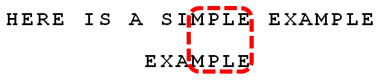
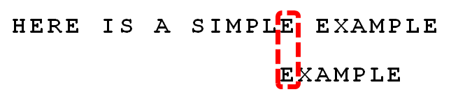

## 1. 贪心

贪心就是在对问题求解时，**总是做出在当前看来是最好的选择（局部最优）**，而不从整体上加以考虑（全局最优）。贪心算法简单有效，但不是对所有问题都能得到全局最优解（需要证明），和动态规划相比，它既不看前面（不需要从前面的状态转移过来），也不看后面（无后效性，后面的选择不会对前面的选择有影响），因此贪心算法时间复杂度一般是线性的，空间复杂度是常数级别的。


## 2. 分治

分治即分而治之，就是将一个复杂问题分为两个或更多个**相似的子问题**，这些子问题是相互独立的，即子问题之间没有公共的子问题。**递归求解每个子问题，然后合并子问题的解**即得原问题的解。常见的分治算法有：二分查找、归并排序、快速排序。

使用分治一般包含3步：**分解子问题、求解子问题、合并子问题（关键）**。

### 2.1 主定理

1. 主定理

   假设有递推关系式：T(n) = aT(n/b) + f(n)，其中 n为问题规模，a为递推的子问题数量，n/b为每个子问题的规模， f(n) 为递推以外进行的计算工作。

   设a ≥ 1，b > 1为常数，f(n) 为函数，T(n) 为非负整数。则有以下结果（分类讨论）：

   - 若对于某常数ε > 0，有f(n) = O(n<sup>log<sub>b</sub>a-ε</sup>)，则T(n) = θ(n<sup>log<sub>b</sub>a</sup>)
   - 若f(n) = θ(n<sup>log<sub>b</sub>a</sup>)，则T(n) = θ(n<sup>log<sub>b</sub>a</sup>logn)
   - 若对于某常数ε > 0，有f(n) = Ω(n<sup>log<sub>b</sub>a+ε</sup>)，且存在常数c < 1使得对所有足够大的n，有af(n/b) ≤ cf(n)，则T(n) = θ(f(n))

   **T(n) 的解似乎与f(n)和n<sup>log<sub>b</sub>a</sup>有密切关系，f(n)和n<sup>log<sub>b</sub>a</sup>比较，T(n) 取了其中较大的一个**。

   注：O表示上界，Ω表示下界， θ表示近似

2. 应用举例

   - T(n) = 9T(n/3) + n

     分析：a = 9，b = 3，f(n) = n。n<sup>log<sub>b</sub>a</sup> = n<sup>log<sub>3</sub>9</sup> = n<sup>2</sup>，f(n) = O(n<sup>log<sub>3</sub>9-ε</sup>)，ε = 0.5

     符合主定理第一种情况，则T(n) = θ(n<sup>2</sup>)

   - T(n) = T(2n/3) + 1

     分析：a = 1，b = 3/2，f(n) = 1。n<sup>log<sub>b</sub>a</sup> = n<sup>log<sub>3/2</sub>1</sup> = 1，f(n) = θ(n<sup>log<sub>b</sub>a</sup>) = θ(1)

     符合主定理第二种情况，则T(n) = θ(logn)

   - T(n) = 3T(n/4) + nlogn

     分析：a = 3，b = 4，f(n) = nlogn。n<sup>log<sub>b</sub>a</sup> = n<sup>log<sub>4</sub>3</sup>，f(n) = Ω(n<sup>log<sub>4</sub>3+ε</sup>)，ε = 0.1

     且af(n/b) = 3f(n/4) = 3(n/4)log(n/4) ≤ (3/4)nlogn =  cf(n)，c = 3/4

     符合主定理第三种情况，则T(n) = θ(nlogn)

### 2.2 递归与记忆化递归

介绍：程序反复调用自身即为递归，**递归与分治往往都是伴随出现的**。对具有递归特性的数据结构的问题求解，很自然使用递归思想设计算法，如广义表、二叉树、树和图的遍历操作。在设计递归算法时，**千万不要去纠结每一级调用和返回的细节**，我们应该“信任”递归调用可以处理子问题，**只需关注：整个递归的终止条件、当前这一级递归需要做什么以及需要返回怎么给上一级**。

记忆化递归与动态规划类似，对于反复求解的子问题，我们把历史求解的子问题记录下来，以便下次使用。与动态规划相比，它的优势是：**动态划归有先后顺序，子问题求解后才能求解父问题，必须确保求解的顺序。而记忆化递归在子问题没有求解时，程序会自动去求解，不需要确保顺序**；它的劣势是：**记忆化递归可能在空间复杂度上比不上精心设计的动态规划**。

最后关于递归与迭代，递归的优点是程序代码简洁，容易编程和理解，但是在递归过程中可能产生大量的函数调用，极端情况下甚至会导致栈溢出。因此，如果递归和迭代求解的时间复杂度相同，优先使用迭代。

递归应用：[24. 两两交换链表中的节点](https://leetcode-cn.com/problems/swap-nodes-in-pairs/)、[110. 平衡二叉树](https://leetcode-cn.com/problems/balanced-binary-tree/)

记忆化递归应用：[337. 打家劫舍 III](https://leetcode-cn.com/problems/house-robber-iii/)、[329. 矩阵中的最长递增路径](https://leetcode-cn.com/problems/longest-increasing-path-in-a-matrix/)、[1553. 吃掉 N 个橘子的最少天数](https://leetcode-cn.com/problems/minimum-number-of-days-to-eat-n-oranges/)

参考：[三道题套路解决递归问题](https://lyl0724.github.io/2020/01/25/1/)、[教女朋友递归与记忆化递归](https://zhuanlan.zhihu.com/p/73579773)

```java
public class Recursion {
    // 24. 两两交换链表中的节点(递归实现)
    public ListNode swapPairs(ListNode head) {
        // 终止条件：链表没有节点或只剩一个节点
        if (head == null || head.next == null) {
            return head;
        }

        // 一共有三个节点：head、second、已经处理好的node
        ListNode node = swapPairs(head.next.next);
        ListNode second = head.next;
        second.next = head;
        head.next = node;
        return second;
    }
    
    // 337. 打家劫舍 III
    // 如果直接采用递归，则在计算爷爷能偷多少钱的时候，同时计算了4个孙子和2个儿子能偷多少钱
    // 这样在其儿子当爷爷时，就会产生重复计算一遍孙子节点（即重复子问题）
    private HashMap<TreeNode, Integer> map = new HashMap<>();

    public int rob(TreeNode root) {
        if (root == null) {
            return 0;
        }
        // 如果子问题已经有结果，则直接返回
        if (map.containsKey(root)) {
            return map.get(root);
        }

        // 偷取根节点，则不偷取其左右孩子
        int res1 = root.val;
        if (root.left != null) {
            res1 += rob(root.left.left) + rob(root.left.right);
        }
        if (root.right != null) {
            res1 += rob(root.right.left) + rob(root.right.right);
        }
        // 不偷取根节点，则偷取其左右孩子
        int res2 = rob(root.left) + rob(root.right);

        int result = Math.max(res1, res2);
        map.put(root, result);	// 保存子问题的计算结果
        return result;
    }
    
    // 329. 矩阵中的最长递增路径
    // 思路：将矩阵看成一个有向图，每个单元格对应图中的一个节点，如果相邻的两个单元格的值不相等，
    // 则在相邻的两个单元格之间存在一条从较小值指向较大值的有向边。问题转化成在有向图中寻找最长路径。
    private int m, n;   // 行数和列数
    private int[][] directs = {{-1, 0}, {1, 0}, {0, -1}, {0, 1}};   // 上下左右4个方向

    public int longestIncreasingPath(int[][] matrix) {
        if (matrix == null || matrix.length == 0 || matrix[0].length == 0) {
            return 0;
        }

        m = matrix.length;
        n = matrix[0].length;
        int[][] memo = new int[m][n];   // 记忆化，默认初始化为0

        int result = 0;
        for (int i = 0; i < m; i++) {
            for (int j = 0; j < n; j++) {
                result = Math.max(result, dfs(matrix, i, j, memo));
            }
        }
        return result;
    }

    // dfs + 记忆化
    private int dfs(int[][] matrix, int i, int j, int[][] memo) {
        // 若备忘录中记录了最长路径，则直接返回
        if (memo[i][j] != 0) {
            return memo[i][j];
        }

        // 否则进行深度遍历计算
        memo[i][j]++;   // 先自身加1，再向四周扩展
        for (int[] direct : directs) {
            int row = i + direct[0];
            int col = j + direct[1];
            if (0 <= row && row < m && 0 <= col && col < n && matrix[i][j] < matrix[row][col]) {
                // 取四周扩展长度的最大值，保存在备忘录中
                memo[i][j] = Math.max(memo[i][j], dfs(matrix, row, col, memo) + 1);
            }
        }
        return memo[i][j];
    }
}
```


## 3. 动态规划

动态规划与分治类似，其基本思想也是将待求解问题分解为若干个子问题，先求解子问题，然后从这些子问题的解得到原问题的解。与分治不同的是，分解的子问题往往**不是相互独立的**，若用分治来解决这类问题，则有些**子问题会被重复计算很多次**（比如斐波那契数列）。因此，动态规划对于重复出现的子问题，**只在第一次遇到的时候对它进行求解，并把答案保存起来，**以后再遇到时直接引用答案，不必重新求解。

使用动态规划一般包含3步：**状态定义、状态初始化、状态转移（关键）**。一般情况下，“状态定义”可直接根据题目要求来给出；"状态转移"是根据“状态定义”给出的，有时可以使用状态自动机来推出；“状态初始化”则是根据“状态转移”给出的，既可以单独给出，又可以合并至“状态转移”中，还可以在“状态定义”时多分配一个空间进行默认初始化。

### 3.1 背包问题

1. 问题描述

   假设有n种物品：物品 i 的重量为 w<sub>i</sub>，价格为 v<sub>i</sub>，背包所能承受的最大重量为W，我们如何选择才能使得物品的总价格最高。有三种类型的背包问题，这里指的是0-1背包。类似题目还有[416. 分割等和子集](https://leetcode-cn.com/problems/partition-equal-subset-sum/)、[面试题 08.11. 硬币](https://leetcode-cn.com/problems/coin-lcci/)。

   - 0-1背包：每种物品只能选择0个或1个
   - 多重背包：限定物品最多能选择的个数
   - 完全背包：每种物品可以选择无限次

   ```
   输入: weights = [1, 2, 5, 6, 8]、values = [1, 6, 18, 22, 28]、W = 12
   输出: 41
   解释: 分别选择价值为1、18、22的物品，总重量12，总价值41。如果是完全背包结果应该是44。
   ```

2. 代码实现

   ```java
   public class KnapsackProblem {
       // 0-1背包：时间和空间复杂度均为θ(nW)，是伪多项式时间。
       public static int knapsack(int[] weights, int[] values, int W) {
           // 1.状态定义：dp[i][j]表示在重量限制为j的条件下，子集物品1,...,i的最大价格
           int N = weights.length; // 物品数
           int[][] dp = new int[N + 1][W + 1];
   
           // 2.状态初始化：
           // dp[0][0...j] = 0（此时没有选择任何一个物品，默认初始化）
           // dp[0...i][0] = 0（此时背包所能承受的最大重量为0，默认初始化）
   
           // 3.状态转移：
           //  (1)当Wi > j时，dp[i][j] = dp[i-1][j]
           //  (2)当Wi <= j时，dp[i][j] = max{dp[i-1][j], dp[i-1][j-Wi] + Vi}
           //      (2.1)当没有选择物品i时，dp[i][j] = dp[i-1][j]
           //      (2.2)当选择了选择物品i时，dp[i][j] = dp[i-1][j-Wi] + Vi
           for (int i = 1; i <= N; i++) {
               int w = weights[i - 1];
               int v = values[i - 1];
               for (int j = 1; j <= W; j++) {
                   if (w > j) {
                       dp[i][j] = dp[i - 1][j];
                   } else {
                       dp[i][j] = Math.max(dp[i - 1][j], dp[i - 1][j - w] + v);
                   }
               }
           }
   
           return dp[N][W];
       }
   
       // 从状态转移中可以看出：前i件物品的状态只和前i-1件物品的状态有关。
       // 因此可以使用一维数组代替二维数组，空间复杂度降低为O(W)
       public static int knapsackImprove(int[] weights, int[] values, int W) {
           int N = weights.length; // 物品数
           int[] dp = new int[W + 1];
   
           for (int i = 1; i <= N; i++) {
               int w = weights[i - 1];
               int v = values[i - 1];
               // 为了避免覆盖上一轮结果，从右往左计算
               // 若采用正序计算，可以直接解决完全背包问题：for (int j = 1; j <= W; j++)
               for (int j = W; j >= 1; j--) {
                   if (w <= j) {
                       dp[j] = Math.max(dp[j], dp[j - w] + v);
                   }
               }
           }
   
           return dp[W];
       }
   }
   ```

### 3.2 最大子序和

1. 问题描述

   给定一个整数数组 nums ，找到一个具有最大和的**连续**子数组（子数组最少包含一个元素），返回其最大和。题目详见 [53. 最大子序和](https://leetcode-cn.com/problems/maximum-subarray/)，类似题目还有[152. 乘积最大子数组](https://leetcode-cn.com/problems/maximum-product-subarray/)、[300. 最长上升子序列](https://leetcode-cn.com/problems/longest-increasing-subsequence/)、[718. 最长重复子数组](https://leetcode-cn.com/problems/maximum-length-of-repeated-subarray/)。

   ```
   输入: [-2, 1, -3, 4, -1, 2, 1, -5, 4]
   输出: 6
   解释: 连续子数组 [4, -1, 2, 1] 的和最大，为 6。
   ```

2. 代码实现

   ```java
   public class MaxSubArray {
       // 53.最大子序和：时间复杂度O(n)，空间复杂度O(n)。扩展题718
       public int maxSubArray(int[] nums) {
           if (nums == null || nums.length == 0) {
               return 0;
           }
   
           // 1.状态定义：dp[i]表示以i为结尾的最大连续子数组的和（“结尾”两字很关键，常用技巧）
           int result = 0;
           int[] dp = new int[nums.length];
   
           // 2.状态初始化：dp[0] = nums[0]
           dp[0] = nums[0];
           result = nums[0];
   
           // 3.状态转移：dp[i] = max{dp[i-1], 0} + nums[i]
           for (int i = 1; i < nums.length; i++) {
               dp[i] = Math.max(dp[i - 1], 0) + nums[i];
               result = Math.max(result, dp[i]);
           }
   
           return result;
       }
   
       // 由于当前的状态的值只取决于前一个状态值，所以我们可以使用变量来代替dp[]数组，
       // 或者直接在原数组上修改，改进后的动态规划：时间复杂度O(n)，空间复杂度O(1)
       public int maxSubArrayImprove(int[] nums) {
           if (nums == null || nums.length == 0) {
               return 0;
           }
   
           int result = nums[0];
           for (int i = 1; i < nums.length; i++) {
               nums[i] = Math.max(nums[i - 1], 0) + nums[i];
               result = Math.max(result, nums[i]);
           }
   
           return result;
       }
   }
   ```

### 3.3 最长回文子串

1. 问题描述

   给定一个字符串 s，找到 s 中最长的回文子串。题目详见 [5. 最长回文字串](https://leetcode-cn.com/problems/longest-palindromic-substring/)。

   ```
   输入: "babad"
   输出: "bab"
   注意: "aba" 也是一个有效答案。
   ```

2. 代码实现

   ```java
   public class LongestPalindrome {
       // 5. 最长回文子串：时间复杂度O(n^2)，空间复杂度O(n^2)
       public static String longestPalindrome(String s) {
           // 1.状态定义：dp[i][j]表示字符串S[i][j]是否为回文串
           String result = "";
           boolean[][] dp = new boolean[s.length()][s.length()];
   
           // 2.状态初始化：合并到状态转移中
           // dp[i][i] = true
           // if(s[i] == s[i+1]) dp[i][i+1] = true
   
           // 3.状态转移：
           // dp[i][j] = dp[i+1][j-1] && s[i] == s[j]
           // 在二维数组中dp[i][j]与位于它”左下“位置的dp[i+1][j-1]有关，
           // 所以，针对二维数组的右上部分，需要“从下往上”逐行计算
           for (int i = s.length() - 1; i >= 0; i--) {
               for (int j = i; j < s.length(); j++) {
                   // j - i < 2 表现为状态初始化
                   dp[i][j] = s.charAt(i) == s.charAt(j) && (j - i < 2 || dp[i + 1][j - 1]);
                   if (dp[i][j] && j - i + 1 > result.length()) {
                       result = s.substring(i, j + 1);
                   }
               }
           }
   
           return result;
       }
   
       // 这里同样可以使用一维数组代替二维数组，记录前一行的计算结果即可,空间复杂度降低为O(n)
       public static String longestPalindromeImprove(String s) {
           String result = "";
           boolean[] dp = new boolean[s.length()];
   
           for (int i = s.length() - 1; i >= 0; i--) {
               // 注意下标j是从右往左，因为p[j]与p[j-1]相关。若从左往右会覆盖
               for (int j = s.length() - 1; j >= i; j--) {
                   dp[j] = s.charAt(i) == s.charAt(j) && (j - i < 2 || dp[j - 1]);
                   if (dp[j] && j - i + 1 > result.length()) {
                       result = s.substring(i, j + 1);
                   }
               }
           }
   
           return result;
       }
   }
   ```

### 3.4 编辑距离

1. 问题描述

   给你两个单词 word1 和 word2，请你计算出将 word1 转换成 word2 所使用的最少操作数 。你可以对一个单词进行如下三种操作：插入一个字符、删除一个字符、替换一个字符。题目详见[72. 编辑距离](https://leetcode-cn.com/problems/edit-distance/)。

   ```
   输入：word1 = "horse", word2 = "ros"
   输出：3
   解释：horse -> rorse (将 'h' 替换为 'r')
   rorse -> rose (删除 'r')
   rose -> ros (删除 'e')
   ```

2. 代码实现

   ```java
   public class EditDistance {
       // 72.编辑距离（迭代实现）:时间和空间复杂度均为O(mn)，其中m为word1的长度，n为word2的长度
       public static int minDistance4Iteration(String word1, String word2) {
           int length1 = word1.length();
           int length2 = word2.length();
   
           // 1.状态定义：dp[i][j]表示A的前i个字母和B的前j个字母之间的编辑距离
           int[][] dp = new int[length1 + 1][length2 + 1];
   
           // 2.状态初始化：由于状态转移中i、j是从1开始的，所以需要初始化第0行和第0列
           // dp[0][j] = j, dp[i][0] = i
           for (int i = 0; i <= length1; i++) {
               dp[i][0] = i;
           }
           for (int j = 0; j <= length2; j++) {
               dp[0][j] = j;
           }
   
           // 3.状态转移：
           // 思路分析：针对 A 和 B，我们共有6种操作方法。但实际上只有3种
           // 第1种：对 A 插入一个字符（等价于对 B 删除一个字符）
           // 第2种：对 B 插入一个字符（等价于对 A 删除一个字符）
           // 第3种：对 A 替换一个字符（等价于对 B 替换一个字符）
           // 上述关键是将删除操作替换为了插入操作，于是：
           //	(1)若A和B的最后一个字母不同，则dp[i][j] = 1 + min{dp[i][j-1], dp[i-1][j], dp[i-1][j-1]}
           //	(2)若A和B的最后一个字母相同，则dp[i][j] = 1 + min{dp[i][j-1], dp[i-1][j], dp[i-1][j-1] - 1}
           for (int i = 1; i <= length1; i++) {
               for (int j = 1; j <= length2; j++) {
                   int dp1 = dp[i][j - 1];
                   int dp2 = dp[i - 1][j];
                   int dp3 = dp[i - 1][j - 1];
                   // A的第i个字母下标是 i-1，B的第j个字母下标是 j-1
                   if (word1.charAt(i - 1) == word2.charAt(j - 1)) {
                       dp3--;
                   }
                   dp[i][j] = 1 + Math.min(Math.min(dp1, dp2), dp3);
               }
           }
   
           return dp[length1][length2];
       }
   }
   ```

### 3.5 正则表达式匹配

1. 问题描述

   给你一个字符串 s 和一个字符规律 p，请你来实现一个支持 `'.'` 和 `'*'` 的正则表达式匹配。其中 `'.'` 匹配任意单个字符， `'*'` 匹配零个或多个前面的那一个元素。题目详见[10.  正则表达式匹配](https://leetcode-cn.com/problems/regular-expression-matching/)，类似题目还有[44. 通配符匹配](https://leetcode-cn.com/problems/wildcard-matching/)、[115. 不同的子序列](https://leetcode-cn.com/problems/distinct-subsequences/)。

   ```
   输入：s = "aab"、p = "c*a*b"
   输出: true
   解释: 因为 '*' 表示零个或多个，这里 'c' 为 0 个, 'a' 被重复一次。因此可以匹配字符串 "aab"。
   ```

2. 代码实现

   ```java
   public class RegexMatch {
       // 10. 正则表达式匹配：时间和空间复杂度均为O(mn)，其中m、n分别表示匹配串和模式串的长度
       public boolean isMatch4Regex(String s, String p) {
           // 1.状态定义：dp[i][j]表示s[0...i-1]和p[0...j-1]匹配，注意相差1
           // 0 <= i <= s.length()、0 <= j <= p.length()
           boolean[][] dp = new boolean[s.length() + 1][p.length() + 1];
   
           // 2.状态初始化：状态转移时i、j分别从1开始，需要初始化第0行、第0列
           // (1)dp[0][0] = true（此时s、p都是空字符串）
           // (2)dp[0][2] = dp[0][4] = ... = true（当s为空，p为类似“.*.*”）
           // 第0列全部为false：dp[1...i][0] = false（此时p为空，已经默认初始化）
           dp[0][0] = true;
           for (int j = 2; j <= p.length(); j++) {
               if (p.charAt(j - 1) == '*' && dp[0][j - 2]) {
                   dp[0][j] = true;
               }
           }
   
           // 3.状态转移：
           // (1)当p[j-1] == '.' || p[j-1] == s[i-1]时，dp[i][j] = dp[i-1][j-1]
           // (2)当p[j-1] == '*'时（关键部分）
           //  (2.1)当p[j-2] != s[i-1]时，dp[i][j] = dp[i][j-2]（此时b*相当于空）
           //  (2.2)当p[j-2] == '.' || p[j-2] == s[i-1]时
           //      (2.2.1)dp[i][j] = dp[i-1][j]（此时b*相当于一个或多个b）
           //      (2.2.2)dp[i][j] = dp[i][j-2]（此时b*相当于零个b，即空）
           for (int i = 1; i <= s.length(); i++) {
               for (int j = 1; j <= p.length(); j++) {
                   if (p.charAt(j - 1) == '.' || p.charAt(j - 1) == s.charAt(i - 1)) {
                       dp[i][j] = dp[i - 1][j - 1];
                   } else if (p.charAt(j - 1) == '*') {
                       // 假设p[0]不可能为*，不符合语法，则此时j>=2，所以不会越界
                       if (p.charAt(j - 2) != s.charAt(i - 1) && p.charAt(j - 2) != '.') {
                           dp[i][j] = dp[i][j - 2];
                       } else {
                           dp[i][j] = dp[i - 1][j] || dp[i][j - 2];
                       }
                   }
               }
           }
   
           return dp[s.length()][p.length()];
       }
   }
   ```


### 3.6 地下城游戏

1. 问题描述

   题目详见[174. 地下城游戏](https://leetcode-cn.com/problems/dungeon-game/)。该题涉及到**“无后效性”、“自底向上DP”**，下面是分析的过程：

   最初的做法是从左上往右下的顺序自顶向下进行 DP，为此定义了一个类 Node { currLife, minLife }，其中 currLife 表示从出发点到当前点的生命值（路径和），minLife 表示从出发点到当前点所需的最小生命值（初始值）。然后定义并求解Node[\][\] dp，但是无法 AC，其根本原因就是这种动态规划不满足"无后效性"。以下图为例：

   

   * 绿色路径「从出发点到当前点的路径和」为 1，「从出发点到当前点所需的最小初始值」为 3。

   * 蓝色路径「从出发点到当前点的路径和」为 -1，「从出发点到当前点所需的最小初始值」为 2。

   我们希望「从出发点到当前点的路径和」尽可能大，而「从出发点到当前点所需的最小初始值」尽可能小。这两条路径各有优劣。

   在上图中，我们知道应该选取绿色路径，因为蓝色路径的路径和太小，使得蓝色路径需要增大初始值到 4 才能走到终点，而绿色路径只要 3 点初始值就可以直接走到终点。但是如果把终点的 -2 换为 0，蓝色路径只需要初始值 2，绿色路径仍然需要初始值 3，最优决策就变成蓝色路径了。

   因此，如果按照从左上往右下的顺序进行动态规划，我们无法直接确定到达 (1,2) 的方案，因为有两个重要程度相同的参数同时影响后续的决策。也就是说，这样的动态规划是不满足「无后效性」的。

2. 代码实现

   ```java
   public class Warrior {
       // 174. 地下城游戏：从右下往左上进行动态规划（自底向上）
       public int calculateMinimumHP(int[][] dungeon) {
           // 1.状态定义：dp[i][j]表示当前位置(i,j)到终点所需的最小初始值
           int row = dungeon.length;
           int col = dungeon[0].length;
           int[][] dp = new int[row][col];
   
           // 2.状态初始化：最后一行和最后一列（合并至状态转移）
           // 3.状态转移：
           for (int i = row - 1; i >= 0; i--) {
               for (int j = col - 1; j >= 0; j--) {
                   if (i == row - 1 && j == col - 1) { // 终点
                       dp[i][j] = Math.max(1, 1 - dungeon[i][j]);
                   } else if (i == row - 1) {  // 最后一行
                       dp[i][j] = Math.max(1, dp[i][j + 1] - dungeon[i][j]);
                   } else if (j == col - 1) {  // 最后一列
                       dp[i][j] = Math.max(1, dp[i + 1][j] - dungeon[i][j]);
                   } else {
                       dp[i][j] = Math.max(1, Math.min(dp[i][j + 1], dp[i + 1][j]) - dungeon[i][j]);
                   }
               }
           }
   
           return dp[0][0];
       }
   }
   ```

### 3.7 买卖股票的最佳时机 IV

1. 问题描述

   给定一个数组，它的第 i 个元素是一支给定的股票在第 i 天的价格。设计一个算法来计算你所能获取的最大利润。你最多可以完成 k 笔交易。注意: 你不能同时参与多笔交易（你必须在再次购买前出售掉之前的股票）。题目详见[188. 买卖股票的最佳时机 IV](https://leetcode-cn.com/problems/best-time-to-buy-and-sell-stock-iv/) ，类似题目还有[121. 买卖股票的最佳时机](https://leetcode-cn.com/problems/best-time-to-buy-and-sell-stock/)、[122. 买卖股票的最佳时机 II](https://leetcode-cn.com/problems/best-time-to-buy-and-sell-stock-ii/)、[123. 买卖股票的最佳时机 III](https://leetcode-cn.com/problems/best-time-to-buy-and-sell-stock-iii/)、[309. 最佳买卖股票时机含冷冻期](https://leetcode-cn.com/problems/best-time-to-buy-and-sell-stock-with-cooldown/)、[714. 买卖股票的最佳时机含手续费](https://leetcode-cn.com/problems/best-time-to-buy-and-sell-stock-with-transaction-fee/)。

   ```
   输入: [3,2,6,5,0,3], k = 2
   输出: 7
   解释: 在第 2 天 (股票价格 = 2) 的时候买入，在第 3 天 (股票价格 = 6) 的时候卖出, 这笔交易所能获得利润 = 6-2 = 4 。
        随后，在第 5 天 (股票价格 = 0) 的时候买入，在第 6 天 (股票价格 = 3) 的时候卖出, 这笔交易所能获得利润 = 3-0 = 3 。
   ```

2. 代码实现

   ```java
   // 买卖股票通用解法：DP，188题是一般情况，其余都是它的特殊情况或变种
   // 121题是k=1时的特殊情况；122题是k=无穷大的特殊情况；123题是k=2时的特殊情况
   // 309题是k=无穷大，增加冷冻期的变种；714是k=无穷大，增加手续费的变种（直接基于122题）
   public class MaxProfit {
       // 188. 买卖股票的最佳时机 IV
       public int maxProfit4(int k, int[] prices) {
           if (prices.length <= 1 || k == 0) {
               return 0;
           }
   
           int len = prices.length;
           if (k >= len / 2) {    // 优化，此时相当于k没有限制
               return maxProfit2(prices);
           }
           
   		// 1.状态定义：dp[i][k][0 or 1]表示第i天最多进行k次交易，且当前状态为0/1的最大收益
           // 其中0表示不持股，1表示持股
           int[][][] dp = new int[len][k + 1][2];
           
           // 2.状态初始化：dp[i][0][0/1] = dp[0][k][0] = 0
           // dp[0][k][1]=-prices[0]（合并至状态转移）
           
           // 3.状态转移：可根据“有限状态自动机”得出。注意在买入时或者卖出时k--，效果一样
           // 	(1) dp[i][k][0] = max(dp[i-1][k][0], dp[i-1][k][1] + prices[i])
           //	(2) dp[i][k][1] = max(dp[i-1][k][1], dp[i-1][k-1][0] - prices[i])
           for (int i = 0; i < len; i++) {
               for (int j = 1; j <= k; j++) {
                   if (i == 0) {
                       dp[0][j][1] = -prices[0];
                       continue;
                   }
                   // k=0表示不允许交易，结果是0，默认初始化即可
                   dp[i][j][0] = Math.max(dp[i - 1][j][0], dp[i - 1][j][1] + prices[i]);
                   dp[i][j][1] = Math.max(dp[i - 1][j][1], dp[i - 1][j - 1][0] - prices[i]);
               }
           }
   
           return dp[len - 1][k][0];
       }
       
       // 122. 买卖股票的最佳时机 II
       // k=无穷大，相当于不受k影响的DP，实际上还可以使用贪心算法
       public int maxProfit2(int[] prices) {
           if (prices.length <= 1) {
               return 0;
           }
   
           int dp0 = 0, dp1 = -prices[0];
           // 直接优化了空间复杂度
           for (int i = 1; i < prices.length; i++) {
               int dp0New = Math.max(dp0, dp1 + prices[i]);
               dp1 = Math.max(dp1, dp0 - prices[i]);
               dp0 = dp0New;
           }
           return dp0;
       }
   }
   ```

   

## 4. 回溯

回溯就是以**深度优先**的方式寻找问题的解，当发现已不满足求解条件时，就回溯返回，尝试别的路径。实际上回溯法就是穷举法，只不过在搜索过程中可以**使用剪枝函数避免无效搜索**，所以它的时间复杂度一般都很高。

解决一个回溯问题，实际上就是一个**决策树的遍历过程**，需要思考 3 个问题：**路径**（已经做出的选择）、**选择列表**（当前可以做的选择）、**结束条件**（到达决策树底层，无法再做选择的条件）。下面是回溯算法的框架。

参考：[知乎：回溯算法套路详解](https://zhuanlan.zhihu.com/p/93530380)

```python
result = []
def backtrace(路径, 选择列表):
    if 满足结束条件:
        result.add(路径)
        return

    for 选择 in 选择列表:
        # 做选择
    	将该选择从选择列表移除
    	路径.add(选择)
        # 进入下一层决策树
    	backtrace(路径, 选择列表)
    	# 撤销选择
    	路径.remove(选择)
    	将该选择再加入选择列表
```

### 4.1 全排列问题

1. 问题描述

   给定一个**没有重复**数字的序列，返回其所有可能的全排列。题目详见[47. 全排列 II](https://leetcode-cn.com/problems/permutations-ii/)，类似题目还有[46. 全排列](https://leetcode-cn.com/problems/permutations/)、[39. 组合总和](https://leetcode-cn.com/problems/combination-sum/)、[40. 组合总和 II](https://leetcode-cn.com/problems/combination-sum-ii/)、[78. 子集](https://leetcode-cn.com/problems/subsets/)、[90. 子集 II](https://leetcode-cn.com/problems/subsets-ii/)。

   ```
   输入: [1,1,2]
   输出: [[1,1,2],[1,2,1],[2,1,1]]
   ```

2. 代码实现

   ```java
   public class Permutations {
       // 47. 全排列 II：时间复杂度O(n*n!)
       private List<List<Integer>> result = new LinkedList<>();
   
       public List<List<Integer>> permuteUnique(int[] nums) {
           Arrays.sort(nums);	// 数组排序，让相同数字相邻
           boolean[] visited = new boolean[nums.length];
           LinkedList<Integer> list = new LinkedList<>();
           backtrace(list, nums, visited);
           return result;
       }
   
       private void backtrace(LinkedList<Integer> list, int[] nums, boolean[] visited) {
           // 结束条件：nums 中的元素全都在 list 中出现
           if(list.size() == nums.length) {
               // 注意：不新建对象的话加进去的就是引用，之后修改path会影响到result中已加进去的元素
               result.add(new LinkedList(list));
               return;
           }
   
           for(int i = 0; i < nums.length; i++) {
               // 排除不合法的选择
               if(visited[i]) {
                   continue;
               }
               // 选择数字的顺序只有两种：从左往右、从右往左。对于重复数，我们只要选择其中一种顺序，
               // 就可以保证不重复。下面代码保证了从左往右，即前面一个访问过，后一个相同的才能访问
               if(i > 0 && nums[i] == nums[i - 1] && !visited[i - 1]) {
                   continue;
               }
   
               // 做选择
               visited[i] = true;
               list.add(nums[i]);
               // 进入下一层决策树
               backtrace(list, nums, visited);
               // 撤销选择
               visited[i] = false;
               list.removeLast();
           }
       }
   }
   ```

### 4.2 N 皇后问题

1. 问题描述

   *n* 皇后问题研究的是如何将 *n* 个皇后放置在 *n*×*n* 的棋盘上，并且使皇后彼此之间不能相互攻击。题目详见 [51. N皇后](https://leetcode-cn.com/problems/n-queens/)，类似题目还有[52. N皇后 II](https://leetcode-cn.com/problems/n-queens-ii/)、[37. 解数独](https://leetcode-cn.com/problems/sudoku-solver/)。

   提示：皇后是国际象棋中的棋子，意味着国王的妻子。皇后只做一件事，那就是吃子，她横、竖、斜都可走。

   ```
   输入: 4
   输出: [
    [".Q..",  // 解法1
     "...Q",
     "Q...",
     "..Q."],
   
    ["..Q.",  // 解法2
     "Q...",
     "...Q",
     ".Q.."]
   ]
   ```

2. 代码实现

   ```java
   public class NQueens {
       // 51. N皇后
       private List<List<String>> result = new LinkedList<>();
   
       public List<List<String>> solveNQueens(int n) {
           char[][] board = new char[n][n];  // 棋盘
           for (char[] chars : board) {
               Arrays.fill(chars, '.');
           }
           backtrace(board, 0);
           return result;
       }
   
       private void backtrace(char[][] board, int row) {
           // 结束条件
           if (row == board.length) {
               result.add(convert(board));
               return;
           }
   
           for (int col = 0; col < board.length; col++) {
               // 排除不合法选择
               if (!isValid(board, row, col)) {
                   continue;
               }
               
               board[row][col] = 'Q';		// 做选择
               backtrace(board, row + 1);	// 进入下一层决策树
               board[row][col] = '.';		// 撤销选择
           }
       }
   
       private boolean isValid(char[][] board, int row, int col) {
           // 检查列是否有效
           for (char[] chars : board) {
               if (chars[col] == 'Q') {
                   return false;
               }
           }
           // 检查右上对角线是否有效
           for (int i = row - 1, j = col + 1; i >= 0 && j < board.length; i--, j++) {
               if (board[i][j] == 'Q') {
                   return false;
               }
           }
           // 检查左上对角线是否有效
           for (int i = row - 1, j = col - 1; i >= 0 && j >= 0; i--, j--) {
               if (board[i][j] == 'Q') {
                   return false;
               }
           }
   
           return true;
       }
   
       // 将char[][]转换为List<String>
       private List<String> convert(char[][] array) {
           List<String> list = new LinkedList<>();
           for (char[] chars : array) {
               list.add(String.valueOf(chars));
           }
           return list;
       }
   }
   ```
   

### 4.3 括号生成

1. 问题描述

   数字 *n* 代表生成括号的对数，请你设计一个函数，用于能够生成所有可能的并且 **有效的** 括号组合。题目详见[22. 括号生成](https://leetcode-cn.com/problems/generate-parentheses/)。

   ```
   输入: n = 3
   输出: ["((()))", "(()())", "(())()", "()(())", "()()()"]
   ```

2. 代码实现

   ```java
   public class Parenthesis {
       // 22. 括号生成
       private List<String> result = new LinkedList<>();
   
       public List<String> generateParenthesis(int n) {
           StringBuilder sb = new StringBuilder();
           backtrace(sb, 0, 0, n);
           return result;
       }
   
       private void backtrace(StringBuilder sb, int left, int right, int max) {
           // 结束条件
           if (sb.length() == (max << 1)) {
               result.add(sb.toString());
               return;
           }
   
           if (left < max) {
               sb.append('(');
               backtrace(sb, left + 1, right, max);
               sb.deleteCharAt(sb.length() - 1);
           }
   
           // 当左右括号数相等时，只要匹配过程中右括号个数始终小于左括号就可以匹配
           if (right < left) {
               sb.append(')');
               backtrace(sb, left, right + 1, max);
               sb.deleteCharAt(sb.length() - 1);
           }
       }
   }
   ```

   

### 4.4 复原 IP 地址

1. 问题描述

   给定一个只包含数字的字符串，复原它并返回所有可能的 IP 地址格式。有效的 IP 地址正好由四个整数（每个整数位于 0 到 255 之间组成），整数之间用 '.' 分隔。题目详见 [93. 复原IP地址](https://leetcode-cn.com/problems/restore-ip-addresses/)。

   ```
   输入: "25525511135"
   输出: ["255.255.11.135", "255.255.111.35"]
   ```

2. 代码实现

   ```java
   public class RestoreIpAddresses {	
   	private List<String> result = new LinkedList<>();
   
       public List<String> restoreIpAddresses(String s) {
           StringBuilder sb = new StringBuilder();
           backtrace(s, 0, 0, sb);
           return result;
       }
   
       // 参数start表示字符串划分的起使位置，参数ipNum表示已经划分好的点分十进制的个数
       private void backtrace(String s, int start, int ipNum, StringBuilder sb) {
           // 结束条件
           if (ipNum == 4) {
               if (start == s.length()) {
                   result.add(sb.substring(0, sb.length() - 1));	// 需要去除末尾最后的点
               } else {
                   return;
               }
           }
   
           for (int i = start; i < s.length() && i < start + 3; i++) {
               String temp = s.substring(start, i + 1);
               // 排除不合法选择：数字大于255；数字以0开头，但不是个位数
               if (temp.charAt(0) == '0' && temp.length() > 1) {
                   return; // 可以不用continue，因为这种情况下次循环肯定不符合要求
               }
               if (Integer.parseInt(temp) > 255) {
                   return;
               }
   
               sb.append(temp).append(".");    // 选择
               backtrace(s, i + 1, ipNum + 1, sb); // 进入下一层决策树
               // 注意，使用start是错的，因为start是相对ip地址字符串s来说的，
               // 而由于sb加了“.”，所以起使位置已经不是start了
               // sb.delete(start, i + 2);
               sb.delete(sb.length() - (i + 2 - start), sb.length());  // 撤销选择
           }
       }
   }
   ```


## 5. 字符串

### 5.1 字符串匹配算法

#### 5.1.1 BF 暴力匹配

介绍：暴力匹配就是使用双指针，分别指向主串和模式串，然后依次进行比较。暴力匹配实现简单，一般情况下工作良好，String 类的 `indexOf()` 方法底层实现采用的就是这种方式。暴力匹配的最坏时间复杂度为 O(mn)，最好时间复杂度为O(n)，其中m、n分别是模式串、主串的长度。

```java
public class BruteForce {
    // 暴力匹配字符串，匹配成功返回P在S中的首字符下标，匹配失败返回-1
    public static int indexOf(String source, String pattern) {
        char[] src = source.toCharArray();
        char[] ptn = pattern.toCharArray();
        int sLen = src.length;
        int pLen = ptn.length;

        if (pLen == 0) {
            return 0;
        }
        if (sLen == 0) {
            return -1;
        }

        char first = ptn[0];
        int max = sLen - pLen;
        for (int i = 0; i <= max; i++) {
            // 首先查找第一个字符
            if (src[i] != first) {
                while (++i <= max && src[i] != first) ;
            }
            // 找到第一个字符，现在匹配剩余字符
            if (i <= max) {
                int j = i + 1;	// 主串和模式串都从下一位开始
                int end = j + pLen - 1;
                for (int k = 1; j < end && src[j] == ptn[k]; j++, k++) ;
                if (j == end) {
                    // 匹配整个字符串
                    return i;
                }
            }
        }
        return -1;
    }
}
```


#### 5.1.2 RK 算法

介绍：RK 算法对暴力匹配进行了改进，名称由两个发明者姓名的首字母组成。算法的思想是**对模式串、主串中相同长度的子串分别进行哈希运算，并比较两者的哈希值**。因此 RK 算法成功的关键是设计出足够出色的**哈希函数**，由于哈希函数无法保证对不同的字符串产生不同的哈希值，即存在哈希冲突，所以即使模式串的哈希值和主串中子串的哈希值相等，也需要对这两个字符串进行额外的比对（当然，如果不相等就不用比对了，大部分的时间省在这上面）。BM 算法的时间复杂度为 O(m+n)，其中m、n分别是模式串、主串的长度。

参考：[CSDN-字符串匹配算法]([https://blog.csdn.net/qq_37653144/article/details/83626871#Rabin-Karp%E7%AE%97%E6%B3%95](https://blog.csdn.net/qq_37653144/article/details/83626871#Rabin-Karp算法))

```java
public class RK {
    // RK算法匹配字符串，匹配成功返回P在S中的首字符下标，匹配失败返回-1
    public static int indexOf(String source, String pattern) {
        int sLen = source.length();
        int pLen = pattern.length();
        // 计算模式串的哈希值，哈希函数可以自实现
        int pHashCode = pattern.hashCode();

        for (int i = 0; i <= sLen - pLen; i++) {
            // 计算主串中相同长度的子串的哈希值，并与模式串的哈希值进行比较
            if (source.substring(i, i + pLen).hashCode() == pHashCode) {
                // 如果哈希值相等，再进一步逐个比对，避免出现哈希冲突
                int j = i, k = 0;
                for (; k < pLen && source.charAt(j) == pattern.charAt(k); j++, k++) ;
                if (k == pLen) {
                    return i;   // 匹配整个字符串
                }
            }
        }

        return -1;
    }
}
```


#### 5.1.3 KMP 算法

介绍：KMP 算法是一种改进的**字符串匹配算法**，名称由三个发明者姓名的首字母组成。算法的核心是**利用匹配失败后的信息**，尽量减少模式串 P 与主串 S 的匹配次数以达到快速匹配的目的。具体实现就是通过一个 **next[] 数组**实现，数组本身包含了**模式串的局部匹配信息**（算法思想参考b站视频）。KMP 算法的时间复杂度为 O(m+n)，其中m、n分别是模式串、主串的长度。

- **什么是 next[] 数组？**

  **前缀/后缀**：指**除了自身**以外，一个字符串的全部头部/尾部组合。例如字符串 china，前缀包括 c、ch、chi、chin，后缀包括 hina、ina、na、a。

  **最长的相同前后缀**：例如 abcjkdabc 最长的相同前后缀是 abc（长度3）；cbcbc 最长的相同前后缀是cbc（长度3）；abcbc 最长的相同前后缀是不存在的（长度0）。

  **next[] 数组**：表示在模式串 P 中，当前下标对应的字符**之前**的字符串中，**最长的相同前后缀**。例如 next [i] = j，表示在模式串 P 中， [0, i - 1] 区段中有最长的相同前后缀为 j。

- **如何计算 next[] 数组？**

  **规定next[0] = -1，假设已知 next[i] = j，如何求出next[i+1]**：

  - 情况一：如果 p[i] = p[j]，则 next[i+1] = next[i] + 1。

    图中红色部分内容相等，表示字符串 [0, i - 1] 区段中最长的相同前后缀为 j。当 p[i] = p[j] 时，红色部分扩展为绿色部分。

  

  - 情况二：如果 p[i] != p[j]，则令 **j = next[j]**，然后继续判断 p[i] = p[j]。

    当 p[i] != p[j] 时，需要递归前缀索引，next[j] 表示 [0, j - 1] 区段中最长的相同前后缀，即图中第一和第二个浅绿色椭圆内容相同。因为红色部分内容相等，所以四个浅绿色椭圆内容相等。令 j = next[j]，即利用第一和第四个浅绿色椭圆内容相同来加快得到 [0, i - 1] 区段的相同前后缀的长度。

    也可以这样理解：前面 [0, i - 1] 区段匹配主串成功，此时在 i 处失败，由于第一和第四个浅绿色椭圆内容相同，那么下次可以直接从 next[j] 处开始匹配。这也是 next[] 数组的另一种含义。

  

- **为何要改进 next[]数组？**

  |     i     |  0   |  1   |  2   |  3   |  4   |  5   |  6   |
  | :-------: | :--: | :--: | :--: | :--: | :--: | :--: | :--: |
  |  模式串   |  A   |  B   |  C   |  D   |  A   |  B   |  D   |
  | next[ i ] |  -1  |  0   |  0   |  0   |  0   |  1   |  2   |

  观察 next[5] = 1，表示当 B 匹配失败时，下次从下标 1 开始匹配，跳过之前的字符匹配。但实际上，下标为 1 的字符仍然还是 B，显然下次匹配一定会失败，于是修改 next[5] = next[ next[5] ] = 0，同理 next[4] = -1。

- **为何模式串 P 移动的过程中不可能存在匹配？**

  反证法：如下图所示，M为主串，N为模式串，假设 e 是当前**最长的**相同前后缀。当蓝色部分匹配失败时，表明 M[y - j, y] = N[0, j]，即M、N两竖线间的内容完全相同，下一步应该作出绿色部分的移动。

  如果此时存在 f 使得模式串 N 匹配成功，则表明 ① = ②。因为M、N两竖线间的内容完全相同，所以 ② = ③；又因为①是由④移动得到，所以① = ④。从而③ = ④，即 f 也是相同前后缀，显然 f > e，与假设矛盾，所以模式串移动过程中不可能存在匹配。


应用：[214. 最短回文串](https://leetcode-cn.com/problems/shortest-palindrome/)、[459. 重复的子字符串](https://leetcode-cn.com/problems/repeated-substring-pattern/)

参考：[KMP思想（b站视频）](https://www.bilibili.com/video/BV1jb411V78H?from=search&seid=1644067804061718112)、[KMP代码实现](https://www.bilibili.com/video/BV1jb411V78H?from=search&seid=1644067804061718112)、[next数组理解](https://segmentfault.com/a/1190000008575379?utm_medium=referral&utm_source=tuicool)、[KMP证明](https://www.ituring.com.cn/article/59881)

```java
public class KMP {
    // KMP算法匹配字符串，匹配成功返回P在S中的首字符下标，匹配失败返回-1
    public static int indexOf(String source, String pattern) {
        char[] src = source.toCharArray();
        char[] ptn = pattern.toCharArray();
        int sLen = src.length;
        int pLen = ptn.length;

        // 模式串为空字符串，返回0
        if (pLen == 0) {
            return 0;
        }
        // 主串长度小于模式串长度，返回-1
        if (sLen < pLen) {
            return -1;
        }

        int[] next = getNext(ptn);
        int i = 0;  // 主串S的下标
        int j = 0;  // 模式串P的下标
        while (i < sLen && j < pLen) {
            if (j == -1 || src[i] == ptn[j]) {
                i++;
                j++;
            } else {
                // 匹配失败时使用next[]数组加快匹配
                j = next[j];
            }
        }

        if (j == pLen)
            return i - j;
        return -1;
    }

    // 获取模式串P对应的next[]数组
    private static int[] getNext(char[] p) {
        int pLen = p.length;
        int[] next = new int[pLen];
        int i = 0;  // 后缀下标
        int j = -1; // 前缀下标
        next[0] = -1; // 初始next[0]为-1

        while (i < pLen - 1) {
            if (j == -1 || p[i] == p[j]) {
                i++;
                j++;
                // 未优化的next[]数组求法
                // next[i] = j;
                // 优化的next[]数组求法
                if (p[i] != p[j]) {
                    next[i] = j;
                } else {
                    next[i] = next[j];
                }
            } else {
                j = next[j];
            }
        }
        return next;
    }
}
```

#### 5.1.4 BM 算法

介绍：BM 算法是一种高效的**字符串匹配算法**，名称由两个发明者姓名的首字母组成。该算法有两类规则：**坏字符规则和好后缀规则**，其中好后缀规则可以独立于坏字符规则使用，在内存要求比较严格时，可以只使用好后缀规则来实现。BM 算法的时间复杂度分析非常复杂，有数据表明，在实践中 BM 算法比 KMP 算法快 3-5 倍，且通常模式串越长，算法速度越快。

* **什么是坏字符（bad character）**

  

  首先，主串和模式串头部对齐，从尾部开始比较。上图中 S 和 E 不匹配，我们就称 **S 为坏字符，即不匹配的字符**。此时 S 也不包含在模式串中，因此可以直接移动到 S 的后一位。如下图所示：

  

  依然从尾部开始比较，发现 P 与 E 不匹配，所以 P 是坏字符。但是 P 包含在模式串中，所以只能将模式串后移 2 位，两个 P 对齐。如下图所示：

  

  由此总结出**坏字符规则：后移位数 = 坏字符在模式串中的位置 - 坏字符在模式串中的上一次出现位置**。如果坏字符不包含在模式串中，则上一次出现位置为 -1。

  > 上一次出现位置：指最右出现的位置，即从模式串的当前位置开始，从右往左查找

  以 P 为例，它作为坏字符，出现在模式串的第 6 位（从0开始编号），在模式串中的上一次出现位置为 4，所以后移 6 - 4 = 2 位。再以 S 为例，它出现在模式串的第 6 位，上一次出现位置是 -1（即未出现），所以后移 6 - (-1) = 7位，刚好是模式串的长度。

* **什么是好后缀（good suffix）**

  

  依然从尾部开始比较，MPLE 与 MPLE 匹配。我们就称 **MPLE、PLE、LE、E 为好后缀，即所有尾部匹配的字符串**。继续比较前一位，发现  I 与 A 不匹配，所以 I 是坏字符，按照坏字符规则，应该将模式串后移 2 - (-1) = 3 位。但是，我们这里采用**好后缀规则：后移位数 = 好后缀在模式串中的位置 - 好后缀在模式串中上一次出现的位置**。如果好后缀在模式串中只出现一次，则上一次出现位置为 -1。

  > 上一次出现位置：指最左出现的位置，即从模式串的头部开始，从左往右查找

  **BM 算法的基本思想是，每次后移这两个规则之中的较大值**。更巧妙的是，这两个规则的移动位数，只与模式串有关，与主串无关。因此，可以预先计算生成《坏字符规则表》和《好后缀规则表》。使用时，只要查表比较一下就可以了。

  此时，所有的好后缀之中，只有 E 还出现在 EXAMPLE 的头部，所以后移 6 - 0 = 6 (6 > 3) 位。如下图所示：
  
  

参考：[BM算法思想及示例：阮一峰](http://www.ruanyifeng.com/blog/2013/05/boyer-moore_string_search_algorithm.html)、[BM算法实现](https://blog.csdn.net/DBC_121/article/details/105569440)

```java
public class BM {
    // BM算法匹配字符串，匹配成功返回P在S中的首字符下标，匹配失败返回-1
    public static int indexOf(String source, String pattern) {
        char[] src = source.toCharArray();
        char[] ptn = pattern.toCharArray();
        int sLen = src.length;
        int pLen = ptn.length;

        // 模式串为空字符串，返回0
        if (pLen == 0) {
            return 0;
        }
        // 主串长度小于模式串长度，返回-1
        if (sLen < pLen) {
            return -1;
        }

        int[] BC = buildBadCharacter(ptn);
        int[] GS = buildGoodSuffix(ptn);

        // 从尾部开始匹配，其中i指向主串，j指向模式串
        for (int i = pLen - 1; i < sLen; ) {
            int j = pLen - 1;
            for (; src[i] == ptn[j]; i--, j--) {
                if (j == 0) {   // 匹配成功返回首字符下标
                    return i;
                }
            }

            // 每次后移“坏字符规则”和“好后缀规则”两者的较大值
            // 注意此时i（坏字符）已经向前移动，所以并非真正意义上的规则
            i += Math.max(BC[src[i]], GS[pLen - 1 - j]);
        }

        return -1;
    }

    // 坏字符规则表
    private static int[] buildBadCharacter(char[] pattern) {
        int pLen = pattern.length;
        final int CHARACTER_SIZE = 256; // 英文字符的种类，2^8
        int[] BC = new int[CHARACTER_SIZE]; // 记录坏字符出现时后移位数

        Arrays.fill(BC, pLen);  // 默认后移整个模式串长度
        for (int i = 0; i < pLen - 1; i++) {
            int ascii = pattern[i];  // 当前字符对应的ASCII值
            BC[ascii] = pLen - 1 - i;   // 对应的后移位数，若重复则以最右边为准
        }

        return BC;
    }

    // 非真正意义上的好字符规则表，后移位数还加上了当前好后缀的最大长度
    private static int[] buildGoodSuffix(char[] pattern) {
        int pLen = pattern.length;
        int[] GS = new int[pLen];   // 记录好后缀出现时后移位数
        int lastPrefixPos = pLen;   // 好后缀的首字符位置

        for (int i = pLen - 1; i >= 0; i--) {
            // 判断当前位置（不含）之后是否是好后缀，空字符也是好后缀
            if (isPrefix(pattern, i + 1)) {
                lastPrefixPos = i + 1;
            }
            // 如果是好后缀，则GS=pLen，否则依次为pLen+1、pLen+2、...
            GS[pLen - 1 - i] = lastPrefixPos - i + pLen - 1;
        }

        // 上面在比较好后缀时，是从模式串的首字符开始的，但实际上好后缀可能出现在模式串中间。
        // 比如模式串EXAMPXA，假设主串指针在比较P时发现是坏字符，那么XA就是好后缀，
        // 虽然它的首字符X与模式串的首字符E并不相等。此时suffixLen=2表示将主串指针后移至模式串末尾，
        // pLen-1-i=4表示真正的好字符规则，同样主串指针后移，使得模式串前面的XA对齐主串的XA
        for (int i = 0; i < pLen - 1; i++) {
            int suffixLen = suffixLength(pattern, i);
            GS[suffixLen] = pLen - 1 - i + suffixLen;
        }

        return GS;
    }

    // 判断是否是好后缀，即模式串begin（含）之后的子串是否匹配模式串的前缀
    private static boolean isPrefix(char[] pattern, int begin) {
        for (int i = begin, j = 0; i < pattern.length; i++, j++) {
            if (pattern[i] != pattern[j]) {
                return false;
            }
        }

        return true;
    }

    // 返回模式串中以pattern[begin]（含）结尾的后缀子串的最大长度
    private static int suffixLength(char[] pattern, int begin) {
        int suffixLen = 0;

        int i = begin;
        int j = pattern.length - 1;
        while (i >= 0 && pattern[i] == pattern[j]) {
            suffixLen++;
            i--;
            j--;
        }

        return suffixLen;
    }
}
```


### 5.2 中心扩展算法

介绍：**最长回文子串**的解决方法有动态规划（前面已介绍）、中心扩展算法、马拉车（Manacher）算法。顾名思义，中心扩展就是**枚举可能出现的回文子串的“中心位置”，从“中心位置”尝试向两边扩散，得到一个回文串**。注意，马拉车算法的时间复杂度仅为O(n)，但算法比较复杂，一般不作为面试内容。

应用： [5. 最长回文字串](https://leetcode-cn.com/problems/longest-palindromic-substring/)、[696. 计数二进制子串](https://leetcode-cn.com/problems/count-binary-substrings/)、[845. 数组中的最长山脉](https://leetcode-cn.com/problems/longest-mountain-in-array/)

```java
public class LongestPalindrome {
    // 5. 最长回文子串
    // 中心扩展算法：时间复杂度O(n^2)，空间复杂度O(1)
    public String longestPalindrome(String s) {
        int maxLen = 0;
        String result = "";

        for (int i = 0; i < s.length(); i++) {
            // 中心的边界情况有两种：子串长度为1或2
            String oddStr = centerSpread(s, i, i);
            String evenStr = centerSpread(s, i, i + 1);
            String str = oddStr.length() > evenStr.length() ? oddStr : evenStr;
            if (str.length() > maxLen) {
                maxLen = str.length();
                result = str;
            }
        }

        return result;
    }

    // 从中心位置不断向两边扩展，直到两边字母不等
    private String centerSpread(String s, int left, int right) {
        while (left >= 0 && right < s.length() &&
                s.charAt(left) == s.charAt(right)) {
            left--;
            right++;
        }
        // 注意跳出循环时，s[left]!=s[right]，因此不能取i和j
        return s.substring(left + 1, right);
    }
}
```


### 5.3 滑动窗口

介绍：滑动窗口是数组/字符串问题中常用的抽象概念。 窗口通常是在数组/字符串中由开始和结束索引定义的一系列元素的集合，即 [i, j]，而滑动窗口是可以将两个边界向某一方向“滑动”的窗口。它的思路如下：

1. 在字符串 S 中使用左右指针，初始化 left = right = 0，把索引闭区间 [left, right] 称为一个窗口；
2. 不断地增加 right 扩大窗口 [left, right]，直到窗口中的字符串符合要求；
3. 此时，我们停止增加 right， 转而不断增加 left 缩小窗口 [left, right]，直到窗口中的字符串不再符合要求。同时，每次增加 left，我们都要更新一轮结果；
4. 重复第 2 和第 3 步，直到 right 到达字符串 S 的尽头。

这个思路其实也不难，**第 2 步相当于在寻找一个可行解，然后第 3 步在优化这个可行解，最终找到最优解。左右指针轮流前进，窗口大小增增减减，窗口不断向右滑动**。下面是滑动窗口算法的框架。

```java
定义并初始化result
int left = 0, right = 0;

for (; right < s.length(); right++) {
    window.add(s[right]);
    while (left <= right && window 符合要求) {
    	更新result;
        window.remove(s[left]);
        left++;
    }
}
```

应用：[3.无重复字符的最长子串](https://leetcode-cn.com/problems/longest-substring-without-repeating-characters/)、[76.最小覆盖子串](https://leetcode-cn.com/problems/minimum-window-substring/)、[209. 长度最小的子数组](https://leetcode-cn.com/problems/minimum-size-subarray-sum/)、[5602. 将 x 减到 0 的最小操作数](https://leetcode-cn.com/problems/minimum-operations-to-reduce-x-to-zero/)

参考：[labuladong的算法小抄](https://www.bookstack.cn/read/fucking-algorithm/算法思维系列-滑动窗口技巧.md)

```java
public class SlidingWindow {
    // 3.无重复字符的最长子串（区分子序列）：时间复杂度O(n)
    public int lengthOfLongestSubstring(String s) {
        int maxLen = 0;  // 子串的最大长度
        int left = 0, right = 0;   // 滑动窗口的左右指针,即子串的起始和结束位置

        // Map中键为字符，值为字符在字符串中的下标
        Map<Character, Integer> map = new HashMap<>();
        // 通过移动右指针，找到符合条件的字串
        for (; right < s.length(); right++) {
            char ch = s.charAt(right);
            // 遇到重复字符，左指针更新为原重复字符的后一个字符
            if (map.containsKey(ch)) {
                left = Math.max(left, map.get(ch) + 1);
            }
            map.put(ch, right);
            maxLen = Math.max(maxLen, right - left + 1);
        }

        return maxLen;
    }
    
    // 76. 最小覆盖子串：时间复杂度O(m + n)，m和n分别是字符串S和T的长度
    public String minWindow(String s, String t) {
        String result = "";

        // 滑动窗口的左右指针
        int left = 0, right = 0;
        // 已经匹配的字符数
        int match = 0;
        // key表示字符，value表示对应的次数
        Map<Character, Integer> need = new HashMap<>();
        Map<Character, Integer> window = new HashMap<>();

        // 初始化需要匹配的字符集合
        for (int i = 0; i < t.length(); i++) {
            char ch = t.charAt(i);
            need.put(ch, need.getOrDefault(ch, 0) + 1);
        }

        // 通过移动右指针，找到符合条件的字串
        for (; right < s.length(); right++) {
            char ch = s.charAt(right);
            if (need.containsKey(ch)) {
                window.put(ch, window.getOrDefault(ch, 0) + 1);
                if (window.get(ch).equals(need.get(ch))) {
                    match++;
                }
            }

            // 通过移动左指针，尝试缩小窗口，找到最优解
            for (; left <= right && match == need.size(); left++) {
                if (result.equals("") || right - left + 1 < result.length()) {
                    result = s.substring(left, right + 1);
                }

                char c = s.charAt(left);
                if (window.containsKey(c)) {
                    window.put(c, window.get(c) - 1);
                    if (window.get(c) < need.get(c)) {
                        match--;
                    }
                }
            }
        }

        return result;
    }
    
    // 5602. 将 x 减到 0 的最小操作数：时间复杂度O(n)
    // 反向考虑：判断从nums两头减数字能否等于x, 相当于判断数组nums
    // 是否有连续子数组和恰好等于数组总和sum-x，并求取最大长度
    public int minOperations2(int[] nums, int x) {
        int target = Arrays.stream(nums).sum() - x;
        // 判断特殊情况
        if (target < 0) {
            return -1;
        } else if (target == 0) {
            return nums.length;
        }

        int left = 0, right = 0;
        int sum = 0, maxLen = 0;
        for (; right < nums.length; right++) {
            sum += nums[right];
            while (left <= right && sum >= target) {
                if (sum == target) {
                    maxLen = Math.max(maxLen, right - left + 1);
                }
                sum -= nums[left++];
            }
        }

        return maxLen == 0 ? -1 : nums.length - maxLen;
    }
}
```


## 6. 数论基础

### 6.1 位运算

介绍：位运算是二进制所特有的运算， Java 中共有 7 类，如下表所示：

| 运算符 | 名称       | 规则                                                       |
| ------ | ---------- | ---------------------------------------------------------- |
| &      | 与         | 两个位均为 1，结果为 1                                     |
| \|     | 或         | 两个位均为 0，结果为 0                                     |
| ~      | 非         | 0 变 1，1 变 0                                             |
| ^      | 异或       | 两个位相同则为 0，不同则为 1                               |
| <<     | 左移       | 所有位向左移动，低位以 0 填充，高位越界舍弃                |
| \>\>   | 有符号右移 | 所有位向右移动，若符号为正，高位补 0；若符号为负，高位补 1 |
| \>\>\> | 无符号右移 | 所有位向右移动，无论正负，高位补 0（不存在 <<<）           |

* 异或 ^ 的性质：满足交换律、结合律；任何数与 0 异或为任何数（ 0 ^ x = x）；相同的数异或为 0（x ^ x = 0）

应用：[191. 位1的个数](https://leetcode-cn.com/problems/number-of-1-bits/)、[136. 只出现一次的数字](https://leetcode-cn.com/problems/single-number/)、[137. 只出现一次的数字 II](https://leetcode-cn.com/problems/single-number-ii/)、[剑指 Offer 56 - I. 数组中数字出现的次数](https://leetcode-cn.com/problems/shu-zu-zhong-shu-zi-chu-xian-de-ci-shu-lcof/)

```java
public class BitOperation {
    // 136. 只出现一次的数字
    public int singleNumber(int[] nums) {
        int result = nums[0];
        for (int i = 1; i < nums.length; i++) {
            result = result ^ nums[i];
        }
        return result;
    }
    
    // 191. 位1的个数
    public int hammingWeight(int n) {
        int count = 0;
        // 由于n可能为负数，故不能使用n > 0判断
        while (n != 0) {
            count += (n & 1);
            // 当n为负数，使用n >>= 1，高位补1会导致死循环
            n >>>= 1;
        }
        return count;
    }
}
```


### 6.2 快速幂

介绍：求 x<sup>n</sup> 最简单的方法是通过循环将 n 个 x 乘起来，依次求 x<sup>1</sup>, x<sup>2</sup>, ..., x<sup>n</sup>，时间复杂度为 O(n)。快速幂通过将指数转化为二进制来加快幂运算，时间**复杂度可降至 O(logn)**。以计算 2<sup>31</sup> 为例：

我们用二进制来表示 31，则有：31 = (11111)<sub>2</sub> = 1 * 2<sup>0</sup> + 1 * 2<sup>1</sup> + 1 * 2<sup>2</sup> + 1 * 2<sup>3</sup> + 1 * 2<sup>4</sup> = 1 + 2 + 4 + 8 + 16

由此，我们可以得到：2<sup>31</sup> = 2<sup>1+2+4+8+16</sup> = 2<sup>1</sup> *  2<sup>2</sup> *  2<sup>4</sup> *  2<sup>8</sup> *  2<sup>16</sup>

与此同时，2<sup>2</sup> = 2<sup>1</sup> * 2<sup>1</sup>，2<sup>4</sup> = 2<sup>2</sup> * 2<sup>2</sup>，...，2<sup>16</sup> = 2<sup>8</sup> * 2<sup>8</sup>，因此我们从 1 开始只需要计算 5 次即可求出 2<sup>1</sup>, 2<sup>2</sup>, 2<sup>4</sup>, 2<sup>8</sup>, 2<sup>16</sup>，再将这几个数字依次相乘即可

应用：[50. Pow(x, n)](https://leetcode-cn.com/problems/powx-n/)

参考：[刷算法题必备的数学考点汇总](https://mp.weixin.qq.com/s/TdvRLCr6bzGT_k0D8Fv4Sg)

```java
// 快速幂计算a^b
public int pow(int a, int b) {
    int res = 1;
    while (b != 0) {
        if (b % 2 == 1) {
            res *= a;
        }
        a *= a;
        b >>= 1;
    }
    return res;
}
```


### 6.3 质数

```java
public class Prime {
    // 试除法，时间复杂度O(√n)。假设自然数n不是质数，则一定存在一对数x,y(x<=y)使得下属条件成立：
    // n = x*y (1 < x <= √n <= y < n)，因此我们可以在[2, √n]的范围内枚举x
    public boolean isPrime(int n) {
        for (int i = 2; i * i <= n; i++) {
            if (n % i == 0) {
                return false;
            }
        }
        return true;
    }

    // 204. 计数质数
    // 埃氏筛，时间复杂度O(nloglogn)，更好的做法是使用线性筛，时间复杂度O(n)，但实现较为复杂
    // 从小到大遍历每个数，如果这个数为质数，则将其所有的倍数都标记为合数（除了该质数本身）
    // 优化：对于一个质数 x，如果我们从 2x 开始标记其实是冗余的，应该直接从 x⋅x 开始标记，
    // 因为 2x,3x,… 这些数一定在 x 之前就被其他数的倍数标记过了，例如 2 的所有倍数，3 的所有倍数等
    public int countPrimes(int n) {
        boolean[] isPrim = new boolean[n];
        Arrays.fill(isPrim, true);

        // 从 2 开始枚举到 sqrt(n)
        for (int i = 2; i * i < n; i++) {
            if (isPrim[i]) {
                for (int j = i * i; j < n; j += i) {
                    isPrim[j] = false;
                }
            }
        }

        int count = 0;
        for (int i = 2; i < n; i++) {
            if (isPrim[i]) {
                count++;
            }
        }
        return count;
    }
}
```


### 6.4 最大公约数与最小公倍数

```java
// 辗转相除法：gcd(m, n) = gcd(n, m % n)
// 最大公约数等于较小的数和两数相模余数的最大公约数，可采用迭代和递归实现
private static int gcd4div(int m, int n) {
    while (n != 0) {
        int t = m % n;
        m = n;
        n = t;
    }
    return m;
}

// 辗转相减法：假设两数为 m、n,当m > n时，令m = m - n;
// 反之则令n = n - m;之后一直辗转相减，直至m = n时，终止
private static int gcd4sub(int m, int n) {
    while (m != n) {
        if (m > n)
            m = m - n;
        else
            n = n - m;
    }
    return m;
}

// m * n = gcd(m, n) * lcm(m, n)
// 两个数的乘积等于这两个数最大公约数与最小公倍数的乘积
private static int lcm(int m, int n){
    return m * n / gcd4sub(m, n);
}
```


## 7. 其他

### 7.1 大整数运算（加减乘）

```java
public class BigIntegerOperation {
    // 415. 字符串相加，输入整数非负：时间复杂度O(n)
    public static String add(String num1, String num2) {
        int i, j;
        int len1 = num1.length();
        int len2 = num2.length();
        int maxLen = Math.max(len1, len2);

        // n位数与m位数相加，结果位数最大为 max{n,m}+1
        int[] op1 = new int[maxLen + 1];
        int[] op2 = new int[maxLen + 1];

        // 逆序存入，方便计算，数组高位缺省自动填充0
        for (i = len1 - 1, j = 0; i >= 0; i--) {
            op1[j++] = num1.charAt(i) - '0';
        }
        for (i = len2 - 1, j = 0; i >= 0; i--) {
            op2[j++] = num2.charAt(i) - '0';
        }

        // 计算过程，逐位相加，结果直接存放在op2中
        for (i = 0; i < maxLen; i++) {
            op2[i] += op1[i];
            if (op2[i] >= 10) {
                op2[i + 1] += op2[i] / 10;
                op2[i] %= 10;
            }
        }

        // 处理结果，逆序拼接结果
        StringBuilder sb = new StringBuilder();
        // 最高位可能由于进位不为0，若不为0则输出
        if (op2[maxLen] != 0) {
            sb.append(op2[maxLen]);
        }
        for (i = maxLen - 1; i >= 0; i--) {
            sb.append(op2[i]);
        }

        return sb.toString();
    }

    // 字符串相减，输入整数非负，若结果为负，输出负号；结果为正，输出正号
    public static String sub(String num1, String num2) {
        int len1 = num1.length();
        int len2 = num2.length();

        if (len1 > len2) {
            return "+" + subtract(num1, num2);
        } else if (len1 < len2) {
            return "-" + subtract(num2, num1);
        } else {
            int symbol = num1.compareTo(num2);
            if (symbol > 0) {
                return "+" + subtract(num1, num2);
            } else if (symbol < 0) {
                return "-" + subtract(num2, num1);
            } else {
                return "0";
            }
        }
    }

    // 两数相减，其中num1大于num2：时间复杂度O(n)
    private static String subtract(String num1, String num2) {
        int i, j;
        int len1 = num1.length();
        int len2 = num2.length();

        // n位数与m位数相减，结果位数最大为 max{n,m}
        int[] op1 = new int[len1];
        int[] op2 = new int[len1];

        // 逆序存入，方便计算，数组高位缺省自动填充0
        for (i = len1 - 1, j = 0; i >= 0; i--) {
            op1[j++] = num1.charAt(i) - '0';
        }
        for (i = len2 - 1, j = 0; i >= 0; i--) {
            op2[j++] = num2.charAt(i) - '0';
        }

        // 计算过程，逐位相减，结果直接存放在op1中
        int bit = 0;    // 借位标志
        for (i = 0; i < len1; i++) {
            op1[i] -= bit;
            if (op1[i] < op2[i]) {
                op1[i] += 10;
                bit = 1;
            } else {
                bit = 0;
            }
            op1[i] -= op2[i];
        }

        // 处理结果，逆序拼接结果
        StringBuilder sb = new StringBuilder();
        // 最高位可能由于借位为0，若为0则不输出
        for (i = len1 - 1; i > 0 && op1[i] == 0; i--) ;
        for (; i >= 0; i--) {
            sb.append(op1[i]);
        }

        return sb.toString();
    }


    // 43. 字符串相乘，输入整数非负：时间复杂度O(n^2)
    public static String multiply(String num1, String num2) {
        int i, j;
        int len1 = num1.length();
        int len2 = num2.length();
        int[] op1 = new int[len1];
        int[] op2 = new int[len2];

        // 逆序存入，方便计算
        for (i = len1 - 1, j = 0; i >= 0; i--) {
            op1[j++] = num1.charAt(i) - '0';
        }
        for (i = len2 - 1, j = 0; i >= 0; i--) {
            op2[j++] = num2.charAt(i) - '0';
        }

        // 计算过程，模拟乘法，拆分为两步：逐位相乘、处理进位
        // n位数与m位数相乘，结果位数最大为 n+m
        int[] result = new int[len1 + len2];
        for (i = 0; i < len1; i++) {
            for (j = 0; j < len2; j++) {
                // 第i位与第j位相乘的结果位于i+j位
                result[i + j] += op1[i] * op2[j];
            }
        }
        // 单独处理进位
        for (i = 0; i < len1 + len2; i++) {
            if (result[i] >= 10) {
                result[i + 1] += result[i] / 10;
                result[i] %= 10;
            }
        }

        // 处理结果，逆序拼接结果，跳过高位多余的0
        StringBuilder sb = new StringBuilder();
        // 注意条件i>0，用于处理乘数为0的特殊情况，否则当i=-1时，会出现越界
        for (i = len1 + len2 - 1; i > 0 && result[i] == 0; i--) ;
        for (; i >= 0; i--) {
            sb.append(result[i]);
        }
        return sb.toString();
    }
}
```

