## 1. MySQL 架构

### 1.1 MySQL 逻辑架构

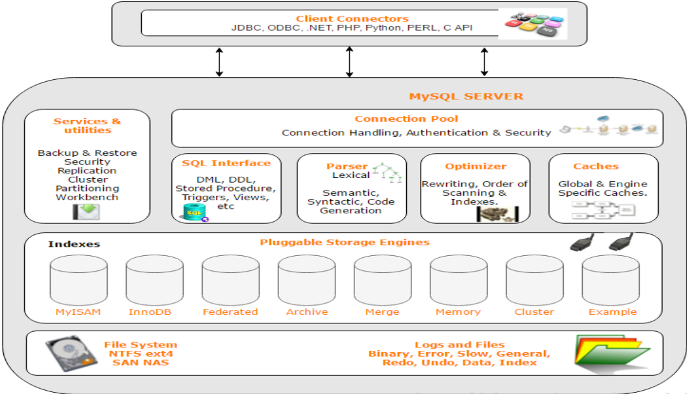

- **连接层**：**主要完成一些类似于连接处理、授权认证、及相关的安全方案**。在该层上引入了**线程池**的概念，为通过认证安全接入的客户端提供线程。同样在该层上可以实现基于 SSL 的安全链接。服务器也会为安全接入的每个客户端验证它所具有的操作权限。
- **服务层**：**主要完成大部分的核心服务功能**， 包括查询解析、分析、优化、缓存、以及所有的内置函数，所有跨存储引擎的功能也都在这一层实现，包括触发器、存储过程、视图等。
- **存储引擎层**：**负责 MySQL 中数据的存储和提取**，服务器通过 API 与存储引擎进行通信。不同的存储引擎具有的功能不同，这样我们可以根据自己的实际需要进行选取。
- **数据存储层**：主要是将数据存储在运行于该设备的文件系统之上，并完成与存储引擎的交互。


### 1.2 查询语句执行流程

1. 客户端发送一条查询给服务器。
2. 服务器先验证用户身份和权限。
3. 服务器检查查询缓存，如果命中了缓存，则立刻返回存储在缓存中的结果。否则进入下一阶段。
4. 服务器端进行 SQL 解析、预处理，再由优化器生成对应的执行计划。
5. MySQL 根据优化器生成的执行计划，调用存储引擎的 API 来执行查询。
6. 将结果返回给客卢端。

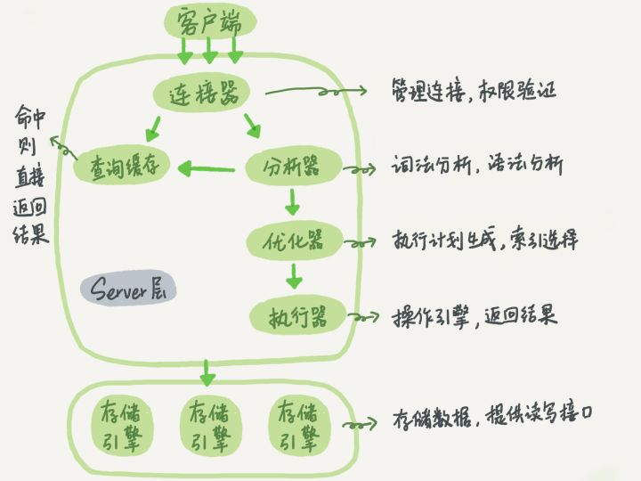


### 1.3 存储引擎

首先明确**存储引擎是基于表的，而不是数据库**，一个数据库中多个表可以使用不同的存储引擎，来满足各种性能和实际需求。常见的存储引擎有：InnoDB、MyISAM、Memory 等：

1. **InnoDB 存储引擎的特点是：支持事务、支持外键、行锁、非锁定读等**，除此之外，还提供了插入缓冲、二次写、自适应哈希索引、预读等高性能和高可用功能。InnoDB 能够通过配置决定是使用共享表空间（所有表共用一个或多个 ibdata 文件）存放数据，还是用独享表空间（每个表一个 .ibd 文件）存放数据。**MySQL 数据库从 5.5.8 版本开始，默认的存储引擎是 InnoDB（之前是 MyISAM）**。

   > 在 MySQL中建立任何一张数据表，在其数据目录对应的数据库目录下都有对应表的 `.frm` 文件，`.frm` 文件是用来保存每个数据表的元数据信息，包括表结构的定义等，与数据库存储引擎无关，也就是任何存储引擎的数据表都必须有`.frm`文件，命名方式为数据表名.frm

2. **MyISAM 存储引擎的特点是：不支持事务、表锁、缓冲池只缓存索引文件，不缓冲数据文件等**。MyISAM 存储引擎表由 MYD 和 MYI 组成，其中 MYD 存放数据文件，MYI 存放索引文件。

3. Memory 存储引擎的特点是：表锁、**默认使用哈希索引**，而不是 B+ 树索引。**MySQL 数据库使用它作为临时表来存放查询的中间结果**。

|              |    InnoDB    | MyISAM | Memory |
| :----------: | :----------: | :----: | :----: |
|   存储限制   |  √（64 TB）  |   ×    |   √    |
|   B+树索引   |      √       |   √    |   √    |
|   哈希索引   |      √       |   ×    |   √    |
|   空间索引   |      ×       |   √    |   ×    |
|   全文索引   | √（5.6版本） |   √    |   ×    |
|   聚簇索引   |      √       |   ×    |   ×    |
|   事务支持   |      √       |   ×    |   ×    |
|   外键支持   |      √       |   ×    |   ×    |
| MVCC/快照读  |      √       |   ×    |   ×    |
|    锁粒度    |     行锁     |  表锁  |  表锁  |
|   数据缓存   |      √       |   ×    |   √    |
|   索引缓存   |      √       |   √    |   √    |
|   数据压缩   |      ×       |   √    |   ×    |
|   存储消耗   |      高      |   低   | 不适用 |
|   内存消耗   |      高      |   低   |   中   |
| 批量插入速度 |      慢      |   快   |   快   |


## 2. 数据类型

### 2.1 整数和实数

|    类型     |                 大小（位）                 |     用途     |
| :---------: | :----------------------------------------: | :----------: |
|   tinyint   |                     8                      |   小整数值   |
|  smallint   |                     16                     |   大整数值   |
|  mediumint  |                     24                     |   大整数值   |
| int/integer |                     32                     |   大整数值   |
|   bigint    |                     64                     |  极大整数值  |
|    float    |                     32                     | 单精度浮点值 |
|   double    |                     64                     | 双精度浮点值 |
|   decimal   | 对decimal(M,D) ，如果M>D，为M+2；否则为D+2 |  精确小数值  |

1. 整数类型存储的范围为（-2<sup>n-1</sup>, 2<sup>n-1</sup> - 1），可以使用 unsigned 表示不允许负值，将范围提高一倍。
2. MySQL 为整数类型指定宽度是没有意义的，如 int(10)，它**不会限制值的合法范围**，只是规定了交互工具（如 MySQL 命令行客户端）用来显示字符的个数。
3. MySQL 使用 double 作为内部浮点运算的类型。
4. 因为需要额外的空间和计算开销，应该尽量只在对小数进行精确计算时才使用 decimal。当数据量较大时，可以考虑使用 bigint 代替，乘以相应的倍数即可。


### 2.2 字符串

|         类型          | 大小（字节） |               用途               |
| :-------------------: | :----------: | :------------------------------: |
|         char          |     255      |            定长字符串            |
|        varchar        |    65535     |            变长字符串            |
|   tinyblob/tinytext   |     255      |    （二进制形式的）短文本数据    |
|       blob/text       |    65535     |    （二进制形式的）长文本数据    |
| mediumblob/mediumtext |   16777215   | （二进制形式的）中等长度文本数据 |
|   longblob/longtext   |  4294967295  |   （二进制形式的）极大文本数据   |

1. blob 是 smallblob 的同义词，text 是 smalltext 的同义词。

2. blob 与 text 家族之间仅有的区别是 blob 存储的是二进制数据，没有排序规则或字符集，而 text 有排序规则和字符集。

3. varchar 需要使用 1 或 2 个额外字节记录字符串的长度：如果列的最大长度 <= 255 字节，则只使用 1 个字节表示，否则使用 2 个字节。

4. **char 与 varchar 的区别**：

   > 相同点：
   >
   > * char(n)，varchar(n) 中的 n 都代表字符的个数，而不是字节的个数，因此 char(1) 是可以存放 1 个汉字的；
   > * 超过 char，varchar 最大长度 n 的限制后，字符串会被截断。
   >
   > 不同点：
   >
   > * char 长度固定，不论实际存储的字符数，都会占用 n 个字符空间；而 varchar 长度可变，仅使用必要的空间，比 char 更节省空间；
   > * char 在存储时会删除末尾的空格，而 varchar 不会；
   > * 能存储的最大空间限制不同，char 的存储上限是 255 字节，而 varchar 是 65535 字节；
   > * char 适合存储很短的、固定长度、经常更新的字符串；而 varchar 适合存储变长、更新较少的字符串。


### 2.3 日期和时间

|   类型    | 大小（字节） |        格式         |       用途       |
| :-------: | :----------: | :-----------------: | :--------------: |
|   date    |      3       |     YYYY-MM-DD      |      日期值      |
|   time    |      3       |      HH:MM:SS       | 时间值或持续时间 |
|   year    |      1       |        YYYY         |      年份值      |
| datetime  |      8       | YYYY-MM-DD HH:MM:SS | 混合日期和时间值 |
| timestamp |      4       |   YYYYMMDD HHMMSS   |      时间戳      |

1. MySQL 能存储的最小时间单位粒度为秒，MariaDB 支持微秒级别的时间类型。

2. **datetime 与 timestamp 的区别**：

   > * datetime 能保存大范围的值，从 1001年到 9999 年，与时区无关；
   > * timestamp 只能表示从 1970 年到 2038 年，与时区有关，且列默认为 not null。应该尽量使用 timestamp，因为它比 datetime 空间效率更高。


## 3. 索引

### 3.1 索引介绍

**索引（index）是存储引擎用于快速找到记录的一种数据结构**，在MySQL 中也叫做键（key）。索引是在存储引擎层而不是服务层实现的，所以没有统一的标准：不同存储引擎的索引工作方式并不一样，也不是所有的存储引擎都支持所有类型的索引。

|  index   |    InnoDB    | MyISAM | Memory |
| :------: | :----------: | :----: | :----: |
| B+树索引 |      √       |   √    |   √    |
| 哈希索引 |      √       |   ×    |   √    |
| 空间索引 |      ×       |   √    |   ×    |
| 全文索引 | √（5.6版本） |   √    |   ×    |
| 聚簇索引 |      √       |   ×    |   ×    |

**索引的优点**：

1. 索引大大减少了服务器需要扫描的数据量。
2. 索引可以帮助服务器避免排序和临时表（order by / group by）。
3. 索引可以将随机 IO 变为顺序 IO。

**索引的缺点**：

1. 索引提高了查询速度，但会降低更新表的速度，如对表进行 INSERT、UPDATE 和 DELETE。因为更新表时，MySQL 不仅要保存数据，还要保存索引文件。
2. 索引会占用磁盘空间，一般这个问题不太严重，但如果在一个大表上创建了多种组合索引，索引文件会膨胀很快（一般来说索引本身也很大，不可能全部存储在内存中，因此索引往往以索引文件的形式存储在磁盘上）。
3. 如果某个数据列包含许多重复的内容，为它建立索引就没有太大的实际效果。
4. 对于非常小的表，大部分情况下简单的全表扫描更高效。


### 3.2 索引类型

#### 3.2.1 B+树索引

B-Tree 索引是最常见的索引类型，大多数 MySQL 引擎都支持，但使用方式、性能各有不同，InnoDB 引擎默认使用的就是 B-Tree 索引（准确的说，应该是B+Tree）。B-Tree 对索引列是**顺序组织存储**的，所以很适合**查找范围数据**，还可以用于查询中的 **order by 排序操作**。

**只包含一个字段的索引叫做单列索引，包含两个或以上字段的索引叫做复合索引（组合索引）**。下图是 B-Tree 单列索引的抽象表示。其中叶子节点比较特别，指针指向的是被索引的数据，而不是其它的节点页。

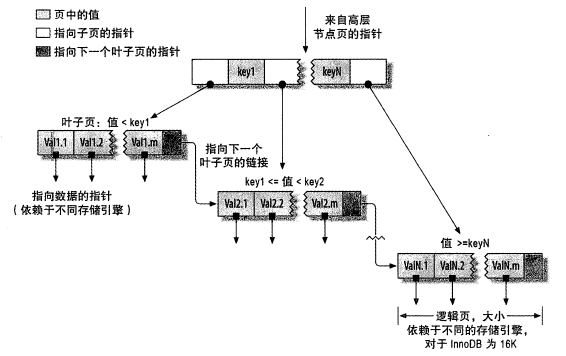

下图是 B-Tree **复合索引**的抽象表示。索引中包含了姓（last_name）、名（first_name）、出生日期（dob）列的值，排序顺序依据 create table 语句中定义的索引列顺序，比如当两个人的姓和名都一样时，按照出生日期进行排序。

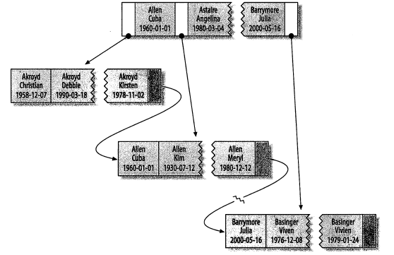

建立复合索引时，字段的顺序极其重要，因为键前缀查找只适用于**最左前缀查找**。

* **查询必须从索引的最左边的列开始**，否则无法使用索引。例如，你不能利用索引查找在某一天出生的人。
* **不能跳过某一索引列**。例如，你不能利用索引查找姓为 Smith 且出生于某一天的人。
* **存储引擎不能使用索引中范围条件右边的列**。例如，查询语句 where last_name="Smith" and first_name like 'J%' and dob='1976-12-23'，则该查询**会使用复合索引，但只会使用索引中的前两列**，因为 like 是范围查询。


#### 3.2.2 哈希索引

哈希索引基于哈希表实现，只有**精确匹配索引所有列的查询才有效**。对于每一行数据，存储引擎会对所有的索引列计算一个哈希码，并将所有**哈希码存储在索引中，同时在哈希表中保存指向每个数据行的指针**。如果多个哈希码相同（哈希冲突），索引会以**链表**的方式存放多个记录指针到同一个哈希条目中。

哈希索引是 Memory 引擎的默认索引类型，而 InnoDB 引擎有**“自适应哈希索引”**功能，当某个索引值被频繁使用时，会在内存中基于 B-Tree 索引之上再创建一个哈希索引，这样就让 B-Tree 索引也具有哈希索引的一些优点。

因为索引自身只需要存储对应的哈希值，所以索引的结构十分紧凑，这也让哈希索引**查找速度非常快**。然而，哈希索引也有限制：

* 哈希索引值包含哈希值和行指针，不存储字段值，所以**不能避免读取数据行**；
* 哈希索引不是按照索引值顺序存储的，所以**无法用于排序**；
* 哈希索引使用索引列的全部内容来计算哈希值，所以**不支持部分索引列匹配查找，也不支持任何范围查找**，只支持等值比较查找，包括 =、in、<=>（注意 <> 和 <=> 是不同的操作）。
* 如果**哈希冲突**很多，存储引擎必须遍历链表中所有的行指针，导致查询变慢和维护代价变高。


#### 3.2.3 空间索引

空间索引（R-Tree）用作**地理数据存储**，它无须前缀查找，会从所有维度来索引数据。


#### 3.2.4 全文索引

全文索引是一种特殊类型的索引，更类似于搜索引擎做的事情，它查找的是**文本中的关键词**，而不是直接比较索引中的值。它适用于 match against 操作，而不是普通的 where 条件操作。全文索引通常使用**倒排索引（inverted index）**来实现，倒排索引同 B+ 树索引一样，也是一种索引结构，它**存储了单词与单词自身在一个或多个文档中所在位置之间的映射**。这通常利用关联数组实现，其拥有两种表现形式：

* inverted file index，其表现形式为 **{单词，单词所在文档的 ID}**
* full inverted index，其表现形式为 **{单词，{单词所在文档的 ID，在具体文档中的位置}}**

相比之下，full inverted index 占用更多空间，但是能更好地定位数据，并扩充了一些其它搜索特性。InnoDB 存储引擎采用的就是这种方式。


### 3.3 高效索引

#### 3.3.1 前缀索引

当索引是很长的字符列时，会让索引变得大且慢。一种策略是模拟哈希索引，比如使用 CRC32 函数对 URL 做哈希，建立 URL 与 哈希值的对应关系；另一种策略是可以**索引开始的部分字符**，这样可以大大节约索引空间，从而提高索引效率。**对于 blob、text 或者很长的 varchar 类型的列，必须使用前缀索引**。

前缀选择应该足够长，以使得前缀”索引的选择性“接近于索引整个列，但同时又不能太长，以便节约空间。**索引的选择性**指的是：不重复的索引值（基数）和数据表的记录总数（T）的比值，范围从 1/T 到 1 之间，索引的选择性越高区分度越好，查询效率越高。


#### 3.3.2 聚簇索引

聚簇索引也叫聚集索引，它不是一种索引类型，而是一种数据存储方式。”聚簇“表示**数据行和相邻的键值紧凑地存储在一起**，因为无法同时把数据行存放在两个不同的地方，所以**一个表只能有一个聚簇索引**。

**InnoDB 默认使用主键作为聚簇索引**，如果没有定义主键，InnoDB 会选择一个唯一的非空索引代替，如果没有这样的索引，InnoDB 会隐式定义一个主键来作为聚簇索引。下图是聚簇索引的抽象表示，注意**节点页只包含索引列，而叶子页包含了行的全部数据**。

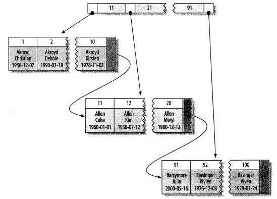

**聚簇索引的优点**：

1. 可以把相关数据保存在一起，减少读取磁盘的次数，加快数据访问。
2. 数据访问更快，因为聚簇索引将索引和数据保存在同一个B-Tree中。
3. 使用覆盖索引扫描的查询可以直接使用页节点中的主键值。

**聚簇索引的缺点**：

1. 更新聚簇索引的代价很高，因为会强制 InnoDB 将每个被更新的行移动到新的位置。
2. 插入新行可能导致**”页分裂“**。当行的主键值要求必须将这一行插入到某个已满的页中时，存储引擎会将该页分裂成两个页面来容纳该行，这就是一次页分裂操作，页分裂会导致表占用更多磁盘空间。


**1. 聚簇索引与非聚簇索引、主键索引与二级索引的对比**

* **MyISAM**

  MyISAM 按照数据插入的顺序存储在磁盘上，如下图所示。左边是行号，从 0 开始递增，因为行是定长的，所以 MyISAM 可以从表的开头跳过所需的字节找到需要的行。

  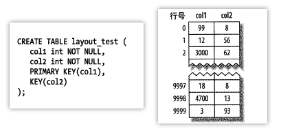

  **MyISAM 不支持聚簇索引，且主键索引与二级索引没有什么区别**，主键索引仅仅是一个名为 primary 的唯一非空索引。如下图所示，**索引中的每个叶子节点仅包含行号**。

  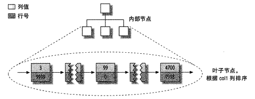


* **InnoDB**

  InnoDB 支持且默认使用主键作为聚簇索引，如下图所示，**每一个叶子节点都包含了主键值、事务ID、用于事务和 MVCC 的回滚指针以及剩余列**。在 InnoDB 中，聚簇索引”就是表“，所以不像 MyISAM 那样需要独立的行存储。

  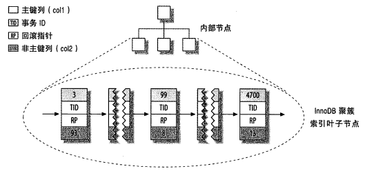

  InnoDB 的二级索引与聚簇索引不同，二级索引访问需要两次索引查找，而不是一次，如下图所示。**叶子节点中存储的不是行指针，而是主键值，并以此作为行的指针**。这样做的好处是减少了移动数据或者数据页分裂时二级索引的维护开销。

  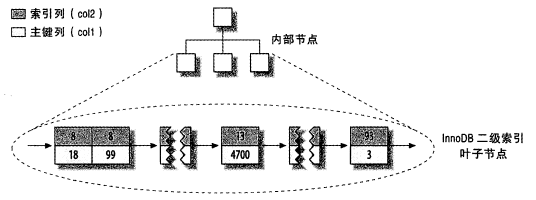
  
  在 InnoDB 表中，**如果设置了主键，则聚簇索引就是主键索引**，一个表有且只有一个聚簇索引，而**所有普通索引（非聚簇索引）都是二级索引**。最后给出 InnoDB 和 MyISAM 如何存放表的抽象图。
  
  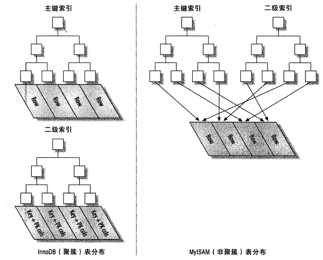

**2. 在 InnoDB 表中按主键顺序插入行**

使用 InnoDB 时应该尽可能地**按自增的主键顺序插入数据**，这样可以保证数据行是按顺序写入的。

如果主键的值是顺序的，InnoDB 会把每一条记录都存储在上一条记录的后面。当达到页的最大填充因子时（InnoDB 默认的最大填充因子是页大小的15/16，留出部分空间用于以后修改），下一条记录就会写入新的页中，此时主键页近似于被顺序的记录填满。

如果主键的值不是顺序的，而是无规律数据，比如字符串，InnoDB 无法简单地把新行插入到索引的最后，而是需要为新行寻找合适的位置（通常是已有数据的中间位置），并且分配空间。这就会导致大量的随机 I/O，页分裂，最终数据也会有碎片。


#### 3.3.3 覆盖索引

**如果一个索引包含（覆盖）所有需要查询的字段的值，就称为覆盖索引**。**即从辅助索引中就可以得到查询的记录**，而不需要回表查询聚集索引中的记录。覆盖索引必须要存储索引列的值，而哈希索引、空间索引和全文索引等都不存储索引列的值，所以 MySQL **只能使用 B-Tree 索引做覆盖索引**。为了实现索引覆盖，通常将被查询的字段建立到复合索引中。

**覆盖索引的优点**：

1. 索引条目通常远小于数据行大小，所以如果只需要读取索引，可以极大地**减少数据访问量**。
2. 由于 InnoDB 的聚簇索引，覆盖索引**对 InnoDB 表特别有用**。而由于 MyISAM 在内存中只缓存索引，数据则依赖于操作系统来缓存，因此访问数据需要一次系统调用，可能导致严重的性能问题。


#### 3.3.4 索引排序

MySQL 可以利用同一索引同时进行查找和排序操作，**只有当索引的顺序与 order by 子句的顺序完全相同，且所有的列是同一方向（全部升序或者全部降序）时，才可以使用索引来排序**。如果查询需要关联多个表，则只有当 order by 子句引用的字段全部是第一个表时，才能使用索引进行排序。

和查询的限制一样，索引排序需要满足索引的**最左前缀**要求。有一种情况例外，那就是前导列为常量时，即 where 子句或者 join 子句中对前导列指定了常量。其它情况都会使用 filesort 文件排序。

```mysql
-- 假设key idx_rental(rental_date, inventory_id, customer_id)
-- 1.能使用索引排序
where rental_date = '2005-05-25' order by inventory_id, customer_id;  -- 第一列被指定为常数
-- 2.不能使用索引排序
where rental_date = '2005-05-25' order by inventory_id desc, customer_id asc; -- 排序不一致
where rental_date = '2005-05-25' order by customer_id;	-- 不符合最左前缀
where rental_date > '2005-05-25' order by inventory_id, customer_id;	-- 第一列是范围查找
where rental_date = '2005-05-25' and inventory_id in (1,2) order by customer_id;	-- 对于排序来说，多个相等条件也是范围查找
```


#### 3.3.5 索引失效

1. 索引列不能是表达式的一部分，也不能是函数的参数。
2. like 模糊匹配不要以通配符 % 或 _ 开头，即头部模糊匹配。
3. 尽量不要使用 not in、<>、!= 操作。
4. 用 or 分割开的条件， 如果 or 前的条件中的列有索引， 而后面的列中没有索引， 那么涉及到的索引都不会被用到。
5. 如果列类型是字符串，那么一定记得在 where 条件中把字符常量值用引号引起来。否则即便这个列上有索引，MySQL 也不会用到的，因为 MySQL 默认把输入的常量值进行转换以后才进行检索。
6. 尽量使用覆盖索引，用具体的字段列表代替 select *。


### 3.4 查询优化

#### 3.4.1 show

通过 `show [session|global] status` 命令可以**查看服务器状态信息**，session 显示当前连接的计结果，global 显示自数据库上次启动至今的统计结果，默认使用 session。

```mysql
-- 统计所有存储引擎执行增删改查的次数
show status like 'Com_______';
-- 只统计InnoDB存储引擎执行增删改查的次数
show status like 'Innodb_rows_%';
-- 统计慢查询的次数
show status like 'Slow_queries';
-- 统计试图连接MySQL服务器的次数
show status like 'Connections';
```


#### 3.4.2 慢查询日志

可以通过以下两种方式定位执行效率较低的 SQL 语句：

- **慢查询日志**：它会记录运行时间超过设定阈值的所有 SQL 语句，阈值默认 10 秒；分析慢查询日志需要使用 `mysqldumpslow` 命令
- **show processlist**：慢查询日志在查询结束后才记录，使用 `show processlist` 命令可查看当前 MySQL 正在进行的线程，包括线程的状态、是否锁表等，**实时查看 SQL 的执行情况**，同时对一些锁表操作进行优化。


#### 3.4.3 explain

使用 `explain SQL语句` 命令可以模拟优化器执行 SQL 查询语句，从而知道 MySQL 是如何处理 SQL 语句的。

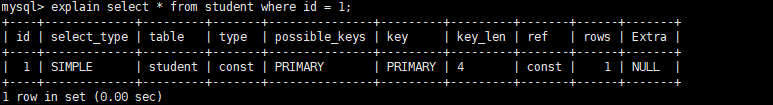

| 字段          | 含义                                                         |
| ------------- | ------------------------------------------------------------ |
| id            | 表示查询的序列号，是一组数字，表示的是查询中执行 select 子句或者是操作表的顺序。id 相同，执行顺序从上到下；id 不同，值越大优先级越高，越先被执行。 |
| select_type   | 表示查询类型，常见的取值有：SIMPLE（简单表，即不使用表连接或者子查询）、PRIMARY（主查询，即外层的查询）、UNION（UNION 中的第二个或者后面的查询语句）、SUBQUERY（子查询中的第一个 SELECT）等 |
| table         | 表示这一行的数据是关于哪张表的                               |
| type          | **表示表的连接类型**，性能由好到差的连接类型为：NULL > system > const > eq_ref > ref > fulltext > ref_or_null > index_merge > unique_subquery > index_subquery > range > index > ALL，一般来说， **我们需要保证查询至少达到 range 级别， 最好达到ref**。 |
| possible_keys | **表示查询时，可能使用的索引**，一个或多个，但不一定被查询实际使用 |
| key           | **表示实际使用的索引**，如果为 NULL，则没有使用索引          |
| key_len       | 表示索引字段最大可能长度，并非实际使用长度，在不损失精确性的前提下，长度越短越好 |
| ref           | 表示索引的哪一列被使用了，如果可能的话，是一个常数           |
| rows          | 根据表统计信息及索引选用情况，大致估算找到所需的记录所需要读取的行数 |
| extra         | 包含不适合在其他列中显示但十分重要的额外信息，常见的取值有：using  filesort（数据使用一个外部的索引排序，而不是按照表内的索引顺序进行读取，称为“文件排序”，效率低）、using  temporary（使用了临时表保存中间结果，MySQL在对查询结果排序时使用临时表，效率低）、using  index（使用了覆盖索引，避免访问表的数据行，效率不错） |

| type   | 含义                                                         |
| ------ | ------------------------------------------------------------ |
| NULL   | MySQL 不访问任何表，索引，直接返回结果                       |
| system | 表只有一行记录（等于系统表），这是 const 类型的特例，一般不会出现 |
| const  | 表示通过索引一次就找到了，const 用于比较 primary key 或者 unique 索引。因为只匹配一行数据，所以很快，如将主键置于 where 列表中，MySQL 就能将该查询转换为一个常量 |
| eq_ref | 类似 ref，区别在于使用的是唯一索引，使用主键的关联查询，关联查询出的记录只有一条。常见于主键或唯一索引扫描 |
| ref    | 非唯一性索引扫描，返回匹配某个单独值的所有行。本质上也是一种索引访问，返回所有匹配某个单独值的所有行（多个） |
| range  | 只检索给定返回的行，使用一个索引来选择行。 where 之后出现 between ， < , > , in 等操作 |
| index  | index 与 ALL的区别为  index 类型只是遍历了索引树， 通常比 ALL 快， ALL 是遍历数据文件 |
| all    | 将遍历全表以找到匹配的行                                     |


#### 3.4.4 profiling

在做 SQL 优化时，`show profiles` 和 `show profile` 命令能帮助我们**了解耗费的时间**，默认情况下，profiling 是关闭的，可使用 `select @@profiling` 查看是否开启 profiling；使用 `set profiling=1` 来开启 profiling。

首先执行一系列 SQL 命令，然后执行 `show profiles` 命令来查看 SQL 语句执行的耗时：


然后通过 `show profile for query query_id` 语句查看该 SQL 执行过程中每个线程的状态和消耗的时间。其中，Sending data 状态表示 MySQL 线程开始访问数据行并把结果返回给客户端，而不仅仅是返回个客户端。由于在 Sending data 状态下，MySQL 线程往往需要做大量的磁盘读取操作，所以经常是各查询中耗时最长的。


## 4. 事务

### 4.1 事务的四大特性（ACID）

**事务就是一组原子性的 SQL 查询**。如果数据库引擎能够成功地对数据库应用该组查询的全部语句，那么就执行该组查询；如果其中有任何一条语句因为崩溃或其他原因无法执行，那么所有的语句都不会执行。也就是说，事务内的语句，要么全部执行成功，要么全部执行失败。

> 以银行转账为例，假设用户 A 向用户 B 转移 200 元，那么需要至少 3 个步骤：
>
> 1. 检查用户 A 的账户余额高于 200 元；
> 2. 从用户 A 的账户余额中减去 200 元；
> 3. 在用户 B 的账户余额中增加 200 元。

* **原子性（atomicity）**：**事务是最小的执行单位，不允许分割**。整个事务中的所有操作要么全部提交成功，要么全部失败回滚，不可能只执行其中的一部分操作。

* **一致性（consistency）**：**数据库总是从一个一致性的状态转换到另外一个一致性的状态**。在前面的例子中，如果在执行第2、3条语句之间系统崩溃，那么不会出现用户 A 的账户余额减少了，而用户 B 的账户余额没有增加。因为事务最终没有提交，所以事务中所做的修改也不会保存到数据库中。

* **隔离性（isolation）**：**通常来说，一个事务所做的修改在最终提交以前，对其他事务是不可见的**。在前面的例子中，如果在执行第2、3条语句之间，此时有另外一个转账事务开始运行，则其看到的用户 A 的余额并没有被减去 200 元。

  再比如，事务Ⅰ需要将 100 元转入帐号 A，先读取帐号 A 的值，然后在这个值上加上100。但是，在这两个操作之间，另一个事务Ⅱ修改了帐号 A 的值，也为它增加了100元。那么最后的结果应该是 A 增加了200元，但事实上，事务Ⅰ最终完成后，帐号 A 只增加了100元，因为事务Ⅱ的修改结果被事务Ⅰ覆盖掉了。**从单个事务的角度看，不管是事务Ⅰ还是事务Ⅱ，它们都保证了原子性，但最终它们并没有保证数据库的一致性**。

* **持久性（durability）**：**一旦事务提交，则其所做的修改就会永久保存到数据库中**。此时即使系统崩溃，修改的数据也不会丢失。


### 4.2 事务的隔离级别

多个事务并发运行，经常会操作同一数据来完成各自的任务，可能会导致以下的问题。

- **脏读（dirty read）**：当一个事务正在访问数据并且对数据进行了修改，而这种修改还没有提交到数据库中，这时另外一个事务也访问了这个数据，然后使用了这个数据。因为这个数据是还没有提交的数据，那么另外一个事务读到的这个数据是“脏数据”，依据“脏数据”所做的操作可能是不正确的。
- **丢失修改（lost to modify）**：指在一个事务读取一个数据时，另外一个事务也访问了该数据，那么在第一个事务中修改了这个数据后，第二个事务也修改了这个数据。这样第一个事务内的修改结果就被丢失，因此称为丢失修改，也叫脏写，它是一种写写冲突。
- **不可重复读（unrepeatable read）**：指在一个事务内多次读同一数据，在这个事务还没有结束时，另一个事务也访问该数据。那么，在第一个事务中的两次读数据之间，由于第二个事务的修改导致第一个事务两次读取的数据可能不太一样。这就发生了在一个事务内两次读到的数据是不一样的情况，因此称为不可重复读。
- **幻读（phantom read）**：幻读与不可重复读类似。当某个事务在读取某个范围内的记录时，另外一个事务又在该范围内插入了新的记录，当之前的事务再次读取该范围的记录时，会发现多了一些原本不存在的记录，产生幻行。（不可重复读的重点是**修改**，比如多次读取一条记录发现其中某些列的值被修改，幻读的重点在于**新增或者删除**，比如多次读取一条记录发现记录增多或减少了。）

隔离性其实比较复杂，SQL 标准定义了四种隔离级别：

- **READ UNCOMMITTED（读取未提交）**：最低的隔离级别，允许读取尚未提交的数据变更，可能会导致脏读、幻读或不可重复读。
- **READ COMMITTED（读取已提交）**：大多数数据库系统的默认隔离级别（MySQL 不是），允许读取并发事务已经提交的数据，可以阻止脏读，但是幻读或不可重复读仍有可能发生。
- **REPEATABLE READ（可重复读）**：MySQL 的默认隔离级别，对同一字段的多次读取结果都是一致的，除非数据是被本身事务自己所修改，可以阻止脏读和不可重复读，但幻读仍有可能发生。
- **SERIALIZABLE（可串行化）**：最高的隔离级别，所有的事务依次逐个执行，这样事务之间就完全不可能产生干扰，可以防止脏读、不可重复读以及幻读。它会在读取的每一行数据上都加锁，所以可能导致大量的超时和锁争用问题。

需要注意的是：与 SQL 标准不同的地方在于 InnoDB 存储引擎在 REPEATABLE-READ 事务隔离级别下使用的是 Next-Key Lock 锁算法，因此可以避免幻读的产生，这与其他数据库系统是不同的。

|     隔离级别     | 脏读可能 | 不可重复读可能 | 幻影读可能 | 加锁读 |
| :--------------: | :------: | :------------: | :--------: | :----: |
| READ UNCOMMITTED |    √     |       √        |     √      |   ×    |
|  READ COMMITTED  |    ×     |       √        |     √      |   ×    |
| REPEATABLE READ  |    ×     |       ×        |     √      |   ×    |
|   SERIALIZABLE   |    ×     |       ×        |     ×      |   √    |

注：丢失修改可使用锁机制让事务串行化执行来解决。另外在使用分布式事务时，InnoDB 存储引擎的事务隔离级别必须设置为 SERIALIZABLE。

**两段锁协议**：

是指所有的事务必须分两个阶段对数据项加锁和解锁。即事务分两个阶段，**第一个阶段是获得封锁**，事务可以获得任何数据项上的任何类型的锁，但是不能释放；**第二阶段是释放封锁**，事务可以释放任何数据项上的任何类型的锁，但不能申请。

**三级封锁协议**：

一级封锁：修改数据加 X 锁直到事务结束才释放。在此协议中，仅仅是**读数据是不需要加锁的**，所以只能解决丢失修改问题，不能解决脏读和不可重复读。

二级封锁：在一级封锁的基础上，加了一条：T 事务在读取数据 R 之前必须先对其加上 S 锁，**读完释放 S 锁**。可以解决丢失修改和脏读（加了读锁就可以防止在读的期间其他事务进行修改，但是读完之后，事务结束之前，依然可能会有其他事务进行修改，导致不可重复读）。

三级封锁协议：一级封锁协议加上事务 T 在读取数据 R 之前必须先对其加 S 锁，**直到事务结束才释放**。解决了丢失修改、脏读和不可重复读的问题。


### 4.3 多版本并发控制（MVCC）

多版本并发控制（Multi-Version Concurrency Control，MVCC）可以认为是**行级锁的一个变种**，它在很多情况下避免了加锁操作，取而代之的是把**行锁与行的多个版本结合**起来，因此开销更小，从而提高了并发性能。

MVCC 的实现有乐观并发控制和悲观并发控制。InnoDB 中的 MVCC，是通过在每行记录后面保存**两个隐藏的列**来实现的，这两个列，一个保存了**行的创建时间**，一个保存了**行的过期时间（删除时间）**。当然存储的并不是实际的时间值，而是系统版本号。每开始一个新的事务，系统版本号都会自动递增。事务开始时刻的系统版本号会作为事务的版本号，用来和查询到的每行记录的版本号进行比较。下面看一下在 REPEATABLE READ 隔离级别下，MVCC 是如何操作的：

1. SELECT： InnoDB 会根据以下两个条件检查每行记录，只有符合这两个条件的记录，才能返回作为查询结果
   * 只查找版本早于（小于或等于）当前事务版本的数据行，这样可以确保事务读取的行，要么是在事务开始前已经存在的，要么是事务自身插入或者修改过的。
   * 行的删除版本要么未定义，要么大于当前事务版本号。这可以确保事务读取到的行，在事务开始之前未被删除。
2. INSERT： InnoDB 为新插入的每一行保存当前系统版本号作为行版本号。
3. DELETE： InnoDB 为删除的每一行保存当前系统版本号作为行删除标识。
4. UPDATE： InnoDB 为更新的每一行保存当前系统版本号作为行版本号和行删除标识。

**MVCC 的优缺点**：MVCC 在大多数情况下代替了行锁，**实现了对读的非阻塞，读不加锁，读写不冲突**。缺点是每行记录都**需要额外的存储空间**，需要做更多的行维护和检查工作。

MVCC 只在 REPEATABLE READ 和 READ COMMITTED 两个隔离级别下工作。其他两个隔离级别都和 MVCC 不兼容，因为 READ UNCOMMITTED 总是读取最新的数据行，而不是符合当前事务版本的数据行。而 SERIALIZABLE则会对所有读取的行都加锁。


### 4.4 事务的实现

**锁用来保证事务隔离性，redo log 重做日志用来保证事务的原子性和持久性，undo log 回滚日志用来保证事务的一致性**。redo 和 undo 都属于事务日志，MySQL 还有一种 **binlog 二进制日志，可用于主从复制环境的建立**。

#### 4.4.1 redo

redo log 由两部分组成：**内存中的重做日志缓冲，其是易失的；二是重做日志文件，其是持久性的**。当事务提交时，必须先将该事务的所有日志写入到重做日志文件进行持久化。为了确保写入磁盘，在每次重做日志缓冲写入重做日志文件后，InnoDB 存储引擎都需要调用一次 fsync 操作。由于重做日志块和磁盘扇区大小一样，因此**重做日志的写入可以保证原子性**。

**redo log 和 binlog 的主要区别**：

* 产生地点不同，**重做日志是在 InnoDB 存储引擎层产生；而二进制日志是在 MySQL 数据库的上层产生**，MySQL 的任何存储引擎对于数据库的更改都会产生二进制日志。
* 内容形式不同，**重做日志通常是物理日志，记录的是对于每个页的修改；而二进制日志是一种逻辑日志，记录的是对应的 SQL 语句**。因此重做日志恢复的速度比逻辑日志，如二进制日志，要快很多。
* 写入磁盘时间点不同，**重做日志在事务进行中不断地被写入，而二进制日志只在事务提交完成后进行一次写入**。


#### 4.4.2 undo

undo log 是逻辑日志，因此只是将数据库逻辑地恢复到原来的样子，但是数据结构和页本身在回滚之后可能大不相同。例如，用户执行了一个 insert 10W 条记录的事务，这个事务会导致表空间增大。在用户执行 rollback 时，会将插入的事务进行回滚，但是表空间的大小并不会因此收缩。**回滚实际上做的是与先前相反的工作**，对于每个 insert/delete，完成一个 delete/insert；对于每个 update，执行相反的 update，将修改前的行放回去。

> delete 和 update 可能并不直接删除原有数据，甚至没有产生 undo log，只是将那个记录的 delete flag 设置为 1，记录并没有被删除，即记录还在 B+ 树中。而**真正的删除操作被延时到了 purge 操作中完成，这样设计是因为 InnoDB 支持 MVCC**，所以记录不能在事务提交时立即进行处理，这时其它事务可能正在引用这行，故需要保存记录之前的版本。**若该行记录已不被任何其它事务引用，那么就进行真正的 delete 操作**。

除了回滚操作，undo 的另一个作用是 MVCC，**InnoDB 存储引擎中 MVCC 通过 undo 来实现一致性非锁定读**。另外，undo log 的产生会伴随 redo log 的产生，因为 undo 也需要持久化。

**redo log 和 undo log 的主要区别**：

* 两者记录的内容不同，**redo 通常是物理日志，记录的是页的物理修改操作；而 undo 是逻辑日志，根据每行记录进行记录**。
* 两者都可以视为一种恢复操作，**redo 恢复提交事务修改的页操作；而 undo 回滚行记录到某个特定版本**。
* 存放地点不同，**redo 存放在重做日志文件中，而 undo 存放在数据库内部的一个特殊段中（undo 段，位于共享表空间内）**。


## 5. 锁机制

### 5.1 锁的分类

**从对数据操作的类型分类**：

- **读锁（read lock）**：也叫共享锁（shared lock）、S 锁。读锁是共享的，针对同一份数据，多个读操作可以同时进行，不会互相影响。
- **写锁（write lock）**：也叫排他锁（exclusive lock）、X 锁。写锁是排他的，一个写锁会阻塞其它的写锁和读锁。

**从对数据操作的粒度分类**：

- **表锁（table lock）**：开销小，加锁快；不会出现死锁；锁定粒度大，发生锁冲突的概率最高，并发度最低（MyISAM 和 MEMORY 存储引擎采用的是表级锁）。
- **行级锁（row lock）**：开销大，加锁慢；会出现死锁；锁定粒度最小，发生锁冲突的概率最低，并发度也最高（InnoDB 存储引擎既支持行级锁也支持表级锁，但默认情况下是采用行级锁）；
- **页面锁（page lock）**：开销和加锁时间界于表锁和行锁之间；会出现死锁；锁定粒度界于表锁和行锁之间，并发度一般。

| 锁类型 | InnoDB | MyISAM | Memory | BDB  |
| :----: | :----: | :----: | :----: | :--: |
|  表锁  |   √    |   √    |   √    |  √   |
| 行级锁 |   √    |   ×    |   ×    |  ×   |
| 页面锁 |   ×    |   ×    |   ×    |  √   |


### 5.2 MyISAM 表锁

MyISAM 的表锁有两种模式：

- 表共享读锁 （Table Read Lock）：不会阻塞其他用户对同一表的读请求，但会阻塞对同一表的写请求；
- 表独占写锁 （Table Write Lock）：会阻塞其他用户对同一表的读和写操作；

MyISAM 表的读操作与写操作之间，以及写操作之间是串行的。默认情况下，**写锁比读锁具有更高的优先级**：当一个锁释放时，这个锁会优先给写锁队列中等候的获取锁请求，然后再给读锁队列中等候的获取锁请求。


### 5.3 InnoDB 行锁

InnoDB 实现了以下两种类型的**行锁**：

- 共享锁（S）：允许事务读一行数据。
- 排他锁（X）：允许事务删除或更新一行数据。

为了允许行锁和表锁共存，实现多粒度锁机制，InnoDB 还有两种内部使用的**意向锁（Intention Locks）**，这**两种意向锁都是表锁**：

- 意向共享锁（IS）：事务想要获取一张表中某几行的共享锁。
- 意向排他锁（IX）：事务想要获取一张表中某几行的排他锁。

意向锁将锁定的对象分为多个层次，若将上锁的对象看成一棵树，那么对最下层的对象上锁，也就是**对最细粒度的对象进行上锁，那么首先需要对粗粒度的对象上锁**。比如需要对页上的记录上 X 锁，那么需要对数据库、表、页上 IX 锁，最后对记录上 X 锁。

由于 InnoDB 支持的是行锁，因此**意向锁不会阻塞除全表扫描以外的任何请求**。表级意向锁与行级锁兼容性如下：

|      |  IS  |  IX  |  S   |  X   |
| :--: | :--: | :--: | :--: | :--: |
|  IS  |  √   |  √   |  √   |  ×   |
|  IX  |      |  √   |  ×   |  ×   |
|  S   |      |      |  √   |  ×   |
|  X   |      |      |      |  ×   |


#### 5.3.1 一致性非锁定读

**一致性非锁定读（consistent nonlocking read）也叫快照读**，是指 InnoDB 存储引擎**通过 MVCC 的方式**来读取当前执行时间数据库中行的数据。**如果读取的行正在执行 delete 或 update 操作，这时读取操作不会因此去等待行上锁的释放，而是去读取行的一个快照数据**。快照数据指的是该行之前版本的数据，该实现是通过 undo 段来完成，而 undo 用来事务中的回滚数据，因此快照数据本身没有额外的开销。


非锁定读机制极大地**提高了数据库的并发性**，这也是 InnoDB 存储引擎**默认的读写方式，即读取不会占用和等待表上的锁**。但是并不是在每个事务隔离级别下都是采用非锁定的一致性读，即使使用非锁定的一致性读，对于快照数据的定义也各不相同。在 READ COMMITTED 事务隔离级别下，非一致性读总是被锁定行的**最新一份快照数据**；而在 REPEATABLE READ 事务隔离级别下，非一致性读总是读取**事务开始时的行数据版本**。

| 时间 | 会话 A                                                 | 会话 B                                                 |
| :--: | ------------------------------------------------------ | ------------------------------------------------------ |
|  1   | begin                                                  |                                                        |
|  2   | 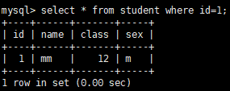 |                                                        |
|  3   |                                                        | begin                                                  |
|  4   |                                                        |  |
|  5   |  |                                                        |
|  6   |                                                        | commit                                                 |
|  7   |  |                                                        |
|  8   | commit                                                 |                                                        |

注：如果是在 READ COMMITTED 事务隔离级别下，那么步骤 7 则会读取最新的数据，即查询为空。


#### 5.3.2 一致性锁定读

使用 MVCC 的一致性非锁定读虽然读不加锁，并发性高，但是读取的不是最新的数据。在某些情况下，用户需要**显式地对数据库读取操作进行加锁**以保证数据逻辑的一致性。InnoDB 存储引擎对 select 语句支持两种**一致性锁定读（locking read），也叫当前读**：

* **select ... for update**：对读取的行记录**加一个 X 锁**，其它事务不能对已锁定的行加任何锁
* **select ... lock in share mode**：对读取的行记录**加一个 S 锁**，其它事务可以对已锁定的行加 S 锁，但不能加 X 锁（默认使用的都是 Next-Key Lock 锁算法）

使用上述两条 select 锁定语句时，**必须在一个事务中**，务必加上 begin，start transaction 或 set autocommit = 0，当事务提交了，锁也就释放了。对于一致性非锁定读，即使读取的行已被执行了 select ... for update，也是可以进行读取的，这和之前讨论的情况一样。


#### 5.3.3 锁算法

InnoDB 存储引擎有 3 种行锁的算法，分别是：

* **Record Lock：记录锁，锁定一个记录上的索引，而不是记录本身**。如果表上没有建立任何索引，则会使用隐式的主键来进行锁定。
* **Gap Lock：间隙锁，锁定索引的一个范围，但不包括索引本身**（开区间）。间隙锁可以解决幻读的问题。
* **Next-Key Lock： 临键锁，Record Lock + Gap Lock，锁定索引的一个范围，并且锁定索引本身**（左开右闭区间）。假设一个索引有 10、11、13、20 四个值，那么该索引可能被锁定的区间为：(-∞, 10]、(10, 11]、(11, 13]、(13, 20]、(20, +∞)。InnoDB 对于行的查询默认采用该算法，**当查询的索引含有唯一属性（唯一索引，主键索引）时，Innodb 存储引擎会对 next-key lock 进行优化，将其降为 record lock**，即仅锁住索引本身，而不是范围，从而提高并发性。

| 时间 | 会话 A                                 | 会话 B                                 |
| ---- | -------------------------------------- | -------------------------------------- |
| 1    | 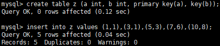 |                                        |
| 2    | begin                                  |                                        |
| 3    | 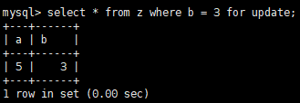 |                                        |
| 4    |                                        | 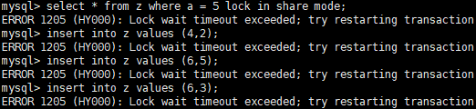 |
| 5    | commit                                 |                                        |

说明：在步骤 3 执行后，由于有两个索引，因此 Next-Key Lock 会分别进行锁定。对于主键索引（唯一属性），仅对列 a 等于 5 的索引加上 Record Lock；而对于辅助索引，加上的是 Next-Key Lock，锁定范围是 (1,3]，特别注意的是，InnoDB 存储引擎还会对辅助索引下一个键值加上 Gap Lock，即还有一个锁定范围是 (3,6)。因此步骤 4 中的插入操作都会被阻塞。

**总结：一致性非锁定读通过 MVCC 实现了读的非阻塞，由于读不加锁，读写不冲突，因此提高了并发性能，且在 REPEATABLE READ 隔离级别下，可以防止幻读，只不过读取的是行的快照数据，此时另外一个事务可以修改不会阻塞。一致性锁定读使用 Next-Key Lock 锁算法对读取操作进行显式加锁，也可以防止幻读，此时另外一个事务修改锁定范围的数据会被阻塞。**


### 5.4 死锁

**死锁是指两个或两个以上的事务在执行过程中，因争夺锁资源而造成的一种互相等待的现象**，若无外力作用，事务都将无法推进下去。解决死锁最简单的一种方法是**超时**，即当两个事务相互等待时，当一个等待时间超过设定的阈值时，其中一个事务进行回滚，另一个事务就能继续进行，通常来说 **InnoDB 存储引擎选择回滚 undo 量最小的事务**。

除了超时机制，当前数据库还普遍采用 **wait-for graph（等待图）**来进行死锁检测，相比超时，它是一种主动的死锁检测方式，InnoDB 存储引擎也采用这种方式。wait-for graph 的死锁检测通常采用**深度优先**算法实现，如果图中存在回路，就代表存在死锁。


## 6. 其它特性

### 6.1 分区

**分区功能并不是在存储引擎层完成的**，因此不是只有 InnoDB 存储引擎支持分区，常见的存储引擎 MyISAM、NDB 等都支持，但也不是所有存储引擎都支持。**分区的过程是将一个表或索引分解为多个更小、更可管理的部分**。从逻辑上讲，只有一个表或一个索引，但是在物理上这个表或索引可能由数十个物理分区组成，每个分区都是独立的对象。**MySQL 数据库支持水平分区，并不支持垂直分区**。

* **水平分区**：指将同一表中**不同行**的记录分配到不同的物理文件中
* **垂直分区**：指将同一表中**不同列**的记录分配到不同的物理文件中


### 6.2 日志

MySQL 数据库中常见的日志文件有：

* **错误日志**：不仅记录所有的错误信息，也记录一些警告信息或正确的信息。
* **慢查询日志**：记录运行时间超过设定阈值的所有 SQL 语句，阈值可通过参数 `long_query_time` 来设置，默认 为10 秒。分析慢查询日志可使用 `mysqldumpslow` 命令，默认情况下，慢查询日志并没有启动。
* **查询日志**：记录所有对 MySQL 数据库请求的信息，无论这些请求是否得到正确的执行。
* **二进制日志**：记录了对 MySQL 数据库执行**更改**的所有操作，但是不包括 select 和 show 这类操作，因为它们对数据本身并没有修改。**二进制日志可用于备份恢复、复制和审计（判断是否有对数据库进行注入攻击）**。查看二进制日志可使用 `mysqlbinlog` 命令，默认情况下，二进制日志并没有启动。

```mysql
-- 错误日志文件的位置（默认文件名：主机名.err）
show variables like 'log_error';
-- 慢查询日志文件的位置（默认文件名：主机名-slow.log）
show variables like 'slow_query_log_file';
-- 查询日志文件的位置（默认文件名：主机名.log）
show variables like 'general_log_file';
-- 二进制日志文件的位置（默认文件名：主机名.序列号）
show variables like 'log_bin';

-- 开启慢查询日志
set global slow_query_log='ON';
-- 开启二进制日志
set global log_bin = name;
```


### 6.3 备份

根据备份的方法不同，可将备份分为：

* **热备**：也叫在线备份，指在数据库运行中直接备份，对正在运行的数据库操作没有任何的影响；
* **冷备**：也叫离线备份，指在数据库停止时进行备份，一般只需要复制相关的数据库物理文件即可；
* **温备**：在数据库运行中进行备份，但是会对当前数据库的操作有所影响，如加一个全局锁保证备份数据一致。

根据备份后文件的内容不同，可将备份分为：

* **逻辑备份**：指备份出的文件内容是可读的，一般是文本文件，内容一般是 SQL 语句或表内实际数据；
* **裸文件备份**：指复制数据库的物理文件，既可以是热备，也可以是冷备，其恢复时间比逻辑备份短很多。

根据备份数据库的内容不同，可将备份分为：

* **完全备份**：指对数据库进行一个完整的备份；
* **增量备份**：指在上次完全备份的基础上，对更改的数据进行备份；
* **日志备份**：指对 MySQL 数据库二进制日志的备份。

```mysql
/* 逻辑备份演示 */
-- 1. 数据准备
mysql -u root -p
create database school;
use school;
create table student (id int primary key, name varchar(10) not null); 
insert into student (id, name) values (1, 'aa'), (2, 'bb'), (3, 'cc');
select * from student;

-- 2. 逻辑备份
cd /var/lib/mysql -- 数据库文件存放目录，可通过 SHOW VARIABLES LIKE '%datadir%' 查看
mysqldump -u root -p school > ~/school.sql -- 将school数据库备份到根目录下命名为school.sql

-- 3. 备份恢复
drop database school;
create database school;	-- 需要先创建导入的数据库
mysql -u root -p school < ~/school.sql  -- 不登录mysql下执行，登录下使用 source ~/school.sql
use school;
select * from student;
```


### 6.4 复制

MySQL 支持两种复制方式：基于行的复制和基于语句的复制，这两种方式都是**通过在主库上记录二进制日志，在备库重放日志的方式来实现异步的数据复制**，这意味着，**在同一时间点备库上的数据可能与主库存在不一致**。复制能够避免单点失效，还可以实现负载均衡，将读操作分布到多个服务器上，实现对读密集型应用的优化备。对于备份来说，复制是一项技术补充，但复制既不是备份也不能取代备份。复制有三个步骤：

1. 在主库上把数据更改记录到二进制日志（Binary Log）中；
2. 备库将主库上的日志复制到自己的中继日志（Relay Log）中（IO 线程）；
3. 备库读取中继日志中的事件，将其重放到备库数据之上（SQL 线程）。

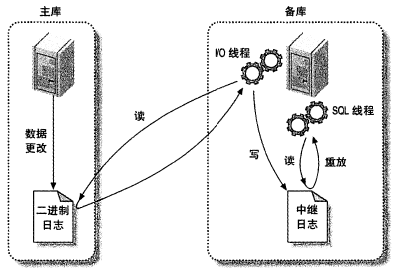


## 参考

1. 《高性能 MySQL》
2. 《MySQL 技术内幕 - InnoDB 存储引擎》
3. [MySQL 官网](https://dev.mysql.com/doc/refman/5.7/en/)
4. [MySQL 三万字精华总结](https://mp.weixin.qq.com/s/MCFHNOQnTtJ6MGVjM3DP4A)
5. [MySQL 索引总结](https://zhuanlan.zhihu.com/p/29118331)
6. [MySQL InnoDB 聚簇索引 非聚簇索引 二级索引 普通索引定义](https://blog.csdn.net/zhu4674548/article/details/103796005)


