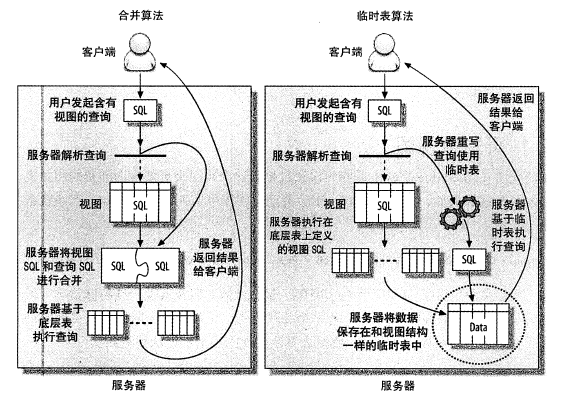

## 1. MySQL 架构

### 1.1 MySQL 逻辑架构


- **连接层**：**主要完成一些类似于连接处理、授权认证、及相关的安全方案**。在该层上引入了**线程池**的概念，为通过认证安全接入的客户端提供线程。同样在该层上可以实现基于 SSL 的安全链接。服务器也会为安全接入的每个客户端验证它所具有的操作权限。
- **服务层**：**主要完成大部分的核心服务功能**， 包括查询解析、分析、优化、缓存、以及所有的内置函数，所有跨存储引擎的功能也都在这一层实现，包括触发器、存储过程、视图等。
- **存储引擎层**：**负责 MySQL 中数据的存储和提取**，服务器通过 API 与存储引擎进行通信。不同的存储引擎具有的功能不同，这样我们可以根据自己的实际需要进行选取。
- **数据存储层**：主要是将数据存储在运行于该设备的文件系统之上，并完成与存储引擎的交互。

### 1.2 查询语句执行流程

1. 客户端发送一条查询给服务器。
2. 服务器先检查查询缓存，如果命中了缓存，则立刻返回存储在缓存中的结果。否则进入下一阶段。
3. 服务器端进行 SQL 解析、预处理，再由优化器生成对应的执行计划。
4. MySQL 根据优化器生成的执行计划，调用存储引擎的 API 来执行查询。
5. 将结果返回给客卢端。


## 2. 数据类型

### 2.1 整数和实数

|    类型     |                 大小（位）                 |     用途     |
| :---------: | :----------------------------------------: | :----------: |
|   tinyint   |                     8                      |   小整数值   |
|  smallint   |                     16                     |   大整数值   |
|  mediumint  |                     24                     |   大整数值   |
| int/integer |                     32                     |   大整数值   |
|   bigint    |                     64                     |  极大整数值  |
|    float    |                     32                     | 单精度浮点值 |
|   double    |                     64                     | 双精度浮点值 |
|   decimal   | 对decimal(M,D) ，如果M>D，为M+2；否则为D+2 |  精确小数值  |

1. 整数类型存储的范围为（-2<sup>n-1</sup>, 2<sup>n-1</sup> - 1），可以使用 unsigned 表示不允许负值，将范围提高一倍。
2. MySQL 为整数类型指定宽度是没有意义的，如 int(10)，它不会限制值的合法范围，只是规定了交互工具（如 MySQL 命令行客户端）用来显示字符的个数。
3. MySQL 使用 double 作为内部浮点运算的类型。
4. 因为需要额外的空间和计算开销，应该尽量只在对小数进行精确计算时才使用 decimal。当数据量较大时，可以考虑使用 bigint 代替，乘以相应的倍数即可。

### 2.2 字符串

|         类型          | 大小（字节） |               用途               |
| :-------------------: | :----------: | :------------------------------: |
|         char          |     255      |            定长字符串            |
|        varchar        |    65535     |            变长字符串            |
|   tinyblob/tinytext   |     255      |    （二进制形式的）短文本数据    |
|       blob/text       |    65535     |    （二进制形式的）长文本数据    |
| mediumblob/mediumtext |   16777215   | （二进制形式的）中等长度文本数据 |
|   longblob/longtext   |  4294967295  |   （二进制形式的）极大文本数据   |

1. blob 是 smallblob 的同义词，text 是 smalltext 的同义词。

2. blob 与 text 家族之间仅有的区别是 blob 存储的是二进制数据，没有排序规则或字符集，而 text 有排序规则和字符集。

3. varchar 需要使用 1 或 2 个额外字节记录字符串的长度：如果列的最大长度 <= 255 字节，则只使用 1 个字节表示，否则使用 2 个字节。

4. **char 与 varchar 的区别**：

   > 相同点：
   >
   > * char(n)，varchar(n) 中的 n 都代表字符的个数，而不是字节的个数，因此 char(1) 是可以存放 1 个汉字的；
   > * 超过 char，varchar 最大长度 n 的限制后，字符串会被截断。
   >
   > 不同点：
   >
   > * char 长度固定，不论实际存储的字符数，都会占用 n 个字符空间；而 varchar 长度可变，仅使用必要的空间，比 char 更节省空间；
   > * char 在存储时会删除末尾的空格，而 varchar 不会；
   > * 能存储的最大空间限制不同，char 的存储上限是 255 字节，而 varchar 是 65535 字节；
   > * char 适合存储很短的、固定长度、经常更新的字符串；而 varchar 适合存储变长、更新较少的字符串


### 2.3 日期和时间

|   类型    | 大小（字节） |        格式         |       用途       |
| :-------: | :----------: | :-----------------: | :--------------: |
|   date    |      3       |     YYYY-MM-DD      |      日期值      |
|   time    |      3       |      HH:MM:SS       | 时间值或持续时间 |
|   year    |      1       |        YYYY         |      年份值      |
| datetime  |      8       | YYYY-MM-DD HH:MM:SS | 混合日期和时间值 |
| timestamp |      4       |   YYYYMMDD HHMMSS   |      时间戳      |

1. MySQL 能存储的最小时间单位粒度为秒，MariaDB 支持微秒级别的时间类型。

2. **datetime 与 timestamp 的区别**：

   > * datetime 能保存大范围的值，从 1001年到 9999 年，与时区无关；
   > * timestamp 只能表示从 1970 年到 2038 年，与时区有关，且列默认为 not null。应该尽量使用 timestamp，因为它比 datetime 空间效率更高。


## 3. 存储引擎


## 4. 索引

### 4.1 索引介绍

**索引（index）是存储引擎用于快速找到记录的一种数据结构**，在MySQL 中也叫做键（key）。索引是在存储引擎层而不是服务层实现的，所以没有统一的标准：不同存储引擎的索引工作方式并不一样，也不是所有的存储引擎都支持所有类型的索引。

|    index    |    InnoDB    | MyISAM | Memory |
| :---------: | :----------: | :----: | :----: |
| B-Tree 索引 |      √       |   √    |   √    |
|  哈希索引   |      √       |   ×    |   √    |
|  空间索引   |      ×       |   √    |   ×    |
|  全文索引   | √（5.6版本） |   √    |   ×    |
|  聚簇索引   |      √       |   ×    |   ×    |

**索引的优点**：

1. 索引大大减少了服务器需要扫描的数据量。
2. 索引可以帮助服务器避免排序和临时表（order by / group by）。
3. 索引可以将随机 IO 变为顺序 IO。

**索引的缺点**：

1. 索引提高了查询速度，但会降低更新表的速度，如对表进行 INSERT、UPDATE 和 DELETE。因为更新表时，MySQL 不仅要保存数据，还要保存索引文件。
2. 索引会占用磁盘空间，一般这个问题不太严重，但如果在一个大表上创建了多种组合索引，索引文件会膨胀很快（一般来说索引本身也很大，不可能全部存储在内存中，因此索引往往以索引文件的形式存储在磁盘上）。
3. 如果某个数据列包含许多重复的内容，为它建立索引就没有太大的实际效果。
4. 对于非常小的表，大部分情况下简单的全表扫描更高效。

### 4.2 索引类型

#### 4.2.1 B-Tree 索引

B-Tree 索引是最常见的索引类型，大多数 MySQL 引擎都支持，但使用方式、性能各有不同，InnoDB 引擎默认使用的就是 B-Tree 索引（准确的说，应该是B+Tree）。B-Tree 对索引列是**顺序组织存储**的，所以很适合**查找范围数据**，还可以用于查询中的 **order by 排序操作**。

下图是 B-Tree **单列索引**的抽象表示。其中叶子节点比较特别，指针指向的是被索引的数据，而不是其它的节点页。

> 只包含一个字段的索引叫做单列索引，包含两个或以上字段的索引叫做复合索引（组合索引）。


下图是 B-Tree **复合索引**的抽象表示。索引中包含了姓（last_name）、名（first_name）、出生日期（dob）列的值，排序顺序依据 create table 语句中定义的索引列顺序，比如当两个人的姓和名都一样时，按照出生日期进行排序。


建立复合索引时，字段的顺序及其重要，因为键前缀查找只适用于**最左前缀查找**。

* **查询必须从索引的最左边的列开始**，否则无法使用索引。例如，你不能利用索引查找在某一天出生的人。
* **不能跳过某一索引列**。例如，你不能利用索引查找姓为 Smith 且出生于某一天的人。
* **存储引擎不能使用索引中范围条件右边的列**。例如，查询语句 where last_name="Smith" and first_name like 'J%' and dob='1976-12-23'，则该查询只会使用索引中的前两列，因为 like 是范围查询。

#### 4.2.2 哈希索引

哈希索引基于哈希表实现，只有**精确匹配索引所有列的查询才有效**。对于每一行数据，存储引擎会对所有的索引列计算一个哈希码，并将所有**哈希码存储在索引中，同时在哈希表中保存指向每个数据行的指针**。如果多个哈希码相同（哈希冲突），索引会以**链表**的方式存放多个记录指针到同一个哈希条目中。

哈希索引是 Memory 引擎的默认索引类型，而 InnoDB 引擎有**“自适应哈希索引”**功能，当某个索引值被频繁使用时，会在内存中基于 B-Tree 索引之上再创建一个哈希索引，这样就让 B-Tree 索引也具有哈希索引的一些优点。

哈希索引的限制：

* 哈希索引值包含哈希值和行指针，不存储字段值，所以**不能避免读取数据行**；
* 哈希索引不是按照索引值顺序存储的，所以**无法用于排序**；
* 哈希索引使用索引列的全部内容来计算哈希值，所以**不支持部分索引列匹配查找，也不支持任何范围查找**，只支持等值比较查找，包括 =、in、<=>（注意 <> 和 <=> 是不同的操作）。
* 如果**哈希冲突**很多，存储引擎必须遍历链表中所有的行指针，导致查询变慢和维护代价变高。

#### 4.2.3 空间索引

空间索引（R-Tree）用作**地理数据存储**，它无须前缀查找，会从所有维度来索引数据。

#### 4.2.4 全文索引

全文索引是一种特殊类型的索引，它查找的是**文本中的关键词**，而不是直接比较索引中的值。全文索引适用于 match against 操作，而不是普通的 where 条件操作。


### 4.3 高效索引

#### 4.3.1 前缀索引

当索引是很长的字符列时，会让索引变得大且慢。一种策略是模拟哈希索引，比如使用 CRC32 函数对 URL 做哈希，建立 URL 与 哈希值的对应关系；另一种策略是可以**索引开始的部分字符**，这样可以大大节约索引空间，从而提高索引效率。**对于 blob、text 或者很长的 varchar 类型的列，必须使用前缀索引**。

前缀选择应该足够长，以使得前缀”索引的选择性“接近于索引整个列，但同时又不能太长，以便节约空间。**索引的选择性**指的是：不重复的索引值（基数）和数据表的记录总数（T）的比值，范围从 1/T 到 1 之间，索引的选择性越高区分度越好，查询效率越高。


#### 4.3.2 聚簇索引

聚簇索引不是一种索引类型，而是一种数据存储方式。”聚簇“表示**数据行和相邻的键值紧凑地存储在一起**，因为无法同时把数据行存放在两个不同的地方，所以**一个表只能有一个聚簇索引**。

InnoDB 默认使用**主键**作为聚簇索引，如果没有定义主键，InnoDB 会选择一个唯一的非空索引代替，如果没有这样的索引，InnoDB 会隐式定义一个主键来作为聚簇索引。下图是聚簇索引的抽象表示，注意**节点页只包含索引列，而叶子页包含了行的全部数据**。


**聚簇索引的优点**：

1. 可以把相关数据保存在一起，减少读取磁盘的次数，加快数据访问。
2. 使用覆盖索引扫描可以直接使用叶节点中的主键值。

**聚簇索引的缺点**：

1. 更新聚簇索引的代价很高，因为会强制 InnoDB 将每个被更新的行移动到新的位置。
2. 插入新行可能导致**”页分裂“**。当行的主键值要求必须将这一行插入到某个已满的页中时，存储引擎会将该页分裂成两个页面来容纳该行，这就是一次页分裂操作，页分裂会导致表占用更多磁盘空间。


**1. 聚簇索引与非聚簇索引、主键索引与二级索引的对比**

* **MyISAM**

  MyISAM 按照数据插入的顺序存储在磁盘上，如下图所示。左边是行号，从 0 开始递增，因为行是定长的，所以 MyISAM 可以从表的开头跳过所需的字节找到需要的行。

  

  **MyISAM 不支持聚簇索引，且主键索引与二级索引没有什么区别**，主键索引仅仅是一个名为 primary 的唯一非空索引。如下图所示，**索引中的每个叶子节点仅包含行号**。

  


* **InnoDB**

  InnoDB 支持且默认使用主键作为聚簇索引，如下图所示，**每一个叶子节点都包含了主键值、事务ID、用于事务和 MVCC 的回滚指针以及剩余列**。在 InnoDB 中，聚簇索引”就是表“，所以不像 MyISAM 那样需要独立的行存储。

  

  InnoDB 的二级索引与聚簇索引不同，二级索引访问需要两次索引查找，而不是一次，如下图所示。**叶子节点中存储的不是行指针，而是主键值，并以此作为行的指针**。这样做的好处是减少了移动数据或者数据页分裂时二级索引的维护开销。

  

最后给出 InnoDB 和 MyISAM 如何存放表的抽象图。


**2. 在 InnoDB 表中按主键顺序插入行**

使用 InnoDB 时应该尽可能地**按自增的主键顺序插入数据**，这样可以保证数据行是按顺序写入的。

如果主键的值是顺序的，InnoDB 会把每一条记录都存储在上一条记录的后面。当达到页的最大填充因子时（InnoDB 默认的最大填充因子是页大小的15/16，留出部分空间用于以后修改），下一条记录就会写入新的页中，此时主键页近似于被顺序的记录填满。

如果主键的值不是顺序的，而是无规律数据，比如字符串，InnoDB 无法简单地把新行插入到索引的最后，而是需要为新行寻找合适的位置（通常是已有数据的中间位置），并且分配空间。这就会导致大量的随机 I/O，页分裂，最终数据也会有碎片。


#### 4.3.3 覆盖索引

**如果一个索引包含（覆盖）所有需要查询的字段的值，就称为覆盖索引**。如果索引的叶子节点中已经包含了要查询的数据，那么就没有必要再回表查询。覆盖索引必须要存储索引列的值，而哈希索引、空间索引和全文索引等都不存储索引列的值，所以 MySQL **只能使用 B-Tree 索引做覆盖索引**。

**覆盖索引的优点**：

1. 索引条目通常远小于数据行大小，所以如果只需要读取索引，可以极大地减少数据访问量。
2. 由于 InnoDB 的聚簇索引，覆盖索引对 InnoDB 表特别有用。而由于 MyISAM 在内存中只缓存索引，数据则依赖于操作系统来缓存，因此访问数据需要一次系统调用，可能导致严重的性能问题。


#### 4.3.4 索引排序

MySQL 可以利用同一索引同时进行查找和排序操作，**只有当索引的顺序与 order by 子句的顺序完全相同，且所有的列是同一方向（全部升序或者全部降序）时，才可以使用索引来排序**。如果查询需要关联多个表，则只有当 order by 子句引用的字段全部是第一个表时，才能使用索引进行排序。

和查询的限制一样，索引排序需要满足索引的**最左前缀**要求。有一种情况例外，那就是前导列为常量时，即 where 子句或者 join 子句中对前导列指定了常量。其它情况都会使用 filesort 文件排序。

```mysql
-- 假设key idx_rental(rental_date, inventory_id, customer_id)
-- 1.能使用索引排序
where rental_date = '2005-05-25' order by inventory_id, customer_id;  -- 第一列被指定为常数
-- 2.不能使用索引排序
where rental_date = '2005-05-25' order by inventory_id desc, customer_id asc; -- 排序不一致
where rental_date = '2005-05-25' order by customer_id;	-- 不符合最左前缀
where rental_date > '2005-05-25' order by inventory_id, customer_id;	-- 第一列是范围查找
where rental_date = '2005-05-25' and inventory_id in (1,2) order by customer_id;	-- 对于排序来说，多个相等条件也是范围查找
```


#### 4.3.5 索引失效

1. 索引列不能是表达式的一部分，也不能是函数的参数。
2. like 模糊匹配不要以通配符 % 或 _ 开头，即头部模糊匹配。
3. 尽量不要使用 not in、<>、!= 操作。
4. 用 or 分割开的条件， 如果 or 前的条件中的列有索引， 而后面的列中没有索引， 那么涉及到的索引都不会被用到。
5. 如果列类型是字符串，那么一定记得在 where 条件中把字符常量值用引号引起来。否则即便这个列上有索引，MySQL 也不会用到的，因为 MySQL 默认把输入的常量值进行转换以后才进行检索。
6. 尽量使用覆盖索引，用具体的字段列表代替 select *。


## 5. 锁机制

### 5.1 锁的分类

**从对数据操作的类型分类**：

- **读锁（read lock）**：也叫共享锁（shared lock）、S 锁。读锁是共享的，针对同一份数据，多个读操作可以同时进行，不会互相影响。
- **写锁（write lock）**：也叫排他锁（exclusive lock）、X 锁。写锁是排他的，一个写锁会阻塞其它的写锁和读锁。

**从对数据操作的粒度分类**：

- **表锁（table lock）**：开销小，加锁快；不会出现死锁；锁定粒度大，发生锁冲突的概率最高，并发度最低（MyISAM 和 MEMORY 存储引擎采用的是表级锁）。
- **行级锁（row lock）**：开销大，加锁慢；会出现死锁；锁定粒度最小，发生锁冲突的概率最低，并发度也最高（InnoDB 存储引擎既支持行级锁也支持表级锁，但默认情况下是采用行级锁）；
- **页面锁（page lock）**：开销和加锁时间界于表锁和行锁之间；会出现死锁；锁定粒度界于表锁和行锁之间，并发度一般。

| 锁类型 | InnoDB | MyISAM | Memory | BDB  |
| :----: | :----: | :----: | :----: | :--: |
|  表锁  |   √    |   √    |   √    |  √   |
| 行级锁 |   √    |   ×    |   ×    |  ×   |
| 页面锁 |   ×    |   ×    |   ×    |  √   |


### 5.2 MyISAM 表锁

MyISAM 的表锁有两种模式：

- 表共享读锁 （Table Read Lock）：不会阻塞其他用户对同一表的读请求，但会阻塞对同一表的写请求；
- 表独占写锁 （Table Write Lock）：会阻塞其他用户对同一表的读和写操作；

MyISAM 表的读操作与写操作之间，以及写操作之间是串行的。默认情况下，**写锁比读锁具有更高的优先级**：当一个锁释放时，这个锁会优先给写锁队列中等候的获取锁请求，然后再给读锁队列中等候的获取锁请求。

### 5.3 InnoDB 行锁

InnoDB 实现了以下两种类型的**行锁**：

- 共享锁（S）：允许事务读一行数据。
- 排他锁（X）：允许事务删除或更新一行数据。

为了允许行锁和表锁共存，实现多粒度锁机制，InnoDB 还有两种内部使用的**意向锁（Intention Locks）**，这**两种意向锁都是表锁**：

- 意向共享锁（IS）：事务想要获取一张表中某几行的共享锁。
- 意向排他锁（IX）：事务想要获取一张表中某几行的排他锁。

意向锁将锁定的对象分为多个层次，若将上锁的对象看成一棵树，那么对最下层的对象上锁，也就是**对最细粒度的对象进行上锁，那么首先需要对粗粒度的对象上锁**。比如需要对页上的记录上 X 锁，那么需要对数据库、表、页上 IX 锁，最后对记录上 X 锁。

由于 InnoDB 支持的是行锁，因此意向锁不会阻塞除全表扫描以外的任何请求。表级意向锁与行级锁兼容性如下：

|      |  IS  |  IX  |  S   |  X   |
| :--: | :--: | :--: | :--: | :--: |
|  IS  |  √   |  √   |  √   |  ×   |
|  IX  |      |  √   |  ×   |  ×   |
|  S   |      |      |  √   |  ×   |
|  X   |      |      |      |  ×   |


#### 5.3.1 加锁机制


#### 5.3.2 锁算法


### 5.4 死锁


## 6. 事务

### 6.1 事务的四大特性（ACID）

**事务就是一组原子性的 SQL 查询**。如果数据库引擎能够成功地对数据库应用该组查询的全部语句，那么就执行该组查询；如果其中有任何一条语句因为崩溃或其他原因无法执行，那么所有的语句都不会执行。也就是说，事务内的语句，要么全部执行成功，要么全部执行失败。

> 以银行转账为例，假设用户 A 向用户 B 转移 200 元，那么需要至少 3 个步骤：
>
> 1. 检查用户 A 的账户余额高于 200 元；
> 2. 从用户 A 的账户余额中减去 200 元；
> 3. 在用户 B 的账户余额中增加 200 元。

* **原子性（atomicity）**：**事务是最小的执行单位，不允许分割**。整个事务中的所有操作要么全部提交成功，要么全部失败回滚，不可能只执行其中的一部分操作。

* **一致性（consistency）**：**数据库总是从一个一致性的状态转换到另外一个一致性的状态**。在前面的例子中，如果在执行第2、3条语句之间系统崩溃，那么不会出现用户 A 的账户余额减少了，而用户 B 的账户余额没有增加。因为事务最终没有提交，所以事务中所做的修改也不会保存到数据库中。

* **隔离性（isolation）**：**通常来说，一个事务所做的修改在最终提交以前，对其他事务是不可见的**。在前面的例子中，如果在执行第2、3条语句之间，此时有另外一个转账事务开始运行，则其看到的用户 A 的余额并没有被减去 200 元。

  再比如，事务Ⅰ需要将 100 元转入帐号 A，先读取帐号 A 的值，然后在这个值上加上100。但是，在这两个操作之间，另一个事务Ⅱ修改了帐号 A 的值，也为它增加了100元。那么最后的结果应该是 A 增加了200元，但事实上，事务Ⅰ最终完成后，帐号 A 只增加了100元，因为事务Ⅱ的修改结果被事务Ⅰ覆盖掉了。**从单个事务的角度看，不管是事务Ⅰ还是事务Ⅱ，它们都保证了原子性，但最终它们并没有保证数据库的一致性**。

* **持久性（durability）**：**一旦事务提交，则其所做的修改就会永久保存到数据库中**。此时即使系统崩溃，修改的数据也不会丢失。


### 6.2 事务的隔离级别

多个事务并发运行，经常会操作同一数据来完成各自的任务，可能会导致以下的问题。

- **脏读（dirty read）**：当一个事务正在访问数据并且对数据进行了修改，而这种修改还没有提交到数据库中，这时另外一个事务也访问了这个数据，然后使用了这个数据。因为这个数据是还没有提交的数据，那么另外一个事务读到的这个数据是“脏数据”，依据“脏数据”所做的操作可能是不正确的。
- **丢失修改（lost to modify）**：指在一个事务读取一个数据时，另外一个事务也访问了该数据，那么在第一个事务中修改了这个数据后，第二个事务也修改了这个数据。这样第一个事务内的修改结果就被丢失，因此称为丢失修改。
- **不可重复读（unrepeatable read）**：指在一个事务内多次读同一数据，在这个事务还没有结束时，另一个事务也访问该数据。那么，在第一个事务中的两次读数据之间，由于第二个事务的修改导致第一个事务两次读取的数据可能不太一样。这就发生了在一个事务内两次读到的数据是不一样的情况，因此称为不可重复读。
- **幻读（phantom read）**：幻读与不可重复读类似。当某个事务在读取某个范围内的记录时，另外一个事务又在该范围内插入了新的记录，当之前的事务再次读取该范围的记录时，会发现多了一些原本不存在的记录，产生幻行。（不可重复读的重点是**修改**，比如多次读取一条记录发现其中某些列的值被修改，幻读的重点在于**新增或者删除**，比如多次读取一条记录发现记录增多或减少了。）

隔离性其实比较复杂，SQL 标准定义了四种隔离级别：

- **READ UNCOMMITTED（读取未提交）**：最低的隔离级别，允许读取尚未提交的数据变更，可能会导致脏读、幻读或不可重复读。
- **READ COMMITTED（读取已提交）**：大多数数据库系统的默认隔离级别（MySQL 不是），允许读取并发事务已经提交的数据，可以阻止脏读，但是幻读或不可重复读仍有可能发生。
- **REPEATABLE READ（可重复读）**：MySQL 的默认隔离级别，对同一字段的多次读取结果都是一致的，除非数据是被本身事务自己所修改，可以阻止脏读和不可重复读，但幻读仍有可能发生。
- **SERIALIZABLE（可串行化）**：最高的隔离级别，所有的事务依次逐个执行，这样事务之间就完全不可能产生干扰，可以防止脏读、不可重复读以及幻读。它会在读取的每一行数据上都加锁，所以可能导致大量的超时和锁争用问题。

需要注意的是：与 SQL 标准不同的地方在于 InnoDB 存储引擎在 REPEATABLE-READ 事务隔离级别下使用的是 Next-Key Lock 锁算法，因此可以避免幻读的产生，这与其他数据库系统是不同的。

|     隔离级别     | 脏读可能 | 不可重复读可能 | 幻影读可能 | 加锁读 |
| :--------------: | :------: | :------------: | :--------: | :----: |
| READ UNCOMMITTED |    √     |       √        |     √      |   ×    |
|  READ COMMITTED  |    ×     |       √        |     √      |   ×    |
| REPEATABLE READ  |    ×     |       ×        |     √      |   ×    |
|   SERIALIZABLE   |    ×     |       ×        |     ×      |   √    |


### 6.3 多版本并发控制（MVCC）

多版本并发控制（Multi-Version Concurrency Control，MVCC）可以认为是**行级锁的一个变种**，它在很多情况下避免了加锁操作，取而代之的是把**行锁与行的多个版本结合**起来，因此开销更小，从而提高了并发性能。

MVCC 的实现有乐观并发控制和悲观并发控制。InnoDB 中的 MVCC，是通过在每行记录后面保存**两个隐藏的列**来实现的，这两个列，一个保存了**行的创建时间**，一个保存了**行的过期时间（删除时间）**。当然存储的并不是实际的时间值，二是系统版本号。每开始一个新的事务，系统版本号都会自动递增。事务开始时刻的系统版本号会作为事务的版本号，用来和查询到的每行记录的版本号进行比较。下面看一下在 REPEATABLE READ 隔离级别下，MVCC 是如何操作的：

1. SELECT： InnoDB 会根据以下两个条件检查每行记录，只有符合这两个条件的记录，才能返回作为查询结果
   * 只查找版本早于（小于或等于）当前事务版本的数据行，这样可以确保事务读取的行，要么是在事务开始前已经存在的，要么是事务自身插入或者修改过的。
   * 行的删除版本要么未定义，要么大于当前事务版本号。这可以确保事务读取到的行，在事务开始之前未被删除。
2. INSERT： InnoDB 为新插入的每一行保存当前系统版本号作为行版本号。
3. DELETE： InnoDB 为删除的每一行保存当前系统版本号作为行删除标识。
4. UPDATE： InnoDB 为更新的每一行保存当前系统版本号作为行版本号和行删除标识。

**MVCC 的优缺点**：MVCC 在大多数情况下代替了行锁，实现了对读的非阻塞，读不加锁，读写不冲突。缺点是每行记录都需要额外的存储空间，需要做更多的行维护和检查工作。

MVCC 只在 REPEATABLE READ 和 READ COMMITTED 两个隔离级别下工作。其他两个隔离级别都和 MVCC 不兼容，因为 READ UNCOMMITTED 总是读取最新的数据行，而不是符合当前事务版本的数据行。而 SERIALIZABLE则会对所有读取的行都加锁。


## 7. MySQL 高级特性

### 7.1 分区表


### 7.2 视图

视图本身是一个虚拟表，不存放任何数据。在使用 SQL 语句访问视图的时候，它返回的数据是 MySQL 从其它表中生成的。MySQL 使用**合并算法和临时表算法**来处理视图，如果可能，会尽可能使用合并算法。




### 7.3 存储过程


### 参考

1. 《高性能 MySQL》
2. 《MySQL 技术内幕 - InnoDB 存储引擎》
3. [MySQL 三万字精华总结](https://mp.weixin.qq.com/s/MCFHNOQnTtJ6MGVjM3DP4A)
4. [MySQL 索引总结](https://zhuanlan.zhihu.com/p/29118331)


