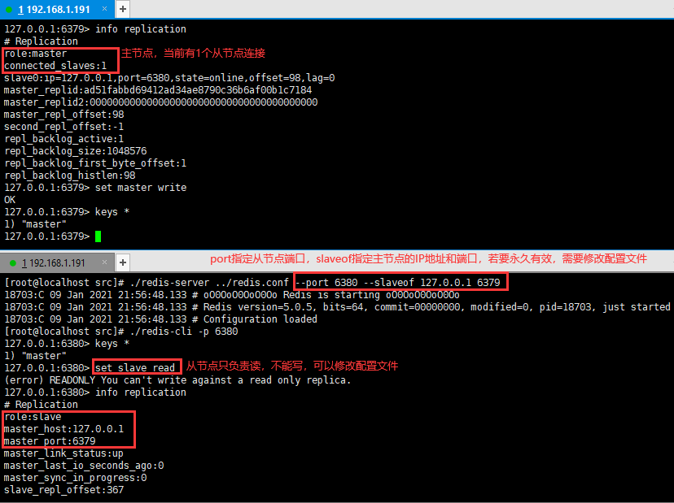

## 1. Redis 入门

### 1.1 NoSQL 介绍

NoSQL 意为 Not Only SQL，泛指非关系型数据库。随着互联网 web2.0 网站的兴起，传统的关系型数据库暴露了很多问题，如无法满足高效率存储和访问、数据高并发读写的需求等，而非关系型数据库则由于其本身的特点得到了非常迅速的发展。NoSQL 数据库有4种分类：文档数据库、图数据库、键值数据库、列族数据库。


| 分类             | 实例      | 典型应用场景                                                 | 数据模型                                          | 优点                                                         | 缺点                                                         |
| ---------------- | --------- | ------------------------------------------------------------ | ------------------------------------------------- | ------------------------------------------------------------ | ------------------------------------------------------------ |
| **键值数据库**   | Redis     | 内容缓存，主要用于处理大量数据的高访问负载，也用于一些日志系统等 | key 指向 value 的键值对，通常用 hash table 来实现 | 查找速度快                                                   | 数据无结构化，通常只被当作字符串或二进制数据                 |
| **列存储数据库** | Cassandra | 分布式的文件系统                                             | 以列簇式存储，将同一列数据存在一起                | 查找速度快，可扩展性强，更容易进行分布式扩展                 | 功能相对局限                                                 |
| **文档型数据库** | MongoDB   | web 应用（数据库能够了解 value 的内容）                      | key - value 对应的键值对，value 为结构化数据      | 数据结构要求不严格，表结构可变，不需要像关系型数据库一样需要预先定义表结构 | 查找性能不高，而且缺乏统一的查询语法                         |
| **图形数据库**   | Neo4j     | 社交网络，推荐系统等，专注于构建关系图谱                     | 图结构                                            | 利用图结构相关算法，比如最短路径寻址等                       | 很多时候需要对整个图做计算才能得出需要的信息，而且这种结构不太好做分布式集群方案 |


### 1.2 Redis 介绍

Redis 是 Remote Dictionary Server（远程字典服务）的缩写，它是一个完全开源免费、使用 C 语言编写、遵守 BSD 协议、支持网络、亦可持久化、日志型的**内存高速缓存数据库**，并提供多种语言的 API。它支持丰富的数据结构，使用 **key-value** 数据模型，值（value）可以是字符串（string）、哈希（hash）、列表（list）、集合（set）和有序集合（sorted set）等类型。Redis 有如下优势：

1. 性能极高 – Redis 能读的速度是110000次/s，写的速度是81000次/s 。
2. 丰富的数据类型 – Redis 支持二进制案例的 Strings，Lists，Hashes，Sets 及 Ordered Sets 数据类型操作。
3. 原子 – Redis 的所有操作都是原子性的，意思就是要么成功执行要么失败完全不执行。
4. 丰富的特性 – Redis 还支持 publish/subscribe，通知，key 过期等等特性。


### 1.3 Redis 安装（CentOS）

1. **下载编译**

   注：访问[中文官网](http://redis.cn/)，获取最新稳定版本的下载地址。由于 Redis 使用 C 语言编写，所以编译时需要先确保安装 gcc

   - 下载 redis：`wget http://download.redis.io/releases/redis-5.0.5.tar.gz`
   - 解压缩：`tar -xzvf redis-5.0.5.tar.gz`
   - 安装编译工具：`yum -y install gcc`
   - 切换到 redis 目录：`cd redis-5.0.5`
   - 编译：`make`

2. **启动 redis 服务**

   - 修改 redis 配置文件：`vim redis.conf`

     注：redis 默认是前台启动的，若要后台启动，需要将 daemonize 设置为 yes

   - 切换到 src 目录：`cd src`

     

   - 通过配置文件，启动 redis 服务端：``./redis-server ../redis.conf``

3. **redis 测试**

   - 启动 redis 客户端：`./redis-cli`

     注：若修改了 redis 端口并设置了密码，使用 `./redis-cli -h IP地址 -p 端口 -a 密码`

   - 连接测试：`ping` -> `exit`

     


### 1.4 Redis 配置

| 配置                            | 说明                                                         |
| ------------------------------- | ------------------------------------------------------------ |
| bind 127.0.0.1                  | 绑定的主机地址                                               |
| port 6379                       | 指定 redis 监听端口，默认端口为 6379                         |
| protected-mode yes              | 默认开启保护模式，外部主机无法连接到 Redis                   |
| timeout 0                       | 当客户端闲置多长秒后关闭连接，如果指定为 0 ，表示关闭该功能  |
| daemonize no                    | redis 默认不是以守护进程的方式运行，使用 yes 启用守护进程    |
| pidfile /var/run/redis_6379.pid | 当以守护进程方式运行时，Redis 默认会把 pid（进程号）写入 /var/run/redis_6379.pid 文件 |
| loglevel notice                 | 指定日志记录级别，共四个级别：debug、verbose、notice、warning |
| logfile ""                      | 指定日志文件名，默认为标准输出，如果同时配置 Redis 以守护进程方式运行，则日志将会发送给 /dev/null |
| database 16                     | 设置数据库的数量（0 - 15），默认数据库为 0                   |
| save \<seconds\> \<changes\>    | 指定在多长时间内，有多少次更新操作，就将数据同步到持久化文件，可以多个条件配合 |
| dbfilename dump.rdb             | 指定本地数据库 RDB 持久化文件名，默认值为 dump.rdb           |
| dir ./                          | 指定本地数据库存放目录                                       |
| requirepass foobared            | 设置 redis 连接密码，如果配置了连接密码，客户端在连接 redis 时需要通过 auth \<password\> 命令提供密码，默认关闭 |
| appendonly no                   | 默认不开启 AOF 持久化，使用 yes 开启                         |


## 2. Redis 基础数据结构

### 2.1 键 Key

Redis 中所有的数据结构都以**唯一的字符串作为 key**，唯一的差异就在于 value 结构不同，value 有 5 种基础数据结构，分别是：**字符串 String、列表 List、哈希 Hash、集合 Set、有序集合 ZSet**。

| 命令               | 描述                                                         |
| :----------------- | :----------------------------------------------------------- |
| exists key         | 检查指定 key 是否存在                                        |
| del key            | 删除指定 key                                                 |
| type key           | 返回指定 key 的 value 类型                                   |
| keys pattern       | 查找所有符合指定模式 pattern 的 key                          |
| rename key newkey  | 修改 key 的名称                                              |
| dbsize             | 返回当前数据库的 key 数量                                    |
| expire key seconds | 为指定 key 设置过期时间，以秒计（限时优惠活动、手机验证码等应用场景） |
| ttl key            | 返回指定 key 的剩余过期时间，以秒计                          |
| move key dbindex   | 将 key 从当前数据库移动到指定数据库                          |
| flushdb            | 删除当前数据库中的所有 key                                   |
| flushall           | 删除所有数据库中的所有 key                                   |
| select dbindex     | 选择数据库，默认共16个（0-15）                               |


### 2.2 字符串 String

Redis 的字符串是可以修改的动态字符串，**内部结构类似于 Java 的 ArrayList**，它在内存中以字节数组的形式存在，采用预分配冗余空间的方式来减少内存的频繁分配，即实际分配的空间 capacity 一般大于字符串的长度 len。当字符串长度小于 1 M 时，扩容都是加倍现有空间；如果大于 1 M ，扩容时一次只会多扩 1 M 的空间。注意字符串的最大长度为 512 M。


字符串结构常用于**缓存用户信息**，我们将用户信息使用 JSON 序列化成字符串，然后将序列化后的字符串放入 Redis 来缓存，取用户信息则会经过一次反序列化的过程。

| 命令                      | 描述                                                    |
| ------------------------- | ------------------------------------------------------- |
| set/mset key value        | 设置一个或多个 key-value 对                             |
| get/mget key              | 获取一个或多个 key 的值                                 |
| setnx key value           | 只有在key不存在时设置 key 的值                          |
| setex key seconds value   | 将值 value 关联到 key ，并将 key 的过期时间设为 seconds |
| incr/decr key             | 对 key 的值做加1/减1操作（key 对应值必须是整型）        |
| incrby/decrby key integer | 对 key 的值加上指定值                                   |
| append key value          | 给指定 key 的字符串值追加 value                         |
| substr key start end      | 返回截取过 key 的字符串值（包括 start 和 end）          |


### 2.3 列表 List

Redis 的列表**相当于 Java 的 LinkedList**，因此它的插入和删除非常快，时间复杂度为 O(1)，但是**索引定位很慢**，时间复杂度为 O(n)。实际上，列表底层存储并不是一个简单的 LinkedList。在列表元素很少时，会使用一块连续的内存存储，这个结构是 **ziplist（压缩列表）**，它将所有的元素彼此紧挨着一起存储。当列表元素比较多时会改为 **quicklist（快速链表）**，因为普通的链表需要附加的指针空间太大，会浪费空间，所以 Redis 将链表和 ziplist 结合起来组成了 quicklist，也就是将多个 ziplist 使用双向指针串起来使用。


列表结构常用来做**异步队列**使用，将需要延后处理的任务序列化成字符串，放入 Redis 列表，另一个线程从这个列表中轮询数据进行处理。列表不见可以用做列表，还可以用做栈，但用做栈的业务场景并不多见。

| 命令                   | 描述                                                         |
| ---------------------- | ------------------------------------------------------------ |
| lpush/rpush key string | 在 key 对应 list 的头部/尾部添加字符串元素                   |
| rpop/lpop key          | 在 key 对应 list 的尾部/头部删除字符串元素，并返回删除元素   |
| llen key               | 返回 key 对应 list 的长度                                    |
| lindex key index       | 通过索引获取列表中的元素（index = -1表示倒数第一个元素，依次类推） |
| lrange key start end   | 返回指定区间内的元素（start、end 均可以为负数）              |
| ltrim key start end    | 截取 list，保留指定区间内的元素                              |


### 2.4 哈希 Hash

Redis 的哈希**相当于 Java 的 HashMap**，都是数组 + 链表的二维结构，不同的是，Redis 的哈希的**值只能是字符串**，另外它们 rehash 的方式不一样，因为 rehash 是个耗时操作，Redis 为了追求高性能，不能堵塞服务，没有采用 Java 的一次性全部 rehash，而是**渐进式 rehash 策略**。渐进式 rehash 会在 rehash 的同时，保留新旧两个 hash 结构，查询会同时查询两个 hash 结构，然后在后续的定时任务以及 hash 操作指定中，循序渐进地将旧 hash 的内容一点点地迁移到新 hash 结构中，当迁移完成，就会使用新的 hash 结构取而代之。


哈希结构**也可以用来存储用户信息**，与字符串需要一次性全部序列化整个对象不同，哈希可以**对用户结构中每个字段单独存储**。这样当需要获取用户信息时可以进行部分获取，**节省网络流量**，缺点是哈希结构的**存储消耗要高于单个字符串**。

| 命令                       | 描述                                      |
| -------------------------- | ----------------------------------------- |
| hset/hmset key field value | 在哈希表中设置 field-value (域-值)对      |
| hget/hmget key field       | 获取哈希表中指定字段的值                  |
| hincrby key field integer  | 将指定字段的整数值加上 integer            |
| hexists key field          | 测试指定 field 是否存在                   |
| hdel key field             | 删除指定 field                            |
| hlen/hkeys key             | 返回field数量/返回所有 field              |
| hvals/hgetall key          | 返回所有 value/所有 field-value (域-值)对 |


### 2.5 集合 Set

Redis 的集合**相当于 Java 的 HashSet**，内部的键值对是无序的、唯一的，内部实现相当于特殊的哈希，哈希中所有的 value 都是一个值 null。容器型数据结构（list、hash、set、zset）有下面两条通用规则：

* create if not exists：如果容器不存在，那就创建一个，再进行操作；
* drop if no elements：如果容器中的元素没有了，那么立即删除容器，释放内存

集合结构可以用来存储活动中中奖的用户 ID，因为有**去重功能**，可以保证同一个用户不会中将两次。

| 命令                                   | 描述                                                 |
| -------------------------------------- | ---------------------------------------------------- |
| sadd key member [member]               | 添加一个 string 元素到 key 对应的 set 集合中         |
| srem key member [member]               | 从 key 对应的 set 集合中移除指定元素，成功返回1      |
| smove key1 key2 member                 | 从 key1 对应的集合中移除 member 并添加到 key2 集合中 |
| scard key                              | 返回 set 集合的元素个数                              |
| smembers key                           | 返回 set 集合的所有元素                              |
| sismember key member                   | 判断 member 是否在 set 集合中                        |
| sinter/sunion/sdiff key1 key2 ... keyN | 返回所有指定 key 的交集/并集/差集                    |
| srandmember key [count]                | 返回集合中一个或多个随机数（抽奖等场景）             |


### 2.6 有序集合 ZSet

Redis 的有序集合**相当于 Java 的 SortedSet 和 HashMap 的结合体** ，一方面它是一个 set，保证了内部 value 的唯一性，另一方面它可以给每个 value 赋予一个 score，代表这个 value 的排序权重。由于有序集合要支持随机的插入和删除，因此它不能使用数组，实际上 zset 的排序功能是通过**跳跃列表**来实现的。首先，如果使用链表按照 score 值进行排序，那么查找、插入、删除的时间复杂度都是 O(n)，为了提高效率，我们可以考虑**在链表上建立索引的方式，每两个节点提取一个节点到上一级**，加了一层索引之后，查找一个节点需要遍历的节点个数就减少了（类似二分查找），此时时间复杂度是 O(logn)，参考 [b站跳表视频](https://www.bilibili.com/video/BV1QK4y1Y7mS?from=search&seid=13487761915612390962)。


有序集合结构可以用于**排行榜系统**，如学生成绩排名，value 是学生的 ID，score 是学生的成绩；粉丝关注时间排序，value 是粉丝的用户 ID，score 是关注时间。

| 命令                           | 描述                                              |
| ------------------------------ | ------------------------------------------------- |
| zadd key score member          | 添加元素到集合，元素存在则更新权 score            |
| zrem key member                | 删除指定元素                                      |
| zincrby key incr member        | 给指定元素的权增加 incr，返回权值                 |
| zrank/zrevrank key member      | 按照权值从小到大/从大到小，返回指定元素的排名     |
| zrange/zrevrange key start end | 按照权值从大到小/从大到小，返回指定区间元素的排名 |
| zremrangebyrank key min max    | 按照权值从小到大，删除指定区间的元素              |
| zcard key                      | 返回集合中元素的个数                              |
| zscore key member              | 返回指定元素对应的权                              |


## 3. Redis 应用

### 3.1 分布式锁

Redis 分布式锁使用得非常广泛，它可以用来**限制程序的并发执行**。分布式锁的实现需要同时满足以下几个条件：

* 互斥性：在任意时刻只有一个客户端能持有锁
* 不会死锁：即使有一个客户端在持有锁的期间发生崩溃而没有主动解锁，也能保证后续其它客户端能加锁
* 容错性：只要大部分的 Redis 节点正常运行，客户端就可以加锁和解锁
* 解铃还须系铃人：加锁和解锁必须是同一个客户端，客户端自己不能把别人加的锁给解除

```java
// 正确示例，尝试获取分布式锁，单机情况下暂不考虑容错性
public boolean getLock(Jedis jedis, String lockKey, String requestId, int expireTime) {
    /*
    1. 第一个参数为key，使用key来当锁，保证锁的唯一性
    2. 第二个参数为value，可以使用UUID.randomUUID().toString()方法生成，表示加锁的客户端请求标识，那么在客户端在解锁的时候就可以进行校验是否是同一个客户端（解铃还须系铃人）
    3. 第三个参数为nxxx，"NX"表示当key不存在时，进行set操作；若key已经存在，则不做任何操作（互斥性）
    4. 第四个参数为expx，"PX"表示给这个key加上过期时间，即使锁的持有者后续发生崩溃而没有解锁，到了过期时间也会自动解锁，即key被删除（不会死锁）
    5. 第五个参数为time，表示key的过期时间
     */
    String result = jedis.set(lockKey, requestId, "NX", "PX", expireTime);
    return "OK".equals(result);
}

// 错误示例1，问题在于setnx和expire是两条指令，而不是保证原子指令，无法保证原子性
public void wrongGetLock1(Jedis jedis, String lockKey, String requestId, int expireTime) {
    Long result = jedis.setnx(lockKey, requestId);
    if (result == 1) {
        // 若在这里程序突然崩溃，则无法设置过期时间，将发生死锁
        jedis.expire(lockKey, expireTime);
    }
}

// 错误示例2，问题有三：
// 1. 客户端自己生成过期时间，所以需要强制要求分布式下每个客户端的时间必须同步。 
// 2. 当锁过期时，如果多个客户端同时执行jedis.getSet()方法，那么虽然最终只有一个客户端可以加锁，但是这个客户端的锁的过期时间可能被其他客户端覆盖
// 3. 锁不具备拥有者标识，即任何客户端都可以解锁
public boolean wrongGetLock2(Jedis jedis, String lockKey, int expireTime) {
    long expires = System.currentTimeMillis() + expireTime;
    String expiresStr = String.valueOf(expires);

    // 如果当前锁不存在，返回加锁成功
    if (jedis.setnx(lockKey, expiresStr) == 1) {
        return true;
    }
    
    // 如果锁已经存在，获取锁的过期时间
    String currentValueStr = jedis.get(lockKey);
    if (currentValueStr != null && Long.parseLong(currentValueStr) < System.currentTimeMillis()) {
        // 锁已过期，获取上一个锁的过期时间，并设置现在锁的过期时间
        String oldValueStr = jedis.getSet(lockKey, expiresStr);
        // 考虑多线程并发的情况，只有一个线程的设置值和当前值相同，它才有权利加锁
        return oldValueStr != null && oldValueStr.equals(currentValueStr);
    }
    // 其他情况，一律返回加锁失败
    return false;
}
```

**Redis 分布式锁不能解决超时问题**，如果在加锁和释放锁之间的逻辑执行的太长，以至于**超出了锁的超时限制**，就会出现问题。因为这时候第一个线程持有的锁过期了，临界区的逻辑还没有执行完，而同时第二个线程就提前重新持有了这把锁，导致临界区代码不能得到严格串行执行。为了避免这个问题，**Redis 分布式锁不要用于较长时间的任务**，如果真的偶尔出现了，可能需要人工介入解决。下面看释放分布式锁的代码：

```java
private static final Long RELEASE_SUCCESS = 1L;

// 正确示例，尝试释放获取分布式锁
public boolean releaseLock(Jedis jedis, String lockKey, String requestId) {
    // Lua脚本语言，首先获取锁对应的value值，检查是否与requestId相等，如果相等则删除锁（解锁）
    String script = "if redis.call('get', KEYS[1]) == ARGV[1] then return redis.call('del', KEYS[1]) else return 0 end";
    // eval命令执行Lua脚本时，Lua脚本将被当成一个命令去执行，保证原子性
    Object result = jedis.eval(script, Collections.singletonList(lockKey), Collections.singletonList(requestId));

    return RELEASE_SUCCESS.equals(result);
}

// 错误示例1
public void wrongReleaseLock1(Jedis jedis, String lockKey) {
    // 不先判断锁的拥有者而直接解锁，会导致任何客户端都可以随时解锁，即使这把锁不是它的
    jedis.del(lockKey);
}

// 错误示例2
public void wrongReleaseLock2(Jedis jedis, String lockKey, String requestId) {
    // 判断加锁与解锁是不是同一个客户端
    if (requestId.equals(jedis.get(lockKey))) {
        // 若在此时，这把锁突然不是这个客户端的，则会误解锁。也就是突然锁过期了，然后把别人的锁给释放了
        jedis.del(lockKey);
    }
}
```


### 3.2 延时队列

RabbitMQ 和 Kafka 作为专业的消息队列中间件，在应用程序之间增加异步消息传递的功能，特性多但是使用复杂。对于**只有一组消费者的消息队列**，我们也可以使用 Redis 的 list 列表数据结构作为**异步消息队列**，它可以支持多个生产者和多个消费者并发进出消息，每个消费者拿到的消息都是不同的列表元素。

如果队列空了，客户端就会陷入 pop 的死循环，此时可以使用 **blpop/brpop** 指令，b 代表 blocking，也就是**阻塞读**，在队列没有数据时，会立即进入休眠状态，一旦数据到来，则立刻醒过来，消息的延迟几乎为零。但是还有一个问题，如果线程一直阻塞在那里，Redis 的客户端连接就成了闲置连接，**闲置过久，服务器一般会主动断开连接**，减少闲置资源占用，这个时候 blpop/brpop 会抛出异常。因此，客户端消费者需要**捕获异常，然后重试**。


在上一节的分布式锁中，如果客户端在处理请求时加锁失败该如何处理？一般有如下 3 种策略：

1. 直接抛出异常，通知用户稍后重试。适合用户直接发起的请求。
2. sleep 一会儿，然后再重试。会导致队列的后续消息处理出现延迟。
3. **将请求转移到延时队列，过会儿再试**。延时队列可以通过 Redis 的 **zset（有序列表） 来实现**，我们将消息序列化成一个字符串作为 zset 的 value，这个消息的到期处理时间作为 score，然后用多个线程轮询 zset 获取到期的任务进行处理，多个线程是为了保障可用性，万一挂了一个线程还有其它线程可以继续处理。


### 3.3 位图

位图的**最小单位是比特（bit）**，每个 bit 的取值只能是 0 或 1，相比普通的 key/value，位图可以**节省存储空间**，比如记录用户一年的签到记录，签了是 1，没签是 0。位图不是特殊的数据结构，它的内容其实就是普通的字符串，也就是 **byte 数组**。我们可以使用普通的 get/set 直接获取和设置整个位图的内容，也可以使用**位图操作 getbit/setbit 等将 byte 数组看成”位数组“来处理**。注意**位数组的顺序和字符的位顺序是相反的**。


| 命令                                 | 描述                                                         |
| ------------------------------------ | ------------------------------------------------------------ |
| setbit key offset value              | 给指定位图索引设置值                                         |
| gitbit key offset                    | 获取位图指定索引的值                                         |
| bitcount key start end               | 统计位图指定范围内 1 的个数（start、end 是字节索引，即位范围是 8 的倍数） |
| bitpos key bit start end             | 查找指定范围内出现的第一个 0 或 1                            |
| bitfield key get/set/overflow/incrby | 魔术指令，对指定位片段进行读写，最多处理 64 个连续的位。用户可以使用 overflow 子指令选择溢出行为，默认是折返 (wrap)，还可以选择失败 (fail) 报错不执行，以及饱和截断 (sat)，超过了范围就停留在最大最小值 |

位图操作分为“零存整取”、“零存零取”、“整存零取”。“零存”就是使用 setbit 对位值进行逐个设置，“整存”就是使用字符串一次性填充所有位数组，覆盖掉旧值。

```bash
127.0.0.1:6379> set w hello	# 整存
OK
127.0.0.1:6379> getbit w 1	# 零取
(integer) 1
127.0.0.1:6379> bitcount w
(integer) 21
127.0.0.1:6379> bitcount w 0 0 # 第一个字符中 1 的位数
(integer) 3
127.0.0.1:6379> bitcount w 0 1 # 前两个字符中 1 的位数
(integer) 7
127.0.0.1:6379> bitpos w 0 # 第一个 0 位
(integer) 0
127.0.0.1:6379> bitpos w 1 # 第一个 1 位
(integer) 1
127.0.0.1:6379> bitpos w 1 1 1 # 从第二个字符算起，第一个 1 位
(integer) 9

127.0.0.1:6379> bitfield w get u4 0 # 从第一个位开始取 4 个位，结果是无符号数 (u)
(integer) 6
127.0.0.1:6379> bitfield w incrby u4 2 1 # 从第三个位开始，对接下来的 4 位无符号数 +1
1) (integer) 11
127.0.0.1:6379> bitfield w incrby u4 2 1 # 重复命令，溢出折返了
1) (integer) 0
```


### 3.4 HyperLogLog

假设要**统计网站上每天的 PV、UV 、IP 数据**，一个简单的方案是使用 set 集合存储，但是如果页面访问量非常大，那就非常浪费空间。HyperLogLog 提供了不精确的**去重计数**方案，标准误差是 0.81%，它的优点是在输入元素非常大时，**统计所需的空间总是固定的**。在计数比较小时，它的存储空间采用稀疏矩阵存储，空间占用很小，当计数慢慢变大，稀疏矩阵会一次性转变为稠密矩阵，占用 12 KB，因此 HyperLogLog 不适合统计单个用户相关的数据。另外， HyperLogLog 只会根据输入元素来计算基数，而不会储存输入元素本身，所以 **HyperLogLog 不能像集合那样，返回输入的各个元素**。注意命令前缀 pf 是发明者名字的首字母缩写。

> * PV 指的是访问量 Page View，即网站的点击量或者浏览量
>
> * UV 指的是独立访客 Unique Visitor，访问网站的一台设备是一个访客，网站判断是否为同一台电脑，主要是通过 cookie 的方式实现
> * IP 指的是 Internet Protocol，即独立 IP 数

| 命令                                      | 描述                                      |
| ----------------------------------------- | ----------------------------------------- |
| pfadd key element [element ...]           | 添加指定元素到 HyperLogLog 中             |
| pfcount key [key ...]                     | 返回给定 HyperLogLog 的基数估算值         |
| pfmerge destkey sourcekey [sourcekey ...] | 将多个 HyperLogLog 合并为一个 HyperLogLog |

```java
@Test
void HyperLogLogTest() {
    Jedis jedis = new Jedis();
    for (int i = 0; i < 100000; i++) {
        jedis.pfadd("users", "user" + i);
    }
    long total = jedis.pfcount("users");
    System.out.println(total);  // 99715，误差0.285%
    jedis.close();
}
```


### 3.5 布隆过滤器

布隆过滤器是专门用来解决**去重问题**的，它在去重的同时，在空间上还能节省 90% 以上，只是有一定的误判概率，**当布隆过滤器说某个值存在时，这个值可能不存在；当它说不存在时，那就肯定不存在**。布隆过滤器在 Redis 4.0 可作为插件加载到 Redis Server 中，它会存储输入元素，这与 HyperLogLog 是不同的，典型的应用场景有：

* 网站爬虫对 URL 去重，避免爬取相同的 URL
* 反垃圾邮件，从数十亿个垃圾邮件列表中判断某邮箱是否是垃圾邮件（垃圾短信同理）
* 缓存穿透，将所有可能的数据缓存到布隆过滤器中，当黑客访问不存在的缓存时，迅速返回，避免数据库挂掉

| 命令                                        | 描述                                                         |
| ------------------------------------------- | ------------------------------------------------------------ |
| bf.add/bf.madd key member [member...]       | 添加一个或多个元素                                           |
| bf.exists/bf.mexists key member [member...] | 查询一个或多个元素是否存在                                   |
| bf.reserve key error_rate initial_size      | 自定义布隆过滤器，error_rate 表示错误率，默认 0.01，initial_size 表示预计放入的元素数量，当超过该值时，误判率会上升，默认 100 |

注意 error_rate 越小，需要的存储空间就越大；initial_size 设置过大会浪费空间，设置过小会影响准确率。

**布隆过滤器底层是一个大型的位数组和几个不一样的无偏 hash 函数**，所谓无偏就是能够把元素的 hash 值算得比较均匀。当向布隆过滤器中添加 key 时，会使用多个 hash 函数对 key 进行 hash 算得一个整数索引值，然后对位数组长度进行取模运算得到一个位置，每个 hash 函数都会算得一个不同的位置，再把位数组的这几个位置都置为 1 就完成了 add 操作。

当向布隆过滤器询问 key 是否存在时，跟 add 一样，也会把 hash 的几个位置都算出来，看看位数组中这几个位置是否都位 1，只要有一个位为 0，那么说明布隆过滤器中这个 key 不存在。如果都是 1，这并不能说明这个 key 就一定存在，**只是极有可能存在**，因为这些位被置为 1 可能是因为其它的 key 存在所致，这也是解释了为什么布隆过滤器会有一定的误判概率。


### 3.6 限流

限流算法可以在**系统的处理能力有限**时，阻止计划外的请求继续对系统施压，同时它还可以**控制用户行为**，避免垃圾请求，一般限定某行为在规定时间内被允许的次数，超过了次数就是非法行为。一个**简单限流**策略是采用**滑动时间窗口**（定宽），通过 zset 数据结构的 score 值保留时间窗口，窗口之外的数据都可以砍掉。


```java
public class SimpleRateLimiter {
    private Jedis jedis;

    public SimpleRateLimiter(Jedis jedis) {
        this.jedis = jedis;
    }

    /**
     * 简单限流，判断某个用户是否可以执行某个行为
     *
     * @param userId   用户ID
     * @param action   用户行为
     * @param period   规定的时间，单位秒
     * @param maxCount 允许的次数
     * @return 是否允许用户执行某个行为
     */
    public boolean isActionAllowed(String userId, String action, int period, int maxCount) {
        String key = String.format("%s:%s", userId, action);
        long nowTs = System.currentTimeMillis();
        // 几个连续的Redis操作都是针对同一个key的，使用Pipeline管道可以提升存取效率
        Pipeline pipe = jedis.pipelined();
        // 开启事务
        pipe.multi();
        // 记录行为，value和score都使用毫秒时间戳
        pipe.zadd(key, nowTs, nowTs + "");
        // 移除时间窗口之前的行为记录，剩下的都是时间窗口内的
        pipe.zremrangeByScore(key, 0, nowTs - period * 1000);
        // 获取窗口内的行为数量
        Response<Long> count = pipe.zcard(key);
        // 设置zset过期时间，避免冷用户持续占用内存
        pipe.expire(key, period + 1);
        // 执行事务
        pipe.exec();
        pipe.close();
        return count.get() <= maxCount;
    }

    public static void main(String[] args) {
        SimpleRateLimiter limiter = new SimpleRateLimiter(new Jedis());
        for (int i = 0; i < 20; i++) {
            System.out.println(limiter.isActionAllowed("maomao", "reply", 60, 5));
        }
    }
}
```

简单限流的缺点是要记录时间窗口内所有的行为记录，如果这个量很大，比如限定 60s 内操作不得超过 100 万次，就会消耗大量的存储空间。Redis 4.0 提供了一个限流 Redis 模块 **redis-cell**，该模块使用了**漏斗算法**，并提供了原子的限流指令，它只有1条指令 **cl.throttle**：

```bash
# maomao:reply 表示 key，15 表示漏斗容量，30 operations / 60 second 表示漏水速率
127.0.0.1:6379> cl.throttle maomao:reply 15 30 60
1) (integer) 0 # 0 表示允许，1 表示拒绝
2) (integer) 15 # 漏斗容量capacity
3) (integer) 14 # 漏斗剩余空间left_quota
4) (integer) -1 # 如果拒绝了，需要多长时间后再试(漏斗有空间了，单位秒)
5) (integer) 2 # 多长时间后，漏斗完全空出来(left_quota==capacity，单位秒)
```


### 3.7 GeoHash

假设要计算**“附近的人”**，也就是给定一个元素的坐标，然后计算这个坐标附近的其它元素，按照距离进行排序。Redis 使用 GeoHash 算法将**二维的经纬度数据映射到一维的整数**，这样所有的元素都将挂载在一条线上，距离靠近的二维坐标映射到一维后的点的距离也会很接近。在 Redis 里面，经纬度使用 52 位的整数进行编码，放进了 zset 里面，zset 的 value 是元素的 key，score 是 GeoHash 的 52 位整数值。因此，**GeoHash 内部结构实际上只是一个 zset**，通过 zset 的 score 排序就可以得到坐标附近的其它元素，通过将 score 还原成坐标值就可以得到元素的原始坐标（存在精度损失）。

| 命令                                                         | 描述                                                         |
| ------------------------------------------------------------ | ------------------------------------------------------------ |
| geoadd key longitude latitude member                         | 添加一个或多个地理空间位置                                   |
| geopos key member                                            | 获取地理空间的经纬度坐标                                     |
| geodist key member1 member2 [unit]                           | 计算两个地理空间之间的距离                                   |
| geohash key member                                           | 获取地理空间的经纬度编码字符串                               |
| georadius key longitude latitude radius [unit] [withdist] [count number] | 根据给定的经纬度坐标，查询 radius 半径内的其它元素，参数 withdist 可选，用来显示距离 |
| georadiusbymember key member radius [unit] [withdist] [count number] | 同上，区别是将经纬度坐标改为目标元素                         |

```bash
127.0.0.1:6379> geoadd company 116.48105 39.996794 juejin
(integer) 1
127.0.0.1:6379> geoadd company 116.514203 39.905409 ireader 116.489033 40.007669 meituan
(integer) 2
127.0.0.1:6379> geoadd company 116.562108 39.787602 jd 116.334255 40.027400 xiaomi
(integer) 2

127.0.0.1:6379> geopos company juejin	# 二维坐标映射到一维是有损的
1)  1) "116.48104995489120483"
	2) "39.99679348858259686"
127.0.0.1:6379> geodist company juejin ireader km
"10.5501"

# 范围 20 公里以内最多 3 个元素按距离正排，它不会排除自身
127.0.0.1:6379> georadiusbymember company ireader 20 km count 3 asc
1) "ireader"
2) "juejin"
3) "meituan"
```


### 3.8 scan

假设要**从海量的 key 中找出满足特定前缀的 key 列表**，那么指令 keys 可以简单粗暴的列出所有满足特定正则字符串规则的 key，但是它有两个明显缺点：**没有 offset、limit 参数**，一次性列出所有满足条件的 key；keys 算法是遍历算法，**时间复杂度为 O(n)**，因为 Redis 是单线程程序，顺序执行所有指令，如果实例中有千万级以上的 key，其它指令必须等到当前的 keys 指令执行完才可以继续，可能出现超时报错。

Redis 为了解决这个问题，加入了 scan 指令，相比 keys，它具有以下特点：

1. 复杂度为 O(n)，但它是**通过游标分步进行的，不会阻塞线程**；
2. **提供 limit 参数**，可以控制每次返回结果的最大条数limit 只是一个 hint，返回的结果可多可少；
3. 同 keys 一样，它也**提供模式匹配**功能；
4. 服务器不需要为游标保存状态，游标的唯一状态就是 scan 返回给客户端的游标整数；
5. 返回的**结果可能会有重复**，需要客户端去重复，这点非常重要；
6. 遍历的过程中如果有数据修改，改动后的数据能不能遍历到是不确定的；
7. 单次返回的结果是空的并不意味着遍历结束，而要看返回的游标值是否为零。

scan 提供了三个参数，**第一个是 cursor 整数值，第二个是 key 的正则模式，第三个是遍历的 limit hint**。第一次遍历时，cursor 值为 0，然后将返回结果中第一个整数值作为下一次遍历的 cursor。**一直遍历到返回的 cursor 值为 0 时结束**。注意 scan 指令是一系列指令，除了可以遍历所有的 key 之外，还可以对指定的容器集合进行遍历。比如 zscan 遍历 zset 集合元素，hscan 遍历 hash 字典的元素、sscan 遍历 set 集合的元素。

```bash
127.0.0.1:6379> scan 0 match key99* count 1000
1) "13976"
2)  1) "key9911"
    2) "key9974"
    3) "key9994"
    4) "key9910"
    5) "key9907"
    6) "key9989"
    7) "key9971"
    8) "key99"
    9) "key9966"
    10) "key992"
    11) "key9903"
    12) "key9905"
127.0.0.1:6379> scan 13976 match key99* count 1000
1) "1996"
2)  1) "key9982"
    2) "key9997"
    3) "key9963"
    4) "key996"
    5) "key9912"
    6) "key9999"
    7) "key9921"
    8) "key994"
    9) "key9956"
    10) "key9919"
...
127.0.0.1:6379> scan 11687 match key99* count 1000
1) "0"
2)  1) "key9969"
    2) "key998"
    3) "key9986"
    4) "key9968"
    5) "key9965"
    6) "key9990"
    7) "key9915"
    8) "key9928"
    9) "key9908"
    10) "key9929"
    11) "key9944"
```

在 Redis 中所有的 key 都存储在一个很大的字典（哈希）中，这个字典的结构和 Java 中的 HashMap 一样，是一维数组 + 二维链表结构，scan 指令**返回的游标就是第一维数组的位置索引**，我们将这个**位置索引称为槽 (slot)**。scan 的遍历顺序非常特别，它不是从第一维数组的第 0 位一直遍历到末尾，而是采用了**高位进位加法**来遍历，高位进位法**从左边加，进位往右边移动**，同普通加法正好相反。


跟 HashMap 的扩容机制一样，假设字典长度由 16 位扩容到 32 位，那么对于**二进制槽位 xxx 中的元素将被 rehash 到 0xxx 和 1xxx（xxx + 8）**中。采用高位进位加法的遍历顺序，rehash 后的槽位在遍历顺序上是相邻的，因此在字典的扩容和缩容时可以**避免槽位的遍历重复和遗漏**。


在平时的业务开发中，**要尽量避免大 key 的产生**。因为在集群环境下，如果某个 key 太大，会导致数据迁移卡顿。另外在内存分配上，如果一个 key 太大，那么当它需要扩容时，会一次性申请更大的一块内存，这也会导致卡顿。这时可以使用 scan 指令，对于扫描出来的每一个 key，使用 type 指令获得 key 的类型，然后使用相应数据结构的 size 或者 len 方法来得到它的大小。当然也可以使用 Redis 官方提供的 redis-cli 指令：

```bash
# 每隔 100 条 scan 指令就会休眠 0.1s，ops（每秒查询率）就不会剧烈抬升，但是扫描的时间会变长
redis-cli -h 127.0.0.1 -p 7001 –-bigkeys -i 0.1
```


## 4. Redis 原理

### 4.1 线程 IO 模型

**Redis、Node.js、Nginx 都是单线程的**，Redis 单线程为什么还能这么快？首先它的所有数据都在内存中，所有的运算都是**内存级别的运算**。其次，采用单线程避免了**不必要的线程上下文切换**。最后，Redis 采用 **IO 多路复用**，来处理并发客户端连接。

当我们调用套接字的读写方法，**默认它们是阻塞的**，比如 read 方法，如果没有读够线程就会卡在那里，直到新的数据到来或者连接关闭了，read 方法才可以返回，线程才能继续处理。**非阻塞 IO** 在套接字对象上提供了一个选项 Non_Blocking，当这个选项打开时，**读写方法不会阻塞，而是能读多少读多少，能写多少写多少**。

> 我们以为 write 操作是要等到对方收到消息才会返回，但实际上不是这样的。**write 操作只负责将数据写到本地操作系统内核的发送缓冲然后就返回了**。剩下的事交给操作系统内核异步将数据送到目标机器。但是如果发送缓冲满了，那么就需要等待缓冲空出空闲空间来，这个就是写操作 IO 操作的真正耗时。
>
> 我们以为 read 操作是从目标机器拉取数据，但实际上不是这样的。**read 操作只负责将数据从本地操作系统内核的接收缓冲中取出来就了事了**。但是如果缓冲是空的，那么就需要等待数据到来，这个就是读操作 IO 操作的真正耗时。


非阻塞 IO 有个问题，那就是线程要读数据，结果读了一部分就返回了，线程如何知道何时才应该继续读。也就是**当数据到来时，线程如何得到通知**。事件轮询 API 就是用来解决这个问题的，最简单的**事件轮询 API** 是 **select 函数**，它是操作系统提供给用户程序的 API。输入是读写描述符列表 read_fds & write_fds，输出是与之对应的可读可写事件。同时还提供了一个timeout参数，如果没有任何事件到来，那么就最多等待timeout时间，线程处于阻塞状态。**一旦期间有任何事件到来，就可以立即返回**。时间过了之后还是没有任何事件到来，也会立即返回。拿到事件后，线程就可以继续挨个处理相应的事件，处理完了继续过来轮询。

因为我们通过 select 系统调用同时处理多个通道描述符的读写事件，因此这类系统调用称为**多路复用 API**。现代操作系统的多路复用 API 已经不再使用 select 系统调用，而改用 **epoll（linux）** ，因为 select 系统调用的性能在描述符特别多时性能会非常差，但是它们本质上都是差不多的。


### 4.2 通信协议

数据库系统的瓶颈一般不在于网络流量，而是数据库自身内部逻辑处理上，所以即使 Redis 使用了浪费流量的文本协议，依然可以取得极高的访问性能。**RESP 是 Redis 序列化协议（Redis Serialization Protocol）的简写**，它是一种直观的文本协议，优势在于**实现异常简单，解析性能极好**。它将传输的结构数据分为 **5 种最小单元类型，单元结束时统一加上回车换行符号\r\n**（大量冗余的回车换行符）：

1. 单行字符串 以 + 符号开头
2. 多行字符串 以 $ 符号开头，后跟字符串长度
3. 整数值 以 : 符号开头，后跟整数的字符串形式
4. 错误消息 以 - 符号开头
5. 数组 以 * 号开头，后跟数组的长度

```bash
# 1.客户端向服务器发送的指令只有一种格式，多行字符串数组
# 比如指令 set author codehole 会被序列化成下面的字符串
*3\r\n$3\r\nset\r\n$6\r\nauthor\r\n$8\r\ncodehole\r\n

# 2.服务器向客户端回复的响应是以上 5 种类型及其组合
# 比如试图对一个字符串进行自增，服务器抛出一个通用的错误
-ERR value is not an integer or out of range\r\n
```


### 4.3 持久化

Redis 的数据全部在内存里，如果突然宕机，数据就会全部丢失。因此，Redis 提供了两种持久化机制：**RDB 快照和 AOF 日志**。

* RDB 快照是一次**全量备份**，它将内存中的数据以快照的方式，写入一个经过压缩的**二进制文件**，默认文件名为 **dump.rdb**。RDB 是 redis 的默认持久化机制，其**优点是恢复数据快，缺点是会丢失数据**。
* AOF 日志是连续的**增量备份**，它**先执行指令后将日志存盘**，记录的是对内存数据进行**修改**的**指令记录文本**，默认文件名为 **appendonly.aof**。 **AOF 比快照有更好的持久性**，但是 AOF 日志在运行过程会变得越来越大，如果实例宕机重启，**重放整个 AOF 日志会非常耗时**。

于是，Redis 4.0 使用**混合持久化**，将 RDB 文件的内容和增量的 AOF 日志文件存在一起。在 Redis 重启时，可以先加载 RDB 内存，然后再重放增量 AOF 日志，比完全使用 AOF 持久化，重启效率得到提升。另外，在集群环境下，通常 Redis 的主节点是不会进行持久化操作，**持久化操作主要在从节点进行**。因为从节点是备份节点，没有来自客户端请求的压力，操作系统资源往往比较充沛。


RDB 快照有两个问题：在服务线上请求的同时，Redis 还要进行内存快照，内存快照必须进行文件 IO 操作，可文件 IO 操作不能使用多路复用 API，因此**文件 IO 会严重拖累服务器性能**。另外，Redis **持久化的同时，内存数据结构还在改变**，比如一个大型的 hash 正在持久化，结果一个请求过来把它给删除了，但此时持久化还未完成。

Redis 在持久化时会调用 glibc 的函数 fork 产生一个子进程，**快照持久化完全交给子进程来处理，父进程继续处理客户端请求**。由于父、子进程共享内存中的代码段和数据段，如果子进程在遍历读取内存的数据结构，持久化写入磁盘时，父进程对内存结构进行不断的修改，该如何解决呢？Redis 使用操作系统的 **COW（Copy On Write）机制**来进行数据段页面的分离。数据段是由很多操作系统的页面组合而成，当父进程对其中一个页面的数据进行修改时，**会将被共享的页面复制一份分离出来，然后对这个复制的页面进行修改**。这时子进程相应的页面是没有变化的，还是进程产生时那一瞬间的数据。

```bash
redis 127.0.0.1:6379> save	# 等待直到 RDB 文件创建完毕 
OK
127.0.0.1:6379> bgsave	# 派生子进程，并由子进程创建 RDB 文件
Background saving started

# redis.conf 中关于 RDB 持久化的配置，只要满足以下三个条件中的任意一个，bgsave 就会被执行
save 900 1	# 服务器在 900 秒之内，对数据库进行了至少 1 次修改（下同）
save 300 10
save 60 10000
```

为了解决 AOF 文件体积膨胀，Redis 提供了 **AOF 文件重写**功能：创建一个**新的 AOF 文件来替代现有的 AOF 文件**，新旧两个文件保存的数据库状态相同，但新 AOF 文件不会包含任何浪费空间的冗余命令，所以体积更小。

在 AOF 持久化时，如果机器突然宕机，AOF 日志内容可能还没有来得及完全刷到磁盘中，这个时候就会出现日志丢失。Linux 的 glibc 提供了 fsync(int fd) 函数可以**将指定文件的内容强制从内核缓存刷到磁盘**，只要 Redis 进程实时调用 fsync 函数就可以保证 AOF 日志不丢失。但是 fsync 是一个磁盘 IO 操作，它很慢，因此 Redis 默认是每隔 1s 左右执行一次 fsync 操作。

```bash
# redis.conf 中关于 AOF 持久化的配置
appendfsync always		# 收到命令就立即写入磁盘，最慢，但保证完全持久化
appendfsync everysec	# 每秒钟写入磁盘一次，在性能和持久化方面折中
appendfsync no			# 完全依赖操作系统，性能最好，但持久化没保证
```


### 4.4 管道

Redis 管道（Pipeline）技术是**由客户端提供**的，跟服务器没有直接关系。假设客户端要经历“写—读—写—读”四个操作才完整地执行了两条指令，现在如果我们调整读写顺序，改成“写—写—读—读”，这两条指令同样可以正常完成，但是只会花费一次网络来回，就好像连续的写操作合并了，连续的读操作也合并了。


Redis 自带一个压力测试工具 redis-benchmark，该命令是在 redis 的目录下执行的，而不是 redis 客户端的内部命令。命令的基本格式为：`redis-benchmark [option]`，具体选项参数可查看官网。

```bash
# 参数-t表示测试的命令，参数-q表示强制退出redis，参数-P表示单个管道内并行的请求数量
[root@localhost src]# redis-benchmark -t set -q
SET: 51975.05 requests per second

# 由于CPU处理能力有限，因此QPS不会一直上升
[root@localhost src]# redis-benchmark -t set -P 2 -q
SET: 91240.88 requests per second
```


### 4.5 事务

**Redis 事务中的所有指令在 exec 之前不执行，而是缓存在服务器的一个事务队列中，服务器一旦收到 exec 指令，才开始执行整个事务队列**，执行完毕后一次性返回所有指令的运行结果。因为 Redis 事务在发送每个指令到事务缓存队列时都要经过一次网络读写，因此 Redis 客户端在执行事务时都会**结合 pipeline 一起使用**，这样可以将多次 IO 操作压缩为单次 IO 操作，降低网络 IO 时间。

| 命令            | 描述                                                         |
| --------------- | ------------------------------------------------------------ |
| multi           | 标记一个事务的开始                                           |
| exec            | 执行事务内的所有命令                                         |
| discard         | 取消事务，放弃执行事务内的所有命令                           |
| watch key [key] | 监视一个或多个 key，如果在事务执行之前这个 key 被其他命令所改动，那么事务将被打断 |
| unwatch         | 取消 watch 命令对所有 key 的监视                             |

Redis 事务中的命令如果存在**编译型异常**（如不存在的命令），那么事务中所有的命令都不会被执行。如果存在**运行时异常**（如对字符串加 1，除数为 0），那么事务中的错误命令会抛出异常，其他命令则可以正常执行。因此，**Redis 事务是不具有原子性的，仅仅满足事务隔离性中的串行化**，即当前执行的事务不会被其它事务打断。

```bash
127.0.0.1:6379> multi
OK
127.0.0.1:6379> set books iamastring
QUEUED
127.0.0.1:6379> incr books	# 运行时异常，对字符串加1
QUEUED
127.0.0.1:6379> set poorman iamdesperate
QUEUED
127.0.0.1:6379> exec
1) OK
2) (error) ERR value is not an integer or out of range
3) OK
127.0.0.1:6379> get books
"iamastring"
127.0.0.1:6379> get poorman
"iamdesperate
```

Redis 中的**分布式锁是一种悲观锁**，它可以用来解决**并发修改的问题**，除此之外，我们还可以**使用 watch 指令实现乐观锁**。watch 会在事务开始之前盯住一个或多个关键变量，如果在事务执行时关键变量被人修改过，那么事务就会执行失败，这时客户端一般会选择重试。

```bash
127.0.0.1:6379> watch books # 必须在multi之前盯住关键变量，否则会出错
OK
127.0.0.1:6379> incr books # 被修改了
(integer) 1
127.0.0.1:6379> multi
OK
127.0.0.1:6379> incr books
QUEUED
127.0.0.1:6379> exec # 事务执行失败
(nil)
```


### 4.6 发布订阅

前面提到过 **Redis 消息队列，它的不足是不支持消息的多播机制**。消息多播允许生产者生产一次消息，中间件负责将消息复制到多个消息队列，每个消息队列由相应的消费组进行消费。Redis 单独使用一个名为 **PubSub （PublisherSubscriber，发布者/订阅者模式）**的模块来支持消息多播，其生产者和消费者是不同的连接。

**PubSub 的缺点是消息不会持久化**，如果 Redis 停机重启，或者消费者断开重连，那么对消费者来说消息是彻底丢失的，因此 PubSub 很少使用在消息队列的领域，Redis 5.0 新增的 Stream 数据结构则可以作为持久化的消息队列。


| 命令                                      | 描述                                  |
| ----------------------------------------- | ------------------------------------- |
| subscribe/unsubscribe channel [channel]   | 订阅/退订给定的一个或多个主题的信息   |
| psubscribe/punsubscribe pattern [pattern] | 订阅/退订一个或多个符合给定模式的主题 |
| publish channel message                   | 将信息发送到指定的主题                |


## 5. Redis 集群

### 5.1 主从同步

**CAP 原理**是分布式系统的理论基石，**C 即 Consistent，一致性；A 即 Availability ，可用性；P 即 Partition tolerance ，分区容忍性**。分布式系统的节点往往都是分布在不同的机器上进行网络隔离开的，这意味着必然会有网络断开的风险，这个网络断开的场景叫做“**网络分区**”。

在网络分区发生时，两个分布式节点之间无法进行通信，我们对一个节点进行的修改操作将无法同步到另外一个节点，所以数据的一致性将无法满足。除非我们牺牲可用性，也就是暂停分布式节点服务，不再提供修改数据的功能，直到网络状况完全恢复正常。一句话概括 CAP 原理就是：**当网络分区发生时，一致性和可用性两难全**。

**主从复制**是指将一台服务器的数据，复制到其它服务器，前者称为主节点（master），后者称为从节点（slave）。其中，**主节点只负责写数据**，每次有数据更新都将更新的数据同步到它所有的 从节点，而**从节点只负责读数据**，默认情况下，每台 Redis 服务器都是主节点。主从复制的优点是**读写分离**，从节点出现故障不影响整个系统；缺点是**主节点发生单点故障影响整个系统**，适用于**读取量大于写入量**的场景。



**Redis 的主从数据是异步同步的**，所以分布式的 Redis 系统并**不满足一致性**要求。当客户端在 Redis 的主节点修改了数据后，立即返回，即使在主从网络断开的情况下，主节点依旧可以正常对外提供修改服务，所以 Redis **满足可用性**。**Redis 保证最终一致性**，从节点会努力追赶主节点，最终从节点的状态会和主节点的状态将保持一致。**wait 指令可以让异步复制变身同步复制**，确保系统的强一致性 (不严格)。

```bash
# wait 第一个参数是从库的数量 N，第二个参数是时间 t 毫秒。它表示等待 wait 指令之前的所有写操作同步到 N 个从库，最多等待时间 t。如果时间 t=0，表示无限等待直到 N 个从库同步完成达成一致，如果此时出现了网络分区，主从同步无法继续进行，wait 指令会永远阻塞，Redis 服务器将丧失可用性
127.0.0.1:6379> wait 1 0
(integer) 1
```

* **增量同步**：**它同步的是指令流**，主节点会将那些对自己的状态产生修改性影响的指令记录在本地的内存 buffer 中，然后**异步将 buffer 中的指令同步到从节点**，从节点一边执行同步的指令流来达到和主节点一样的状态，一遍向主节点反馈自己同步到哪里了 (偏移量)。Redis 的复制内存 **buffer 是一个定长的环形数组**，它是有限的，如果数组内容满了，就会**从头开始覆盖前面的内容**。

* **快照同步**：它是一个非常耗费资源的操作，它首先需要在主库上进行一次 bgsave 将当前内存的数据全部快照到磁盘文件中，然后再**将快照文件的内容全部传送到从节点**。从节点将快照文件接受完毕后，立即执行一次全量加载，加载之前先要将当前内存的数据清空。加载完毕后通知主节点继续进行增量同步。另外，**当从节点刚刚加入到集群时，它必须先要进行一次快照同步**，同步完成后再继续进行增量同步。

  > 在整个快照同步进行的过程中，主节点的复制 buffer 还在不停的往前移动，如果快照同步的时间过长或者复制 buffer 太小，都会导致同步期间的增量指令在复制 buffer 中被覆盖，这样就会导致快照同步完成后无法进行增量复制，然后会再次发起快照同步，如此极有可能会陷入快照同步的死循环。所以**务必配置一个合适的复制 buffer 大小参数，避免快照复制的死循环**。
  >
  > Redis 也支持**无盘复制**，无盘复制是指主服务器直接通过套接字将快照内容发送到从节点，生成快照是一个遍历的过程，**主节点会一边遍历内存，一遍将序列化的内容发送到从节点**，从节点还是跟之前一样，先将接收到的内容存储到磁盘文件中，再进行一次性加载。


### 5.2 Sentinel

Redis **Sentinel（/ˈsentɪnl/，哨兵）可以在主节点发生故障时，自动进行主从切换**，而不用重启程序，它一般由 3～5 个节点组成，这样即使个别节点挂了，集群还可以正常运转。

Sentinel 负责持续监控主从节点的健康，当主节点挂掉时，自动选择一个最优的从节点切换为主节点。客户端来连接集群时，会首先连接 sentinel，通过 sentinel 来查询主节点的地址，然后再去连接主节点进行数据交互。**当主节点发生故障时，客户端会重新向 sentinel 要地址，sentinel 会将最新的主节点地址告诉客户端**。如此应用程序将无需重启即可自动完成节点切换。注意，由于 Redis 主从采用异步复制，意味着当主节点挂掉时，从节点可能没有收到全部的同步消息，因此 **Sentinel 无法保证消息完全不丢失，但是也尽可能保证消息少丢失**。


图中主节点挂掉后，原先的主从复制也断开了，客户端和损坏的主节点也断开了。从节点被提升为新的主节点，其它从节点开始和新的主节点建立复制关系，客户端通过新的主节点继续进行交互。Sentinel 会持续监控已经挂掉了主节点，待它恢复后，**原先挂掉的主节点会变成了从节点**，从新的主节点那里建立复制关系。


### 5.3 Cluster

在大数据高并发场景下，单个 Redis 实例往往捉襟见肘。首先**在内存上**，单个 Redis 的内存不宜过大，内存太大会导致 rdb 文件过大，进一步导致主从同步时全量同步时间过长。其次**在 CPU 的利用率上**，单个 Redis 实例只能利用单个核心，这单个核心要完成海量数据的存取，压力会非常大。注意，**Sentinel 解决的是高可用（high availability）问题；而 Cluster 解决的是分片（sharding）问题**，分片的基本思想就要把一个数据库切分成多个部分放到不同的数据库上，从而缓解单一数据库的性能问题。

Redis Cluster 是**去中心化**的，它将所有数据划分为 16384 的 slots（槽），每个节点负责其中一部分槽位，槽位的信息存储于每个节点中。当客户端来连接集群时，它也会得到并**缓存一份集群的槽位配置信息**，这样当客户端要查找某个 key 时，可以准确快速地定位到目标节点。同时因为槽位的信息可能会存在客户端与服务器不一致的情况，还需要纠正机制来实现槽位信息的校验调整。

当客户端向一个错误的节点发出了指令，该节点会发现指令的 key 所在的槽位并不归自己管理，这时它会向客户端发送一个**MOVED 跳转指令** 携带目标操作的节点地址，告诉客户端去连这个节点去获取数据。客户端收到 MOVED 指令后，**要立即刷新本地的槽位映射表**，后续所有 key 都将使用新的槽位映射表。


Redis Cluster 提供了工具 redis-trib 可以让运维人员手动调整槽位的分配情况。Redis 迁移的单位是槽，Redis 一个槽一个槽进行迁移，当一个槽正在迁移时，这个槽就处于**中间过渡状态**。这个槽在原节点的状态为 migrating，在目标节点的状态为 importing，表示数据正在从源流向目标。**迁移大致流程是：从源节点获取内容 => 存到目标节点 => 从源节点删除内容**，注意迁移过程是同步的，在目标节点执行 restore 指令到原节点删除 key 之间，原节点的主线程会处于阻塞状态，直到 key 被成功删除。

在迁移过程中，客户端访问的流程会有很大的变化。首先新旧两个节点对应的槽位都存在部分 key 数据。客户端先尝试访问旧节点，如果对应的数据还在旧节点里面，那么旧节点正常处理。**如果对应的数据不在旧节点里面，那么有两种可能**，要么该数据在新节点里，要么根本就不存在。旧节点不知道是哪种情况，所以它会向客户端返回一个 **ASK 重定向指令**。客户端收到这个重定向指令后，先去目标节点执行一个不带任何参数的 asking 指令，然后在目标节点再重新执行原先的操作指令。**客户端不会刷新槽位映射关系表，因为它只是临时纠正该指令的槽位信息，不影响后续指令（区别于 MOVED 跳转指令 ）**。


Redis Cluster 可以为每个主节点设置若干个从节点，当主节点故障时，集群会自动将其中某个从节点提升为主节点。Redis Cluster 还提供了选项 cluster-node-timeout，表示当某个节点持续 timeout 的时间失联时，才可以认定该节点出现故障，需要进行主从切换。如果没有这个选项，**网络抖动会导致主从频繁切换** (数据的重新复制)。

因为 Redis Cluster 是去中心化的，一个节点认为某个节点失联了**（PFail，可能下线）**并不代表所有的节点都认为它失联了**（Fail，确定下线）**。所以集群还得经过一次协商的过程，只有当大多数节点都认定了某个节点失联了，集群才认为该节点需要进行主从切换来容错。Redis 集群节点采用 Gossip 协议来广播自己的状态以及自己对整个集群认知的改变。


## 参考

1. [Redis 中文官网](http://redis.cn/)
2. [Redis 菜鸟教程](https://www.runoob.com/redis/redis-tutorial.html)
3. 《Redis 深度历险》