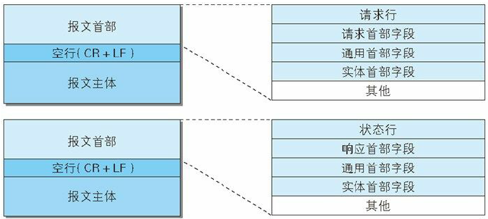
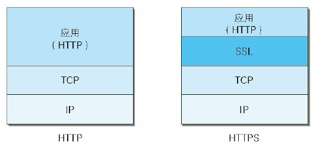
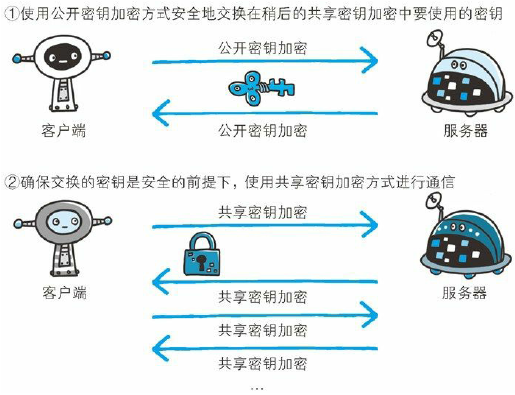
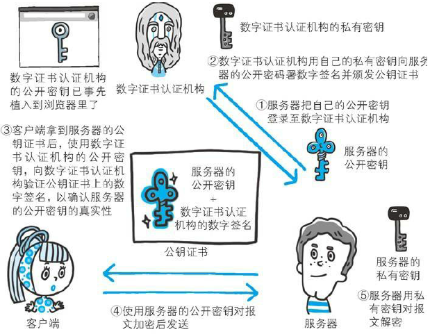

## 1. HTTP 基本概念

### 1.1 HTTP 报文

用于 HTTP 协议交互的信息被称为 **HTTP 报文**，请求端（客户端）的 HTTP 报文叫做**请求报文**，响应端（服务器端）的叫做**响应报文**。HTTP 报文本身是由多行（用 CR+LF 作换行符）数据构成的字符串文本，**大致可分为报文首部和报文主体两块，通常不一定要有报文主体**。

* **请求行**：包含用于请求的方法，请求 URI 和 HTTP 版本。
* **状态行**：包含表明响应结果的状态码，原因短语和 HTTP 版本。
* **首部字段**：包含表示请求和响应的各种条件和属性的各类首部，一般有 4 种：通用首部、请求首部、响应首部、实体首部。
* **其他**：可能包含 HTTP 的 RFC 里未定义的首部（Cookie 等）。

### 1.2 URI 和 URL

HTTP 使用 URL（ Uniform Resource Locator，**统一资源定位符**）来定位资源，它是 URI（Uniform Resource Identifier，**统一资源标识符**）的子集，**URL 在 URI 的基础上增加了定位能力**。

> 拿人做例子，假设这个世界上所有人的名字都不能重复，那么名字就是 URI 的一个实例，通过名字这个字符串就可以标识出唯一的一个人。现实当中名字当然是会重复的，所以身份证号才是 URI，通过身份证号能让我们能且仅能确定一个人。
>
> 那统一资源定位符 URL 是什么呢？也拿人做例子，就可以有：动物住址协议://地球/中国/浙江省/杭州市/西湖区/某大学/14号宿舍楼/525号寝/张三.人。可以看到，这个字符串同样标识出了唯一的一个人，起到了 URI 的作用，所以 URL 是 URI 的子集，URL是以描述人的位置来唯一确定一个人的。
>
> 在上文我们用身份证号也可以唯一确定一个人。对于这个在杭州的张三，我们也可以用：身份证号123456 来标识他。所以不论是用定位的方式还是用编号的方式，我们都可以唯一确定一个人，都是 URl 的一种实现，而 URL 就是用定位的方式实现的 URI。（参考：[知乎](https://www.zhihu.com/question/21950864)）

### 1.3 HTTP 方法

客户端发送的**请求报文**第一行为请求行，包含了方法字段。

1. **GET：获取资源**。当前网络请求中，绝大部分使用的是 GET 方法。
2. **HEAD：获取报文首部**。和 GET 方法类似，但是不返回报文实体主体部分，用于确认 URI 的有效性及资源更新的日期时间等。
3. **POST：传输实体主体**。
4. **PUT：上传文件**。由于自身不带验证机制，任何人都可以上传文件，因此存在安全性问题，一般不使用该方法。
5. **PATCH：对资源进行部分修改**。PUT 也可以用于修改资源，但是只能完全替代原始资源，PATCH 允许部分修改。
6. **DELETE：删除文件**。与 PUT 功能相反，并且同样不带验证机制。
7. **OPTIONS：查询指定的 URL 能够支持的方法**。会返回 `Allow: GET, POST, HEAD, OPTIONS` 这样的内容。
8. **CONNECT：要求在与代理服务器通信时建立隧道，实现用隧道协议进行 TCP 通信**。主要使用 SSL（Secure Sockets Layer，安全套接层）和 TLS（Transport Layer Security，传输层安全）协议把通信内容加密后经网络隧道传输。
9. **TRACE：追踪路径**。发送请求时，在 Max-Forwards 首部字段中填入数值，每经过一个服务器就会减 1，当数值为 0 时就停止传输。通常不会使用 TRACE，且它容易受到 XST （Cross-Site Tracing，跨站追踪）攻击。

关于 GET 和 POST 的区别：

1. **作用**：GET 用于获取资源，而 POST 用于传输实体主体。

2. **参数**：GET 和 POST 的请求都能使用额外的参数，但是 GET 的参数是以查询字符串出现在 URL 中，而 POST 的参数存储在实体主体中。不能因为 POST 参数存储在实体主体中就认为它的安全性更高，因为照样可以通过一些抓包工具查看。因为 URL 只支持 ASCII 码，因此 GET 的参数中如果存在中文等字符就需要先进行编码，例如 `中文` 会转换为 `%E4%B8%AD%E6%96%87`，而空格会转换为 `%20`。POST 参数支持标准字符集。

3. **安全**：安全的 HTTP 方法不会改变服务器状态，也就是说它只是可读的。GET 方法是安全的，而 POST 却不是，因为 POST 的目的是传送实体主体内容。

4. **幂等性**：幂等的 HTTP 方法，同样的请求被执行一次与连续执行多次的效果是一样的，服务器的状态也是一样的。在正确实现的条件下，GET，HEAD，PUT 和 DELETE 等方法都是幂等的，而 POST 方法不是。

5. **可缓存**：GET 和 HEAD 可以缓存，PUT 和 DELETE 不可缓存，POST 在多数情况下不可缓存。

6. **XMLHttpRequest**：在使用 XMLHttpRequest 的 POST 方法时，浏览器会先发送 Header 再发送 Data。但并不是所有浏览器会这么做，例如火狐就不会。而 GET 方法 Header 和 Data 会一起发送。

   > XMLHttpRequest 是一个 API，提供了一个通过 URL 来获取数据的简单方式，并且不会使整个页面刷新，这使得网页只更新一部分页面而不会打扰到用户，XMLHttpRequest 在 AJAX 中被大量使用。

### 1.4 持久连接与管线化

当浏览器访问一个包含多张图片的 HTML 页面时，除了请求访问的 HTML 页面资源，还会请求图片资源。如果每进行一次 HTTP 通信就要新建一个 TCP 连接，那么**开销会很大**。**持久连接只需要建立一次 TCP 连接就能进行多次 HTTP 通信**，只要任意一端没有明确提出断开连接，则保持 TCP 连接状态。

- 从 HTTP/1.1 开始默认是持久连接的，如果要断开连接，需要由客户端或者服务器端提出断开，使用 `Connection : close`；
- 在 HTTP/1.1 之前默认是短连接的，如果需要使用持久连接，则使用 `Connection : Keep-Alive`。

默认情况下，HTTP 请求是按顺序发出的，下一个请求只有在当前请求收到响应之后才会被发出。由于受到网络延迟和带宽的限制，在下一个请求被发送到服务器之前，可能需要等待很长时间。**管线化技术是在同一条长连接上连续发出请求，而不用等待响应返回，这样可以减少延迟**。

## 2. HTTP 状态码

服务器返回的**响应报文**中第一行为状态行，包含了状态码以及原因短语，用来告知客户端请求的结果。数字中的第一位指定了响应类别，后两位无分类。

| 状态码 | 类别                             | 含义                       |
| :----- | -------------------------------- | -------------------------- |
| 1XX    | Informational（信息性状态码）    | 接收的请求正在处理         |
| 2XX    | Success（成功状态码）            | 请求正常处理完毕           |
| 3XX    | Redirection（重定向状态码）      | 需要进行附加操作以完成请求 |
| 4XX    | Client Error（客户端错误状态码） | 服务器无法处理请求         |
| 5XX    | Server Error（服务器错误状态码） | 服务器处理请求出错         |

### 2.1 1XX 信息

- **100 Continue** ：表明到目前为止都很正常，客户端可以继续发送请求或者忽略这个响应。

### 2.2 2XX 成功

- **200 OK**：客户端发来的请求在服务端被正确处理了。
- **204 No Content** ：请求已经成功处理，但是返回的响应报文不包含实体的主体部分。一般在只需要从客户端往服务器发送信息，而不需要返回数据时使用。
- **206 Partial Content** ：客户端进行了范围请求，响应报文包含由 Content-Range 指定范围的实体内容。

### 2.3 3XX 重定向

- **301 Moved Permanently** ：永久性重定向，表示请求的资源已被分配了新的 URI，以后应使用资源现在所指的 URI。
- **302 Found** ：临时性重定向，和 301 类似，但资源不是被永久移动，只是临时性质的。
- **303 See Other** ：和 302 有着相同的功能，但是 303 明确要求客户端应该采用 GET 方法获取资源。虽然 HTTP 协议规定 301、302 状态下重定向时不允许把 POST 方法改成 GET 方法，但是大多数浏览器都会在 301、302 和 303 状态下的重定向把 POST 方法改成 GET 方法。
- **304 Not Modified** ：如果请求报文首部包含一些附带条件，例如：If-Match，If-Modified-Since，If-None-Match，If-Range，If-Unmodified-Since，如果不满足条件，则服务器会返回 304 状态码。304 虽然被划分在 3XX 类别中，但和重定向没有关系。
- **307 Temporary Redirect** ：临时重定向，与 302 的含义类似，但是 307 要求浏览器不会把重定向请求的 POST 方法改成 GET 方法。

### 2.4 4XX 客户端错误

- **400 Bad Request** ：请求报文中存在语法错误。
- **401 Unauthorized** ：该状态码表示发送的请求需要有认证信息（BASIC 认证、DIGEST 认证）。如果之前已进行过一次请求，则表示用户认证失败。
- **403 Forbidden** ：请求被服务器拒绝。
- **404 Not Found**：服务器无法找到请求的资源。

### 2.5 5XX 服务器错误

- **500 Internal Server Error** ：服务器正在执行请求时发生错误。
- **503 Service Unavailable** ：服务器暂时处于超负载或正在进行停机维护，现在无法处理请求。

## 3. HTTP 首部

HTTP 首部字段是由首部字段名和字段值构成的，中间用冒号分隔。HTTP/1.1 规范定义了 47 种首部字段。

### 3.1 通用首部字段

| 首部字段名        | 说明                                       |
| ----------------- | ------------------------------------------ |
| Cache-Control     | 控制缓存的行为                             |
| Connection        | 控制不再转发给代理的首部字段、管理持久连接 |
| Date              | 创建报文的日期时间                         |
| Pragma            | 报文指令，历史遗留字段，向后兼容           |
| Trailer           | 报文末端的首部一览                         |
| Transfer-Encoding | 指定报文主体的传输编码方式                 |
| Upgrade           | 升级为其他协议                             |
| Via               | 代理服务器的相关信息                       |
| Warning           | 错误通知                                   |

### 3.2 请求首部字段

| 首部字段名          | 说明                                            |
| ------------------- | ----------------------------------------------- |
| Accept              | 用户代理可处理的媒体类型                        |
| Accept-Charset      | 优先的字符集                                    |
| Accept-Encoding     | 优先的内容编码                                  |
| Accept-Language     | 优先的语言（自然语言）                          |
| Authorization       | Web 认证信息                                    |
| Expect              | 期待服务器的特定行为                            |
| From                | 用户的电子邮箱地址                              |
| Host                | 请求资源所在服务器（必须包含的首部字段）        |
| If-Match            | 比较实体标记（ETag）                            |
| If-Modified-Since   | 比较资源的更新时间                              |
| If-None-Match       | 比较实体标记（与 If-Match 相反）                |
| If-Range            | 资源未更新时发送实体 Byte 的范围请求            |
| If-Unmodified-Since | 比较资源的更新时间（与 If-Modified-Since 相反） |
| Max-Forwards        | 最大传输逐跳数                                  |
| Proxy-Authorization | 代理服务器要求客户端的认证信息                  |
| Range               | 实体的字节范围请求                              |
| Referer             | 对请求中 URI 的原始获取方                       |
| TE                  | 传输编码的优先级                                |
| User-Agent          | HTTP 客户端程序的信息                           |

### 3.3 响应首部字段

| 首部字段名         | 说明                         |
| ------------------ | ---------------------------- |
| Accept-Ranges      | 是否接受字节范围请求         |
| Age                | 推算资源创建经过时间         |
| ETag               | 资源的匹配信息               |
| Location           | 令客户端重定向至指定 URI     |
| Proxy-Authenticate | 代理服务器对客户端的认证信息 |
| Retry-After        | 对再次发起请求的时机要求     |
| Server             | HTTP 服务器的安装信息        |
| Vary               | 代理服务器缓存的管理信息     |
| WWW-Authenticate   | 服务器对客户端的认证信息     |

### 3.4 实体首部字段

| 首部字段名       | 说明                                     |
| ---------------- | ---------------------------------------- |
| Allow            | 资源可支持的 HTTP 方法                   |
| Content-Encoding | 实体主体适用的编码方式                   |
| Content-Language | 实体主体的自然语言                       |
| Content-Length   | 实体主体的大小                           |
| Content-Location | 替代对应资源的 URI                       |
| Content-MD5      | 实体主体的报文摘要，检查报文主体的准确性 |
| Content-Range    | 实体主体的位置范围                       |
| Content-Type     | 实体主体的媒体类型                       |
| Expires          | 实体主体过期的日期时间                   |
| Last-Modified    | 资源的最后修改日期时间                   |

### 3.5 Cookie 首部字段

**HTTP 协议是无状态的**，主要是为了让 HTTP 协议尽可能简单，使得它能够处理大量事务。HTTP/1.1 引入 Cookie 来保存状态信息，虽然 Cookie 未被编入标准化，但在 Web 网站方面得到了广泛的应用。

Cookie 会根据从服务器端发送的**响应报文内的一个叫做 Set-Cookie 的首部字段信息，通知客户端保存 Cookie**。当下次客户端再往该服务器发送请求时，**客户端会自动在请求报文中加入 Cookie 值后发送出去**。服务器端收到 Cookie 后，会去检查究竟是从哪一个客户端发来的连接请求，然后对比服务器上的记录，最后得到之前的状态信息。

| 首部字段名 | 说明                             | 首部类型     |
| ---------- | -------------------------------- | ------------ |
| Set-Cookie | 开始状态管理所使用的 Cookie 信息 | 响应首部字段 |
| Cookie     | 服务器接收到的 Cookie 信息       | 请求首部字段 |

| Set-Cookie 字段属性 | 说明                                                         |
| ------------------- | ------------------------------------------------------------ |
| NAME=VALUE          | 赋予 Cookie 的名称和其值（必需项）                           |
| expires=DATE        | Cookie 的有效期（默认为浏览器关闭前为止）                    |
| path=PATH           | 将服务器上的文件目录作为 Cookie 的适用对象（默认为文档所在的文件目录） |
| domain=域名         | 作为 Cookie 适用对象的域名（默认为创建 Cookie 的服务器的域名） |
| Secure              | 仅在 HTTPS 安全通信时才会发送 Cookie                         |
| HttpOnly            | 加以限制，使 Cookie 不能被 JavaScript 脚本访问，防止跨站脚本攻击 |

Cookie 曾一度用于客户端数据的存储，因为当时并没有其它合适的存储办法而作为唯一的存储手段，但现在随着现代浏览器开始支持各种各样的存储方式，Cookie 渐渐被淘汰。新的浏览器 API 已经允许开发者直接将数据存储到本地，如使用 Web storage API（本地存储和会话存储）或 IndexedDB。

## 4.  HTTPS

### 4.1 HTTP 缺点

HTTP 有以下安全性问题：

- **使用明文进行通信（不加密），内容可能会被窃听**；
- **不验证通信方的身份，通信方的身份有可能遭遇伪装**；
- **无法证明报文的完整性，报文有可能遭篡改**。

HTTPS 并非是应用层的一种新协议，只是 HTTP 通信接口部分用 **SSL（Secure Sockets Layer，安全套接层）**和 **TLS（Transport Layer Security，安全传输层协议）**协议代替而已。通常，HTTP 直接和 TCP 通信，当使用 SSL 时，则演变成了先和 SSL 通信，再由 SSL 和 TCP 通信。**即 HTTPS 是身披 SSL 协议这层外壳的 HTTP**，在采用 SSL 后，HTTP 就拥有了 HTTPS 的加密、证书和完整性保护这些功能。

### 4.2 加密

**共享密钥加密（对称密钥加密），加密和解密使用同一密钥**。以共享密钥的方式加密时必须将密钥发送给对方，但发送密钥就有被窃听的风险，但不发送对方就不能解密。

* 优点：运算速度快；
* 缺点：无法安全地将密钥传输给通信方。

**公开密钥加密（非对称密钥加密），加密和解密使用不同的密钥，其中，私有密钥不能让其他任何人知道，而公开密钥则可以随意发布，任何人都可以获得**。SSL 采用的就是公开密钥加密的方式。使用公开密钥加密的方式，发送密文的一方使用对方的公开密钥进行加密处理，对方收到被加密的信息后，再使用自己的私有密钥进行解密。利用这种方式，不需要发送用来解密的私有密钥，也不必担心密钥被攻击者窃取。

- 优点：可以更安全地将公开密钥传输给通信发送方；
- 缺点：运算速度慢。

**HTTPS 采用共享密钥加密和公开密钥加密两者并用的混合加密机制**。公开密钥加密能实现安全交换，但处理速度要慢，所以充分利用两者各自的优势。在交换密钥环节使用公开密钥加密的方式，之后的建立通信交换报文阶段则使用共享密钥加密的方式。

### 4.3 认证

公开密钥加密的方式还是存在一些问题，就是无法证明公开密钥本身就是货真价实的公开密钥。为此，可使用**数字认证机构（CA，Certificate Authority）颁布的公开密钥证书**，数字证书认证机构是客户端与服务器双方都可信赖的第三方机构。

首先，服务器的运营人员向 CA 提出公开密钥的申请，CA 在判明提出申请者的身份之后，会对已申请的公开密钥做数字签名，然后分配这个已签名的公开密钥，并将该公开密钥放入公开密钥证书后绑定在一起。进行 HTTPS 通信时，服务器会把公钥证书（也叫数字证书或证书）发送给客户端。客户端取得其中的公开密钥之后，先使用数字签名进行验证，如果验证通过，就可以开始通信了。

可以看出，**HTTPS 也有缺点：因为需要进行加密解密等过程，因此速度会更慢；需要支付证书授权的高额费用**。

### 4.4 完整性保护

SSL 提供报文摘要功能来进行完整性保护。HTTP 也提供了 MD5 报文摘要功能，但不是安全的。例如报文内容被篡改之后，同时重新计算 MD5 的值，通信接收方是无法意识到发生了篡改。

HTTPS 的报文摘要功能之所以安全，是因为它结合了加密和认证这两个操作。试想一下，加密之后的报文，遭到篡改之后，也很难重新计算报文摘要，因为无法轻易获取明文。

## 5. HTTP 版本

### 5.1 HTTP/1.0 和 HTTP/1.1

HTTP/1.0 最早在网页中使用是在 1996 年，那个时候只是使用一些较为简单的网页上和网络请求上，而 HTTP/1.1 则在 1999 年才开始广泛应用于现在的各大浏览器网络请求中，同时 HTTP/1.1 也是当前使用最为广泛的 HTTP 协议。 主要区别主要体现在：

1. **长连接和流水线**：**在 HTTP/1.0 中，默认使用的是短连接**，也就是说每次请求都要重新建立一次连接。HTTP 是基于 TCP/IP 协议的，每一次建立或者断开连接都需要三次握手四次挥手的开销，如果每次请求都要这样的话，开销会比较大。因此最好能维持一个长连接，可以用个长连接来发多个请求。**HTTP/1.1起，默认使用长连接**，默认开启 Connection : keep-alive。 **HTTP/1.1 的持续连接有非流水线方式和流水线方式** 。流水线方式是客户在收到 HTTP 的响应报文之前就能接着发送新的请求报文。与之相对应的非流水线方式是客户在收到前一个响应后才能发送下一个请求。
2. **错误状态响应码**：在 HTTP/1.1 中新增了 24 个错误状态响应码，如 409（Conflict）表示请求的资源与资源的当前状态发生冲突；410（Gone）表示服务器上的某个资源被永久性的删除。
3. **缓存处理**：在 HTTP/1.0 中主要使用 header 里的 If-Modified-Since、Expires 来做为缓存判断的标准， HTTP/1.1 则引入了更多的缓存控制策略例如 Entity tag、If-Unmodified-Since、If-Match、If-None-Match 等更多可供选择的缓存头来控制缓存策略。
4. **带宽优化及网络连接的使用**：HTTP/1.0 中，存在一些浪费带宽的现象，例如客户端只是需要某个对象的一部分，而服务器却将整个对象送过来了，并且不支持断点续传功能，HTTP/1.1 则在请求头引入了 range 头域，它允许只请求资源的某个部分，即返回码是 206（Partial Content），这样就方便了开发者自由的选择以便于充分利用带宽和连接。

### 5.2 HTTP/1.x 缺点

HTTP/1.x 有以下几个主要缺点：

1. HTTP/1.0 一次只允许在一个 TCP 连接上发起一个请求，HTTP/1.1 使用的管线化技术也只能部分处理请求并发，仍然会存在队列头阻塞问题，因此客户端在需要发起多次请求时，通常会采用建立多连接来减少延迟。
2. 单向请求，只能由客户端发起。
3. 请求报文与响应报文首部信息冗余量大。
4. 数据未压缩，导致数据的传输量大

### 5.3 HTTP/2.0 新特性

1. **二进制分帧**：在 HTTP/1.x 中，我们是通过文本的方式传输数据，基于文本的方式传输数据存在很多缺陷。HTTP/2.0 在应用层（HTTP）和传输层（TCP）之间增加一个二进制分帧层。在二进制分帧层上，HTTP/2.0 会将所有传输的信息分为更小的消息和帧，并采用二进制格式编码，其中 HTTP/1.x 的首部信息会被封装到  Headers 帧，而 Request Body 则封装到 Data 帧。

   > 帧：HTTP/2.0 通信的最小单位，所有帧都共享一个8字节的首部，其中包含帧的长度、类型、标志、还有一个保留位，并且至少有标识出当前帧所属的流的标识符，帧承载着特定类型的数据，如 HTTP 首部、负荷等等。
   >
   > 消息：比帧大的通讯单位，是指逻辑上的 HTTP 消息，比如请求、响应等，由一个或多个帧组成。
   >
   > 流：比消息大的通讯单位，是 TCP 连接中的一个虚拟通道，可以承载双向的消息。每个流都有一个唯一的整数标识符。

2. **首部压缩**：HTTP/1.1 的首部带有大量信息，而且每次都要重复发送。HTTP/2.0 要求客户端和服务器同时维护和更新一个包含之前见过的首部字段表，从而避免了重复传输。不仅如此，HTTP/2.0 也使用 Huffman 编码对首部字段进行压缩。

3. **多路复用**：HTTP/2.0 基于二进制分帧层，可以在共享 TCP 连接的基础上同时发送请求和响应。HTTP 消息被分解为独立的帧，而不破坏消息本身的语义，交错发出去，在另一端根据流标识符和首部将他们重新组装起来。 通过该技术，可以避免 HTTP 旧版本的队头阻塞问题，极大提高传输性能。

4. **服务端推送**：HTTP/2.0 在客户端请求一个资源时，会把相关的资源一起发送给客户端，客户端就不需要再次发起请求了。例如客户端请求 page.html 页面，服务端就把 script.js 和 style.css 等与之相关的资源一起发给客户端。

## 参考

1. 《图解 HTTP》
2. [有关HTTP2.0详解](https://blog.csdn.net/yexudengzhidao/article/details/98207149)