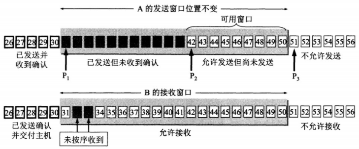

## 1. 网络体系结构

* **应用层：为应用程序或用户提供各种请求服务**。OSI参考模型最高层，也是最靠近用户的一层，**数据单位为报文**。
* **表示层：数据编码、格式转换、数据加密**。提供各种用于应用层数据的编码和转换功能，确保一个系统的应用层发送的数据能被另一个系统的应用层识别。数据压缩和加密也是表示层可提供的转换功能之一。
* **会话层：创建、管理和维护会话**。接收来自传输层的数据，负责建立、管理和终止表示层实体之间的通信会话，支持它们之间的数据交换。
* **传输层：提供可靠的端到端的差错和流量控制，保证报文的正确传输**。传输层包括两种协议：传输控制协议 TCP，提供面向连接、可靠的数据传输服务，数据单位为**报文段**；用户数据报协议 UDP，提供无连接、尽最大努力的数据传输服务，数据单位为**用户数据报**。TCP 主要提供完整性服务，UDP 主要提供及时性服务。
* **网络层：IP 选址及路由选择**。通过路由选择算法，为报文或通信子网选择最适当的路径，它把传输层传递下来的**报文段或者用户数据报封装成分组**。
* **数据链路层：提供介质访问和链路管理**。网络层针对的还是主机之间的数据传输服务，而主机之间可以有很多链路，链路层协议就是为同一链路的主机提供数据传输服务。数据链路层把网络层传下来的**分组封装成帧**。
* **物理层：利用传输介质为数据链路层提供物理连接，实现比特流的透明传输**。物理层尽可能屏蔽传输媒体和通信手段的差异，使数据链路层感觉不到这些差异。

**五层协议没有表示层和会话层，而是将这些功能留给应用程序开发者处理。TCP/IP 只有四层，相当于五层协议中数据链路层和物理层合并为网络接口层**，TCP/IP 体系结构不严格遵循 OSI 分层概念，应用层可能会直接使用 IP 层或者网络接口层。

在向下的过程中，需要添加下层协议所需要的首部或者尾部，而在向上的过程中不断拆开首部和尾部。路由器只有下面三层协议，因为路由器位于网络核心中，不需要为进程或者应用程序提供服务，因此也就不需要传输层和应用层。每一层的主要协议如下：

* 应用层/表示层/会话层：HTTP、FTP、DNS、Telnet、SMTP
* 传输层：TCP、UDP
* 网络层：IP、ICMP、ARP、RARP、RIP、OSPF、IPX （路由器）
* 数据链路层：PPP、FR、HDLC、VLAN、MAC （网桥，交换机）
* 物理层：RJ45、CLOCK、IEEE802.3 （中继器，集线器）

## 2. 传输层

### 2.1 TCP 和 UDP 特点

* 传输控制协议 TCP（Transmission Control Protocol）是**面向连接的，提供可靠交付，有流量控制，拥塞控制，提供全双工通信，面向字节流（把应用层传下来的报文看成字节流，把字节流组织成大小不等的数据块），每一条 TCP 连接只能是点对点的（一对一）**。

* 用户数据报协议 UDP（User Datagram Protocol）是**无连接的，尽最大可能交付，没有拥塞控制，面向报文（对于应用程序传下来的报文不合并也不拆分，只是添加 UDP 首部），支持一对一、一对多、多对一和多对多的交互通信**。

> 面向连接指在发送数据之前，需要在收发主机之间连接一条通信线路；面向无连接则不要求建立和断开连接，发送端可于任何时候自由发送数据。

### 2.2 TCP 和 UDP 首部格式

- **序号 seq** ：**用于对字节流进行编号**，例如序号为 301，表示第一个字节的编号为 301，如果携带的数据长度为 100 字节，那么下一个报文段的序号应为 401。
- **确认号 ack** ：**期望收到的下一个报文段的序号**。例如 B 正确收到 A 发送来的一个报文段，序号为 501，携带的数据长度为 200 字节，因此 B 期望下一个报文段的序号为 701，B 发送给 A 的确认报文段中确认号就为 701。
- **数据偏移** ：指的是数据部分距离报文段起始处的偏移量，实际上指的是首部的长度。
- **确认 ACK** ：**当 ACK=1 时确认号字段有效，否则无效**。TCP 规定，在连接建立后所有传送的报文段都必须把 ACK 置 1。
- **同步 SYN** ：**在连接建立时用来同步序号**。当 SYN=1，ACK=0 时表示这是一个连接请求报文段。若对方同意建立连接，则响应报文中 SYN=1，ACK=1。
- **终止 FIN** ：**用来释放一个连接**，当 FIN=1 时，表示此报文段的发送方的数据已发送完毕，并要求释放连接。
- **窗口** ：窗口值作为接收方让发送方设置其发送窗口的依据。之所以要有这个限制，是因为接收方的数据缓存空间是有限的。

UDP 首部字段只有 8 个字节，包括源端口、目的端口、长度、检验和。12 字节的伪首部是为了计算检验和临时添加的。

### 2.3 TCP 三次握手

1. 假设 A 为客户端，B 为服务器端。三次握手过程如下：
   * 首先 B 处于 LISTEN（监听）状态，等待客户的连接请求。
   * A 向 B 发送连接请求报文，SYN=1，选择一个初始的序号 x。
   * B 收到连接请求报文，如果同意建立连接，则向 A 发送连接确认报文，SYN=1，ACK=1，确认号为 x+1，同时也选择一个初始的序号 y。
   * A 收到 B 的连接确认报文后，还要向 B 发出确认，确认号为 y+1，序号为 x+1。
   * B 收到 A 的确认后，连接建立。

2. **为什么三次握手，而不是两次握手？**

   **因为超时重传机制的存在，第三次握手可以防止失效的连接请求到达服务器，让服务器错误打开连接**。客户端发送的连接请求如果在网络中滞留，那么就会隔很长一段时间才能收到服务器端发回的连接确认。客户端等待一个超时重传时间之后，就会重新请求连接。但是这个滞留的连接请求最后还是会到达服务器，如果不进行三次握手，那么服务器就会打开两个连接。如果有第三次握手，客户端会忽略服务器之后发送的对滞留连接请求的连接确认，不进行第三次握手，因此就不会再次打开连接。

### 2.4 TCP 四次挥手

1. 以下描述不讨论序号和确认号，因为序号和确认号的规则比较简单。并且不讨论 ACK，因为 ACK 在连接建立之后都为 1。四次挥手过程如下：
   * A 发送连接释放报文，FIN=1。
   * B 收到之后发出确认，此时 TCP 属于半关闭状态，B 能向 A 发送数据但是 A 不能向 B 发送数据。
   * 当 B 不再需要连接时，发送连接释放报文，FIN=1。
   * A 收到后发出确认，进入 TIME-WAIT 状态，等待 2 MSL（最大报文存活时间）后释放连接。
   * B 收到 A 的确认后释放连接。

2. **为什么四次挥手？**

   客户端发送了 FIN 连接释放报文之后，服务器收到了这个报文，就进入了 CLOSE-WAIT 状态。这个状态是为了**让服务器端发送还未传送完毕的数据**，传送完毕之后，服务器会发送 FIN 连接释放报文。

3. **为什么 TIME_WAIT 状态还需要等待 2MSL 后才能返回 CLOSE？**

   * **确保客户端发送的最后一个 ACK 报文段能够到达服务端**。如果 B 没收到 A 发送来的确认报文，那么就会重新发送连接释放请求报文，A 等待一段时间就是为了处理这种情况的发生。

     > 这个 ACK 报文段有可能丢失，使得处于 LAST-ACK 状态的 B 收不到对已发送的 FIN+ACK 报文段的确认，服务端超时重传 FIN+ACK 报文段，而客户端能在 2MSL 时间内收到这个重传的 FIN+ACK 报文段，接着客户端重传一次确认，重新启动 2MSL 计时器，最后客户端和服务端都进入到 CLOSED 状态。若客户端在 TIME-WAIT 状态不等待一段时间，而是发送完 ACK 报文段后立即释放连接，则无法收到服务端重传的 FIN+ACK 报文段，所以不会再发送一次确认报文段，则服务端无法正常进入到 CLOSED 状态。

   * **防止“已失效的连接请求报文段”出现在本连接中**。等待一段时间是为了让本连接持续时间内所产生的所有报文都从网络中消失，使得下一个新的连接不会出现旧的连接请求报文。

     > MSL 全称 Maximum Segment Lifetime（最长报文段寿命），它是任何报文在网络上存在的最长时间，超过这个时间报文将被丢弃。

### 2.5 TCP 可靠传输

1. 应用数据被分割成 TCP 认为最适合发送的数据块。
2. TCP 给发送的每一个包进行编号，接收方对数据包进行排序，把有序数据传送给应用层。
3. **校验和**：TCP 将保持它首部和数据的检验和。这是一个端到端的检验和，目的是检测数据在传输过程中的任何变化。如果收到段的检验和有差错，TCP 将丢弃这个报文段和不确认收到此报文段。
4. TCP 的接收端会丢弃重复的数据。
5. **流量控制**：TCP 连接的每一方都有固定大小的缓冲空间，TCP 的接收端只允许发送端发送接收端缓冲区能接纳的数据。当接收方来不及处理发送方的数据，能提示发送方降低发送的速率，防止包丢失。TCP 使用的流量控制协议是可变大小的滑动窗口协议（TCP 利用滑动窗口实现流量控制）。
6. **拥塞控制**：当网络拥塞时，减少数据的发送。
7. **ARQ 协议**：也是为了实现可靠传输的，它的基本原理就是每发完一个分组就停止发送，等待对方确认。在收到确认后再发下一个分组。
8. **超时重传**：当 TCP 发出一个段后，它启动一个定时器，等待目的端确认收到这个报文段。如果不能及时收到一个确认，将重发这个报文段。

### 2.6 ARQ 自动重传请求协议

**自动重传请求**（Automatic Repeat-reQuest，ARQ）是 OSI 模型中数据链路层和传输层的错误纠正协议之一。它通过使用确认和超时这两个机制，在不可靠服务的基础上实现可靠的信息传输。如果发送方在发送后一段时间之内没有收到确认帧，它通常会重新发送。**ARQ 包括停止等待 ARQ 协议和连续 ARQ 协议**。

1. **停止等待 ARQ 协议**

   停止等待协议是为了实现可靠传输的，它的基本原理就是每发完一个分组就停止发送，等待对方确认（回复ACK）。如果过了一段时间（超时时间后），还是没有收到 ACK 确认，说明没有发送成功，需要重新发送，直到收到确认后再发下一个分组。在停止等待协议中，若接收方收到重复分组，就丢弃该分组，但同时还要发送确认。

   * **优点**：简单
   * **缺点**：信道利用率低，等待时间长

   > **确认丢失** ：确认消息在传输过程丢失。当 A 发送 M1 消息，B 收到后，B 向A 发送了一个 M1 确认消息，但却在传输过程中丢失。而 A 并不知道，在超时计时过后，A 重传 M1 消息，B 再次收到该消息后采取以下两点措施：1. 丢弃这个重复的 M1 消息，不向上层交付。 2. 向 A 发送确认消息（不会认为已经发送过了，就不再发送。A 能重传，就证明 B 的确认消息丢失）。
   >
   > **确认迟到** ：确认消息在传输过程中迟到。A 发送 M1 消息，B 收到并发送确认。在超时时间内没有收到确认消息，A 重传 M1 消息，B 仍然收到并继续发送确认消息（B 收到了 2 份M1）。此时 A 收到了 B 第二次发送的确认消息。接着发送其他数据。过了一会， A收到了 B 第一次发送的对 M1 的确认消息（A 也收到了 2 份确认消息）。处理如下：1. A 收到重复的确认后，直接丢弃。2. B 收到重复的 M1 后，也直接丢弃重复的 M1。

2. **连续 ARQ 协议**

   连续 ARQ 协议可提高信道利用率。发送方维持一个发送窗口，凡位于发送窗口内的分组可以连续发送出去，而不需要等待对方确认。**接收方一般采用累计确认，对按序到达的最后一个分组发送确认**，表明到这个分组为止的所有分组都已经正确收到了。

   * **优点**：信道利用率高，容易实现，即使确认丢失，也不必重传。
   * **缺点**：不能向发送方反映出接收方已经正确收到的所有分组的信息。 比如：发送方发送了 5条 消息，中间第三条丢失（3号），这时接收方只能对前两个发送确认。发送方无法知道后三个分组的下落，而只好把后三个全部重传一次。这也叫 Go-Back-N（回退 N），表示需要退回来重传已经发送过的 N 个消息。

### 2.7 TCP 流量控制和滑动窗口

**TCP 利用滑动窗口实现流量控制。流量控制是为了控制发送方发送速率，保证接收方来得及接收。** 接收方发送的确认报文中的窗口字段可以用来控制发送方窗口大小，从而影响发送方的发送速率。将窗口字段设置为 0，则发送方不能发送数据。

窗口是缓存的一部分，用来暂时存放字节流。发送方和接收方各有一个窗口，接收方通过 TCP 报文段中的窗口字段告诉发送方自己的窗口大小，发送方根据这个值和其它信息设置自己的窗口大小。发送窗口内的字节都允许被发送，接收窗口内的字节都允许被接收。如果发送窗口左部的字节已经发送并且收到了确认，那么就将发送窗口向右滑动一定距离，直到左部第一个字节不是已发送并且已确认的状态；接收窗口的滑动类似，接收窗口左部字节已经发送确认并交付主机，就向右滑动接收窗口。

接收窗口只会对窗口内最后一个按序到达的字节进行确认，例如接收窗口已经收到的字节为 {31, 34, 35}，其中 {31} 按序到达，而 {34, 35} 就不是，因此只对字节 31 进行确认。发送方得到一个字节的确认之后，就知道这个字节之前的所有字节都已经被接收。

### 2.8 TCP 拥塞控制

在某段时间，若对网络中某一资源的需求超过了该资源所能提供的可用部分，网络的性能就要变坏，这种情况就叫拥塞。**拥塞控制就是为了防止过多的数据注入到网络中，这样就可以使网络中的路由器或链路不致过载**。拥塞控制所要做的都有一个前提，就是网络能够承受现有的网络负荷。拥塞控制是一个全局性的过程，涉及到所有的主机，所有的路由器，以及与降低网络传输性能有关的所有因素。相反，流量控制往往是点对点通信量的控制，是个端到端的问题。流量控制所要做到的就是抑制发送端发送数据的速率，以便使接收端来得及接收。

为了进行拥塞控制，TCP 发送方要维持一个**拥塞窗口（cwnd）** 的状态变量。拥塞控制窗口的大小取决于网络的拥塞程度，并且动态变化。发送方让自己的发送窗口取为拥塞窗口和接收方的接受窗口中较小的一个。

TCP 的拥塞控制采用了四种算法，即**慢开始 、拥塞避免 、快重传和快恢复**。在网络层也可以使路由器采用适当的分组丢弃策略（如主动队列管理 AQM），以减少网络拥塞的发生。

- **慢开始**：慢开始算法的思路是当主机开始发送数据时，如果立即把大量数据字节注入到网络，那么可能会引起网络阻塞，因为现在还不知道网络的符合情况。经验表明，较好的方法是先探测一下，即由小到大逐渐增大发送窗口，也就是由小到大逐渐增大拥塞窗口数值。**cwnd 初始值为1，每经过一个传播轮次，cwnd 加倍**。

  为了防止 cwnd 增长过大引起网络拥塞，还需设置一个**慢开始门限 ssthresh** 状态变量：

  - 当 cwnd < ssthresh 时：使用慢开始算法
  - 当 cwnd = ssthresh 时：采用慢开始或拥塞避免中的任意一种
  - 当 cwnd > ssthresh 时：采用拥塞避免算法

- **拥塞避免**：拥塞避免算法的思路是让拥塞窗口 cwnd 缓慢增大，即每经过一个往返时间 RTT 就**把发送方的 cwnd 加 1，而不是加倍**，这样能够让拥塞窗口按线性规律增长。

  无论是在慢开始阶段，还是在拥塞控制阶段，只要发送方判断网络出现拥塞，就**把慢开始门限 ssthressh 设置为当前出现拥塞时发送窗口大小的一半（不能小于2）**，然后将拥塞窗口 cwnd 设置为1，执行慢开始算法。这样做的目的是迅速减少主机发送到网络中的分组数，使得发送拥塞的路由器有足够时间把队列中积压的分组处理完毕。

- **快重传**：快重传要求接收方在收到一个失序的报文段后，就立即发出重复确定（为的是使发送方及早知道有报文段没有达到对方，可提高网络吞吐量约20%）而不要等到自己发送数据时捎带确定。快重传算法规定，**发送方只要一连收到三个重复确定，就应当立即重传对方尚未收到的报文段，而不必继续等待设置的重传计时器时间到期**。

  

- **快恢复**：快重传配合使用的还有快恢复算法，**当发送方连续收到三个重复确认时，就执行乘法减小算法，把 ssthresh 门限减半**（为了预防发送拥塞），但是接下来并不执行慢开始算法。考虑到如果网络出现拥塞的话，就不会收到好几个重复的确认，所以发送方现在认为网络可能没有出现拥塞，所以此时**不执行慢开始算法，而是将 cwnd 设置为 ssthresh 减半后的值，然后执行拥塞避免算法，使 cwnd 缓慢增大**，TCP Reno版本是目前使用最广泛的版本。

## 3. 网络层

### 3.1 IP 地址编址方式

IP 地址的编址方式经历了三个历史阶段：

1. **分类：`IP 地址 ::= {< 网络号 >, < 主机号 >}`**，由两部分组成，网络号和主机号，其中不同分类具有不同的网络号长度，并且是固定的。

   

2. **子网划分：`IP 地址 ::= {< 网络号 >, < 子网号 >, < 主机号 >}`**，通过在主机号字段中拿一部分作为子网号，把两级 IP 地址划分为三级 IP 地址。**要使用子网，必须配置子网掩码**，注意，外部网络看不到子网的存在。一个 B 类地址的默认子网掩码为 255.255.0.0，如果 B 类地址的子网占两个比特，那么子网掩码为 11111111 11111111 11000000 00000000，也就是 255.255.192.0。

3. **无分类：`IP 地址 ::= {< 网络前缀号 >, < 主机号 >}`**，无分类编址 CIDR 消除了传统 A 类、B 类和 C 类地址以及划分子网的概念，使用网络前缀和主机号来对 IP 地址进行编码，网络前缀的长度可以根据需要变化。CIDR 的记法上采用在 **IP 地址后面加上网络前缀长度**的方法，例如 **128.14.35.7/20 表示前 20 位为网络前缀**。CIDR 的地址掩码可以继续称为子网掩码，子网掩码首 1 长度为网络前缀的长度。

   一个 CIDR 地址块中有很多地址，一个 CIDR 表示的网络就可以表示原来的很多个网络，并且在路由表中只需要一个路由就可以代替原来的多个路由，减少了路由表项的数量。把这种**通过使用网络前缀来减少路由表项**的方式称为**路由聚合**，也称为**构成超网** 。在路由表中的项目由**“网络前缀”和“下一跳地址”**组成，在查找时可能会得到不止一个匹配结果，应当采用最长前缀匹配来确定应该匹配哪一个。

### 3.2 IPv4 和 IPv6

- IPv4 和 IPv6 用于用户标识和 Internet 上不同设备之间的通信。IPv4 是 32 位 IP 地址，而 IPv6 是128 位 IP 地址。IPv4 是数字地址，用点分隔；IPv6 是一个字母数字地址，用冒号分隔。
- 支持类型不同， IPv6 还支持任意广播
- 数据包大小不同
- IPv6 安全性是强制的

### 3.3 ARP 地址解析协议

网络层实现主机之间的通信，而链路层实现具体每段链路之间的通信。因此在通信过程中，IP 数据报的源地址和目的地址始终不变，而 MAC 地址随着链路的改变而改变。

**ARP 实现由 IP 地址得到 MAC 地址**。每个主机都有一个 ARP 高速缓存，里面有本局域网上的各主机和路由器的 IP 地址到 MAC 地址的映射表。如果主机 A 知道主机 B 的 IP 地址，但是 ARP 高速缓存中没有该 IP 地址到 MAC 地址的映射，此时主机 A 通过广播的方式发送 ARP 请求分组，主机 B 收到该请求后会发送 ARP 响应分组给主机 A 告知其 MAC 地址，随后主机 A 向其高速缓存中写入主机 B 的 IP 地址到 MAC 地址的映射。

