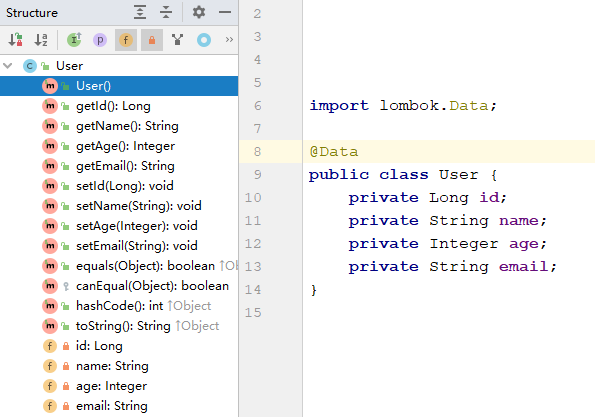
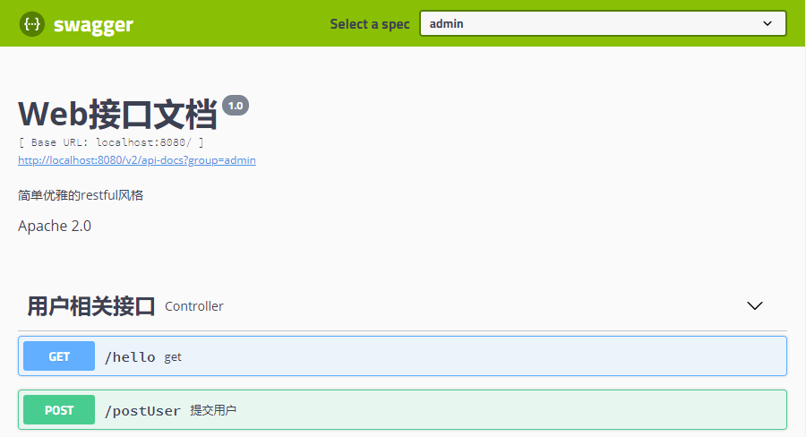

## 1. Lombok

### 1.1 简介

Lombok 的最主要功能就是通过简单的注解的方式，来帮我们简化和消除一些必须但是又显得臃肿的 Java 样板代码，例如常见的 getter、setter，toString 等等。Lombok 依赖引入如下：

```xml
<!-- https://mvnrepository.com/artifact/org.projectlombok/lombok -->
<dependency>
    <groupId>org.projectlombok</groupId>
    <artifactId>lombok</artifactId>
    <version>1.18.10</version>
    <scope>provided</scope>
</dependency>
```

参考：[Lombok 官网](https://objectcomputing.com/resources/publications/sett/january-2010-reducing-boilerplate-code-with-project-lombok)、[Maven 中央仓库](https://mvnrepository.com/)

### 1.2 常见注解

1. **@Data**：作用于类，最常见的注解，等同于增加了 @Setter、@Getter、@EqualsAndHashCode、@ToString

   

2. **@Getter & @Setter**：作用于属性，会自动生成 getter 和 setter方法

   ```java
   @Getter @Setter 
   private boolean employed = true;
   
   @Setter(AccessLevel.PROTECTED) 
   private String name;
   
   // ---------------等价的java源码---------------
   private boolean employed = true;
   private String name;
    
   public boolean isEmployed() {
       return employed;
   }
    
   public void setEmployed(final boolean employed) {
       this.employed = employed;
   }
    
   protected void setName(final String name) {
       this.name = name;
   }
   ```

3. **@NonNull**：作用于属性，判断是否为空，如果为空，则抛出 java.lang.NullPointerException 异常

   ```java
   @Getter @Setter @NonNull
   private List<Person> members;
   
   // ---------------等价的java源码---------------
   @NonNull
   private List<Person> members;
    
   public Family(@NonNull final List<Person> members) {
       if (members == null) throw new java.lang.NullPointerException("members");
       this.members = members;
   }
    
   @NonNull
   public List<Person> getMembers() {
       return members;
   }
    
   public void setMembers(@NonNull final List<Person> members) {
       if (members == null) throw new java.lang.NullPointerException("members");
       this.members = members;
   }
   ```

4. **@ToString**：作用于类，默认为非静态字段生成 toString 方法，它有如下属性：

   * callSuper：是否输出父类的 toString 方法，默认为 false
   * includeFieldNames：是否包含字段名称，默认为 true
   * exclude：排除生成 tostring 的字段

   ```java
   @ToString(callSuper=true,exclude="someExcludedField")
   public class Foo extends Bar {
       private boolean someBoolean = true;
       private String someStringField;
       private float someExcludedField;
   }
   
   // ---------------等价的java源码---------------
   public class Foo extends Bar {
       private boolean someBoolean = true;
       private String someStringField;
       private float someExcludedField;
    
       @java.lang.Override
       public java.lang.String toString() {
           return "Foo(super=" + super.toString() +
               ", someBoolean=" + someBoolean +
               ", someStringField=" + someStringField + ")";
       }
   }
   ```

5. **@Synchronized**：作用于方法，该注解自动添加到同步机制，生成的代码并不是直接锁方法，而是锁代码块

   ```java
   private DateFormat format = new SimpleDateFormat("MM-dd-YYYY");
    
   @Synchronized
   public String synchronizedFormat(Date date) {
       return format.format(date);
   }
   
   // ---------------等价的java源码---------------
   private final java.lang.Object $lock = new java.lang.Object[0];
   private DateFormat format = new SimpleDateFormat("MM-dd-YYYY");
    
   public String synchronizedFormat(Date date) {
       synchronized ($lock) {
           return format.format(date);
       }
   }
   ```

6. **@Cleanup**：作用于属性，可用于确保已分配的资源被释放，如 IO 的连接关闭

   ```java
   public void testCleanUp() {
       try {
           @Cleanup
           ByteArrayOutputStream baos = new ByteArrayOutputStream();
           baos.write(new byte[] {'Y','e','s'});
           System.out.println(baos.toString());
       } catch (IOException e) {
           e.printStackTrace();
       }
   }
   
   // ---------------等价的java源码---------------
   public void testCleanUp() {
       try {
           ByteArrayOutputStream baos = new ByteArrayOutputStream();
           try {
               baos.write(new byte[]{'Y', 'e', 's'});
               System.out.println(baos.toString());
           } finally {
               baos.close();
           }
       } catch (IOException e) {
           e.printStackTrace();
       }
   }
   ```


## 2. Swagger

### 2.1 简介

Swagger 是一款让你更好的书写 API 文档的规范且完整框架，提供描述、生产、消费和可视化 RESTful Web Service。它的特点在于接口文档实时更新，可以在线测试，以及添加注释信息等。注意，在正式发布时，出于安全和节省运行内存的考虑，建议关闭 Swagger。Swagger 依赖引入如下：

```xml
<!-- https://mvnrepository.com/artifact/io.springfox/springfox-swagger2 -->
<dependency>
    <groupId>io.springfox</groupId>
    <artifactId>springfox-swagger2</artifactId>
    <version>2.9.2</version>
</dependency>

<!-- https://mvnrepository.com/artifact/io.springfox/springfox-swagger-ui -->
<dependency>
    <groupId>io.springfox</groupId>
    <artifactId>springfox-swagger-ui</artifactId>
    <version>2.9.2</version>
</dependency>
```

参考：[b站视频](https://www.bilibili.com/video/BV1Y441197Lw)

### 2.2 配置

```java
@Configuration
@EnableSwagger2		// 开启Swagger2
public class SwaggerConfig {
    /**
     * 1. apiInfo()：配置swagger基本信息
     * 2. enable()：配置是否开启swagger
     * 3. apis()：配置扫描接口的方式，包括扫描包、方法/类上的注解等，具体可查看源码
     * 4. paths()：配置过滤的路径
     * 5. groupName(): 配置组的名称，若要设置多个组，只要注入多个Docket实例即可
     */
    @Bean
    public Docket createRestApi() {
        return new Docket(DocumentationType.SWAGGER_2)
                .apiInfo(apiInfo())
                .select()
              .apis(RequestHandlerSelectors.basePackage("com.maomao.swagger.controller"))
//                .apis(RequestHandlerSelectors.withMethodAnnotation(ApiOperation.class))
                .paths(PathSelectors.any())
                .build();
    }

    private ApiInfo apiInfo() {
        return new ApiInfoBuilder()
                .title("Web接口文档")
                .description("简单优雅的restful风格")
                .license("Apache 2.0")
                .version("1.0")
                .build();
    }
}
```

**扩展**：如何在开发和测试环境下开启 Swagger，而在测试环境下不开启？

```java
	@Bean
    public Docket createRestApi(Environment environment) {
        // 设置要显示swagger的环境，并判断当前设定的环境是否符合
        Profiles profiles = Profiles.of("dev", "test");
        boolean b = environment.acceptsProfiles(profiles);

        return new Docket(DocumentationType.SWAGGER_2)
                .apiInfo(apiInfo())
                .enable(b);
    }
```

配置完成后，在浏览器中访问：http://localhost:8080/swagger-ui.html ，界面如下所示：



### 2.3 常见注解

1. **@Api**：作用于类，可以标记一个 Controller 类做为 swagger 文档资源

2. **@ApiOperation**：作用于方法，说明方法的作用，每一个 url 资源的定义

3. **@ApiParam**：作用于参数，说明参数的含义

   ```java
   @Api(value = "用户相关接口", tags = "用户相关接口")
   @RestController
   public class Controller {
       @GetMapping("/hello")
       public String get() {
           return "hello swagger";
       }
   
       @ApiOperation("提交用户")
       @PostMapping("/postUser")
       public String postUser(@ApiParam("用户") User user) {
           return user.getUsername();
       }
   }
   ```

4. **@ApiModel**：作用于类，表示一个 JavaBean 的信息

5. **@ApiModelProperty**：作用于属性，说明 JavaBean 属性的含义

   ```java
   @Data
   @ApiModel("用户实体类")
   public class User {
       @ApiModelProperty("用户名")
       private String username;
       @ApiModelProperty("密码")
       private String password;
   }
   ```


## 3. JWT

### 3.1 简介

JSON Web Token（JWT）是一个开放标准（RFC 7519），它定义了一种紧凑且自包含的方式，用于在各方之间以 JSON 对象安全地传输信息。由于此信息是经过数字签名的，因此可以被验证和信任。JWT 可以使用 HMAC 算法或使用 RSA 或 ECDSA 的公钥/私钥对进行签名，主要用于：

- **授权**：这是使用 JWT 的最常见方案。一旦用户登录，每个后续请求将包括 JWT，从而允许用户访问该令牌允许的路由、服务和资源。单点登录是当今广泛使用 JWT 的一项功能，因为它的开销很小并且可以在不同的域中轻松使用。
- **信息交换**：JWT 是在各方之间安全地传输信息的一种好方法。因为可以对 JWT 进行签名（例如，使用公钥/私钥对），所以可以确保发件人是他们所说的人。此外，由于签名是使用标头和有效负载计算的，因此还可以验证内容是否未被篡改。

```xml
<!-- https://mvnrepository.com/artifact/com.auth0/java-jwt -->
<dependency>
    <groupId>com.auth0</groupId>
    <artifactId>java-jwt</artifactId>
    <version>3.11.0</version>
</dependency>
```

参考：[JWT 官网](https://jwt.io/introduction/)、[b站视频](https://www.bilibili.com/video/BV1i54y1m7cP?p=1)、[彻底理解cookie，session，token的区别](https://blog.csdn.net/qq_31201781/article/details/94575507)、图解 HTTP

### 3.2 Session 与 Token

#### 3.2.1  Session 认证

由于 HTTP 协议本身是一种**无状态的协议**，这意味着如果用户向我们的应用提供了用户名和密码来进行用户认证，那么下一次请求时，用户还要再一次进行用户认证才行。为了让应用能识别是哪个用户发出的请求，我们只能**在服务器存储一份用户登录的信息，这份登录信息会在响应时传递给浏览器，告诉其保存为 Cookie**，以便下次请求时发送给应用，这样应用就能识别请求来自哪个用户了，这就是传统的基于session认证。


基于传统的 Session 认证流程如下：

- 步骤一：客户端把用户 ID 和密码等登录信息放入报文的实体部分，通常是以 POST 方法把请求发送给服务器。而这时，会使用 HTTPS 通信来进行 HTML 表单画面的显示和用户输入数据的发送。
- 步骤二：**服务器会发放用以识别用户的 Session ID**。通过验证从客户端发送过来的登录信息进行身份认证，然后**把用户的认证状态与 Session ID 绑定后记录在服务器端**。向客户端返回响应时，**会在首部字段 Set-Cookie 内写入 Session ID**（如 PHPSESSID=028a8c…）。
  你可以把 Session ID 想象成一种用以区分不同用户的等位号。然而，如果 Session ID 被第三方盗走，对方就可以伪装成你的身份进行恶意操作了。因此必须防止 Session ID 被盗，或被猜出。为了做到这点，Session ID 应使用难以推测的字符串，且服务器端也需要进行有效期的管理，保证其安全性。另外，为减轻跨站脚本攻击（XSS）造成的损失，建议事先在 Cookie 内加上 httponly 属性。
- 步骤三：**客户端接收到从服务器端发来的 Session ID 后，会将其作为 Cookie 保存在本地**。下次向服务器发送请求时，**浏览器会自动发送 Cookie**，所以 Session ID 也随之发送到服务器。服务器端可通过验证接收到的 Session ID 识别用户和其认证状态。

基于传统的 Session 认证暴露出如下问题：

* 每个用户经过我们的应用认证之后，我们的应用都要在服务端做一次记录，以方便用户下次请求的鉴别，通常而言 Session 都是保存在内存中，而**随着认证用户的增多，服务端的开销会明显增大**
* 用户认证之后，服务端做认证记录，如果认证的记录被保存在内存中的话，这意味着用户下次请求还必须要请求在这台服务器上，这样才能拿到授权的资源，这样在**分布式的应用上，相应的限制了负载均衡器的能力**，这也意味着限制了应用的扩展能力
* 因为是基于 Cookie 来进行用户识别的，Cookie 如果被截获，用户就会很**容易受到跨站请求伪造的攻击**
* Session ID 就是一个特征值，**表达的信息不够丰富**，不容易扩展。而且如果后端应用是多节点部署，那么就需要实现 Session共享机制，**不方便集群应用**

#### 3.2.2 JWT 认证

JWT 由紧凑的三部分组成，这些部分由点（.）分隔，分别是：**标头（Header）、有效载荷（Payload）、签名（Signature）**，因此，JWT 通常的形式为：`Header.Payload.Signature`


* Header 标头通常由两部分组成：令牌的类型（即 JWT）和所使用的签名算法，如 HMAC、SHA256 或 RSA。然后，此 JSON 被 **Base64Url** 编码以形成 JWT 的第一部分。

  ```json
  {
    "alg": "HS256",
    "typ": "JWT"
  }
  ```

- Payload 有效负载包含了声明，声明是有关实体（通常是用户）和其他数据的声明。同样的，它会使用 **Base64Url** 编码，以形成 JWT 的第二部分。注意，对于已签名的令牌，此信息尽管可以防止篡改，但任何人都可以读取（Base64Url 编码是可逆的）。除非将其加密，否则**请勿将机密信息放入 JWT 的有效载荷或报头元素中**。

  ```json
  {
    "sub": "1234567890",
    "name": "John Doe",
    "admin": true
  }
  ```

- 前面两部分都是使用 Base64Url 进行编码的，即前端可以解开知道里面的信息。Signature 需要使用编码后的 Header 和 Payload 以及我们提供的一个密钥，然后使用 Header 中指定的签名算法（HS256）进行签名。签名的作用是保证 JWT 没有被篡改过

  ```
  HMACSHA256(base64UrlEncode(header) + "." + base64UrlEncode(payload), secret)
  ```


基于 JWT 认证的流程如下：

* 步骤一：前端通过 Web 表单将自己的用户名和密码发送到后端的接口。这一过程一般是一个 HTTP POST 请求，建议的方式是通过 SSL 加密的传输（https协议），从而避免敏感信息被嗅探。
* 步骤二：后端核对用户名和密码成功后，**将用户的 ID 等其他信息作为 JWT Payload（负载），将其与头部分别进行 Base64 编码拼接后签名，形成一个 JWT 字符串**，将其作为登录成功的返回结果返回给前端。前端可以将返回的结果保存在 localStorage 或 sessionStorage 上，退出登录时删除保存的 JWT 即可。
* 步骤三：**前端在每次请求时将 JWT 放入 HTTP Header 中的 Authorization 位**（解决 XSS 和 XSRF 问题）。 后端检查 JWT 的有效性，例如，检查签名是否正确、Token 是否过期等。验证通过后，后端可以使用 JWT 中包含的用户信息进行其他逻辑操作。

JWT 的优势在于：

* **简洁**，可以通过 URL，POST 参数或者在 HTTP header 发送，因为数据量小，传输速度也很快
* **自包含**，负载中包含了所有用户所需要的信息，避免了多次查询数据库
* 因为 Token 是以 JSON 加密的形式保存在客户端的，所以 JWT 是**跨语言**的，原则上任何 web 形式都支持
* **不需要在服务端保存会话信息**，特别适用于分布式微服务


### 3.3 工具类封装

```java
/**
 * JWT 工具类
 */
@Slf4j
public class JWTUtils {
    /**
     * 加密时的密钥，用于生成签名signature，不能泄漏
     */
    private static final String SECRET_KEY = "kew@06#khto&xuq3ou56fln4xw!klo9qpg=fb1ro";
    /**
     * JWT过期时间，单位毫秒，默认2h
     */
    private static final long EXPIRE_TIME_MILLIS = 1000 * 3600 * 2;

    /**
     * 生成JWT
     *
     * @param map 保存至有效载荷payload的信息
     * @return 返回JWT
     */
    public static String getJWT(Map<String, String> map) {
        JWTCreator.Builder builder = JWT.create();

        // 设置JWT的有效载荷payload，标头header使用默认设置
        map.forEach(builder::withClaim);
        // 设置JWT的过期时间
        long nowMillis = System.currentTimeMillis();
        builder.withExpiresAt(new Date(nowMillis + EXPIRE_TIME_MILLIS));

        // 使用HS256算法加密生成签名signature后返回JWT
        return builder.sign(Algorithm.HMAC256(SECRET_KEY));
    }

    /**
     * 验证JWT
     *
     * @param jwt JWT字符串
     * @return 验证通过返回有效载荷信息，可通过get("name").asString()获取具体的值；否则返回null
     */
    public static Map<String, Claim> verifyJWT(String jwt) {
        try {
            // 验证过程可能抛出异常：签名不一致异常、令牌过期异常、算法不匹配异常、失效的payload异常等
            DecodedJWT decodedJWT = JWT.require(Algorithm.HMAC256(SECRET_KEY)).build().verify(jwt);
            return decodedJWT.getClaims();
        } catch (TokenExpiredException e) {
            log.info("JWT已过期");
        } catch (SignatureVerificationException e) {
            log.info("签名不一致");
        } catch (AlgorithmMismatchException e) {
            log.info("加密算法不匹配");
        } catch (Exception e) {
            log.info("JWT无效");
        }
        return null;
    }
}
```


### 3.4 配置

```java
/**
 * JWT拦截器
 */
public class JWTInterceptor implements HandlerInterceptor {
    @Override
    public boolean preHandle(HttpServletRequest request, HttpServletResponse response, Object handler) throws Exception {
        // 得到请求头authorization信息
        String token = request.getHeader("token");
        // 进行token验证
        Map<String, Claim> map = JWTUtils.verifyJWT(token);

        if (map == null) {
            Map<String, Object> res = new HashMap<>();
            res.put("state", "error");
            res.put("msg", "token无效或过期");

            String json = new ObjectMapper().writeValueAsString(res);
            response.setContentType("application/json;charset=UTF-8");
            response.getWriter().println(json);
            return false;
        } else {
            // token验证通过，进行正常的业务逻辑处理
            return true;
        }
    }
}
```

```java
@Configuration
public class InterceptorConfig implements WebMvcConfigurer {
    @Override
    public void addInterceptors(InterceptorRegistry registry) {
        registry.addInterceptor(new JWTInterceptor())
                .addPathPatterns("/user/test")			// 其它请求需要首先验证token
                .excludePathPatterns("/user/login");	// 用户登录请求放行
    }
}
```


## 4. json

### 4.1 简介

JSON（JavaScript Object Notation）是一种轻量级的数据交换格式，易于人阅读和编写，同时也易于机器解析和生成。 JSON建构于两种结构：名称/值对的集合（相当于 Java 中的 Map<String, Object>）、值的有序列表（相当于 Java 中的 List），并具有以下形式：

* 对象是一个无序的“名称/值对”集合。一个对象以 `{`左括号 开始， `}`右括号 结束，每个“名称”后跟一个 `:`冒号 ，“名称/值对”之间使用 `,`逗号 分隔
* 数组是值（value）的有序集合。一个数组以 `[`左中括号 开始， `]`右中括号 结束，值之间使用 `,`逗号 分隔
* 值（value）可以是双引号括起来的字符串、数值、`true`、`false`、 `null`、对象或数组，这些结构可以嵌套

参考：[json 中文官网](http://www.json.org/json-zh.html)

### 4.2 jakson

#### 4.2.1 简介

Spring Boot 内置了 jackson 来完成 JSON 的序列化和反序列化操作，依赖由 `spring-boot-starter-web` 引入，因此在 Spring Boot 中不需要引入依赖。jackson 使用 `ObjectMapper` 类将  Java Bean 序列化成 JSON 字符串，或者将 JSON 字符串反序列化成  Java Bean。

参考：[默认转换工具Jackson](https://blog.csdn.net/u013089490/article/details/83585794)、[利用Jackson封装常用JsonUtil工具类](https://www.cnblogs.com/christopherchan/p/11071098.html)

#### 4.2.2 常见注解

1. **@JsonProperty**：作用在属性上，用来为 JSON Key 指定一个别名

2. **@JsonIgnore**：作用在属性上，用来忽略此属性

3. **@JsonFormat**：作用在属性上，用于日期格式化

   ```java
   @JsonFormat(pattern = "yyyy-MM-dd HH-mm-ss")
   private Date date;
   ```

   

#### 4.2.3 工具类封装

```java
/**
 * json 工具类
 */
@Slf4j
public class JsonUtils {
    private static ObjectMapper objectMapper = new ObjectMapper();
    private static final String STANDARD_FORMAT = "yyyy-MM-dd HH:mm:ss";

    static {
        // 对象的所有字段全部列入
        objectMapper.setSerializationInclusion(JsonInclude.Include.ALWAYS);
        // 取消默认转换timestamps形式
        objectMapper.configure(SerializationFeature.WRITE_DATES_AS_TIMESTAMPS, false);
        // 所有的日期格式都统一为以下的样式，即yyyy-MM-dd HH:mm:ss
        objectMapper.setDateFormat(new SimpleDateFormat(STANDARD_FORMAT));
        // 忽略空Bean转json的错误
        objectMapper.configure(SerializationFeature.FAIL_ON_EMPTY_BEANS, false);
        // 忽略在json字符串中存在，但是在java对象中不存在对应属性的情况，防止错误
        objectMapper.configure(DeserializationFeature.FAIL_ON_UNKNOWN_PROPERTIES, false);
    }

    /**
     * 对象转Json格式字符串
     *
     * @param obj 对象
     * @return Json格式字符串
     */
    public static <T> String obj2String(T obj) {
        if (obj == null) {
            return null;
        }
        try {
            return obj instanceof String ? (String) obj : objectMapper.writeValueAsString(obj);
        } catch (JsonProcessingException e) {
            log.warn("Parse Object to String Error : {}", e.getMessage());
            return null;
        }
    }

    /**
     * 对象转Json格式字符串(格式化的Json字符串)
     *
     * @param obj 对象
     * @return 美化的Json格式字符串
     */
    public static <T> String obj2StringPretty(T obj) {
        if (obj == null) {
            return null;
        }
        try {
            return obj instanceof String ? (String) obj : objectMapper.writerWithDefaultPrettyPrinter().writeValueAsString(obj);
        } catch (JsonProcessingException e) {
            log.warn("Parse Object to String Error : {}", e.getMessage());
            return null;
        }
    }

    /**
     * 字符串转换为自定义对象
     *
     * @param str   要转换的字符串
     * @param clazz 自定义对象的class对象
     * @return 自定义对象
     */
    public static <T> T string2Obj(String str, Class<T> clazz) {
        if (StringUtils.isEmpty(str) || clazz == null) {
            return null;
        }
        try {
            return clazz.equals(String.class) ? (T) str : objectMapper.readValue(str, clazz);
        } catch (Exception e) {
            log.warn("Parse String to Object Error : {}", e.getMessage());
            return null;
        }
    }

    /**
     * 字符串转换为集合对象
     *
     * @param str           要转换的字符串
     * @param typeReference 接收类型泛型
     * @return 集合对象
     */
    public static <T> T string2Obj(String str, TypeReference<T> typeReference) {
        if (StringUtils.isEmpty(str) || typeReference == null) {
            return null;
        }
        try {
            return (T) (typeReference.getType().equals(String.class) ? str : objectMapper.readValue(str, typeReference));
        } catch (IOException e) {
            log.warn("Parse String to Collection Object Error", e);
            return null;
        }
    }

    /**
     * 字符串转换为集合对象
     *
     * @param str             要转换的字符串
     * @param collectionClazz 集合的Class对象
     * @param elementClazzes  元素的Class对象
     * @return 集合对象
     */
    public static <T> T string2Obj(String str, Class<?> collectionClazz, Class<?>... elementClazzes) {
        if (StringUtils.isEmpty(str) || collectionClazz == null || elementClazzes == null) {
            return null;
        }
        JavaType javaType = objectMapper.getTypeFactory().constructParametricType(collectionClazz, elementClazzes);
        try {
            return objectMapper.readValue(str, javaType);
        } catch (IOException e) {
            log.warn("Parse String to Collection Object Error : {}" + e.getMessage());
            return null;
        }
    }
}
```


### 4.3 fastjson

#### 4.3.1 简介

fastjson 是阿里巴巴的开源 JSON 解析库，它可以解析 JSON 格式的字符串，支持将 Java Bean 序列化为 JSON 字符串，也可以从 JSON 字符串反序列化到 JavaBean。fastjson 具有速度快、使用简单、功能完备等优点，依赖引入如下：

```xml
<dependency>
    <groupId>com.alibaba</groupId>
    <artifactId>fastjson</artifactId>
    <version>1.2.73</version>
</dependency>
```

参考：[github-fastjson](https://github.com/alibaba/fastjson)

#### 4.3.2 常见 API

```java
// com.alibaba.fastjson.JSON 类的常用静态方法

// 将 JavaBean 序列化为 JSON 字符串（主要）
public static final String toJSONString(Object object);
// 将 JavaBean 序列化为带格式的 JSON 字符串 
public static final String toJSONString(Object object, boolean prettyFormat);
// 将 JavaBean 序列化为 JSONObject 或 JSONArray；JSONArray 相当于 List，JSONObject 相当于 Map
public static final Object toJSON(Object javaObject); 

// 把 JSON 字符串反序列化为JavaBean（主要）
public static final <T> T parseObject(String text, Class<T> clazz);
// 把 JSON 字符串反序列化为JavaBean 集合 
public static final <T> List<T> parseArray(String text, Class<T> clazz);

// 把 JSON 字符串反序列化为 JSONObject 或 JSONArray
public static final Object parse(String text);
// 把 JSON 字符串反序列化为 JSONObject
public static final JSONObject parseObject(String text);
// 把 JSON 字符串反序列化为 JSONArray
public static final JSONArray parseArray(String text);
```


