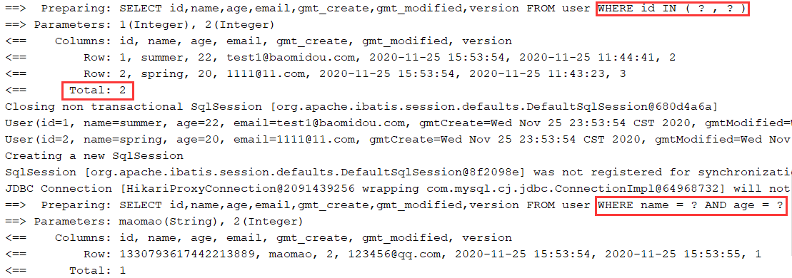

## 1. MyBatisPlus 入门

### 1.1 简介

[MyBatis-Plus](https://github.com/baomidou/mybatis-plus)（简称 MP）是一个 [MyBatis](http://www.mybatis.org/mybatis-3/) 的增强工具，在 MyBatis 的基础上只做增强不做改变，为简化开发、提高效率而生。它具有如下特性：

- **无侵入**：只做增强不做改变，引入它不会对现有工程产生影响，如丝般顺滑
- **损耗小**：启动即会自动注入基本 CURD，性能基本无损耗，直接面向对象操作
- **强大的 CRUD 操作**：内置通用 Mapper、通用 Service，仅仅通过少量配置即可实现单表大部分 CRUD 操作，更有强大的条件构造器，满足各类使用需求
- **支持 Lambda 形式调用**：通过 Lambda 表达式，方便的编写各类查询条件，无需再担心字段写错
- **支持主键自动生成**：支持多达 4 种主键策略（内含分布式唯一 ID 生成器 - Sequence），可自由配置，完美解决主键问题
- **支持 ActiveRecord 模式**：支持 ActiveRecord 形式调用，实体类只需继承 Model 类即可进行强大的 CRUD 操作
- **支持自定义全局通用操作**：支持全局通用方法注入（ Write once, use anywhere ）
- **内置代码生成器**：采用代码或者 Maven 插件可快速生成 Mapper 、 Model 、 Service 、 Controller 层代码，支持模板引擎，更有超多自定义配置等您来使用
- **内置分页插件**：基于 MyBatis 物理分页，开发者无需关心具体操作，配置好插件之后，写分页等同于普通 List 查询
- **分页插件支持多种数据库**：支持 MySQL、MariaDB、Oracle、DB2、H2、HSQL、SQLite、Postgre、SQLServer 等多种数据库
- **内置性能分析插件**：可输出 Sql 语句以及其执行时间，建议开发测试时启用该功能，能快速揪出慢查询
- **内置全局拦截插件**：提供全表 delete 、 update 操作智能分析阻断，也可自定义拦截规则，预防误操作


### 1.2 快速开始

1. **创建表**

   ```sql
   DROP TABLE IF EXISTS user;
   
   CREATE TABLE user
   (
   	id BIGINT(20) NOT NULL COMMENT '主键ID',
   	name VARCHAR(30) NULL DEFAULT NULL COMMENT '姓名',
   	age INT(11) NULL DEFAULT NULL COMMENT '年龄',
   	email VARCHAR(50) NULL DEFAULT NULL COMMENT '邮箱',
   	PRIMARY KEY (id)
   );
   
   INSERT INTO user (id, name, age, email) VALUES
   (1, 'Jone', 18, 'test1@baomidou.com'),
   (2, 'Jack', 20, 'test2@baomidou.com'),
   (3, 'Tom', 28, 'test3@baomidou.com'),
   (4, 'Sandy', 21, 'test4@baomidou.com'),
   (5, 'Billie', 24, 'test5@baomidou.com');
   ```

2. **添加依赖**

   ```xml
   <dependency>
       <groupId>mysql</groupId>
       <artifactId>mysql-connector-java</artifactId>
   </dependency>
   
   <dependency>
       <groupId>org.projectlombok</groupId>
       <artifactId>lombok</artifactId>
       <optional>true</optional>
   </dependency>
   
   <!-- 导入mybatis-plus后，不用再导入mybatis -->
   <dependency>
       <groupId>com.baomidou</groupId>
       <artifactId>mybatis-plus-boot-starter</artifactId>
       <version>3.4.1</version>
   </dependency>
   ```

3. **编写配置文件**

   ```properties
   # MySQL数据库连接配置（MySQL 8需要配置时区）
   spring.datasource.url=jdbc:mysql://localhost:3306/mybatis_plus?useSSL=false&useUnicode=true&characterEncoding=utf-8&serverTimezone=UTC
   spring.datasource.username=root
   spring.datasource.password=root
   # 配置日志，控制台输出SQL语句
   mybatis-plus.configuration.log-impl=org.apache.ibatis.logging.stdout.StdOutImpl
   ```

4. **编写代码**

   * 实体类

   ```java
   @Data	// Lombok注解
   public class User {
       private Long id;
       private String name;
       private Integer age;
       private String email;
   }
   ```

   * Mapper 类

   ```java
   // 继承BaseMapper，其中定义了一些基本的CRUD方法，类似JPA
   public interface UserMapper extends BaseMapper<User> {
   }
   ```

   * 启动类

   ```java
   @MapperScan("com.maomao.mybatisplus.mapper")	// 开启扫描mapper接口
   @SpringBootApplication
   public class MybatisplusApplication {
       public static void main(String[] args) {
           SpringApplication.run(MybatisplusApplication.class, args);
       }
   }
   ```

   * 测试

   ```java
   @SpringBootTest
   class MybatisplusApplicationTests {
       @Autowired
       private UserMapper userMapper;
   
       @Test
       public void testSelect() {
           // 查询所有用户，参数Wrapper是一个条件构造器，这里传入null
           List<User> userList = userMapper.selectList(null);
           userList.forEach(System.out::println);
       }
   }
   ```

   

### 1.3 注解

1. **@TableName**：表名注解

| 属性          | 类型    | 必须指定 | 默认值 | 描述                                                         |
| ------------- | ------- | -------- | ------ | ------------------------------------------------------------ |
| value         | String  | 否       | ""     | 表名                                                         |
| schema        | String  | 否       | ""     | schema                                                       |
| pGlobalPrefix | boolean | 否       | false  | 是否保持使用全局的 tablePrefix 的值(如果设置了全局 tablePrefix 且自行设置了 value 的值) |
| resultMap     | String  | 否       | ""     | xml 中 resultMap 的 id                                       |
| autoResultMap | boolean | 否       | false  | 是否自动构建 resultMap 并使用(如果设置 resultMap 则不会进行 resultMap 的自动构建并注入) |

关于`autoResultMap`的说明: mp会自动构建一个`ResultMap`并注入到 mybatis 里(一般用不上).下面讲两句: 因为mp底层是mybatis,所以一些mybatis的常识你要知道,mp只是帮你注入了常用crud到mybatis里 注入之前可以说是动态的(根据你entity的字段以及注解变化而变化),但是注入之后是静态的(等于你写在xml的东西) 而对于直接指定`typeHandler`,mybatis只支持你写在2个地方：

* 定义在resultMap里,只作用于select查询的返回结果封装
* 定义在`insert`和`update`sql的`#{property}`里的`property`后面(例:`#{property,typehandler=xxx.xxx.xxx}`),只作用于`设置值` 而除了这两种直接指定`typeHandler`,mybatis有一个全局的扫描你自己的`typeHandler`包的配置,这是根据你的`property`的类型去找`typeHandler`并使用. 


2. **@TableId**：主键注解

| 属性  | 类型   | 必须指定 | 默认值      | 描述       |
| ----- | ------ | -------- | ----------- | ---------- |
| value | String | 否       | ""          | 主键字段名 |
| type  | Enum   | 否       | IdType.NONE | 主键类型   |

| IdType 值         | 描述                                                         |
| ----------------- | ------------------------------------------------------------ |
| AUTO              | 数据库 ID 自增                                               |
| NONE              | 无状态，该类型为未设置主键类型（注解里等于跟随全局，全局里约等于 INPUT） |
| INPUT             | insert 前自行 set 主键值                                     |
| ASSIGN_ID         | 分配 ID，主键类型为 Number（Long和Integer）或 String（since 3.3.0），使用接口`IdentifierGenerator`的方法`nextId`，默认实现类为`DefaultIdentifierGenerator`雪花算法 |
| ASSIGN_UUID       | 分配 UUID，主键类型为 String（since 3.3.0），使用接口`IdentifierGenerator`的方法`nextUUID`（默认default方法） |
| ~~ID_WORKER~~     | 分布式全局唯一ID 长整型类型（请使用 `ASSIGN_ID`）            |
| ~~UUID~~          | 32 位 UUID 字符串（请使用 `ASSIGN_UUID`）                    |
| ~~ID_WORKER_STR~~ | 分布式全局唯一ID 字符串类型（请使用 `ASSIGN_ID`）            |

3. **@TableField**：字段注解（非主键）

| 属性             | 类型                         | 必须指定 | 默认值                   | 描述                                                         |
| ---------------- | ---------------------------- | -------- | ------------------------ | ------------------------------------------------------------ |
| value            | String                       | 否       | ""                       | 数据库字段名                                                 |
| el               | String                       | 否       | ""                       | 映射为原生 `#{ ... }` 逻辑,相当于写在 xml 里的 `#{ ... }` 部分 |
| exist            | boolean                      | 否       | true                     | 是否为数据库表字段                                           |
| condition        | String                       | 否       | ""                       | 字段 `where` 实体查询比较条件,有值设置则按设置的值为准,没有则为默认全局的 `%s=#{%s}`,[参考](https://github.com/baomidou/mybatis-plus/blob/3.0/mybatis-plus-annotation/src/main/java/com/baomidou/mybatisplus/annotation/SqlCondition.java) |
| update           | String                       | 否       | ""                       | 字段 `update set` 部分注入, 例如：update="%s+1"：表示更新时会set version=version+1(该属性优先级高于 `el` 属性) |
| insertStrategy   | Enum                         | N        | DEFAULT                  | 举例：NOT_NULL: `insert into table_a(<if test="columnProperty != null">column</if>) values (<if test="columnProperty != null">#{columnProperty}</if>)` |
| updateStrategy   | Enum                         | N        | DEFAULT                  | 举例：IGNORED: `update table_a set column=#{columnProperty}` |
| whereStrategy    | Enum                         | N        | DEFAULT                  | 举例：NOT_EMPTY: `where <if test="columnProperty != null and columnProperty!=''">column=#{columnProperty}</if>` |
| fill             | Enum                         | 否       | FieldFill.DEFAULT        | 字段自动填充策略                                             |
| select           | boolean                      | 否       | true                     | 是否进行 select 查询                                         |
| keepGlobalFormat | boolean                      | 否       | false                    | 是否保持使用全局的 format 进行处理                           |
| jdbcType         | JdbcType                     | 否       | JdbcType.UNDEFINED       | JDBC类型 (该默认值不代表会按照该值生效)                      |
| typeHandler      | Class<? extends TypeHandler> | 否       | UnknownTypeHandler.class | 类型处理器 (该默认值不代表会按照该值生效)                    |
| numericScale     | String                       | 否       | ""                       | 指定小数点后保留的位数                                       |

关于`jdbcType`和`typeHandler`以及`numericScale`的说明：`numericScale`只生效于 update 的sql. `jdbcType`和`typeHandler`如果不配合`@TableName#autoResultMap = true`一起使用,也只生效于 update 的sql. 对于`typeHandler`如果你的字段类型和set进去的类型为`equals`关系,则只需要让你的`typeHandler`让Mybatis加载到即可,不需要使用注解

| FieldStrategy 值 | 描述                                                      |
| ---------------- | --------------------------------------------------------- |
| IGNORED          | 忽略判断                                                  |
| NOT_NULL         | 非NULL判断                                                |
| NOT_EMPTY        | 非空判断(只对字符串类型字段,其他类型字段依然为非NULL判断) |
| DEFAULT          | 追随全局配置                                              |

| FieldFill 值  | 描述                 |
| ------------- | -------------------- |
| DEFAULT       | 默认不处理           |
| INSERT        | 插入时填充字段       |
| UPDATE        | 更新时填充字段       |
| INSERT_UPDATE | 插入和更新时填充字段 |

4. **@Version**：乐观锁注解、标记 `@Verison` 在字段上

5. **@EnumValue**：通枚举类注解，注解在枚举字段上

6. **@TableLogic**：表字段逻辑处理注解（逻辑删除）

| 属性   | 类型   | 必须指定 | 默认值 | 描述         |
| ------ | ------ | -------- | ------ | ------------ |
| value  | String | 否       | ""     | 逻辑未删除值 |
| delval | String | 否       | ""     | 逻辑删除值   |

7. **@SqlParser**：租户注解，支持method上以及mapper接口上

| 属性   | 类型    | 必须指定 | 默认值 | 描述                                                         |
| ------ | ------- | -------- | ------ | ------------------------------------------------------------ |
| filter | boolean | 否       | false  | true: 表示过滤SQL解析，即不会进入ISqlParser解析链，否则会进解析链并追加例如tenant_id等条件 |

8. **@KeySequence**：序列主键策略 `oracle`

| 属性  | 类型   | 必须指定 | 默认值     | 描述                                                         |
| ----- | ------ | -------- | ---------- | ------------------------------------------------------------ |
| value | String | 否       | ""         | 序列名                                                       |
| clazz | Class  | 否       | Long.class | id的类型, 可以指定String.class，这样返回的Sequence值是字符串"1" |


## 2. 插入与更新

### 2.1 插入操作

```java
@Test
public void testInsert() {
    User user = new User();
    user.setName("maomao");
    user.setAge(18);
    user.setEmail("123456@qq.com");

    // 自动生成并回填ID，返回受影响的行数
    int insert = userMapper.insert(user);
    System.out.println("insert = " + insert);
    System.out.println("user = " + user);
}
```


 

### 2.2 主键生成策略

数据库插入时，默认采用 **snowflake（雪花算法）**来生成主键 ID，该算法是 Twitter 开源的分布式 id 生成算法。下面我们配置主键自增的策略：首先将数据库 `id` 字段设置为自增，然后在 `User` 实体类 `id` 字段加上注解`@TableId(type = IdType.AUTO)`

```java
// 枚举类IdType源码
public enum IdType {
    AUTO(0),		// 数据库ID自增
    NONE(1),		// 无状态，该类型为未设置主键类型
    INPUT(2),		// insert前自行设置主键值
    ASSIGN_ID(3),	// 雪花算法分配ID，主键类型为Number(Long和Integer)或String
    ASSIGN_UUID(4),	// 分配UUID，主键类型为String
}
```


### 2.3 更新操作

```java
@Test
public void testUpdate() {
    User user = new User();
    user.setId(1L);
    user.setName("abc");
    user.setAge(22);

    int update = userMapper.updateById(user);
    System.out.println("update = " + update);
}
```


### 2.4 自动填充

《阿里巴巴开发手册》中强制**表必备的三个字段：id、gmt_create、gmt_modified**。其中 id 必为主键，类型为bigint unsigned、单表时自增、步长为1。gmt_create、gmt_modified的类型均为 datetime 类型，前者现在时表示主动式创建，后者过去分词表示被动式更新。

一种方式是在创建数据库时，将 gmt_create、gmt_modified 的默认值设置为 `CURRENT_TIMESTAMP `，并将 gmt_modified 设置为自动更新。类似下面的 SQL 语句，这种方式会修改数据库，只适合在最初创建数据库的时候使用

```sql
ALTER TABLE `user`
MODIFY COLUMN `gmt_create` datetime NULL DEFAULT CURRENT_TIMESTAMP COMMENT '创建时间';

ALTER TABLE `user`
MODIFY COLUMN `gmt_modified` datetime NULL DEFAULT CURRENT_TIMESTAMP ON UPDATE CURRENT_TIMESTAMP COMMENT '更新时间';
```

另外一种方式是在代码层面进行设置，假设已经有了 gmt_create、gmt_modified 字段，但未设置默认值和自动更新。首先在 `User` 实体类上增加字段属性及相关注解，然后编写处理器来处理，最后执行插入、更新操作。

```java
@TableField(fill = FieldFill.INSERT)
private Date gmtCreate;
@TableField(fill = FieldFill.INSERT_UPDATE)
private Date gmtModified;
```

```java
@Slf4j
@Component  // 把处理器加到IOC容器中
public class MyMetaObjectHandler implements MetaObjectHandler {
    @Override   // 插入时的填充策略
    public void insertFill(MetaObject metaObject) {
        log.info("start insert fill ...");
        this.setFieldValByName("gmtCreate", LocalDateTime.now(), metaObject);
        this.setFieldValByName("gmtModified", LocalDateTime.now(), metaObject);
    }

    @Override   // 更新时的填充策略
    public void updateFill(MetaObject metaObject) {
        log.info("start update fill ...");
        this.setFieldValByName("gmtModified", LocalDateTime.now(), metaObject);
    }
}
```


### 2.5 乐观锁

乐观锁是相对悲观锁来说的，它认为数据在一般情况下不会造成冲突，所以**在访问记录前不会加排它锁，而是在进行数据提交更新时，才会正式对数据冲突与否进行检测**。乐观锁并不会使用数据库提供的锁机制，一般在表中添加 version 字段或者使用业务状态来实现。乐观锁直到提交时才锁定，所以不会产生任何死锁。

乐观锁的实现方式：**取出记录时，获取当前 version；更新时，带上这个 version；执行更新时，`set version = new_version where version = old_version`；如果 version 不对，就更新失败**。

下面我们进行演示：首先给 `User` 实体类新增 version 字段（默认值为1），然后给实体类增加对应字段属性及相关注解，最后注册组件。

```java
@Version
private Integer version;
```

```java
@MapperScan("com.maomao.mybatisplus.mapper")
@EnableTransactionManagement
@Configuration
public class MyBatisPlusConfig {
    @Bean
    public MybatisPlusInterceptor optimisticLockerInnerInterceptor() {
        MybatisPlusInterceptor interceptor = new MybatisPlusInterceptor();
        // 乐观锁插件
        interceptor.addInnerInterceptor(new OptimisticLockerInnerInterceptor());
        // 分页插件
        interceptor.addInnerInterceptor(new PaginationInnerInterceptor());
        return interceptor;
    }
}
```

```java
@Test
public void testOptimisticLocker() {
    // 模拟线程1
    User user1 = userMapper.selectById(1L);
    user1.setName("spring");

    // 模拟线程2
    User user2 = userMapper.selectById(1L);
    user2.setName("summer");
    userMapper.updateById(user2);

    userMapper.updateById(user1);
}
```


## 3. 查询与删除

### 3.1 查询操作

```java
@Test
public void testSelect() {
    // 批量查询
    List<User> users = userMapper.selectBatchIds(Arrays.asList(1, 2));
    users.forEach(System.out::println);
    
    // 条件查询，使用map操作
    Map<String, Object> map = new HashMap<>();
    map.put("name", "maomao");
    map.put("age", 2);
    users = userMapper.selectByMap(map);
    users.forEach(System.out::println);
}
```




### 3.2 分页查询

```java
@Test
public void testPage() {
    // 参数分别表示当前页、页面大小
    Page<User> page = new Page<>(1, 5);
    userMapper.selectPage(page, null);

    System.out.println(page.getTotal());
    page.getRecords().forEach(System.out::println);
}
```


### 3.3 删除操作

```java
@Test
public void testDelete() {
    userMapper.deleteById(1331490904090976260L);
    userMapper.deleteBatchIds(Arrays.asList(1L, 1331490904090976258L));
    Map<String, Object> map = new HashMap<>();
    map.put("name", "peter");
    userMapper.deleteByMap(map);
}
```


### 3.4 逻辑删除

逻辑删除是为了方便数据恢复和保护数据本身价值等等的一种方案，它不是真正的删除（物理删除），而是将表中将对应的状态字段做**修改操作**。比如，0 表示未删除，1 表示删除，在逻辑上是被删除的，但数据本身依然存在数据库中。

下面我们进行演示：首先给 `User` 实体类新增 deleted 字段（默认值为0），然后给实体类增加对应字段属性及相关注解，最后在全局配置文件中进行配置。

```java
@TableLogic
private Integer deleted;
```

```properties
# 全局逻辑删除的实体字段名(since 3.3.0，配置后可以不添加注解)
# mybatis-plus.global-config.db-config.logic-delete-field=deleted
# 逻辑已删除值(默认为 1)
mybatis-plus.global-config.db-config.logic-delete-value=1
# 逻辑未删除值(默认为 0)
mybatis-plus.global-config.db-config.logic-not-delete-value=0
```


### 3.5 条件构造器

```java
@Test
public void testWrapper() {
    // 继承自AbstractWrapper，包含了很多设置查询条件的方法
    QueryWrapper<User> wrapper = new QueryWrapper<>();
    wrapper.isNotNull("name")
            .le("age", 18)
            .notLike("name", "m");
    List<User> users = userMapper.selectList(wrapper);
    users.forEach(System.out::println);
}
```


## 参考

1. [官方文档](https://baomidou.com/guide/)