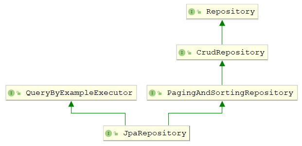
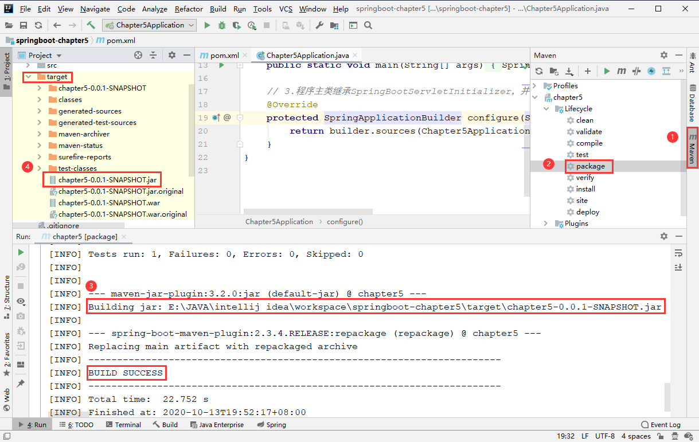
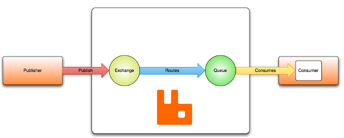
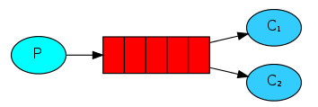
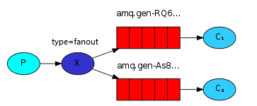
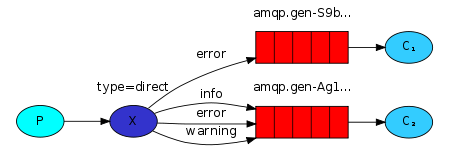
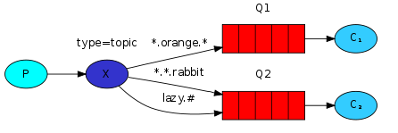
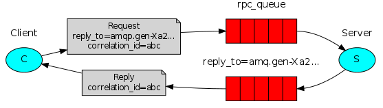

## 1. 开发入门

### 1.1 Spring Boot 概述

Spring Boot 框架本身并不提供 Spring 框架的核心特性以及扩展功能，只是用于快速、敏捷地开发新一代基于 Spring 框架的应用，并且在开发过程中大量使用**“约定大于配置”**的思想来摆脱 Spring 框架中各种复杂的手动配置，同时衍生出了Java Config（取代传统 XML 配置文件的 Java 配置类）这种优秀的配置方式。也就是说，Spring Boot 并不是替代 Spring 框架的解决方案，而是和 Spring 框架紧密结合用于提升 Spring 开发者体验的工具，同时还集成了大量常用的第三方库配置。使用 Spring Boot 开发程序时，几乎是**开箱即用**，大部分 Spring Boot 应用只需要少量配置就能完成相应的功能，促使开发者专注于业务逻辑的实现。


### 1.2 单元测试与热部署

#### 1.2.1 单元测试

1. **添加测试依赖启动器**

   ```xml
   <!-- 测试类依赖 -->
   <dependency>
       <groupId>org.springframework.boot</groupId>
       <artifactId>spring-boot-starter-test</artifactId>
       <scope>test</scope>
   </dependency>
   ```

2. **编写单元测试类和测试方法**

   ```java
   @RunWith(SpringRunner.class)    // 测试运行器，并加载Spring Boot测试注解
   @SpringBootTest     // 标记单元测试类，并加载项目的上下文环境ApplicationContext
   class Chapter1ApplicationTests {
       @Test
       void contextLoads() {
           // ...
       }
   }
   ```

#### 1.2.2 热部署

1. **添加热部署依赖启动器**

   ```xml
   <!-- 热部署依赖 -->
   <dependency>
       <groupId>org.springframework.boot</groupId>
       <artifactId>spring-boot-devtools</artifactId>
   </dependency>
   ```

2. **IDEA 工具热部署设置**

   【File】->【Settings】->【Build, Execution, Deployment】->【Compiler】->右侧勾选【Build project automatically】->【OK】

   在项目任意页面中使用组合键【Ctrl+Shift+Alt+/】，打开【Registry】界面，在列表中找到 “compiler.automake.allow.when.app.running”，勾选对应的 Value值，最后单击【Close】

   

### 1.3 Spring Boot 原理分析

#### 1.3.1 依赖管理

在 Spring Boot 中，项目 pom.xml 文件有两个核心依赖，分别是 `spring-boot-starter-parent` 和 `spring-boot-starter-web` ，关于这两个依赖的相关介绍如下：

1. **spring-boot-starter-parent 依赖**

   ```xml
   <!-- spring Boot 父项目依赖管理 -->
   <parent>
       <groupId>org.springframework.boot</groupId>
       <artifactId>spring-boot-starter-parent</artifactId>
       <version>2.3.4.RELEASE</version>
       <relativePath/> 
   </parent>
   ```

   将 `spring-boot-starter-parent` 依赖作为 Spring Boot 项目的统一父项目依赖管理，并将项目版本号统一为 2.3.4.RELEASE，该版本号根据实际开发需求是可以修改的。

   使用“Ctrl + 鼠标左键”进入 `spring-boot-starter-parent` 底层源文件，发现其有一个父依赖 `spring-boot-dependencies` ，继续查看 `spring-boot-dependencies` 底层源文件，核心代码如下：

   ```xml
   <properties>
       <activemq.version>5.15.13</activemq.version>
       <junit.version>4.13</junit.version>
       <mysql.version>8.0.21</mysql.version>
       <thymeleaf.version>3.0.11.RELEASE</thymeleaf.version>
       <tomcat.version>9.0.38</tomcat.version>
       ...
   </properties>
   ```

   可以看出，该文件通过 `<properties> ` 标签对一些常用技术框架的依赖文件进行了统一版本号管理，如 activemq、mysql、tomcat 等，都有与 Spring Boot 2.3.4 版本匹配的版本，**这也是 pom.xml 引入依赖文件不需要标注依赖文件版本号的原因**。如果 pom.xml 引入的依赖文件不是 `spring-boot-starter-parent` 管理的，那么在引入依赖文件时，就需要使用 `<version>` 标签指定依赖文件的版本号。

2. **spring-boot-starter-web 依赖**

   查看 `spring-boot-starter-web` 依赖文件源码，核心代码如下：

   ```xml
   <dependencies>
       <dependency>
         <groupId>org.springframework.boot</groupId>
         <artifactId>spring-boot-starter</artifactId>
         <version>2.3.4.RELEASE</version>
         <scope>compile</scope>
       </dependency>
       <dependency>
         <groupId>org.springframework.boot</groupId>
         <artifactId>spring-boot-starter-json</artifactId>
         <version>2.3.4.RELEASE</version>
         <scope>compile</scope>
       </dependency>
       <dependency>
         <groupId>org.springframework.boot</groupId>
         <artifactId>spring-boot-starter-tomcat</artifactId>
         <version>2.3.4.RELEASE</version>
         <scope>compile</scope>
       </dependency>
       <dependency>
         <groupId>org.springframework</groupId>
         <artifactId>spring-web</artifactId>
         <version>5.2.9.RELEASE</version>
         <scope>compile</scope>
       </dependency>
       <dependency>
         <groupId>org.springframework</groupId>
         <artifactId>spring-webmvc</artifactId>
         <version>5.2.9.RELEASE</version>
         <scope>compile</scope>
       </dependency>
   </dependencies>
   ```

   可以看出 `spring-boot-starter-web` 依赖启动器的主要作用是**提供 Web 开发场景所需的底层所有依赖文件**，它对 Web 开发场景所需的依赖文件进行了统一管理。所以在引入 `spring-boot-starter-web` 依赖启动器后，就可以实现 Web 场景开发，而不需要额外导入 Tomcat 服务器等其他依赖文件。当然，这些引入的依赖文件的版本号还是由 `spring-boot-starter-parent` 父依赖进行统一管理。

   

#### 1.3.2 自动配置

Spring Boot 应用的启动入口是 **@SpringBootApplication 注解**标注类中的 main() 方法，它能够扫描 Spring 组件并自动配置 Spring Boot，其核心代码如下：

```java
@Target({ElementType.TYPE})
@Retention(RetentionPolicy.RUNTIME)
@Documented
@Inherited
@SpringBootConfiguration	// 标注该类为配置类
@EnableAutoConfiguration	// 启动自动配置功能
@ComponentScan(				// 包扫描器
    excludeFilters = {@Filter(
    type = FilterType.CUSTOM,
    classes = {TypeExcludeFilter.class}
), @Filter(
    type = FilterType.CUSTOM,
    classes = {AutoConfigurationExcludeFilter.class}
)}
)
public @interface SpringBootApplication {
    // ...
}
```

可以看出，@SpringBootApplication 是一个组合注解，包含 @SpringBootConfiguration、@EnableAutoConfiguration、@ComponentScan 3个核心注解，下面分别进行介绍：

1. **@SpringBootConfiguration**

   ```java
   @Target({ElementType.TYPE})
   @Retention(RetentionPolicy.RUNTIME)
   @Documented
   @Configuration
   public @interface SpringBootConfiguration {
       // ...
   }
   ```

   可以看出，@SpringBootConfiguration 注解内有一个核心注解 @Configuration，该注解是 Spring 框架提供的，表示当前类是一个配置类（XML 配置文件的注解形式），并可以被组件扫描器扫描。由此可见，**@SpringBootConfiguration 注解的作用与 @Configuration 注解相同，只不过被 Spring Boot 进行了重新封装命名而已**。

2. **@EnableAutoConfiguration**

   ```java
   @Target({ElementType.TYPE})
   @Retention(RetentionPolicy.RUNTIME)
   @Documented
   @Inherited
   @AutoConfigurationPackage		// 自动配置包
   @Import({AutoConfigurationImportSelector.class})	// 自动配置类扫描导入
   public @interface EnableAutoConfiguration {
       // ...
   }
   ```

   @EnableAutoConfiguration 表示开启自动配置功能，该注解是 Spring Boot 框架最重要的注解。从源码可以看出，它是一个组合注解，主要包括 @AutoConfigurationPackage 和 @Import 两个核心注解。

   ```java
   @Target({ElementType.TYPE})
   @Retention(RetentionPolicy.RUNTIME)
   @Documented
   @Inherited
   @Import({Registrar.class})
   public @interface AutoConfigurationPackage {
       // ...
   }
   ```

   可以看出 @AutoConfigurationPackage 注解是由 @Import 注解实现的，作用是向容器导入注册的所有组件，导入的组件由 `Registrar` 类决定，该类有一个 registerBeanDefinitions() 方法，可以**获取项目主程序启动类所在根目录**，从而指定后续组件扫描器要扫描的包位置。因此，在定义项目包结构时，**项目主程序启动类要定义在最外层的根目录位置**，然后在根目录位置下建立子包和类进行业务开发。

   而 `AutoConfigurationImportSelector` 类则有一个 getAutoConfigurationEntry() 方法，其主要作用是筛选出当前项目环境需要启动的自动配置类 xxxAutoConfiguration，从而实现当前项目运行所需的自动配置环境。

3. **@ComponentScan**

   @ComponentScan 注解是一个组件包扫描器，用于将指定包中的注解类自动装配到 Spring 的 Bean 容器中。**该注解具体扫描的包的根路径由 Spring Boot 项目主程序启动类所在包位置决定**，在扫描过程中，由 @AutoConfigurationPackage 注解进行解析，从而得到 Spring Boot 项目主程序启动类所在包的具体位置。


## 2. 核心配置与注解

### 2.1 全局配置文件

全局配置文件能够对一些默认配置值进行修改。Spring Boot 使用一个 `application.properties` 或 `applicaion.yaml` 的文件作为全局配置文件，该文件存放在 src/main/resource 目录或类路径的 /config，一般会选择 resource 目录。

1. **application.properties 配置文件**

   ```java
   @Component  // 用于将Person类作为Bean注入Spring容器中
   @ConfigurationProperties(prefix = "person") // 将配置文件以person开头的属性注入该类中
   public class Person {
       private int id;
       private String name;
       private List hobby;
       private String[] family;
       private Map map;
       private Pet pet;
       
       // getter和setter方法
   }
   ```

   ```properties
   # 对实体类对象Person进行属性设置
   # properties的优先级高于yaml
   person.id = 1
   person.name = tom
   person.hobby = play,read,sleep
   person.family = father,mother
   person.map.k1 = v1
   person.map.k2 = v2
   person.pet.type = dog
   person.pet.name = kity
   ```

   注：在编写 application.properties 配置文件时，由于要配置的 Person 对象属性是自定义的，Spring Boot 无法识别，所以不会有任何书写提示，可以在 pom.xml 文件中添加一个配置处理器依赖，添加后，需要重新 build 方可生效。

   ```xml
   <dependency>
       <groupId>org.springframework.boot</groupId>
       <artifactId>spring-boot-configuration-processor</artifactId>
   </dependency>
   ```

   

2. **application.yaml 配置文件**

   yaml 文件格式是 Spring Boot 支持的一种 JSON 超集文件格式，它以数据为核心，是一种更为直观且易被计算机识别的数据序列化格式。它**使用 `key: vaule` 格式配置属性（注意空格），使用缩进控制层级关系**。

   * value 值为：
   * value 值为数组和单列集合
   * value 值为Map集合和对象

   ```yaml
   # 对实体类对象Person进行属性设置
   # value值包括了普通数据类型、List、数组、Map和对象
   person:
     id: 2
     name: 张三
     hobby: [sing, read, sleep]
     family: [father, mother]
     map: {k1: v1, k2: v2}
     pet: {type: cat, name: tom}
   ```


### 2.2 配置文件属性值的注入

1. **使用 @ConfigurationProperties 注入属性**

   @ConfigurationProperties 注解可以将配置文件中的自定义属性值**批量注入**某个 Bean 对象的多个属性中，示例如上。

2. **使用 @Value 注入属性**

   @Value 是 Spring 框架提供的，用来读取配置文件中的属性值并**逐个注入** Bean 对象的对应属性中，Spring Boot 框架对该注解进行了默认继承，实例如下：

   ```java
   @Component
   public class Person {
       @Vaule("${person.id}")
       private int id;
   }
   ```

3. **两种注解对比分析**

   |      对比点      | @ConfigurationProperties |          @Value          |
   | :--------------: | :----------------------: | :----------------------: |
   |     底层框架     |       Spring Boot        |          Spring          |
   |       功能       | 批量注入配置文件中的属性 | 单个注入配置文件中的属性 |
   |   setter 方法    |           需要           |          不需要          |
   | 复杂类型属性注入 |           支持           | 不支持，只能注入基本类型 |
   |     松散绑定     |           支持           |          不支持          |
   | JSR303 数据检验  |           支持           |          不支持          |
   |   SpEL 表达式    |          不支持          |           支持           |

   松散绑定：假设 Person 类有一个属性 firsetName，那么可以使用如下配置方式：

   ```properties
   person.firstName=tom	// 标准写法，对应Person类属性
   person.first-name=tom	// 使用横线“-”分隔多个单词，还可以使用下划线“_”
   PERSON.FIRST_NAME=tom	// 使用大写格式，推荐常量属性配置
   ```

   JSR303 数据检验：用于校验配置文件中注入对应 Bean 属性的值是否符合相关值的规则

   ```java
   @Validated	// 引入Spring框架支持的数据校验规则
   public class Example {
       @Email	// 对属性进行规则验证
       private String email;
   }
   ```

   SpEL 表达式：@Value 支持直接使用 SpEL 表达式语法进行属性注入，即`#{xx}`

   ```java
   @Value("#{5*2}")
   private int id;
   ```

   

### 2.3 自定义配置

几乎所有的配置都可以写在全局配置文件中，Spring Boot 会自动加载全局配置文件，从而免除我们手动加载。但是，如果我们自定义配置文件，Spring Boot 是无法识别这些配置文件的，需要进行手动加载。

1. **使用 @PropertySource 加载配置文件**

   ```java
   @Configuration  // 自定义配置类，该类会作为Bean组件添加到Spring容器中
   @PropertySource("classpath:test.properties")    // 指定自定义配置文件位置和名称
   @EnableConfigurationProperties(MyProperties.class) 	// 开启对应配置类的属性注入功能，如果使用了@Component注解而非@Configuration，那么该注解可以省略
   @ConfigurationProperties(prefix = "test")   // 指定配置文件注入属性的前缀
   public class MyProperties {
       private int id;
       private String name;
   
       // getter和setter方法
   }
   ```

2. **使用 @ImportResource 加载 XML 配置文件**

   传统的 Spring 项目配置主要基于 XML 文件，Spring Boot 框架在其基础上进行了改进，默认不再使用 XML 文件配置项目，且 XML 配置文件不会加载到 Spring 容器中。如果希望将外部的 XML 文件加载到程序中，可以在项目主程序启动类上使用 @ImportResource 注解

   ```java
   @ImportResource("classpath:beans.xml")  // 加载自定义的XML配置文件位置
   @SpringBootApplication
   public class Chapter2Application {
       public static void main(String[] args) {
           SpringApplication.run(Chapter2Application.class, args);
       }
   }
   ```

3. **使用 @Configuration 编写自定义配置类**

   在 Spring Boot 开发中，“约定大于配置”的思想，更推荐使用配置类的方式代替 XML 配置。使用 @Configuration 注解可以指定配置类，其作用和 XML 配置是一样的

   ```java
   @Configuration  // 定义该类是一个配置类
   public class MyConfig {
       @Bean   	// 将返回值对象作为组件添加到spring容器中，id默认为方法名
       public MyService myService(){
           return new MyService();
       }
   }
   ```

   

### 2.4 Profile 多环境配置

在实际开发中，应用程序通常需要部署到不同的运行环境中，如**开发环境、测试环境、生成环境**。Spring Boot 框架提供了两种多环境配置的方式：Profile 文件多环境配置和 @Profile 注解多环境配置

1. **使用 Profile 文件多环境配置**

   配置文件名必须满足 `application-{profile}.properties` 的格式，其中 `{profile}` 对应具体的环境标识。如下所示，编写对应环境的配置文件：

   ```
   application-dev.properties		// 开发环境配置文件
   application-test.properties		// 测试环境配置文件
   application-prod.properties		// 生产环境配置文件
   ```

   然后在控制台使用命令 `java -jar xxx.jar --spring.profiles.active=dev` 进行激活，还可以在项目全局配置文件中进行配置，如下所示：

   ```properties
   # 指定要激活的profile多环境配置文件
   spring.profiles.active=dev
   ```

2. **使用 @Profile 注解多环境配置**

   @Profile 注解主要作用于类，并通过 value 属性指定配置环境，它同样需要在全局配置文件中激活，且不会与 Profile 文件相互干扰

   ```java
   @Configuration
   @Profile("dev")	// 指定多环境配置类标识，其中DBConnector是一个自定义接口
   public class DevDBConnector implements DBConnector {
       @Override
       public void configure() {
           System.out.println("数据库配置环境dev");
       }
   }
   ```

   


## 3. 数据访问

### 3.1 Spring Boot 数据访问概述

Spring Data 是 Spring 提供的一个用于简化数据库访问、支持云服务的开源框架。它是一个伞形项目，包含了大量关系型数据库及非关系型数据库的数据访问解决方案，其设计目的是使我们可以快速使用各种数据访问技术。**Spring Boot 默认采用整合 Spring Data 的方式统一处理数据访问层**，通过添加大量自动配置，引入各种数据访问模板 xxxTemplate 以及统一的 Repository 接口，从而达到简化数据访问层的操作。

下面是 Spring Boot 提供的各种依赖启动器，注意 Spring Boot 没有提供 MyBatis 场景依赖，但是 MyBatis 开发团队自己适配了 Spring Boot。

| 名称                             | 描述                                               |
| -------------------------------- | -------------------------------------------------- |
| spring-boot-starter-data-jpa     | Spring Data JPA 与 Hibernate 的启动器              |
| spring-boot-starter-data-mongodb | MongoDB 与 Spring Data MongoDB 的启动器            |
| spring-boot-starter-data-neo4j   | Neo4j 与 Spring Data Neo4j 的启动器                |
| spring-boot-starter-data-redis   | Redis 与 Spring Data Redis 和 Jedis 客户端的启动器 |


### 3.2 Spring Boot 整合 MyBatis

1. **引入依赖启动器**

   ```xml
   <!-- mybatis模块依赖 -->
   <dependency>
       <groupId>org.mybatis.spring.boot</groupId>
       <artifactId>mybatis-spring-boot-starter</artifactId>
       <version>2.1.3</version>
   </dependency>
   
   <!-- mysql模块依赖 -->
   <dependency>
       <groupId>mysql</groupId>
       <artifactId>mysql-connector-java</artifactId>
       <scope>runtime</scope>
   </dependency>
   ```

2. **编写配置文件**

   ```properties
   # MySQL数据库连接配置
   spring.datasource.url=jdbc:mysql://localhost:3306/springbootdata?serverTimezone=UTC
   spring.datasource.username=root
   spring.datasource.password=root
   # 开启驼峰命名匹配映射（如数据库列是a_id，类属性却是aId）
   mybatis.configuration.map-underscore-to-camel-case=true
   ```

3. **配置数据源（可选）**

   Spring Boot 1.x 版本默认使用的是 tomcat.jdbc 数据源，Spring Boot 2.x 版本默认使用的是 hikari 数据源。如果要使用其他数据源，还需要进行额外配置。以阿里巴巴的 Druid 数据源为例：

   * 引入依赖启动器，该启动器是阿里巴巴企业自己适配的

     ```xml
     <!-- druid模块依赖 -->
     <dependency>
         <groupId>com.alibaba</groupId>
         <artifactId>druid-spring-boot-starter</artifactId>
         <version>1.1.10</version>
     </dependency>
     ```

   * 配置运行参数，有些参数实际上在 Druid 数据源启动器内部已经初始化了

     ```properties
     # 添加并配置第三方数据源Druid（可以使用默认设置）
     spring.datasource.type=com.alibaba.druid.pool.DruidDataSource
     spring.datasource.druid.initial-size=20
     spring.datasource.druid.min-idle=10
     spring.datasource.druid.max-active=100
     ```

   * 编写数据源配置类，将配置文件中的属性值进行注入

     ```java
     @Configuration
     public class DataSourceConfig {
         @Bean
         @ConfigurationProperties(prefix = "spring.datasource")
         public DataSource getDruid(){
             return new DruidDataSource();
         }
     }
     ```

4. **使用注解整合（适合简单的 CRUD 操作）**

   ```java
   @Mapper
   public interface CommentMapper {
       @Select("select * from t_comment where id=#{id}")
       Comment findById(Integer id);
   
       @Insert("insert into t_comment(content, author, a_id) values (#{content}, #{author}, #{aId})")
       int insertComment(Comment comment);
   
       @Update("update t_comment set content=#{content} where id=#{id}")
       int updateComment(Comment comment);
   
       @Delete("delete from t_comment where id=#{id}")
       int deleteComment(Integer id);
   }
   ```

5. **使用配置文件整合（适合复杂的 CRUD 操作）**

   * 创建 Mapper 接口文件，该文件位于 com.example.domain 包下

     ```java
     @Mapper
     public interface ArticleMapper {
         public Article selectArticle(Integer id);
     }
     ```

   * 创建 XML 配置文件，该文件位于 resources 目录下的 mapper 包下

     ```xml
     <?xml version="1.0" encoding="UTF-8" ?>
     <!DOCTYPE mapper
             PUBLIC "-//mybatis.org//DTD Mapper 3.0//EN"
             "http://mybatis.org/dtd/mybatis-3-mapper.dtd">
     <mapper namespace="com.example.mapper.ArticleMapper">
         <select id="selectArticle" resultMap="articleWithComment">
            SELECT a.*,c.id c_id,c.content c_content,c.author
            FROM t_article a,t_comment c
            WHERE a.id=c.a_id AND a.id = #{id}
         </select>
         <resultMap id="articleWithComment" type="Article">
             <id property="id" column="id" />
             <result property="title" column="title" />
             <result property="content" column="content" />
             <collection property="commentList" ofType="Comment">
                 <id property="id" column="c_id" />
                 <result property="content" column="c_content" />
                 <result property="author" column="author" />
             </collection>
         </resultMap>
     </mapper>
     ```

   * 配置 XML 映射文件路径

     ```properties
     # 配置MyBatis的XML配置文件路径
     mybatis.mapper-locations=classpath:mapper/*.xml
     # 配置XML映射文件中指定的实体类别名路径
     mybatis.type-aliases-package=com.example.domain
     ```

     

### 3.3 Spring Boot 整合 JPA

1. **引入依赖启动器**

   ```xml
   <!-- jpa模块依赖 -->
   <dependency>
       <groupId>org.springframework.boot</groupId>
       <artifactId>spring-boot-starter-data-jpa</artifactId>
   </dependency>
   ```

2. **编写实体类**

   ```java
   @Entity(name = "t_comment") // 设置ORM实体类，并指定映射的表名
   public class Discuss {
       @Id     // 表明映射对应的主键id
       @GeneratedValue(strategy = GenerationType.IDENTITY) // 设置主键自增策略（可省略）
       private Integer id;
       
       private String content;
       private String author;
       
       @Column(name = "a_id")  // 指定映射的表字段名
       private Integer aId;
    
       // getter和setter方法
   }
   ```

3. **编写 Repository 接口**

   ```java
   public interface DiscussRepository extends JpaRepository<Discuss, Integer> {
       // 1.查询author非空的Discuss评论集合
       // 该方法没有任何注解，属于JPA支持的方法名关键字查询方式
       List<Discuss> findByAuthorNotNull();
   
       // 2.根据文章id分页查询Discuss评论集合
       @Query("select c from t_comment c where c.aId = ?1")
       List<Discuss> getDiscussPaged(Integer aid, Pageable pageable);
   
       // 3.根据文章id分页查询Discuss评论集合（MySQL可设置是否区分大小写，这里默认是不区分）
       // 使用@Query注解引入SQL语句，与上一个的区别是，设置了使用原生的SQL语句
       @Query(value = "select * from t_comment where a_Id = ?1", nativeQuery = true)
       List<Discuss> getDiscussPaged2(Integer aid, Pageable pageable);
   
       // 4.根据评论id修改评论作者author
       // 针对数据的变更操作（修改、删除），都要加上@Transactional和@Modifying两个注解
       @Transactional	// 表示支持事务，否则会抛出异常
       @Modifying		// 表示支持数据变更
       @Query("update t_comment c set c.author = ?1 where c.id = ?2")
       int updateDiscuss(String author, Integer id);
   }
   ```

   使用 Spring Boot JPA 自定义 Repository 接口，必须继承 XXRepository<T, ID> 接口，**其中 T 代表要操作的实体类，ID 代表实体类主键数据类型**。示例中选择了继承 `JpaRepository` 接口，其继承结构如下：

   

   * `Repository`：用于自定义 Repository 接口的顶级父接口，该接口中没有声明任何方法
   * `CrudRepository`：继承了 `Repository` 接口，包含一些基本的 CRUD 方法
   * `PagingAndSortingRepository`：继承了 `CrudRepository` 接口，同时提供了分页和排序两个方法
   * `QueryByExampleExecutor`：进行条件封装查询的顶级父接口，允许通过 Example 实例执行复杂条件查询
   * `JpaRepository`：额外提供了一些数据操作方法，自定义 Repository 接口时，通过选择继承该接口

   

### 3.4 Spring Boot 整合 Redis

1. **引入依赖启动器**

   ```xml
   <dependency>
       <groupId>org.springframework.boot</groupId>
       <artifactId>spring-boot-starter-data-redis</artifactId>
   </dependency>
   ```

2. **Redis 数据库连接配置**

   ```properties
   # redis数据库配置（可以省略，因为全部是默认值，注意密码默认为空）
   spring.redis.host=127.0.0.1
   spring.redis.port=6379
   spring.redis.password=
   ```
   
3. **编写实体类**

   ```java
   @RedisHash("Person")    // 指定操作实体类对象在redis数据库中的存储空间
   public class Person {
       @Id     	// 标识实体类主键
       private String id;
   
       @Indexed    // 标识对应属性在redis数据库中生成二级索引
       private String firstname;
       @Indexed
       private String lastname;
   
       private Address address;
       private List<Family> familyList;
       
       // getter和setter方法
   }
   ```

4. **编写 Repository 接口**

   ```java
   public interface PersonRepository extends CrudRepository<Person, String> {
       // 与Spring Data JPA类似，可以使用方法名关键字进行数据操作
       Page<Person> findPersonByLastname(String lastname, Pageable pageable);
       List<Person> findByFirstnameAndLastname(String firstname, String lastname);
   }
   ```

   

## 4. 视图技术


## 5. 实现 Web 的常用功能

### 5.1 Spring MVC 整合支持

在 Spring Boot 项目中，一旦引入了 Web 依赖启动器，那么 Spring Boot 整合  Spring MVC 框架默认实现的一些自动配置类就会自动生效，几乎可以在无任何额外配置的情况下进行 Web 开发。但在实际开发中，还需要开发者对一些功能进行扩展实现。

1. **引入 web 依赖启动器**

   ```xml
   <dependency>
       <groupId>org.springframework.boot</groupId>
       <artifactId>spring-boot-starter-web</artifactId>
   </dependency>
   ```

2. **注册视图管理器**

   ```java
   // 实现WebMvcConfigurer接口，扩展MVC功能
   @Configuration
   public class MyMVCConfig implements WebMvcConfigurer {
       @Override   // 添加视图管理
       public void addViewControllers(ViewControllerRegistry registry) {
           registry.addViewController("/toLoginPage").setViewName("login");
           registry.addViewController("/login.html").setViewName("login");
       }
   
       @Autowired
       private MyInterceptor myInterceptor;
   
       @Override   // 添加拦截器管理
       public void addInterceptors(InterceptorRegistry registry) {
           registry.addInterceptor(myInterceptor)
                   .addPathPatterns("/**")
                   .excludePathPatterns("/login.html");
       }
   }
   ```

3. **注册自定义拦截器**

   ```java
   // 自定义一个拦截器类
   @Component
   public class MyInterceptor implements HandlerInterceptor {
       @Override
       public boolean preHandle(HttpServletRequest request, HttpServletResponse response, Object handler) throws Exception {
           // 用户请求/admin开头路径时，判断用户是否登录
           String uri = request.getRequestURI();
           Object loginUser = request.getSession().getAttribute("loginUser");
           if (uri.startsWith("/admin") && null == loginUser) {
               response.sendRedirect("/toLoginPage");
               return false;
           }
           return true;
       }
   
       @Override
       public void postHandle(HttpServletRequest request, HttpServletResponse response, Object handler, ModelAndView modelAndView) throws Exception {
           // 向request域中存放当前年份用于页面动态展示
           request.setAttribute("currentYear", Calendar.getInstance().get(Calendar.YEAR));
       }
   
       @Override
       public void afterCompletion(HttpServletRequest request, HttpServletResponse response, Object handler, Exception ex) throws Exception {
       }
   }
   ```


### 5.2 Spring Boot 整合 Servlet 三大组件

进行 Servlet 开发时，通常首先自定义 Servlet、Filter、Listener 三大组件，然后在文件 web.xml 中进行配置，而 Spring Boot 使用的是内嵌的 Servlet 容器，没有提供外部配置文件，它提供了**组件注册和路径扫描**两种方式整合 Servlet 三大组件。下面仅演示路径扫描：

1. **整合 Servlet**

   ```java
   
   ```

2. **整合 Filter**

   ```java
   
   ```

3. **整合 Listener**

   ```java
   
   ```

4. 


### 5.3 Spring Boot 应用打包和部署

传统的 Web 应用进行打包部署时，通常会打成 war 包的形式，然后将 war 包部署到 Tomcat 等服务器中，而 Spring Boot 应用中已经嵌入了 Tomcat 服务器，默认是以 jar 包的形式进行打包部署。

#### 5.3.1 jar 包方式

1. **添加 Maven 打包插件**

   ```xml
   <build>
       <plugins>
           <!--Maven打包插件，默认已经添加-->
           <plugin>
               <groupId>org.springframework.boot</groupId>
               <artifactId>spring-boot-maven-plugin</artifactId>
           </plugin>
       </plugins>
   </build>
   ```

2. **使用 IDEA 进行打包**

   单击右侧框的 Maven 视图，然后双击 packages 进行项目打包，最后控制台会显示相关信息

   

3. **jar 包部署**

   可以在 IDEA 控制台的 Terminal 终端页面，直接使用命令 `java -jar target\chapter5-0.0.1-SNAPSHOT.jar` 进行部署，还可以使用系统自带的终端窗口进行部署。

#### 5.3.2 war 包方式

1. **声明 war 打包方式和使用外部 Tomcat 服务器**

   ```xml
   <description>Demo project for Spring Boot</description>
   <!--1.将项目打包方式声明为war-->
   <packaging>war</packaging>
   
       <!--2.声明使用外部提供的Tomcat-->
       <dependency>
           <groupId>org.springframework.boot</groupId>
           <artifactId>spring-boot-starter-tomcat</artifactId>
           <scope>provided</scope>
       </dependency>
   ```

2. **提供 Spring Boot 启动的 Servlet 初始化器**

   ```java
   @ServletComponentScan   // 开启基于注解方式的Servlet组件扫描支持
   @SpringBootApplication
   public class Chapter5Application extends SpringBootServletInitializer {
       public static void main(String[] args) {
           SpringApplication.run(Chapter5Application.class, args);
       }
   
       // 3.程序主类继承SpringBootServletInitializer，并重写configure方法
       @Override
       protected SpringApplicationBuilder configure(SpringApplicationBuilder builder) {
           return builder.sources(Chapter5Application.class);
       }
   }
   ```

3. **war 打包与部署**

   war 包的打包方式与 jar 包相同，然后将打包好的 war 复制到 Tomcat 安装目录下的 webapps 目录下，成功启动外部 Tomcat 后，访问时必须加上项目名称（war 包的全名）。注意，外部的 Tomcat 服务器版本应尽量与 Spring Boot 内嵌的版本相同，否则在部署过程中可能出项异常。


## 6. 缓存管理

### 6.1 缓存注解介绍

Spring 框架支持透明地向应用程序添加缓存并对缓存进行管理，其核心是将缓存应用于操作数据的方法中，从而减少操作数据的次数，同时不会对程序本身造成任何困扰。Spring Boot 继承了 Spring 框架的缓存管理功能，提供了如下缓存注解：

1. **@EnableCaching**

   由 Spring 框架提供，Spring Boot 框架对该注解进行了继承，该注解需要配置在类上（**通常配置在项目启动类上**），用于开启基于注解的缓存支持。

2. **@Cacheable**

   由 Spring 框架提供，**可以作用于类或方法（通常用在数据查询方法上）**，用于对方法的查询结果进行缓存存储。它的执行顺序是，先进行缓存查询，如果为空则进行方法查询，并将结果进行缓存；如果缓存中有数据，不进行方法查询，而是直接使用缓存数据。@Cacheable 提供了多个属性：

   | 属性名           | 说明                                                         |
   | ---------------- | ------------------------------------------------------------ |
   | value/cacheNames | 指定缓存空间的名称，必配属性，这两个属性二选一使用           |
   | key              | 指定缓存数据的 key，默认使用方法参数值，可以使用 SpEL 表达式 |
   | keyGenerator     | 指定缓存数据的 key 的生成器，与 key 属性二选一使用           |
   | cacheManager     | 指定缓存管理器                                               |
   | cacheResolver    | 指定缓存解析器，与 cacheManager 属性二选一使用               |
   | condition        | 指定在符合某条件下，进行数据缓存                             |
   | unless           | 指定在符合某条件下，不进行数据缓存                           |
   | sync             | 指定是否使用异步缓存，默认 false                             |

   注：缓存数据的本质是 Map 类型数据，key 用于指定唯一的标识，value 用于指定缓存的数据。key 属性的作用是指定缓存数据对应的唯一标识，默认使用注解标记的方法参数值，还可以使用 SpEL 表达式，关于缓存中支持的 SpEL 表达式及说明如下：

   | 名称         | 位置       | 描述                                                         | 示例                 |
   | ------------ | ---------- | ------------------------------------------------------------ | -------------------- |
   | methodName   | root对象   | 当前被调用的方法名                                           | #root.methodName     |
   | method       | root对象   | 当前被调用的方法                                             | #root.method.name    |
   | target       | root对象   | 当前被调用的目标对象实例                                     | #root.target         |
   | targetClass  | root对象   | 当前被调用的目标对象的类                                     | #root.targetClass    |
   | args         | root对象   | 当前被调用的方法的参数列表                                   | #root.args[0]        |
   | caches       | root对象   | 当前被调用的参数的缓存列表                                   | #root.caches[0].name |
   | ArgumentName | 执行上下文 | 当前被调用的方法的参数，可以用#参数名<br/>或#a0、#p0的形式表示（0表示参数索引） | #comment_id、#a0     |
   | result       | 执行上下文 | 当前方法执行后的返回结果                                     | #result              |

3. **@CachePut**

   由 Spring 框架提供，**可以作用于类或方法（通常用在数据更新方法上）**，该注解的作用是更新缓存数据。它的执行顺序是，先进行方法调用，然后将方法结果更新到缓存中。@CachePut 的属性与 @Cacheable 完全相同。

4. **@CacheEvict**

   由 Spring 框架提供，**可以作用于类或方法（通常用在数据删除方法上）**，该注解的作用是删除缓存数据。它的执行顺序是，先进行方法调用，然后清除缓存。@CachePut 的属性与 @Cacheable 基本相同，除此之外，还额外提供了两个特殊属性：

   * `allEntries` 属性：表示是否清除指定缓存空间中的所有缓存数据，默认值为 false，即默认只删除指定 key 对应的缓存数据
   * `beforeInvocation` 属性：表示是否在方法执行之前进行缓存清除，默认值为 false，即默认在执行方法后再进行缓存清除。若设置为 true，会存在一定弊端，例如在进行数据删除的方法中发生了异常，这会导致实际数据并没有被删除，但是缓存数据却被提前清除了

5. **@Caching**

   用于处理复杂规则的数据缓存，**可以作用于类或方法，包含了 cacheable、put、evict 三个属性**，它们的作用等同于 @Cacheable、@CachePut、@CacheEvict 注解。

6. **@CacheConfig**

   **作用于类**，主要用于统筹管理类中所有使用 @Cacheable、@CachePut、@CacheEvict 注解标注的方法中的公共属性，这些公共属性包括 cacheNames、keyGenerator、cacheManager、cacheResolver。

   

### 6.2 整合 Redis 缓存

在 Spring Boot 中，数据的管理存储依赖于 Spring 框架中 cache 相关的缓存管理器接口。如果程序中没有定义类型为 cacheManager 的 Bean 组件或 cacheResolver 缓存解析器，Spring Boot 将尝试选择并启用以下缓存组件（**按照指定的顺序**）：Generic -> JCache -> EhCache 2.x -> Hazelcast -> Infinispan -> Couchbase -> Redis -> Caffeine -> Simple。在项目中添加某个缓存管理组件后，Spring Boot 会选择启用对应的缓存管理器。

**如果没有任何缓存组件，会默认使用最后一个 Simple 缓存组件进行管理**，它是 Spring Boot 默认的缓存管理组件，默认使用内存中的 `ConcurrentHashMap` 进行缓存存储，所以在没有添加任何第三方缓存组件的情况下，也可以实现内存中的缓存管理。

1. **引入依赖启动器**

   ```xml
   <dependency>
       <groupId>org.springframework.boot</groupId>
       <artifactId>spring-boot-starter-data-jpa</artifactId>
   </dependency>
   <dependency>
       <groupId>mysql</groupId>
       <artifactId>mysql-connector-java</artifactId>
       <scope>runtime</scope>
   </dependency>
   <dependency>
       <groupId>org.springframework.boot</groupId>
       <artifactId>spring-boot-starter-data-redis</artifactId>
   </dependency>
   ```

2. **数据库连接配置**

   ```properties
   # MySQL数据库连接配置
   spring.datasource.url=jdbc:mysql://localhost:3306/springbootdata?serverTimezone=UTC
   spring.datasource.username=root
   spring.datasource.password=root
   # 显示使用JPA进行数据库查询的SQL语句
   spring.jpa.show-sql=true
   
   spring.redis.host=127.0.0.1
   spring.redis.port=6379
   spring.redis.password=
   # 对基于注解的redis缓存数据统一设置有效期为10分钟，单位毫秒
   spring.cache.redis.time-to-live=600000
   ```

3. **编写实体类**

   ```java
   @Entity(name = "t_comment")		// 设置ORM实体类，并指定映射的表明
   public class Comment implements Serializable {
       @Id
       @GeneratedValue(strategy = GenerationType.IDENTITY)
       private Integer id;
   
       private String content;
   
       private String author;
   
       @Column(name = "a_id")
       private Integer aId;
       
       // getter和setter方法
   }
   ```

4. **编写 Repository 接口**

   ```java
   public interface CommentRepository extends JpaRepository<Comment, Integer> {
       @Transactional
       @Modifying
       @Query("update t_comment c set c.author = ?1 where c.id = ?2")
       int updateComment(String author, Integer id);
   }
   ```

5. **使用注解定制缓存管理**

   ```java
   @Service
   public class CommentService {
       @Autowired
       private CommentRepository commentRepository;
   
       @Cacheable(cacheNames = "comment", unless = "#result == null")
       public Comment findById(int comment_id) {
           Optional<Comment> optional = commentRepository.findById(comment_id);
           if (optional.isPresent()) {
               return optional.get();
           }
           return null;
       }
   
       @CachePut(cacheNames = "comment", key = "#result.id")
       public Comment updateComment(Comment comment) {
           commentRepository.updateComment(comment.getAuthor(), comment.getId());
           return comment;
       }
   
       @CacheEvict(cacheNames = "comment")
       public void deleteComment(int comment_id) {
           commentRepository.deleteById(comment_id);
       }
   }
   ```

6. **使用 API 定制缓存管理（与 5. 二选一）**

   ```java
   @Service
   public class ApiCommentService {
       @Autowired
       private CommentRepository commentRepository;
       @Autowired
       private RedisTemplate redisTemplate;
   
       public Comment findById(int comment_id) {
           // 先从redis缓存中查询数据
           Object object = redisTemplate.opsForValue().get("comment_" + comment_id);
           if (object != null) {
               return (Comment) object;
           } else {
               // 缓存中没有，就进入数据库查询
               Optional<Comment> optional = commentRepository.findById(comment_id);
               if (optional.isPresent()) {
                   Comment comment = optional.get();
                   // 将查询结果进行缓存，并设置有效期为1天
                   redisTemplate.opsForValue().set("comment_" + comment_id, comment, 1, TimeUnit.DAYS);
                   return comment;
               }
               return null;
           }
       }
   
       public Comment updateComment(Comment comment) {
           commentRepository.updateComment(comment.getAuthor(), comment.getId());
           // 更新数据后进行缓存更新
           redisTemplate.opsForValue().set("comment_" + comment.getId(), comment);
           return comment;
       }
   
       public void deleteComment(int comment_id) {
           commentRepository.deleteById(comment_id);
           // 删除数据后进行缓存删除
           redisTemplate.delete("comment_" + comment_id);
       }
   }
   ```

7. **开启基于注解的缓存支持**

   ```java
   @EnableCaching  // 开启Spring boot基于注解的缓存管理支持
   @SpringBootApplication
   public class Chapter6Application {
       public static void main(String[] args) {
           SpringApplication.run(Chapter6Application.class, args);
       }
   }
   ```

   

### 6.3 自定义 Redis 缓存序列化机制

Spring Boot 整合 Redis 的缓存管理，实体类使用的是 JDK 序列化机制，不便于可视化管理工具进行查看和管理。下面针对基于 API 和基于注解的方式，自定义 JSON 格式的数据序列化机制。

```java
@Configuration   // 定义一个配置类
public class RedisConfig {
    // 1. Redis API默认序列化机制
    @Bean
    public RedisTemplate<Object, Object> redisTemplate(RedisConnectionFactory redisConnectionFactory) {
        RedisTemplate<Object, Object> template = new RedisTemplate();
        template.setConnectionFactory(redisConnectionFactory);
        // 使用JSON格式序列化对象，对缓存数据key和value进行转换
        Jackson2JsonRedisSerializer jacksonSeial = new Jackson2JsonRedisSerializer(Object.class);
        // 解决查询缓存转换异常的问题
        ObjectMapper om = new ObjectMapper();
        om.setVisibility(PropertyAccessor.ALL, JsonAutoDetect.Visibility.ANY);
        om.enableDefaultTyping(ObjectMapper.DefaultTyping.NON_FINAL);
        jacksonSeial.setObjectMapper(om);

        // 设置RedisTemplate模板API的序列化方式为JSON
        template.setDefaultSerializer(jacksonSeial);
        return template;
    }

    // 2. 自定义RedisCacheManager
    @Bean
    public RedisCacheManager cacheManager(RedisConnectionFactory redisConnectionFactory) {
        // 分别创建String和JSON格式序列化对象，对缓存数据key和value进行转换
        RedisSerializer<String> strSerializer = new StringRedisSerializer();
        Jackson2JsonRedisSerializer jacksonSeial =
                new Jackson2JsonRedisSerializer(Object.class);
        // 解决查询缓存转换异常的问题
        ObjectMapper om = new ObjectMapper();
        om.setVisibility(PropertyAccessor.ALL, JsonAutoDetect.Visibility.ANY);
        om.enableDefaultTyping(ObjectMapper.DefaultTyping.NON_FINAL);
        jacksonSeial.setObjectMapper(om);

        // 定制缓存数据序列化方式及时效
        RedisCacheConfiguration config = RedisCacheConfiguration.defaultCacheConfig()
                .entryTtl(Duration.ofDays(1))      .serializeKeysWith(RedisSerializationContext.SerializationPair.fromSerializer(strSerializer))            .serializeValuesWith(RedisSerializationContext.SerializationPair.fromSerializer(jacksonSeial))
.disableCachingNullValues();

        RedisCacheManager cacheManager = RedisCacheManager.builder(redisConnectionFactory).cacheDefaults(config).build();
        return cacheManager;
    }
}
```


## 7. 安全管理

### 7.1 Spring Security

Spring Security 是一个基于 Spring 生态圈，用于提供安全访问控制解决方案的框架。Spring Boot 对其进行了整合支持，并提供了通用的自动化配置，从而实现了 Spring Security 安全框架的多数安全管理功能。Spring Security 的安全管理有两个重要概念，分别是 **Authentication（认证）和 Authorization（授权）**。其中，认证即确认用户是否登录，并对用户登录进行管控；授权即确定用户所拥有的功能权限，并对用户权限进行管控。

一旦在项目的 pom.xml 文件中引入 `spring-boot-starter-security` 启动器，MVC Security 和 WebFlux Security 负责的安全功能都会立即生效。项目启动后，Security 会默认提供一个可登录的用户信息，其用户名是 user，密码随机生成，这个密码会随着项目启动打印在控制台上。

```xml
<dependency>
    <groupId>org.springframework.boot</groupId>
    <artifactId>spring-boot-starter-security</artifactId>
</dependency>
```

MVC Security 默认的安全配置是在 `SecurityAutoConfiguration` 和 `UserDetailsServiceAutoConfiguration` 中实现的，**前者用于启动 Web 安全管理，后者用于配置用户身份信息**。通过自定义 `WebSecurityConfigurerAdapter` 类型的 Bean 组件，可以完全关闭 Web 应用默认的安全配置，还可以覆盖默认访问规则；通过自定义 `UserDetailsService`、`AuthenticationProvider` 或 `AuthenticationManager` 类型的 Bean 组件，可以完全关闭默认的用户信息配置。


### 7.2 自定义用户认证

通过重写 `WebSecurityConfigurerAdapter` 类的 `configure(HttpSecurity http)` 方法，可以自定义用户认证。针对自定义用户认证，Spring Security 提供了多种自定义认证方式，包括：In-Memory Authentication（内存身份认证）、JDBC Authentication（JDBC 身份认证）、LDAP Authentication（LDAP 身份认证）、Authentication Provider（身份认证提供商）、UserDetailsService（身份详情服务）。

1. **内存身份认证**

   从 Spring Security 5 开始，自定义用户认证必须设置密码编码器用于保护密码，否则控制台会出现异常错误。另外，自定义用户认证时，可以定义用户角色 roles，也可以定义用户权限 authorities，在进行赋值时，权限通常实在角色值的基础上添加“ROLE_”前缀。使用内存身份认证的方式无法用于实际生产，只可以作为初学者的测试使用。

   ```java
   @EnableWebSecurity  // 开启MVC security安全支持
   public class SecurityConfig extends WebSecurityConfigurerAdapter {
       @Override	// 用户身份认证自定义配置
       protected void configure(AuthenticationManagerBuilder auth) throws Exception {
           //  密码需要设置编码器
           BCryptPasswordEncoder encoder = new BCryptPasswordEncoder();
           // 1、使用内存用户信息，作为测试使用
           auth.inMemoryAuthentication().passwordEncoder(encoder)
                   .withUser("shitou").password(encoder.encode("123456")).roles("common")
                   .and()
                   .withUser("李四").password(encoder.encode("123456")).roles("vip");
       }
   }
   ```

2. **JDBC 身份认证**

   需要首先添加 MySQL 数据库连接驱动的依赖和 JDBC 连接依赖，并进行数据库的连接配置。

   ```java
   @EnableWebSecurity  // 开启MVC security安全支持
   public class SecurityConfig extends WebSecurityConfigurerAdapter {
       @Autowired
       private DataSource dataSource;
   
       @Override
       protected void configure(AuthenticationManagerBuilder auth) throws Exception {
           //  密码需要设置编码器
           BCryptPasswordEncoder encoder = new BCryptPasswordEncoder();
           // 2、使用JDBC进行身份认证
           String userSQL ="select username,password,valid from t_customer " +
                   "where username = ?";
           String authoritySQL="select c.username,a.authority from t_customer c,t_authority a,"+
                   "t_customer_authority ca where ca.customer_id=c.id " +
                   "and ca.authority_id=a.id and c.username =?";
           auth.jdbcAuthentication().passwordEncoder(encoder)
                   .dataSource(dataSource)
                   .usersByUsernameQuery(userSQL)
                   .authoritiesByUsernameQuery(authoritySQL);
       }
   }
   ```

3. **UserDetailsService**

   对于用户流量较大的项目来说，频繁地使用 JDBC 进行数据库查询认证不仅麻烦，而且会降低网站的响应速度。对于一个完善的项目来说，如果某些业务已经实现了用户信息查询的服务，就没必要使用 JDBC 进行身份认证了。

   ```java
   @Service
   public class UserDetailsServiceImpl implements UserDetailsService {
       @Autowired
       private CustomerService customerService;
   
       @Override
       public UserDetails loadUserByUsername(String s) throws UsernameNotFoundException {
           // 通过业务方法获取用户及权限信息
           Customer customer = customerService.getCustomer(s);
           List<Authority> authorities = customerService.getCustomerAuthority(s);
   
           // 对用户权限进行封装
           List<SimpleGrantedAuthority> list = authorities.stream()
                   .map(authority -> new SimpleGrantedAuthority(authority.getAuthority()))
                   .collect(Collectors.toList());
   
           // 返回封装的UserDetails用户详情类
           if (customer != null) {
               return new User(customer.getUsername(), customer.getPassword(), list);
           } else {
               throw new UsernameNotFoundException("当前用户不存在！");
           }
       }
   }
   ```

   ```java
   @EnableWebSecurity  // 开启MVC security安全支持
   public class SecurityConfig extends WebSecurityConfigurerAdapter {
       @Autowired
       private UserDetailsServiceImpl userDetailsService;
       
       @Override
       protected void configure(AuthenticationManagerBuilder auth) throws Exception {
           //  密码需要设置编码器
           BCryptPasswordEncoder encoder = new BCryptPasswordEncoder();
           // 3、使用UserDetailsService进行身份认证
           auth.userDetailsService(userDetailsService).passwordEncoder(encoder);
       }
   }
   ```


### 7.3 自定义用户授权

通过重写 `WebSecurityConfigurerAdapter` 类的 `configure(HttpSecurity http)` 方法可以，对基于 HTTP 的请求访问进行控制。该方法的参数类型 `HttpSecurity` 类提供了 HTTP 请求的限制以及权限、Session 管理配置、CSRF 跨站请求问题等方法，具体如下：

| 方法                | 描述                                       |
| ------------------- | ------------------------------------------ |
| authorizeRequests() | 开启基于 HttpServletRequest 请求访问的限制 |
| formLogin()         | 开启基于表单的用户登录                     |
| httpBasic()         | 开启基于 HTTP 请求的 Basic 认证登录        |
| logout()            | 开启退出登录的支持                         |
| sessionManagement() | 开机 Session 管理配置                      |
| rememberMe()        | 开启记住我功能                             |
| csrf()              | 配置 CSRF 跨站请求伪造防护功能             |

```java
@EnableWebSecurity  // 开启MVC security安全支持
public class SecurityConfig extends WebSecurityConfigurerAdapter {
    // 用户授权管理自定义配置
    @Override
    protected void configure(HttpSecurity http) throws Exception {
        // 自定义用户授权管理
        http.authorizeRequests()
                .antMatchers("/").permitAll()
                // 需要对static文件夹下静态资源进行统一放行
                .antMatchers("/login/**").permitAll()
                .antMatchers("/detail/common/**").hasRole("common")
                .antMatchers("/detail/vip/**").hasRole("vip")
                .anyRequest().authenticated()
            	.and()
            	.formLogin();

        // 可以关闭Spring Security默认开启的CSRF防护功能
//        http.csrf().disable();
    }
```


## 8. 消息服务

### 8.1 消息服务概述

在多数应用尤其是分布式系统中，消息服务是不可或缺的重要部分。它可以实现**异步处理、应用解耦、流量削峰、分布式事务管理**等，例如秒杀活动是流量削峰的一种应用场景，由于服务器处理处理资源的能力有限，因此出现峰值时很容易造成服务器宕机，通过在应用前端加入消息服务，先将所有请求写入到消息队列，并限定一定的阈值，多余的请求直接返回秒杀失败，秒杀服务根据秒杀规则从消息队列中读取并处理有限的秒杀请求。

消息队列中间件（简称**消息中间件**）是指利用高效可靠的消息传递机制进行与平台无关的数据交流，并基于数据通信来进行分布式系统的集成。常用的消息中间件包括：

1. **ActiveMQ**：是 Apache 公司出品的、采用 Java 语言编写的、完全基于 JMS(Java Message Service) 规范的、面向消息的中间件，广泛应用于中小型企业。相较于后续出现的消息中间件，ActiveMQ **性能相对较弱，在如今的高并发、大数据处理的场景下显得力不从心**，经常会出现消息延迟、堆积等问题。
2. **RabbitMQ**：是使用 Erlang 语言开发的开源消息队列系统，基于 AMQP(Advanced Message Queuing Protocol) 协议实现。AMQP 协议更多用在**对数据一致性、稳定性、可靠性要求很高的场景，对性能和吞吐量的要求还在其次**，使得 RabbitMQ 在应用开发中越来越受欢迎。
3. **Kafka**：由 Apache 软件基金会开发的一个开源流处理平台，采用 Scala 和 Java 语言编写，主要特点是**追求高吞吐量，适用于产生大量数据**的互联网服务的数据收集业务。
4. **RocketMQ**：是阿里巴巴公司开源产品，也是 Apache 公司的顶级项目，使用纯 Java 开发，其思路起源于 Kafka，对消息的可靠传输以及事务性能做了优化，具有**高吞吐、高可用、适合大规模分布式系统**的特点。

在没有特殊要求的场景下，通常会选择 RabbitMQ 作为消息中间件，如果针对的是大数据业务，推荐使用 Kafka 或 RocketMQ 作为消息中间件。


### 8.2 RabbitMQ 消息中间件

在所有的消息服务中，消息中间件都会作为一个第三方消息代理，**接收发布者发布的消息，并推送给消息消费者**。不同消息中间件内部转换消息的细节不同，下图是 RabbitMQ 的消息代理过程：

* **消息发布者（Publisher，简称 P）**向 RabbitMQ 代理（Broker）指定的虚拟主机服务器发送消息
* 虚拟主机服务器内部的**交换器（Exchange，简称 X）**接收消息，并将消息传递并存储到与之绑定的消息队列（Queue）中
* **消息消费者（Consumer，简称 C）**通过一定的网络连接与消息代理建立连接，同时为了简化开支，在连接内部使用了多路复用的信道，进行消息的最终消费



RabbitMQ 消息中间件针对不同的服务需求，提供了多种工作模式，具体可参考 [官方文档](https://www.rabbitmq.com/getstarted.html)：

1. **Work Queues（工作队列模式）**：不需要设置交换器，RabbitMQ 会使用内部默认的交换器，需要指定唯一的消息队列进行消息传递，并且可以有多个消息消费者。在这种模式下，多个消息消费者通过轮询的方式依次接收消息队列中存储的消息，一旦消息被某一个消费者接收，消息队列会将消息移除，而消费者必须在消费完一条消息后再准备接收下一条消息。**适用于较为繁重，并且可以进行拆分处理的业务**。

   

2. **Publish/Subscribe（发布订阅模式）**：必须先配置一个 fanout 类型的交换器，不需要指定对应的路由键（Routing Key），同时会将消息路由到每一个消息队列上，然后每个消息队列都可以对相同的消息进行接收存储，仅而由各自关联的消费者进行消费。**适用于进行相同业务功能处理的场合**，例如：用户注册成功后，需要同时发送邮件通知和短信通知。

   

3. **Routing（路由模式）**：必须先配置一个 direct 类型的交换器，并指定不同的路由键值，将对应的消息从交换器路由到不同的消息队列进行存储，由消费者进行各自消费。**适用于进行不同类型消息分类处理的场合**，例如：日志收集处理。

   

4. **Topics（通配符模式）**：与路由模式类似，不同在于，必须先配置一个 topic 类型的交换器，且路由键值是包含通配符的，其中 # 匹配多个字符，* 匹配一个字符，然后与其他字符一起使用 . 进行连接，从而组成动态路由键。**适用于根据不同需求动态传递处理业务的场合**，例如：一些订阅用户只接收邮件消息，一些订阅客户只接收短信消息。

   

5. **RPC**：与工作队列模式类似，都不需要设置交换器，需要指定唯一的消息队列进行消息传递。不同在于，RPC 模式是一个回环结果，主要针对分布式架构的消息传递业务，客户端 Client 先发送消息到消息队列，远程服务端 Server 获取消息，然后再写入另一个消息队列，向原始客户端响应消息处理结果。**适用于远程服务调用的业务处理场合**，例如：在分布式架构中必须考虑的分布式事务管理问题。

   


### 8.3 Spring Boot 整合 RabbitMQ

RabbitMQ 安装包依赖于 Erlang 语言包的支持，所以需要先安装 Erlang 语言包，具体可参考 [Windows下RabbitMQ安装及配置](https://blog.csdn.net/zhm3023/article/details/82217222)。RabbitMQ 默认提供了两个端口：**5672 端口用作服务端口，15672 端口用作可视化管理端口**，安装后可以在浏览器上访问 `localhost:15672` 查看 RabbitMQ，默认提供的用户名和密码都是 guest。

Spring Boot 整合 RabbitMQ 中间件实现消息服务，主要围绕 3 个部分工作进行展开：**定制中间件、消息发送者发送消息、消息消费者接收消息**，其中，定制中间件比较麻烦，必须预先定制。整合方式有 3 种：**基于API、基于配置类、基于注解**，下面仅使用基于注解的方式进行整合：

1. **引入 RabbitMQ 启动器依赖**

   ```xml
   <dependency>
       <groupId>org.springframework.boot</groupId>
       <artifactId>spring-boot-starter-amqp</artifactId>
   </dependency>
   <dependency>
       <groupId>org.springframework.amqp</groupId>
       <artifactId>spring-rabbit-test</artifactId>
       <scope>test</scope>
   </dependency>
   ```

2. **配置 RabbitMQ**

   ```properties
   # 若不配置外部RabbitMQ连接，会启用内部的RabbitMQ中间件，但是这种内部RabbitMQ不推荐使用
   # 配置RabbitMQ消息中间件连接配置
   spring.rabbitmq.host=localhost
   spring.rabbitmq.port=5672
   spring.rabbitmq.username=guest
   spring.rabbitmq.password=guest
   # 配置RabbitMQ虚拟主机路径/，默认可以省略
   spring.rabbitmq.virtual-host=/
   ```

3. **预先创建实体类**

   ```java
   public class User {
       private Integer id;
       private String username;
       
       // getter和setter方法
   }
   ```

4. **创建 RabbitMQ 消息配置类**

   消息发送过程中，默认使用 `SimpleMessageConverter` 转换器进行消息转换存储，该转换器**只支持字符串或实体类对象序列化后的消息**，因此，第一种方式是让实体类实现 `Serializable` 接口，但是这种方式可视化效果差，转换后的消息无法识别；第二种方式是定制其他类型的消息转化器，一般使用这种方式。

   ```java
   @Configuration
   public class RabbitMQConfig {
       // 自定义消息转换器，使用Json格式
       @Bean
       public MessageConverter messageConverter(){
           return new Jackson2JsonMessageConverter();
       }
   }
   ```

5. **定制消息组件和消息消费者**

   ```java
   @Service
   public class RabbitMQService {
       // 1.1 Publish/Subscribe 工作模式接收、处理邮件业务
       // 在@RabbitListener注解中，bindings属性用于创建并绑定交换器和消息队列组件
       @RabbitListener(bindings = @QueueBinding(value = @Queue("fanout_queue_email"),
               exchange = @Exchange(value = "fanout_exchange", type = "fanout")))
       public void psubConsumerEmailAno(User user) {
           System.out.println("邮件业务接收到消息：" + user);
       }
   
       // 1.2 Publish/Subscribe 工作模式接收、处理短信业务
       @RabbitListener(bindings = @QueueBinding(value = @Queue("fanout_queue_sms"),
               exchange = @Exchange(value = "fanout_exchange", type = "fanout")))
       public void psubConsumerSmsAno(User user) {
           System.out.println("短信业务接收到消息：" + user);
       }
   
   
       // 2.1 路由模式消息接收、处理error级别日志消息
       @RabbitListener(bindings = @QueueBinding(value = @Queue("routing_queue_error"),
               exchange = @Exchange(value = "routing_exchange", type = "direct"),
               key = {"error_routing_key"}))
       public void routingConsumerError(String message) {
           System.out.println("接收到的error级别日志消息" + message);
       }
   
       // 2.2 路由模式消息接收、处理info、error、warning级别日志消息
       @RabbitListener(bindings = @QueueBinding(value = @Queue("routing_queue_all"),
               exchange = @Exchange(value = "routing_exchange", type = "direct"),
               key = {"error_routing_key", "info_routing_key", "warning_routing_key"}))
       public void routingConsumerAll(String message) {
           System.out.println("接收到的info、error、warning级别日志消息" + message);
       }
   
   
       // 3.1 通配符模式接收、处理邮件业务
       @RabbitListener(bindings = @QueueBinding(value = @Queue("topic_queue_email"),
               exchange = @Exchange(value = "topic_exchange", type = "topic"),
               key = "info.#.email.#"))
       public void topicConsumerEmail(String message) {
           System.out.println("接收到邮件订阅需求处理消息" + message);
       }
   
       // 3.2 通配符模式接收、处理短信业务（#匹配多个字符，*匹配一个字符，.进行连接）
       @RabbitListener(bindings = @QueueBinding(value = @Queue("topic_queue_sms"),
               exchange = @Exchange(value = "topic_exchange", type = "topic"),
               key = "info.#.sms.#"))
       public void topicConsumerSms(String message) {
           System.out.println("接收到短信订阅需求处理消息" + message);
       }
   }
   ```

6. **消息发送者发送消息**

   ```java
   @RunWith(SpringRunner.class)
   @SpringBootTest
   class Chapter8ApplicationTests {
       @Autowired
       private RabbitTemplate rabbitTemplate;
   
       // 1.Publish/Subscribe工作模式消息发送端
       @Test
       void psubPublisher() {
           User user = new User();
           user.setId(1);
           user.setUsername("石头");
           rabbitTemplate.convertAndSend("fanout_exchange", "", user);
       }
   
       // 2.Routing工作模式消息发送端
       @Test
       void routingPublisher() {
           rabbitTemplate.convertAndSend("routing_exchange", "error_routing_key",
                   "routing send error message");
       }
   
       // 3.Topics工作模式消息发送端
       @Test
       void topicPublisher(){
           rabbitTemplate.convertAndSend("topic_exchange", "info.email.sms",
                   "topics send email and sms message");
       }
   }
   ```


## 9. 任务管理

### 9.1 异步任务

Web 应用开发中，大多数情况都是通过同步方式完成数据交互处理，但是，当处理与第三方系统的交互时，容易造成响应延迟的情况，除了可以使用多线程完成此类任务外，还可以使用异步调用的方式。根据异步处理方式的不同，可以将异步任务调用分为：无返回值异步任务调用和有返回值异步任务调用。

1. **编写异步调用方法**

   ```java
   @Service
   public class MyAsyncService {
       // 无返回值异步任务调用：不会阻塞主程序，该异步任务会作为一个子线程单独执行
       @Async	// 标记为异步方法
       public void sendSMS() throws Exception{
           System.out.println("调用短信验证码业务方法。。。");
           Long startTime = System.currentTimeMillis();
           Thread.sleep(5000);
           Long endTime = System.currentTimeMillis();
           System.out.println("短信业务执行完成耗时：" + (endTime - startTime));
       }
   
       // 有返回值异步任务调用，会阻塞主程序，需要等待并获取异步方法的返回结果
       @Async
       public Future<Integer> processA() throws Exception{
           System.out.println("开始分析并统计业务A数据。。。");
           Long startTime = System.currentTimeMillis();
           Thread.sleep(4000);
           int count = 123456;	// 模拟定义一个假的统计结果
           Long endTime = System.currentTimeMillis();
           System.out.println("业务A数据统计耗时：" + (endTime - startTime));
           return new AsyncResult<>(count);
       }
   }
   ```

2. **开启基于注解的异步任务支持**

   ```java
   @EnableAsync        // 开启基于注解的异步任务支持
   @SpringBootApplication
   public class Chapter9Application {
       public static void main(String[] args) {
           SpringApplication.run(Chapter9Application.class, args);
       }
   }
   ```

3. **编写控制层业务调用方法**

   ```java
   @RestController
   public class MyAsyncController {
       @Autowired
       private MyAsyncService myAsyncService;
   
       @GetMapping("/sendSMS")
       public String sendSMS() throws Exception{
           Long startTime = System.currentTimeMillis();
           myAsyncService.sendSMS();
           Long endTime = System.currentTimeMillis();
           System.out.println("主流程耗时：" + (endTime - startTime));
           return "success";
       }
   
       @GetMapping("/statistic")
       public String statistic() throws Exception{
           Long startTime = System.currentTimeMillis();
           Future<Integer> futureA = myAsyncService.processA();
           System.out.println("异步任务数据统计汇总结果：" + futureA.get());
           Long endTime = System.currentTimeMillis();
           System.out.println("主流程耗时：" + (endTime - startTime));
           return "success";
       }
   }
   ```


### 9.2 定时任务

在实际开发中，可能需要在每天的某个固定时间或者每隔一段时间让程序去执行某个任务。通常我们可以使用 Spring 框架提供的 Scheduling Tasks 实现，它支持配置和注解两种方式，Spring Boot 不仅继承了 Spring 定时任务调度功能，而且可以更好地支持注解方式的定时任务。

**@Scheduled** 注解是 Spring 框架提供的，配置定时任务的执行规则，该注解主要用在定时业务方法上。该注解提供有多个属性，精细化配置定时任务执行规则：

| 属性               | 说明                                                         |
| ------------------ | ------------------------------------------------------------ |
| cron               | 类似于 cron 表达式，可以定制定时任务触发的秒、分、时、日、月、星期 |
| zone               | 指定cron表达式被解析的失去，默认该属性为空字符串，即使用服务器本地时区 |
| fixedDelay         | 表示在上一次任务**执行结束**后，在指定时间后继续执行下一次任务，属性值为 long |
| fixedDelayString   | 同上，属性值为字符串形式                                     |
| fixedRate          | 表示每隔指定时间执行一次任务，在上一次任务**执行开始**时计时，属性值为 long |
| fixedRateString    | 同上，属性值为字符串形式                                     |
| initialDelay       | 表示在 fixedRate 和 fixedDelay 任务第一次执行之前要延迟的毫秒数，属性值为 long |
| initialDelayString | 同上，属性值为字符串形式                                     |

注：cron 属性是 @Scheduled 定时任务注解中最常用、最复杂的一个属性，其属性值由类似于 cron 表达式的 6 位数组成，如 `@Scheduled(cron = "0 * * * * MON-FRI")` 表示周一到周五每一分钟执行一次定时任务。 关于它的字段值介绍如下，其中特殊字符 **, 表示枚举、 - 表示区间、 * 表示任意可取值、 / 表示步长、 ? 表示日/星期冲突匹配符、 L 表示最后**。

| 字段 |                    可取值                    |  允许的特殊字符  |
| :--: | :------------------------------------------: | :--------------: |
|  秒  |                     0~59                     |    ,  -  *  /    |
|  分  |                     0~59                     |    ,  -  *  /    |
|  时  |                     0~23                     |    ,  -  *  /    |
|  日  |                     1~31                     | ,  -  *  /  ?  L |
|  月  | 1~12、月份对应英文前 3 个字母（大小写均可）  |    ,  -  *  /    |
| 星期 | 0~7（0和7表示周日）、星期对应英文前 3 个字母 | ,  -  *  /  ?  L |

1. **编写定时任务处理方法**

   Spring Boot 使用定时任务相关注解时，必须先引入 Spring 框架依赖。由于 Web 依赖包含了 Spring 框架依赖，因此可以直接使用相关注解。

   ```java
   @Service
   public class ScheduledTaskService {
       private static final SimpleDateFormat DATE_FORMAT =
               new SimpleDateFormat("yyyy-MM-dd HH:mm:ss");
       private Integer count1 = 1;
       private Integer count2 = 1;
       private Integer count3 = 1;
   
       @Scheduled(fixedRate = 60000)
       public void scheduledTaskImmediately() {
           System.out.println(String.format("fixedRate第%s次执行，当前时间为：%s",
                   count1++, DATE_FORMAT.format(new Date())));
       }
   
       @Scheduled(fixedDelay = 60000)
       public void scheduledTaskAfterSleep() throws Exception {
           System.out.println(String.format("fixedRate第%s次执行，当前时间为：%s",
                   count2++, DATE_FORMAT.format(new Date())));
           Thread.sleep(10000);
       }
   
       @Scheduled(cron = "0 * * * * *")
       public void scheduledTaskCron() {
           System.out.println(String.format("fixedRate第%s次执行，当前时间为：%s",
                   count3++, DATE_FORMAT.format(new Date())));
       }
   }
   ```

2. **开启基于注解的定时任务支持**

   ```java
   @EnableScheduling   // 开启基于注解的定时任务支持
   @SpringBootApplication
   public class Chapter9Application {
       public static void main(String[] args) {
           SpringApplication.run(Chapter9Application.class, args);
       }
   }
   ```


### 9.3 邮件任务

邮件发送服务是网站的必备功能之一，例如用户注册验证、忘记密码等，Spring 推出的 JavaMailSender 简化了邮件发送的过程和实现，Spring Boot 框架对 Spring 提出的邮件发送服务进行了整合支持。

1. **引入邮件服务依赖启动器**

   ```xml
   <dependency>
       <groupId>org.springframework.boot</groupId>
       <artifactId>spring-boot-starter-mail</artifactId>
   </dependency>
   ```

2. **配置邮件服务**

   ```properties
   # 发件人邮箱服务器相关配置
   spring.mail.host=smtp.qq.com
   spring.mail.port=587
   # 配置个人QQ账户和密码（密码是加密后的授权码）
   spring.mail.username=1367945824@qq.com
   spring.mail.password=pbubyrnjvfguhfec
   spring.mail.default-encoding=UTF-8
   # 邮件服务超时时间配置
   spring.mail.properties.mail.smtp.connectiontimeout=5000
   spring.mail.properties.mail.smtp.timeout=3000
   spring.mail.properties.mail.smtp.writetimeout=5000
   ```

3. **定制纯文本邮件发送服务**

   ```java
   @Service
   public class SendEmailService {
       @Autowired
       private JavaMailSenderImpl mailSender;
   
       @Value("${spring.mail.username}")
       private String from;
   
       /**
        * 发送纯文本邮件
        *
        * @param to      收件人地址
        * @param subject 邮件标题
        * @param text    邮件内容
        */
       public void sendSimpleEmail(String to, String subject, String text) {
           // 定制纯文本邮件信息SimpleEmailMessage
           SimpleMailMessage message = new SimpleMailMessage();
           message.setFrom(from);
           message.setTo(to);
           message.setSubject(subject);
           message.setText(text);
   
           try {
               mailSender.send(message);	// 发送邮件
               System.out.println("纯文本邮件发送成功");
           } catch (MailException e) {
               System.out.println("纯文本邮件发送失败" + e.getMessage());
               e.printStackTrace();
           }
       }
   }
   ```

   