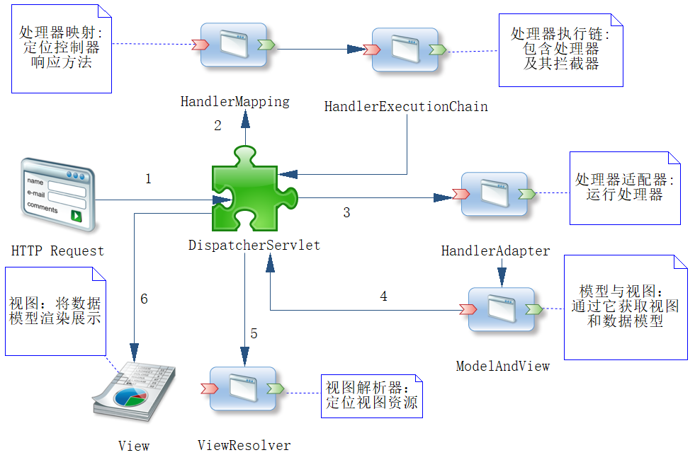

## 1. Spring MVC 组件与流程

组件和流程是 Spring MVC 的核心，Spring MVC 的流程是围绕 `DispatcherServlet` 而工作的，所以这个类是其最为重要的类。图中数字给出了 Spring MVC 的服务流程及其各个组件运行的顺序。

### 执行流程

1. 用户发送请求至前端控制器 `DispatcherServlet`
2. `DispatcherServlet` 收到请求调用处理器映射器 `HandlerMapping`。处理器映射器根据请求 URI 找到具体的处理器，生成处理器执行链 `HandlerExecutionChain`（包括处理器对象和处理器拦截器）一并返回给 `DispatcherServlet`
3. `DispatcherServlet` 根据处理器 `Handler` 获取处理器适配器 `HandlerAdapter`，执行 `HandlerAdapter` 处理一系列的操作，如参数封装，数据格式转换，数据验证等操作
4. `HandlerAdapter` 将 `Handler` 执行结果 `ModelAndView` 返回到 `DispatcherServlet`
5. `DispatcherServlet` 将 `ModelAndView` 传给 `ViewReslover` 视图解析器，视图解析器解析后返回具体 View
6. `DispatcherServlet` 对 View 进行渲染视图（即将模型数据 model 填充至视图中），并响应用户



### 组件说明

1. **`DispatcherServlet`：前端控制器**。用户请求到达前端控制器，它就相当于 MVC 模式中的 C，是整个流程控制的中心，由它调用其它组件处理用户的请求，`DispatcherServlet` 的存在降低了组件之间的耦合性，系统扩展性提高。Spring MVC 中的 `DispatcherServlet` 由框架实现。
2. **`HandlerMapping`：处理器映射器**。`HandlerMapping` 负责根据用户请求的 URI 找到 `Handler` 处理器，Spring MVC 提供了不同的映射器实现不同的映射方式，根据一定的规则去查找，例如：XML 配置方式，实现接口方式，注解方式等。Spring MVC 中的 `HandlerMapping` 由框架实现。
3. **`Handler`：处理器**。在 `DispatcherServlet`的控制下 `Handler` 对具体的用户请求进行处理。由于 `Handler` 涉及到具体的用户业务请求，所以一般情况需要程序员根据业务需求开发Handler。
4. **`HandlerAdapter`：处理器适配器**。通过 HandlerAdapter 对处理器进行执行，这是适配器模式的应用，通过扩展适配器可以对更多类型的处理器进行执行。Spring MVC 中的 `HandlAdapter` 由框架实现。
5. **`ModelAndView`**：是 Spring MVC 的封装对象，将 model 和 view 封装在一起。
6. **`ViewResolver`：视图解析器**。`ViewResolver` 负责将处理结果生成 View 视图，它首先根据逻辑视图名解析成物理视图名即具体的页面地址，再生成 View 视图对象，最后对 View 进行渲染将处理结果通过页面展示给用户。
7. **`View`**：是 Spring MVC 的封装对象，是一个接口,  Spring MVC 框架提供了很多的 View 视图类型，包括：jspView、jstlView、freemarkerView、pdfView等。一般情况下需要通过页面标签或页面模版技术将模型数据通过页面展示给用户，需要由程序员根据业务需求开发具体的页面。


## 2. 控制器接收各类请求参数

1. **无注解获取参数**：在没有注解的情况下，Spring MVC 也可以获取参数，且参数允许为空，唯一的要求是**参数名称和 HTTP 请求的参数名称保持一致**

   ```java
   // 处理请求类似于：http://localhotst:8080/params?roleName=aa&note=bb
   @RequestMapping("/params")
   public ModelAndView noAnnotation(String roleName, String note) {
       // ...
   }
   ```

2. **使用 @RequestParam 获取参数**：在前后台分离的趋势下，前端的命名规则可能与后端的规则不同，该注解可以把前端的参数与后端对应起来。默认情况下，**被 @RequestParam 注解的参数不能为空**，如果为空系统会抛出异常；如果希望允许它为空，可以配置其属性 required 为 false

   ```java
   // 处理请求类似于：http://localhotst:8080/params?role_name=aa&note=bb
   @RequestMapping("/params")
   public ModelAndView requestParam(@RequestParam(value = "role_name", required = false) String roleName, String note) {
       // ...
   }
   ```

3. **使用 URL 传递参数**：使用 URL 的形式传递参数，这符合 RESTful 风格，对于一些业务比较简单的应用十分常见，它需要 **@RequestMapping 和 @PathVariable 两个注解**共同协作完成

   ```java
   // 处理请求类似于：http://localhotst:8080/getRole/1
   @RequestMapping("/getRole/{id}")
   public ModelAndView pathVariable(@PathVariable("id") Long id) {
       // ...
   }
   ```

4. **传递 JSON 参数**：有时前端需要提交较为复杂的数据到后端，为了更好组织和提高代码的可读性，可以将数据转换为 JSON 数据集，通过 HTTP 请求体提交给后端，此时可以**使用 @RequestBody 注解接收参数**

   ```java
   // 前端使用Ajax提交数据，请求时需要告知传递参数类型为JSON，并将JSON转化为字符串传递
   @RequestMapping("/insert")
   public ModelAndView insert(@RequestBody Role role) {
       // ...
   }
   ```

5. **传递数组**：除了传递一些简单值外，Spring MVC 还支持用逗号分隔的数组参数

   ```java
   // 处理请求类似于：http://localhotst:8080/requestArray?intArr=1,2,3&strArr=a,b,c
   @RequestMapping("/requestArray")
   public ModelAndView requestArray(int[] intArr, String[] strArr) {
       // ...
   }
   ```

   


## 参考

1. 杨开振等 -《Java EE互联网轻量级框架整合开发》
2. [MVC模式总结和SpringMVC流程及组件整理](https://zhuanlan.zhihu.com/p/148557490)