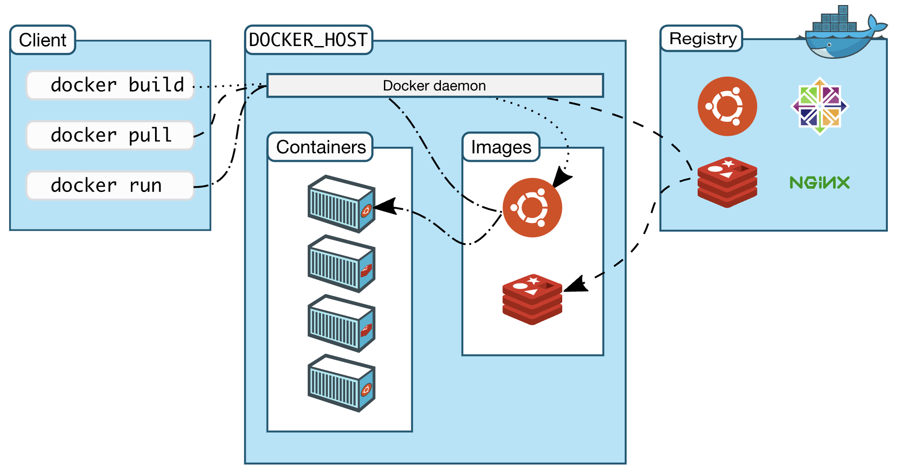
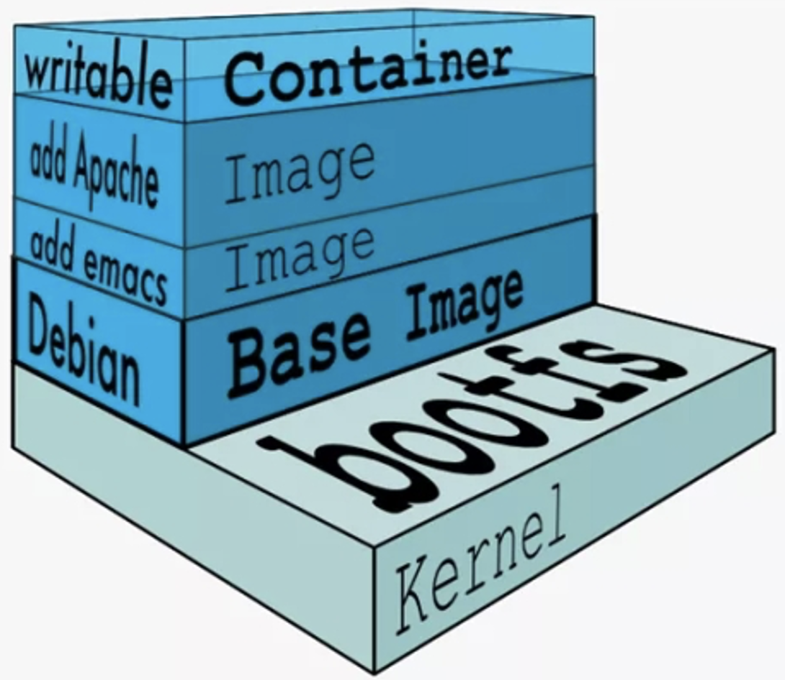
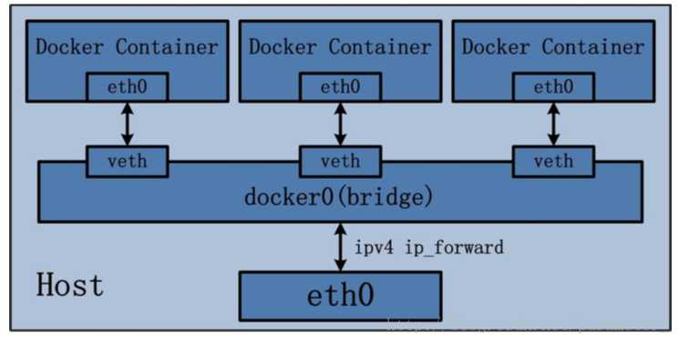
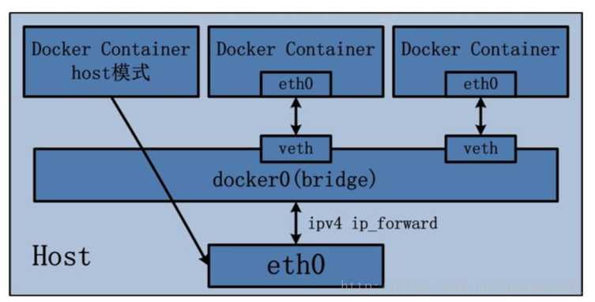
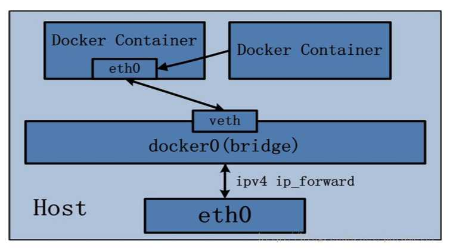
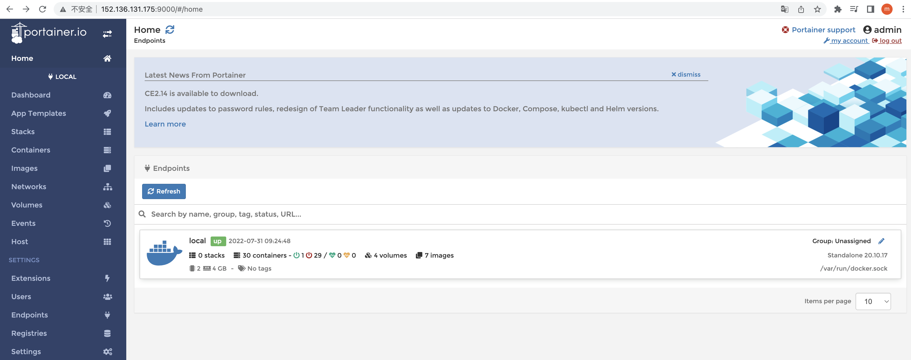

# 1. Docker 基础篇

## 1.1 Docker 简介

Docker 是基于 Go 语言实现的云开源项目，它的主要目标是“Build, Ship and Run Any App, Anywhere”，也就是通过对应用组件的封装、分发、部署、运行等生命周期的管理，使用户的 APP（可以是一个 WEB 应用或数据库应用等等）及其运行环境能够做到**“一次镜像，处处运行”**。Docker 将应用打成镜像，通过镜像成为运行在 Docker 容器上面的实例，而 Docker 容器在任何操作系统上都是一致的，这就实现了跨平台、跨服务器，**解决了运行环境和配置问题**。

传统虚拟机技术是虚拟出一套硬件后，在其上运行一个完整的操作系统，在该系统上再运行所需应用进程，它的缺点是**资源占用多、冗余步骤多、启动慢**。与虚拟机不同，**容器不需要捆绑一整套操作系统，容器内的应用进程直接运行于宿主机的内核，容器内没有自己的内核且也没有进行硬件虚拟，因此容器要比传统虚拟机更为轻便**。每个容器之间互相隔离，都有自己的文件系统 ，容器之间进程不会相互影响，能区分计算资源。

|            | 虚拟机                       | Docker 容器              |
| ---------- | ---------------------------- | ------------------------ |
| 操作系统   | 宿主机上运行虚拟机虚操作系统 | 与宿主机共享操作系统     |
| 存储大小   | 镜像庞大，vmdk、vdi 等       | 镜像小，便于存储和传输   |
| 运行性能   | 操作系统额外的 CPU、内存消耗 | 几乎无额外性能损失       |
| 移植性     | 笨重，与虚拟化技术耦合度高   | 轻便、灵活，适用于 Linux |
| 硬件亲和性 | 面向硬件运维者               | 面向软件开发者           |
| 部署速度   | 较慢，10 秒以上              | 快速，秒级               |

**Docker 采用 C/S 架构**，Docker 客户端与 Docker 守护进程通信，后者负责构建、运行和分发 Docker 容器。Docker 客户端和守护程序可以在同一系统上运行，也可以将 Docker 客户端连接到远程 Docker 守护程序。Docker 客户端和守护程序使用 REST API，通过 UNIX 套接字或网络接口进行通信。另一个 Docker 客户端是 Docker Compose，它允许用户使用由一组容器组成的应用程序。

* **镜像（Image）**：**镜像是一个只读的模板，用来创建容器实例**，一个镜像可以创建多个容器实例
* **容器（Container）**，容器类似一个简易的 Linux 环境，Docker 利用容器独立运行一个或一组应用程序，**镜像与容器的关系类似于类与实例对象的关系**
* **仓库（Repository）**：**仓库是集中存放镜像文件的地方**，分为公开仓库和私有仓库两种形式，我们可以将镜像发布到仓库中，需要时再从仓库中拉取下来使用




## 1.2 Docker 安装

Docker 并非一个通用的容器工具，它实质上是在已经运行的 Linux 主机下制造一个隔离的文件环境，因此它**必须部署在 Linux 内核的系统上**，如果其他系统想部署 Docker 就必须安装一个虚拟的 Linux 环境。目前，CentOS 仅发行版本中的内核支持 Docker，Docker 运行在 CentOS 7 上，要求系统为 64 位、Linux 系统内核版本为 3.8 以上，这里选用 Centos7.6，内核 3.10

1. **安装相关依赖**

   * 安装 gcc：`yum -y install gcc gcc-c++`
   * 安装 yum-utils 软件包：`yum -y install yum-utils`
   * 设置稳定的镜像仓库，注意官网是国外地址，此处修改为阿里仓库：`yum-config-manager --add-repo http://mirrors.aliyun.com/docker-ce/linux/centos/docker-ce.repo`
   * 更新 yum 软件包索引，加速软件下载：`yum makecache fast`

2. **安装并测试**

   * 安装 docker-ce：`yum -y install docker-ce docker-ce-cli containerd.io`
   * 启动 docker：`systemctl start docker`
   * 查看 docker 版本：`docker version`
   * 运行 hello-world 程序：`docker run hello-world`

3. **镜像加速配置**

   * 登录阿里云账号，点击【控制台】，找到【弹性服务】下的【容器镜像服务】，选择【镜像工具】下的【镜像加速器】

   * 根据操作文档，选择对应的操作系统执行相关命令

     ```shell
     sudo mkdir -p /etc/docker
     sudo tee /etc/docker/daemon.json <<-'EOF'
     {
       "registry-mirrors": [加速器地址]
     }
     EOF
     sudo systemctl daemon-reload
     sudo systemctl restart docker
     ```

5. **卸载相关**
   
   * 停止 docker：`systemctl stop docker`
   * 卸载 docker-ce：`yum remove docker-ce docker-ce-cli containerd.io`
   * 删除相关配置：`rm -rf /var/lib/docker /var/lib/containerd`


## 1.3 Docker 常用命令

### 1.3.1 帮助启动命令

1. 启动/停止/重启/状态/开机自启：`systemctl start/stop/restart/status/enable docker`
2. 查看概要信息：`docker info`
3. 查看总体帮助文档：`docker --help`
4. 查看命令帮助文档：`docker [具体命令] --help`


### 1.3.2 镜像命令

1. **列出本地主机的镜像：`docker images`**

   * -a：列出本地所有的镜像（含历史映像层）
   * -q：只列出镜像的 ID

   ```shell
   # 依次表示：镜像的仓库源、标签版本号、镜像ID、镜像的创建时间、镜像大小。同一个仓库源可以有多个不同的版本，使用REPOSITORY:TAG定义不同的镜像。若不指定镜像版本标签，将默认使用latest镜像
   [root@VM-24-2-centos ~]# docker images
   REPOSITORY    TAG       IMAGE ID       CREATED         SIZE
   hello-world   latest    feb5d9fea6a5   10 months ago   13.3kB
   ```

2. 查找远程仓库镜像：`docker search [name]`

   * --limit n：只列出 n 个镜像，默认 25 个

3. **拉取远程仓库镜像：`docker pull [name:tag]`**

   ```shell
   [root@VM-24-2-centos ~]# docker pull ubuntu
   Using default tag: latest
   latest: Pulling from library/ubuntu
   7b1a6ab2e44d: Pull complete 
   Digest: sha256:626ffe58f6e7566e00254b638eb7e0f3b11d4da9675088f4781a50ae288f3322
   Status: Downloaded newer image for ubuntu:latest
   docker.io/library/ubuntu:latest
   ```

4. 查看镜像/容器/数据卷/构建缓存所占空间：`docker system df`

5. 删除镜像：`docker rmi [id/name]`

   * -f：强制删除

   ```shell
   # sha256前面几位数字即为镜像ID，若要删除全部镜像，使用：docker rmi -f $(docker images -qa)
   [root@VM-24-2-centos ~]# docker rmi -f hello-world
   Untagged: hello-world:latest
   Untagged: hello-world@sha256:53f1bbee2f52c39e41682ee1d388285290c5c8a76cc92b42687eecf38e0af3f0
   Deleted: sha256:feb5d9fea6a5e9606aa995e879d862b825965ba48de054caab5ef356dc6b3412
   ```


### 1.3.3 容器命令

1. **新建并启动容器：`docker run <options> [name] <command> <args>`**

   注：options 可选，常用参数如下：

   * --name=[容器新名称]：为容器指定一个名称，若未指定则随机分配
   * -d：后台运行容器并返回容器 ID。**容器运行必须有一个前台进程， 如果没有前台进程执行，容器认为空闲，容器运行的命令如果不是那些一直挂起的命令，如 top，tail 等，就会自行退出**。因此使用该参数后，最好使用 ps 命令查看一下容器是否正在运行
   * **-i（interactive）：以交互模式运行容器，通常与 -t 同时使用**
   * **-t（tty）：为容器重新分配一个伪输入终端，通常与 -i 同时使用**
   * -P：随机端口映射，大写P
   * -p [hostPort:containerPort]：指定端口映射，小写p

   ```shell
   # /bin/bash即为命令，若要退出终端，使用exit退出，容器停止；使用ctrl+p+q退出，容器不停止
   [root@VM-24-2-centos ~]# docker run -it ubuntu /bin/bash
   root@be9c7a0f1157:/# 
   ```

2. 列出当前所有正在运行的容器：`docker ps <options>`

   * -a：列出当前正在运行**和历史上运行过**的容器
   * -q：静默模式，只显示容器 ID

   ```shell
   # 依次表示：容器ID、对应镜像名、命令、创建时间、当前状态、映射端口、容器名称
   [root@VM-24-2-centos ~]# docker ps -a
   CONTAINER ID   IMAGE          COMMAND       CREATED          STATUS                    PORTS     NAMES
   be9c7a0f1157   ubuntu         "/bin/bash"   15 minutes ago   Up 15 minutes                       wonderful_almeida
   2e6b976f3bb8   feb5d9fea6a5   "/hello"      24 hours ago     Exited (0) 24 hours ago             jolly_hopper
   ```

3. 启动已停止运行的容器：`docker start [name/id]`

4. 重启/停止/强制停止容器：`docker restart/stop/kill [name/id]`

5. 删除已停止的容器：`docker rm [name/id]`

   ```shell
   # 先停止容器后删除，也可使用-f参数强制删除
   [root@VM-24-2-centos ~]# docker stop wonderful_almeida
   wonderful_almeida
   [root@VM-24-2-centos ~]# docker rm wonderful_almeida
   wonderful_almeida
   ```

6. 查看容器日志：`docker logs [id]`

7. 查看容器内运行的进程：`docker top [id]`

8. 查看容器内部细节：`docker inspect [id]`

9. **进入正在运行的容器并以命令行交互：`docker exec -it [id] bashShell`**、`docker attach [id]`

   注：attach 直接进入容器启动命令的终端，不会启动新的进程，用 exit 退出，会导致容器的停止；而 exec 是在容器中打开新的终端，并且可以启动新的进程，用 exit 退出，不会导致容器的停止。**推荐使用 exec 命令**。

   ```shell
   # 首先使用run新建并启动容器，然后使用ctrl+p+q退出，并使用ps命令查看正在运行的容器
   [root@VM-24-2-centos ~]# docker exec -it 20d1f58fe5aa /bin/bash
   root@20d1f58fe5aa:/# exit
   exit
   [root@VM-24-2-centos ~]# docker ps
   CONTAINER ID   IMAGE     COMMAND       CREATED          STATUS          PORTS     NAMES
   20d1f58fe5aa   ubuntu    "/bin/bash"   18 minutes ago   Up 18 minutes             dazzling_sanderson
   [root@VM-24-2-centos ~]# docker attach 20d1f58fe5aa
   root@20d1f58fe5aa:/# exit
   exit
   [root@VM-24-2-centos ~]# docker ps
   CONTAINER ID   IMAGE     COMMAND   CREATED   STATUS    PORTS     NAMES
   ```

10. **从容器内拷贝文件到主机：`docker cp [containerId:containerPath] [hostPath]`**

11. 导出容器作为一个 tar 归档文件：`docker export [id] > [fileName]`

    从 tar 包创建新的文件系统再导入为镜像：`cat [fileName] | docker import - imageUser/imageName:imageTag`

    ```shell
    [root@VM-24-2-centos ~]# docker export 4a493cee9a68 > abc.tar
    [root@VM-24-2-centos ~]# docker rm -f 4a493cee9a68
    4a493cee9a68
    [root@VM-24-2-centos ~]# cat abc.tar | docker import - maomao/ubuntu:20.02
    sha256:c2ca354c4171c66d2309652e33be8f39433e9da4a0920dd6cfbc39982120742d
    [root@VM-24-2-centos ~]# docker images
    REPOSITORY      TAG       IMAGE ID       CREATED         SIZE
    maomao/ubuntu   20.02     c2ca354c4171   5 minutes ago   72.8MB
    redis           latest    7614ae9453d1   7 months ago    113MB
    ubuntu          latest    ba6acccedd29   9 months ago    72.8MB
    [root@VM-24-2-centos ~]# docker run -it c2ca354c4171 /bin/bash
    root@10633f21f9d0:/# ls /tmp
    a.txt
    ```

    


## 1.4 Docker 镜像

### 1.4.1 镜像原理

镜像是一种轻量级、可执行的独立软件包，它包含运行某个软件所需的所有内容，我们把应用程序和配置依赖打包好形成一个可交付的运行环境（包括代码、运行时需要的库、环境变量和配置文件等），这个打包好的运行环境就是 image 镜像文件。

**UnionFS（联合文件系统，UnionFS）是一种分层、轻量级并且高性能的文件系统，它支持对文件系统的修改作为一次提交来一层层的叠加**，同时可以将不同目录挂载到同一个虚拟文件系统下。**Union 文件系统是 Docker 镜像的基础，镜像可以通过分层来进行继承**，基于基础镜像（没有父镜像），可以制作各种具体的应用镜像，镜像分层最大的好处就是共享资源、方便复制迁移、复用。**Docker 镜像层都是只读的，容器层是可写的**。当容器启动时，一个新的可写层被加载到镜像的顶部， 这一层通常被称作容器层，容器层之下的都叫镜像层。所有对容器的改动，无论添加、删除、还是修改文件都只会发生在容器层中。

**Docker 镜像的最底层是引导文件系统 bootfs（boot file system）**，这一层与我们典型的 Linux/Unix 系统是一样的，包含 bootloader 和 kernel 内核。Linux 刚启动时会加载 bootfs 文件系统，当加载完成之后整个内核就都在内存中了，此时内存的使用权由 bootfs 转交给内核，系统就会卸载 bootfs。

**rootfs（root file system） 在 bootfs 之上**，包含的就是典型 Linux 系统中的 /dev、/proc、/bin、/etc 等标准目录和文件，rootfs 就是各种不同的操作系统发行版，如 Ubuntu，Centos 等。对于一个精简的操作系统，rootfs 可以很小，只需要包括最基本的命令、工具和程序库就可以了，底层直接使用宿主机的 kernel，自己只需要提供 rootfs 就行了。由此可见对于不同的 Linux 发行版，bootfs 基本是一致， rootfs 会有差别， 不同的发行版可以共用 bootfs




### 1.4.2 commit 操作案例

原始默认的 ubuntu 镜像不带有 vim 命令，现需要在原有镜像基础上制作带有 vim 命令的新镜像，commit 命令具体用法：**`docker commit -m="提交的描述信息" -a="作者" [容器ID] 新创建的目标镜像名:[标签名]`**

```shell
[root@VM-24-2-centos ~]# docker run -it ubuntu /bin/bash
root@e2d8d900d863:/# vim --help
bash: vim: command not found
root@e2d8d900d863:/# apt-get update
root@e2d8d900d863:/# apt-get -y install vim
root@e2d8d900d863:/# exit
exit

# 上面命令的root@后面一系列字符即为容器ID，或通过docker ps -a查看
[root@VM-24-2-centos ~]# docker commit -m="add vim cmd" -a="maomao" e2d8d900d863 myubuntu:1.0
sha256:950f66b963bd487da0fda1b6c200afcc65ab0ab0e37f5b024fa1b5c1a60d6469
[root@VM-24-2-centos ~]# docker images
REPOSITORY   TAG       IMAGE ID       CREATED          SIZE
myubuntu     1.0       950f66b963bd   20 seconds ago   178MB
ubuntu       latest    ba6acccedd29   9 months ago     72.8MB
[root@VM-24-2-centos ~]# docker run -it myubuntu:1.0 /bin/bash
root@dc946ed3cd56:/# vim --help
VIM - Vi IMproved 8.1 (2018 May 18, compiled Feb 01 2022 09:16:32)
```


## 1.5 本地镜像发布

### 1.5.1 发布到阿里云

1. 登录阿里云账号，点击【控制台】，搜索【容器镜像服务】，点击【实例列表】，点击【个人实例】

2. 点击【仓库管理】下的【命名空间】，点击【创建命名空间】，假设为 maomao-namespace 创建后将仓库类型设为【公开】

3. 点击【镜像仓库】，选择刚刚创建的命名空间，然后【创建镜像仓库】，填写相关信息，假设仓库名称为 myubuntu，仓库类型选择公开，点击【下一步】，选择【本地仓库】，然后点击【创建镜像仓库】

4. 相关操作可直接参考阿里云给出的命令，若未找到相关命令，点击【镜像仓库】，然后点击【管理】

5. 将镜像推送到 Registry

   ```shell
   $ docker login --username=[username] registry.cn-hangzhou.aliyuncs.com
   $ docker tag [ImageId] registry.cn-hangzhou.aliyuncs.com/maomao-namespace/myubuntu:[镜像版本号]
   $ docker push registry.cn-hangzhou.aliyuncs.com/maomao-namespace/myubuntu:[镜像版本号]
   ```

6. 从 Registry 中拉取镜像

   ```shell
   $ docker pull registry.cn-hangzhou.aliyuncs.com/maomao-namespace/myubuntu:[镜像版本号]
   ```


### 1.5.2 发布到私有库

1. 修改配置文件使 docker 支持 http，通过 ip addr 命令可查看 docker 的 IP，**注意逗号，然后重启 docker 使配置生效**：`vim /etc/docker/daemon.json`

   ```json
   {
     "registry-mirrors": ["https://5w8eiyft.mirror.aliyuncs.com"],
     "insecure-registries": ["172.17.0.1:5000"]
   }
   ```

2. 下载镜像 Docker Registry 并运行，它是官方提供的工具，相当于本地有个私有 Docker hub，并使用 curl 命令查看私有库的镜像

   ```shell
   [root@VM-24-2-centos ~]# docker pull registry
   [root@VM-24-2-centos ~]# docker run -d -p 5000:5000 --privileged=true -v /tmp/myregistry/:/tmp/registry registry
   3357bedd4187355e8424a6acd35fb673bca5b7fa31d0e172735f0f4f691a2a8d
   root@VM-24-2-centos ~]# curl -XGET http://172.17.0.1:5000/v2/_catalog
   {"repositories":[]}
   ```

3. 在原有 ubuntu 基础上安装 vim 命令，并 commit 提交

4. push 推送到私有库并验证

   ```shell
   [root@VM-24-2-centos ~]# docker tag myubuntu:1.1 172.17.0.1:5000/myubuntu:1.1
   [root@VM-24-2-centos ~]# docker images
   REPOSITORY                 TAG       IMAGE ID       CREATED              SIZE
   172.17.0.1:5000/myubuntu   1.1       eca23efe2ebd   About a minute ago   111MB
   myubuntu                   1.1       eca23efe2ebd   About a minute ago   111MB
   registry                   latest    b8604a3fe854   8 months ago         26.2MB
   ubuntu                     latest    ba6acccedd29   9 months ago         72.8MB
   [root@VM-24-2-centos ~]# docker push 172.17.0.1:5000/myubuntu:1.1
   [root@VM-24-2-centos ~]# curl -XGET http://172.17.0.1:5000/v2/_catalog
   {"repositories":["myubuntu"]}
   ```

5. pull 到本地并运行

   ```shell
   root@VM-24-2-centos ~]# docker rmi -f eca23efe2ebd
   [root@VM-24-2-centos ~]# docker images
   REPOSITORY   TAG       IMAGE ID       CREATED        SIZE
   redis        latest    7614ae9453d1   7 months ago   113MB
   registry     latest    b8604a3fe854   8 months ago   26.2MB
   ubuntu       latest    ba6acccedd29   9 months ago   72.8MB
   [root@VM-24-2-centos ~]# docker pull 172.17.0.1:5000/myubuntu:1.1
   [root@VM-24-2-centos ~]# docker images
   REPOSITORY                 TAG       IMAGE ID       CREATED          SIZE
   172.17.0.1:5000/myubuntu   1.1       eca23efe2ebd   17 minutes ago   111MB
   redis                      latest    7614ae9453d1   7 months ago     113MB
   registry                   latest    b8604a3fe854   8 months ago     26.2MB
   ubuntu                     latest    ba6acccedd29   9 months ago     72.8MB
   [root@VM-24-2-centos ~]# docker run -it eca23efe2ebd /bin/bash
   root@78e3c6a5f0bf:/# vim --help
   ```


## 1.6 Docker 容器数据卷

卷就是目录或文件，存在于一个或多个容器中，由 docker 挂载到容器，但不属于联合文件系统，因此能够绕过 Union File System 提供一些用于持续存储或共享数据的特性。卷的设计目的就是**数据的持久化**，完全独立于容器的生存周期，因此 Docker 不会在容器删除时删除其挂载的数据卷。数据卷具有如下特点：

* 数据卷可在容器之间共享或重用数据
* 数据卷中的更改可以直接实时生效
* 数据卷中的更改不会包含在镜像的更新中
* 数据卷的生命周期一直持续到没有容器使用它为止

运行一个带有容器卷存储功能的容器实例：**`docker run -it --privileged=true -v [宿主机绝对路径目录]:[容器内目录]:[rw/ro] [镜像名]`**。rw 表示容器具有读写权限（默认），ro 表示容器只具有只读权限，但宿主机不受限制。由于目录挂载被默认为不安全的行为，在 SELinux 中被禁用，因此需要使用 --privileged=true 参数扩大容器的权限。

```shell
[root@VM-24-2-centos ~]# docker run -it --privileged=true -v /tmp/hostdata:/tmp/dockerdata ubuntu
root@ee6b3f3ce704:/# touch /tmp/dockerdata/b.txt
root@ee6b3f3ce704:/tmp/dockerdata# [control+p+q退出]
[root@VM-24-2-centos ~]# ls /tmp/hostdata/
b.txt

[root@VM-24-2-centos hostdata]# docker stop ee6b3f3ce704
ee6b3f3ce704
[root@VM-24-2-centos hostdata]# touch /tmp/hostdata/c.txt
[root@VM-24-2-centos hostdata]# docker start ee6b3f3ce704
ee6b3f3ce704
[root@VM-24-2-centos hostdata]# docker exec -it ee6b3f3ce704 /bin/bash
root@ee6b3f3ce704:/# ls /tmp/dockerdata/
b.txt  c.txt

[root@VM-24-2-centos hostdata]# docker run -it --privileged=true --volumes-from ee6b3f3ce704 ubuntu
root@bfff962f05f8:/# ls /tmp/dockerdata/
b.txt  c.txt
```


## 1.7 Docker 常规安装

### 1.7.1 安装 Tomcat

```shell
[root@VM-24-2-centos ~]# docker pull tomcat
[root@VM-24-2-centos ~]# docker run -it -p 8080:8080 tomcat /bin/bash
root@3607dad3da9e:/usr/local/tomcat# ls
BUILDING.txt     LICENSE  README.md      RUNNING.txt  conf  logs            temp     webapps.dist
CONTRIBUTING.md  NOTICE   RELEASE-NOTES  bin          lib   native-jni-lib  webapps  work

# 注意官方的tomcat镜像webapps为空，真正的页面文件位于webapps.dist目录，因此需要将webapps替换为webapps.dist，否则浏览器访问将出现404。另一种方法是下载其他镜像：docker pull billygoo/tomcat8-jdk8
root@3607dad3da9e:/usr/local/tomcat# ls webapps
root@3607dad3da9e:/usr/local/tomcat# ls webapps.dist/
ROOT  docs  examples  host-manager  manager
root@3607dad3da9e:/usr/local/tomcat# rm -rd webapps
root@3607dad3da9e:/usr/local/tomcat# mv webapps.dist/ webapps

# 手动启动tomcat，注意需要将宿主机的8080开放。若启动镜像时未加/bin/bash，则相当于自动启动了tomcat
root@3607dad3da9e:/usr/local/tomcat# bin/catalina.sh start
root@3607dad3da9e:/usr/local/tomcat# [control+p+q退出]
```


### 1.7.2 安装 MySQL

```shell
[root@VM-24-2-centos ~]# docker pull mysql:5.7
# 为了防止数据丢失，使用容器数据卷同步数据，同时需要配置字符编码为utf-（文件内容如下S），否则无法使用中文
[root@VM-24-2-centos ~]# docker run -d -p 3306:3306 --privileged=true -v /usr/local/mysql/log:/var/log/mysql -v /usr/local/mysql/data:/var/lib/mysql -v /usr/local/mysql/conf:/etc/mysql/conf.d -e MYSQL_ROOT_PASSWORD=123456  --name mysql mysql:5.7
5448d2067220aaa30602f19d9ef500ab92f6acf65c45fe3066bcc44a684bd304
[root@VM-24-2-centos ~]# cd /usr/local/mysql/conf/
[root@VM-24-2-centos conf]# vim my.cnf

[root@VM-24-2-centos conf]# docker exec -it 5448d2067220 /bin/bash
root@5448d2067220:/# mysql -uroot -p
Enter password: 
mysql>  SHOW VARIABLES LIKE 'character%';
+--------------------------+----------------------------+
| Variable_name            | Value                      |
+--------------------------+----------------------------+
| character_set_client     | utf8                       |
| character_set_connection | utf8                       |
| character_set_database   | utf8                       |
| character_set_filesystem | binary                     |
| character_set_results    | utf8                       |
| character_set_server     | utf8                       |
| character_set_system     | utf8                       |
| character_sets_dir       | /usr/share/mysql/charsets/ |
+--------------------------+----------------------------+
8 rows in set (0.00 sec)
```

```
[mysqld]
collation_server = utf8_general_ci
character_set_server = utf8
[mysql]
default-character-set = utf8
[mysql.server]
default-character-set = utf8
[mysqld_safe]
default-character-set = utf8
[client]
default_character_set = utf8
```


# 2. Docker 高级篇

## 2.1 DockerFile 解析

Dockerfile 是用来构建 Docker 镜像的文本文件，是由一条条构建镜像所需的指令和参数构成的脚本。构建分为三步：编写 Dockerfile 文件、docker build 命令构建镜像、docker run 依照镜像运行容器实例

### 2.1.1 保留字简介

1. FROM：基础镜像，当前新镜像是基于哪个镜像的，指定一个已经存在的镜像作为模板，第一条必须是 FROM

2. MAINTAINER：镜像维护者的姓名和邮箱地址

3. RUN：容器构建时需要运行的命令，有两种格式：shell 格式、exec 格式

   ```dockerfile
   # <命令行命令>等同于在终端操作的shell命令
   RUN <命令行命令>
   # 例如：RUN [“./test.php”, "args1", "args2"] 等价于 RUN ./test.php args1 args2
   RUN [“可执行文件”, "参数1", "参数2"]
   ```

4. EXPOSE：当前容器对外暴露出的端口

5. WORKDIR：指定在创建容器后，终端默认登陆的进来工作目录，一个落脚点

6. USER：指定该镜像以什么样的用户去执行，如果都不指定，默认是 root

7. ENV：用来在构建镜像过程中设置环境变量

8. VOLUME：容器数据卷，用于数据保存和持久化工作

9. ADD：将宿主机目录下的文件拷贝进镜像，**且会自动处理 URL 和解压 tar 压缩包**

10. COPY：类似 ADD，拷贝文件和目录到镜像中。 将从构建上下文目录中 <源路径> 的文件/目录复制到新的一层的镜像内的 <目标路径> 位置，**但不会解压压缩包**

11. CMD：指定容器启动后要干的事情，它与 RUN 指令一样，也有 shell 和 exec 两种格式。注意，Dockerfile 中可以有多个 CMD 指令，但**只有最后一个生效，CMD 会被 docker run 之后的参数替换**。它和 RUN 命令的区别在于：CMD 是在 docker run 时运行；而 RUN是在 docker build 时运行

12. ENTRYPOINT：也是用来指定一个容器启动时要运行的命令，类似于 CMD 指令，但是 **ENTRYPOINT 不会被docker run 后面的命令覆盖**， 而且这些命令行参数会被当作参数送给 ENTRYPOINT 指令指定的程序。指令格式为 `ENTRYPOINT [“可执行文件”, "参数1", "参数2"]`。ENTRYPOINT 可以和 CMD 一起用，一般是**变参**才会使用 CMD，当指定了 ENTRYPOINT 后，CMD 的含义就发生了变化，不再是直接运行其命令而是将 CMD 的内容作为参数传递给 ENTRYPOINT 指令

    ```dockerfile
    # 假设用户运行命令：docker run nginx:test，则等价于运行：nginx -c /etc/nginx/nginx.conf
    # 假设用户运行命令：docker run nginx:test -c /etc/nginx/new.conf，则等价于运行：nginx -c /etc/nginx/new.conf
    ENTRYPOINT ["nginx", "-c"] # 定参
    CMD ["/etc/nginx/nginx.conf"] # 变参
    ```


### 2.1.2 操作案例

原始默认的 centos7 镜像不带有 vim、ifconfig 命令以及 java8，现需要使用 Dockerfile 文件在原有镜像基础上构建新镜像，build 命令具体用法，注意结尾处有个点：**`docker build -t [newImageName:tag] .`**

```shell
[root@VM-24-2-centos ~]# docker pull centos:7
[root@VM-24-2-centos ~]# wget -c https://mirrors.yangxingzhen.com/jdk/jdk-8u171-linux-x64.tar.gz
# 编写Dockerfile文件，内容如下
[root@VM-24-2-centos ~]# vim Dockerfile
[root@VM-24-2-centos ~]# ls
Dockerfile  jdk-8u171-linux-x64.tar.gz
[root@VM-24-2-centos ~]# docker build -t newcentos:7.1 .
[root@VM-24-2-centos ~]# docker run -it newcentos:7.1 /bin/bash
[root@a92880842b6a local]# pwd
/usr/local
[root@a92880842b6a local]# vim --help
[root@a92880842b6a local]# ifconfig
[root@a92880842b6a bin]# java -version
```

```dockerfile
FROM centos:7
MAINTAINER maomao<maomao@163.com>

ENV MYPATH /usr/local
WORKDIR $MYPATH

# 安装vim编辑器
RUN yum -y install vim
# 安装ifconfig命令查看网络IP
RUN yum -y install net-tools
# 安装java8及lib库
RUN yum -y install glibc.i686
RUN mkdir /usr/local/java
# ADD是相对路径jar，把jdk-8u171-linux-x64.tar.gz添加到容器中，安装包必须要和Dockerfile文件在同一位置
ADD jdk-8u171-linux-x64.tar.gz /usr/local/java/
# 配置java环境变量
ENV JAVA_HOME /usr/local/java/jdk1.8.0_171
ENV JRE_HOME $JAVA_HOME/jre
ENV CLASSPATH $JAVA_HOME/lib/dt.jar:$JAVA_HOME/lib/tools.jar:$JRE_HOME/lib:$CLASSPATH
ENV PATH $JAVA_HOME/bin:$PATH

EXPOSE 80
CMD echo $MYPATH
CMD echo "bulid image successful"
CMD /bin/bash
```


### 2.1.3 虚悬镜像

**仓库名、标签都是\<none>的镜像，俗称虚悬镜像 dangling image**。使用命令`docker image ls -f dangling=true`可查看所有的虚悬镜像，虚悬镜像已经失去存在价值，使用命令`docker image prune`可以删除

```shell
# 编写Dockerfile文件，内容如下
[root@VM-24-2-centos ~]# vim Dockerfile 
[root@VM-24-2-centos ~]# docker build .
[root@VM-24-2-centos ~]# docker image ls -f dangling=true
REPOSITORY   TAG       IMAGE ID       CREATED          SIZE
<none>       <none>    d895cd8504e4   19 seconds ago   72.8MB
[root@VM-24-2-centos ~]# docker image prune
[root@VM-24-2-centos ~]# docker image ls -f dangling=true
REPOSITORY   TAG       IMAGE ID   CREATED   SIZE
```

```dockerfile
FROM ubuntu
CMD echo "dangling image"
```


## 2.2 Docker 网络

**Docker 网络用于容器间的互联和通信以及端口映射**，当容器 IP 变动时可以通过服务名直接网络通信而不受到影响。**使用命令 `docker network ls` 查看所有网络，使用命令 `docker network inspect/create/rm [网络名]` 查看元数据/创建/删除网络**，Docker 有如下几种网络模式，其中前三种为基本模式。

1. **bridge 模式**：**默认模式**，为每个容器分配设置 IP，并将容器链接到 docker0，使用 --network bridge 指定
2. **host 模式**：容器不会虚拟出自己的网卡和配置自己的 IP，而是使用宿主机的 IP 和端口，使用 --network host 指定
3. **none 模式**：容器有独立的 Network namespace，但没有对其进行任何网络设置，如分配 veth pair、网桥连接、IP等，使用 --network none 指定
4. **container 模式**：新创建的容器不会创建自己的网卡和配置自己的 IP，而是和指定的容器共享 IP、端口等，使用 --network container:[name/id] 指定
5. **自定义模式**：自定义网络模式本身维护好了主机名和 IP 的对应关系

```shell
[root@VM-24-2-centos ~]# docker network ls
NETWORK ID     NAME      DRIVER    SCOPE
ac431eb731d6   bridge    bridge    local
6b2a6aa79433   host      host      local
ef0f15fdc685   none      null      local
```

### 2.2.1 bridge 模式

Docker 服务启动后，默认会创建一个名为 docker0 的网桥（其上有一个 docker0 内部接口），它在内核层连通了其他的物理或虚拟网卡，这就将所有容器和本地主机都放到同一个物理网络。Docker 默认指定了 docker0 接口 的 IP 地址和子网掩码，**让主机和容器之间可以通过网桥相互通信**。

```shell
[root@VM-24-2-centos ~]# ip addr
3: docker0: <BROADCAST,MULTICAST,UP,LOWER_UP> mtu 1500 qdisc noqueue state UP group default 
    link/ether 02:42:17:a4:71:e2 brd ff:ff:ff:ff:ff:ff
    inet 172.17.0.1/16 brd 172.17.255.255 scope global docker0
       valid_lft forever preferred_lft forever
    inet6 fe80::42:17ff:fea4:71e2/64 scope link 
       valid_lft forever preferred_lft forever
        TX errors 0  dropped 0 overruns 0  carrier 0  collisions 0
[root@VM-24-2-centos ~]# docker network inspect bridge | grep name
            "com.docker.network.bridge.name": "docker0",
```

Docker 使用 Linux 桥接，在宿主机虚拟一个 Docker 容器网桥 docker0，**Docker 启动一个容器时会根据 Docker 网桥的网段分配给容器一个 IP 地址，称为 Container-IP，同时 Docker 网桥是每个容器的默认网关**。因为在同一宿主机内的容器都接入同一个网桥，这样容器之间就能够通过容器的 Container-IP 直接通信。docker run 的时候，如果没有指定 network，默认使用网桥模式 bridge，此时**网桥 docker0 会创建一对对等虚拟设备接口，一个叫 veth，另一个叫 eth0，成对匹配**。



```shell
[root@VM-24-2-centos ~]# docker run -d -p 8081:8080 --name tomcat81 billygoo/tomcat8-jdk8
889404ea666962352f83350acad1847416cea35c6714a6d313a12cc12b4aab1f
[root@VM-24-2-centos ~]# docker run -d -p 8082:8080 --name tomcat82 billygoo/tomcat8-jdk8
0f888d8148b75b26e3c1cc3ad787191395eec74cf2f6df93de1970680a379b83

# 只列出部分，可以看出，veth70与eth0@if71匹配，veth70与eth0@if73匹配，且容器拥有独立的IP
[root@VM-24-2-centos ~]# ip addr
71: vethede06db@if70: <BROADCAST,MULTICAST,UP,LOWER_UP> mtu 1500 qdisc noqueue master docker0 state UP group default 
    link/ether 22:d1:7d:43:e5:81 brd ff:ff:ff:ff:ff:ff link-netnsid 0
    inet6 fe80::20d1:7dff:fe43:e581/64 scope link 
       valid_lft forever preferred_lft forever
73: veth8e9c352@if72: <BROADCAST,MULTICAST,UP,LOWER_UP> mtu 1500 qdisc noqueue master docker0 state UP group default 
    link/ether a6:c5:23:92:aa:06 brd ff:ff:ff:ff:ff:ff link-netnsid 1
    inet6 fe80::a4c5:23ff:fe92:aa06/64 scope link 
       valid_lft forever preferred_lft forever

[root@VM-24-2-centos ~]# docker exec -it tomcat81 bash
root@889404ea6669:/usr/local/tomcat# ip addr
70: eth0@if71: <BROADCAST,MULTICAST,UP,LOWER_UP> mtu 1500 qdisc noqueue state UP group default 
    link/ether 02:42:ac:11:00:02 brd ff:ff:ff:ff:ff:ff link-netnsid 0
    inet 172.17.0.2/16 brd 172.17.255.255 scope global eth0
       valid_lft forever preferred_lft forever
root@889404ea6669:/usr/local/tomcat# exit
exit
[root@VM-24-2-centos ~]# docker exec -it tomcat82 bash
root@0f888d8148b7:/usr/local/tomcat# ip addr
72: eth0@if73: <BROADCAST,MULTICAST,UP,LOWER_UP> mtu 1500 qdisc noqueue state UP group default 
    link/ether 02:42:ac:11:00:03 brd ff:ff:ff:ff:ff:ff link-netnsid 0
    inet 172.17.0.3/16 brd 172.17.255.255 scope global eth0
       valid_lft forever preferred_lft forever
```


### 2.2.2 host 模式

在 host 模式下，容器不会虚拟出自己的网卡，而是**直接使用宿主机的 IP 和端口与外界进行通信**，不再需要额外进行 NAT 转换。因此当 docker 启动时同时指定了 --network=host 和 -p 映射端口，将出现警告信息，且通过 -p 设置的参数将不会起到任何作用，端口号会以主机端口号为主，重复时则递增。



```shell
[root@VM-24-2-centos ~]# docker run -d --network host --name tomcat83 billygoo/tomcat8-jdk8
da18c95a2b3efba9f997d72b5911fab3ea24ff5a54611015c849a77ddcb8777c

# 可以看到，容器没有网关和独立的IP，但是可以通过“宿主机IP:8080”访问tomcat
[root@VM-24-2-centos ~]# docker inspect tomcat83 | tail -n 20
            "Networks": {
                "host": {
                    "IPAMConfig": null,
                    "Links": null,
                    "Aliases": null,
                    "NetworkID": "6b2a6aa794339d0cc16876589fae354329215b58c65d7aa1f4657fe2591d14a7",
                    "EndpointID": "1d46628772661f0ed946a9c3342f439c5f233cf733a6ff486ffbdd6f88fd0226",
                    "Gateway": "",
                    "IPAddress": "",
                    "IPPrefixLen": 0,
                    "IPv6Gateway": "",
                    "GlobalIPv6Address": "",
                    "GlobalIPv6PrefixLen": 0,
                    "MacAddress": "",
                    "DriverOpts": null
                }
            }
        }
    }
]
```


### 2.2.3 none 模式

在 none 模式下，并不会为 Docker 容器进行任何网络配置，也就是说，**容器没有网卡、IP、路由等信息，只有一个 lo 标识表示本地回环**，需要手动为容器添加网卡，配置 IP 等。

```shell
[root@VM-24-2-centos ~]# docker run -d -p 8084:8080 --network none --name tomcat84 billygoo/tomcat8-jdk8
95a62f52b6f6c357e4c1ffff35cb7c886281e6b6373fcc5c078ad5f81c88fd9a
[root@VM-24-2-centos ~]# docker exec -it tomcat84 bash
root@95a62f52b6f6:/usr/local/tomcat# ip addr
1: lo: <LOOPBACK,UP,LOWER_UP> mtu 65536 qdisc noqueue state UNKNOWN group default qlen 1000
    link/loopback 00:00:00:00:00:00 brd 00:00:00:00:00:00
    inet 127.0.0.1/8 scope host lo
       valid_lft forever preferred_lft forever
```


### 2.2.4 container 模式

在 container 模式下，**新建的容器和已经存在的一个容器共享一个网络 IP 配置，而不是和宿主机共享**，这两个容器除了网络方面，其他的如文件系统、进程列表等还是隔离的。



```shell
# 由于使用tomcat将出现共用同一个IP和端口，导致冲突，因此此处使用Alpine，它是一款简单的Linux发行版
[root@VM-24-2-centos ~]# docker pull alpine

# 只列出部分，可以看到，alpine1与alpine2的IP地址完全相同，若此时关闭alpine1，则alpine2将没有IP
[root@VM-24-2-centos ~]# docker run -it --name alpine1 alpine /bin/sh
/ # ip addr
76: eth0@if77: <BROADCAST,MULTICAST,UP,LOWER_UP,M-DOWN> mtu 1500 qdisc noqueue state UP 
    link/ether 02:42:ac:11:00:03 brd ff:ff:ff:ff:ff:ff
    inet 172.17.0.3/16 brd 172.17.255.255 scope global eth0
       valid_lft forever preferred_lft forever
/ # [control+p+q退出]
[root@VM-24-2-centos ~]# docker run -it --network container:alpine1 --name alpine2 alpine /bin/sh
/ # ip addr
76: eth0@if77: <BROADCAST,MULTICAST,UP,LOWER_UP,M-DOWN> mtu 1500 qdisc noqueue state UP 
    link/ether 02:42:ac:11:00:03 brd ff:ff:ff:ff:ff:ff
    inet 172.17.0.3/16 brd 172.17.255.255 scope global eth0
       valid_lft forever preferred_lft forever
/ # [control+p+q退出]
```


### 2.2.5 自定义模式

自定义网络模式本身维护好了主机名和 IP 的对应关系，此时 IP 和域名都能 ping 通。

```shell
# 可以看到，默认情况下，tomcat85可以ping通tomcat86的IP，但是不能ping通tomcat86的域名
[root@VM-24-2-centos ~]# docker run -d -p 8085:8080 --name tomcat85 billygoo/tomcat8-jdk8
2326ff347fa1aefb25ae1c3450e36d6ba56c5232f233d56d3a39b20588c62dc4
[root@VM-24-2-centos ~]# docker run -d -p 8086:8080 --name tomcat86 billygoo/tomcat8-jdk8
f51494f5cbaeb01f06dbd87d7a9ad2234765ee0dd398415e60d739f3f24e1067
[root@VM-24-2-centos ~]# docker exec -it tomcat85 bash
root@2326ff347fa1:/usr/local/tomcat# ping tomcat86
ping: tomcat86: Name or service not known
root@2326ff347fa1:/usr/local/tomcat# ping 172.17.0.3
PING 172.17.0.3 (172.17.0.3) 56(84) bytes of data.
64 bytes from 172.17.0.3: icmp_seq=1 ttl=64 time=0.064 ms
64 bytes from 172.17.0.3: icmp_seq=2 ttl=64 time=0.042 ms

# 可以看到，自定义模式下，tomcat85可以同时ping通tomcat86的IP和域名
[root@VM-24-2-centos ~]# docker rm -f tomcat85 tomcat86
[root@VM-24-2-centos ~]# docker network create mynetwork
4ac249963d9c3dacd2dbbb7d1cf896f8347022c22cda18be5bbd8911adfaddba
[root@VM-24-2-centos ~]# docker run -d -p 8085:8080 --network mynetwork --name tomcat85 billygoo/tomcat8-jdk8
6b76831a1e25e49fe18d18156e46222301f5d4e36ac0f1b0f62944f166ca9acc
[root@VM-24-2-centos ~]# docker run -d -p 8086:8080 --network mynetwork --name tomcat86 billygoo/tomcat8-jdk8
227b9bd0898449eec12a1250097e11e208735c3805b525ac7b966f2eff023417
[root@VM-24-2-centos ~]# docker exec -it tomcat85 bash
root@6b76831a1e25:/usr/local/tomcat# ping tomcat86
PING tomcat86 (172.18.0.3) 56(84) bytes of data.
64 bytes from tomcat86.mynetwork (172.18.0.3): icmp_seq=1 ttl=64 time=0.052 ms
64 bytes from tomcat86.mynetwork (172.18.0.3): icmp_seq=2 ttl=64 time=0.039 ms
root@6b76831a1e25:/usr/local/tomcat# ping 172.18.0.3
PING 172.18.0.3 (172.18.0.3) 56(84) bytes of data.
64 bytes from 172.18.0.3: icmp_seq=1 ttl=64 time=0.048 ms
64 bytes from 172.18.0.3: icmp_seq=2 ttl=64 time=0.050 ms
```


## 2.3 Docker-compose 容器编排

Docker-Compose 是 Docker 公司推出的一个工具软件，可以管理多个 Docker 容器组成一个应用。你需要定义一个 YAML 格式的配置文件 docker-compose.yml，**写好多个容器之间的调用关系**，然后只要一个命令，就能同时启动和关闭这些容器。

Docker-Compose 有两个重要概念：服务（service）和工程（project），服务就是一个个应用容器实例，工程则是由一组关联的应用容器组成一个完整的业务单元，在 docker-compose.yml 文件中定义。**使用命令 `docker-compose up/up -d/down` 启动/后台启动/停止所有 docker-compose 服务，使用命令`docker-compose config [-q] down`可检查配置，若有问题则输出**。

```shell
[root@VM-24-2-centos ~]# yum -y install docker-compose-plugin
[root@VM-24-2-centos ~]# docker compose version
Docker Compose version v2.6.0

# 假设现在有3个镜像：redis:6.0.8、mysql:5.7、microService:1.6（通过DockerFile构建的微服务镜像）
# 首先编写docker-compose.yml文件（文件内容如下），然后使用Compose一次性启动所有容器
[root@VM-24-2-centos ~]# vim docker-compose.yml
[root@VM-24-2-centos ~]# docker-compose config -q
[root@VM-24-2-centos ~]# docker-compose up
```

```yaml
version: "3" # Docker-Compose版本
 
services:
  microService:
    image: microService:1.6 
    container_name: micro-service
    ports:
      - "6001:6001"
    volumes:
      - /app/microService:/data
    networks: 
      - mynetwork 
    depends_on: 
      - redis
      - mysql
 
  redis:
    image: redis:6.0.8
    ports:
      - "6379:6379"
    volumes:
      - /app/redis/redis.conf:/etc/redis/redis.conf
      - /app/redis/data:/data
    networks: 
      - mynetwork
    command: redis-server /etc/redis/redis.conf
 
  mysql:
    image: mysql:5.7
    environment:
      MYSQL_ROOT_PASSWORD: '123456'
      MYSQL_ALLOW_EMPTY_PASSWORD: 'no'
      MYSQL_DATABASE: 'test'
      MYSQL_USER: 'maomao'
      MYSQL_PASSWORD: '123456'
    ports:
       - "3306:3306"
    volumes:
       - /app/mysql/db:/var/lib/mysql
       - /app/mysql/conf/my.cnf:/etc/my.cnf
       - /app/mysql/init:/docker-entrypoint-initdb.d
    networks:
      - mynetwork
    command: --default-authentication-plugin=mysql_native_password # 解决外部无法访问
 
networks: # 自定义网络模式，容器之间可通过域名访问
   mynetwork: 
```


## 2.4 轻量级可视化工具 Portainer

Portainer 是一款轻量级的应用，它提供了图形化界面，用于方便地管理 Docker 环境，包括单机环境和集群环境。另一种重量级监控使用 CAdvisor + InfluxDB + Granfana，分别用于资源监控、时序数据存储、可视化。

1. 安装并启动 Portainer：`docker run -d -p 8000:8000 -p 9000:9000 --name portainer --restart=always -v /var/run/docker.sock:/var/run/docker.sock -v portainer_data:/data     portainer/portainer`

   注：若本地没有 Portainer 镜像则会自动从远程仓库拉取，参数 --restart=always 表示当 Docker 服务重启时，Portainer 也随之重启，能时刻监控 Docker 运行状况

2. 浏览器访问“宿主机IP:9000”，用户名默认 admin，并设置密码。登录后选择 Local 选项卡，即可看到本地 Docker 详细信息展示

   


# 参考

1. [Docker 官网](http://www.docker.com)
2. [Docker Hub 官网](https://hub.docker.com/)
3. [B 站视频](https://www.bilibili.com/video/BV1gr4y1U7CY?p=1&vd_source=03ee00a529e3c4f9c2d8c6f412586123)
