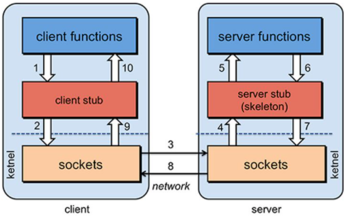
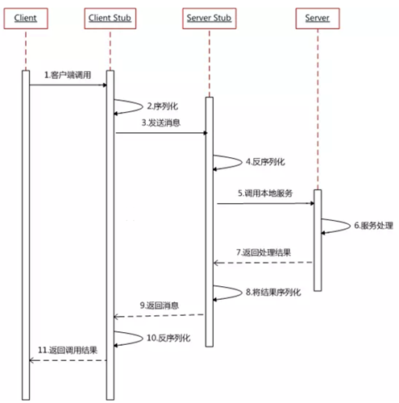

## 1. Dubbo 入门

### 1.1 架构演变趋势

随着互联网的发展，网站应用的规模不断扩大，常规的垂直应用架构已无法应对，分布式服务架构以及流动计算架构势在必行，亟需一个治理系统确保架构有条不紊的演进。

1. **单一应用架构**
   当网站流量很小时，只需一个应用，将所有功能都部署在一起，以减少部署节点和成本。此时，用于简化增删改查工作量的数据访问框架（ORM）是关键。
   
2. **垂直应用架构**

   当访问量逐渐增大，单一应用增加机器带来的加速度越来越小，提升效率的方法之一是将应用拆成互不相干的几个应用，以提升效率。此时，用于加速前端页面开发的Web框架（MVC）是关键。

3. **分布式服务架构**

   当垂直应用越来越多，应用之间交互不可避免，将核心业务抽取出来，作为独立的服务，逐渐形成稳定的服务中心，使前端应用能更快速的响应多变的市场需求。此时，用于提高业务复用及整合的分布式服务框架（RPC）是关键。

4. **流动计算架构**

   当服务越来越多，容量的评估，小服务资源的浪费等问题逐渐显现，此时需增加一个调度中心基于访问压力实时管理集群容量，提高集群利用率。此时，用于提高机器利用率的资源调度和治理中心（SOA）是关键。

### 1.2 RPC

**RPC（Remote Procedure Call）是指远程过程调用，是一种进程间通信方式**，它是一种技术的思想，而不是规范。它允许程序调用另一个地址空间（通常是共享网络的另一台机器上）的过程或函数，而不用程序员显式编码这个远程调用的细节。即程序员无论是调用本地的还是远程的函数，本质上编写的调用代码基本相同。**RPC 有两个核心模块：通讯、序列化**。

1. **RPC 基本原理**

   

   

2. **RPC 与 HTTP、TCP/UDP、Socket 的区别**

   - TCP/UDP：都是传输协议，主要区别是 TCP 协议连接需要三次握手，断开需要四次挥手，是通过流来传输的，就是确定连接后，一直发送信息，传完后断开。UDP 不需要进行连接，直接把信息封装成多个报文，直接发送，所以 UDP 的速度更快，但是不保证数据的完整性。
   - HTTP：超文本传输协议是—种应用层协议，建立在 TCP 协议之上
   - Socket：是在应用程序层面上对 TCP/IP 协议的封装和应用。其实是一个调用接口，方便程序员使用 TCP/IP 协议栈而已。程序员通过 Socket来使用 TCP/IP 协议。但是 Socket 并不是一定要使用 TCP/IP 协议，Socket 编程接口在设计的时候，就希望也能适应其他的网络协议。
   - RPC：是一种通过网络从远程计算机程序上请求服务，而不需要了解底层网络技术的协议。所以 RPC 的实现可以通过不同的协议去实现比如可以使 HTTP、RMI 等。

### 1.3 Dubbo 架构

Apache Dubbo 是一款高性能、轻量级的开源 Java RPC 框架，它提供了三大核心能力：**面向接口的远程方法调用，智能容错和负载均衡，以及服务自动注册和发现**。

**节点角色说明**

| 节点        | 角色说明                               |
| ----------- | -------------------------------------- |
| `Provider`  | 暴露服务的服务提供方                   |
| `Consumer`  | 调用远程服务的服务消费方               |
| `Registry`  | 服务注册与发现的注册中心               |
| `Monitor`   | 统计服务的调用次数和调用时间的监控中心 |
| `Container` | 服务运行容器                           |

**调用关系说明**

0. 服务容器负责启动，加载，运行服务提供者。

1. 服务提供者在启动时，向注册中心注册自己提供的服务。
2. 服务消费者在启动时，向注册中心订阅自己所需的服务。
3. 注册中心返回服务提供者地址列表给消费者，如果有变更，注册中心将基于长连接推送变更数据给消费者。
4. 服务消费者，从提供者地址列表中，基于软负载均衡算法，选一台提供者进行调用，如果调用失败，再选另一台调用。
5. 服务消费者和提供者，在内存中累计调用次数和调用时间，定时每分钟发送一次统计数据到监控中心。

## 参考

1. [Dubbo 官网](https://dubbo.apache.org/zh/docs/v2.7/user/preface/background/)