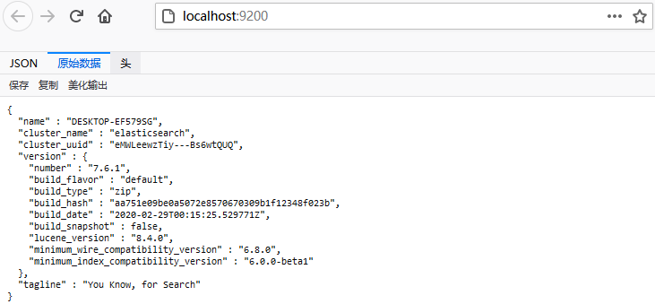
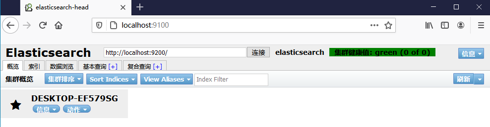
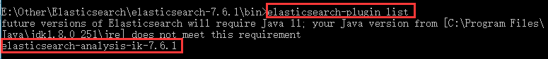
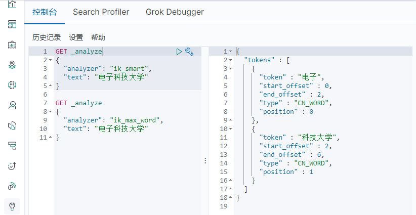
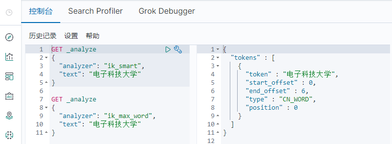

## 1. Elasticsearch 入门

### 1.1 ES 简介

Elasticsearch 简称 ES，是一个基于 Lucene 的搜索服务器。它提供了一个分布式多用户能力的**全文搜索引擎**，基于 **RESTful web** 接口。Elasticsearch 是用 Java 语言开发的，并作为 Apache 许可条款下的开放源码发布，是一种流行的企业级搜索引擎，维基百科、Stack Overflow、Github 都采用它。Elasticsearch用于云计算中，能够达到实时搜索，稳定，可靠，快速，安装使用方便。官方客户端在 Java、.NET（C#）、PHP、Python、Apache Groovy、Ruby 和许多其他语言中都是可用的。根据 DB-Engines 的排名显示，**Elasticsearch 是最受欢迎的企业搜索引擎**，其次是 Apache Solr，也是基于 Lucene。

### 1.2 ES v.s Solr

1. Elasticsearch 基本是开箱即用，非常简单；Solr 安装略微复杂。
2. Solr 利用 Zookeeper 进行分布式管理，而 Elasticsearch 自带分布式协调管理功能。
3. Solr 支持更多格式的数据，如 JSON、XML、CSV等，而 Elasticsearch 仅支持 json 文件格式。
4. Solr 官方提供的功能更多，而 Elasticsearch 本身更注重于核心功能，高级功能多由第三方插件提供，例如图形化界面需要 kibana 友好支撑。
5. Solr 查询快，但更新索引时慢（即插入删除慢），用于电商等查询多的应用；Elasticsearch 建立索引快，**实时性查询快**，用于 facebook、新浪等搜索。Solr 是传统搜索应用的有力解决方案，但 Elasticsearch 更适用于新兴的实时搜索应用。
6. Solr 比较成熟，有一个更大，更成熟的用户、开发和贡献者社区，而 Elasticsearch 相对开发维护者较少，更新太快，学习使用成本较高。

### 1.3 ELK 安装

ELK 其实并不是一款软件，而是一个日志分析架构技术的总称，是三个软件产品的首字母缩写，Elasticsearch，Logstash 和 Kibana。这三款软件都是开源软件，通常是配合使用，而且又先后归于 Elastic.co 公司名下，故被简称为 **ELK 协议栈**。其中 ES 是一个基于 Lucene、分布式、通过 Restful 方式进行交互的近实时搜索平台框架；Logstash 是 ELK 的中央数据流引擎，用于从不同目标（文件/数据存储/MQ）收集的不同格式数据，经过过滤后支持输出到不同目的地（文件/MQ/redis/elasticsearch/kafka等）；Kibana 可以将 ES 的数据通过友好的页面展示出来，提供实时分析的功能。它们下载地址分别为：[Elasticsearch](https://mirrors.huaweicloud.com/elasticsearch/?C=N&O=D)、[Logstash](https://mirrors.huaweicloud.com/logstash/?C=N&O=D)、[Kibana](https://mirrors.huaweicloud.com/kibana/?C=N&O=D)，**注意 ES 至少需要 Java 8 环境，且 Kibana 版本要与 ES 版本一致**。

1. 下载 ES 后，直接解压。然后配置跨域问题，修改 config/elasticsearch.yml 文件，在最后新增：

   ```yml
   http.cors.enabled: true
   http.cors.allow-origin: "*"
   ```

2. 进入 bin 目录，双击运行 elasticsearch.bat，然后浏览器访问 http://localhost:9200/

   

3. 使用 git 下载 ES 可视化工具 [elasticsearch-head](https://github.com/mobz/elasticsearch-head)，然后使用 npm 启动（详见 github 说明），最后浏览器访问 http://localhost:9100/

   

4. 下载 Kibana 后，直接解压。然后进行汉化，只需要修改 config/kibana.yml 文件，在最后新增：

   ```yml
   i18n.locale: "zh-CN"
   ```

5. 进入 bin 目录，双击运行 kibana.bat，然后浏览器访问 http://localhost:5601/

### 1.4 ES 基本概念

1. **索引（Index）**：ES 数据管理的顶层单位就叫做索引，相当于关系型数据库里的**数据库的概念**。另外，每个索引的名字必须是小写。

2. **文档（Document）**：索引里面单条的记录称为文档，相当于关系型数据库里的**行的概念**，文档使用 JSON 格式表示。同一个索引里面的文档，不要求有相同的结构（scheme），但是最好保持相同，这样有利于提高搜索效率。

3. **类型（Type）**：类型是虚拟的逻辑分组，用来过滤文档，相当于关系型数据库里的**表的概念**。在之后的版本中这个概念将被弃用。

4. **字段（Fields）**：每个文档包含了许多字段，每个字段都有其对应的值，相当于关系型数据库里的**列的概念**。

   以上 ES 概念与关系型数据库的概念类比如下，参考[漫画](https://developer.51cto.com/art/201904/594615.htm)容易理解。

   |    关系型数据库    |  Elasticsearch   |
   | :----------------: | :--------------: |
   | 数据库（database） |  索引（Index）   |
   |    表（table）     |   类型（Type）   |
   |     行（row）      | 文档（Document） |
   |    列（column）    |  字段（Fields）  |

5. **文档元数据（Document metadata）**：文档元数据为\_index、 \_type、 \_id，这三者可以唯一表示一个文档，\_index表示文档在哪存放，\_type表示文档的对象类别，\_id为文档的唯一标识。

6. **节点 & 集群（Node & Cluster）**：ES 本质上是一个分布式数据库，允许多台服务器协同工作，每台服务器可以运行多个 ES 实例。单个 ES 实例称为一个节点，一组节点构成一个集群。

7. **分片（Shards）**：ES 在物理设计上把每个索引划分成多个分片，每分分片可以在集群中的不同服务器间迁移。

8. **倒排索引（inverted index）**：倒排索引源于实际应用中需要根据属性的值来查找记录，这种索引表中的每一项都包括一个属性值和具有该属性值的各记录的地址。由于不是由记录来确定属性值，而是**由属性值来确定记录的位置**，因而称为倒排索引。带有倒排索引的文件我们称为倒排索引文件，简称倒排文件。


## 2. Elasticsearch 进阶

### 2.1 IK 分词器插件

当一个文档被存储时，ES 会使用分词器从文档中提取出若干词元（token）来支持索引的存储和搜索。ES 内置了很多分词器，但内置的分词器对中文的处理不好。ES 通过安装插件的方式来支持第三方分词器，IKAnanlyzer 分词器（简称 IK）是常用的第三方中文分词器。它提供了两个分词算法：`ik_smart` 和 `ik_max_word`，其中 `ik_smart` 为最少切分，`ik_max_word` 为最细粒度划分。

1. 首先下载 IK 分词器 [github 下载地址](https://github.com/medcl/elasticsearch-analysis-ik)，**注意版本与 ES 版本一致，**将其解压后放入 ES 的 plugins 目录下，然后重启 ES 和 Kibana，注意在启动过程中查看是否加载了 IK 分词器插件。也可以在 bin 目录下执行命令 `elasticsearch-plugin list` ，查看是否成功加载 IK 分词器。

   

2. 打开 Kibana，点击左侧的开发工具，使用 RESTful 风格发送请求。将“电子科技大学”分别进行最少切分和最细粒度划分，发现最少切分无法将其识别为一个词。因此，我们需要将这种词加入到我们的分词器字典中。

   

3. 在 IK 分词器的 conf 目录下，新建 `my_word.dic` 字典文件，使用文本编辑器将“电子科技大学”写入文件。然后配置 `IKAnalyzer.cfg.xml` 文件，将自定义的字典文件加入。

   ```xml
   <?xml version="1.0" encoding="UTF-8"?>
   <!DOCTYPE properties SYSTEM "http://java.sun.com/dtd/properties.dtd">
   <properties>
   	<comment>IK Analyzer 扩展配置</comment>
   	<!--用户可以在这里配置自己的扩展字典 -->
   	<entry key="ext_dict">my_word.dic</entry>
   	 <!--用户可以在这里配置自己的扩展停止词字典-->
   	<entry key="ext_stopwords"></entry>
   	<!--用户可以在这里配置远程扩展字典 -->
   	<!-- <entry key="remote_ext_dict">words_location</entry> -->
   	<!--用户可以在这里配置远程扩展停止词字典-->
   	<!-- <entry key="remote_ext_stopwords">words_location</entry> -->
   </properties>
   ```

4. 重启 ES 和 Kibana，再次进行测试，发现最少切分已经可以将“电子科技大学”识别为一个完整的词了。

   


### 2.2 CRUD 操作

ES 提供了多种交互使用方式，包括 Java API 和 RESTful API 。所有其他语言可以使用 RESTful API 通过端口 9200 和 ES 进行通信，你可以用你最喜爱的 web 客户端访问 ES。基本 Rest 命令说明如下：

| HTTP方法 |                   URL地址                    |          描述           |
| :------: | :------------------------------------------: | :---------------------: |
|   PUT    |     localhost:9200/索引名/类型名/文档 id     | 创建文档（指定文档 id） |
|   POST   |         localhost:9200/索引名/类型名         | 创建文档（随机文档 id） |
|   POST   | localhost:9200/索引名/类型名/文档 id/_update |        修改文档         |
|  DELETE  |     localhost:9200/索引名/类型名/文档 id     |        删除文档         |
|   GET    |     localhost:9200/索引名/类型名/文档 id     |  通过文档 id 查询文档   |
|   GET    |     localhost:9200/索引名/类型名/_search     |      查询所有数据       |

#### 2.2.1 插入

在 Kibana 控制台执行如下请求，创建一个索引名为 test1，类型名为 type1，id 为 1 的文档：

```json
PUT /test1/type1/1
{
  "name": "张三",
  "age": 3
}
```

执行后返回如下结果，打开 elasticsearch-head 可以看到插入的数据：

```json
{
  "_index" : "test1",
  "_type" : "type1",
  "_id" : "1",
  "_version" : 1,
  "result" : "created",
  "_shards" : {
    "total" : 2,
    "successful" : 1,
    "failed" : 0
  },
  "_seq_no" : 0,
  "_primary_term" : 1
}
```

在插入数据时我们并没有指定类型，此时 ES 会自动帮我们配置字段类型，使用命令 `GET /test1` 可查看。ES 常见数据类型如下，更多类型可以查看[官方文档](https://www.elastic.co/guide/en/elasticsearch/reference/current/mapping-types.html)：

* **字符串类型**：`text`、`keyword`，两者的区别是 `text` 将对字段值进行分析以进行全文本搜索，而 `keyword` 字符串按**原样保留**以进行过滤和排序
* **数值类型**：`long`、`integer`、`short`、`byte`、`double`、 `float`、`half_float`、`scaled_float`
* **日期类型**：`date`、`date_nanos`
* **布尔值类型**：`boolean`

```json
PUT /test2 
{
  "mappings": {
    "properties": {
      "name": {
        "type": "text"
      },
      "age": {
        "type": "long"
      },
      "birthday": {
        "type": "date"
      }
    }
  }
}
```

执行后返回如下结果：

```json
{
  "acknowledged" : true,
  "shards_acknowledged" : true,
  "index" : "test2"
}
```


#### 2.2.2 查询

在 Kibana 控制台执行如下请求，查看 test2 索引的信息：

```json
GET /test2
```

执行后返回如下结果：

```json
{
  "test2" : {
    "aliases" : { },
    "mappings" : {
      "properties" : {
        "age" : {
          "type" : "long"
        },
        "birthday" : {
          "type" : "date"
        },
        "name" : {
          "type" : "text"
        }
      }
    },
    "settings" : {
      "index" : {
        "creation_date" : "1606531652208",
        "number_of_shards" : "1",
        "number_of_replicas" : "1",
        "uuid" : "Eujt6h65SmeY9_1k_GwMEg",
        "version" : {
          "created" : "7060199"
        },
        "provided_name" : "test2"
      }
    }
  }
}
```

还可以通过 `GET _cat/...` 查看 ES 当前的很多信息：

```json
GET _cat/health
GET _cat/indices?v
```


#### 2.2.3 更新

在 Kibana 控制台执行如下请求，将张三的年龄更新为10：

```json
PUT /test1/type1/1
{
  "name": "张三",
  "age": 10
}
```

执行后返回如下结果，注意版本号从 1 变成了 2，且结果是更新状态：

```json
{
  "_index" : "test1",
  "_type" : "type1",
  "_id" : "1",
  "_version" : 2,
  "result" : "updated",
  "_shards" : {
    "total" : 2,
    "successful" : 1,
    "failed" : 0
  },
  "_seq_no" : 1,
  "_primary_term" : 1
}
```

使用 PUT 命令相当于进行了**覆盖操作**，比如上面修改的只是年龄，但是名字字段也不能缺少，否则名字会置空。因此更新操作建议使用 POST 命令，注意 `_doc` 是默认文档类型，用来代替即将废弃的 `type`：

```json
POST /test1/_doc/1/_update
{
  "doc": {
    "age": 11
  }
}
```


#### 2.2.4 删除

在 Kibana 控制台执行如下请求，将 test1 索引删除：

```json
DELETE /test1
```

执行后返回如下结果，打开 elasticsearch-head 可以查看是否删除成功：

```json
{
  "acknowledged" : true
}
```


#### 2.2.5 复杂查询

```json
// 简单查询
GET /test/user/_search?q=name:张三

// 简单查询，并处理结果
GET /test/user/_search
{
  "query": {
    "match": {					// match会使用分词器解析，term用于精确查询
      "name": "张三"
    }
  },
  "sort": [						// sort用于指定排序
    {
      "age": {
        "order": "desc"
      }
    }
  ], 
  "from": 0, 					// 分页查询，from表示起始页，size表示页的大小
  "size": 1, 
  "_source": ["name", "tags"],	// _source用于结果过滤
  "highlight": {				// highlight用于高亮查询，默认使用<em>标签
    "fields": {					// 使用pre_tags和post_tags可自定义高亮的标签
      "name": {}
    }
  }
}

// 复杂查询
GET /test/user/_search
{
  "query": {
    "bool": {					// bool用于复杂查询
      "must": [					// must表示条件and，should表示条件or，must_not表示条件not
        {
          "match": {
            "name": "张三"
          }
        },
        {
          "match": {
            "desc": "一顿操作"
          }
        }
      ],
      "filter": {				// filter用于多条件过滤
        "range": {
          "age": {
            "gte": 1,			// 大于等于
            "lte": 20			// 小于等于
          }
        }
      }
    }
  }
}
```


### 2.3 Spring Boot 集成

#### 2.3.1 依赖与配置

```xml
<properties>
    <java.version>1.8</java.version>
    <!-- 自定义ES版本依赖，最好与 ES 版本保持一致，防止不兼容问题 -->
    <elasticsearch.version>7.6.1</elasticsearch.version>
</properties>

<dependencies>
    <!-- elasticsearch依赖 -->
    <dependency>
        <groupId>org.springframework.boot</groupId>
        <artifactId>spring-boot-starter-data-elasticsearch</artifactId>
    </dependency>
	<!-- json依赖 -->
    <dependency>
        <groupId>com.alibaba</groupId>
        <artifactId>fastjson</artifactId>
        <version>1.2.62</version>
    </dependency>
<dependencies>
```

```java
@Configuration
public class ESClientConfig {
    @Bean
    public RestHighLevelClient restHighLevelClient() {
        return new RestHighLevelClient(
                RestClient.builder(new HttpHost("localhost", 9200, "http"))
        );
    }
}
```

#### 2.3.2 索引操作

```java
@SpringBootTest
class IndexTests {
    @Autowired
    private RestHighLevelClient client;

    @Test	// 创建索引
    void testCreateIndex() throws IOException {
        // 1.创建索引请求
        CreateIndexRequest request = new CreateIndexRequest("test");
        // 2.客户端执行请求，获取响应
        CreateIndexResponse response = client.indices().create(request, RequestOptions.DEFAULT);
        System.out.println(response);
    }

    @Test	// 获取索引
    void testGetIndex() throws IOException {
        GetIndexRequest request = new GetIndexRequest("test");
        boolean exists = client.indices().exists(request, RequestOptions.DEFAULT);
        System.out.println(exists);
    }

    @Test	// 删除索引
    void testDeleteIndex() throws IOException {
		DeleteIndexRequest request = new DeleteIndexRequest("test");
		AcknowledgedResponse response = client.indices().delete(request, RequestOptions.DEFAULT);
		System.out.println(response.isAcknowledged());
	}
}
```

#### 2.3.3 文档操作

```java
@Data
@AllArgsConstructor
@NoArgsConstructor
public class User {
    private String name;
    private int age;
}
```

```java
@SpringBootTest
public class DocumentTests {
    @Autowired
    private RestHighLevelClient client;

    @Test	// 添加文档
    void testAddDocument() throws IOException {
        // 1.创建对象和请求
        User user = new User("张三", 22);
        IndexRequest request = new IndexRequest("test");
        request.id("1");
        request.timeout(TimeValue.timeValueSeconds(1));
        // 2.将数据放入请求
        request.source(JSON.toJSONString(user), XContentType.JSON);
        // 3.客户端执行请求，获取响应
        IndexResponse response = client.index(request, RequestOptions.DEFAULT);
        System.out.println(response.toString());
        System.out.println(response.status());
    }

    @Test	// 获取文档
    void testGetDocument() throws IOException {
        GetRequest request = new GetRequest("test", "1");
        // 不获取返回的_source上下文
        request.fetchSourceContext(new FetchSourceContext(false));
        boolean exists = client.exists(request, RequestOptions.DEFAULT);
        System.out.println(exists);

        request = new GetRequest("test", "1");
        GetResponse response = client.get(request, RequestOptions.DEFAULT);
        System.out.println(response);
        System.out.println(response.getSourceAsString());
    }

    @Test	// 更新文档
    void testUpdateDocument() throws IOException {
        UpdateRequest request = new UpdateRequest("test", "1");
        request.timeout(TimeValue.timeValueSeconds(1));

        User user = new User("李四", 18);
        request.doc(JSON.toJSONString(user), XContentType.JSON);
        UpdateResponse response = client.update(request, RequestOptions.DEFAULT);
        System.out.println(response.status());
    }

    @Test	// 删除文档
    void testDeleteDocument() throws IOException {
        DeleteRequest request = new DeleteRequest("test", "1");
        request.timeout(TimeValue.timeValueSeconds(1));
        DeleteResponse response = client.delete(request, RequestOptions.DEFAULT);
        System.out.println(response.status());
    }

    @Test	// 批量添加文档
    void testBulkRequest() throws IOException {
        BulkRequest request = new BulkRequest();
        request.timeout(TimeValue.timeValueSeconds(10));

        List<User> userList = new ArrayList<>();
        userList.add(new User("张三", 33));
        userList.add(new User("李四", 44));
        userList.add(new User("王五", 55));

        for (int i = 0; i < userList.size(); i++) {
            // 批量更新、删除只需要修改对应请求即可
            request.add(new IndexRequest("test")
                    .id("" + (i + 1))
                    .source(JSON.toJSONString(userList.get(i)), XContentType.JSON));
        }

        BulkResponse response = client.bulk(request, RequestOptions.DEFAULT);
        System.out.println(response.hasFailures());
    }

    @Test	// 复杂查询文档
    void testSearchRequest() throws IOException {
        // 1.构建查询条件
        SearchSourceBuilder sourceBuilder = new SearchSourceBuilder();
        // 使用QueryBuilders工具类来实现查询条件
        // 1.1 精准查询，keyword解决中文问题
        QueryBuilder queryBuilder = QueryBuilders.termQuery("name.keyword", "张三");
        sourceBuilder.query(queryBuilder);
        // 1.2 分页
        sourceBuilder.from(pageId); 
        sourceBuilder.size(pageSize);
        // 1.3 高亮
        HighlightBuilder highlightBuilder = new HighlightBuilder();
        highlightBuilder.field("name");
        highlightBuilder.requireFieldMatch(false);	// 设置可以多个字段高亮
        highlightBuilder.preTags("<span style='color:red'>");
        highlightBuilder.postTags("</span>");
        sourceBuilder.highlighter(highlightBuilder);
        sourceBuilder.timeout(TimeValue.timeValueSeconds(60));

        // 2.将查询条件放入请求
        SearchRequest request = new SearchRequest("test");
        request.source(sourceBuilder);
        // 3.客户端执行请求，获取响应
        SearchResponse response = client.search(request, RequestOptions.DEFAULT);
        System.out.println(JSON.toJSONString(response.getHits()));
        for (SearchHit documentFiled : response.getHits().getHits()) {
            System.out.println(documentFiled.getSourceAsString());
        }
    }
}
```


## 参考

1. [b站 - ElasticSearch7.6.x最新完整教程通俗易懂](https://www.bilibili.com/video/BV17a4y1x7zq)
2. [漫画 - 终于有人把Elasticsearch原理讲透了](https://developer.51cto.com/art/201904/594615.htm)
3. [简书 - ElasticSearch中文分词](https://www.jianshu.com/p/bb89ad7a7f7d)