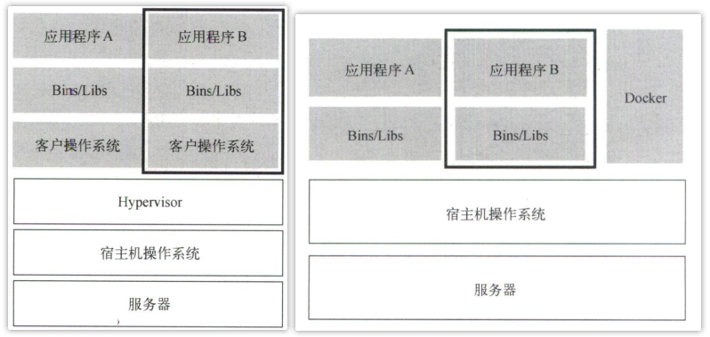
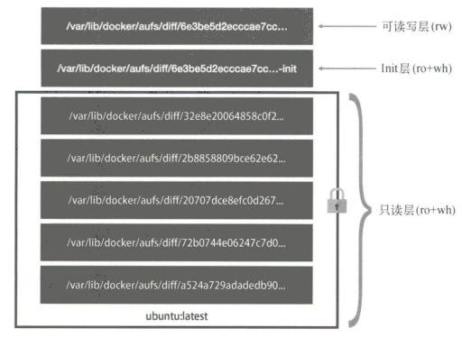
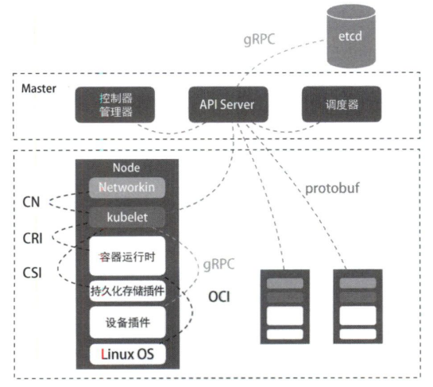
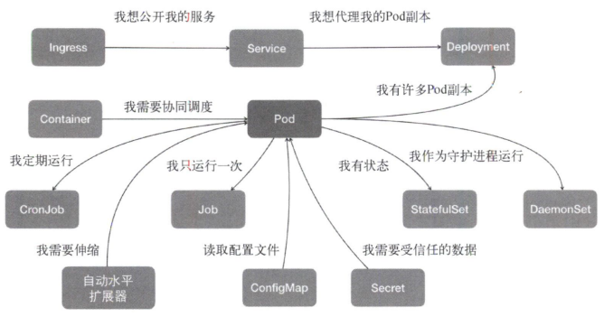
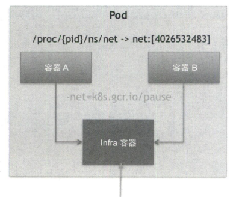
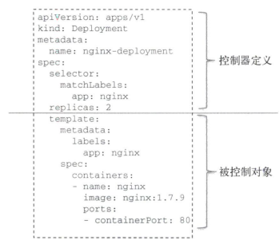
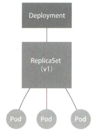

# 1. 容器技术基础

## 1.1 从进程开始说起

如果运行一个 Docker 容器，并在容器里执行 ps 命令，可以看到，在 Docker 里最开始执行的 /bin/bash 就是这个容器的第 1 号进程（PID=1），而这个容器里共有两个进程在运行。这就说明，前面执行的 /bin/bash 和刚刚执行的 ps，已经被 Docker 隔离在一个跟宿主机完全不同的世界。

```shell
[root@VM-24-2-centos ~]# docker run -it centos /bin/bash
[root@61e5331b6042 /]# ps
  PID TTY          TIME CMD
    1 pts/0    00:00:00 bash
   15 pts/0    00:00:00 ps
```

本来，每当我们在宿主机上运行一个  /bin/bash 程序，操作系统都会给它分配一个 PID，假设 PID=100。现在，我们通过 Docker 在容器中运行这个  /bin/bash 程序，这时 Docker 就会在给它施一个“障眼法”，让它永远看不到前面的 99 个进程，并误以为自己是第 1 号进程，可实际在宿主机操作系统中，它还是原来的第 100 号进程。

**这种技术就是 Linux 的 Namespace 机制，它其实只是 Linux 创建新进程的一个可选参数**。当使用 clone() 系统调用创建一个新进程时，可以指定 CLONE_NEWPID 参数，这时新创建的进程将会看到一个全新的进程空间，在这个进程空间里，它的 PID 是 1。

除了 PID Namespace，Linux 操作系统还提供了 Mount、UTS、IPC、Network 和 User 这些 Namespace，用来对各种进程上下文施“障眼法”。比如 Mount Namespace 用于让被隔离进程只看到当前 Namespace 里的挂载点信息。这就是 Linux 容器最基本的实现原理，可见**容器其实是一种特殊的进程而已**。

**容器是一个单进程模型**，这是由于容器的本质就是一个进程，用户的应用进程实际上就是容器里 PID=1 的进程，也是后续创建的所有进程的父进程。这意味着，在一个容器中，无法同时运行两个不同的应用，除非事先找到一个公共的 PID=1 的程序充当两个不同应用的父进程。


## 1.2 隔离与限制



使用虚拟化技术作为应用沙盒，就必须由 Hypervisor 来负责创建虚拟机，这个虚拟机是真实存在的，并且它里面运行一个完整的客户操作系统，这就不可避免地带来了额外的资源消耗。相比之下，容器化后的应用依然是宿主机上的普通进程，这就使得容器额外的资源占用几乎可以忽略不计。有利有弊，**相较于虚拟机，容器的优势是敏捷和高性能，但是它有一个主要问题：隔离得不彻底**。

首先，即然容器是在宿主机上运行的一种特殊进程，那么**多个容器之间使用的就还是同一个宿主机的操作系统内核**。这意味着，如果要在 Windows 宿主机上运行 Linux 容器，或在低版本的 Linux 宿主机上运行高版本的 Linux 容器，都是行不通的。其次，在 Linux 内核中，**有很多资源和对象是不能被 Namespace 化的，比如时间**。这意味着，如果容器中的程序通过系统调用修改了时间，那么整个宿主机的时间也被修改了。由于上述问题，尤其是共享宿主机内核的事实，容器向应用暴露的攻击面是相当大的，应用“越狱”的难度也比虚拟机低得多。

虽然容器内的第 1 号进程在“障眼法”干扰下只能看到容器里的情况，但在宿主机上，它作为第 100 号进程与其他进程之间依然是平等的竞争关系。虽然第 100 号进程表明上被隔离了，但是它可能用光所有资源（如CPU、内存）。**Linux Cgroups（Linux control groups）就是 Linux 内核用来为进程设置资源限制的**。

```shell
# 在/sys/fs/cgroup/目录下有诸如cpuset、cpu、memory这样的子目录，也叫子系统，这些都是可以被Cgroups限制的资源种类
[root@VM-24-2-centos ~]# ls /sys/fs/cgroup/
blkio  cpuacct      cpuset   freezer  memory   net_cls,net_prio  perf_event  systemd
cpu    cpu,cpuacct  devices  hugetlb  net_cls  net_prio          pids

# 以CPU为例，cfs_quota_us和rt_period_us两个参数组合，可用于限制进程在长度为rt_period_us的一段时间内，只能被分配到cfs_quota_us总量为的CPU时间
[root@VM-24-2-centos ~]# ls /sys/fs/cgroup/cpu
cgroup.clone_children  cpuacct.stat          cpu.cfs_quota_us   cpu.stat           release_agent
cgroup.event_control   cpuacct.usage         cpu.rt_period_us   docker             system.slice
cgroup.procs           cpuacct.usage_percpu  cpu.rt_runtime_us  notify_on_release  tasks
cgroup.sane_behavior   cpu.cfs_period_us     cpu.shares         onion              user.slice

# Docker在CPU子系统下为容器创建了一个控制组（新目录），容器启动时指定的CPU限制参数，被写入到对应的文件
root@VM-24-2-centos ~]# docker run -it --cpu-period=100000 --cpu-quota=20000 centos /bin/bash
[root@cd714667e419 /]# [ctrl+p+q退出] 
[root@VM-24-2-centos ~]# cat /sys/fs/cgroup/cpu/docker/cd714667e419d03a34b39a0b8693610183296a1782cea9478e60fd6a9eb5d8b1/cpu.cfs_period_us 
100000
[root@VM-24-2-centos ~]# cat /sys/fs/cgroup/cpu/docker/cd714667e419d03a34b39a0b8693610183296a1782cea9478e60fd6a9eb5d8b1/cpu.cfs_quota_us 
20000
```


## 1.3 深入理解容器镜像

与其它 Namespace 不同，由于 Mount Namespace 修改的是容器进程对文件系统挂载点的认知，**因此只有在挂载操作发生后，进程的试图才会改变**，而在此之前，新创建的容器会直接继承宿主机的各个挂载点。为了使每次创建新容器时，容器进程看到的文件系统是一个独立的隔离环境，需要在容器进程启动之前重新挂载它的整个根目录。在 Linux 系统中，有一个 chroot 命令可以在 shell 中方便地完成这项工作，chroot 意为 change root file system，即改变进程的根目录到指定位置。

**这个挂载在容器根目录用来为容器进程提供隔离后的文件系统，就是所谓的容器镜像，即 rootfs（根文件系统）**。rootfs 只是一个操作系统所包含的文件、配置和目录，并不包括操作系统内核。为了便于复用，Docker 在镜像设计中引入层的概念，**用户制作镜像的每一步操作都会生成一个层，即一个增量 rootfs，并使用 UnionFS（union file system，联合文件系统）将不同位置的目录联合挂载到同一个目录下**。



镜像的层都放置在 /var/lib/docker/aufs/diff 目录下，然后被联合挂载在 /var/lib/docker/aufs/mnt 中。**容器的 rootfs 由三部分组成：只读层、Init 层和可读写层**。

1. **只读层**：位于 rootfs 最底层，挂载方式都是只读的 ro+wh，即 readonly + whiteout（白障）。
2. **可读写层**：位于 rootfs 最上层，挂载方式是 rw，即 read write。在写入文件之前，该目录为空，一旦在容器中进行了写操作，修改的内容就会以增量的方式出现在该层。而如果要删除只读层里的文件，UnionFS 就会在可读写层创建一个 whiteout 文件，把只读层里的文件“遮挡”起来，实现删除的效果。当修改完容器后，可以使用  docker commit 提交这个修改过的可读写层。实际上，由于使用了 UnionFS，因此在容器里对镜像 rootfs 所做的任何修改，都会被操作系统先复制到这个可读写层，然后再修改，这就是 Copy-on-Write。
3. **Init 层**：位于只读层和可读写层之间，是一个以 -init 结尾的层。它是 Docker 项目单独生成的一个内部层，专门用来存放 /etc/hosts、/etc/resolv.conf 等信息。由于有些修改只对当前容器有效（如 hostname），因此，Docker 在修改了这些文件后以一个单独的层挂载，用户执行 docker commit 只会提交可读写层，而不包含这些内容。

总结：**容器的本质是进程，Namespace 做隔离，Cgroups 做限制，rootfs 做文件系统**。


## 1.4 重新认识 Linux 容器

一个进程的每种 Linux Namespace 都在它对应的 /proc/[PID]/ns 下有一个对应的虚拟文件，并链接到一个真实的 Namespace 文件上。有了这样一个可以 hold 所有 Linux Namespace 的文件，一个进程就可以选择加入进程已有的某个 Namespace 当中（比如 network），从而进入该进程所在的容器，这就是 docker exec 的实现原理。

```shell
[root@VM-24-2-centos ~]# docker run -it centos /bin/bash
[root@1e981f7fadf9 /]# [ctrl+p+q退出]

# 查看正在运行的Docker容器的PID
[root@VM-24-2-centos ~]# docker inspect --format '{{ .State.Pid}}' 1e981f7fadf9
28862
# 查看容器进程的所有namespace对应的文件
[root@VM-24-2-centos ~]# ls -l /proc/28862/ns
total 0
lrwxrwxrwx 1 root root 0 Aug 13 10:32 ipc -> ipc:[4026532174]
lrwxrwxrwx 1 root root 0 Aug 13 10:32 mnt -> mnt:[4026532172]
lrwxrwxrwx 1 root root 0 Aug 13 10:31 net -> net:[4026532177]
lrwxrwxrwx 1 root root 0 Aug 13 10:32 pid -> pid:[4026532175]
lrwxrwxrwx 1 root root 0 Aug 13 10:32 user -> user:[4026531837]
lrwxrwxrwx 1 root root 0 Aug 13 10:32 uts -> uts:[4026532173]
```

Volume 机制允许将宿主机上指定的目录或文件挂载到容器中进程读写，那么它的实现原理又是什么？前面介绍过，当容器进程被创建后，进程开启了 Mount Namespace，但是在它执行 chroot 之前，容器进程一直可以看到宿主机上的整个文件系统，自然也包括我们要使用的容器镜像 rootfs。所以，我们**只需要在 rootfs 准备好后，在执行 chroot 之前**，把 Volume 指定的宿主机目录（如 /home 目录）挂载到指定的容器目录（如 /test 目录）在宿主机上对应的目录（如 /var/lib/docker/aufs/mnt/[可读写层 ID]/test 目录），Volume 的挂载工作就完成了。

更重要的是，由于执行这个挂载操作时“容器进程”已经创建了，也就意味着此时 Mount Namespace 已经开启，因此这个挂载事件只在该容器里可见。在宿主机上看不到容器内部的这个挂载点，这就避免了 Volume 打破容器的隔离性。


# 2. K8s 设计与架构

## 2.1 K8s 核心设计与架构

**容器实际上是由 Linux Namespace、Linux Cgroups 和 roofs 这三种技术构建出来的进程隔离环境**，一个正在运行的 Linux 容器，可以分为两部分：

* 一组联合挂载在 /var/lib/docker/aufs/mnt 上的 roofs，这部分称为**容器镜像（container image）**，是容器的静态视图；
* 一个由 Namespace + Cgroups 构成的隔离环境，这部分称为**容器运行时（container runtime）**，是容器的动态试图。



**K8s 由 Master 和 Node 两种节点组成，分别对应控制节点和计算节点**。其中 Master 控制节点由三个独立组件组合而成，分别是负责 API 服务的 kube-apiserver、负责调度的 kube-scheduler，以及负责容器编排的 kube-controller-manager。整个集群的持久化数据，则由 kube-apiserver 处理后保存在 etcd 中。

计算节点上最核心的部分是一个名为 kubelet 的组件，它主要负责同容器运行时（如 Docker 项目）交互，这种交互依赖一个称为 CRI（container runtime interface）的远程调用接口，该接口定义了容器运行时的各项核心操作，如启动一个容器需要的所有参数。只要容器运行时能够运行标准的容器镜像，它就可以通过实现 CRI 接入 K8s 项目。而具体的容器运行时，则一般通过 OCI 这个容器运行时规范同底层 Linux 操作系统交互，即把 CRI 请求翻译为对 Linux 的调用（操作 Linux Namespace 和 Cgroups 等）。

kubelet 通过 gRPC 协议同一个叫做 Device Plugin 的插件进行交互，这个插件是 K8s 用来管理 GPU 等宿主机物理设备的主要组件，也是基于 K8s 进行机器学习训练、高性能作业支持等工作必须关注的功能。此外，kubelet 调用网络插件和存储插件为容器配置网络和持久化存储，这两个插件与 kubelet 进行交互的接口分别是 CNI（container networking interface） 和 CSI （container storage interface）。


## 2.2 K8s 核心能力与项目定位

在大规模集群中的各种任务之间运行，实际上存在各种各样的关系，处理这些关系才是作业编排和管理系统最困难的地方。K8s 最主要的设计思想是，以统一的方式抽象底层基础设施能力（如计算、存储、网络），定义任务编排的各种关系（如亲密关系、访问关系、代理关系），将这些抽象以声明式 API 的方式对外暴露，从而允许平台构建者基于这些抽象进一步构建自己的 PaaS 乃至任何上层平台。



从容器这个最基本的概念出发，首先遇到了容器间紧密协作关系的难题，于是扩展到了 Pod；有了 Pod 之后，我们希望能一次启动多个应用实例，这样就需要 Deployment 这个 Pod 多实例管理器；而有了一组相同的 Pod 后，我们又需要通过固定的 IP 和端口以负载均衡的方式访问它，于是有了 Service。如果两个不同 Pod 之间不仅有访问关系，还要求在发起时加上授权信息，则 K8s 提供一种叫做 Secret 的对象，它其实是保存在 etcd 里的键值对数据。

除了应用与应用之间的关系，应用运行的形态是影响“如何容器化这个应用”的第二个重要因素。为此，K8s 定义新的、基于 Pod 改进后的对象。如 Job 用来描述一次性运行的 Pod（如大数据任务）；DaemonSet 用来描述每个宿主机上必须且只能运行一个副本的守护进程服务；CronJob 用来描述定时任务等。

K8s 并没有像其他项目一样，为每一个管理功能创建一条指令，然后在项目中实现逻辑。它的使用方法是：

* 首先通过一个任务编排对象，如 Pod、Job、CronJob 等，描述你试图管理的应用；
* 然后为它定义一些运维能力对象，如 Service、Ingress、Horizontal pod Autoscaler（自动水平扩展器）等，这些对象会负责具体的运维能力侧功能。

过去很多集群管理项目，如 Yarn、Mesos 以及 Swarm，是把一个容器按照某种规则放置在某个最佳节点上运行，这种功能称为调度。而 K8s 则是按照用户意愿和整个系统的规则，完全自动化地处理好容器之间的各种关系，这种功能称为编排。


# 3. K8s 集群搭建与配置

目前生产部署 K8s 集群有两种方式，**第一种是 kubeadm 部署工具**，它提供了 kubeadm init（创建一个 Master 节点）和 kubeadm join（将一个 Node 节点加入当前集群），用于快速部署 K8s 集群，这种方式降低部署门槛，但屏蔽了很多细节，遇到问题很难排查；**第二种是从 GitHub 下载发行版的二进制包**，手动部署每个组件，组成 K8s 集群，这种方式部署麻烦，但是可以学习很多工作原理，也利于后期维护。

## 3.1 kubeadm 搭建 K8s 集群

1. **系统初始化**

   ```shell
   # 集群规划，括号前为主机名，括号内为IP，以下操作若未作特殊说明，均需要在三台机器上执行
   # k8smaster（192.168.231.200）、k8snode1（192.168.231.201）、k8snode2（192.168.231.202）
   # 硬件要求：内存 >= 2G、CPU >= 2个、硬盘 >= 30G
   
   # 关闭防火墙、selinux、swap分区
   systemctl stop firewalld	# 临时
   systemctl disable firewalld	# 永久
   sed -i 's/enforcing/disabled/' /etc/selinux/config	# 永久
   setenforce 0	# 临时
   swapoff -a		# 临时
   sed -ri 's/.*swap.*/#&/' /etc/fstab	# 永久
   
   # 仅在k8smaster添加hosts
   cat >> /etc/hosts << EOF
   192.168.231.200 k8smaster
   192.168.231.201 k8snode1
   192.168.231.202 k8snode2
   EOF
   
   # 将桥接的IPv4流量传递到iptables
   cat > /etc/sysctl.d/k8s.conf << EOF
   net.bridge.bridge-nf-call-ip6tables = 1
   net.bridge.bridge-nf-call-iptables = 1
   EOF
   # 生效
   sysctl --system 
   
   # 时间同步
   yum -y install ntpdate
   ntpdate time.windows.com
   ```

2. **安装 Docker、kubelet、kubeadm、kubectl**

   ```shell
   # 配置Docker的阿里yum源
   cat > /etc/yum.repos.d/docker.repo << EOF
   [docker-ce-edge]
   name=Docker CE Edge - \$basearch
   baseurl=https://mirrors.aliyun.com/docker-ce/linux/centos/7/\$basearch/edge
   enabled=1
   gpgcheck=1
   gpgkey=https://mirrors.aliyun.com/docker-ce/linux/centos/gpg
   EOF
   # 安装Docker
   yum -y install docker-ce
   docker --version
   # 配置Docker镜像源
   cat >> /etc/docker/daemon.json << EOF
   {
     "registry-mirrors": ["https://b9pmyelo.mirror.aliyuncs.com"]
   }
   EOF
   # 启动Docker
   systemctl enable docker
   systemctl start docker
   
   # 配置yum的k8s软件源
   cat > /etc/yum.repos.d/kubernetes.repo << EOF
   [kubernetes]
   name=Kubernetes
   baseurl=https://mirrors.aliyun.com/kubernetes/yum/repos/kubernetes-el7-x86_64
   enabled=1
   gpgcheck=0
   repo_gpgcheck=0
   gpgkey=https://mirrors.aliyun.com/kubernetes/yum/doc/yum-key.gpg https://mirrors.aliyun.com/kubernetes/yum/doc/rpm-package-key.gpg
   EOF
   # 安装kubelet、kubeadm、kubectl，同时指定版本
   yum install -y kubelet-1.17.0 kubeadm-1.17.0 kubectl-1.17.0
   # 设置开机启动
   systemctl enable kubelet
   ```

3. **部署 Master 节点**

   ```shell
   # 以下操作仅在k8smaster上执行，第一个参数值为Master节点IP，要求机器至少2个CPU
   # 该命令执行成功后，会输出接下来加入Node节点的相关命令
   kubeadm init --apiserver-advertise-address=192.168.231.200 --image-repository registry.aliyuncs.com/google_containers --kubernetes-version v1.17.0 --service-cidr=10.96.0.0/12  --pod-network-cidr=10.244.0.0/16
   
   # 使用kubectl工具
   mkdir -p $HOME/.kube
   sudo cp -i /etc/kubernetes/admin.conf $HOME/.kube/config
   sudo chown $(id -u):$(id -g) $HOME/.kube/config
   
   # 查看正在运行的节点，此时Master已经运行，但还处于未准备状态
   kubectl get nodes
   ```

4. **加入 Node 节点**

   ```shell
   # 以下操作仅在k8snode1和k8snode2上执行，参考上面Master节点初始化后的对应输出命令
   kubeadm join 192.168.231.200:6443 --token nhiswz.qm40y78llhfpvvdr \
       --discovery-token-ca-cert-hash sha256:b8f4d39af900213777333acb216b063b72030add9c925a83d274dd450a6dd231
   
   # 可选操作：默认token有效期为24小时，当过期之后，该token就不可用了，此时就需要重新创建token
   kubeadm token create --print-join-command
   # 可选操作：在Master节点再次查看各节点状态
   kubectl get node
   ```

5. **部署 CNI 网络插件**

   参考：[kube-flannel.yml](https://blog.csdn.net/weixin_43298522/article/details/109769013?utm_medium=distribute.pc_relevant.none-task-blog-2~default~baidujs_baidulandingword~default-0.pc_relevant_paycolumn_v3&spm=1001.2101.3001.4242.1&utm_relevant_index=3)、[kubeadm 方式安装 K8s 集群](https://blog.csdn.net/weixin_44176978/article/details/124481302)

   ```shell
   # 以下操作仅在k8smaster上执行，此时节点状态均为NotReady，需要网络插件进行联网访问，下载网络插件配置 
   kubectl apply -f https://raw.githubusercontent.com/coreos/flannel/master/Documentation/kubeflannel.yml
   
   # 若上述命令无法执行，可能是因为无法访问外网，可手动创建kubeflannel.yml，内容参考如上，然后相对路径执行如下命令
   kubectl apply -f kube-flannel.yml
   
   # 查看状态，kube-system是k8s中的最小单元
   [root@k8smaster ~]# kubectl get pods -n kube-system
   NAME                                READY   STATUS    RESTARTS   AGE
   coredns-9d85f5447-k6zbf             1/1     Running   0          89m
   coredns-9d85f5447-mzgfj             1/1     Running   0          89m
   etcd-k8smaster                      1/1     Running   0          89m
   kube-apiserver-k8smaster            1/1     Running   0          89m
   kube-controller-manager-k8smaster   1/1     Running   0          89m
   kube-flannel-ds-amd64-45jm2         1/1     Running   0          27m
   kube-flannel-ds-amd64-5pz8v         1/1     Running   0          27m
   kube-flannel-ds-amd64-v2spc         1/1     Running   0          27m
   kube-proxy-dkpvz                    1/1     Running   0          78m
   kube-proxy-dxvkd                    1/1     Running   0          79m
   kube-proxy-g889g                    1/1     Running   0          89m
   kube-scheduler-k8smaster            1/1     Running   0          89m
   ```

6. **测试 K8s 集群**

   ```shell
   # 下载Nginx，并暴露端口
   kubectl create deployment nginx --image=nginx
   kubectl expose deployment nginx --port=80 --type=NodePort
   
   # 查看对外的端口，命令输出如下，然后本地浏览器访问192.168.231.200:30404，即可看到Nginx界面
   [root@k8smaster ~]# kubectl get pod,svc
   NAME                         READY   STATUS    RESTARTS   AGE
   pod/nginx-86c57db685-w2svz   1/1     Running   0          11m
   
   NAME                 TYPE        CLUSTER-IP     EXTERNAL-IP   PORT(S)        AGE
   service/kubernetes   ClusterIP   10.96.0.1      <none>        443/TCP        76m
   service/nginx        NodePort    10.96.217.19   <none>        80:30404/TCP   11m
   ```

7. **错误汇总**

   ```shell
   # 1.执行Kubernetes init时，报错如下。解决：因为K8s要求的最低核数为2，调整虚拟机核数重启系统即可
   [ERROR NumCPU]: the number of available CPUs 1 is less than the required 2
   
   # 2.执行kubeadm join时，报错如下。出于安全考虑，Linux系统默认是禁止数据包转发的。所谓转发即当主机拥有多于一块的网卡时，其中一块收到数据包，根据数据包的目的ip地址将包发往本机另一网卡，该网卡根据路由表继续发送数据包，这通常就是路由器所要实现的功能。也就是说，/proc/sys/net/ipv4/ip_forward 文件的值不支持转发。解决：编辑/etc/sysctl.conf，把“net.ipv4.ip_forward = 0”改成“net.ipv4.ip_forward = 1”，若文件中没有该选项，则将其添加上，然后执行命令sysctl -p使其生效
   [ERROR FileContent--proc-sys-net-ipv4-ip_forward]: /proc/sys/net/ipv4/ip_forward contents are not set to 1
   ```


## 3.2 kubeadm 部署原理

### 3.2.1 kubeadm 工作原理

首先为什么不用容器部署 K8s 呢？这样做有一个很麻烦的问题：**如何容器化 kubelet**。kubelet 是 K8s 用来操作 Docker 等容器运行时的核心组件，除外之外，它在配置容器网络、管理容器 Volume 时，都需要直接操作宿主机。如果 kubelet 本身就运行在容器中，那么直接操作宿主机就会很麻烦，对于网络配置，kubelet 容器可以通过不开启 Network Namespace（Docker 的 host network 模式）的方式，直接共享宿主机的网络栈，但是让 kubelet 隔着容器操作宿主机的文件系统就比较困难了。

因此，kubeadm 选择了一种妥协方案：**直接在宿主机上运行 kubectl，然后使用容器部署其他 K8s 组件**。所以，使用 kubeadm 的第一步，就是在机器上手动安装 kubeadm、kubelet 和 kubectl。


### 3.2.2 kubeadm init 工作流程

在执行 kubeadm init 指令后，kubeadm 首先要做**一系列检查工作**，以确定这台机器可以用来部署 K8s，这一步检查称为 Preflight Checks。之后，kubeadm 就会**生成 K8s 对外提供服务所需的各种证书和对应目录**。K8s 对外提供服务时，除非专门开启“非安全模式”，否则都要通过 HTTPS 才能访问 kube-apiserver，这就需要为 K8s 集群配置好证书文件。

证书生成后，kubeadm **会为其它组件生成访问 kube-apiserver 所需的配置文件**，这些文件记录的是当前 Master 节点的服务器地址、监听端口、证书目录等信息，这样对应的客户端（如 scheduler、kubelet 等）可以直接加载相应的文件，使用其中的信息与 kube-apiserver 建立安全连接。

接下来，kubeadm 会**为 Master 组件生成 Pod 配置文件**，前面介绍的三个 Master 组件 kube-apiserver、kube-controller-manager 和 kube-scheduler 都会通过 Pod 的方式被部署。K8s 有一种叫做“Static Pod”的容器启动方法，它允许把要部署的 Pod 的 YAML 文件放在一个指定的目录中，这样当 kubectl 启动时，它会自动检查该目录，加载所有 Pod YAML 文件启动它们。

```shell
# kubeadm生成的各种证书文件
[root@k8smaster ~]# ls /etc/kubernetes/pki
apiserver.crt                 apiserver-kubelet-client.key  front-proxy-ca.key
apiserver-etcd-client.crt     ca.crt                        front-proxy-client.crt
apiserver-etcd-client.key     ca.key                        front-proxy-client.key
apiserver.key                 etcd                          sa.key
apiserver-kubelet-client.crt  front-proxy-ca.crt            sa.pub
# kubeadm为其它组件生成的配置文件
[root@k8smaster ~]# ls /etc/kubernetes/
admin.conf  controller-manager.conf  kubelet.conf  manifests  pki  scheduler.conf
# kubeadm为组件生成的YAML文件
[root@k8smaster ~]# ls /etc/kubernetes/manifests/
etcd.yaml  kube-apiserver.yaml  kube-controller-manager.yaml  kube-scheduler.yaml
```

然后，kubeadm 会**为集群生成一个 bootstrap token**，之后只要持有这个 token，任何安装了 kubelet 和 kubeadm 的节点都可以通过 kubeadm join 加入这个集群。在 token 生成后，kubeadm 还会**将 ca.crt 等 Master 节点的重要信息，通过 ConfigMap 的方式保存在 etcd 中**，供后续部署 Node 节点使用，这个 ConfigMap 的名字是 cluster-info。

最后是**安装默认插件**，默认必须安装 kube-proxy 和 DNS 这两个插件，它们分别用来提供整个集群的服务发现和 DNS 功能。这两个插件实际上只是两个容器镜像，所以 kubeadm 只需要创建两个 Pod。


### 3.2.3 kubeadm join 工作流程

为什么执行 kebeadm join 需要一个 token 呢？这是因为任何一台机器想要成为 K8s 集群中的一个节点，就必须在集群的 kube-apiserver 上注册。但是要想跟 apiserver 打交道，这台机器就必须获取相应的证书文件。为了能够一键安装，kubeadm 至少需要发起一次“非安全模式”的访问到 kube-apiserver，从而拿到保存在 ConfigMap 中的 cluster-info，在此过程中，**bootstrap token 扮演了安全验证的角色**。

只要有了 cluster-info 中的 kube-apiserver 的地址、端口、证书，kubelet 就可以以“安全模式”连接到 apiserver 上，这样一个新节点就部署完成了。


## 3.3 YAML 文件

1. **YAML 基本语法**

   * 大小写敏感，使用 --- 表示新的 YAML 文件开始
   * 缩进时不允许使用 Tab 键，只允许使用空格，缩进的空格数目不重要，只要相同层级的元素左侧对齐即可
   * key 和 value 之间有一个空格
   * 使用 # 表示注释，从这个字符一直到行尾，都会被解释器忽略

2. **YAML 支持的数据结构**

   * 对象：键值对的集合，又称为映射（mapping）、哈希（hashes）、字典（dictionary）

     ```yaml
     # 对象类型：对象的一组键值对，使用冒号结构表示
     people: 
       name: Tom
       age: 18
     # yaml 也允许另一种写法，将所有键值对写成一个行内对象
     people: {name: Tom, age: 18}
     ```

   * 数组：一组按次序排列的值，又称为序列（sequence）、列表（list）

     ```yaml
     # 数组类型：一组连词线开头的行，构成一个数组
     People
       - Tom
       - Jack
     # 数组也可以采用行内表示法
     People: [Tom, Jack]
     ```


3. **编写 YAML**

   ```shell
   # 由于YAML文件涉及到很多内容，因此很少手写YAML文件，而是借助工具来创建，然后再做相应的修改
   # 1.使用kubectl create命令创建YAML文件，一般用于资源没有部署时
   [root@k8smaster ~]# kubectl create deployment web --image=nginx -o yaml --dry-run > nginx1.yaml
   
   # 2.使用kubectl get命令导出YAML文件，一般用于资源已经部署时
   [root@k8smaster ~]# kubectl get deploy
   NAME    READY   UP-TO-DATE   AVAILABLE   AGE
   nginx   1/1     1            1           9h
   [root@k8smaster ~]# kubectl get deploy nginx -o yaml --export > nginx2.yaml
   Flag --export has been deprecated, This flag is deprecated and will be removed in future.
   ```


## 3.4 第一个 K8s 应用

K8s 与 Docker 最大的不同是，它不推荐使用命令行的方式直接运行容器（虽然 K8s 也支持这种方式），而是**使用 YAML 文件的方式，把容器的定义、参数、配置统一记录在一个 YAML 文件中，然后使用命令 `kubectl apply -f [yaml文件]` 完成对象的创建（create）和更新（replace）操作**。

```yaml
apiVersion: apps/v1
kind: Deployment
metadata: 
  name: nginx-deploymant
spec: 
  selector: 
    # 标签选择器，它会把所有正在运行的、携带app: nginx标签的Pod识别为被管理的对象
    matchLabels: 
      app: nginx
  # Pod副本个数为2
  replicas: 2
  # Pod模板，描述想要创建的Pod细节
  template: 
    # 元数据，对象的标识，从K8s中找到对象的主要依据
    metadata: 
      # 键值对格式的标签，Deployment可以通过该字段过滤出它所关心的被控制对象
      labels: 
        app: nginx
    # 对象的定义
    spec: 
      containers: 
      - name: nginx
        # 容器的镜像，若要升级镜像版本，只需修改对应版本，然后重新执行kubectl apply
        image: nginx:1.7.9
        # 容器的监听端口
        ports: 
        - containerPort: 80
        # 声明要挂载的Volume，通过mountPath定义容器内的Volume目录
        volumeMounts: 
        - mountPath: "/usr/share/nginx/html"
          name: nginx-vol
      # 定义Volume，名字为nginx-vol，类型为emptyDir，即不显式声明宿主机目录，K8s会在宿主机上创建一个来临时目录，若要显式定义，只需将其修改为hostPath.path
      volumes: 
      - name: nginx-vol
        emptyDir: {}
```

像这样一个 YAML 文件，对应到 K8s 中就是一个 API 对象。这里使用 kind 字段指定 API 对象的类型为 Deployment。**所谓 Deployment，就是一个定义多副本应用（多个副本 Pod）的对象，它还负责在 Pod 定义发生变化时，对每个副本进行滚动更新**。像这样使用一种 API 对象（Deployment）管理另一种 API 对象（Pod）的方法，在 K8s 中叫做控制器模式（controller pattern），Deployment 扮演的正是 Pod 的控制器角色。

一个 K8s 的 API 对象的定义，大多可以分为 Metadata 和 Spec 两个部分。前者存放这个对象的元数据，这部分的字段和格式基本相同；后者存放属于这个对象独有的定义，用来描述它所要表达的功能。

```shell
# 创建API对象，nginx-deployment.yaml文件如上
[root@k8smaster ~]# kubectl apply -f nginx-deployment.yaml 
deployment.apps/nginx-deploymant created
# 获取指定API对象，参数-l表示获取所有匹配app=nginx标签的Pod，注意生成了两个Pod，即副本数为2
[root@k8smaster ~]# kubectl get pods -l app=nginx
NAME                                READY   STATUS        RESTARTS   AGE
nginx-deploymant-54f57cf6bf-5phgf   1/1     Running       0          93s
nginx-deploymant-54f57cf6bf-vtz78   1/1     Running       0          93s
# 查看API对象的细节，特别关注Events，它记录了对API对象的所有重要操作，是调试排错的重要依据
[root@k8smaster ~]# kubectl describe pod nginx-deploymant-54f57cf6bf-5phgf
Name:         nginx-deploymant-54f57cf6bf-5phgf
Namespace:    default
Priority:     0
Node:         k8snode1/192.168.231.201
...
Events:
  Type    Reason     Age        From               Message
  ----    ------     ----       ----               -------
  Normal  Scheduled  <unknown>  default-scheduler  Successfully assigned default/nginx-deploymant-54f57cf6bf-5phgf to k8snode1
  Normal  Pulling    4m26s      kubelet, k8snode1  Pulling image "nginx:1.7.9"
  Normal  Pulled     3m20s      kubelet, k8snode1  Successfully pulled image "nginx:1.7.9"
  Normal  Created    3m20s      kubelet, k8snode1  Created container nginx
  Normal  Started    3m20s      kubelet, k8snode1  Started container nginx

# 修改YAML文件内容，将nginx版本从1.7.9修改为1.8
[root@k8smaster ~]# vim nginx-deployment.yaml 
[root@k8smaster ~]# kubectl apply -f nginx-deployment.yaml 
deployment.apps/nginx-deploymant configured
# 重新查看API对象，观察nginx版本是否已经升级为1.8
[root@k8smaster ~]# kubectl get pods -l app=nginx
NAME                             READY   STATUS        RESTARTS   AGE
nginx-deploymant-9f46bb5-gqx8h   1/1     Running       0          107s
nginx-deploymant-9f46bb5-z85pc   1/1     Running       0          2m22s
[root@k8smaster ~]# kubectl describe pod nginx-deploymant-9f46bb5-gqx8h

# kubectl exec进入Pod，查看Volume目录
[root@k8smaster ~]# kubectl exec -it nginx-deploymant-9f46bb5-gqx8h -- /bin/bash
root@nginx-deploymant-54d8dff7d7-7vphw:/# ls /usr/share/nginx/html/
root@nginx-deploymant-54d8dff7d7-7vphw:/# exit
exit
# 若要删除Deployment，执行kubectl delete
[root@k8smaster ~]# kubectl delete -f nginx-deployment.yaml 
deployment.apps "nginx-deploymant" deleted
```


# 4. K8s 编排原理

## 4.1 为什么需要 Pod

1. **Pod 是 K8s 的原子调度单位**

   已知 Linux 日志处理进程 rsyslogd 由三个进程组成：imklog 模块、imuxsock 模块、main 函数主进程，这三个进程必须要在同一台机器运行。现在要把 rsyslogd 应用容器化，受限于容器的“单进程模型”，这三个模块必须分别制作成三个容器，这三个容器运行时设置的内存配额都是 1G。

   **容器的“单进程模型”并不是指容器里只能运行一个进程，而是指容器无法管理多个进程**。这是因为容器里 PID=1 的进程就是应用本身，其他进程都是这个 PID=1 进程的子进程。比如应用时一个 Java Web 程序（PID=1），然后执行 docker exec 在后台启动一个 Nginx 进程（PID=3），那么当 Nginx 进程异常退出时，我们无法知晓。

   假设 K8s 集群上有两个节点，node1 有 3G 可用内存，node2 有 2.5G 可用内存。假设用 Docker Swarm 运行这个 rsyslogd 进程，并按顺序创建 main、imklog 和 imuxsock 三个容器，同时在后两个容器上设置 affinity=main（与 main 容器有亲密性）的约束，即他们必须和 main 容器在同一台机器上运行。一种可能是 main 和 imklog 容器被调度到 node2 上，当 imuxsock 容器被调度时，node2 可用资源不足，但是根据亲密性约束，imuxsock 容器又只能在 node2 上运行。

   对于这种**成组调度**，一种处理方式是**资源囤积**，即在所有设置了 Affinity 约束的任务都到达时，才开始对它们统一进行调度，这种方式损失调度效率，可能死锁；另一种处理方式是**乐观调度**，先不管这些冲突，通过回滚机制在冲突发生后解决问题，这种方式处理复杂。而在 K8s 中，**Pod 是 K8s 的原子调度单位**，因此 K8s 在调度由 main、imklog 和 imuxsock 这三个容器组成的 Pod 时，会选择可用内存等于 3G 的 node1 进行绑定，而不会考虑 node2。

2. **容器设计模式**

   **Pod 是一个逻辑概念，它其实是一组共享了某些资源的容器**。具体地说，Pod 中的所有容器都共享一个 Network Namespace，并且可以声明共享同一个 Volume。由于容器启动有先后顺序，因此 **Pod 使用一个叫做 Infra 的中间容器，它永远是第一个被创建的容器，用户定义的其他容器则通过 Join Network Namespace 的方式与 Infra 容器关联**。 Infra 容器占用极少的资源，使用的是一个叫做 k8s.gcr.io/pause 的特殊镜像，该镜像是一个永远处于“暂停”状态的容器，解压后大小只有 100～200K。**Pod 的生命周期只与 Infra 容器有关，而与 Pod 里其他容器无关**。针对共享 Volume，K8s 只要把所有 Volume 的定义设计在 Pod 层级即可，Pod 里的容器只要声明挂载这个 Volume，就可以共享这个 Volume 对应的宿主机目录。

   

   Pod 这种“超亲密关系”容器的设计思想，实际是希望当用户想在一个容器里运行多个功能无关的应用时，应该优先考虑它们是否更应该被描述成一个 Pod 里的多个容器。最典型的例子是 WAR 包与 Web 服务器，以及容器的日志收集。现在有一个 Java Web 应用的 WAR 包，它需要放在 Tomcat 的 webapps 目录下运行，假设只能用 Docker 来做这件事：

   * 方法一：把 WAR 包直接放在 Tomcat 镜像的 webapps 目录下，做成一个新的镜像运行。但此时如果要更新 WAR 包，或要升级 Tomcat 镜像，就需要重新制作镜像，非常麻烦。
   * 方法二：不管 WAR 包，只发布一个 Tomcat 容器，这个容器的 webapps 目录声明一个 hostPath 类型的 Volume，从而把宿主机上的 WAR 包挂载进 Tomcat 容器中运行。但是如何让每台宿主机都预先准备好存储有 WAR 包的目录，只能独立维护一个分布式存储系统。

   有了 Pod 后，这种问题很容易解决，可以把 WAR 包和 Tomcat 分别做成镜像，然后把它们作为一个 Pod 里的容器组合在一起，**这种组合操作正是容器设计模式最常用的一种，称为 sidecar，指的是可以在一个 Pod 中启动一个辅助容器，来完成一些独立于主进程（主容器）的工作**。

   该 Pod 配置文件如下，注意 WAR 包容器是一个 Init Container 类型的容器。**在 Pod 中，所有 Init Container 定义的容器，都会比 spec.containers 定义的用户容器先启动，且会按顺序逐一启动，直到它们都启动并退出，用户容器才会启动**。在这个应用 Pod 中，Tomcat 容器是要使用的主容器，而 WAR 包容器只是给它提供一个 WAR 包，扮演 sidecar 角色。

   ```yaml
   apiVersion: v1
   kind: Pod
   metadata: 
     name: javaweb
   spec: 
     initContainers: 
     - image: geektime/sample:v2
       name: war
       command: ["cp", "/sample.war", "/app"]
       volumeMounts:
       - mountPath: /app
         name: app-volume
     containers: 
     - image: geektime/tomcat:7.0
       name: tomcat
       command: ["sh","-c", "/root/apache-tomcat-7.0.42-v2/bin/start.sh"]
       volumeMounts: 
       - mountPath: /root/apache-tomcat-7.0.42-v2/webapps
         name: app-volume
       ports: 
       - containerPort: 8080
         hostPort: 8001
     volumes: 
     - name: app-volume
       emptyDir: {}
   ```


## 4.2 深入解析 Pod 对象

1. **Pod 重要字段**

   由于 K8s 最小的编排单位是 Pod，而非容器，因此在 API 对象上，Container 就成了 Pod 属性里的一个普通字段。**可以把 Pod 看作传统环境中的“机器”，把容器看作这个“机器”里运行的“用户程序”**，以此区分属性属于 Pod 还是 Container，比如凡是调度、网络、存储和安全相关的属性，基本都是 Pod 级别。下面介绍 Pod 中几个重要字段的含义和用法。

   * **NodeSelector**：供用户将 Pod 与 Node 进行绑定的字段。示例中 Pod 只能在携带了 disktype: ssd 标签的节点上运行，否则它将调度失败。

     ```yaml
     spec: 
       nodeSelector: 
         disktype: ssd
     ```

   * **NodeName**：该字段一旦被赋值，K8s 会任务这个 Pod 已调度，调度的结果就是赋值的节点名称。

   * **HostAliases**：定义 Pod 的 hosts 文件（如 /etc/hosts）里的内容。示例中设置了一组 IP 和 hostname，在 K8s 中设置 hosts 文件内容，必须通过这种方式，若直接修改 hosts 文件，在 Pod 被删除重建后，kubelet 会自动覆盖被修改的内容。

     ```yaml
     spec: 
       hostAliases: 
       - ip: "10.1.2.3"
       hostnames: 
       - "foo.remote"
     ```

   * **shareProcessNamespace**：指定 true 表示 Pod 里的容器共享 PID Namespace，即整个 Pod 里的每个容器的进程，对于所有容器来说都是可见的。示例中开启 stdin 和 tty 等同于设置了 docker run 里的 -it 参数（-i  即 stdin，-t 即 tty）。

     ```yaml
     spec: 
       shareProcessNamespace: true
       containers: 
       - name: nginx
         image: nginx
       - name: shell
         image: busybox
         stdin: true
         tty: true
     ```

   * **hostNetwork、hostIPC、hostPID**：指定 true 表示 Pod 里的容器共享宿主机的 Network、IPC 和 PID Namespace，即 Pod 里的所有容器会直接使用宿主机的网络，直接与宿主机进行 IPC 通信，看到宿主机里正在运行的所有进程。

2. **容器重要字段**

   K8s 中容器的主要字段包括 image、command、workingDir、ports 和 volumeMounts 等，除此之外，还有几个属性需要关注。

   * **ImagePullPolicy**：定义镜像拉取的策略，默认值是 always，即每次创建 Pod 都重新拉取一次镜像，可选值 Never 表示永远不会主动拉取镜像，IfNotPresent 表示只在宿主机上不存在改镜像时才拉取。

   * **Lifecycle**：定义 Container Lifecycle Hooks，即在容器状态发生变化时触发一系列钩子。示例中 postStart 表示在容器启动后立刻执行一个指定操作，该操作在 Docker 容器 ENTRYPOINT 执行之后，但并不严格保证顺序，即在 postStart 启动时，ENTRYPOINT 有可能尚未结束。preStop 表示在容器结束前执行一个指定操作，与 postStart 不同的是，该操作的执行是同步的，会阻塞当前的容器结束流程，直到操作完成。

     ```yaml
     apiVersion: v1
     kind: Pod
     metadata: 
       name: lifecycle-demo
     spec: 
       containers: 
       - name: lifecycle-demo-container
         image: nginx
         lifecycle: 
           postStart: 
             exec: 
               command: ["/bin/sh", "-c", "echo Hello from postStart > /usr/share/message"]
           preStop: 
             exec: 
               command: ["/usr/sbin/nginx", "-s", "quit"]
     ```

3. **Pod 生命周期**

   Pod 生命周期的变化主要体现在 Pod API 对象的 status 部分，这是除 metadata 和 spec 外第三个重要字段。其中，pod.status.phase 就是 Pod 的当前状态，它有如下几种可能：

   * **Pending**：Pod 的 YAML 文件已经提交给了 K8s，API 对象已经被创建并保存到 etcd 当中，但是这个 Pod 里有些容器因为某些原因不能被顺利创建，如调度不成功。
   * **Running**：Pod 已经调度成功，跟一个具体的节点绑定，它包含的容器都已经创建成功，并且至少有一个正在运行。
   * **Succeeded**：Pod 里的所有容器都正常运行完毕，并且已经退出，这种情况在运行一次性任务时最为常见。
   * **Failed**：Pod 里至少有一个容器以不正常的状态（非 0 的返回码）退出，若要调试可查看 Pod 的 Event 和日志。
   * **Unknown**：异常状态，Pod 的状态不能持续地被 kubelet 汇报给 kube-apiserver，这很可能是主从节点（Master 和 kubelet）间的通信出现了问题。

   更进一步，status 字段还可以细分出一组 Conditions，对应的值包括：PodScheduled、Ready、Initialized 和 Unschedulable，它们主要用于描述造成当前 status 的具体原因。如 Ready 表示 Pod 不仅已经正常启动（Running 状态），而且可以对外提供服务；Unschedulable 表示调度出现了问题。


## 4.3 Pod 对象使用进阶

1. **Projected Volume**

   **在 K8s 中有几种特殊的 Volume，它们并不是为了存放容器里的数据，也不是用于容器和宿主机之间的数据交换，而是为容器提供预先定义好的数据**。从容器的角度看，这些 Volume 里的信息就像被 K8s “投射”进入容器的，因此这类 Volume 叫做 **Projected Volume（投射数据卷）**。K8s 支持的常用投射数据卷包括：Secret、ConfigMap、Downward API 和 ServiceAccountToken。

   * **Secret**：**Secret 作用是把 Pod 想要访问的加密数据存放到 etcd 中，这样可以通过在 Pod 容器里挂载 Volume 的方式访问这些 Secret 里保存的信息**。最典型的使用场景就是存放数据库的 Credential 信息。

     ```yaml
     apiVersion: v1
     kind: Pod
     metadata: 
       name: test-projected-volume
     spec: 
       containers: 
       - name: test-secret-volume
         image: busybox
         args: 
         - sleep
         - "86400"
         volumeMounts: 
         - name: mysql-cred
           mountPath: "/projected-volume"
           readOnly: true
       volumes: 
       - name: mysql-cred
         # 类型是projected，并不是常见的emptyDir或hostPath类型
         projected: 
           # 数据来源是名为user和pass的secret对象，分别对应数据库的用户名和密码
           sources: 
           - secret: 
               name: user
           - secret: 
               name: pass
     ```

     ```shell
     [root@k8smaster ~]# echo admin > username.txt
     [root@k8smaster ~]# echo 111111 > password.txt
     # user和pass分别用来指定Secret对象的名字，也可以直接通过编写YAML文件来创建Secret对象
     [root@k8smaster ~]# kubectl create secret generic user --from-file=./username.txt 
     secret/user created
     [root@k8smaster ~]# kubectl create secret generic pass --from-file=./password.txt 
     secret/pass created
     [root@k8smaster ~]# kubectl get secrets
     NAME                  TYPE                                  DATA   AGE
     default-token-9kbtz   kubernetes.io/service-account-token   3      13d
     pass                  Opaque                                1      10m
     user                  Opaque                                1      11m
     
     [root@k8smaster ~]# kubectl apply -f test-projected-volume.yaml 
     pod/test-projected-volume created
     [root@k8smaster ~]# kubectl exec -it test-projected-volume -- /bin/sh
     / # ls /projected-volume/
     password.txt  username.txt
     / # cat /projected-volume/username.txt 
     admin
     / # cat /projected-volume/password.txt 
     111111
     ```

   * **ConfigMap**：**ConfigMap 与 Secret 类似，区别在于 ConfigMap 保存的是无须加密的、应用所需的配置信息**，除此之外，用法几乎与 Secret 完全相同：使用 kubectl create configmap 从文件或目录创建，或者直接编写 YAML 文件。

     ```shell
     [root@k8smaster ~]# cat ui.properties 
     allow.textmode=true
     color.good=purple
     # 从ui.properties配置文件创建ConfigMap
     [root@k8smaster ~]# kubectl create configmap ui-config --from-file=./ui.properties 
     configmap/ui-config created
     # 查看ConfigMap里保存的信息
     [root@k8smaster ~]# kubectl get configmaps ui-config -o yaml
     apiVersion: v1
     data:
       ui.properties: |
         allow.textmode=true
         color.good=purple
     kind: ConfigMap
     metadata:
       creationTimestamp: "2022-08-15T01:01:29Z"
       name: ui-config
       namespace: default
       resourceVersion: "666483"
       selfLink: /api/v1/namespaces/default/configmaps/ui-config
       uid: 43496f35-1d5f-45fe-a38f-1f1dfa684a21
     ```

   * **Downward API**：**Downward API 的作用是让 Pod 里的容器能够直接获取这个 Pod API 对象本身的信息**。注意，获取的信息一定是 Pod 里的容器进程启动之前就确定下来的信息，如 Pod 的名字、容器的 CPU 限制、Node 的名字等。如果想要获取 Pod 容器运行后的信息，如容器进程的 PID，则不能使用 Downward API，而应该考虑定义 sidecar 容器。

     ```yaml
     apiVersion: v1
     kind: Pod
     metadata: 
       name: test-downwardapi-volume
       labels: 
         zone: us-est-coast
         cluster: test-cluster
     spec: 
       containers: 
         - name: client-container
           image: busybox
           # 启动命令式不断打印/etc/podinfo/labels里的内容
           command: ["sh", "-c"]
           args: 
           - while true; do 
               if [[ -e /etc/podinfo/labels ]]; then 
                 echo -en '\n\n'; cat /etc/podinfo/labels; fi;
               sleep 5;
             done;
           volumeMounts: 
             - name: podinfo
               mountPath: /etc/podinfo
               readOnly: false
       volumes: 
         - name: podinfo
           projected: 
             sources: 
             # 声明了要暴露Pod的metadata.labels信息给容器，即当前Pod的Labels字段的值会被自动挂载到/etc/podinfo/labels文件
             - downwardAPI: 
                 items: 
                   - path: "labels"
                     fieldRef: 
                       fieldPath: metadata.labels
     ```

     ```shell
     [root@k8smaster ~]# kubectl apply -f test-downwardapi-volume.yaml 
     pod/test-downwardapi-volume created
     [root@k8smaster ~]# kubectl logs test-downwardapi-volume
     cluster="test-cluster"
     zone="us-est-coast"
     ```

   * **ServiceAccountToken**：Service Account 是 K8s 内置的一种“服务账号”，是 K8s 进行权限分配的对象。比如 Service Account A 可以只被允许对 K8s API 进行 GET 操作，像这样的 Service Account 的授权信息和文件，实际上保存在它所绑定的一个特殊的 Secret 对象里，这个**特殊的 Secret 对象**叫做 ServiceAccountToken。**任何在 K8s 集群上运行的应用，都必须使用 ServiceAccountToken 里保存的授权信息（即 Token），才能合法访问 API Server**。

     为了方便使用，K8s 提供了一个默认的 Service Account，任何一个在 K8s 中运行的 Pod 都可以直接使用它，而无须显式声明挂载它。因此，Pod 一旦创建完成，容器里的应用就可以直接从默认 ServiceAccountToken 的挂载目录访问授权信息和文件。除了这个默认的 Service Account，也可以自定义 Service Account 来对应不同的权限设置。

     ```shell
     # 实际上每个Pod都会自动声明一个类型为Secret、名为default-token-xxxx的Volume，然后自动挂载在每个容器的固定目录下，只不过这个过程对用户完全透明。
     [root@k8smaster ~]# kubectl describe pod nginx-deploymant-9f46bb5-gqx8h
     ...
         Mounts:
           /var/run/secrets/kubernetes.io/serviceaccount from default-token-9kbtz (ro)
     ```

2. **容器健康检查和恢复机制**

   在 K8s 中，可以为 Pod 里的容器定义一个健康检查探针（Probe）。这样，kubelet 就会根据探针的返回值决定这个容器的状态，而不是直接以容器是否运行（来自 Docker 返回的信息）作为依据。

   ```yaml
   apiVersion: v1
   kind: Pod
   metadata: 
     labels: 
       test: liveness
     name: test-liveness-exec
   spec: 
     containers: 
     - name: liveness
       image: busybox
       # 启动后在/tmp目录下创建一个healthy文件，以此作为正常运行的标志，30秒后删除该文件
       args: 
       - /bin/sh
       - -c
       - touch /tmp/healthy; sleep 30; rm -rf /tmp/healthy; sleep 600
       # 定义一个健康检查，在容器启动5秒后执行，且每5秒执行一次cat /tmp/healthy，若文件存在，命令返回值为0，则Pod认为该容器是健康的
       livenessProbe: 
         exec: 
           command: 
           - cat
           - /tmp/healthy
         initialDelaySeconds: 5
         periodSeconds: 5
   ```

   ```shell
   [root@k8smaster ~]# kubectl apply -f test-liveness-exec.yaml
   pod/test-liveness-exec created
   [root@k8smaster ~]# kubectl get pod test-liveness-exec
   NAME                 READY   STATUS    RESTARTS   AGE
   test-liveness-exec   1/1     Running   0          9s
   
   # 30秒后再次查看Pod的Events
   [root@k8smaster ~]# kubectl describe pod test-liveness-exec
   ...
   Events:
     Type     Reason     Age        From               Message
     ----     ------     ----       ----               -------
     Normal   Scheduled  <unknown>  default-scheduler  Successfully assigned default/test-liveness-exec to k8snode1
     Normal   Pulling    36s        kubelet, k8snode1  Pulling image "busybox"
     Normal   Pulled     36s        kubelet, k8snode1  Successfully pulled image "busybox"
     Normal   Created    36s        kubelet, k8snode1  Created container liveness
     Normal   Started    35s        kubelet, k8snode1  Started container liveness
     Warning  Unhealthy  3s         kubelet, k8snode1  Liveness probe failed: cat: can't open '/tmp/healthy': No such file or directory
   
   # 然而Pod状态依然是Running，观察RESTARTS字段从0变成1，即异常的容器已经被K8s重启了，注意K8s中没有Docker的stop语义，因此这里的重启实际上是重新创建了容器
   [root@k8smaster ~]# kubectl get pod test-liveness-exec
   NAME                 READY   STATUS    RESTARTS   AGE
   test-liveness-exec   1/1     Running   1          92s
   ```

   上述功能就是 K8s 的 **Pod 恢复机制**，也叫 restartPolicy，它是 Pod 的 Spec 部分的一个标准字段（pod.spec.restartPolicy），默认值是 Always。注意，**Pod 的恢复过程永远发生在当前节点，而不会跑到别的节点**。一旦一个 Pod 与一个节点绑定，除非这个绑定发生了变化（pod.spec.node 字段被修改），否则它永远不会离开这个节点，即使宿主机宕机。如果你想让 Pod 出现在其他可用节点上，就必须使用 Deployment 这样的控制器来管理 Pod，即使你只需要一个Pod 副本。

   restartPolicy 除了 Always 这个恢复策略，它还有其他两种状态：

   * **Always**：在任何情况下，只要容器不在运行状态，就自动重启容器。
   * **OnFailure**：只在容器异常时才自动重启容器。
   * **Never**：从不重启容器。

   关于 restartPolicy 和 Pod 里容器的状态以及 Pod 状态的对应关系，有以下**两个基本设计原理**：

   * 只要 Pod 的 restartPolicy 指定的策略允许重启异常的容器（Always、OnFailure），那么这个 Pod 就会保持 Running 状态，并重启容器，都则 Pod 会进入 Failed 状态。
   * 对于包含多个容器的 Pod，只有其中所有容器都进入异常状态后，Pod 才会进入 Failed 状态。在此之前，Pod 都是 Running 状态，此时 Pod 的 READY 字段会显示正常容器的个数。


## 4.4 controller 控制器

前面介绍 K8s 架构时，提到一个叫做 kube-controller-manager 的组件，它是一系列控制器的集合。这些控制器被统一放在 pkg/controller 源码目录下，目录下的每一个控制器都以独有的方式负责某种编排功能，且它们都遵循 K8s 的一个通用编排模式：**控制循环（control loop）**。比如，现在有一种待编排的对象 X，它有一个对应的控制器，那么我们就可以用伪代码来描述这个控制循环。

```java
for {
  实际状态 := 获取集群中对象 X 的实际状态（Actual State）
  期望状态 := 获取集群中对象 X 的期望状态（Desired State）
  if 实际状态 == 期望状态 {
    什么也不做
  } else {
    执行编排动作，将实际状态调整为期望状态
  }
}
```

实际状态往往来自 K8s 集群本身，如 kubelet 通过心跳汇报的容器状态和节点状态，或者监控系统保存的应用监控数据，或者控制器主动收集的信息；期望状态则一般来自用户提交的 YAML 文件。

像 Deployment 这种控制器的设计原理，就是用一种对象管理另一种对象。其中，这个控制器对象本身负责定义被管理对象的期望状态，比如 Deployment 里的 replicas=2 这个字段。被控制对象的定义则来自一个模版，比如 Deployment 里的 template 字段，该字段内容和一个标准 Pod 对象的 API 定义丝毫不差，因此也叫做 **PodTemplate（Pod  模版）**。

类似于 Deployment 这样的控制器，实际上都是由上半部分的控制器定义（包括期望状态）和下半部分的被控制对象的模版组成，这就是为什么在所有 API 对象的 Metadata 里，都有一个名为 ownerReference 的字段，用于保存当前这个 API 对象的**拥有者（owner）**信息。




## 4.5 作业副本与水平扩展

**Deployment 实际上实现了 Pod 的水平扩展/收缩**。假如你更新了 Deployment 的 Pod 模版，那么 Deployment 就需要遵循一种叫做**滚动更新**到方式来升级现有容器，这个能力的实现依赖另一个 API 对象 ReplicaSet。实际上，Deployment 控制器操纵的是 ReplicaSet，而不是 Pod 对象，而对于一个 Deployment 所管理的 Pod，它的  ownerReference 就是 ReplicaSet

Deployment、ReplicaSet、Pod 之间实际上是一种层层控制的关系，ReplicaSet 负责通过控制器模式保证系统中 Pod 的个数永远等于指定个数。这也是 Deployment 只允许容器的 restartPolicy=Always 的主要原因：只有在容器保证自己始终处于 Running 状态的前提下，ReplicaSet 调整 Pod 的个数才有意义。




## 4.6 深入理解 StatefulSet

### 4.6.1 拓扑状态


### 4.6.2 存储状态


### 4.6.3 有状态应用实践


## 4.7 容器化守护进程 DaemonSet


## 4.8 离线业务 Job 与 CronJob


## 4.9 声明式 API 与 K8s 编程范式


## 4.10 声明式 API 工作原理


## 4.11 API 编程范式的具体原理


## 4.12 基于角色的权限控制 RBAC


# 5. K8s 存储原理


# 6. K8s 网络原理


# 7. K8s 调度与资源管理


# 参考

1. 《深入剖析 kubernetes》
2. [K8s 中文官网](https://kubernetes.io/zh-cn/)