# 1. 容器技术基础

## 1.1 从进程开始说起

如果运行一个 Docker 容器，并在容器里执行 ps 命令，可以看到，在 Docker 里最开始执行的 /bin/bash 就是这个容器的第 1 号进程（PID=1），而这个容器里共有两个进程在运行。这就说明，前面执行的 /bin/bash 和刚刚执行的 ps，已经被 Docker 隔离在一个跟宿主机完全不同的世界。

```shell
[root@VM-24-2-centos ~]# docker run -it centos /bin/bash
[root@61e5331b6042 /]# ps
  PID TTY          TIME CMD
    1 pts/0    00:00:00 bash
   15 pts/0    00:00:00 ps
```

本来，每当我们在宿主机上运行一个  /bin/bash 程序，操作系统都会给它分配一个 PID，假设 PID=100。现在，我们通过 Docker 在容器中运行这个  /bin/bash 程序，这时 Docker 就会在给它施一个“障眼法”，让它永远看不到前面的 99 个进程，并误以为自己是第 1 号进程，可实际在宿主机操作系统中，它还是原来的第 100 号进程。

**这种技术就是 Linux 的 Namespace 机制，它其实只是 Linux 创建新进程的一个可选参数**。当使用 clone() 系统调用创建一个新进程时，可以指定 CLONE_NEWPID 参数，这时新创建的进程将会看到一个全新的进程空间，在这个进程空间里，它的 PID 是 1。

除了 PID Namespace，Linux 操作系统还提供了 Mount、UTS、IPC、Network 和 User 这些 Namespace，用来对各种进程上下文施“障眼法”。比如 Mount Namespace 用于让被隔离进程只看到当前 Namespace 里的挂载点信息。这就是 Linux 容器最基本的实现原理，可见**容器其实是一种特殊的进程而已**。

**容器是一个单进程模型**，这是由于容器的本质就是一个进程，用户的应用进程实际上就是容器里 PID=1 的进程，也是后续创建的所有进程的父进程。这意味着，在一个容器中，无法同时运行两个不同的应用，除非事先找到一个公共的 PID=1 的程序充当两个不同应用的父进程。


## 1.2 隔离与限制


使用虚拟化技术作为应用沙盒，就必须由 Hypervisor 来负责创建虚拟机，这个虚拟机是真实存在的，并且它里面运行一个完整的客户操作系统，这就不可避免地带来了额外的资源消耗。相比之下，容器化后的应用依然是宿主机上的普通进程，这就使得容器额外的资源占用几乎可以忽略不计。有利有弊，**相较于虚拟机，容器的优势是敏捷和高性能，但是它有一个主要问题：隔离得不彻底**。

首先，既然容器是在宿主机上运行的一种特殊进程，那么**多个容器之间使用的就还是同一个宿主机的操作系统内核**。这意味着，如果要在 Windows 宿主机上运行 Linux 容器，或在低版本的 Linux 宿主机上运行高版本的 Linux 容器，都是行不通的。其次，在 Linux 内核中，**有很多资源和对象是不能被 Namespace 化的，比如时间**。这意味着，如果容器中的程序通过系统调用修改了时间，那么整个宿主机的时间也被修改了。由于上述问题，尤其是共享宿主机内核的事实，容器向应用暴露的攻击面是相当大的，应用“越狱”的难度也比虚拟机低得多。

虽然容器内的第 1 号进程在“障眼法”干扰下只能看到容器里的情况，但在宿主机上，它作为第 100 号进程与其他进程之间依然是平等的竞争关系。虽然第 100 号进程表明上被隔离了，但是它可能用光所有资源（如CPU、内存）。**Linux Cgroups（Linux control groups）就是 Linux 内核用来为进程设置资源限制的**。

```shell
# 在/sys/fs/cgroup/目录下有诸如cpuset、cpu、memory这样的子目录，也叫子系统，这些都是可以被Cgroups限制的资源种类
[root@VM-24-2-centos ~]# ls /sys/fs/cgroup/
blkio  cpuacct      cpuset   freezer  memory   net_cls,net_prio  perf_event  systemd
cpu    cpu,cpuacct  devices  hugetlb  net_cls  net_prio          pids

# 以CPU为例，cfs_quota_us和rt_period_us两个参数组合，可用于限制进程在长度为rt_period_us的一段时间内，只能被分配到cfs_quota_us总量为的CPU时间
[root@VM-24-2-centos ~]# ls /sys/fs/cgroup/cpu
cgroup.clone_children  cpuacct.stat          cpu.cfs_quota_us   cpu.stat           release_agent
cgroup.event_control   cpuacct.usage         cpu.rt_period_us   docker             system.slice
cgroup.procs           cpuacct.usage_percpu  cpu.rt_runtime_us  notify_on_release  tasks
cgroup.sane_behavior   cpu.cfs_period_us     cpu.shares         onion              user.slice

# Docker在CPU子系统下为容器创建了一个控制组（新目录），容器启动时指定的CPU限制参数，被写入到对应的文件
root@VM-24-2-centos ~]# docker run -it --cpu-period=100000 --cpu-quota=20000 centos /bin/bash
[root@cd714667e419 /]# [ctrl+p+q退出] 
[root@VM-24-2-centos ~]# cat /sys/fs/cgroup/cpu/docker/cd714667e419d03a34b39a0b8693610183296a1782cea9478e60fd6a9eb5d8b1/cpu.cfs_period_us 
100000
[root@VM-24-2-centos ~]# cat /sys/fs/cgroup/cpu/docker/cd714667e419d03a34b39a0b8693610183296a1782cea9478e60fd6a9eb5d8b1/cpu.cfs_quota_us 
20000
```


## 1.3 深入理解容器镜像

与其它 Namespace 不同，由于 Mount Namespace 修改的是容器进程对文件系统挂载点的认知，**因此只有在挂载操作发生后，进程的试图才会改变**，而在此之前，新创建的容器会直接继承宿主机的各个挂载点。为了使每次创建新容器时，容器进程看到的文件系统是一个独立的隔离环境，需要在容器进程启动之前重新挂载它的整个根目录。在 Linux 系统中，有一个 chroot 命令可以在 shell 中方便地完成这项工作，chroot 意为 change root file system，即改变进程的根目录到指定位置。

**这个挂载在容器根目录用来为容器进程提供隔离后的文件系统，就是所谓的容器镜像，即 rootfs（根文件系统）**。rootfs 只是一个操作系统所包含的文件、配置和目录，并不包括操作系统内核。为了便于复用，Docker 在镜像设计中引入层的概念，**用户制作镜像的每一步操作都会生成一个层，即一个增量 rootfs，并使用 UnionFS（union file system，联合文件系统）将不同位置的目录联合挂载到同一个目录下**。


镜像的层都放置在 /var/lib/docker/aufs/diff 目录下，然后被联合挂载在 /var/lib/docker/aufs/mnt 中。**容器的 rootfs 由三部分组成：只读层、Init 层和可读写层**。

1. **只读层**：位于 rootfs 最底层，挂载方式都是只读的 ro+wh，即 readonly + whiteout（白障）。
2. **可读写层**：位于 rootfs 最上层，挂载方式是 rw，即 read write。在写入文件之前，该目录为空，一旦在容器中进行了写操作，修改的内容就会以增量的方式出现在该层。而如果要删除只读层里的文件，UnionFS 就会在可读写层创建一个 whiteout 文件，把只读层里的文件“遮挡”起来，实现删除的效果。当修改完容器后，可以使用  docker commit 提交这个修改过的可读写层。实际上，由于使用了 UnionFS，因此在容器里对镜像 rootfs 所做的任何修改，都会被操作系统先复制到这个可读写层，然后再修改，这就是 Copy-on-Write。
3. **Init 层**：位于只读层和可读写层之间，是一个以 -init 结尾的层。它是 Docker 项目单独生成的一个内部层，专门用来存放 /etc/hosts、/etc/resolv.conf 等信息。由于有些修改只对当前容器有效（如 hostname），因此，Docker 在修改了这些文件后以一个单独的层挂载，用户执行 docker commit 只会提交可读写层，而不包含这些内容。

总结：**容器的本质是进程，Namespace 做隔离，Cgroups 做限制，rootfs 做文件系统**。


## 1.4 重新认识 Linux 容器

一个进程的每种 Linux Namespace 都在它对应的 /proc/[PID]/ns 下有一个对应的虚拟文件，并链接到一个真实的 Namespace 文件上。有了这样一个可以 hold 所有 Linux Namespace 的文件，一个进程就可以选择加入进程已有的某个 Namespace 当中（比如 network），从而进入该进程所在的容器，这就是 docker exec 的实现原理。

```shell
[root@VM-24-2-centos ~]# docker run -it centos /bin/bash
[root@1e981f7fadf9 /]# [ctrl+p+q退出]

# 查看正在运行的Docker容器的PID
[root@VM-24-2-centos ~]# docker inspect --format '{{ .State.Pid}}' 1e981f7fadf9
28862
# 查看容器进程的所有namespace对应的文件
[root@VM-24-2-centos ~]# ls -l /proc/28862/ns
total 0
lrwxrwxrwx 1 root root 0 Aug 13 10:32 ipc -> ipc:[4026532174]
lrwxrwxrwx 1 root root 0 Aug 13 10:32 mnt -> mnt:[4026532172]
lrwxrwxrwx 1 root root 0 Aug 13 10:31 net -> net:[4026532177]
lrwxrwxrwx 1 root root 0 Aug 13 10:32 pid -> pid:[4026532175]
lrwxrwxrwx 1 root root 0 Aug 13 10:32 user -> user:[4026531837]
lrwxrwxrwx 1 root root 0 Aug 13 10:32 uts -> uts:[4026532173]
```

Volume 机制允许将宿主机上指定的目录或文件挂载到容器中进程读写，那么它的实现原理又是什么？前面介绍过，当容器进程被创建后，进程开启了 Mount Namespace，但是在它执行 chroot 之前，容器进程一直可以看到宿主机上的整个文件系统，自然也包括我们要使用的容器镜像 rootfs。所以，我们**只需要在 rootfs 准备好后，在执行 chroot 之前**，把 Volume 指定的宿主机目录（如 /home 目录）挂载到指定的容器目录（如 /test 目录）在宿主机上对应的目录（如 /var/lib/docker/aufs/mnt/[可读写层 ID]/test 目录），Volume 的挂载工作就完成了。

更重要的是，由于执行这个挂载操作时“容器进程”已经创建了，也就意味着此时 Mount Namespace 已经开启，因此这个挂载事件只在该容器里可见。在宿主机上看不到容器内部的这个挂载点，这就避免了 Volume 打破容器的隔离性。


# 2. K8s 设计与架构

## 2.1 K8s 核心设计与架构

**容器实际上是由 Linux Namespace、Linux Cgroups 和 roofs 这三种技术构建出来的进程隔离环境**，一个正在运行的 Linux 容器，可以分为两部分：

* 一组联合挂载在 /var/lib/docker/aufs/mnt 上的 roofs，这部分称为**容器镜像（container image）**，是容器的静态视图；
* 一个由 Namespace + Cgroups 构成的隔离环境，这部分称为**容器运行时（container runtime）**，是容器的动态试图。


**K8s 由 Master 和 Node 两种节点组成，分别对应控制节点和计算节点**。其中 Master 控制节点由三个独立组件组合而成，分别是负责 API 服务的 kube-apiserver、负责调度的 kube-scheduler，以及负责容器编排的 kube-controller-manager。整个集群的持久化数据，则由 kube-apiserver 处理后保存在 etcd 中。

计算节点上最核心的部分是一个名为 kubelet 的组件，它主要负责同容器运行时（如 Docker 项目）交互，这种交互依赖一个称为 CRI（container runtime interface）的远程调用接口，该接口定义了容器运行时的各项核心操作，如启动一个容器需要的所有参数。只要容器运行时能够运行标准的容器镜像，它就可以通过实现 CRI 接入 K8s 项目。而具体的容器运行时，则一般通过 OCI 这个容器运行时规范同底层 Linux 操作系统交互，即把 CRI 请求翻译为对 Linux 的调用（操作 Linux Namespace 和 Cgroups 等）。

kubelet 通过 gRPC 协议同一个叫做 Device Plugin 的插件进行交互，这个插件是 K8s 用来管理 GPU 等宿主机物理设备的主要组件，也是基于 K8s 进行机器学习训练、高性能作业支持等工作必须关注的功能。此外，kubelet 调用网络插件和存储插件为容器配置网络和持久化存储，这两个插件与 kubelet 进行交互的接口分别是 CNI（container networking interface） 和 CSI （container storage interface）。


## 2.2 K8s 核心能力与项目定位

在大规模集群中的各种任务之间运行，实际上存在各种各样的关系，处理这些关系才是作业编排和管理系统最困难的地方。K8s 最主要的设计思想是，以统一的方式抽象底层基础设施能力（如计算、存储、网络），定义任务编排的各种关系（如亲密关系、访问关系、代理关系），将这些抽象以声明式 API 的方式对外暴露，从而允许平台构建者基于这些抽象进一步构建自己的 PaaS 乃至任何上层平台。


从容器这个最基本的概念出发，首先遇到了容器间紧密协作关系的难题，于是扩展到了 Pod；有了 Pod 之后，我们希望能一次启动多个应用实例，这样就需要 Deployment 这个 Pod 多实例管理器；而有了一组相同的 Pod 后，我们又需要通过固定的 IP 和端口以负载均衡的方式访问它，于是有了 Service。如果两个不同 Pod 之间不仅有访问关系，还要求在发起时加上授权信息，则 K8s 提供一种叫做 Secret 的对象，它其实是保存在 etcd 里的键值对数据。

除了应用与应用之间的关系，应用运行的形态是影响“如何容器化这个应用”的第二个重要因素。为此，K8s 定义新的、基于 Pod 改进后的对象。如 Job 用来描述一次性运行的 Pod（如大数据任务）；DaemonSet 用来描述每个宿主机上必须且只能运行一个副本的守护进程服务；CronJob 用来描述定时任务等。

K8s 并没有像其他项目一样，为每一个管理功能创建一条指令，然后在项目中实现逻辑。它的使用方法是：

* 首先通过一个任务编排对象，如 Pod、Job、CronJob 等，描述你试图管理的应用；
* 然后为它定义一些运维能力对象，如 Service、Ingress、Horizontal pod Autoscaler（自动水平扩展器）等，这些对象会负责具体的运维能力侧功能。

过去很多集群管理项目，如 Yarn、Mesos 以及 Swarm，是把一个容器按照某种规则放置在某个最佳节点上运行，这种功能称为调度。而 K8s 则是按照用户意愿和整个系统的规则，完全自动化地处理好容器之间的各种关系，这种功能称为编排。


# 3. K8s 集群搭建与配置

目前生产部署 K8s 集群有两种方式，**第一种是 kubeadm 部署工具**，它提供了 kubeadm init（创建一个 Master 节点）和 kubeadm join（将一个 Node 节点加入当前集群），用于快速部署 K8s 集群，这种方式降低部署门槛，但屏蔽了很多细节，遇到问题很难排查；**第二种是从 GitHub 下载发行版的二进制包**，手动部署每个组件，组成 K8s 集群，这种方式部署麻烦，但是可以学习很多工作原理，也利于后期维护。

## 3.1 kubeadm 搭建 K8s 集群

1. **系统初始化**

   ```shell
   # 集群规划，括号前为主机名，括号内为IP，以下操作若未作特殊说明，均需要在三台机器上执行
   # k8smaster（192.168.231.200）、k8snode1（192.168.231.201）、k8snode2（192.168.231.202）
   # 硬件要求：内存 >= 2G、CPU >= 2个、硬盘 >= 30G
   
   # 关闭防火墙、selinux、swap分区
   systemctl stop firewalld	# 临时
   systemctl disable firewalld	# 永久
   sed -i 's/enforcing/disabled/' /etc/selinux/config	# 永久
   setenforce 0	# 临时
   swapoff -a		# 临时
   sed -ri 's/.*swap.*/#&/' /etc/fstab	# 永久
   
   # 仅在k8smaster添加hosts
   cat >> /etc/hosts << EOF
   192.168.231.200 k8smaster
   192.168.231.201 k8snode1
   192.168.231.202 k8snode2
   EOF
   
   # 将桥接的IPv4流量传递到iptables
   cat > /etc/sysctl.d/k8s.conf << EOF
   net.bridge.bridge-nf-call-ip6tables = 1
   net.bridge.bridge-nf-call-iptables = 1
   EOF
   # 生效
   sysctl --system 
   
   # 时间同步
   yum -y install ntpdate
   ntpdate time.windows.com
   ```

2. **安装 Docker、kubelet、kubeadm、kubectl**

   ```shell
   # 配置Docker的阿里yum源
   cat > /etc/yum.repos.d/docker.repo << EOF
   [docker-ce-edge]
   name=Docker CE Edge - \$basearch
   baseurl=https://mirrors.aliyun.com/docker-ce/linux/centos/7/\$basearch/edge
   enabled=1
   gpgcheck=1
   gpgkey=https://mirrors.aliyun.com/docker-ce/linux/centos/gpg
   EOF
   # 安装Docker
   yum -y install docker-ce
   docker --version
   # 配置Docker镜像源
   cat >> /etc/docker/daemon.json << EOF
   {
     "registry-mirrors": ["https://b9pmyelo.mirror.aliyuncs.com"]
   }
   EOF
   # 启动Docker
   systemctl enable docker
   systemctl start docker
   
   # 配置yum的k8s软件源
   cat > /etc/yum.repos.d/kubernetes.repo << EOF
   [kubernetes]
   name=Kubernetes
   baseurl=https://mirrors.aliyun.com/kubernetes/yum/repos/kubernetes-el7-x86_64
   enabled=1
   gpgcheck=0
   repo_gpgcheck=0
   gpgkey=https://mirrors.aliyun.com/kubernetes/yum/doc/yum-key.gpg https://mirrors.aliyun.com/kubernetes/yum/doc/rpm-package-key.gpg
   EOF
   # 安装kubelet、kubeadm、kubectl，同时指定版本
   yum install -y kubelet-1.17.0 kubeadm-1.17.0 kubectl-1.17.0
   # 设置开机启动
   systemctl enable kubelet
   ```

3. **部署 Master 节点**

   ```shell
   # 以下操作仅在k8smaster上执行，第一个参数值为Master节点IP，要求机器至少2个CPU
   # 该命令执行成功后，会输出接下来加入Node节点的相关命令
   kubeadm init --apiserver-advertise-address=192.168.231.200 --image-repository registry.aliyuncs.com/google_containers --kubernetes-version v1.17.0 --service-cidr=10.96.0.0/12  --pod-network-cidr=10.244.0.0/16
   
   # 使用kubectl工具
   mkdir -p $HOME/.kube
   sudo cp -i /etc/kubernetes/admin.conf $HOME/.kube/config
   sudo chown $(id -u):$(id -g) $HOME/.kube/config
   
   # 查看正在运行的节点，此时Master已经运行，但还处于未准备状态
   kubectl get nodes
   ```

4. **加入 Node 节点**

   ```shell
   # 以下操作仅在k8snode1和k8snode2上执行，参考上面Master节点初始化后的对应输出命令
   kubeadm join 192.168.231.200:6443 --token nhiswz.qm40y78llhfpvvdr \
       --discovery-token-ca-cert-hash sha256:b8f4d39af900213777333acb216b063b72030add9c925a83d274dd450a6dd231
   
   # 可选操作：默认token有效期为24小时，当过期之后，该token就不可用了，此时就需要重新创建token
   kubeadm token create --print-join-command
   # 可选操作：在Master节点再次查看各节点状态
   kubectl get node
   ```

5. **部署 CNI 网络插件**

   参考：[kube-flannel.yml](https://blog.csdn.net/weixin_43298522/article/details/109769013?utm_medium=distribute.pc_relevant.none-task-blog-2~default~baidujs_baidulandingword~default-0.pc_relevant_paycolumn_v3&spm=1001.2101.3001.4242.1&utm_relevant_index=3)、[kubeadm 方式安装 K8s 集群](https://blog.csdn.net/weixin_44176978/article/details/124481302)

   ```shell
   # 以下操作仅在k8smaster上执行，此时节点状态均为NotReady，需要网络插件进行联网访问，下载网络插件配置 
   kubectl apply -f https://raw.githubusercontent.com/coreos/flannel/master/Documentation/kubeflannel.yml
   
   # 若上述命令无法执行，可能是因为无法访问外网，可手动创建kubeflannel.yml，内容参考如上，然后相对路径执行如下命令
   kubectl apply -f kube-flannel.yml
   
   # 查看状态，kube-system是k8s中的最小单元
   [root@k8smaster ~]# kubectl get pods -n kube-system
   NAME                                READY   STATUS    RESTARTS   AGE
   coredns-9d85f5447-k6zbf             1/1     Running   0          89m
   coredns-9d85f5447-mzgfj             1/1     Running   0          89m
   etcd-k8smaster                      1/1     Running   0          89m
   kube-apiserver-k8smaster            1/1     Running   0          89m
   kube-controller-manager-k8smaster   1/1     Running   0          89m
   kube-flannel-ds-amd64-45jm2         1/1     Running   0          27m
   kube-flannel-ds-amd64-5pz8v         1/1     Running   0          27m
   kube-flannel-ds-amd64-v2spc         1/1     Running   0          27m
   kube-proxy-dkpvz                    1/1     Running   0          78m
   kube-proxy-dxvkd                    1/1     Running   0          79m
   kube-proxy-g889g                    1/1     Running   0          89m
   kube-scheduler-k8smaster            1/1     Running   0          89m
   ```

6. **测试 K8s 集群**

   ```shell
   # 下载Nginx，并暴露端口
   kubectl create deployment nginx --image=nginx
   kubectl expose deployment nginx --port=80 --type=NodePort
   
   # 查看对外的端口，命令输出如下，然后本地浏览器访问192.168.231.200:30404，即可看到Nginx界面
   [root@k8smaster ~]# kubectl get pod,svc
   NAME                         READY   STATUS    RESTARTS   AGE
   pod/nginx-86c57db685-w2svz   1/1     Running   0          11m
   
   NAME                 TYPE        CLUSTER-IP     EXTERNAL-IP   PORT(S)        AGE
   service/kubernetes   ClusterIP   10.96.0.1      <none>        443/TCP        76m
   service/nginx        NodePort    10.96.217.19   <none>        80:30404/TCP   11m
   ```

7. **错误汇总**

   ```shell
   # 1.执行Kubernetes init时，报错如下。解决：因为K8s要求的最低核数为2，调整虚拟机核数重启系统即可
   [ERROR NumCPU]: the number of available CPUs 1 is less than the required 2
   
   # 2.执行kubeadm join时，报错如下。出于安全考虑，Linux系统默认是禁止数据包转发的。所谓转发即当主机拥有多于一块的网卡时，其中一块收到数据包，根据数据包的目的ip地址将包发往本机另一网卡，该网卡根据路由表继续发送数据包，这通常就是路由器所要实现的功能。也就是说，/proc/sys/net/ipv4/ip_forward 文件的值不支持转发。解决：编辑/etc/sysctl.conf，把“net.ipv4.ip_forward = 0”改成“net.ipv4.ip_forward = 1”，若文件中没有该选项，则将其添加上，然后执行命令sysctl -p使其生效
   [ERROR FileContent--proc-sys-net-ipv4-ip_forward]: /proc/sys/net/ipv4/ip_forward contents are not set to 1
   ```


## 3.2 kubeadm 部署原理

### 3.2.1 kubeadm 工作原理

首先为什么不用容器部署 K8s 呢？这样做有一个很麻烦的问题：**如何容器化 kubelet**。kubelet 是 K8s 用来操作 Docker 等容器运行时的核心组件，除外之外，它在配置容器网络、管理容器 Volume 时，都需要直接操作宿主机。如果 kubelet 本身就运行在容器中，那么直接操作宿主机就会很麻烦，对于网络配置，kubelet 容器可以通过不开启 Network Namespace（Docker 的 host network 模式）的方式，直接共享宿主机的网络栈，但是让 kubelet 隔着容器操作宿主机的文件系统就比较困难了。

因此，kubeadm 选择了一种妥协方案：**直接在宿主机上运行 kubectl，然后使用容器部署其他 K8s 组件**。所以，使用 kubeadm 的第一步，就是在机器上手动安装 kubeadm、kubelet 和 kubectl。


### 3.2.2 kubeadm init 工作流程

在执行 kubeadm init 指令后，kubeadm 首先要做**一系列检查工作**，以确定这台机器可以用来部署 K8s，这一步检查称为 Preflight Checks。之后，kubeadm 就会**生成 K8s 对外提供服务所需的各种证书和对应目录**。K8s 对外提供服务时，除非专门开启“非安全模式”，否则都要通过 HTTPS 才能访问 kube-apiserver，这就需要为 K8s 集群配置好证书文件。

证书生成后，kubeadm **会为其它组件生成访问 kube-apiserver 所需的配置文件**，这些文件记录的是当前 Master 节点的服务器地址、监听端口、证书目录等信息，这样对应的客户端（如 scheduler、kubelet 等）可以直接加载相应的文件，使用其中的信息与 kube-apiserver 建立安全连接。

接下来，kubeadm 会**为 Master 组件生成 Pod 配置文件**，前面介绍的三个 Master 组件 kube-apiserver、kube-controller-manager 和 kube-scheduler 都会通过 Pod 的方式被部署。K8s 有一种叫做“Static Pod”的容器启动方法，它允许把要部署的 Pod 的 YAML 文件放在一个指定的目录中，这样当 kubectl 启动时，它会自动检查该目录，加载所有 Pod YAML 文件启动它们。

```shell
# kubeadm生成的各种证书文件
[root@k8smaster ~]# ls /etc/kubernetes/pki
apiserver.crt                 apiserver-kubelet-client.key  front-proxy-ca.key
apiserver-etcd-client.crt     ca.crt                        front-proxy-client.crt
apiserver-etcd-client.key     ca.key                        front-proxy-client.key
apiserver.key                 etcd                          sa.key
apiserver-kubelet-client.crt  front-proxy-ca.crt            sa.pub
# kubeadm为其它组件生成的配置文件
[root@k8smaster ~]# ls /etc/kubernetes/
admin.conf  controller-manager.conf  kubelet.conf  manifests  pki  scheduler.conf
# kubeadm为组件生成的YAML文件
[root@k8smaster ~]# ls /etc/kubernetes/manifests/
etcd.yaml  kube-apiserver.yaml  kube-controller-manager.yaml  kube-scheduler.yaml
```

然后，kubeadm 会**为集群生成一个 bootstrap token**，之后只要持有这个 token，任何安装了 kubelet 和 kubeadm 的节点都可以通过 kubeadm join 加入这个集群。在 token 生成后，kubeadm 还会**将 ca.crt 等 Master 节点的重要信息，通过 ConfigMap 的方式保存在 etcd 中**，供后续部署 Node 节点使用，这个 ConfigMap 的名字是 cluster-info。

最后是**安装默认插件**，默认必须安装 kube-proxy 和 DNS 这两个插件，它们分别用来提供整个集群的服务发现和 DNS 功能。这两个插件实际上只是两个容器镜像，所以 kubeadm 只需要创建两个 Pod。


### 3.2.3 kubeadm join 工作流程

为什么执行 kebeadm join 需要一个 token 呢？这是因为任何一台机器想要成为 K8s 集群中的一个节点，就必须在集群的 kube-apiserver 上注册。但是要想跟 apiserver 打交道，这台机器就必须获取相应的证书文件。为了能够一键安装，kubeadm 至少需要发起一次“非安全模式”的访问到 kube-apiserver，从而拿到保存在 ConfigMap 中的 cluster-info，在此过程中，**bootstrap token 扮演了安全验证的角色**。

只要有了 cluster-info 中的 kube-apiserver 的地址、端口、证书，kubelet 就可以以“安全模式”连接到 apiserver 上，这样一个新节点就部署完成了。


## 3.3 YAML 文件

1. **YAML 基本语法**

   * 大小写敏感，使用 --- 表示新的 YAML 文件开始
   * 缩进时不允许使用 Tab 键，只允许使用空格，缩进的空格数目不重要，只要相同层级的元素左侧对齐即可
   * key 和 value 之间有一个空格
   * 使用 # 表示注释，从这个字符一直到行尾，都会被解释器忽略

2. **YAML 支持的数据结构**

   * 对象：键值对的集合，又称为映射（mapping）、哈希（hashes）、字典（dictionary）

     ```yaml
     # 对象类型：对象的一组键值对，使用冒号结构表示
     people: 
       name: Tom
       age: 18
     # yaml 也允许另一种写法，将所有键值对写成一个行内对象
     people: {name: Tom, age: 18}
     ```

   * 数组：一组按次序排列的值，又称为序列（sequence）、列表（list）

     ```yaml
     # 数组类型：一组连词线开头的行，构成一个数组
     People
       - Tom
       - Jack
     # 数组也可以采用行内表示法
     People: [Tom, Jack]
     ```


3. **编写 YAML**

   ```shell
   # 由于YAML文件涉及到很多内容，因此很少手写YAML文件，而是借助工具来创建，然后再做相应的修改
   # 1.使用kubectl create命令创建YAML文件，一般用于资源没有部署时
   [root@k8smaster ~]# kubectl create deployment web --image=nginx -o yaml --dry-run > nginx1.yaml
   
   # 2.使用kubectl get命令导出YAML文件，一般用于资源已经部署时
   [root@k8smaster ~]# kubectl get deploy
   NAME    READY   UP-TO-DATE   AVAILABLE   AGE
   nginx   1/1     1            1           9h
   [root@k8smaster ~]# kubectl get deploy nginx -o yaml --export > nginx2.yaml
   Flag --export has been deprecated, This flag is deprecated and will be removed in future.
   ```


## 3.4 第一个 K8s 应用

K8s 与 Docker 最大的不同是，它不推荐使用命令行的方式直接运行容器（虽然 K8s 也支持这种方式），而是**使用 YAML 文件的方式，把容器的定义、参数、配置统一记录在一个 YAML 文件中，然后使用命令 `kubectl apply -f [yaml文件]` 完成对象的创建（create）和更新（replace）操作**。

```yaml
apiVersion: apps/v1
kind: Deployment
metadata: 
  name: nginx-deploymant
spec: 
  selector: 
    # 标签选择器，它会把所有正在运行的、携带app: nginx标签的Pod识别为被管理的对象
    matchLabels: 
      app: nginx
  # Pod副本个数为2
  replicas: 2
  # Pod模板，描述想要创建的Pod细节
  template: 
    # 元数据，对象的标识，从K8s中找到对象的主要依据
    metadata: 
      # 键值对格式的标签，Deployment可以通过该字段过滤出它所关心的被控制对象
      labels: 
        app: nginx
    # 对象的定义
    spec: 
      containers: 
      - name: nginx
        # 容器的镜像，若要升级镜像版本，只需修改对应版本，然后重新执行kubectl apply
        image: nginx:1.7.9
        # 容器的监听端口
        ports: 
        - containerPort: 80
        # 声明要挂载的Volume，通过mountPath定义容器内的Volume目录
        volumeMounts: 
        - mountPath: "/usr/share/nginx/html"
          name: nginx-vol
      # 定义Volume，名字为nginx-vol，类型为emptyDir，即不显式声明宿主机目录，K8s会在宿主机上创建一个临时目录，若要显式定义，只需将其修改为hostPath.path
      volumes: 
      - name: nginx-vol
        emptyDir: {}
```

像这样一个 YAML 文件，对应到 K8s 中就是一个 API 对象。这里使用 kind 字段指定 API 对象的类型为 Deployment。**所谓 Deployment，就是一个定义多副本应用（多个副本 Pod）的对象，它还负责在 Pod 定义发生变化时，对每个副本进行滚动更新**。像这样使用一种 API 对象（Deployment）管理另一种 API 对象（Pod）的方法，在 K8s 中叫做控制器模式（controller pattern），Deployment 扮演的正是 Pod 的控制器角色。

一个 K8s 的 API 对象的定义，大多可以分为 Metadata 和 Spec 两个部分。前者存放这个对象的元数据，这部分的字段和格式基本相同；后者存放属于这个对象独有的定义，用来描述它所要表达的功能。

```shell
# 创建API对象，nginx-deployment.yaml文件如上
[root@k8smaster ~]# kubectl apply -f nginx-deployment.yaml 
deployment.apps/nginx-deploymant created
# 获取指定API对象，参数-l表示获取所有匹配app=nginx标签的Pod，注意生成了两个Pod，即副本数为2
[root@k8smaster ~]# kubectl get pods -l app=nginx
NAME                                READY   STATUS        RESTARTS   AGE
nginx-deploymant-54f57cf6bf-5phgf   1/1     Running       0          93s
nginx-deploymant-54f57cf6bf-vtz78   1/1     Running       0          93s
# 查看API对象的细节，特别关注Events，它记录了对API对象的所有重要操作，是调试排错的重要依据
[root@k8smaster ~]# kubectl describe pod nginx-deploymant-54f57cf6bf-5phgf
Name:         nginx-deploymant-54f57cf6bf-5phgf
Namespace:    default
Priority:     0
Node:         k8snode1/192.168.231.201
...
Events:
  Type    Reason     Age        From               Message
  ----    ------     ----       ----               -------
  Normal  Scheduled  <unknown>  default-scheduler  Successfully assigned default/nginx-deploymant-54f57cf6bf-5phgf to k8snode1
  Normal  Pulling    4m26s      kubelet, k8snode1  Pulling image "nginx:1.7.9"
  Normal  Pulled     3m20s      kubelet, k8snode1  Successfully pulled image "nginx:1.7.9"
  Normal  Created    3m20s      kubelet, k8snode1  Created container nginx
  Normal  Started    3m20s      kubelet, k8snode1  Started container nginx

# 修改YAML文件内容，将nginx版本从1.7.9修改为1.8
[root@k8smaster ~]# vim nginx-deployment.yaml 
[root@k8smaster ~]# kubectl apply -f nginx-deployment.yaml 
deployment.apps/nginx-deploymant configured
# 重新查看API对象，观察nginx版本是否已经升级为1.8
[root@k8smaster ~]# kubectl get pods -l app=nginx
NAME                             READY   STATUS        RESTARTS   AGE
nginx-deploymant-9f46bb5-gqx8h   1/1     Running       0          107s
nginx-deploymant-9f46bb5-z85pc   1/1     Running       0          2m22s
[root@k8smaster ~]# kubectl describe pod nginx-deploymant-9f46bb5-gqx8h

# kubectl exec进入Pod，查看Volume目录
[root@k8smaster ~]# kubectl exec -it nginx-deploymant-9f46bb5-gqx8h -- /bin/bash
root@nginx-deploymant-54d8dff7d7-7vphw:/# ls /usr/share/nginx/html/
root@nginx-deploymant-54d8dff7d7-7vphw:/# exit
exit
# 若要删除Deployment，执行kubectl delete
[root@k8smaster ~]# kubectl delete -f nginx-deployment.yaml 
deployment.apps "nginx-deploymant" deleted
```


# 4. K8s 编排原理

## 4.1 为什么需要 Pod

1. **Pod 是 K8s 的原子调度单位**

   已知 Linux 日志处理进程 rsyslogd 由三个进程组成：imklog 模块、imuxsock 模块、main 函数主进程，这三个进程必须要在同一台机器运行。现在要把 rsyslogd 应用容器化，受限于容器的“单进程模型”，这三个模块必须分别制作成三个容器，这三个容器运行时设置的内存配额都是 1G。

   **容器的“单进程模型”并不是指容器里只能运行一个进程，而是指容器无法管理多个进程**。这是因为容器里 PID=1 的进程就是应用本身，其他进程都是这个 PID=1 进程的子进程。比如应用时一个 Java Web 程序（PID=1），然后执行 docker exec 在后台启动一个 Nginx 进程（PID=3），那么当 Nginx 进程异常退出时，我们无法知晓。

   假设 K8s 集群上有两个节点，node1 有 3G 可用内存，node2 有 2.5G 可用内存。假设用 Docker Swarm 运行这个 rsyslogd 进程，并按顺序创建 main、imklog 和 imuxsock 三个容器，同时在后两个容器上设置 affinity=main（与 main 容器有亲密性）的约束，即他们必须和 main 容器在同一台机器上运行。一种可能是 main 和 imklog 容器被调度到 node2 上，当 imuxsock 容器被调度时，node2 可用资源不足，但是根据亲密性约束，imuxsock 容器又只能在 node2 上运行。

   对于这种**成组调度**，一种处理方式是**资源囤积**，即在所有设置了 Affinity 约束的任务都到达时，才开始对它们统一进行调度，这种方式损失调度效率，可能死锁；另一种处理方式是**乐观调度**，先不管这些冲突，通过回滚机制在冲突发生后解决问题，这种方式处理复杂。而在 K8s 中，**Pod 是 K8s 的原子调度单位**，因此 K8s 在调度由 main、imklog 和 imuxsock 这三个容器组成的 Pod 时，会选择可用内存等于 3G 的 node1 进行绑定，而不会考虑 node2。

2. **容器设计模式**

   **Pod 是一个逻辑概念，它其实是一组共享了某些资源的容器**。具体地说，Pod 中的所有容器都共享一个 Network Namespace，并且可以声明共享同一个 Volume。由于容器启动有先后顺序，因此 **Pod 使用一个叫做 Infra 的中间容器，它永远是第一个被创建的容器，用户定义的其他容器则通过 Join Network Namespace 的方式与 Infra 容器关联**。 Infra 容器占用极少的资源，使用的是一个叫做 k8s.gcr.io/pause 的特殊镜像，该镜像是一个永远处于“暂停”状态的容器，解压后大小只有 100～200K。**Pod 的生命周期只与 Infra 容器有关，而与 Pod 里其他容器无关**。针对共享 Volume，K8s 只要把所有 Volume 的定义设计在 Pod 层级即可，Pod 里的容器只要声明挂载这个 Volume，就可以共享这个 Volume 对应的宿主机目录。

   

   Pod 这种“超亲密关系”容器的设计思想，实际是希望当用户想在一个容器里运行多个功能无关的应用时，应该优先考虑它们是否更应该被描述成一个 Pod 里的多个容器。最典型的例子是 WAR 包与 Web 服务器，以及容器的日志收集。现在有一个 Java Web 应用的 WAR 包，它需要放在 Tomcat 的 webapps 目录下运行，假设只能用 Docker 来做这件事：

   * 方法一：把 WAR 包直接放在 Tomcat 镜像的 webapps 目录下，做成一个新的镜像运行。但此时如果要更新 WAR 包，或要升级 Tomcat 镜像，就需要重新制作镜像，非常麻烦。
   * 方法二：不管 WAR 包，只发布一个 Tomcat 容器，这个容器的 webapps 目录声明一个 hostPath 类型的 Volume，从而把宿主机上的 WAR 包挂载进 Tomcat 容器中运行。但是如何让每台宿主机都预先准备好存储有 WAR 包的目录，只能独立维护一个分布式存储系统。

   有了 Pod 后，这种问题很容易解决，可以把 WAR 包和 Tomcat 分别做成镜像，然后把它们作为一个 Pod 里的容器组合在一起，**这种组合操作正是容器设计模式最常用的一种，称为 sidecar，指的是可以在一个 Pod 中启动一个辅助容器，来完成一些独立于主进程（主容器）的工作**。

   该 Pod 配置文件如下，注意 WAR 包容器是一个 Init Container 类型的容器。**在 Pod 中，所有 Init Container 定义的容器，都会比 spec.containers 定义的用户容器先启动，且会按顺序逐一启动，直到它们都启动并退出，用户容器才会启动**。在这个应用 Pod 中，Tomcat 容器是要使用的主容器，而 WAR 包容器只是给它提供一个 WAR 包，扮演 sidecar 角色。

   ```yaml
   apiVersion: v1
   kind: Pod
   metadata: 
     name: javaweb
   spec: 
     initContainers: 
     - image: geektime/sample:v2
       name: war
       command: ["cp", "/sample.war", "/app"]
       volumeMounts:
       - mountPath: /app
         name: app-volume
     containers: 
     - image: geektime/tomcat:7.0
       name: tomcat
       command: ["sh","-c", "/root/apache-tomcat-7.0.42-v2/bin/start.sh"]
       volumeMounts: 
       - mountPath: /root/apache-tomcat-7.0.42-v2/webapps
         name: app-volume
       ports: 
       - containerPort: 8080
         hostPort: 8001
     volumes: 
     - name: app-volume
       emptyDir: {}
   ```


## 4.2 深入解析 Pod 对象

1. **Pod 重要字段**

   由于 K8s 最小的编排单位是 Pod，而非容器，因此在 API 对象上，Container 就成了 Pod 属性里的一个普通字段。**可以把 Pod 看作传统环境中的“机器”，把容器看作这个“机器”里运行的“用户程序”**，以此区分属性属于 Pod 还是 Container，比如凡是调度、网络、存储和安全相关的属性，基本都是 Pod 级别。下面介绍 Pod 中几个重要字段的含义和用法。

   * **NodeSelector**：供用户将 Pod 与 Node 进行绑定的字段。示例中 Pod 只能在携带了 disktype: ssd 标签的节点上运行，否则它将调度失败。

     ```yaml
     spec: 
       nodeSelector: 
         disktype: ssd
     ```

   * **NodeName**：该字段一旦被赋值，K8s 会认为这个 Pod 已调度，调度的结果就是赋值的节点名称。

   * **HostAliases**：定义 Pod 的 hosts 文件（如 /etc/hosts）里的内容。示例中设置了一组 IP 和 hostname，在 K8s 中设置 hosts 文件内容，必须通过这种方式，若直接修改 hosts 文件，在 Pod 被删除重建后，kubelet 会自动覆盖被修改的内容。

     ```yaml
     spec: 
       hostAliases: 
       - ip: "10.1.2.3"
       hostnames: 
       - "foo.remote"
     ```

   * **shareProcessNamespace**：指定 true 表示 Pod 里的容器共享 PID Namespace，即整个 Pod 里的每个容器的进程，对于所有容器来说都是可见的。示例中开启 stdin 和 tty 等同于设置了 docker run 里的 -it 参数（-i  即 stdin，-t 即 tty）。

     ```yaml
     spec: 
       shareProcessNamespace: true
       containers: 
       - name: nginx
         image: nginx
       - name: shell
         image: busybox
         stdin: true
         tty: true
     ```

   * **hostNetwork、hostIPC、hostPID**：指定 true 表示 Pod 里的容器共享宿主机的 Network、IPC 和 PID Namespace，即 Pod 里的所有容器会直接使用宿主机的网络，直接与宿主机进行 IPC 通信，看到宿主机里正在运行的所有进程。

2. **容器重要字段**

   K8s 中容器的主要字段包括 image、command、workingDir、ports 和 volumeMounts 等，除此之外，还有几个属性需要关注。

   * **ImagePullPolicy**：定义镜像拉取的策略，默认值是 always，即每次创建 Pod 都重新拉取一次镜像，可选值 Never 表示永远不会主动拉取镜像，IfNotPresent 表示只在宿主机上不存在改镜像时才拉取。

   * **Lifecycle**：定义 Container Lifecycle Hooks，即在容器状态发生变化时触发一系列钩子。示例中 postStart 表示在容器启动后立刻执行一个指定操作，该操作在 Docker 容器 ENTRYPOINT 执行之后，但并不严格保证顺序，即在 postStart 启动时，ENTRYPOINT 有可能尚未结束。preStop 表示在容器结束前执行一个指定操作，与 postStart 不同的是，该操作的执行是同步的，会阻塞当前的容器结束流程，直到操作完成。

     ```yaml
     apiVersion: v1
     kind: Pod
     metadata: 
       name: lifecycle-demo
     spec: 
       containers: 
       - name: lifecycle-demo-container
         image: nginx
         lifecycle: 
           postStart: 
             exec: 
               command: ["/bin/sh", "-c", "echo Hello from postStart > /usr/share/message"]
           preStop: 
             exec: 
               command: ["/usr/sbin/nginx", "-s", "quit"]
     ```

3. **Pod 生命周期**

   Pod 生命周期的变化主要体现在 Pod API 对象的 status 部分，这是除 metadata 和 spec 外第三个重要字段。其中，pod.status.phase 就是 Pod 的当前状态，它有如下几种可能：

   * **Pending**：Pod 的 YAML 文件已经提交给了 K8s，API 对象已经被创建并保存到 etcd 当中，但是这个 Pod 里有些容器因为某些原因不能被顺利创建，如调度不成功。
   * **Running**：Pod 已经调度成功，跟一个具体的节点绑定，它包含的容器都已经创建成功，并且至少有一个正在运行。
   * **Succeeded**：Pod 里的所有容器都正常运行完毕，并且已经退出，这种情况在运行一次性任务时最为常见。
   * **Failed**：Pod 里至少有一个容器以不正常的状态（非 0 的返回码）退出，若要调试可查看 Pod 的 Event 和日志。
   * **Unknown**：异常状态，Pod 的状态不能持续地被 kubelet 汇报给 kube-apiserver，这很可能是主从节点（Master 和 kubelet）间的通信出现了问题。

   更进一步，status 字段还可以细分出一组 Conditions，对应的值包括：PodScheduled、Ready、Initialized 和 Unschedulable，它们主要用于描述造成当前 status 的具体原因。如 Ready 表示 Pod 不仅已经正常启动（Running 状态），而且可以对外提供服务；Unschedulable 表示调度出现了问题。


## 4.3 Pod 对象使用进阶

1. **Projected Volume**

   **在 K8s 中有几种特殊的 Volume，它们并不是为了存放容器里的数据，也不是用于容器和宿主机之间的数据交换，而是为容器提供预先定义好的数据**。从容器的角度看，这些 Volume 里的信息就像被 K8s “投射”进入容器的，因此这类 Volume 叫做 **Projected Volume（投射数据卷）**。K8s 支持的常用投射数据卷包括：Secret、ConfigMap、Downward API 和 ServiceAccountToken。

   * **Secret**：**Secret 作用是把 Pod 想要访问的加密数据存放到 etcd 中，这样可以通过在 Pod 容器里挂载 Volume 的方式访问这些 Secret 里保存的信息**。最典型的使用场景就是存放数据库的 Credential 信息。

     ```yaml
     apiVersion: v1
     kind: Pod
     metadata: 
       name: test-projected-volume
     spec: 
       containers: 
       - name: test-secret-volume
         image: busybox
         args: 
         - sleep
         - "86400"
         volumeMounts: 
         - name: mysql-cred
           mountPath: "/projected-volume"
           readOnly: true
       volumes: 
       - name: mysql-cred
         # 类型是projected，并不是常见的emptyDir或hostPath类型
         projected: 
           # 数据来源是名为user和pass的secret对象，分别对应数据库的用户名和密码
           sources: 
           - secret: 
               name: user
           - secret: 
               name: pass
     ```

     ```shell
     [root@k8smaster ~]# echo admin > username.txt
     [root@k8smaster ~]# echo 111111 > password.txt
     # user和pass分别用来指定Secret对象的名字，也可以直接通过编写YAML文件来创建Secret对象
     [root@k8smaster ~]# kubectl create secret generic user --from-file=./username.txt 
     secret/user created
     [root@k8smaster ~]# kubectl create secret generic pass --from-file=./password.txt 
     secret/pass created
     [root@k8smaster ~]# kubectl get secrets
     NAME                  TYPE                                  DATA   AGE
     default-token-9kbtz   kubernetes.io/service-account-token   3      13d
     pass                  Opaque                                1      10m
     user                  Opaque                                1      11m
     
     [root@k8smaster ~]# kubectl apply -f test-projected-volume.yaml 
     pod/test-projected-volume created
     [root@k8smaster ~]# kubectl exec -it test-projected-volume -- /bin/sh
     / # ls /projected-volume/
     password.txt  username.txt
     / # cat /projected-volume/username.txt 
     admin
     / # cat /projected-volume/password.txt 
     111111
     ```

   * **ConfigMap**：**ConfigMap 与 Secret 类似，区别在于 ConfigMap 保存的是无须加密的、应用所需的配置信息**，除此之外，用法几乎与 Secret 完全相同：使用 kubectl create configmap 从文件或目录创建，或者直接编写 YAML 文件。

     ```shell
     [root@k8smaster ~]# cat ui.properties 
     allow.textmode=true
     color.good=purple
     # 从ui.properties配置文件创建ConfigMap
     [root@k8smaster ~]# kubectl create configmap ui-config --from-file=./ui.properties 
     configmap/ui-config created
     # 查看ConfigMap里保存的信息
     [root@k8smaster ~]# kubectl get configmaps ui-config -o yaml
     apiVersion: v1
     data:
       ui.properties: |
         allow.textmode=true
         color.good=purple
     kind: ConfigMap
     metadata:
       creationTimestamp: "2022-08-15T01:01:29Z"
       name: ui-config
       namespace: default
       resourceVersion: "666483"
       selfLink: /api/v1/namespaces/default/configmaps/ui-config
       uid: 43496f35-1d5f-45fe-a38f-1f1dfa684a21
     ```

   * **Downward API**：**Downward API 的作用是让 Pod 里的容器能够直接获取这个 Pod API 对象本身的信息**。注意，获取的信息一定是 Pod 里的容器进程启动之前就确定下来的信息，如 Pod 的名字、容器的 CPU 限制、Node 的名字等。如果想要获取 Pod 容器运行后的信息，如容器进程的 PID，则不能使用 Downward API，而应该考虑定义 sidecar 容器。

     ```yaml
     apiVersion: v1
     kind: Pod
     metadata: 
       name: test-downwardapi-volume
       labels: 
         zone: us-est-coast
         cluster: test-cluster
     spec: 
       containers: 
         - name: client-container
           image: busybox
           # 启动命令式不断打印/etc/podinfo/labels里的内容
           command: ["sh", "-c"]
           args: 
           - while true; do 
               if [[ -e /etc/podinfo/labels ]]; then 
                 echo -en '\n\n'; cat /etc/podinfo/labels; fi;
               sleep 5;
             done;
           volumeMounts: 
             - name: podinfo
               mountPath: /etc/podinfo
               readOnly: false
       volumes: 
         - name: podinfo
           projected: 
             sources: 
             # 声明了要暴露Pod的metadata.labels信息给容器，即当前Pod的Labels字段的值会被自动挂载到/etc/podinfo/labels文件
             - downwardAPI: 
                 items: 
                   - path: "labels"
                     fieldRef: 
                       fieldPath: metadata.labels
     ```

     ```shell
     [root@k8smaster ~]# kubectl apply -f test-downwardapi-volume.yaml 
     pod/test-downwardapi-volume created
     [root@k8smaster ~]# kubectl logs test-downwardapi-volume
     cluster="test-cluster"
     zone="us-est-coast"
     ```

   * **ServiceAccountToken**：Service Account 是 K8s 内置的一种“服务账号”，是 K8s 进行权限分配的对象。比如 Service Account A 可以只被允许对 K8s API 进行 GET 操作，像这样的 Service Account 的授权信息和文件，实际上保存在它所绑定的一个特殊的 Secret 对象里，这个**特殊的 Secret 对象**叫做 ServiceAccountToken。**任何在 K8s 集群上运行的应用，都必须使用 ServiceAccountToken 里保存的授权信息（即 Token），才能合法访问 API Server**。

     为了方便使用，K8s 提供了一个默认的 Service Account，任何一个在 K8s 中运行的 Pod 都可以直接使用它，而无须显式声明挂载它。因此，Pod 一旦创建完成，容器里的应用就可以直接从默认 ServiceAccountToken 的挂载目录访问授权信息和文件。除了这个默认的 Service Account，也可以自定义 Service Account 来对应不同的权限设置。

     ```shell
     # 实际上每个Pod都会自动声明一个类型为Secret、名为default-token-xxxx的Volume，然后自动挂载在每个容器的固定目录下，只不过这个过程对用户完全透明。
     [root@k8smaster ~]# kubectl describe pod nginx-deploymant-9f46bb5-gqx8h
     ...
         Mounts:
           /var/run/secrets/kubernetes.io/serviceaccount from default-token-9kbtz (ro)
     ```

2. **容器健康检查和恢复机制**

   在 K8s 中，可以为 Pod 里的容器定义一个健康检查探针（Probe）。这样，kubelet 就会根据探针的返回值决定这个容器的状态，而不是直接以容器是否运行（来自 Docker 返回的信息）作为依据。

   ```yaml
   apiVersion: v1
   kind: Pod
   metadata: 
     labels: 
       test: liveness
     name: test-liveness-exec
   spec: 
     containers: 
     - name: liveness
       image: busybox
       # 启动后在/tmp目录下创建一个healthy文件，以此作为正常运行的标志，30秒后删除该文件
       args: 
       - /bin/sh
       - -c
       - touch /tmp/healthy; sleep 30; rm -rf /tmp/healthy; sleep 600
       # 定义一个健康检查，在容器启动5秒后执行，且每5秒执行一次cat /tmp/healthy，若文件存在，命令返回值为0，则Pod认为该容器是健康的
       livenessProbe: 
         exec: 
           command: 
           - cat
           - /tmp/healthy
         initialDelaySeconds: 5
         periodSeconds: 5
   ```

   ```shell
   [root@k8smaster ~]# kubectl apply -f test-liveness-exec.yaml
   pod/test-liveness-exec created
   [root@k8smaster ~]# kubectl get pod test-liveness-exec
   NAME                 READY   STATUS    RESTARTS   AGE
   test-liveness-exec   1/1     Running   0          9s
   
   # 30秒后再次查看Pod的Events
   [root@k8smaster ~]# kubectl describe pod test-liveness-exec
   ...
   Events:
     Type     Reason     Age        From               Message
     ----     ------     ----       ----               -------
     Normal   Scheduled  <unknown>  default-scheduler  Successfully assigned default/test-liveness-exec to k8snode1
     Normal   Pulling    36s        kubelet, k8snode1  Pulling image "busybox"
     Normal   Pulled     36s        kubelet, k8snode1  Successfully pulled image "busybox"
     Normal   Created    36s        kubelet, k8snode1  Created container liveness
     Normal   Started    35s        kubelet, k8snode1  Started container liveness
     Warning  Unhealthy  3s         kubelet, k8snode1  Liveness probe failed: cat: can't open '/tmp/healthy': No such file or directory
   
   # 然而Pod状态依然是Running，观察RESTARTS字段从0变成1，即异常的容器已经被K8s重启了，注意K8s中没有Docker的stop语义，因此这里的重启实际上是重新创建了容器
   [root@k8smaster ~]# kubectl get pod test-liveness-exec
   NAME                 READY   STATUS    RESTARTS   AGE
   test-liveness-exec   1/1     Running   1          92s
   ```

   上述功能就是 K8s 的 **Pod 恢复机制**，也叫 restartPolicy，它是 Pod 的 Spec 部分的一个标准字段（pod.spec.restartPolicy），默认值是 Always。注意，**Pod 的恢复过程永远发生在当前节点，而不会跑到别的节点**。一旦一个 Pod 与一个节点绑定，除非这个绑定发生了变化（pod.spec.node 字段被修改），否则它永远不会离开这个节点，即使宿主机宕机。如果你想让 Pod 出现在其他可用节点上，就必须使用 Deployment 这样的控制器来管理 Pod，即使你只需要一个Pod 副本。

   restartPolicy 除了 Always 这个恢复策略，它还有其他两种状态：

   * **Always**：在任何情况下，只要容器不在运行状态，就自动重启容器。
   * **OnFailure**：只在容器异常时才自动重启容器。
   * **Never**：从不重启容器。

   关于 restartPolicy 和 Pod 里容器的状态以及 Pod 状态的对应关系，有以下**两个基本设计原理**：

   * 只要 Pod 的 restartPolicy 指定的策略允许重启异常的容器（Always、OnFailure），那么这个 Pod 就会保持 Running 状态，并重启容器，否则 Pod 会进入 Failed 状态。
   * 对于包含多个容器的 Pod，只有其中**所有容器都进入异常状态后，Pod 才会进入 Failed 状态**。在此之前，Pod 都是 Running 状态，此时 Pod 的 READY 字段会显示正常容器的个数。


## 4.4 controller 控制器

前面介绍 K8s 架构时，提到一个叫做 kube-controller-manager 的组件，它是一系列控制器的集合。这些控制器被统一放在 pkg/controller 源码目录下，目录下的每一个控制器都以独有的方式负责某种编排功能，且它们都遵循 K8s 的一个通用编排模式：**控制循环（control loop）**。比如，现在有一种待编排的对象 X，它有一个对应的控制器，那么我们就可以用伪代码来描述这个控制循环。

```java
for {
  实际状态 := 获取集群中对象 X 的实际状态（Actual State）
  期望状态 := 获取集群中对象 X 的期望状态（Desired State）
  if 实际状态 == 期望状态 {
    什么也不做
  } else {
    执行编排动作，将实际状态调整为期望状态
  }
}
```

实际状态往往来自 K8s 集群本身，如 kubelet 通过心跳汇报的容器状态和节点状态，或者监控系统保存的应用监控数据，或者控制器主动收集的信息；期望状态则一般来自用户提交的 YAML 文件。

像 Deployment 这种控制器的设计原理，就是用一种对象管理另一种对象。其中，这个控制器对象本身负责定义被管理对象的期望状态，比如 Deployment 里的 replicas=2 这个字段。被控制对象的定义则来自一个模版，比如 Deployment 里的 template 字段，该字段内容和一个标准 Pod 对象的 API 定义丝毫不差，因此也叫做 **PodTemplate（Pod  模版）**。

类似于 Deployment 这样的控制器，实际上都是由上半部分的控制器定义（包括期望状态）和下半部分的被控制对象的模版组成，这就是为什么在所有 API 对象的 Metadata 里，都有一个名为 ownerReference 的字段，用于保存当前这个 API 对象的**拥有者（owner）**信息。


## 4.5 作业副本与水平扩展

**Deployment 实际上实现了 Pod 的水平扩展/收缩**。假如你更新了 Deployment 的 Pod 模版，那么 Deployment 就需要遵循一种叫做**滚动更新**到方式来升级现有容器，这个能力的实现依赖另一个 API 对象 ReplicaSet。**实际上，Deployment 控制器操纵的是 ReplicaSet，而不是 Pod 对象，而对于一个 Deployment 所管理的 Pod，它的  ownerReference 就是 ReplicaSet**。

Deployment、ReplicaSet、Pod 之间实际上是一种层层控制的关系，ReplicaSet 负责通过控制器模式保证系统中 Pod 的个数永远等于指定个数。这也是 Deployment 只允许容器的 restartPolicy=Always 的主要原因：只有在容器保证自己始终处于 Running 状态的前提下，ReplicaSet 调整 Pod 的个数才有意义。


在此基础上，Deployment 同样通过控制器模式来操作 ReplicaSet 的个数和属性，进而实现水平扩展/收缩和滚动更新这两个编排动作。其中，水平扩展/收缩容易实现，DeploymentController 只需要修改它所控制的 Replicaset 的 Pod 副本个数就可以了。比如，把 replicas = 3 改成 4，那么 Deployment 所对应的 ReplicaSet 就会根据修改后的值自动创建一个新 Pod。这就是水平扩展，水平收缩反之。用户使用指令 `kubectl scale deployment nginx-deployment --replicas=4` 可以执行该操作。

```yaml
apiVersion: apps/v1
kind: Deployment
metadata: 
  name: nginx-deployment
  labels: 
    app: nginx
spec: 
  replicas: 3
  selector: 
    matchLables: 
      app: nginx
  template: 
    metadata: 
      labels: 
        app: nginx
    spec: 
      containers: 
      - name: nginx
        image: nginx:1.7.9	# 1.7.9 -> 1.9.1
        ports: 
        - containerPort: 80
```

```shell
# --record参数作用是记录每次操作所执行的命令，方便之后查看
[root@k8smaster ~]# kubectl create -f nginx-deployment.yaml --record

# 检查创建后的状态信息，返回结果包含4个状态字段：
# 1.DESIRED：用户期望的Pod副本个数（spec.replicas的值）
# 2.CURRENT：当前处于Running状态的Pod的个数
# 3.UP-TO-DATE：当前处于最新版本的Pod个数。最新版本指的是Pod的Spec部分与Deployment里Pod模板定义的一致
# 4.AVAILABLE：当前已经可用的Pod个数，即既是Running状态，又是最新版本，并且已处于Ready（健康检查显示正常）状态的Pod个数。可以看到，只有AVAILABLE字段描述的才是用户所期望的最终状态
[root@k8smaster ~]# kubectl get deployments
NAME							DESIRED		CURRENT		UP-TO-DATE	AVAILABLE	AGE
nginx-deployment	3					0					0						0					1s

# 实时查看Deployment对象的状态变化
[root@k8smaster ~]# kubect1 rollout status deployment/nginx-deployment
waiting for rollout to finish: 2 out of 3 new replicas have been updated.. deployment.apps/nginx-deployment successfully rolled out

# 查看Deployment所控制的ReplicaSet。
# ReplicaSet名字由Deployment名字和一个随机字符串组成，这个随机字符串叫作pod-template-hash，ReplicaSet会把这个随机宇符串加在它所控制的所有Pod的标签里，从而避免与集群里的其他Pod混淆。
# 对比输出字段，Deployment只是在Replicaset基础上添加了UP-TO-DATE这个跟版本有关的状态字段。
[root@k8smaster ~]# kubectl get rs
NAME													DESIRED		CURRENT		READY		AGE
nginx-deployment-3167673210		3					3					3				20s


# 修改Deployment的Pod模板，“滚动更新”自动触发。
# 修改Deployment有很多方法，这里使用kubect1 edit指令编辑etcd里的API对象，将image字段修改为“nginx:1.9.1”。实现原理即把API对象的内容下载到本地文件，修改完成后再提交上去。
[root@k8smaster ~]# kubectl edit deployment/nginx-deployment

# 查看Deployment的Events，可以看到“滚动更新”过程。
[root@k8smaster ~]# kubectl describe deployment/nginx-deployment
...
Events:
	Type		Reason							Age		From										Message
	Normal	ScalingReplicaSet		24s		deployment-controller		Scaled up replica set nginx-deployment-1764197365 to 1
	Normal	ScalingReplicaSet		22s		deployment-controller		Scaled down replica set nginx-deployment-3167673210 to 2
	Normal	ScalingReplicaSet		22s		deployment-controller		Scaled up replica set nginx-deployment-1764197365 to 2
	Normal	ScalingReplicaSet		19s		deployment-controller		Scaled down replica set nginx-deployment-3167673210 to 1
	Normal	ScalingReplicaSet		19s		deployment-controller		Scaled up replica set nginx-deployment-1764197365 to 3
	Normal	ScalingReplicaSet		14s		deployment-controller		Scaled down replica set nginx-deployment-3167673210 to 0


# 滚动更新完成后，查看新旧两个ReplicaSet的最终状态
[root@k8smaster ~]# kubectl get rs
NAME													DESIRED		CURRENT		READY		AGE
nginx-deployment-1764197365		3					3					3				6s
nginx-deployment-3167673210		0					0					0				30s
```

当修改了 Deployment 里的 Pod 定义之后，Deployment Controller 会使用这个修改后的 Pod 模板创建一个新的 ReplicaSet（hash=1764197365），这个新的 ReplicaSet 的初始 Pod 副本数为 0。然后，在 Age=24s 的位置，Deployment Controller 开始将这个新的 ReplicaSet 所控制的 Pod 副本数从 0 变成 1，即水平扩展出一个副本。紧接着，在 Age=22s 的位置，Deployment Controller 又将旧的 ReplicaSet（hash=3167673210）所控制的旧 Pod 副本数减少一个，即水平收缩成两个副本。

如此交替进行，新 ReplicaSet 管理的 Pod 副本数从 0 变成 1，再变成 2，最后变成了 3。而旧的 ReplicaSet 管理的 Pod 副本数从 3 变成 2，再变成 1，最后变成 0。这样就完成了这一组 Pod 的版本升级过程。像这样，**将一个集群中正在运行的多个 Pod 版本交替地逐一升级的过程，就是滚动更新**。

这种滚动更新的好处是显而易见的。比如，在升级刚开始时，集群里只有 1 个新版本的 Pod。如果此时新版本 Pod 因问题无法启动，滚动更新就会停止，从而允许开发/运维人员介入。而在此过程中，由于应用本身还有两个旧版本的 Pod 在线，因此服务不会受到太大影响。当然，这也就**要求一定要使用 Pod 的健康检查机制检查应用的运行状态，而不是简单地依赖容器的 Running 状态**。不然，虽然容器已经变成 Running 了，但服务很有可能尚末启动，滚动更新的效果也就达不到了。

为了进一步保证服务的连续性，Deployment Controller 还会确保在任何时间窗口内，只有指定比例的 Pod 处于离线状态。同时，它也会确保在任何时间窗口内，只有指定比例的新 Pod 被创建出来。这两个比例的值都是可配置的，默认都是 DESIRED 值的 25%。所以，在上面这个 Deployment 的例子中，它有 3 个Pod 副本，那么控制器在滚动更新过程中永远会确保至少有 2 个Pod处于可用状态，至多只有 4 个 Pod 同时存在于集群中。这个策略是 Deployment 对象的一个字段，名叫 Rolling UpdateStrategy。

```yaml
spec: 
# ...
	strategy:
		type: RollingUpdate 
		rollingUpdate:
    	# 指定除DESIRED数量外，在一次滚动更新中Deployment控制器还可以创建多少新Pod，可以用百分比表示
			maxSurge: 1
			# 指定在一次滚动更新中，Deployment控制器可以删除多少旧Pod，可以用百分比表示，如50%表示一次最多可以删除 50%*DESIRED 数量个Pod
			maxUnavailable: 1
```

综上所述，扩展 Deployment、Replicaset 和 Pod 的关系图。**Deployment 的控制器实际控制的是 ReplicaSet 的数目，以及每个 ReplicaSet 的属性。而一个应用的版本对应的正是一个 ReplicaSet， 这个版本应用的 Pod 数量则由 ReplicaSet 通过自己的控制器（ReplicaSet Controller）来保证**。通过这样的多个 ReplicaSet 对象，K8s 项目就实现了对多个应用版本的描述。

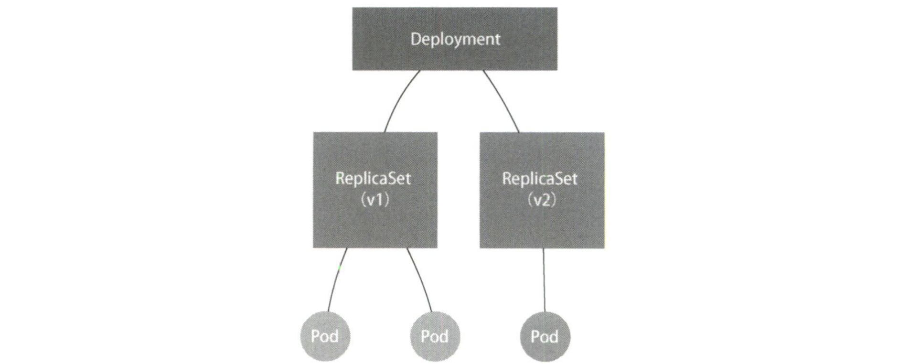

```shell
# 使用kubectl set image指令修改Deployment镜像
[root@k8smaster ~]# kubectl set image deployment/nginx-deployment nginx=nginx:1.91
deployment.extensions/nginx-deployment image updated

# 由于nginx:1.91镜像并不存在，因此滚动更新被触发后会立刻报错并停止。
# 新版本的ReplicaSet（hash=2156724341）已经创建了两个Pod，但是都没有进人READY状态。
# 旧版本的ReplicaSet（hash=1764197365）已经有一个旧Pod被删除，还剩下两个旧Pod。
[root@k8smaster ~]# kubectl get rs
NAME													DESIRED		CURRENT		READY		AGE
nginx-deployment-1764197365		2					2					2				24s
nginx-deployment-3167673210		0					0					0				35s
nginx-deployment-2156724341		2					2					0				7s

# 回滚到旧版本。Deployment控制器其实就是让旧ReplicaSet（hash=1764197365）再次扩展成3个Pod，而让新ReplicaSet（hash=2156724341）重新收缩到0个Pod。
[root@k8smaster ~]# kubectl rollout undo deployment/nginx-deployment 
deployment.extensions/nginx-deployment

# 查看每次Deployment变更对应的版本。由于在创建Deployment时指定了--record参数，因此创建这些版本时执行的kubectl命令会被记录下来。
[root@k8smaster ~]# kubectl rollout history deployment/nginx-deployment
deployments	"nginx-deployment"
REVISION		CHANGE-CAUSE
1						kubectl create -f nginx-deployment.yam1 --record
2						kubectl edit deployment/nginx-deployment
3						kubectl set image deployment/nginx-deployment nginx=nginx:1.91

# 查看每个版本对应Deployment的API对象细节
[root@k8smaster ~]# kubectl rollout history deployment/nginx-deployment --revision=2

# 回滚到指定版本
[root@k8smaster ~]# kubectl rollout undo deployment/nginx-deployment --to-revision=2
deployment.extensions/nginx-deployment

# 以上对Deployment进行的每一次更新操作都会生成一个新的ReplicaSet对象，下面演示对Deployment的多次更新操作，最后只生成一个ReplicaSet对象。
# 首先让Deployment进入暂停状态，然后使用kubectl edit或kubectl set image指令修改Deployment
[root@k8smaster ~]# kubectl rollout pause deployment/nginx-deployment
deployment.extensions/nginx-deployment paused

# 在kubectl rollout pause指令执行之后，kubect1 rollout resume指令执行之前，对Deployment进行的所有修改最后都只会触发一次滚动更新
[root@k8smaster ~]# kubect1 rollout resume deploy/nginx-deployment
deployment.extensions/nginx-deployment resumed

# 结果显示，只有一个Replicaset被创建
[root@k8smaster ~]# kubectl get rs
NAME													DESIRED		CURRENT		READY		AGE
nginx-deployment-1764197365		0					0					0				2m
nginx-deployment-3196763511		3					3					3				28s
```


## 4.6 深入理解 StatefulSet

Deployment 不足以覆盖所有应用编排问题，因为它认为一个应用的所有 Pod 是完全一样的，所以它们之间没有顺序，也无所谓在哪台宿主机上运行。需要时 Deployment 就可以通过 Pod 模板创建新的Pod；不需要时，Deployment 就可以结束任意一个 Pod。

但在实际场景中，并非所有应用都满足这样的要求。尤其是分布式应用，它的多个实例之问往往有依赖关系，如主从关系、主备关系；还有数据存储类应用，它的多个实例往往会在本地磁盘上保存一份数据，而这些实例一旦被结束，即便重建出来，实例与数据之间的对应关系也已经丟失，从而导致应用失败。所以，**这种实例之间有不对等关系，以及实例对外部数据有依赖关系的应用，就称为有状态应用（stateful application）**。

容器适合封装无状态应用（stateless application）。K8s 在 Deployment 基础上扩展出了对有状态应用的初步支持，这个编排功能就是 StatefulSet，它把现实世界的应用状态抽象为两种：

1. **拓扑状态**：**应用的多个实例之间不是完全对等的**。这些应用实例必须按照某种顺序启动，比如应用的主节点 A 要先于从节点 B 启动。而如果删除 A 和 B 两个 Pod，它们再次被创建出来时也必须严格按照这个顺序运行。并且，新创建出来的 Pod 必须和原来 Pod 的网络标识一样，这样原先的访问者才能使用同样的方法访问到这个新 Pod。
2. **存储状态**：**应用的多个实例分别绑定了不同的存储数据**。对于这些应用实例来说，Pod A 第一次读取到的数据和隔了 10 分钟之后再次读取到的数据应该是同一份，哪怕在此期间 Pod A 被重新创建过。这种情况最典型的例子是一个数据库应用的多个存储实例。

所以，StatefulSet 的核心功能就是通过某种方式记录这些状态，然后在 Pod 被重新创建时，能够为新 Pod 恢复这些状态。

### 4.6.1 拓扑状态

在介绍 StatefulSet 原理前，首先介绍 Headless Service。**Service 是 K8s 用来将一组 Pod 暴露给外界访问的一种机制**。比如，一个 Deployment 有 3 个 Pod，那么就可以定义一个 Service。这样，用户只要能访问到这个 Service，就能访问到某个具体的 Pod。有两种方式：

1. **以 Service 的 VIP（virtual IP，虚拟IP）方式**。比如，当访问 10.0.23.1 这个 Service 的 IP 地址时，10.0.23.1 其实就是一个 VIP，它会把请求转发到该 Service 所代理的某一个 Pod 上。
2. **以 Service 的 DNS 方式**。比如，此时只要访问“my-svc.my-namespace.svc.cluster.local”这条 DNS 记录，就可以访问到名叫 my-svc 的 Service 所代理的某一个 Pod。具体又可以分为两种处理方法：
   * **Normal Service**： 在这种情况下，访问“my-svc.my-namespace.svc.cluster.local”解析到的，正是 my-svc 这个 Service 的 VIP，后面的流程跟 VIP 方式一致。
   * **Headless Service**：在这种情况下，访问“my-svc.my-namespace.svc.cluster.local”解析到的，直接就是 my-svc 代理的某一个 Pod 的 IP 地址。**这里区别在于，Headless Service 不需要分配一个 VIP，而是可以直接以 DNS 记录的方式解析出被代理 Pod 的 IP 地址**。

下面是一个标准 Headless Service 对应的 YAML 文件，其仍是一个标准 Service 的 YAML 文件。只不过它的 clusterIP 字段的值是 None，即这个 Service 没有一个 VIP 作为“头”，这就是 Headless 含义。所以，这个 Service  被创建后并不会被分配一个 VIP，而是会以 DNS 记录的方式暴露出它所代理的 Pod。而它所代理的 Pod，依然是 Label Selector 机制选出的，即所有携带了 app: nginx 标签的 Pod 都会被这个 Service 代理。

```yaml
apiVersion: v1
kind: Service
metadata:
  name: nginx
  labels: 
    app: nginx
spec: 
  ports: 
  - port: 80
    name: web
  clusterIP: None
  selector: 
    app: nginx
```

当按照这样的方式创建了一个 HeadlessService 之后，**它所代理的所有 Pod 的 IP 地址都会被绑定一个如下格式的 DNS 记录：`＜pod-name＞.＜svc-name＞.＜namespace＞.svc.c1uster.1ocal`。这个 DNS 记录，正是 K8s 为 Pod 分配的唯一可解析身份**。有了这个可解析身份，只要知道了一个 Pod 的名字及其对应的 Service 的名字，就可以通过这条 DNS 记录访问到 Pod 的 IP 地址。

那么 StatefulSet 又是如何使用这个 DNS 记录来维持 Pod 的拓扑状态呢？如下所示，这个 YAML 文件和前面用到的 nginx-deployment 的唯一区别就是多了一个 serviceName=nginx 字段，这个字段的作用就是告诉 StatefulSet 控制器，在执行控制循环时使用 nginx 这个 Headless Service 来保证 Pod 可解析。

```yaml
apiVersion: apps/v1
kind: StatefulSet
metadata:
  name: web
spec: 
  serviceName: "nginx"
  replicas: 2
  selector:
    matchLables: 
      app: nginx
  template: 
    metadata: 
      labels: 
        app: nginx
    spec: 
      containers: 
      - name: nginx
        image: nginx:1.9.1
        ports: 
        - containerPort: 80
          name: web
```

当通过 kubectl create 创建上面这个 Service 和 StatefulSet 之后，需要快速通过 kubectl 的 -w 参数（即 Watch 功能）实时查看 StatefulSet 创建两个有状态实例的过程。不难看出，**StatefulSet 给它所管理的所有 Pod 的名字进行了编号，这些编号都是从 0 开始累加，与 StatefulSet 的每个 Pod 实例一一对应，绝不重复**。并且这些 Pod 的创建也是严格按照编号顺序进行的，比如，在 web-0 进入 Running 状态，并且细分状态（Conditions）变为 Ready 之前，web-1 会一直处于 Pending 状态。

```shell
$ kubectl get pods -w -l app=nginx
NAME		READY		STATUS						RESTARTS	AGE
web-0		0/1			Pending						0					0s
web-0		0/1			Pending						0					0s
web-0		0/1			ContainerCreating	0					0s
web-0		1/1			Running						0					19s
web-1		0/1			Pending						0					0s
web-1		0/1			Pending						0					0s
web-1		0/1			ContainerCreating	0					0s
web-1		1/1			Running						0					20s
```

当这两个 Pod 都进入 Running 状态之后，就可以查看到它们各自唯一的“网络身份”了。可以看到，这两个 Pod 的 hostname 与 Pod 名字是一致的，都被分配了对应的编号。尝试用 nslookup 命令解析 Pod 对应的 Headless Service，输出结果显示，在访问 web-0.nginx 时，最后解析到的正是 web-0 这个 Pod IP 地址；而当访问 web-1.nginx 时，解析到的是 web-1 IP 地址。

```shell
$ kubectl exec web-0 -- sh -c 'hostname'
web-0
$ kubectl exec web-1 -- sh -c 'hostname'
web-1

# 任意Pod内执行
$ nslookup web-0.nginx
Server:			10.0.0.10
Address 1: 	10.0.0.10 kube-ans.kube-system.svc.cluster.local

Name:				web-0.nginx
Address 1: 	10.244.1.7

$ nslookup web-1.nginx
Server:			10.0.0.10
Address 1: 	10.0.0.10 kube-dns.kube-system.svc.cluster.local

Name:				web-1.nginx
Address 1: 	10.244.2.7
```

**当把这两个 Pod 删除后，K8s 会按照原先编号的顺序重新创建出两个 Pod，并且为它们分配了与原来相同的“网络身份”：web-0.nginx 和 web-1.nginx**。通过这种严格的对应规则，StatefulSet 就保证了 Pod 网络标识的稳定性。比如，如果 web-0 是一个需要先启动的主节点，web-1 是一个后启动的从节点，那么访问 web-0.nginx 时始终会落在主节点上；访问 web-1.nginx 时，则始终会落在从节点上。

通过这种方法，**K8s 成功地将 Pod 的拓扑状态（比如哪个节点先启动，哪个节点后启动），按照 Pod 的“名字+编号”的方式固定了下来。此外，K8s 还为每个 Pod 提供了一个固定且唯一的访问入口，即这个 Pod 对应的 DNS 记录**。这些状态在 StatefulSet 的整个生命周期里都会保持不变，绝不会因为 Pod 的删除或者重新创建而失效。不过，虽然 web-0.nginx 这条记录本身不会变，但它解析到的 Pod IP 地址并不固定。这就意味着，**对于有状态应用实例的访问，必须使用 DNS 记录或 hostname 的方式，而绝不应该直接访问这些 Pod IP 地址**。


### 4.6.2 存储状态

PVC、PV 的设计（参见第 5 章）使得 StatefulSet 对存储状态的管理成为可能。以上一节用到的 StatefulSet 为例，额外添加了 volumeClaimTemplates 字段，如名所示，它跟 Deployment 里 Pod 模板的作用类似。**也就是说，凡是被这个 StatefulSet 管理的 Pod，都会声明一个对应的 PVC；而这个 PVC 的定义，就来自 volumeClaimTemplates 这个模板字段。更重要的是，这个 PVC 的名字会被分配与这个 Pod 完全一致的编号**。这个自动创建的 PVC 与 PV 绑定成功后会进入 Bound 状态，意味着这个 Pod 可以挂载并使用这个 PV 了。

```yaml
apiVersion: apps/vl
kind: StatefulSet
metadata:
  name: web
spec:
  serviceName: "nginx"
  replicas: 2
  selector:
    matchLabels:
      app: nginx
  template:
    metadata:
      labels:
        app: nginx
    spec:
      containers:
      - name: nginx
        image: nginx:1.9.1
        ports:
        - containerPort: 80
            name: web
          volumeMounts:
          - name: www
            mountPath: /usr/share/nginx/html
    volumeClaimTemplates:
    - metadata:
        name: www
      spec:
        accessModes:
        - ReadwriteOnce
        resources:
          requests:
            storage: 1Gi
```

在使用 kubectl create 创建 StatefuISet 后，就会看到 K8s 集群出现了两个 PVC，**这些 PVC 都以 `<PVC 名字>-<statefulSet 名字>-<编号>` 这样的方式命名**，并且处于 Bound 状态。如前所述，这个 StatefulSet 创建出来的所有 Pod 都会声明使用编号的 PVC。比如，在名叫 web-0 的 Pod 的 volumes 字段，它会声明使用名叫 www-web-0 的 PVC，从而挂载到这个 PVC 所绑定的 PV。

```shell
$ kubectl get pvc -1 app=nginx
NAME			STATUS	VOLUME																		CAPACITY	ACCESSMODES	AGE
www-web-0 Bound		pvc-15c268c7-b507-11e6-932f-42010a800002	1Gi				RWO					48s
www-web-1 Bound		pvc-15c79307-b507-11e6-932f-42010a800002	1Gi				RWO					48s
```

**当把一个 Pod（比如 web-0）删除后，这个 Pod 对应的 PVC 和 PV 并不会被删除，这个 Volume 里已经写入的数据也依然会保存在远程存储服务里**。此时，StatefulSet 控制器发现一个名叫 web-0 的 Pod 消失了，所以会重新创建一个新的、名字还是 web-0 的 Pod，来纠正这种不一致的情况。在这个新 Pod 对象的定义里，它声明使用的 PVC 的名字还是 www-web-0。这个 PVC 的定义仍然来自 volumeClaimTemplates ，所以，在这个新的 web-0 Pod 被创建出来后，K8s 为它查找名叫 www-web-0 的 PVC 时，就会直接找到旧 Pod 遗留下来的同名 PVC，进而找到跟这个 PVC 绑定的 PV。这样，新 Pod 就可以挂载到旧 Pod 对应的 Volume，并且获取保存在 Volume 里的数据。通过这种方式，StatefuISet 就实现了对应用存储状态的管理。

当涉及到更新时，StatefulSet 控制器会按照与 Pod 编号相反的顺序，从最后一个 Pod 开始，逐一更新这个  StatefuISet 管理的每个 Pod。如果更新出错，这次滚动更新就会停止。此外，StatefulSet 的滚动更新还允许更精细的控制，比如金丝雀发布或灰度发布，这意味着应用的多个实例中被指定的部分不会更新到最新版本。

---

**总结 1：StatefuISet 控制器直接管理的是 Pod**。这是因为 StatefulSet 里的不同 Pod 实例不再像 ReplicaSet 中那样都是完全一样的，而是有了细微区别。比如，每个 Pod 的 hostname、名字等都不同，都携带了编号。而 StatefulSet 通过在 Pod 的名字里加上事先约定好的编号来区分这些实例。

**总结 2：K8s 通过 Headless Service 为这些有编号的 Pod，在 DNS 服务器中生成带有相同编号的 DNS 记录**。只要 StatefulSet 保证 Pod 名字里的编号不变，那么 Service 里类似于 web-0.nginx.default.svc.cluster.local 这样的 DNS 记录就不会变，而这条记录解析出来的 Pod 的 IP 地址，会随着后端 Pod 的删除和重建而自动更新。这当然是 Service 机制本身的能力，不需要 StatefulSet 操心。

**总结 3：StatefuISet 为每一个 Pod 分配并创建一个相同编号的 PVC**。这样 K8s 就可以通过 Persistent Volume 机制这个 PVC 绑定对应的 PV，从而保证每个 Pod 都拥有一个独立的 Volume。即使 Pod 被删除，它所对应的 PVC 和 PV 依然会保留下来。所以当这个 Pod 被重新创建出来之后，K8s 会为它找到编号相同的 PVC，挂载这个 PVC 对应的 Volume，从而获取以前保存在 Volume 里的数据。


## 4.7 容器化守护进程 DaemonSet

DaemonSet 的主要作用是在 K8s 集群里运行一个 Daemon Pod，这个 Pod 有如下 3 个特征：

1. **这个 Pod 在 K8s 集群里的每一个节点上运行。**
2. **每个节点上只有一个这样的 Pod 实例。**
3. **当有新节点加入 K8s 集群后，该 Pod 会自动地在新节点上被创建出来；而当旧节点被删除后，它上面的 Pod也会相应地被回收。**

Daemon Pod 的意义非常重要，比如各种网络插件的 Agent 组件必须在每一个节点上运行，用来处理这个节点上的容器网络，因此 DaemonSet 开始运行的时机很多时候比整个 K8s 集群出现的时机要早。

如下所示，DaemonSet 管理的是一个 fluentd-elasticsearch 镜像的 Pod。这个镜像的功能非常实用：通过 fluentd 将 Docker 容器里的日志转发到 Elasticsearch 中。注意，**Docker 容器里应用的日志默认保存在宿主机的 `/var/lib/docker/containers/{容器 ID}/{容器ID}-json.log` 文件**，所以该目录正是 fluentd 的搜集目标。

```yaml
apiVersion: apps/v1
kind: DaemonSet
metadata:
  name: fluentd-elasticsearch
  namespace: kube-system
  labels:
    k8s-app: fluentd-logging
  spec:
    selector:
      matchLabels:
        name: fluentd-elasticsearch
  template:
    metadata:
      labels:
        name: fluentd-elasticsearch
  spec:
    tolerations:
    - key: node-role.kubernetes.io/master
      effect: NoSchedule
  containers:
    - name: fluentd-elasticsearch
      image: quay.io/fluentd_elasticsearch/fluentd:v3.0.0
      resources:
        limits:
          memory: 200Mi
        requests:
          cpu: 100m
          memory: 200Mi
      volumeMounts:
      - name: varlog
        mount Path: /var/log
      - name: varlibdockercontainers
        mountPath: /var/lib/docker/containers
        readOnly: true
    terminationGracePeriodSeconds: 30
    volumes:
    - name: varlog
      hostPath:
        path: /var/log
    - name: varlibdockercontainers
      hostPath:
        path: /var/lib/docker/containers
```

那么，DaemonSet 如何保证每个节点上有且只有一个被管理的 Pod 呢？DaemonSet 控制器首先从 etcd 里获取所有的节点列表，然后遍历所有节点。这时，它会去检查当前这个节点是否有一个携带了 name:fluentd-elasticsearch 标签的 Pod 在运行。检查的结果可能有如下 3 种情况：

1. 没有这种 Pod，意味着要在该节点上创建这样一个 Pod。
2. 有这种 Pod，但是数量大于 1，说明要删除该节点上多余的 Pod。
3. 正好只有一个这种 Pod，说明该节点是正常的。

其中，删除节点上多余的 Pod 直接调用 K8s API 即可实现。而**新建 Pod 则使用 nodeAffinity 字段，这个字段与 Pod 调度相关**，含义如下：requiredDuringSchedulingIgnoredDuringExecution 表示这个 nodeAffinity 必须在每次调度时予以考虑（这也意味着可以设置在某些情况下不考虑这个 nodeAffinity），同时，这个 Pod 只允许在 metadata.name 是 node-ituring 的节点上运行。注意，nodeAffinity 的定义可以支持更丰富的语法，比如 operator: In（部分匹配；如果定义 operator: Equal 就是完全匹配），这正是 nodeAffinity 取代 nodeselector 的原因之一。

```yaml
apiVersion: v1
kind: Pod
metadata:
  name: with-node-affinity
spec:
  affinity:
    nodeAffinity:
      requiredDuringSchedulingIgnoredDuringExecution:
        nodeSelectorTerms:
        - matchExpressions:
          - key: metadata.name
            operator: In
            values:
            - node-ituring
```

所以，**DaemonSet 控制器会在创建 Pod 时，自动在这个 Pod API 对象里加上这样一个 nodeAffinity 定义，其中，需要绑定的节点名字正是当前正在遍历的这个节点。此外，DaemonSet 还会给这个 Pod 自动加上另外一个与调度相关的字段：tolerations**。如下所示，这个 toleration 的含义是：容忍所有被标记为 unschedulable 污点的节点，容忍的效果是允许调度。

```yaml
apiVersion: v1
kind: Pod
metadata:
  name: with-toleration
spec:
  tolerations:
  - key: node.kubernetes.io/unschedulable
  operator: Exists
  effect: NoSchedule
```

在正常情况下，被加上 unschedulable 污点的节点是不会有任何 Pod 被调度上去的（effect: Noschedule）。可是，DaemonSet 自动地给被管理的 Pod 加上了特殊的 Toleration，就使得这些 Pod 可以忽略这项限制，继而保证每个节点上都会被调度一个 Pod。当然，如果这个节点有故障的话，这个 Pod 可能会启动失败，而 DaemonSet 会继续尝试，直到 Pod 启动成功。

在 K8s 项目中，当一个节点的网络插件尚未安装时，该节点就会被自动加上名为 node.kubernetes.io/network-unavailable 的污点。通过这样一个 Toleration，调度器在调度这个 Pod 时就会忽略当前节点上的污点，从而成功地将网络插件的 Agent 组件调度到这台机器上启动起来。另外，**在默认情况下，K8s 集群不允许用户在主节点部署 Pod，这是因为主节点默认携带了一个叫作 node-role.kubernetes.io/master 的污点**。所以，为了能在主节点上部署 DaemonSet 的 Pod，就必须让这个 Pod 容忍这个污点。

总结：**相比 Deployment，DaemonSet 只管理 Pod 对象，然后通过 nodeAffinity（保证这个 Pod 只会在指定节点上启动）和 Toleration（忽略节点的 unschedulable 污点）这两个调度器功能，保证了每个节点上有且只有一个 Pod**。


## 4.8 离线业务 Job 与 CronJob

前面介绍的 Deployment、StatefulSet、DaemonSet 主要编排对象都是“在线业务”，即长作业（long running task），这些应用一旦运行起来，除非出错或者停止，它的容器进程会一直保持 Running 状态。但有一类业务在计算完成后就直接退出了，这就是“离线业务”，也称 Batch Job（计算业务）。

定义 Job API 对象的示例如下。在这个 Pod 模板中，定义了一个安装了 bc 命令的 Ubuntu 镜像的容器，用于计算 Pi 值，其中 scale=10000 指定了输出小数点后的位数是 10000。

```yaml
apiVersion: batch/v1
kind: Job
metadata:
  name: pi
spec:
  template:
    spec:
      containers:
      - name: pi
        image: resouer/ubuntu-bc
        command：［"sh", "-c", "echo 'scale=10000; 4*a(1)' | bc -1 "］
      restartPolicy: Never
  backoffLimit: 4
```

创建成功后，查看这个 Job 对象，如下所示。可以看到，在这个 Job 对象创建后，它的 Pod 模板被自动加上了一个 controller-uid=＜一个随机字符串> 这样的 Label。而这个 Job 对象本身被自动加上了这个 Label 对应的 Selector，从而保证了 Job 与它所管理的 Pod 之间的匹配关系，这也是为什么 Job 对象并不要求定义一个 spec.selector 来描述要控制哪些 Pod。

```shell
$ kubectl describe jobs pi
Name:					pi
Namespace:		default
Selector:			controller-uid=c2db599a-2c9d-11e6-b324-0209dc45a495
Labels:				controller-uid=c2db599a-2c9d-11e6-b324-0209dc45a495
							job-name=pi
```

Job Controller 之所以要使用这种携带了 UID 的 Label，旨在避免不同 Job 对象所管理的 Pod 发生重合。注意，这种自动生成的 Label 对用户来说并不友好，所以不太适合推广到 Deployment 等长作业编排对象上。

接下来，可以看到这个 Job 创建的 Pod 进入 Running 状态，意味着它正在计算 PI 值。几分钟后计算结束，这个 Pod 就会进入 Completed 状态。这也是 Pod 模板中定义 restartPolicy=Never 的原因：离线计算的 Pod 永远不应该被重启，否则它们会再重新计算一遍。**实际上，restartPolicy 在 Job 对象里只允许设置为 Never 和 OnFailure；而在 Deployment 对象里，restartPolicy 只允许设置为 Always**。

如果这个离线作业失败了，那么 Job Controller 会不断尝试创建一个新 Pod，如下所示。当然，这个尝试不能无限进行下去，所以 Job 对象的 spec.backoffLimit 字段里定义了重试次数为 4（backoffLimit），而这个字段的默认值是 6。注意，Job Controller 重新创建 Pod 的间隔是呈指数级增加的，即下一次重新创建 Pod 的动作会分别发生在 10s、20s、40s⋯⋯后。而如果定义 restartPolicy=OnFailure，那么离线作业失败后，Job Controller 就不会尝试创建新 Pod，而会不断尝试重启 Pod 里的容器，这正好对应了 restartPolicy 含义。

```shell
$ kubectl get pods
NAME				READY		STATUS							RESTARTS	AGE
pi-55h89		0/1			ContainerCreating		0					2s
pi-tqbcz		0/1			Error								0					5s
```

当一个 Job Pod 运行结束后，它会进入 Completed 状态。但是，如果这个 Pod 因为某种原因一直不肯结束呢？在 Job API 对象里，**有一个 spec.activeDeadlineseconds 字段可以限制运行时长。一旦运行超过这个时长，Job 的所有 Pod 都会被终止**，并且可以在 Pod 状态里看到终止的原因：reason: DeadlineExceeded。

不过，离线业务之所以被称为 Batch Job，当然是因为它们可以以 Batch 也就是并行的方式运行。**在 Job 对象中，负责并行控制的参数有两个：spec.parallelism 定义一个 Job 在任意时间最多可以启动多少个 Pod 同时运行；spec.completions 定义 Job 至少要完成的 Pod 数目，即 Job 的最小完成数**。

因此，Job Controller 控制的对象直接就是 Pod，它在控制循环中根据实际 Running 状态的 Pod 数目、已经成功退出的 Pod 数目，以及 parallelism、completions 参数的值共同计算出在这个周期里应该创建或者删除的 Pod 数目，然后调用 K8s API 来执行这个操作。

---

顾名思义，CronJob 描述的是定时任务，它的 API 对象如下所示。**CronJob 与 Job 的关系如同 Deployment 与 Pod 的关系一样，CronJob 是一个专门用来管理 Job 对象的控制器。只不过，它创建和删除 Job 的依据是 schedule 字段定义的、一个标准的 Unix Cron 格式的表达式**。

```yaml
apiVersion: batch/vlbetal
kind: CronJob
metadata:
  name: hello
spec:
  schedule: "*/1 * * * *"
  jobTemplate:
    spec:
      template:
        spec:
          containers:
				  - name: hello
            image: busybox
            args:
            - /bin/sh
            - -c
            - date; echo Hello from the Kubernetes cluster
          restartPolicy: OnFailure
```

注意，由于定时任务的特殊性，很可能某个 Job 还没有执行完，另外一个新 Job 就产生了。此时，可以通过 spec.concurrencyPolicy 字段来定义具体的处理策略。比如：

* concurrencyPolicy=Allow，这是默认情况，意味着这些 Job 可以同时存在；
* concurrencyPolicy=Forbid，意味着不会创建新的 Pod，该创建周期被跳过；
* concurrencyPolicy=Replace，意味着新产生的 Job 会替换旧的、未执行完的Job。

如果某次 Job 创建失败，这次创建就会被标记为“miss”。当在指定的时间窗口内 miss 数目达到100，CronJob 会停止再创建这个 Job。这个时间窗口可以由 spec.startingDeadlineSeconds 字段指定，比如 starting-Deadlineseconds=200，表示在过去 200s 里，如果 miss 数目达到了 100，那么这个 Job 就不会被创建执行了。


## 4.9 声明式 API 与 K8s 编程范式

kubectl apply 跟 kubectl replace 命令有什么本质区别吗？实际上，可以简单理解为，kubectl replace 的执行过程是使用新 YAML 文件中的 API 对象替换原有的 API 对象，而 kubectl apply 是执行了一个对原有 API 对象的 PATCH 操作。**这意味着 kube-apiserver 在响应命令式请求（如 kubectl replace）时，一次只能处理一个写请求，否则可能产生冲突。而对于声明式请求（如 kubectl apply），一次能处理多个写操作，并且具备 Merge 能力**。

下面以 Istio 项目为例说明声明式 API 的重要意义，Istio 是一个基于 K8s 的微服务治理框架，架构如图所示。可以看出，Istio 最根本的组件是在每一个应用 Pod 里运行的 Envoy 容器，Envoy 项目是一个高性能 C++ 网络代理。

Istio 以 sidecar 容器的方式，在每个被治理的应用 Pod 中运行这个代理服务。由于 Pod 里的所有容器都共享一个 Network Namespace，所以 Envoy 容器能够通过配置 Pod 里的 iptables 规则接管整个 Pod 的进出流量。这样 Istio 控制层里的 Pilot 组件就能够通过调用每个 Envoy 容器的 API，来对这个 Envoy 代理进行配置，从而实现微服务治理。

假设 Istio 架构图左边 Pod 是已经在运行的应用，右边 Pod 是刚刚上线的应用新版本。此时，Pilot 通过调节这两个 Pod 里 Envoy 容器的配置，从而将 90% 的流量分配给旧版本应用，将 10% 的流量分配给新版本应用，并且还可以在后续的过程中随时调整，这样，一个典型的灰度发布的场景就完成了。更重要的是，在整个微服务治理过程中，无论是对 Envoy 容器的部署，还是像上面这样对 Envoy 代理的配置，用户和应用都是完全无感的。

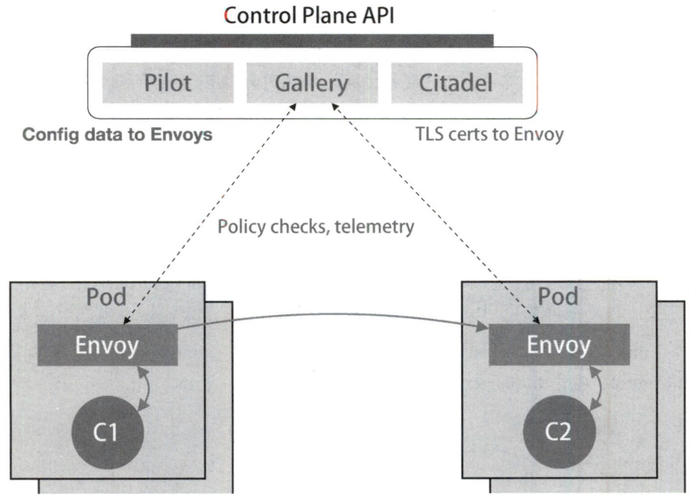

那么 Istio 明明需要在每个 Pod 里安装一个 Envoy 容器，又如何做到无感呢？**实际上，Istio 使用的是 K8s 中的一个重要功能：Dynamic Admission Control**。当一个 Pod 或任何一个 API 对象被提交给 API Server 后，总有一些初始化工作需要在它们被 K8s 正式处理之前完成。比如，自动为所有 Pod 加上某些标签。

这个初始化操作的实现，借助的是 K8s Admission 功能，它其实是 K8s 里一组被称为 Admission Controller 的代码，可以选择性地编译进 API Server 中，在 API 对象创建之后会被立刻调用。这意味着，如果想添加一些自己的规则到 Admission Controller，就比较困难，因为这要求重新编译并重启 API Server。所以 K8s 额外提供了一种热插拔式的 Admission 机制，它就是 Dynamic Admission Control，也称 Initializer.

Istio 要做的就是编写一个用来为 Pod 自动注入 Envoy 容器的 Initializer。首先，Istio 会将这个 Envoy 容器本身的定义以 ConfigMap 的方式保存在 K8s 中。这个 ConfigMap （envoy-initializer） 的定义如下所示，其中 data 部分正是一个 Pod 对象的一部分定义，可以看到 Envoy 容器对应 containers 字段，以及一个用来声明 Envoy 配置文件的 volumes 字段。

```yaml
apiVersion: v1
kind: ConfigMap
metadata:
  name: envoy-initializer
data:
  config: |
    containers:
      - name: envoy
      image: lyft/envoy:845747db88f102c0fd262ab234308e9e22f693a1
      command: ["/usr/local/bin/envoy"]
      args:
        - "--concurrency 4"
        - "--config-path /etc/envoy/envoy.json"
        - "--mode serve"
      ports:
        - containerPort: 80
          protocol: TCP
      resources:
        limits:
          cpu: "1000m"
          memory: "512Mi"
        requests:
          cpu: "100m"
          memory: "64Mi"
        volumeMounts:
          - name: envoy-conf
            mountPath: /etc/envoy
    volumes:
      - name: envoy-conf
        configMap:
          name: envoy
```

Initializer 要做的就是把这部分 Envoy 相关的字段自动添加到用户提交的 Pod API 对象里。**可是，用户提交的 Pod  里本来就有 containers 字段和 volumes 字段，所以 K8s 在处理这样的更新请求时，必须使用类似于 git merge 这样的操作，才能将这两部分内容合并在一起**。所以，在 Initializer 更新用户的 Pod 对象时，必须使用 PATCH API 来完成。而这种 PATCH API 正是声明式 API 最主要的能力。

接下来，Istio 将一个编写好的 Initializer 作为一个 Pod 部署在 K8s 中，如下所示。可以看到，这个 envoy-initializer 使用的 envoy-initializer:0.0.1镜像，就是一个事先编写好的**自定义控制器（custom controller）**。这个控制器不断获取用户新创建的 Pod，如果这个 Pod 已经添加过 Envoy 容器，则放过这个 Pod，进入下一个检查周期。如果还没有添加 Envoy 容器，它就会进行 Initialize 操作，即修改该 Pod 的 API 对象，往这个 Pod 里合并的之前保存在 envoy-initializer  ConfigMap 里的数据（data 字段的值）。

```yaml
apiVersion: v1
kind: Pod
metadata:
  labels:
    app: envoy-initializer
    name: envoy-initializer
spec:
  containers:
    - name: envoy-initializer
      image: envoy-initializer:0.0.1
      imagePallPolicy: Always
```

所以，Initializer 控制器的工作逻辑是：首先从 API Server 中获取这个 ConfigMap，然后把这个 ConfigMap 里存储的 containers 和 volumes 字段直接添加到一个空的 Pod 对象里。关键点来了，K8s API 提供了一个方法，可以直接使用新旧两个 Pod 对象生成一个 TwoWayMergePatch。有了这个方法，Initializer 的代码就可以使用 patch 的数据，调用 K8s Client 发起一个 PATCH 请求，这样用户提交的 Pod 对象里，就会被自动加上 Envoy 容器相关的字段。

```go
func doSomething (pod) {
  cm := client.Get(ConfigMap, "envoy-initializer")
	newPod := Pod{}
	newPod.Spec.Containers = cm.Containers
	newPod.Spec.Volumes = cm.Volumes
  
	// 生成 patch 数据
	patchBytes := strategicpatch.CreateTwoWayMergePatch(pod, newPod)
	// 发起 PATCH 请求，修改这个 Pod 对象
	client.Patch(pod.Name, patchBytes)
}
```

以上就是 Initializer 基本的工作原理和使用方法，Istio 的核心就是由无数个在应用 Pod 中运行的 Envoy 容器组成的服务代理网格。这个机制得以实现，借助了 K8s 对 API 对象进行在线更新的能力，这也正是声明式 API 的独特之处。

1. **所谓“声明式”指的就是只需要提交一个定义好的 API 对象来“声明”我所期望的状态。**
2. **“声明式 API”允许有多个 API 写端，以 PATCH 的方式对API 对象进行修改，而无须关心本地原始 YAML 文件的内容。**
3. **注意在 K8s 里，不止用户会修改 API 对象，K8s 自己及其各种插件也会修改 API 对象。所以这里必须能够处理冲突，在 K8s 中这个能力已经内置到了 API Server 端，叫作 Server Side Apply。**
4. **有了上述两项能力，K8s 项目才可以基于对 API 对象的增、删、改、查，在完全无须外界干预的情况下，完成对“实际状态”和“期望状态”的调谐**。


## 4.10 声明式 API 工作原理

**K8s 中一个 API 对象在 etcd 里的完整资源路径由 Group（API组）、Version（API版本）和 Resource（API 资源类型）3 个部分组成**。通过这样的结构，整个 K8s 里的所有 API 对象就可以用下图所示的树形结构表示出来。可以看到，API 对象其实是按层层递进的方式组织起来的。

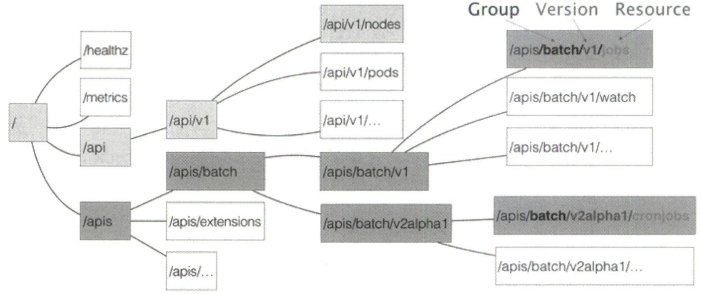

假设现在要创建一个 CronJob 对象，那么 YAML 文件的开始部分如下。其中 cronJob 就是这个 API 对象的资源类型，batch 就是它的组，v2alpha1 就是它的版本。当这个 YAML 文件提交后，K8s 就会把这个 YAML 文件里描述的内容转换成一个 CronJob 对象。

```yaml
apiVersion: batch/v2alphal
kind: CronJcb
```

那么，K8s 是如何对 Resource、Group 和 Version 进行解析，找到 CronJob 对象的定义的呢？

**首先，K8s 会匹配 API 对象的组**。需要明确的是，对于 K8s 里的核心 API 对象，比如 Pod、Node 等，是不需要 Group 的（它们的Group 是""），所以 K8s 会直接在 /api 这个层级进行下一步的匹配过程。对于 CronJob 等非核心 API 对象来说，K8s 就必须在 /apis 这个层级查找它对应的 Group，进而根据 batch（离线业务）这个 Group 的名字找到 /apis/batch。不难发现，这些 API Group 是以对象功能进行分类的。

**然后，K8s 会进一步匹配 API 对象的版本号**。对于 CronJob 这个 API 对象来说，K8s 在 batch Group 下匹配到的版本号就是 v2alphal。在 K8s 中，同一种 API 对象可以有多个版本，这正是 K8s 进行 API 版本化管理的重要手段。比如在 CronJob 开发过程中，对于会影响用户的变更，就可以升级新版本，从而保证向后兼容。

**最后，K8s 会匹配 API 对象的资源类型**。在前面匹配到正确版本后，K8s 就知道要创建的是 /apis/batch/v2alphal 下的 CronJob 对象。此时，API Server 就可以继续创建这个 CronJob 对象了。下图总结了创建流程。

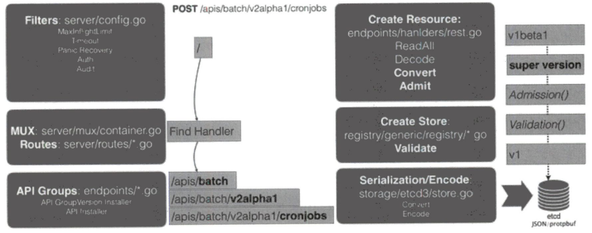

1. 当发起创建 CronJob 的 POST 请求后，YAML 的信息就提交给了 API Server。API Server 首先过滤这个请求，并完成一些前置性工作，比如授权、超时处理、审计等。
2. 请求会进入 MUX 和 Routes 流程，MUX 和 Routes 是 API Server 完成 URL 和 Handler 绑定的场所。而 API Server 的 Handler 要做的就是按照刚刚介绍的匹配过程，找到对应的 CronJob 类型定义。
3. API Server 根据这个 CronJob 类型定义，使用 YAML 文件里的字段来创建一个 CronJob 对象。在此过程中，API Server 会进行一个 Convert 工作：把 YAML 文件转换成一个名为 Super Version 的对象，它正是该 API 资源类型所有版本的字段全集，这样不同版本的 YAML 文件都可以用这个 Super Version 对象进行处理。
4. API Server 会先后进行 Admission 和 validation 操作。比如，上一节提到的 Admission Controller 和 Initializer 就都属于 Admission 的内容。Validation 则负责验证这个对象里的各个字段是否合法。经过验证的 API 对象保存在 API Server 一个叫作 Registry 的数据结构中。也就是说，只要一个 API 对象的定义能在 Registry 里查到，它就是有效的 K8s API 对象。
5. API Server 会把经过验证的 API 对象转换成用户最初提交的版本，进行序列化操作，并调用 etcd 的 API 将其保存。

由此可见，声明式 API 对 K8s 来说非常重要。由于要兼顾性能、API 完备性、版本化、向后兼容等工程化指标，因此 API Server 大量使用了 Go 语言的代码生成功能，来自动化诸如 Convert、 DeepCopy 等与 API 资源相关的操作，因此在 API Server 中添加一个 API 资源类型非常困难。

不过，在 K8s v1.7 之后，这项工作变得轻松多了。**这得益于一个全新的 API 插件机制 CRD （custom resource definition），它允许用户在 K8s 中添加一个跟 Pod、Node 类似的、新的 API 资源类型：自定义 API 资源**。


## 4.11 API 编程范式的具体原理


## 4.12 基于角色的权限控制 RBAC

K8s 中所有 API 对象都保存在 etcd 里，但对这些 API 对象的操作都是通过访问 kube-apiserver 实现的，一个非常重要的原因是需要 API Server 授权。**在 K8s 中，负责完成授权工作的机制是 RBAC（role-based access control，基于角色的权限控制）**。这里需要明确3个基本概念：

* **Role：角色，它其实是一组规则，定义了一组对 K8s API 对象的操作权限。**
* **subject：被作用者，既可以是“人”，也可以是“机器”，也可以是在 K8s 里定义的“用户”。**
* **RoleBinding：定义了“被作用者”和“角色”间的绑定关系。**

Role 实际是个 K8s API 对象，如下所示。这个 Role 对象指定了它能产生作用的 Namepace 是 mynamespace。Namespace 是 K8s 中的一个逻辑管理单位，不同 Namespace 的 API 对象在通过 kubectl 命令进行操作时是互相隔离的，比如 `kubectl get pods -n mynamespace`。当然，这仅限于逻辑上的隔离，Namespace 并不会提供任何实际的隔离或者多租户能力。前面大多数例子没有指定 Namespace，而使用默认 Namespace: default。然后，这个 Role 对象的 rules 字段就是它所定义的权限规则，例如这条规则的含义就是，允许“被作用者”对 mynamespace 下面的 Pod 对象进行 GET、WATCH 和 LIST 操作。

```yaml
kind: Role
apiVersion: rbac.authorization.k8s.io/v1
metadata:
  namespace: mynamespace
  name: example-role
rules:
- apiGroups: [""]
  resources: ["pods"]
  verbs: ["get", "watch", "list"]
```

RoleBinding 本身也是个 K8s API 对象，如下所示。这个 RoleBinding 对象里定义了一个 subjects 字段，即“被作用者”，类型是 User，即 K8s 里的用户，用户名是 example-user。实际上，这里的 User 只是授权系统里的一个逻辑概念，在大多数私有的使用环境中，使用 K8s 提供的“内置用户”就足够了，稍后介绍。接下来，RoleBinding 对象通过 roleRef 字段来引用前面定义的 Role对象，从而定义了“被作用者”和“角色”之间的绑定关系。

```yaml
kind: RoleBinding
apiVersion: rbac.authorization.k8s.io/v1
metadata:
  name: example-rolebinding
  namespace: mynamespace
subjects:
- kind: User
  name: example-user
  apiGroup: rbac.authorization.k8s.io
roleRef:
  kind: Role
  name: example-role
  apiGroup: rbac.authorization.k8s.io
```

再次提醒，**Role 和 RoleBinding 对象都是 Namespaced 对象，它们对权限的限制规则仅在它们的 Namespace 内有效，roleRef 也只能引用当前 Namespace 里的 Role 对象**。那对于非 Namespaced 对象（如 Node），或某个 Role 想作用于所有 Namespace 时，该如何授权呢？**此时就必须使用 clusterRole 和 clusterRoleBinding 这两个组合了**。这两个 API 对象的用法跟 Role 和 RoleBinding 完全一样，只不过定义里没有 Namespace 字段，如下所示，名叫 example-user 的用户拥有对 Namespace 里的所有 Pod 进行 GET、WATCH 和 LIST 操作权限。

```yaml
kind: ClusterRole
apiVersion: rbac.authorization.k8s.io/v1
metadata:
  name: example-clusterrole
rules:
- apiGroups: [""]
  resources: ["pods"]
  # 所有权限全集：［＂get＂,＂1ist＂,＂watch",＂create＂,＂update＂,＂patch＂,＂de1ete＂］
  verbs: ["get", "watch", "list"]
---
kind: ClusterRoleBinding
apiVersion: rbac.authorization.k8s.io/v1
metadata:
  name: example-clusterrolebinding
subjects:
- kind: User
  name: example-user
  apiGroup: rbac.authorization.k8s.io
roleRef:
  kind: ClusterRole
  name: example-clusterrole
  apiGroup: rbac.authorization.k8s.io
```


---

**如前所述，大多数时候我们其实不太使用“用户”这个功能，而是直接使用 K8s 里的“内置用户”，这个由 K8s 负责管理的“内置用户”，正是前面提到的 ServiceAccount**。接下来，通过实例讲解为 ServiceAccount 分配权限的过程。首先定义一个 ServiceAccount，然后通过 RoleBinding 来为这个 ServiceAccount 分配权限，如下所示。可以看到，RoleBinding 对象 subjects 字段的类型（kind）不再是一个 User，而是一个名叫 example-sa 的 ServiceAccount，而 roleRef 引用的 Role 对象依然名叫 example-role，即开头定义的 Role 对象。

```yaml
apiVersion: v1
kind: ServiceAccount
metadata:
  namespace: mynamespace
  name: example-sa
---
kind: RoleBinding
apiVersion: rbac.authorization.k8s.io/v1
metadata:
  name: example-rolebinding
  namespace: mynamespace
subjects:
- kind: ServiceAccount
  name: example-sa
  namespace: mynamespace
roleRef:
  kind: Role
  name: example-role
  apiGroup: rbac.authorization.k8s.io
```

通过 `kubectl get sa -n mynamespace -o yaml` 命令查看这个 ServiceAccount 的详细信息，可以看到，**K8s 会为 ServiceAccount 自动创建并分配一个 Secret 对象，这个 Secret 就是这个 ServiceAccount 对应的用来跟 API Server 进行交互的授权文件，通常称 Token。Token 文件的内容一般是证书或者密码，它以 Secret 对象的方式保存在 etcd 当中**。

然后，Pod 就可以声明使用这个 ServiceAccount，如下所示。当 Pod 运行起来后，可以看到该 ServiceAccount 的 Token，即 Secret 对象，被 K8s 自动挂载到了容器的 /var/run/secrets/kubernetes.io/serviceaccount 目录下，容器里的应用就可以使用该目录下的 ca.crt 来访问 API Server 了。更重要的是，此时它只能进行 GET、WATCH 和 LIST 操作，因为 example-sa 这个 serviceAccount 的权限已经被绑定了 Role 而做了限制。

```yaml
apiVersion: v1
kind: Pod
metadata:
  namespace: mynamespace
  name: sa-token-test
spec:
  containers:
  - name: nginx
    image: nginx:1.7.9
  serviceAccountName: example-sa
```

此外，前面曾提到，**如果一个 Pod 没有声明 serviceAccountName，K8s 会自动在它的 Namespace 下创建一个名为 default 的默认 serviceAccount，然后分配给这个 Pod。但在这种情况下，这个默认 ServiceAccount 并没有关联任何 Role，此时它有访问 API Server 的绝大多数权限**。当然，这个访问所需要的 Token 还是默认  ServiceAccount 对应的 Secret 对象为它提供的，所以在生产环境中，强烈建议为所有 Namespace 下默认的 ServiceAccount 绑定一个只读权限的 Role。

除了前面使用的“用户”，Kubernetes 还有“用户组”（user group）的概念。如果为 K8s 配置了外部认证服务，这个“用户组”的概念就会由外部认证服务提供。**对于 K8s 的“内置用户” ServiceAccount 来说，上述“用户组”的概念同样适用。实际上，一个 ServiceAccount 在 K8s 里对应的“用户”的名字是：`system:serviceaccount:<ServiceAccount 名字>`，它对应的内置“用户组”的名字是：`system:serviceaccounts:<Namespace 名字>`，务必牢记这两个对应关系**。比如，可以在 RoleBinding 里定义如下的 subjects，表示这个 Role 的权限规则作用于 mynamespace 里所有的 ServiceAccount，这就用到了“用户组”的概念。

```yaml
subjects:
- kind: Group
  # 如果是system:serviceaccounts，则表示Role权限规则作用于整个系统里的所有ServiceAccount
  name: system:serviceaccounts:mynamespace
  apiGroup: rbac.authorization.k8s.io
```

最后，值得一提的是，在 K8s 中已经内置了很多为系统保留的 ClusterRole，它们的名字都以 system: 开头，可以通过 `kubectl get clusterroles` 查看。一般来说，这些系统 ClusterRole 是绑定给 K8s 系统组件对应的 ServiceAccount 使用的。比如，其中一个名叫 system:kube-scheduler 的 clusterRole，定义的权限规则是 kube-scheduler 运行所需的必要权限，可以通过 `kuhectl describe c1usterro1e system:kuhe-schedu1er` 命令查看这些权限。

除此之外，K8s 还提供了 4 个预先定义好的 ClusterRole 供用户直接使用：cluster-admin、admin、edit、view。顾名思义，名叫 view 的 ClusterRole，规定了被作用者只有 K8s API 的只读权限；名为 cluster-admin 的 ClusterRole 对应整个 K8s 中的最高权限（verbs=*），所以使用时务必谨慎小心。


## 4.13 Operator 工作原理

**Operator 的工作原理：利用自定义 API 资源来描述我们想要部署的”有状态应用“，然后在自定义控制器里，根据自定义 API 对象的变化完成具体的部署和运维工作**。

在 K8s 中管理”有状态应用“比较复杂，尤其在编写 Pod 模板时，总有一种“在 YAML 文件里编程”的感觉，让人很不舒服，因此 Operator 提供了一个更灵活、更编程友好的管理“有状态应用”的解决方案。接下来就以 etcd Operator 为例讲解 Operator 的工作原理和编写方法。

```shell
# 将 etcd Operator 的代码克隆到本地
$ git clone https://github.com/coreos/etcd-operator

# 为 etcd Operator 创建 RBAC 规则
$ example/rbac/create_role.sh

# 部署 etcd Operator，其本身其实就是一个 Deployment
$ kubectl create -f example/deployment.yaml

# 一旦 etcd Operator 的 Pod 进入了 Running 状态，就会自动创建出来一个 CRD
$ kubectl get pods
NAME														READY		STATUS		RESTARTS	AGE
etca-operator-649dbdb5cb-bzfzp	1/1			Running		0					20s

# 查看 CRD 细节，API 组是 etcd.database.coreos.com，API 资源类型是 Etcacluster
$ kubectl get crd
NAME																		CREATED AT
etcdclusters.etcd.database.coreos.com		2018-09-18T11:42:552

$ kubectl describe crd etcdclusters.etcd.database.coreos.com
...
Group: etcd.database.coreos.com
  Names:
    Kind: 			EtcdCluster
    List Kind:	EtcdClusterList
    Plural: 		etcdclusters
    Short Names:
      etcd
    Singular: 	etcdcluster
  Scope: 				Namespaced
  Version:			vlbeta2
```

通过上述操作，实际上在 K8s 里添加了一个名叫 EtcdCluster 的自定义资源类型，而 etcd Operator 就是这个自定义资源类型对应的自定义控制器。etcd Operator 部署好后，接下来创建一个 etcd 集群就非常简单了。只需要编写一个 EtcdCluster 的 YAML 文件，然后把它提交给 K8s 即可。

```shell
$ kubectl apply -f example/example-etcd-cluster.yaml

$ kubectl get pods
NAME															READY		STATUS		RESTARTS	AGE
example-etca-cluster-dp8ngtjznc		1/1			Running		0					1m
example-etca-cluster-mbzlg6sd56		1/1			Running		0					2m
example-etcd-cluster-v6v6s6stxd		1/1			Running		0					2m
```

etcd Operator 并没有用工作队列来协调 Informer 和控制循环，因此在它的 EventHandler 部分不会有入队操作，直接就是每种事件对应的具体业务逻辑。下图展示了 etcd Operator 工作原理，可以看到，**etcd Operator 为每一个 Etcdcluster 对象都启动了一个控制循环，并发地响应这些对象的变化**。这不仅可以简化 etcd Operator 的代码实现，还有助于提高它的响应速度。

>  一般来说，控制循环里执行的业务逻辑往往比较耗时。比如，创建一个真实的 etcd 集群。而 Informer 的 WATCH 机制对 API 对象变化的响应非常迅速。所以，控制器里的业务逻辑就很可能会拖慢 Informer 的执行周期，甚至可能阻塞它。而协调这样两个快、慢任务的典型解决方法就是引入一个工作队列。

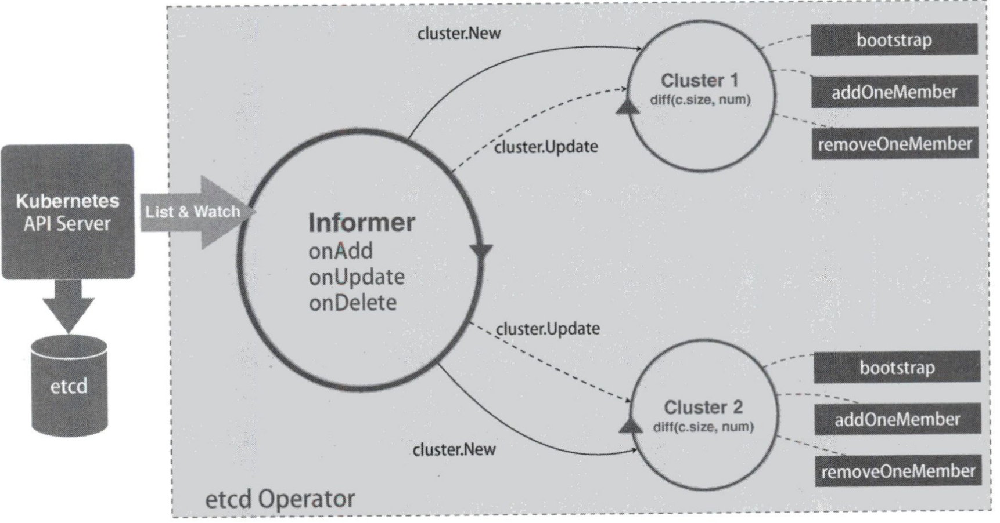

当 example-etcd-cluster.yaml 文件第一次被提交到 K8s 后，etcd Operator 的 Informer 就会立刻感知到一个新的 Etcdcluster 对象被创建了出来，所以 EventHandler 里的“添加”事件会被触发。此时这个 Handler 会在 etcd Operator 内部创建一个对应的 Cluster 对象，比如图中的 Cluster 1。这个 Cluster 对象就是一个 etcd 集群在 Operator 内部的描述，所以它与真实的 etcd 集群的生命周期一致。

在有了这样一个与 EtcdCluster 对象一一对应的控制循环之后，后续对这个 EtcdCluster 的任何修改，比如添加/删除 etcd 节点或者修改 etcd 的版本，它们对应的更新事件都会由这个 Cluster 对象的控制循环进行处理。以上就是 etcd Operator 的工作原理。


# 5. K8s 存储原理

## 5.1 持久化存储：PV 和 PVC 的设计和实现原理

**PV 全称 PersistentVolume，描述的是持久化存储数据卷，这个 API 对象主要定义的是一个持久化存储在宿主机上的目录，比如一个 NFS 的挂载目录**。通常情况下，运维人员事先在 K8s 集群里创建 PV 对象以待用。比如，运维人员可以定义一个 NFS 类型的 PV，如下所示：

```yaml
apiVersion: v1
kind: PersistentVolume
metadata:
  name: nfs
spec:
  storageClassName: manual
  capacity:
    storage: 1Gi
  accessModes:
    - ReadWriteMany
  nfs:
    server: 10.244.1.4
    path: "/"
```

**PVC 全称 PersistentVolumeClaim，描述的是 Pod 所希望使用的持久化存储的属性。比如，Volume 存储的大小、可读写权限等**。PVC 对象通常由用户创建，或者以 PVC 模板的方式成为 StatefulSet 的一部分，然后由 StatefulSet 控制器负责创建带编号的 PVC。比如，用户可以声明一个 1GiB 大小的 PVC，如下所示：

```yaml
apiVersion: vl
kind: PersistentVolumeClaim
metadata:
  name: nfs
spec:
  accessModes:
    - ReadWriteMany
  storageClassName: manual
  resources:
    requests:
      storage: 1Gi
```

**用户创建的 PVC 要真正被容器使用，就必须先和某个符合条件的 PV 进行绑定**。这里要检查以下两个条件：

* **第一个条件当然是 PV 和 PVC 的 spec 字段**。比如 PV 的存储（storage）大小必须满足 PVC 的要求。
* **第二个条件是 PV 和 PVC 的 storageclassName 字段必须一样**。稍后会专门介绍该机制。

在成功地将 PVC 和 PV 进行绑定之后，Pod 就能够像使用 hostPath 等常规类型的 Volume 一样，在自己的 YAML 文件里声明使用这个 PVC 了，如下所示。

```yaml
apiVersion: v1
kind: Pod
metadata:
  labels:
    role: web-frontend
spec:
  containers:
  - name: web
    image: nginx
    ports:
    - name: web
      containerPort: 80
    volumeMounts:
    - name: nfs
      mountPath: "/usr/share/nginx/html"
  volumes:
  - name: nfs
    persistentVolumeClaim:
      claimName: nfs
```

可以看到，Pod 需要做的，就是在 volumes 字段里声明自己要使用的 PVC 名字。接下来，等这个 Pod 创建之后，kubelet 就会把该 PVC 所对应的 PV，即一个 NFS 类型的 Volume，挂载在这个 Pod 容器内的目录上。

**PVC 和 PV 的设计其实跟“面向对象”的思想非常类似，可以把 PVC 理解为持久化存储的“接口”，它提供了对某种持久化存储的描述，但不提供具体的实现；而这个持久化存储的实现部分由 PV 负责完成**。这样做的好处是，用户只需要跟 PVC 这个“接口”打交道，而不必关心具体的实现是 NFS 还是 Ceph。毕竟这些存储相关的知识太专业了，应该交给专业的人去做。

有一种情况是，在创建 Pod 时，系统里并没有合适的 PV 跟它定义的 PVC 绑定，即此时容器想使用的 Volume 不存在，这样 Pod 的启动就会报错。但是，过了一会儿，平台运维人员发现了这个情况，所以他赶紧创建了一个对应的 PV。此时，我们当然希望 Ks 能够再次完成 PVC 和 PV 的绑定操作，从而启动 Pod。

所以，在 K8s 中实际存在一个专门处理持久化存储的控制器，叫作 VolumeController。它维护着多个控制循环，其中一个循环扮演的就是撮合 PV 和 PVC 的“红娘”角色，名叫 PersistentVolumeController。**PersistentVolumeController 会不断查看当前每一个 PVC 是否已经处于 Bound（已绑定）状态。如果不是，它就会遍历所有可用的 PV，并尝试将其与这个“单身”的 PVC 进行绑定**。这样，K8s 就可以保证用户提交的每一个 PVC，只要有合适的 PV 出现，就能很快地进入绑定状态。所谓将一个 PV 与 PVC 进行“绑定”，其实就是将这个 PV 对象的名字填在了 PVC 对象的 spec.volumeName 字段上。所以，接下来 K8s 只要获取这个 PVC 对象，就一定能够找到它所绑定的 PV。

所谓容器的 Volume，其实就是将一个宿主机上的目录跟一个容器里的目录绑定挂载在了一起。**所谓的“持久化 Volume”，指的就是该宿主机上的目录具备“持久性”，即该目录里面的内容既不会因容器的删除而被清理，也不会跟当前的宿主机绑定**。这样，当容器重启或在其他节点上重建之后，它仍能通过挂载这个 Volume 访问到这些内容。显然，hostPath 和 emptyDir 类型的 Volume 并不具备这个特征：它们既可能被 kubelet 清理，也不能迁移到其他节点上。

所以，大多数情况下，持久化 Volume 的实现往往依赖一个远程存储服务，比如远程文件存储（像 NFS、GlusterFS）、远程块存储（像公有云提供的远程磁盘）等。而 K8s 需要做的，就是使用这些存储服务来为容器准备一个持久化的宿主机目录，以供将来进行绑定挂载时使用。可以把这个准备“持久化”宿主机目录的过程形象地称为“两阶段处理”。下面举例说明。

1. **第一阶段：Attach**

   当 Pod 调度到一个节点上之后，kubelet 就要负责这个 Pod 创建它的 Volume 目录。默认情况下，kubelet 为 Volume 创建的目录是一个宿主机上的路径：`/var/lib/kubelet/pods/<Pod ID>/volumes/kubernetes.io~<Volume 类型>/<Volume 名字>`。接下来，kubelet 要进行的操作就取决于 Volume 类型了。如果 Volume 类型是远程块存储，比如 Google Cloud 的 Persistent Disk，那么 kubelet 就需要先调用 Goolge Cloud 的 API，将它提供的 Persistent Disk 挂载到 Pod 所在的宿主机上。这相当于执行：`gcloud compute instances attach-disk <虚拟机名字> --disk <远程磁盘名字>`，这一步为虚拟机挂载远程磁盘的操作。

2. **第二阶段：Mount**

   Attach 阶段完成后，为了能够使用该远程磁盘，kubelet 还要格式化这个磁盘设备，然后把它挂载到宿主机指定的挂载点上。这个挂载点正是前面提到的 Volume 的宿主机目录。所以，这一步相当于执行：

   ```shell
   # 通过 1sblk 命令获取磁盘设备 ID
   $ sudo 1sblk
   # 格式化成 ext4 格式
   $ sudo mkfs.ext4 -m 0 -F -E lazy_itable_init=0,lazy_journal_init=0,discard /dev/<磁盘设备 ID>
   # 挂载到挂载点
   $ sudo mkdir -p /var/lib/kubelet/pods/<Pod ID>/volumes/kubernetes.io~<Volume 类型>/<Volume 名字>
   ```

   如果 Volume 类型是远程文件存储（比如 NFS），kubelet 可以跳过“第一阶段”（Attach）的操作，因为远程文件存储一般没有一个“存储设备”需要挂载在宿主机上。所以，kubelet 会直接从“第二阶段”（Mount）开始准备宿主机上的 Volume 目录。在这一步，kubelet 需要作为 client 将远端 NFS 服务器的目录挂载到 Volume

   的宿主机目录上，相当于执行命令：`mount -t nfs <NFS 服务器地址>:/ /var/lib/kubelet/pods/<Pod ID>/volumes/kubernetes.io~<Volume 类型>/<Volume 名字>` 

经过“两阶段处理”，我们就得到了一个持久化的 Volume 宿主机目录。接下来 kubelet 只要把这个 Volume 目录通过 CRI 里的 Mounts 参数传递给 Docker，然后就可以为 Pod 里的容器挂载这个持久化的 Volume 了。相当于执行了如下命令：`docker run -v/var/lib/kubelet/pods/<Pod ID>/volumes/kubernetes.io~<Volume 类型>/<Volume 名字>:/<容器内的目标目录> 镜像`。在 K8s 中，上述关于PV的“两阶段处理”流程是靠独立于 kubelet 主控制循环（kubelet syncloop）的两个控制循环来实现的。

其中，第一阶段的 Attach（及 Detach）操作由 Volume Controller 负责维护，**这个控制循环叫作 AttachDetachController，其作用就是不断检查每一个 Pod 对应的 PV 和该 Pod 所在宿主机之间的挂载情况，从而决定是否需要对这个 PV 进行 Attach（或者 Detach）操作**。注意，作为 K8s 内置的控制器，Volume Controller 自然是 kube-controller-manager 的一部分。所以，AttachDetachController 也一定是在 Master 节点上运行的。当然，Attach 操作只需要调用公有云或者具体存储项目的 API，无须在具体的宿主机上执行操作，所以这个设计没有任何问题。

第二阶段的 Mount（及 Unmount）操作，必须发生在 Pod 对应的宿主机上，所以它必须是kubelet 组件的一部分。**这个控制循环叫作 VolumeManagerReconciler，它运行起来之后，是一个独立于 kubelet 主循环的 Goroutine。通过将 Volume 的处理同 kubelet 的主循环解耦，K8s 就避免了这些耗时的远程挂载操作拖慢 kubelet 的主控制循环，进而导致Pod 的创建效率大幅下降的问题**。实际上，kubelet 的一个主要设计原则就是，它的主控制循环绝对不可以被阻塞。

---

前面介绍曾提到，PV 的创建是由运维人员完成的。但是，在大规模的生产环境中，这项工作其实非常麻烦，因为成千上万个 PVC 意味着运维人员必须事先创建出成千上万个 PV。所以，K8s 提供了一套可以自动创建 PV 的机制 Dynamic Provisioning，相比之下，人工管理 PV 的方式就叫作 Static Provisioning。**Dynamic Provisioning 机制工作的核心在于一个名 StorageClass 的 API 对象，该对象的作用其实就是创建 PV 的模板**。具体而言，StorageClass 对象会定义如下两部分内容。

* **PV 的属性，比如存储类型、Volume 的大小等**。
* **创建这种 PV 需要用到的存储插件，比如 Ceph 等**。

有了这两项信息后，K8s 就能根据用户提交的 PVC 找到一个对应的 StorageClass，然后 K8s 就会调用该 StorageClass 声明的存储插件，创建出需要的 PV。举个例子，假如 Volume 的类型是 GCE 的 Persistent Disk，运维人员就需要定义一个如下所示的 StorageClass：

```yaml
apiVersion: storage.k8s.io/v1
kind: StorageClass
metadata:
  name: block-service
provisioner: kubernetes.io/gce-pd
parameters:
  type: pd-ssd
```

该 StorageClass 名为 block-service，provisioner 字段的值是 kubernetes.io/gce-pd，这正是 K8s 内置的 GCE PD 存储插件的名字，parameters 字段就是 PV 的参数，这里 type=pd-ssd 表示该 PV 的类型是 SSD 格式的 GCE 远程磁盘。注意，由于需要使用 GCE Persistent Disk，因此例子只有在 GCE 提供的 K8s 服务里才能实践。

**有了 StorageClass 后，开发者只要在 PVC 中指定要使用的 StorageClass 名字即可**，如下所示。当通过 kubectl create 创建上述 PVC 对象后，K8s 就会调用 Google Cloud API，创建出一块 SSD 格式的Persistent Disk。然后，再使用这个 PersistentDisk 的信息，自动创建出对应的 PV 对象。

```yaml
apiVersion: vl
kind: PersistentVolumeClaim
metadata:
  name: claim1
spec:
  accessModes:
    - ReadWriteOnce
  # storageclassName字段，用于指定该PVC要使用的StorageClass名字
  storageClassName: block-service
  resources:
    requests:
      storage:30Gi
```

有了 Dynamic Provisioning 机制，运维人员只需在 K8s 集群里创建出数量有限的 StorageClass 对象即可。K8s 官方文档里列出了默认支持 Dynamic Provisioning 的内置存储插件，对于文档未涵盖的插件，比如 NFS 或其他非内置存储插件，可以通过 kubernetes-incubator/external-storage 这个库编写一个外部插件来完成这个工作。

注意，StorageClass 并不是专门为了 Dynamic Provisioning 而设计的。在本节开头的例子中，PV 和 PVC 都声明了 storageClassName=manua1，而集群中实际并没有一个名为 manual 的 StorageClass 对象。这完全没有问题，此时 K8s 进行的是 StaticProvisioning，但在做绑定决策时，它依然会考虑 PV 和 PVC 的 StorageClass 定义，因为 **K8s 只会将 StorageClass 相同的 PVC 和 PV 绑定在一起**。

你可能会有疑问：之前讲解 StatefuISet 存储状态的例子时，好像没有声明 StorageClass？实际上，如果集群已经开启了名 DefaultStorageClass 的 Admission Plugin，它就会为 PVC 和 PV 自动添加一个默认的 StorageClass；否则，PVC 的 storageClassName 的值就是""，这意味着它只能跟 storageClassName 也是""的 PV 进行绑定。

---

最后，总结 PV、PVC、StorageClass 之间的关系，如下图所示：

* PVC 描述的是 Pod 想使用的持久化存储的属性，比如存储的大小、读写权限等；
* PV 描述的则是一个具体的 Volume 的属性，比如 Volume 的类型、挂载目录、远程存储服务器地址等；
* StorageClass 作用是充当 PV 的模板，并且只有同属于一个 StorageClass 的 PV 和 PVC 才能绑定在一起；
* StorageClass 另一个重要作用是指定 PV 的 Provisioner（存储插件），此时如果你的存储插件支持 Dynamic Provisioning，K8s 就可以自动创建 PV。

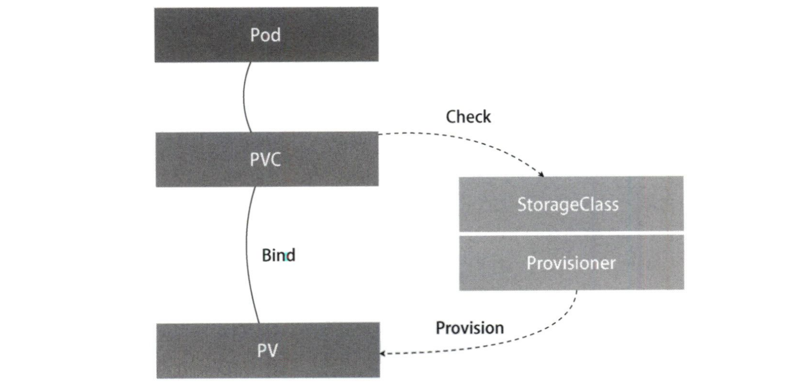


## 5.2 深入理解本地持久化数据卷

在持久化存储领域，用户呼声最高的需求莫过于支持“本地”持久化存储了，即用户希望 K8s 能够直接使用宿主机上的本地磁盘目录，而不依赖远程存储服务来提供“持久化”的容器 Volume。这样做的好处在于，**由于 Volume 直接使用本地磁盘，尤其是 SSD，因此它的读写性能比大多数远程存储要好得多**。所以，K8s 在 v1.10 之后就逐渐依靠 PV、PVC 体系实现了这个特性：Local PV（本地持久化数据卷）。

不过，**Local PV 并不适用于所有应用，它的适用范围非常固定，比如高优先级的系统应用，需要在多个节点上存储数据，并且对 I/O 有较高要求**。典型的应用包括：分布式数据存储（比如 MongoDB、Cassandra 等），分布式文件系统（比如 GlusterFS、Ceph 等），以及需要在本地磁盘上进行大量数据缓存的分布式应用。其次，**相比正常的 PV，一旦这些节点宕机且不能恢复时，Local PV 的数据就可能丢失。这就要求使用 Local PV 的应用必须具备备份和恢复数据的能力，允许把这些数据定时备份在别处**。不难想象，Local PV 的设计主要面临两个难点：

**第一个难点：如何把本地磁盘抽象成 PV**。可能你会说，Local PV 不就等同于 hostPath 加 nodeAffinity 吗？比如，一个 Pod 可以声明使用 Local PV，而该 PV 其实就是一个 hostPath Volume。如果这个 hostPath 对应的目录已经在节点 A 上事先创建好了，那么只需要再给这个 Pod 加上一个 nodeAffinity=nodeA，不就可以使用这个 Volume 了吗？事实上，绝不应该把宿主机上的目录用作 PV，因为本地目录的存储行完全不可控，它所在的磁盘随时都可能被写满，甚至造成整个宿主机宕机。而且，不同本地目录之间也缺乏最基础的 IO 隔离机制。**所以，一个 Local PV 对应的存储介质，一定是一块额外挂载在宿主机上的磁盘或者块设备（额外的意思是它不应该是宿主机根目录使用的主硬盘），可以把这项原则称为“一个 PV 一块盘”**。

**第二个难点：调度器如何保证 Pod 始终能被正确地调度到它所请求的Local PV 所在的节点上**。对于常规 PV 来说，K8s 都是先将 Pod 调度到某个节点上，然后通过“两阶段处理”来持久化这台机器上的 Volume 目录，进而完成 Volume 目录与容器的绑定挂载。可是，对于 Local PV 来说，节点上可用的磁盘（或者块设备）必须是运维人员提前准备好的。它们在不同节点上的挂载情况可以完全不同，甚至有的节点没有这种磁盘。**所以，调度器就必须能够知道所有节点与 Local PV 对应磁盘的关联关系，然后根据这项信息来调度 Pod。可以把这项原则称为“在调度时考虑 Volume 分布”。在 K8s 调度器中，有一个叫作 VolumeBindingChecker的过滤条件专门负责此事**。在 K8s v1.11 中，这个过滤条件已默认开启。

---

在使用 Local PV 之前，需要在集群中配置好磁盘或者块设备。在公有云上，这个操作等同于给虚拟机额外挂载一个磁盘，在部署的私有环境中，最常规的操作是给宿主机挂载并格式化一个可用的本地磁盘，这里在宿主机上挂载内存盘来模拟本地磁盘。如下所示，在名叫 node-1 的宿主机上创建一个挂载点，比如 /mnt/disks，然后用几个内存盘模拟本地磁盘。注意，如果想让其他节点也能支持 Local PV，就需要对它们也执行类似操作，并确保这些磁盘的名字（vol1、vol2 等）不重复。

```shell
# 在node-1上执行，
$ mkdir /mnt/disks
$ for vol in vol1 vol2 vol3; do
	mkdir /mnt/disks/$vol
	mount -t tmpfs $vol /mnt/disks/$vol
done
```

接下来就可以为这些本地磁盘定义对应的 PV 了，如下所示。PV 的 local 字段指定了它是一个 Local PV，path 字段指定了这个 PV 对应的本地磁盘的路径 /mnt/disks/vol1，**这也就意味着如果 Pod 想使用这个 PV，就必须在 node-1 上运行，所以 nodeAffinity 字段指定了 node-1 节点的名字**。这样调度器在调度 Pod 时，就能够知道 PV 与节点的对应关系，从而做出正确选择，这正是 K8s 实现“在调度时考虑 Volume 分布”的主要方法。

```yaml
apiVersion: v1
kind: PersistentVolume
metadata:
  name: example-pv
spec:
  capacity:
    storage: 5Gi
  volumeMode: Filesystem
  accessModes:
  - ReadWriteOnce
  persistentVolumeReclaimPolicy: Delete
  storageClassName: local-storage
  local:
    path: /mnt/disks/vol1
  nodeAffinity:
    required:
      nodeSelectorTerms:
      - matchExpressions:
        - key: kubernetes.io/hostname
          operator: In
          values:
          - node-1
```

正如上一节建议的，使用 PV 和 PVC 的最佳实践是创建一个 storageClass 来描述这个 PV，如下所示。注意，provisioner 字段指定的是 no-provisioner，**这是因为 Local PV 尚不支持 Dynamic Provisioning，所以它无法在用户创建 PVC 时就自动创建对应的 PV**，即前面创建 PV 的操作不可以省略。

```yaml
kind: StorageClass apiVersion:
storage.k8s.io/v1
metadata:
  name: local-storage
provisioner: kubernetes.io/no-provisioner
volumeBindingMode: WaitForFirstConsumer
```

与此同时，**该 storageClass 还定义了一个 volumeBindingMode=WaitForFirstConsumer 属性，它是 Local PV 里一个非常重要的特性：延迟绑定**。我们知道，当提交了 PV 和 PVC 的 YAML 文件后，K8s 就会根据二者的属性以及它们指定的 storageClass 来进行绑定。只有绑定成功后，Pod 才能通过声明这个 PVC 来使用对应的 PV。但是，对于 Local PV 这个流程根本行不通。

比如，现在有一个 Pod，它声明使用的 PVC 叫作 pvc-1，且我们规定这个 Pod 只能在 node-2 上运行。而在 K8s 集群中，有两个属性（如大小、读写权限）相同的 Local PV：其中第一个 PV 叫作 pv-1，它对应磁盘所在的节点是 node-1；第二个 PV 叫作 pv-2，它对应磁盘所在的节点是 node-2。

假设 K8s 的 Volume 控制循环里首先检查到 pvc-1 和 pv-1 的属性是匹配的，于是将二者绑定在一起。然后，当创建这个 Pod 时，问题就出现了。pv-1 所在的节点是 node-1，根据“调度器必须在调度时考虑 Volume 分布”的原则，这个 Pod 自然会被调度到 node-1 上。可是，前面规定这个 Pod 不能在 node-1 上运行。所以最终这个 Pod 的调度必然会失败。

**这就是为什么在使用 Local PV 时，必须推迟这个“绑定”操作，直到调度的时候**。所以，storageClass 中的 volumeBindingMode=WaitForFirstConsumer 含义，就是告诉 K8s Volume 控制循环（“红娘”）：虽然已经发现这个 storageClass 关联的 PVC 与 PV 可以绑定在一起，但请不要现在就执行绑定操作，而要等到第一个声明使用该 PVC 的 Pod 出现在调度器之后，调度器再综合考虑所有调度规则，来决定这个 Pod 声明的 PVC 到底应该跟哪个 PV 绑定。在具体实现中，调度器实际上维护了一个与 Volume Controller 类似的控制循环，专门负责那些声明了“延迟绑定”的 PV 和 PVC 进行绑定。

接下来，定义一个非常普通的 PVC，如下所示。注意，它声明的 storageClassName 是 local-storage。所以，当 K8s Volume Controller 看到这个 PVC 时，不会立刻为它进行绑定操作。尽管此时 K8s 中已经存在了一个可以与 PVC 匹配的 PV，但创建后这个 PVC 依然处于 Pending 状态，即等待绑定的状态。

```yaml
kind: PersistentVolumeClaim
apiVersion: v1
metadata:
  name: example-local-claim
spec:
  accessModes:
  - ReadWriteOnce
  resources:
    requests:
      storage: 5Gi
  storageClassName: local-storage
```

然后，编写一个 Pod 来声明使用这个 PVC，如下所示。一旦创建这个 Pod，使用 `kubectl get svc` 就会发现前面定义的 PVC 会立刻变成 Bound 状态，与前面定义的 PV 绑定在了一起。也就是说，在我们创建的 Pod 进入调度器之后，绑定操作才开始进行。

```yaml
kind: Pod
apiVersion: v1
metadata:
  name: example-pv-pod
spec:
  volumes:
    - name: example-pv-storage
    persistentVolumeClaim:
      claimName: example-local-claim
  containers:
    - name: example-pv-container
      image: nginx
      ports:
        - containerPort: 80
          name: "http-server"
      volumeMounts:
        - mountPath: "/usr/share/nginx/html"
          name: example-pv-storage
```

最后，通过【Pod 内创建文件 -> 宿主机查看文件 -> 删除并重建 Pod ->  Pod 内再次查看文件】，来验证 Local PV 的持久化功能。注意，前面手动创建 PV 的方式，即 Static PV 管理方式，在删除 PV 时需按照【删除使用这个 PV 的 Pod -> 从宿主机移除本地磁盘（比如执行 Umount操作）-> 删除 PVC -> 删除 PV】的流程执行，否则删除 PV 的操作就会失败。

当然，上面创建和删除 PV 的操作比较烦琐，K8s 其实提供了一个 Static Provisioner 来方便管理这些PV。比如，现在所有磁盘都挂载在宿主机的 /mnt/disks 目录下，那么当 Static Provisioner 启动后，它就会通过 DaemonSet 自动检查每台宿主机的 /mnt/disks 目录；然后调用 K8s API，为这些目录下面的每一个挂载创建一个对应的 PV 对象。这个 provisioner 其实也是一个前面提到过的 External Provisioner，其部署方法可查看官方文档。


# 6. K8s 网络原理

## 6.1 单机容器网络的实现原理

**Linux 容器能看见的”网络栈“，实际是隔离在它自己的 Network Namespace 中。”网络栈“包括了网卡（network interface）、回环设备（loopback device）、路由表（routingtable）和 iptables 规则**。对于一个进程来说，这些要素构成了它发起和响应网络请求的基本环境。

需要指出的是，容器可以直接使用宿主机的网络栈（-net=host），即不开启 Network Namespace，虽然可以提供良好的网络性能，但不可避免会带来共享网络资源的问题，如端口冲突。所以，大多数情况下，我们希望容器进程能使用自己 Network Namespace 里的网络栈，即拥有自己的 IP 地址和端口。那么这个被隔离的容器进程该如何跟其他 Network Namespace 里的容器进程交互呢？

为了理解这个问题，可以把每个容器看作一台主机，它们都有一套独立的“网络栈”。如果想实现两台主机之间的通信，最直接的办法就是用一根网线把它们连接起来；而如果想实现多台主机之间的通信，就需要用网线把它们连接到一台交换机上。**在 Linux 中，能够起到虚拟交换机作用的网络设备是网桥（bridge），它是一个在数据链路层工作的设备，主要功能是根据 MAC 地址学习将数据包转发到网桥的不同端口上**。

为了实现上述目的，**Docker 会默认在宿主机上创建一个名叫 docker0 的网桥，凡是与 docker0 网桥连接的容器，都可以通过它来进行通信。而容器则使用一种名叫 Veth Pair 的虚拟设备连接到 docker0 网桥上，Veth Pair 设备的特点是：它被创建出来后，总是以两张虚拟网卡（Veth Peer）的形式成对出现**。并且从其中一张网卡发出的数据包可以直接出现在对应的网卡上，哪怕这两张网卡在不同的 Network Namespace 里，这就使得 Veth Pair 常用作连接不同 Network Namespace 的网线。

比如，现在启动一个叫作 nginx-1 的容器，然后进入容器查看它的网络设备，如下所示。可以看到，**这个容器里有一张叫作 eth0 的网卡，它正是一个 Veth Pair 设备在容器里的这一端**。通过 route 命令查看 nginx-1 容器的路由表，可以看到这个 eth0 网卡是该容器里的默认路由设备，所有对 172.17.0.0/16 网段的请求，也会交给 eth0 来处理（第二条 172.17.0.0 路由规则）。

```shell
# 在宿主机上
$ docker exec -it nginx-1 /bin/bash
# 在容器里
root@2b3c181aecf1:/# ifconfig
eth0: flags=4163<UP,BROADCAST,RUNNING,MULTICAST>  mtu 1500
        inet 172.17.0.2  netmask 255.255.0.0  broadcast 172.17.255.255
        ether 02:42:ac:11:00:08  txqueuelen 0  (Ethernet)
        RX packets 9  bytes 726 (726.0 B)
        RX errors 0  dropped 0  overruns 0  frame 0
        TX packets 0  bytes 0 (0.0 B)
        TX errors 0  dropped 0 overruns 0  carrier 0  collisions 0

lo: flags=73<UP,LOOPBACK,RUNNING>  mtu 65536
        inet 127.0.0.1  netmask 255.0.0.0
        loop  txqueuelen 1000  (Local Loopback)
        RX packets 0  bytes 0 (0.0 B)
        RX errors 0  dropped 0  overruns 0  frame 0
        TX packets 0  bytes 0 (0.0 B)
        TX errors 0  dropped 0 overruns 0  carrier 0  collisions 0

root@2b3c181aecf1:/# route
Kernel IP routing table
Destination     Gateway         Genmask         Flags Metric Ref    Use Iface
default         172.17.0.1        0.0.0.0         UG    0      0        0 eth0
172.17.0.0      0.0.0.0         255.255.0.0     U     0      0        0 eth0
```

这个 Veth Pair 设备的另一端在宿主机上，可以查看宿主机的网络设备，如下所示。**nginx-1 容器对应的 Veth Pair 设备在宿主机上是一张虚拟网卡，名为 veth9c02e56，且 brctl show 输出显示，这张网卡被插在 docker0上**。此时如果再另启一个 nginx-2 容器，就会发现一个新的名为 vethb4963f3 的虚拟网卡也被插在 docker0 网桥上。

```shell
# 在宿主机上
$ ifconfig
docker0: flags=4163<UP,BROADCAST,RUNNING,MULTICAST>  mtu 1500
        inet 172.17.0.1  netmask 255.255.0.0  broadcast 172.17.255.255
        inet6 fe80::42:ddff:fe8e:ba3f  prefixlen 64  scopeid 0x20<link>
        ether 02:42:dd:8e:ba:3f  txqueuelen 0  (Ethernet)
        RX packets 339874292  bytes 1697169601408 (1.5 TiB)
        RX errors 0  dropped 0  overruns 0  frame 0
        TX packets 602986120  bytes 3768893143554 (3.4 TiB)
        TX errors 0  dropped 0 overruns 0  carrier 0  collisions 0
veth9c0256: flags=4163<UP,BROADCAST,RUNNING,MULTICAST>  mtu 1500
        inet6 fe80::d8a8:d3ff:fee0:594  prefixlen 64  scopeid 0x20<link>
        ether da:a8:d3:e0:05:94  txqueuelen 0  (Ethernet)
        RX packets 0  bytes 0 (0.0 B)
        RX errors 0  dropped 0  overruns 0  frame 0
        TX packets 9  bytes 726 (726.0 B)
        TX errors 0  dropped 0 overruns 0  carrier 0  collisions 0

$ brctl show
bridge name     bridge id               STP enabled     interfaces
docker0         8000.0242dd8eba3f       no              veth9c0256

# 再另启nginx-2容器后
$ brctl show
bridge name     bridge id               STP enabled     interfaces
docker0         8000.0242dd8eba3f       no              veth9c0256
                                                        vethb4963f3
```

此时如果在 nginx-1 容器里 ping nginx-2 容器的 IP 地址（172.17.0.3），就会发现同一台宿主机上的两个容器默认相互连通。原理非常简单，当在 nginx-1 容器里访问 nginx-2 容器的 IP 地址时，这个目的 IP 地址会匹配到 nginx-1 容器里的第二条路由规则，**这条路由规则的网关是 0.0.0.0，这就意味着这是一条直连规则，即凡是匹配到这条规则的 IP 包，应该经过本机的 eth0 网卡通过二层网络直接发往目的主机**。要通过二层网络到达 nginx-2 容器，就需要有 172.17.0.3 这个 IP 地址对应的 MAC 地址。所以 nginx-1 容器的网络协议栈需要通过 eth0 网卡发送一个 ARP 广播，来通过 IP 地址查找对应的 MAC 地址。

前面提到，eth0 网卡是一个 Veth Pair，它的一端在 nginx-1 容器的 Network Namespace 里，另一端位于宿主机 Host Namespace 上，并且被插在宿主机的 docker0 网桥上。**一旦虚拟网卡被插在网桥上，它就会变成该网桥的“从设备”。从设备会被剥夺调用网络协议栈处理数据包的资格，从而“降级”为网桥上的一个端口。该端口唯一的作用就是接收流入的数据包，然后把这些数据包的“生杀大权”（如转发或丢弃）全部交给对应的网桥**。

所以，在收到这些 ARP 请求之后，docker0 网桥就会扮演二层交换机的角色，把 ARP 广播转发到其他插在 docker0 上的虚拟网卡上。这样，同样连接在 docker0 上的 nginx-2 容器的网络协议栈就会收到这个 ARP 请求，于是将 172.17.0.3 对应的 MAC 地址回复给 nginx-1 容器。有了目的 MAC 地址，nginx-1 容器的 eth0 网卡就可以发出数据包，这个数据包会出现在宿主机的 veth9c02e56 虚拟网卡上，不过此时这个网卡的网络协议栈资格已被剥夺，所以这个数据包直接流入 docker0 网桥里。

docker0 处理转发的过程则继续扮演二层交换机的角色。此时，docker0 网桥根据数据包的目的 MAC 地址（nginx-2 容器的 MAC 地址），在它的 CAM 表（交换机通过 MAC 地址学习维护的端口和 MAC 地址的对应表）里查到对应的端口为 vethb4963f3，然后把数据包发往该端口。这个端口正是 nginx-2 容器插在 docker0 网桥上的另一块虚拟网卡。当然，它也是一个 Veth Pair 设备，这样数据包就进入 nginx-2 容器的 Network Namespace 里了。所以，nginx-2 容器看到自己的 eth0 网卡上出现流入的数据包。

以上就是同一台宿主机上的不同容器通过 docker0 网桥进行通信的流程，如图所示**。在默认情况下被限制在 Network Namespace 里的容器进程，实际上是通过 Veth Pair 设备 + 宿主机网桥 docker0 的方式，实现了跟其他容器数据交换的**。

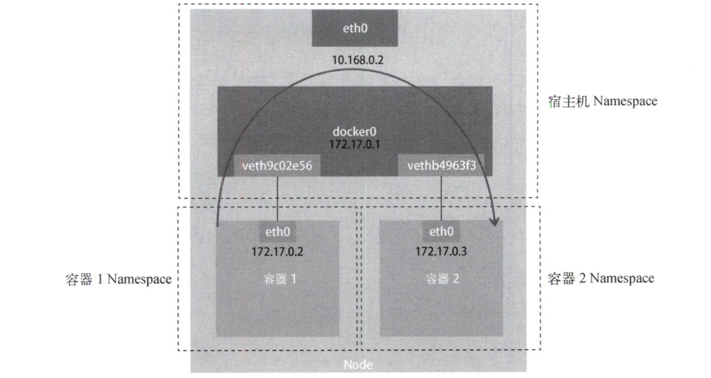

类似地，当在一台宿主机上访问该宿主机上的容器 IP 地址时，这个请求的数据包也是先根据路由规则到达 docker0 网桥，然后转发到对应的 Veth Pair 设备，最后出现在容器里，如图所示。

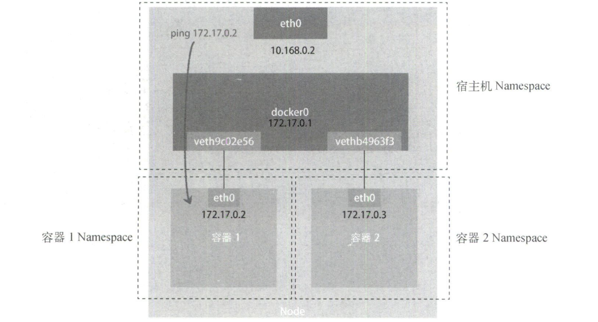

同样，当容器试图连接其他宿主机时，比如 ping 10.168.0.3，它发出的请求数据包首先经过 docker0 网桥出现在宿主机上，然后根据宿主机路由表的直连路由规则（10.168.0.0/24 via eth0），对 10.168.0.3 的访问请求就会交给宿主机的 eth0 处理。接下来，这个数据包就会经宿主机的 eth0 网卡转发到宿主机网络上，最终到达 10.168.0.3 对应的宿主机上。当然，这个过程要求两台宿主机是连通的，如图所示。所以，当容器无法连通外网时，应该先试试 docker0 网桥，然后查看跟 docker0 和 Veth Pair 设备相关的 iptables 规则是否有异常。

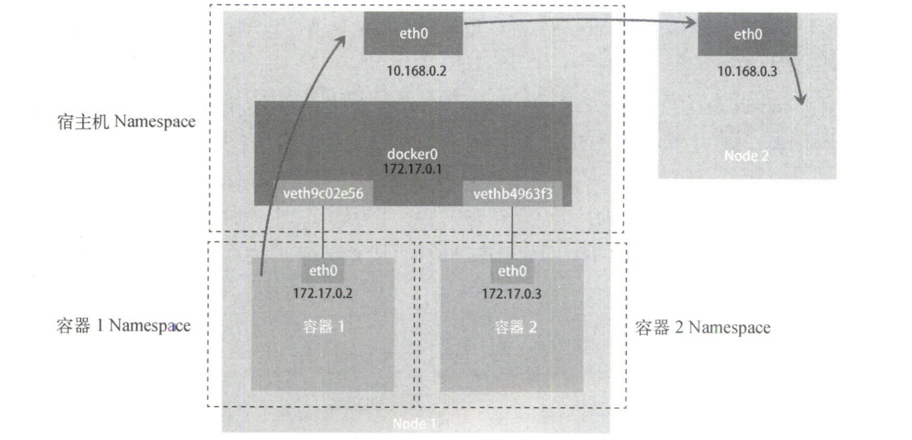

如果另一台宿主机（比如 10.168.0.3）上也有一个 Docker 容器，那么 nginx-1 容器如何访问它呢？这其实就是容器的跨主通信问题。**在 Docker 的默认配置下，一台宿主机上的 docker0 网桥和其他宿主机上的 docker0 网桥没有任何关联，它们互相之间无法连通。所以，连接在这些网桥上的容器自然也无法进行通信**。构建这种容器网络的核心在于，**需要在已有宿主机网络上，再通过软件构建一个可以把所有容器连通起来的虚拟网络，这种技术称覆盖网络（overlay network）**，如图所示。

这个覆盖网络可以由每台宿主机上的一个特殊网桥共同组成。比如，当 Node1 上的容器 1 要访问 Node2 上的容器 3 时，Node1 上的特殊网桥在收到数据包后，能够通过某种方式把数据包发送到正确的宿主机，比如 Node2。而 Node2 上的特殊网桥在收到数据包后，也能够通过某种方式把数据包转发给正确的容器，比如容器 3。甚至每台宿主机上都不需要有一个这种特殊的网桥，而仅仅通过某种方式配置宿主机的路由表，就能够把数据包转发到正确的宿主机上，后面详细介绍。

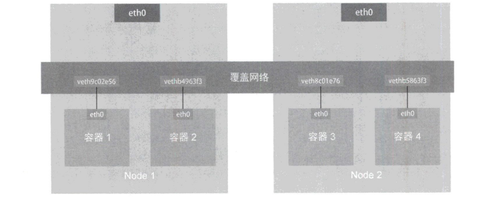


## 6.2 深入解析容器跨主机网络

要理解容器跨主通信的原理，就要从 Flannel 说起。Flannel 是 CoreOS 公司主推的容器网络方案，它只是一个框架，真正提供容器网络功能的是 Flannel 的后端实现。**目前，Flannel 支持 3 种后端实现：VXLAN、host-gw、UDP，分别代表了 3 种容器跨主网络的主流实现方法**，其中 host-gw 模式后面详述。

**UDP 模式是 Flannel 最早支持的，也是性能最差的一种方式，目前已被弃用**。假设有两台宿主机。

* 宿主机 Node1 上有一个容器 container-1，它的 IP 地址是 100.96.1.2，对应的 docker0 网桥的地址是 100.96.1.1/24。
* 宿主机 Node2 上有一个容器 container-2，它的 IP 地址是 100.96.2.3，对应的 docker0 网桥的地址是 100.96.2.1/24。

现在让 container-1 访问 container-2。由于目的地址 100.96.2.3 并不在 Node1 的 docker0 网桥的网段里，因此这个 IP 包会被交给宿主机的默认路由规则，此时 Flannel 已经在宿主机上创建了一系列的路由规则。以 Node1为例，如下所示。

```shell
# 在Node1上
$ ip route
default via 10.168.0.1 dev etho
100.96.0.0/16 dev flannel0 proto kernel scope link src 100.96.1.0
100.96.1.0/24 dev docker0 proto kernel scope link src 100.96.1.1
10.168.0.0/24 dev etho proto kernel scope link src 10.168.0.2
```

由于 IP 包的目的地址是 100.96.2.3，因此它匹配不到本机 docker0 网桥对应的 100.96.1.0/24 网段，只能匹配到 100.96.0.0/16 对应的路由规则，**从而进入一个叫作 flanneI0 的设备中，它是一个 TUN 设备（tunnel 设备）。在 Linux 中，TUN 设备是一种在三层（网络层）工作的虚拟网络设备，实现在操作系统内核和用户应用程序之间传递 IP 包**。

以 flannel0 设备为例。当操作系统将一个 IP 包发送给 flannel0 设备后，flannel0 就会把这个 IP 包交给创建该设备的应用程序，即 Flannel 进程，这是从内核态（Linux 操作系统）向用户态（Flannel 进程）的流动方向。反之，如果 Flannel 进程向 flannel0 设备发送了一个 IP 包，这个 IP 包就会出现在宿主机网络栈中，然后根据宿主机的路由表进行下一步处理，这是从用户态向内核态的流动方向。

所以，当 IP 包从容器经过 docker0 出现在宿主机，然后又根据路由表进入 flannel0 设备后，宿主机上的 flannel 进程就会收到这个 IP 包，然后把它发送给 Node2 宿主机。那么，flanneld 是如何知道这个 IP 地址对应的容器是在 Node2 上运行呢？**因为在 Flannel 管理的容器网络里，一台宿主机上的所有容器都属于该宿主机被分配的一个子网**。Node1 的子网是 100.96.1.0/24，container-1 的 IP 地址是 100.96.1.2。Node2 的子网是 100.96.2.0/24，container-2 的 IP 地址是 100.96.2.3。这些子网与宿主机的对应关系保存在 etcd 当中。

```shell
$ etcactl ls /coreos.com/network/subnets
/coreos.com/network/subnets/100.96.1.0-24
/coreos.com/network/subnets/100.96.2.0-24
/coreos.com/network/subnets/100.96.3.0-24

$ etcactl get /coreos:com/network/subnets/100.96.2.0-24
{"PublicIP": "10.168.0.3"}
```

所以，flannel 进程在处理由 flannel0 传入的 IP 包时，就可以根据目的 IP 地址（100.96.2.3），匹配到对应的子网（100.96.2.0/24），从 etcd 中找到这个子网对应的宿主机的 IP 地址是 10.168.0.3。然后把这个 IP 包直接封装在一个 UDP 包里，然后发送给 Node2。**因为每台宿主机上的 flannel 都监听 8285 端口，所以 flannel 只要把 UDP 包发往 Node2 的 8285 端口即可**。接下来 Node2 上 flannel 进程会直接把这个 IP 包发送给 flannel0 设备，完成从用户态向内核态的流动。

以上就是基于 Flannel UDP 模式的跨主通信的基本原理，如图所示。Flannel UDP 模式提供的是一个三层的覆盖网络：它首先对发出端的 IP 包进行 UDP 封装，然后在接收端进行解封装拿到原始的 IP 包，接着把这个 IP 包转发给目标容器。好比 Flannel 在不同宿主机上的两个容器之间打通了一条隧道，使得这两个容器可以直接使用 IP 地址进行通信，而无须关心容器和宿主机的分布情况。

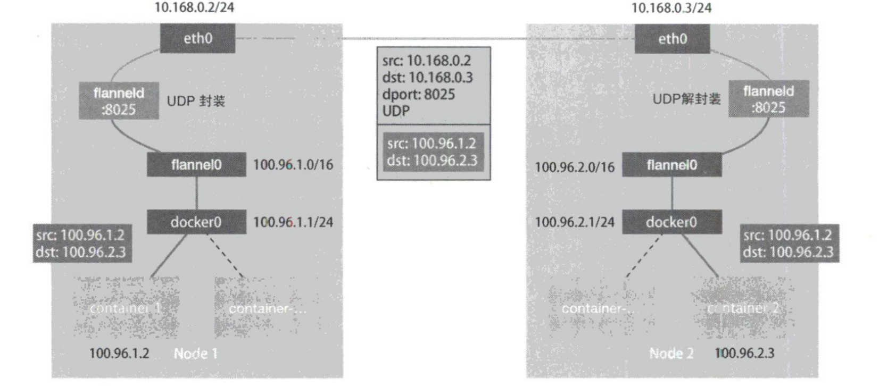

那么 UDP 模式的性能问题出现在哪里呢？**相比两台宿主机之间的直接通信，基于 Flannel UDP 模式的容器通信多了一个额外的步骤：flannel 的处理过程。由于该过程用到了 flannel0 TUN 设备，因此仅在发出 IP 包的过程中，就需要经过 3 次用户态与内核态之间的数据复制**，如图所示。这也是 Flannel 后来支持的 VXLAN 模式逐渐成内主流容器网络方案的原因。

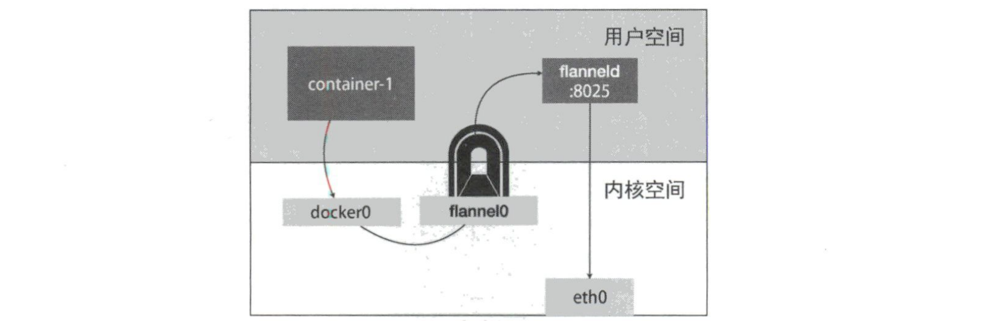

---

**VXLAN （virtual extensible LAN，虚拟可扩展局域网）， 是 Linux 内核本身就支持的一种网络虚似化技术。所以，VXLAN 可以完全在内核态实现上述封装和解封装的工作，从而通过与前面相似的隧道机制构建出覆盖网络**。设计思想是：在现有的三层网络之上覆盖一层虚拟的、由内核 VXLAN 模块负责维护的二层网络，使得这个 VXLAN 二层网络上的“主机”（虚拟机或容器）之间，可以像在同一个局域网里自由通信。当然，这些“主机”可能分布在不同的宿主机上，甚至是分布在不同的物理机房。

**为了在二层网络上打通隧道，VXLAN 会在宿主机上设置一个特殊的网络设备作为隧道的两端，这个设备叫作 VTEP （VXLAN tunnel end point，虚拟隧道端点）。设备的作用其实跟 flannel 进程相似，只不过它进行封装和解封装的对象是二层数据帧（Ethernet frame ），且工作的执行流程全部在内核里完成的（因 VXLAN 就是 Linux 内核中的一个模块）**。如图所示，每台宿主机上名叫 flannel.1 的设备就是 VXLAN 所需的 VTEP 设备，既有 IP 地址，也有 MAC 地址。

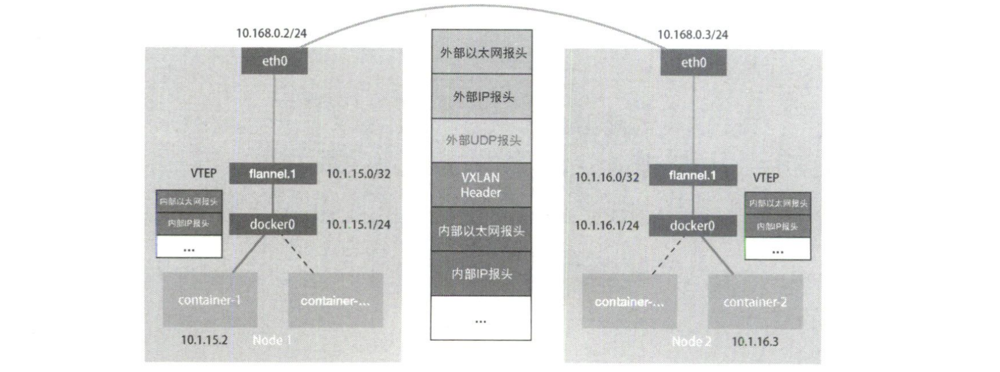

现在，container-1（IP 为 10.1.15.2）要访问 container-2（IP 为 10.1.16.3），与前面 UDP 模式流程类似，当 container-1 发出请求后，这个目的是 10.1.16.3 的原始 IP 包，会先出现在 docker0 网桥，然后被路由到本机 flannel.1 设备进行处理，即来到了隧道的入口。**为了将原始 IP 包封装并发送到正确的宿主机，VXLAN 就需要找到这条隧道的出口，即目的宿主机的 VTEP 设备，这个设备的信息正是由每台宿主机上的 flannel 进程维护的**。

比如，当 Node2 启动并加入 Flannel 网络后，在 Node1 及其他所有节点上，flannel 就会添加一条如下的路由规则。这条规则意思是，凡是发往 10.1.16.0/24 网段的 IP 包，都需要经 flannel.1 设备发出，并且它最后发往的网关地址是 10.1.16.0，即 Node2 上 VTEP 设备（flannel.1 设备）的 IP 地址。

```shell
$ route -n
Kernel IP routing table
Destination     Gateway         Genmask         Flags Metric Ref    Use Iface
10.1.16.0       10.1.16.0    		255.255.255.0   UG    0      0        0 flannel.1
```

现在需要解决“目的 VTEP 设备”的 MAC 地址是什么，要根据三层 IP 地址查询对应的二层 MAC 地址，这正是 ARP 表的功能。**这里用到的 ARP 记录，也是 flannel 进程在 Node2 启动时自动添加到 Node1 上的**。如下所示，IP 地址 10.1.16.0 对应的 MAC 地址是 5e:f8:4f:00:e3:37。可以看到，此时 Flannel 并不依赖 L3 MISS 事件和 ARP 学习，而会在每个节点启动时把它的 VTEP 设备对应的 ARP 记录直接下放到其他每台宿主机上。

```shell
# 在Node1上
$ ip neigh show dev flannel.1
10.1.16.0 lladdr 5e:f8:4f:00:e3:37 PERMANENT
```

有了“目的VTEP设备”的 MAC 地址，Linux 内核就可以开始二层封包了。这个二层数据帧的格式如图所示，Linux 内核会把“目的VTEP设备”的 MAC 地址填写在内部以太网报头字段，而不改变原始 IP 包的内容。但是，上面提到的 VTEP 设备的 MAC 地址，对于宿主机网络来说并没有什么实际意义，这个封装出来的数据帧，并不能在宿主机二层网络里传输。所以，**接下来 Linux 内核还需要再把“内部数据帧”进一步封装成为宿主机网络里的一个“外部数据帧”，好让它载着“内部数据帧”通过宿主机的 eth0 网卡进行传输**。


为了实现搭便车的机制，**Linux 内核会在“内部数据帧”前面加上一个特殊的 VXLAN 头，用来表示这个“乘客”实际是 VXLAN 要使用的一个数据帧**。这个 VXLAN 头里有个重要的 VNI 标志，它是 VTEP 设备识别某个数据帧是否应该归自己处理的重要标识。在 Flannel 中 VNI 默认值是 1，这也是宿主机上 VTEP 设备都叫 flannel.1 的原因，这里的 1 其实就是 VNI 的值。然后，Linux 内核会把这个数据帧封装进一个 UDP 包里发出去（类似特洛伊木马）。

此时 flannel.1 设备只知道另一端 flannel.1 设备的 MAC 地址，却不知道对应的宿主机地址。那么，这个 UDP 包该发给哪台宿主机呢？在这种场景中，flannel.1 设备实际上要扮演一个网桥角色，在二层网络进行 UDP 包的转发。**在 Linux 内核中，网桥设备进行转发的依据来自一个叫作 FDB （forwarding database）的转发数据库， fannel.1 网桥对应的 FDB 信息也是由 flannel 进程负责维护的**，如下所示。

```shell
# 在Node1上，使用”目的VTEP设备“的MAC地址进行查询
$ bridge fdb show flannel.1 | grep 5e:f8:4f:00:e3:37
5e:f8:4f:00:e3:37 dev flannel.1 dst 10.168.0.3 self permanent
```

上面这条 FDB 记录中的规则表示，发往“目的 VTEP 设备”（MAC 地址是 5e:f8:4f:00:e3:37）的二层数据帧，应该通过 flannel.1 设备发往 IP 地址为 10.168.0.3 的 Node2 主机，UDP 包要发往的目的地就找到了。然后把 Node2 的 MAC 地址填进去，这个 MAC 地址本身是 Node1 ARP 表要学习的内容，无须 Flannel维护。这样封装出来的“外部数据帧的”格式如图所示。


接下来，Node1 上的 flannel.1 设备就可以把这个数据帧从 Node1 的 eth0 网卡发出去。显然，这个帧会经过宿主机网络来到 Node2 的 eth0 网卡。此时，Node2 的内核网络栈会发现这个数据帧里有 VXLAN Header，并且 VNI=1。所以 Linux 内核会对它进行拆包，获取里面的“内部数据帧”，然后根据 VNI 的值把它交给 Node2 上的 flannel.1 设备。flannel.1 设备会进一步拆包，取出原始 IP 包，并最终进入 container-2 容器的 Network Namespace。


## 6.3 K8s 网络模型与 CNI 网络插件

**上面介绍的 UDP 和 VXLAN 有一个共性：容器都连接在 docker0 网桥上。而网络插件在宿主机上创建了一个特殊设备（UDP 模式创建的是 TUN 设备，VXLAN 模式创建的是 VTEP 设备），docker0 与这个设备之间通过 IP 转发（路由表）进行协作。网络插件真正要做的是通过某种方法把不同宿主机上的特殊设备连通，从而实现容器跨主机通信**。

实际上，**上述流程正是 K8s 对容器网络的主要处理方法，只不过 K8s 是通过一个叫作 CNI 的接口维护了一个单独的网桥来代替 docker0。这个网桥叫作 CNI 网桥，它在宿主机上的默认设备名称是 cni0**。以 Flannel VXLAN 模式为例，在 K8s 环境中它的工作方式跟上一节讲解一样，只是 docker0 网桥换成了 CNI 网桥而已。注意，CNI 网桥只是接管所有 CNI 插件负责的（K8s 创建的）容器，如果用 docker run 单独启动一个容器，那么 Docker 项目还是会把该容器连接到 docker0 网桥上。

**K8s 之所以要设置这样一个与 docker0 网桥功能几乎相同的 CNI 网桥，有两个主要原因：K8s 并没有使用 Docker 的网络模型（CNM），所以它并不希望，也不具备配置 docker0 网桥的能力。此外还与 K8s 如何配置 Pod，也就是 Infra 容器的 Network Namespace 密切相关**。我们知道，K8s 创建 Pod 的第一步，就是创建并启动一个 Infra 容器，用来 hold  Pod 的 Network Namespace。所以，CNI 的设计思想就是，K8s 在启动 Infra 容器后，就可以调用 CNI 网络插件，为这个 Infra 容器的 Network Namespace 配置符合预期的网络栈。

那么，网络栈的配置工作是如何完成的呢？这就要从 CNI 插件的部署和实现方式谈起了。部署 K8s 时有一个步骤是安装 kubernetes-cni 包，目的是在宿主机上安装 CNI 插件所需的基础可执行文件。安装完成后，可以在宿主机的 /opt/cni/bin 目录下看到它们，如下所示。

```shell
$ ls -l /opt/cni/bin/
-rwxr-xr-x 1 root root  4246019 Jul 23 15:33 bandwidth
-rwxr-xr-x 1 root root  4665324 Jul 23 15:33 bridge
-rwxr-xr-x 1 root root 20212889 Jul 23 15:33 dhcp
-rwxr-xr-x 1 root root  3439780 Jul 23 15:33 flannel
-rwxr-xr-x 1 root root  3745368 Jul 23 15:33 host-local
-rwxr-xr-x 1 root root  3965500 Jul 23 15:33 ipvlcan
-rwxr-xr-x 1 root root  3209463 Jul 23 15:33 loopback
-rwxr-xr-x 1 root root  3520724 Jul 23 15:33 macvlan
-rwxr-xr-x 1 root root  3979034 Jul 23 15:33 portmap
-rwxr-xr-x 1 root root  3877986 Jul 23 15:33 ptp
-rwxr-xr-x 1 root root  2605279 Jul 23 15:33 sample
-rwxr-xr-x 1 root root  3695403 Jul 23 15:33 tuning
-rwxr-xr-x 1 root root  3475750 Jul 23 15:33 vlan
```

这些 CNI 的基础可执行文件按照功能可以分为三类：

* **Main 插件，用来创建具体网络设备的二进制文件**。比如 bridge（网桥设备）、ipvlan、loopback（lo设备）、macvlan、ptp （Veth Pair 设备）以及 vlan。前面提到的 Flannel、Weave 等都属于网桥类型的 CNI 插件。所以在具体的实现中，它们往往会调用 bridge 这个二进制文件。稍后详细介绍该流程。
* **IPAM （IP address management）插件，负责分配 IP 地址的二进制文件**。比如 dhcp 文件会向 DHCP 服务器发起请求，host-local 则会使用预先配置的 IP 地址段来进行分配。
* **由 CNI 社区维护的内置 CNI 插件**。比如，flannel 就是专门为 Flannel 项目提供的 CNI 插件；tuning 是通过 sysctl 调整网络设备参数的二进制文件；portmap 是通过 iptables 配置端口映射的二进制文件；bandwidth 是使用 TBF （token bucket filter）来进行限流的二进制文件。

从这些二进制文件中可以看出，要实现一个面向 K8s 的容器网络方案，需要做两部分工作，以 Flannel 项目为例。**首先，实现这个网络方案本身，这部分需要编写 flannel 进程里的主要逻辑，如创建和配置 flannel.1 设备、配置宿主机路由、配置 ARP 和 FDB表里的信息等。然后，实现该网络方案对应的 CNI 插件，这部分的主要工作是配置 Infra 容器里的网络栈并把它连接到 CNI 网桥上**。由于 Flannel 项目对应的 CNI 插件已经内置，因此无须再单独安装。而对于 Weave、Calico 等其他项目，就必须在安装插件时把对应 CNI 插件的可执行文件放在 /opt/cni/bin/目录下。

接下来，需要在宿主机上安装 flannel（网络方案本身）。在此过程中，flannel 启动后会在每台宿主机上生成对应的 CNI 配置文件（一个 ConfigMap），从而告诉 K8s 这个集群要使用 Flannel 作为容器网络方案。CNI 配置文件的内容如下所示。

```shell
$ cat /etc/cni/net.d/10-flannel.conflist
{
  "name": "cbr0",
  "plugins": [
    {
       "type": "flannel",
       "delegate": {
         "hairpinMode": true,
				 "isDefaultGateway": true
       }
    },
    {
       "type": "portmap",
       "capabilities": {
         "portMappings": true
       }
    }
  ]
}
```

注意，在 K8s 中，处理容器网络相关的逻辑不会在 kubelet 主干代码里执行，而会在具体的 CRI 实现里完成。对于 Docker 来说，它的 CRI 实现叫作 dockershim，位于 kubelet 的代码里。所以，接下来 dockershim 会加载上述 CNI 配置文件。另外，**K8s 目前不支持多个 CNI 插件混用，如果在 CNI 配置目录 /etc/cni/net.d 放了多个 CNI 配置文件，dockershim 只会加载按字母顺序排序的第一个插件。但 CNI 允许在 CNI 配置文件里通过 plugins 字段定义多个插件进行协作**。上面例子中，Flannel 就指定了 flannel 和 portmap 两个插件。

此时，dockershim 会加载这个 CNI 配置文件，并且把列表里的第一个插件（fannel 插件）设置默认插件。而在后面的执行过程中，flannel 和 portmap 插件会按照定义顺序被调用，从而依次完成“配置容器网络”和“配置端口映射”这两步操作。

---

**接下来讲解 CNI 插件的工作原理**。当 kubelet 创建 Pod 时，首先创建的一定是 Infra 容器，此时 dockershim 会先调用 Docker API 创建并启动 Infra 容器，接着执行 setUpPod 方法，用于 CNI 插件准备参数，然后调用 CNI 插件为 Infra 容器配置网络。**这里 CNI 插件就是 /opt/cni/bin/flannel，调用它所需要的参数分为两部分**。

**第一部分是由 dockershim 设置的一组 CNI 环境变量**。其中，最重要的环境变量参数叫作 CNI_COMMAND，其取值只有两种：ADD 和 DEL，即 CNI 插件仅需要实现的两个方法。ADD 操作的含义是把容器添加到 CNI 网络里；DEL 操作的含义则是从 CNI 网络里移除容器。对于网桥类型的 CNI 插件来说，这两个操作意味着把容器以 Veth Pair 的方式插到 CNI 网桥上，或者从网桥上拔掉。

**第二部分是 dockershim 从 CNI 配置文件里加载到的、默认插件的配置信息**。这项配置信息在 CNI 中叫作 Network Configuration，dockershim 会把 Network Configuration 以 JSON 数据格式，通过标准输入的方式传递给 Flannel CNI 插件。

有了这两部分参数，Flannel CNI 插件实现 ADD 操作就非常简单了。不过注意，**Flannel 的 CNI 配置文件里有个 delegate 字段，表示这个 CNI 插件并不会亲自上阵，而是调用 delegate 指定的某种 CNI 内置插件来完成任务**。对于 Flannel 来说，它调用的就是前面介绍的 CNI bridge 插件。所以，dockershim 对 Flannel CNI 插件的调用就是走过场，Flannel CNI 插件唯一需要做的，就是对 dockershim 传来的 Network Configuration 进行补充。如将 delegate 的 type 字段设置为 bridge，将 delegate 的 ipam 字段设置为 host-local 等。

```json
{
  "hairpinMode": true,
	"ipMasq": false,
	"ipam": {
		"routes": [
      {
        "dst": "10.244.0.0/16"
      }
    ],
		"subnet": "10.244.1.0/24",
		"type": "host-local"
  },
	"isDefaultGateway": true,
	"isGateway": true,
  "mtu": 1410,
  "name": "cbr0",
  "type": "bridge"
}
```

接下来，Flannel CNI 插件会调用 CNI bridge 插件，即执行 /opt/cni/bin/bridge 二进制文件。调用 CNI bridge 插件需要的第一部分参数，也就是 CNI 环境变量，并没有变化，所以其中的 CNI_COMMAND 参数的值还是 ADD。而第二部分参数 Network Configration 正是上面补充好的 delegate 字段。Flannel CNI 插件会把 delegate 字段的内容以标准输入的方式传递给 CNI bridge 插件。此外，Flannel CNI 插件还会把 delegate 字段以 JSON 文件的方式保存在 /var/lib/cni/flannel 目录，为了后面删除容器调用 DEL 操作使用。

有了这两部分参数，CNI bridge 插件就可以代表 Flannel，将容器加入 CNI 网络了。首先，CNI bridge 插件会在宿主机上检查 CNI 网桥是否存在。如果不存在就创建它，这相当于在宿主机上执行：

```shell
# 在宿主机上
$ ip link add cni0 type bridge
$ ip link set cni0 up
```

然后，CNI bridge 插件会通过 Infra 容器的 Network Namespace 文件进入这个 Network Namespace 中，创建一对 Veth Pair 设备。接着它会把这个 Veth Pair 的其中一端移动到宿主机上，这相当于在容器里执行：

```shell
# 在容器里
# 创建一对Veth Pair设备。其中一个叫作 eth0，另一个叫作vethb4963f3
$ ip link add eth0 type veth peer name vethb4963f3
# 启动eth0设备
$ ip link set eth0 up
# 将Veth Pair设备的另一端（vethb4963f3设备）放到宿主机（Host Namespace）上
$ ip link set vethb4963f3 netns $HOST_NS
# 通过Host Namespace启动宿主机上的vethb4963f3设备
$ ip netns exec $HOST_NS ip link set vethb4963f3 up
```

这样，vethb4963f3 就出现在了宿主机上，且这个 Veth Pair 设备的另一端就是容器里面的 eth0。当然，上述创建 Veth Pair 设备的操作也可以先在宿主机上执行，然后再把该设备的一端放到容器的 Network Namespace 里，原理一样。不过，CNI 插件之所以要反着来，是因为在编程时，容器的 Namespace 可以直接通过 Namespace 文件获取的，而 Host Namespace 是一个隐含在上下文中的参数，所以编程更方便。

接下来，CNI bridge 插件就可以把 vethb4963f3 设备连接到 CNI 网桥上，这相当于在宿主机上执行如下命令。在将 vethb4963f3 设备连接到 CNI 网桥之后，CNI bridge 插件还会为它设置 Hairpin Mode（发夹模式）。因为在默认情况下，网桥设备不允许一个数据包从一个端口进来后，再从该端口发出。但是为端口开启 Hairpin Mode 后，可以取消这个限制，该特性主要用于容器需要通过 NAT（端口映射）的方式“自己访问自己”的场景。

```shell
# 在宿主机上
$ ip link set vethb4963f3 master cni0
```

接下来，CNI bridge 插件会调用 CNI ipam 插件，从 ipam.subnet 字段规定的网段里为容器分配一个可用的 IP 地址，并把这个 IP 地址添加到容器的 eth0 网卡上，同时为容器设置默认路由。这相当于在容器里执行：

```shell
# 在容器里
$ ip addr add 10.244.0.2/24 dev eth0
$ ip route add default via 10.244.0.1 dev eth0
```

最后，CNI bridge 插件会为 CNI 网桥添加 IP 地址。这相当于在宿主机上执行：

```shell
# 在宿主机上
$ ip addr add 10.244.0.1/24 dev cni0
```

执行完上述操作后，CNI 插件会把容器的 IP 地址等信息返回给 dockershim，然后被 kubelet 添加到 Pod 的 Status 字段。至此，CNI 插件的 ADD 方法宣告结束，接下来的流程就跟容器跨主机通信的过程完全一致。注意，对于非网桥类型的 CNI 插件，上述“将容器添加到 CNI 网络”的操作流程，以及网络方案的原理都不太一样，后面会继续分析这部分内容。


## 6.4 解读 K8s 三层网络方案


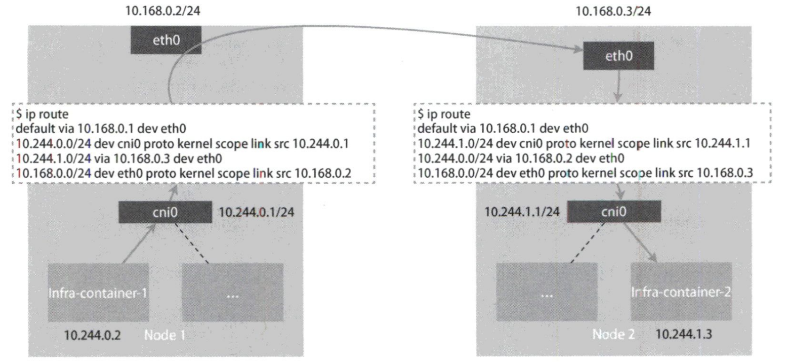


## 6.5 K8s 网络隔离：NwtworkPolicy


## 6.6 Service、DNS 与服务发现

K8s之所以需要 Service，是因为 Pod IP 不是固定的，且一组 Pod 实例之间总会有负载均衡的需求。那么 Service 究竟是如何工作的呢？**实际上，Service 是由 kube-proxy 组件加上 iptables 共同实现的**。一旦它被提交给 K8s，那么 kube-proxy 就可以通过 Service 的 Informer 感知到 Service 对象的添加。而作为该事件的响应，它会在宿主机上创建一条 iptables 规则，如下所示：

```shell
$ iptables-save
-A KUBE-SERVICES -d 10.0.1.175/32 -p tcp -m comment --comment "default/hostnames: cluster IP" -m tcp --dport 80 -j KUBE-SVC-NWV5X2332I40T473
```

这条 iptables 规则的含义是，凡是目的地址是 10.0.1.175、目的端口是 80 的 IP 包，都应该跳转到另外一条名叫 KUBE-SVC-NWV5X2332I40T473 的 iptables 链进行处理。而 10.0.1.175 正是 Service 的 VIP，所以这条规则就为这个 Service 设置了一个固定的入口地址。那么，即将跳转的 KUBE-SVC-NWV5X2332I4OT4T3 规则又有什么作用呢？实际上，它是一组规则的集合，如下所示：

```
-A KUBE-SVC-NWV5X2332I4OT4T3 -m comment --comment "default/hostnames:" -m statistic
--mode random --probability 0.33332999982 -j KUBE-SEP-WNBA2IHDGP2BOBGZ
-A KUBE-SVC-NWV5X2332I4OT4T3 -m comment --comment "default/hostnames:" -m statistic
--mode random --probability 0.50000000000 -j KUBE-SEP-X3P2623AGDH6CDF3
-A KUBE-SVC-NWV5X2332I4OT4T3 -m comment --comment "default/hostnames:" -j
KUBE-SEP-57KPRZ3JQVENLNBR
```

可以看到，这一组规则实际上是一组随机模式（--mode random）的 iptables 链。而随机转发的目的地，分别是 KUBE-SEP-WNBA2IHDGP2BOBGZ、KUBE-SEP-X3P2623AGDH6CDF3 和 KUBE-SEP-57KPRZ3JQVENLNBR。**这 3 条链指向的最终目的地，其实就是 Service 代理的 3 个Pod**。所以，这一组规则就是 Service 实现负载均衡的位置。

注意，**iptables 规则的匹配是从上到下逐条进行的，所以为了保证上述 3 条规则被选中的概率相同，应该将它们的 probability 字段的值分别设置为1/3（0.333..）、1/2 和 1**。通过查看上述 3 条链的明细，Service 进行转发的原理就很容易理解了，如下所示：

```
-A KUBE-SEP-57KPRZ3JQVENLNBR -s 10.244.3.6/32 -m comment --comment
"default/hostnames:" -j MARK --set-xmark 0x00004000/0x00004000
-A KUBE-SEP-57KPRZ3JQVENLNBR -p tcp -m comment --comment "default/hostnames:"
-m tcp -j DNAT --to-destination 10.244.3.6:9376

-A KUBE-SEP-WNBA2IHDGP2BOBGZ -s 10.244.1.7/32 -m comment --comment
"default/hostnames:" -j MARK --set-xmark 0x00004000/0x00004000
-A KUBE-SEP-WNBA2IHDGP2BOBGZ -p tcp -m comment --comment "default/hostnames:"
-m tcp -j DNAT --to-destination 10.244.1.7:9376

-A KUBE-SEP-X3P2623AGDH6CDF3 -s 10.244.2.3/32 -m comment --comment
"default/hostnames:" -j MARK --set-xmark 0x00004000/0x00004000
-A KUBE-SEP-X3P2623AGDH6CDF3 -p tcp -m comment --comment "default/hostnames:"
-m tcp -j DNAT --to-destination 10.244.2.3:9376
```

可以看到，这 3 条链其实是 3 条 DNAT 规则。**DNAT 规则的作用就是在 PREROUTING 检查点之前，也就是在路由之前，将流人 IP 包的目的地址和端口改成 --to-destination 指定的新目的地址和端口**。这个目的地址和端口正是被代理 Pod 的 IP 地址和端口。这样，访问 Service VIP 的 IP 包经过上述 iptables 处理后，就变成了访问某一个具体后端 Pod 的 IP 包。不难理解，这些 Endpoints 对应的 iptables 规则正是 kube-proxy 通过监听 Pod 的变化事件，在宿主机上生成并维护的。以上就是 Service 最基本的工作原理。

---

此外，K8s 的 kube-proxy 还支持一种叫作 IPVS 的模式，这又是怎么一回事儿呢？可以看到，**kube-proxy 通过 iptables 处理 Service 的过程，其实需要在宿主机上设置相当多的 iptables 规则，且 kube-proxy 需要在控制循环里不断刷新这些规则来确保它们始终是正确的**。显然，当宿主机上有大量 Pod 时，成百上千条 iptables 规则不断被刷新，会大量占用宿主机的 CPU 资源，甚至让宿主机卡在此过程中。所以一直以来，基于 iptables 的 Service 实现都是制约 K8s 承载更多量级的 Pod 的主要障碍。

IPVS 模式的 Service 就是用来解决这个问题的，它的工作原理其实跟 iptables 模式类似。当我们创建了 Service 后，kube-proxy 首先会在宿主机上创建一个虚拟网卡（叫作 kube-ipvs0），并为它分配 Service VIP 作为 IP 地址，如下所示。可以看到，这 3 台 IPVS 虚拟主机的 IP 地址和端口对应的正是 3 个被代理的 Pod。此时任何发往 10.102.128.4:80 的请求，都会被 IPVS 模块转发到某一个后端 Pod 上。

```shell
# ipvsadm -ln
IP Virtual Server version 1.2.1 (size=4096)
Prot LocalAddress:Port Scheduler Flags
	-> RemoteAddress:Port	Forward Weight ActiveConn InActConn TCP 10.102.128.4:80 rr
	-> 10.244.3.6:9376		Masq		1		0		0
	-> 10.244.1.7:9376		Masq		1		0		0
	-> 10.244.2.3:9376		Masq		1		0		0
```

相比于 iptables，IPVS 在内核中的实现其实也基于 Netfilter 的 NAT 模式，所以在转发这一层上，理论上 IPVS 并没有显著的性能提升。**但是，IPVS 并不需要在宿主机上为每个 Pod 设置 iptables 规则，而是把对这些规则的处理放到了内核态，从而极大地减少了维护代价，这也印证了“将重要操作放人内核态”是提高性能的重要手段**。

注意，IPVS 模块只负责上述的负载均衡和代理功能，而一个完整的 Service 流程正常工作所需要的包过滤、SNAT 等操作，还是要靠 iptables 来实现。只不过这些辅助性的 iptables 规则数量有限，也不会随着 Pod 数量增加而增加。所以，**在大规模集群里，建议为 kube-proxy 设置 --proxy-mode=ipvs 来开启这个功能，它能为 K8s 集群规模带来巨大提升**。

此外，前面也介绍过 Service 与 DNS 的关系。在 K8s 中，Service 和 Pod 都会被分配对应的 DNS A 记录（从域名解析 IP 的记录）。

* 对于 ClusterIP 模式的 Service 来说，它的 A 记录格式是 \<my-svc>.\<my-namespace>.svc.cluster.local。 当访问这条 A 记录时，它解析到的就是该 Service 的 VIP 地址。
* 对于指定了 clusterIP=None 的 Headless Service 来说，它的 A 记录格式也是 \<my-svc>.\<my-namespace>.svc.cluster.local。但是，当访问这条 A 记录时，它返回的是所有被代理的 Pod 的 IP 地址的集合。当然，如果客户端无法解析这个集合，它可能只会拿到第一个  Pod 的 IP 地址。
* 对于 ClusterIP 模式的 Service 来说，它代理的 Pod 被自动分配的 A 记录格式是 \<pod-ip>.\<my-namespace>.pod.cluster.local，这条记录指向 Pod 的 IP 地址。
* 对于 Headless Service 来说，它代理的 Pod 被自动分配的 A 记录格式是 \<my-pod-name>.\<my-service-name>.\<my-namespace>.svc.cluster.local，这条记录也指向 Pod 的 IP 地址。
* 但如果为 Pod 指定了 Headless Service，且 Pod 本身声明了 hostname 和 subdomain 字段，此时 Pod 的 A记录就会变成 <pod 的 hostname>.\<subdomain>.\<my-namespace>.svc.cluster.local。注意，在 K8s 中，文件 /etc/hosts 是单独挂载的，这也是为什么 kubelet 能够对 hostname 进行修改且 Pod 重建后依然有效，这跟 Docker 的 Init 层原理相同。


## 6.7 从外界连通 Service 与 Service 调试三板斧

Service 的访问信息在 K8s 集群外是无效的，因为 Service 的访问入口，其实就是每台宿主机上由 kube-proxy 生成的 iptables 规则，以及由 kube-dns 生成的 DNS 记录，一旦离开了这个集群，这些信息对用户来说也就没作用了。那么如何从外部（K8s 集群之外）访问 K8s 里创建的 Service 呢？

**最常用的一种方式是 NodePort**，示例如下。声明 Service 的类型是 type=NodePort，并在 ports 字段里声明了 Service 的 8080 端口代理 Pod 的 80 端口，Service 的 443 端口代理 Pod 的 443 端口。当然，**如果不显式声明 nodePort 字段，K8s 就会分配随机的可用端口来设置代理，这个端口的范围默认是 30000~32767，可以通过 kube-apiserver 的 --service-node-port-range 参数修改**。此时要访问这个 Service，只需要访问 <K8s 集群中任何一台宿主机的 IP 地址>:8080，就可以访问到某一个被代理 Pod 的 80 端口。

```yaml
apiVersion: vl
kind: Service
metadata:
  name: my-nginx
  labels:
    run: my-nginx
spec :
  type: NodePort
  ports:
  - nodePort: 8080
    port: 30080
    target Port: 80
    protocol: TCP
    name: http
  - nodePort: 443
    port: 30443
    protocol: TCP
    name: https
  selector:
    run: my-nginx
```

在理解了 Service 工作原理后，NodePort 模式就非常容易理解了。**kube-proxy 要做的就是在每台宿主机上生成一条 iptables 规则**，如下所示。KUBE-SVC-67RL4FN6JRUPOJYM 其实就是一组随机模式的 iptables 规则。所以，接下来的流程就跟 ClusterIP 模式完全一样了。

```
-A KUBE-NODEFORTS -p tcp -m comment --comment "default/my-nginx: nodePort" -m tcp
--dport 8080 -j KUBE-SVC-67RL4FN6JRUPOJYM
```

注意，**在 NodePort 方式下，K8s 会在 IP 包离开宿主机发往目的 Pod 时，对该 IP 包进行一次 SNAT 操作**，如下所示。这条规则设置在 POSTROUTING 检查点，它对即将离开这台主机的 IP 包进行了一次 SNAT 操作，将这个 IP 包的源地址替换成了这台宿主机上的 CNI 网桥地址，或宿主机本身的 IP 地址（若 CNI 网桥不存在）。当然，这个 SNAT 操作只需要对 Service 转发出来的 IP 包进行，否则普通的 IP 包会受影响。而 iptables 做这个判断的依据就是查看该 IP 包是否有 0x4000 标志，这个标志正是在 IP 包被执行 DNAT 操作之前加上去的。

```
-A KUBE-POSTROUTING -m comment --comment "kubernetes service traffic requiring SNAT" -m mark --mark 0x4000/0x4000 -j MASQUERADE
```

为何一定要对流出的包进行 SNAT 操作呢？原理其实很简单，如下所示。当一个外部的 client 通过 node2 访问一个 Service 时，node2 上的负载均衡规则就可能把这个 IP 包转发给 node1 上的一个 Pod。当 node1 上的这个 Pod 处理完请求之后，它就会按照这个 IP 包的源地址发出回复。如果没有进行 SNAT 操作，此时 IP 包的源地址就是 client 的 IP 地址，所以 Pod 会直接将回复发给 client。**对于 client 来说，它的请求明明发给了 node2，回复却来自 node1，这个 client 很可能会报错**。

```
					client
						| ⌃				
						| |
            ⌄ |
node1 <--- node 2
 | ⌃  SNAT
 | |  --->
 ⌄ |
endpoint
```

所以，当 IP 包离开 node2 后，它的源 IP 地址就会被 SNAT 改成 node2 的 CNI 网桥地址或 node2 自己的地址。这样 Pod 在处理完后，会先回复给 node2，然后由 node2 发送给 client。当然，**这也就意味着 Pod 只知道该 IP 包来自 node2，而不是外部的 client。对于 Pod 需要明确知道所有请求来源的场景来说，这是不行的**。

所以，**此时可以将 Service 的 spec.externalTrafficPolicy 字段设置 local，这样就保证了所有 Pod 通过 Service 收到请求后，一定可以看到真正外部 client 的源地址**。该机制的实现原理是：一台宿主机上的 iptables 规则会设置为只将 IP 包转发给在这台宿主机上运行的 Pod，这样 Pod 就可以直接使用源地址发出回复包，无须事先进行 SNAT 操作，流程如下所示。当然，这就意味着如果一台宿主机上不存在任何被代理的 Pod，比如下面的node2，那么使用 node2 的 IP 地址访问这个 Service 就是无效的，此时请求会直接被 DROP。

```
   client
 | ⌃	   \			
 | |      \
 ⌄ |       X
node1 <--- node 2
 | ⌃  SNAT
 | |  --->
 ⌄ |
endpoint
```


---

**从外部访问 Service 的第二种方式适用于公有云上的 K8s 服务，此时可以指定一个 LoadBalancer 类型的 Service**，如下所示。在公有云提供的 K8s 服务里，都使用了一个叫作 CloudProvider 的转接层来跟公有云本身的API 进行对接。所以，在上述 LoadBalancer 类型的 Service 提交后，K8s 就会调用 CloudProvider 在公有云上创建一个负载均衡服务，并且把被代理的 Pod 的 IP 地址配置给负载均衡服务作为后端。

```yaml
kind: Service
apiVersion: vl
metadata:
  name: example-service
spec:
  ports:
  - port: 8765
    targetPort: 9376
  selector:
    app: example
  type: LoadBalancer
```


---

**第三种方式是 ExternalName**，如下所示，指定了一个 externalName=my.database.example.com 字段，不需要指定 selector。此时，当通过 Service 的 DNS 名字访问它时，比如访问 my-service.default.svc.cluster.local，K8s 返回的就是 my.database.example.com。**所以 ExternalName 类型的 Service 其实是在 kube-dns 里添加了一条 CNAME 记录，这时访问 my-service.default.svc.cluster.local 就和访问 my.database.example.com 这个域名效果相同**。

```yaml
kind: Service
apiVersion: vl
metadata:
  name: my-service
spec:
  type: ExternalName
  externalName: my.database.example.com
```

此外，K8s 还允许为 Service 分配公有 IP 地址，如下所示。这样就可以通过访问 80.11.12.10:80 访问到被代理的 Pod，不过这里 K8s 要求 externalIPs 必须是至少能够路由到一个 K8s 的节点。

```yaml
kind: Service
apiVersion: vl
metadata:
  name: my-service
spec:
  selector:
    app: MyApp
  ports:
  - name: http
    protocol: TCP
    port: 80
    targetPort: 9376
  externalIPs:
  - 80.11.12.10
```


---

**在理解 K8s Service 工作原理后，很多与 Service 相关的问题可以通过分析 Service 在宿主机上对应的 iptables 规则（或者 IPVS 配置）来解决**。

比如，当 Service 无法通过 DNS 访问时，就需要区分到底是 Service 本身的配置问题，还是集群的 DNS 出了问题。一个行之有效的方法是检查 K8s 的 Master 节点的 ServiceDNS 是否正常。如果访问 kubernetes.default 返回的值都有问题，就需要检查 kube-dns 的运行状态和日志，否则应该检查 Service 定义是否有问题。

```shell
# 在一个Pod里执行
$ nslookup kubernetes.default
Server:		 10.0.0.10
Address 1: 10.0.0.10 kube-dns.kube-system.svc.cluster.local

Name:			 kubernetes.default
Address 1: 10.0.0.1 kubernetes.default.svc.cluster.local
```

如果 Service 无法通过 ClusterIP 访问，首先应该检查这个 Service 是否有 Endpoints，如下所示。注意如果 Pod  readniessProbe 没通过，它也不会出现在 Endpoints 列表里。如果 Endpoints 正常，就需要确认 kube-proxy 是否在正确运行。在通过 kubeadm 部署的集群里，应该看到 kube-proxy 输出日志。

```shell
$ kubectl get endpoints hostnames
NAME				ENDPOINTS
hostnames		10.244.0.5:9376,10.244.0.6:9376.10.244.0.7:9376
```

如果 kube-proxy 一切正常，就应该仔细查看宿主机上的 iptables，iptables 模式 Service 对应的所有规则包括：

* KUBE-SERVICES 或 KUBE-NODEPORTS 规则对应的 Service 的入口链，这些规则应该与 VIP 和 Service 端口一一对应；
* KUBE-SEP-(hash) 规则对应的 DNAT 链，这些规则应该与 Endpoints 一一对应；
* KUBE-SVC-(hash) 规则对应的负载均衡链，这些规则的数目应该与 Endpoints 数目一致；
* 如果是 NodePort 模式，还涉及 POSTROUTING 处的 SNAT 链。

通过查看这些链的数量、转发目的地址、端口、过滤条件等信息，很容易发现一些异常的蛛丝马迹。当然，还有一种典型问题：Pod 无法通过 Service 访问自己。这往往是因为 kubelet 的 hairpin-mode 没有被正确设置，只需要确保将 kubelet 的 hairpir-mode 设置为 hairpin-veth 或 promiscuous-bridge 即可。


## 6.8 K8s 中的 Ingress 对象

由于每个 Service 都有一个负载均衡服务，这既浪费资源，成本又高。用户更希望 K8s 内置一个全局的负载均衡器，然后通过访问的 URL 把请求转发给不同的后端 Service。**这种全局的、为了代理不同后端 Service 而设置的负载均衡服务，就是 K8s 中的 Ingress 服务，所谓 Ingress，就是 Service 的 Service**。

例如，假如有一个站点：`https://cafe.example.com`，其中 `https://cafe.example.com/coffee` 对应咖啡点餐系统，而 `https://cafe.example.com/tea` 对应茶水点餐系统。这两个系统分别由名叫 coffee 和 tea的两个 Deployment来提供服务。那么如何使用 Ingress 来创建一个统一的负载均衡器，从而实现当用户访问不同的域名时，能够访问到不同的 Deployment 呢？

```yaml
apiVersion: extensions/vlbetal
kind: Ingress
metadata:
  name: cafe-ingress
spec:
  tls:
  - hosts:
    - cafe.example.com
    secretName: cafe-secret
  rules:
  - host: cafe.example.com
    http:
      paths:
      - path: /tea
        backend:
          serviceName: tea-svc
          servicePort: 80
      - path: /coffee
        backend:
          serviceName: coffee-svc
          servicePort: 80
```

如上所示，有个叫作 IngressRule 的 rules 字段，IngressRule 的 Key 叫作 host，**它必须是标准域名格式的字符串，而不能是 IP 地址，host 字段定义的值就是这个 Ingress 的入口**。当用户访问 cafe.example.com 时，实际访问到的是这个 Ingress 对象，这样 K8s 就能使用 IngressRule 来对请求进行下一步转发了。IngressRule 规则的定义则依赖 path 字段，这里的每一个path 都对应一个后端 Service。

由此可见，**一个 Ingress 对象的主要内容，实际是一个”反向代理“服务（如 Nginx）配置文件的描述，而这个代理服务对应的转发规则，就是 IngressRule**。这就是为什么在每条 IngressRule 里，需要有一个 host 字段作这条 IngressRule 的入口，还需要有一系列 path 字段来声明具体的转发策略。有了 Ingress 这样一个统一的抽象，K8s 用户就无须关心 Ingress 具体细节，只需要从社区选择一个具体的 Ingress Controller，把它部署到 K8s 集群即可，然后这个 Ingress Controller 会根据定义的 Ingress 对象提供对应的代理能力。

---

目前，业界常用的各种反向代理项目，如 Nginx、HAProxy、Envoy、Traefik 等，都已经为 K8s 专门维护了对应的 Ingress Controller。接下来以最常用的 [Nginx Ingress Controller](https://kubernetes.github.io/ingress-nginx/deploy/) 为例，实践 Ingress 机制的用法。部署 Nginx Ingress Controller 的方法非常简单，如下所示：

```shell
$ kubectl apply -f https://raw.githubusercontent.com/kubernetes/ingress-nginx/controller-v1.13.2/deploy/static/provider/cloud/deploy.yaml
```

在上述 YAML 中，**定义了一个使用 nginx-ingress/controller 镜像的 Pod，这个 Pod 就是一个监听 Ingress 对象及其代理的后端 Service 变化的控制器**。当用户创建一个新的 Ingress 对象，nginx-ingress/controller 就会根据 Ingress 对象里定义的内容，生成一份对应的 Nginx 配置文件 /etc/nginx/nginx.conf，并使用该配置文件启动一个 Nginx 服务。一旦 Ingress 对象更新，nginx-ingress/controller 也会更新这个配置文件。注意，如果只是被代理的 Service 对象更新，nginx-ingress/controller 所管理的 Nginx 服务无须重新加载，因为它通过 Nginx Lua 方案实现了 Nginx Upstream 的动态配置。

由此可见，**一个 Nginx Ingress Controller 提供的服务，其实是一个可以根据 Ingress 对象和被代理后端 Service 的变化，来自动进行更新的 Nginx 负载均衡器**。当然，为了让用户能够用到这个 Nginx，就需要创建一个 Service 对外暴露 Nginx Ingress Controller 管理的 Nginx 服务，如下所示：

```shell
kubectl apply -f https://raw.githubusercontent.com/kubernetes/ingress-nginx/controller-v1.13.2/deploy/static/provider/baremetal/deploy.yaml
```

由于使用的是 Bare-metal 环境，因此在上述 YAML 中，定义了一个 NodePort 类型的 Service，这个 Service 将所有携带 ingress-nginx 标签 Pod 的 80 端口和 443 端口对外暴露。**注意，如果是在公有云环境中，就需要创建 LoadBalancer 类型的 Service**。上述操作完成后，一定要记录这个 Service 的访问入口，即任意一台宿主机的地址和 NodePort 的端口 31453，如下所示：

```shell
$ kubectl get svc -n ingress-nginx
NAME         		TYPE    	CLUSTER-IP    EXTERNAL-IP		PORT(S)                     	AGE
ingress-nginx  	NodePort  10.105.72.96  <none>    		80:30044/TCP,443:31453/TCP  	3h
```

然后依次创建应用 Pod 及其对应的 Service，和本节开头定义的 Ingress 对象。就可以通过访问这个 Ingress 的地址和端口访问到前面部署的应用了，比如当访问 `https://cafe.example.com:443/coffee` 时，应该是 coffee 这个 Deployment 负责响应请求；当访问 `https:/cafe.example.com:433/tea` 时，则应该是 tea 这个 Deployment 负责响应请求。

```shell
$ kubectl get ingress
NAME					HOSTS							ADDRESS		PORTS		AGE
cafe-ingress	cafe.example.com						80,443	2h

$ kubectl describe ingress cafe-ingress
```


# 7. K8s 调度与资源管理

## 7.1 K8s 资源模型与资源管理

在 K8s 中，**像 CPU 这样的资源被称作可压缩资源（compressible resources），可压缩资源的典型特点是，当它不足时，Pod 只会饥饿，不会退出。像内存这样的资源则被称作不可压缩资源（incompressible resources），当不可压缩资源不足时，Pod 就会因力 OOM （out of memory）被内核结束**。由于 Pod 由多个 Container 组成，因此 CPU 和内存资源的限额是要配置在每个 Container 的定义上的。这样，Pod 整体的资源配置就由这些 Container 的配置值累加得到。

其中，CPU 设置的单位是“CPU的个数”。比如，cpu=1 指这个 Pod 的 CPU 限额是 1 个 CPU。当然，具体“1个 CPU”在宿主机上如何解释，是 1 个 CPU 核心，还是 1 个 VCPU，还是 1 个 CPU 超线程（hyperthread），完全取决宿主机的 CPU 实现方式。K8s 只负责保证 Pod 能够使用“1个 CPU”的计算能力。此外，K8s 允许将 CPU 限额设置为分数，比如 CPU limits=500m，即 500 millicpu（0.5 个 CPU）。这样 Pod 就会被分配 1 个 CPU 一半的计算能力。当然，也可以写成 cpu=0.5。但实际使用时，还是推荐 500m 的写法，毕竟这才是 K8s 内部通用的 CPU 表示方式。

对于内存资源来说，它的单位是 byte。K8s 支持使用 Ei、Pi、Ti、Gi、Mi、Ki（或者 E、P、T、G、M、K）来作 byte 的值，这里要注意区分 MiB （mebibyte） 和 MIB （megabyte）：1Mi = 1024×1024，1M = 1000×1000。

此外，K8s Pod 的 CPU 和内存资源，实际上还要分为 limits 和 requests 两种情况。**在调度时，kube-scheduler 只会按照 requests 的值进行计算；而在真正设置 Cgroups 限制时，kubelet 会按照 limits 的值来进行设置**。

确切来说，当指定 requests.cpu=250m 后，相当于将 Cgroups 的 cpu.shares 的值设置力（250/1000）×1024。当没有设置 requests.cpu 时，cpu.shares 默认是 1024。这样 K8s 就通过 cpu.shares 完成了对 CPU 时间的按比例分配。如果指定了 limits.cpu=500m，则相当于将 Cgroups 的 cpu.cfs_quota_us 的值设置为（500/1000）×100ms，而 cpu.cfs_period_us 的值始终是 100ms，这样 K8s 就设置了这个容器只能用到 CPU 的 50%。

对于内存来说，当指定了 limits.memory=128Mi 之后，相当于将 Cgroups 的 memory.limit_in_bytes 设置 128x1024×1024。注意在调度时，调度器只会使用 requests.memorv=64Mi 来进行判断。

K8s 这种对 CPU 和内存资源限额的设计，参考了 Borg 论文中对“动态资源边界”的定义，**调度系统不是必须严格遵循容器化作业在提交时设置的资源边界，这是因为在实际场景中，大多数作业用到的资源其实远少于它所请求的资源限额**。基于这种假设，Borg 在作业提交后，会主动减少它的资源限额配置，以便容纳更多作业、提升资源利用率。而当作业资源使用量增加到一定阈值时，Borg 会通过“快速恢复”过程还原作业原始的资源限额，防止出现异常。K8s 的 requests+limits 做法，就是上述思路的简化版：用户在提交 Pod 时，可以声明一个相对较小的 requests 值供调度器使用，而真正给容器 Cgroups 设置的 limits 值相对较大，这跟 Borg 思路是相通的。

---

在 K8s 中，不同 requests 和 limits 的设置方式会将这个 Pod 划分到不同的 QoS 级别。**当 Pod 里的每一个Container 都同时设置了 requests 和 limits，且 requests 和 limits 值相等时，这个 Pod 就属于 Guaranteed 类别**。当这个 Pod 创建后，它的 qosClass 字段就会被自动设置为 Guaranteed。注意，当 Pod 仅设置了 limits，没有设置 requests 时，K8s 会自动为它设置与 limits 相同的 requests 值，所以这也属于 Guaranteed 情况。**当 Pod 不满足 Guaranteed 条件，但至少有一个 Container 设置了 requests，这个 Pod 就会被划分到 Burstable 类别；如果一个 Pod 既没有设置 requests，也没有设置 limits，它的 QoS 类别就是 BestEffort**。

**QoS 的主要应用场景，是当宿主机资源紧张时，kubelet 对 Pod 进行 Eviction（资源回收）时需要用到**。当 K8s 所管理的宿主机上不可压缩资源短缺时，就可能触发 Eviction。如，可用内存（memory.available），可用宿主机磁盘空间（nodefs.available），以及容器运行时镜像存储空间（imagefs.available） 等。上述各个触发条件在 kubelet 里都可配置，示例如下：

```shell
kubelet
--eviction-hard=imagefs.available<10%,memory.available<500Mi,nodefs.available<5%,nodefs.inodesFree<5%
--eviction-soft=imagefs.available<30%,nodefs.available<10%
--eviction-soft-grace-period=imagefs.available=2m,nodefs.available=2m
--eviction-max-pod-grace-period=600
```

可以看到 Eviction 分为 Soft 和 Hard 两种模式。Soft Eviction 允许为 Eviction 过程设置一段优雅时间，比如上面例子中的 imagefs.available=2m，表示当达到 imagefs 不足的阈值超过 2 分钟，kubelet 才会开始 Eviction 的过程；而在 Hard Eviction 模式下，Eviction 过程会在达到阈值之后立刻开始。

K8s 计算 Eviction 阈值的数据来源，主要依赖从 Cgroups 读取的值以及使用 cAdvisor 监控到的数据。当宿主机的 Eviction 阈值达到后，就会进入 MemoryPressure 或者 DiskPressure 状态，从而避免新 Pod 被调度到这台宿主机上。**当 Eviction 发生时，kubelet 具体会挑选哪些 Pod 进行删除，就需要参考这些 Pod 的 QoS 类别了**。

* 首先，是 BestEffort 类别的 Pod。
* 其次，是 Burstable 类别，并且发生“饥饿”的资源使用量已经超出 requests 的 Pod。
* 最后，是 Guaranteed 类别。并且 K8s 会保证只有当 Guaranteed 类别的 Pod 的资源使用量超过其 limits 的限制，或者宿主机本身正处于 Memory Pressure 状态时，Guaranteed 类别的 Pod 才可能被选中进行 Eviction 操作。

当然，对于同 QoS 类别的 Pod 来说，K8s 还会根据 **Pod 的优先级来进一步地排序和选择。建议将 DaemonSet 的 Pod 都设置 Guaranteed QoS 类型**。否则，一旦 DaemonSet 的 Pod 被回收，它会立即在原宿主机上被重建出来，那么前面资源回收的动作就完全没有意义了。

理解了 QoS 类别设计后，下面讲解 K8s 里一个非常有用的特性：cpuset 的设置。**在使用容器时，可以通过设置 cpuset 把容器绑定到某个 CPU 的核上，而不是像 cpushare 那样共享 CPU 的计算能力。在这种情况下，由于操作系统在 CPU 之间进行上下文切换的次数大大减少，因此容器里应用的性能会大幅提升**。事实上，cpuset 是生产环境中部署在线应用类型 Pod 的一种常用方式，具体实现为：

* 首先，Pod 必须是 Guaranteed 的 QoS类型；
* 然后，只需要将 Pod CPU 资源的 requests 和 limits 设置相等的整数值即可。

这样，该 Pod 就会被绑定到两个独占的 CPU 核上。当然，具体是哪两个 CPU 核，是由 kubelet 分配的。


## 7.2 K8s 默认调度器

前面介绍过，调度器对一个 Pod 调度成功，实际上就是将它的 spec.nodeName 字段填上调度结果的节点名字。**K8s 默认调度器的主要职责就是为新创建出来的 Pod 寻找一个最合适的节点，这里“最合适”的含义包括两层**：

* **从集群所有的节点中，根据调度算法选出所有可以运行该 Pod 的节点；**
* **从第一步的结果中，再根据调度算法挑选一个最符合条件的节点作为最终结果**。

**所以默认调度器会首先调用一组叫作 Predicate 的调度算法来检查每节点，然后再调用一组叫作 Priority 的调度算法，来给上一步得到的结果里的每个节点打分，得分最高的那个节点就是最终的调度结果**。上述调度机制的工作原理图如下：

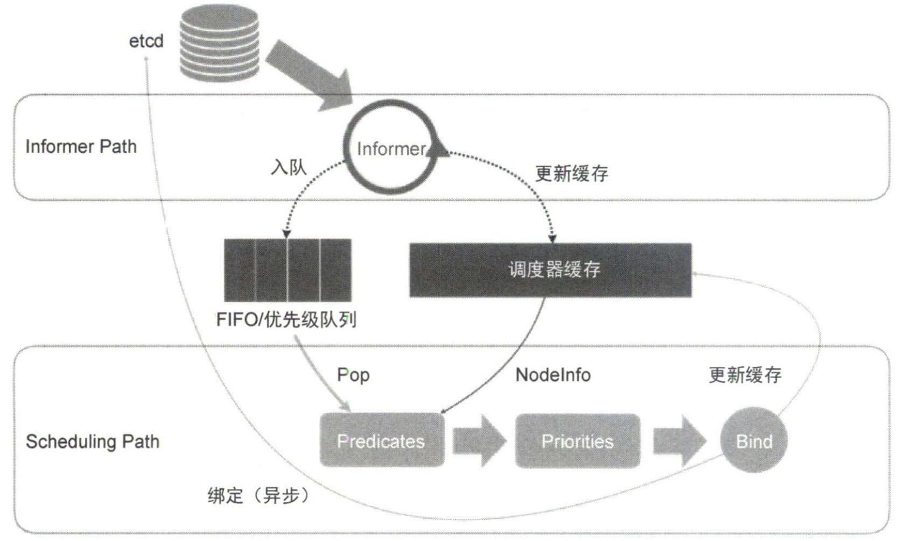

可以看到，K8s 调度器的核心，实际上就是两个相互独立的控制循环。其中，**可以把第一个控制循环称 Informer Path，它的主要目的是启动一系列 Informer，用于监听 etcd 中 Pod、Node、Service 等与调度相关的 API 对象的变化**。比如，当一个待调度 Pod（nodeName 字段空）被创建出来之后，调度器就会通过 Pod Informer 的 Handler 将这个待调度 Pod 添加到调度队列。

调度队列默认是一个 PriorityQueue（优先级队列），并且当集群的某些信息发生变化时，调度器还会对调度队列里的内容进行一些特殊操作。这里的设计主要是出于调度优先级和抢占的考虑（后面详细）。此外，默认调度器还要负责更新调度器缓存（scheduler cache ）。事实上，K8s 调度部分优化性能的一个根本原则，就是尽可能地将集群信息缓存化，以便从根本上提高 Predicate 和 Priority 调度算法的执行效率。

**第二个控制循环是调度器负责 Pod 调度的主循环，称之为 Scheduling Path（调度路径），它的主要逻辑就是不断地从调度队列里出队一个 Pod，然后调用 Predicates 算法进行过滤**。这一步过滤得到的一组节点，就是所有可以运行这个 Pod 的宿主机列表。当然，Predicates 算法需要的节点信息，都是从 Scheduler Cache 里直接获取的，从而保证算法执行效率。

**接下来，调度器会再调用 Priorities 算法为上述列表里的节点打分，分数从 0 到 10。得分最高的节点就会作这次调度的结果**。调度算法执行完成后，调度器就需要将 Pod 对象的 nodeName 字段的值修改为上述节点的名字，这个步骤被称作 Bind。

**为了不在关键调度路径中远程访问 API Server，默认调度器在 Bind 阶段只会更新 Scheduler Cache 里的 Pod 和 Node 信息。这种基于乐观假设的 API 对象更新方式，被称作 Assume**。Assume 完成后，调度器才会创建一个 Goroutine 来异步地向 API Server 发起更新 Pod 的请求，来真正完成 Bind 操作。如果这次异步的 Bind 过程失败了，也没有太大关系，等 Scheduler Cache 同步之后一切都会恢复正常。

正是由于调度器乐观绑定的设计，当一个新 Pod 完成调度需要在某个节点上运行起来之前，该节点上的 kubelet 还会通过一个叫作 Admit 的操作，来再次验证该 Pod 能否在该节点上运行。这一步 Admit 操作，实际就是把一组叫作 GeneralPredicates 的、最基本的调度算法，比如资源是否可用、端口是否冲突等再执行一遍，作为 kubelet 端的二次确认。

**除了“缓存化”和“乐观绑定”，默认调度器还有一个重要的设计：无锁化**。在 Scheduling Path上，调度器会启动多个 Goroutine 以节点粒度并发执行 Predicates 算法，从而提高该阶段的执行效率。类似地，Priorities 算法也会以 MapReduce 的方式并行计算然后汇总。而在所有需要并发的路径上，调度器会避免设置任何全局的竞争资源，免除使用锁进行同步产生的性能损耗。所以，调度器只有对调度队列和 Scheduler Cache 进行操作时，才需要加锁，而这两部分操作都不在 Scheduling Path 的算法执行路径上。

---

K8s 默认调度器的可扩展性设计如图所示，**这个可扩展机制叫作 Scheduler Framework，主要目的就是在调度器生命周期的各个关键点上，向用户暴露可以进行扩展和实现的接口，从而赋予用户自定义调度器的能力**。

图中每个宽箭头都是一个可以插入自定义逻辑的接口。比如，队列部分可以在这里提供一个自己的调度队列实现，从而控制每个 Pod 开始被调度（出队）的时机；预选（Predicates）部分可以提供自己的过滤算法实现，根据自己的需求选择机器。注意，上述这些可插拔式逻辑都是标准的 Go 语言插件机制，需要在编译时选择把哪些插件编译进去。

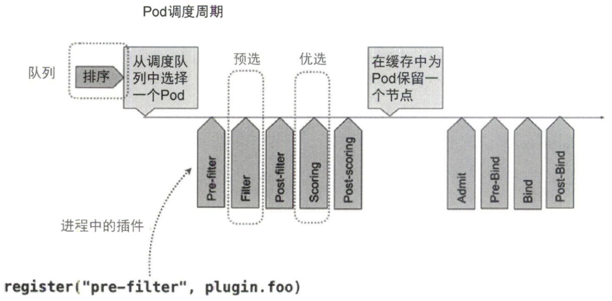


## 7.3 调度策略解析

**预选可以理解为 Filter，即它按照调度策略从当前集群的所有节点中“过滤”出一系列符合条件的节点，这些节点都是可以运行待调度 Pod 的宿主机，默认的预选策略有如下 4 种**。

**第一种叫作 GeneralPredicates，这一组过滤规则负责最基础的调度策略。比如，PodFitsResources 计算的就是宿主机的 CPU 和内存资源等是否够用**。如前所述，PodFitsResources 检查的只是 Pod 的 reguests 字段。注意，调度器并没有为 GPU 等硬件资源定义具体的资源类型，而是统一用一种名叫 Extended Resource、Key-Value 格式的扩展字段来描述。

```yaml
apiVersion: v1
kind: Pod
metadata:
  name: extended-resource-demo
spec:
  containers:
  - name: extended-resource-demo-ctr
    image: nginx resources:
    requests:
      requests.nvidia.com/gpu: 2
    limits:
      requests.nvidia.com/gpu: 2
```

可以看到，Pod 通过 requests.nvidia.com/gpu=2 声明使用了两个 NVIDIA 类型的 GPU。在 PodFitsResources 中，调度器其实并不知道这个字段 Key 的含义是 GPU，而是直接使用后面的 Value 进行计算。当然，在 Node 的 Capacity 字段里也要相应地加上这台宿主机的 GPU 总数，比如 requests.nvidia.com/gpu=4。

PodFitsHost 检查宿主机的名字是否跟 Pod 的 spec.nodeName 一致；PodFitsHostPorts 检查 Pod 申请的宿主机端口（spec.nodePort）是否跟已使用的端口有冲突；PodMatchNodeSelector 检查 Pod 的 nodeselector 或 nodeAffinity 指定的节点是否与待考察节点匹配等等。

可以看到，像上面这样一组 GeneralPredicates，正是 K8s 考察一个 Pod 能否在一个节点上运行最基本的过滤条件。所以 GeneralPredicates 也会被其他组件（如 kubelet）直接调用。上一节提到，kubelet 在启动 Pod 前，会执行 Admit 操作来进行二次确认，二次确认的规则就是执行一遍 GeneralPredicates。

**第二种是与 Volume 相关的过滤规则，负责跟容器 PV 相关的调度策略**。其中，NoDiskConflict 检查多个 Pod 声明挂载的 PV 是否有冲突，比如某些 Volume 不允许被两个 Pod 同时使用；MaxPDVolumeCountPredicate 检查一个节点上某个类型的 PV 是否超过了一定数目；VolumeZonePredicate 检查 PV 的 Zone（高可用域）标签是否与待考察节点的 Zone 标签相匹配；VolumeBindingPredicate 检查该 Pod 对应 PV 的 nodeAffinity 字段是否跟某个节点的标签相匹配。

**第三种是宿主机相关的过滤规则，主要考察待调度 Pod 是否满足节点本身的某些条件**。比如，PodToleratesNodeTaints 负责检查节点的“污点”机制；NodeMemoryPressurePredicate 检查当前节点的内存是否不够，若是，则待调度 Pod 不能被调度到该节点上。

**第四种是 Pod 相关的过滤规则，跟 GeneralPredicates 大多是重合的**。比较特殊的是 PodAffinityPredicate，其作用是检查待调度 Pod 与节点上的已有 Pod 之间的亲密（affinity）和反亲密（anti-affinity）关系。示例如下，podAntiAffinity 规则指定了该 Pod 不希望跟任何携带了 security=S2 标签的 Pod 存在于同一个节点上。注意，PodAffinityPredicate 是有作用域的，字段 topologyKey=kubernetes.io/hostname 含义是：仅对指定标签的节点有效。此外，requiredDuringSchedulingIgnoredDuringExecution 含义是：这条规则必须在 Pod 调度时进行检查（requiredDuringScheduling）；但如果是已经在运行的 Pod 发生变化，比如 Label 被修改，使得该 Pod 不再适合在该节点上运行时，则不会主动修正（IgnoredDuringExecution）。

```yaml
apiVersion: v1
kind: Pod
metadata:
  name: with-pod-antiaffinity
spec:
  affinity: podAntiAffinity:
    requiredDuringSchedulingIgnoredDuringExecution:
    - weight: 100
    	podAffinityTerm:
        labelSelector:
          matchExpressions:
          - key: security
            operator: In
            values:
            - S2
        topologyKey: kubernetes.io/hostname
  containers:
  - name: with-pod-affinity
    image: docker.io/ocpqe/hello-pod
```

上述 4 种预选策略构成了调度器确定一个节点可以运行待调度 Pod 的基本策略。在具体执行时，当开始调度一个 Pod 时，调度器会同时启动 16 个 Goroutine，并发为集群里的所有节点计算预选策略，最后返回可以运行这个 Pod 的宿主机列表。注意，在每个节点执行预选时，调度器会按照固定顺序进行检查，该顺序是按照预选的含义确定的。比如，宿主机相关的预选会优先进行检查，否则在一台资源已经严重不足的宿主机上，一上来就计算 PodAffinityPredicate 是没有实际意义的。

---

**在预选阶段完成了节点的过滤之后，优选阶段的工作就是为这些节点打分，打分的范围是 0~10 分，得分最高的节点就是最后被 Pod 绑定的最佳节点。优选策略里最常使用的打分规则是 LeastRequestedPriority，实际上就是在选择空闲资源（CPU 和内存）最多的宿主机**。与 LeastRequestedPriority 一起发挥作用的还有 BalancedResourceAllocation，它选择的是调度完成后，所有节点里各种资源分配最均衡的那个节点，从而避免一个节点上 CPU 被大量分配，而内存大量剩余的情况。

此外，还有 3 种优选策略：NodeAffinityPriority、TaintTolerationPriority 和 InterPodAffinityPriority，它们与前面 PodMatchNodeSelector、PodToleratesNodeTaints 和 PodAffinityPredicate 这 3 种预选策略的含义和计算方法类似。但是作优选策略，一个节点满足上述规则的字段数目越多，它的得分就会越高。

在默认优选策略里，还有一个叫作 ImageLocalityPriority 的策略（v1.12 版本新开启），如果待调度 Pod 需要使用很大的镜像，并且已经存在于某些节点上，那么这些节点的得分就会比较高。当然，为了避免该算法引发调度堆叠，调度器在计算得分时还会根据镜像的分布进行优化，即如果大镜像分布的节点数目很少，那么这些节点的权重就会被调低，从而对冲引起调度堆叠的风险。

对于比较复杂的调度算法来说，比如 PodAffinityPredicate，它们在计算时不只关注待调度 Pod 和待考察节点，还需要关注整个集群的信息，比如遍历所有节点、读取它们的 Label。此时，调度器在为每个待调度 Pod 执行该调度算法之前，会先将算法需要的集群信息初步计算一遍，然后缓存起来。这样在真正执行该算法时，只需要读取缓存信息进行计算即可，从而避免反复获取和计算整个集群的信息。


## 7.4 优先级和抢占机制

**优先级和抢占机制解决的是 Pod 调度失败时该怎么办的问题**。正常情况下，当一个 Pod 调度失败后，它会被暂时搁置，直到 Pod 被更新或者集群状态发生变化，调度器才会对这个 Pod 进行重新调度。但有时我们希望当一个高优先级的 Pod 调度失败后，该 Pod 不会被搁置，而是挤走某个节点上一些低优先级的 Pod，以此保证这个高优先级 Pod 调度成功。要使用该机制，首先需要提交一个 PriorityClass 的定义，如下所示：

```yaml
apiVersion: scheduling.k8s.io/v1
kind: PriorityClass
metadata:
  name: high-priority
value: 1000000
globalDefault: false
description: "This priority class should be used for high priority service pods only"
```

YAML 文件定义了一个名叫 high-priority 的 PriorityClass，其中 value 1000000（100万）。K8s 规定，优先级是一个 32 bit 的整数，最大值不超过 10 亿，且值越大代表优先级越高。超出 10 亿的值其实是 K8s 留着分配给系统 Pod 使用的，这样做旨在避免系统 Pod 被用户抢占。

一旦上述 YAML 文件里的 globalDefault 被设置为 true，就意味着这个 PriorityClass 的值会成为系统的默认值。而如果是 false，就表示只希望声明使用该 PriorityClass 的 Pod 拥有值 1000000 的优先级；而对于没有声明 PriorityClass 的 Pod 来说，它们的优先级就是 0。

在创建 PriorityClass 对象后，Pod 就可以声明使用它了，如下所示。Pod 通过 priorityClassName 字段声明了要使用名 high-priority 的 PriorityClass。

```yaml
apiVersion: v1
kind: Pod
metadata:
  name: nginx
  labels:
    env: test
spec:
  containers:
  - name: nginx
    image: nginx
    imagePullPolicy: IfNotPresent
    priorityClassName: high-priority
```

前面介绍过，调度器里维护着一个调度队列。所以，**当 Pod 拥有优先级之后，高优先级的 Pod 就可能比低优先级的 Pod 提前出队，从而尽早完成调度过程，此过程就是优先级在 K8s 的主要体现**。

**当一个高优先级的 Pod 调度失败时，调度器的抢占能力就会被触发。此时，调度器会试图从当前集群里寻找一个节点：当该节点上的一个或多个低优先级 Pod 被删除后，待调度的高优先级 Pod 可以被调度到该节点上。此过程就是抢占在 K8s 的主要体现**。

当抢占发生时，抢占者不会立刻被调度到被抢占的节点上，调度器只会将抢占者的 spec.nominatedNodeName 字段设置被抢占的节点的名字。然后，抢占者会重新进入下一个调度周期，在新的调度周期里决定是否要在被抢占的节点上运行。这意味着，即使在下一个调度周期，调度器也不会保证抢占者一定会在被抢占的节点上运行。

这样设计的一个原因是，调度器只会通过标准的 DELETE API 来删除被抢占的 Pod，所以这些 Pod 必然有一定的优雅退出时间（默认 30s）。而在这段时间里，其他节点也可能变成可调度的，或者有新节点被添加到集群中。所以，鉴于优雅退出期间集群的可调度性可能会发生变化，把抢占者交给下一个调度周期处理是合理的选择。

在抢占者等待被调度的过程中，如果有其他优先级更高的 Pod 要抢占同一个节点，调度器就会清空原抢占者的 spec.nominateaNodeName 字段，从而允许优先级更高的抢占者抢占，这使得原抢占者也有机会重新抢占其他节点，这些都是设置 nominatedNodeName 字段的主要目的。

---

**K8s 调度器实现抢占算法的一个最重要设计，就是在调度队列的实现里使用了两个不同的队列**。

* **第一个队列叫作 activeQ，凡是 activeQ 的 Pod，都是下一个调度周期需要调度的对象**。当新建一个 Pod 时，调度器会将该 Pod 入队到 activeQ 中。前面提到调度器不断从队列里出队一个 Pod 进行调度，实际都是从 activeQ 出队的。

* **第二个队列叫作 unschedulableQ，专门用来存放调度失败的Pod**。注意，当一个 unschedulableQ 的 Pod更新后，调度器会自动把这个 Pod 移动到 activeQ 里，从而给这些调度失败的 Pod “重新做人”的机会。

回到抢占者调度失败这个时间点，调度失败之后，抢占者就会被放进 unschedulableQ。然后，这次失败事件就会触发调度器为抢占者寻找牺牲者的流程。

* **第一步，调度器会检查事件的失败原因，以确认抢占能否帮助抢占者找到一个新节点**。因为很多 Predicates 失败是不能通过抢占来解决的，比如 PodFitsHost 算法，除非节点的名字发生变化，否则即使删除再多 Pod，抢占者也不可能调度成功。
* **第二步，如果确定可以抢占，调度器就会把自己缓存的所有节点信息复制一份，然后使用这个副本来模拟抢占过程**。调度器会检查缓存副本的每个节点，然后从一个节点上优先级最低的 Pod 开始，逐一删除这些 Pod，每删除一个低优先级 Pod，调度器都会检查抢占者能否在该节点上运行。如果可以，就记录下该节点的名字和被删除 Pod 的列表，这就是一次抢占过程的结果。当遍历完所有节点后，调度器会选出最佳结果，判断原则是尽量减少抢占对整个系统的影响，比如，需要抢占的 Pod 越少越好，需要抢占的 Pod 优先级越低越好。

在得到最佳抢占结果后，结果里的节点就是即将被抢占的节点，被删除的 Pod 列表就是牺牲者。接下来，调度器就可以真正开始抢占操作了，这个过程可以分为 3 步。

* 第一步，调度器会检查牺牲者列表，清理这些 Pod 所携带的 nominatedNodeName 字段。
* 第二步，调度器会把抢占者的 nominatedNodeName 设置为被抢占的节点的名字。
* 第三步，调度器遍历牺牲者列表，向 API Server 发起请求，逐一删除牺牲者。

第二步对抢占者 Pod 的更新操作就会触发前面提到“重新做人”的流程，从而让抢占者在下一个调度周期重新进入调度流程。这也是为什么前面说调度器并不保证抢占的结果：在这个正常的调度流程里，一切皆有可能。

不过，对于任意一个待调度 Pod 来说，因为有上述抢占者存在，所以它的调度过程其实有一些特殊情况需要处理。具体来说，在对某一 Pod 和节点执行 Predicates 算法时，如果待检查的节点是一个即将被抢占的节点，即调度队列里存在 nominateaNodeName 字段值是该节点名字的 Pod（潜在的抢占者），那么调度器就会对该节点运行两遍同样的预选（Predicates）算法。

* 第一遍，调度器会假设上述“潜在的抢占者”已经在该节点上运行，然后执行预选算法。
* 第二遍，调度器会正常执行预选算法，即不考虑任何“潜在的抢占者”，只有这两遍预选算法都能通过，这个 Pod 和节点才会被视为可以绑定。


## 7.5 GPU 管理与 Device Plugin 机制

对于云用户来说，在 GPU 支持上，他们最基本的诉求非常简单：我只要在 YAML 中声明某容器需要的 GPU 个数，K8s 为我创建的容器里就应该出现对应的 GPU 设备以及驱动目录。以 NVIDIA GPU 设备为例，上述需求就意味着当用户的容器被创建之后，这个容器里必须出现如下设备和目录：

* GPU 设备，比如 /dev/nvidia0；
* GPU 驱动目录，比如 /usr/local/nvidia/*。

其中，GPU 设备路径正是该容器启动时的 Devices 参数，驱动目录则是该容器启动时的 Volume 参数。所以，在 K8s GPU 支持的实现里，kubelet 实际上就是将上述两部分内容设置在了创建该容器的 CRI 参数中。这样等到该容器启动后，对应容器里就会出现 GPU 设备和驱动路径了。

**K8s 在 Pod API 对象里并没有为 GPU 专门设置一个资源类型字段，而是使用一种叫作 Extended Resource 的特殊字段来负责传递 GPU 的信息**，示例如下，表示 Pod 声明要使用一个 NVIDIA 类型的 GPU。

```yaml
apiVersion: v1
kind: Pod metadata:
name: cuda-vector-add
spec:
restartPolicy: OnFailure 
containers:
- name: cuda-vector-ada
image: "k8s.gcr.io/cuda-vector-add:v0.1" resources:
limits：
nvidia.com/gpu: 1
```

在 kube-scheduler 中，它其实并不关心该字段的具体含义，而会在计算时一律将调度器里保存的该类型资源的可用量直接減去 Pod 声明的数值。**所以，Extended Resource 其实是 K8s 为用户设置的一种对自定义资源的支持**。当然，为了能让调度器知道这个自定义类型的资源在每台宿主机上的可用量，宿主机节点必须能够向 API Server 汇报该类型资源的可用数量，对应 Node 对象 status 字段的内容。

```yaml
apiVersion: v1
kind: Node
...
Status:
  Capacity:
    cpu: 2
    memory: 2049008Ki
    nvidia.com/gpu: 1
```

在 K8s GPU 支持方案里，**对所有硬件加速设备进行管理的功能，都由一种叫作 Device Plugin 的插件负责**，其中包括对该硬件的 Extended Resource 进行汇报的逻辑，下图展示了 Kubernetes 的 Device Plugin 机制。

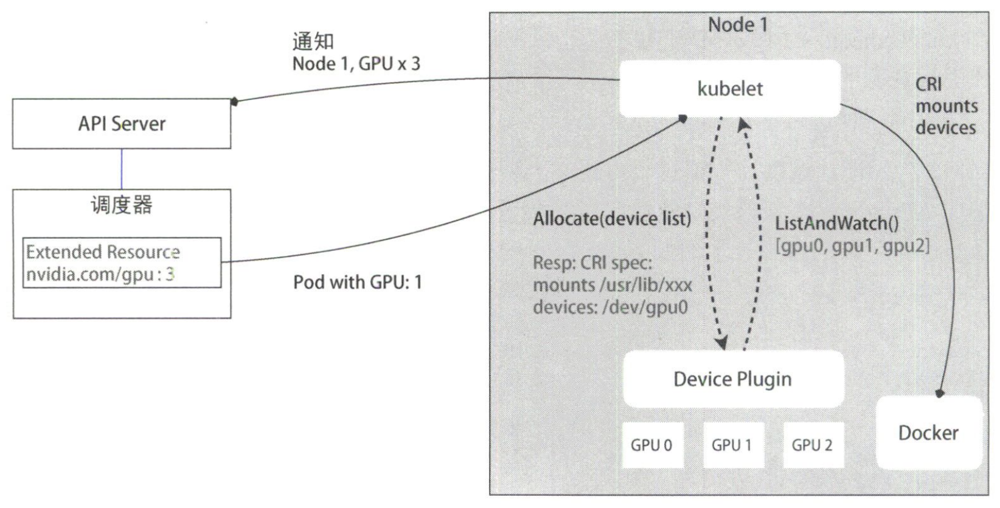

每种硬件设备都需要由它对应的 Device Plugin 进行管理，这些 Device Plugin 都通过 gRPC 同 kubelet 连接起来。比如，NVIDIA GPU 对应的插件叫作 NVIDIA GPU device plugin，它会通过一个叫作 ListAndWatch API 定期向 kubelet 汇报该节点上 GPU 的列表。比如例子中一共有 3 个 GPU （GPU0、GPU1 和GPU2）。这样，kubelet在拿到这个列表之后，就可以直接在它向 API Server 发送的心跳里以 Extended Resource 的方式加上这些 GPU 的数量，比如 nvidia.com/gpu=3。所以，这里用户无须关心 GPU 信息向上的汇报流程。

当一个 Pod 想使用一个 GPU 时，只需要在 limits 字段声明 nvidia.com/gpu: 1。接下来 K8s 调度器就会从它的缓存里寻找 GPU 数量满足条件的节点，然后将缓存里的 GPU 数量减 1，完成 Pod 与节点的绑定。

调度成功后的 Pod 信息会被对应的 kubelet 拿来进行容器操作，当 kubelet 发现这个 Pod 容器请求一个 GPU 时，kubelet 就会从自己持有的 GPU 列表里为该容器分配一个 GPU。此时，kubelet 会向本机的 Device Plugin 发起一个 Allocate 请求，请求携节的参数正是即将分配给该容器的设备 ID 列表。当 Device Plugin 收到 Allocate 请求后，就会根据 kubelet 传递过来的设备 ID 从 DevicePlugin 里找到这些设备对应的设备路径和驱动目录。当然，这些信息正是 Device Plugin 定期从本机查询到的。

被分配 GPU 对应的设备路径和驱动目录信息返回给 kubelet 后，kubelet 就完成了一个容器分配 GPU 的操作。接下来，kubelet 会把这些信息追加到创建该容器所对应的 CRI 请求中。这样，当这个 CRI 请求发给 Docker 后，Docker 创建出来的容器里就会出现这个 GPU 设备，并把它需要的驱动目录挂载进去。

至此，Pod 分配一个 GPU 的流程就完成了。对于其他类型硬件来说，要想在 K8s 所管理的容器里使用这些硬件的话，也需要遵循上述 Device Plugin 的流程，来实现如下所示的 Allocate 和 ListAndWatch API。

```go
service DevicePlugin {
	rpc ListAndWatch (Empty) returns (stream ListAndWatchResponse) {}
  rpc Allocate (AllocateRequest) returns (AllocateResponse) {}
｝
```


# 8. K8s 监控与日志

## 8.1 Prometheus、Metrics Server 与 K8s 监控体系

K8s 监控体系曾经非常繁杂，社区中也有很多方案，但现在已经演变成以 Prometheus 为核心的一套统一的方案。Prometheus 工作的核心是通过 Pull（抓取）的方式搜集被监控对象的 Metrics 数据，然后把它们保存在一个 TSDB（时间序列数据库，比如 OpenTSDB、InfluxDB 等）当中，以便后续可以按照时间进行检索。

有了这套核心监控机制，Prometheus 其余组件就是用来配合这套机制运行的。比如 Pushgateway 可以允许被监控对象以 Push 的方式向 Prometheus 推送 Metrics 数据。Alertmanager 则可以根据 Metrics 信息灵活地设置报警。当然，Prometheus 最受用户欢迎的功能，还是通过 Grafana 对外暴露出的、可以灵活配置的监控数据可视化界面。

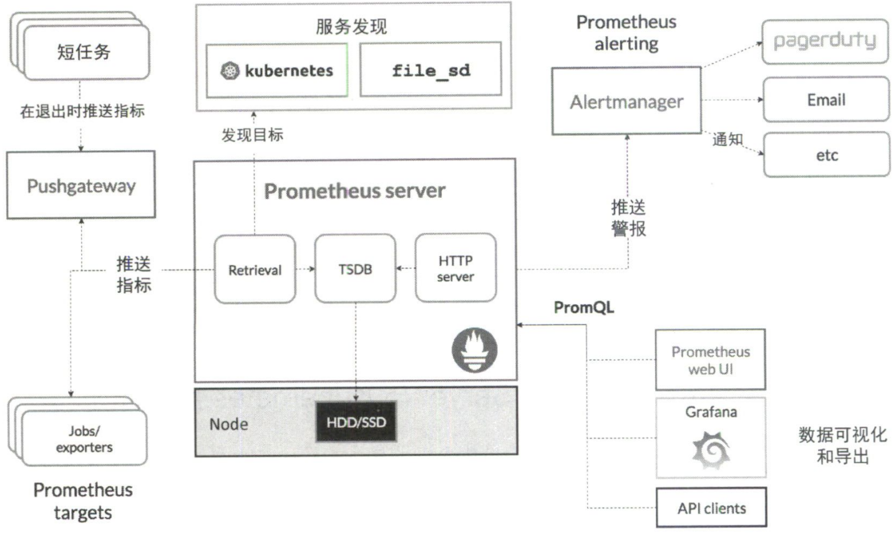

有了 Prometheus 之后，我们就可以按照 Metrics 数据的来源对 K8s 的监控体系进行汇总了。

1. **第一种 Metrics 数据是宿主机的监控数据，这部分数据需要借助一个由 Prometheus 维护的 Node Exporter 工具来提供**。一般说来，Node Exporter 会以 DaemonSet 的方式在宿主机上运行。其实，所谓的 Exporter，就是代替被监控对象来对 Prometheus 暴露可以被“抓取”的 Metrics 信息的一个辅助进程。Node Exporter 可以暴露给 Prometheus 采集的 Metrics 数据，不单单是节点的负载、CPU、内存、磁盘以及网络这样的常规信息，它的 Metrics 可谓包罗万象。
2. **第二种 Metrics 数据来自 K8s 的 API Server、kubelet 等组件的 /metrics API**。除了常规的 CPU、内存的信息，还主要包括了各个组件的核心 Metrics。比如，对于 API Server 来说，它就会在 /metrics API 里暴露各个 Controller 的工作队列的长度、请求的 QPS 和延迟数据等。
3. **第三种 Metrics 数据是 K8s 相关的监控数据，这部分数据一般叫作 K8s 核心监控数据**。这其中包括了 Pod、Node、容器、Service 等 K8s 核心概念的 Metrics 数据。其中容器相关的 Metrics 数据主要来自 kubelet 内置的 cAdvisor 服务。在 kubelet 启动后，cAdvisor 服务也随之启动，而它能够提供的信息可以细化到每一个容器的 CPU、文件系统、内存、网络等资源的使用情况。

需要注意的是，这里提到的 K8s 核心监控数据其实使用的是 K8s 一项非常重要的扩展能力 Metrics Server，它将监控数据通过标准的 K8s API 暴露出来。例如，当用户访问下面这个 URL 时： `http://127.0.0.1:8001/apis/metrics.k8s.io/vlbetal/namespaces/<namespace-name>/pods/<pod-name>`，它将返回一个 Pod 的监控数据，而这些数据其实是从 kubelet 的 Summary API（`<kubelet_ip>:<kubelet_port>/stats/summary`）采集而来的。Summary API 返回的信息既包括了cAdvisor 的监控数据，也包括了 kubelet 汇总的信息。

需要指出的是，Metrics Server 并不是 kube-apiserver 的一部分，而是通过 Aggregator 这种插件机制，在独立部署的情况下同 kube-apiserver 一起统一对外服务的。Aggregator API Server 的工作原理如图所示。

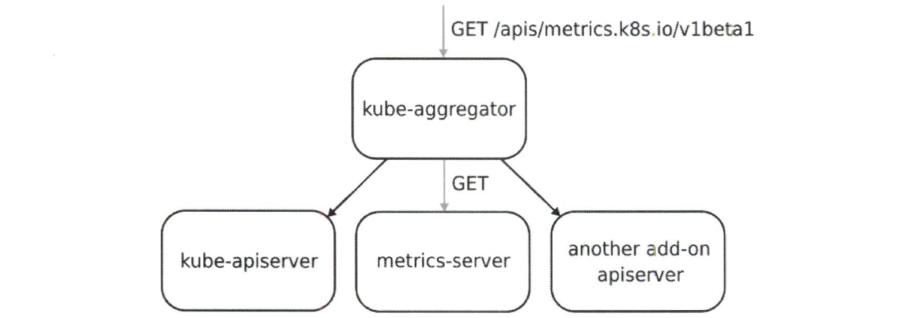

当 K8s 的 API Server 开启 Aggregator 模式之后，你再访问 apis/metrics.k8s.io/v1beta1，实际上访问到的是一个叫作 kube-aggregator 的代理。而 kube-apiserver 正是这个代理的一个后端，Metrics Server 则是另一个后端。而且在该机制下，你还可以给这个 kube-aggregator 添加更多后端。所以 kube-aggregator 其实就是一个根据 URL 选择具体的 API 后端的代理服务器。通过这种方式，我们就可以很方便地扩展 K8s API 了。


## 8.2 容器日志收集与管理

首先需要明确，**K8s 里对容器日志的处理方式都叫作 cluster-level-logging，即这个日志处理系统与容器、Pod以及节点的生命周期都完全无关**。这种设计当然是为了保证无论容器不工作、Pod 被删除，甚至节点宕机依然可以正常获取应用的日志。**对于一个容器来说，当应用把日志输出到 stdout 和 stderr 之后，容器本身默认会把这些日志输出到宿主机上的—个 JSON 文件中，这样通过 kubectl logs 命令就可以看到这些容器日志了**。

上述机制就是本节容器日志收集的基础假设。如果应用把文件输出到别处，比如直接输出到容器里的某个文件里，或者输出到远程存储里，就另当别论了。当然，本节也会介绍这些特殊情况的处理方法。K8s 本身实际上不会为你做容器日志收集工作，所以为了实现上述 cluster-level-logging，需要在部署集群的时候提前规划具体的日志方案，K8s 主要推荐了 3 种日志方案。

1. **在节点上部署 logging agent，将日志文件转发到后端存储里保存起来**，架构如图所示。logging agent 一般会以 DaemonSet 的方式在节点上运行，然后把宿主机上的容器日志目录挂载进去，最后由 logging-agent 把日志转发出去。另外，K8s 的很多部署会自动启用 logrotate，在日志文件大小超过 10MB 时自动对日志文件进行切割（logrotate）操作。

   可以看到，**在节点上部署 logging agent 最大的优点在于一个节点仅需部署一个 agent，并且对应用和 Pod 没有任何侵入性，所以在社区中该方案最常用。但是，这种方案的明显不足之处在于，它要求应用输出的日志都必须直接输出到容器的 stdout 和 stderr 里**。

   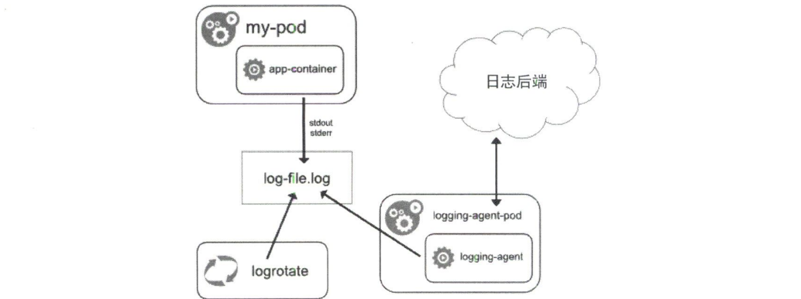

2. 第二种 K8s 容器日志方案处理的就是这种特殊情况：**当容器的日志只能输出到某些文件时，我们可以通过一个 sidecar 容器把这些日志文件重新输出到 sidecar 的 stdout 和 stderr 上，这样就能够继续使用第一种方案了**，架构如图所示。由于 sidecar 跟主容器之间共享 Volume，因此这里的 sidecar 方案的额外性能损耗并不大，也就是多占用一点儿 CPU 和内存罢了。

   需要注意的是，此时宿主机上实际上会存在两份相同的日志文件：一份是应用自己写人的，另一份则是 sidecar 的 stdout 和 stderr 对应的 JSON 文件，**这对磁盘是很大的浪费**。所以，除非万不得已或者应用容器完全不可能被修改，否则还是建议直接使用第一种方案，或者直接使用第三种方案。

   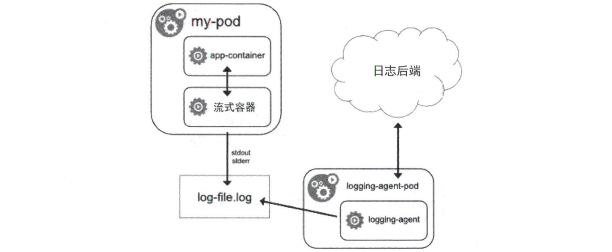

3. **通过一个 sidecar 容器直接把应用的日志文件发送到远程存储中去，这就相当于把第一种方案中的 logging agent 放在了应用 Pod 里**，架构如图所示。在这种方案下，应用可以直接把日志输出到固定的文件里，而不是 stdout。这种方案虽然部署简单，并且对宿主机非常友好，但是这个 sidecar 容器很可能会消耗较多资源，甚至拖垮应用容器。并且由于日志还是没有输出到 stdout 上，因此通过 kubectl logs 看不到任何日志输出。

   

最后，**无论采用哪种方案，都必须配置好宿主机上的日志文件切割和清理工作**，或者给日志目录专门挂载—些容量巨大的远程盘。否则，一旦主磁盘分区占满，整个系统就可能陷入崩溃状态。


# 参考

1. 《深入剖析 kubernetes》
2. [K8s 中文官网](https://kubernetes.io/zh-cn/)
3. [K8s 训练营](https://www.qikqiak.com/k8strain/)