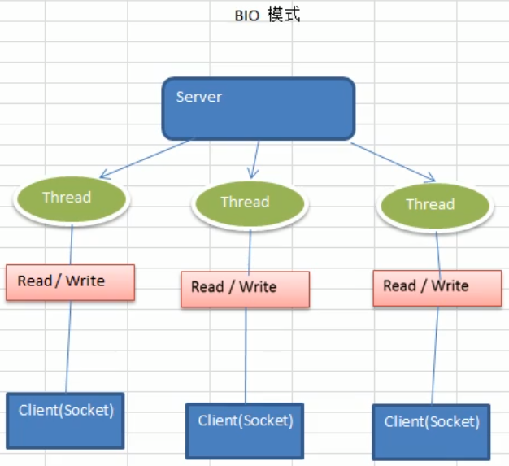
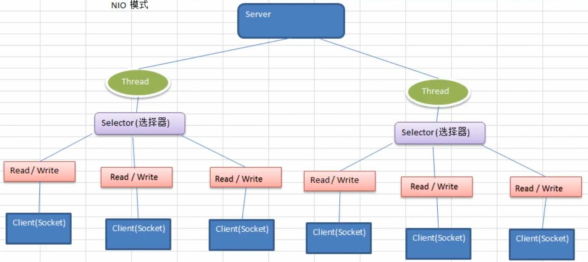

## 1. Java IO 概述

### 1.1 Netty 介绍和应用场景

#### 1.1.1 Netty 介绍

1. `Netty` 是由 `JBOSS` 提供的一个 `Java` 开源框架，现为 `Github` 上的独立项目
2. `Netty `是一个**异步的、基于事件驱动的**网络应用框架，用以快速开发高性能、高可靠性的网络 `IO` 程序
3. `Netty` 主要针对在 `TCP` 协议下，面向 `Clients` 端的高并发应用，或者 `Peer-to-Peer` 场景下的大量数据持续传输的应用
4. `Netty` 本质是一个 `NIO` 框架，适用于服务器通讯相关的多种应用场景
5. 要透彻理解 `Netty` ， 需要先学习 `NIO` ， 这样我们才能阅读 `Netty` 的源码

#### 1.1.2 Netty 应用场景

1. 互联网行业
   - 分布式系统中，各个节点之间需要远程服务调用，高性能的`RPC`框架必不可少，`Netty`作为异步高性能的通信框架，往往作为基础通信组件被这些`RPC`框架使用
   - 典型的应用有：阿里分布式服务框架`Dubbo`的`RPC`框架使用`Dubbo`协议进行节点间通信，`Dubbo`协议进行节点间通信，`Dubbo`协议默认使用`Netty`作为基础通信组件，用于实现各进程节点之间的内部通信
2. 游戏行业
   - 无论是手游服务端还是大型的网络游戏，`Java` 语言得到了越来越广泛的应用
   - `Netty` 作为高性能的基础通信组件，提供了 `TCP/UDP` 和 `HTTP` 协议栈，方便定制和开发私有协议栈，账号登录服务器
   - 地图服务器之间可以方便的通过 `Netty` 进行高性能的通信
3. 大数据领域
   - 经典的 `Hadoop`的高性能通信和序列化组件`Avro` 的 `RPC` 框架，默认采用 `Netty` 进行跨界点通信
   - 它的 `Netty Service` 基于 `Netty` 框架二次封装实现。


### 1.2 Java IO 模型介绍

#### 1.2.1 I/O 模型基本说明

- `I/O` 模型简单的理解：就是用什么样的通道进行数据的发送和接收，很大程度上决定了程序通信的性能

- `Java` 共支持 3 种网络编程模型 IO 模式：`BIO、NIO、AIO`

- `Java BIO` ： **同步并阻塞（传统阻塞型）**，服务器实现模式为一个连接一个线程，即客户端有连接请求时服务器端就需要启动一个线程进行处理，如果这个连接不做任何事情会造成不必要的线程开销

  

- `Java NIO` ： **同步非阻塞**，服务器实现模式为一个线程处理多个请求（连接），即客户端发送的连接请求都会注册到多路复用器上，多路复用器轮询到连接有`I/O`请求就进行处理

  

- `Java AIO（NIO 2）` ： **异步非阻塞**，`AIO` 引入异步通道的概念，采用了 `Proactor` 模式，简化了程序编写，有效的请求才启动线程，它的特点是先由操作系统完成后才通知服务端程序启动线程去处理，一般适用于连接数较多且连接时间较长的应用

#### 2.2.2 I/O 模型使用场景分析

- `BIO`方式适用于**连接数目比较小且固定**的架构，这种方式对服务器资源要求比较高，并发局限于应用中，`JDK 1.4`以前的唯一选择，但程序简单易理解。
- `NIO`方式适用于**连接数目多且连接比较短**（轻操作）的架构，比如聊天服务器，弹幕系统，服务器间通讯等。编程比较复杂，`JDK 1.4`开始支持。
- `AIO`方式使用于**连接数目多且连接比较长**（重操作）的架构，比如相册服务器，充分调用OS参与并发操作，编程比较复杂，`JDK 7`开始支持。


### 1.3 BIO 工作机制

#### 1.3.1 BIO 简单流程

- 服务器端启动一个`ServerSocket`
- 客户端启动`Socket`对服务器进行通信，默认情况下服务器端需要对每个客户 建立一个线程与之通讯
- 客户端发出请求后, 先咨询服务器是否有线程响应，如果没有则会等待，或者被拒绝
- 如果有响应，客户端线程会等待请求结束后，在继续执行

#### 1.3.2 BIO 应用实例

- 使用`BIO`模型编写一个服务器端，监听`6666`端口，当有客户端连接时，就启动一个线程与之通讯
- 要求使用线程池机制改善，可以连接多个客户端
- 服务器端可以接收客户端发送的数据(通过`cmd`的`telnet` 方式即可)

```java
public class BIOServer {
    public static void main(String[] args) throws IOException {
        // 创建一个线程池，如果有客户端连接，就创建一个线程，与之通讯（单独写一个方法）
        ExecutorService executorService = Executors.newCachedThreadPool();

        // 创建ServerSocket
        ServerSocket serverSocket = new ServerSocket(6666);
        System.out.println("服务器启动了");

        while (true) {
            System.out.println("线程信息：id= " + Thread.currentThread().getId() + "; 线程名字：" + Thread.currentThread().getName());
            System.out.println("等待连接");
            // 监听，等待客户端连接
            final Socket socket = serverSocket.accept();
            System.out.println("连接到一个客户端");

            // 创建一个线程，与之通讯
            executorService.execute(() -> {
                // 重写Runnable方法，与客户端进行通讯
                handler(socket);
            });
        }
    }

    // 编写一个Handler方法，和客户端通讯
    public static void handler(Socket socket) {
        try {
            System.out.println("线程信息：id= " + Thread.currentThread().getId() + "; 线程名字：" + Thread.currentThread().getName());
            byte[] bytes = new byte[1024];
            // 通过socket获取输入流
            InputStream inputStream = socket.getInputStream();
            // 循环的读取客户端发送的数据
            while (true) {
                System.out.println("线程信息：id= " + Thread.currentThread().getId() + "; 线程名字：" + Thread.currentThread().getName());
                System.out.println("read....");
                int read = inputStream.read(bytes);
                if (read != -1) {
                    // 输出客户端发送的数据
                    System.out.println(new String(bytes, 0, read));
                } else {
                    break;
                }
            }
        } catch (IOException e) {
            e.printStackTrace();
        } finally {
            System.out.println("关闭和client的连接");
            try {
                socket.close();
            } catch (IOException e) {
                e.printStackTrace();
            }
        }
    }
}
```

**BIO 问题分析**：

- 每个请求都需要创建独立的线程，与对应的客户端进行数据 `Read`，业务处理，数据 `Write` 
- 当并发数较大时，需要**创建大量线程来处理连接**，系统资源占用较大
- 连接建立后，如果当前线程暂时没有数据可读，则线程就阻塞在 `Read` 操作上，造成线程资源浪费


### 1.4 NIO 编程

#### 1.4.1 NIO 基本介绍

- Java NIO 全称 `java non-blocking IO`，是指 JDK 提供的新 API。从 JDK 1.4 开始，Java 提供了一系列改进的输入/输出的新特性，被统称为 NIO（即 New IO），是**同步非阻塞**的
- NIO 相关类都被放在 `java.nio` 包及子包下，并且对原 `java.io` 包中的很多类进行改写。
- NIO 有三大核心部分：**Channel（通道）**，**Buffer（缓冲区）**, **Selector（选择器）**
- NIO是面向**缓**冲区 ，或者面向**块**编程的。数据读取到一个它稍后处理的缓冲区，需要时可在缓冲区中前后移动，这就增加了处理过程中的灵活性，使用它可以提供**非阻塞**式的高伸缩性网络
- `Java NIO`的非阻塞模式，使一个线程从某通道发送请求或者读取数据，但是它仅能得到目前可用的数据，如果目前没有数据可用时，就什么都不会获取，而**不是保持线程阻塞**，所以直至数据变的可以读取之前，该线程可以继续做其他的事情。 非阻塞写也是如此，一个线程请求写入一些数据到某通道，但不需要等待它完全写入，这个线程同时可以去做别的事情。
- 通俗理解：`NIO`是可以做到用一个线程来处理多个操作的。假设有`10000`个请求过来，根据实际情况，可以分配`50`或者`100`个线程来处理。不像之前的阻塞`IO`那样，非得分配`10000`个。
- `HTTP2.0`使用了多路复用的技术，做到同一个连接并发处理多个请求，而且并发请求的数量比`HTTP1.1`大了好几个数量级。


#### 1.4.2 NIO 和 BIO 对比

- `BIO` 以流的方式处理数据，而 `NIO` 以块的方式处理数据，块 `I/O` 的效率比流 `I/O` 高很多
- `BIO` 是阻塞的，`NIO` 则是非阻塞的
- `BIO`基于字节流和字符流进行操作，而 `NIO` 基于 Channel（通道）和 Buffer（缓冲区）进行操作，数据总是从通道读取到缓冲区中，或者从缓冲区写入到通道中。**Selector**（选择器）用于监听多个通道的事件（比如：连接请求，数据到达等），因此使用**单个线程就可以监听多个客户端**通道


## 2. NIO 详解

### 2.1 缓冲区（Buffer）

#### 2.1.1 基本介绍

缓冲区（Buffer）：缓冲区本质上是一个可以读写数据的内存块，可以理解成是一个容器对象（含数组），该对象提供了一组方法，可以更轻松地使用内存块，缓冲区对象内置了一些机制，能够跟踪和记录缓冲区的状态变化情况。Channel提供从文件、网络读取数据的渠道，但是读取或写入的数据都必须经由Buffer。

#### 2.1.2 Buffer 类介绍


### 2.2 通道（Channel）


### 2.3 


## 3. Netty

