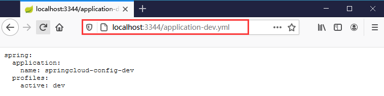

## 1. 微服务入门

### 1.1 单体应用

我们创建的绝大部分应用都属于**单体应用**，也就是我们会把数据库连接、业务逻辑处理、展示逻辑等放在一起，然后将其构建为一个可部署的 JAR 或 WAR，并投入生产环境中。在程序规模不大，开发人员很少的时候，下面的优点是非常显著的：

* 开发简单。单体应用的结构，天然决定了所有代码都集中在一起，开发者不需要在多个应用之间来回跳转来寻找其中的调用逻辑。
* 测试简单。所有代码都在一个应用里，测试人员可以很方便的做到端到端的测试（当然，很多时候测试人员就是开发者自己）。
* 部署简单。因为一个应用就是产品功能的全集，所以在部署的时候，只需要不是一款应用即可。即使是集群部署，也不会增加多少复杂度：只需要将应用部署多份即可。
* 开发迅速。上面的各种简单，带来的就是软件功能可以快速实现。很多时候，实现需求的速度是项目成功与否的决定性因素。

所以，**在开发简单、独立的产品时，单体架构依然是第一优先选择**。随着功能的持续增加、团队规模的不断扩大，我们很快就会发现单体应用的弊端：

* 应用膨胀。所有代码都在一个应用里，导致应用的代码量迅速上升，对于开发者来说，经常需要在海量的代码里找到自己需要维护的哪一行，这种体验往往是令人崩溃的。同时，对于 IDE 来说，一个应用内大量代码也会严重拖慢其运行效率。
* 团队合作冲突。这种冲突会体现在多个方面：开发阶段，很容易由于修改相同的代码导致代码冲突。部署阶段，又会因为“运行环境里跑的是谁的分支”而造成新的冲突。所有的这些冲突将会严重影响到团队的合作效率。
* 运行效率&稳定性。单体应用，由于逻辑都集中在一起，启动时需要完成所有的初始化工作；同时单一功能的问题也会因为运行在一个进程内，从而导致整个应用宕机。


### 1.2 微服务

微服务（Microservice Architecture）是近几年流行的一种架构思想，关于它的概念很难一言以蔽之。我们在此引用 ThoughtWorks 公司的首席科学家 Martin Fowler 于 2014 年提出的一段话（具体可参考[原文链接](https://martinfowler.com/articles/microservices.html)、[汉化链接](https://www.cnblogs.com/liuning8023/p/4493156.html)）：

* 就目前而言，对于微服务，业界并没有一个统一的，标准的定义
* 但通常而言，微服务架构是一种架构模式，或者说是一种架构风格，它提倡将单一的应用程序划分成一组小的服务，每个服务运行在其独立的自己的进程内，服务之间互相协调，互相配置，为用户提供最终价值。服务之间采用轻量级的通信机制互相沟通，每个服务都围绕着具体的业务进行构建，并且能够被独立的部署到生产环境中，另外，应尽量避免统一的，集中式的服务管理机制，对具体的一个服务而言，应根据业务上下文，选择合适的语言，工具对其进行构建，可以有一个非常轻量级的集中式管理来协调这些服务，可以使用不同的语言来编写服务，也可以使用不同的数据存储

简而言之，**微服务架构是一种分布式架构，它将应用程序分解为可独立开发和部署的小规模、微型应用的一种方式，这些微服务之间互相协作，以实现更大的应用程序的功能**。与单体应用相比，微服务可以选择不同的技术，能够独立扩展，且可以频繁地发布到生产环境中。但是并不是所有的应用程序都需要这种架构，微服务有自身的限制，包括分布式、服务协作、网络延迟等。


### 1.3 微服务技术栈

| 微服务               | 技术栈                              |
| -------------------- | ----------------------------------- |
| 服务开发             | Spring Boot、Spring、Spring MVC     |
| 服务配置与管理       | Archaius、Diamond                   |
| 服务注册与发现       | Eureka、Zookeeper、Consul、Nacos    |
| 服务调用             | Rest、RPC、gRPC                     |
| 服务熔断器           | Hystrix、Envoy、Sentinel            |
| 负载均衡             | Ribbon、Nginx                       |
| 服务接口调用         | Feign                               |
| 消息队列             | Kafka、RabbitMQ、ActiveMQ、RocketMQ |
| 服务配置中心管理     | Spring Cloud Config、Chef           |
| 服务路由（API 网关） | Zuul                                |
| 服务监控             | Zabbix、Nagios、Metrics、Specatator |
| 全链路追踪           | Zipkin、Brave、Dapper               |
| 服务部署             | Docker、OpenStack、Kubernetes       |
| 数据流操作开发包     | Spring Cloud Stream                 |
| 实践消息总线         | Spring Cloud Bus                    |


## 2. Spring Cloud

### 2.1 Spring Cloud 简介

Spring Cloud 利用 Spring Boot 的开发便利性，巧妙地简化了分布式系统基础设施的开发，为开发人员提供了快速构建分布式系统的一些工具，**包括配置管理、服务发现、断路器、路由、微代理、事件总线、全局锁、决策竞选、分布式会话等等**，它们都可以用 Spring Boot 的开发风格做到一键启动和部署。

Spring Cloud 是分布式微服务架构下的一站式解决方案，是各个微服务架构落地技术的集合体，俗称微服务全家桶。既然 Spring Cloud 是标准，那么自然少不了针对标准的实现。参与这个标准实现的公司有很多，例如：Google 的 Spring Cloud GCP，Netflix 的 **Spring Cloud Netflix**，Microsoft 的 Spring Cloud Azure 等等，当然还有我们阿里巴巴的 **Spring Cloud Alibaba**。


### 2.2 Spring Cloud 和 Spring Boot 关系

Spring Boot 并没有重复造轮子，它只是将目前各家公司开发的比较成熟，经得起实际考验的服务框架组合起来，
通过 Spring Boot 风格进行再封装，屏蔽掉了复杂的配置和实现原理，最终给开发者留出了一套简单易懂， 易部署和易维护的分布式系统开发工具包。它与 Spring Cloud 的关系是：

* Spring Boot 专注于快速方便的开发**单个个体微服务**；Spring Cloud 关注**全局的微服务协调治理框架**，它将 Spring Boot 开发的一个个单体微服务整合并管理起来。
* Spring Boot 可以离开 Spring Cloud 独立使用，开发项目，但是 Spring Cloud 离不开 Spring Boot，属于依赖关系。因此，**Spring Cloud 的版本需要根据 Spring Boot 的版本相应的选择**，具体可查看官网。


### 2.3 Spring Cloud 和 Dubbo 对比

| Dubbo        | Spring        | Spring Cloud                 |
| ------------ | ------------- | ---------------------------- |
| 服务注册中心 | Zookeeper     | Spring Cloud Netfilx Eureka  |
| 服务调用方式 | RPC           | REST API                     |
| 服务监控     | Dubbo-monitor | Spring Boot Admin            |
| 断路器       | 不完善        | Spring Cloud Netflix Hystrix |
| 服务网关     | 无            | Spring Cloud Netflix Zuul    |
| 分布式配置   | 无            | Spring Cloud Config          |
| 服务跟踪     | 无            | Spring Cloud Sleuth          |
| 消息总线     | 无            | Spring Cloud Bus             |
| 数据流       | 无            | Spring Cloud Stream          |
| 批量任务     | 无            | Spring Cloud Task            |

* Dubbo 的定位是一款 RPC 框架，Spring Cloud 的目标是微服务架构下的一站式解决方案。
* **Spring Cloud 抛弃了 Dubbo 的 RPC 通信，采用的是基于 HTTP 的 REST 方式**。严格来说，者两种凡是各有优劣。虽然 Spring Cloud 牺牲了服务调用的性能，但是也避免了原生 RPC 带来的问题，且 REST 比 RPC 更为灵活，不存在代码级别的强依赖，这在强调快速演化的微服务环境下，显然更合适。


## 3. Eureka 服务注册与发现

### 3.1 Eureka 介绍

Eureka（音标：/juˈriːkə/） 是 Netflix 的一个子模块，也是核心模块之一，它是一个基于 REST 的服务，用于定位服务，以实现云端中间层服务发现和故障转移。服务注册与发现对于微服务来说是非常重要的，有了服务注册与发现，只需要使用服务的标识符，就可以访问到服务，而不需要修改服务调用的配置文件了，功能类似于 Dubbo 的注册中心，如 Zookeeper。

1. **基本架构**
   * Spring Cloud 封装了 Netflix 公司开发的 Eureka 模块来实现服务注册和发现
   * Eureka 采用了**C-S 的架构**设计，Eureka Server 作为服务注册功能的服务器，即服务注册中心
   * 系统中的其他微服务使用 Eureka 客户端连接到 Eureka Server 并维持心跳连接，这样系统的维护人员就可以通过 Eureka Server 来监控系统中各个微服务是否正常运行，Spring Cloud 的一些其他模块就可以通过 Eureka Server 来发现系统中的其他微服务，并执行相关的逻辑
2. **两个组件**
   * Eureka 包含两个组件：**Eureka Server 和 Eureka Client**
   * Eureka Server 提供服务注册服务，各个节点启动后，会在 Eureka Server 中进行注册，这样 Eureka Server 中的服务注册表中将会存储所有可用服务节点的信息，服务节点的信息可以在界面中直观的看到
   * Eureka Client 是一个 Java 客户端，用于简化 Eureka Server 的交互，客户端同时也具备一个内置的，使用轮询负载算法的负载均衡器。在应用启动后，将会向 Eureka Server 发送心跳（默认周期为 30 秒）。如果 Eureka Server 在 3 个心跳周期（也就是 90 秒）内没有接收到某个节点的心跳，Eureka Server 将会从服务注册表中把这个服务节点移除掉
3. **三大角色**
   * Eureka Server：提供服务的注册与发现
   * Service Provider：将自身服务注册到 Eureka 中，从而使消费方能够找到
   * Service Consumer：服务消费方从 Eureka 中获取注册服务列表，消费服务

4. **自我保护机制**
   * 默认情况下，如果 Eureka Server 在一定时间内没有接收到某个微服务实例的心跳，将会注销该实例。但是当网络分区故障发生时，微服务与 Eureka 之间无法正常通行，以上行为可能变得非常危险了，因为微服务本身其实是健康的，此时本不应该注销这个服务
   * Eureka 通过自我保护机制来解决这个问题，当 Eureka Server 节点在短时间内丢失过多客户端时（可能发生了网络分区故障)，那么这个节点就会进入自我保护模式。一旦进入该模式，Eureka Server 就会保护服务注册表中的信息，不再删除服务注册表中的数据，也就是不会注销任何微服务，当网络故障恢复后，该 Eureka Server 节点会自动退出自我保护模式
   * 综上，自我保护模式是一种应对网络异常的安全保护措施，**某时刻某一个微服务不可用了，Eureka 不会立刻清理，依旧会对该微服务的信息进行保存**。它的架构哲学是宁可同时保留所有微服务（健康的和不健康的微服务)，也不盲目注销任何可能健康的微服务
   * 在 Spring Cloud 中，可以使用 `eureka.server.enable-self-preservation = false` 禁用自我保护，但在生产环境时不推荐


### 3.2 Eureka 与 Zookeeper 对比

CAP  原则又称 CAP 定理，指的是在一个分布式系统中，一致性（Consistency）、可用性（Availability）、分区容错性（Partition tolerance）。CAP 原则指的是，这**三个要素最多只能同时实现两点**，不可能三者兼顾。

* **一致性（C）**：分布式系统中的所有数据备份，在同一时刻是否同样的值。（等同于所有节点访问同一份最新的数据副本）
* **可用性（A）**：在集群中一部分节点故障后，集群整体是否还能响应客户端的读写请求。（对数据更新具备高可用性）
* **分区容错性（P）**：以实际效果而言，分区相当于对通信的时限要求。系统如果不能在时限内达成数据一致性，就意味着发生了分区的情况，必须就当前操作在 C 和 A 之间做出选择。

由于分区容错性 P 在分布式系统中是必须要保证的，因此我们只能在 A 和 C 之间进行权衡：

* **Zookeeper 保证的是 CP**：当向注册中心查询服务列表时，我们可以容忍注册中心返回的是几分钟以前的注册信息，但不能接受服务直接宕机不可用。也就是说，**服务注册功能对可用性的要求要高于一致性**。但是 zk 会出现这样一种情况，当 master 节点因为网络故障与其他节点失去联系时，剩余节点会重新进行 leader 选举。由于选举 leader 的时间太长（30 - 120s），且选举期间整个 zk 集群都是不可用的，导致在选举期间注册服务瘫痪。虽然服务最终能够恢复，但是漫长的选举时间导致的注册长期不可用是不能容忍的。

* **Eureka 保证的是 AP**： Eureka 在设计时优先保证可用性，各个节点都是平等的，几个节点挂掉不会影响正常节点的工作，剩余的节点依然可以提供注册和查询服务。Eureka 客户端在向某个 Eureka 注册时，如果发现连接失败，则会自动切换至其他节点，只要有一台 Eureka 还在，就能保住注册服务的可用性，只不过查到的信息可能不是最新的。除此之外，Eureka 还有自我保护机制。因此，Eureka 可以很好的应对因网络故障导致部分节点失去联系的情况，而不会像 Zookeeper 那样使整个注册服务瘫痪。


### 3.3 搭建 Eureka Server

1. **添加依赖**

   ```xml
   <!-- 这里没有配置版本，是因为在父模块的POM文件中已经添加了spring cloud和Spring Boot对应依赖 -->
   <dependencies>
       <dependency>
           <groupId>org.springframework.cloud</groupId>
           <artifactId>spring-cloud-starter-netflix-eureka-server</artifactId>
       </dependency>
    </dependencies>
   ```

2. **编写配置文件**

   ```yml
   server:
     port: 7001
   
   eureka:
     instance:
   #    hostname: localhost
       hostname: eureka7001.com	# Eureka服务端的实例名称（修改了本地hosts文件，实际仍是localhost）
     client:
       register-with-eureka: false # 表示不向Eureka注册自己
       fetch-registry: false 		# 表示自己是注册中心
       service-url:    # 监控页面
         # 单机
         # defaultZone: http://${eureka.instance.hostname}:${server.port}/eureka/
         # 集群
         defaultZone: http://eureka7002.com:7002/eureka/,http://eureka7003.com:7003/eureka/
   ```

3. **开启功能**

   ```java
   @EnableEurekaServer // Eureka服务端启动类，可以接受其它服务注册
   @SpringBootApplication
   public class EurekaServer7001 {
       public static void main(String[] args) {
           SpringApplication.run(EurekaServer7001.class, args);
       }
   }
   ```


### 3.4 搭建服务提供者

1. **添加依赖**

   ```xml
   <dependency>
       <groupId>org.springframework.cloud</groupId>
       <artifactId>spring-cloud-starter-netflix-eureka-client</artifactId>
   </dependency>
   ```

2. **编写配置文件**

   ```yml
   server:
     port: 8001
   
   # Mybatis配置
   mybatis:
     type-aliases-package: com.example.springcloud.pojo
     config-location: classpath:mybatis/mybatis-config.xml
     mapper-locations: classpath:mybatis/mapper/*.xml
   
   # Spring配置
   spring:
     application:
       name: springcloud-provider-dept	# 服务名称（重要）
     datasource:
       type: com.alibaba.druid.pool.DruidDataSource
       driver-class-name: org.gjt.mm.mysql.Driver
       url: jdbc:mysql://localhost:3306/db1?useUnicode=true&characterEncoding=utf-8
       username: root
       password: root
   
   # Eureka配置
   eureka:
     client:
       service-url:
         # defaultZone: http://localhost:7001/eureka/
         defaultZone: http://eureka7001.com:7001/eureka/,http://eureka7002.com:7002/eureka/,http://eureka7003.com:7003/eureka/
     instance:
       instance-id: springcloud-provider-8001  # 修改Eureka的默认描述信息
   ```

3. **开启功能**

   ```java
   @EnableEurekaClient // 在服务启动后自动注册到Eureka
   @EnableDiscoveryClient
   @SpringBootApplication
   public class DeptProvider8001 {
       public static void main(String[] args) {
           SpringApplication.run(DeptProvider8001.class, args);
       }
   }
   ```

4. **测试**

   启动 Eureka Server 集群，然后启动服务提供者，尝试在浏览器中访问 http://eureka7001.com:7001、http://eureka7002.com:7002、http://eureka7003.com:7003

   


##  4. Ribbon 负载均衡

### 4.1 Ribbon 介绍

Spring Cloud Ribbon（音标：/ˈrɪbən/）是基于 Netflix Ribbon 实现的一套**客户端负载均衡**的工具。它会自动帮你基于某种规则（如简单轮询，随机等）去连接这些机器。我们也很容易使用 Ribbon 实现自定义的负载均衡算法。

负载均衡（Load Balance，LB）就是将用户的请求平均分配到多个服务上，从而达到系统的高可用。常见的负载均衡软件有 Nginx、LVS 等，Dubbo、Spring Cloud 中也给我们提供了负载均衡。负载均衡可分为两类：

* **集中式LB**：即在服务的消费方和提供方之间使用独立的负载均衡设施，如 Nginx，由该设施负责把访问请求通过某种策略转发至服务的提供方
* **进程式LB**：将负载均衡逻辑集成到消费方，消费方从服务注册中心获知有哪些地址可用，然后自己再从这些地址中选出一个合适的服务器。Ribbon 就属于进程内负载均衡，它只是一个类库，集成于消费方进程，消费方通过它来获取到服务提供方的地址


### 4.2 搭建 Ribbon 服务消费者

1. **添加依赖**

   ```xml
   <dependency>
       <groupId>org.springframework.cloud</groupId>
       <artifactId>spring-cloud-starter-netflix-eureka-client</artifactId>
   </dependency>
   <dependency>
       <groupId>org.springframework.cloud</groupId>
       <artifactId>spring-cloud-starter-netflix-ribbon</artifactId>
   </dependency>
   ```

2. **编写配置文件**

   ```yml
   server:
     port: 8002  # 80端口占用，改用8002
   
   eureka:
     client:
       register-with-eureka: false # 不向eureka注册自己
       service-url:
         defaultZone: http://eureka7001.com:7001/eureka/,http://eureka7002.com:7002/eureka/,http://eureka7003.com:7003/eureka/
   ```

3. **开启功能**

   ```java
   @EnableEurekaClient
   @SpringBootApplication
   public class DeptConsumer8002 {
       public static void main(String[] args) {
           SpringApplication.run(DeptConsumer8002.class, args);
       }
   }
   ```

4. **编写配置类**

   ```java
   @Configuration
   public class ConfigBean {
       /**
        *  IRule是一个接口，用于负载均衡，实现类有：
        *  1. RoundRobinRule：轮询（默认）
        *  2. RandomRule：随机
        *  3. AvailabilityFilteringRule：会先过滤跳闸（访问故障）的服务，对剩下服务进行轮询
        *  4. RetryRule：会先轮询，如果服务获取失败，则在指定时间内重试
        *  5. WeightedResponseTimeRule：权重
        */
       @Bean
       @LoadBalanced   // ribbon配置负载均衡实现RestTemplate
       public RestTemplate getRestTemplate(){
           return new RestTemplate();
       }
   
   //    @Bean   // 使用随机算法负载均衡
   //    public IRule randomRule(){
   //        return new RandomRule();
   //    }
   }
   ```

5. **编写 Controller**

   ```java
   @RestController     // 服务消费者
   public class DeptConsumerController {
       // 理解：消费者，不应该有service层
       // RestTemplate提供多种便捷访问http服务的方法，简单的restful服务模板
       // 参数(urL, 实体 Map, Class<T> responseType)
       // RestTemplate直接通过http远程请求，而不像RPC那样使用引用
       @Autowired
       private RestTemplate restTemplate;
   
       // 由于ribbon负载均衡，这里的地址应该通过服务名来访问，而不是写具体的IP地址
   //    private static final String REST_URL = "http://localhost:8001";
       private static final String REST_URL = "http://SPRINGCLOUD-PROVIDER-DEPT";
   
       @PostMapping("/consumer/dept/add")
       public Boolean addDept(Dept dept) {
           return restTemplate.postForObject(REST_URL + "/dept/add", dept, Boolean.class);
       }
   
       @GetMapping("/consumer/dept/get/{id}")
       public Dept queryById(@PathVariable Long id) {
           return restTemplate.getForObject(REST_URL + "/dept/get/" + id, Dept.class);
       }
   
       @GetMapping("/consumer/dept/queryAll")
       public List<Dept> queryAll() {
           return restTemplate.getForObject(REST_URL + "/dept/queryAll", List.class);
       }
   }
   ```

6. **测试**

   启动一个或多个 Eureka Server，然后启动多个服务提供者和服务消费者，尝试在浏览器中访问 http://localhost:8002/consumer/dept/queryAll ，并连续访问多次，观察查询数据的变化


## 5. Feign 服务接口调用

### 5.1 Feign 介绍

Feign（音标：/feɪn/）是声明式的 web service 客户端，它集成了 Ribbon，符合开发人员**面向接口编程**的习惯，让微服务之间的调用变得更简单了，类似 Controller 调用 Service。Spring Cloud 集成了 Ribbon 和 Eureka，可在使用 Feign 时提供负载均衡的 HTTP 客户端。

在使用 Ribbon 时，利用 RestTemplate 对 HTTP 请求进行封装处理，形成了一套模板化的调用方法。但是在实际开发中，由于对服务依赖的调用可能不止一处，往往一个接口会被多处调用，所以通常都会针对每个微服务自行封装一些客户端类来包装这些依赖服务的调用。所以，Feign在此基础上做了进一步封装，由它来帮助我们定义和实现依赖服务接口的定义，我们只需要创建一个接口并使用注解的方式来配置它，即可完成对服务提供方的接口绑定，简化了使用 Ribbon 自动封装服务调用客户端的开发量。


###  5.2 搭建 Feign 服务消费者

1. **添加依赖**

   ```xml
   <dependency>
       <groupId>org.springframework.cloud</groupId>
       <artifactId>spring-cloud-starter-openfeign</artifactId>
   </dependency>
   ```

2. **编写配置文件**（与 4.2 节 Ribbon 服务消费者相同）

3. **开启功能**

   ```java
   @EnableEurekaClient
   @SpringBootApplication
   @EnableFeignClients(basePackages = {"com.example.springcloud"}) // 开启Feign
   public class DeptConsumerFeign8002 {
       public static void main(String[] args) {
           SpringApplication.run(DeptConsumerFeign8002.class, args);
       }
   }
   ```

4. **编写 Service**

   ```java
   // fallbackFactory属性用于服务降级
   @FeignClient(value = "SPRINGCLOUD-PROVIDER-DEPT",
           fallbackFactory = DeptClientServiceFallbackFactory.class)
   public interface DeptClientService {
       @PostMapping("/dept/add")
       boolean addDept(Dept dept);
   
       // 必须使用属性value指明变量，否则报错
       @GetMapping("/dept/get/{id}")
       Dept queryById(@PathVariable(value = "id") Long id);
   
       @GetMapping("/dept/queryAll")
       List<Dept> queryAll();
   }
   ```

5. **编写 Controller**

   ```java
   @RestController     // 服务消费者
   public class DeptConsumerController {
       @Autowired		// 面向接口编程，类似Controller调用Service
       private DeptClientService deptClientService;
   
       @PostMapping("/consumer/dept/add")
       public Boolean addDept(Dept dept) {
           return deptClientService.addDept(dept);
       }
   
       @GetMapping("/consumer/dept/get/{id}")
       public Dept queryById(@PathVariable Long id) {
           return deptClientService.queryById(id);
       }
   
       @GetMapping("/consumer/dept/queryAll")
       public List<Dept> queryAll() {
           return deptClientService.queryAll();
       }
   }
   ```

6. **测试**

   启动一个或多个 Eureka Server，然后启动多个服务提供者和服务消费者，尝试在浏览器中访问 http://localhost:8002/consumer/dept/queryAll ，并连续访问多次，观察查询数据的变化


## 6. Hystrix 断路器

### 6.1 Hystrix 介绍

Hystrix（音标：/hɪst'rɪks/）是一个用于处理分布式系统的延迟和容错的开源库。在分布式系统里，许多依赖不可避免的会调用失败，比如超时、异常等，Hystrix 能够保证在一个依赖出问题的情况下，不会导致整体服务失败，避免级联故障，以提高分布式系统的弹性。
”断路器“本身是一种开关装置，当某个服务单元发生故障之后，通过断路器的故障监控（类似断路保险丝)，向调用方返回一个服务预期的、可处理的备选响应（FallBack），而不是长时间的等待或者抛出调用方法无法处理的异常，这样就可以保证服务调用方的线程不会被长时间，不必要的占用，从而避免了故障在分布式系统中的蔓延，乃至雪崩。

1. **服务雪崩**
   
   * 多个微服务之间调用的时候，假设微服务 A 调用微服务 B 和微服务 C，微服务 B 和微服务 C 又调用其他的微服务，这就是所谓的**扇出**。如果扇出的链路上某个微服务的调用响应时间过长或者不可用，对微服务 A 的调用就会占用越来越多的系统资源，进而引起系统崩溃，即**雪崩效应**。
   * 对于高流量的应用来说，单一的后端依赖的延迟可能会导致所有服务器上的所有资源都在几秒中内饱和。比失败更糟糕的是，这些应用程序还可能导致服务之间的延迟增加，备份队列，线程和其他系统资源紧张，导致整个系统发生更多的级联故障。

   

2. **服务熔断与服务降级**
   
   * 服务熔断是对雪崩效应的一种微服务链路保护机制。当扇出链路的某个微服务不可用或者响应时间太长时，会熔断该节点微服务的调用，快速返回错误的响应信息；当检测到该节点微服务调用响应正常后恢复调用链路。
   * 服务降级是从整个系统的负荷情况出发和考虑的，对某些负荷会比较高的情况，为了预防某些功能（业务场景）出现负荷过载或者响应慢的情况，在其内部暂时舍弃对一些非核心的接口和数据的请求，而直接返回一个提前准备好的错误处理信息。这样，虽然提供的是一个有损的服务，但却保证了整个系统的稳定性和可用性。
   * 服务熔断和服务降级都是从可用性和可靠性出发，防止系统崩溃。但是**服务熔断一般是某个服务故障引起，而服务降级一般是从整体符合考虑**。
   


### 6.2 服务熔断

1. **添加依赖**

   ```xml
   <dependency>
       <groupId>org.springframework.cloud</groupId>
       <artifactId>spring-cloud-starter-netflix-hystrix</artifactId>
   </dependency>
   ```

2. **编写配置文件**（与 3.4 节服务提供者相同）

3. **开启功能**

   ```java
   @EnableCircuitBreaker   // 熔断的支持
   @EnableEurekaClient     // 在服务启动后自动注册到Eureka
   @EnableDiscoveryClient  // 服务发现
   @SpringBootApplication
   public class DeptProviderHystrix8001 {
       public static void main(String[] args) {
           SpringApplication.run(DeptProviderHystrix8001.class, args);
       }
   }
   ```

4. **编写 Controller**

   ```java
   @RestController
   public class DeptController {
       @Autowired
       private DeptService deptService;
   
       @GetMapping("/dept/get/{id}")
       @HystrixCommand(fallbackMethod = "hystrixGet")	// Hystrix失败回调方法
       public Dept queryById(@PathVariable Long id) {
           Dept dept = deptService.queryById(id);
           if(dept == null) {
               throw new RuntimeException("id=>" + id + "不存在该用户，或信息无法找到");
           }
           return dept;
       }
   
       // 备选方法
       public Dept hystrixGet(@PathVariable Long id){
           return new Dept()
                   .setDeptno(id)
                   .setDname("id=>" + id + "没有对应信息，null--@Hystrix")
                   .setDb_source("no database in MySQL");
       }
   }
   ```

5. **测试**

   启动一个或多个 Eureka Server，然后启动带有 Hystrix 断路器的服务提供者和服务消费者，尝试在浏览器中访问 http://localhost:8002/consumer/dept/get/1、http://localhost:8002/consumer/dept/get/8 ，观察查询数据的变化。

   


### 6.3 服务降级

1. **编写配置文件**

   ```yml
   # 开启Hystrix服务降级
   feign:
     hystrix:
       enabled: true
   ```

2. **编写回退工厂**

   ```java
   @Component	// 在DeptClientService的@FeignClient注解中指定回退工厂
   public class DeptClientServiceFallbackFactory implements FallbackFactory {
       @Override
       public DeptClientService create(Throwable throwable) {
           return new DeptClientService() {
               @Override
               public boolean addDept(Dept dept) {
                   return false;
               }
   
               @Override
               public Dept queryById(Long id) {
                   return new Dept()
                           .setDeptno(id)
                           .setDname("服务降级，该服务已经关闭")
                           .setDb_source("没有数据");
               }
   
               @Override
               public List<Dept> queryAll() {
                   return null;
               }
           };
       }
   }
   ```

3. **测试**

   启动一个或多个 Eureka Server，然后启动服务提供者和带有 Hystrix 断路器服务消费者，尝试在浏览器中访问 http://localhost:8002/consumer/dept/get/1，然后停掉服务提供者，观察查询数据的变化。

   

   

### 6.4 Dashboard 流监控

1. **添加依赖**

   ```xml
   <dependency>
       <groupId>org.springframework.cloud</groupId>
       <artifactId>spring-cloud-starter-netflix-hystrix</artifactId>
   </dependency>
   <dependency>
       <groupId>org.springframework.cloud</groupId>
       <artifactId>spring-cloud-starter-netflix-hystrix-dashboard</artifactId>
   </dependency>
   ```

2. **编写配置文件**

   ```yml
   server:
     port: 9001
   ```

3. **开启功能**

   ```java
   @EnableHystrixDashboard	// 开启HystrixDashboard
   @SpringBootApplication
   public class DeptConsumerDashboard9001 {
       public static void main(String[] args) {
           SpringApplication.run(DeptConsumerDashboard9001.class, args);
       }
   }
   ```

4. **提供监控信息**

   ```xml
   <!-- Hystrix流是由Actuator断点提供的，因此需要修改带有Hystrix熔断器的服务提供者 -->
   <dependency>
       <groupId>org.springframework.boot</groupId>
       <artifactId>spring-boot-starter-actuator</artifactId>
   </dependency>
   ```

   ```java
   @EnableCircuitBreaker   // 添加对熔断的支持
   @EnableEurekaClient     // 在服务启动后自动注册到Eureka
   @EnableDiscoveryClient  // 服务发现
   @SpringBootApplication
   public class DeptProviderHystrix8001 {
       public static void main(String[] args) {
           SpringApplication.run(DeptProviderHystrix8001.class, args);
       }
   
       @Bean
       public ServletRegistrationBean hystrixMetricsStreamServlet() {
           ServletRegistrationBean registrationBean =
                   new ServletRegistrationBean<>(new HystrixMetricsStreamServlet());
           registrationBean.addUrlMappings("/actuator/hystrix.stream");
           return registrationBean;
       }
   }
   ```

5. **测试**

   启动一个或多个 Eureka Server，然后启动带有 Hystrix 断路器的服务提供者和 Dashboard 流监控，尝试在浏览器中访问 http://localhost:9001/hystrix/ ，然后输入监控信息，并访问 http://localhost:8001/dept/get/1，触发断路器保护该方法，观察图表的变化。

   

   折线图中圆圈的大小表示当前的流量，圆圈越大，流量越大；圆圈的颜色表示它的健康状况，绿色表示断路器健康，黄色表示偶尔发生故障，红色表示故障。右上角绿、蓝、蓝绿、黄、紫、红色的数字分别表示当前成功调用、短路请求、错误请求、超时请求、线程池拒绝、失败请求的数量。更多信息参考 Hystrix 官方文档。

   


## 7. Zuul 路由网关

### 7.1 Zuul 介绍

Zuul（音标：/zulu/）是 Netflix 开源的微服务网关，提供对请求的**代理、路由、过滤**三大功能。其中，路由功能负责将外部请求转发到具体的微服务实例上，是实现外部访问统一入口的基础； 而过滤器功能则负责对请求的处理过程进行干预，是实现请求校验，服务聚合等功能的基础。Zuul 和 Eureka 进行整合，将 Zuul 自身注册为 Eureka 服务治理下的应用，同时从 Eureka 中获得其他微服务的消息，也即以后访问微服务都是通过 Zuul 跳转后获得。


### 7.2 搭建路由网关

1. **添加依赖**

   ```xml
   <dependency>
       <groupId>org.springframework.cloud</groupId>
       <artifactId>spring-cloud-starter-netflix-zuul</artifactId>
   </dependency>
   ```

2. **编写配置文件**

   ```yml
   server:
     port: 9527
   
   spring:
     application:
       name: springcloud-zuul
   
   eureka:
     client:
       service-url:
         defaultZone: http://eureka7001.com:7001/eureka/, http://eureka7002.com:7002/eureka/,http://eureka7003.com:7003/eureka/
     instance:
       instance-id: zuul9527.com
       prefer-ip-address: true
   
   # www.maostudy.com 是zuul服务的地址，这里修改了本地hosts文件，实际仍是localhost
   # 示例：http://www.maostudy.com:9527/maomao/mydept/dept/get/1
   zuul:
     routes:
       mydept.serviceId: springcloud-provider-dept # 使用下面的路径代替上面的路径，隐藏真实路径
       mydept.path: /mydept/**
   #  ignored-services: springcloud-provider-dept   # 不能使用原路径访问，通常使用通配符
     ignored-services: "*"	# 隐藏全部的真实路径
     prefix: /maomao     	# 设置公共的前缀
   ```

3. **开启功能**

   ```java
   @EnableZuulProxy    // 开启Zuul
   @SpringBootApplication
   public class ZuulApplication9527 {
       public static void main(String[] args) {
           SpringApplication.run(ZuulApplication9527.class,args);
       }
   }
   ```

4. **提供监控信息**

   ```java
   @EnableCircuitBreaker   // 添加对熔断的支持
   @EnableEurekaClient     // 在服务启动后自动注册到Eureka
   @EnableDiscoveryClient  // 服务发现
   @SpringBootApplication
   public class DeptProviderHystrix8001 {
       public static void main(String[] args) {
           SpringApplication.run(DeptProviderHystrix8001.class, args);
       }
   
       @Bean
       public ServletRegistrationBean hystrixMetricsStreamServlet() {
           ServletRegistrationBean registrationBean =
                   new ServletRegistrationBean<>(new HystrixMetricsStreamServlet());
           registrationBean.addUrlMappings("/actuator/hystrix.stream");
           return registrationBean;
       }
   }
   ```

5. **测试**

   启动一个或多个 Eureka Server，然后启动带有 Hystrix 断路器的服务提供者和 Zuul 路由网关，尝试在浏览器中访问 http://www.maostudy.com:9527/maomao/mydept/dept/get/1 、http://www.maostudy.com:9527/maomao/springcloud-provider-dept/dept/get/1，观察查询数据的变化。

   


## 8. Spring Cloud Config 分布式配置

### 8.1 Spring Cloud Config 介绍

微服务意味着要将单体应用中的业务拆分成一个个子服务，每个服务的粒度相对较小，因此系统中会出现大量的服
务，由于每个服务都需要必要的配置信息才能运行，所以一套集中式的、动态的配置管理设施是必不可少的。Spring Cloud Config 为微服务架构中的微服务提供集中化的外部配置支持，它分为**服务端和客户端**两部分：

* 服务端也称为分布式配置中心，它是一个独立的微服务应用，用来连接配置服务器，并为客户端提供获取配置信息、加密、解密信息等访问接口。
* 客户端则是通过指定的配置中心来管理应用资源，以及与业务相关的配置内容，并在启动的时候从配置中心获
  取和加载配置信息。配置服务器默认采用 git 来存储配置信息，这样就有助于对环境配置进行版本管理。并且可以通过 git 客户端工具来方便的管理和访问配置内容。


### 8.2 搭建 Config 服务端

1. **添加依赖**

   ```xml
   <dependency>
       <groupId>org.springframework.cloud</groupId>
       <artifactId>spring-cloud-config-server</artifactId>
   </dependency>
   ```

2. **提供远程配置文件**

   ```yml
   # 将application.yml托管到gitee
   spring:
     profiles:
       active: dev
        
   ---
   spring:
     profiles: dev
     application:
       name: springcloud-config-dev
   
   ---
   spring:
     profiles: test
     application:
       name: springcloud-config-test
   ```

3. **编写配置文件**

   ```yml
   server:
     port: 3344
   
   spring:
     application:
       name: springcloud-config-server
     cloud:  # 连接远程仓库
       config:
         server:
           git:
             uri: https://gitee.com/maomaodev/springcloud-config.git # https，不是ssh
   ```

4. **开启功能**

   ```java
   @EnableConfigServer	// 开启Config Server
   @SpringBootApplication
   public class ConfigServer3344 {
       public static void main(String[] args) {
           SpringApplication.run(ConfigServer3344.class, args);
       }
   }
   ```

5. **测试**

   启动 Config 服务端，尝试在浏览器中访问 http://localhost:3344/application-dev.yml 或 http://localhost:3344/master/application-dev.yml

   


### 8.3 搭建 Config 客户端

1. **添加依赖**

   ```xml
   <dependency>
       <groupId>org.springframework.cloud</groupId>
       <artifactId>spring-cloud-starter-config</artifactId>
   </dependency>
   ```

2. **提供远程配置文件**

   ```yml
   # 将config-client.yml托管到gitee
   spring:
     profiles:
       active: dev
   
   ---
   server:
     port: 8201
   spring:
     profiles: dev
     application:
       name: springcloud-provider-dept
   
   eureka:
     client:
       service-url:
         defaultZone: http://eureka7001.com:7001/eureka/
   
   ---
   server:
     port: 8202
   spring:
     profiles: test
     application:
       name: springcloud-provider-dept
   
   eureka:
     client:
       service-url:
         defaultZone: http://eureka7001.com:7001/eureka/
   ```

3. **编写配置文件**

   ```yml
   # bootstrap.yml用于系统级别的配置
   spring:
     cloud:
       config:
         name: config-client 	# 需要从git上读取的资源名称，不需要后缀
         uri: http://localhost:3344  # 连接的config服务器地址
         profile: dev
         label: master
   ```

   ```yml
   # application.yml用于用户级别的配置
   spring:
     application:
       name: springcloud-config-client-3355
   ```

4. **编写 Controller**

   ```java
   @RestController
   public class ConfigClientController {
       @Value("${spring.application.name}")
       private String applicationName;
   
       @Value("${eureka.client.service-url.defaultZone}")
       private String eurekaServer;
   
       @Value("${server.port}")
       private String port;
   
       @RequestMapping("/config")
       public String config() {
           return "applicationName: " + applicationName +
                   "eurekaServer: " + eurekaServer +
                   "port: " + port;
       }
   }
   ```

5. **测试**

   启动 Config 服务端和客户端，尝试在浏览器中访问 http://localhost:8201/config

   


## 参考

1. [b站-SpringCloud最新教程](https://www.bilibili.com/video/BV1jJ411S7xr)
2. [Spring Cloud 官网](https://spring.io/projects/spring-cloud)
3. [Spring Cloud 中文官网](https://springcloud.cc/spring-cloud-dalston.html)
4. [Spring Cloud Alibaba 从入门到实战](https://leetcode-cn.com/leetbook/read/spring_cloud_alibaba_bootcamp/9msd1m/)
5. [github-Hystrix](https://github.com/Netflix/Hystrix/wiki)