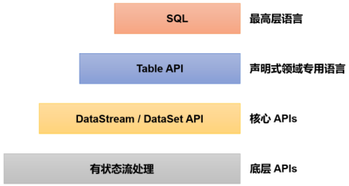
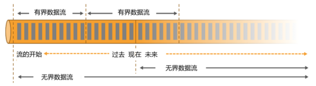
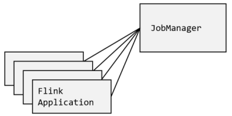
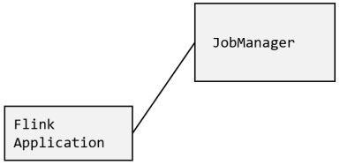
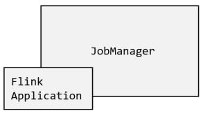
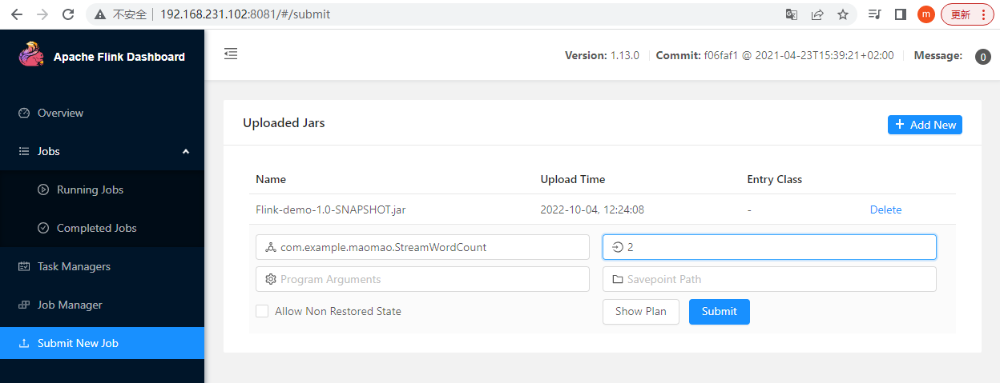
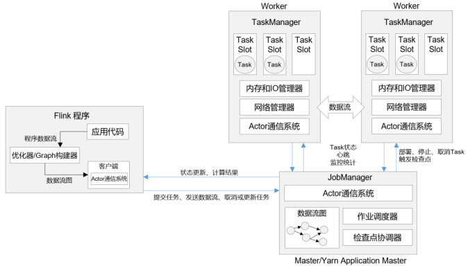
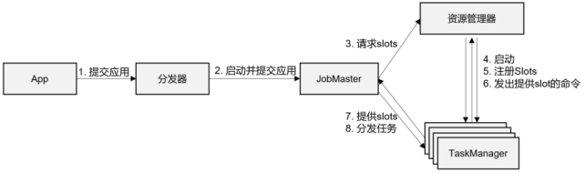
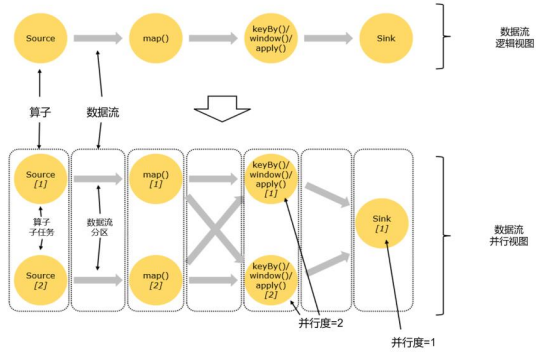
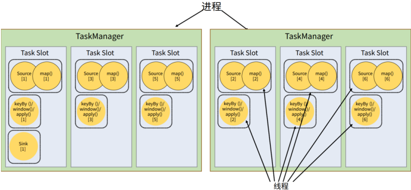

# 1. Flink 入门

## 1.1 Flink 介绍

### 1.1.1 Flink 核心特性

Flink 是一个**框架和分布式处理引擎**，用于对无界和有界数据流进行有状态计算，它被设计在所有常见的集群环境中运行，以**内存执行速度和任意规模**来执行计算。Flink 区别于传统数据处理框架的特性如下：

* **高吞吐和低延迟**，每秒处理数百万个事件，毫秒级延迟。
* **结果的准确性**，Flink 提供了事件时间（event-time）和处理时间（processing-time） 语义，对于乱序事件流，事件时间语义仍然能提供一致且准确的结果。 
* **精确一次（exactly-once）**的状态一致性保证。 
* **可以连接到最常用的存储系统**，如 Kafka、Cassandra、Elasticsearch、 JDBC、Kinesis，以及分布式文件系统，如 HDFS 和 S3。 
* **高可用**，本身高可用的设置，加上与 K8s，YARN 和 Mesos 的紧密集成，再加上从故障中快速恢复和动态扩展任务的能力，Flink 能做到以极少的停机时间。 
* 能够更新应用程序代码并将作业（jobs）迁移到不同的 Flink 集群，而不会丢失应用程序的状态。

除了上述特性外，Flink 还拥有易于使用的**分层 API**。大多数应用直接针对核心 API 进行编程，如 **DataStream API（用于处理有界或无界流数据）**以及 DataSet API（用于处理有界数据集），这些 API 为数据处理提供了通用的构建模块，如由用户定义的多种形式的转换 （transformations）、连接（joins）、聚合（aggregations）、窗口（windows）操作等。由于新版本 Flink 已经完全实现了真正的流批一体，因此 DataSet API 已处于软弃用（soft deprecated）的状态。




### 1.1.2 Flink 与 Spark

数据处理的基本方式，可以分为**批处理和流处理**两种。批处理针对的是有界数据集，非常适合**需要访问海量的全部数据**才能完成的计算工作，一 般用于**离线统计**；流处理主要针对的是数据流，特点是**无界、实时**, 对系统传输的每个数据依次执行操作， 一般用于**实时统计**。

**Spark 以批处理为根本，并尝试在批处理之上支持流计算**。在 Spark 中，万物皆批次，离线数据是一个大批次，而实时数据则是由一个一个无限的小批次组成的。所以对于流处理框架 Spark Streaming 而言，其实并不是真正意义上的“流”处理，而是“微批次”处理。而**在 Flink 中，万物皆流，流处理才是最基本的操作，批处理也可以统一为流处理**，实时数据是标准的、没有界限的流，而离线数据则是有界限的流。



Spark 和 Flink 的区别还在于底层实现的数据模型不同。 **Spark 底层数据模型是弹性分布式数据集 RDD**，Spark Streaming 进行微批处理的底层接口 DStream，实际上是一组组小批数据 RDD 的集合，所以 Spark 更加适合批处理的场景。 而 **Flink 的基本数据模型是数据流（DataFlow），以及事件（Event）序列**，其基本上是完全按照 Google 的 DataFlow 模型实现的，所以 Flink 更加适合流处理的场景。


## 1.2 Flink 快速上手

### 1.2.1 批处理

```xml
<properties>
    <flink.version>1.13.0</flink.version>
    <scala.binary.version>2.12</scala.binary.version>
</properties>

<dependencies>
    <!-- 引入 Flink 相关依赖 -->
    <dependency>
        <groupId>org.apache.flink</groupId>
        <artifactId>flink-java</artifactId>
        <version>${flink.version}</version>
    </dependency>
    <!-- 此处Scala版本为2.12，Flink使用Akka实现底层的分布式通信，而Akka使用Scala开发 -->
    <dependency>
        <groupId>org.apache.flink</groupId>
        <artifactId>flink-streaming-java_${scala.binary.version}</artifactId>
        <version>${flink.version}</version>
    </dependency>
    <dependency>
        <groupId>org.apache.flink</groupId>
        <artifactId>flink-clients_${scala.binary.version}</artifactId>
        <version>${flink.version}</version>
    </dependency>
</dependencies>
```

```java
// 基于DataSet API统计文本中单词出现的次数，从Flink 1.12开始，官方推荐直接使用DataStream API
// 在提交任务时将执行模式设为BATCH来进行批处理：$ bin/flink run -Dexecution.runtime-mode=BATCH BatchWordCount.jar
public class BatchWordCount {
    public static void main(String[] args) throws Exception {
        // 创建执行环境
        ExecutionEnvironment env = ExecutionEnvironment.getExecutionEnvironment();
        // 从文件读取数据，按行读取
        DataSource<String> lineDS = env.readTextFile("input/words.txt");
        // 转换数据格式
        FlatMapOperator<String, Tuple2<String, Long>> wordAndOne = lineDS
                .flatMap((String line, Collector<Tuple2<String, Long>> out) -> {
                    String[] words = line.split(" ");
                    for (String word : words) {
                        out.collect(Tuple2.of(word, 1L));
                    }
                })
            	// 当Lambda表达式使用Java泛型的时候, 由于泛型擦除的存在, 需要显示的声明类型信息
                .returns(Types.TUPLE(Types.STRING, Types.LONG)); 
        // 按照word进行分组，然后分组内聚合统计
        UnsortedGrouping<Tuple2<String, Long>> wordAndOneUG = wordAndOne.groupBy(0);
        AggregateOperator<Tuple2<String, Long>> sum = wordAndOneUG.sum(1);
        sum.print();
    }
}
```


### 1.2.2 流处理

```java
public class StreamWordCount {
    public static void main(String[] args) throws Exception {
        // 创建流式执行环境
        StreamExecutionEnvironment env = StreamExecutionEnvironment.getExecutionEnvironment();
        // 读取文本流，使用netcat工具产生流式数据，启动命令为：nc -lk 7777
        DataStreamSource<String> lineDSS = env.socketTextStream("hadoop102", 7777);
        // 转换数据格式
        SingleOutputStreamOperator<Tuple2<String, Long>> wordAndOne = lineDSS
                .flatMap((String line, Collector<String> words) -> {
                    Arrays.stream(line.split(" ")).forEach(words::collect);
                })
                .returns(Types.STRING)
                .map(word -> Tuple2.of(word, 1L))
                .returns(Types.TUPLE(Types.STRING, Types.LONG));
        // 分组后求和
        KeyedStream<Tuple2<String, Long>, String> wordAndOneKS = wordAndOne
                .keyBy(t -> t.f0);
        SingleOutputStreamOperator<Tuple2<String, Long>> result = wordAndOneKS
                .sum(1);
        
        result.print();
        env.execute();
    }
}
```


## 1.3 Flink 安装部署

Flink 有几个关键组件：**客户端（Client）、作业管理器（JobManager）和任务管理器（TaskManager）**。我们的代码实际上由客户端获取并做转换，之后提交给 JobManger，所以 JobManager 就是 Flink 集群里的“管事人”，对作业进行中央调度管理， 而它获取到要执行的作业后，会进一步处理转换，然后分发任务给众多的 TaskManager。

### 1.3.1 Fink 部署模式

Flink 为各种场景提供了不同的部署模式，主要有： 会话模式（Session Mode）、 单作业模式（Per-Job Mode） 、应用模式（Application Mode），它们的主要**区别在于：集群的生命周期和资源的分配方式，以及应用的 main 方法到底在客户端 Client 还是 JobManager 执行**。

1. **会话模式**：会话模式**需要先启动一个集群**，保持一个会话，在这个会话中通过客户端提交作业。集群启动时所有资源就都已经确定，所以提交的作业会竞争集群中的资源。这种方式的优点是**集群的生命周期超越于作业之上**，作业结束了就释放资源，集群依然正常运行；缺点是**资源是共享的**，一旦资源不足，提交新的作业就会失败，另外，同一个 TaskManager 上可能运行了很多作业，如果其中一个发生故障导致 TaskManager 宕机，那么所有作业都会受到影响。会话模式比较适合于单个规模小、执行时间短的大量作业。

   

2. **单作业模式**：**为每个提交的作业启动一个集群**，由客户端运行应用程序，然后启动集群，作业被提交给 JobManager，进而分发给 TaskManager 执行，作业完成后，集群就会关闭，所有资源也会释放。每个作业都有它自己的 JobManager 管理，**独占资源**，即使发生故障，它的 TaskManager 宕机也不会影响其他作业。 因此单作业模式运行更加稳定，也是**实际应用的首选模式**。 注意，Flink 单作业模式一般需要借助一些资源管理框架来启动集群，如 YARN、K8s。

   

3. **应用模式**：前面两种模式，应用代码都是在客户端上执行，然后由客户端提交给 JobManager 的，这种方式客户端需要占用大量网络带宽。**应用模式不需要客户端，直接把应用提交到 JobManger 上运行**，这个 JobManager 只为执行这一个应用而存在，执行结束之后 JobManager 也就关闭了。

   

总结：在会话模式下，集群的生命周期独立于作业的生命周期，且提交的作业共享资源。而单作业模式为每个提交的作业创建一个集群，带来更好的资源隔离，这时集群的生命周期与作业的生命周期绑定。最后，应用模式为每个应用程序创建一个会话集群，在 JobManager 上直接调用应用程序的 main()方法。


### 1.3.2 Standalone 模式

1. **会话模式**

   * 上传 Flink 安装包到 hadoop102 的 `/opt/software/` 目录下

   * 解压 Flink 到 `/opt/module/`目录：`tar -xzvf flink-1.13.0-bin-scala_2.12.tgz -C /opt/module/`

   * Flink 是典型的 Master-Slave 架构，集群部署规划如下：

     |      | hadoop102  | hadoop103   | hadoop104   |
     | ---- | ---------- | ----------- | ----------- |
     | 角色 | JobManager | TaskManager | TaskManager |

   * 修改配置文件：`cd /opt/module/flink-1.13.0/conf/ && vim flink-conf.yaml`

     ```yaml
     # 修改jobmanager.rpc.address参数为hadoop102，即指定了JobManager节点地址
     jobmanager.rpc.address: hadoop102
     ```

   * 修改配置文件，并指定TaskManager节点地址：`vim workers`

     ```
     hadoop103
     hadoop104
     ```

   * 分发安装目录：`xsync /opt/module/flink-1.13.0/`

   * 在 hadoop102 上启动 Flink 集群，并使用 jpsall 查看进程情况：`bin/start-cluster.sh`（若要停止集群，则在 hadoop102 上执行：`bin/stop-cluster.sh`）

   * 使用浏览器访问：hadoop102:8081。首先在 hadoop102 上通过 `nc -lk 7777` 启动 netcat；然后将 1.2.2 节项目打成 jar 包，在“Submit New Job”界面点击“Add New”，并配置程序入口主类的全类名、任务运行的并行度、任务运行所需的配置参数和保存点路径等；最后点击“Submit”提交，提交成功后，在 hadoop102 上输入数据，即可在“Task Managers”的“Stdout”查看输出，在“Running Jobs”查看程序运行列表情况，并点击“Cancel Job”结束任务运行

     

   * 将 jar 包上传至 /opt/module/flink-1.13.0 目录，尝试通过命令提交，-m 表示提交到的 JobManager，-c 表示入口类：`bin/flink run -m hadoop102:8081 -c com.example.maomao.StreamWordCount Flink-demo-1.0-SNAPSHOT.jar`（该命令会输出一个 JobID，通过 `bin/flink cancel JobID` 可取消任务）

2. **单作业模式**

   由于 Flink 以单作业启动集群需要借助资源管理平台，因此 Flink Standalone 模式不支持单作业模式部署。

3. **应用模式**

   * 将 jar 包拷贝至 lib 目录，并启动 JobManager：`bin/standalone-job.sh start --job-classname com.example.maomao.StreamWordCount`
   * 启动 TaskManager：`bin/taskmanager.sh start`
   * 停止集群：`bin/standalone-job.sh stop && bin/taskmanager.sh stop`

4. **高可用**

   * 修改 flink-conf.yaml 配置文件，增加如下配置：`vim conf/flink-conf.yaml`

     ```yaml
     high-availability: zookeeper
     high-availability.storageDir: hdfs://hadoop102:8020/flink/standalone/ha/
     high-availability.zookeeper.quorum: hadoop102:2181,hadoop103:2181,hadoop104:2181
     high-availability.zookeeper.path.root: /flink-standalone
     high-availability.cluster-id: /cluster_maomao
     ```

   * 修改 masters 配置文件，增加备用 JobManager 列表：`vim conf/masters`

     ```
     hadoop102:8081
     hadoop103:8081
     ```

   * 分发修改后的配置文件：`xsync conf/`

   * **先启动 Hadoop 和 ZK**，然后启动 Flink 集群：`bin/start-cluster.sh`

   * 浏览器分别访问：hadoop102:8081、hadoop103:8081、hadoop104:8081

   * 启动 ZK 客户端，查看 Leader，然后尝试停止 hadoop102 上的 jobManager，再次查看：`get /flink-standalone/cluster_maomao/leader/rest_server_lock`


### 1.3.3 Yarn 模式

1. **会话模式**

   * 配置环境变量：`sudo vim /etc/profile.d/my_env.sh`

     ```shell
     export HADOOP_CONF_DIR=$HADOOP_HOME/etc/hadoop
     export HADOOP_CLASSPATH=`hadoop classpath`
     ```

   * 使配置文件生效：`source /etc/profile`

   * 先启动 Haddop，然后开启一个 YARN 会话，该命令会输出 YARN application ID 以及 JobManager WEB UI 地址：` bin/yarn-session.sh -nm test`

     * -d（--detached）：分离模式，即使关掉当前对话窗口，YARN session 也可以后台运行
     * -jm（--jobManagerMemory）：配置 JobManager 所需内存，默认单位 MB
     * -nm（--name）：配置在 YARN UI 界面上显示的任务名
     * -qu（--queue）：指定 YARN 队列名
     * -tm（--taskManager）：配置每个 TaskManager 所使用内存

   * 通过命令行提交作业，注意 JobManager 地址会在启动 YARN 会话时输出：` bin/flink run -m hadoop104:33647 -c com.example.maomao.StreamWordCount Flink-demo-1.0-SNAPSHOT.jar`

2. **单作业模式**

   * 直接向 YARN 提交作业：`bin/flink run -d -m hadoop104:33647 -t yarn-per-job -c com.example.maomao.StreamWordCount Flink-demo-1.0-SNAPSHOT.jar`（若运行提示 No Executor found，在 bin/flink 脚本最开始增加：export HADOOP_CLASSPATH=`hadoop classpath`）
   * 在 YARN 界面查看执行情况，也可通过命令查看作业：`/bin/flink list -t yarn-per-job -Dyarn.application.id=<applicationID>`
   * 取消作业：`/bin/flink cancel -t yarn-per-job -Dyarn.application.id=<applicationID> <jobID>`

3. **应用模式**

   * 直接向 YARN 提交作业：`bin/flink run-application -m hadoop104:33647 -t yarn-application -c com.example.maomao.StreamWordCount Flink-demo-1.0-SNAPSHOT.jar`

4. **高可用**

   * 修改 yarn-site.xml 配置文件，增加如下配置：`vim /opt/module/hadoop-3.2.3/etc/hadoop/yarn-site.xml`

     ```xml
     <property>
         <name>yarn.resourcemanager.am.max-attempts</name>
         <value>4</value>
         <description>
             The maximum number of application master execution attempts.
         </description>
     </property>
     ```

   * 分发配置文件，并重启 Hadoop：`xsync /opt/module/hadoop-3.2.3/etc/hadoop`

   * 修改 flink-conf.yaml 配置文件，增加如下配置：`vim conf/flink-conf.yaml`

     ```yaml
     # yarn-site.xml中配置的是JobManager重启次数的上限，flink-conf.xml中的次数应小于该值
     yarn.application-attempts: 3
     high-availability: zookeeper
     high-availability.storageDir: hdfs://hadoop102:8020/flink/yarn/ha/
     high-availability.zookeeper.quorum: hadoop102:2181,hadoop103:2181,hadoop104:2181
     high-availability.zookeeper.path.root: /flink-yarn
     ```

   * 启动 YARN 会话，然后停止 JobManager，查看复活情况


## 1.4 Flink 运行时架构

### 1.4.1 系统架构

客户端其实并不是处理系统的一部分，它只负责作业的提交。具体来说，就是调用程序的 main 方法，**将代码转换成“数据流图”（Dataflow Graph）， 并最终生成作业图（Job Graph），一并发送给 JobManager**。提交之后，任务的执行就跟客户端没有关系了，可以在客户端选择与 JobManager 断开连接（-d 参数），也可以继续保持连接。TaskManager 启动之后，JobManager 会与它建立连接，并将作业图转换成可执行的执行图（Execution Graph）分发给可用的 TaskManager，然后就由 TaskManager 具体执行任务。



1. **JobManager（作业管理器）**：它是 Flink 集群**任务管理和调度的核心**，是控制应用执行的主进程，每个应用都应该被唯一的 JobManager 所控制执行，当然，在高可用（HA）的场景下，可能会出现多个 JobManager，这时只有一个是正在运行的领导节点（leader），其他都是备用节点（standby）。JobManger 包含 3 个不同的组件：
   * **JobMaster** ：它是 **JobManager 最核心的组件，负责处理单独的作业，与具体的 Job 是一一对应的**，多个 Job 可以同时运行在一个 Flink 集群中，每个 Job 都有一个自己的 JobMaster。JobMaster 会把客户端提交的 JobGraph 转换成一个物理层面的“执行图” （Execution Graph），它包含了所有可以并发执行的任务。 JobMaster 会向资源管理器 （ResourceManager）发出请求，申请执行任务必要的资源，一旦它获取到了足够的资源，就会将执行图分发到真正运行它们的 TaskManager 上，而在运行过程中，JobMaster 会负责所有需要中央协调的操作，如检查点（checkpoints）的协调。
   * **ResourceManager（资源管理器）**：**主要负责资源的分配和管理，在 Flink 集群中只有一个**。所谓资源，主要是指 TaskManager 的任务槽（task slots），**任务槽是 Flink 集群资源调度的最小单位**，包含了机器用来执行计算的一组 CPU 和内存资源，每一个任务（Task）都需要分配到一个 slot 上执行。
   * **Dispatcher（分发器）**：**主要负责提供一个 REST 接口，用来提交应用**，并且负责为每一个新提交的作业启动一个新的 JobMaster 组件。Dispatcher 也会启动一个 Web UI，用来方便地展示和监控作业执行的信息。Dispatcher 在架构中并不是必需的，在不同的部署模式下可能会被忽略掉。
2. **任务管理器（TaskManager）**：它是 Flink 中的工作进程，**负责数据流的具体计算**。Flink 集群中通常会有多个 TaskManager 运行，每个 TaskManager 都包含一定数量的任务槽，slots 的数量限制了 TaskManager 能够并行处理的任务数量。 启动之后，TaskManager 会向资源管理器注册它的 slots；收到资源管理器的指令后， TaskManager 就会将一个或多个槽位提供给 JobMaster 调用，JobMaster 就可以分配任务来执行。 在执行过程中，TaskManager 可以缓冲数据，还可以跟其他运行同一应用的 TaskManager 交换数据。


### 1.4.2 作业提交流程



作业提交流程具体步骤如下。若部署模式或集群环境不同（Standalone、YARN、K8S 等），其中一些步骤可能会不同或被省略，也可能有些组件会运行在同一个 JVM 进程中。

1. 一般情况下，由客户端通过分发器提供的 REST 接口，将作业提交给 JobManager
2. 由分发器启动 JobMaster，并将作业（包含 Job Graph）提交给 JobMaster
3. JobMaster 将 Job Graph 解析为可执行的 Execution Graph，得到所需的资源数量，然后向资源管理器请求资源（slots）
4. 资源管理器判断当前是否由足够的可用资源，如果没有，启动新的 TaskManager
5. TaskManager 启动之后，向 ResourceManager 注册自己的可用任务槽
6. 资源管理器通知 TaskManager 为新的作业提供任务槽
7. TaskManager 连接到对应的 JobMaster，提供任务槽
8. JobMaster 将需要执行的任务分发给 TaskManager
9. TaskManager 执行任务，互相之间可以交换数据


### 1.4.3 重要概念

1. **并行度（Parallelism）**

   所有 Flink 程序都可以归纳为由三部分构成：**Source 源算子负责读取数据源、Transformation 转换算子利用各种算子进行处理加工、Sink 下沉算子负责数据的输出**。把一个算子操作复制多份到多个节点， 数据来了之后就可以到其中任意一个执行。这样一来，一个算子任务就被拆分成了多个并行的 “子任务”（subtasks），再将它们分发到不同节点，就真正实现了并行计算。

   

   **一个特定算子的子任务（subtask）的个数被称之为其并行度（parallelism）**，一个流程序需要多个分区来分配并行任务，**其并行度是其所有算子中最大的并行度**。图中除最后 sink，其他算子的并行度都为 2，整个程序包含了 7 个子任务，至少需要 2 个分区来并行执行，流处理程序的并行度就是 2。在 Flink 中，可以用不同的方法来设置并行度，其**优先级从高到低依次为：代码中算子后设置（setParallelism() 方法） >  代码中执行环境设置 > 提交应用时设置（-p 参数） > 配置文件中设置**。

2. **算子链（Operator Chain）**

   一个数据流在算子之间传输数据的形式可以是**一对一的直通（forwarding）模式**，也可以是打乱的**重分区（redistributing）模式**，它们分别类似于 Spark 中的窄依赖和宽依赖。在 Flink 中，**并行度相同的一对一算子操作，可以直接链接在一起形成一个大的任务（task）**，这样原来的算子就成为了真正任务里的一部分。每个 task 会被一个线程执行，这种技术被称为“算子链”（Operator Chain），将算子链接成 task 可以**减少线程之间的切换和基于缓存区的数据交换，在减少时延的同时提升吞吐量**。 Flink 默认按照算子链的原则进行链接合并，若要禁止合并或自行定义，可以在代码中对算子进行设置：

   ```java
   // 禁用算子链
   .map(word -> Tuple2.of(word, 1L)).disableChaining();
   // 从当前算子开始新链
   .map(word -> Tuple2.of(word, 1L)).startNewChain()
   ```

3. **作业图（JobGraph）与执行图（ExecutionGraph）**

   * 数据流图（Dataflow Graph）也称为逻辑数据流，是**根据代码生成的最初的 DAG 图**，用来表示程序的拓扑结构，一般在客户端完成。提交作业之后， 打开 Flink 自带的 Web UI，点击作业就能看到对应的数据流图。
   * 作业图（Job Graph）是**逻辑流图经过优化后生成**的，确定了当前作业中所有任务的划分，主要的优化为：将多个符合条件的节点链接在一起合并成一个任务节点，形成算子链，一般也在客户端生成，在作业提交时传递给 JobMaster。
   * 执行图（Execution Graph）是 **JobMaster 根据 JobGraph 生成的，是 JobGraph 的并行化版本**，是调度层最核心的数据结构。 JobMaster 生成执行图后， 会将它分发给 TaskManager。
   * 物理图（Physical Graph）是**各个 TaskManager 根据执行图生成**的，只是具体执行层面的图，并不是一个具体的数据结构。

4. **任务（Tasks）和任务槽（Task Slots）**

   Flink 中**每个 TaskManager 都是一个 JVM 进程，它可以启动多个独立的线程，来并行执行多个子任务**。另外在默认情况下，**Flink 是允许子任务共享 slot 的**，只要属于同一个作业，那么对于不同任务节点的并行子任务，就可以放到同一个 slot 上执行。因此，图中第一个任务节点 source -> map，它的 6 个并行子任务必须分到不同的 slot 上（若在同一 slot 就无法数据并行），而第二个任务节点 keyBy/window/apply 的并行子任务可以和第一个任务节点共享 slot。

   

   slot 是静态概念，指 TaskManager 具有的并发执行能力，可通过参数 taskmanager.numberOfTaskSlots 进行配置；而并行度是动态概念，是 TaskManager 运行程序时实际使用的并发能力，可通过参数 parallelism.default 进行配置。如果并行度小于等于集群中可用 slot 的总数，程序可以正常执行，因为 slot 不一定要全部占用；而如果并行度大于可用 slot 总数，超出了并行能力上限，那么程序就只好等待资源管理器分配更多的资源。


# 2. DataStream API

## 2.1 执行环境

```java
// 1.创建执行环境三种方式
// 根据当前运行的上下文，返回本地或集群的执行环境，常用
StreamExecutionEnvironment.getExecutionEnvironment();
// 返回本地执行环境，可传参指定并行度，默认为本地CPU核心数
StreamExecutionEnvironment.createLocalEnvironment();
// 返回集群执行环境，需要指定JobManager主机名、端口号、运行的JAR包
StreamExecutionEnvironment.createRemoteEnvironment("host", 8081, "path/to/file.jar"); 

// 2.执行模式：批处理、流处理，默认使用流处理
// 批处理环境
ExecutionEnvironment.getExecutionEnvironment();
// 流处理环境
StreamExecutionEnvironment.getExecutionEnvironment();
```


## 2.2 源算子

### 2.2.1 从集合/文件/Socket 读取

```java
public class Event {
    private String user;
    private String url;
    private Long timestamp;

    public Event() {
    }

    public Event(String user, String url, Long timestamp) {
        this.user = user;
        this.url = url;
        this.timestamp = timestamp;
    }
    
    // getter and setter
    // toString
}
```

```java
public class BaseSource {
    public static void main(String[] args) throws Exception {
        StreamExecutionEnvironment env = StreamExecutionEnvironment.getExecutionEnvironment();
        env.setParallelism(1);

        // 1.从集合中读取数据，一般用于测试
        List<Event> clicks = new ArrayList<>();
        clicks.add(new Event("Mary", "./home", 1000L));
        clicks.add(new Event("Bob", "./cart", 2000L));
        DataStream<Event> stream1 = env.fromCollection(clicks);
        stream1.print("1");
        // 不构建集合，直接列举元素
        DataStreamSource<Event> stream2 = env.fromElements(
                new Event("Mary", "./home", 1000L),
                new Event("Bob", "./cart", 2000L)
        );
        stream2.print("2");

        // 2.从文件读取数据，较常用
        DataStreamSource<String> stream3 = env.readTextFile("input/clicks.txt");
        stream3.print("3");

        // 3.从Socket读取数据，吞吐量小、稳定性差，一般也用于测试
        DataStreamSource<String> stream4 = env.socketTextStream("hadoop102", 7777);
        stream4.print("4");

        env.execute();
    }
}
```


### 2.2.2 从 Kafka 读取

```xml
<dependency>
    <groupId>org.apache.flink</groupId>
    <artifactId>flink-connector-kafka_${scala.binary.version}</artifactId>
    <version>${flink.version}</version>
</dependency>
```

```java
public class KafkaSource {
    public static void main(String[] args) throws Exception {
        StreamExecutionEnvironment env = StreamExecutionEnvironment.getExecutionEnvironment();

        Properties properties = new Properties();
        properties.put(ConsumerConfig.BOOTSTRAP_SERVERS_CONFIG, "hadoop102:9092");
        properties.put(ConsumerConfig.GROUP_ID_CONFIG, "consumer-group");
        properties.put(ConsumerConfig.KEY_DESERIALIZER_CLASS_CONFIG, StringDeserializer.class.getName());
        properties.put(ConsumerConfig.VALUE_DESERIALIZER_CLASS_CONFIG, StringDeserializer.class.getName());

        // 第一个参数topic指定读取的主题，第三个参数Properties设置Kafka客户端属性
        // Kafka消息被存储为原始的字节数据，需要反序列化成Java对象，第二个参数SimpleStringSchema是
        // 一个内置的DeserializationSchema，它只是将字节数组简单地反序列化成字符串
        DataStreamSource<String> stream = env.addSource(new FlinkKafkaConsumer<>(
                "clicks", new SimpleStringSchema(), properties));
        stream.print("Kafka");
        env.execute();
    }
}
```


### 2.2.3 自定义 Source

```java
// 自定义数据源需要实现SourceFunction接口，并重写方法
public class ClickSource implements SourceFunction<Event> {
    private Boolean running = true;

    // 使用运行时上下文对象（SourceContext）向下游发送数据
    @Override
    public void run(SourceContext<Event> ctx) throws Exception {
        Random random = new Random();
        String[] users = {"Mary", "Alice", "Bob", "Cary"};
        String[] urls = {"./home", "./cart", "./fav", "./prod?id=1"};

        while (running) {
            ctx.collect(new Event(users[random.nextInt(users.length)], urls[random.nextInt(urls.length)], Calendar.getInstance().getTimeInMillis()));
            Thread.sleep(1000);
        }
    }

    // 通过标识位控制退出循环，来达到中断数据源的效果
    @Override
    public void cancel() {
        running = false;
    }
}
```

```java
public class CustomSource {
    public static void main(String[] args) throws Exception {
        StreamExecutionEnvironment env = StreamExecutionEnvironment.getExecutionEnvironment();
        // 并行度只能设置为1，若大于1则会抛出异常，此时自定义数据源需要实现ParallelSourceFunction接口
        env.setParallelism(1);

        DataStreamSource<Event> stream = env.addSource(new ClickSource());
        stream.print("SourceCustom");
        env.execute();
    }
}
```


### 2.2.4 Flink 支持的数据类型

**TypeInformation 类是 Flink 中所有类型描述符的基类**，它涵盖了类型的一些基本属性，并为每个数据类型生成特定的序列化器、反序列化器和比较器。对于常见的 Java 和 Scala 数据类型，Flink 都是支持的，且可以在 Types 工具类中找到。

1. **基本类型**：所有 Java 基本类型及其包装类，再加上 Void、String、Date、BigDecimal 和 BigInteger
2. **数组类型**：包括基本类型数组（PRIMITIVE_ARRAY）和对象数组（OBJECT_ARRAY）
3. **复合数据类型**：Java 元组类型（TUPLE）、Scala 样例类及 Scala 元组、行类型（ROW）、POJO
4. **辅助类型**：Option、Either、List、Map 等
5. **泛型类型（GENERIC）**：若没有按照 POJO 类型的要求定义，则会被 Flink 当作泛型类来处理，无法获取它们内部的属性，也不是由 Flink 本身序列化，而是由 Kryo 序列化

Flink 具有一个类型提取系统，可以分析函数的输入和返回类型，从而获得对应的序列化器和反序列化器。但是，由于 Java 泛型擦除的存在，在某些情况下（如 Lambda 表达式）自动提取的信息是不够精细的，这时就需要显式地提供类型信息，才能使程序正常工作。为此，Java API 提供了专门的**类型提示（type hints）**，同时 Flink 还提供了 TypeHint 类，它可以捕获泛型的类型信息，并且一直记录下来，为运行时提供足够的信息。

```java
// 在1.2.2节中，显式指定了返回类型，因为对于map里传入的Lambda表达式，系统只能推断出返回的是Tuple2类型，而无法得到Tuple2<String, Long>
.map(word -> Tuple2.of(word, 1L))
.returns(Types.TUPLE(Types.STRING, Types.LONG));

// 通过TypeHint类捕获泛型的类型信息，明确指定转换后的DataStream中元素的类型
.returns(new TypeHint<Tuple2<Integer, SomeType>>(){})
```


## 2.3 转换算子

### 2.3.1 基本转换算子


### 2.3.2 聚合算子


### 2.3.3 用户自定义函数


### 2.3.4 物理分区


## 2.4 输出算子


# 3. Flink 时间和窗口


# 参考

1. [Flink 官网](https://flink.apache.org/)
2. 