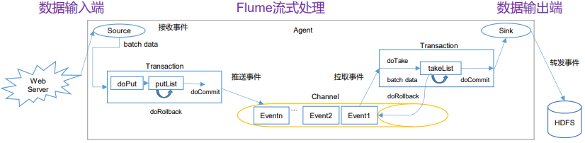
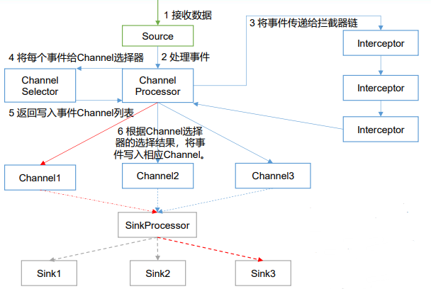
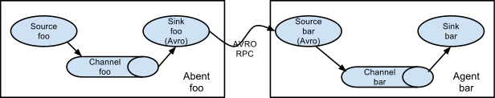
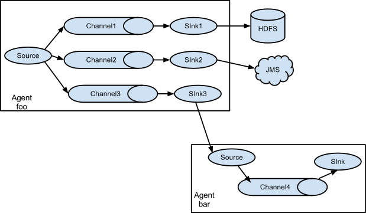
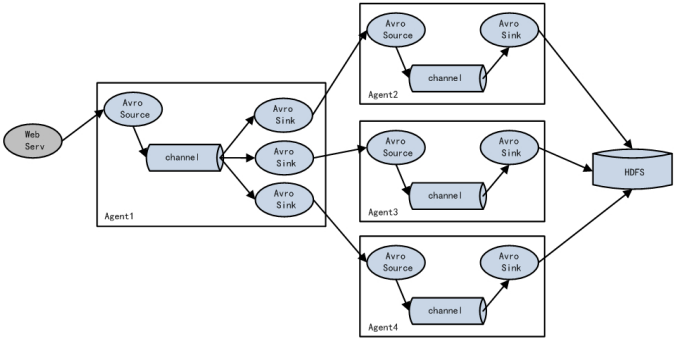
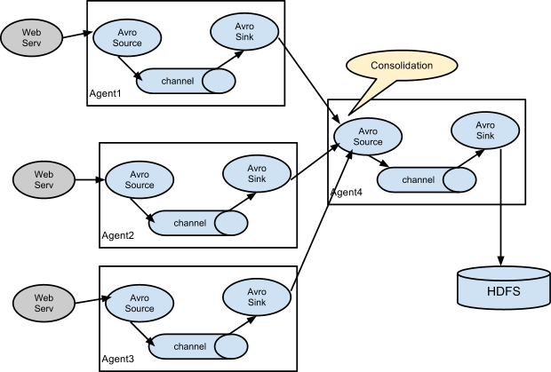

# 1. Flume 入门

## 1.1 Flume 基础架构

Flume 是 Cloudera 提供的一个高可用的，高可靠的，分布式的**海量日志采集、聚合和传输的系统**，它最主要的作用是，**实时读取**服务器本地磁盘的数据，将数据写入到 HDFS。

* **Agent**：Agent 是一个 **JVM 进程**，它以事件的形式将数据从源头送至目的地，它主要由三个部分组成 Source、Channel、Sink。
* **Source**：Source 负责**接收数据**到 Flume Agent，它可以处理各种类型、各种格式的日志数据，包括 avro、thrift、exec、jms、spooling directory、netcat、taildir、sequence generator、syslog、http、legacy。
* **Sink**：Sink 不断**轮询 Channel 中的事件**，批量移除它们，并将这些事件批量写入存储或索引系统、或发送到另一个 Flume Agent，目的地包括 hdfs、logger、avro、thrift、ipc、file、HBase、solr、自定义。
* **Channel**：Channel 是**位于 Source 和 Sink 之间的缓冲区**，因此，它允许 Source 和 Sink 运作在不同的速率上。Channel 是**线程安全**的，可以同时处理几个 Source 的写入操作和几个 Sink 的读取操作。**Flume 自带两种 Channel：Memory Channel 和 File Channel**，Memory Channel 是内存中的队列，它在不需要关心数据丢失的情景下适用；File Channel 将所有事件写到磁盘。因此在程序关闭或机器宕机时不会丢失数据。
* **Event**：Flume 数据传输的基本单元，以 Event 的形式将数据从源头送至目的地。 **Event 由 Header 和 Body 两部分组成**，Header 用来存放该 Event 的一些属性，形式为 KV 结构， Body 用来存放该条数据，形式为字节数组。


## 1.2 Flume 安装

1. **解压缩文件**

   * 上传 Flume 安装包到 hadoop102 的 `/opt/software/` 目录下
   * 解压 Flume 到 `/opt/module/`目录，并重命名为 flume：`tar -xzvf apache-flume-1.9.0-bin.tar.gz -C /opt/module/`

2. **配置相关环境**

   * 安装 Java 和 Hadoop，并配置相关环境变量

   * **删除 $FLUME_HOME/lib 目录下的 guava-11.0.2.jar 以兼容 Hadoop**，该 jar 包是由谷歌开发的工具包，由于 Flume 需要对接 Hadoop，若框架之间使用的版本不一致，则会导致兼容性问题，删除后自动通过环境变量使用 Hadoop 的 guava 包，同理，Hive 安装过程也需要删除该 jar 包：`rm lib/guava-11.0.2.jar`


## 1.3 Flume 案例

### 1.3.1 监控端口数据

```shell
# 需求：使用Flume监听一个端口，收集该端口数据，并打印到控制台
# 1.安装netcat工具
[maomao@hadoop102 flume]$ sudo yum -y install nc
# 2.创建job目录，并在该目录下创建Flume Agent配置文件，文件内容如下
[maomao@hadoop102 flume]$ mkdir job
[maomao@hadoop102 flume]$ vim job/netcat-flume-logger.conf

# 3.开启Flume监听端口：-n表示agent名称为a1，-c表示使用conf/目录下的配置，-f表示启动读取的配置文件，-D表示设置Java系统的属性值，将控制台日志级别设置为info
[maomao@hadoop102 flume]$ bin/flume-ng agent -n a1 -c conf/ -f job/netcat-flume-logger.conf  -Dflume.root.logger=INFO,console

# 4.新开一个SSH窗口，使用netcat工具向本机的44444端口发送内容
[maomao@hadoop102 flume]$ nc localhost 44444
maomao
# 5.在Flume监听页面观察接收数据情况
2022-09-17 23:50:06,720 (SinkRunner-PollingRunner-DefaultSinkProcessor) [INFO - org.apache.flume.sink.LoggerSink.process(LoggerSink.java:95)] Event: { headers:{} body: 6D 61 6F 6D 61 6F                               maomao }
```

```shell
# 命名Flume Agent组件：a1表示agent名称（在同一台机器上不允许同时启动同名的flume agent），r1表示source命令，k1表示sink名称，c1表示channel名称
# 复数表示可配置多个，单数表示只能配置一个，下同
a1.sources = r1
a1.sinks = k1
a1.channels = c1

# 配置source：type表示输入源类型，bind表示监听的主机，port表示监听的端口
a1.sources.r1.type = netcat
a1.sources.r1.bind = localhost
a1.sources.r1.port = 44444

# 配置sink：type表示输出类型
a1.sinks.k1.type = logger

# 配置channel：type表示channel类型，capacity表示事件event容量，transactionCapacity表示事务容量
a1.channels.c1.type = memory
a1.channels.c1.capacity = 1000
a1.channels.c1.transactionCapacity = 100

# 将source和sink绑定到channel
a1.sources.r1.channels = c1
a1.sinks.k1.channel = c1
```


### 1.3.2 监控单个追加文件

```shell
# 需求：实时监控Hive日志，并上传到HDFS日志
# 1.在job/目录下创建Flume Agent配置文件，文件内容如下
[maomao@hadoop102 flume]$ vim job/file-flume-hdfs.conf
# 2.运行Flume
[maomao@hadoop102 flume]$ bin/flume-ng agent -n a1 -c conf/ -f job/file-flume-hdfs.conf
# 3.启动Hadoop和Hive，并操作Hive产生日志，然后在HDFS上查看文件
```

```shell
# 命名Flume Agent组件
a1.sources = r1
a1.sinks = k1
a1.channels = c1

# 配置source：tail -F等同于tail -f --retry，根据文件名进行追踪，并保持重试，即该文件被删除或改名后，如果再次创建相同的文件名，会继续追踪
a1.sources.r1.type = exec
a1.sources.r1.command = tail -F /opt/module/hive/logs/hive.log

# 配置sink
a1.sinks.k1.type = hdfs
a1.sinks.k1.hdfs.path = hdfs://hadoop102:9870/flume/%Y%m%d/%H
# 上传文件的前缀
a1.sinks.k1.hdfs.filePrefix = logs-
# 是否按照时间滚动文件夹
a1.sinks.k1.hdfs.round = true
# 多少时间单位创建一个新的文件夹
a1.sinks.k1.hdfs.roundValue = 1
# 重新定义时间单位
a1.sinks.k1.hdfs.roundUnit = hour
# 是否使用本地时间戳：对于所有与时间相关的转义序列，Event Header中必须存在timestamp的key，除非将hdfs.useLocalTimeStamp设置为true，此方法会使用TimestampInterceptor自动添加timestamp
a1.sinks.k1.hdfs.useLocalTimeStamp = true
# 积攒多少个Event才flush到HDFS一次
a1.sinks.k1.hdfs.batchSize = 100
# 设置文件类型，可支持压缩
a1.sinks.k1.hdfs.fileType = DataStream
# 多久生成一个新的文件
a1.sinks.k1.hdfs.rollInterval = 60
# 设置每个文件的滚动大小
a1.sinks.k1.hdfs.rollSize = 134217700
# 文件的滚动与Event数量无关
a1.sinks.k1.hdfs.rollCount = 0

# 配置channel
a1.channels.c1.type = memory
a1.channels.c1.capacity = 1000
a1.channels.c1.transactionCapacity = 100

# 将source和sink绑定到channel
a1.sources.r1.channels = c1
a1.sinks.k1.channel = c1
```


### 1.3.3 监控目录下多个新文件

```shell
# 需求：使用Flume监听整个目录的文件，并上传至 HDFS
# 1.在job/目录下创建Flume Agent配置文件，文件内容如下
[maomao@hadoop102 flume]$ vim job/dir-flume-hdfs.conf
# 2.启动Hadoop，并运行Flume
[maomao@hadoop102 flume]$ bin/flume-ng agent -n a3 -c conf/ -f job/dir-flume-hdfs.conf

# 3.创建upload目录，并向该目录添加文件，然后在HDFS上查看文件
[maomao@hadoop102 flume]$ mkdir upload
[maomao@hadoop102 flume]$ vim maomao.txt
[maomao@hadoop102 flume]$ mv maomao.txt upload/
[maomao@hadoop102 flume]$ ls upload/
maomao.txt.COMPLETED
```

```shell
# 命名Flume Agent组件
a3.sources = r3
a3.sinks = k3
a3.channels = c3

# 配置source
a3.sources.r3.type = spooldir
a3.sources.r3.spoolDir = /opt/module/flume/upload
a3.sources.r3.fileSuffix = .COMPLETED
a3.sources.r3.fileHeader = true
# 忽略所有以.tmp 结尾的文件，不上传
a3.sources.r3.ignorePattern = ([^ ]*\.tmp)

# 配置sink
a3.sinks.k3.type = hdfs
a3.sinks.k3.hdfs.path = hdfs://hadoop102:8020/flume/upload/%Y%m%d/%H
a3.sinks.k3.hdfs.filePrefix = upload-
a3.sinks.k3.hdfs.round = true
a3.sinks.k3.hdfs.roundValue = 1
a3.sinks.k3.hdfs.roundUnit = hour
a3.sinks.k3.hdfs.useLocalTimeStamp = true
a3.sinks.k3.hdfs.batchSize = 100
a3.sinks.k3.hdfs.fileType = DataStream
a3.sinks.k3.hdfs.rollInterval = 60
a3.sinks.k3.hdfs.rollSize = 134217700
a3.sinks.k3.hdfs.rollCount = 0

# 配置channel
a3.channels.c3.type = memory
a3.channels.c3.capacity = 1000
a3.channels.c3.transactionCapacity = 100

# 将source和sink绑定到channel
a3.sources.r3.channels = c3
a3.sinks.k3.channel = c3
```


### 1.3.4 监控目录下多个追加文件

Exec source 适用于监控一个实时追加的文件，不能实现断点续传；Spooldir Source 适合用于同步新文件，但不适合对实时追加日志的文件进行监听并同步；而 Taildir Source 适合用于监听多个实时追加的文件，并且由于 Taildir Source 维护了一个 json 格式的 position File，会定期地往 position File 中更新每个文件读取到的最新的位置，因此能够实现断点续传。

```shell
# 需求：使用Flume监听多个目录的实时追加文件，并上传至HDFS 
# 1.在job/目录下创建Flume Agent配置文件，文件内容如下
[maomao@hadoop102 flume]$ vim job/taildir-flume-hdfs.conf
# 2.启动Hadoop，并运行Flume
[maomao@hadoop102 flume]$ bin/flume-ng agent -n a3 -c conf/ -f job/taildir-flume-hdfs.conf

# 3.创建files1、files2目录，并向目录下文件追加内容，然后在HDFS上查看文件
[maomao@hadoop102 flume]$ mkdir files1
[maomao@hadoop102 flume]$ mkdir files2
[maomao@hadoop102 flume]$ echo maomao >> files1/file.txt
[maomao@hadoop102 flume]$ echo maomao >> files2/log.txt
# 由于Taildir Source根据inode和文件绝对路径判断是否同一文件，因此将文件改名后，Flume也会再次上传
# 实际生产中，log4j日志框架会将原有日志文件改名添加日期，然后重新生成一个新文件，此时就会出现重复上传，解决方法是使用其它日志框架，如logback，它会直接生成带有日期的日志文件；或者修改Flume源码，使其仅根据inode判断
[maomao@hadoop102 flume]$ cat tail_dir.json 
[{"inode":34097933,"pos":7,"file":"/opt/module/flume/files1/file.txt"},{"inode":68861436,"pos":7,"file":"/opt/module/flume/files2/log.txt"}]
```

```shell
# 命名Flume Agent组件
a3.sources = r3
a3.sinks = k3
a3.channels = c3

# 配置source
a3.sources.r3.type = TAILDIR
a3.sources.r3.positionFile = /opt/module/flume/tail_dir.json
a3.sources.r3.filegroups = f1 f2
a3.sources.r3.filegroups.f1 = /opt/module/flume/files1/.*file.*
a3.sources.r3.filegroups.f2 = /opt/module/flume/files2/.*log.*

# 配置sink
a3.sinks.k3.type = hdfs
a3.sinks.k3.hdfs.path = hdfs://hadoop102:8020/flume/upload2/%Y%m%d/%H
a3.sinks.k3.hdfs.filePrefix = upload-
a3.sinks.k3.hdfs.round = true
a3.sinks.k3.hdfs.roundValue = 1
a3.sinks.k3.hdfs.roundUnit = hour
a3.sinks.k3.hdfs.useLocalTimeStamp = true
a3.sinks.k3.hdfs.batchSize = 100
a3.sinks.k3.hdfs.fileType = DataStream
a3.sinks.k3.hdfs.rollInterval = 60
a3.sinks.k3.hdfs.rollSize = 134217700
a3.sinks.k3.hdfs.rollCount = 0

# 配置channel
a3.channels.c3.type = memory
a3.channels.c3.capacity = 1000
a3.channels.c3.transactionCapacity = 100

# 将source和sink绑定到channel
a3.sources.r3.channels = c3
a3.sinks.k3.channel = c3
```


# 2. Flume 进阶

## 2.1 Flume 事务

1. **Put 事务流程**
   * doPut：将批数据先写入临时缓冲区 putList
   * doCommit：检查 channel 内存队列是否足够合并
   * doRollback：channel 内存队列空间不足，回滚数据
2. **Take 事务流程**
   * doTake：将数据取到临时缓冲区 takeList，并将数据发送到 HDFS
   * doCommit：如果数据全部发送成功，则清除临时缓冲区 takeList
   * doRollback：数据发送过程中如果出现异常，将临时缓冲区 takeList 中的数据归还给 channel 内存队列




## 2.2 Flume Agent 原理

1. **ChannelSelector**：作用就是选出 Event 将要被发往哪个 Channel，共有两种类型， 分别是 Replicating（复制，默认类型）和 Multiplexing（多路复用）。 其中 ReplicatingSelector 会将同一个 Event 发往所有的 Channel，而 Multiplexing 会根据相应的原则，将不同的 Event 发往不同的 Channel。
2. **SinkProcessor**：共有三种类型，分别是 DefaultSinkProcessor（对应的是单个的Sink） 、LoadBalancingSinkProcessor（对应的是 Sink Group，可以实现负 载均衡） 和 FailoverSinkProcessor （对应的是 Sink Group，可以实现故障转移）。




## 2.3 Flume 拓扑结构

### 2.3.1 简单串联

这种模式是将多个 Flume 顺序连接起来，从最初的 source 开始到最终 sink 传送的目的存储系统。此模式不建议桥接过多的 Flume 数量， Flume 数量过多不仅会影响传输速率，而且一旦传输过程中某个节点 Flume 宕机，会影响整个传输系统。




### 2.3.2 复制和多路复用

Flume 支持将事件流向一个或者多个目的地，这种模式可以将相同数据复制到多个 channel 中，或者将不同数据分发到不同的 channel 中，sink 可以选择传送到不同的目的地。



```shell
# 需求：使用Flume-1监控文件变动，Flume-1将变动内容传递 Flume-2，Flume-2负责存储到HDFS。同时Flume-1将变动内容传递给Flume-3，Flume-3负责输出到LocalFileSystem。
[maomao@hadoop102 flume]$ mkdir -p job/group1
[maomao@hadoop102 flume]$ mkdir -p datas/flume3
# 1.配置一个接收日志文件的source、两个channel、两个sink
[maomao@hadoop102 flume]$ vim job/group1/file-flume-flume.conf
[maomao@hadoop102 flume]$ vim job/group1/flume-flume-hdfs.conf
[maomao@hadoop102 flume]$ vim job/group1/flume-flume-dir.conf
# 2.分别启动对应的Flume进程，注意启动顺序
[maomao@hadoop102 flume]$ bin/flume-ng agent --conf conf/ --name a3 --conf-file job/group1/flume-flume-dir.conf
[maomao@hadoop102 flume]$ bin/flume-ng agent --conf conf/ --name a2 --conf-file job/group1/flume-flume-hdfs.conf
[maomao@hadoop102 flume]$ bin/flume-ng agent --conf conf/ --name a1 --conf-file job/group1/file-flume-flume.conf
# 3.启动Hadoop和Hive，并操作Hive产生日志，然后在HDFS和本地datas/flume3目录上查看文件
```

```shell
# 命名Flume Agent组件
a1.sources = r1
a1.sinks = k1 k2
a1.channels = c1 c2
# 将数据流复制给所有channel
a1.sources.r1.selector.type = replicating

# 配置source
a1.sources.r1.type = exec
a1.sources.r1.command = tail -F /opt/module/hive/logs/hive.log
a1.sources.r1.shell = /bin/bash -c

# 配置sink
# sink端的avro是一个数据发送者
a1.sinks.k1.type = avro
a1.sinks.k1.hostname = hadoop102
a1.sinks.k1.port = 4141
a1.sinks.k2.type = avro
a1.sinks.k2.hostname = hadoop102
a1.sinks.k2.port = 4142

# 配置channel
a1.channels.c1.type = memory
a1.channels.c1.capacity = 1000
a1.channels.c1.transactionCapacity = 100
a1.channels.c2.type = memory
a1.channels.c2.capacity = 1000
a1.channels.c2.transactionCapacity = 100

# 将source和sink绑定到channel
a1.sources.r1.channels = c1 c2
a1.sinks.k1.channel = c1
a1.sinks.k2.channel = c2
```

```shell
# 命名Flume Agent组件
a2.sources = r1
a2.sinks = k1
a2.channels = c1

# 配置source
# source端的avro是一个数据接收服务
a2.sources.r1.type = avro
a2.sources.r1.bind = hadoop102
a2.sources.r1.port = 4141

# 配置sink
a2.sinks.k1.type = hdfs
a2.sinks.k1.hdfs.path = hdfs://hadoop102:8020/flume2/%Y%m%d/%H
a2.sinks.k1.hdfs.filePrefix = flume2-
a2.sinks.k1.hdfs.round = true
a2.sinks.k1.hdfs.roundValue = 1
a2.sinks.k1.hdfs.roundUnit = hour
a2.sinks.k1.hdfs.useLocalTimeStamp = true
a2.sinks.k1.hdfs.batchSize = 100
a2.sinks.k1.hdfs.fileType = DataStream
a2.sinks.k1.hdfs.rollInterval = 30
a2.sinks.k1.hdfs.rollSize = 134217700
a2.sinks.k1.hdfs.rollCount = 0

# 配置channel
a2.channels.c1.type = memory
a2.channels.c1.capacity = 1000
a2.channels.c1.transactionCapacity = 100

# 将source和sink绑定到channel
a2.sources.r1.channels = c1
a2.sinks.k1.channel = c1
```

```shell
# 命名Flume Agent组件
a3.sources = r1
a3.sinks = k1
a3.channels = c1

# 配置source
a3.sources.r1.type = avro
a3.sources.r1.bind = hadoop102
a3.sources.r1.port = 4142

# 配置sink
a3.sinks.k1.type = file_roll
# 输出的本地目录必须是已经存在的目录，如果该目录不存在，并不会创建新的目录
a3.sinks.k1.sink.directory = /opt/module/flume/datas/flume3

# 配置channel
a3.channels.c1.type = memory
a3.channels.c1.capacity = 1000
a3.channels.c1.transactionCapacity = 100

# 将source和sink绑定到channel
a3.sources.r1.channels = c1
a3.sinks.k1.channel = c1
```


### 2.3.3 负载均衡和故障转移

Flume 支持使用将多个 sink 逻辑上分到一个 sink 组，sink 组配合不同的 SinkProcessor 可以实现负载均衡和错误恢复的功能。



```shell
# 需求：使用Flume1监控一个端口，其sink组中的sink分别对接Flume2和Flume3，采用FailoverSinkProcessor，实现故障转移的功能
[maomao@hadoop102 flume]$ mkdir -p job/group2
# 1.配置一个netcat source、一个channel、两个sink（一个sink group）
[maomao@hadoop102 flume]$ vim job/group2/netcat-flume-flume.conf
[maomao@hadoop102 flume]$ vim job/group2/flume-flume-console1.conf
[maomao@hadoop102 flume]$ vim job/group2/flume-flume-console2.conf
# 2.分别启动对应的Flume进程，注意启动顺序
[maomao@hadoop102 flume]$ bin/flume-ng agent --conf conf/ --name a3 --conf-file job/group2/flume-flume-console2.conf -Dflume.root.logger=INFO,console
[maomao@hadoop102 flume]$ bin/flume-ng agent --conf conf/ --name a2 --conf-file job/group2/flume-flume-console1.conf -Dflume.root.logger=INFO,console
[maomao@hadoop102 flume]$ bin/flume-ng agent --conf conf/ --name a1 --conf-file job/group2/netcat-flume-flume.conf
# 3.使用netcat工具向本机的44444端口发送内容，查看Flume2及Flume3的控制台打印情况
[maomao@hadoop102 flume]$ nc localhost 44444
# 4.将Flume2停掉，观察Flume3的控制台打印情况
# 5.注释掉netcat-flume-flume.conf故障转移，打开负载均衡，并重启服务，再次观察控制台打印情况
```

```shell
# 命名Flume Agent组件
a1.sources = r1
a1.channels = c1
a1.sinkgroups = g1
a1.sinks = k1 k2

# 配置source
a1.sources.r1.type = netcat
a1.sources.r1.bind = localhost
a1.sources.r1.port = 44444

# 配置sink group（故障转移）
a1.sinkgroups.g1.processor.type = failover
a1.sinkgroups.g1.processor.priority.k1 = 5
a1.sinkgroups.g1.processor.priority.k2 = 10
a1.sinkgroups.g1.processor.maxpenalty = 10000

# 配置sink group（负载均衡）：由于数据是由sink主动拉取，而不是channel推送，因此可能出现Flume2拉取时恰好没有数据，极端情况下可能导致数据一直发送到Flume3
# a1.sinkgroups.g1.processor.type = load_balance
# a1.sinkgroups.g1.processor.backoff = true

# 配置sink
a1.sinks.k1.type = avro
a1.sinks.k1.hostname = hadoop102
a1.sinks.k1.port = 4141
a1.sinks.k2.type = avro
a1.sinks.k2.hostname = hadoop102
a1.sinks.k2.port = 4142

# 配置channel
a1.channels.c1.type = memory
a1.channels.c1.capacity = 1000
a1.channels.c1.transactionCapacity = 100

# 将source和sink绑定到channel
a1.sources.r1.channels = c1
a1.sinkgroups.g1.sinks = k1 k2
a1.sinks.k1.channel = c1
a1.sinks.k2.channel = c1
```

```shell
# 命名Flume Agent组件
a2.sources = r1
a2.sinks = k1
a2.channels = c1

# 配置source
a2.sources.r1.type = avro
a2.sources.r1.bind = hadoop102
a2.sources.r1.port = 4141

# 配置sink
a2.sinks.k1.type = logger

# 配置channel
a2.channels.c1.type = memory
a2.channels.c1.capacity = 1000
a2.channels.c1.transactionCapacity = 100

# 将source和sink绑定到channel
a2.sources.r1.channels = c1
a2.sinks.k1.channel = c1
```

```shell
# 命名Flume Agent组件
a3.sources = r1
a3.sinks = k1
a3.channels = c1

# 配置source
a3.sources.r1.type = avro
a3.sources.r1.bind = hadoop102
a3.sources.r1.port = 4142

# 配置sink
a3.sinks.k1.type = logger

# 配置channel
a3.channels.c1.type = memory
a3.channels.c1.capacity = 1000
a3.channels.c1.transactionCapacity = 100

# 将source和sink绑定到channel
a3.sources.r1.channels = c1
a3.sinks.k1.channel = c1
```


### 2.3.4 聚合

这种模式最常见的、也非常实用，日常 web 应用通常分布在成百上千个服务器，产生的日志处理起来非常麻烦。用这种组合方式能很好的解决这一问题，每台服务器部署一个 Flume 采集日志，传送到一个集中收集日志的 Flume，再由此 Flume 上传到 HDFS、Hive、HBase 等，进行日志分析。



```shell
# 需求：hadoop102上的Flume-1监控某个文件，hadoop103上的Flume-2监控某端口的数据流，Flume-1与Flume-2将数据发送给hadoop104上的Flume-3，Flume-3将最终数据打印到控制台
[maomao@hadoop102 flume]$ mkdir -p job/group3
[maomao@hadoop102 flume]$ xsync ./
# 1.分别在hadoop102、hadoop103、hadoop104上编辑配置文件
[maomao@hadoop102 flume]$ vim job/group3/logger-flume1-flume.conf
[maomao@hadoop103 flume]$ vim job/group3/netcat-flume2-flume.conf
[maomao@hadoop104 flume]$ vim job/group3/flume-flume3-logger.conf
# 2.分别启动hadoop102、hadoop103、hadoop104对应的Flume进程，注意启动顺序
[maomao@hadoop104 flume]$ bin/flume-ng agent --conf conf/ --name a3 --conf-file job/group3/flume-flume3-logger.conf -Dflume.root.logger=INFO,console
[maomao@hadoop103 flume]$ bin/flume-ng agent --conf conf/ --name a2 --conf-file job/group3/netcat-flume2-flume.conf
[maomao@hadoop102 flume]$ bin/flume-ng agent --conf conf/ --name a1 --conf-file job/group3/logger-flume1-flume.conf
# 3.在hadoop103上向/tmp/group.log追加内容，在hadoop102上向44444端口发送数据，观察hadoop104控制台打印情况
[maomao@hadoop102 tmp]$ echo maomao > group.log
[maomao@hadoop103 flume]$ telnet hadoop103 44444
```

```shell
# 命名Flume Agent组件
a1.sources = r1
a1.sinks = k1
a1.channels = c1

# 配置source
a1.sources.r1.type = exec
a1.sources.r1.command = tail -F /tmp/group.log
a1.sources.r1.shell = /bin/bash -c

# 配置sink
a1.sinks.k1.type = avro
a1.sinks.k1.hostname = hadoop104
a1.sinks.k1.port = 4141

# 配置channel
a1.channels.c1.type = memory
a1.channels.c1.capacity = 1000
a1.channels.c1.transactionCapacity = 100

# 将source和sink绑定到channel
a1.sources.r1.channels = c1
a1.sinks.k1.channel = c1
```

```shell
# 命名Flume Agent组件
a2.sources = r1
a2.sinks = k1
a2.channels = c1

# 配置source
a2.sources.r1.type = netcat
a2.sources.r1.bind = hadoop103
a2.sources.r1.port = 44444

# 配置sink
a2.sinks.k1.type = avro
a2.sinks.k1.hostname = hadoop104
a2.sinks.k1.port = 4141

# 配置channel
a2.channels.c1.type = memory
a2.channels.c1.capacity = 1000
a2.channels.c1.transactionCapacity = 100

# 将source和sink绑定到channel
a2.sources.r1.channels = c1
a2.sinks.k1.channel = c1
```

```shell
# 命名Flume Agent组件
a3.sources = r1
a3.sinks = k1
a3.channels = c1

# 配置source
a3.sources.r1.type = avro
a3.sources.r1.bind = hadoop104
a3.sources.r1.port = 4141

# 配置sink
a3.sinks.k1.type = logger

# 配置channel
a3.channels.c1.type = memory
a3.channels.c1.capacity = 1000
a3.channels.c1.transactionCapacity = 100

# 将source和sink绑定到channel
a3.sources.r1.channels = c1
a3.sinks.k1.channel = c1
```


## 2.4 自定义组件

### 2.4.1 自定义 Interceptor

在实际的开发中，一台服务器产生的日志类型可能有很多种，**不同类型的日志可能需要发送到不同的分析系统**。此时会用到 Flume 拓扑结构中的 Multiplexing 结构，Multiplexing 的原理是：**根据 Event 中 Header 的某个 key 的值，将不同的 Event 发送到不同的 Channel 中**，所以我们需要自定义一个 Interceptor，为不同类型的 Event 的 Header 中的 key 赋予不同的值。 

```xml
<dependency>
    <groupId>org.apache.flume</groupId>
    <artifactId>flume-ng-core</artifactId>
    <version>1.9.0</version>
</dependency>
```

```java
public class TypeInterceptor implements Interceptor {
    private List<Event> addHeaderEvents;

    @Override
    public void initialize() {
        addHeaderEvents = new ArrayList<>();
    }

    // 单个事件处理方法
    @Override
    public Event intercept(Event event) {
        Map<String, String> headers = event.getHeaders();
        String body = new String(event.getBody());
        // 根据body中是否包含maomao添加不同的头信息
        if (body.contains("maomao")) {
            headers.put("type", "maomao");
        } else {
            headers.put("type", "other");
        }
        return event;
    }

    // 批量事件处理方法
    @Override
    public List<Event> intercept(List<Event> events) {
        addHeaderEvents.clear();
        for (Event event : events) {
            addHeaderEvents.add(intercept(event));
        }
        return addHeaderEvents;
    }

    @Override
    public void close() {
    }

    // 建造者模式
    public static class Builder implements Interceptor.Builder {
        @Override
        public Interceptor build() {
            return new TypeInterceptor();
        }

        @Override
        public void configure(Context context) {
        }
    }
}
```

```shell
# 需求：以端口数据模拟日志，以是否包含“maomao”模拟不同类型的日志，并将其发往不同的分析系统
[maomao@hadoop102 flume]$ mkdir -p job/group4
[maomao@hadoop102 flume]$ xsync ./
# 1.将自定义的TypeInterceptor打包后，上传至/opt/module/flume/lib目录

# 2.分别在hadoop102、hadoop103、hadoop104上编辑配置文件
# netcat-flume1-flume.conf内容如下，其余两个文件内容同2.3.3，修改对应绑定的域名即可
[maomao@hadoop102 flume]$ vim job/group4/netcat-flume1-flume.conf
[maomao@hadoop103 flume]$ vim job/group4/flume-flume2-logger.conf
[maomao@hadoop104 flume]$ vim job/group4/flume-flume3-logger.conf
# 2.分别启动hadoop102、hadoop103、hadoop104对应的Flume进程，注意启动顺序
[maomao@hadoop104 flume]$ bin/flume-ng agent --conf conf/ --name a3 --conf-file job/group4/flume-flume3-logger.conf -Dflume.root.logger=INFO,console
[maomao@hadoop103 flume]$ bin/flume-ng agent --conf conf/ --name a2 --conf-file job/group4/flume-flume2-logger.conf -Dflume.root.logger=INFO,console
[maomao@hadoop102 flume]$ bin/flume-ng agent --conf conf/ --name a1 --conf-file job/group4/netcat-flume1-flume.conf
# 3.在hadoop102上使用netcat工具向44444端口发送数据，观察hadoop103、hadoop104控制台情况
[maomao@hadoop102 flume]$ nc localhost 44444
maomaoabc
flume
```

```shell
# 命名Flume Agent组件
a1.sources = r1
a1.sinks = k1 k2
a1.channels = c1 c2

# 配置source
a1.sources.r1.type = netcat
a1.sources.r1.bind = localhost
a1.sources.r1.port = 44444
a1.sources.r1.interceptors = i1
a1.sources.r1.interceptors.i1.type = com.maomao.example.TypeInterceptor$Builder
a1.sources.r1.selector.type = multiplexing
# 此处type对应头信息中的key，maomao和other分别对应value
a1.sources.r1.selector.header = type
a1.sources.r1.selector.mapping.maomao = c1
a1.sources.r1.selector.mapping.other = c2

# 配置sink
a1.sinks.k1.type = avro
a1.sinks.k1.hostname = hadoop103
a1.sinks.k1.port = 4141
a1.sinks.k2.type = avro
a1.sinks.k2.hostname = hadoop104
a1.sinks.k2.port = 4142

# 配置channl
a1.channels.c1.type = memory
a1.channels.c1.capacity = 1000
a1.channels.c1.transactionCapacity = 100
a1.channels.c2.type = memory
a1.channels.c2.capacity = 1000
a1.channels.c2.transactionCapacity = 100

# 将source和sink绑定到channel
a1.sources.r1.channels = c1 c2
a1.sinks.k1.channel = c1
a1.sinks.k2.channel = c2
```


### 2.4.2 自定义 Source

官方提供的 source 类型已经很多，但有时并不能满足实际开发当中的需求，此时就需要根据实际需求自定义某些 source。

```java
public class MySource extends AbstractSource implements Configurable, PollableSource {
    private String prefix;
    private String suffix;
    private Long delay;

    // 初始化context，读取配置文件内容
    @Override
    public void configure(Context context) {
        prefix = context.getString("pre", "pre-");
        suffix = context.getString("suf");
        delay = context.getLong("del", 2000L);
    }

    // 获取数据封装成event并写 channel，这个方法将被循环调用
    @Override
    public Status process() throws EventDeliveryException {
        // 循环创建事件信息，传给Channel
        try {
            for (int i = 0; i < 5; i++) {
                Event event = new SimpleEvent();
                event.setHeaders(new HashMap<>());
                event.setBody((prefix + "maomao" + i + suffix).getBytes(StandardCharsets.UTF_8));
                getChannelProcessor().processEvent(event);
            }

            Thread.sleep(delay);
            return Status.READY;
        } catch (Exception e) {
            e.printStackTrace();
            return Status.BACKOFF;
        }
    }

    // backoff退避步长
    @Override
    public long getBackOffSleepIncrement() {
        return 0;
    }

    // backoff退避最长时间
    @Override
    public long getMaxBackOffSleepInterval() {
        return 0;
    }
}
```

```shell
# 需求：使用flume接收数据，并给每条数据添加前缀，输出到控制台，前缀可从flume配置文件中配置
# 1.将自定义的TypeInterceptor打包后，上传至/opt/module/flume/lib目录
# 2.在job/目录下创建Flume Agent配置文件
[maomao@hadoop102 flume]$ vim job/mysource.conf
# 3.运行Flume，观察控制台输出情况，由于Logger Sink默认Event body最大字节数为16，因此可能被截断
[maomao@hadoop102 flume]$ bin/flume-ng agent --conf conf/ --name a1 --conf-file job/mysource.conf -Dflume.root.logger=INFO,console
```

```shell
# 命名Flume Agent组件
a1.sources = r1
a1.sinks = k1
a1.channels = c1

# 配置source
a1.sources.r1.type = com.maomao.example.MySource
a1.sources.r1.pre = hello
a1.sources.r1.suf = world

# 配置sink
a1.sinks.k1.type = logger

# 配置channel
a1.channels.c1.type = memory
a1.channels.c1.capacity = 1000
a1.channels.c1.transactionCapacity = 100

# 将source和sink绑定到channel
a1.sources.r1.channels = c1
a1.sinks.k1.channel = c1
```


### 2.4.3 自定义 Sink

Sink 是完全**事务性的**，在从 Channel 批量删除数据之前，每个 Sink 用 Channel 启动一个事务，批量事件一旦成功写出到存储系统或下一个 Flume Agent，Sink 就利用 Channel 提交事务，事务一旦被提交，该 Channel 从自己的内部缓冲区删除事件。官方提供的 Sink 类型已经很多，但有时并不能满足实际开发当中的需求，此时就需要根据实际需求自定义某些 Sink。

```java
public class MySink extends AbstractSink implements Configurable {
    private String prefix;
    private String suffix;
    private Logger logger = LoggerFactory.getLogger(MySink.class);

     // 初始化context，读取配置文件内容
    @Override
    public void configure(Context context) {
        prefix = context.getString("pre", "pre-");
        suffix = context.getString("suf");
    }

   
    // 从Channel读取获取数据（event），这个方法将被循环调用
    @Override
    public Status process() throws EventDeliveryException {
        // 获取channel，并开启事务
        Channel channel = getChannel();
        Transaction transaction = channel.getTransaction();
        transaction.begin();

        try {
            // 从channel中抓取数据
            Event event = null;
            while (event == null) {
                event = channel.take();
            }
            // 处理数据后，提交事务
            logger.info(prefix + new String(event.getBody()) + suffix);
            transaction.commit();
            return Status.READY;
        } catch (Exception e) {
            transaction.rollback();
            return Status.BACKOFF;
        } finally {
            transaction.close();
        }
    }
}
```

```shell
# 需求：使用Flume接收数据，并在Sink端给每条数据添加前缀和后缀，输出到控制台
# 1.将自定义的TypeInterceptor打包后，上传至/opt/module/flume/lib目录
# 2.在job/目录下创建Flume Agent配置文件
[maomao@hadoop102 flume]$ vim job/mysink.conf
# 3.运行Flume
[maomao@hadoop102 flume]$ bin/flume-ng agent --conf conf/ --name a1 --conf-file job/mysink.conf -Dflume.root.logger=INFO,console
# 4.使用netcat工具向本机的44444端口发送内容
[maomao@hadoop102 flume]$ nc localhost 44444
```

```shell
# 命名Flume Agent组件
a1.sources = r1
a1.sinks = k1
a1.channels = c1

# 配置source
a1.sources.r1.type = netcat
a1.sources.r1.bind = localhost
a1.sources.r1.port = 44444

# 配置sink
a1.sinks.k1.type = com.maomao.example.MySink
#a1.sinks.k1.pre = 
a1.sinks.k1.suf = -bs

# 配置channel
a1.channels.c1.type = memory
a1.channels.c1.capacity = 1000
a1.channels.c1.transactionCapacity = 100

# 将source和sink绑定到channel
a1.sources.r1.channels = c1
a1.sinks.k1.channel = c1
```


# 参考

1. [Flume 官网](https://flume.apache.org/releases/content/1.10.1/FlumeUserGuide.html)
2. [B站 - Flume教程入门](https://www.bilibili.com/video/BV1wf4y1G7EQ/?vd_source=03ee00a529e3c4f9c2d8c6f412586123)

