# 1. HDFS

## 1.1 HDFS 概述

### 1.1.1 体系结构

**HDFS 是一个主/从（Master/Slave）体系结构的分布式系统，HDFS 集群拥有一个 Namenode 和一些 Datanode**，用户可以通过 HDFS 客户端同 Namenode 和 Datanodes 交互以访问文件系统。

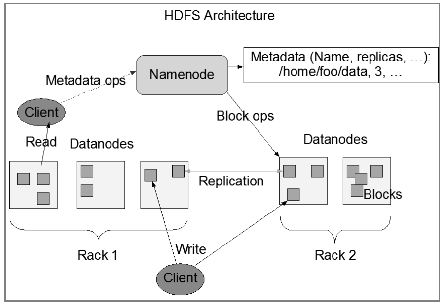

在 HDFS 中，Namenode 是 HDFS 的 Master 节点，负责管理文件系统的命名空间（namespace），以及数据块到具体 Datanode 节点的映射等信息。集群中的 Datanode 一般是一个节点一个，负责管理它所在节点上的存储。从内部看，一个文件其实被分成一个或多个数据块，这些块存储在一组 Datanode 上，Datanode 会以本地文件的形式保存这些数据块以及数据块的校验信息。

用户能够通过 HDFS 客户端发起读写 HDFS 文件的请求，同时还能通过 HDFS 客户端执行文件系统的命名空间操作，比如打开、关闭、重命名文件或目录。Namenode 会响应这些请求，更改命名空间以及数据块的映射信息，然后指导 Datanode 处理文件 HDFS 客户端的读写请求。


### 1.1.2 HDFS 基本概念

1. **数据块（Block）** 

   HDFS 中数据块的概念与大部分 Linux 文件系统（ext2、ext3）的数据块概念相同，HDFS 文件是以数据块的形式存储的，**数据块是 HDFS 文件处理的最小单元**。由于 HDFS 文件往往比较大，同时为了最小化寻址开销，所以 HDFS 数据块也更大，**默认是 128MB**。HDFS 数据块会以文件的形式存储在数据节点的磁盘上。 

   在 HDFS 中，所有文件都会被切分成若干个数据块分布在数据节点上存储。同时由于 HDFS 会将同一个数据块冗余备份保存到不同的数据节点上（一个数据块默认保存 3 份），所以数据块的一个副本丢失了并不会影响这个数据块的访问。

   在 HDFS 的读和写操作中，数据块都是最小单元。在读操作中，HDFS 客户端会首先到名字节点查找 HDFS 文件包含的数据块的位置信息，然后根据数据块的位置信息从数据节点读取数据。而在写操作中，HDFS 客户端也会首先从名字节点申请新的数据块，然后根据新申请数据块的位置信息建立数据流管道写数据。

2. **名字节点（Namenode）** 

   名字节点是 HDFS 主/从结构中的主节点，**管理着文件系统的命名空间（namespace），包括文件系统目录树、文件/目录信息以及文件的数据块索引，这些信息以两个文件的形式永久保存在名字节点的本地磁盘上，即命名空间镜像文件和编辑日志文件**。同时名字节点还**保存着数据块与数据节点的对应关系，这部分数据并不保存在名字节点的本地磁盘上，而是在名字节点启动时动态构建的**。 HDFS 客户端会通过名字节点获取上述信息，之后读写文件数据。 

   **名字节点是 HDFS 中的单一故障点**，如果名字节点丢失元数据或者损坏，文件系统将出现错误，甚至无法使用。为了解决名字节点的单点问题，Hadoop 2.X 版本引入了名字节点高可用性（HA）的支持。在 HA 实现中，同一个 HDFS 集群中会配置两个名字节点：**活动名字节点和备用名字节点**。活动名字节点的内存元数据与备用名字节点是完全同步的，那么在活动名字节点发生故障而停止服务时，备用名字节点可以立即切换为活动状态，而不影响 HDFS 集群的服务。

   名字节点的内存除了保存文件系统的命名空间外，还保存了文件系统中所有数据块与数据节点的对应关系，这意味着**如果集群中文件数量过多时，名字节点的内存将成为限制系统横向扩展的瓶颈**。为了解决这个问题，Hadoop 2.X 版本引入了联邦 HDFS 机制（HDFS Federation）。**联邦 HDFS 机制允许添加名字节点以实现命名空间的扩展，其中每个名字节点都管理文件系统命名空间中的一部分，是一个独立的命名空间卷（namespace volume）**。命名空间卷之间是相互独立的，两两之间并不相互通信，甚至其中一个名字节点失效了也不会影响由其他名字节点维护的命名空间的可用性。例如，一个名字节点可能管理 /user 目录下的所 有文件，而另一个名字节点可能管理 /share 目录下的所有文件，这两个名字节点独立运行，互不影响。

3. **数据节点（Datanode）**

   数据节点是 HDFS 中的从节点，数据节点会根据 HDFS 客户端请求或者 Namenode 调度将新的数据块写入本地存储，或者读出本地存储上保存的数据块。同时，**数据节点会不断地向名字节点发送心跳、数据块汇报以及缓存汇报，名字节点会通过心跳、数据块汇报以及缓存汇报的响应向数据节点发送指令，数据节点会执行这些指令**，例如创建、删除或者复制数据等。

4. **客户端**

   HDFS 提供了多种客户端接口供应用程序以及用户使用，包括命令行接口、浏览器接口以及代码 API 接口。用户通过这些接口可以很方便地使用 HDFS，而不需要考虑 HDFS 的实现细节。 这些 **HDFS 客户端接口的实现都是建立在 DFSClient 类的基础上**，DFSClient 类封装了客户端与 HDFS 其他节点间的复杂交互。

5. **HDFS 通信协议**

   HDFS 作为一个分布式文件系统，它的某些流程是非常复杂的（例如读、写文件等典型流程），常常涉及数据节点、名字节点和客户端三者之间的配合、相互调用才能实现。为了降低节点间代码的耦合性，提高单个节点代码的内聚性，HDFS 将这些节点间的调用抽象成不同的接口。**HDFS 节点间的接口主要有两种类型**：

   * **Hadoop RPC 接口：HDFS 中基于 Hadoop RPC 框架实现的接口**。
   * **流式接口：HDFS 中基于 TCP 或者 HTTP 实现的接口**。


## 1.2 HDFS 通信协议

### 1.2.1 Hadoop RPC 接口

Hadoop RPC 调用使得 HDFS 进程能够像本地调用一样调用另一个进程中的方法，并且可以传递 Java 基本类型或者自定义类作为参数，同时接收返回值。如果远程进程在调用过程中出现异常，本地进程也会收到对应的异常。目前 **Hadoop RPC 调用是基于 Protobuf 实现的，接口主要定义在 org.apache.hadoop.hdfs.protocol 包和 org.apache.hadoop.hdfs.server.protocol 包中**，包括以下几个接口。

1. **ClientProtocol**

   **客户端与名字节点间的接口**，这个接口定义的方法非常多，客户端对文件系统的所有操作都需要通过这个接口。HDFS 文件读操作、HDFS 文件写与追加写操作，以及命名空间的管理操作，这三个部分都可以在  FileSystem 类中找到对应的方法，这些方法都是用来支持 Hadoop 文件系统实现的。对于系统问题与管理相关的操作，则是由 DFSAdmin 这个工具类发起的，其中的方法是用于支持管理员配置和管理 HDFS 的。而快照和缓存则都是 Hadoop2.X 中引入的新特性， ClientProtocol 中也有对应的方法用于支持这两个新特性。

   * **读数据相关方法**

     ```java
     /* 客户端调用该方法获取 HDFS 文件指定范围内所有数据块的位置信息，然后客户端会根据这些位置信息从数据节点读取数据块。这个方法的参数是 HDFS 文件的文件名以及读取范围，返回值是文件指定范围内所有数据块的文件名以及它们的位置信息，使用 LocatedBlocks 对象封装。每个数据块的位置信息指的是存储这个数据块副本的所有 Datanode 的信息，这些 Datanode 会以与当前客户端的距离远近排序。 */
     LocatedBlocks getBlockLocations(String src, long offset, long length)
           throws IOException;
     
     /* 客户端调用该方法向 Namenode 汇报错误的数据块。当客户端从数据节点读取数据块且发现数据块的校验和并不正确时，就会调用该方法向 Namenode 汇报这个错误的数据块信息。 */
     void reportBadBlocks(LocatedBlock[] blocks) throws IOException;
     ```

   * **写/追加写数据相关方法**

     ```java
     /* 用于在 HDFS 的文件系统目录树中创建一个新的空文件，创建的路径由 src 参数指定。这个空文件创建后对于其他的客户端是“可读”的，但是这些客户端不能删除、重命名或者移动这个文件，直到这个文件被关闭或者租约过期。客户端写一个新的文件时，会首先调用 create()方法在文件系统目录树中创建一个空文件，然后调用 addBlock()方法获取存储文件数据的数据块的位置信息，最后客户端就可以根据位置信息建立数据流管道，向数据节点写入数据了。 */
     HdfsFileStatus create(String src, FsPermission masked,
           String clientName, EnumSetWritable<CreateFlag> flag,
           boolean createParent, short replication, long blockSize,
           CryptoProtocolVersion[] supportedVersions, String ecPolicyName,
           String storagePolicy) throws IOException;
     
     /* 用于打开一个已有的文件，如果这个文件的最后一个数据块没有写满，则返回这个数据块的位置信息（使用 LocatedBlock 对象封装）；如果这个文件的最后一个数据块正好写满，则创建一个新的数据块并添加到这个文件中，然后返回这个新添加的数据块的位置信息。客户端追加写一个已有文件时，会先调用 append()方法获取最后一个可写数据块的位置信息，然后建立数据流管道，并向数据节点写入追加的数据。如果客户端将这个数据块写
     满，与 create()方法一样，客户端会调用 addBlock()方法获取新的数据块。 */
     LastBlockWithStatus append(String src, String clientName,
           EnumSetWritable<CreateFlag> flag) throws IOException;
     
     /* 客户端调用 addBlock()方法向指定文件添加一个新的数据块，并获取存储这个数据块副本的所有数据节点的位置信息。要特别注意的是，调用 addBlock()方法时还要传入上一个数据块的引用。Namenode 在分配新的数据块时，会顺便提交上一个数据块，这里 previous 参数就是上一个数据块的引用。excludeNodes 参数则是数据节点的黑名单，保存了客户端无法连接的一些数据节点，建议 Namenode 在分配保存数据块副本的数据节点时不要考虑这些节点。favoredNodes 参数则是客户端所希望的保存数据块副本的数据节点的列表。客户端调用 addBlock()方法获取新的数据块的位置信息后，会建立到这些数据节点的数据流管道，并通过数据流管道将数据写入数据节点。 */
     LocatedBlock addBlock(String src, String clientName,
           ExtendedBlock previous, DatanodeInfo[] excludeNodes, long fileId,
           String[] favoredNodes, EnumSet<AddBlockFlag> addBlockFlags)
           throws IOException;
     
     /* 当客户端完成了整个文件的写入操作后，会调用 complete()方法通知 Namenode。这个操作会提交新写入 HDFS 文件的所有数据块，当这些数据块的副本数量满足系统配置的最小副本系数（默认值为 1），也就是该文件的所有数据块至少有一个有效副本时，complete()方法会返回 true，这时 Namenode 中文件的状态也会从构建中状态转换为正常状态；否则，complete()会返回 false，客户端就需要重复调用 complete()操作，直至该方法返回 true。 */
     boolean complete(String src, String clientName,
                               ExtendedBlock last, long fileId);
       
     /* 客户端调用该方法放弃一个新申请的数据块。考虑下面这种情况：当客户端获取了一个新申请的数据块，发现无法建立到存储这个数据块副本的某些数据节点的连接时，会调用 abandonBlock()方法通知名字节点放弃这个数据块，之后客户端会再次调用 addBlock()方法获取新的数据块，并在传入参数时将无法连接的数据节点放入 excludeNodes 参数列表中，以避免 Namenode 将数据块的副本分配到该节点上，造成客户端再次无法连接这个节点的情况。 */
     /* 如果客户端已经成功建立了数据流管道，在客户端写某个数据块时，存储这个数据块副本的某个数据节点出现了错误该如何处理呢？这个操作就比较复杂了，客户端首先会调用 getAdditionalDatanode()方法向 Namenode 申请一个新的 Datanode 来替代出现故障的 Datanode。然后客户端会调用 updateBlockForPipeline()方法向 Namenode 申请为这个数据块分配新的时间戳，这样故障节点上的没能写完整的数据块的时间戳就会过期，在后续的块汇报操作中会被删除。最后客户端就可以使用新的时间戳建立新的数据流管道，来执行对数据块的写操作了。数据流管道建立成功后，客户端还需要调用 updatePipeline()方法更新 Namenode 中当前数据块的数据流管道信息。至此，一个完整的恢复操作结束。 */
     void abandonBlock(ExtendedBlock b, long fileId,
           String src, String holder) throws IOException;
     
     /* 上面描述的都是在写数据操作时数据节点发生故障的情况，包括了数据流管道建立时以及建立后数据节点发生故障的情况。在写数据的过程中，Client 节点也有可能在任意时刻发生故障，为了预防这种情况，对于任意一个 Client 打开的文件都需要 Client 定期调用 ClientProtocol.renewLease()方法更新租约。如果 Namenode 长时间没有收到 Client 的租约更新消息，就会认为 Client 发生故障，这时就会触发一次租约恢复操作，关闭文件并且同步所有数据节点上这个文件数据块的状态，确保 HDFS 系统中这个文件是正确且一致保存的。如果在写操作时，名字节点发生故障该如何处理呢？这就要涉及 HDFS 的 HA 架构了。 */
     ```

   * **命名空间管理的相关方法**

     ClientProtocol 中有很重要的一部分操作是对 Namenode 命名空间的修改。我们知道 FileSystem 类也定义了对文件系统命名空间修改操作的 API（FileSystem 类抽象了一个文件系统对外提供的 API 接口），下面总结了 **FileSystem API 与 ClientProtocol 接口的对应关系**。

     | Hadoop FileSystem 操作               | ClientProtocol 对应的接口                                 | 描述                                                         |
     | ------------------------------------ | --------------------------------------------------------- | ------------------------------------------------------------ |
     | FileSystem.rename2()                 | rename2()                                                 | 更改文件/目录名称                                            |
     | FileSystem.concat()                  | concat()                                                  | 将两个已有文件拼接成一个                                     |
     | FileSystem.delete()                  | delete()                                                  | 从文件系统中删除指定文件或者目录                             |
     | FileSystem.mkdirs()                  | mkdirs()                                                  | 以指定名称和权限在文件系统中创建目录                         |
     | FileSystem.listStatus()              | getListing()                                              | 读取一个指定目录下的所有项目                                 |
     | FileSystem.set*()                    | setPermission()、setOwner()、setTimes()、setReplication() | 修改文件属性。分别用于修改文件权限、文件主/组、文件修改时间/访问时间以及文件的副本系数 |
     | FileSystem. listCorruptFileBlocks()  | listCorruptFileBlocks()                                   | 获取文件系统中损坏文件的一部分，如果想要获取文件系统中所有损坏的文件，则循环调用这个方法 |
     | FileSystem.getFileStatus()           | getFileInfo()                                             | 获取文件/目录的属性                                          |
     | FilSystem.getFileLinkStatus()        | getFileLinkStatus()                                       | 获取文件/目录的属性，如果文件指向一个符号链接，则返回该符号链接的信息 |
     | DistributedFileSystem.isFileClosed() | isFileClosed()                                            | 判断指定文件是否关闭了                                       |
     | FilSystem.getContentSummary()        | getContentSummary()                                       | 获取文件/目录使用的存储空间信息                              |
     | FileSystem.createSymlink()           | createSymlink()                                           | 对于已经存在的文件创建符号链接                               |
     | FileSystem.resolveLink()             | getLinkTarget()                                           | 获取指定符号链接指向目标                                     |

   * **系统问题与管理操作**

     ClientProtocol 中另一个重要的部分就是**支持 DFSAdmin 工具的接口方**法，DFSAdmin 是供 HDFS 管理员管理 HDFS 集群的命令行工具。一个典型的 dfsadmin 命令为 `hdfs dfsadmin [参数]`，管理员可以添加不同的参数以触发 HDFS 进行相应的操作。

     | ClientProtocol 接口        | dfsadmin 命令参数                                            |
     | -------------------------- | ------------------------------------------------------------ |
     | getStatus()                | 用于获取文件系统状态信息，包括磁盘使用情况、复制数据块的数量、损坏数据块的数量、丢失数据块的数量等。对应于 dfsadmin 命令`-report`选项 |
     | getDatanodeReport()        | 获取集群中存活的、死亡的或者所有的数据节点信息。对应于 dfsadmin 命令`-report`选项 |
     | getDatanodeStorageReport() | 获取数据节点上所有存储的信息                                 |
     | setSafeMode()              | 用于进入、离开安全模式，或者获取当前安全模式的状态。对应于 dfsadmin 命令` -safemode ` 选项 |
     | saveNamespace()            | 将 Namenode 内存中的命名空间保存至新的 fsimage 中，并且重置 editlog。对应于 dfsadmin 命令` -saveNamespace ` 选项。注意，执行这个操作要求必须是处于安全模式中 |
     | rollEdits()                | 重置 editlog，也就是关闭当前正在写入的 editlog 文件，开启一个新的 editlog 文件。对应于 dfsadmin 命令` -rollEdits` 选项。注意，执行这个操作要求必须是处于安全模式中 |
     | restoreFailedStorage()     | 用于当失败的（failed）存储变得可用时，设置是否对这个存储上保存的副本进行恢复操作。对应于 dfsadmin 命令 `-restoreFailedStorage` 选项 |
     | refreshNodes()             | 触发 Namenode 重新读取 include/exclude 文件，管理员可以通过 include 文件指定可以连接到 Namenode 的数据节点列表，通过 exclude 文件指定不能连接到 Namenode 的数据节点列表。对应于 dfsadmin 命令`-refreshNodes` 选项 |
     | finalizeUpgrade()          | 提交 Namenode 的升级操作。对应于 dfsadmin 命令`-finalizeUpgrade` 选项 |
     | rollingUpgrade()           | 触发 Namenode 进行升级操作。对应于 dfsadmin 命令`-rollingUpgrade` 选项。管理员可以通过 `-rollingUpgrade`选项触发 Namenode 进行升级操作，当 Namenode 成功地执行了升级操作后， 管理员可以通过`-finalizeUpgrade`提交升级操作，提交升级操作会删除升级操作创建的一些临时目录，提交升级操作之后就不可以再回滚了 |
     | metaSave()                 | 将 Namenode 中主要的数据结构保存到指定文件中，包括同 Namenode 心跳过的 Datanode、等待复制的数据块、等待删除的数据块、当前正在复制的数据块等信息。对应于 dfsadmin 命令`-metasave` 选项 |
     | setBalancerBandwidth()     | 更改 Datanode 在进行数据块平衡操作时所占用的带宽。调用这个命令设置的带宽值会覆盖 dfs.balance.bandwidthPerSec 配置项配置的带宽值。对应于 dfsadmin 命令 `-setBalancerBandwidth` 选项 |
     | setQuota()                 | 设置目录中的文件/目录的数量配额，以及文件大小的配额。对应于 dfsadmin 命令 `-setQuota` 、`-clrQuota`、`-setSpaceQuota`和`-clrSpaceQuota` 选项，这 4 个选项底层都是通过 setQuota() 触发 Namenode 操作的 |

     **安全模式是 Namenode 的一种状态，处于安全模式中的 Namenode 不接受客户端对命名空间的修改操作，整个命名空间都处于只读状态**。同时，Namenode 也不会向 Datanode 下发任何数据块的复制、删除指令。管理员可以通过 dfsadmin setSafemode 命令触发 Namenode 进入或者退出安全模式，同时还可以使用这个命令查询安全模式的状态。需要注意的是，刚刚启动的 Namenode 会直接自动进入安全模式，当 Namenode 中保存的满足最小副本系数的数据块达到一定的比例时，Namenode 会自动退出安全模式。而对于用户通过 dfsAdmin 方式触发 Namenode 进入安全模式的情况，则只能由管理员手动关闭安全模式，Namenode 不可以自动退出。

   * **快照相关操作**

     Hadoop 2.X 添加了新的快照特性，用户可以为 HDFS 的任意路径创建快照。**快照保存了一个时间点上 HDFS 某个路径中所有数据的拷贝**，快照可以将失效的集群回滚到之前一个正常的时间点上。用户可以**通过`hdfs dfs`命令执行创建、删除以及重命名快照等操作**，ClientProtocol 也定义了对应的方法来支持快照命令。 需要注意的是，在创建快照之前，**必须先通过`hdfs dfsadmin -allowSnapshot`命令开启目录的快照功能，否则不可以在该目录上创建快照**。快照操作与 ClientProtocol 中相关方法的对应关系如下。

     | 方法名                  | 作用                                                         | 对应的命令                                             |
     | ----------------------- | ------------------------------------------------------------ | ------------------------------------------------------ |
     | createSnapshot()        | 创建快照                                                     | `hdfs dfs -createSnapshot`                             |
     | deleteSnapshot()        | 删除快照                                                     | `hdfs dfs -deleteSnapshot`                             |
     | renameSnapshot()        | 重命名快照                                                   | `hdfs dfs -renameSnapshot <path> <oldName> <newName>`  |
     | allowSnapshot()         | 开启指定目录的快照功能。一个目录必须在开启快照功能之后才可以添加快照 | `hdfs dfsadmin -allowSnapshot <path>`                  |
     | disallowSnapshot()      | 关闭指定目录的快照功能                                       | `hdfs dfs -deleteSnapshot <path> <snapshotName>`       |
     | getSnapshotDiffReport() | 获取两个快照间的不同                                         | `hdfs snapshotDiff <path> <fromSnapshot> <toSnapshot>` |

   * **缓存相关操作**

     HDFS 2.3 版本添加了集中式缓存管理（HDFS Centralized Cache Management）功能。用户可以**指定一些经常被使用的数据或者高优先级任务对应的数据，让它们常驻内存而不被淘汰到磁盘上**，这对于提升 Hadoop 系统和上层应用的执行效率与实时性有很大的帮助。

     * cache directive：表示要被缓存到内存的文件或者目录。
     * cache pool：用于管理一系列的 cache directive，类似于命名空间。同时使用 UNIX 风格的文件读、写、执行权限管理机制。

     缓存相关命令与 ClientProtocol 方法之间的对应关系如下。

     | 方法名                 | 作用                                              | 对应的命令                                                   |
     | ---------------------- | ------------------------------------------------- | ------------------------------------------------------------ |
     | addCacheDirective()    | 添加一个缓存                                      | `hdfs cacheadmin -addDirective -path -pool [-force] [-replication] [-ttl]` |
     | modifyCacheDirective() | 修改缓存                                          | `hdfs cacheadmin -modifyDirective`                           |
     | removeCacheDirective() | 删除缓存                                          | `hdfs cacheadmin -removeDirective <id>`                      |
     | listCacheDirectives()  | 列出指定路径下的所有缓存                          | `hdfs cacheadmin -listDirective`                             |
     | addCachePool()         | 添加一个缓存池                                    | `hdfs cacheadmin -addPool`                                   |
     | modifyCachePool()      | 修改已有缓存池的元数据                            | `hdfs cacheadmin -modifyPool`                                |
     | removeCachePool()      | 删除缓存池                                        | `hdfs cacheadmin -removePool`                                |
     | listCachePools()       | 列出已有缓存池的信息，包括用户 名、用户组、权限等 | `hdfs cacheadmin -listPools`                                 |

   * **其他操作**

     安全相关以及 XAttr 相关命令，主要都是增加、删除以及 List 操作，这里不再详细介绍。

2. **ClientDatanodeProtocol**

   **客户端与数据节点间的接口**，定义的方法主要是用于客户端获取数据节点信息时调用，而真正的数据读写交互则是通过流式接口进行的。

   * **支持 HDFS 文件读取操作**

     ```java
     /* 当客户端读取一个 HDFS 文件时，需要获取这个文件对应的所有数据块的长度，用于建立数据块的输入流，然后读取数据。但是 Namenode 元数据中文件的最后一个数据块长度与 Datanode 实际存储的可能不一致，所以客户端在创建输入流时就需要调用该方法从 Datanode 获取这个数据块的真实长度。 */
     long getReplicaVisibleLength(ExtendedBlock b) throws IOException;
     
     /* HDFS 对于本地读取，也就是 Client 和保存该数据块的 Datanode 在同一台物理机器上时，是有很多优化的。Client 会调用该方法获取指定数据块文件以及数据块校验文件在当前节点上的本地路径，然后利用这个本地路径执行本地读取操作，而不是通过流式接口执行远程读取，这样也就大大优化了读取的性能。
     在 HDFS 2.6 版本中，客户端会通过调用 DataTransferProtocol 接口从数据节点获取数据块文件的文件描述符，然后打开并读取文件以实现短路读操作，而不是通过 ClientDatanodeProtoco 接口。 */
     BlockLocalPathInfo getBlockLocalPathInfo(ExtendedBlock block,
           Token<BlockTokenIdentifier> token) throws IOException;
     ```

   * **支持 DFSAdmin 中与数据节点管理相关的命令**

     ```java
     /* 在用户管理员命令中有一个 hdfs dfsadmin datanodehost:port 命令，用于触发指定的 Datanode 重新加载配置文件，停止服务那些已经从配置文件中删除的块池（blockPool），开始服务新添加的块池。这条命令底层就是由该方法实现的，客户端会通过这个接口触发对应的 Datanode 执行操作。 */
     void refreshNamenodes() throws IOException;
     
     /* 用户管理员命令中还有一个与块池管理相关的 hdfs dfsadmin-deleteBlockPool datanode-host:port blockpoolId [force] 命令，用于从指定 Datanode 删除 blockpoolId 对应的块池，如果 force 参数被设置了，那么无论这个块池目录中有没有数据都会被强制删除；否则，只有这个块池目录为空的情况下才会被删除。需要注意的是，如果 Datanode 还在服务这个块池，这个命令的执行将会失败，要停止一个数据节点服务指定的块池，需要调用上面提到的 refreshNamenodes()方法。 */
     void deleteBlockPool(String bpid, boolean force) throws IOException;
     
     /* 用于关闭一个数据节点，主要是为了支持管理命令 hdfs dfsadmin-shutdownDatanode <datanode_host:ipc_port> [upgrade] */
     void shutdownDatanode(boolean forUpgrade) throws IOException;
     
     /* 用于获取指定 Datanode 的信息，这里的信息包括 Datanode 运行的 HDFS 版本、Datanode 配置的 HDFS 版本，以及 Datanode 的启动时间。对应于管理命令 hdfs dfsadmin-getDatanodeInfo */
     DatanodeLocalInfo getDatanodeInfo() throws IOException;
     
     /* 用于触发 Datanode 异步地从磁盘重新加载配置，并且应用该配置。这个方法用于支持管理命令 hdfs dfsadmin-getDatanodeInfo-reconfigstart */
     void startReconfiguration() throws IOException;
     
     /* 用于查询上一次触发的重新加载配置操作的运行情况。对应于管理命令 hdfs dfsadmin-getDatanodeInfo-reconfigstartstatus */
     ReconfigurationTaskStatus getReconfigurationStatus() throws IOException;
     ```

3. **DatanodeProtocol**

   **数据节点通过这个接口与名字节点通信，同时名字节点会通过这个接口中方法的返回值向数据节点下发指令**。注意，**这是名字节点与数据节点通信的唯一方式**。这个接口非常重要，数据节点会通过这个接口向名字节点注册、汇报数据块的全量以及增量的存储情况。同时，名字节点也会通过这个接口中方法的返回值，将名字节点指令带回该数据块，根据这些指令，数据节点会执行数据块的复制、删除以及恢复操作。

   * **Datanode 启动相关方法**

     ```java
     /* 一个完整的 Datanode 启动操作会与 Namenode 进行 4 次交互，也就是调用 4 次 DatanodeProtocol 定义的方法。首先调用 versionRequest()与 Namenode 进行握手操作，然后调用 registerDatanode()向 Namenode 注册当前的 Datanode，接着调用 blockReport()汇报 Datanode 上存储的所有数据块，最后调用 cacheReport()汇报 Datanode 缓存的所有数据块。 */
     
     /* Datanode 启动时会首先调用该方法与 Namenode 进行握手，返回值是一个 NamespaceInfo 对象，封装了当前 HDFS 集群的命名空间信息，包括存储系统的布局版本号（layoutversion）、当前的命名空间的 ID（namespaceId）、集群 ID（clusterId）、文件系统的创建时间（ctime）、构建时的 HDFS 版本号（buildVersion）、块池 ID（blockpoolId）、当前的软件版本号（softwareVersion）等。Datanode 获取到 NamespaceInfo 对象后，就会比较 Datanode 当前的 HDFS 版本号和 Namenode 的 HDFS 版本号，如果 Datanode 版本与 Namenode 版本不能协同工作，则抛出异常，Datanode 也就无法注册到该 Namenode 上。如果当前 Datanode 上已经有了文件存储的目录，那么 Datanode 还会检查 Datanode 存储上的块池 ID、文件系统 ID 以及集群 ID 与 Namenode 返回的是否一致。 */
     public NamespaceInfo versionRequest() throws IOException;
     
     /* 成功进行握手操作后，Datanode 会调用该方法向 Namenode 注册当前的 Datanode，这个方法的参数是一个 DatanodeRegistration 对象，它封装了 DatanodeID、Datanode 的存储系统的布局版本号（layoutversion）、当前命名空间的 ID（namespaceId）、集群 ID（clusterId）、文件系统的创建时间（ctime）以及 Datanode 当前的软件版本号（softwareVersion）。名字节点会判断 Datanode 的软件版本号与 Namenode 的软件版本号是否兼容，如果兼容则进行注册操作，并返回一个 DatanodeRegistration 对象供 Datanode 后续处理逻辑使用。 */
     public DatanodeRegistration registerDatanode(DatanodeRegistration registration
           ) throws IOException;
     
     /* Datanode成功向Namenode注册之后，Datanode会通过调用该方法向 Namenode 上报它管理的所有数据块的信息。这个方法需要三个参数：Datanode Registration 用于标识当前的 Datanode；poolId 用于标识数据块所在的块池 ID；reports 是一个 StorageBlockReport 对象的数组，每个 StorageBlockReport 对象都用于记录 Datanode 上一个存储空间存储的数据块。需要特别注意的是，上报的数据块是以长整型数组保存的，每个已经提交的数据块（finalized）以 3 个长整型来表示，每个构建中的数据块（under-construction）以 4 个长整型来表示。之所以不使用 ExtendedBlock 对象保存上报的数据块，是因为这样可以减少 blockReport()操作所使用的内存，Namenode 接收到消息时，不需要创建大量的 ExtendedBlock 对象，只需要不断地从长整型数组中提取数据块即可。 
     Namenode 接收到 blockReport()请求之后，会根据 Datanode 上报的数据块存储情况建立数据块与数据节点之间的对应关系。同时，Namenode 会在 blockReport()的响应中携带名字节点指令，通知数据节点进行重新注册、发送心跳、备份或者删除 Datanode 本地磁盘上数据块副本的操作。这些指令都是以 DatanodeCommand 对象封装的。 */
     public DatanodeCommand blockReport(DatanodeRegistration registration,
                 String poolId, StorageBlockReport[] reports,
                 BlockReportContext context) throws IOException;
     
     /* 只在 Datanode 启动时以及指定间隔时执行一次，汇报的是当前 Datanode 上缓存的所有数据块。间隔是由 dfs.blockreport.intervalMsec 参数配置的，默认是 6 小时执行一次。 */
     public DatanodeCommand cacheReport(DatanodeRegistration registration,
           String poolId, List<Long> blockIds) throws IOException;
     ```

   * **心跳相关方法**

     ```java
     /* Datanode 会定期（由 dfs.heartbeat.interval 配置项配置，默认是 3 秒）向 Namenode 发送心跳，如果 Namenode 长时间没有接到 Datanode 发送的心跳，则 Namenode 会认为该 Datanode 失效。该方法就是用于心跳汇报的接口，除了携带标识 Datanode 身份的 DatanodeRegistration 对象外，还包括数据节点上所有存储的状态、缓存的状态、正在写文件数据的连接数、读写数据使用的线程数等。方法会返回一个 HeartbeatResponse 对象，对象包含了 Namenode 向 Datanode 发送的名字节点指令，以及当前 Namenode 的 HA 状态。需要注意的是，在开启了 HA 的 HDFS 集群中，Datanode 是需要同时向 Active Namenode 以及 Standby Namenode 发送心跳的，不过只有 ActiveNamenode 才能向 Datanode 下发名字节点指令。 */
     public HeartbeatResponse sendHeartbeat(DatanodeRegistration registration,
                                            StorageReport[] reports,
                                            long dnCacheCapacity,
                                            long dnCacheUsed,
                                            int xmitsInProgress,
                                            int xceiverCount,
                                            int failedVolumes,
                                            VolumeFailureSummary volumeFailureSummary,
                                            boolean requestFullBlockReportLease,
                                            @Nonnull SlowPeerReports slowPeers,
                                            @Nonnull SlowDiskReports slowDisks)
           throws IOException;
     ```

   * **数据块读写相关方法**

     ```java
     /* Datanode 调用该方法向 Namenode 汇报损坏的数据块，方法的参数是 LocatedBlock 对象，对象描述了出现错误数据块的位置，Namenode 收到 reportBadBlocks()请求后，会下发数据块副本删除指令删除错误的数据块。Datanode 会在三种情况下调用这个方法：DataBlockScanner 线程定期扫描数据节点上存储的数据块，发现数据块的校验出现错误时；数据流管道写数据时，Datanode 接受了一个新的数据块，进行数据块校验操作出现错误时；进行数据块复制操作（DataTransfer），Datanode 读取本地存储的数据块时，发现本地数据块副本的长度小于 Namenode 记录的长度，则认为该数据块已经无效。 */
     public void reportBadBlocks(LocatedBlock[] blocks) throws IOException;
     
     /* Datanode 会定期（默认是 5 分钟，不可以配置）调用该方法向 Namenode 汇报 Datanode 新接受的数据块或者删除的数据块。Datanode 接受一个数据块，可能是因为 Client 写入了新的数据块，或者从别的 Datanode 上复制一个数据块到当前 Datanode。Datanode 删除一个数据块，则有可能是因为该数据块的副本数量过多，Namenode 向当前 Datanode 下发了删除数据块副本的指令。方法参数包括 DatanodeRegistration 对象、增量汇报数据块所在的块池 ID，以及 StorageReceivedDeletedBlocks 对象的数组，这里的 StorageReceivedDeletedBlocks 对象封装了 Datanode 的一个数据存储上新添加以及删除的数据块集合。Namenode 接受了这个请求之后，会更新它内存中数据块与数据节点的对应关系。 */
     public void blockReceivedAndDeleted(DatanodeRegistration registration,
                                 String poolId,
                                 StorageReceivedDeletedBlocks[] rcvdAndDeletedBlocks)
                                 throws IOException;
     
     /* 用于在租约恢复操作时同步数据块的状态。在租约恢复操作时，主数据节点完成所有租约恢复协调操作后调用该方法同步 Datanode 和 Namenode 上数据块的状态，所以这个方法包含了大量的参数。 */
     public void commitBlockSynchronization(ExtendedBlock block,
           long newgenerationstamp, long newlength,
           boolean closeFile, boolean deleteblock, DatanodeID[] newtargets,
           String[] newtargetstorages) throws IOException;
     ```

   * **其他方法**

     ```java
     /* 该方法用于向名字节点上报运行过程中发生的一些状况，如磁盘不可用等，这个方法在调试时非常有用。*/
     public void errorReport(DatanodeRegistration registration,
                               int errorCode, String msg) throws IOException;
     ```

   * **DatanodeCommand**

     在 HDFS 中，使用 DatanodeCommand 类描述 Namenode 向 Datanode 发出的名字节点指令。

     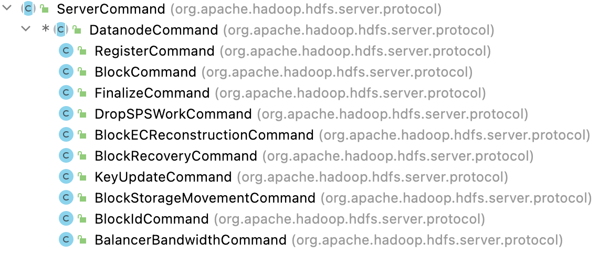

     DatanodeCommand 是所有名字节点的基类，它一共有 10个子类，但在 DatanodeProtocol 中一共定义了 13 个名字节点指令，**每个指令都有一个唯一的编号与之对应**。

     其中，指令编号 **DNA_SHUTDOWN 已经废弃**，Datanode 接收到 DNA_SHUTDOWN 指令后会直接抛出异常。关闭 Datanode 是通过调用 ClientDatanodeProtocol.shutdownDatanode() 方法来触发的。而 **DNA_TRANSFER、DNA_RECOVERBLOCK 以及 DNA_INVALIDATE 都是通过 BlockCommand 子类来封装的，只不过参数不同**。当客户端在写文件时发生异常退出，会造成数据流管道中不同数据节点上数据块状态的不一致，这时 Namenode 会从数据流管道中选出一个数据节点作为主恢复节点，协调数据流管道中的其他数据节点进行租约恢复操作，以同步这个数据块的状态。此时 Namenode 就会向这个数据节点下发 DNA_RECOVERBLOCK 指令，通知数据节点开始租约恢复操作。

     ```java
     public interface DatanodeProtocol {
       final static int DNA_UNKNOWN = 0;    // 未定义   
       final static int DNA_TRANSFER = 1;   // 数据块复制
       final static int DNA_INVALIDATE = 2; // 数据块删除
       final static int DNA_SHUTDOWN = 3;   // 关闭数据节点
       final static int DNA_REGISTER = 4;   // 重新注册数据节点
       final static int DNA_FINALIZE = 5;   // 提交上一次升级
       final static int DNA_RECOVERBLOCK = 6;  // 数据块恢复
       final static int DNA_ACCESSKEYUPDATE = 7;  // 安全相关
       final static int DNA_BALANCERBANDWIDTHUPDATE = 8; // 更新平衡器带宽
       final static int DNA_CACHE = 9;      // 缓存数据块
       final static int DNA_UNCACHE = 10;   // 解缓存数据块
       final static int DNA_ERASURE_CODING_RECONSTRUCTION = 11; // 擦除编码重建命令
       int DNA_BLOCK_STORAGE_MOVEMENT = 12; // 块存储移动命令
       int DNA_DROP_SPS_WORK_COMMAND = 13; // 丢弃sps工作命令
       // ...
     }
     ```

4. **InterDatanodeProtocol**

   **数据节点与数据节点间的接口**，数据节点会通过这个接口和其他数据节点通信。这个接口主要用于数据块的恢复操作，以及同步数据节点上存储的数据块副本的信息。

   **客户端打开一个文件进行写操作时，首先要获取这个文件的租约，并且还需要定期更新租约**。当 Namenode 的租约监控线程发现某个 HDFS 文件租约长期没有更新时，就会认为写这个文件的客户端发生异常，这时 Namenode 就需要触发租约恢复操作——同步数据流管道中所有 Datanode 上该文件数据块的状态，并强制关闭这个文件。 

   租约恢复的控制并不是由 Namenode 负责的，而是 Namenode 从数据流管道中选出一个主恢复节点，然后通过下发 DatanodeCommand 的恢复指令触发这个数据节点控制租约恢复操作，也就是**由这个主恢复节点协调整个租约恢复操作的过程**。主恢复节点会调用 InterDatanodeProtocol 接口来指挥数据流管道的其他数据节点进行租约恢复。租约恢复操作其实很简单，就是**将数据流管道中所有数据节点上保存的同一个数据块状态（时间戳和数据块长度）同步一致**。当成功完成租约恢复后，主恢复节点会调用 DatanodeProtocol.commitBlockSynchronization() 方法同步名字节点上该数据块的时间戳和数据块长度，保持名字节点和数据节点的一致。

   ```java
   /* 由于数据流管道中同一个数据块状态（长度和时间戳）在不同的 Datanode 上可能是不一致的，所以主恢复节点会首先调用该方法获取数据流管道中所有数据节点上保存的指定数据块的状态，使用 ReplicaRecoveryInfo 类封装。主恢复节点会根据收集到的这些状态，确定一个当前数据块的新长度，并且使用 Namenode 下发的 recoverId 作为数据块的新时间戳。 */
   ReplicaRecoveryInfo initReplicaRecovery(RecoveringBlock rBlock)
     throws IOException;
   
   /* 主恢复节点计算出数据块的新长度后，就会调用该方法将数据流管道中所有节点上该数据块的长度同步为新的长度，将数据块的时间戳同步为新的时间戳。当完成了所有的同步操作后，主恢复节点节就会调用方法将 Namenode 上该数据块的长度和时间戳同步为新的长度和时间戳，这样 Datanode 和 Namenode 的数据也就一致了。 */
   String updateReplicaUnderRecovery(ExtendedBlock oldBlock, long recoveryId,
                                       long newBlockId, long newLength)
         throws IOException;
   ```

5. **NamenodeProtocol**

   **第二名字节点与名字节点间的接口**。由于 Hadoop2.X 中引入了 HA 机制，检查点操作也不再由第二名字节点执行了，所以 NamenodeProtocol 就不详细介绍。 

6. **其他接口**

   主要包括安全相关接口（RefreshAuthorizationPolicyProtocol、RefreshUser MappingsProtocol）、HA 相关接口（HAServiceProtocol）等。


### 1.2.2 流式接口

在 HDFS 中，流式接口包括了基于 TCP 的 DataTransferProtocol 接口， 以及 HA 架构中 Active Namenode 和 Standby Namenode 之间的 HTTP 接口。

1. **DataTransferProtocol**

   DataTransferProtocol 是用来描述写入或者读出 Datanode 上数据的基于 TCP 的流式接口，HDFS 客户端与数据节点以及数据节点与数据节点之间的数据块传输就是基于 DataTransferProtocol 接口实现的。HDFS 没有采用 Hadoop RPC 来实现 HDFS 文件的读写功能，是因为 Hadoop RPC 框架的效率目前还不足以支撑超大文件的读写，而使用基于 TCP 的流式接口有利于批量处理数据，同时提高了数据的吞吐量。

   ```java
   /* 从当前 Datanode 读取指定的数据块。 */
   void readBlock(...);
   
   /* 将指定数据块写入数据流管道（pipeLine）中。 */
   void writeBlock(...);
   
   /* 将指定数据块复制（transfer）到另一个 Datanode 上。数据块复制操作是指数据流管道中的数据节点出现故障，需要用新的数据节点替换异常的数据节点时，DFSClient 会调用这个方法将数据流管道中异常数据节点上已经写入的数据块复制到新添加的数据节点上。 */
   void transferBlock(...);
   
   /* 将从源 Datanode 复制来的数据块写入本地 Datanode。写成功后通知 NameNode，并且删除源 Datanode 上的数据块。这个方法主要用在数据块平衡操作（balancing）的场景下。 */
   void replaceBlock(...);
   
   /* 复制当前 Datanode 上的数据块。这个方法主要用在数据块平衡操作的场景下。 */
   void copyBlock(...);
   
   /* 获取指定数据块的校验值。 */
   void blockChecksum(...);
   
   /* 获取一个短路（short circuit）读取数据块的文件描述符。 */
   void requestShortCircuitFds(...);
   
   /* 释放一个短路读取数据块的文件描述符。 */
   void releaseShortCircuitFds(...);
   
   /* 获取保存短路读取数据块的共享内存。 */
   void requestShortCircuitShm(...);
   ```

   DataTransferProtocol 接口调用并没有使用 Hadoop RPC 框架提供的功能，而是定义了用于发送 DataTransferProtocol 请求的 Sender 类，以及用于响应 DataTransferProtocol 请求的 Receiver 类，Sender 类和 Receiver 类都实现了 DataTransferProtocol 接口。假设 DFSClient 发起了一个 DataTransferProtocol.readBlock() 操作，那么 DFSClient 会调用 Sender 将这个请求序列化，并传输给远端的 Receiver。远端的 Receiver 接收到这个请求后，会反序列化请求，然后调用代码执行读取操作。

   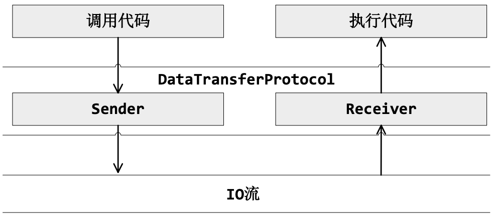

2. **Active Namenode 和 Standby Namenode 间的 HTTP 接口**

   Namenode 会定期将文件系统的命名空间（文件目录树、文件/目录元信息）保存到一个名叫 fsimage 的文件中，以防止 Namenode 掉电或者进程崩溃。但如果 Namenode 实时地将内存中的命名空间同步到 fsimage 文件中，将会非常地消耗资源且造成 Namenode 运行缓慢。所以 **Namenode 会先将命名空间的修改操作保存在 editlog 文件中，然后定期合并 fsimage 和 editlog 文件**。

   合并 fsimage 和 editlog 文件是非常耗费资源的，所以在 Hadoop 2.X 版本之前，HDFS 引入了一个第二名字节点专门负责合并 fsimage 和 editlog 文件。而在 Hadoop 2.X 版本中，**由于 Standby Namenode 会不断地将读入的 editlog 文件与当前的命名空间合并，从而始终保持着一个最新版本的命名空间，所以 Standby Namenode 只需定期将自己的命名空间写入一个新的 fsimage 文件，并通过 HTTP 协议将这个 fsimage 文件传回 Active Namenode 即可**。

   Active Namenode 和 Standby Namenode 之间的 HTTP 接口就是用来传输这个新的 fsimage 文件的。Standby Namenode 成功地将自己的命名空间写入新的 fsimage 文件后，就会向 Active Namenode 的 ImageServlet 发送 HTTP GET 请求/getimage?putimage=1。这个请求的 URL 中包括了新的 fsimage 文件的事务 ID，以及 Standby Namenode 用于下载的端口和 IP 地址。Active Namenode 接收到这个请求后，会根据 Standby Namenode 提供的信息向 Standby Namenode 的 ImageServlet 发起 HTTP GET 请求以下载 fsimage 文件。


## 1.3 HDFS 主要流程

### 1.3.1 HDFS 客户端读流程

1. **打开 HDFS 文件**：HDFS 客户端首先调用 DistributedFileSystem.open()方法打开 HDFS 文件，这个方法**在底层会调用 ClientProtocol.open() 方法**，该方法会返回一个 HdfsDataInputStream 对象用于读取数据块。 HdfsDataInputStream 其实是一个 DFSInputStream 的装饰类，真正进行数据块读取操作的是 DFSInputStream 对象。
2. **从 Namenode 获取 Datanode 地址**：在 DFSInputStream 的构造方法中，**会调用 ClientProtocol.getBlockLocations() 方法**向名字节点获取该 HDFS 文件起始位置数据块的位置信息。Namenode 返回的数据块的存储位置是按照与客户端的距离远近排序的，所以 DFSInputStream 可以选择一个最优的 Datanode 节点，然后与这个节点建立 数据连接读取数据块。
3. **连接到 Datanode 读取数据块**：HDFS 客户端通过调用 DFSInputStream.read() 方法从这个最优的 Datanode 读取数据块，数据会以数据包（packet）为单位从数据节点通过**流式接口**传送到客户端。当达到一个数据块的末尾时，DFSInputStream 就会再次调用 ClientProtocol.getBlockLocations() 获取文件下一个数据块的位置信息，并建立和这个新数据块的最优节点之间的连接，然后 HDFS 客户端就可以继续读取数据块了。
4. **关闭输入流**：当客户端成功完成文件读取后，会通过 HdfsDataInputStream.close() 方法关闭输入流。

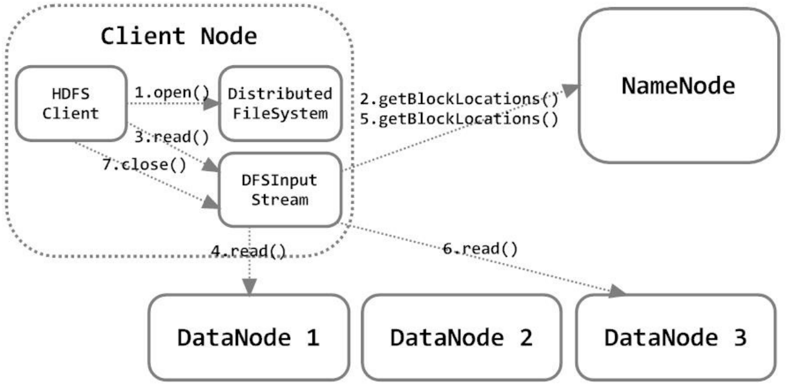

客户端读取数据块时，很可能存储这个数据块的数据节点出现异常，即无法读取数据。此时，DFSInputStream 会切换到另一个保存了这个数据块副本的数据节点，然后读取数据。同时需要注意的是，**数据块的应答包中不仅包含了数据，还包含了校验值**。HDFS 客户端接收到数据应答包时，会对数据进行校验，如果出现校验错误，也就是数据节点上的这个数据块副本出现了损坏，HDFS 客户端就会通过 ClientProtocol.reportBadBlocks() 向 Namenode 汇报这个损坏的数据块副本，同时 DFSInputStream 会尝试从其他的数据节点读取这个数据块。

### 1.3.2 HDFS 客户端写流程

1. **创建文件**：HDFS 客户端写一个新的文件时，会首先调用 DistributedFileSystem.create() 方法在 HDFS 文件系统中创建一个新的空文件。**这个方法在底层会通过调用 ClientProtocol.create() 方法通知 Namenode 执行对应的操作，Namenode 会首先在文件系统目录树中的指定路径下添加一个新的文件，然后将创建新文件的操作记录到 editlog 中**。完成 ClientProtocol.create()调用后，DistributedFileSystem.create()方法就会返回一个 HdfsDataOutputStream 对象，这个对象在底层包装了一个 DFSOutputStream 对象，真正执行写数据操作的其实是 DFSOutputStream 对象。
2. **建立数据流管道**：获取了 DFSOutputStream 对象后，HDFS 客户端就可以调用 DFSOutputStream.write() 方法来写数据了。由于 DistributedFileSystem.create() 方法只是在文件系统目录树中创建了一个空文件，并没有申请任何数据块，所以 **DFSOutputStream 会首先调用 ClientProtocol.addBlock() 向 Namenode 申请一个新的空数据块**，addBlock()方法会返回一个 LocatedBlock 对象，这个对象保存了存储这个数据块的所有数据节点的位置信息。获得了数据流管道中所有数据节点的信息后，DFSOutputStream 就可以建立数据流管道写数据块了。
3. **通过数据流管道写入数据**：成功地建立数据流管道后，HDFS 客户端就可以向数据流管道写数据了。写入 DFSOutputStream 中的数据会先被缓存在数据流中，之后这些数据会被切分成一个个数据包（packet）通过数据流管道发送到所有数据节点。这里的每个数据包都会按照图示，通过数据流管道依次写入数据节点的本地存储。**每个数据包都有个确认包，确认包会逆序通过数据流管道回到输出流。输出流在确认了所有数据节点已经写入这个数据包之后，就会从对应的缓存队列删除这个数据包**。当客户端写满一个数据块之后，会调用 addBlock()申请一个新的数据块，然后循环执行上述操作。
4. **关闭输入流并提交文件**：当 HDFS 客户端完成了整个文件中所有数据块的写操作之后，就可以调用 close() 方法关闭输出流，并**调用 ClientProtocol.complete() 方法通知 Namenode 提交这个文件中的所有数据块**，也就完成了整个文件的写入流程。

对于 Datanode，当 Datanode 成功地接受一个新的数据块时，**Datanode 会通过 DatanodeProtocol.blockReceivedAndDeleted() 方法向 Namenode 汇报**，Namenode 会更新内存中的数据块与数据节点的对应关系。

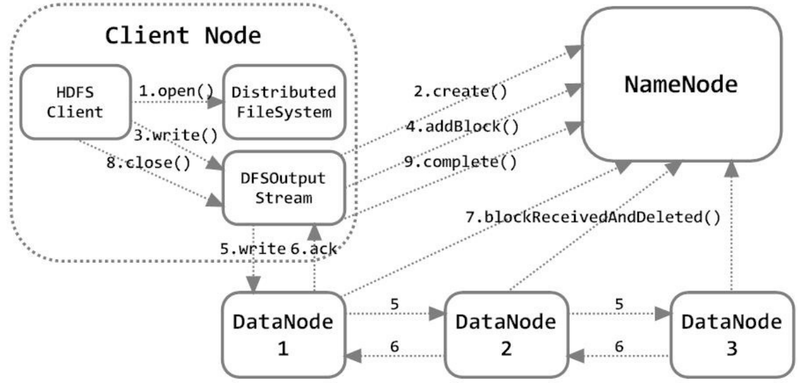


如果客户端在写文件时，数据流管道中的数据节点出现故障，则输出流会进行如下操作来进行故障恢复。

* **输出流中缓存的没有确认的数据包会重新加入发送队列**，这种机制确保了数据节点出现故障时不会丢失任何数据，所有的数据都是经过确认的。但是**输出流会通过调用 ClientProtocol.updateBlockForPipeline()方法为数据块申请一个新的时间戳**，然后使用这个新的时间戳重新建立数据流管道。这种机制保证了故障 Datanode 上的数据块的时间戳会过期，然后在故障恢复之后，由于数据块的时间戳与 Namenode 元数据中的不匹配而被删除，保证了集群中所有数据块的正确性。
* **故障数据节点会从输入流管道中删除，然后输出流会通过调用 ClientProtocol.getAdditionalDatanode()方法通知 Namenode 分配新的数据节点到数据流管道中**。接下来输出流会将新分配的 Datanode 添加到数据流管道中，并使用新的时间戳重新建立数据流管道。由于新添加的数据节点上并没有存储这个新的数据块，这时 HDFS 客户端会通过 DataTransferProtocol 通知数据流管道中的一个 Datanode 复制这个数据块到新的 Datanode 上。
* 数据流管道重新建立之后，**输出流会调用 ClientProtocol.updatePipeline() 更新 Namenode 中的元数据**。至此，一个完整的故障恢复流程就完成了，客户端可以正常完成后续的写操作了。

### 1.3.3 HDFS 客户端追加写流程

HDFS 客户端追加写流程与写流程是很类似的，只不过在初始建立数据流管道时有些不同。

1. **打开已有的 HDFS 文件**：客户端调用 DistributedFileSystem.append() 方法打开一个已有的 HDFS 文件，该方法首先会**调用 ClientProtocol.append() 方法获取文件最后一个数据块的位置信息**，如果文件的最后一个数据块已经写满则返回 null。然后 append() 方法会调用 DFSOutputStream.newStreamForAppend() 方法创建到这个数据块的 DFSOutputStream 输出流对象，获取文件租约，并将新构建的 DFSOutputStream 方法包装为 HdfsDataOutputStream 对象，最后返回。
2. **建立数据流管道**：DFSOutputStream 类的构造方法会判断文件最后一个数据块是否已经写满，如果没有写满，则根据 ClientProtocol.append() 方法返回的该数据块的位置信息建立到该数据块的数据流管道；如果写满了，则调用 ClientProtocol.addBlock() 向 Namenode 申请一个新的空数据块之后建立数据流管道。
3. **通过数据流管道写入数据**：成功地建立数据流管道后，HDFS 客户端就可以向数据流管道写数据了，这部分内容与上节描述的写 HDFS 文件流程类似。
4. **关闭输入流并提交文件**：与上节描述的写 HDFS 文件流程类似，当 HDFS 客户端完成了追加写操作后，需要调用 close() 方法关闭输出流，并调用 ClientProtocol.complete() 方法通知 Namenode 提交这个文件中的所有数据块。


### 1.3.4 DataNode 启动、心跳及执行 NameNode 指令流程

Datanode 启动后与 Namenode 的交互主要包括三个部分：握手；注册；块汇报以及缓存汇报。

1. Datanode 启动时会首先**通过 DatanodeProtocol.versionRequest() 获取 Namenode 的版本号以及存储信息等**，然后 Datanode 会对 Namenode 的当前软件版本号和 Datanode 的当前软件、版本号进行比较，确保它们是一致的。
2. 成功地完成握手操作后，Datanode 会**通过 DatanodeProtocol.register() 方法向 Namenode 注册**。Namenode 接收到注册请求后，会判断当前 Datanode 的配置是否属于这个集群，它们之间的版本号是否一致。
3. 注册成功之后，**Datanode 就需要将本地存储的所有数据块以及缓存的数据块上报到 Namenode**，Namenode 会利用这些信息重新建立内存中数据块与 Datanode 之间的对应关系。


Datanode 成功启动之后，需要定期向 Namenode 发送心跳，让 Namenode 知道当前 Datanode 处于活动状态能够对外服务。**Namenode 会在 Datanode 的心跳响应中携带名字节点指令，指导 Datanode 进行数据块的复制、删除以及恢复等操作**。

当 Datanode 成功添加了一个新的数据块或者删除了一个已有的数据块时，需要通过 DatanodeProtocol.blockReceivedAndDeleted() 方法向 Namenode 汇报。Namenode 接收到这个汇报后，会更新 Namenode 内存中数据块与数据节点之间的对应关系。


### 1.3.5 HA 切换流程

HA HDFS 集群为了使 Standby 节点与 Active 节点的状态能够同步一致，就要求两个 Namenode 的命名空间一致并且数据块与数据节点之间的对应关系一致。**对于命名空间的一致性，两个节点都需要与一组独立运行的节点（JournalNodes，JNS）通信**，当 Active Namenode 执行了修改命名空间的操作时，它会定期将执行的操作记录在 editlog 中，并写入 JNS 的多数节点中。而 Standby Namenode 会一直监听 JNS 上 editlog 的变化，如果发现 editlog 有改动，Standby Namenode 就会读取 editlog 并与当前的命名空间合并。当发生了错误切换时，Standby 节点会先保证已经从 JNS 上读取了所有的 editlog 并与命名空间合并，然后才会从 Standby 状态切换为 Active 状态。通过这种机制，保证了 Active Namenode 与 Standby Namenode 之间命名空间状态的一致性。而**对于数据块与数据节点对应关系的一致性，则要求 HDFS 集群中的所有 Datanode 同时向这两个 Namenode 发送心跳以及块汇报信息**，这样 Active Namenode 和 Standby Namenode 的数据块与数据节点之间的对应关系也就完全同步了。一旦发生故障，就可以马上切换，也就是热备。

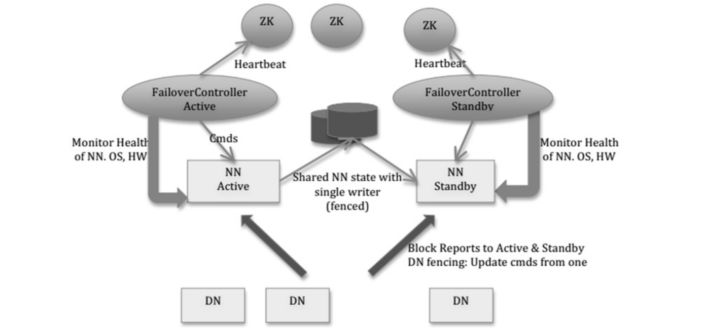

HDFS 提供了 **HA 管理命令（`hdfs haadmin`）**使得管理员可以手动执行主备切换，同时还提供了**自动 Failover 机制**，该机制依赖于两个新增的网元：一个是 ZK 集群；一个是 org.apache.hadoop.ha.ZKFailoverController。ZKFailoverController 会实时监控 Namenode 的 HA 状态，如果 Active Namenode 处于不可服务状态，那么它会自动触发主备切换操作，无须管理员执行任何命令。


# 2. Hadoop RPC

Hadoop 作为分布式存储系统，各个节点之间的通信和交互是必不可少的，所以需要实现一套节点间的通信交互机制。RPC（Remote Procedure CallProtocol，远程过程调用协议）允许本地程序像调用本地方法一样调用远程机器上应用程序提供的服务，所以 Hadoop 实现了一套自己的 RPC 框架。**HadoopRPC 框架并没有使用 JDK 自带的 RMI（Remote Method Invocation，远程方法调用），而是基于 IPC（Inter-Process Communications，进程间通信）模型实现了一套高效的轻量级 RPC 框架，这套 RPC 框架底层采用了 JavaNIO、Java 动态代理以及 protobuf 等基础技术**。

## 2.1 概述

### 2.1.1 RPC 框架概述

**RPC 采用客户端/服务器模式**，请求程序就是一个客户端，而服务提供程序就是一个服务器。客户端首先会发送一个有参数的调用请求到服务器，然后等待服务器发回响应信息。在服务器端，服务提供程序会保持睡眠状态直到有调用请求到达为止。当一个调用请求到达后，服务提供程序会执行调用请求，计算结果，向客户端发送响应信息，然后等待下一个调用请求。最后，客户端成功地接收服务器发回的响应信息，一个远程调用结束。

* **通信模块**：传输 RPC 请求和响应的网络通信模块，**可以基于 TCP 协议，也可以基于 UDP 协议，可以是同步的，也可以是异步的**。
* **客户端 Stub 程序**：服务器和客户端都包括 Stub 程序。在客户端，Stub 程序表现得就像本地程序一样，但底层却会将调用请求和参数序列化并通过通信模块发送给服务器。之后 Stub 程序会等待服务器的响应信息，将响应信息反序列化并返回给请求程序。
* **服务器端 Stub 程序**：在服务器端，Stub 程序会将远程客户端发送的调用请求和参数反序列化，根据调用信息触发对应的服务程序，然后将服务程序返回的响应信息序列化并发回客户端。
* **请求程序**：请求程序会像调用本地方法一样调用客户端 Stub 程序，然后接收 Stub 程序返回的响应信息。
* **服务程序**：服务器会接收来自 Stub 程序的调用请求，执行对应的逻辑并返回执行结果。

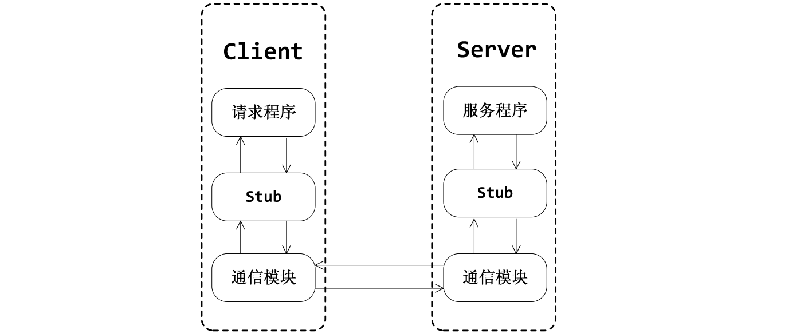

### 2.1.1 Hadoop RPC 框架概述

1. **通信模块**

   Hadoop 实现了 **org.apache.hadoop.ipc.Client 类以及 org.apache.hadoop.ipc.Server 类**提供的基于 TCP/IP Socket 的网络通信功能。

   客户端在发送请求到远程服务器前需要先将请求序列化，然后调用 Client.call() 方法发送这个请求到远程服务器。**为了使 RPC 机制更加健壮，Hadoop RPC 允许客户端配置使用不同的序列化框架序列化 RPC 请求（例如 protobuf、avro）**，这就要求 Client.call()方法的定义更加通用，也就是 Client.call()方法可以发送任意序列化框架产生的 RPC 请求。**而服务器端为了提高性能，Server 类采用了 Java NIO 提供的基于 Reactor 设计模式的事件驱动 I/O 模型**，当 Server 完整地从网络接收一个 RPC 请求后，会调用 call() 方法响应这个请求，

   ```java
   /* rpcKind 参数用于描述 RPC 请求的序列化工具类型，rpcRequest 参数则用于记录序列化后的 RPC 请求。需要注意的是，rpcRequest 是 Writable 类型的（Hadoop框架自己定义的序列化类型），这就要求客户端 Stub 程序将 RPC 请求序列化后包装成 Writable 类型，所以 WritableRpcEngine 定义了 Invocation 类包装 Writalbe 序列化的 RPC 请求，而 ProtobufRpcEngine 则定义了 RpcRequestWrapper 包装 protobuf 序列化的 RPC 请求。 */
   public Writable call(RPC.RpcKind rpcKind, Writable rpcRequest,
         ConnectionId remoteId, AtomicBoolean fallbackToSimpleAuth) throws IOException;
   ```

   ```java
   /* Server.call()方法的定义与 Client.call()很相似。 */
   public abstract Writable call(RPC.RpcKind rpcKind, String protocol,
         Writable param, long receiveTime) throws Exception;
   ```

2. **客户端 Stub 程序**

   **客户端的 Stub 可以看作是一个代理对象，它会将请求程序的 RPC 调用序列化，并调用 Client.call()方法将这个请求发送给远程服务器，这些实现对于客户端调用程序是完全透明的**。

   客户端 Stub 程序做的第一件事情就是将 RPC 请求序列化，Hadoop 2.X 默认使用 protobuf 作为序列化工具，当然 Hadoop RPC 框架也支持其他的序列化框架。Hadoop 定义了 RpcEngine 接口抽象使用不同序列化框架的 RPC 引擎，RpcEngine 接口包括两个重要的方法。

   ```java
   /* 客户端会调用该方法获取一个本地接口的代理对象，然后在这个代理对象上调用本地接口的方法。getProxy()方法的实现采用了 Java 动态代理机制，客户端调用程序在代理对象上的调用会由一个 RpcInvocationHandler（java.lang.reflect.InvocationHandler 的子类，在 RpcEngine 的实现类中定义）对象处理，这个 RpcInvocationHandler 会将请求序列化（使用 RpcEngine 实现类定义的序列化方式）并调用 Client.call()方法将请求发送到远程服务器。当远程服务器发回响应信息后，RpcInvocationHandler 会将响应信息反序列化并返回给调用程序，这一切通过 Java 动态代理机制对于调用程序是完全透明的，就像本地调用一样。 */
   <T> ProtocolProxy<T> getProxy(...);
   
   /* 该方法用于产生一个 RPC Server 对象，服务器会启动这个 Server 对象监听从客户端发来的请求。成功从网络接收请求数据后，Server 对象会调用 RpcInvoker（在 RpcEngine 的实现类中定义）对象处理这个请求。 */
   RPC.Server getServer(...);
   ```

   RpcEngine 目前有两个子类，其中 WritableRpcEngine 用于描述使用 Hadoop 自带的 Writable 作为序列化工具的 RPC 引擎；ProtobufRpcEngine 用于描述使用 protobuf 作为序列化工具的 RPC 引擎。两者都定义了若干内部类。

   ```java
   public class WritableRpcEngine implements RpcEngine {
     /* Invoker 是 InvocationHandler 的子类（Java 动态代理框架中的处理类，RpcInvocationHandler 父接口）。客户端首先会调用 WritableRpcEngine.getProxy()获取一个本地接口（例如 ClientProtocol）的代理对象，然后在这个代理对象上调用本地接口的方法。通过 Java 动态代理机制的处理，这个调用会被 WritableRpcEngine.Invoker 类的 invoke()方法响应。WritableRpcEngine.Invoker.invoke()方法会使用 Writable 序列化框架将 RPC请求以及参数序列化，然后构造一个 Invocation 对象（WritableRpcEngine 的子类，实现了 Writable 接口）包装序列化的 RPC 请求以及参数，最后调用 Client.call()方法将这个 Invocation 对象发送到远程服务器，并等待远程服务器的响应信息。成功获取了服务器发回的响应信息后，Invoker 会将响应信息反序列化并返回给客户端。 */
     private static class Invoker implements RpcInvocationHandler {
       // ...
     }
     
     /* Invocation 类用于包装 Writable 的 RPC 请求，它保存了客户端在什么接口上调用什么方法，以及这个方法的参数等调用信息。 */
     private static class Invocation implements Writable, Configurable {
       // ...
     }
     
     /* WritableRpcEngine.Server 是 org.apache.hadoop.ipc.Server 类（RPC.Server 父类）的子类，服务器代码会调用 WritableRpcEngine.getServer()方法获取一个 WritableRpcEngine.Server 对象，WritableRpcEngine.Server 类继承了的 Server 大部分方法，它会在 Socket 上监听RPC 请求，并调用 WritableRpcInvoker 类的 call()方法响应这个请求。 */
     public static class Server extends RPC.Server {
       
       /* 用于响应远程客户端的请求。WritableRpcInvoker 会先使用 Writable 序列化工具反序列化请求信息以及请求参数，然后根据请求信息反射调用服务程序，并将响应结果包装成一个 Writable 对象返回。 */
       static class WritableRpcInvoker implements RpcInvoker {
         // ...
       }
     }
   }
   ```

   ```java
   public class ProtobufRpcEngine2 implements RpcEngine {
     /* 与 WritableRpcEngine.Invoker 类相同，都是用于处理客户端发送 RPC 请求的。不同的是，使用 protobuf 工具序列化和反序列化。 */
     protected static class Invoker implements RpcInvocationHandler {
       // ...
     }
     
     /* 与 WritableRpcEngine.Server 类的功能类似，它会在 Socket 上监听 RPC 请求，并调用 ProtoBufRpcInvoker 类的 call()方法响应这个请求。 */
     public static class Server extends RPC.Server {
       
       /* 与 WritableRpcInvoker 类的功能类似，用于响应远程客户端的请求。 */
       static class ProtoBufRpcInvoker implements RpcInvoker {
         // ...
       }
     }
     
     static class RpcProtobufRequest extends RpcWritable.Buffer {
       // ...
     }
   }
   ```

   那么客户端调用程序如何获得 Stub 引用的呢？客户端会调用 RPC.getProtocolProxy() 方法获取某个本地接口（例如 ClientProtocol）的代理对象，之后调用程序就可以在该代理对象上调用本地接口的方法了。

   ```java
   /* 方法会首先调用 getProtocolEngine()获取当前 RPC 类的序列化引擎（可能是 WritableRpcEngine 或者 ProtobufRpcEngine），然后调用 RpcEngine.getProxy()方法获取代理对象。 */
   public static <T> ProtocolProxy<T> getProtocolProxy(Class<T> protocol,
                                 long clientVersion,
                                 InetSocketAddress addr,
                                 UserGroupInformation ticket,
                                 Configuration conf,
                                 SocketFactory factory,
                                 int rpcTimeout,
                                 RetryPolicy connectionRetryPolicy,
                                 AtomicBoolean fallbackToSimpleAuth,
                                 AlignmentContext alignmentContext) throws IOException {
     if (UserGroupInformation.isSecurityEnabled()) {
       SaslRpcServer.init(conf);
     }
     return getProtocolEngine(protocol, conf).getProxy(protocol, clientVersion,
         addr, ticket, conf, factory, rpcTimeout, connectionRetryPolicy,
         fallbackToSimpleAuth, alignmentContext);
   }
   ```

   下图给出了调用程序通过 RPC.getProxy() 获取一个TestProtocol 接口的代理对象，然后在代理对象上调用 TestProtocol.test() 方法的流程。

   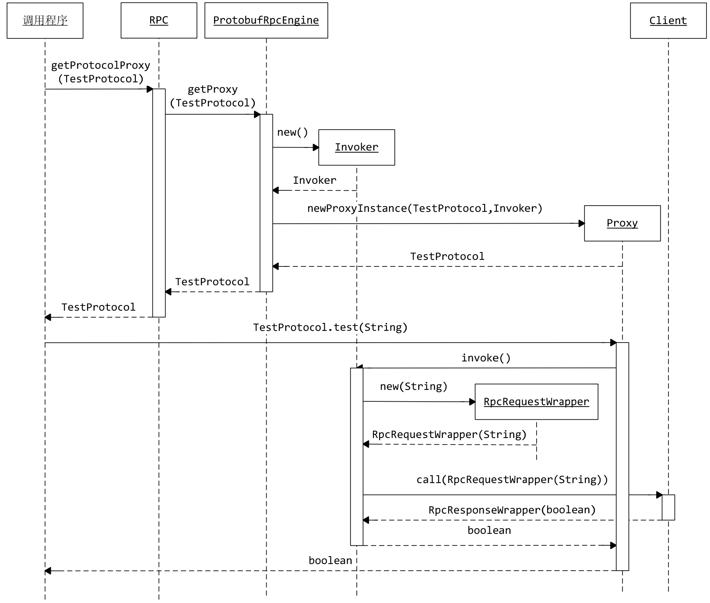

3. **服务器端 Stub 程序**

   服务器端 Stub 程序会将通信模块接收的数据反序列化，然后调用 call() 方法这个 RPC 请求。
   
   ```java
   public class RPC {
     // ...
     public abstract static class Server extends org.apache.hadoop.ipc.Server {
   		/* RPC.Server.call()实现了父类 Server 的抽象方法 call()。它首先调用 getServerRpcInvoker()获取一个 RpcInvoker 对象，然后调用 RpcInvoker.call()方法响应这个 RPC 请求，这个 RpcInvoker 对象可以理解为服务器端 Stub 程序的实现。 */
     	@Override
       public Writable call(RPC.RpcKind rpcKind, String protocol,
           Writable rpcRequest, long receiveTime) throws Exception {
         return getServerRpcInvoker(rpcKind).call(this, protocol, rpcRequest,
             receiveTime);
       }
   	}
   }
   ```
   
   **不同的 RpcEngine 会实现自己的 Server 对象（RPC.Server 的子类），Server 对象又会实现一个内部的 RpcInvoker 对象**，例如 ProtobufRpcEngine 实现了内部类 Server，而 Server 类又定义了自己的ProtoBufRpcInvoker 类。这个ProtoBufRpcInvoker 对象会使用 protobuf 反序列化 RPC 请求，然后调用服务程序响应这个请求，最后会将响应消息序列化并返回。


## 2.2 Hadoop RPC 使用

### 2.2.1 Hadoop RPC 使用概述

下图给出了 DFSClient 调用 ClientProtocol.rename() 方法的流程图。首先看一下 RPC 协议的定义部分。 ClientProtocol 协议定义了 HDFS 客户端与名字节点交互的所有方法，但是 **ClientProtocol 协议中方法的参数是无法在网络中传输的，需要对参数进行序列化操作，所以 HDFS 又定义了 ClientNamenodeProtocolPB 协议**。ClientNamenodeProtocolPB 协议包含了 ClientProtocol 定义的所有方法，但是参数却是使用 protobuf 序列化后的格式。ClientNamenodeProtocolPB 将 ClientProtocol 中 rename(String, String) 方法的两个参数抽象成一个 RenameRequestProto 对象，方法的签名也就变成了 rename(RenameRequestProto)。这里的 RenameRequestProto 对象是通过 protobuf 序列化后的对象，是可以在网络上传输的对象。

调用流程.png)

为了将不可以序列化 的 ClientProtocol 接口调用转换为可以序列化的 ClientNamenodeProtocolPB 接口调用，HDFS 引入了两个适配器类（适配器模式把一个类的接口变换成客户端所期待的另一种接口，从而使原本因接口不匹配而无法在一起工作的两个类能够在一起工作）进行接口适配。

```java
/* Client 侧的适配器类，实现了 ClientProtocol 接口 */
public class ClientNamenodeProtocolTranslatorPB implements
    ProtocolMetaInterface, ClientProtocol, Closeable, ProtocolTranslator {
  /* 内部拥有一个实现了 ClientNamenodeProtocolPB 接口的对象，可以将 ClientProtocol 调用适配成 ClientNamenodeProtocolPB 调用 */
  final private ClientNamenodeProtocolPB rpcProxy;
  
  /* 将 rename(String, String) 调用中的两个 String 参数序列化成一个 RenameRequestProto 对象，然后调用 ClientNamenodeProtocolPB 对象的 rename(RenameRequestProto) 方法，这样就完成了 ClientProtocol
接口到 ClientNamenodeProtocolPB 接口的适配 */ 
  @Override
  public boolean rename(String src, String dst) throws IOException {
    // 构建 pb 参数
    RenameRequestProto req = RenameRequestProto.newBuilder()
        .setSrc(src)
        .setDst(dst).build();

    try {
      // 调用底层 impl 对应方法，返回结果
      return rpcProxy.rename(null, req).getResult();
    } catch (ServiceException e) {
      throw ProtobufHelper.getRemoteException(e);
    }
  }
  
  // ...
}
```

```java
/* Server 侧的适配器类，实现了 ClientNamenodeProtocolPB 接口 */
public class ClientNamenodeProtocolServerSideTranslatorPB implements
    ClientNamenodeProtocolPB {
  /* 内部拥有一个实现了 ClientProtocol 接口（实际是 NameNodeRpcServer）的对象，可以将 ClientNamenodeProtocolPB 调用适配成 ClientProtocol 调用 */
  final private ClientProtocol server;
  
  /* 将 rename(RenameRequestProto) 调用的 RenameRequestProto 对象反序列化成两个 String 对象，之后调用 NameNodeRpcServer（实现了 ClientProtocol）类的 rename(String, String) 方法执行重命名操作 */
  @Override
  public RenameResponseProto rename(RpcController controller,
      RenameRequestProto req) throws ServiceException {
    try {
      boolean result = server.rename(req.getSrc(), req.getDst());
      return RenameResponseProto.newBuilder().setResult(result).build();
    } catch (IOException e) {
      throw new ServiceException(e);
    }
  }
}
```

ClientNamenodeProtocolTranslatorPB 对象是如何将 rename 请求发送到 Server 端的呢？**Hadoop RPC 巧妙地使用了 Java 动态代理机制**，ClientNamenodeProtocolTranslatorPB 持有的 ClientNamenodeProtocolPB 对象其实是通过 Java 动态代理机制获取的一个 ClientNamenodeProtocolPB 接口的代理对象（调用 RPC.getProtocolProxy() 方法获取），这个代理对象内部封装了一个 ProtobufRpcEngine.Invoker 对象。**对 ClientNamenodeProtocolPB 接口的调用都会由这个 Invoker 对象的 invoke() 方法代理**，该方法会首先构造一个描述 RPC 调用信息的对象 RequestHeaderProto（使用 protobuf 序列化的），记录了客户端在什么协议上调用了什么方法（在 ClientProtocol 协议上调用了 rename 方法），然后将 RequestHeaderProto 对象以及调用参数对象 RenameRequestProto 包装成一个 RpcRequestWrapper 对象，最后就可以调用底层 RPC.Client 类提供的 call() 方法将 rename 请求发送到远程服务器了。

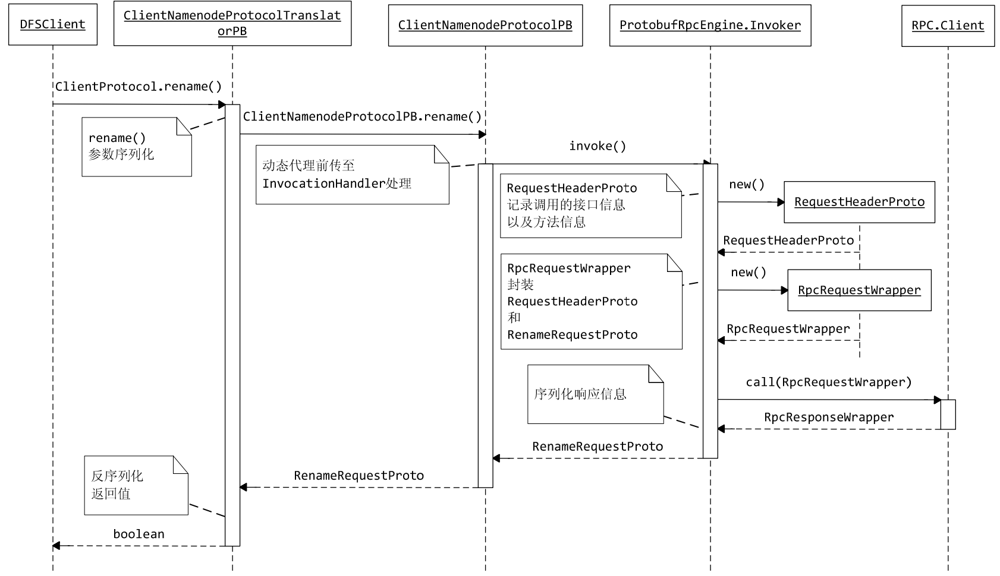

当 rename 请求到达服务器端之后，服务器端是如何响应的呢？**NameNodeRpcServer 会启动一个 RPC Server 监听来自客户端的所有 RPC 请求**，当 RPC Server 在网络上监听到一个 RPC 请求时，它会从网络中解析这个请求，然后构造一个 ProtoBufRpcInvoker 对象来处理这个请求。ProtoBufRpcInvoker 对象会将请求数据反序列化，解析出调用信息和调用参数。之后 ProtoBufRpcInvoker 对象会根据调用信息中的调用接口信息（例子中是 ClientProtocol）**查找实现了 ClientProtocol 接口的 BlockingService 对象**，这个 BlockingService 对象持有一个实现了 ClientNamenodeProtocolPB 接口的 ClientNamenodeProtocolServerSideTranslatorPB 对象，用于响应 ClientNamenodeProtocolPB 接口上的调用。获取了 BlockingService 对象后，ProtoBufRpcInvoker 利用调用信息中的调用方法信息（例子中是 rename）和调用参数对象（RenameRequestProto）调用 BlockingService.callBlockingMethod() 方法响应 RPC 请求。callBlockingMethod()方法根据调用方法信息判断这是一个 ClientNamenodeProtocolPB.rename()调用，它会在 ClientNamenodeProtocolServerSideTranslatorPB 对象上调用 rename(RenameRequestProto) 方法响应，该方法会将 RenameRequestProto 参数反序列化成两个 String 参数，然后在自己持有的实现了 ClientProtocol 接口的 NameNodeRpcServer 上调用 rename(String,String) 方法响应，NameNodeRpcServer.rename()方法会在 Namenode 的命名空间中更改指定 HDFS 文件的名称，最后返回响应信息。

ClientNamenodeProtocolServerSideTranslatorPB 接收到 NameNodeRpcServer 的响应信息后会将这个响应包装成一个 protobuf 序列化的 RenameResponseProto 对象，然后返回到 ProtoBufRpcInvoker 对象。ProtoBufRpcInvoker 接收到 RenameResponseProto 这个响应对象后，由于 ProtoBufRpcInvoker.call() 方法的返回值定义是 Writable 类型的，所以 ProtoBufRpcInvoker 会构造一个 RpcResponseWrapper 对象包装 RenameResponseProto，然后将这个对象返回给 RPC Client。

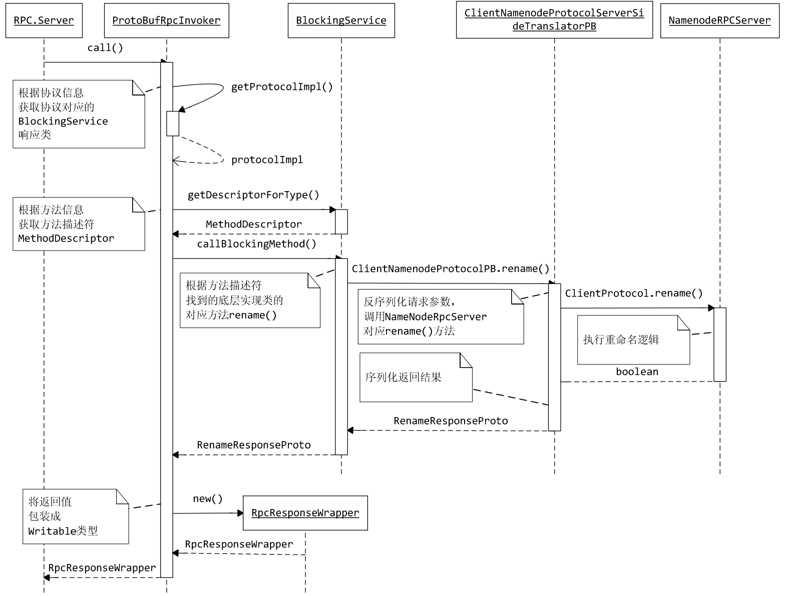

我们可以将 Hadoop RPC 框架的使用抽象为如下几个步骤：

* **定义 RPC 协议**：RPC 协议是客户端和服务器之间 RPC 调用的接口，只有定义了 RPC 协议，客户端才知道服务器对外提供了哪些服务。以 ClientProtocol 为例，ClientProtocol 定义了 Namenode 服务器与 HDFS 客户端之间的接口，HDFS 客户端调用 ClientProtocol.rename()方法，Namenode 服务器就会更改指定 HDFS 文件的文件名。
* **实现 RPC 协议**：服务器端的服务程序需要实现 RPC 协议，当 RPC 调用通过网络到达服务器时，实现了 RPC 协议的服务程序会响应这个 RPC 调用。以 ClientProtocol 为例，Namenode 端的 NameNodeRpcServer 类实现了 ClientProtocol 协议，当 ClientProtocol RPC 请求到达 Namenode 时，会由 NameNodeRpcServer 类响应这个 RPC 请求。
* **客户端获取代理对象**：客户端需要调用 RPC.getProtocolProxy() 方法获取一个 RPC 协议的代理对象，之后客户端调用程序就可以在这个代理对象上调用 RPC 协议的方法，**通过 Java 动态代理机制，这个 RPC 请求会由一个 InvocationHandler 代理对象处理**，InvocationHandler 对象会将 RPC 调用信息和调用参数序列化，最后通过调用 Client.call() 方法将这个请求发送到远程服务器。
* **服务器构造并启动 RPC Server**：**服务器需要调用 RPC.Builder.build() 方法构造一个 Server 对象，然后调用 Server.start() 方法启动这个 Server 对象响应来自客户端的 RPC 请求**。例如对于 NameNodeRpcServer 类，它会构造两个 Server 对象分别响应来自 HDFS 客户端和数据节点的 RPC 请求。


### 2.2.2 定义 RPC 协议

1. **ClientProtocol 协议**

   ClientProtocol 协议定义了 HDFS 客户端与名字节点交互的所有接口方法（例如 rename()、 mkdir() 等），其继承结构图如下。

   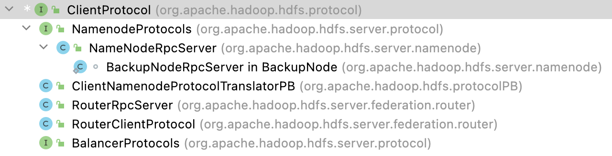

   * **ClientNamenodeProtocolTranslatorPB**：这个类是 RPC 客户端侧最重要的类之一，它将客户端的请求参数封装成可以序列化的 protobuf 格式，然后通过代理类（实现 ClientNamenodeProtocolPB 接口）发送出去。
   * **NameNodeRpcServer**：Namenode 侧响应 ClientProtocol 调用的类，它会执行 HDFS 操作并将操作结果返回。

2. **ClientNamenodeProtocolPB 协议**

   如何定义 ClientNamenodeProtocolPB 协议呢？Hadoop RPC 在这里使用了 protobuf 工具。**使用 protobuf 工具的第一步是定义一个 ClientNamenodeProtocol.proto 文件，这个文件中包含了 RPC 协议 ClientNamenodeProtocol 的定义**，ClientNamenodeProtocol 是 protobuf 产生的支持 ClientProtocol RPC 调用的协议接口类， ClientNamenodeProtocolPB 是 ClientNamenodeProtocol.BlockingInterface 接口的子类。

   ClientNamenodeProtocol.proto 文件中 ClientNamenodeProtocol 协议的定义如下代码所示，可以看到 **ClientNamenodeProtocol 就是将 ClientProtocol 的参数全部抽象为一个 *RequestProto 对象，而将返回值抽象为一个 *ResponseProto 对象**。以 rename()方法为例，ClientNamenodeProtocol.rename() 方法的参数是 RenameRequestProto，而返回值是 RenameResponseProto，它们是 protobuf 定义的用于封装参数以及返回值的类，其结构也是在 ClientNamenodeProtocol.proto 文件中定义的（注意这两个类是写好声明之后，执行 protoc.exe 动态生成的）。

   ```protobuf
   message RenameRequestProto {
     required string src = 1;	// rename()方法的第一个参数 src
     required string dst = 2;	// rename()方法的第二个参数 dst
   }
   
   message RenameResponseProto {
     required bool result = 1;	 // 封装返回结果，布尔类型
   }
   
   service ClientNamenodeProtocol {
     rpc getBlockLocations(GetBlockLocationsRequestProto)
         returns(GetBlockLocationsResponseProto);
     rpc getServerDefaults(GetServerDefaultsRequestProto)
         returns(GetServerDefaultsResponseProto);
     rpc create(CreateRequestProto)returns(CreateResponseProto);
     // ...
     rpc rename(RenameRequestProto) returns(RenameResponseProto);
   }
   ```

   在 ClientNamenodeProtocol.proto 文件中定义了 ClientNamenodeProtocol 后，就可以使用 protobuf 工具生成 ClientNamenodeProtocol 类了，生成的 ClientNamenodeProtocol.Blocking Interface 接口的代码如下所示。

   ```java
   public static abstract class ClientNamenodeProtocol
     implements com.google.protobuf.Service {
     protected ClientNamenodeProtocol() {}
     
     /* BlockingInterface 接口中定义的所有方法都只有两个参数：controller参数没有用到，方法调用时设置为 Null；request参数用于封装原有方法调用的参数*/
     public interface BlockingInterface {
       public RenameResponseProto rename(
         com.google.protobuf.RpcController controller,
         RenameRequestProto request) 
         throws com.google.protobuf.ServiceException;
       // ...
     }
   }
   ```

   ClientNamenodeProtocolPB 接口是 ClientNamenodeProtocol.BlockingInterface 接口的子类，它完全继承了 ClientNamenodeProtocol.BlockingInterface 接口中方法的定义。**之所以使用ClientNamenodeProtocolPB 作为序列化协议类是为了添加 Annotation 支持，因为 ClientNamenodeProtocol 的代码是 protobuf 自动生成的，不可以添加 Annotation 支持**。

   ```java
   @InterfaceAudience.Private
   @InterfaceStability.Stable
   @KerberosInfo(
       serverPrincipal = HdfsClientConfigKeys.DFS_NAMENODE_KERBEROS_PRINCIPAL_KEY)
   @TokenInfo(DelegationTokenSelector.class)
   @ProtocolInfo(protocolName = HdfsConstants.CLIENT_NAMENODE_PROTOCOL_NAME,
       protocolVersion = 1)
   public interface ClientNamenodeProtocolPB extends
       ClientNamenodeProtocol.BlockingInterface {
   }
   ```

3. **ClientNamenodeProtocolTranslatorPB 类**

   **ClientNamenodeProtocolTranslatorPB 类是 RPC Client 侧的适配器类，DFSClient 会持有一个 ClientNamenodeProtocolTranslatorPB 类的引用，用于将 ClientProtocol 协议上的请求适配成 ClientNamenodeProtocolPB 协议的请求**。ClientNamenodeProtocolTranslatorPB 会将 ClientProtocol 请求的参数序列化，然后调用 rpcProxy 对象（实现了 ClientNamenodeProtocolPB 接口）上的对应方法，这样就完成了适配操作。至于 rpcProxy 对象，则是使用 Java 动态代理机制获取的 ClientNamenodeProtocolPB 接口的代理对象。在这个对象上的调用会由 ProtobufRpcEngine.Invoker 对象代理，这个 Invoker 对象的 invoke() 方法会调用底层的 RPC.Client 类提供的 call() 方法将请求发送到远程服务器， 并等待远程服务器返回响应信息。

4. **ClientNamenodeProtocolServerSideTranslatorPB 类**

   **ClientNamenodeProtocolServerSideTranslatorPB 则是 RPC Server 侧的适配器类，它只需将 ClientNamenodeProtocolPB 请求的参数反序列化，然后在 ClientProtocol 服务对象 server 上调用对应的方法即可完成适配工作**。这里 server 对象实际是 NameNodeRpcServer（ClientProtocol 子类） 的引用，它会响应 ClientProtocol 的请求，修改名字节点的命名空间，执行对应的 HDFS 逻辑。


### 2.2.3 客户端获取 Proxy 对象

本节重点介绍 DFSClient 获取 ClientNameNodeProtocolTranslatorPB 对象，以及 ClientNameNodeProtocolTranslatorPB 对象获取 ClientNamenodeProtocolPB 代理对象的流程。先从一个简单的 ClientRPC 请求（DFSClient.rename()）开始分析。

```java
public class DFSClient implements java.io.Closeable, RemotePeerFactory,
    DataEncryptionKeyFactory, KeyProviderTokenIssuer {
  /* namenode 保存了一个实现了 ClientProtocol 接口的对象，DFSClient 通过 ProxyInfo 类来获取这个对象的引用，而这个 ProxyInfo 对象则是通过调用 NameNodeProxies.createProxy() 方法产生的 */
  final ClientProtocol namenode;
  // 构造方法
  this.namenode = proxyInfo.getProxy();
	// 获取 proxyInfo 引用
	proxyInfo = NameNodeProxies.createProxy(conf, nameNodeUri,ClientProtocol.class);
      
	public void rename(String src, String dst, Options.Rename... options)
      throws IOException {
    checkOpen();
    try (TraceScope ignored = newSrcDstTraceScope("rename2", src, dst)) {
      namenode.rename2(src, dst, options);
    } catch (RemoteException re) {
      // ...
    }
  }
}
```

Hadoop 2.X 引入了 Namenode 的 HA 机制，也就是说，HDFS 集群中会存在两个 Namenode 实例，同一时间 DFSClient 只会将 ClientProtocol RPC 请求发送给集群中的 Active Namenode。而当集群发生错误切换时，DFSClient 又会将请求发送给新的 Active Namenode，这些实现对于 DFSClient 来说是透明的，DFSClient 并不知道 ClientProtocol RPC 请求发送到了哪个 Namenode，它只需在 ClientProtocol 对象上发起 RPC 调用即可。**NameNodeProxies.createProxy() 方法就是用于创建支持 HA 机制的 ClientProtocol 代理对象的，它会根据配置文件判断当前 HDFS 集群是否处于 HA 模式。对于处于 HA 模式的情况，createProxy() 方法会调用 createFailoverProxyProvider() 方法创建支持 HA 机制的 ClientProtocol 对象；而对于非 HA 模式的情况，createProxy() 方法则会调用 createNonHAProxy() 方法创建普通的 ClientProtocol 对象**。

```java
public static <T> ProxyAndInfo<T> createProxy(Configuration conf,
  URI nameNodeUri, Class<T> xface) throws IOException {
  Class<FailoverProxyProvider<T>> failoverProxyProviderClass =
  	getFailoverProxyProviderClass(conf, nameNodeUri, xface);
  if (failoverProxyProviderClass == null) {
  	// 非 HA 情况
  	return createNonHAProxy(conf, NameNode.getAddress(nameNodeUri), xface,
  		UserGroupInformation.getCurrentUser(), true);
  } else {
  	// HA 情况
    FailoverProxyProvider<T> failoverProxyProvider = NameNodeProxies.createFailoverProxyProvider(conf, failoverProxyProviderClass, xface,
    nameNodeUri);
    Conf config = new Conf(conf);
    T proxy = (T) RetryProxy.create(xface, failoverProxyProvider, RetryPolicies.failoverOnNetworkException(RetryPolicies.TRY_ONCE_THEN_FAIL, config.maxFailoverAttempts, config.failoverSleepBaseMillis, config.failoverSleepMaxMillis));
    Text dtService = HAUtil.buildTokenServiceForLogicalUri(nameNodeUri);
    return new ProxyAndInfo<T>(proxy, dtService);
	}
} 
```

1. **非 HA 模式**

   非 HA 模式的入口方法是 NameNodeProxies.createNonHAProxy()，它会对 xface 参数也就是 RPC 接口进行判断，然后构造并返回实现了这个接口的对象。

   ```java
   public static <T> ProxyAndInfo<T> createNonHAProxy(
     Configuration conf, InetSocketAddress nnAddr, Class<T> xface,
     UserGroupInformation ugi, boolean withRetries) throws IOException {
     Text dtService = SecurityUtil.buildTokenService(nnAddr);
     T proxy;
     // 当前接口是 ClientProtocol，调用 createNNProxyWithClientProtocol() 方法创建实现了 ClientProtocol 接口的 ClientNamenodeProtocolTranslatorPB 对象
     if (xface == ClientProtocol.class) {
     	proxy = (T) createNNProxyWithClientProtocol(nnAddr, conf, ugi,
     		withRetries);
     } else if (xface == JournalProtocol.class) {
       // 当前接口是 JournalProtocol
     	proxy = (T) createNNProxyWithJournalProtocol(nnAddr, conf, ugi);
     }
     // 其他协议接口 ...
   }
   ```

   ```java
    private static ClientProtocol createNNProxyWithClientProtocol(
     InetSocketAddress address, Configuration conf, UserGroupInformation ugi,
     boolean withRetries, AtomicBoolean fallbackToSimpleAuth) throws IOException {
     // RPC.protocolEngine 字段用于指定当前 RPC 调用使用什么序列化方式，这里配置的 ProtobufRpcEngine 类就定义了当前 RPC 调用使用 protobuf 作为序列化引擎
     RPC.setProtocolEngine(conf,ClientNamenodeProtocolPB.class, ProtobufRpcEngine.class);
     // ...
     // 构造 ClientNamenodeProtocolPB 代理对象
     ClientNamenodeProtocolPB proxy = RPC.getProtocolProxy(
     	ClientNamenodeProtocolPB.class, version, address, ugi, conf,
     NetUtils.getDefaultSocketFactory(conf),
     org.apache.hadoop.ipc.Client.getTimeout(conf), defaultPolicy,
     	fallbackToSimpleAuth).getProxy();
     // ...
     // 构造 ClientNamenodeProtocolTranslatorPB 对象并返回
     // 注意 ClientNamenodeProtocolTranslatorPB 会持有一个 ClientNamenodeProtocolPB 对象
     return new ClientNamenodeProtocolTranslatorPB(proxy);
   }
   ```

   重点看一下获取 ClientNamenodeProtocolPB 代理对象的 RPC.getProtocolProxy() 方法的实现，这个方法是 RPC 类中最重要的一个方法，用于获取一个指定 RPC 接口的代理对象。

   ```java
   public static <T> ProtocolProxy<T> getProtocolProxy(Class<T> protocol,
     long clientVersion, InetSocketAddress addr, UserGroupInformation ticket,
     Configuration conf, SocketFactory factory, int rpcTimeout,
     RetryPolicy connectionRetryPolicy, AtomicBoolean fallbackToSimpleAuth)
   	throws IOException {
     // 首先调用 getProtocolEngine() 方法获取当前 RPC 定义的 protocolEngine 对象的实例，然后在这个 protocolEngine 对象上调用 getProxy() 获取使用特定序列化方式的接口代理对象。
   	return getProtocolEngine(protocol, conf).getProxy(protocol, clientVersion,
   		addr, ticket, conf, factory, rpcTimeout, connectionRetryPolicy,
   		fallbackToSimpleAuth);
   }
   
   static synchronized RpcEngine getProtocolEngine(Class<?> protocol, Configuration conf) {
     RpcEngine engine = PROTOCOL_ENGINES.get(protocol);
     // 通过反射创建 rpcEngine 实例
     if (engine == null) {
       Class<?> impl = conf.getClass(ENGINE_PROP+"."+protocol.getName(),
       	WritableRpcEngine.class);
       engine = (RpcEngine)ReflectionUtils.newInstance(impl, conf);
       PROTOCOL_ENGINES.put(protocol, engine);
     }
     return engine;
   }
   ```

   由于 createNNProxyWithClientProtocol() 的第一条语句就是注册 ClientProtocol 的序列化引擎为 ProtobufRpcEngine，所以 ClientProtocol 使用 protobuf 作为序列化工具，那么这里的 getProtocolEngine()方法返回的就是一个 ProtobufRpcEngine 的实例。

   **真正构造代理对象的方法其实是 RpcEngine.getProxy() 方法**，这里的 RpcEngine 是一个抽象类，它只定义了接口，具体的实现留给子类去做。RpcEngine 有两个重要的子类：WritableRpcEngine 用于描述使用 HadoopWritable 序列化机制的 RPC 引擎；而 ProtobufRpcEngine 则用于描述使用 protobuf 序列化机制的 RPC 引擎。之所以这样定义，是为了使 Hadoop RPC 可以方便地支持多种 RPC 序列化方式，同时在切换 RPC 引擎时并不需要更改源码，只需要通过配置更改 RPC 的 RpcEngine 对象即可。

   ClientProtocol 默认是使用 ProtobufRpcEngine 的，所以我们来看一下 ProtobufRpcEngine.getProxy() 方法的实现。getProxy() 方法首先会构造一个实现了 InvocationHandler 接口的 invoker 对象（**动态代理机制中的 InvocationHandler 对象会在 invoke() 方法中代理所有目标接口上的调用，用户可以在 invoke() 方法中添加代理操作**），这个 invoker 对象是 ProtoBufRpcEngine.Invoker 类型的。 构造了这个对象之后，getProxy() 就可以调用 Proxy.newProxyInstance() 方法构造动态代理对象， 然后将这个对象封装在 ProtocolProxy 对象中并返回。

   ```java
   public <T> ProtocolProxy<T> getProxy(Class<T> protocol, long clientVersion,
    InetSocketAddress addr, UserGroupInformation ticket, Configuration conf,
    SocketFactory factory, int rpcTimeout, RetryPolicy connectionRetryPolicy,
    AtomicBoolean fallbackToSimpleAuth) throws IOException {
     // 首先构造 InvocationHandler 对象
     final Invoker invoker = new Invoker(protocol, addr, ticket, conf, factory,
       rpcTimeout, connectionRetryPolicy, fallbackToSimpleAuth);
     // 然后调用 Proxy.newProxyInstance()获取动态代理对象，并通过 ProtocolProxy 返回
     return new ProtocolProxy<T>(protocol, (T) Proxy.newProxyInstance(
       protocol.getClassLoader(), new Class[]{protocol}, invoker), false);
   } 
   ```

   由于 Java 动态代理机制决定了在代理对象上的所有调用都会由 InvocationHandler 对象的 invoke()方法代理，所以所有在 ClientNamenodeProtocolPB 代理对象上的调用都会由这个 ProtobufRpcEngine.Invoker 对象的 invoker()方法代理，ProtobufRpcEngine.Invoker.invoker() 方法主要做了三件事情：①构造请求头域，使用 protobuf 将请求头序列化，这个请求头域记录了当前 RPC 调用是什么接口的什么方法上的调用；②通过 RPC.Client 类发送请求头以及序列化好的请求参数。请求参数是在 ClientNamenodeProtocolPB 调用时就已经序列化好的，调用 Client.call()方法时，需要将请求头以及请求参数使用一个 RpcRequestWrapper 对象封装；③获取响应信息，序列化响应信息并返回。

   ```java
   public Object invoke(Object proxy, Method method, Object[] args)
     throws ServiceException {
     // 通过上一节的学习，我们知道 pb 接口的参数只有两个，即 RpcController + Message
     if (args.length != 2) {
     	throw new ServiceException("Too many parameters for request. Method: ["
     		+ method.getName() + "]" + ", Expected: 2, Actual: " + args.length);
   	}
     if (args[1] == null) {
     	throw new ServiceException("null param while calling Method: ["
     		+ method.getName() + "]");
     }
     // 构造请求头域，标明在什么接口上调用什么方法
     RequestHeaderProto rpcRequestHeader = constructRpcRequestHeader(method);
     // 获取请求调用的参数，例如 RenameRequestProto
     Message theRequest = (Message) args[1]; 
     final RpcResponseWrapper val;
     try {
     	// 调用 RPC.Client 发送请求
     	val = (RpcResponseWrapper) client.call(RPC.RpcKind.RPC_PROTOCOL_BUFFER,
     	new RpcRequestWrapper(rpcRequestHeader, theRequest), remoteId);
     } catch (Throwable e) {
     	// ...
     	throw new ServiceException(e);
     }
     // ...
     Message prototype = null;
     try {
       // 获取返回参数类型，RenameResponseProto
       prototype = getReturnProtoType(method);
     } catch (Exception e) {
       throw new ServiceException(e);
     }
     Message returnMessage;
     try {
       // 序列化响应信息并返回
       returnMessage = prototype.newBuilderForType()
       .mergeFrom(val.theResponseRead).build();
       // ...
     } catch (Throwable e) {
       throw new ServiceException(e);
     }
     // 返回结果
     return returnMessage;
   }
   ```

   调用流程图.png)

2. **HA 模式**

   对于 HA 模式，NameNodeProxies 调用 RetryProxy.creat() 方法构造实现了 RPC 协议的对象，这里的 RetryProxy 是一个工厂类，它会构造支持 HA 模式的协议对象，这个协议对象会首先尝试连接 HDFS 中的 ActiveNamenode，如果连接失败则会重试，如果重试达到一定的次数，则会切换到 HDFS 集群中的 StandbyNamenode。

   ```java
   public static <T> Object create(Class<T> iface,
         FailoverProxyProvider<T> proxyProvider, RetryPolicy retryPolicy) {
     // 直接调用 Java 动态代理构造方法，返回代理对象
     return Proxy.newProxyInstance(
         proxyProvider.getInterface().getClassLoader(),
         new Class<?>[] { iface },
         new RetryInvocationHandler<T>(proxyProvider, retryPolicy)
         );
   }
   ```

   RetryProxy 的工厂方法 RetryProxy() 调用了 Java 动态代理方法，那么**在协议的代理对象上的调用都会由 RetryInvocationHandler 的 invoke() 方法代理**，invoke() 首先获取 RetryPolicy 对象，RetryPolicy 定义了出现调用错误时的重试逻辑。这里默认的 RetryPolicy 是 failoverOnNetworkException。然后 RetryInvocationHandler.invoke() 方法通过反射调用 method 对象描述的方法。

   ```java
   Object ret = invokeMethod(method, args);
   
   /* currentProxy 是实现了 ClientProtocol 协议的对象，它通过调用 FailoverProxyProvider.getProxy() 获得。当 Namenode 发生主从切换后，currentProxy 字段会被赋值为新的 Active Namenode 对应的 ClientProtocol 的引用，之后在 ClientProtocol 上的调用也就会发送到新的 Active Namenode。 */
   this.currentProxy = proxyProvider.getProxy();
   
   /* invokeMethod() 方法其实就是在 currentProxy 对象上调用 method 参数描述的方法，currentProxy 是泛型 T 类型，也就是接口 ClientProtocol 类型 */
   protected Object invokeMethod(Method method, Object[] args) throws Throwable {
     try {
       if (!method.isAccessible()) {
         method.setAccessible(true);
       }
       // 注意，这里的 currentProxy 会发生切换
       return method.invoke(currentProxy, args);
     } catch (InvocationTargetException e) {
       throw e.getCause();
     }
   }
   ```

   如果完成上述操作后没有抛出异常，也就是说，客户端成功地将请求发送到了 Active Namenode 服务器。如果抛出异常，则说明远程调用出现了错误，这部分代码在 catch 段处理。

   * 通过 annotation 判断这个操作是否是 idempotent （幂等的，也就是执行多次是没有问题的，例如 ClientProtocol 中的 setReplication()），对于幂等的操作可以再次调用。 之后调用 RetryPolicy.ShouldRetry() 方法分析如何处理这个错误。

   ```java
   // 判断方法是否是幂等的
   boolean isIdempotentOrAtMostOnce = proxyProvider.getInterface()
     .getMethod(method.getName(), method.getParameterTypes())
     .isAnnotationPresent(Idempotent.class);
   if (!isIdempotentOrAtMostOnce) {
    isIdempotentOrAtMostOnce = proxyProvider.getInterface()
     .getMethod(method.getName(), method.getParameterTypes())
     .isAnnotationPresent(AtMostOnce.class);
   }
   
   // 在 RetryPolicy 上分析需要进行的 retry 动作
   RetryAction action = policy.shouldRetry(e, retries++, invocationFailoverCount, isIdempotentOrAtMostOnce);
   ```

   * 之后调用 policy.shouldRetry() 判断是否需要执行重试操作（这里的 RetryPolicy 是默 认值 FailoverOnNetworkExceptionRetry）。

   ```java
   public RetryAction shouldRetry(Exception e, int retries,
     int failovers, boolean isIdempotentOrAtMostOnce) throws Exception {
     // 1.如果失败的次数已经超过最大的次数，就返回一个 RetryAction.RetryDecision.FAIL 的 RetryAction 表明调用失败。
     if (failovers >= maxFailovers) {
       return new RetryAction(RetryAction.RetryDecision.FAIL, 0,
         "failovers (" + failovers + ") exceeded maximum allowed ("
         + maxFailovers + ")");
     }
     
     if (e instanceof ConnectException || e instanceof NoRouteToHostException ||
     	e instanceof UnknownHostException || e instanceof StandbyException ||
     	e instanceof ConnectTimeoutException || isWrappedStandbyException(e)) {
       	// 2.如果抛出的异常是 ConnectionException、NoRouteToHostException、UnKnownHostException、StandbyException、RemoteException 中的一个，则说明底层的协议代理对象无法连接到 ActiveNamenode，或者 ActiveNamenode宕机，或者 HDFS 集群已经发生主从切换了。在这些情况下，就需要返回一个 RetryAction.RetryDecision.FAILOVER_AND_RETRY 的 RetryAction，表明需要执行 performFailover() 操作更新 Active Namenode 的引用。
     		return new RetryAction( RetryAction.RetryDecision.FAILOVER_AND_RETRY,
         // retry immediately if this is our first failover, sleep otherwise
         failovers == 0 ? 0 :
         calculateExponentialTime(delayMillis, failovers, maxDelayBase));
     } else if (e instanceof SocketException ||
     		(e instanceof IOException && !(e instanceof RemoteException))) {
       	// 3.如果抛出的异常是 SocketException、IOException 或者其他非 RemoteException 的异常，则无法判断这个 RPC 命令到底是不是执行成功了。可能是本地的 Socket 或者 IO 问题，也可能是 Namenode 端的 Socket 或者 IO 问题。这时就进行进一步的判断：如果被调用的方法是 idempotent，也就是多次执行没有副作用，那么就连接另外一个底层代理重试；否则直接返回 RetryAction.RetryDecision.FAIL 表明调用失败。
         if (isIdempotentOrAtMostOnce) {
           return RetryAction.FAILOVER_AND_RETRY;
         } else {
           return new RetryAction(RetryAction.RetryDecision.FAIL, 0,
             "the invoked method is not idempotent, and unable to determine " +
             "whether it was invoked");
         }
     } else {
       return fallbackPolicy.shouldRetry(e, retries, failovers,
         isIdempotentOrAtMostOnce);
     }
   }
   ```

   * 通过异常情况，获得了对应的 RetryAction 之后，就会在 proxyProvider 上调用 performFailover()方法更新 currentProxy。如果是 HA 配置，那么在 Namenode 主从切换后，performFailover() 会更新 currentProxy 到新的 Active Namenode，然后继续循环，这样在 currentProxy 上的调用就可以发送到新的 Active Namenode 了。

   ```java
   if (action.action == RetryAction.RetryDecision.FAILOVER_AND_RETRY) {
     synchronized (proxyProvider) {
       if (invocationAttemptFailoverCount == proxyProviderFailoverCount) {
         proxyProvider.performFailover(currentProxy);
         proxyProviderFailoverCount++;
         currentProxy = proxyProvider.getProxy();
       } else {
         LOG.warn()
     }
   }
   ```


### 2.2.4 服务端获取 Server 对象

RPC 服务器需要构造一个 Server 对象，这个 Server对象用于监听并响应来自RPC客户端的请求。例如对于Namenode，它会构造两个Server 对象分别响应来自 HDFS 客户端和 Datanode 的 RPC 请求。

1. **构造 NameNodeRpcServer** 

   Namenode 定义了 NameNodeRpcServer 类响应来自 HDFS 集群中其他节点的 RPC 请求，该类实现了包括 ClientProtocol、NamenodeProtocol、DatanodeProtocol 以及 HAServiceProtocol 在内的所有需要与 Namenode 交互的 RPC 协议接口。

   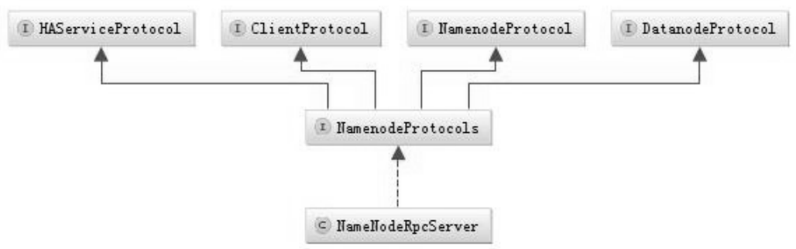

   Namenode 会在它的初始化方法 initialize() 中调用 createRpcServer() 创建 NameNodeRpcServer 对象的实例，createRpcServer() 方法会直接调用 NameNodeRpcServer 的构造方法。

   NameNodeRpcServer 的构造方法首先设置了 RPC 类的序列化引擎为 protobuf，然后构造了两个 RPC.Server 对象：**clientRpcServer 用于响应来自 HDFS 客户端的 RPC 请求；serviceRpcServer 则用于响应来自 Datanode 的 RPC 请求**。clientRpcServer 和 serviceRpcServer 的构造方法很类似，都是先调用 RPC.build()方法获取一个 RPC.Server 对象，然后调用 DFSUtil.addPBProtocol() 方法在新获取的 RPC.Server 对象上添加 \*ProtocolPB 协议与 BlockingService 对象之间的映射关系，例如 ClientNamenodeProtocolPB 协议会由 BlockingService 对象 clientNNPbService 处理。**之所以配置这个映射关系，是因为当 RPC.Server 监听到网络上的 RPC 请求后，它会首先提取出 RPC 请求的请求头域，解析出这次 RPC 请求是在什么接口（接口信息）的什么方法（方法信息）上调用的，然后根据接口信息以及上述配置的映射关系提取出执行响应操作的 BlockingService 对象，最后根据方法信息调用 BlockingService.callBlockingMethod() 方法响应这个 RPC 调用**。所以 \*ProtocolPB 协议接口与 BlockingService 对象之间的映射关系保证了 RPC 请求到达 Server 后，Server 可以找到正确的响应类来执行相应操作。

   ```java
   public NameNodeRpcServer(Configuration conf, NameNode nn)
       throws IOException {
     this.nn = nn;
     this.namesystem = nn.getNamesystem();
     this.retryCache = namesystem.getRetryCache();
     this.metrics = NameNode.getNameNodeMetrics();
   
     int handlerCount = 
       conf.getInt(DFS_NAMENODE_HANDLER_COUNT_KEY, 
                   DFS_NAMENODE_HANDLER_COUNT_DEFAULT);
     ipProxyUsers = conf.getStrings(DFS_NAMENODE_IP_PROXY_USERS);
   	// 设置 RPC 引擎为 protobuf
     RPC.setProtocolEngine(conf, ClientNamenodeProtocolPB.class,
         ProtobufRpcEngine2.class);
     
   	// 构造 ClientNamenodeProtocolServerSideTranslatorPB 对象，用于适配 ClientProtocolPB 到 ClientProtocol 接口的转换。ClientNamenodeProtocolServerSideTranslatorPB 中持有的 ClientProtocol 接口对象其实就是 NameNodeRpcServer，NameNodeRpcServer 实现了 ClientProtocol 接口，是 NamenodeRPC 服务真正的实现类。
     ClientNamenodeProtocolServerSideTranslatorPB 
        clientProtocolServerTranslator = 
          new ClientNamenodeProtocolServerSideTranslatorPB(this);
     // 构造BlockingService对象，用于将Server提取出的请求前转到 clientProtocolServerTranslator对象
     BlockingService clientNNPbService = ClientNamenodeProtocol.
          newReflectiveBlockingService(clientProtocolServerTranslator);
     // ... 其他接口同 ClientProtocol 类似
     
   	// 初始化 serviceRpcServer 对象，用于响应来自 Datanode 的请求
     InetSocketAddress serviceRpcAddr = nn.getServiceRpcServerAddress(conf);
     if (serviceRpcAddr != null) {
       // ...
       // 构造 serviceRpcServer 对象，并配置 ClientProtocolPB 的响应类为 clientNNPbService
       serviceRpcServer = new RPC.Builder(conf)
           .setProtocol(
               org.apache.hadoop.hdfs.protocolPB.ClientNamenodeProtocolPB.class)
           .setInstance(clientNNPbService)
           .setBindAddress(bindHost)
           .setPort(serviceRpcAddr.getPort())
           .setNumHandlers(serviceHandlerCount)
           .setVerbose(false)
           .setSecretManager(namesystem.getDelegationTokenSecretManager())
           .build();
   
       // 注册 NamenodeRPCServer 实现的所有接口
       DFSUtil.addPBProtocol(conf, HAServiceProtocolPB.class, haPbService,
           serviceRpcServer);
       DFSUtil.addPBProtocol(conf, NamenodeProtocolPB.class, NNPbService,
    		    serviceRpcServer);
       // ... 添加其他协议
    		// ... 更新端口号
     }
     	
     // ...
     // 构造 clientRpcServer，用于响应来自 HDFS 客户端的 RPC 请求
     clientRpcServer = new RPC.Builder(conf)
         .setProtocol(
             org.apache.hadoop.hdfs.protocolPB.ClientNamenodeProtocolPB.class)
         .setInstance(clientNNPbService)
         .setBindAddress(bindHost)
         .setPort(rpcAddr.getPort())
         .setNumHandlers(handlerCount)
         .setVerbose(false)
         .setSecretManager(namesystem.getDelegationTokenSecretManager())
         .setAlignmentContext(stateIdContext)
         .build();
   
     // 注册 NamenodeRPCServer 实现的所有接口
     DFSUtil.addPBProtocol(conf, HAServiceProtocolPB.class, haPbService,
         clientRpcServer);
     DFSUtil.addPBProtocol(conf, NamenodeProtocolPB.class, NNPbService,
         clientRpcServer);
     // ... 添加其他协议
     // ... 安全相关、更新端口号、配置异常处理机制
   }
   ```

   下图总结了 NameNodeRpcServer 构造方法中 serviceRpcServer 的简化版构造流程，整个流程可分为两个部分：①获取响应 ClientNamenodeProtocolPB 请求的 BlockingService 对象（其他协议的处理流程与 ClientNamenodeProtocolPB 类似）；②构造 RPC.Server。这两部分内容在后两个小节中分别进行介绍。

   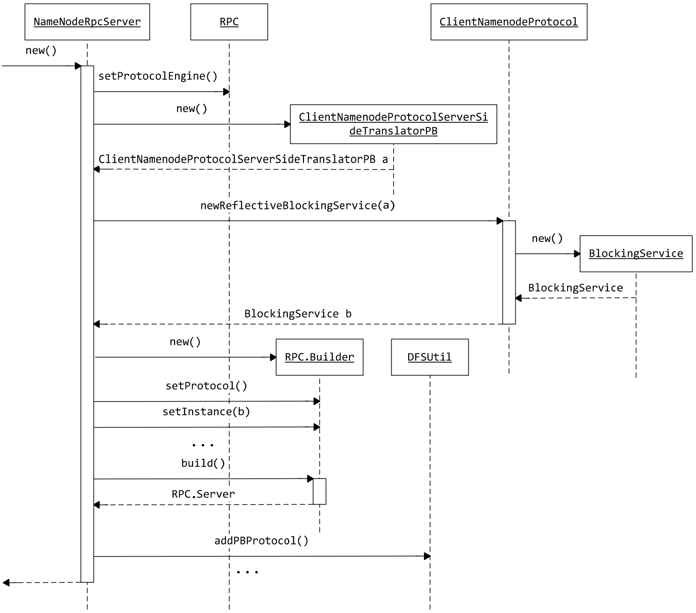

2. **获取 BlockingService 对象**

   ```java
   public static com.google.protobuf.BlockingService newReflectiveBlockingService(final BlockingInterface impl) {
     // 构造一个匿名的 BlockingService 对象并返回
     return new com.google.protobuf.BlockingService() {
       public final com.google.protobuf.Descriptors.ServiceDescriptor 
         getDescriptorForType() {
    			return getDescriptor();
       }
   		
       /* method 参数描述了当前 RPC 调用的方法信息；controller 参数在这里默认为 null，不使用；request 参数记录了 RPC 调用的参数信息。该方法会根据 method 参数记录的调用方法信息，在 impl 引用上调用对应的方法。这里的 impl 引用是 ClientNamenodeProtocolServerSideTranslatorPB 类型的，它会将 ClientNamenodeProtocolPB 调用的参数反序列化，然后前转到 NamenodeRpcServer 对象上执行 RPC 操作。这样，Server 对象监听到 RPC 请求后，只需通过请求头域中的接口信息获取对应的 BlockingService 对象，然后在
   这个 BlockingService 对象上调用 callBlockingMethod()就可以触发 NameNodeRpcServer 对象响应这个 RPC 请求了。 */
       public final com.google.protobuf.Message callBlockingMethod(
         com.google.protobuf.Descriptors.MethodDescriptor method,
         com.google.protobuf.RpcController controller,
         com.google.protobuf.Message request) throws com.google.protobuf.ServiceException {
         if (method.getService() != getDescriptor()) {
           throw new java.lang.IllegalArgumentException(
             "Service.callBlockingMethod() given method descriptor for " +
             "wrong service type.");
         }
         switch(method.getIndex()) {
           case 0:
             return impl.getBlockLocations(controller, (GetBlockLocationsRequestProto)
               request);
           case 1:
             return impl.getServerDefaults(controller, (GetServerDefaultsRequestProto)
               request);
           case 2:
             // ...
           default:
             throw new java.lang.AssertionError("Can't get here.");
         }
       }
     };
   }
   ```

3. **构造 Server 对象**

   构造 RPC Server 对象的 build() 方法首先调用 getProtocolEngine() 获取当前 RPC 类配置的 RpcEngine 对象，在 NameNodeRpcServer 的构造方法中已经将当前 RPC 类 的 RpcEngine 对象设置为 ProtobufRpcEngine。获取了 ProtobufRpcEngine 对象之后，build() 方法会在 ProtobufRpcEngine 对象上调用 getServer() 方法获取一个 RPC Server 对象的引用。

   ```java
   public Server build() throws IOException, HadoopIllegalArgumentException {
     // ...
     return getProtocolEngine(this.protocol, this.conf).getServer(
         this.protocol, this.instance, this.bindAddress, this.port,
         this.numHandlers, this.numReaders, this.queueSizePerHandler,
         this.verbose, this.conf, this.secretManager, this.portRangeConfig,
         this.alignmentContext);
   }
   ```

   客户端获取 Proxy 对象是通过调用 RpcEngine.getProxy() 方法实现的，对于不同的 RpcEngine 获取的 Proxy 对象是不同的。**同理，对于 RPC.Server 来说，不同的 RpcEngine 构造 RPC.Server 对象也是使用不同的反序列化工具**，ProtobufRpcEngine.getServer() 会返回使用 protobuf 作为反序列化工具的服务器，这个 RPC.Server 对象是 ProtobufRpcEngine 的内部类 Server（RPC.Server 的子类），getServer()方法会构造这个对象并返回。

   ```java
   public RPC.Server getServer(Class<?> protocol, Object protocolImpl,
       String bindAddress, int port, int numHandlers, int numReaders,
       int queueSizePerHandler, boolean verbose, Configuration conf,
       SecretManager<? extends TokenIdentifier> secretManager,
       String portRangeConfig, AlignmentContext alignmentContext) throws IOException {
     return new Server(protocol, protocolImpl, conf, bindAddress, port,
         numHandlers, numReaders, queueSizePerHandler, verbose, secretManager,
         portRangeConfig, alignmentContext);
   }
   ```

   ProtobufRpcEngine.Server 是 RPC.Server 的子类，它的构造方法首先调用父类 RPC.Server 的构造方法，之后构造方法会调用 registerProtocolAndImpl() 方法注册接口类 protocolClass 和实现类 protocolImpl 的映射关系。这样当客户端的 RPC 请求到达时，就可以通过这个映射关系获得具体的实现类了。

   ProtobufRpcEngine.Server 类最重要的部分就是实现了一个 ProtoBufRpcInvoker 类，当 RPC.Server 类解析出来自网络的 RPC 请求后，会调用 ProtoBufRpcInvoker.call() 方法响应这个请求。call() 方法首先会从请求头中提取出 RPC 调用的接口名和方法名等信息，然后根据调用的接口信息获取对应的 BlockingService 对象，再根据调用的方法信息在 BlockingService 对象上调用 callBlockingMethod() 方法并将调用前转到 ClientNamenodeProtocolServerSideTranslatorPB 对象上，最终该请求会由 NameNodeRpcServer 响应。

   通过对 call() 方法的分析知道，客户端在什么接口上调用什么方法是在请求头 requestHeader 中保存的，ProtoBufRpcInvoker 获取了接口信息之后，会调用 getProtocolImpl() 方法通过接口名获取对应的实现类。这个映射信息是在 RPC.Server 构造时创建的，同时也可以在 NameNodeRpcServer 的构造方法中调用 DFSUtil.addPBProtocol() 方法添加。
   
   ```java
   public static class Server extends RPC.Server {
     public Server(Class<?> protocolClass, Object protocolImpl,
         Configuration conf, String bindAddress, int port, int numHandlers,
         int numReaders, int queueSizePerHandler, boolean verbose,
         SecretManager<? extends TokenIdentifier> secretManager,
         String portRangeConfig, AlignmentContext alignmentContext)
         throws IOException {
       super(bindAddress, port, null, numHandlers,
           numReaders, queueSizePerHandler, conf,
           serverNameFromClass(protocolImpl.getClass()), secretManager, portRangeConfig);
       setAlignmentContext(alignmentContext);
       this.verbose = verbose;
       registerProtocolAndImpl(RPC.RpcKind.RPC_PROTOCOL_BUFFER, protocolClass,
           protocolImpl);
     }
     
     static class ProtoBufRpcInvoker implements RpcInvoker {
       
       private static ProtoClassProtoImpl getProtocolImpl(RPC.Server server,
           String protoName, long clientVersion) throws RpcServerException {
         ProtoNameVer pv = new ProtoNameVer(protoName, clientVersion);
         // 从 RPC.Server 的 ProtocolImplMap 对象中获取接口信息对应的实现类
         ProtoClassProtoImpl impl =
             server.getProtocolImplMap(RPC.RpcKind.RPC_PROTOCOL_BUFFER).get(pv);
         if (impl == null) {
           VerProtocolImpl highest = server.getHighestSupportedProtocol(
               RPC.RpcKind.RPC_PROTOCOL_BUFFER, protoName);
           // 如果不存在实现类，则抛出异常
           if (highest == null) {
             throw new RpcNoSuchProtocolException(
                 "Unknown protocol: " + protoName);
           }
           // 如果 RPC 版本不匹配，则抛出异常
           throw new RPC.VersionMismatch(protoName, clientVersion,
               highest.version);
         }
         // 返回实现类
         return impl;
       }
     }
     
     public Writable call(RPC.Server server, String protocol,
       Writable writableRequest, long receiveTime) throws Exception {
       // 获取 RPC 调用头
       RpcRequestWrapper request = (RpcRequestWrapper) writableRequest;
       RequestHeaderProto rpcRequest = request.requestHeader;
       // 获得调用的接口名、方法名、版本号
       String methodName = rpcRequest.getMethodName();
       String protoName = rpcRequest.getDeclaringClassProtocolName();
       long clientVersion = rpcRequest.getClientProtocolVersion();
       // 调用 getProtocolImpl() 获得该接口在 Server 侧对应的实现类
       ProtoClassProtoImpl protocolImpl = getProtocolImpl(server, protoName, clientVersion);
       BlockingService service = (BlockingService) protocolImpl.protocolImpl;
       MethodDescriptor methodDescriptor = service.getDescriptorForType()
       	.findMethodByName(methodName);
       if (methodDescriptor == null) {
       	String msg = "Unknown method " + methodName + " called on " + protocol
       		+ " protocol.";
       	LOG.warn(msg);
      		throw new RpcNoSuchMethodException(msg);
       }
       // 获取调用的方法描述符以及调用参数
       Message prototype = service.getRequestPrototype(methodDescriptor);
       Message param = prototype.newBuilderForType()
       	.mergeFrom(request.theRequestRead).build();
       Message result;
       try {
         // ...
         // 在实现类上调用 callBlockingMethod 方法，级联适配调用到 NameNodeRpcServer
         result = service.callBlockingMethod(methodDescriptor, null, param);
         // ...
       } catch (ServiceException e) {
         throw (Exception) e.getCause();
       } catch (Exception e) {
         throw e;
       }
       return new RpcResponseWrapper(result);
     }
   }
   ```
   


## 2.3 Hadoop RPC 实现

### 2.3.1 RPC 类实现

RPC 类为使用 Hadoop RPC 框架的代码提供了一个统一的接口，同时隐藏了底层 RPC 通信的实现细节，方便了用户的使用。

客户端调用程序可以通过调用 RPC 类提供的 waitForProxy() 和 getProxy() 方法获取指定 RPC 协议的代理对象，之后 RPC 客户端就可以调用代理对象的方法发送 RPC 请求到服务器了。而在服务器侧，服务程序会调用 RPC 内部类 Builder.build() 方法构造一个 RPC.Server 类，然后调用 RPC.Server.start() 方法启动 Server 对象监听并响应 RPC 请求。这里的 RPC.Builder 内部类是 RPC 定义的用来构造 RPC.Server 对象的工厂类，用户可以调用 Builder.set*() 方法对 RPC.Server 对象进行配置，之后调用 build() 方法构造这个 RPC.Server 对象。RPC.Server 内部类则是 Server 的子类，它将监听到的 RPC 请求委托给了 RPC 内部接口 RpcInvoker 的子类处理，当 RPC.Server 监听到一个 RPC 请求后，它会调用 RpcInvoker.call() 方法处理这个请求。

### 2.3.2 Client 类实现

1. **Client 发送请求与接收响应流程**

   Client 类只有一个入口，就是 call()方法。代理类会调用 Client.call()方法将 RPC 请求发送 到远程服务器，然后等待远程服务器的响应。如果远程服务器响应请求时出现异常，则在 call() 方法中抛出异常。

   方法执行流图.png)

   Client.call() 方法发送请求与接收响应的流程如图所示，分为以下几步：

   * Client.call() 方法将 RPC 请求封装成一个 Call 对象，Call 对象中保存了 RPC 调用的完成标志、返回值信息以及异常信息；随后，Client.call() 方法会创建一个 Connection 对象，Connection 对象用于管理 Client 与 Server 的 Socket 连接。
   * **用 ConnectionId 作为 key，将新建的 Connection 对象放入 Client.connections 字段中保存**（对于 Connection 对象，由于涉及了与 Server 建立 Socket 连接，会比较耗费资源，所以 Client 类使用一个 HashTable 对象 connections 保存那些没有过期的 Connection，如果可以复用，则复用这些 Connection 对象）；**以 callId 作为 key，将构造的 Call 对象放入 Connection.calls 字段中保存**。
   * Client.call() 方法调用 Connection.setupIOstreams() 方法建立与 Server 的 Socket 连接。setupIOstreams() 方法还会启动 Connection 线程，Connection 线程会监听 Socket 并读取 Server 发回的响应信息。
   * Client.call() 方法调用 Connection.sendRpcRequest()方法发送 RPC 请求到 Server。
   * Client.call() 方法调用 Call.wait() 在 Call 对象上等待，等待 Server 发回响应信息。
   * Connection 线程收到 Server 发回的响应信息，根据响应消息中携带的信息找到对应的 Call 对象，然后设置 Call 对象的返回值字段，并调用 call.notify() 唤醒调用 Client.call() 方法的线程读取 Call 对象的返回值。

   ```java
   public Writable call(RPC.RpcKind rpcKind, Writable rpcRequest,
       ConnectionId remoteId, int serviceClass,
       AtomicBoolean fallbackToSimpleAuth) throws IOException {
     // 构造 Call 对象
     final Call call = createCall(rpcKind, rpcRequest);
     // 构造 Connection 对象
     Connection connection = getConnection(remoteId, call, serviceClass, fallbackToSimpleAuth);
     try {
       connection.sendRpcRequest(call); // 发送 RPC 请求
     } catch (RejectedExecutionException e) {
       throw new IOException("connection has been closed", e);
     } catch (InterruptedException e) {
       Thread.currentThread().interrupt();
       throw new IOException(e);
     }
     boolean interrupted = false;
     synchronized (call) {
       while (!call.done) {
         try {
           call.wait(); // 等待 RPC 响应
         } catch (InterruptedException ie) {
           interrupted = true;
         }
       }
       if (interrupted) {
         Thread.currentThread().interrupt();
       }
       if (call.error != null) { // 发送线程被唤醒，但是服务器处理 RPC 请求时出现异常
         // 从 Call 对象中获取异常，并抛出
         if (call.error instanceof RemoteException) {
           call.error.fillInStackTrace();
           throw call.error;
         } else {
           InetSocketAddress address = connection.getRemoteAddress();
           throw NetUtils.wrapException(address.getHostName(), address.getPort(), NetUtils.getHostname(), 0, call.error);
         }
       } else {
         // 服务器成功发回响应信息，返回 RPC 响应
         return call.getRpcResponse();
       }
     }
   } 
   ```

2. **内部类 Call**

   **RPC.Client 中发送请求和接收响应是由两个独立的线程进行的，发送请求线程就是调用 Clientl.call() 方法的线程，而接收响应线程则是 call()启动的 Connection 线程**。那么这两个线程是如何同步 Server 发回的响应信息的呢？这里就使用了 Call 类。举个例子，线程 1 调用 Client.call() 发送 RPC 请求到 Server，然后在这个请求对应的 Call 对象上调用 Call.wait() 方法等待 Server 发回响应信息。当线程 2 从 Server 接收了响应信息后，会设置 Call.rpcResponse 字段保存响应信息，然后调用 Call.notify() 方法唤醒线程 1。线程 1 被唤醒后，会取出 Call.rpcResponse 字段中记录的 Server 发回的响应信息并返回。Call 对象巧妙地同步了 RPC 请求的发送线程以及 RPC 响应的接收线程。

   Call 对象标识了一个 RPC 请求，当 Server 成功地执行了 RPC 调用，并发回响应到接收线程后，接收线程会调用 Call.setRpcResponse() 方法保存 Server 发回的响应信息。如果 Server 在执行 RPC 调用时出现异常，则接收线程会调用 Call.setException() 方法保存异常信息。要特别注意的是，setRpcResponse() 以及 setException() 都会唤醒在 Call 对象上等待的请求发送线程。

   ```java
   static class Call {
     final int id;               //  RPC 请求的 id 
     final int retry;           	// 重试次数
     final Writable rpcRequest;  // 序列化的 RPC 请求
     Writable rpcResponse;       // 序列化的 RPC 响应，如果调用发生错误，则这个字段为空
     IOException error;          // 如果发生错误，则保存远程的异常
     final RPC.RpcKind rpcKind;  // Rpc 引擎类型
     boolean done;               // 调用操作是否完成
     
     public synchronized void setException(IOException error) {
       this.error = error;	// 保存异常信息
       callComplete();			// 调用 callComplete()方法唤醒在 Call 对象上等待的线程
     }
     
     public synchronized void setRpcResponse(Writable rpcResponse) {
       this.rpcResponse = rpcResponse;	 // 保存响应信息
       callComplete();									// 调用 callComplete()方法唤醒在 Call 对象上等待的线程
     }
     
     protected synchronized void callComplete() {
       this.done = true;	// 设置 done 字段为 true，表明当前请求
       notify();					// 唤醒在 Call 对象上等待的线程
   
       if (externalHandler != null) {
         synchronized (externalHandler) {
           externalHandler.notify();
         }
       }
     }
   }
   ```

3. **内部类 Connection**

   内部类 Connection 是一个线程类，它提供了建立 Client 到 Server 的 Socket 连接、发送 RPC 请求以及读取 RPC 响应信息等功能。Connection 的字段多是与网络连接相关的，如 Socket 输入输出流、超时时间、重发次数等。

   ```java
   private InetSocketAddress server; 		// Server IP 端口
   private final ConnectionId remoteId;	// connectionId 唯一标识一个 Connection
   // ...
   private Socket socket = null;		// 到 Server 的 Socket 连接
   private DataInputStream in;
   private DataOutputStream out;
   private int rpcTimeout;
   private int maxIdleTime; 		// 最长空闲时间
   private Hashtable<Integer, Call> calls = new Hashtable<Integer, Call>(); // 使用这个Connection 对象发送的请求
   private AtomicBoolean shouldCloseConnection = new AtomicBoolean(); // 是否关闭这个连接
   private IOException closeException; // 导致连接关闭的异常
   ```

   对于 Connection 类的分析从入口方法切入，RPC.Client.call() 方法会首先调用 Connection.getConnection() 方法获取一个 Connection 对象。getConnection() 方法首先尝试从 RPC.Client.connections 字段中提取缓存的 Connection 对象。如果 RPC.Client.connections 字段没有缓存 Connection 对象，则 getConnection() 方法会直接调用 Connection 的构造方法创建新的 Connection 对象，并将新构造 的 Connection 对象放入 RPC.Client.connections 字段中保存。成功地获取了 Connection 对象后， getConnection()方法会调用addCall() 方法将待发送的 RPC 请求对象 Call 添加到这个 Connection 的请求队列 calls 当中，然后调用 setupIOstreams() 方法初始化到 Server 的 Socket 连接并获取 IO 流。

   ```java
   private Connection getConnection(ConnectionId remoteId,
     Call call, int serviceClass, AtomicBoolean fallbackToSimpleAuth) throws IOException {
     if (!running.get()) {
       throw new IOException("The client is stopped");
     }
     Connection connection;
     do {
       synchronized (connections) {
         // 首先尝试从 Client.connections 队列中获取 Connection 对象
         connection = connections.get(remoteId);
         if (connection == null) { 
           // 如果 connections 队列中没有保存，则构造新的对象
           connection = new Connection(remoteId, serviceClass);
           connections.put(remoteId, connection);
         }
       }
       // 将待发送请求对应的 Call 对象放入 Connection.calls 队列
     } while (!connection.addCall(call));
     // 调用 setupIOstreams()方法，初始化 Connection 对象并获取 IO 流
     connection.setupIOstreams(fallbackToSimpleAuth);
     return connection;
   } 
   ```

   * **Connection 构造方法**

     Connection 类构造方法会根据传入的 ConnectionId 对 Connection 对象中的字段赋值，同时由于 Connection 还是一个线程类，构造方法还会将当前线程设置为精灵线程（守护线程）。

   * **setupIOstreams() 方法**

     setupIOstreams() 方法除了连接到远程服务器并建立 IO 流外，还会向服务器发送一个连接头，然后启动 Connection 线程监听 Socket 输入流并等待服务器返回 RPC 响应。

   ```java
   private synchronized void setupIOstreams(AtomicBoolean fallbackToSimpleAuth) {
     try {
       short numRetries = 0;
       Random rand = null;
       while (true) {
         // 1. 调用 setupConnection()建立到 Server 的 Socket 连接，并且在这个 Socket 连接上获得 InputStream 和 OutputStream 对象
         setupConnection();
         InputStream inStream = NetUtils.getInputStream(socket);
         OutputStream outStream = NetUtils.getOutputStream(socket);
         // 2. 发送连接头域
         writeConnectionHeader(outStream);
         // 3. 将inputStream和outputStream装饰成DataInputStream和DataOutpuStream，方便以后读写
         if (doPing) {
           inStream = new PingInputStream(inStream);
         }
         this.in = new DataInputStream(new BufferedInputStream(inStream));
         if (!(outStream instanceof BufferedOutputStream)) {
           outStream = new BufferedOutputStream(outStream);
         }
         this.out = new DataOutputStream(outStream);
         // 4. 写入连接上下文头域
         writeConnectionContext(remoteId, authMethod);
         // 5. 更新上次活跃时间
         touch();
         // 6. 启动 Connection 线程监听并接收 Server 发回的响应信息
         start();
         return;
       }
     } catch (Throwable t) {
       if (t instanceof IOException) {
         markClosed((IOException)t);
       } else {
         markClosed(new IOException("Couldn't set up IO streams", t));
       }
       close();
     }
   }
   ```

   * **发送请求 Connection.sendRpcRequest()**

     RPC 发送请求线程会调用 Connection.sendRpcRequest()方法发送 RPC 请求到 Server，这里要特别注意，这个方法不是由 Connection 线程调用的，而是**由发起 RPC 请求的线程调用的**。客户端获取的协议代理类会将请求元数据（保存调用的接口信息和方法信息）以及请求参数封装到一个 Writable 对象中，然后调用 Client.call() 方法将这个 Writable 类型的请求发送到 Server 端。**sendRpcRequest() 方法还会发送一个 RPC 请求头给 Server，这个 RPC 请求头保存了本次 RPC 请求的序列化类型、请求 id、请求重试次数等信息**。Server 在处理这次 RPC 请求时会根据 RPC 请求头域中的信息配置请求处理的流程，同时在发回 RPC 响应时携带请求 id 等信息。Connection 对象收到响应信息后，会提取出请求 id，然后根据请求 id 查找本次响应对应的 Call 对象，最后执行保存响应信息的操作。

     ```java
     public void sendRpcRequest(final Call call) throws InterruptedException, IOException {
       if (shouldCloseConnection.get()) {
       	return;
       }
       // 先构造 RPC 请求头
       final DataOutputBuffer d = new DataOutputBuffer();
       RpcRequestHeaderProto header = ProtoUtil.makeRpcRequestHeader(
     	  call.rpcKind, OperationProto.RPC_FINAL_PACKET, call.id, call.retry, clientId);
       // 将 RPC 请求头写入输出流
       header.writeDelimitedTo(d);
       // 将 RPC 请求（包括请求元数据和请求参数）写入输出流
       call.rpcRequest.write(d); 
       // 这里使用线程池将请求发送出去，请求包括三个部分：① 长度；② RPC 请求头；③ RPC 请求（包括请求元数据以及请求参数）
       synchronized (sendRpcRequestLock) {
         Future<?> senderFuture = SEND_PARAMS_EXECUTOR.submit(new Runnable() {
           @Override
           public void run() {
             try {
               synchronized (Connection.this.out) {
                 if (shouldCloseConnection.get()) {
                   return;
                 }
                 byte[] data = d.getData();
                 int totalLength = d.getLength();
                 out.writeInt(totalLength); // 总长度
                 out.write(data, 0, totalLength);// RPC 请求头 + RPC 请求（请求元数据+参数）
                 out.flush();
               }
             } catch (IOException e) {
               // 如果发生发送异常，则直接关闭连接
               markClosed(e);
             } finally {
               // 之前申请的 buffer 给关闭了，比较优雅
               IOUtils.closeStream(d);
             }
           }
         });
         // 获取执行结果
         try {
           senderFuture.get();
         } catch (ExecutionException e) {
           Throwable cause = e.getCause();
           // 如果有异常则直接抛出
           if (cause instanceof RuntimeException) {
             throw (RuntimeException) cause;
           } else {
             throw new RuntimeException("unexpected checked exception", cause);
           }
         }
       }
     } 
     ```

     Client 向 Server 发送的一个完整的 RPC 请求格式如下图所示。

     * **length**：每个 protobuf 类型的数据都包含一个 length 字段，这是因为，在 HDFS 写入操作时，使用了 writeDelimitedTo()方法。这个方法会先写入数据的 length，然后再写入数据。
     * **RpcRequestHeaderProto**：RPC 调用头域，保存了 callId、clientId、rpcKind 等重要信息。服务器发回的响应消息中会带回 clientId、callId 等信息，用于提取 call、鉴权等。
     * **RpcRequest**：这里的 RpcRequest 是在 ProtobufRpcEngine.Invoker.invoke() 方法中构造的 RpcRequestWrapper 类。其中包括两个部分：**请求元信息（requestHeader）**，在什么接口上调用什么方法。例如在 ClientProtocol 接口上调用了 rename()方法；**请求参数（requestParam）**，使用 protobuf 包装的，例如 rename() 请求的 RenameRequestProto 参数。

     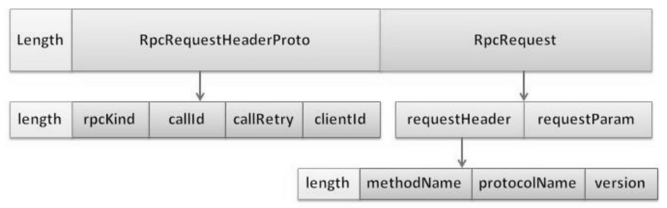

     * **接收响应 Connection.run()**

       Connection 线程负责监听并接收从 Server 发回的 RPC 响应。Connection.run() 方法会调用 waitForWork() 等待执行读取操作，等待结束后调用 receiveRpcResponse() 方法接收 RPC 响应。

       ```java
       public void run() {
         try {
           // 调用 waitForWork()等待
           while (waitForWork()) {
             // 接收响应
             receiveRpcResponse();
           }
         } catch (Throwable t) {
           // 异常都在 receiveRpcResponse 中捕获，这里捕获未知的异常
           markClosed(new IOException("Error reading responses", t));
         }
         // 关闭连接
         close();
       } 
       ```

       waitForWork() 方法会判断当前 Connection 的 calls 队列当中是否有 Call 对象，如果没有则等待 maxTimeOut 时长（calls 队列没有对象则表明 Connection 空闲，没有待发送请求）。等待之后如果还没有数据，则返回 false，并且关闭 Connection 对象。

       ```java
       private synchronized boolean waitForWork() {
         if (calls.isEmpty() && !shouldCloseConnection.get() && running.get()) {
           long timeout = maxIdleTime-(Time.now()-lastActivity.get());
           if (timeout>0) {
             try {
               wait(timeout);
             } catch (InterruptedException e) {}
           }
         }
         if (!calls.isEmpty() && !shouldCloseConnection.get() && running.get()) {
           return true;
         } else if (shouldCloseConnection.get()) {
           return false;
         } else if (calls.isEmpty()) { // 空闲的连接，则关闭
           markClosed(null);
           return false;
         } else { // 仍有等待处理的请求，但是连接被关闭了
           markClosed((IOException)new IOException().initCause(
             new InterruptedException()));
           return false;
         }
       } 
       ```

       等待结束后，调用 receiveRpcResponse()方法接收 RPC 响应。receiveRpcResponse()方法会从输入流中读取序列化对象 RpcResponseHeaderProto，然后根据 RpcResponseHeaderProto 中记录的 callid 字段获取对应的 Call 的对象。接下来 receiveRpcResponse() 方法会从输入流中读取响应消息，然后调用 Call.setRpcResponse() 将响应消息保存在 Call 对象中。如果服务器在处理 RPC 请求时抛出异常，则 receiveRpcResponse() 会从输入流中读取异常信息，并构造异常对象，然后调用 Call.setException() 将异常保存在 Call 对象中。

       保存好响应消息或者异常之后，在 Call 对象上等待的发送请求线程会被唤醒，Client.call() 方法会从 Call 对象中取出保存的响应消息并返回，如果 Call 对象中保存的是异常，则直接抛出异常。

       ```java
       private void receiveRpcResponse() {
         // ...
         try {
           int totalLen = in.readInt();
           RpcResponseHeaderProto header =
             RpcResponseHeaderProto.parseDelimitedFrom(in);
           checkResponse(header);
           int headerLen = header.getSerializedSize();
           headerLen += CodedOutputStream.computeRawVarint32Size(headerLen);
           int callId = header.getCallId();
           Call call = calls.get(callId);
           RpcStatusProto status = header.getStatus();
           // 如果调用成功，则读取响应消息，在 call 实例中设置
           if (status == RpcStatusProto.SUCCESS) {
             Writable value = ReflectionUtils.newInstance(valueClass, conf);
             value.readFields(in); // 读取响应消息
             calls.remove(callId);
             call.setRpcResponse(value);
             // ...
           } else { // RPC 调用失败
             if (totalLen != headerLen) {
               throw new RpcClientException(
                 "RPC response length mismatch on rpc error");
             }
             // 取出响应中的异常消息
             final String exceptionClassName = header.hasExceptionClassName() ?
               header.getExceptionClassName() : "ServerDidNotSetExceptionClassName";
             final String errorMsg = header.hasErrorMsg() ?
               header.getErrorMsg() : "ServerDidNotSetErrorMsg" ;
             final RpcErrorCodeProto erCode =
               (header.hasErrorDetail() ? header.getErrorDetail() : null);
             // 构造异常
             RemoteException re =
               ( (erCode == null) ?
               new RemoteException(exceptionClassName, errorMsg) :
               new RemoteException(exceptionClassName, errorMsg, erCode));
             // 在 Call 对象中设置异常
             if (status == RpcStatusProto.ERROR) {
               calls.remove(callId);
               call.setException(re);
             } else if (status == RpcStatusProto.FATAL) {
               // Close the connection
               markClosed(re);
             }
           }
         } catch (IOException e) {
           markClosed(e);
         }
       } 
       ```


### 2.3.1 Server 类实现

为了提高性能，Server 类采用了很多技术来提高并发能力，包括线程池、JavaNIO 提供的 Reactor 模式等，其中 Reactor 模式贯穿了整个 Server 的设计。

1. **Reactor 模式**

   RPC 服务器端代码的处理流程与所有网络程序服务器端的处理流程类似，都分为 5 个步骤：①读取请求；②反序列化请求；③处理请求；④序列化响应；⑤发回响应。**对于网络服务器端程序来说，如果对每个请求都构造一个线程响应，那么在负载增加时性能会下降得很快；而如果只用少量线程响应，又会在 IO 阻塞时造成响应流程停滞、吞吐率降低**。所以为了解决上述问题，Reactor 模式出现了。

   Reactor 模式是一种广泛应用在服务器端的设计模式，也是一种基于事件驱动的设计模式。Reactor 模式的处理流程是：应用程序向一个中间人注册 IO 事件，当中间人监听到这个 IO 事件发生后，会通知并唤醒应用程序处理这个事件。这里的中间人其实是一个不断等待和循环的线程，它接受所有应用程序的注册，并检查应用程序注册的 IO 事件是否就绪，如果就绪了则通知应用程序进行处理。

   一个简单的基于 Reactor 模式的网络服务器设计如下图所示，包括 reactor、acceptor、以及handler等模块。**reactor负责监听所有的IO事件，当检测到一个新的IO事件发生时，reactor 会唤醒这个事件对应的模块处理。acceptor 则负责响应 Socket 连接请求事件，acceptor 会接收请求建立连接，之后构造 handler 对象。handler 对象则负责向 reactor 注册 IO 读事件，然后从网络上读取请求并执行对应的业务逻辑，最后发回响应**。使用 Reactor 模式的服务器响应客户端请求的流程可以分为如下几个步骤。

   * 客户端发送 Socket 连接请求到服务器，服务器端的 reactor 对象监听到了这个 IO 请求，由于 acceptor 对象在 reactor 对象上注册了 Socket 连接请求的 IO 事件，所以 reactor 会触发 acceptor 对象响应 Socekt 连接请求。
   * acceptor 对象会接收来自客户端的 Socket 连接请求，并为这个连接创建一个 handler 对象，handler 对象的构造方法会在 reactor 对象上注册 IO 读事件。
   * 客户端在连接建立成功之后，会通过 Socket 发送 RPC 请求。RPC 请求到达 reactor 后，会由 reactor 对象分发（dispatch）到对应的 handler 对象处理。
   * handler 对象会从网络上读取 RPC 请求，然后反序列化请求并执行对应的逻辑，最后将响应消息序列化并通过 Socket 发回客户端。至此，一个完整的 RPC 请求流程就结束了。

   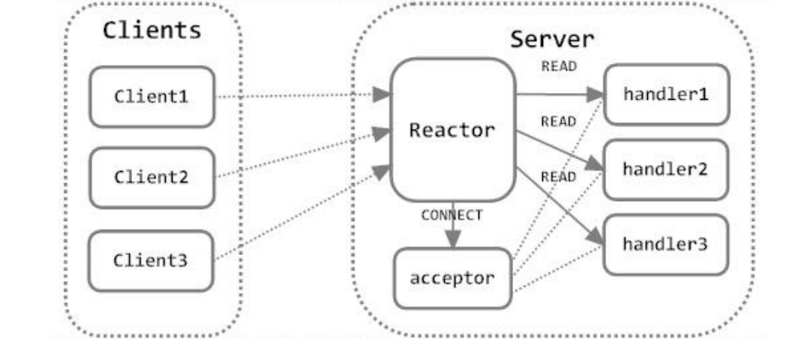

   采用了基于事件驱动模式的 Reactor 结构，服务器只有在指定的 IO 事件发生时才会调用 acceptor 以及 handler 对象提供的方法执行业务逻辑，避免了在 IO 上无谓的阻塞，也就提高了服务器的效率。但是由于**上述设计中服务器端只有一个线程，所以就要求 handler 中读取请求、执行请求以及发送响应的流程必须能够迅速处理完，如果在任意一个环节阻塞了，则整个服务器逻辑全部阻塞**。所以需要进一步改进架构，也就是使用多线程处理业务逻辑。

   对于 handler 处理 RPC 请求的 5 个步骤，我们可以将占用时长较长的读取请求部分以及业务逻辑处理部分交给两个独立的线程池处理。下图给出了使用多线程的 Reactor 模式的网络服务器结构，readers 线程池中包含若干个执行读取 RPC 请求任务的 Reader 线程，它们会在 Reactor 上注册读取 RPC 请求的 IO 事件，然后从网络中读取 RPC 请求，并将 RPC 请求封装在一个 Call 对象中，最后将 Call 对象放入共享消息队列 MQ 中。而 handlers 线程池则包含若干个处理业务逻辑的 Handler 线程，它们会不断地从共享消息队列 MQ 中取出 RPC 请求，然后执行业务逻辑并向客户端发回响应。**这种结构保证了 IO 事件的监听和分发，RPC 请求的读取和响应是在不同的线程中执行的，大大提高了服务器的并发性能**。

   > 使用线程池可以减少线程的个数，那为什么不一开始就使用线程池，而非要引入 Reactor 对象监听？
   >
   > 原因在于阻塞，子线程分配到新的客户端连接后，会对这个套接字进行读写操作，但是对套接字调用 read/write 也是阻塞的，必须要等待这个套接字满足可读/可写条件后 read/write 才会返回。
   >
   > 阻塞的缺点：当线程阻塞在某个 accept、read、write 等这些慢系统调用时，一阻塞就不知道要到什么时候才能解脱。线程阻塞在这上面，又不能处理其他事务，导致白白地浪费线程资源，而且还不知道要浪费到好久。详见：[Reactor模式介绍](https://zhuanlan.zhihu.com/p/428693405)

   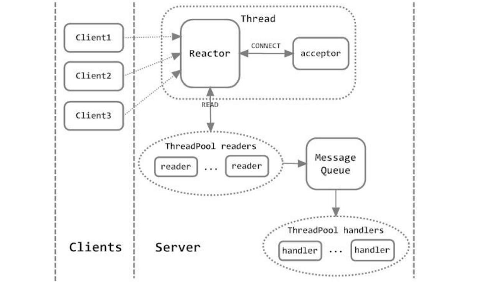

   采用了多线程的 Reactor 模式后，IO 事件的监听、RPC 请求的读取和处理就可以并发地进行了，但是对于像 Namenode 这种分布式集群中的 Master 节点来说，**同一时间可能有非常多的 Socket 连接请求以及 RPC 请求到达，这就可能造成 Reactor 在处理和分发这些 IO 事件时出现拥塞，导致服务器整体性能降低**。所以我们可以将一个 Reactor 对象扩展成多个 Reactor，它们分别用于并发地监听不同的 IO 事件，这样也就提高了 IO 事件的处理效率，同时提高了 RPC 服务器的性能。

   下图给出了使用多个 Reactor 的服务器结构，这里的 **mainReactor 负责监听 Socket 连接事件，readReactor 负责监听 IO 读事件，respondReactor 负责监听 IO 写事件**。由于同一时间到达 RPC 服务器的 RPC 请求可能很多，也就会造成一个 readReactor 要同时处理多个 IO 读事件的分发，当系统负载达到一定量时，readReactor 就有可能成为瓶颈。所以我们**可以构造多个 readReactor 对象，不同的 Reader 线程会根据一定的逻辑到不同的 readReactor 上注册 IO 读事件**。当 acceptor 建立了 Socekt 连接后，会从 readers 线程池中取出一个 Reader 线程触发读取 RPC 请求的流程。Reader 线程会根据一定的逻辑选出一个 readReactor 对象并在这个 readReactor 对象上注册读取 RPC 请求的 IO 事件，之后就会由该 readReactor 在网络上监听是否有 RPC 请求到达，并触发 Reader 线程读取流程了。当 Handler 成功地处理了一个 RPC 请求后，它会向 respondReactor 注册写 RPC 响应 IO 事件，当 Socket 输出流管道可以写数据时，Sender 类就可以将响应信息发回客户端了。

   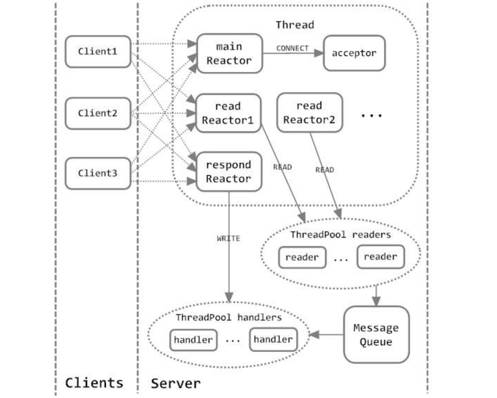

2. **Server 类设计**

   Server 类的设计结构基本上图类似，是一个典型的多线程加多 Reactor 的网络服务器结构。Server 定义了如下几个内部类，可以对比 Reactor 结构中的模块来理解。

   * **Listener**：**类似于 Reactor 模式中的 mainReactor。Listener 对象中存在一个 Selector 对象 acceptSelector，负责监听来自客户端的 Socket 连接请求**。当 acceptSelector 监听到连接请求后，Listener 对象会初始化这个连接，之后采用轮询的方式从 readers 线程池中选出一个 Reader 线程处理 RPC 请求的读取操作。
   * **Reader**：**与 Reactor 模式中的 Reader 线程相同，用于读取 RPC 请求。Reader 线程类中存在一个 Selector 对象 readSelector，类似于 Reactor 模式中的 readReactor，这个对象用于监听网络中是否有可以读取的 RPC 请求**。当 readSelector 监听到有可读的 RPC 请求后，会唤醒 Reader 线程读取这个请求，并将请求封装在一个 Call 对象中，然后将这个 Call 对象放入共享队列 CallQueue 中。
   * **Handler**：**与 Reactor 模式中的 Handler 类似，用于处理 RPC 请求并发回响应**。Handler 对象会从 CallQueue 中不停地取出 RPC 请求，然后执行 RPC 请求对应的本地函数，最后封装响应并将响应发回客户端。为了能够并发地处理 RPC 请求，Server 中会存在多个 Handler 对象。
   * **Responder**：用于向客户端发送 RPC 响应，读者可能会问，在 Handler 中不是已经发送 RPC 响应了吗？为什么还需要再实现一个 Responder 类？这是因为，**在响应很大或者网络条件不佳等情况下，Handler 线程很难将完整的响应发回客户端，这就会造成 Handler 线程阻塞，从而影响 RPC 请求的处理效率**。所以 Handler 在没能够将完整的 RPC 响应发回客户端时，会在 Responder 内部的 respondSelector 上注册一个写响应事件，**这里的 respondSelector 与 Reactor 模式的 respondSelector 概念相同，当 respondSelector 监听到网络情况具备写响应的条件时，会通知 Responder 将剩余响应发回客户端**。

   如下图所示，Server 类处理 RPC 请求的流程可以分为如下几个步骤。

   * Listener 线程的 acceptSelector 在 ServerSocketChannel 上注册 OP_ACCEPT 事件，并且创建 readers 线程池。每个 Reader 的 readSelector 此时并不监听任何 Channel。
   * Client 发送 Socket 连接请求，触发 Listener 的 acceptSelector 唤醒 Listener 线程。
   * Listener 调用 ServerSocketChannel.accept() 创建一个新的 SocketChannel。
   * Listener 从 readers 线程池中挑选一个线程，并在 Reader 的 readSelector 上注册 OP_READ 事件。
   * Client 发送 RPC 请求数据包，触发 Reader 的 selector 唤醒 Reader 线程。
   * Reader 从 SocketChannel 中读取数据，封装成 Call 对象，然后放入共享队列 CallQueue 中。
   * 最初，handlers 线程池中的线程都在 CallQueue（调用 BlockingQueue.take()）上阻塞，当有 Call 对象被放入后，其中一个 Handler 线程被唤醒，然后根据 Call 对象的信息调用 BlockingService 对象的 callBlockingMethod() 方法。随后，Handler 尝试将响应写入 SocketChannel。
   * 如果 Handler 发现无法将响应完全写入 SocketChannel，将在 Responder 的 respondSelector 上注册 OP_WRITE 事件。当 Socket 恢复正常时，Responder 将被唤醒，继续写响应。当然，如果一个 Call 响应在一定时间内都无法被写入，则会被 Responder 移除。

   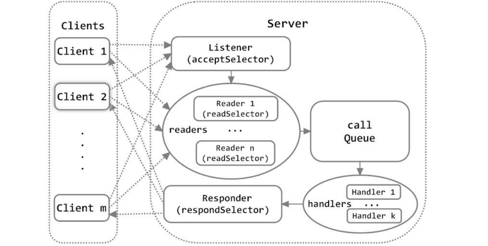

3. **Server 类实现**

   * **内部类 Listener**
   
     **Listener 是一个线程类，整个 Server 中只会有一个 Listener 线程，用于监听来自客户端的 Socket 连接请求**。对于每一个新到达的 Socket 连接请求，Listener 都会从 readers 线程池中选择一个 Reader 线程来处理。
   
     Listener 类中定义了一个 Selector 对象，负责监听 SelectionKey.OP_ACCEPT 事件，Listener 线程的 run() 方法会循环判断是否监听到了 OP_ACCEPT 事件，也就是是否有新的 Socket 连接 请求到达，如果有则调用 doAccept() 方法响应。
   
     ```java
     public void run() {
       while (running) {
         SelectionKey key = null;
         try {
           getSelector().select();
           // 循环判断是否有新的连接建立请求
           Iterator<SelectionKey> iter = getSelector().selectedKeys().iterator();
           while (iter.hasNext()) {
             key = iter.next();
             iter.remove();
             try {
               if (key.isValid()) {
                 if (key.isAcceptable())
                   // 如果有，则调用 doAccept()方法响应
                   doAccept(key);
               }
             } catch (IOException e) {
             }
             key = null;
           }
         } catch (OutOfMemoryError e) {
           // 这里可能出现内存溢出的情况，要特别注意
           closeCurrentConnection(key, e);
           cleanupConnections(true);
           try { Thread.sleep(60000); } catch (Exception ie) {}
         } catch (Exception e) {
           // 捕获到其他异常，也关闭当前连接
           closeCurrentConnection(key, e);
         }
         cleanupConnections(false);
       }
       // running == false 时，关闭 Listener 线程
       // ...
     } 
     ```
   
     doAccept() 方法会接收来自客户端的 Socket 连接请求并初始化 Socket 连接。之后 doAccept() 方法会从 readers 线程池中选出一个 Reader 线程读取来自这个客户端的 RPC 请求。每个 Reader 线程都会有一个自己的 readSelector，用于监听是否有新的 RPC 请求到达。所以 doAccept() 方法在建立连接并选出 Reader 对象后，会在这个 Reader 对象的 readSelector 上注册 OP_READ 事件。那么这里就有一个问题了，Reader 对象在被通知时是怎么知道从哪个 Socket 输入流上读取数据呢？这里就用到了 Connection 类，Connection 类封装了 Server 与 Client 之间的 Socket 连接，doAccept() 方法会通过 SelectionKey 将新构造的 Connection 对象传给 Reader，这样 Reader 线程在被唤醒时就可以通过 Connection 对象读取 RPC 请求了。
   
     ```java
     void doAccept(SelectionKey key) throws IOException, OutOfMemoryError {
       // 接收请求，建立连接
       Connection c = null;
       ServerSocketChannel server = (ServerSocketChannel) key.channel();
       SocketChannel channel;
       while ((channel = server.accept()) != null) {
         channel.configureBlocking(false);
         channel.socket().setTcpNoDelay(tcpNoDelay);
         // 从 readers 线程池中取出一个 Reader 线程
         Reader reader = getReader();
         try {
           // 唤醒处于等待状态的 readSelector
           reader.startAdd();
           // 注册 IO 读事件
           SelectionKey readKey = reader.registerChannel(channel);
           // 构造 Connection 对象，添加到 readKey 的附件传递给 Reader 对象
           c = new Connection(readKey, channel, Time.now());
           readKey.attach(c);
           synchronized (connectionList) {
             connectionList.add(numConnections, c);
             numConnections++;
           }
         } finally {
           reader.finishAdd();
         }
       }
     } 
     ```
   
   * **内部类 Reader**
   
     Reader 也是一个线程类，每个 Reader 线程都会负责读取若干个客户端连接发来的 RPC 请求。而在 Server 类中会存在多个 Reader 线程构成一个 readers 线程池，**readers 线程池并发地读取 RPC 请求，提高了 Server 处理 RPC 请求的速率**。Reader 类定义了自己的 readSelector 字段，用于监听 SelectionKey.OP_READ 事件。Reader 类还定义了 adding 字段标识是否有任务正在添加到 Reader 线程。
   
     Reader 线程的主循环则是在 doRunLoop()方法中实现的，doRunLoop()方法会监听当前 Reader 对象负责的所有客户端连接中是否有新的 RPC 请求到达，如果有则读取这些请求，然后将成功读取的请求用一个 Call 对象封装，最后放入 callQueue 中等待 Handler 线程处理。
   
     ```java
     private volatile boolean adding = false;
     private final Selector readSelector;
     
     private synchronized void doRunLoop() {
       while (running) {
         SelectionKey key = null;
         try {
           readSelector.select();
           // 有任务添加时等待；在任务添加完成之后会被唤醒
           while (adding) {
             this.wait(1000);
           }
           // 在当前的 readSelector 上等待可读事件，也就是有客户端 RPC 请求到达
           Iterator<SelectionKey> iter = readSelector.selectedKeys().iterator();
           while (iter.hasNext()) {
             key = iter.next();
             iter.remove();
             if (key.isValid()) {
               if (key.isReadable()) {
                 // 有可读事件时，调用 doRead()方法处理
                 doRead(key);
               }
             }
             key = null;
           }
         } catch (InterruptedException e) {
           if (running) { // 出现异常，则记录在日志中
             LOG.info(getName() + " unexpectedly interrupted", e);
           }
         } catch (IOException ex) {
           LOG.error("Error in Reader", ex);
         }
       }
     } 
     ```
   
     doRead() 方法负责读取 RPC 请求，虽然 readSelector 监听到了 RPC 请求的可读事件，但是 doRead() 方法此时并不知道这个 RPC 请求是由哪个客户端发送来的，所以 doRead() 方法首先会调用 SelectionKey.attachment() 方法获取 Listener 对象构造的 Connection 对象，Connection 对象中封装了 Server 与 Client 之间的网络连接，之后 doRead() 方法只需调用 Connection.readAndProcess() 方法就可以读取 RPC 请求了。
   
     ```java
     void doRead(SelectionKey key) throws InterruptedException {
       int count = 0;
       // 通过 SelectionKey 获取 Connection 对象
       Connection c = (Connection)key.attachment();
       if (c == null) {
         return;
       }
       c.setLastContact(Time.now());
       
       try {
         count = c.readAndProcess();// 调用 Connection.readAndProcess 处理读取请求
       } catch (InterruptedException ieo) {
         throw ieo;
       } catch (Exception e) {
         count = -1;
       }
       if (count < 0) {
         closeConnection(c);
         c = null;
       }
       else {
         c.setLastContact(Time.now());
       }
     } 
     ```
   
   * **内部类 Connection**
   
     Connection 类维护了 Server 与 Client 之间的 Socket 连接。Reader 线程会调用 readAndProcess() 方法从 IO 流中读取一个 RPC 请求。readAndProcess() 方法会首先从 Socket 流中读取连接头域（connectionHeader），然后读取一个完整的 RPC 请求，最后调用 processOneRpc() 方法处理这个 RPC 请求。processOneRpc() 方法会读取出 RPC 请求头域，然后调用 processRpcRequest() 处理 RPC 请求体。这里特别注意，如果在处理过程中抛出了异常，则直接通过 Socket 返回 RPC 响应（带有 Server 异常信息的响应）。
   
     ```java
     private void processOneRpc(byte[] buf)
         throws IOException, WrappedRpcServerException, InterruptedException {
       int callId = -1;
       int retry = RpcConstants.INVALID_RETRY_COUNT;
       try {
         final DataInputStream dis = new DataInputStream(new ByteArrayInputStream(buf));
         // 解析出 RPC 请求头域
         final RpcRequestHeaderProto header =
           decodeProtobufFromStream(RpcRequestHeaderProto.newBuilder(), dis);
         callId = header.getCallId(); // 从 RPC 请求头域中提取出 callId
         retry = header.getRetryCount(); // 从 RPC 请求头域中提取出重试次数
         checkRpcHeaders(header);
         // 处理 RPC 请求头域异常的情况
         if (callId < 0) { // during connection setup
           processRpcOutOfBandRequest(header, dis);
         } else if (!connectionContextRead) {
           throw new WrappedRpcServerException(
             RpcErrorCodeProto.FATAL_INVALID_RPC_HEADER,
             "Connection context not established");
         } else {
           // 如果 RPC 请求头域正常，则直接调用 processRpcRequest 处理 RPC 请求体
           processRpcRequest(header, dis);
         }
       } catch (WrappedRpcServerException wrse) { // 直接发回异常，通知 Client
         Throwable ioe = wrse.getCause();
         final Call call = new Call(callId, retry, null, this);
         setupResponse(authFailedResponse, call, RpcStatusProto.FATAL, wrse.getRpcErrorCodeProto(), null, ioe.getClass().getName(), ioe.getMessage());
         // 通过 Socket 返回这个带有异常信息的 RPC 响应
         responder.doRespond(call);
         throw wrse;
       }
     }
     ```
   
     对于一个正常的 RPC 请求，processOneRpc() 方法会调用 processRpcRequest() 方法处理，它会从输入流中解析出完整的请求对象（包括请求元数据以及请求参数），然后根据 RPC 请求头的信息（包括 callId）构造 Call 对象（Call 对象保存了这次调用的所有信息），最后将这个 Call 对象放入 callQueue 队列中保存，等待 Handler 线程处理。
   
     ```java
     private void processRpcRequest(RpcRequestHeaderProto header,
        DataInputStream dis) throws WrappedRpcServerException, InterruptedException {
       // ...
       Writable rpcRequest;
       try { // 读取 RPC 请求体
         rpcRequest = ReflectionUtils.newInstance(rpcRequestClass, conf);
         rpcRequest.readFields(dis);
       } catch (Throwable t) {
         // 出现异常则直接抛出，在上一层捕获异常
         throw new WrappedRpcServerException(
         RpcErrorCodeProto.FATAL_DESERIALIZING_REQUEST, err);
       }
       // 构造 Call 对象封装 RPC 请求信息
       Call call = new Call(header.getCallId(), header.getRetryCount(), rpcRequest, this, ProtoUtil.convert(header.getRpcKind()), header.getClientId().toByteArray());
       // 将 Call 对象放入 callQueue 中，等待 Handler 处理
       callQueue.put(call);
       incRpcCount();
     } 
     ```
   
   * **内部类 Handler**
   
     Handler 类也是一个线程类，负责执行 RPC 请求对应的本地函数，然后将结果发回客户端。在 Server 类中会有多个 Handler 线程，它们并发地处理 RPC 请求。Handler 线程类的主方法会循环从共享队列 callQueue 中取出待处理的 Call 对象，然后调用 Server.call() 方法执行 RPC 调用对应的本地函数，如果在调用过程中发生异常，则将异常信息保存下来。接下来 Handler 会调用 setupResponse() 方法构造 RPC 响应，并调用 responder.doRespond()方法将响应发回。
   
     ```java
     while (running) {
       try {
         // ...
         // 从 callQueue 中取出请求
         final Call call = callQueue.take();
         try {
           if (call.connection.user == null) {
             // 通过 call()发起本地调用，并返回结果
             value = call(call.rpcKind, call.connection.protocolName, call.rpcRequest,
               call.timestamp);
           }
           // ...
         } catch (Throwable e) {
           // ...
           // 如果在调用过程中发生异常，则将异常信息保存下来
           if (e instanceof RpcServerException) {
             RpcServerException rse = ((RpcServerException)e);
             returnStatus = rse.getRpcStatusProto();
             detailedErr = rse.getRpcErrorCodeProto();
           } else {
             returnStatus = RpcStatusProto.ERROR;
             detailedErr = RpcErrorCodeProto.ERROR_APPLICATION;
           }
           errorClass = e.getClass().getName();
           error = StringUtils.stringifyException(e);
           String exceptionHdr = errorClass + ": ";
           if (error.startsWith(exceptionHdr)) {
             error = error.substring(exceptionHdr.length());
           }
         }
         CurCall.set(null);
         synchronized (call.connection.responseQueue) {
           // 构造 RPC 响应，如果调用正常就返回结果，有异常则返回异常信息
           setupResponse(buf, call, returnStatus, detailedErr,
               value, errorClass, error);
           // 调用 responder.doRespond()返回响应
           responder.doRespond(call);
         }
       } catch (InterruptedException e) {
         // ...
       } catch (Exception e) {
         // ...
       }
     }
     ```
   
   * **内部类 Responder**
   
     内部类 Responder 也是一个线程类，Server 端仅有一个 Responder 对象，Responder 内部包含一个 Selector 对象 responseSelector，用于监听 SelectionKey.OP_WRITE 事件。当网络环境不佳或者响应信息太大时，Handler 线程可能无法发送完整的响应信息到客户端，这时 Handler 会在 Responder.responseSelector 上注册 SelectionKey.OP_WRITE 事件，responseSelector 会循环监听网络环境是否具备发送数据的条件，之后 responseSelector 会触发 Responder 线程发送未完成的响应结果到客户端。


# 3. NameNode

HDFS 集群是以 Master/Slave 模式运行的，主要有两类节点：Namenode（名字节点）和 Datanode（数据节点）。Namenode 是 HDFS 中的主节点，对于 Namenode 的分析，分为以下几个部分来介绍。

* **文件系统目录树管理**：HDFS 的目录和文件在内存中是以一棵树的形式存储的，这个目录树结构是由 Namenode 维护的，Namenode 会修改这个树形结构以对外提供添加和删除文件等操作功能。文件系统目录树上的节点还保存了 HDFS 文件与数据块的对应关系，我们知道 HDFS 中的每个文件都是被拆分成若干数据块冗余存放的，文件与数据块的对应关系也是由 Namenode 维护的。
* **数据块以及数据节点管理**：HDFS 中的数据块是冗余备份在集群中的数据节点上的，所以 Namenode 还需要维护数据块与数据节点之间的对应关系。这里的对应关系包括两个部分：①数据块存放在哪些数据节点上；②一个数据节点上保存了哪些数据块。
* **租约管理**：租约是 Namenode 给予租约持有者（LeaseHolder，一般是 HDFS 客户端）在规定时间内拥有文件权限（写文件）的合同，Namenode 会执行租约的发放、回收、检查以及恢复等操作。
* **缓存管理**：Hadoop 2.3.0 版本新增了集中式缓存管理功能（Centralized Cache Management），允许用户将一些文件和目录保存到 HDFS 缓存中。HDFS 的集中式缓存是由分布在 Datanode 上的堆外内存组成的，并且由 Namenode 统一管理。
* **FSNamesystem**：Namenode 涉及很多 HDFS 的处理逻辑，例如读文件、写文件、追加写文件等，Namenode 的 FSNamesystem 类是管理这些逻辑的门面类，也是 Namenode 中最重要的一个类。
* **Namenode 的启动和停止**：Hadoop 2.X 实现中提供了 HA 功能，HA 集群中会存在两种状态的 Namenode：Active Namenode 作为服务节点，Standby Namenode 作为热备节点。Namenode 在启动时会先进入安全模式，在安全模式中的 Namenode 不会接受客户端对命名空间的修改，Namenode 成功启动后会离开安全模式进入 Standby 状态。


## 3.1 文件系统目录树

Namenode 最重要的两个功能之一就是维护文件系统的命名空间（namesystem）。HDFS 文件系统的命名空间（namespace）是以“/”为根的整个目录树，是通过 FSDirectory 类来管理的。

HDFS 文件系统的命名空间在 Namenode 的内存中是以一颗树的结构来存储的。**在 HDFS 中，不管是目录还是文件，在文件系统目录树中都被看作是一个 INode 节点。如果是目录，则其对应的类为 INodeDirectory；如果是文件，则其对应的类为 INodeFile。INodeDirectory 以及 INodeFile 类都是 INode 的派生类**。INodeDirectory 中包含一个成员集合变量 children，如果该目录下有子目录或者文件，其子目录或文件的 INode 引用就会被保存在 children 集合中。HDFS 就是通过这种方式来维护整个文件系统的目录结构的。

HDFS 会将命名空间保存到 Namenode 的本地文件系统上一个叫 fsimage（命名空间镜像）的文件中。利用这个文件，Namenode 每次重启时都能将整个 HDFS 的命名空间重构，fsimage 文件的操作由 FSImage 类负责。另外，对 HDFS 的各种操作，Namenode 都会在操作日志（editlog）中进行记录，以便周期性地将该日志与 fsimage 进行合并生成新的 fsimage。该日志文件也在 Namenode 的本地文件系统中保存，叫 editlog 文件，editlog 的相关操作由 FSEditLog 类管理。

### 3.1.1 INode 相关类

Linux 的 inode，即索引节点保存了 Linux 文件的元信息，如文件类型与权限、所有者标识和以字节为单位的文件长度等。在索引节点的后半部分，则存放着数据块索引，也就是文件或目录数据在磁盘上的位置。HDFS 就是借鉴了 Linux 的 inode，将 HDFS 中文件和目录的抽象类命名为 INode。

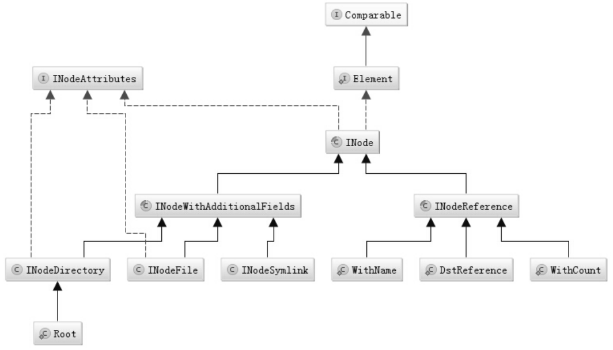

1. **INode 抽象类**

   INode 类是整个 INode 体系的根接口，它是一个抽象类，保存了 HDFS 目录和文件的所有共同属性，包括当前节点的父节点的 INode 对象的引用（只能是 INodeDirectory 类或者 INodeReference 类）、文件/目录名、用户组、访问权限、最后修改时间、上次访问时间、完整 、路径名、文件扩展属性等。INode 类实现了 INodeAttributes 接口，这个接口包括以下 7 个字段的 get 方法。

   * **userName**：文件/目录所属用户名。
   * **groupName**：文件/目录所属组名。
   * **fsPermission**：文件/目录访问权限。
   * **aclFeature**：安全相关。
   * **modificationTime**：文件/目录上次修改时间。
   * **accessTime**：文件/目录上次访问时间。
   * **XAttrFeature**：当前文件/目录的扩展属性（ExtendedAttributes）。文件系统扩展属性是目前流行的 POSIX 系统中文件系统具有的一项特殊功能，可以给文件、文件夹添加额外的 key/value 键值对，键和值都是字符串并且有一定长度的限制。文件系统扩展属性使得现有的文件系统得以支持在原始设计中未提供的功能。

   INode 抽象类除了实现 INodeAttributes 接口中的方法外，还定义了 INode 元信息的 get 与 set 接口方法。INode 元信息包括如下一些信息。

   * **id**：INode 的 id。
   * **name**：文件/目录的名称。
   * **fullPathName**：文件/目录的完整路径。
   * **parent**：文件/目录的父节点。

   同时 INode 还提供了如下几个基本的判断方法。

   * **isFile()**：判断是否为文件。
   * **isDirectory()**：判断是否为目录。
   * **isSymlink()**：判断是否为符号链接。
   * **isRoot()**：判断是否为文件系统目录树的根节点。

   需要注意的是，**INode 类的设计采用了模板模式。INode 类定义的方法多为两个，其中一个是 final 的接口方法，用于规范接口的调用；另一个则是 abstract 的抽象方法，抽象方法留给子类具体实现**。INode 类实现的 INodeAttributes 接口中定义的方法就是采用了这种模式，将 userName 等字段的定义留给子类实现，以 setUser() 方法为例。

   ```java
   // 抽象方法，具体实现留给子类
   abstract void setUser(String user);
   
   // 模板方法，是 final 的，不可以继承，供接口调用
   final INode setUser(String user, int latestSnapshotId) throws QuotaExceededException {
     recordModification(latestSnapshotId);
     setUser(user);
     return this;
   } 
   ```

   **INode 类中只有一个字段，就是 parent，表明当前 INode 的父目录**。HDFS 中除了根目录外，其他所有的文件与目录都存在一个父目录。注意，父目录的类型只能是 INodeDirectory 类或 INodeReference 类。

2. **INodeWithAdditionalFields 类**

   INode 类只定义了一个字段 parent，其余字段的值都是通过抽象的 get()方法获得的，并且留给了子类来定义。INodeWithAdditionalFields 类就定义了这些字段：id、name、permission、modificationTime、accessTime 等，并且覆盖了 INode 中对应的抽象方法。

   **permission 字段主要包括 3 个部分的信息：用户信息、用户组信息和权限信息**。permission 字段是 long 类型的，其中前 16 个比特用来存放文件模式标识（mode，类似于 Linux 中的 777），中间 25 个比特用来存放用户组标识（group），最后 23 个比特用来存放用户名标识（user）。**枚举类 PermissionStatusFormat 就是用来解析以及处理 permission 字段的工具类**，提供了获取 permission 字段中 mode、group、user 部分对应的文件模式、用户组名以及用户名的方法。在 HDFS 中，用户名和用户标识的对应关系、用户组名和用户组标识的对应关系都保存在 SerialNumberManager 类中。**通过 SerialNumberManager 类，名字节点不必在 INode 对象中保存字符串形式的用户名和用户组名，只需将整型的用户名标识和用户组名标识放入 permission 字段中即可**。节省了 INode 对象对内存的占用，是一个非常巧妙的优化。

   ```java
   static enum PermissionStatusFormat {
     MODE(null, 16),
     GROUP(MODE.BITS, 25),
     USER(GROUP.BITS, 23);
     
     // 使用 LongBitFormat 类来存储与操作底层的 permission 字段
     final LongBitFormat BITS;
     
     private PermissionStatusFormat(LongBitFormat previous, int length) {
       BITS = new LongBitFormat(name(), previous, length, 0);
     }
     
     // 提取最后 23 个比特的 user 信息，并通过 SerialNumberManager 获取用户名
     static String getUser(long permission) {
       // 首先获取 permission 中最后 23 个比特的用户标识
       final int n = (int)USER.BITS.retrieve(permission);
       // 通过 SerialNumberManager 类获取用户标识对应的用户名
       return SerialNumberManager.INSTANCE.getUser(n);
     }
     
     // 提取中间 25 个比特的 group 信息，并通过 SerialNumberManager 获取用户组名
     static String getGroup(long permission) {
       // 首先获取 permission 中间 25 个比特的用户组标识
       final int n = (int)GROUP.BITS.retrieve(permission);
       // 使用 SerialNumberManager 获取用户组标识对应的用户组名
       return SerialNumberManager.INSTANCE.getGroup(n);
     }
     
     // 提取前 16 个比特的 mode 信息
     static short getMode(long permission) {
       return (short)MODE.BITS.retrieve(permission);
     }
     
     // 将一个 PermissionStatus 类，转换成 long 类型的 permission 信息
     static long toLong(PermissionStatus ps) {
       long permission = 0L;
       final int user = SerialNumberManager.INSTANCE.getUserSerialNumber(
           ps.getUserName());
       permission = USER.BITS.combine(user, permission);
       final int group = SerialNumberManager.INSTANCE.getGroupSerialNumber(
           ps.getGroupName());
       permission = GROUP.BITS.combine(group, permission);
       final int mode = ps.getPermission().toShort();
       permission = MODE.BITS.combine(mode, permission);
       return permission;
     }
   }
   ```

   **HDFS 将磁盘配额、正在构建（UnderConstrution）、快照（Snapshot）等功能抽象成 INode 的特性（Feature），可以将特性添加到 INode 上，使该 INode 具备该特性的功能**。INodeWithAdditionalFields 类 features 字段就是用来保存当前INode 拥有哪些特性的字段，它是一个 Feature 类型的数组，默认值是空数组 EMPTY_FEATURE，同时它提供了向 INode 添加、删除以及查询特性的方法，这些方法的底层还是对 features 数组的操作。

   ```java
   private static final Feature[] EMPTY_FEATURE = new Feature[0];
   protected Feature[] features = EMPTY_FEATURE;
   
   protected void addFeature(Feature f) {
     int size = features.length;
     Feature[] arr = new Feature[size + 1];// 申请一个更大的数组
     if (size != 0) {
       System.arraycopy(features, 0, arr, 0, size);// 将原 features 数组拷贝到现在数组中
     }
     arr[size] = f; // 将新的 Feature 对象添加到数组中
     features = arr; // 用新数组替换 features 引用
   }
   ```

3. **INodeDirectory 类**

   INodeDirectory 抽象了 HDFS 文件系统中的目录，目录是文件系统中的一个虚拟容器，里面保存了一组文件和其他一些目录。在 INodeDirectory 的实现中，添加了成员变量 children，用来保存目录中所有子目录项的 INode 对象。其中的方法分为如下几类：

   * **子目录项相关方法**：用于向当前目录添加、删除、替换、查找子目录项等操作。INodeDirectory 作为目录容器，最主要的功能就是**维护目录中保存的文件以及子目录，也就是维护 children 字段**。需要注意的是，在 HDFS 2.6 版本的代码中引入了快照（Snapshot）特性。**当 HDFS 管理员在当前 INodeDirectory 上建立了快照之后，任何对于子目录项的操作都需要在快照中进行记录**。没有开启快照功能的 INodeDirectory 中子目录项的操作方法都比较简单，就是操作 children 这个集合。

     ```java
     public boolean addChild(INode node) {
      // 首先找到 INode 节点在 children 列表中的位置
      final int low = searchChildren(node.getLocalNameBytes());
      if (low >= 0) {
        return false;
      }
      // 调用 addChild()方法将 INode 节点插入到 children 列表的 low 位置
      addChild(node, low);
      return true;
     }
     
     public boolean removeChild(final INode child) {
       // 找到 INode 节点在 children 列表中的位置
       final int i = searchChildren(child.getLocalNameBytes());
       if (i < 0) {
         return false;
       }
       // 从 chilren 列表中删除
       final INode removed = children.remove(i);
       Preconditions.checkState(removed == child);
       return true;
     }
     ```

   * **特性相关方法**：用于向当前 INodeDirectory 添加新的 Feature 对象，以及获取指定 Feature 对象。

     ```java
     // 向当前目录添加磁盘配额特性
     DirectoryWithQuotaFeature addDirectoryWithQuotaFeature(
         long nsQuota, long dsQuota) {
       // 构造 DirectoryWithQuotaFeature 对象，调用 addFeature()方法添加到 features 集合中
       final DirectoryWithQuotaFeature quota = new DirectoryWithQuotaFeature(
           nsQuota, dsQuota);
       addFeature(quota);
       return quota;
     }
     
     // 获取当前目录磁盘配额特性对应的 DirectoryWithQuotaFeature 对象
     public final DirectoryWithQuotaFeature getDirectoryWithQuotaFeature() {
       // 从 features 集合中查找 Feature 对象
       return getFeature(DirectoryWithQuotaFeature.class);
     }
     ```

   * **快照相关方法**：用于向当前目录添加、删除或者更改快照等操作，包括 addSnapshot()、getDiffs()、getSnapshot() 等方法的实现，这部分内容将在 SnapshotFeature 实现小节中介绍。

4. **INodeFile 类**

   在文件系统目录树中，使用 INodeFile 类抽象一个 HDFS 文件，该类继承自 INodeWithAdditionalFields 类，保存了 HDFS 文件最重要的两个信息：文件头 header 字段和文件对应的数据块信息 blocks 字段。**header 字段保存了当前文件有多少个副本，以及文件数据块的大小（header 字段的处理类似于 INode 中的 permission 字段，前 4 个比特用于保存存储策略，中间 12 个比特用于保存文件备份系数，后 48 个比特用于保存数据块大小。使用内部类 HeaderFormat 处理）；blocks 字段是一个 BlockInfo 类型的数组，保存了当前文件对应的所有数据块信息**。

   ```java
   private long header = 0L; // 文件头信息
   private BlockInfo[] blocks; // 文件数据块信息
   ```

   BlockInfo 类继承自 Block 类，它保存了数据块与文件、数据块与数据节点的对应关系。从 BlockInfo 对象可以获得数据块所属的文件，即文件的 INodeFile 对象，也可以获得保存数据块副本的所有数据节点的信息。INodeFile 中的方法可以分为以下几个部分：

   * **构建（Under Construction）特性相关方法**：**当 HDFS 客户端写文件时，该文件就处于构建状态**。 HDFS 2.6 版本中，通过在 INodeFile 中添加 FileUnderConstructionFeature 特性来表示文件处于构建状态。方法包括 getFileUnderConstructionFeature() 、 isUnderConstruction() 、 toUnderConstruction() 、 toCompleteFile()、removeLastBlock()、setLastBlock() 等。
   * **快照（Snapshot）特性相关方法**：对处于快照中的文件进行修改时，HDFS 会首先向这个文件添加 FileWithSnapshotFeature 特性，表明这个文件在快照中。方法包括 addSnapshotFeature()、getFileWithSnapshotFeature()、recordModification()、getDiffs() 等。
   * **其他方法**：主要包括获取和修改 header 字段信息的方法，以及对 blocks 数组字段进行操作的方法。

5. **INodeReference**

   **当 HDFS 文件/目录处于某个快照中，并且这个文件/目录被重命名或者移动到其他路径时，该文件/目录就会存在多条访问路径。INodeReference 及其子类就是为了解决这个问题而产生的**。

   举个例子，/abc 是 HDFS 文件系统中的一个普通目录，管理员为/abc 目录建立了一个快照 s0，/abc 目录下有一个文件 foo。根据快照功能的定义，用户可以通过路径/abc/foo 以及/abc/snapshot/s0/foo 访问 foo 文件。 当用户将/abc/foo 文件重命名为/xyz/bar 时，通过快照路径/abc/snapshot/s0/foo 将无法访问 foo 文件，这种情况是不符合快照规范的。

   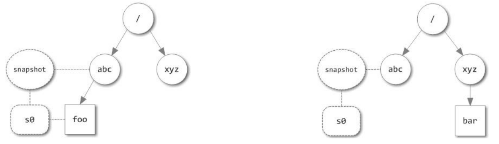

   WithName、WithCount、DstReference 都是 INodeReference 的子类，同时也是 INodeReference 的内部类。**WithName 对象用于替代重命名操作前源路径中的 INode 对象，DstReference 对象则用于替代重命名操作后目标路径中的 INode 对象。WithName 和 DstReference 共同指向了一个 WithCount 对象，WithCount 对象则指向了文件系统目录树中真正的 INode 对象**。

   下图给出了使用 INodeReference 后的文件目录树，当进行重命名操作时，Namenode 会在/abc 目录下添加 INodeReference.WithName 节点替代重命名前的 foo 节点，在 /xyz 目录下添加 INodeReference.DstReference 节点替代重命名后的 bar 节点。INodeReference.WithName 以及 INodeReference.DstReference 则共同指向一个 INodeReference.withCount 节点，INodeReference.withCount 节点指向真实的 INode 节点 bar。这样，无论用户是通过 /xyz/bar 路径还是 /abc/snapshot/s0/foo 快照路径访问文件，都可以通过获取到 withCountReference 对象的引用找到真正的 INode 节点 bar，也就解决了这个问题。

   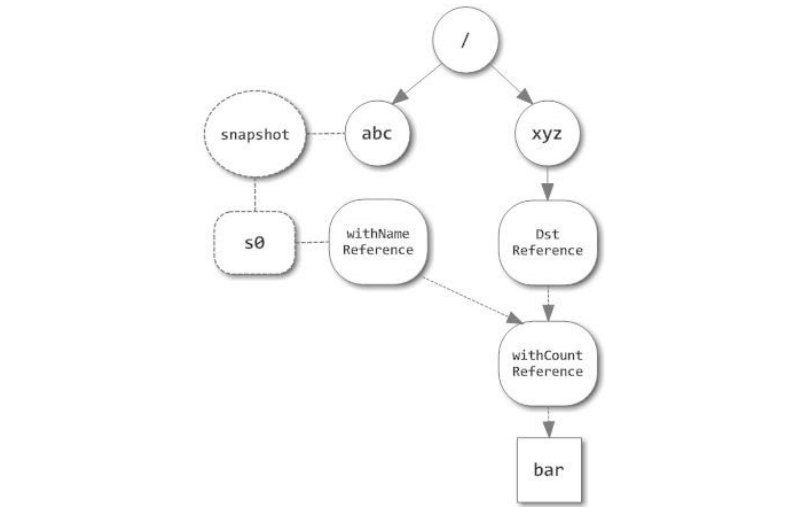

   **INodeReference 是一个抽象类，它扩展自 INode 类，所以 INodeReference 及其子类是可以添加到文件系统目录树中以替代原有的 INodeFile 节点的。INodeReference 定义了 referred 字段，这个字段非常重要，用于保存当前 INodeReference 类指向的 INode 节点**。例如，对于 INodeReference 的子类 WithName 和 DstReference 来说，referred 字段就指向了 WithCount 对象；而对于 WithCount 来说，referred 字段则指向了文件系统目录树中真正的 INode 对象。INodeReference 抽象类还定义了 getReferredINode() 方法，在文件系统目录树的操作中，如果判断当前节点是一个引用节点，则会调用 getReferredINode() 方法获取 INodeReference 类指向的 INode 对象。

   ```java
   public abstract class INodeReference extends INode {
     private INode referred;// 指向的 INode 节点
     public INodeReference(INode parent, INode referred) {
       super(parent);
       this.referred = referred;
     }
     public final INode getReferredINode() { // 获取指向的 INode 节点
       return referred;
     }
     public final void setReferredINode(INode referred) {
       this.referred = referred;
     }
     //...
   } 
   ```

   WithCount 类定义了一个集合字段 withNameList 用于保存所有指向这个 WithCount 对象的 WithName 对象的集合。WithCount 类还定义了 addReference()方法，任何指向 WithCount 对象的 WithName 对象以及 DstReference 对象都需要调用这个方法来添加指向关系。**对于指向这个 WithCount 对象的 DstReference 对象，addReference() 方法会将这个对象设置为自己的父 INode 节点（通过 INode.parent 字段）；而对于 WithName 对象，addReference() 方法则将这个对象放入 withNameList 集合中保存**。

   ```java
   public static class WithCount extends INodeReference {
     // 保存所有指向这个 WithCount 对象的 WithName 对象的集合
     private final List<WithName> withNameList = new ArrayList<WithName>();
     
     public WithCount(INodeReference parent, INode referred) {
       super(parent, referred); // 调用父类的构造方法，指向文件系统目录树中的 INode
       Preconditions.checkArgument(!referred.isReference());
       referred.setParentReference(this); // 设置真实 INode 的父节点为当前 WithCount 对象
     }
     
     public void addReference(INodeReference ref) {
       if (ref instanceof WithName) { // 如果是 WithName 对象，则加入 withNameList
         WithName refWithName = (WithName) ref;
         int i = Collections.binarySearch(withNameList, refWithName,
         WITHNAME_COMPARATOR);
         Preconditions.checkState(i < 0);
         withNameList.add(-i - 1, refWithName);
       } else if (ref instanceof DstReference) { // 如果是 DstReference 对象，则设置为父节点
         setParentReference(ref);
       }
     }
     // ...
   } 
   ```

   WithName 类定义了 name 字段用于保存重命名前文件的名称，同时定义了 lastSnapshotId 字段用于保存 WithName 对象构造时源路径的快照版本号。DstReference 类则只定义了一个 dstSnapshotId 字段用于保存重命名操作前目标路径的最新快照的版本号。WithName 和 DstReference 在构造时都会调用父类的构造方法指向 WithCount 对象，同时还会调用 WithCount. addReference()方法配置 WithCount 对象。

   ```java
   public static class WithName extends INodeReference {
     private final byte[] name; // 重命名前的文件名
     private final int lastSnapshotId;
     public WithName(INodeDirectory parent, WithCount referred, byte[] name,
         int lastSnapshotId) {
       super(parent, referred);// 调用父类构造方法，指向 WithCount 节点
       this.name = name;
       this.lastSnapshotId = lastSnapshotId;
       referred.addReference(this); // 调用 WithCount.addReference()
     }
     // ...
   }
   
   public static class DstReference extends INodeReference {
     private final int dstSnapshotId;
     public DstReference(INodeDirectory parent, WithCount referred,
         final int dstSnapshotId) {
       super(parent, referred);// 调用父类构造方法，指向 WithCount 节点
       this.dstSnapshotId = dstSnapshotId;
       referred.addReference(this);// 调用 WithCount.addReference()
     }
     // ...
   }
   ```

   建立 INodeReference 节点操作的入口是 FsDirectory.RenameOperation，只有在进行 rename 操作时，也就是将一个快照中的 INode 节点重命名为另一个路径下的 INode 节点时才有可能创建 INodeReference 节点。这里我们看一下 RenameOperation 的具体操作。RenameOperation 构造方法首先判断 Rename 操作的源节点是否在快照中，如果在快照中，则调用 INodeDirectory.replaceChild4ReferenceWithName()方法构造 INodeReferece. WithName 对象，并将 INodeDirectory 中的 srcINode 对象全部替换为该对象（需要特别注意的是，如果 srcINode 存在于快照 diff 对象的 c-list 列表中，也是需要替换的）。

   完成了对 withCount 的构造之后，就可以调用 addSourceToDestination() 方法将源节点或者 dst 节点添加到目标路径了。这里分为两种情况：withCount==null，也就是普通的重命名操作，则不需要使用 INodeReference 机制，在这种情况下直接将源 INode 节点添加到目标路径即可； withCount!=null，也就是需要使用 INodeReference 机制的情况，这里则构造 DstReference 对象，然后将这个 DstReference 对象添加到目标路径即可。这里注意，DstReference 对象的构造方法会将 DstReference.referred 字段设置为 WithCount 对象，然后设置 WithCount 对象的父节点为当前 DstReference 对象。


### 3.1.2 Feature 相关类

HDFS 定义了 INode.Featrue 接口抽象 INode 特性的根接口，INode 的所有特性都实现了这个接口，每个特性都对应一个 Feature 子类，包括：

* **DirectoryWithSnapshotFeature**：带有快照的目录特性。
* **DirectorySnapshottableFeature**：可以添加快照的目录特性。
* **FileWithSnapshotFeature**：带有快照的文件特性。
* **DirectoryWithQuotaFeature**：支持磁盘配额的目录特性。
* **FileUnderConstructionFeature**：正在构建的文件特性。
* **XAttrFeature**：支持文件系统扩展属性的特性。
* **AclFeature**：安全特性。

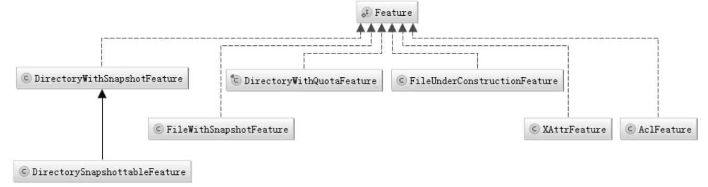

1. **SnapshotFeature 实现**

   先以一个例子来分析整个快照功能执行的流程。左边的树是一棵普通的文件系统目录树。当管理员执行“hdfs dfsadmin-allowSnapshot”命令在目录 a 上开启快照功能后，HDFS 会创建一个 DirectorySnapshottableFeature 对象，然后将这个新创建的 Feature 对象添加到目录 a 对应的 INodeDirectory 对象的 features 集合中。

   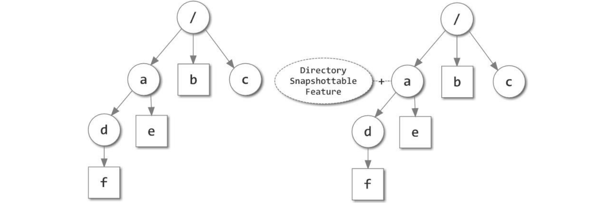

   成功开启目录 a 的快照功能后，管理员就可以执行“hdfs dfs-createSnapshot”命令在目录 a 下创建一个快照 s1。HDFS 会创建一个 DirectoryDiff 对象记录 s1 快照创建之后目录 a 上执行的所有操作，并将这个新创建的 DirectoryDiff 对象添加到 DirectorySnapshottableFeature 的 DirectoryDiffList 对象中保存。DirectoryDiff 会通过持有一个 ChildrenDiff 对象记录目录 a 的子目录项的变化情况，**ChildrenDiff 对象的 c-list 集合保存了快照创建之后目录 a 下所有新添加的文件或者目录，ChildrenDiff 对象的 d-list 集合则保存了快照创建之后从目录 a 删除的文件或者目录**。成功创建快照 s1 后，当我们从目录 a 删除文件 e 时，文件 e 并不会直接从 INodeDirectory 中完全删除，而是暂时保存在快照 s1 对应的 DirectoryDiff 对象的 d-list 集合中。

   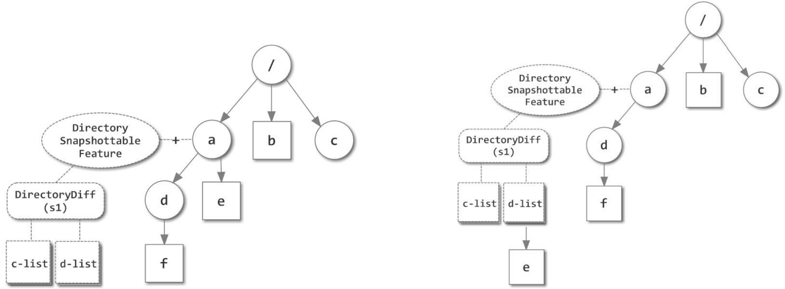

   删除文件 e 之后，我们在目录 a 下再创建一个快照 s2，然后向目录 a 添加一个文件 g。HDFS 会在 DirectorySnapshottableFeature 对象上添加一个新的 DirectoryDiff 对象记录快照 s2 创建之后在目录 a 上进行的所有操作，**这样快照 s1 对应的 DirectoryDiff 对象就记录了快照 s1 和快照 s2 之间目录 a 上执行的操作**。成功创建 DirectoryDiff 对象之后，HDFS 将新添加的文件 g 放入 DirectoryDiff 的 c-list 集合中保存。当用户在快照 s1 上检索文件 e 时，由于文件 e 保存在快照的 d-list 中，所以文件可以正常返回。当用户在快照 s2 上检索文件 g 时，由于文件 g 在 c-list 中，即新创建的文件，HDFS 会返回空，表明快照 s2 创建时 a 目录下并没有这个文件。

   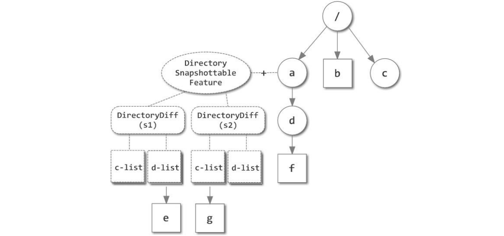

2. **FileUnderConstructionFeature 实现**

   **FileUnderConstructionFeature 构建状态描述的是当客户端为写或者追加写（append）数据打开 HDFS 文件时，文件所处的状态就是构建状态**。当客户端打开一个文件进行写或追加写操作前，会首先调用 INodeFile.toUnderConstruction() 方法将该文件转变为构建状态。

   ```java
   INodeFile toUnderConstruction(String clientName, String clientMachine) {
     Preconditions.checkState(!isUnderConstruction(), "file is already under construction");
     // 构造 FileUnderConstructionFeature 对象
     FileUnderConstructionFeature uc = new FileUnderConstructionFeature(
         clientName, clientMachine);
     // 添加到 INode 的 features 字段中保存
     addFeature(uc);
     return this;
   } 
   ```

   HDFS 写文件和追加写（append）文件的流程是非常复杂的，所以 FileUnderConstructionFeature 中需要记录一些与写操作相关的属性，包括：

   * clientName：发起文件写操作的客户端名称，这个属性也用于租约管理功能。在 HDFS 中，租约是名字节点维护的给予客户端在一定期限内可以进行文件写操作的权限的合同。
   * clientMachine：客户端所在主机。


### 3.1.3 FSEditLog 类

在 Namenode 中，命名空间（namespace，指文件系统中的目录树、文件元数据等信息）是被全部缓存在内存中的，一旦 Namenode 重启或者宕机，内存中的所有数据将会全部丢失，所以必须要有一种机制能够将整个命名空间持久化保存，并且能在 Namenode 重启时重建命名空间。

目前 Namenode 的实现是将命名空间信息记录在一个叫作 fsimage（命名空间镜像）的二进制文件中，fsimage 将文件系统目录树中的每个文件或者目录的信息保存为一条记录，每条记录中包括了该文件（或目录）的名称、大小、用户、用户组、修改时间、创建时间等信息。Namenode 重启时，会读取这个 fsimage 文件来重构命名空间。但是 fsimage 始终是磁盘上的一个文件，不可能时时刻刻都跟 Namenode 内存中的数据结构保持同步，并且 fsimage 文件一般都很大（GB 级别的很常见），如果所有的更新操作都实时地写入 fsimage 文件，则会导致 Namenode 运行得十分缓慢，所以 HDFS 每过一段时间才更新一次 fsimage 文件。

editlogg（编辑日志） 是一个日志文件，HDFS 客户端执行的所有写操作首先会被记录到 editlog 文件中。HDFS 会定期地将 editlog 文件与 fsimage 文件进行合并，以保持 fsimage 跟 Namenode 内存中记录的命名空间完全同步。 在 HDFS 源码中，使用 FSEdiltLog 类来管理 editlog 文件。和 fsimage 文件不同，editlog 文件会随着 Namenode 的运行实时更新，所以 FSEditLog 类的实现依赖于底层的输入流和输出流，同时 FSEditLog 类还需要对外提供大量的 log*() 方法用于记录命名空间的修改操作。

1. **transactionId 机制**

   HDFS 的 editlog 文件可以存放在多种容器中，比如文件系统（FileJournalManager 类管理）、共享 NFS（BackupJournalManager 类管理）、Bookkeeper（BookkeeperJournalManager 类管理）等。而管理这些不同容器内文件的方法也有很多种，目前 HDFS 采用的是基于 transactionId 的日志管理方法。

   下图显示的是在 Namenode 元数据文件夹中运行 tree 命令的结果，Namenode 元数据文件夹是存放 fsimage 文件和 editlog 文件的文件夹，由 hdfs-site.xml 配置文件的 dfs.namenode.name.dir 配置项配置。在这个示例中，元数据文件夹是 data/dfs/name 目录。

   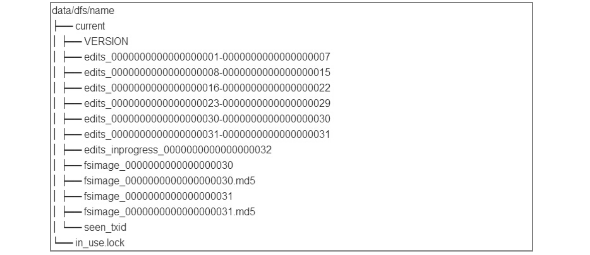

   TransactionId 与客户端每次发起的 RPC 操作相关，当客户端发起一次RPC请求对 Namenode 的命名空间修改后，Namenode 就会在 editlog 中发起一个新的 transaction 用于记录这次操作，每个 transaction 会用一个唯一的 transactionId 标识。

   * **edits_start transaction id-end transaction id**：即 editlog 文件，edits 文件中存放的是客户端执行的所有更新命名空间的操作。**每个 edits 文件都包含了文件名中 start trancsaction id – end transaction id 之间的所有事务**。
   * **edits_inprogress_start transaction id**：**正在进行处理的 editlog，所有从 start transaction id 开始的新的修改操作都会记录在这个文件中，直到 HDFS 重置（roll）这个日志文件**。重置操作会将 inprogress 文件关闭，并将 inprogress 文件改名为正常的 editlog 文件（如上一项所示），同时还会打开一个新的 inprogress 文件，记录正在进行的事务。如 edits_inprogress_00032 文件，记录了所有 transaction id 大于 32 的新开始的事务，我们将这个事务区间称为一个日志段落（segment）。**Namenode 元数据文件夹中存在这个文件有两种可能，要么是 Active Namenode 正在写入数据，要么是前一个 Namenode 没有正确地关闭**。
   * **fsimage_end transaction id**：**fsimage 文件是 Hadoop 文件系统元数据的一个永久性的检查点，包含 Hadoop 文件系统中 end transaction id 前的完整的 HDFS 命名空间元数据镜像，也就是 HDFS 所有目录和文件对应的 INode 的序列化信息**。如 fsimage_00031 就是 fsimage_00030 与 edits_00031-00031 合并后的镜像文件，保存了 transaction id 小于 32 的 HDFS 命名空间的元数据。每个 fsimage 文件还有一个对应的 md5 文件，用来确保 fsimage 文件的正确性，以防止磁盘异常发生。
   * **seen_txid**：**保存上一个检查点（checkpoint）（合并 edits 和 fsimage 文件）以及编辑日志重置（editlog roll）时最新的事务 id（transaction id）**。要注意的是，这个事务 id 并不是 Namenode 内存中最新的事务 id，因为 seen_txid 只在检查点操作以及编辑日志重置操作时更新。该文件的作用在于 Namenode 启动时，可以利用这个文件判断是否有 edits 文件丢失。如 Namenode 使用不同的目录保存 fsimage 以及 edits 文件，如果保存 edits 的目录内容丢失，Namenode 将会使用上一个检查点保存的 fsimage 启动，那么上一个检查点之后的所有事务都会丢失。为了防止发生这种状况，Namenode 启动时会检查 seen_txid 并确保内存中加载的事务 id 至少超过 seen_txid；否则 Namenode 将终止启动操作。

2. **FSEditLog 状态机**

   FSEditLog 类被设计成一个状态机，用内部类 FSEditLog.State 描述，有以下 5 个状态：

   * **UNINITIALIZED**：editlog 的初始状态。
   * **BETWEEN_LOG_SEGMENTS**：editlog 的前一个 segment 已经关闭，新的还没开始。
   * **IN_SEGMENT**：editlog 处于可写状态。
   * **OPEN_FOR_READING**：editlog 处于可读状态。
   * **CLOSED**：editlog 处于关闭状态。

   对于非 HA 机制的情况，FSEditLog 应该开始于 UNINITIALIZED 或者 CLOSED 状态（因为在构造 FSEditLog 对象时，FSEditLog 的成员变量 state 默认为 State.UNINITIALIZED）。FSEditLog 初始化完成之后进入 BETWEEN_LOG_SEGMENTS 状态，表示前一个 segment 已经关闭，新的还没开始，日志已经做好准备了。当打开日志服务时，改变 FSEditLog 状态为 IN_SEGMENT 状态，表示可以写 editlog 文件了。

   对于 HA 机制的情况，FSEditLog 同样应该开始于 UNINITIALIZED 或者 CLOSED 状态，但是在完成初始化后 FSEditLog 并不进入 BETWEEN_LOG_SEGMENTS 状态，而是进入 OPEN_FOR_READING 状态（因为目前 **Namenode 启动时都是以 Standby 模式启动的，然后通过 DFSHAAdmin 发送命令把其中一个 Standby NameNode 转换成 Active Namenode**）。

   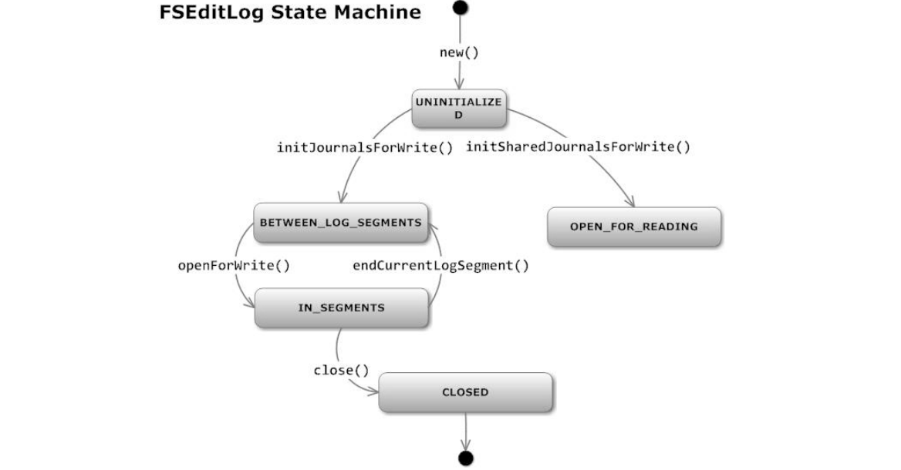

   * **initJournalsForWrite()**

     initJournalsForWrite() 方法调用了 initJournals() 方法，initJournals() 方法会根据传入的 dirs 变量（保存的是 editlog 文件的存储位置，都是 URI）初始化 journalSet 字段（JournalManager 对象的集合）。初始化之后，FSEditLog 就可以调用 journalSet 对象的方法向多个日志存储位置写 editlog 文件了。

     **JournalManager 类是负责在特定存储目录上持久化 editlog 文件的类**，它的 format() 方法负责格式化底层存储，startLogSegment() 方法负责从指定事务 id 开始记录一个操作的段落，finalizeLogSegment() 方法负责完成指定事务 id 区间的写操作。**之所以抽象这个接口，是因为 Namenode 可能将 editlog 文件持久化到不同类型的存储上，也就需要不同类型的 JournalManager 来管理**。JournalManager 有多个子类，普通的文件系统由 FileJournalManager 类管理、共享 NFS 由 BackupJournalManager 类管理、Bookkeeper 由 BookkeeperJournalManager类管理、Quorum 集群则由 QuorumJournalManager 类管理。

     ```java
     public synchronized void initJournalsForWrite() {
       Preconditions.checkState(state == State.UNINITIALIZED ||
           state == State.CLOSED, "Unexpected state: %s", state);	// 检查之前的状态
       initJournals(this.editsDirs);	// 调用 initJournals()方法
       state = State.BETWEEN_LOG_SEGMENTS;	// 状态转换为 BETWEEN_LOG_SEGMENTS
     }
     
     private synchronized void initJournals(List<URI> dirs) {
       int minimumRedundantJournals = conf.getInt(
       		DFSConfigKeys.DFS_NAMENODE_EDITS_DIR_MINIMUM_KEY,
       		DFSConfigKeys.DFS_NAMENODE_EDITS_DIR_MINIMUM_DEFAULT);
       // 初始化 journalSet 集合，存放存储路径对应的所有 JournalManager 对象
       journalSet = new JournalSet(minimumRedundantJournals);
       // 根据传入的 URI 获取对应的 JournalManager 对象
       for (URI u : dirs) {
       	boolean required = FSNamesystem.getRequiredNamespaceEditsDirs(conf).contains(u);
     	  if (u.getScheme().equals(NNStorage.LOCAL_URI_SCHEME)) {
       		StorageDirectory sd = storage.getStorageDirectory(u);
       		if (sd != null) {
       			// 本地 URI，则加入 FileJournalManager 即可
       			journalSet.add(new FileJournalManager(conf, sd, storage), required);
       		}
       	} else {
           // 否则根据 URI 创建对应的 JournalManager 对象，并放入 journalSet 中保存
           journalSet.add(createJournal(u), required);
         }
       }
     } 
     ```

   * **initSharedJournalsForRead()**

     initSharedJournalsForRead() 方法用在 HA 情况下，与 initJournalsForWrite() 方法相同，它也调用了 initJournals() 方法执行初始化操作，只不过 editlog 文件的存储位置不同，在 HA 情况下，editlog 文件的存储目录为共享存储目录，这个共享存储目录由 Active Namenode 和 Standby Namenode 共享读取。

     ```java
     public synchronized void initSharedJournalsForRead() {
       if (state == State.OPEN_FOR_READING) {
         LOG.warn("Initializing shared journals for READ, already open for READ",
         new Exception());
         return;
       }
       Preconditions.checkState(state == State.UNINITIALIZED || state == State.CLOSED);
       // 对于 HA 的情况，editlog 的日志存储目录为共享的目录 sharedEditsDirs
       initJournals(this.sharedEditsDirs);
       state = State.OPEN_FOR_READING;
     }
     ```

   * **openForWrite()**

     openForWrite() 方法用于初始化 editlog 文件的输出流，并且打开第一个日志段落（log segment）。其执行分为以下几个部分，分别调用了三个不同的方法：

     * getLastWrittenTxId()：查找已经写到 editlog 日志文件中的最新的 transactionId，对应上图的情况，返回的是 31。
     * journalSet.selectInputStreams()：传入了参数 segmentTxId，这个参数会作为这次操作的transactionId，值为 editlog 已经记录的最新的 transactionId 加 1（31+1=32）。该方法会判断有没有一个以 segmentTxId（32）开始的日志，如果没有则表示当前 transactionId 的值选择正确，可以打开新的 editlog 文件记录以 segmentTxId 开始的日志段落。如果方法找到了包含这个 transactionId 的 editlog 文件，则表示出现了两个日志 transactionId 交叉的情况，抛出异常。
     * startLogSegment()：开始记录 transactionId 为 32 的日志段落，新建 edits_inprogress_32 文件。同时将 FSEditlog 的状态转变为 IN_SEGMENT。

     ```java
     synchronized void openForWrite() throws IOException {
       Preconditions.checkState(state == State.BETWEEN_LOG_SEGMENTS, "Bad state: %s", state);
       // 返回最后一个写入 log 的 transactionId+1，作为本次操作的 transactionId
       long segmentTxId = getLastWrittenTxId() + 1;
       // 这里判断，有没有包含这个新的 segmentTxId 的 editlog 文件，如果有则抛出异常
       List<EditLogInputStream> streams = new ArrayList<EditLogInputStream>();
       journalSet.selectInputStreams(streams, segmentTxId, true, true);
       if (!streams.isEmpty()) {
         // ...
         throw new IllegalStateException(error);
       }
       // 调用 startLogSegment()方法
       startLogSegment(segmentTxId, true);
       assert state == State.IN_SEGMENT : "Bad state: " + state;
     }
     
     synchronized void startLogSegment(final long segmentTxId,
         boolean writeHeaderTxn) throws IOException {
       // ...
       // 初始化 editLogStream
       try {
         editLogStream = journalSet.startLogSegment(segmentTxId);
       } catch (IOException ex) {
         throw new IOException("Unable to start log segment " +
             segmentTxId + ": too few journals successfully started.", ex);
       }
       // 当前正在写入 txid 设置为 segmentTxId
       curSegmentTxId = segmentTxId;
       state = State.IN_SEGMENT;
       //...
     }
     ```

     startLogSegment() 方法调用了 journalSet.startLogSegment() 方法在所有 editlog 文件的存储路径上构造输出流，并将这些输出流保存在 FSEditLog 的字段 journalSet.journals 中。journalSet 的 journals 字段是一个 JournalAndStream 对象的集合，这个集合中的每一个 JournalAndStream 对象都封装了一个 JournalManager ，以及这个 JournalManager 打开的 editlog 文件的输出流，那么 **journals 字段就保存了 editlog 文件在所有存储路径上的输出流**。

     startLogSegment() 方法会构造一个 JournalSetOutputStream 对象，并将这个对象保存在 FSEditLog 的 editLogStream 字段中，FSEditLog 之后进行的所有写操作都是通过 editLogStream 引用的 JournalSetOutputStream 对象进行的。JournalSetOutputStream 类是 EditLogOutputStream 的子类，在 JournalSetOutputStream 对象上调用的所有接口方法都会被前转到 journalSet.journals 字段中保存的 editlog 文件在所有存储路径上的输出流对象上（通过调用 mapJournalsAndReportErrors() 方法实现）。journalSet 就是通过这种方式，将多个存储位置上的输出流对外封装成了一个输出流，大大方便了调用。

   * **endCurrentLogSegment()**

     endCurrentLogSegment() 会将当前正在写入的日志段落关闭，它调用 journalSet.finalizeLogSegment() 方法将 curSegmentTxid -> lastTxId 之间的操作持久化到磁盘上。finalizeLogSegment() 方法也会调用 mapJournalsAndReportErrors() 方法将 finalizeLogSegment() 调用前转到 journals 集合中保存的所有的 JournalManager 对象上。**以 FileJournalManager 为例**，FileJournalManager.finalizeLogSegment() 方法会将 edit_inprogress 文件改名为 edit 文件，新生成的 edit 文件覆盖了 curSegmentTxid -> lastTxId 之间的所有事务。

     ```java
     synchronized void endCurrentLogSegment(boolean writeEndTxn) {
       LOG.info("Ending log segment " + curSegmentTxId);
       Preconditions.checkState(isSegmentOpen(),
       "Bad state: %s", state);
       // ...
       // 获取当前写入的最后一个 id
       final long lastTxId = getLastWrittenTxId();
       try {
         // 调用 journalSet.finalizeLogSegment 将 curSegmentTxid -> lastTxId 之间的操作
         // 写入磁盘（例如 editlog 文件 edits_0032-0034）
         journalSet.finalizeLogSegment(curSegmentTxId, lastTxId);
         editLogStream = null;
       } catch (IOException e) {
       }
       // 更改状态机的状态
       state = State.BETWEEN_LOG_SEGMENTS;
     }
     
     synchronized public void finalizeLogSegment(long firstTxId, long lastTxId)
         throws IOException {
       // 原有的inprogress 文件
       File inprogressFile = NNStorage.getInProgressEditsFile(sd, firstTxId); 
       // 构造新的 edit 文件
       File dstFile = NNStorage.getFinalizedEditsFile(sd, firstTxId, lastTxId); 
       try {
         NativeIO.renameTo(inprogressFile, dstFile); // 重命名 edit 文件
       } catch (IOException e) {
         errorReporter.reportErrorOnFile(dstFile);
         throw new IllegalStateException("Unable to finalize edits file " + inprogressFile,e);
       }
       // ...
     }
     ```

   * **close()**

     close() 方法用于关闭 editlog 文件的存储，它首先等待 sync 操作完成，然后调用 endCurrentLogSegment() 方法，将当前正在进行写操作的日志段落结束。之后 close() 方法会关闭 journalSet 对象，并将 FSEditLog 状态机转变为 CLOSED 状态。

     ```java
     synchronized void close() {
       try {
         if (state == State.IN_SEGMENT) {
           assert editLogStream != null;
           // 如果有 sync 操作，则等待 sync 操作完成
           waitForSyncToFinish();
           // 结束当前 logSegment
           endCurrentLogSegment(true);
         }
       } finally {
         // 关闭 journalSet
         if (journalSet != null && !journalSet.isEmpty()) {
           try {
             journalSet.close();
           } catch (IOException ioe) {
             LOG.warn("Error closing journalSet", ioe);
           }
         }
         // 将状态机更改为 CLOSED 状态
         state = State.CLOSED;
       }
     } 
     ```

     

3. **EditLogOutputStream**

   FSEditLog 类会调用 FSEditLog.editLogStream 字段的 write() 方法在 editlog 文件中记录一个操作，数据会先被写入到 editlog 文件输出流的缓存中，然后 FSEditLog 类会调用 editLogStream.flush() 方法将缓存中的数据同步到磁盘上。FSEditLog 的 editLogStream 字段是 EditLogOutputStream 类型的，**EditLogOutputStream 类是一个抽象类，它定义了向持久化存储上写 editlog 文件的相关接口**。

   EditLogFileOutputStream 抽象了本地文件系统上 editlog 文件的输出流，BookKeeperEditLog OutputStream 抽象了 BookKeeper 系统上 editlog 文件的输出流，QuorumOutputStream 抽象了 Quorum 集群上 editlog 文件的输出流。同时由于 Namenode 可以同时向多个不同的存储上写入 editlog 文件，所以 EditLogOutputStream 还定义了子类 JournalSetOutputStream 执行聚合的写入操作。

   * **JournalSetOutputStream**

     FSEditLog 的 editLogStream 字段就是 JournalSetOutputStream 类型的（startLog Segment() 方法中赋值），通过调用 JournalSetOutputStream 对象提供的方法，FSEditLog 可以将 Namenode 多个存储位置上的 editlog 文件输出流对外封装成一个输出流，下图给出了 JournalSetOutputStream 调用流程。

     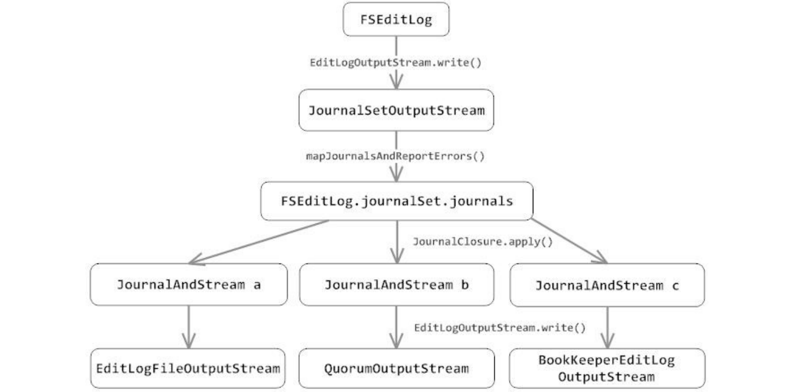

     JournalSetOutputStream 类是通过 mapJournalsAndReportErrors()方法，将 EditLogOutputStream 接口上的 write() 调用前转到了 FSEditLog 中保存的所有存储路径上 editlog 文件对应的 EditLogOutputStream 输出流对象上的。这个方法会遍历 FSEditLog.journalSet.journals 集合，然后将 write() 请求前转到 journals 集合中保存的所有 JournalAndStream 对象上。

     ```java
     public void write(final FSEditLogOp op) throws IOException {
       mapJournalsAndReportErrors(new JournalClosure() {
         @Override
         public void apply(JournalAndStream jas) throws IOException {
           if (jas.isActive()) {
             jas.getCurrentStream().write(op); // 提取出 JournalAndStream 对象中封装的EditLogOutputStream 对象，并在 EditLogOutputStream 对象上调用 write()方法
           }
         }
       }, "write op");
     } 
     
     private void mapJournalsAndReportErrors(JournalClosure closure, String status) throws IOException{
       List<JournalAndStream> badJAS = Lists.newLinkedList();
       // 遍历 journals 字段中保存的所有 JournalAndStream 对象
       for (JournalAndStream jas : journals) {
         try {
           // 在闭包对象上调用 apply()方法前转请求
           closure.apply(jas);
         } catch (Throwable t) {
           if (jas.isRequired()) {
             abortAllJournals();
             terminate(1, msg);
           } else {
             badJAS.add(jas);
           }
         }
       }
       disableAndReportErrorOnJournals(badJAS);
       if (!NameNodeResourcePolicy.areResourcesAvailable(journals,
           minimumRedundantJournals)) {
         String message = status + " failed for too many journals";
         throw new IOException(message);
       }
     }
     ```

   * **EditLogFileOutputStream**

     EditLogFileOutputStream 是向本地文件系统中保存的 editlog 文件写数据的输出流，它**提供了一种巧妙的双 buffer 模式来缓存输出流数据**。EditsDoubleBuffer 中包括两块缓存，数据会先被写入到 EditsDoubleBuffer 的一块缓存中，而 EditsDoubleBuffer 的另一块缓存可能正在进行磁盘的同步操作（就是将缓存中的文件写入磁盘的操作）。EditsDoubleBuffer 这样的设计会**保证输出流进行磁盘同步操作的同时，并不影响数据写入的功能**。

     输出流要进行同步操作时，首先要调用 EditsDoubleBuffer.setReadyToFlush() 方法交换两个缓冲区，将正在写入的缓存改变为同步缓存，然后才可以进行同步操作。完成了 setReadyToFlush() 调用后，输出流就可以调用 flushTo() 方法将同步缓存中的数据写入到文件中。

     ```java
     public class EditsDoubleBuffer {
       private TxnBuffer bufCurrent; // 正在写入的缓冲区
     	private TxnBuffer bufReady; // 准备好同步的缓冲区
     	private final int initBufferSize; // 缓冲区的大小
       
       public void setReadyToFlush() {
         assert isFlushed() : "previous data not flushed yet";
         TxnBuffer tmp = bufReady;// 交换两个缓冲区
         bufReady = bufCurrent;
         bufCurrent = tmp;
       }
       
       public void flushTo(OutputStream out) throws IOException {
         bufReady.writeTo(out); // 将同步缓存中的数据写入文件
         bufReady.reset(); // 将同步缓存中保存的数据清空
       }
     }
     ```

     EditLogFileOutputStream 的构造方法比较简单，初始化定义的所有字段。而定义的 write() 方法、setReadyToFlush() 方法分别用于向输出流中写入操作，以及为同步操作做准备，直接调用 doubleBuf 中的对应方法即可。flushAndSync() 方法则用于将输出流中缓存的数据同步到磁盘上的 editlog 文件中。flushAndSync() 首先调用了 preallocate() 方法，preallocate() 用于在 editLog 文件大小不够时，填充 editlog 文件，之后调用 doubleBuf.flushTo() 方法将缓存中的数据同步到 editlog 文件中。

     ```java
     public class EditLogFileOutputStream extends EditLogOutputStream {
       // 输出流对应的 editlog 文件
       private File file;
       // editlog 文件对应的输出流
       private FileOutputStream fp; 
       // editlog 文件对应的输出流通道
       private FileChannel fc;
       // 一个具有两块缓存的缓冲区，数据必须先写入缓存，然后再由缓存同步到磁盘上
       private EditsDoubleBuffer doubleBuf;	
       // 用来扩充editlog文件大小的数据块。当要进行同步操作时，如果editlog文件不够大，则使用fill来扩充
       static final ByteBuffer fill = ByteBuffer.allocateDirect(MIN_PREALLOCATION_LENGTH);
       
       // 将fill字段用 FSEditLogOpCodes.OP_INVALID 字节填满。FSEditLogOpCodes 是一个枚举，对应于 editlog 文件中记录的操作的类型，每种情况都使用一个 byte 表示。其中OP_INVALID表示不合法的操作；OP_ADD表示添加操作；OP_RENAME_OLD表示重命名操作等。
       static {
         fill.position(0);
         for (int i = 0; i < fill.capacity(); i++) {
           fill.put(FSEditLogOpCodes.OP_INVALID.getOpCode());
         }
       }
       
       public EditLogFileOutputStream(Configuration conf, File name, int size)
           throws IOException {
         super();
         // ...
         file = name;
         doubleBuf = new EditsDoubleBuffer(size);
         RandomAccessFile rp;
         if (shouldSyncWritesAndSkipFsync) {
           rp = new RandomAccessFile(name, "rw");
         } else {
           rp = new RandomAccessFile(name, "rws");
         }
         fp = new FileOutputStream(rp.getFD());
         fc = rp.getChannel();
         fc.position(fc.size());
       }
       
       public void write(FSEditLogOp op) throws IOException {	// 向输出流写入一个操作
         doubleBuf.writeOp(op);	// 向doubleBuf写入FSEditLogOp对象
       }
       
       public void setReadyToFlush() throws IOException { // 为同步数据做准备
         doubleBuf.setReadyToFlush(); // 调用 doubleBuf.setReadyToFlush()交换两个缓冲区
       }
       
       public void flushAndSync(boolean durable) throws IOException {
         // ...
         preallocate(); // 如果 editlog 文件大小不够，则扩充文件大小
         doubleBuf.flushTo(fp); // 将缓存中的数据刷新到 editlog 文件
         // ...
       }
       
       private void preallocate() throws IOException {
         long position = fc.position();
         long size = fc.size();
         int bufSize = doubleBuf.getReadyBuf().getLength();
         long need = bufSize - (size - position); // 判断需要扩充容量的大小
         if (need <= 0) {
           return;
         }
         long oldSize = size;
         long total = 0;
         long fillCapacity = fill.capacity();
         while (need > 0) {
           fill.position(0);
           // 将填充缓冲区写入通道，但不改变 position，也就起到了扩充通道的作用
           IOUtils.writeFully(fc, fill, size); 
           need -= fillCapacity;
           size += fillCapacity;
           total += fillCapacity;
         }
       }
     }
     ```

   

4. **EditLogInputStream**

    EditLogOutputStream 的类结构相同，**EditLogInputStream 类抽象了从持久化存储上读 editlog 文件的相关接口，不同的存储系统有与之对应的输入流子类**。 以 EditLogFileInputStream 为例，它定义了本地文件系统的 editlog 文件的输入流。其中的方法都很简单，都是返回了 EditLogFileInputStream 初始化以后的相应字段，或调用了 FSEditLogOp.Reader 对象的 readOp()方法从 editlog 文件中解析出一个 FSEditLogOp 对象。

5. **FSEditLog.log*()方法**

   FSEditLog 类最重要的作用就是在 editlog 文件中记录 Namenode 命名空间的更改，FSEditLog 类对外提供了若干 log\*() 方法用于执行这个操作。log\*() 也是 FSEditLog 中最多的方法，同时也是这个类的入口方法。

   以 logDelete() 方法为例，logDelete() 用于在 editlog 文件中记录删除 HDFS 文件的操作。logDelete() 首先会构造一个 DeleteOp 对象，这个 DeleteOp 类是 FSEditLogOp 类的子类，用于记录删除操作的相关信息，包括了 ClientProtocol.delete() 调用中所有参数携带的信息。**FSEditLogOp 类是一个抽象的工具类，它定义了 editlog 记录的操作类型，并且提供了从editlog 输入流中解析操作参数等功能。每个editlog 日志文件中可以记录的操作，都有一个与之对应的 FSEditLogOp 的子类用来记录这个操作的信息，例如 delete() 操作对应 DeleteOp 类**。成功构造 DeleteOp 对象后，logDelete() 会调用 logRpcIds() 方法在 DeleteOp 对象中添加 RPC 调用相关信息，之后调用 logEdit() 方法在 editlog 文件中记录这次删除操作。

   ```java
   void logDelete(String src, long timestamp, boolean toLogRpcIds) {
     DeleteOp op = DeleteOp.getInstance(cache.get()) // 构造 DeleteOp 对象
       .setPath(src)
       .setTimestamp(timestamp);
     logRpcIds(op, toLogRpcIds); // 记录 RPC 调用相关信息
     logEdit(op); // 调用 logEdit()方法记录删除操作
   }
   
   private void logRpcIds(FSEditLogOp op, boolean toLogRpcIds) {
     if (toLogRpcIds) {
       op.setRpcClientId(Server.getClientId());
       op.setRpcCallId(Server.getCallId());
     }
   } 
   ```

   基本上所有的 log\*() 方法在底层都调用了 logEdit() 方法来执行记录操作，这里会传入一个 FSEditLogOp 对象来标识当前需要被记录的操作类型以及操作的信息。需要注意的是， logEdit() 调用 beginTransaction() 、 editLogStream.write() 以及 endTransaction() 三个方法时**使用了 synchronized 关键字进行同步操作，这样就保证了多个线程调用 FSEditLog.log\*() 方法向 editlog 文件中写数据时，editlog 文件记录的内容不会相互影响**。同时，也保证了这几个并发线程保存操作对应的 transactionId（通过调用 beginTransaction() 方法获得）是唯一并递增的。

   注意，logSync() 方法执行刷新操作的语句并不在 synchronized 代码段中。这是因为**调用 logSync()方法必然会触发写 editlog 文件的磁盘操作，这是一个非常耗时的操作，如果放入同步模块中会造成其他调用 FSEditLog.log\*() 线程的等待时间过长**。所以，HDFS 将需要进行同步操作的 synchronized 代码段放入 logSync() 方法中，也就让输出日志记录和刷新缓冲区数据到磁盘这两个操作分离了。同时，利用 EditLogOutputStream 的两个缓冲区，使得日志记录和刷新缓冲区数据这两个操作可以并发执行，大大地提高了 Namenode 的吞吐量。

   ```java
   void logEdit(final FSEditLogOp op) {
     synchronized (this) {
       // 如果自动同步开启，则等待同步完成
       waitIfAutoSyncScheduled();
       // 开启一个新的 transaction
       long start = beginTransaction();
       op.setTransactionId(txid);
       // 使用 editLogStream 写入 Op 操作
       try {
         editLogStream.write(op);
       } catch (IOException ex) {
       }
       // 结束当前的 transaction
       endTransaction(start);
       // 检查是否需要强制同步
       if (!shouldForceSync()) {
         return;
       }
       isAutoSyncScheduled = true;
     }
     // 同步当前写入的操作，持久化到硬盘上
     logSync();
   }
   ```

   logEdit() 方法会调用 beginTransaction() 方法开启一个新的 transaction ，也就是将 FSEditLog.txid 字段增加 1 并作为当前操作的 transactionId。FSEditLog.txid 字段维护了一个全局递增的 transactionId，这样也就保证了 FSEditLog 为所有操作分配的 transactionId 是唯一且递增的。调用 beginTransaction()方法之后会将新申请的 transactionId 放入 ThreadLocal 的变量 myTransactionId 中，myTransactionId 保存了当前线程记录操作对应的 transactionId，方便了以后线程做 sync 同步操作。

   注意，对于 FSEditLog 类，可能同时有多个线程并发地调用 log\*()方法执行日志记录操作， 所以 FSEditLog 类使用了一个 ThreadLocal 变量 myTransactionId 为每个调用 log\*() 操作的线程保存独立的 txid，这个 txid 为当前线程记录操作对应的 transactionId。

   ```java
   private long beginTransaction() {
     assert Thread.holdsLock(this);
     // 全局的 transactionId++
     txid++;
     // 使用 ThreadLocal 变量保存当前线程持有的 transactionId
     TransactionId id = myTransactionId.get();
     id.txid = txid;
     return now();
   } 
   ```

   当 logEdit() 将一个完整的操作写入输出流的缓冲区后，需要调用 logSync() 同步当前线程对 editlog 文件所做的修改。由于有多个线程同时写 editlog 文件，所以 editlog 制订了以下同步策略。

   * 所有的操作项同步地写入缓存时，每个操作会被赋予一个唯一的 transactionId。
   * 当一个线程要将它的操作同步到 editlog 文件中时，logSync() 方法会使用 ThreadLocal 变量 myTransactionId 获取该线程需要同步的 transactionId ，然后对比这个 transactionId 和已经同步到 editlog 文件中的 transactionId。如果当前线程的 transactionId 大于 editlog 文件中的 transactionId，则表明 editlog 文件中记录的数据不是最新的，同时如果当前没有别的线程执行同步操作，则开始同步操作将输出流缓存中的数据写入 editlog 文件中。
   * 在 logSync()方法中使用 isSyncRunning 变量标识当前是否有线程正在进行同步操作，这里注意 isSyncRunning 是一个 volatile 的 boolean 类型变量。

   logSync() 方法分为以下三个部分，**并分开进行加锁操作，这样的设计提高了并发的程度**。

   * 判断当前操作是否已经同步到了 editlog 文件中，如果还没有同步，则将 editlog 的双 buffer 调换位置，为同步操作做准备，同时将 isSyncRunning 标志位设置为 true，这部分代码需要进行 synchronized 加锁操作。
   * 调用 logStream.flush() 方法将缓存的数据持久化到存储上，这部分代码不需要进行加锁操作，因为在上一段同步代码中已经将双 buffer 调换了位置，不会有线程向用于刷新数据的缓冲区中写入数据，所以调用 flush()操作并不需要加锁。
   * 重置 isSyncRunning 标志位，并且通知等待的线程，这部分代码需要进行 synchronized 加锁操作。

   ```java
   public void logSync() {
     long syncStart = 0;
     // ThreadLocal 保存的当前线程需要同步的 txid
     long mytxid = myTransactionId.get().txid;
     boolean sync = false;
     try {
       EditLogOutputStream logStream = null;
       // 第一部分，头部代码
       synchronized (this) {
         try {
           printStatistics(false);
           // 当前 txid 大于 editlog 中已经同步的 txid，并且有线程正在同步，则等待
           while (mytxid > synctxid && isSyncRunning) {
             try {
               wait(1000);
             } catch (InterruptedException ie) {
             }
           }
           // 如果 txid 小于 editlog 中已经同步的txid，则表明当前操作已经被同步到存储上，不需要再次同步
           if (mytxid <= synctxid) {
             numTransactionsBatchedInSync++;
             // ...
             return;
           }
           // 否则开始同步操作，将 isSyncRunning 标志位设置为 true
           syncStart = txid;
           isSyncRunning = true;
           sync = true;
           // 通过调用 setReadyToFlush()方法将两个缓冲区互换，为同步做准备
           try {
             if (journalSet.isEmpty()) {
               throw new IOException("No journals available to flush");
             }
             editLogStream.setReadyToFlush();
           } catch (IOException e) {
             // 异常处理 ...
           }
         } finally {
           doneWithAutoSyncScheduling();
         }
         logStream = editLogStream;
       }
   
       // 第二部分，调用 flush()方法，将缓存中的数据同步到 editlog 文件中
       long start = now();
       try {
         if (logStream != null) {
           logStream.flush();
         }
       } catch (IOException ex) {
         synchronized (this) {
           IOUtils.cleanup(LOG, journalSet);
           terminate(1, msg);
         }
       }
       long elapsed = now() - start;
     } finally {
       // 第三部分，恢复标志位
       synchronized (this) {
         if (sync) {
           // 已同步 txid 赋值为开始 sync 操作的 txid
           synctxid = syncStart;
           isSyncRunning = false;
         }
         this.notifyAll();
       }
     }
   }
   ```

   由于 logEdit() 方法中输出日志记录和调用 logSync() 刷新缓冲区数据到磁盘这两个操作是独立加锁的，同时 EditLogOutputStream 提供了两个缓冲区可以同时进行日志记录和刷新缓冲区操作，所以 logEdit() 方法中使用 synchronized 关键字同步的日志记录操作和 logSync()方法中使用 synchronized 关键字同步的刷新缓冲区数据到磁盘的操作是可以并发同步进行的，它们都使用 FSEditLog 对象作为锁对象。这种设计大大地提高了多个线程记录 editlog 操作的并发性，且通过 transactionId 机制保证了 editlog 日志记录的正确性，是一个非常巧妙的优化。


### 3.1.4 FSImage 类


### 3.1.5 FSDirectory 类


## 3.2 数据块管理

### 3.2.1 Block、Replica、BlocksMap


### 3.2.2 数据块副本状态


### 3.2.3 BlockManager 类

 


## 3.3 数据节点管理

### 3.3.1 DatanodeDescriptor


### 3.3.2 DatanodeStorageInfo


### 3.3.3 DatanodeManager 


## 3.4 租约管理

### 3.4.1 LeaseManager.Lease


### 3.4.2 LeaseManager


## 3.5 缓存管理


## 3.6 ClientProtocol 实现


## 3.7 NameNode 启动和停止


# 4. DataNode


# 5. HDFS 客户端
