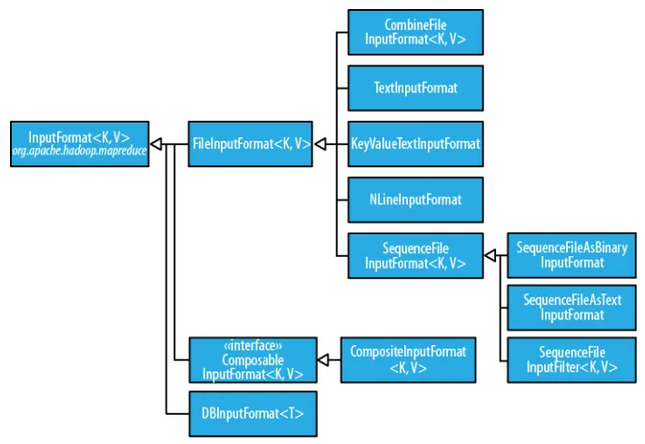

# 1. Hadoop 入门

## 1.1 Hadoop 概述

Hadoop 是一个由 Apache 基金会所开发的分布式系统基础架构，主要解决**海量数据的存储（HDFS）和分析计算（MapReduce）**问题。在 Hadoop 1.x 时代，Hadoop 中的 MapReduce 同时处理业务逻辑运算和资源的调度，耦合性较大。**在 Hadoop 2.x 时代，增加了 Yarn，Yarn 只负责资源的调度，MapReduce 只负责运算**。Hadoop 3.x 在组成上与 Hadoop 2.x 没有变化。

Hadoop 有三大发行版本：Apache、Cloudera、Hortonworks。

* Apache 是最原始（最基础）的版本，对于入门学习最好（2006）
* Cloudera 内部集成了很多大数据框架，对应产品 CDH（2008）
* Hortonworks 文档较好，对应产品 HDP（2011）
* Hortonworks 现在已经被 Cloudera 公司收购，推出新的品牌 CDP


广义上来说，Hadoop 通常是指一个更广泛的概念，即 Hadoop 生态圈。

* Sqoop：主要用于在 Hadoop、Hive 与传统的数据库（MySQL，Oracle 等）间进行数据的传递，可以将一个关系型数据库中的数据导进到 Hadoop 的 HDFS 中，也可以将 HDFS 的数据导进到关系型数据库中。
* Flume：一个高可用、高可靠、分布式的海量日志采集、聚合和传输的系统，Flume 支持在日志系统中定制各类数据发送方，用于收集数据。
* HBase：一个分布式的、面向列的开源数据库，HBase 不同于一般的关系数据库，它是一个适合于非结构化数据存储的数据库。
* Kafka：一种高吞吐量的分布式发布订阅消息系统。
* Hive：基于 Hadoo p的一个数据仓库工具，可以将结构化的数据文件映射为一张数据库表，并提供简单的 SQL 查询功能，可以将 SQL 语句转换为 MapReduce 任务运行。其优点是学习成本低，可以通过类 SQL 语句快速实现简单的 MapReduce 统计，不必开发专门的 MapReduce 应用，十分适合数据仓库的统计分析。
* Spark：当前最流行的开源大数据内存计算框架，可以基于 Hadoop 上存储的大数据进行计算。
* Storm：一个免费的开源分布式实时计算系统，可以轻松可靠地处理无限制的数据流，实时处理就像 Hadoop 进行批处理一样。
* Flink：当前最流行的开源大数据内存计算框架，用于实时计算的场景较多。
* Oozie：一个管理 Hadoop 作业（job）的工作流程调度管理系统。
* ZooKeeper：一个针对大型分布式系统的可靠协调系统，提供的功能包括：配置维护、名字服务、分布式同步、组服务等。


## 1.2 Hadoop 环境搭建

1. **准备模板虚拟机**

   * 安装软件包和相关工具：`yum install -y epel-release net-tools vim`

   * 关闭防火墙及开机自启动：`systemctl stop firewalld`、`systemctl disable firewalld`

   * 创建普通用户并设置密码：`useradd maomao`、`passwd maomao`

   * 配置普通用户具有 root 权限：`vim /etc/sudoers`

     ```shell
     # 在%wheel这行下面添加一行，不要直接放到root行下面，否则会被%wheel行覆盖
     %wheel  ALL=(ALL)       ALL
     maomao  ALL=(ALL)       NOPASSWD:ALL
     ```

   * 在 /opt 目录下创建目录并修改所属主和所属组：`mkdir /opt/module /opt/software`、`chown maomao:maomao /opt/module /opt/software`

   * 卸载自带的 JDK：`rpm -qa | grep -i java | xargs -n1 rpm -e --nodeps`

   * 配置 IP 地址：`vim /etc/sysconfig/network-scripts/ifcfg-ens33`

     ```shell
     # 修改为静态IP
     BOOTPROTO="static"
     
     # 修改IP地址和网关，VMWare网关查看：编辑->虚拟网络编辑器->VMnet8->NAT设置
     IPADDR=192.168.231.100
     GATEWAY=192.168.231.2
     DNS1=192.168.231.2
     ```

   * 修改主机名为 hadoop100：`vim /etc/hostname`

   * 配置主机名称映射文件，**同时在本机 Windows 修改 hosts 文件**：`vim /etc/hosts`

     ```shell
     192.168.231.100 hadoop100
     192.168.231.101 hadoop101
     192.168.231.102 hadoop102
     192.168.231.103 hadoop103
     192.168.231.104 hadoop104
     192.168.231.105 hadoop105
     192.168.231.106 hadoop106
     192.168.231.107 hadoop107
     192.168.231.108 hadoop108
     ```

   * 重启虚拟机：`reboot`

2. **安装 Hadoop 环境**

   * 克隆三台虚拟机，克隆前关机，并设置 IP 地址（主机名）分别为 `192.168.231.102（hadoop102）`、`192.168.231.103（hadoop103）`、`192.168.231.104（hadoop104）`

   * 上传 JDK 和 Hadoop 安装包到 hadoop102 的 `/opt/software/` 目录下

   * 解压 JDK 和 Hadoop 到 `/opt/module/`目录：`tar -xzvf jdk-8u212-linux-x64.tar.gz -C /opt/module/`、`tar -xzvf hadoop-3.2.3.tar.gz -C /opt/module/`

   * 配置环境变量：`vim /etc/profile.d/my_env.sh`

     ```shell
     #JAVA_HOME
     export JAVA_HOME=/opt/module/jdk1.8.0_212
     export PATH=$PATH:$JAVA_HOME/bin
     
     #HADOOP_HOME
     export HADOOP_HOME=/opt/module/hadoop-3.2.3
     export PATH=$PATH:$HADOOP_HOME/bin
     export PATH=$PATH:$HADOOP_HOME/sbin
     ```

   * 使配置文件生效：`source /etc/profile`

   * 查看是否配置成功：`java -version`、`hadoop version`

3. **Hadoop 本地运行测试**

   * 在 Hadoop 目录下创建输入目录：`mkdir wcinput`

   * 在 wcinput 目录下创建单词统计文件：`vim word.txt`

     ```txt
     hello world
     hadoop 
     spark
     hadoop
     hello world
     ```

   * 在 Hadoop 目录下执行官网的单词统计程序，注意输出路径不能事先存在：`bin/hadoop jar share/hadoop/mapreduce/hadoop-mapreduce-examples-3.2.3.jar wordcount wcinput/ wcoutput`

   * 查看输出结果：`cat wcoutput/part-r-00000`

     ```txt
     hadoop	2
     hello	2
     spark	1
     world	2
     ```


## 1.3 Hadoop 分布式运行

1. **编写集群分发脚本**

   * 在 `/home/maomao` 目录下创建 bin目录：`mkdir bin`

   * 编写集群分发脚本，由于 PATH 全局变量包含 `/home/maomao/bin` 目录，因此脚本可在任何路径执行：`vim xsync`

     ```shell
     #!/bin/bash
     
     # 1.判断参数个数
     if [ $# -lt 1 ]
     then
         echo Not Enough Arguement!
         exit;
     fi
     
     # 2.遍历集群所有机器
     for host in hadoop102 hadoop103 hadoop104
     do
         echo ====================  $host  ====================
         # 3.遍历所有目录，挨个发送
         for file in $@
         do
             # 4.判断文件是否存在
             if [ -e $file ]
                 then
                     # 5.获取父目录
                     pdir=$(cd -P $(dirname $file); pwd)
                     # 6.获取当前文件的名称
                     fname=$(basename $file)
                     ssh $host "mkdir -p $pdir"
                     rsync -av $pdir/$fname $host:$pdir
                 else
                     echo $file does not exists!
             fi
         done
     done
     ```
     
   * 增加执行权限：`chmod +x xsync`

   * 测试分发脚本：`xsync /home/maomao/bin`

   * 拷贝 JDK 和 Hadoop 到 hadoop103、hadoop104：`scp -r /opt/module/* maomao@hadoop103:/opt/module`、`scp -r /opt/module/* maomao@hadoop104:/opt/module`

   * 同步环境变量配置，由于普通用户没有权限，使用 root 时脚本使用绝对路径：`sudo ./bin/xsync /etc/profile.d/my_env.sh`

   * 在 hadoop103、hadoop104 上使环境变量生效：`source /etc/profile`

2. **配置 SSH 无密登录**

   * 生成公钥和私钥：`ssh-keygen -t rsa`
   * 将公钥拷贝到要免密登录的目标机器上，三台机器均要执行且包括自身：`ssh-copy-id hadoop102`、`ssh-copy-id hadoop103`、`ssh-copy-id hadoop104`
   * 由于只配置了普通用户，因此需要切换到 root 用户再次执行上述操作

3. **配置集群**

   * 集群部署规划：

     |      | hadoop102          | hadoop103                    | hadoop104                   |
     | ---- | ------------------ | ---------------------------- | --------------------------- |
     | HDFS | NameNode、DataNode | DataNode                     | SecondaryNameNode、DataNode |
     | YARN | NodeManager        | ResourceManager、NodeManager | NodeManager                 |

     注：NameNode 和 SecondaryNameNode 不要安装在同一台服务器，且由于ResourceManager 也很消耗内存，因此不要和 NameNode、SecondaryNameNode 配置在同一台机器上

   * 修改核心配置文件：`cd /opt/module/hadoop-3.2.3/etc/hadoop`、`vim core-site.xml`

     ```xml
     <?xml version="1.0" encoding="UTF-8"?>
     <?xml-stylesheet type="text/xsl" href="configuration.xsl"?>
     
     <configuration>
         <!-- 指定NameNode的地址 -->
         <property>
             <name>fs.defaultFS</name>
             <value>hdfs://hadoop102:8020</value>
         </property>
         <!-- 指定hadoop数据的存储目录 -->
         <property>
             <name>hadoop.tmp.dir</name>
             <value>/opt/module/hadoop-3.2.3/data</value>
         </property>
         <!-- 配置HDFS网页登录使用的静态用户为maomao -->
         <property>
             <name>hadoop.http.staticuser.user</name>
             <value>maomao</value>
         </property>
     </configuration>
     ```

   * 修改 HDFS 配置文件：`vim hdfs-site.xml`

     ```xml
     <?xml version="1.0" encoding="UTF-8"?>
     <?xml-stylesheet type="text/xsl" href="configuration.xsl"?>
     
     <configuration>
     	<!-- nn web端访问地址-->
     	<property>
             <name>dfs.namenode.http-address</name>
             <value>hadoop102:9870</value>
         </property>
     	<!-- 2nn web端访问地址-->
         <property>
             <name>dfs.namenode.secondary.http-address</name>
             <value>hadoop104:9868</value>
         </property>
     </configuration>
     ```

   * 修改 YARN 配置文件：`vim yarn-site.xml`

     ```xml
     <?xml version="1.0" encoding="UTF-8"?>
     <?xml-stylesheet type="text/xsl" href="configuration.xsl"?>
     
     <configuration>
         <!-- 指定MR走shuffle -->
         <property>
             <name>yarn.nodemanager.aux-services</name>
             <value>mapreduce_shuffle</value>
         </property>
         <!-- 指定ResourceManager的地址-->
         <property>
             <name>yarn.resourcemanager.hostname</name>
             <value>hadoop103</value>
         </property>
     </configuration>
     ```

   * 修改 MapReduce 配置文件：`vim mapred-site.xml`

     ```xml
     <?xml version="1.0" encoding="UTF-8"?>
     <?xml-stylesheet type="text/xsl" href="configuration.xsl"?>
     
     <configuration>
     	<!-- 指定MapReduce程序运行在Yarn上 -->
         <property>
             <name>mapreduce.framework.name</name>
             <value>yarn</value>
         </property>
         
         <property>
         	<name>yarn.app.mapreduce.am.env</name>
         	<value>HADOOP_MAPRED_HOME=/opt/module/hadoop-3.2.3</value>
     	</property>
     	<property>
         	<name>mapreduce.map.env</name>
         	<value>HADOOP_MAPRED_HOME=/opt/module/hadoop-3.2.3</value>
     	</property>
     	<property>
         	<name>mapreduce.reduce.env</name>
         	<value>HADOOP_MAPRED_HOME=/opt/module/hadoop-3.2.3</value>
     	</property>
     </configuration>
     ```

   * 分发配置文件：`xsync /opt/module/hadoop-3.2.3/etc/hadoop/`

4. **启动集群**

   * 配置 workers：`vim /opt/module/hadoop-3.2.3/etc/hadoop/workers`

     ```txt
     hadoop102
     hadoop103
     hadoop104
     ```

     注：该文件中的内容不允许有空行，且不允许有空格

   * 分发所有节点配置文件：`xsync /opt/module/hadoop-3.2.3/etc`

   * **如果集群是第一次启动**，需要在 hadoop102 节点格式化 NameNode（格式化 NameNode 会产生新的集群 id，导致 NameNode 和 DataNode 的集群 id 不一致，集群找不到过往数据。如果集群在运行过程中报错，需要重新格式化 NameNode 的话，一定要先停止 NameNode 和 NameNode 进程，并且要删除所有机器的 data 和 logs 目录，然后再进行格式化）：`hdfs namenode -format`

   * 启动 HDFS：`sbin/start-dfs.sh`

   * 在配置了 ResourceManager 节点的 **hadoop103** 启动 YARN：`sbin/start-yarn.sh`

   * 在各节点查看启动进程：`jps`

   * Web 端查看 HDFS 的 NameNode：`hadoop102:9870`

   * Web 端查看 YARN 的 ResourceManager：`hadoop103:8088`

   * 集群测试，创建目录并上传文件到集群：`hadoop fs -mkdir /input`、`hadoop fs -put ./wcinput/word.txt /input`

   * 执行单词统计程序，在 Web 页面查看执行结果：`hadoop jar share/hadoop/mapreduce/hadoop-mapreduce-examples-3.2.3.jar wordcount /input /output`

5. **配置历史服务器**

   * 修改 MapReduce 配置文件，增加如下内容：`vim mapred-site.xml`

     ```xml
     <!-- 历史服务器端地址 -->
     <property>
         <name>mapreduce.jobhistory.address</name>
         <value>hadoop102:10020</value>
     </property>
     
     <!-- 历史服务器web端地址 -->
     <property>
         <name>mapreduce.jobhistory.webapp.address</name>
         <value>hadoop102:19888</value>
     </property>
     ```

   * 分发配置文件，并在 hadoop103 上并重启 YARN：`xsync mapred-site.xml`

   * 启动历史服务器（关闭使用 stop）：`bin/mapred --daemon start historyserver`

   * 查看历史服务器是否启动：`jps`

   * Web 端查看任务历史记录：`hadoop102:19888/jobhistory`

6. **配置日志聚集**

   * 修改 YARN 配置文件，增加如下内容：`vim yarn-site.xml`

     ```xml
     <!-- 开启日志聚集功能 -->
     <property>
         <name>yarn.log-aggregation-enable</name>
         <value>true</value>
     </property>
     <!-- 设置日志聚集服务器地址 -->
     <property>  
         <name>yarn.log.server.url</name>  
         <value>http://hadoop102:19888/jobhistory/logs</value>
     </property>
     <!-- 设置日志保留时间为7天 -->
     <property>
         <name>yarn.log-aggregation.retain-seconds</name>
         <value>604800</value>
     </property>
     ```

   * 分发配置文件，并在 hadoop102 上重启历史服务器，在 hadoop103 上重启 YARN：`xsync yarn-site.xml`

   * 删除 HDFS 已经存在的输出文件：`hadoop fs -rm -r /output`

   * 重新执行单词统计程序，并在 Web 端的历史服务器上查看运行日志：`hadoop jar share/hadoop/mapreduce/hadoop-mapreduce-examples-3.2.3.jar wordcount /input /output`

7. **Hadoop 集群常用脚本**

   * 编写集群启用和停止脚本，并增加执行权限：`vim ~/bin/myhadoop.sh`

     ```shell
     #!/bin/bash
     
     if [ $# -lt 1 ]
     then
         echo "No Args Input..."
         exit ;
     fi
     
     case $1 in
     "start")
             echo "=================== 启动 hadoop集群 ==================="
             echo "--------------- 启动 hdfs ---------------"
             ssh hadoop102 "/opt/module/hadoop-3.2.3/sbin/start-dfs.sh"
             echo "--------------- 启动 yarn ---------------"
             ssh hadoop103 "/opt/module/hadoop-3.2.3/sbin/start-yarn.sh"
             echo "--------------- 启动 historyserver ---------------"
             ssh hadoop102 "/opt/module/hadoop-3.2.3/bin/mapred --daemon start historyserver"
     ;;
     "stop")
             echo "=================== 关闭 hadoop集群 ==================="
             echo "--------------- 关闭 historyserver ---------------"
             ssh hadoop102 "/opt/module/hadoop-3.2.3/bin/mapred --daemon stop historyserver"
             echo "--------------- 关闭 yarn ---------------"
             ssh hadoop103 "/opt/module/hadoop-3.2.3/sbin/stop-yarn.sh"
             echo "--------------- 关闭 hdfs ---------------"
             ssh hadoop102 "/opt/module/hadoop-3.2.3/sbin/stop-dfs.sh"
     ;;
     *)
         echo "Input Args Error..."
     ;;
     esac
     ```

   * 编写 Java 进程查看脚本，并增加执行权限：`vim ~/bin/jpsall`

     ```shell
     #!/bin/bash
     
     for host in hadoop102 hadoop103 hadoop104
     do
             echo =============== $host ===============
             ssh $host jps 
     done
     ```

   * 分发上述两个脚本：`xsync ~/bin/`

   * **常用端口说明**：

     | 端口名称                   | Hadoop2.x   | Hadoop3.x          |
     | -------------------------- | ----------- | ------------------ |
     | NameNode 内部通信端口      | 8020 / 9000 | 8020 / 9000 / 9820 |
     | NameNode HTTP UI           | 50070       | 9870               |
     | MapReduce 查看执行任务端口 | 8088        | 8088               |
     | 历史服务器通信端口         | 19888       | 19888              |


# 2. HDFS

## 2.1 HDFS 概述

HDFS（Hadoop Distributed File System）是**分布式文件管理系统**中的一种，有时也简称为 DFS。首先，它是一个文件系统，用于存储文件，通过**目录树**来定位文件；其次，它是分布式的，由很多服务器联合起来实现其功能，集群中的服务器有各自的角色。**HDFS 适合一次写入，多次读出的场景**，一个文件经过创建、写入和关闭之后就不需要改变。

1. HDFS 优点
   * **高容错性**，数据自动保存多个副本，某个副本丢失后，可以自动恢复；
   * **适合处理大数据**，数据处理规模达到 GB、TB、甚至 PB 级别，能够处理百万规模以上的文件数量；
   * **可构建在廉价机器上**，通过多副本机制，提高可靠性。

2. HDFS 缺点
   * **不适合低延时数据访问**，比如毫秒级的存储数据是做不到的；
   * **无法高效地对大量小文件进行存储**，存储大量的小文件，会占用 NameNode 大量的内存来存储文件目录和块信息，但 NameNode 的内存总是有限的，同时小文件存储的寻址时间会超过读取时间，违反了 HDFS 的设计目标；
   * **不支持并发写入、文件随机修改**，一个文件只能有一个写，不允许多个线程同时写，**仅支持数据追加**，不支持文件的随机修改。

3. HDFS 数据块

   HDFS 中的文件在物理上是分**块（block）**存储的，**默认大小在 Hadoop 2.x/3.x 版本中是 128M**，1.x 版本是 64M。块的大小可通过配置参数（dfs.blocksize）来规定，HDFS 块的大小设置主要取决于磁盘传输速率。HDFS 的块不能设置太小，否则会增加寻址时间，程序一直在找块的开始位置；块也不能设置太大，MapReduce 中的 map 任务通常一次只处理一个块中的数据，因此如果任务数太少（少于集群中的节点数量），作业的运行速度就会比较慢。

4. HDFS 组成架构

   * **NameNode（管理节点）**：负责管理 HDFS 的命名空间，配置副本策略，管理数据块映射信息，处理客户端读写请求。
   * **DataNode（工作节点）**：存储实际的数据块，执行数据块的读写操作。
   * **Client（客户端）**：代表用户通过与 NameNode 和 DataNode 交互来访问整个文件系统，如与 NameNode 交互获取文件的位置信息，与 DataNode 交互读写数据。Client 还负责文件切分，在文件上传 HDFS 时，将文件切分成一个个的块，然后上传，同时提供了一些命令来管理和访问 HDFS。
   * **SecondaryNameNode（辅助 NameNode）**：并非 NameNode 的热备，当 NameNode 挂掉时，它并不能马上替换 NameNode 并提供服务。负责辅助 NameNode，分担其工作量，比如定期合并 **Fsimage（文件系统镜像） 和 Edits（编辑日志）**，并推送给 NameNode。在紧急情况下，可辅助恢复 NameNode。


## 2.2 HDFS 的 Shell 操作

基本语法：**hadoop fs 参数、hdfs dfs 参数**（两个是完全相同的）

1. 文件上传
   * -moveFromLocal：从本地**剪切**文件到HDFS
   * -copyFromLocal：从本地**拷贝**文件到HDFS
   * **-put**：等同于 copyFromLocal，生产环境更习惯用 put
   * -appendToFile：追加一个文件到已经存在的文件末尾
2. 文件下载
   * -copyToLocal：从HDFS拷贝文件到本地
   * **-get**：等同于 copyToLocal，生产环境更习惯用 get
3. 直接操作
   * -mkdir、-ls、-cat: 创建目录、显示目录信息、显示文件内容
   * -chgrp、-chmod、-chown：修改文件所属权限
   * -cp、-mv：从 HDFS 的一个目录拷贝、移动到 HDFS 的另一个目录
   * -rm -r：删除文件或目录，参数 -r 表示删除目录
   * -du：统计目录的大小信息，结果分别是文件大小、副本数、查看的目录
   * -setrep：设置 HDFS 中文件的副本数量，设置的副本数只是记录在 NameNode 的元数据中，是否真的有这么多副本，还得看 DataNode 的数量


## 2.3 HDFS 的 API 操作

1. 配置 Hadoop 本地环境，下载 Windows 环境下的第三方包，下载地址：https://github.com/steveloughran/winutils，并配置环境变量。

2. 新建 maven 工程，并添加相关依赖

   ```xml
   <dependencies>
       <dependency>
           <groupId>org.apache.hadoop</groupId>
           <artifactId>hadoop-client</artifactId>
           <version>3.2.3</version>
       </dependency>
       <dependency>
           <groupId>junit</groupId>
           <artifactId>junit</artifactId>
           <version>4.12</version>
       </dependency>
       <dependency>
           <groupId>org.slf4j</groupId>
           <artifactId>slf4j-log4j12</artifactId>
           <version>1.7.30</version>
       </dependency>
   </dependencies>
   ```

3. 在 resources 目录下配置日志文件 log4j.properties

   ```properties
   log4j.rootLogger=INFO, stdout
   log4j.appender.stdout=org.apache.log4j.ConsoleAppender
   log4j.appender.stdout.layout=org.apache.log4j.PatternLayout
   log4j.appender.stdout.layout.ConversionPattern=%d %p [%c] - %m%n
   log4j.appender.logfile=org.apache.log4j.FileAppender
   log4j.appender.logfile.File=target/spring.log
   log4j.appender.logfile.layout=org.apache.log4j.PatternLayout
   log4j.appender.logfile.layout.ConversionPattern=%d %p [%c] - %m%n
   ```

4. API 操作测试

   ```java
   public class HdfsClient {
       private FileSystem fileSystem;
   
       @Before
       public void init() throws Exception {
           // 连接参数：连接集群的NameNode地址、配置文件、用户
           URI uri = new URI("hdfs://hadoop102:8020");
           Configuration configuration = new Configuration();
           String user = "maomao";
   
           //configuration.set("dfs.replication", "2");
   
           // 获取客户端对象
           fileSystem = FileSystem.get(uri, configuration, user);
       }
   
       @After
       public void close() throws IOException {
           fileSystem.close();
       }
   
       @Test
       public void mkdirTest() throws IOException {
           // 创建目录
           fileSystem.mkdirs(new Path("/xiyou/huaguoshan"));
       }
   
       // 参数优先级排序：客户端代码中设置的值 > ClassPath下的用户自定义配置文件 >
       // 服务器的自定义配置（xxx-site.xml） > 服务器的默认配置（xxx-default.xml）
       @Test
       public void putTest() throws IOException {
           // 文件上传，参数依次为：是否删除源数据、是否覆盖、源路径、目标路径
           fileSystem.copyFromLocalFile(false, true,
                   new Path("D:\\sunwukong.txt"), new Path("/xiyou/huaguoshan"));
       }
   
       @Test
       public void getTest() throws IOException {
           // 文件下载，参数依次为：是否删除源数据、源路径、目标路径、是否校验
           fileSystem.copyToLocalFile(false, new Path("/xiyou/huaguoshan"),
                   new Path("D:\\"), true);
       }
   
       @Test
       public void delTest() throws IOException {
           // 删除文件或目录，参数依次为：删除路径、是否递归删除，用于非空目录
           fileSystem.delete(new Path("/xiyou"), true);
       }
   
       @Test
       public void moveTest() throws IOException {
           // 文件或目录的更名和移动，参数依次为：源文件路径、目标文件路径
           fileSystem.rename(new Path("/input/word.txt"), new Path("/test.txt"));
       }
   
       @Test
       public void fileDetailTest() throws IOException {
           // 获取文件详情信息
           RemoteIterator<LocatedFileStatus> listFiles = fileSystem.listFiles(new Path("/"), true);
           while (listFiles.hasNext()) {
               LocatedFileStatus fileStatus = listFiles.next();
   
               System.out.println("========" + fileStatus.getPath() + "=========");
               System.out.println(fileStatus.getPermission());
               System.out.println(fileStatus.getOwner());
               System.out.println(fileStatus.getGroup());
               System.out.println(fileStatus.getLen());
               System.out.println(fileStatus.getModificationTime());
               System.out.println(fileStatus.getReplication());
               System.out.println(fileStatus.getBlockSize());
               System.out.println(fileStatus.getPath().getName());
   
               // 获取块信息
               BlockLocation[] blockLocations = fileStatus.getBlockLocations();
               System.out.println(Arrays.toString(blockLocations));
           }
       }
   
       @Test
       public void fileTest() throws IOException {
           // 判断文件或目录
           FileStatus[] listStatus = fileSystem.listStatus(new Path("/"));
   
           for (FileStatus fileStatus : listStatus) {
               if (fileStatus.isFile()) {
                   System.out.println("f:" + fileStatus.getPath().getName());
               } else {
                   System.out.println("d:" + fileStatus.getPath().getName());
               }
           }
       }
   }
   ```


## 2.4 HDFS 读写流程

### 2.4.1 文件读取流程


1. 客户端通过调用 FileSyste 对象的 open() 方法来打开希望读取的文件，对于 HDFS 来说，这个对象是 DistributedFileSystem 的一个实例。
2. DistributedFileSystem **通过 RPC 来调用  NameNode，以确定文件起始块的位置**。对于每一个块，NameNode 返回存有该块副本的 DataNode 地址，**并根据 DataNode 与客户端的距离来排序**。DistributedFileSystem 类返回一个 FSDataInputStream 对象给客户端以便读取数据，FSDataInputStream 类转而封装 DFSInputStream 对象，该对象管理着 NameNode 和 DataNode 的 I/O。
3. 客户端对 FSDataInputStream 调用 read() 方法。
4. DFSInputStream **连接距离最近的文件中第一个块所在的 DataNode**，通过对数据流反复调用 read() 方法，将数据从 DataNode 传输到客户端。
5. 达到块末端时，DFSInputStream 关闭与该 DataNode 的连接，然后寻找下一个块的最佳 DataNode。所有这些对于客户端都是透明的，在客户看来它一直在读取一个连续的流。
6. 客户端从流中读取数据，并根据需要询问 NameNode 来检索下一批数据块的 DataNode 的位置。一旦客户端完成读取，就对 FSDataInputStream 调用 close() 方法。

当读取数据时，如果 DFSInputStream 与 DataNode 通信时遇到错误，DFSInputStream 会尝试从这个块的另一个最邻近 DataNode 读取数据，并记住这个故障 DataNode，以保证以后不会反复读取该节点上后续的块。DFSInputStream 还会通过校验和确认从 DataNode 发来的数据是否完整，**如果有损坏，它会试图从其它 DataNode 读取其副本，并将被损坏的块通知给 NameNode**。

海量数据处理的主要限制因素是节点之间数据的传输速率，即可用宽度，以下场景中的**可用宽带依次递减：同一节点上的进程、同一机架上的不同节点、同一数据中心不同机架上的节点、不同数据中心的节点**。


### 2.4.2 文件写入流程


1. 客户端通过对 DistributedFileSystem 对象调用 create() 来新建文件。
2. DistributedFileSystem **对 NameNode 创建一个 RPC 调用**，在文件系统的命名空间中新建一个文件，此时该文件中还没有相应的数据块。**NameNode 执行各种不同的检查，以确保该文件不存在且客户端有新建该文件的权限**。DistributedFileSystem 向客户端返回一个 FSDataOutputStream 对象，该对象同样封装一个 DFSOutputStream 对象，负责处理 NameNode 和 DataNode 之间的通信。
3. 在客户端写入数据时，DFSOutputStream **将它分为一个个的数据包，并写入内部队列，称为数据队列**。
4. DataStreamer 处理数据队列，**负责挑选出适合存储数据副本的一组 DataNode，并据此要求 NameNode 分配新的数据块**。这一组 DataNode 构成一个管线，DataStreamer 将数据包流式传输到管线中第一个 DataNode，该 DataNode 存储数据包并将它发送到管线中的第二个 DataNode，依次类推。
5. DFSOutputStream **维护着一个内部数据包队列来等待 DataNode 的收到确认，称为确认队列**。收到管道中所有 DataNode 确认信息后，该数据包才会从确认队列中删除。（可以设置 dfs.replication.min，代表一个数据块至少被写入几个节点就算成功，默认值是1，且这个数据块可以在集群中异步复制，直到达到目标副本数）
6. 客户端完成数据的写入后，对数据流调用 close() 方法。
7. 该操作将剩余的所有的数据包写入 DataNode 管线，并在联系到 NameNode 告知其文件写入完成之前，等待确认。

Hadoop 默认布局策略是：**在运行客户端的节点上放第一个副本（如果客户端运行在集群外，则随机选择一个节点），第二个副本放在与第一个不同且随机选择的机架中节点上，第三个副本与第二个副本放在同一个机架上，且随机选择另一个节点**。其它副本放在集群中随机选择的节点上，不过会尽量避免在同一个机架上放太多副本。


## 2.5 NameNode 与 SecondaryNameNode

由于 NameNode 中的元数据经常需要进行随机访问，因此不能存储在磁盘中，否则效率过低。但是将元数据放在内存中，又断电易失，因此产生了**在磁盘中备份元数据的 fsimage**。

这样又会带来新的问题，当在内存中的元数据更新时，如果同时更新 fsimage，就会导致效率过低，但如果不更新，就会发生一致性问题，一旦 NameNode 节点断电，数据就会丢失。因此，**引入 edits 文件（只进行追加操作，效率很高），每当元数据有更新或者添加元数据时，修改内存中的元数据并追加到 edits 中**。这样，一旦 NameNode 节点断电，可以通过 fsimage 和 edits的合并，合成元数据。

但是，如果长时间添加数据到 edits 中，会导致该文件数据过大，效率降低，而且一旦断电，恢复元数据需要的时间过长。因此，需要定期进行 fsimage 和 edits的合并，如果这个操作由 NameNode 节点完成，又会效率过低。因此，**引入一个新的节点 SecondaryNamenode，专门用于 fsimage 和 edits 的合并**。


**第一阶段：NameNode 启动**

1. 第一次启动 NameNode 格式化后，创建 fsimage 和 edits 文件。如果不是第一次启动，直接加载编辑日志和镜像文件到内存。
2. 客户端对元数据进行增删改的请求。
3. NameNode 记录操作日志，更新滚动日志。
4. NameNode 在内存中对元数据进行增删改。

**第二阶段：Secondary NameNode 工作**

1. SecondaryNameNode 询问 NameNode 是否需要 CheckPoint，直接带回 NameNode 是否检查结果。
2. SecondaryNameNode 请求执行 CheckPoint。
3. NameNode 滚动正在写的 edits日志。
4. 将滚动前的编辑日志和镜像文件拷贝到 SecondaryNameNode（使用 HTTP GET）。
5. SecondaryNameNode 加载编辑日志和镜像文件到内存，并合并。
6. 生成新的镜像文件 fsimage.ckpt。
7. 拷贝 fsimage.chkpoint 到 NameNode（使用 HTTP PUT）。
8. NameNode 将 fsimage.ckpt 重新命名成 fsimage。

**运行中**的 NameNode 有如下目录结构。其中 in_use.lock 是一个锁文件，NameNode 使用该文件为存储目录加锁，避免其它 NameNode 同时使用同一存储目录。VERSION 包含正在运行的 HDFS 的版本信息。**edits 是编辑日志，后缀表示该文件所包含的事务 ID**，edits 存放 HDFS 文件系统的所有更新操作路径，任何时刻只有一个文件处于打开可写状态，客户端执行的所有写操作首先会被记录到 edits 文件中。**fsimage 是文件系统元数据的一个永久性检查点**，其中包含 HDFS 文件系统的所有目录和文件 inode 的序列化信息。可分别通过命令 `hdfs oiv/oev -p 文件类型 -i 镜像文件 -o 转换后文件输出路径` 查看 fsimage 和 edits 文件信息，文件类型选择 XML。

```shell
[maomao@hadoop102 /opt/module/hadoop-3.2.3/data/dfs]$ tree name
name
├── current
│   ├── edits_0000000000000000001-0000000000000000020
│   ├── edits_inprogress_0000000000000000021
│   ├── fsimage_0000000000000000000
│   ├── fsimage_0000000000000000000.md5
│   ├── fsimage_0000000000000000020
│   ├── fsimage_0000000000000000020.md5
│   ├── seen_txid
│   └── VERSION
└── in_use.lock
```

**创建检查点的触发条件是 edits 文件数据已满，或定时时间已到**。通常情况下，SecondaryNameNode 每隔一小时创建检查点；此外，如果从上一个检查点开始 edits 的大小已经达到 100 万个事务，那么即使不到一小时，也会创建检查点，检查频率为一分钟一次。

```xml
<property>
  <name>dfs.namenode.checkpoint.period</name>
  <value>3600s</value>
</property>
<property>
  <name>dfs.namenode.checkpoint.txns</name>
  <value>1000000</value>
</property>
<property>
  <name>dfs.namenode.checkpoint.check.period</name>
  <value>60s</value>
</property>
```


## 2.6 DataNode

DataNode 的存储目录是初始阶段自动创建的，不需要额外格式化。一个数据块在 DataNode 上以文件形式存储在磁盘上，包括两个文件：**一个是数据本身，一个是元数据，包括数据块的长度、块数据的校验和、以及时间戳**。

DataNode 启动后会向 NameNode 注册，注册成功后，周期性（6小时）的向 NameNode 上报所有的块信息。DataNode 每隔一段时间（3 秒）发送心跳到 NameNode，如果 NameNode 有一些需要 DataNode 配合的动作，则返回一系列指令，如删除数据，NameNode 收到后就会真正删除数据。如果超过 10 分钟 + 30 秒没有收到某个 DataNode 的心跳，则认为该节点不可用，超时时间计算公式为：TimeOut = 2 * dfs.namenode.heartbeat.recheck-interval + 10 * dfs.heartbeat.interval。

```xml
<property>
	<name>dfs.blockreport.intervalMsec</name>
	<value>21600000</value>
</property>
<property>
	<name>dfs.datanode.directoryscan.interval</name>
	<value>21600s</value>
</property>

<property>
    <name>dfs.namenode.heartbeat.recheck-interval</name>
    <value>300000</value>
</property>
<property>
    <name>dfs.heartbeat.interval</name>
    <value>3</value>
</property>
```


# 3. MapReduce

## 3.1 MapReduce 概述

MapReduce 是一个分布式运算程序的编程框架，是用户开发“基于 Hadoop 的数据分析应用”的核心框架。它的核心功能是将用户编写的业务逻辑代码和自带默认组件整合成一个完整的分布式运算程序，并发运行在一个 Hadoop 集群上。

1. MapReduce 优点
   * **易于编程**：简单的实现一些接口，就可以完成一个分布式程序。
   * **良好的扩展性**：当计算资源不能得到满足时，可以通过简单的增加机器来扩展它的计算能力。
   * **高容错性**：其中一台机器挂了，它可以把上面的计算任务转移到另外一个节点上运行，不至于这个任务运行失败，且这个过程不需要人工参与，而完全是由 Hadoop 内部完成。
   * **适合 PB 级以上海量数据的离线处理**：可以实现上千台服务器集群并发工作，提供数据处理能力。
2. MapReduce 缺点
   * **不擅长实时计算**：MapReduce 无法像 MySQL 一样，在毫秒或者秒级内返回结果。
   * **不擅长流式计算**：流式计算的输入数据是动态的，而 MapReduce 的输入数据集是静态的，不能动态变化。这是因为 MapReduce 自身的设计特点决定了数据源必须是静态的。
   * **不擅长DAG（有向无环图）计算**：多个应用程序存在依赖关系，后一个应用程序的输入为前一个的输出。在这种情况下，MapReduce 并不是不能做，而是使用后，每个 MapReduce 作业的输出结果都会写入到磁盘，会造成大量的磁盘 I/O，导致性能非常的低下。
3. MapReduce 核心思想
   * 分布式的运算程序往往需要分成至少2个阶段。
   * 第一个阶段的 MapTask 并发实例，完全并行运行，互不相干。
   * 第二个阶段的 ReduceTask 并发实例，互不相干，但是他们的数据依赖于上一个阶段的所有 MapTask 并发实例的输出。
   * MapReduce 编程模型只能包含一个 Map 阶段和一个 Reduce 阶段，如果用户的业务逻辑非常复杂，那就只能多个 MapReduce 程序，串行运行。
4. MapReduce 进程
   * **MrAppMaster**：负责整个程序的过程调度及状态协。
   * **MapTask**：负责 Map 阶段的整个数据处理流程。
   * **ReduceTask**：负责 Reduce 阶段的整个数据处理流程。


## 3.2 Hadoop 序列化

序列化就是把内存中的对象，转换成字节序列（或其他数据传输协议）以便于存储到磁盘（持久化）和网络传输。 反序列化就是将收到字节序列（或其他数据传输协议）或者是磁盘的持久化数据，转换成内存中的对象。Hadoop 多节点进程间通信通过 RPC 实现，序列化特点如下：

* 紧凑：高效使用存储空间。
* 快速：读写数据的额外开销小。
* 支持互操作：支持多语言的交互。

Java 的序列化是一个重量级序列化框架 Serializable，一个对象被序列化后，会附带很多额外的信息（各种校验信息、Header、继承体系等），不便于在网络中高效传输。因此，Hadoop 自己开发了一套序列化机制 Writable。

1. **输入数据格式与需求**

   统计每一个手机号耗费的总上行流量、总下行流量、总流量。

   ```
   id	手机号码		网络ip		网址（可选）		上行流量  下行流量     网络状态码
   11 	15043685818	192.168.100.8	www.baidu.com	3659	3538	200
   ```

2. **编写序列化 Bean 流量统计实体类**

   ```java
   // 自定义的Bean必须实现Writable接口，如果需要将Bean放在key中传输，则还需要实现Comparable接口，因为MapReduce框架中的Shuffle过程要求对key必须能排序
   public class FlowBean implements Writable {
       private Long upFlow;    // 上行流量
       private Long downFlow;  // 下行流量
       private Long sumFlow;   // 总流量
   
       // 反序列化时，需要反射调用空参构造函数，所以必须有空参构造
       public FlowBean() {
       }
   
       // getter和setter方法 
   
       public void setSumFlow() {
           this.sumFlow = this.upFlow + this.downFlow;
       }
   
       // 要想把结果显示在文件中，需要重写toString()，可用"\t"分开，方便后续使用
       @Override
       public String toString() {
           return upFlow + "\t" + downFlow + "\t" + sumFlow;
       }
   
       // 重写序列化方法
       @Override
       public void write(DataOutput dataOutput) throws IOException {
           dataOutput.writeLong(upFlow);
           dataOutput.writeLong(downFlow);
           dataOutput.writeLong(sumFlow);
       }
   
       // 重写反序列化方法，注意反序列化的顺序和序列化的顺序完全一致
       @Override
       public void readFields(DataInput dataInput) throws IOException {
           this.upFlow = dataInput.readLong();
           this.downFlow = dataInput.readLong();
           this.sumFlow = dataInput.readLong();
       }
   }
   ```

3. **编写 Mapper 类**

   ```java
   // 自定义的Mapper必须继承Mapper接口，map()函数的输入输出数据均是KV形式，且对每一个KV调用一次
   public class FlowMapper extends Mapper<LongWritable, Text, Text, FlowBean> {
       private final Text outK = new Text();
       private final FlowBean outV = new FlowBean();
   
       @Override
       protected void map(LongWritable key, Text value, Context context) throws IOException, InterruptedException {
           String line = value.toString();
           String[] split = line.split("\t");
   
           String phone = split[1];
           String up = split[split.length - 3];
           String down = split[split.length - 2];
   
           outK.set(phone);
           outV.setUpFlow(Long.parseLong(up));
           outV.setDownFlow(Long.parseLong(down));
           outV.setSumFlow();
   
           context.write(outK, outV);
       }
   }
   ```

4. **编写 Reducer 类**

   ```java
   // 自定义的Reducer必须继承Reducer接口，reduce()函数的输入数据类型对应Mapper的输出类型，且对每一组相同key的KV组调用一次
   public class FlowReducer extends Reducer<Text, FlowBean, Text, FlowBean> {
       private final FlowBean outV = new FlowBean();
   
       @Override
       protected void reduce(Text key, Iterable<FlowBean> values, Context context) throws IOException, InterruptedException {
           long totalUp = 0;
           long totalDown = 0;
   
           for (FlowBean flowBean : values) {
               totalUp += flowBean.getUpFlow();
               totalDown += flowBean.getDownFlow();
           }
   
           outV.setUpFlow(totalUp);
           outV.setDownFlow(totalDown);
           outV.setSumFlow();
           context.write(key, outV);
       }
   }
   ```

5. **编写 Driver 驱动类**

   ```java
   // 相当于Yarn集群的客户端，用于提交整个程序到Yarn集群，提交的是封装了MapReduce相关运行参数的job对象
   public class FlowDriver {
       public static void main(String[] args) throws IOException, ClassNotFoundException, InterruptedException {
           // 1.获取配置信息以及获取job对象
           Configuration conf = new Configuration();
           Job job = Job.getInstance(conf);
   
           // 2.关联本Driver程序的jar
           job.setJarByClass(FlowDriver.class);
   
           // 3.关联Mapper和Reducer的jar
           job.setMapperClass(FlowMapper.class);
           job.setReducerClass(FlowReducer.class);
   
           // 4.设置Mapper输出的kv类型
           job.setMapOutputKeyClass(Text.class);
           job.setMapOutputValueClass(FlowBean.class);
   
           // 5.设置最终输出kv类型
           job.setOutputKeyClass(Text.class);
           job.setOutputValueClass(FlowBean.class);
   
           // 6.设置输入和输出路径
           FileInputFormat.setInputPaths(job, new Path(args[0]));
           FileOutputFormat.setOutputPath(job, new Path(args[1]));
   
           // 7.提交job
           boolean result = job.waitForCompletion(true);
           System.exit(result ? 0 : 1);
       }
   }
   ```


## 3.3 MapReduce 框架原理

### 3.3.1 InputFormat 数据输入

**(1) 切片与 MapTask 并行度决定机制 **

**数据块（block）是 HDFS 存储数据的单位**，物理上把数据分成一块一块。而数据切片只是在逻辑上对输入进行分片，并不会在磁盘上将其切分成片进行存储。**数据切片（split）是 MapReduce 程序计算输入数据的单位，一个切片会对应启动一个 MapTask**，因此一个 job 的 Map 阶段并行度由客户端在提交 job 时的切片数决定。**切片时不考虑数据集整体，而是逐个针对每一个文件单独切片**。**每个切片被划分为若干个记录，每个记录就是一个键值对，map 一个接一个地处理记录**。

**一个合理的切片大小应该与块大小一致，默认 128M**。因为它是确保可以存储在单个节点上的最大输入块的大小，如果切片跨越两个数据块，那么对于任何一个 HDFS 节点，基本上都不可能同时存储这两个数据块，因此切片中的部分数据需要通过网络传输到 map 任务运行的节点，与使用本地数据运行相比，显然效率更低。

**切片由 InputSplit 接口表示，它由 InputFormat 类创建并将切片分割成记录**。客户端通过调用 getSplits() 计算切片，map 任务将这些切片传给 createRecordReader() 来获取切片的 RecordReader。RecordReader 就像是记录上的迭代器，用于生成记录的键值对，再传递给 map 函数处理。具体实现就是 Mapper 在 run() 方法中重复调用 Context 的 nextKeyValue() 产生键值对象，实际上委托给 RecordReader 的同名方法。

```java
public abstract class InputFormat<K, V> {
    public abstract List<InputSplit> getSplits(JobContext var1) throws IOException, InterruptedException;

    public abstract RecordReader<K, V> createRecordReader(InputSplit var1, TaskAttemptContext var2) throws IOException, InterruptedException;
}
```

```java
// job提交流程源码解析：job.waitForCompletion -> this.submit()
// 1. 建立连接
this.connect();
	// （1）创建提交job的代理
	new Cluster(Job.this.getConfiguration());
		// 判断是本地运行环境还是yarn集群运行环境
		this.initialize(jobTrackAddr, conf);

// 2. 提交job
submitter.submitJobInternal(Job.this, Job.this.cluster);
	// （1）创建给集群提交数据的Stag路径
	Path jobStagingArea = JobSubmissionFiles.getStagingDir(cluster, conf);
	// （2）获取jobid，并创建job路径
	JobID jobId = this.submitClient.getNewJobID();
	// （3）拷贝jar包到集群
	this.copyAndConfigureFiles(job, submitJobDir);
	// （4）计算切片，生成切片规划文件
	int maps = this.writeSplits(job, submitJobDir);
		maps = this.writeNewSplits(job, jobSubmitDir);
			input.getSplits(job);
	// （5）向Stag路径写XML配置文件
	this.writeConf(conf, submitJobFile);
	// （6）提交job，返回提交状态
	status = this.submitClient.submitJob(jobId, submitJobDir.toString(), job.getCredentials());
```

**(2) FileInputFormat 切片机制**

FileInputFormat 是所有使用文件作为其数据源的基类，它继承自 InputFormat，提供两个功能：**指出作业的输入位置，以及为输入文件生成切片**，而把切片分割成记录则交由其子类来完成。

* **TextInputFormat**：**默认的 InputFormat**，每条记录时一行输入，键是 LongWritable 类型，存储该行在整个文件中的字节偏移量，值是 Text 类型，存储这行的内容，不包括换行符和回车符。
* **NLineInputFormat**：与 TextInputFormat 一样，键是文件中行的字节偏移量，值是行本身。N 是每个 mapper 收到的输入行数，设置为 1（默认值）时，每个 mapper 正好收到一行输入。
* **KeyValueTextInputFormat**：合适处理每一行是一个键值对的文件，默认使用制表符进行分隔键值对，此时键是每行制表符之前的 Text 序列。
* **CombineTextInputFormat**：**针对小文件而设计**，FileInputFormat 为每个文件产生一个切片，而 CombineTextInputFormat 把多个文件打包到一个切片中，以便每个 mapper 可以处理更多的数据。
* **SequenceFileInputFormat**：合适处理存储二进制的键值对序列的顺序文件。



作业的输入被设定为一组路径，FileInputFormat 提供四种静态方法来设定 job 的输入路径。一条路径可以表示一个文件、目录或是 glob，即一个文件和目录的集合。**路径如果是目录，则目录下所有的文件都作为作业的输入**，如果包含子目录，也会被解释为文件，从而产生错误。

```java
public static void addInputPath(Job job, Path path);
public static void addInputPaths(Job job, String commaSeparatedPaths);
public static void setInputPaths(Job job, Path... inputPaths);
public static void setInputPaths(Job job, String commaSeparatedPaths);
```

FileInputFormat 切片大小计算公式为 **`Math.max(minSize, Math.min(maxSize, blockSize))`**，默认切片大小等于数据块大小。如果需要调小切片，则将 maxSize 设置比 blockSize 小；如果需要调大切片，则将 minSize 设置比 blockSize 大。**每次切片时，都要判断剩余部分是否大于块的 1.1 倍，如果不大于则划分为一块切片**（如果划分为两块，则需要开启两个 MapTask，它们处理数据不均，很可能比划分为一块切片效率低）。

```java
// minSize = mapreduce.input.fileinputformat.split.minsize（默认值为1）
// maxSize = mapreduce.input.fileinputformat.split.maxsize（默认值为Long.MAX_VALUE）
protected long computeSplitSize(long blockSize, long minSize, long maxSize) {
    return Math.max(minSize, Math.min(maxSize, blockSize));
}

public List<InputSplit> getSplits(JobContext job) throws IOException {
    // ...
    long splitSize = this.computeSplitSize(blockSize, minSize, maxSize);
    
    for(bytesRemaining = length; (double)bytesRemaining / (double)splitSize > 1.1D; bytesRemaining -= splitSize) {
        // ...
    }
}
```

**(3) CombineTextInputFormat 切片机制**

**相比于大批量的小文件，Hadoop 更适合处理少量的大文件**。原因之一是 TextInputFormat 切片按照文件切分，不管文件多小，都会是一个单独的切片，都会交给一个 MapTask，这样如果有大量小文件，就会产生大量的MapTask，处理效率极其低下。CombineTextInputFormat 用于小文件过多的场景，它可以将多个小文件从逻辑上规划到一个切片中，这样多个小文件就可以交给一个 MapTask 处理。CombineTextInputFormat 覆写了 getSplits() 方法，其**生成切片的过程包括两部分：虚拟存储过程和切片过程**。

```java
// 虚拟存储切片最大值设置，根据实际的小文件大小情况来设置具体的值，此处为4M
CombineTextInputFormat.setMaxInputSplitSize(job, 4194304);
```

1. **虚拟存储过程**：将输入目录下所有文件大小，依次和设置的 setMaxInputSplitSize 值比较，如果不大于设置的最大值，逻辑上划分一个块。如果输入文件大于设置的最大值且大于 2 倍，那么以最大值切割一块；当剩余数据大小超过设置的最大值且不大于最大值 2 倍，此时将文件均分成 2 个虚拟存储块（防止出现太小切片）。
2. **切片过程**：判断虚拟存储的文件大小是否大于 setMaxInputSplitSize 值，大于等于则单独形成一个切片。如果不大于则跟下一个虚拟存储文件进行合并，共同形成一个切片。

> 假设有 4 个小文件，大小分别为 1.7M、5.1M、3.4M 以及 6.8M，则：
>
> 虚拟存储之后形成 6 个文件块，大小分别为：1.7M、（2.55M、2.55M）、3.4M、（3.4M、3.4M）
>
> 最终会形成 3 个切片，大小分别为：（1.7+2.55）M、（2.55+3.4）M、（3.4+3.4）M


### 3.3.2 MapReduce 工作流程


1. **MapTask 工作流程**
   * **read 阶段**：MapTask **通过 InputFormat 获得的 RecordReader**，从输入 InputSplit 中解析出一个个key/value。
   
   * **map 阶段**：该节点主要是将解析出的 key/value 交给用户编写 map() 函数处理，并产生一系列新的 key/value。
   
   * **collect 收集阶段**：在用户编写 map() 函数中，当数据处理完成后，一般会调用 OutputCollector.collect() 输出结果。在该函数内部，它会将生成的 key/value 分区**（调用 Partitioner），并写入一个环形内存缓冲区中**。

   * **spill 阶段**：即“溢写”，**当环形缓冲区满后，MapReduce 会将数据写到本地磁盘上，生成一个临时文件，即溢出文件**。需要注意的是，将数据写入本地磁盘之前，先要对数据进行一次本地排序（快排），并在必要时对数据进行合并、压缩等操作。
   
     > 溢写阶段详情：
     >
     > 步骤1：利用快速排序算法对缓存区内的数据进行排序，排序方式是，**先按照分区编号 Partition 进行排序，然后按照 key 进行排序**。这样经过排序后，数据以分区为单位聚集在一起，且同一分区内所有数据按照 key 有序。
     >
     > 步骤2：按照分区编号由小到大依次将每个分区中的数据写入任务工作目录下的临时文件 output/spillN.out（N表示当前溢写次数）中。如果用户设置了 Combiner，则写入文件之前，对每个分区中的数据进行一次聚集操作。
     >
     > 步骤3：将分区数据的元信息写到内存索引数据结构 SpillRecord 中，其中每个分区的元信息包括：在临时文件中的偏移量、压缩前数据大小和压缩后数据大小。如果当前内存索引大小超过1MB，则将内存索引写到文件 output/spillN.out.index 中。
   
   * **merge 阶段**：当所有数据处理完成后，**MapTask 对所有临时文件进行一次合并**，以确保最终只会生成一个数据文件。
   
2. **ReduceTask工作流程**
   * **copy 阶段**：**ReduceTask 从各个 MapTask 上远程拷贝一片数据**，并针对某一片数据，如果其大小超过一定阈值，则写到磁盘上，否则直接放到内存中。
   
     > Hadoop 在存储有输入数据（HDFS 中的数据）的节点上运行 map 任务，可以获得最佳性能，因为它无需使用宝贵的集群宽带资源，即“数据本地化优势”。而 **reduce 任务不具备数据本地化优势，单个 reduce 任务的输入通常来自所有 mapper 的输出**，因此，排过序的 map 输出需通过**网络传输**发送到运行 reduce 任务的节点。
   
   * **sort 阶段**：在远程拷贝数据的同时，ReduceTask 启动了两个后台线程对内存和磁盘上的文件进行合并，以防止内存使用过多或磁盘上文件过多。按照 MapReduce 语义，用户编写 reduce() 函数输入数据是按 key 进行聚集的一组数据。由于各个 MapTask 已经实现对自己的处理结果进行了局部排序，因此，**ReduceTask 只需对所有数据进行一次归并排序即可**。
   
   * **reduce 阶段**：reduce() 函数**通过 OutputFormat 将计算结果写到 HDFS** 上。
   
     > 为什么 map 任务将其输出写入本地磁盘，而 reduce 任何将其输出写入 HDFS ？
     >
     > **map 的输出是中间结果**，该中间结果由 reduce 任务处理后才产生最终输出结果，一旦作业完成，map 的输出结果就可以删除，因此**没有必要将它存储在 HDFS 实现备份**，**而 reduce 的输出通常存储在 HDFS 种以实现可靠存储**。


### 3.3.3 Shuffle 机制

**map 方法之后，reduce 方法之前的数据处理过程称为 shuffle**。

**(1) Partition 分区**

**分区是 shuffle 的一部分，其作用是将不同的数据输出到不同的 ReduceTask，最终输出到不同的文件中**。默认情况下，只有一个 reduce 任务，因此也只有一个分区；**如果有多个 reduce 任务，每个 map 任务就会针对输出进行分区，即为每个 reduce 任务建一个分区**，每个分区由一个 reduce 任务处理，所以分区数等于作业的 reduce 任务个数。

**默认的 partitioner 是 HashPartitioner，它对每条记录的键进行哈希操作以决定该记录应该属于哪个分区**。

* 如果 ReduceTask 的数量 > getPartition 的结果数，则会多产生几个空的输出文件 part-r-000xx。
* 如果 1 < ReduceTask 的数量 < getPartition 的结果数，则有一部分分区数据无处安放，会抛出异常。
* 如果 ReduceTask 数量 = 1，则不管 MapTask 端输出多少个分区文件，最终结果都交给这一个 ReduceTask，最终也只会产生一个结果文件 part-r-00000。
* 如果 ReduceTask 数量 = 0，则不运行 ReduceTask，只运行 MapTask，常用于 ETL 数据清洗。
* 分区号必须从 0 开始，并逐一累加。

```java
public class HashPartitioner<K2, V2> implements Partitioner<K2, V2> {
    public int getPartition(K2 key, V2 value, int numReduceTasks) {
        return (key.hashCode() & 2147483647) % numReduceTasks;
    }
}
```

1. **输入数据格式与需求**

   将 3.2 节输入数据按照手机号 136、137、138、139 开头分别放到一个独立的 4 个文件中，其他开头的放到一个文件中。

2. **在 3.2 节基础上，增加 Partition 分区类**

   ```java
   public class FlowPartitioner extends Partitioner<Text, FlowBean> {
       @Override
       public int getPartition(Text text, FlowBean flowBean, int i) {
           // 获取手机号前三位prePhone
           String phone = text.toString();
           String prePhone = phone.substring(0, 3);
   
           // 定义一个分区号变量partition，根据prePhone设置分区号
           int partition;
           switch (prePhone) {
               case "136":
                   partition = 0;
                   break;
               case "137":
                   partition = 1;
                   break;
               case "138":
                   partition = 2;
                   break;
               case "139":
                   partition = 3;
                   break;
               default:
                   partition = 4;
                   break;
           }
   
           // 最后返回分区号partition
           return partition;
       }
   }
   ```

3. **在驱动函数中增加自定义数据分区设置和ReduceTask设置**

   ```java
   public class FlowDriver {
       public static void main(String[] args) throws IOException, ClassNotFoundException, InterruptedException {
           // ...
   
           // 8.指定自定义分区器
           job.setPartitionerClass(FlowPartitioner.class);
           // 9.同时指定相应数量的ReduceTask
           job.setNumReduceTasks(5);
   
           // 6.设置输入和输出路径
           FileInputFormat.setInputPaths(job, new Path(args[0]));
           FileOutputFormat.setOutputPath(job, new Path(args[1]));
   
           // ...
       }
   }
   ```


**(2) WritableComparable 排序**

排序是 MapReduce 框架中最重要的操作之一。MapTask 和 ReduceTask 均会对数据**按照 key 进行排序**。该操作属于 Hadoop 的默认行为。任何应用程序中的数据均会被排序，而不管逻辑上是否需要。**默认排序是按照字典顺序排序，且实现该排序的方法是快速排序**。

对于 MapTask，它会将处理的结果暂时放到环形缓中区中，**当环形缓冲区使用率达到一定阈值后，再对缓冲区中的数据进行一次快速排序**，并将这些有序数据溢写到磁盘上，而当数据处理完毕后，它会**对磁盘上所有文件进行归并排序**。
对于 ReduceTask，它从每个 MapTask 上远程拷贝相应的数据文件，如果文件大小超过一定阈值，则溢写磁盘上，否则存储在内存中。如果磁盘上文件数目达到一定阈值，则进行一次归并排序以生成一个更大文件；如果内存中文件大小或者数目超过一定阈值，则进行一次合并后将数据溢写到磁盘上。当所有数据拷贝完毕后，**ReduceTask 统一对内存和磁盘上的所有数据进行一次归并排序**。

* **部分排序**：MapReduce 根据前入记录的键对数据集排序，保证输出的每个文件内部有序。
* **全排序**：最终输出结果只有一个文件，且文件内部有序。实现方式是只设置一个 ReduceTask，但该方法在处理大型文件时效率极低，因为一台机器处理所有文件，完全丧失了MapReduce 所提供的并行架构。
* **辅助排序（GroupingComparator 分组）**：在 reduce 端对 key 进行分组。在接收的 key 为 bean 对象，想让一个或几个字段相同〈全部字段比较不相同〉的 key 进入到同一个 reduce 方法时，可以采用分组排序。

**将 bean 对象做为 key 传输，需要实现 WritableComparable 接口，并重写 compareTo() 方法**，就可以实现排序。该接口继承自 Writable 和 Comparable 接口，Java 基本类型的 Writable 类都实现了该接口，如 IntWritale、VIntWritale、DoubleWritable、Text、NullWritable 等。

```java
public interface WritableComparable<T> extends Writable, Comparable<T> {
}
```

1. **输入数据格式与需求**

   将 3.2 节的输出结果，按照总流量从大到小、上行流量从小到大进行排序后输出。

2. **编写序列化 Bean 流量统计实体类**

   ```java
   public class FlowBean implements WritableComparable<FlowBean> {
       private Long upFlow;
       private Long downFlow;
       private Long sumFlow;
   
       // 与3.2节相同，只增加conpareTo()方法
   
       @Override
       public int compareTo(FlowBean o) {
           // 先按照总流量倒序排列，然后按照上行流量正序排列
           if (!Objects.equals(this.sumFlow, o.sumFlow)) {
               return o.sumFlow.compareTo(this.sumFlow);
           } else {
               return this.upFlow.compareTo(o.upFlow);
           }
       }
   }
   ```

3. **编写 Mapper 类**

   ```java
   public class FlowMapper extends Mapper<LongWritable, Text, FlowBean, Text> {
       private final FlowBean outK = new FlowBean();
       private final Text outV = new Text();
   
       @Override
       protected void map(LongWritable key, Text value, Context context) throws IOException, InterruptedException {
           // 1.获取一行数据，并按照"\t"切割数据
           String line = value.toString();
           String[] split = line.split("\t");
   
           // 2.封装outK outV
           outK.setUpFlow(Long.parseLong(split[1]));
           outK.setDownFlow(Long.parseLong(split[2]));
           outK.setSumFlow();
           outV.set(split[0]);
   
           // 3.写出outK outV
           context.write(outK, outV);
       }
   }
   ```

4. **编写 Reducer 类**

   ```java
   public class FlowReducer extends Reducer<FlowBean, Text, Text, FlowBean> {
       @Override
       protected void reduce(FlowBean key, Iterable<Text> values, Context context) throws IOException, InterruptedException {
           // 遍历values集合，循环写出，避免总流量相同的情况
           for (Text value : values) {
               // 调换KV位置，反向写出
               context.write(value, key);
           }
       }
   }
   ```

5. **编写 Driver 驱动类**

   与 3.2 节的 Driver 驱动类类似。


**(3) Combiner 合并**

Hadoop 允许用户对 map 任务的输出指定一个 combiner，**combiner 的作用就是对每个 MapTask 的输出进行局部汇总，以减少 mapper 和 reducer 之间的网络传输量**。combiner 组件的父类是 reducer，它在每个 MapTask 所在的节点运行，而 reducer 接收全局所有的 mapper 输出结果。**combiner 能够应用的前提是不能影响最终的业务逻辑**，且其输出 KV 类型应该与 reducer 的输入 KV 类型对应。

> 例如，计算平均值时不能使用 combiner 函数。
>
> mapper		combiner			reducer
>
> 3 5 7		(3+5+7) / 3 = 5		(5+4) /2 = 9/2 **!=** (3+5+7+2+6) / 5 = 23/5
>
> 2 6			(2+6) / 2 = 4

1. **输入数据格式与需求**

   在给定的文本文件中统计输出每一个单词出现的总次数。

2. **编写 Mapper 类**

   ```java
   public class WordCountMapper extends Mapper<LongWritable, Text, Text, IntWritable> {
       private final Text outKey = new Text();
       private final IntWritable outVal = new IntWritable(1);
   
       @Override
       protected void map(LongWritable key, Text value, Context context) throws IOException, InterruptedException {
           // 获取一行并切割
           String line = value.toString();
           String[] words = line.split(" ");
   
           for (String word : words) {
               outKey.set(word);
               context.write(outKey, outVal);
           }
       }
   }
   ```

3. **编写 Combiner 类**

   ```java
   public class WordCountCombiner extends Reducer<Text, IntWritable, Text, IntWritable> {
       private final IntWritable outV = new IntWritable();
   
       @Override
       protected void reduce(Text key, Iterable<IntWritable> values, Context context) throws IOException, InterruptedException {
           int sum = 0;
           for (IntWritable value : values) {
               sum += value.get();
           }
   
           outV.set(sum);
           context.write(key, outV);
       }
   }
   ```

4. **编写 Reducer 类**

   ```java
   public class WordCountReducer extends Reducer<Text, IntWritable, Text, IntWritable> {
       // 与 WordCountCombiner 代码相同
   }
   ```

5. **编写 Driver 驱动类**

   ```java
   public class WordCountDriver {
       public static void main(String[] args) throws IOException, ClassNotFoundException, InterruptedException {
           // ...
           job.setMapperClass(WordCountMapper.class);
           job.setReducerClass(WordCountReducer.class);
           job.setCombinerClass(WordCountCombiner.class);
       }
   }
   ```

6. **扩展：提交到集群测试**

   用 maven 打 jar 包，**需要添加的打包插件依赖**。打包后修改包名为 wc.jar，并将其拷贝到 Hadoop 集群的 /opt/module/hadoop-3.2.3 路径下。启动 Hadoop 集群后，执行命令并指定驱动类的全限定类名 `hadoop jar wc.jar com.example.maomao.combiner.WordCountDriver /user/maomao/input /user/maomao/output`

   ```xml
   <build>
       <plugins>
           <plugin>
               <artifactId>maven-compiler-plugin</artifactId>
               <version>3.6.1</version>
               <configuration>
                   <source>1.8</source>
                   <target>1.8</target>
               </configuration>
           </plugin>
       </plugins>
   </build>
   ```


### 3.3.4 OutputFormat 数据输出

OutputFormat 是 MapReduce 输出的基类，所有 MapReduce 输出类都实现了 OutputFormat 接口。**默认的输出格式是 TextOutputFormat**，它把每条记录写成文本行，**其键和值可以是任意类型，因为 TextOutputFormat 调用 toString() 方法把它们转换为字符串，且每个键值对由制表符进行分隔**。


1. **输入数据格式与需求**

   过滤输入的 log 日志，包含 uestc 的网站输出到 uestc.log，不包含 uestc 的网站输出到 other.log。

2. **编写 Mapper 类**

   ```java
   public class LogMapper extends Mapper<LongWritable, Text, Text, NullWritable> {
       @Override
       protected void map(LongWritable key, Text value, Context context) throws IOException, InterruptedException {
           // 不做任何处理，直接写出一行log数据
           context.write(value, NullWritable.get());
       }
   }
   ```

3. **编写 Reducer 类**

   ```java
   public class LogReducer extends Reducer<Text, NullWritable, Text, NullWritable> {
       @Override
       protected void reduce(Text key, Iterable<NullWritable> values, Context context) throws IOException, InterruptedException {
           // 防止有相同的数据，迭代写出
           for (NullWritable value : values) {
               context.write(key, NullWritable.get());
           }
       }
   }
   ```

4. **自定义 OutputFormat 输出类**

   ```java
   // 自定义OutputFormat，需要继承FileOutputFormat，改写RecordWriter，具体改写方法是write()
   public class LogOutputFormat extends FileOutputFormat<Text, NullWritable> {
       @Override
       public RecordWriter<Text, NullWritable> getRecordWriter(TaskAttemptContext taskAttemptContext) throws IOException, InterruptedException {
           return new LogRecordWriter(taskAttemptContext);
       }
   }
   ```

   ```java
   public class LogRecordWriter extends RecordWriter<Text, NullWritable> {
       private FSDataOutputStream uestcOut;
       private FSDataOutputStream otherOut;
   
       public LogRecordWriter(TaskAttemptContext taskAttemptContext) {
           try {
               // 获取文件系统对象，并创建两个输出流对应不同的目录
               FileSystem fs = FileSystem.get(taskAttemptContext.getConfiguration());
               uestcOut = fs.create(new Path("D:\\output\\uestc.log"));
               otherOut = fs.create(new Path("D:\\output\\other.log"));
           } catch (IOException e) {
               e.printStackTrace();
           }
       }
   
       @Override
       public void write(Text text, NullWritable nullWritable) throws IOException, InterruptedException {
           String webUri = text.toString();
           // 根据一行的log数据是否包含uestc，判断两条输出流输出的内容
           if (webUri.contains("uestc")) {
               uestcOut.writeBytes(webUri + "\n");
           } else {
               otherOut.writeBytes(webUri + "\n");
           }
       }
   
       @Override
       public void close(TaskAttemptContext taskAttemptContext) throws IOException, InterruptedException {
           // 关闭流
           IOUtils.closeStream(uestcOut);
           IOUtils.closeStream(otherOut);
       }
   }
   ```

5. **编写 Driver 驱动类**

   ```java
   public class LogDriver {
       public static void main(String[] args) throws IOException, ClassNotFoundException, InterruptedException {
   
           Configuration conf = new Configuration();
           Job job = Job.getInstance(conf);
   
           job.setJarByClass(LogDriver.class);
           job.setMapperClass(LogMapper.class);
           job.setReducerClass(LogReducer.class);
   
           job.setMapOutputKeyClass(Text.class);
           job.setMapOutputValueClass(NullWritable.class);
           job.setOutputKeyClass(Text.class);
           job.setOutputValueClass(NullWritable.class);
   
           // 设置自定义的outputformat
           job.setOutputFormatClass(LogOutputFormat.class);
   
           FileInputFormat.setInputPaths(job, new Path("D:\\log.txt"));
           // 虽然我们自定义了outputformat，但是因为我们的outputformat继承自fileoutputformat
           // 而fileoutputformat要输出一个_SUCCESS文件，所以在这还得指定一个输出目录
           FileOutputFormat.setOutputPath(job, new Path("D:\\output"));
   
           boolean b = job.waitForCompletion(true);
           System.exit(b ? 0 : 1);
       }
   }
   ```


### 3.3.5 Join 应用

**(1) Reduce Join**

Map 端的主要工作：为来自不同表或文件的 key/value  对，**打标签以区别不同来源的记录**，然后**用连接字段作为 key**，其余部分和新加的标志作为 value，最后进行输出。

Reduce 端的主要工作：在 Reduce 端以连接字段作为 key 的分组已经完成，我们只需要在每一个分组当中将那些来源于不同文件的记录（在 Map 阶段已经打标志）分开，最后进行合并即可。

1. **输入数据格式与需求**

   有两个表：订单表 order 和商品表 product，需要将 product 表中数据根据商品 pid 合并到 order 表中。

   ```
   id		pid	amount
   1001	01	1
   1002	02	2
   1003	03	3
   1004	01	4
   1005	02	5
   1006	03	6
   ```

   ```
   pid	pname
   01	小米
   02	华为
   03	格力
   ```

2. **编写订单与商品合并后的 TableBean 实体类**

   ```java
   public class TableBean implements Writable {
       private String id;  // 订单id
       private String pid; // 产品id
       private int amount; // 产品数量
       private String pname;   // 产品名称
       private String flag;    // 判断是order表还是product表的标志字段
   
       public TableBean() {
       }
   
       // getter和setter方法
   
       @Override
       public String toString() {
           return id + "\t" + pname + "\t" + amount;
       }
   
       @Override
       public void write(DataOutput out) throws IOException {
           out.writeUTF(id);
           out.writeUTF(pid);
           out.writeInt(amount);
           out.writeUTF(pname);
           out.writeUTF(flag);
       }
   
       @Override
       public void readFields(DataInput in) throws IOException {
           this.id = in.readUTF();
           this.pid = in.readUTF();
           this.amount = in.readInt();
           this.pname = in.readUTF();
           this.flag = in.readUTF();
       }
   }
   ```

3. **编写 Mapper 类**

   ```java
   public class TableMapper extends Mapper<LongWritable, Text, Text, TableBean> {
       private String filename;
       private final Text outK = new Text();
       private final TableBean outV = new TableBean();
   
       @Override
       protected void setup(Context context) {
           // order表和product表输入文件在同一目录，获取对应文件名称
           InputSplit split = context.getInputSplit();
           FileSplit fileSplit = (FileSplit) split;
           filename = fileSplit.getPath().getName();
       }
   
       @Override
       protected void map(LongWritable key, Text value, Context context) throws IOException, InterruptedException {
           // 获取一行
           String line = value.toString();
           String[] split = line.split("\t");
   
           // 判断是哪个文件,然后针对文件进行不同的操作
           if (filename.contains("order")) {
               outK.set(split[1]);
               outV.setId(split[0]);
               outV.setPid(split[1]);
               outV.setAmount(Integer.parseInt(split[2]));
               outV.setPname("");
               outV.setFlag("order");
           } else {
               outK.set(split[0]);
               outV.setId("");
               outV.setPid(split[0]);
               outV.setAmount(0);
               outV.setPname(split[1]);
               outV.setFlag("pd");
           }
   
           context.write(outK, outV);
       }
   }
   ```

4. **编写 Reducer 类**

   ```java
   public class TableReducer extends Reducer<Text, TableBean, TableBean, NullWritable> {
       @Override
       protected void reduce(Text key, Iterable<TableBean> values, Context context) throws IOException, InterruptedException {
           ArrayList<TableBean> orderBeans = new ArrayList<>();
           TableBean pdBean = new TableBean();
   
           for (TableBean value : values) {
               // 判断数据来自哪个表
               if ("order".equals(value.getFlag())) {
                   // 创建一个临时TableBean对象接收value，因为Hadoop对values进行了优化，使用了对象重用，若不拷贝则只会保存一个数据
                   TableBean tmpOrderBean = new TableBean();
                   try {
                       BeanUtils.copyProperties(tmpOrderBean, value);
                   } catch (IllegalAccessException | InvocationTargetException e) {
                       e.printStackTrace();
                   }
                   // 将临时TableBean对象添加到集合orderBeans
                   orderBeans.add(tmpOrderBean);
               } else {
                   try {
                       BeanUtils.copyProperties(pdBean, value);
                   } catch (IllegalAccessException | InvocationTargetException e) {
                       e.printStackTrace();
                   }
               }
           }
   
           // 遍历集合orderBeans，替换掉每个orderBean的pid为pname，然后写出
           for (TableBean orderBean : orderBeans) {
               orderBean.setPname(pdBean.getPname());
               context.write(orderBean, NullWritable.get());
           }
       }
   }
   ```

5. **编写 Driver 驱动类**

   ```java
   public class TableDriver {
       public static void main(String[] args) throws IOException, ClassNotFoundException, InterruptedException {
           Job job = Job.getInstance(new Configuration());
   
           job.setJarByClass(TableDriver.class);
           job.setMapperClass(TableMapper.class);
           job.setReducerClass(TableReducer.class);
   
           job.setMapOutputKeyClass(Text.class);
           job.setMapOutputValueClass(TableBean.class);
   
           job.setOutputKeyClass(TableBean.class);
           job.setOutputValueClass(NullWritable.class);
   
           FileInputFormat.setInputPaths(job, new Path("D:\\input"));
           FileOutputFormat.setOutputPath(job, new Path("D:\\output"));
   
           boolean b = job.waitForCompletion(true);
           System.exit(b ? 0 : 1);
       }
   }
   ```

6. **测试结果**

   ```
   1004	小米	4
   1001	小米	1
   1005	华为	5
   1002	华为	2
   1006	格力	6
   1003	格力	3
   ```


**(2) Map Join**

由于 Reduce Join 的合并操作是在 reduce 阶段完成，reduce 端的处理压力太大，而 map 节点的运算负载则很低，**资源利用率不高，且在 reduce 阶段极易产生数据倾斜**。**Map Join 适用于一张表十分小、一张表很大的场景**，它在 map 端缓存多张表，提前处理业务逻辑，这样增加 map 端业务，减少 reduce 端数据的压力，尽可能的减少数据倾斜。

1. **在 Driver 驱动类中添加缓存文件**

   ```java
   public class MapJoinDriver {
   
       public static void main(String[] args) throws IOException, URISyntaxException, ClassNotFoundException, InterruptedException {
           Configuration conf = new Configuration();
           Job job = Job.getInstance(conf);
           
           job.setJarByClass(MapJoinDriver.class);
           job.setMapperClass(MapJoinMapper.class);
           
           job.setMapOutputKeyClass(Text.class);
           job.setMapOutputValueClass(NullWritable.class);
           
           job.setOutputKeyClass(Text.class);
           job.setOutputValueClass(NullWritable.class);
   
           // 加载缓存数据，product表必须单独存放，不能与order表放在一个目录
           job.addCacheFile(new URI("file:///D:/input/product.txt"));
           // Map端Join的逻辑不需要Reduce阶段，设置reduceTask数量为0
           job.setNumReduceTasks(0);
   
           FileInputFormat.setInputPaths(job, new Path("D:\\order.txt"));
           FileOutputFormat.setOutputPath(job, new Path("D:\\output"));
           
           boolean b = job.waitForCompletion(true);
           System.exit(b ? 0 : 1);
       }
   }
   ```

2. **编写 Mapper 类**

   ```java
   public class MapJoinMapper extends Mapper<LongWritable, Text, Text, NullWritable> {
       private final Map<String, String> pdMap = new HashMap<>();
       private final Text text = new Text();
   
       // 任务开始前将product数据缓存进pdMap
       @Override
       protected void setup(Context context) throws IOException {
           // 通过缓存文件得到小表数据product.txt
           URI[] cacheFiles = context.getCacheFiles();
           Path path = new Path(cacheFiles[0]);
   
           // 获取文件系统对象，并打开流
           FileSystem fs = FileSystem.get(context.getConfiguration());
           FSDataInputStream fis = fs.open(path);
           // 通过包装流转换为reader，方便按行读取
           BufferedReader reader = new BufferedReader(new InputStreamReader(fis, StandardCharsets.UTF_8));
   
           String line;
           while (StringUtils.isNotEmpty(line = reader.readLine())) {
               String[] split = line.split("\t");
               pdMap.put(split[0], split[1]);
           }
   
           IOUtils.closeStream(reader);
       }
   
       @Override
       protected void map(LongWritable key, Text value, Context context) throws IOException, InterruptedException {
           // 读取大表数据
           String[] fields = value.toString().split("\t");
           // 通过大表每行数据的pid，去pdMap里面取出pname
           String pname = pdMap.get(fields[1]);
           text.set(fields[0] + "\t" + pname + "\t" + fields[2]);
           context.write(text, NullWritable.get());
       }
   }
   ```


## 3.4 Hadoop 数据压缩

**文件压缩有两大好处：减少存储文件所需的磁盘空间，并加速数据在网络和磁盘上的传输**，但同时会增加 CPU 开销，因此文件压缩适用于 IO 密集型的作业，而不适用于运算密集型的作业。压缩方式选择时重点考虑：**压缩/解压缩速度、压缩率（压缩后存储大小）、压缩后是否可以支持切片**。

* **gzip**：（优）压缩率较高（缺）不支持切片，压缩/解压缩速度一般。
* **bzip2**：（优）压缩率高，支持切片（缺）压缩/解压缩速度慢。
* **LZO**：（优）压缩/解压速度较快，支持切片（缺）压缩率一般，想支持切片需要额外创建索引。
* **Snappy**：（优）压缩/解压速度快（缺）不支持切片，压缩率一般。

> 压缩/解压缩速度 : Snappy >  LZO > DEFLATE > gzip > bzip2
>
> 压缩率 : bzip2 > gzip > DEFLATE > LZO > Snappy

| 压缩格式 | Hadoop自带       | 算法    | 文件扩展名 | 是否可切片 | 换成压缩格式后，原来的程序是否需要修改 |
| -------- | ---------------- | ------- | ---------- | ---------- | -------------------------------------- |
| DEFLATE  | 是，直接使用     | DEFLATE | .deflate   | 否         | 和文本处理一样，不需要修改             |
| gzip     | 是，直接使用     | DEFLATE | .gz        | 否         | 和文本处理一样，不需要修改             |
| bzip2    | 是，直接使用     | bzip2   | .bz2       | **是**     | 和文本处理一样，不需要修改             |
| LZO      | **否，需要安装** | LZO     | .lzo       | **是**     | **需要建索引，还需要指定输入格式**     |
| Snappy   | 是，直接使用     | Snappy  | .snappy    | 否         | 和文本处理一样，不需要修改             |

| 压缩格式 | 对应的编码/解码器                          |
| -------- | ------------------------------------------ |
| DEFLATE  | org.apache.hadoop.io.compress.DefaultCodec |
| gzip     | org.apache.hadoop.io.compress.GzipCodec    |
| bzip2    | org.apache.hadoop.io.compress.BZip2Codec   |
| LZO      | com.hadoop.compression.lzo.LzopCodec       |
| Snappy   | org.apache.hadoop.io.compress.SnappyCodec  |

压缩可以在 MapReduce 的任意阶段启用：

* **输入端压缩**：无须显式指定使用的编解码方式，Hadoop 自动检查文件扩展名，如果扩展名能够匹配，就会用恰当的编解码方式对文件进行压缩和解压缩。**如果数据量小于块大小，重点考虑压缩/解压缩速度较快的 LZO 和 Snappy；如果数据量非常大，重点考虑支持切片的 bzip2 和 LZO**。
* **mapper 输出压缩**：为了减少 MapTask 和 ReduceTask 之间的网络 I/O，**重点考虑压缩/解压缩速度较快的 LZO 和 Snappy**。
* **reducer 输出压缩**：**如果数据永久保存，考虑压缩率较高的 bzip2 和 gzip**；如果作为下一个 MapReduce 输入，需要考虑数据量和是否支持切片。

| 属性                                                         | 默认值                                     | 阶段        | 说明                                              |
| ------------------------------------------------------------ | ------------------------------------------ | ----------- | ------------------------------------------------- |
| io.compression.codecs（core-site.xml）                       | 无，需要在命令行输入hadoop checknative查看 | 输入压缩    | Hadoop 使用文件扩展名判断是否支持某种编解码器     |
| mapreduce.map.output.<br/>compress（mapred-site.xml）        | false                                      | mapper输出  | 设为 true 启用压缩                                |
| mapreduce.map.output.<br/>compress.codec（mapred-site.xml）  | DefaultCodec                               | mapper输出  | 企业多使用 LZO 或 Snappy 编解码器在此阶段压缩数据 |
| mapreduce.output.<br/>fileoutputformat.compress（mapred-site.xml） | false                                      | reducer输出 | 设为 true 启用压缩                                |
| mapreduce.output.<br/>fileoutputformat.compress.codec（mapred-site.xml） | DefaultCodec                               | reducer输出 | 使用标准工具或者编解码器，如 gzip 和 bzip2        |

```java
// 修改 3.3.3 节单词统计 Driver 驱动类，其余保持不变
public class WordCountDriver {
    public static void main(String[] args) throws IOException, ClassNotFoundException, InterruptedException {
        Configuration conf = new Configuration();
        // 开启map端输出压缩
        conf.setBoolean("mapreduce.map.output.compress", true);
        // 设置map端输出压缩方式
        conf.setClass("mapreduce.map.output.compress.codec", BZip2Codec.class, CompressionCodec.class);

        // ...

        // 设置reduce端输出压缩开启
        FileOutputFormat.setCompressOutput(job, true);
        // 设置压缩的方式
        FileOutputFormat.setOutputCompressorClass(job, BZip2Codec.class);
	    //FileOutputFormat.setOutputCompressorClass(job, GzipCodec.class);
	    //FileOutputFormat.setOutputCompressorClass(job, DefaultCodec.class);

        // ...
    }
}
```


# 4. Yarn

## 4.1 Yarn 概述

Yarn 包括两个主要进程：资源管理器 ResourceManager 和节点管理器 NodeManager。

* **ResourceManager**：处理客户端请求、监控 NodeManager、启动或监控 ApplicationMaster、资源的分配与调度。
* **NodeManager**：管理单个节点上的资源、处理来自 ResourceManager  和 ApplicationMaster 的命令。
* **ApplicationMaster**：为应用程序申请资源并分配给内部的任务、任务的监控与容错。
* **Container**：封装了某个节点上的多维度资源，如内存、CPU、磁盘、网络等。

Yarn 运行机制如下：首先，客户端联系资源管理器，要求它运行一个 ApplicationMaster 进程（步骤 1）。然后，资源管理器找到一个能够在容器中启动 ApplicationMaster 的节点管理器（步骤 2a 和 2b）。准确地说，ApplicationMaster 一旦运行起来后能做什么依赖于应用本身。有可能是在所在的容器中简单地运行一个计算，并将结果返回给客户端；或是向资源管理器请求更多的容器（步骤 3），以用于运行一个分布式计算（步骤 4a 和 4b）。


MapReduce 作业的运行可通过调用 Job 对象的 submit() 方法或 waitForCompletion() 方法来实现。注意，**waitForCompletion() 用于提交以前没有提交过的作业，并等待作业完成**，它每秒轮询作业的进度，如果发现自上次报告后有变化，便把进度报告到控制台。整个 MapReduce 作业运行过程如下：

1. Job 的 submit() 方法创建一个内部的 JobSummiter 实例，并且调用其 submitJobInternal() 方法。

2. 向资源管理器**请求一个新应用 ID**，用于 MapReduce 作业 ID。

3. 检查作业的输出说明，并计算作业的输入切片，**将运行作业所需要的资源（包括作业的 jar 文件、配置文件和计算所得的切片）复制到一个以作业 ID 命名的目录下的共享文件系统中**。作业 jar 的副本较多，因此在运行作业时，集群中有很多个副本可供节点管理器访问。

4. 通过调用资源管理器的 submitApplication() 方法提交作业。

5. 资源管理器收到消息后，便将请求传递给 Yarn 调度器。调度器分配一个容器，然后**资源管理器在节点管理器的管理下在容器中启动 ApplicationMaster 进程**。

6. MapReduce 作业的 ApplicationMaster 时一个 Java 应用程序，它的**主类是 MRAppMaster**。由于将接受来自任务的进度和完成报告，因此 ApplicationMaster 对作业的初始化是通过创建多个簿记对象以保持对作业进度的跟踪来完成的。

7. **接受来自共享文件系统的、在客户端计算的切片**。然后对每一个切片创建一个 map 任务对象以及由 mapreduce.job.reduces 属性（通过作业的 setNumReducetasks() 方法设置）确定的多个 reduce 任务对象，任务 ID 在此时分配。

   > ApplicationMaster 必须决定如何运行构成 MapReduce 作业的各个任务。如果作业很小，就选择和自己在同一个 JVM 上运行任务，这样的作业称为 uberized。默认情况下，小作业就是小于 10 个 mapper 且只有 1 个 reducer 且输入大小小于一个 HDFS 块的作业。

8. 如果作业不适合作为 uber 任务运行，那么 **ApplicationMaster 就会为该作业中的所有 map 任务和 reduce 任务向资源管理器请求容器**。

9. 一旦资源管理器的调度器为任务分配了一个特定节点上的容器，**ApplicationMaster 就通过与节点管理器通信来启动容器**。

10. 任务由主类为 YarnChild 的一个 Java 应用程序执行。在它运行任务之前，首先**将任务需要的资源本地化**，包括作业的配置、jar 文件和所有来自分布式缓存的文件。

11. 最后，运行 map 任务和 reduce 任务。


## 4.2 Yarn 调度器和调度算法

理想情况下，Yarn 应用发出的资源请求应该立刻给予满足。然而现实中资源是有限的，在一个繁忙的集群上，一个应用经常需要等待才能得到所需的资源。**Yarn 调度器的工作就是根据既定策略为应用分配资源**。Yarn 有三种调度器可用：**先进先出调度器（FIFO Scheduler）、容量调度器（Capacity Scheduler）和公平调度器（Fair Scheduler）**。Apache Hadoop 1.x 默认调度器是 FIFO Scheduler；2.7.2 之后默认调度器是 Capacity Scheduler；3.2.2 默认调度器是 Fair Scheduler。CDH 框架默认调度器是 Fair Scheduler。

### 4.2.1 先进先出调度器

**FIFO 调度器将作业放置在一个队列中，然后按照提交的顺序运行作业**。这种方式简单易懂，但是不支持多队列，且小作业容易被大作业阻塞，生产环境很少使用。


### 4.2.2 容量调度器

* **多队列**：每个队列可配置一定的资源量，每个队列采用 FIFO 调度第略。
* **容量保证**：管理员可为每个队列设置资源最低保证和资源使用上限。
* **灵活性**：如果一个队列中的资源有剩余，可以暂时共享给那些需要资源的队列，而一旦该队列有新的应用程序提交，则其他队列借调的资源会归还给该队列。
* **多租户**：支持多用户共享集群和多应用程序同时运行。为了防止同一个用户的作业独占队列中的资源，该调度器会对同一用户提交交的作业所占资源量进行限定。


容量调度器资源分配算法（依次分配）：

* **队列资源分配**：从 root 开始，使用深度优先算法，**优先选择资源占用率最低**的队列分配资源。
* **作业资源分配**：默认按照作业的**优先级和提交时间**顺序分配资源。
* **容量资源分配**：按照容器的**优先级**分配资源，如果优先级相同，按照**数据本地性原则**。


### 4.2.3 公平调度器

与容量调度器相同点：**多队列、容量保证、灵活性、多租户**。

与容量调度器不同点：

* 核心调度策略不同：容量调度器优先选择**资源利用率**低的队列；公平调度器优先选择**资源缺额**比例大的队列。
* 每个队列可以单独设置资源分配方式：容量调度器 FIFO、**DRF**；公平调度器 FIFO、**DRF、FAIR**


公平调度器设计目标是在时间尺度上，所有作业获得公平的资源。某一时刻一个作业应获资源和实际获取资源的差距叫“缺额"，调度器会**优先为缺额大的作业分配资源**。

Fair 策略（默认）是一种基于最大最小公平算法实现的资源多路复用方式，默认情况下，每个队列内部采用该方式分配资源。这意味着如果一个队列中有两个应用程序同时运行，则每个应用程序可得到 1/2 的资源；如果有三个应用程序同时运行，则每个应用程序可得到 1/3 的资源。

> 需求：有一个队列总资源 12 个，有 4 个 job，对资源的需求分别是：job1->1、job2->2、job3->6、job4->5
>
> 第一次：12 / 4 = 3
> job1：分3 -->多2个	job2：分3 -->多1个	job3：分3 -->差3	job4：分3 -->差2
>
> 第二次：3 /2= 1.5
> job1：分1	job2：分2	job3：分3 -->差3 -->分1.5 -->最终4.5	job4：分3 -->差2-->分1.5 -->最终4.5
>
> 第n次：一直算到没有空闲资源

我们之前说的资源，都是单一标准，例如只考虑内存（也是 Yarn 默认的情况）。但是很多时候我们资源有很多种，例如内存、CPU、网络带宽等，这样我们很难衡量两个应用应该分配的资源比例。那么在 Yarn 中，我门用 DRF（Dominant Resource Fairmess）来决定如何调度：假设集群一共有 100 CPU和 10 T 内存，而应用 A 需要 2 CPU、300 GB，应用 B 需要 6 CPU、100GB。则两个应用分别需要 A（2% CPU、3% 内存）和 B（6% CPU、1% 内存）的资源，这就意味着 A 是内存主导的，B 是 CPU 主导的。针对这种情况，我们可以选择 DRF 策略对不同应用进行不同资源（CPU 和内存）的一个不同比例的限制。


## 4.3 Yarn 常用命令

1. **查看任务：yarn application**
   * -list：列出所有任务
   * -list -appStates [ApplicationState]：根据任务状态过滤，状态包括：ALL、NEW、NEW_SAVING、SUBMITTED、ACCEPTED、RUNNING、FINISHED、FAILED、KILLED
   * -kill [ApplicationId]：杀死任务
2. **查看日志：yarn logs**
   * -applicationId [ApplicationId]：查询任务日志
   * -applicationId [ApplicationId] -containerId [ContainerId]：查询容器日志
3. **查看尝试运行的任务：yarn applicationattempt**
   * -list [ApplicationId]：列出所有任务尝试的列表
   * -status [ApplicationAttemptId]：打印任务尝试状态
4. **查看容器：yarn container**
   * -list [ApplicationAttemptId]：列出所有容器
   * -status [ContainerId]：打印容器状态
5. **查看节点状态：yarn node**
   * -list -all：列出所有节点
6. **查看队列：yarn queue**
   * -status [QueueName]：打印队列信息
7. **更新配置：yarn rmadmin**
   * -refreshQueues：加载队列配置


# 参考

1. 《Hadoop 权威指南》
2. [b站 - 大数据Hadoop 3.x](https://www.bilibili.com/video/BV1Qp4y1n7EN?p=1)
