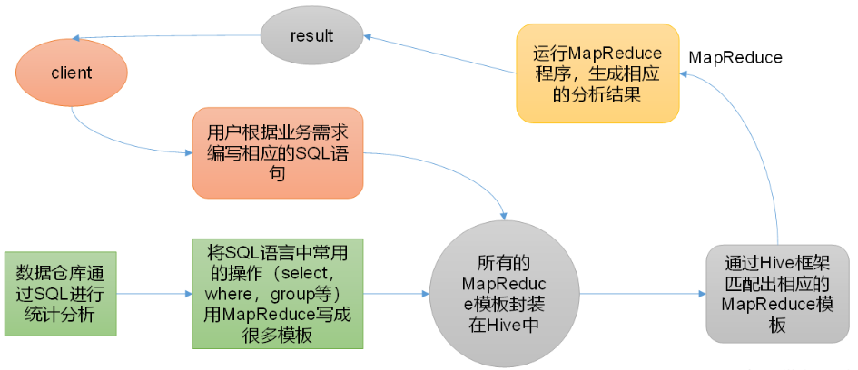
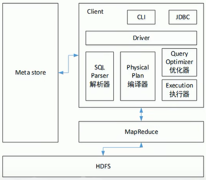
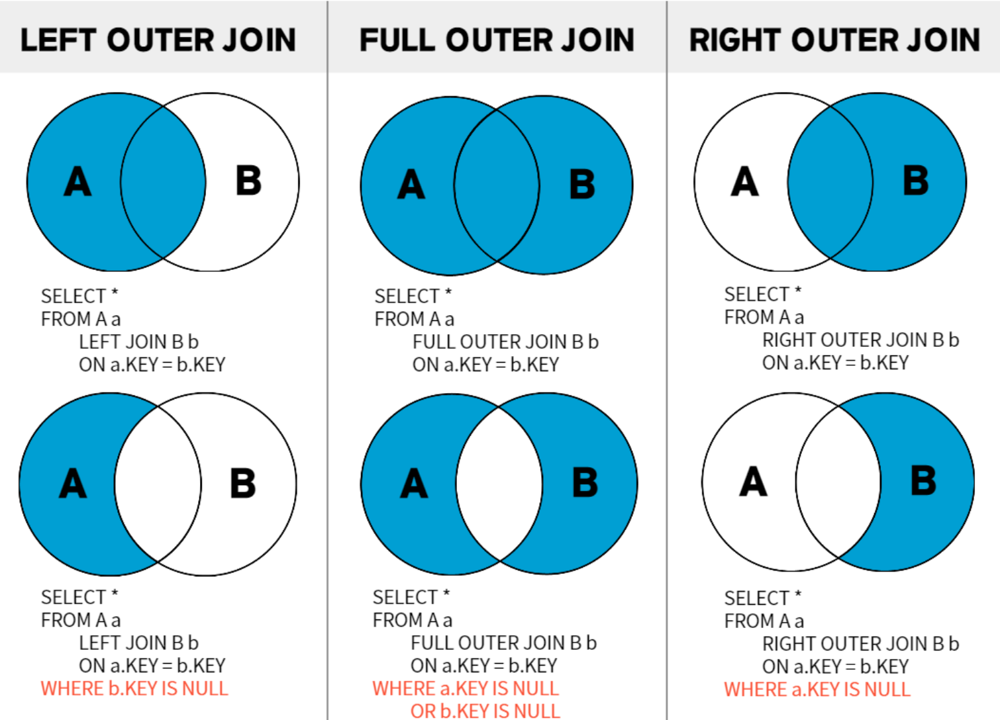
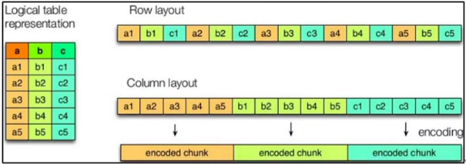
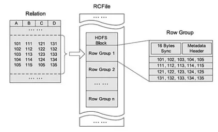

# 1. Hive 入门

## 1.1 Hive 简介

Hive 是由 Facebook 开源的用于解决海量结构化日志的数据统计工具，也是基于 Hadoop 的一个**数据仓库工具**，它可以**将结构化的数据文件映射为一张表**，并提供类 SQL 查询的功能，适用于一次写入，多次查询的场景。**Hive 的本质是将 HQL（Hive Query Language） 转化为 MapReduce 程序**，它处理的数据存储在 HDFS ，分析数据底层的实现是 MapReduce，执行程序运行在 Yarn 上。



1. **Hive 的优点**
   * 操作接口采用类 SQL 语法，提供快速开发的能力，简单且容易上手
   * 避免了写 MapReduce，减少开发人员的学习成本
   * Hive 的执行延迟比较高，因此 Hive 常用于数据分析，对实时性要求不高的场合
   * Hive 优势在于处理大数据，对于处理小数据没有优势，因为 Hive 的执行延迟比较高
   * Hive 支持用户自定义函数，用户可以根据自己的需求来实现自己的函数
2. **Hive 的缺点**
   * Hive 的 HQL 表达能力有限：迭代式算法无法表达；数据挖掘方面不擅长，由于 MapReduce 数据处理流程的限制，效率更高的算法却无法实现
   * Hive 的效率比较低：Hive 自动生成的 MapReduce 作业，通常情况下不够智能化；Hive 调优比较困难，粒度较粗


## 1.2 Hive 架构原理

1. **用户接口（Client）**

   CLI（command-line interface）、JDBC/ODBC（JDBC 访问 Hive）、WEBUI（浏览器访问 Hive）

2. **元数据（Metastore）**

   Hive 本质就是将 HDFS 上的一个文件映射为 Hive 中的一张表；**元数据包括表名、表所属的数据库（默认是 default）、表的拥有者、列/分区字段、表的类型（是否是外部表）、表的数据所在目录等**；元数据默认存储在自带的 derby 数据库中，推荐使用 MySQL 存储 Metastore

3. **Hadoop**

   使用 HDFS 进行存储，使用 MapReduce 进行计算

4. **驱动器（Driver）**

   * 解析器（SQL Parser）：将 SQL 字符串转换成抽象语法树 AST，这一步一般都用第三方工具库完成，比如antlr；对AST进行语法分析，比如表是否存在、字段是否存在、SQL 语义是否有误。
   * 编译器（Physical Plan）：将 AST 编译生成逻辑执行计划
   * 优化器（Query Optimizer）：对逻辑执行计划进行优化
   * 执行器（Execution）：把逻辑执行计划转换成可以运行的物理计划，对于 Hive 来说，就是 MR/Spark
     




## 1.3 Hive 与数据库对比

由于 Hive 采用了类似 SQL 的查询语言 HQL，因此很容易将 Hive 理解为数据库。其实从结构上来看，Hive 和数据库除了拥有类似的查询语言，再无类似之处。数据库可以用在 Online 的应用中，但是 Hive 是为数据仓库而设计的，清楚这一点，有助于从应用角度理解 Hive 的特性。

1. **查询语言**
   由于 SQL 被广泛的应用在数据仓库中，因此，专门针对 Hive 的特性设计了类 SQL 的查询语言 HQL，熟悉 SQL 的开发者可以很方便的使用 Hive 进行开发。
2. **数据更新**
   * Hive 是针对数据仓库应用设计的，而数据仓库的内容是读多写少的。因此，**Hive 中不建议对数据的改写，所有的数据都是在加载的时候确定好的**。本质是因为 HDFS 只支持追加，不支持随即修改。
   * 数据库中的数据通常是需要经常进行修改的，因此可以使用 INSERT INTO … VALUES 添加数据，使用 UPDATE … SET 修改数据。
3. **执行延迟**
   * Hive 在查询数据的时候，由于没有索引，需要扫描整个表，因此延迟较高。另外一个导致 Hive 执行延迟高的因素是 MapReduce 框架。由于 MapReduce 本身具有较高的延迟，因此在利用 MapReduce 执行 Hive 查询时，也会有较高的延迟。
   * 相对的，数据库的执行延迟较低。当然，这个低是有条件的，即数据规模较小，当数据规模大到超过数据库的处理能力的时候，Hive 的并行计算显然能体现出优势。
4. **数据规模**
   由于 Hive 建立在集群上，并可以利用 MapReduce 进行并行计算，因此可以支持很大规模的数据；对应的，数据库可以支持的数据规模较小。


## 1.4 Hive 安装

1. **解压缩文件**

   * 上传 Hive 安装包、MySQL 安装包、MySQL 驱动到 hadoop102 的 `/opt/software/` 目录下
   * 解压 Hive 到 `/opt/module/`目录，并重命名为 hive：`tar -xzvf apache-hive-3.1.2-bin.tar.gz -C /opt/module/`

2. **配置相关环境**

   * 配置环境变量：`sudo vim /etc/profile.d/my_env.sh`

     ```shell
     #HIVE_HOME
     export HIVE_HOME=/opt/module/hive
     export PATH=$PATH:$HIVE_HOME/bin
     ```

   * 使配置文件生效：`source /etc/profile`

   * 解决日志 jar 包冲突（可选）：`mv $HIVE_HOME/lib/log4j-slf4j-impl-2.10.0.jar $HIVE_HOME/lib/log4j-slf4j-impl-2.10.0.jar.bak`

   * 初始化元数据库，如果报错，则可能是 jar 包冲突，尝试将 Hadoop 里的 guava 包复制并替换 Hive 里的包：`bin/schematool -dbType derby -initSchema`

3. **启动并测试 Hive**

   * 启动 Hadoop 集群：`~/bin/myhadoop.sh start`

   * 启动 Hive，日志默认存放在 /tmp/maomao/hive.log 目录下，命令有两个重要参数，**参数 -e 表示不进入交互窗口执行 SQL 语句，参数 -f 表示执行文件中的 SQL 语句**：`bin/hive`

     ```shell
     # 默认有个名为default的库
     hive> show databases;
     # 创建并查看表
     hive> create table test(id string);
     hive> show tables;
     # 插入数据并查看表
     hive> insert into test values('1001');
     hive> select * from test;
     ```

   * 浏览器访问 hadoop102:9870，在 /user/hive/warehouse/test 目录下，可查看到插入的数据

   * 尝试新开一个 SSH 窗口，再次启动 Hive，并执行 show tables 命令，会发现执行报错。查看相关日志，**原因在于 Hive 默认使用的元数据库是 derby，开启 Hive 后就会占用元数据库，且不与其它客户端共享数据，所以需要将 Hive 的元数据库改为 MySQL**

     ```shell
     Caused by: ERROR XSDB6: Another instance of Derby may have already booted the database /opt/module/hive/metastore_db.
     ```

4. **MySQL 安装**

   * 停止上面所有 Hive 会话，检查当前系统是否安装过 MySQL：`rpm -qa | grep mariadb`

   * 如果存在，使用如下命令卸载：`sudo rpm -e --nodeps mariadb-libs`

   * 解压 MySQL 安装包：`tar -xvf mysql-5.7.28-1.el7.x86_64.rpm-bundle.tar`

   * 在安装目录下执行 rpm 安装：

     ```shell
     sudo rpm -ivh mysql-community-common-5.7.28-1.el7.x86_64.rpm
     sudo rpm -ivh mysql-community-libs-5.7.28-1.el7.x86_64.rpm
     sudo rpm -ivh mysql-community-libs-compat-5.7.28-1.el7.x86_64.rpm
     sudo rpm -ivh mysql-community-client-5.7.28-1.el7.x86_64.rpm
     sudo rpm -ivh mysql-community-server-5.7.28-1.el7.x86_64.rpm
     ```

   * 初始化数据库：`sudo mysqld --initialize --user=mysql`

   * 查看临时生成的 root 用户密码：`sudo cat /var/log/mysqld.log`

   * 启动 MySQL 服务，之后默认开机自启：`sudo systemctl start mysqld`

   * 登录 MySQL，修改 root 用户密码，并允许 root 用户任意 IP 连接：`mysql -uroot -p`

     ```shell
     mysql> set password = password("111111");
     mysql> update mysql.user set host='%' where user='root';
     mysql> flush privileges;
     ```

5. **Hive 元数据配置到 MySQL**

   * 拷贝驱动：`cp /opt/software/mysql-connector-java-5.1.27-bin.jar $HIVE_HOME/lib`

   * 配置元数据，在 $HIVE_HOME/conf 目录下新建 hive-site.xml 文件：`vim hive-site.xml`

     ```xml
     <?xml version="1.0"?>
     <?xml-stylesheet type="text/xsl" href="configuration.xsl"?>
     <configuration>
         <!-- jdbc连接的URL -->
         <property>
             <name>javax.jdo.option.ConnectionURL</name>
             <value>jdbc:mysql://hadoop102:3306/metastore?useSSL=false</value>
         </property>
         <!-- jdbc连接的Driver -->
         <property>
             <name>javax.jdo.option.ConnectionDriverName</name>
             <value>com.mysql.jdbc.Driver</value>
         </property>
         <!-- jdbc连接的username -->
         <property>
             <name>javax.jdo.option.ConnectionUserName</name>
             <value>root</value>
         </property>
         <!-- jdbc连接的password -->
         <property>
             <name>javax.jdo.option.ConnectionPassword</name>
             <value>111111</value>
         </property>
         <!-- Hive元数据存储版本的验证 -->
         <property>
             <name>hive.metastore.schema.verification</name>
             <value>false</value>
         </property>
         <!-- 元数据存储授权 -->
         <property>
             <name>hive.metastore.event.db.notification.api.auth</name>
             <value>false</value>
         </property>
         <!-- Hive默认在HDFS的工作目录 -->
         <property>
             <name>hive.metastore.warehouse.dir</name>
             <value>/user/hive/warehouse</value>
         </property>
     </configuration>
     ```

   * 登录 MySQL，并创建 Hive 的元数据库，库名必须与 hive-site.xml 配置文件一致：`mysql -uroot -p`

     ```shell
     mysql> create database metastore;
     ```

   * 初始化 Hive 元数据库：`bin/schematool -dbType mysql -initSchema -verbose`

   * 再次启动 Hive 进行测试：`bin/hive`

     ```shell
     # 此时MySQL中没有元数据
     hive> show tables;
     # 创建一个和之前一样的表，相当于补上了元数据，加上HDFS中的数据，因此可以查看到表中的数据
     hive> create table test(id string);
     hive> select * from test;
     ```

6. **使用元数据服务的方式访问 Hive**

   * 在 hive-site 文件中添加如下配置信息：`vim hive-site.xml`

     ```xml
         <!-- 指定存储元数据要连接的地址 -->
         <property>
             <name>hive.metastore.uris</name>
             <value>thrift://hadoop102:9083</value>
         </property>
     ```

   * 启动 Metastore，启动后窗口不能再操作，需打开一个新窗口：`hive --service metastore`

   * 再次启动 Hive 进行测试：`bin/hive`

7. **使用 JDBC 方式访问 Hive**

   * 配置 Hadoop 超级代理，并重启 Hadoop：`vim $HADOOP_HOME/etc/hadoop/core-site.xml`

     ```xml
         <!-- 配置超级代理maomao操作Hadoop的用户、用户组和主机 -->
     	<property>
             <name>hadoop.proxyuser.maomao.hosts</name>
             <value>*</value>
         </property>
         <property>
             <name>hadoop.proxyuser.maomao.groups</name>
             <value>*</value>
         </property>
     ```

   * 在 hive-site 文件中添加如下配置信息：`vim hive-site.xml`

     ```xml
         <!-- 指定hiveserver2连接的host -->
         <property>
             <name>hive.server2.thrift.bind.host</name>
             <value>hadoop102</value>
         </property>
         <!-- 指定hiveserver2连接的的端口号 -->
         <property>
             <name>hive.server2.thrift.port</name>
             <value>10000</value>
         </property>
     ```

   * 启动 hiveserver2，，启动后窗口不能再操作，需打开一个新窗口，注意需要先启动上面的元数据服务，启动过程较久，注意查看日志 ：`bin/hive --service hiveserver2`

   * 启动 beeline 客户端，并查看表：`bin/beeline -u jdbc:hive2://hadoop102:10000 -n maomao`

     ```shell
     0: jdbc:hive2://hadoop102:10000> select * from test;
     ```

   * 编写 Hive 启动脚本，并增加执行权限：`vim $HIVE_HOME/bin/hiveservices.sh`

     ```shell
     #!/bin/bash
     HIVE_LOG_DIR=$HIVE_HOME/logs
     if [ ! -d $HIVE_LOG_DIR ]
     then 
           mkdir -p $HIVE_LOG_DIR
     fi
      
     # 检查进程是否运行正常，参数1为进程名，参数2为进程端口
     function check_process() {
     	pid=$(ps -ef 2>/dev/null | grep -v grep | grep -i $1 | awk '{print $2}')
     	ppid=$(netstat -nltp 2>/dev/null | grep $2 | awk '{print $7}' | cut -d '/' -f 1)
     	echo $pid
     	[[ "$pid" =~ "$ppid" ]] && [ "$ppid" ] && return 0 || return 1
     }
      
     function hive_start() {
     	metapid=$(check_process HiveMetastore 9083)
     	cmd="nohup hive --service metastore >$HIVE_LOG_DIR/metastore.log 2>&1&"
     	[ -z "$metapid" ] && eval $cmd || echo "Metastroe 服务已启动"
     	server2pid=$(check_process HiveServer2 10000)
     	cmd="nohup hive --service hiveserver2 >$HIVE_LOG_DIR/hiveServer2.log 2>&1 &"
     	[ -z "$server2pid" ] && eval $cmd || echo "HiveServer2 服务已启动"
     }
      
     function hive_stop() {
     	metapid=$(check_process HiveMetastore 9083)
     	[ "$metapid" ] && kill $metapid || echo "Metastore 服务未启动"
     	server2pid=$(check_process HiveServer2 10000)
     	[ "$server2pid" ] && kill $server2pid || echo "HiveServer2 服务未启动"
     }
      
     case $1 in
     "start")
     	hive_start
     	;;
     "stop")
     	hive_stop
     	;;
     "restart")
     	hive_stop
     	sleep 2
     	hive_start
     	;;
     "status")
     	check_process HiveMetastore 9083 >/dev/null && echo "Metastore 服务运行正常" || echo "Metastore 服务运行异常"
     	check_process HiveServer2 10000 >/dev/null && echo "HiveServer2 服务运行正常" || echo "HiveServer2 服务运行异常"
     	;;
     *)
     	echo Invalid Args!
     	echo 'Usage: '$(basename $0)' start|stop|restart|status'
     	;;
     esac
     ```

8. **Hive 常见属性配置**

   * 重命名日志配置文件，并修改 Hive 日志存放目录：`mv conf/hive-log4j2.properties.template conf/hive-log4j2.properties`

     ```properties
     property.hive.log.dir = /opt/module/hive/logs
     ```

   * 打印当前库和表头信息：`vim hive-site.xml`

     ```xml
         <!-- 打印表头信息 -->
         <property>
             <name>hive.cli.print.header</name>
             <value>true</value>
         </property>
         <!-- 打印当前库信息 -->
         <property>
             <name>hive.cli.print.current.db</name>
             <value>true</value>
         </property>
     ```

   * 参数配置的三种方式（优先级依次递增）：hive-default.xml < hive-site.xml < 命令行参数方式（在命令行添加 `-hiveconf param=value` 设定，仅本次 Hive 启动有效） < 参数声明方式（在 HQL 中使用 SET 关键字设定，仅本次 Hive 启动有效）


# 2. Hive 数据类型

## 2.1 基本数据类型

| Hive 数据类型 | Java 数据类型 | 长度                                    |
| ------------- | ------------- | --------------------------------------- |
| tinyint       | byte          | 1 字节有符号整数                        |
| smallint      | short         | 2 字节有符号整数                        |
| int           | int           | 4 字节有符号整数                        |
| bigint        | long          | 8 字节有符号整数                        |
| boolean       | boolean       | 布尔类型，true 或 false                 |
| float         | float         | 单精度浮点数                            |
| double        | double        | 双精度浮点数                            |
| string        | string        | 字符系列，可指定字符集，可使用单/双引号 |
| timestamp     |               | 时间类型                                |
| binary        |               | 字节数组                                |

注：对于 Hive 的 String 类型相当于数据库的 varchar 类型，该类型是一个可变的字符串，不过它不能声明其中最多能存储多少个字符，理论上它可以存储2GB的字符数


## 2.2 集合数据类型

| 数据类型 | 描述                                                 |
| -------- | ---------------------------------------------------- |
| struct   | 和 C 语言中的 struct 类似，可以通过“.”访问元素       |
| map      | 键值对元素集合，使用数组表示法访问元素               |
| array    | 具有相同类型和名称的变量集合，使用数组表示法访问元素 |

案例实操：

1. 假设某表有如下一行，我们用 JSON 格式来表示其数据结构

   ```json
   {
       "name": "songsong",
       "friends": ["bingbing" , "lili"] ,  // 列表Array,
       "children": {                       // 键值Map
           "xiao song": 18 ,
           "xiaoxiao song": 19
       },
       "address": {                       // 结构Struct
           "street": "hui long guan" ,
           "city": "beijing" 
       }
   }
   ```

2. 基于上述数据结构，创建本地测试文件：`vim test.txt`

   ```shell
   songsong,bingbing_lili,xiao song:18_xiaoxiao song:19,hui long guan_beijing
   yangyang,caicai_susu,xiao yang:18_xiaoxiao yang:19,chao yang_beijing
   ```

3. 导入数据：`hadoop fs -put test.txt /user/hive/warehouse/test`

4. 在 Hive 上创建表 test：`bin/hive`

   ```shell
   # “,”列分隔符、“_”三种集合分隔符、“,”map中的键值分隔符、“\n”行分隔符
   create table test(
   name string,
   friends array<string>,
   children map<string, int>,
   address struct<street:string, city:string>
   )
   row format delimited fields terminated by ','
   collection items terminated by '_'
   map keys terminated by ':'
   lines terminated by '\n';
   ```

5. 访问三种集合列中的数据

   ```shell
   hive (default)> select friends[1], children['xiao song'], address.city from test;
   OK
   _c0	_c1	city
   lili	18	beijing
   susu	NULL	beijing
   Time taken: 5.205 seconds, Fetched: 2 row(s)
   ```


## 2.3  类型转化

Hive 的原子数据类型是可以进行隐式转换的，类似于 Java 的类型转换，例如某表达式使用 INT 类型，TINYINT 会自动转换为 INT 类型，但是 Hive 不会进行反向转化，例如，某表达式使用 TINYINT 类型，INT 不会自动转换为 TINYINT 类型，它会返回错误，除非使用 CAST 操作。

1. 隐式类型转换规则如下：

   * 任何整数类型都可以隐式地转换为一个范围更广的类型，如 TINYINT 可以转换成 INT，INT 可以转换成 BIGINT
   * 所有整数类型、FLOAT、STRING（类似“3.14”）类型都可以隐式地转换成 DOUBLE
   * TINYINT、SMALLINT、INT 都可以转换为 FLOAT
   * BOOLEAN 类型不可以转换为任何其它的类型

2. 可以使用 CAST 操作显示进行数据类型转换

   例如 CAST(‘1’ AS INT) 将把字符串 ’1’  转换成整数 1；如果强制类型转换失败，如执行 CAST(‘X’ AS INT)，表达式返回空值 NULL


# 3. DDL 与 DML

DDL（Data Definition Language）数据定义语言，用于定义和管理 SQL 数据库中的所有对象的语言，对数据库中的某些对象（例如 database、table）进行管理，包括的关键字有：create、alter、drop。

DML（Data Manipulation Language）数据操作语言，数据库的基本操作，SQL 中处理数据等操作统称为数据操纵语言，简而言之就是实现了基本的“增删改查”操作，包括的关键字有：select、update、delete、insert。

## 3.1 DDL 数据定义

### 3.1.1 数据库操作

```sql
-- 创建数据库
CREATE DATABASE [IF NOT EXISTS] db_name
[COMMENT db_comment]
[LOCATION hdfs_path]
[WITH DBPROPERTIES (property_name=property_value, ...)];

-- 查询数据库
show databases [like 'db*'];
desc databases [extended] db_name;

-- 修改数据库，用户只能为某个数据库的DBPROPERTIES设置键值对属性值，来描述这个数据库的属性信息，其他元数据信息都是不可更改的，包括数据库名和数据库所在的目录位置
alter database db_name set dbproperties('property_name'='property_value');

-- 删除数据库，默认只能删除空数据库，如果数据库不为空，可以采用cascade强制删除
drop database [if exists] db_name [cascade];
```


### 3.1.2 表操作

```sql
CREATE [EXTERNAL] TABLE [IF NOT EXISTS] table_name 	-- [EXTERNAL]外部表
[(col_name data_type [COMMENT col_comment], ...)] 	-- [COMMENT col_comment]字段描述信息
[COMMENT table_comment] 	-- 表描述信息
[PARTITIONED BY (col_name data_type [COMMENT col_comment], ...)] 	-- 按照某些字段分区
[CLUSTERED BY (col_name, col_name, ...) 
[SORTED BY (col_name [ASC|DESC], ...)] INTO num_buckets BUCKETS] 	-- 按照某些字段分桶，SORTED BY不常用，对桶中的一个或多个列另外排序
[ROW FORMAT DELIMITED [FIELDS TERMINATED BY 'char'] [COLLECTION ITEMS TERMINATED BY 'char'] [MAP KEYS TERMINATED BY 'char'] [LINES TERMINATED BY 'char']] 	-- 行格式
[STORED AS file_format] 	-- 指定存储文件类型，常用：SEQUENCEFILE（二进制序列文件）、TEXTFILE（文本）、RCFILE（列式存储格式文件）
[LOCATION hdfs_path] -- 指定表在HDFS上的存储位置
[TBLPROPERTIES (property_name=property_value, ...)]		-- 表属性，指定压缩方式等
[AS select_statement] 	-- 后跟查询语句，根据查询结果创建表
[LIKE table_name]; 	-- 允许用户复制现有的表结构，但是不复制数据
```

默认创建的表都是所谓的**管理表**，也被称为内部表，这种表 Hive 会控制着数据的生命周期，默认情况下会将这些表的数据存储在由配置项 hive.metastore.warehouse.dir 所定义目录的子目录下，**当删除一个管理表时，Hive 也会删除这个表中数据**，因此管理表不适合和其他工具共享数据。

**外部表**，Hive 并非认为其完全拥有这份数据，**删除该表只会删除描述表的元数据信息，而不会删除表中数据**。两种表的使用场景：每天将收集到的网站日志定期流入 HDFS 文本文件，在外部表（原始日志表）的基础上做大量的统计分析，用到的中间表、结果表使用内部表存储，数据通过 SELECT + INSERT 进入内部表。

```sql
-- 查询表的信息，包括表的类型等
desc formatted tb_name;
-- 修改外部表为内部表，('EXTERNAL'='TRUE')为固定写法，区分大小写，FALSE表示修改内部表为外部表
alter table tb_name set tblproperties('EXTERNAL'='TRUE');
-- 重命名表
alter table tb_name rename to new_tb_name;

-- 更新列，列名可以随意修改，但是列的类型只能小改大，不能大改小（遵循自动转换规则）
ALTER TABLE table_name CHANGE [COLUMN] col_old_name col_new_name column_type [COMMENT col_comment] [FIRST|AFTER column_name];
-- 增加/替换列，ADD表示新增一字段，字段位置在所有列后面（partition列前）；EPLACE表示替换表中所有字段，使用时，字段的类型要跟之前的类型对应上，数量可以减少或者增加，其实就是包含了更新列、增加列、删除列的功能
ALTER TABLE table_name ADD|REPLACE COLUMNS (col_name data_type [COMMENT col_comment], ...);

-- 删除表，只能删除管理表（包括元数据和表数据），不能删除外部表中数据（仅删除外部表元数据）
drop table tb_name;
-- 清空表，只能清空管理表中的数据（元数据仍然保留），清空外部表直接报错
truncate table tb_name;
```

```shell
# 命令行能正常插入和查看数据，但是查看HDFS中存放的数据：1001SOHzhangsan，发现列之间存在一个奇怪的分隔符，因此后续无法使用MR进行操作，解决方法是建表时增加：row format delimited fields terminated by ','
hive (default)> create table test(id int, name string);
hive (default)> insert into test values(1001, 'zhangsan');
hive (default)> select * from test;
test.id	test.name
1001	zhangsan

# change更新列，将int类型的属性id，修改为string类型的属性sid
hive (default)> desc test;
col_name	data_type	comment
id                  	int                 	                    
name                	string              	                    
hive (default)> alter table test change id sid string;
hive (default)> desc test;
col_name	data_type	comment
sid                 	string              	                    
name                	string              	                    

# add增加列，原有数据行的新属性为NULL
hive (default)> alter table test add columns (class int);
hive (default)> select * from test;
test.sid	test.name	test.class
1001	zhangsan	NULL

# replace替换列，其实更改的只是元数据，实现删除列、增加列的功能
hive (default)> alter table test replace columns (id string);
hive (default)> select * from test;
test.id
1001
hive (default)> alter table test replace columns (id string, name string);
hive (default)> select * from test;
test.id	test.name
1001	zhangsan
```


## 3.2 DML 数据操作

### 3.2.1 数据导入

1. **向表中装载数据（Load）**

   ```sql
   -- load data表示加载数据；local表示从本地加载数据到Hive表，否则从HDFS加载数据到Hive表；input表示加载数据的路径；overwrite表示覆盖表中已有数据，否则表示追加；into table表示加载到哪张表；partition表示上传到指定分区。
   -- 注意，load本地数据可能会报错，因为load本地数据会走MR，随机从NodeManager中的一台机器读取文件，若没有就会报错
   load data [local] inpath '数据的的路径' [overwrite] into table tb_name [partition (partcol1=val1,…)];
   ```

   ```shell
   # 首先在/opt/module/hive/目录下创建一个student.txt本地文件
   hive (default)> create table student(id string, name string) row format delimited fields terminated by '\t';
   # 从本地加载数据到Hive表
   hive (default)> load data local inpath '/opt/module/hive/student.txt' into table student;
   # numFiles和numRows有三种情况：假设通过insert插入数据，则前者为0，后者增加；假设通过load导入数据，则前者增加，后者为0；假设仅仅通过hadoop dfs导入数据，则两者均为0，即元数据信息不会改变
   hive (default)> desc formatted student;
   Table Type:         	MANAGED_TABLE       	 
   Table Parameters:	 	 
   	bucketing_version   	2                   
   	numFiles            	1                   
   	numRows             	0                   
   	rawDataSize         	0                   
   	totalSize           	42                  
   	transient_lastDdlTime	1661239350
   # 在上述三种情况下，count(*)分别为：不使用MR，直接返回元数据信息numRows，耗时短；使用MR，耗时较长；直接返回numRows=0。此处看到count(*)使用了MR
   hive (default)> select count(*) from student;
   
   # 首先通过命令“hadoop dfs -put student.txt /”上传student.txt文件
   hive (default)> create table student2(id string, name string) row format delimited fields terminated by '\t';
   # 从HDFS加载数据到Hive表
   hive (default)> load data inpath '/student.txt' into table default.student2;
   ```

2. **通过查询语句向表中插入数据（insert）**

   ```shell
   hive (default)> select * from student2;
   student2.id	student2.name
   1001	shenzhen
   hive (default)> select * from student;
   student.id	student.name
   1001	shenzhen
   
   # insert into：以追加数据的方式插入到表或分区，原有数据不会删除（两张表列属性必须相同）
   hive (default)> insert into table student select * from student2;
   hive (default)> select * from student;
   student.id	student.name
   1001	shenzhen
   1001	shenzhen
   
   # insert overwrite：覆盖表中已存在的数据
   hive (default)> insert overwrite table student select * from student2;
   hive (default)> select * from student;
   student.id	student.name
   1001	shenzhen
   ```

3. **查询语句中创建表并加载数据（As Select）**

   ```shell
   hive (default)> create table if not exists student3 as select id,name from student;
   hive (default)> select * from student3;
   student.id	student.name
   1001	shenzhen
   ```

4. **创建表时通过 Location 指定加载数据路径**

   ```shell
   # 文件不在/user/hive/warehouse默认路径下，一般认为是共享数据的表，即外部表
   hive (default)> create external table if not exists student4 (id string, name string) row format delimited fields terminated by '\t' location '/student.txt;
   hive (default)> select * from student4;
   student.id	student.name
   1001	shenzhen
   ```

5. **Import 数据到指定 Hive 表中**

   ```shell
   # 必须先用export导出后，再将数据导入
   hive (default)> import table student5 from '/student';
   ```


### 3.2.2 数据导出

1. **Insert 导出**

   ```shell
   # 加local将查询结果导出到本地，不加local将查询结果导出到HDFS，注意指定列属性分隔符
   hive (default)> insert overwrite local directory '/opt/module/hive/datas' ROW FORMAT DELIMITED FIELDS TERMINATED BY ',' select * from student;
   ```

2. **Hadoop 命令导出到本地**

   ```shell
   hive (default)> dfs -get /user/hive/warehouse/student/000000_0 /opt/module/hive/datas/student.txt;
   ```

3. **Hive Shell 命令导出**

   ```shell
   # 无需进入hive客户端，使用参数-e和-f均可
   [maomao@hadoop102 hive]$ bin/hive -e 'select * from default.student;' > /opt/module/hive/datas/student.txt;
   [maomao@hadoop102 hive]$ cat datas/student.txt 
   student.id	student.name
   1001	shenzhen
   ```

4. **Export导出到HDFS上**

   ```shell
   # export和import主要用于两个Hadoop平台集群之间Hive表迁移
   # export导出的信息包括元数据和表数据，import导入的表必须不存在或为空表
   hive (default)> export table student to '/student';
   hive (default)> import table student5 from '/student';
   hive (default)> select * from student5;
   student5.id	student5.name
   1001	shenzhen
   ```

   

### 3.2.3 DML 查询

查询语句语法如下，参考：[LanguageManual Select](https://cwiki.apache.org/confluence/display/Hive/LanguageManual+Select)

```sql
-- 前面数字为执行顺序，如GROUP BY在SELECT前面，所以GROUP BY不能使用SELECT中取的别名
(7)    SELECT
(8)    DISTINCT <select_list>
(1)    FROM <left_table>
(3)    <join_type> JOIN <right_table>
(2)    ON <join_condition>
(4)    WHERE <where_condition>
(5)    GROUP BY <group_by_list>
(6)    HAVING <having_condition>
(11)   ORDER BY <order_by_condition>
(9)    [CLUSTER BY col_list] | [DISTRIBUTE BY col_list]
(10)   [SORT BY col_list]
(12)   LIMIT <limit_number> 
```

1. **准备数据，首先准备两个数据文件：dept.txt、emp.txt、loc.txt**

   ```
   10      accounting      1700
   20      research        1800
   30      sales   1900
   40      operations      1700
   ```

   ```
   7369    smith   clerk   7902    1980-12-17      800.00          20
   7499    allen   salesman        7698    1981-2-20       1600.00 300.00  30
   7521    ward    salesman        7698    1982-2-22       1250.00 500.00  30
   7566    jones   manager 7839    1981-4-2        2975.00         20
   7654    martin  salesman        7698    1981-9-28       1250.00 1400.00 30
   7698    blake   manager 7839    1981-5-1        2850.00         30
   7782    clark   manager 7839    1981-6-9        2450.00         10
   7788    scott   analyst 7566    1987-4-19       3000.00         20
   7839    king    president               1981-11-17      5000.00         10
   7844    turner  salesman        7698    1981-9-8        1500.00 0.00    30
   7876    adams   clerk   7788    1987-5-23       1100.00         20
   7900    james   clerk   7698    1981-12-3       950.00          30
   7902    ford    analyst 7566    1981-12-3       3000.00         20
   7934    miller  clerk   7782    1982-1-23       1300.00         10
   7934    miller  clerk   7782    1982-1-23       1300.00         50
   ```

   ```
   1700	Beijing
   1800	London
   1900	Tokyo
   ```

   ```shell
   # 创建三张表dept、emp、loc，属性字段使用\t分隔
   hive (default)> create table if not exists dept(deptno int, dname string, loc int) row format delimited fields terminated by '\t';
   hive (default)> create table if not exists emp(empno int, ename string, job string, mgr int, hiredate string, sal double, comm double, deptno int) row format delimited fields terminated by '\t';
   hive (default)> create table if not exists loc(loc int, loc_name string) row format delimited fields terminated by '\t';
   # load从文件中导入三张表的数据
   hive (default)> load data local inpath '/opt/module/hive/datas/dept.txt' into table dept;
   hive (default)> load data local inpath '/opt/module/hive/datas/emp.txt' into table emp;
   hive (default)> load data local inpath '/opt/module/hive/datas/loc.txt' into table loc;
   ```

2. **基本查询**

   ```shell
   # 使用group by分组，使用avg()求平均函数，并指定别名
   hive (default)> select deptno, avg(sal) avg_sal from emp group by deptno;
   deptno	avg_sal
   10	2916.6666666666665
   20	2175.0
   30	1566.6666666666667
   50	1300.0
   # having和where区别：
   # where只能跟着from后，从磁盘读入内存时判断数据，因此不能使用字段别名，也不能使用统计函数
   # having只能跟着group by后，是对表数据进行了分组后，对“组信息”进行相应条件筛选，可以使用字段别名和函数
   hive (default)> select deptno,avg(sal) avg_sal from emp group by deptno having avg_sal>2000;
   deptno	avg_sal
   10	2916.6666666666665
   20	2175.0
   ```

3. **join 查询**

   ```shell
   # 表别名的好处：可以简化查询，同时提高执行效率
   # 内连接：只有进行连接的两个表中都存在与连接条件相匹配的数据才会被保留下来（e.deptno=50、d.deptno=40均不存在）
   hive (default)> select e.empno, e.ename, d.deptno, d.dname from emp e join dept d on e.deptno = d.deptno;
   
   # 左外连接：JOIN操作符左边表中符合WHERE子句的所有记录将会被返回（e.deptno=50存在、d.deptno=40不存在），若要取左表独有数据，只需最后加上where条件：where d.deptno is null
   hive (default)> select e.empno, e.ename, e.deptno, d.dname from emp e left join dept d on e.deptno = d.deptno;
   
   # 右外连接：JOIN操作符右边表中符合WHERE子句的所有记录将会被返回（e.deptno=50不存在、d.deptno=40存在），若要取右表独有数据，只需最后加上where条件：where e.deptno is null
   hive (default)> select e.empno, e.ename, d.deptno, d.dname from emp e right join dept d on e.deptno = d.deptno;
   
   # 满外连接：将会返回所有表中符合WHERE语句条件的所有记录，如果任一表的指定字段没有符合条件的值的话，那么就使用NULL值替代（e.deptno=50、d.deptno=40均存在），若要取左、右表独有数据（不包含公共数据），只需最后加上where条件：where d.deptno is null or e.deptno is null
   hive (default)> select e.empno, e.ename, d.deptno, d.dname from emp e full join dept d on e.deptno = d.deptno;
   
   # 多表连接查询，大多数情况下，Hive会对每对JOIN连接对象启动一个MR任务，本例中会首先启动一个MR job对表e和表d进行连接操作，然后再启动一个MR job将第一个MR job的输出和表l进行连接操作
   # 优化：当对3个或者更多表进行join连接时，如果每个on子句都使用相同的连接键，那么只会产生一个MR job
   hive (default)> select e.ename, d.dname, l.loc_name from emp e JOIN dept d ON d.deptno = e.deptno JOIN loc l ON d.loc = l.loc;
   
   # 笛卡尔积产生条件：省略连接条件、连接条件无效、所有表中的所有行互相连接
   hive (default)> select empno, dname from emp, dept;
   ```

   

4. **排序**

   ```shell
   # order by：全局排序，只有一个Reducer，由于order by的执行在select后，因此可以使用别名
   hive (default)> select ename, sal*2 twosal from emp order by twosal;
   
   # sort by：每个Reducer内部排序，并产生对应的排序文件，对全局结果集来说不是排序。对于大规模的数据集，order by的效率非常低，在很多情况下，并不需要全局排序，此时可以使用sort by
   # 首先设置并查看Reducer个数，然后根据部门编号降序查看员工信息
   hive (default)> set mapreduce.job.reduces = 3;
   hive (default)> set mapreduce.job.reduces;
   hive (default)> select * from emp sort by deptno desc;
   
   # distribute by：分区，类似MR中的partition（自定义分区），结合sort by使用。分区规则是根据分区字段的哈希码与reduce的个数取模后，余数相同的分到一个区。若不指定distribute by，而只写sort by，则分区规则是随机的
   hive (default)> set mapreduce.job.reduces = 3;
   hive (default)> insert overwrite local directory '/opt/module/hive/datas/distribute-result' select * from emp distribute by deptno sort by empno desc;
   
   # cluster by：当distribute by和sorts by字段相同时，可以使用cluster by，但不能指定排序规则，只能是升序排序。以下两种写法等价
   hive (default)> select * from emp cluster by deptno;
   hive (default)> select * from emp distribute by deptno sort by deptno;
   ```


# 4. 分区表与分桶表

## 4.1 分区表

Hive 表实际上就是对应一个 HDFS 文件系统上的独立的目录，该目录下是表所有的数据文件。Hive 中的分区就是分目录，把一个大的数据集根据业务需要分割成小的数据集。在查询时通过 WHERE 子句中的表达式选择查询所需要的指定的分区，这样的查询效率会提高很多。

### 4.1.1 分区表基本操作

```shell
# 准备三个数据文件：dept_0401.log、dept_0402.log、dept_0403.log
# dept_0401.log
10	ACCOUNTING	1700
20	RESEARCH	1800
# dept_0402.log
30	SALES	1900
40	OPERATIONS	1700
# dept_0403.log
50	TEST	2000
60	DEV	1900
```

```shell
# 创建分区表
hive (default)> create table dept_partition(deptno int, dname string, loc string) partitioned by (day string) row format delimited fields terminated by '\t';
# 加载数据，将在HDFS路径/user/hive/warehouse/dept_partition下生成三个子目录
hive (default)> load data local inpath '/opt/module/hive/datas/dept_0401.log' into table dept_partition partition(day='0401');
hive (default)> load data local inpath '/opt/module/hive/datas/dept_0402.log' into table dept_partition partition(day='0402');
hive (default)> load data local inpath '/opt/module/hive/datas/dept_0403.log' into table dept_partition partition(day='0403');

# 单分区查询，不需要全表扫描，提高查询效率
hive (default)> select * from dept_partition where day='0401';
# 多分区联合查询
hive (default)> select * from dept_partition where day='0401' union select * from dept_partition where day='0402';

# 增加分区
hive (default)> alter table dept_partition add partition(day='0404') partition(day='0405');
# 删除分区，注意删除多个分区必须使用逗号，而添加多个分区使用空格
hive (default)> alter table dept_partition drop partition (day='0404'), partition(day='0405');
# 查看分区
hive> show partitions dept_partition;
partition
day=0401
day=0402
day=0403
# 查看分区表结构
hive> desc formatted dept_partition;
# Partition Information	 	 
# col_name            	data_type           	comment             
day                 	string
```

```shell
# 假设通过Hadoop命令将文件数据上传到HDFS目录，如何让分区表和数据产生关联，即生成分区表的元数据
hive (default)> dfs -mkdir -p /user/hive/warehouse/dept_partition/day=0404;
hive (default)> dfs -put /opt/module/hive/datas/dept_0401.log /user/hive/warehouse/dept_partition/day=0404;
# 由于通过Hadoop命令上传文件，并未修改分区表的元数据，因此无法查询到刚刚上传的数据
hive (default)> select * from dept_partition;

# 方法一：上传数据后使用msck repair修复
hive (default)> msck repair table dept_partition;
Partitions not in metastore:	dept_partition:day=0404
Repair: Added partition to metastore dept_partition:day=0404

# 方法二：上传数据后添加分区
hive (default)> alter table dept_partition add partition(day='0404');

# 方法三：创建目录后load数据到分区
hive (default)> load data local inpath '/opt/module/hive/datas/dept_0401.log' into table dept_partition partition(day='0404');
```


### 4.1.2 二级分区

```shell
# 如果一级分区后数据量仍然很大，可以进行二级分区
hive (default)> create table dept_partition2(deptno int, dname string, loc string) partitioned by (day string, hour string) row format delimited fields terminated by '\t';
# 加载数据
hive (default)> load data local inpath '/opt/module/hive/datas/dept_0401.log' into table dept_partition2 partition(day='0401', hour='11');
hive (default)> load data local inpath '/opt/module/hive/datas/dept_0402.log' into table dept_partition2 partition(day='0401', hour='12');
hive (default)> load data local inpath '/opt/module/hive/datas/dept_0403.log' into table dept_partition2 partition(day='0403', hour='11');
# 查询二级分区
hive (default)> select * from dept_partition2 where day='0401' and hour='12';
```


### 4.1.3 动态分区调整

关系型数据库中，对分区表插入数据时，数据库自动会根据分区字段的值，将数据插入到相应的分区中，Hive 中也提供了类似的机制，即动态分区 Dynamic Partition，只不过使用 Hive 的动态分区，需要进行相应的配置。

```shell
# 1.开启动态分区功能（默认true）
hive (default)> hive.exec.dynamic.partition = true
# 2.设置为非严格模式，动态分区模式默认为strict，表示必须指定至少一个分区为静态分区，nonstrict模式表示允许所有的分区字段都可以使用动态分区。
hive (default)> hive.exec.dynamic.partition.mode = nonstrict
# 3.在所有执行MR的节点上，最大一共可以创建多少个动态分区，默认1000
hive (default)> hive.exec.max.dynamic.partitions = 1000
# 4.在每个执行MR的节点上，最大可以创建多少个动态分区，该参数需要根据实际的数据来设定。比如，源数据中包含了一年的数据，即day字段有365个值，那么该参数就需要设置成大于365，如果使用默认值100，则会报错
hive (default)> hive.exec.max.dynamic.partitions.pernode = 100
# 5.整个MR Job中，最大可以创建多少个HDFS文件，默认100000
hive (default)> hive.exec.max.created.files = 100000
# 6.当有空分区生成时，是否抛出异常，一般不需要设置，默认false
hive (default)> hive.error.on.empty.partition = false
```

```shell
# 将dept表中的数据按照地区（loc字段），插入到目标表dept_partition_dy的相应分区中
hive (default)> create table dept_partition_dy(id int, name string) partitioned by (loc int) row format delimited fields terminated by '\t';
hive (default)> set hive.exec.dynamic.partition.mode = nonstrict;

# 插入数据，默认使用select子句中最后一个字段作为分区字段
hive (default)> insert into table dept_partition_dy partition(loc) select deptno, dname, loc from dept;
hive (default)> show partitions dept_partition_dy;
partition
loc=1700
loc=1800
loc=1900

# hive3.x动态分区新特性：该写法在严格模式下也可以，但是如果加上partition(loc)在严格模式下就不行，因为默认使用select子句最后一个字段作为分区字段，所以可以缩写
hive (default)> insert into table dept_partition_dy select deptno, dname, loc from dept;
```


## 4.2 分桶表

### 4.2.1 分桶表基本操作

```
1001	ss1
1002	ss2
1003	ss3
1004	ss4
1005	ss5
1006	ss6
1007	ss7
1008	ss8
1009	ss9
1010	ss10
1011	ss11
1012	ss12
1013	ss13
1014	ss14
1015	ss15
1016	ss16
```

```shell
# 分区针对的是数据的存储路径；分桶针对的则是数据文件
# 分区表的分区字段必须和表中字段不同，是个独立的字段；而分桶表的分桶字段必须是表中的某个字段
hive (default)> create table stu_bucket(id int, name string) clustered by(id) into 4 buckets row format delimited fields terminated by '\t';
hive (default)> desc formatted stu_bucket;
# Storage Information                 	 
Num Buckets:        	4                   	 
Bucket Columns:     	[id]  

# 导入数据，stu.txt文件数据内容如上。注意将Reduce的个数设置为-1，让Job自行决定需要用多少个Reduce，或将Reduce个数设置为大于等于分桶表的桶数
hive (default)> load data local inpath '/opt/module/hive/datas/stu.txt' into table stu_bucket;
# 根据结果可知：Hive的分桶采用对分桶字段的值进行哈希，然后对桶的个数取模决定该条记录存放在哪个桶当中
hive (default)> select * from stu_bucket;
```


### 4.2.2  抽样查询

对于非常大的数据集，有时用户需要使用的是一个具有代表性的查询结果而不是全部结果，Hive 可以通过对表进行抽样来满足这个需求。

```shell
# 语法：TABLESAMPLE(BUCKET x OUT OF y)，表示将数据分为y组样本，并从第x个开始取，因此x<=y
hive (default)> select * from stu_bucket tablesample(bucket 1 out of 4 on id);
```


# 5. 函数

## 5.1 常用内置函数

### 5.1.1 基本函数

```shell
# 查看系统的内置函数
hive (default)> show functions;
# 显示内置函数的用法
hive (default)> desc function function_name;
# 详细显示内置函数的用法
hive (default)> desc function extended function_name;
```

```shell
# 示例2-6、10数据集：emp_sex.txt
悟空	A	男
大海	A	男
宋宋	B	男
凤姐	A	女
婷姐	B	女
婷婷	B	女
# 示例7-8数据集：movie_info.txt
《疑犯追踪》	悬疑,动作,科幻,剧情
《战狼2》	战争,动作,灾难
```

```shell
# 1.nvl(v1，v2)：如果v1为NULL，则返回v2的值，否则返回v1的值
hive (default)> select comm, nvl(comm, -1) from emp;

# 2.CASE WHEN THEN ELSE END：类似switch-case语句。求出不同部门男女各多少人
hive (default)> create table emp_sex(name string, dept_id string, sex string) row format delimited fields terminated by '\t';
hive (default)> load data local inpath '/opt/module/hive/datas/emp_sex.txt' into table emp_sex;
hive (default)> select dept_id, sum(case when sex ='男' then 1 else 0 end) as maleCount, sum(case when sex ='女' then 1 else 0 end) as femaleCount from emp_sex group by dept_id;
dept_id	malecount	femalecount
A	2	1
B	1	2

# 3.IF(e1,e2,e3)：如果e1为true，返回e2，否则返回e3。求出不同部门男女各多少人
hive (default)> select dept_id, sum(if(sex='男', 1, 0)) maleCount, sum(if(sex='女', 1, 0)) femaleCount from emp_sex group by dept_id;

# 4.CONCAT(string A/col, string B/col…)：返回输入字符串连接后的结果
# 5.CONCAT_WS(separator, str1, str2,…)：特殊的CONCAT()，第一个参数是后面参数的分隔符，后面参数是字符串或array
hive (default)> select concat(name, '-', dept_id, '-', sex) from emp_sex;
hive (default)> select concat_ws('-', name, dept_id, sex) from emp_sex;

# 6.COLLECT_SET(col)：将一列中的多行去重合并成一行，返回array类型，只接受基本数据类型。若不需要去重，使用COLLECT_LIST(col)
hive (default)> select collect_set(dept_id) from emp_sex;
["A","B"]
hive (default)> select collect_list(dept_id) from emp_sex;
["A","A","B","A","B","B"]

# 7.EXPLODE(col)：参数是array或map，将一行拆分为多行
hive (default)> create table movie_info(movie string, category string) row format delimited fields terminated by '\t';
hive (default)> load data local inpath '/opt/module/hive/datas/movie_info.txt' into table movie_info;
hive (default)> select split(category, ',') from movie_info;
["悬疑","动作","科幻","剧情"]
["战争","动作","灾难"]
hive (default)> select explode(split(category, ',')) from movie_info;

# 使用hive实现MR统计单词的效果
hive (default)> select word, count(*) from (select explode(split(category, ',')) as word from movie_info) t1 group by word;
word	_c1
剧情	1
动作	2
悬疑	1
战争	1
灾难	1
科幻	1

# 8.LATERAL VIEW udtf(expression) tableAlias AS columnAlias：侧写，用于和split、 explode等UDTF一起使用，能够将一列数据拆成多行数据，在此基础上可以对拆分后的数据进行聚合
hive (default)> select movie, category_name from movie_info lateral view explode(split(category, ',')) movie_info_tmp as category_name;
movie	category_name
《疑犯追踪》	悬疑
《疑犯追踪》	动作
《疑犯追踪》	科幻
《疑犯追踪》	剧情
《战狼2》	战争
《战狼2》	动作
《战狼2》	灾难

# 9.get_json_object(json_txt, path)：从json数组字符串中取出json对象
hive (default)> select get_json_object('[{"name":"大郎","sex":"男","age":"25"},{"name":"西门x":"男","age":"47"}]','$[0].name');
_c0
大郎

# 10.grouping sets：多维分析，示例作用就是将group by dept_id, sex、group by dept_id、group by sex、group by null进行union
hive (default)> select dept_id, sex, count(*) from emp_sex group by dept_id, sex grouping sets((dept_id, sex), dept_id, sex, ());
dept_id	sex	_c2
NULL	NULL	 6
NULL	女		3
NULL	男		3
A		NULL	 3
A		女		1
A		男		2
B		NULL	 3
B		女		2
B		男		1
```


### 5.1.2 窗口函数

OVER()：指定分析函数所作用的数据窗口大小，这个数据窗口大小可能会随着行的变而变化。窗口大小指定：

1. CURRENT ROW：当前行
2. n PRECEDING：往前 n 行数据
3. n FOLLOWING：往后 n 行数据
4. UNBOUNDED PRECEDING：表示从前面的起点
5. UNBOUNDED FOLLOWING：表示到后面的终点
6. LAG(col, n, default_val)：往前第 n 行数据
7. LEAD(col, n, default_val)：往后第 n 行数据
8. NTILE(n)：把有序窗口的行分发到指定数据的组中，各个组有编号，编号从 1 开始，对于每一行，NTILE 返回此行所属的组的编号，注意 n 必须为 int 类型

```shell
# 示例1-5数据集：business.txt
jack,2017-01-01,10
tony,2017-01-02,15
jack,2017-02-03,23
tony,2017-01-04,29
jack,2017-01-05,46
jack,2017-04-06,42
tony,2017-01-07,50
jack,2017-01-08,55
mart,2017-04-08,62
mart,2017-04-09,68
neil,2017-05-10,12
mart,2017-04-11,75
neil,2017-06-12,80
mart,2017-04-13,94
# 示例6数据集：score.txt
孙悟空,语文,87
孙悟空,数学,95
孙悟空,英语,68
猪八戒,语文,94
猪八戒,数学,56
猪八戒,英语,84
沙和尚,语文,64
沙和尚,数学,86
沙和尚,英语,84
小白龙,语文,65
小白龙,数学,85
小白龙,英语,78
```

```shell
hive (default)> create table business(name string, orderdate string, cost int) row format delimited fields terminated by ',';
hive (default)> load data local inpath '/opt/module/hive/datas/business.txt' into table business;

# 1.查询在2017年4月份购买过的顾客及总人数。over()默认窗口大小为数据所有行，由于select是在group by后执行，因此over()也是在group by后进行窗口选定
hive (default)> select name, count(*) over() from business where substring(orderdate, 0, 7) = '2017-04' group by name;
name	count_window_0
mart	2
jack	2

# 2.查询顾客的购买明细及每个用户的月购买总额。若使用partition by进行分区，则窗口大小为分区大小
hive (default)> select	*, sum(cost) over(partition by name, month(orderdate)) from business;
business.name	business.orderdate	business.cost	sum_window_0
jack	2017-01-05	46	111
jack	2017-01-08	55	111
jack	2017-01-01	10	111
jack	2017-02-03	23	23
jack	2017-04-06	42	42
mart	2017-04-13	94	299
mart	2017-04-11	75	299
mart	2017-04-09	68	299
mart	2017-04-08	62	299
...

# 3.将每个顾客的cost按照日期进行累加，若使用order by进行排序，则窗口大小为起始行到当前行，相当于省略了rows between UNBOUNDED PRECEDING and current row
hive (default)> select *, sum(cost) over(partition by name order by orderdate) from business;
business.name	business.orderdate	business.cost	sum_window_0
jack	2017-01-01	10	10
jack	2017-01-05	46	56
jack	2017-01-08	55	111
jack	2017-02-03	23	134
jack	2017-04-06	42	176
mart	2017-04-08	62	62
mart	2017-04-09	68	130
mart	2017-04-11	75	205
mart	2017-04-13	94	299
...
# 效果同上，注意当order by遇到相同数据时，那么窗口大小从起始行到相同数据中的最后一行
hive (default)> select *, sum(cost) over(partition by name order by orderdate rows between UNBOUNDED PRECEDING and current row) from business;

# 4.查询每个顾客上次购买的时间。log()第三个参数可选，当没有值可选时的默认值
hive (default)> select name, orderdate, lag(orderdate, 1) over(partition by name order by orderdate) from business;
name	orderdate	lag_window_0
jack	2017-01-01	NULL
jack	2017-01-05	2017-01-01
jack	2017-01-08	2017-01-05
jack	2017-02-03	2017-01-08
jack	2017-04-06	2017-02-03
mart	2017-04-08	NULL
mart	2017-04-09	2017-04-08
mart	2017-04-11	2017-04-09
mart	2017-04-13	2017-04-11
...

# 5.查询前20%时间的订单信息。使用 ntile(5)将数组分为5个组
hive (default)> select *, ntile(5) over(order by orderdate) groupId from business;
business.name	business.orderdate	business.cost	groupid
# 嵌套查询，将以上数据分成5组后，取出第1个组即可
hive (default)> select * from (select *, ntile(5) over(order by orderdate) groupId from business) t1 where groupId = 1;
t1.name	t1.orderdate	t1.cost	t1.groupid
jack	2017-01-01	10	1
tony	2017-01-02	15	1
tony	2017-01-04	29	1

hive (default)> create table score(name string, subject string, score int) row format delimited fields terminated by ',';
hive (default)> load data local inpath '/opt/module/hive/datas/score.txt' into table score;
# 6.按照学科将成绩进行排序，注意观察英语成绩排序。RANK()排序相同时会重复，总数不会变；DENSE_RANK() 排序相同时会重复，总数会减少；ROW_NUMBER()会根据顺序计算，总数不会表
hive (default)> select *, rank() over(partition by subject order by score desc) rp, dense_rank() over(partition by subject order by score desc) drp, row_number() over(partition by subject order by score desc) rmp from score;
score.name	score.subject	score.score	rp	drp	rmp
孙悟空	数学	95	1	1	1
沙和尚	数学	86	2	2	2
小白龙	数学	85	3	3	3
猪八戒	数学	56	4	4	4
沙和尚	英语	84	1	1	1
猪八戒	英语	84	1	1	2
小白龙	英语	78	3	2	3
孙悟空	英语	68	4	3	4
...
```


## 5.2 自定义函数

Hive 自带了一些函数，如 max/min 等，但是数量有限，当 Hive 提供的内置函数无法满足业务处理需要时，可以考虑使用用户自定义函数。从行数划分的角度，可以将用户自定义函数分为三种：

* **UDF（User-Defined-Function）：一进一出**
* **UDAF（User-Defined Aggregation Function）：多进一出**
* **UDTF（User-Defined Table-Generating Functions）：一进多出**

### 5.2.1 自定义 UDF 函数

1. 导入 POM 依赖

   ```xml
   <dependencies>
       <dependency>
           <groupId>org.apache.hive</groupId>
           <artifactId>hive-exec</artifactId>
           <version>3.1.2</version>
       </dependency>
   </dependencies>
   ```

2. 继承 Hive 提供的类，并实现其中的抽象方法

   ```java
   // 自定义UDF函数，实现计算给定字符串的长度
   public class MyUDF extends GenericUDF {
       // 初始化此GenericUDF，在每个GenericUDF实例中仅调用一次，一般用于校验参数
       @Override
       public ObjectInspector initialize(ObjectInspector[] arguments) throws UDFArgumentException {
           // 校验输入参数的个数和类型
           if (arguments.length != 1) {
               throw new UDFArgumentException("input args length error!");
           }
           if(!arguments[0].getCategory().equals(ObjectInspector.Category.PRIMITIVE)){
               throw new UDFArgumentTypeException(0,"Input Args Type Error!!!");
           }
   
           // 函数本身返回值为int，需要返回int类型的鉴别器对象
           return PrimitiveObjectInspectorFactory.javaIntObjectInspector;
       }
   
       // 使用参数计算GenericUDF，即函数的逻辑处理
       @Override
       public Object evaluate(DeferredObject[] arguments) throws HiveException {
           return arguments[0].get() == null ? 0 : arguments[0].get().toString().length();
       }
   
       // 获取在执行计划中显示的字符串
       @Override
       public String getDisplayString(String[] strings) {
           return "";
       }
   }
   ```

3. maven 打包后，将 jar 包放入 $HIVE_HOME/datas/ 目录。然后再 Hive 命令行添加 jar 包，并创建函数

   ```shell
   hive (default)> add jar /opt/module/hive/datas/hive-1.0-SNAPSHOT.jar;
   # 创建函数语法：create [temporary] function [dbname.]function_name AS class_name;
   # 删除函数语法：drop [temporary] function [if exists] [dbname.]function_name;
   # 临时函数只在当前会话有效；永久函数和表一样，都会从属于某个库，在哪个库下创建就属于哪个库，所以跨库使用：库名.函数名
   hive (default)> create temporary function my_len as "com.maomao.example.MyUDF;
   hive (default)> select my_len('maomao');
   _c0
   6
   ```

   

### 5.2.2 自定义 UDTF 函数

1. 继承 Hive 提供的类，并实现其中的抽象方法

   ```java
   // 自定义UDTF函数，实现将字符串按照某个字符分割成独立的单词列
   public class MyUDTF extends GenericUDTF {
       @Override
       public StructObjectInspector initialize(StructObjectInspector argOIs) throws UDFArgumentException {
           // 定义输出数据的列名和类型，此处省略数据校验
           List<String> fieldNames = new ArrayList<>();
           List<ObjectInspector> fieldOIs = new ArrayList<>();
           // 添加输出数据的列名和类型
           fieldNames.add("--result--");
           fieldOIs.add(PrimitiveObjectInspectorFactory.javaStringObjectInspector);
   
           return ObjectInspectorFactory.getStandardStructObjectInspector(fieldNames, fieldOIs);
       }
   
       @Override
       public void process(Object[] args) throws HiveException {
           // 获取待分割的原始字符串，以及分隔符
           String splitStr = args[0].toString();
           String splitKey = args[1].toString();
   
           String[] fields = splitStr.split(splitKey);
           for (String field : fields) {
               // 将单词写出
               forward(field);
           }
       }
   
       @Override
       public void close() throws HiveException {
       }
   }
   ```

2. maven 打包后，将 jar 包放入 $HIVE_HOME/datas/ 目录。然后再 Hive 命令行添加 jar 包，并创建函数

   ```shell
   # 重新进入bin/hive，确保jar包可以加载进来
   hive (default)> add jar /opt/module/hive/datas/hive-1.0-SNAPSHOT.jar;
   hive (default)> create temporary function my_split as "com.maomao.example.MyUDTF";
   hive (default)> select my_split('aa-bb-cc', '-');
   --result--
   aa
   bb
   cc
   ```

   

# 6. Hive 调优

## 6.1 压缩和存储

### 6.1.1 MR 输出压缩

```shell
# 开启Hive中间传输数据压缩功能
hive (default)> set hive.exec.compress.intermediate=true;
# 开启MR中map输出压缩功能，可以减少MapTask和ReduceTask间数据的传输量
hive (default)> set mapreduce.map.output.compress=true;
# 设置MR中map输出数据的压缩方式
hive (default)> set mapreduce.map.output.compress.codec=org.apache.hadoop.io.compress.SnappyCodec;
# 测试，hadoop103:8088查看历史，依次点击：对应任务的history、Map Task、task_xxx、logs，搜索snappy
hive (default)> select count(ename) from emp;

# 开启Hive最终输出数据压缩功能
hive (default)> set hive.exec.compress.output=true;
# 开启MR最终输出数据压缩
hive (default)> set mapreduce.output.fileoutputformat.compress=true;
# 设置MR最终数据输出压缩方式
hive (default)> set mapreduce.output.fileoutputformat.compress.codec=org.apache.hadoop.io.compress.SnappyCodec;
# 设置MR最终数据输出压缩为块压缩，默认行压缩
hive (default)> set mapreduce.output.fileoutputformat.compress.type=BLOCK;
# 测试，在对应的输出目录下，可以看到压缩后的结果文件
hive (default)> insert overwrite local directory '/opt/module/hive/datas/result' select count(ename) from emp;
```


### 6.1.2 文件存储格式

Hive 支持的存储数据格式主要有：TEXTFILE、SEQUENCEFILE、ORC、PARQUET，前两个属于行式存储，后两个属于列式存储。行式存储适用于查询类似 `select *` 一整行的数据，而列式存储适用于查询类似 `select name` 某一列的数据。一般情况下，由于生产环境中查询全部字段的场景较少，所以在生产环境中列式存储更优。在存储压缩效率方面：ORC > PARQUET > TEXTFILE，而三者查询速度相差不大。



1. **TextFile**：默认格式，数据不做压缩，磁盘开销大，数据解析开销大，可结合 Gzip、Bzip2 使用。这种方式 Hive 不会对数据进行切分，从而无法对数据进行并行操作。

2. **Orc**：大数据场景下，不可能全部存储完前一列后，再存储后一列，这样效率不高且不便于插入，因此实际做法是**将行分成多个 stripe，再进行列式存储**。每个 ORC 文件由 1 个或多个 stripe 组成，每个 stripe 一般为 HDFS 的块大小，每一个 stripe 包含多条行记录，这些记录按照列进行独立存储，对应到 Parquet 中的 row group（行组）概念。

   

3. **Parquet**：以二进制方式存储，所以不可以直接读取，文件中包括该文件的数据和元数据，因此该格式文件是自解析的。


## 6.2 Hive 配置优化

### 6.2.1 执行计划

Hive 提供了 explain 命令来展示一个查询的执行计划，这个执行计划对于我们了解底层原理，Hive 调优，排查数据倾斜等很有帮助。

```shell
# 执行计划语法：explain query;
hive (default)> explain select deptno, avg(sal) avg_sal from emp group by deptno;
STAGE DEPENDENCIES:
  Stage-1 is a root stage # 阶段1
  Stage-0 depends on stages: Stage-1 # 阶段0依赖于阶段1

STAGE PLANS:
  Stage: Stage-1
    Map Reduce
      Map Operator Tree: # Map阶段
          TableScan
            alias: emp # 表别名
            Statistics: Num rows: 1 Data size: 7020 Basic stats: COMPLETE Column stats: NONE
            Select Operator
              expressions: sal (type: double), deptno (type: int)
              outputColumnNames: sal, deptno
              Statistics: Num rows: 1 Data size: 7020 Basic stats: COMPLETE Column stats: NONE
              Group By Operator
                aggregations: sum(sal), count(sal) # Map阶段需要统计sum(sal), count(sal)
                keys: deptno (type: int) # Map阶段key为deptno
                mode: hash
                outputColumnNames: _col0, _col1, _col2
                ...
      Execution mode: vectorized
      Reduce Operator Tree:	# Reduce阶段
        Group By Operator
          aggregations: sum(VALUE._col0), count(VALUE._col1)
          keys: KEY._col0 (type: int)
          mode: mergepartial
          outputColumnNames: _col0, _col1, _col2
          Statistics: Num rows: 1 Data size: 7020 Basic stats: COMPLETE Column stats: NONE
          Select Operator
            expressions: _col0 (type: int), (_col1 / _col2) (type: double) # 相除即为平均值
            outputColumnNames: _col0, _col1
            ...

  Stage: Stage-0
    Fetch Operator # 抓取结果
      ...
```


### 6.2.2 Fetch 抓取

**Fetch 抓取是指 Hive 中对某些情况的查询可以不必使用 MR 计算**，如`SELECT *` ，在这种情况下，Hive 可以简单地读取表对应存储目录下的文件，然后输出查询结果到控制台。在 hive-default.xml.template 文件中 hive.fetch.task.conversion 默认是 more，老版本 Hive 默认是 minimal，该属性修改为 more 以后，在全局查找、字段查找、limit 查找等都不走 MR。

```shell
# select *默认不使用MR
hive (default)> select * from emp;
# 设置为none后，select *将使用MR，none表示任何时候都使用MR
hive (default)> set hive.fetch.task.conversion=none;
hive (default)> select * from emp;
```


### 6.2.3 本地模式

大多数 Hadoop Job 是需要 Hadoop 提供完整的可扩展性来处理大数据集的。不过有时 Hive 的输入数据量是非常小的。在这种情况下，为查询触发执行任务消耗的时间可能会比实际 job 的执行时间要多，此时 Hive 可以通过本地模式在单台机器上处理所有的任务，对于小数据集，执行时间可以明显被缩短。用户可以通过设置hive.exec.mode.local.auto 的值为 true，来让 Hive 在适当的时候自动启动这个优化。

```shell
hive (default)> select count(*) from emp group by deptno;
Time taken: 49.35 seconds, Fetched: 4 row(s)

# 开启本地模式
hive (default)> set hive.exec.mode.local.auto=true;
# 设置本地MR的最大输入数据量，当输入数据量小于该值时采用本地模式，默认为128M
hive (default)> set hive.exec.mode.local.auto.inputbytes.max=50000000
# 设置本地MR的最大输入文件个数，当输入文件个数小于该值时采用本地模式，默认为4
hive (default)> set hive.exec.mode.local.auto.input.files.max=10
# 开启本地模式后，可以看到执行时间明显被缩短
hive (default)> select count(*) from emp group by deptno;
Time taken: 4.186 seconds, Fetched: 4 row(s)
```


### 6.2.4 严格模式

所谓严格模式，就是强制不允许用户执行有风险的 HQL 语句，一旦执行会直接失败。

```shell
# 1.where语句中必须含有分区字段的过滤条件，否则不允许执行
hive (default)> set hive.strict.checks.no.partition.filter = true;
# 2.使用order by语句查询时，必须使用limit，因为order by为了排序会将所有结果数据分发到同一个reduce中处理
hive (default)> set hive.strict.checks.orderby.no.limit = true;
# 3.限制笛卡尔积查询，如需要使用，可临时开启
hive (default)> set hive.strict.checks.cartesian.product = true;
```


### 6.2.5 并行执行

Hive 会将一个查询转化成一个或者多个阶段。这样的阶段可以是 MapReduce 阶段、抽样阶段、合并阶段、limit阶段、或者 Hive 执行过程中可能需要的其他阶段。默认情况下，Hive 一次只会执行一个阶段。不过，某个特定的 job 可能包含众多阶段，而这些阶段可能并非完全互相依赖的，也就是说有些阶段可以并行执行，这样可能使得整个 job 的执行时间缩短。当然，必须在系统资源比较空闲时才有优势，否则并行也没有资源。

```shell
# 打开并行执行，默认为false
hive (default)> set hive.exec.parallel = true;
# 同一个SQL允许最大并行度，默认为8
hive (default)> set hive.exec.parallel.thread.number = 16;
```


## 6.3 SQL 优化

### 6.3.1 join

1. **小表 join 大表**

   将 key 相对分散，并且数据量小的表放在 join 左边，可以使用 map join 让小维度表先进内存，在 map 端完成 join。**新版 Hive 已经对小表 join 大表和大表 join 小表进行了优化，两种方式已经没有区别**。

2. **大表 join 大表**

   * **空 key 转换**：有时虽然某个 key 为空对应的数据很多，但是相应的数据不是异常数据，必须要包含在 join 的结果中，此时我们可以**表中 key 为空的字段赋一个随机的值，使得数据随机均匀地分到不同的 reducer 上**。

     ```shell
     # 同时设置reduce个数控制变量
     hive (default)> set mapreduce.job.reduces = 5;
     hive (default)> insert overwrite table jointable select n.* from nullidtable n left join bigtable b on n.id = b.id;
     
     hive (default)> set mapreduce.job.reduces = 5;
     # 注意rand()生成的随机数必须保持逻辑不变，假设n.id != b.id，而随机生成的数字使得rand = b.id，将导致结果错误
     hive (default)> insert overwrite table jointable select n.* from nullidtable n left join bigtable b on nvl(n.id, rand()) = b.id;
     ```

   * **分桶表**：Hive 的分桶采用对分桶字段的值进行哈希，然后对桶的个数取模决定该条记录存放在哪个桶当中，因此相同 key 的数据都在一个桶里。**当 join 字段刚好是分桶字段时，就不需要去扫描整个表，只需要去扫描对应桶里的数据即可**。分桶表的每个桶必须要排序，这样可以更高效的做 map join，这样的 join 称为 SMB map join （Sort Merge Bucket Map Join），核心思想是大表化成小表，分而治之。

     ```shell
     hive (default)> set hive.optimize.bucketmapjoin = true
     hive (default)> set hive.optimize.bucketmapjoin.sortedmerge = true;
     hive (default)> set hive.input.format = org.apache.hadoop.hive.ql.io.BucketizedHiveInputFormat;
     # 建表时使用：... clustered by(id) sorted by(id) into 6 buckets ...
     hive (default)> insert overwrite table jointable select b.* from bigtable_buck1 s join bigtable_buck2 b on b.id = s.id;
     ```


### 6.3.2 Group by

默认情况下，Map 阶段相同的 Key 数据分发给一个 reduce，当相同 key 数据过大时就产生了数据倾斜。此时可以**使用两阶段聚合**，先在 Map 端进行部分聚合，然后在 Reduce 端得出最终结果。

```shell
# 是否在Map端进行聚合，默认为true
hive (default)> set hive.map.aggr = true;
# 在Map端进行聚合操作的条目数量
hive (default)> set hive.groupby.mapper.checkinterval = 100000
# 有数据倾斜时进行负载均衡，默认为true
hive (default)> set hive.groupby.skewindata = true
```

当选项设定为 true，生成的**查询计划会有两个 MR Job**。第一个 MR Job 中，Map 的输出结果会随机分布到Reduce 中，每个 Reduce 做部分聚合操作，并输出结果，这样处理的结果是**相同的 key 有可能被分发到不同的 Reduce 中**，从而达到负载均衡的目的；第二个 MR Job 再根据预处理的数据结果按照 key 分布到 Reduce 中，这个过程可以保证相同的 key 被分布到同一个 Reduce中，最后完成最终的聚合操作。


### 6.3.3 count(distinct)

数据量大情况下，由于 COUNT DISTINCT 操作需要用一个 Reduce Task 来完成，这一个 Reduce 需要处理的数据量太大，就会导致整个 Job 很难完成，**一般 COUNT DISTINCT 使用先 GROUP BY 再 COUNT 的方式替换，但是需要注意 GROUP BY 造成的数据倾斜问题**。

```shell
# 设置多个reduce任务，用于并行处理分组，提高效率
hive (default)> set mapreduce.job.reduces = 5;
# 按照id进行分组，可以达到去重的目的
hive (default)> select count(*) from (select id from bigtable group by id) t1;
```


### 6.3.4 其它优化

1. 尽量避免笛卡尔积，如 join 时不加 on 条件，或无效的 on 条件，Hive 只能使用一个 reducer 来完成笛卡尔积。

2. 列处理：在 SELECT 中，只拿需要的列，如果有分区，尽量使用分区过滤，少用 SELECT *。

3. 行处理：在分区剪裁中，当使用外关联时，如果将副表的过滤条件写在 where 后面，那么就会先全表关联，之后再过滤，一般 Hive 会使用谓词下推进行优化，但仍建议先子查询过滤后，再关联。

   ```shell
   # 先关联两张表，再用where条件过滤
   hive (default)> select b.id from bigtable b join bigtable o on o.id = b.id where o.id <= 10;
   # 通过子查询过滤后，再关联两张表
   hive (default)> select b.id from bigtable b join (select id from bigtable where o.id <= 10) o on o.id = b.id ;
   ```


# 参考

1. [Hive 官网](https://hive.apache.org/)
2. [b 站视频](https://www.bilibili.com/video/BV1EZ4y1G7iL?p=1&vd_source=03ee00a529e3c4f9c2d8c6f412586123)