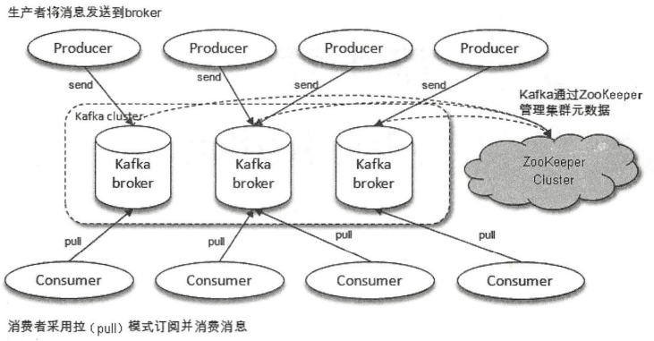
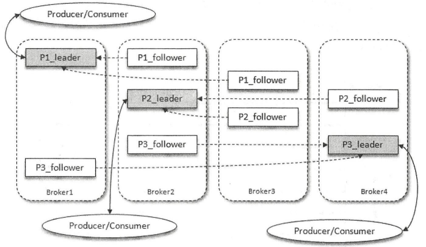
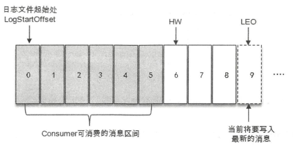
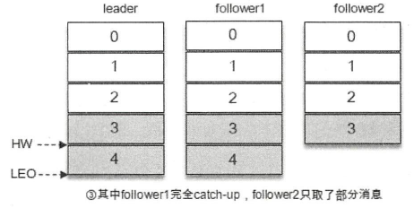
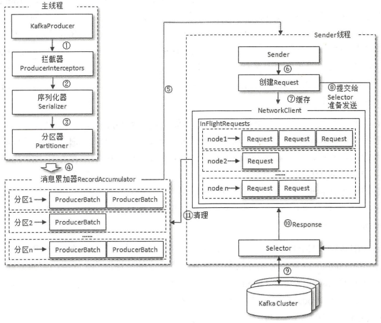

# 1. Kafka入门

## 1.1 Kafka 基本概念

Kafka 采用 Scala 语言开发，**是一个多分区、多副本且基于 Zookeeper 协调的分布式消息系统**，它以高吞吐、可持久化、可水平扩展、支持流数据处理等多种特性而被广泛使用。

* **消息系统**：Kafka 和传统消息中间件都具备**系统解耦、冗余存储、流量削峰、缓冲、异步通信、扩展性、可恢复性**等功能，Kafka 还提供了大多数消息系统难以实现的**消息顺序性保障及回溯消息**的功能。
* **存储系统**：由于 Kafka 的**消息持久化功能和多副本机制**，可以将其作为长期的数据存储系统来使用，只需把数据保留策略设置为“永久”或启用主题的日志压缩功能。
* **流式处理平台**：Kafka 为流式处理框架提供了**可靠的数据来源和完整的流式处理类库**，比如窗口、连接、变换和聚合等各类操作。

一个典型的 Kafka 体系结构包括**若干 Producer、Broker、Consumer，以及一个 Zookeeper 集群**。其中 Zookeeper 是 Kafka 用来负责集群元数据的管理、控制器的选举等操作。Producer 将会消息发送到 Broker，Broker 负责将收到的消息存储到磁盘中，而 Consumer 负责从 Broker 订阅并消费消息。



Kafka 中的消息以**主题（Topic）**为单位进行归类，生产者将消息发送到特定主题，消费者订阅主题进行消费。主题是一个逻辑概念，它可以细分为多个**分区（Partition）**，一个分区只属于单个主题。同一主题下的不同分区包含的消息是不同的，分区在存储层面可以看作一个可追加的日志文件，消息在被追加到分区日志文件时会分配一个特定的**偏移量（offset）**。offset 是消息在分区中的唯一标识，Kafka 通过它来保证消息在分区内的顺序性，由于 offset 并不跨越分区，因此 **Kafka 保证的是分区有序而不是主题有序**。

Kafka 中的分区可以分布在不同的服务器 broker 上，即一个主题可以横跨多个 broker。**每一条消息被发送到 broker 之前，会根据分区规则选择存储到哪个具体的分区**。如果分区规则设定得合理，所有的消息都可以均匀地分配到不同的分区中。**如果一个主题只对应一个文件，那么这个文件所在的机器 I/O 将会成为这个主题的性能瓶颈，而分区解决了这个问题**，通过增加分区的数量可以实现水平扩展。

**Kafka 为分区引入了多副本（Replica）机制，通过增加副本数量可以提升容灾能力**。同一分区的不同副本保存的是相同的消息，副本之间是“一主多从”的关系，其中 **leader 副本负责处理读写请求，follower 副本只负责与 leader 副本的消息同步**。副本处于不同的 broker 中，当 leader 出现故障时，从 follower 中重新选举新的 leader 对外提供服务，实现故障的自动转移。图中 Kafka 集群有 4 个 broker，某个主题有 3 个分区，且副本因子为 3，因此每个分区都有 1 个 leader 副本和 2 个 follower 副本。



**Kafka 消费端也具备一定的容灾能力**，Consumer 使用拉（Pull）模式从服务端拉取消息，并且**保存消息的具体位置**，当消费者宕机后恢复上线时，可以根据之前保存的消费位置重新拉取需要的消息进行消费，这样就不会造成消息丢失。

**分区中的所有副本统称为 AR（Assigned Replicas），所有与 leader 副本保持一定程度同步的副本（包括 leader）组成 ISR（In-Sync Replicas），与 leader 副本同步滞后过多的副本（不包括 leader）组成 OSR（Out-of-Sync Replicas）**。由此可见，AR = ISR + OSR，在正常情况下，所有的 follower 都应该与 leader 保持一定程度的同步，即 AR = ISR，OSR 为空。

**leader 负责维护和跟踪 ISR 中所有 follower 的滞后状态**，当 follower 副本落后太多或失效时，leader 会把它从 ISR 中剔除；若 OSR 有 follower 追上 leader，则 leader 会把它从 OSR 转移至 ISR。默认情况下，当 leader 发生故障时，只有 ISR 中的副本才有资格被选举为新的 leader，而 OSR 中的副本则没有任何机会。



**LEO（Log End Offset）标识当前日志文件中下一条待写入消息的 offset，即当前日志分区中最后一条消息的 offset 值加 1**，图中 offset 为 9 的位置即为当前日志文件的 LEO。**分区 ISR 中的每个副本都会维护自身的 LEO，而 ISR 中最小的 LEO 即为 HW（High Watermak），俗称高水位，对消费者来说只能消费 HW 之前的消息**。

假设某个分区的 ISR 有 3 个副本，即一个 leader 和 2 个follower。在消息的同步过程中，不同 follower 的同步效率也不尽相同，图中某时刻 follower1 完全跟上了 leader，而 follower2 只同步了消息 3，则当前分区的 HW 为 4，此时消费者可以消费 offset 为 0 ~3 之间的消息。

由此可见，**Kafka 的复制机制既不是完全的同步复制，也不是单纯的异步复制**。同步复制要求所有能工作的 follower 都复制完，这条消息才会被确认为已成功提交，这种方式极大地影响性能。而异步复制下，follower 异步地从 leader 中复制数据，数据只要被 leader 写入就被认为已成功提交，一旦 follower 还没有复制完而落后于 leader，突然 leader 宕机，则会造成数据丢失。**Kafka 使用这种 ISR 方式有效权衡了数据可靠性和性能**。




## 1.2 Kafka 安装

1. **JDK 安装和配置（略）**

2. **Zookeeper 安装和配置**

   * 上传 Zookeeper 安装包到 hadoop102 的 `/opt/software/` 目录下

   * 解压 Zookeeper 到 `/opt/module/`目录：`tar -xzvf apache-zookeeper-3.6.3-bin.tar.gz -C /opt/module/`

   * 分发 Zookeeper 目录：`xsync /opt/module/zookeeper-3.6.3`

   * 在 /opt/module/zookeeper-3.6.3/ 目录下创建 zkData 目录，然后在该目录下创建一个 myid 文件，并在文件中添加对应的编号 2

   * 分发 myid 文件，并分别在 hadoop102、hadoop103 上修改 myid 文件内容为3、4：`xsync myid`

   * 将 /opt/module/zookeeper-3.6.3/conf 目录下的 zoo_sample.cfg 重命名为 zoo.cfg：`mv zoo_sample.cfg zoo.cfg`

   * 修改 zoo.cfg 文件：`vim zoo.cfg`

     ```bash
     # 修改数据存储路径
     dataDir=/opt/module/zookeeper-3.6.3/zkData
     # 增加如下配置，server.id=host:port1:port2，其中id用来标识集群中机器的序号，与myid文件内容中的编号一致，范围是1-255；host是服务器的ip地址；port1是服务器与leader交换信息的端口；port2是进行leader选举的通信端口
     server.2=hadoop102:2888:3888
     server.3=hadoop103:2888:3888
     server.4=hadoop104:2888:3888
     ```

   * 分发 zoo.cfg 配置文件：`xsync zoo.cfg`

   * 编写集群启用和停止脚本，并增加执行权限：`vim ~/bin/zk.sh`

     ```shell
     #!/bin/bash
     case $1 in
     "start") {
         for i in hadoop102 hadoop103 hadoop104
         do
             echo " --------启动 $i Zookeeper-------"
             ssh $i "/opt/module/zookeeper-3.6.3/bin/zkServer.sh start"
         done
         };;
     "stop") {
         for i in hadoop102 hadoop103 hadoop104
         do
             echo " --------停止 $i Zookeeper-------"
             ssh $i "/opt/module/zookeeper-3.6.3/bin/zkServer.sh stop"
         done
         };;
     "status") {
         for i in hadoop102 hadoop103 hadoop104
         do
             echo " --------状态 $i Zookeeper-------"
             ssh $i "/opt/module/zookeeper-3.6.3/bin/zkServer.sh status"
         done
         };;
     esac
     ```

3. **Kafka 安装和配置**

   * 上传 Kafka 安装包到 hadoop102 的 `/opt/software/` 目录下

   * 解压 Kafka 到 `/opt/module/`目录，并重命名为 kafka：`tar -xzvf kafka_2.13-3.2.0 -C /opt/module/`
   
   * 进入 /opt/module/kafka 目录，修改配置文件：`vim server.properties`
   
     ```properties
     # broker的全局唯一编号，不能重复，只能是数字
     broker.id=0
     # kafka运行日志(数据)存放的路径，路径不需要提前创建，kafka自动创建，可以配置多个磁盘路径，路径与路径之间可以用逗号分隔
     log.dirs=/opt/module/kafka/datas
     # 配置连接Zookeeper集群地址（在zk根目录下创建/kafka，方便管理）
    zookeeper.connect=hadoop102:2181,hadoop103:2181,hadoop104:2181/kafka
     ```

     ```shell
     # 其它参数说明
     # 指定broker监听客户端连接的地址列表，其中protocol代表协议类型，支持的协议类型有：PLAINTEXT、SSL、SASL_SSL等，若未开启安全认证，使用PLAINTEXT即可。hostname代表主机名，port代表服务端口，如果有多个地址，中间以逗号分隔
     #listeners=protocol://hostname:port
     
     # 处理网络请求的线程数量
     num.network.threads=3
     # 用来处理磁盘IO的线程数量
     num.io.threads=8
     # 发送套接字的缓冲区大小
     socket.send.buffer.bytes=102400
     # 接收套接字的缓冲区大小
     socket.receive.buffer.bytes=102400
     # 请求套接字的缓冲区大小
     socket.request.max.bytes=104857600
     # topic在当前broker上的默认分区个数
     num.partitions=1
     # 用来恢复和清理data下数据的线程数量
     num.recovery.threads.per.data.dir=1
     # 每个topic创建时的副本数，默认时1个副本
     offsets.topic.replication.factor=1
     # segment文件保留的最长时间，超时将被删除
     log.retention.hours=168
     # 每个segment文件的大小，默认最大1G
     log.segment.bytes=1073741824
     # 检查过期数据的时间，默认5分钟检查一次是否数据过期
     log.retention.check.interval.ms=300000
     ```
     
   * 分发安装包：` xsync kafka/`
   
      * 分别在 hadoop103 和 hadoop104 上修改配置文件 server.properties 中的 broker.id 为 1、2
   
      * 配置环境变量，新增如下内容：`vim /etc/profile.d/my_env.sh`
   
        ```shell
        #KAFKA_HOME
        export KAFKA_HOME=/opt/module/kafka
        export PATH=$PATH:$KAFKA_HOME/bin
        ```
   
      * 使配置文件生效：`source /etc/profile`
   
      * 分发环境变量配置文件，并使配置文件生效：`xsync /etc/profile.d/my_env.sh`
   
      * 编写集群启用和停止脚本，并增加执行权限（**启动时先启动 ZK，后启动 Kafka；关闭时顺序相反**）：`vim ~/bin/zk.sh`
   
        ```shell
        #!/bin/bash
        case $1 in
        "start") {
            for i in hadoop102 hadoop103 hadoop104
            do
                echo " --------启动 $i Kafka-------"
                ssh $i "/opt/module/kafka/bin/kafka-server-start.sh -daemon /opt/module/kafka/config/server.properties"
            done
            };;
        "stop") {
            for i in hadoop102 hadoop103 hadoop104
            do
                echo " --------停止 $i Kafka-------"
                ssh $i "/opt/module/kafka/bin/kafka-server-stop.sh "
            done
            };;
        esac
        ```


## 1.3 生产与消费

Kafka 提供了许多实用的脚本工具，存放在 $KAFKA_HOME 的 bin目录下，其中 kafka-topics.sh 与主题有关，kafka-console-producer.sh 和 kafka-console-consumer.sh 分别用于控制台收发消息。

1. **kafka-topics.sh**
   * **--zookeeper [zk 服务地址]**：指定所连接的 zk 服务地址（**低版本使用，端口默认为 2181**）
   * **--bootstrap-server [Kafka 服务地址]**：指定所连接的 Kafka 服务地址（**高版本使用，端口默认为 9092**）
   * **--create/delete/alter/describe**：创建主题/删除主题/修改主题（分区数、副本因子等）/查看主题具体信息
   * --topic [主题]：指定主题名
   * --replication-factor [副本因子]：指定副本因子
   * --partitions [分区个数]：指定分区个数
2. **kafka-console-producer.sh**
   * **--broker-list [kafka集群地址]**：指定连接的 Kafka 集群地址（端口默认为9092）
   * --topic [主题]：指定主题名
3. **kafka-console-consumer.sh**
   * **--bootstrap-server [kafka集群地址]**：指定连接的 Kafka 集群地址（端口默认为9092）
   * --topic [主题]：指定主题名


# 2. 生产者

## 2.1 客户端开发

```java
public class CustomProducer {
    public static void main(String[] args) {
        // 1.配置
        Properties properties = new Properties();
        // 指定连接Kafka集群的broker地址，建议至少设置两个以上的broker地址，防止其中一个宕机
        properties.put(ProducerConfig.BOOTSTRAP_SERVERS_CONFIG, "hadoop102:9092,hadoop103:9092");
        // 指定key和value的序列化器，序列号器必须是全限定类名
        properties.put(ProducerConfig.KEY_SERIALIZER_CLASS_CONFIG, StringSerializer.class.getName());
        properties.put(ProducerConfig.VALUE_SERIALIZER_CLASS_CONFIG, StringSerializer.class.getName());

        // 2.创建kafka生产者对象
        KafkaProducer<String, String> kafkaProducer = new KafkaProducer<>(properties);

        // 3.发送消息，主要有三种模式：异步发送、异步发送带回调、同步发送（三选一）
        for (int i = 0; i < 5; i++) {
            // 异步发送：不关心消息是否正确到达，可能造成消息的丢失，这种方式性能最高、可靠性最差
            kafkaProducer.send(new ProducerRecord<>("first", "maomao" + i));

            // 异步发送，带回调函数：不建议使用返回值Future作异步回调处理，诸多消息对应的Future对象处理容易造成代码混乱
            kafkaProducer.send(new ProducerRecord<>("first", "maomao" + i), (recordMetadata, e) -> {
                // 两个参数仅有一个为空，RecordMetadata对象包含消息的一些元数据信息，如主题、分区号等
                if (e == null) {
                    System.out.println("主题：" + recordMetadata.topic() + " 分区：" + recordMetadata.partition());
                }
            });

            // 同步发送：链式调用get()阻塞等待Kafka响应，直到消息发送成功，或者发生异常
            try {
                kafkaProducer.send(new ProducerRecord<>("first", "maomao" + i)).get();
            } catch (InterruptedException | ExecutionException e) {
                e.printStackTrace();
            }
        }

        // 4.关闭资源，阻塞等待之前所有的发送请求完成后再关闭
        kafkaProducer.close();
    }
}
```

### 2.1.1 消息发送

构建消息即创建 ProducerRecord 对象，其中 topic 属性和 value 属性必填，其余属性选填。它有多种构造方法，下面仅列出最简单常用和最复杂的两个。

KafkaProducer 中一般会发生两种类型的异常：**可重试异常和不可重试异常**。常见的可重试异常有：NetworkException（网络异常）、LeaderNotAvailableException （leader 副本不可用）等，对于可重试异常，如果配置了 retries 参数，则只要在规定的重试次数内自行恢复，就不会抛出异常。retries 参数的默认值为 0，设置方式如下：`properties.put(ProducerConfig.RETRIES_CONFIG, 10);`。

```java
public class ProducerRecord<K, V> {
    private final String topic;	// 主题（必须设置）
    private final Integer partition;	// 分区号
    private final Headers headers;	// 头部，大多用来设定一些与应用有关的信息
    private final K key;	// 键，可以用来计算分区号，让消息发往特定的分区，还可支持日志压缩
    private final V value;	// 消息体（必须设置），一般不为空，如果为空则表示墓碑消息
    private final Long timestamp;	// 时间戳，有CreateTime和LogAppendTime两种类型，前者表示消息创建时间，后者表示消息追加到日志文件的时间
    
    public ProducerRecord(String topic, Integer partition, Long timestamp, K key, V value, Iterable<Header> headers) {
        // ...
    }
    
    public ProducerRecord(String topic, V value) {
        this(topic, (Integer)null, (Long)null, (Object)null, value, (Iterable)null);
    }
    // ...
}
```


### 2.1.2 序列化

生产者需要用序列化器（Serializer）把对象转换成字节数组，才能通过网络发送给 Kafka；而消费者需要反序列化器（Deserializer）把 Kafka 收到的字节数组转换成相应的对象。常见类型的序列化器都实现了 Serializer 接口，如 String、Long、Integer、Bytes、ByteBuffer、ByteArray 等。

```java
public interface Serializer<T> extends Closeable {
    // 配置当前类
    default void configure(Map<String, ?> configs, boolean isKey) {
    }

    // 执行序列化
    byte[] serialize(String var1, T var2);

    default byte[] serialize(String topic, Headers headers, T data) {
        return this.serialize(topic, data);
    }

    // 关闭当前的序列化器，一般情况下为空
    default void close() {
    }
}
```

生产者使用的序列化器和消费者使用的反序列化器必须一一对应。如果 Kafka 提供的序列化器无法满足，则可以使用如 Avro、JSON、Thrift、ProtoBuf、Protostuff 等通用的序列化工具来实现，或自定义类型的序列化器。

```java
public class Company {
    private String name;
    private String address;
    // getter、setter、constructor
}
```

```java
// 自定义序列化器，使用时只需将value.serializer参数设置为CompanySerializer.class.getName()即可
public class CompanySerializer implements Serializer<Company> {
    @Override
    public byte[] serialize(String s, Company company) {
        if (company == null) {
            return null;
        }

        byte[] name, address;
        if (company.getName() != null) {
            name = company.getName().getBytes(StandardCharsets.UTF_8);
        } else {
            name = new byte[0];
        }
        if (company.getAddress() != null) {
            address = company.getAddress().getBytes(StandardCharsets.UTF_8);
        } else {
            address = new byte[0];
        }

        ByteBuffer buffer = ByteBuffer.allocate(4 + 4 + name.length + address.length);
        buffer.putInt(name.length);
        buffer.put(name);
        buffer.putInt(address.length);
        buffer.put(address);
        return buffer.array();
    }
}
```


### 2.1.3 分区器

消息经过序列化后需要确定它发往的分区，**分区器的作用就是为消息分配分区**。若 ProducerRecord 中指定了 partition 字段，则不需要分区器。Kafka 提供的默认分区器为 DefaultPartitioner，它实现了 Partitioner 接口，其分区逻辑是：**若 key 不为 null，则计算 key 的哈希值，并对分区数取余；若 key 为 null，则使用粘性分区器（StickyPartitionCache）随机选择一个分区，并尽可能一直使用该分区，待该分区的 batch 已满（默认 16k）或 linger.ms 设置的时间到，则再随机选择一个与上次分区不同的分区使用**。

```java
public interface Partitioner extends Configurable, Closeable {
    // 计算分区号，参数依次为主题、键、序列化后的键、值、序列化后的值、集群的元数据信息
    int partition(String topic, Object key, byte[] keyBytes, Object value, byte[] valueBytes, Cluster cluster);

    // 关闭分区器时回收资源
    void close();
    
    default void onNewBatch(String topic, Cluster cluster, int prevPartition) {
    }
}
```

```java
public interface Configurable {
    // 获取配置信息及初始化数据
    void configure(Map<String, ?> var1);
}
```

除了使用 Kafka 提供的默认分区器，还可以自定义分区器，只需实现 Partitioner 接口，然后通过配置参数 partitioner.class 显示指定分区器即可。

```java
public class MyPartitioner implements Partitioner {
    @Override
    public int partition(String topic, Object key, byte[] keyBytes, Object value, byte[] valueBytes, Cluster cluster) {
        if (value.toString().contains("maomao")) {
            return 0;
        } else {
            return 1;
        }
    }

    @Override
    public void close() {
    }

    @Override
    public void configure(Map<String, ?> map) {
    }
}
```


### 2.1.4 生产者拦截器

**生产者拦截器可以用来在消息发送前做一些准备工作，如过滤不符合要求的消息、修改消息的内容、统计等**。自定义生产者拦截器需要实现 ProducerInterceptor 接口，然后通过配置参数 interceptor.classes 指定该拦截器，若有多个拦截器，使用逗号分隔。若拦截器中某个拦截器的执行依赖于前一个拦截器的输出，则如果前一个拦截器执行失败，后一个拦截器就无法继续执行。

```java
public interface ProducerInterceptor<K, V> extends Configurable {
    // 在消息序列化和计算分区之前调用，对消息进行相应的定制化操作
    ProducerRecord<K, V> onSend(ProducerRecord<K, V> var1);

    // 在消息被应答之前或消息发送失败时调用，优先于用户设定的Callback之前，该方法运行在生产者的I/O线程中，因此实现的代码逻辑越简单越好，否则会影响消息的发送速度
    void onAcknowledgement(RecordMetadata var1, Exception var2);

    // 关闭拦截器时清理资源
    void close();
}
```

```java
public class ProducerInterceptorPrefix implements ProducerInterceptor<String, String> {
    private final AtomicLong sendSuccess = new AtomicLong(0);
    private final AtomicLong sendFailure = new AtomicLong(0);

    @Override
    public ProducerRecord<String, String> onSend(ProducerRecord<String, String> record) {
        // 为每条消息添加前缀“prefix-”
        String modifiedVal = "prefix-" + record.value();
        return new ProducerRecord<>(record.topic(), record.partition(), record.timestamp(),
                record.key(), modifiedVal, record.headers());
    }

    @Override
    public void onAcknowledgement(RecordMetadata recordMetadata, Exception e) {
        // 统计消息发送的成功率
        if (e == null) {
            sendSuccess.getAndIncrement();
        } else {
            sendFailure.getAndIncrement();
        }
    }

    @Override
    public void close() {
        double successRatio = (double) sendSuccess.get() / (sendFailure.get() + sendSuccess.get());
        System.out.println("发送成功率：" + String.format("%f", successRatio * 100) + "%");
    }

    @Override
    public void configure(Map<String, ?> map) {
    }
}
```


## 2.2 原理分析

### 2.2.1 整体架构

**整个生产者客户端由两个线程协调运行，分别是主线程和 Sender 线程**。在主线程中由 KafkaProducer 创建消息，然后通过可能的拦截器、序列化器和分区器后，缓存到消息累加器 RecordAccumulator 中。Sender 线程负责从 RecordAccumulator 中获取消息并将其发送到 Kafka 中。



**RecordAccumulator 主要用来缓存消息以便 Sender 线程可以批量发送，进而减少网络传输的资源消耗，其缓存的大小可通过参数 buffer.memory 配置，默认值为 32M**。若生产者发送消息的速度超过发送到服务器的速度，则会导致生产者空间不足，此时 send() 调用要么阻塞，要么抛出异常，取决于配置参数 max.block.ms，默认值为 60 秒。

在 RecordAccumulator 内部为每个分区都维护了一个双端队列，队列的内容就是 ProducerBatch，即 Deque\<ProducerBatch>。消息写入缓存时，追加到双端队列尾部，Sender 从头部读取消息。ProducerBatch 指一个消息批次，它包含一至多个 ProducerRecord，这样可以减少网络请求次数以提升吞吐量。

消息在网络上都是以字节的形式传输，在发送之前需要创建一块内存来保存对应的消息，Kakfa 生产者客户端通过 ByteBuffer 实现消息内存的创建和释放。由于频繁的创建和释放耗费资源，因此在 **RecordAccumulator 内部还有一个 BufferPool，它主要用来实现 ByteBuffer 的复用，默认缓存大小为 16K，可通过调大 batch.size 参数以便多缓存一些消息**。

ProducerBatch 大小和 batch.size 参数也有密切的关系。当一条消息 ProducerRecord 流入 RecordAccumulator 时，会先寻找与消息分区所对应的双端队列（若没有则新建），再从这个双端队列的尾部获取一个 ProducerBatch（若没有则新建），查看 ProducerBatch 中是否还可以写入这个 ProducerRecord，如果可以则写入，如果不可以则需要创建一个新的 ProducerBatch。**在新建 ProducerBatch 时评估这条消息的大小是否超过 batch.size 参数的大小，如果不超过，那么就以 batch.size 参数的大小来创建 ProducerBatch，这样在使用完这段内存区域之后，可以通过 BufferPool 的管理来进行复用；如果超过，那么就以评估的大小来创建 ProducerBatch，这段内存区域不会被复用**。

Sender 从 RecordAccumulator 中获取缓存的消息之后，会进一步将原本 <分区, Deque\<ProducerBatch>> 的保存形式转变成 <Node, List\<ProducerBatch> 的形式，其中 Node 表示 Kafka 集群的 broker 节点。对于网络连接来说，生产者客户端是与具体的 broker 节点建立的连接，而并不关心消息属于哪一个分区；而对于应用逻辑而言，我们只关注向哪个分区中发送哪些消息，所以在这里需要做一个应用逻辑层面到网络 I/O 层面的转换。之后 Sender 还会进一步封装成 <Node, Request> 的形式，这样就可以将 Request 请求发往各个 Node 了，这里的 Request 是指 Kafka 的各种协议请求，对于消息发送而言就是指具体的 ProduceRequest。

请求在从 Sender 线程发往 Kafka 之前还会保存到 InFlightRequests 中，它存对象的具体形式为 Map<Nodeld, Deque\<Request>>，它的主要作用是缓存了已经发出去但还没有收到响应的请求（Nodeld 是一个 String 类型，表示节点的 id 编号）。与此同时，InFlightRequests 还提供了许多管理类的方法，并且通过配置参数可以限制每个连接最多缓存的请求数。**这个配置参数为 max.in.flight.requestsper.connection，默认值为 5，即每个连接最多只能缓存 5 个未响应的请求，超过该值后就不能再向这个连接发送更多请求了，除非有缓存的请求收到了响应**。


### 2.2.2 元数据更新

InFlightRequests 还可以获得 leastLoadedNode，即所有 Node 中负载最小的那一个。**这里的负载最小是通过每个 Node 在 InFlightRequests 中还未确认的请求决定的，未确认的请求越多则负载越大**。leastLoadedNode 的概念可以用于元数据请求、消费者组播协议的交互。

Kafka 元数据记录了集群中有哪些主题，主题有哪些分区，每个分区的 leader 和 follower 分配在哪个节点等信息。**当客户端中没有需要使用的元数据信息时，比如没有指定的主题信息，或者超过 metadata.max.age.ms 时间（默认值为 5分钟）没有更新元数据都会引起元数据的更新操作**。元数据的更新操作是在客户端内部进行的，对客户端的外部使用者不可见。**当需要更新元数据时，会先挑选出 leastLoadedNode，然后向这个 Node 发送 MetadataRequest 请求来获取具体的元数据信息**。这个更新操作是由 Sender 线程发起的，在创建完 MetadataRequest 之后同样会存入 InFlightRequests，之后的步骤就和发送消息时类似。元数据虽然由 Sender 线程负责更新，但是主线程也需要读取这些信息，这里的数据同步通过 synchronized 和 final 关键字来保障。


## 2.3 重要的生产者参数

1. **acks**：指定分区中必须要有多少个副本收到这条消息，生产者才会认为这条消息是成功写入的。它涉及消息的可靠性和吞吐量之间的权衡，有 3 种类型的值（字符串类型）
   * acks = 1：
   * acks = 0：
   * acks = -1 或 acks = all：
2. 


# 3. 消费者

## 3.1 消费者与消费组


## 3.2 客户端开发

### 3.2.1 反序列化


# 4. 主题与分区

## 4.1 主题的管理


## 4.2 分区的管理


# 5. 日志存储


