# 1. Kafka 入门

## 1.1 Kafka 基本概念

Kafka 采用 Scala 语言开发，**是一个多分区、多副本且基于 Zookeeper 协调的分布式消息系统**，它以高吞吐、可持久化、可水平扩展、支持流数据处理等多种特性而被广泛使用。

* **消息系统**：Kafka 和传统消息中间件都具备**系统解耦、冗余存储、流量削峰、缓冲、异步通信、扩展性、可恢复性**等功能，Kafka 还提供了大多数消息系统难以实现的**消息顺序性保障及回溯消息**的功能。
* **存储系统**：由于 Kafka 的**消息持久化功能和多副本机制**，可以将其作为长期的数据存储系统来使用，只需把数据保留策略设置为“永久”或启用主题的日志压缩功能。
* **流式处理平台**：Kafka 为流式处理框架提供了**可靠的数据来源和完整的流式处理类库**，比如窗口、连接、变换和聚合等各类操作。

一个典型的 Kafka 体系结构包括**若干 Producer、Broker、Consumer，以及一个 Zookeeper 集群**。其中 Zookeeper 是 Kafka 用来负责集群元数据的管理、控制器的选举等操作。Producer 将会消息发送到 Broker，Broker 负责将收到的消息存储到磁盘中，而 Consumer 负责从 Broker 订阅并消费消息。

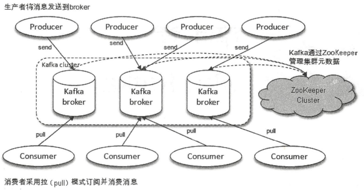

Kafka 中的消息以**主题（Topic）**为单位进行归类，生产者将消息发送到特定主题，消费者订阅主题进行消费。主题是一个逻辑概念，它可以细分为多个**分区（Partition）**，一个分区只属于单个主题。同一主题下的不同分区包含的消息是不同的，分区在存储层面可以看作一个可追加的日志文件，消息在被追加到分区日志文件时会分配一个特定的**偏移量（offset）**。offset 是消息在分区中的唯一标识，Kafka 通过它来保证消息在分区内的顺序性，由于 offset 并不跨越分区，因此 **Kafka 保证的是分区有序而不是主题有序**。

Kafka 中的分区可以分布在不同的服务器 broker 上，即一个主题可以横跨多个 broker。**每一条消息被发送到 broker 之前，会根据分区规则选择存储到哪个具体的分区**。如果分区规则设定得合理，所有的消息都可以均匀地分配到不同的分区中。**如果一个主题只对应一个文件，那么这个文件所在的机器 I/O 将会成为这个主题的性能瓶颈，而分区解决了这个问题**，通过增加分区的数量可以实现水平扩展。

**Kafka 为分区引入了多副本（Replica）机制，通过增加副本数量可以提升容灾能力**。同一分区的不同副本保存的是相同的消息，副本之间是“一主多从”的关系，其中 **leader 副本负责处理读写请求，follower 副本只负责与 leader 副本的消息同步**。副本处于不同的 broker 中，当 leader 出现故障时，从 follower 中重新选举新的 leader 对外提供服务，实现故障的自动转移。图中 Kafka 集群有 4 个 broker，某个主题有 3 个分区，且副本因子为 3，因此每个分区都有 1 个 leader 副本和 2 个 follower 副本。

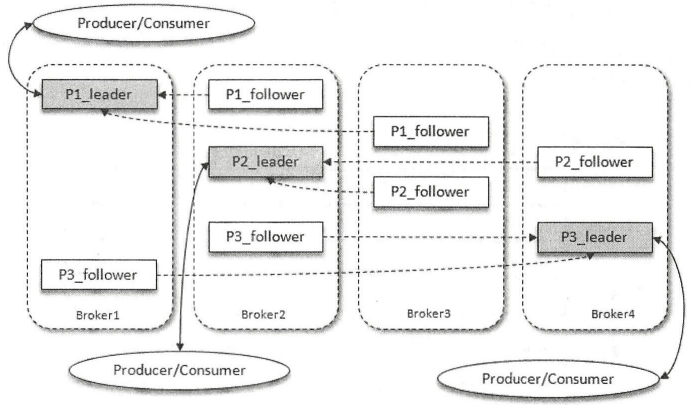

**Kafka 消费端也具备一定的容灾能力**，Consumer 使用拉（Pull）模式从服务端拉取消息，并且**保存消息的具体位置**，当消费者宕机后恢复上线时，可以根据之前保存的消费位置重新拉取需要的消息进行消费，这样就不会造成消息丢失。

**分区中的所有副本统称为 AR（Assigned Replicas），所有与 leader 副本保持一定程度同步的副本（包括 leader）组成 ISR（In-Sync Replicas），与 leader 副本同步滞后过多的副本（不包括 leader）组成 OSR（Out-of-Sync Replicas）**。由此可见，AR = ISR + OSR，在正常情况下，所有的 follower 都应该与 leader 保持一定程度的同步，即 AR = ISR，OSR 为空。

**leader 负责维护和跟踪 ISR 中所有 follower 的滞后状态**，当 follower 副本落后太多或失效时，leader 会把它从 ISR 中剔除；若 OSR 有 follower 追上 leader，则 leader 会把它从 OSR 转移至 ISR。默认情况下，当 leader 发生故障时，只有 ISR 中的副本才有资格被选举为新的 leader，而 OSR 中的副本则没有任何机会。

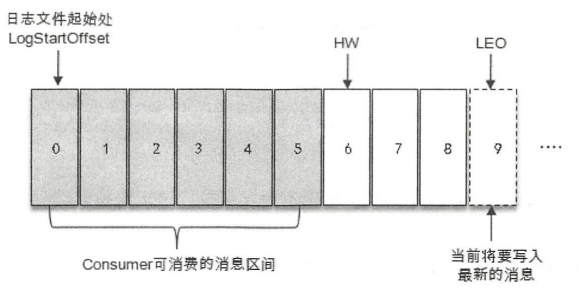

**LEO（Log End Offset）标识当前日志文件中下一条待写入消息的 offset，即当前日志分区中最后一条消息的 offset 值加 1**，图中 offset 为 9 的位置即为当前日志文件的 LEO。**分区 ISR 中的每个副本都会维护自身的 LEO，而 ISR 中最小的 LEO 即为 HW（High Watermak），俗称高水位，对消费者来说只能消费 HW 之前的消息**。

假设某个分区的 ISR 有 3 个副本，即一个 leader 和 2 个follower。在消息的同步过程中，不同 follower 的同步效率也不尽相同，图中某时刻 follower1 完全跟上了 leader，而 follower2 只同步了消息 3，则当前分区的 HW 为 4，此时消费者可以消费 offset 为 0 ~3 之间的消息。

由此可见，**Kafka 的复制机制既不是完全的同步复制，也不是单纯的异步复制**。同步复制要求所有能工作的 follower 都复制完，这条消息才会被确认为已成功提交，这种方式极大地影响性能。而异步复制下，follower 异步地从 leader 中复制数据，数据只要被 leader 写入就被认为已成功提交，一旦 follower 还没有复制完而落后于 leader，突然 leader 宕机，则会造成数据丢失。**Kafka 使用这种 ISR 方式有效权衡了数据可靠性和性能**。

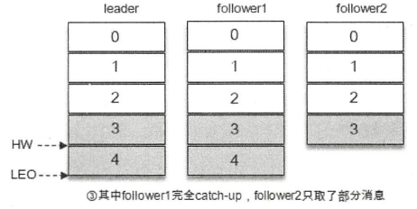


## 1.2 Kafka 安装

1. **JDK 安装和配置（略）**

2. **Zookeeper 安装和配置**

   * 上传 Zookeeper 安装包到 hadoop102 的 `/opt/software/` 目录下

   * 解压 Zookeeper 到 `/opt/module/`目录：`tar -xzvf apache-zookeeper-3.6.3-bin.tar.gz -C /opt/module/`

   * 分发 Zookeeper 目录：`xsync /opt/module/zookeeper-3.6.3`

   * 在 /opt/module/zookeeper-3.6.3/ 目录下创建 zkData 目录，然后在该目录下创建一个 myid 文件，并在文件中添加对应的编号 2

   * 分发 myid 文件，并分别在 hadoop102、hadoop103 上修改 myid 文件内容为3、4：`xsync myid`

   * 将 /opt/module/zookeeper-3.6.3/conf 目录下的 zoo_sample.cfg 重命名为 zoo.cfg：`mv zoo_sample.cfg zoo.cfg`

   * 修改 zoo.cfg 文件：`vim zoo.cfg`

     ```bash
     # 修改数据存储路径
     dataDir=/opt/module/zookeeper-3.6.3/zkData
     # 增加如下配置，server.id=host:port1:port2，其中id用来标识集群中机器的序号，与myid文件内容中的编号一致，范围是1-255；host是服务器的ip地址；port1是服务器与leader交换信息的端口；port2是进行leader选举的通信端口
     server.2=hadoop102:2888:3888
     server.3=hadoop103:2888:3888
     server.4=hadoop104:2888:3888
     ```

   * 分发 zoo.cfg 配置文件：`xsync zoo.cfg`

   * 编写集群启用和停止脚本，并增加执行权限：`vim ~/bin/zk.sh`

     ```shell
     #!/bin/bash
     case $1 in
     "start") {
         for i in hadoop102 hadoop103 hadoop104
         do
             echo " --------启动 $i Zookeeper-------"
             ssh $i "/opt/module/zookeeper-3.6.3/bin/zkServer.sh start"
         done
     };;
     "stop") {
         for i in hadoop102 hadoop103 hadoop104
         do
             echo " --------停止 $i Zookeeper-------"
             ssh $i "/opt/module/zookeeper-3.6.3/bin/zkServer.sh stop"
         done
     };;
     "status") {
         for i in hadoop102 hadoop103 hadoop104
         do
             echo " --------状态 $i Zookeeper-------"
             ssh $i "/opt/module/zookeeper-3.6.3/bin/zkServer.sh status"
         done
     };;
     esac
     ```

3. **Kafka 安装和配置**

   * 上传 Kafka 安装包到 hadoop102 的 `/opt/software/` 目录下

   * 解压 Kafka 到 `/opt/module/`目录，并重命名为 kafka：`tar -xzvf kafka_2.13-3.2.0 -C /opt/module/`
   
   * 进入 /opt/module/kafka 目录，修改配置文件：`vim server.properties`
   
     ```properties
     # broker的全局唯一编号，不能重复，只能是数字
     broker.id=0
     # kafka运行日志(数据)存放的路径，路径不需要提前创建，kafka自动创建，可以配置多个磁盘路径，路径与路径之间可以用逗号分隔
     log.dirs=/opt/module/kafka/datas
     # 配置连接Zookeeper集群地址（在zk根目录下创建/kafka，方便管理）
    zookeeper.connect=hadoop102:2181,hadoop103:2181,hadoop104:2181/kafka
     ```

     ```shell
     # 其它参数说明
     # 指定broker监听客户端连接的地址列表，其中protocol代表协议类型，支持的协议类型有：PLAINTEXT、SSL、SASL_SSL等，若未开启安全认证，使用PLAINTEXT即可。hostname代表主机名，port代表服务端口，如果有多个地址，中间以逗号分隔
     #listeners=protocol://hostname:port
     
     # 处理网络请求的线程数量
     num.network.threads=3
     # 用来处理磁盘IO的线程数量
     num.io.threads=8
     # 发送套接字的缓冲区大小
     socket.send.buffer.bytes=102400
     # 接收套接字的缓冲区大小
     socket.receive.buffer.bytes=102400
     # 请求套接字的缓冲区大小
     socket.request.max.bytes=104857600
     # topic在当前broker上的默认分区个数
     num.partitions=1
     # 用来恢复和清理data下数据的线程数量
     num.recovery.threads.per.data.dir=1
     # 每个topic创建时的副本数，默认时1个副本
     offsets.topic.replication.factor=1
     # segment文件保留的最长时间，超时将被删除
     log.retention.hours=168
     # 每个segment文件的大小，默认最大1G
     log.segment.bytes=1073741824
     # 检查过期数据的时间，默认5分钟检查一次是否数据过期
     log.retention.check.interval.ms=300000
     ```
     
   * 分发安装包：` xsync kafka/`
   
      * 分别在 hadoop103 和 hadoop104 上修改配置文件 server.properties 中的 broker.id 为 1、2
   
      * 配置环境变量，新增如下内容：`vim /etc/profile.d/my_env.sh`
   
        ```shell
        #KAFKA_HOME
        export KAFKA_HOME=/opt/module/kafka
        export PATH=$PATH:$KAFKA_HOME/bin
        ```
   
      * 使配置文件生效：`source /etc/profile`
   
      * 分发环境变量配置文件，并使配置文件生效：`xsync /etc/profile.d/my_env.sh`
   
      * 编写集群启用和停止脚本，并增加执行权限（**启动时先启动 ZK，后启动 Kafka；关闭时顺序相反**）：`vim ~/bin/zk.sh`
   
        ```shell
        #!/bin/bash
        case $1 in
        "start") {
            for i in hadoop102 hadoop103 hadoop104
            do
                echo " --------启动 $i Kafka-------"
                ssh $i "/opt/module/kafka/bin/kafka-server-start.sh -daemon /opt/module/kafka/config/server.properties"
            done
        };;
        "stop") {
            for i in hadoop102 hadoop103 hadoop104
            do
                echo " --------停止 $i Kafka-------"
                ssh $i "/opt/module/kafka/bin/kafka-server-stop.sh "
            done
        };;
        esac
        ```


## 1.3 生产与消费

Kafka 提供了许多实用的脚本工具，存放在 $KAFKA_HOME 的 bin目录下，其中 kafka-topics.sh 与主题有关，kafka-console-producer.sh 和 kafka-console-consumer.sh 分别用于控制台收发消息。

1. **kafka-topics.sh**
   * **--zookeeper [zk 服务地址]**：指定所连接的 zk 服务地址（**低版本使用，端口默认为 2181**）
   * **--bootstrap-server [Kafka 服务地址]**：指定所连接的 Kafka 服务地址（**高版本使用，端口默认为 9092**）
   * **--create/delete/alter/describe/list**：创建主题/删除主题/修改主题（分区数、副本因子等）/查看主题具体信息/查看所有可用主题
   * --topic [主题]：指定主题名
   * --replication-factor [副本因子]：指定副本因子
   * --partitions [分区个数]：指定分区个数
2. **kafka-console-producer.sh**
   * **--broker-list [kafka集群地址]**：指定连接的 Kafka 集群地址（端口默认为9092）
   * --topic [主题]：指定主题名
3. **kafka-console-consumer.sh**
   * **--bootstrap-server [kafka集群地址]**：指定连接的 Kafka 集群地址（端口默认为9092）
   * --topic [主题]：指定主题名


# 2. 生产者

## 2.1 客户端开发

```java
public class CustomProducer {
    public static void main(String[] args) {
        // 1.配置
        Properties properties = new Properties();
        // 指定连接Kafka集群的broker地址，建议至少设置两个以上的broker地址，防止其中一个宕机
        properties.put(ProducerConfig.BOOTSTRAP_SERVERS_CONFIG, "hadoop102:9092,hadoop103:9092");
        // 指定key和value的序列化器，序列号器必须是全限定类名
        properties.put(ProducerConfig.KEY_SERIALIZER_CLASS_CONFIG, StringSerializer.class.getName());
        properties.put(ProducerConfig.VALUE_SERIALIZER_CLASS_CONFIG, StringSerializer.class.getName());

        // 2.创建kafka生产者对象
        KafkaProducer<String, String> kafkaProducer = new KafkaProducer<>(properties);

        // 3.发送消息，主要有三种模式：异步发送、异步发送带回调、同步发送（三选一）
        for (int i = 0; i < 5; i++) {
            // 异步发送：不关心消息是否正确到达，可能造成消息的丢失，这种方式性能最高、可靠性最差
            kafkaProducer.send(new ProducerRecord<>("first", "maomao" + i));

            // 异步发送，带回调函数：不建议使用返回值Future作异步回调处理，诸多消息对应的Future对象处理容易造成代码混乱
            kafkaProducer.send(new ProducerRecord<>("first", "maomao" + i), (recordMetadata, e) -> {
                // 两个参数仅有一个为空，RecordMetadata对象包含消息的一些元数据信息，如主题、分区号等
                if (e == null) {
                    System.out.println("主题：" + recordMetadata.topic() + " 分区：" + recordMetadata.partition());
                }
            });

            // 同步发送：链式调用get()阻塞等待Kafka响应，直到消息发送成功，或者发生异常
            try {
                kafkaProducer.send(new ProducerRecord<>("first", "maomao" + i)).get();
            } catch (InterruptedException | ExecutionException e) {
                e.printStackTrace();
            }
        }

        // 4.关闭资源，阻塞等待之前所有的发送请求完成后再关闭
        kafkaProducer.close();
    }
}
```

### 2.1.1 消息发送

构建消息即创建 ProducerRecord 对象，其中 topic 属性和 value 属性必填，其余属性选填。它有多种构造方法，下面仅列出最简单常用和最复杂的两个。

KafkaProducer 中一般会发生两种类型的异常：**可重试异常和不可重试异常**。常见的可重试异常有：NetworkException（网络异常）、LeaderNotAvailableException （leader 副本不可用）等，对于可重试异常，如果配置了 retries 参数，则只要在规定的重试次数内自行恢复，就不会抛出异常。retries 参数的默认值为 0，设置方式如下：`properties.put(ProducerConfig.RETRIES_CONFIG, 10);`。

```java
public class ProducerRecord<K, V> {
    private final String topic;	// 主题（必须设置）
    private final Integer partition;	// 分区号
    private final Headers headers;	// 头部，大多用来设定一些与应用有关的信息
    private final K key;	// 键，可以用来计算分区号，让消息发往特定的分区，还可支持日志压缩
    private final V value;	// 消息体（必须设置），一般不为空，如果为空则表示墓碑消息
    private final Long timestamp;	// 时间戳，有CreateTime和LogAppendTime两种类型，前者表示消息创建时间，后者表示消息追加到日志文件的时间
    
    public ProducerRecord(String topic, Integer partition, Long timestamp, K key, V value, Iterable<Header> headers) {
        // ...
    }
    
    public ProducerRecord(String topic, V value) {
        this(topic, (Integer)null, (Long)null, (Object)null, value, (Iterable)null);
    }
    // ...
}
```


### 2.1.2 序列化

生产者需要用序列化器（Serializer）把对象转换成字节数组，才能通过网络发送给 Kafka；而消费者需要反序列化器（Deserializer）把 Kafka 收到的字节数组转换成相应的对象。常见类型的序列化器都实现了 Serializer 接口，如 String、Long、Integer、Bytes、ByteBuffer、ByteArray 等。

```java
public interface Serializer<T> extends Closeable {
    // 配置当前类
    default void configure(Map<String, ?> configs, boolean isKey) {
    }

    // 执行序列化
    byte[] serialize(String var1, T var2);

    default byte[] serialize(String topic, Headers headers, T data) {
        return this.serialize(topic, data);
    }

    // 关闭当前的序列化器，一般情况下为空
    default void close() {
    }
}
```

生产者使用的序列化器和消费者使用的反序列化器必须一一对应。如果 Kafka 提供的序列化器无法满足，则可以使用如 Avro、JSON、Thrift、ProtoBuf、Protostuff 等通用的序列化工具来实现，或自定义类型的序列化器。

```java
public class Company {
    private String name;
    private String address;
    // getter、setter、constructor
}
```

```java
// 自定义序列化器，使用时只需将value.serializer参数设置为CompanySerializer.class.getName()即可
public class CompanySerializer implements Serializer<Company> {
    @Override
    public byte[] serialize(String s, Company company) {
        if (company == null) {
            return null;
        }

        byte[] name, address;
        if (company.getName() != null) {
            name = company.getName().getBytes(StandardCharsets.UTF_8);
        } else {
            name = new byte[0];
        }
        if (company.getAddress() != null) {
            address = company.getAddress().getBytes(StandardCharsets.UTF_8);
        } else {
            address = new byte[0];
        }

        ByteBuffer buffer = ByteBuffer.allocate(4 + 4 + name.length + address.length);
        buffer.putInt(name.length);
        buffer.put(name);
        buffer.putInt(address.length);
        buffer.put(address);
        return buffer.array();
    }
}
```


### 2.1.3 分区器

消息经过序列化后需要确定它发往的分区，**分区器的作用就是为消息分配分区**。若 ProducerRecord 中指定了 partition 字段，则不需要分区器。Kafka 提供的默认分区器为 DefaultPartitioner，它实现了 Partitioner 接口，其分区逻辑是：**若 key 不为 null，则计算 key 的哈希值，并对分区数取余；若 key 为 null，则使用粘性分区器（StickyPartitionCache）随机选择一个分区，并尽可能一直使用该分区，待该分区的 batch 已满（默认 16k）或 linger.ms 设置的时间到，则再随机选择一个与上次分区不同的分区使用**。

```java
public interface Partitioner extends Configurable, Closeable {
    // 计算分区号，参数依次为主题、键、序列化后的键、值、序列化后的值、集群的元数据信息
    int partition(String topic, Object key, byte[] keyBytes, Object value, byte[] valueBytes, Cluster cluster);

    // 关闭分区器时回收资源
    void close();
    
    default void onNewBatch(String topic, Cluster cluster, int prevPartition) {
    }
}
```

```java
public interface Configurable {
    // 获取配置信息及初始化数据
    void configure(Map<String, ?> var1);
}
```

除了使用 Kafka 提供的默认分区器，还可以自定义分区器，只需实现 Partitioner 接口，然后通过配置参数 partitioner.class 显示指定分区器即可。

```java
public class MyPartitioner implements Partitioner {
    @Override
    public int partition(String topic, Object key, byte[] keyBytes, Object value, byte[] valueBytes, Cluster cluster) {
        if (value.toString().contains("maomao")) {
            return 0;
        } else {
            return 1;
        }
    }

    @Override
    public void close() {
    }

    @Override
    public void configure(Map<String, ?> map) {
    }
}
```


### 2.1.4 生产者拦截器

**生产者拦截器可以用来在消息发送前做一些准备工作，如过滤不符合要求的消息、修改消息的内容、统计等**。自定义生产者拦截器需要实现 ProducerInterceptor 接口，然后通过配置参数 interceptor.classes 指定该拦截器，若有多个拦截器，使用逗号分隔。若拦截器中某个拦截器的执行依赖于前一个拦截器的输出，则如果前一个拦截器执行失败，后一个拦截器就无法继续执行。

```java
public interface ProducerInterceptor<K, V> extends Configurable {
    // 在消息序列化和计算分区之前调用，对消息进行相应的定制化操作
    ProducerRecord<K, V> onSend(ProducerRecord<K, V> var1);

    // 在消息被应答之前或消息发送失败时调用，优先于用户设定的Callback之前，该方法运行在生产者的I/O线程中，因此实现的代码逻辑越简单越好，否则会影响消息的发送速度
    void onAcknowledgement(RecordMetadata var1, Exception var2);

    // 关闭拦截器时清理资源
    void close();
}
```

```java
public class ProducerInterceptorPrefix implements ProducerInterceptor<String, String> {
    private final AtomicLong sendSuccess = new AtomicLong(0);
    private final AtomicLong sendFailure = new AtomicLong(0);

    @Override
    public ProducerRecord<String, String> onSend(ProducerRecord<String, String> record) {
        // 为每条消息添加前缀“prefix-”
        String modifiedVal = "prefix-" + record.value();
        return new ProducerRecord<>(record.topic(), record.partition(), record.timestamp(),
                record.key(), modifiedVal, record.headers());
    }

    @Override
    public void onAcknowledgement(RecordMetadata recordMetadata, Exception e) {
        // 统计消息发送的成功率
        if (e == null) {
            sendSuccess.getAndIncrement();
        } else {
            sendFailure.getAndIncrement();
        }
    }

    @Override
    public void close() {
        double successRatio = (double) sendSuccess.get() / (sendFailure.get() + sendSuccess.get());
        System.out.println("发送成功率：" + String.format("%f", successRatio * 100) + "%");
    }

    @Override
    public void configure(Map<String, ?> map) {
    }
}
```


## 2.2 原理分析

### 2.2.1 整体架构

**整个生产者客户端由两个线程协调运行，分别是主线程和 Sender 线程**。在主线程中由 KafkaProducer 创建消息，然后通过可能的拦截器、序列化器和分区器后，缓存到消息累加器 RecordAccumulator 中。Sender 线程负责从 RecordAccumulator 中获取消息并将其发送到 Kafka 中。

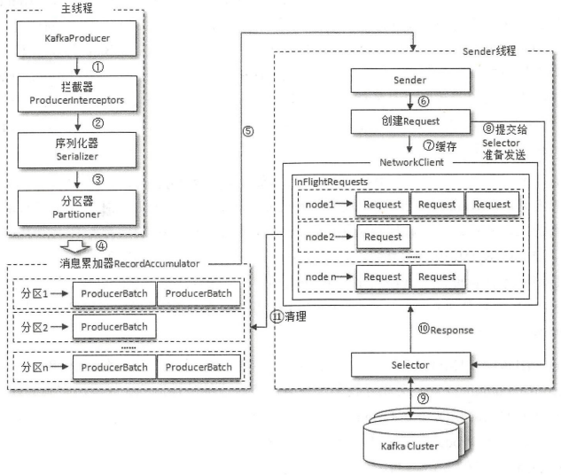

**RecordAccumulator 主要用来缓存消息以便 Sender 线程可以批量发送，进而减少网络传输的资源消耗，其缓存的大小可通过参数 buffer.memory 配置，默认值为 32M**。若生产者发送消息的速度超过发送到服务器的速度，则会导致生产者空间不足，此时 send() 调用要么阻塞，要么抛出异常，取决于配置参数 max.block.ms，默认值为 60 秒。

在 RecordAccumulator 内部为每个分区都维护了一个双端队列，队列的内容就是 ProducerBatch，即 Deque\<ProducerBatch>。消息写入缓存时，追加到双端队列尾部，Sender 从头部读取消息。ProducerBatch 指一个消息批次，它包含一至多个 ProducerRecord，这样可以减少网络请求次数以提升吞吐量。

消息在网络上都是以字节的形式传输，在发送之前需要创建一块内存来保存对应的消息，Kakfa 生产者客户端通过 ByteBuffer 实现消息内存的创建和释放。由于频繁的创建和释放耗费资源，因此在 **RecordAccumulator 内部还有一个 BufferPool，它主要用来实现 ByteBuffer 的复用，默认缓存大小为 16K，可通过调大 batch.size 参数以便多缓存一些消息**。

ProducerBatch 大小和 batch.size 参数也有密切的关系。当一条消息 ProducerRecord 流入 RecordAccumulator 时，会先寻找与消息分区所对应的双端队列（若没有则新建），再从这个双端队列的尾部获取一个 ProducerBatch（若没有则新建），查看 ProducerBatch 中是否还可以写入这个 ProducerRecord，如果可以则写入，如果不可以则需要创建一个新的 ProducerBatch。**在新建 ProducerBatch 时评估这条消息的大小是否超过 batch.size 参数的大小，如果不超过，那么就以 batch.size 参数的大小来创建 ProducerBatch，这样在使用完这段内存区域之后，可以通过 BufferPool 的管理来进行复用；如果超过，那么就以评估的大小来创建 ProducerBatch，这段内存区域不会被复用**。

Sender 从 RecordAccumulator 中获取缓存的消息之后，会进一步将原本 <分区, Deque\<ProducerBatch>> 的保存形式转变成 <Node, List\<ProducerBatch> 的形式，其中 Node 表示 Kafka 集群的 broker 节点。对于网络连接来说，生产者客户端是与具体的 broker 节点建立的连接，而并不关心消息属于哪一个分区；而对于应用逻辑而言，我们只关注向哪个分区中发送哪些消息，所以在这里需要做一个应用逻辑层面到网络 I/O 层面的转换。之后 Sender 还会进一步封装成 <Node, Request> 的形式，这样就可以将 Request 请求发往各个 Node 了，这里的 Request 是指 Kafka 的各种协议请求，对于消息发送而言就是指具体的 ProduceRequest。

请求在从 Sender 线程发往 Kafka 之前还会保存到 InFlightRequests 中，它存对象的具体形式为 Map<Nodeld, Deque\<Request>>，它的主要作用是缓存了已经发出去但还没有收到响应的请求（Nodeld 是一个 String 类型，表示节点的 id 编号）。与此同时，InFlightRequests 还提供了许多管理类的方法，并且通过配置参数可以限制每个连接最多缓存的请求数。**这个配置参数为 max.in.flight.requestsper.connection，默认值为 5，即每个连接最多只能缓存 5 个未响应的请求，超过该值后就不能再向这个连接发送更多请求了，除非有缓存的请求收到了响应**。


### 2.2.2 元数据更新

InFlightRequests 还可以获得 leastLoadedNode，即所有 Node 中负载最小的那一个。**这里的负载最小是通过每个 Node 在 InFlightRequests 中还未确认的请求决定的，未确认的请求越多则负载越大**。leastLoadedNode 的概念可以用于元数据请求、消费者组播协议的交互。

Kafka 元数据记录了集群中有哪些主题，主题有哪些分区，每个分区的 leader 和 follower 分配在哪个节点等信息。**当客户端中没有需要使用的元数据信息时，比如没有指定的主题信息，或者超过 metadata.max.age.ms 时间（默认值为 5分钟）没有更新元数据都会引起元数据的更新操作**。元数据的更新操作是在客户端内部进行的，对客户端的外部使用者不可见。**当需要更新元数据时，会先挑选出 leastLoadedNode，然后向这个 Node 发送 MetadataRequest 请求来获取具体的元数据信息**。这个更新操作是由 Sender 线程发起的，在创建完 MetadataRequest 之后同样会存入 InFlightRequests，之后的步骤就和发送消息时类似。元数据虽然由 Sender 线程负责更新，但是主线程也需要读取这些信息，这里的数据同步通过 synchronized 和 final 关键字来保障。


## 2.3 重要的生产者参数

1. **acks**：**指定分区中必须要有多少个副本收到这条消息，生产者才会认为这条消息是成功写入的**。它涉及消息的可靠性和吞吐量之间的权衡，有 3 种类型的值（**字符串类型**）
   * **acks = 1**：默认值，消息可靠性和吞吐量的折中方案。**生产者发送消息后，只要分区的 leader 成功写入消息，那么它就会收到服务端的成功响应**。若消息无法写入 leader，如 leader 崩溃、重新选举 leader 过程，则生产者会收到一个错误的响应，为避免消息丢失，生产者可选择重发消息。若消息写入 leader 并成功响应给生产者，且在被 follower 拉取之前 leader 崩溃，则消息会丢失，因新选举的 leader 没有这条对应的消息。
   * **acks = 0**：吞吐量最大，**生产者发送消息后不需要等待任何服务器的响应**。若消息从发送到写入 Kafka 的过程出现异常，导致 Kafka 没有收到这条消息，那么生产者也无从得知，消息就丢失了。
   * **acks = -1 或 acks = all**：**生产者发送消息后，需要等待 ISR 中所有副本都成功写入消息后，才能收到来自服务端的成功响应**。可靠性最强，但并不是消息一定可靠，因为 ISR 中可能只有 leader 副本，即退化成 acks=1 的情况。配合 min.insync.replicas 等参数可获得更高的消息可靠性。
2. **max.request.size：限制生产者客户端能发送的消息最大值，默认 1M**。该参数涉及其它参数的联动，如 message.max.bytes，若配置错误可能导致异常，不建议修改。
3. retries 和 retry.backoff.ms：retries 用于配置生产者重试的次数，默认为 0，即发生异常时不进行重试。retry.backoff.ms 用于设定两次重试之间的时间间隔，避免无效的频繁重试，默认值为 100。
4. **compression.type：指定消息的压缩方式，默认值为“none”，即消息不会被压缩，可配置为“gzip”、“snappy”和“lz4”**。对消息进行压缩可极大地减少网络传输量，降低网络 I/O，从而提高整体性能，但时延会有所增加。
5. connections.max.idle.ms：指定多久后关闭限制的连接，默认 9 分钟。
6. **linger.ms：指定生产者发送 ProducerBatch 之前等待更多消息（ProducerRecord）加入 ProducerBatch 的时间，默认值为 0。生产者客户端会在 ProducerBatch 被填满或等待时间超过  linger.ms 值时发送出去**。增大该参数的值会增加消息的延迟，但同时能提升一定的吞吐量。
7. receive.buffer.bytes：设置 Socket 接收消息缓冲区的大小，默认 32K。若设置为 -1，则使用操作系统的默认值。若生产者和 Kafka 处于不同机房，则可以适当调大该参数值。
8. send.buffer.bytes：设置 Socket 发送消息缓冲区的大小，默认 128K。若设置为 -1，则使用操作系统的默认值。
9. request.timeout.ms：配置生产者等待请求响应的最长时间，默认为 30000ms。请求超时之后可选择重试，这个参数需要比 broker 端参数 replica.lag.time.max.ms 的值大，以减少客户端重试而引起的消息重复的概率。


# 3. 消费者

## 3.1 消费者与消费组

**消费组是一个逻辑概念，它将消费者归为一类，每一个消费者只隶属于一个消费组**。每个消费组都有一个名称，消费者在进行消费前需指定其所属消费组的名称，通过消费者客户端参数 group.id 进行配置，默认为空字符串。

某主题共有 4 个分区：P0、P1、P2、P3。有两个消费组 A 和 B 都订阅了这个主题，消费组 A 中有 4 个消费者（C0、C1、C2、C3），消费组 B 有 2 个消费者（C4、C5）。按照 Kafka 默认的分区分配规则（通过参数 partition.assignment.strategy 修改），最后的分配结果是消费组 A 中的每个消费组分配到 1 个分区，消费组 B 中每个消费者分配到 2 个分区，**两个消费组互不影响，每个分区只能被一个消费组中的一个消费者所消费**。

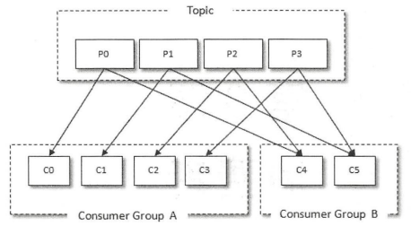

对于消息中间件来说，一般有两种消息投递模式：**点对点（P2P，Point-to-Point）模式和发布订阅（Pub/Sub）模式**。Kafka 同时支持这两种模式，这得益于消费者和消费组模型：

- 若所有消费者都隶属于同一个消费组，则所有的消息都会被均衡地投递给每一个消息者，即每条消息只会被一个消费者处理，相当于点对点模式（一对一）。
- 若所有消费者都隶属于不同的消费组，则所有的消息都会被广播给所有的消费者，即每条消息会被所有的消费者处理，相当于发布订阅模式（一对多）。


## 3.2 客户端开发

```java
public class CustomConsumer {
    public static final AtomicBoolean isRunning = new AtomicBoolean(true);

    public static void main(String[] args) {
        // 1.配置
        Properties properties = new Properties();
        // 指定连接Kafka集群的broker地址，建议至少设置两个以上的broker地址，防止其中一个宕机
        properties.put(ConsumerConfig.BOOTSTRAP_SERVERS_CONFIG, "hadoop102:9092,hadoop103:9092");
        // 指定key和value的反序列化器，反序列号器必须是全限定类名
        properties.put(ConsumerConfig.KEY_DESERIALIZER_CLASS_CONFIG, StringDeserializer.class.getName());
        properties.put(ConsumerConfig.VALUE_DESERIALIZER_CLASS_CONFIG, StringDeserializer.class.getName());
        // 配置消费组名称，默认为""，若不设置则会抛出异常
        properties.put(ConsumerConfig.GROUP_ID_CONFIG, "test");

        // 2.创建kafka消费者对象
        KafkaConsumer<String, String> kafkaConsumer = new KafkaConsumer<>(properties);
        // 3.订阅主题
        kafkaConsumer.subscribe(Collections.singletonList("first"));

        // 4.消费数据
        try {
            while (isRunning.get()) {
                ConsumerRecords<String, String> consumerRecords = kafkaConsumer.poll(Duration.ofSeconds(1));
                for (ConsumerRecord<String, String> consumerRecord : consumerRecords) {
                    System.out.println(consumerRecord);
                }
            }
        } catch (Exception e){
            e.printStackTrace();
        } finally {
            // 5.关闭资源
            kafkaConsumer.close();
        }
    }
}
```

### 3.2.1 订阅主题和分区

创建消费者后，需要为消费者订阅相关主题和分区。**集合订阅方式 subscribe（Collection）、正则表达式订阅方式 subscribe（Pattern）和指定分区的订阅方式 assign（Collection）**分别代表了三种不同的订阅状态：AUTO_TOPICS、AUTO_PATTERN 和 USER_ASSIGNED（若没有订阅，则订阅状态为 NONE）。这三种状态是互斥的，在一个消费者中只能使用其中的一种，否则会报异常。

```java
// 1.以集合的形式订阅主题，参数listener用于设置再均衡监听器，当消费者内消费者增加或减少时，分区分配关系会自动调整，以实现消费负载均衡及故障自动转移
public void subscribe(Collection<String> topics, ConsumerRebalanceListener listener);
public void subscribe(Collection<String> topics);
// 2.以正则表达式的形式订阅主题
public void subscribe(Pattern pattern, ConsumerRebalanceListener listener);
public void subscribe(Pattern pattern);
// 3.订阅某些主题的特定分区，参数partitions用于指定需要订阅的分区集合，不具备消费者自动均衡功能
public void assign(Collection<TopicPartition> partitions);

// 取消订阅，可取消以上三种方式的订阅，相当于subscribe或assign订阅的集合参数为空集合
public void unsubscribe();
```

```java
// 主题的分区
public final class TopicPartition implements Serializable {
    private final int partition;	// 分区的编号
    private final String topic;		// 分区所属的主题
    // ...
}
```

```java
// 主题的分区元数据信息，KafkaConsumer可通过partitionsFor()查询指定主题的元数据信息
public class PartitionInfo {
    private final String topic;		// 主题名
    private final int partition;	// 分区编号
    private final Node leader;		// leader副本位置
    private final Node[] replicas;	// AR集合
    private final Node[] inSyncReplicas;	// ISR集合
    private final Node[] offlineReplicas;	// OSR集合
}
```


### 3.2.2 反序列化

常见类型的反序列化器都实现了 Deserializer 接口，如 String、Long、Integer、Bytes、ByteBuffer、ByteArray 等。

```java
public interface Deserializer<T> extends Closeable {
    // 配置当前类
    default void configure(Map<String, ?> configs, boolean isKey) {
    }

    // 执行序列化，如果data为null，则处理时直接返回null，而不是抛出异常
    T deserialize(String topic, byte[] data);

    default T deserialize(String topic, Headers headers, byte[] data) {
        return this.deserialize(topic, data);
    }

    // 关闭当前的反序列化器
    default void close() {
    }
}
```

```java
// 自定义反序列化器，与2.1.2节自定义的序列化器对应，使用时只需将value.deserializer参数设置为CompanyDeserializerr.class.getName()即可
public class CompanyDeserializer implements Deserializer<Company> {

    @Override
    public Company deserialize(String topic, byte[] data) {
        if (data == null) {
            return null;
        }

        if (data.length < 8) {
            throw new SerializationException("size of data received is shorter than expected");
        }

        ByteBuffer buffer = ByteBuffer.wrap(data);

        int nameLen = buffer.getInt();
        byte[] nameBytes = new byte[nameLen];
        buffer.get(nameBytes);

        int addressLen = buffer.getInt();
        byte[] addressBytes = new byte[addressLen];
        buffer.get(addressBytes);

        String name = new String(nameBytes, StandardCharsets.UTF_8);
        String address = new String(addressBytes, StandardCharsets.UTF_8);
        return new Company(name, address);
    }
}
```


### 3.2.3 消费消息

消息的消费一般有两种模式：推模式和拉模式。**推模式是服务端主动将消息推送给消费者，而拉模式是消费者主动向服务端发起请求拉拉取消息**。Kafka 中的消息消费基于拉模式，它是一个不断轮询的过程，即消费者重复调用 poll() 方法，该方法有一个**超时参数 timeout，用于控制 poll() 方法的阻塞时间，在消费者缓冲区中没有可用数据时会发生阻塞**，若将 timeout 设置为 0，则 poll() 会立刻返回，而不管是否已经拉取到了消息。poll() 方法返回类型是 ConsumerRecords，它用来表示一次拉取操作所获得的消息集，内部包含若干 ConsumerRecord，这与生产者发送的消息类型 ProducerRecord 相对应。

```java
// ConsumerRecords获取消息集中指定分区的消息
public List<ConsumerRecord<K, V>> records(TopicPartition partition);
// ConsumerRecords获取消息集中指定主题的消息
public Iterable<ConsumerRecord<K, V>> records(String topic);
```


### 3.2.4 位移提交

**Kafka 分区中每条消费都有唯一的 offset，用来表示消息在分区中对应的位置。而消费者也有 offset 的概念，用来表示消费到分区中某个消息所在位置。为了区分，前者称为偏移量，后者称为位移**。在每次调用 poll() 方法时，它返回的是还没有被消费过的消息集，因此需要记录上一次消费时的位移，并做持久化保存，否则消费者重启后就无法知道之前的消费位移。在旧消费者客户端中，位移存储在 zookeeper 中；而**在新消费者客户端中，位移存储在 Kafka 内部的主题 __consumer_offsets 中**。消费者在消费完消息后需要执行位移的提交，即将位移存储下来。

图中 x 表示某一次拉取操作中此分区消息的最大偏移量，假设当前消费者已经消费了 x 位置的消息，那么可以说消费者的消费位移为 x，对应于 lastConsumedOffset ，不过当前消费者需要提交的消费位移并不是 x，而是 x+1，对应于 position，它表示下一条需要拉取的消息位置。

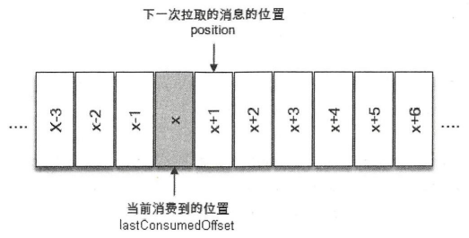

对于位移提交的时机很有讲究，可能造成**重复消费和消息丢失**。当前一次 poll() 所拉取的消息集为[x+2, x+7]，x+2 表示上一次提交的位移，即已经完成了 x+1 及之前的所有消息的消费，x+5 表示当前正在处理的位置。如果拉取到消息后就进行了位移提交，即提交了 x+8，那么当前消费遇到异常，在故障恢复之后，重新拉取的消息是从 x+8 开始的。也就是说，x+5 至 x+7 之间的消息并未被消息，发生了消息丢失。

另一种情形，位移是在消费完所有拉取到的消息后才提交。那么当消费 x+5 时遇到异常，在故障恢复后，重新拉取的消息是从 x+2 开始的。也就是说，x+2 至 x+4 之间的消息又重新消费了一遍，发生了重复消费。

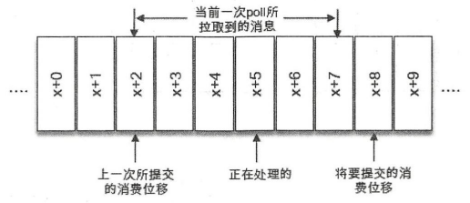

**Kafka 中默认的位移提交方式是自动提交，由消费者客户端参数 enable.auto.commit 配置，默认为 true**。默认提交不是每消费一条消息就提交一次，而是定期提交，提交周期由参数 auto.commit.interval.ms 配置，默认 5 秒。即**默认情况下，消费者每隔 5 秒会将拉取到的每个分区中最大的消息位移进行提交**。自动位移提交是在 poll() 方法的逻辑里完成的，在每次真正向服务端发起拉取请求之前，会检查是否可以提交位移，若可以，则提交上一次轮询的位移。自动提交也可能发生重复消息和消息丢失的现象。

Kafka 还提供手动提交的方式，可以让开发者更加灵活地控制消费位移。很多时候不是说拉取到消息就算消费完成，而是需要在所有业务处理完成后才认为消息被成功消费。**手动提交分为同步提交和异步提交，前提都是将参数 enable.auto.commit 配置为 false**。

```java
// 同步提交，根据poll()拉取的最新位移进行提交，阻塞消费者线程直至位移提交完成
public void commitSync();
public void commitSync(Duration timeout);
// 参数offset指定分区的位移，无参方法只能提交当前批次对应的position值，若要提交一个中间值，则使用该方式
public void commitSync(Map<TopicPartition, OffsetAndMetadata> offsets);
public void commitSync(Map<TopicPartition, OffsetAndMetadata> offsets, Duration timeout);

// 异步提交在执行时消费者线程不会被阻塞，可能在提交位移的结果还未返回之前就开始了新一次的拉取操作
public void commitAsync();
// 参数callback提供异步提交的回调方法，当位移提交完成后回调OffsetCommitCallback中的onComplete()方法
public void commitAsync(OffsetCommitCallback callback);
public void commitAsync(Map<TopicPartition, OffsetAndMetadata> offsets, OffsetCommitCallback callback);
```

```java
// 同步提交无参方法示例，批量处理+批量提交，可能出现重复消息现象
final int minBatchSize = 200;
List<ConsumerRecord> buffer = new ArrayList<>();
while (isRunning.get()) {
    ConsumerRecords<String, String> records = consumer.poll(Duration.ofSeconds(1));
    for (ConsumerRecord<String, String> record : records) {
        buffer.add(record);
    }
    if (buffer.size() >= minBatchSize) {
        // do some processing with buffer
        consumer.commitSync();
        buffer.clear();
    }
}
```

```java
// 同步提交位移参数方法示例，按照分区的粒度划分提交位移（每消费一条消息就提交一次位移的方式性能消耗大，场景使用很少）
try {
    while (isRunning.get()) {
        ConsumerRecords<String, String> records = consumer.poll(Duration.ofSeconds(1));
        for (TopicPartition partition : records.partitions()) {
            List<ConsumerRecord<String, String>> partitionRecords = records.records(partition);
            for (ConsumerRecord<String, String> record : partitionRecords) {
                // do some processing
            }
            long lastConsumedOffset = partitionRecords.get(partitionRecords.size() - 1).offset();
            consumer.commitSync(Collections.singletonMap(partition, new OffsetAndMetadata(lastConsumedOffset + 1)));
        }
    }
} finally {
    consumer.close();
}
```

```java
// 异步提交回调参数示例，同样有失败情况发生。若引入重试机制，则可能出现前一次提交位移x失败，然后下一次提交位移x+y成功，前一次异步提交x重试成功，覆盖了后一次的位移提交x+y，发生了重复消费。
// 为此可设置一个递增的序号来维护异步提交的顺序，提交失败时检查提交的位移与序号的大小。若前者小于后者，说明有更大的位移提交了，不需要重试；若两者相同，则可以重复提交；除非编码错误，否则不会出现前者大于后者
while (isRunning.get()) {
    ConsumerRecords<String, String> records = consumer.poll(Duration.ofSeconds(1));
    for (ConsumerRecord<String, String> record : records) {
        // do some processing
    }
    consumer.commitAsync((map, e) -> {
        if (e == null) {
            System.out.println(map);
        } else {
            log.error("fail to commit offsets");
        }
    });
}
```

```java
// 同步和异步组合示例，若消费者异常退出，则由于无法及时提交位移，出现重复消费；若消费者正常退出或发生再均衡，则可使用同步提交做最后保证
try {
    while (isRunning.get()) {
        // poll records and do some processing
        consumer.commitAsync();
    }
} finally {
    try {
        consumer.commitSync();
    } finally {
        consumer.close();
    }
}
```


### 3.2.5 控制或关闭消费

KafkaConsumer 提供了对消费速度进行控制的方法，在某些场景下，我们可能需要暂停某些分区的消费而先消费其它分区，当达到一定条件时再恢复这些分区的消息。

```java
// 暂停某些分区在拉取操作时返回数据给客户端
public void pause(Collection<TopicPartition> partitions);
// 恢复某些分区向客户端返回数据的操作
public void resume(Collection<TopicPartition> partitions);
// 获取被暂停的分区集合
public Set<TopicPartition> paused();
```

前面的示例都是使用 while(isRunning.get()) 方式消费消息，这样可以通过在其它地方设置 isRunning.set(false) 来退出循环。还有一种方式是调用 wakeup() 方法，该方法是 KafkaConsumer 中唯一可以从其它线程里安全调用的方法，**调用 wakeup() 方法后可以退出 poll() 逻辑，并抛出 WakeupException 异常，我们并不需要处理该异常，它只是一种跳出循环的方式**。

```java
// 相对完整的消费示例，可调用consumer.wakeup()或isRunning.set(false)关闭消费逻辑
try {
    while (isRunning.get()) {
        // poll records
        // process the record
        // commit offset
    }
} catch (WakeupException e) {
    // ingore the error
} catch (Exception e) {
    // do some process
} finally {
    // maybe commit offset
    consumer.close();
}
```


### 3.2.6 指定位移消费

**当消费者查找不到记录的消费位移时**，如新的消费组建立时没有可查找的消费位移，或者 __consumer_offsets 主题中有关消费组的位移信息过期而被删除等，**就会根据配置参数 auto.offset.reset 决定从何处开始进行消费，默认值为“latest”，表示从分区末尾开始进行消费**，即图中序号 9。如果将参数配置为“earliest”，则消费者从起始处，即序号 0 开始消费。如果配置为“none”，则出现查找不到位移时，既不从最新的消息位置开始消费，也不从最早的消息位置开始消费，此时会报出异常。

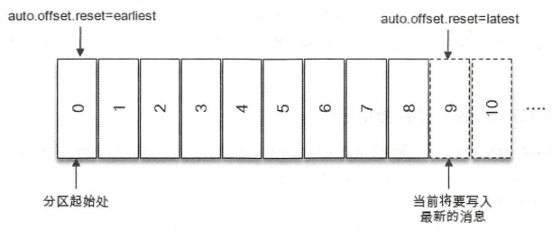

**KafkaConsumer 提供的 seek() 方法可以从特定的位移处开始拉取消息，该方法只能重置消费者分配到的分区消费位置，而分区的分配是在 poll() 方法中实现的。也就是说，在执行 seek() 方法之前需要先执行一次 poll() 方法，等到分配到分区后才能重置消费位置**。Kafka 中消费位移存储在一个内部主题中，使用 seek() 方法可以突破这一限制。以数据库为例，我们将位移保存在其中一个表中，在下次消费时可以读取存储在表中的位移，并通过 seek() 方法指向这个具体位置。

```java
// 使用seek()方法从分区末尾消费示例
KafkaConsumer<String, String> consumer = new KafkaConsumer<>(props);
consumer.subscribe(Arrays.asList(topic));
Set<TopicPartition> assignment = new HashSet<>();

// 如果不为0，说明已经成功分配到分区
while (assignment.size() == 0) {
    // 若在循环外直接使用consumer.poll(Duration.ofMillis(0))，则方法会立刻返回，
    // 导致poll()方法内部进行分区分配的逻辑来不及执行，即消费者未分配到任何分区，seek()方法没有任何作用
    consumer.poll(Duration.ofMillis(100));
    // assignment()用于获取消费者所分配到的分区信息
    assignment = consumer.assignment();
}

// 以下代码相当于：consumer.seekToBeginning(set);
Map<TopicPartition, Long> map = consumer.endOffsets(set);
for (TopicPartition tp : assignment) {
    // seek()参数依次为：分区、从分区的哪个位置开始消费
    consumer.seek(tp, map.get(tp));
}
```

```java
// 根据时间回溯消费前一天消息示例
HashMap<TopicPartition, Long> map = new HashMap<>();
for (TopicPartition topicPartition : assignment) {
    map.put(topicPartition, System.currentTimeMillis() - 24 * 3600 * 1000);
}
// offsetsForTimes()通过时间戳查询对应的分区位置，参数是Map类型，key和value分别为待查询的分区和时间戳，返回时间戳大于等于待查询时间的第一条消息对应位置和时间戳，对应于OffsetAndTimestamp的offset和timestamp
Map<TopicPartition, OffsetAndTimestamp> offsets = kafkaConsumer.offsetsForTimes(map);
for (TopicPartition tp : assignment) {
    OffsetAndTimestamp offsetAndTimestamp = offsets.get(tp);
    kafkaConsumer.seek(tp, offsetAndTimestamp.offset());
}
```


### 3.2.7 再均衡

**再均衡是指分区所属权从一个消费者转移到另一个消费者，在再均衡期间，消费组内的消费组无法读取消息，即消费组会变得不可用**。另外，当一个分区被重新分配给另一个消费者时，消费者当前状态也会丢失。比如消费者未来得及提交位移就发生再均衡操作，导致被分配的另一个消费者重复消费。

```java
// 再均衡监听器ConsumerRebalanceListener用来设定发生再均衡动作前后的一些准备或收尾动作
public interface ConsumerRebalanceListener {
    // 在再均衡开始之前和消费者停止读取消息之后被调用，参数表示再均衡前分配到的分区，可用于提交位移
    void onPartitionsRevoked(Collection<TopicPartition> partitions);
	// 在重新分配分区之后和消费者开始读取消费之前被调用，参数表示再均衡后分配到的分区
    void onPartitionsAssigned(Collection<TopicPartition> partitions);
}
```

```java
Map<TopicPartition, OffsetAndMetadata> currentOffsets = new HashMap<>();
consumer.subscribe(Arrays.asList(topic), new ConsumerRebalanceListener() {
    @Override
    public void onPartitionsRevoked(Collection<TopicPartition> collection) {
        consumer.commitSync(currentOffsets);
    }

    @Override
    public void onPartitionsAssigned(Collection<TopicPartition> collection) {
        // do nothing
    }
});

while (isRunning.get()) {
    ConsumerRecords<String, String> records = consumer.poll(Duration.ofSeconds(1));
    for (ConsumerRecord<String, String> record : records) {
        // process the record
        currentOffsets.put(new TopicPartition(record.topic(), record.partition()),
                new OffsetAndMetadata(record.offset() + 1));
    }
    consumer.commitAsync(currentOffsets, null);
}
```


### 3.2.8 消费者拦截器

**消费者拦截器主要在消费到消息或在提交位移时进行一些定制化的操作，如过滤消息、修改消息的内容等**。自定义消费者者拦截器需要实现 ConsumerInterceptor 接口，然后通过配置参数 interceptor.classes 指定该拦截器，若有多个拦截器，使用逗号分隔。

```java
public interface ConsumerInterceptor<K, V> extends Configurable, AutoCloseable {
    // 在poll()返回前调用，用于对消息进行相应的定制化操作
    ConsumerRecords<K, V> onConsume(ConsumerRecords<K, V> records);
	// 在提交位移后调用，用于记录跟踪所提交的位移信息
    void onCommit(Map<TopicPartition, OffsetAndMetadata> offsets);
	// 关闭拦截器时清理资源
    void close();
}
```

```java
// 实现简单的消息TTL（Time to Live）功能，若某条消息在既定的时间窗口内无法到达，则视为无效
// 需要注意的是，使用带参的位移提交时，可能提交错误的位移信息，因为含有最大偏移量的消息可能被拦截器过滤了
public class ConsumerInterceptorTTL implements ConsumerInterceptor<String, String> {
    // 如果消息的时间戳与当前时间戳相差超过10秒则判定为过期
    private static final long EXPIRE_INTERVAL = 10 * 1000;

    @Override
    public ConsumerRecords<String, String> onConsume(ConsumerRecords<String, String> records) {
        long now = System.currentTimeMillis();
        Map<TopicPartition, List<ConsumerRecord<String, String>>> newRecords = new HashMap<>();
        for (TopicPartition tp : records.partitions()) {
            List<ConsumerRecord<String, String>> tpRecords = records.records(tp);
            List<ConsumerRecord<String, String>> newTpRecords = new ArrayList<>();
            
            for (ConsumerRecord<String, String> record : tpRecords) {
                // 生产者发送消息时需要带上时间戳
                if (now - record.timestamp() < EXPIRE_INTERVAL) {
                    newTpRecords.add(record);
                }
            }
            if (!newTpRecords.isEmpty()) {
                newRecords.put(tp, newTpRecords);
            }
        }
        return new ConsumerRecords<>(newRecords);
    }

    @Override
    public void onCommit(Map<TopicPartition, OffsetAndMetadata> offsets) {
        offsets.forEach((tp, offset) -> System.out.println(tp + ":" + offset.offset()));
    }

    @Override
    public void close() {
    }

    @Override
    public void configure(Map<String, ?> map) {
    }
}
```


### 3.2.9 多线程实现

**KafkaProducer 是线程安全的，而 KafkaConsumer 却是非线程安全的。KafkaConsumer 定义了一个私有方法 acquire()，用来检测当前是否只有一个线程在操作，若有其它线程正在操作则抛出并发修改异常**。KafkaConsumer 中的每个公有方法在执行前都会调用 acquire() 方法，只有 wakeup() 方法例外。

```java
// KafkaConsumer中的成员变量
private final AtomicLong currentThread = new AtomicLong(-1L);
private final AtomicInteger refcount = new AtomicInteger(0);

// 可以将acquire()看作轻量级锁，它不会造成阻塞等待，仅通过线程操作计数的方式检测线程是否发生了并发修改
private void acquire() {
    long threadId = Thread.currentThread().getId();
    if (threadId != this.currentThread.get() && !this.currentThread.compareAndSet(-1L, threadId)) {
        throw new ConcurrentModificationException("KafkaConsumer is not safe for multi-threaded access");
    } else {
        this.refcount.incrementAndGet();
    }
}

// 解锁操作
private void release() {
    if (this.refcount.decrementAndGet() == 0) {
        this.currentThread.set(-1L);
    }
}
```

KafkaConsumer 非线程安全并不意味着消费消息时只能以单线程的方式执行。多线程的实现方式有多种，**第一种也是最常见的方式：线程封闭，即为每个线程实例化一个 KafkaConsumer 对象**。这种方式的并发度受限于分区的实际个数，当消费线程的个数大于分区数时，就有部分消费线程一直处于空闲状态。**它的优点是每个线程可以按顺序消费各个分区的消息；缺点是每个消费线程都要维护一个独立的 TCP 连接，系统开销较大**。

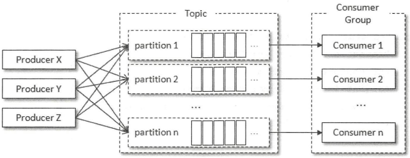

```java
public class FirstMultiConsumerThreadDemo {
    public static void main(String[] args) {
        Properties props = initConfig();
        // 主题的分区数一般事先可以知晓，若不知道分区数，可以通过partitionsFor()方法获取
        for (int i = 0; i < 4; i++) {
            new KafkaConsumerThread(props, topic).start();
        }
    }

    public static class KafkaConsumerThread extends Thread {
        private KafkaConsumer<String, String> kafkaConsumer;

        public KafkaConsumerThread(Properties props, String topic) {
            this.kafkaConsumer = new KafkaConsumer<>(props);
            this.kafkaConsumer.subscribe(Collections.singletonList(topic));
        }

        @Override
        public void run() {
            // process the record
        }
    }
}
```

一般而言，poll() 拉取消息的速度是相当快的，整体消费的瓶颈在于处理消息的速度，因此第二种方式**将处理消息模块改为多线程的实现方式。这种方式减少了 TCP 连接对系统资源的消耗，但是对于消息的顺序处理比较困难**。

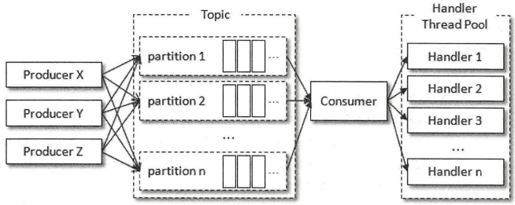

```java
public class SecondMultiConsumerThreadDemo {
    public static void main(String[] args) {
        Properties props = initConfig();
        new KafkaConsumerThread(props, topic, 
                Runtime.getRuntime().availableProcessors()).start();
    }

    // 对应一个消费线程，通过线程池的方式调用RecordsHandler批量处理消息
    public static class KafkaConsumerThread extends Thread {
        private KafkaConsumer<String, String> kafkaConsumer;
        private ExecutorService executorService;
        private int threadNumber;

        public KafkaConsumerThread(Properties props, String topic, int threadNumber) {
            this.kafkaConsumer = new KafkaConsumer<>(props);
            this.kafkaConsumer.subscribe(Collections.singletonList(topic));
            this.threadNumber = threadNumber;
            // CallerRunsPolicy()可防止线程池总体消费跟不上poll()拉取，从而导致异常线程发生
            executorService = new ThreadPoolExecutor(threadNumber, threadNumber, 0L, TimeUnit.MILLISECONDS, new ArrayBlockingQueue<>(1000), new ThreadPoolExecutor.CallerRunsPolicy());
        }

        @Override
        public void run() {
            while (true) {
                ConsumerRecords<String, String> records = kafkaConsumer.poll(Duration.ofMillis(100));
                if (!records.isEmpty()) {
                    executorService.submit(new RecordsHandler(records));
                }
            }
        }
    }

    public static class RecordsHandler extends Thread {
        public final ConsumerRecords<String, String> records;
        
        public RecordsHandler(ConsumerRecords<String, String> records) {
            this.records = records;
        }

        @Override
        public void run() {
            // process the records
        }
    }
}
```


### 3.2.10 重要的消费者参数

1. **fetch.min.bytes**：配置消费者在一次 pol() 拉取请求中能从 Kafka 中拉取的最小数据量，默认为 1B。若返回给消费者的数据量小于该值，则需要等待，直到数据量满足配置大小。
2. **fetch.max.bytes**：配置消费者在一次拉取请求中从 Kafka 中拉取的最大数据量，默认为 50M。
3. **fetch.max.wait.ms**：指定 Kafka 的等待时间，默认为 500ms。如果 Kafka 中没有足够多的消息而满足不了 fetch.min.bytes 的要求，那么最终会等待 500ms。
4. **max.partition.fetch.bytes**：配置从每个分区返回给 Consumer 的最大数据量，默认 1M。该参数与 fetch.max.bytes 相似，只不过前者用于限制一次拉取中每个分区的消息大小，而后者用于限制一次拉取中整体消息的大小。
5. **max.poll.records**：配置消费者在一次拉取请求中拉取的最大消息数，默认 500 条。
6. **exclude.internal.topics**：指定 Kafka 内部主题是否可以向消费者公开，默认值为 true。Kafka 中有两个内部主题：__consumer_offsets 和 \_\_transaction_state，如果设置为 true，则只能使用 subscribe(Collection) 而不能使用 subscribe(Pattern) 的方式订阅内部主题，设置为 false 则没有该限制。
7. **request.timeout.ms**：配置消费者等待请求响应的最长时间，默认为 30s。
8. **metadata.max.age.ms**：配置元数据的过期时间，默认为 5 分钟。如果元数据在此是参数限定的时间内没有更新，则会被强制更新，即使没有任何分区变化或新的 broker 加入。
9. **reconnect.backoff.ms**：配置尝试重新连接指定主机之前的等待时间（也称退避时间），避免频繁地连接主机，默认为 50ms。
10. **retry.backoff.ms**：配置尝试重新发送失败的请求到指定主题分区之前的等待时间，默认为 100ms。
11. **isolation.level**：配置消费者的事务隔离级别，默认为“read_uncommitted”，即消费者可以消费到 HW（High Watermark）的位置，若设置为“read_committed”，则会忽略事务未提交的消息，只能消费到 LSO（LastStableOffset）的位置。


# 4. 主题与分区

## 4.1 主题的管理

### 4.1.1 创建主题

若 broker 端配置参数 auto.create.topics.enable 设置未 true（默认值），则当生产者向一个尚未创建的主题发送消息时，或消费者从未知主题中读取消息时，都会自动创建一个分区数为 num.partitions（默认值为1）、副本因子为 default.replication.factor（默认值为1）的主题。这种自动创建主题的行为都是非预期的，因此不建议将参数设置为 true。

```shell
# 创建一个分区数为4、副本因子为2的主题topic-demo
bin/kafka-topics.sh --bootstrap-server hadoop102:9092,hadoop103:9092 --create --topic topic-create --partitions 4 --replication-factor 2
```

在脚本执行后，Kafka 会在 log.dir 或 log.dirs 参数配置的目录下创建相应的主题分区，分别查看 3 个 broker 节点。可以看到共创建了 8（分区数4 * 副本因子2）个文件夹，**每个副本（确切说时日志，副本与日志一一对应）对应一个命名如 <topic\>-<paritition\> 目录**。

```shell
[maomao@hadoop102 datas]$ ls /opt/module/kafka/datas/ | grep topic-create
topic-create-0
topic-create-1
[maomao@hadoop103 datas]$ ls /opt/module/kafka/datas/ | grep topic-create
topic-create-0
topic-create-2
topic-create-3
[maomao@hadoop104 datas]$ ls /opt/module/kafka/datas/ | grep topic-create
topic-create-1
topic-create-2
topic-create-3
```

从 Kafka 的底层来说，主题和分区都是逻辑上的概念，**主题作为消息的归类，可以分为一至多个分区，分区可以有一至多个副本，每个副本对应一个日志文件，每个日志文件对应一至多个日志分段（LogSegment），每个日志分段还可以细分为索引文件、日志存储文件和快照文件等**。

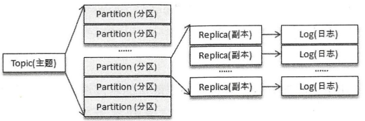

除了通过日志文件的根目录查看集群中各 broker 分区副本的分配情况，还可以**通过 ZK 客户端和 kafka-topics.sh 脚本的 describe 参数查看**。同时脚本在创建主题时还提供了其它一些参数，用法如下：

* **--replica-assignment** \[1:0, 0:2, 2:1, 1:2]：**手动指定分区副本的分配方案**，分区号的数值从小到大排列，分区与分区之间用逗号分隔，分区内多个副本用冒号分隔。注意分区内的副本不能重复，如指定了 0:0 这种，就会报异常
* **--config** \[name=value]：**设置主题的相关参数，覆盖默认配置**
* **--if-not-exists**：**若发生命名冲突，则不做任何处理，既不创建主题，也不报错**。默认情况下，创建相同的主题会报错。另外，Kafka 内部做埋点时会根据主题名来命名 metrics，并将点号该为下划线，如创建名为“topic.1_2”和名为“topic_1.2”的主题，则最后 metrics 名都会为“topic_1_2”，从而发生冲突

```shell
[maomao@hadoop102 zookeeper-3.6.3]$ bin/zkCli.sh -server hadoop102:2181
[zk: hadoop102:2181(CONNECTED) 1] ls /
[kafka, zookeeper]
[zk: hadoop102:2181(CONNECTED) 2] get /kafka/brokers/topics/topic-create 
{"partitions":{"0":[1,0],"1":[0,2],"2":[2,1],"3":[1,2]}, "topic_id":"DU8cNtvETz2Dg6FO8nTmgA","adding_replicas":{},"removing_replicas":{}, "version":3}
```

```shell
# Configs表示创建或修改主题时指定的参数配置，Replicas表示分区所有副本的分配情况，即AR集合，数字表示的是brokerId
[maomao@hadoop102 bin]$ ./kafka-topics.sh --bootstrap-server hadoop102:9092,hadoop103:9092 --describe --topic topic-create
Topic: topic-create	TopicId: DU8cNtvETz2Dg6FO8nTmgA	PartitionCount: 4	ReplicationFactor: 2	Configs: segment.bytes=1073741824
	Topic: topic-create	Partition: 0	Leader: 1	Replicas: 1,0	Isr: 1,0
	Topic: topic-create	Partition: 1	Leader: 0	Replicas: 0,2	Isr: 0,2
	Topic: topic-create	Partition: 2	Leader: 2	Replicas: 2,1	Isr: 2,1
	Topic: topic-create	Partition: 3	Leader: 1	Replicas: 1,2	Isr: 1,2
```


### 4.1.2 查看主题

kafka-topics.sh 脚本通过 describe 参数查看单个主题信息，若不使用 --topic 指定主题，则会显示所有主题的详细信息，--topic 还支持指定多个主题，主题名之间使用逗号分隔。脚本在查看主题时还提供了其它一些参数，用法如下：

* --topics-with-overrides：查看包含覆盖配置的主题，它只会列出包含与集群不一样配置的主题
* --under-replicated-partitions：查看包含失效副本的分区，此时分区的 ISR 小于 AR，这意味着某个 broker 已经失效或同步效率降低
* --unavailable-partitions：查看主题中没有 leader 的分区，这些分区已经处于离线状态，对于生产者和消费者来说不可用


### 4.1.3 修改主题

kafka-topics.sh 脚本通过 alter 参数修改主题，它还提供了其它一些参数，用法如下：

* **--partitions** [分区个数]：**增加主题分区数，不支持减少分区数**。若主题中的消息是根据 key 计算分区，则消息可能会发往其它分区，因此**增加分区数前一定要三思而后行**。若要实现减少分区，则可以重新创建一个分区数较小的主题，然后将原有主题中的消息复制过去即可
* **--if-exists**：当修改一个不存在的主题时，不报错
* **--config** \[name=value]：新增或修改原有配置
* --delete-config [name]：删除之前覆盖的配置


### 4.1.4 删除主题

kafka-topics.sh 脚本通过 delete 参数删除主题，**前提是 delete.topic.enable 参数配置为 true（默认值）**，如果为 false，那么删除主题的操作将会被忽略。如果删除的是 Kafka 的内部主题，则删除时就会报错。同样，删除一个不存在的主题也会保存，通过指定 --if-exists 参数可忽略异常。

**删除主题的本质是在 ZK 中的 /admin/delete_topics 路径下创建一个与待删除主题同名的节点，以此标记该主题为待删除的状态。与创建主题相同，真正的删除操作是由 Kafka 的控制器完成的**。因此，可以直接通过 ZK 客户端来删除主题。

```shell
[zk: hadoop102:2181(CONNECTED) 10] create /kafka/admin/delete_topics/topic-create ""
Created /kafka/admin/delete_topics/topic-create
```

由于主题中的元数据存储在 ZK 中的 /brokers/topics 和 /config/topics 路径下，主题中的消息数据存储在 log.dir 或 log.dirs 配置的路径下，因此还可以通过手动删除这些地方的内容来删除主题。注意，删除主题是一个不可逆的操作，一定要三思而后行。


## 4.2 初识 KafkaAdminClient

一般情况下，我们习惯使用 kafka-topics.sh 脚本来管理主题，但有时我们需要以程序调用 API 的方式实现。KafkaAdminClient 继承了 AdminClient 抽象类，可以用来管理 broker、配置、ACL 和主题。

```java
public class CustomBroker {
    public static void main(String[] args) {
        Properties properties = new Properties();
        properties.put(AdminClientConfig.BOOTSTRAP_SERVERS_CONFIG, "hadoop102:9092");
        properties.put(AdminClientConfig.REQUEST_TIMEOUT_MS_CONFIG, 30000);

        AdminClient client = AdminClient.create(properties);
        createTopic(client);
        describeTopic(client);
        client.close();
    }

    private static void createTopic(AdminClient client) {
        // 创建一个分区数为4、副本因子为1的主题topic-admin，还可以设置具体的分区分配方案、配置
        NewTopic newTopic = new NewTopic("topic-admin", 4, (short) 1);
        // CreateTopicsResult中的方法主要针对成员变量futures的操作，该变量类型为
        // Map<String, KafkaFuture<CreateTopicsResult.TopicMetadataAndConfig>>
        // 其中key表示主题名称，KafkaFuture<>表示创建后的返回值类型
        CreateTopicsResult result = client.createTopics(Collections.singleton(newTopic));

        try {
            result.all().get();
        } catch (InterruptedException | ExecutionException e) {
            e.printStackTrace();
        }
    }

    private static void describeTopic(AdminClient client) {
        ConfigResource resource = new ConfigResource(ConfigResource.Type.TOPIC, "topic-admin");
        DescribeConfigsResult result = client.describeConfigs(Collections.singleton(resource));
        try {
            Config config = result.all().get().get(resource);
            System.out.println(config);
        } catch (InterruptedException | ExecutionException e) {
            e.printStackTrace();
        }
    }
}
```


## 4.3 分区的管理

### 4.3.1 优先副本的选举

分区使用多副本机制提升可靠性，但**只有 leader 副本对外提供读写服务，而 follower 副本只负责在内部同步消息**。从某种程度上说，broker 节点中 leader 副本的个数决定了这个节点负载的高低。在创建主题时，主题的分区及副本会尽可能均匀地分布在各个 broker 节点上，对应 leader 副本的分配也比较均匀。然而当分区 leader 节点发生故障时，其中一个 follower 节点就会成为新的 leader 节点，这样就会导致集群的负载失衡。

**为了对应负载失衡的情况，Kafka 引入了优先副本（preferred replica）的概念，所谓优先副本是指在 AR 集合列表中的第一个副本**。假设某主题分区 0 的 AR 集合列表为 [1, 0, 2]，那么分区 0 的优先副本即为 1。**理想情况下，优先副本就是该分区的 leader 副本**，Kafka 只要保证所有主题的优先副本均匀分布，就保证了所有分区的 leader 均匀分布。**所谓优先副本的选举是指通过一定的方式促使优先副本选举为 leader**，以此促进集群负载均衡，这一行为称为“分区平衡”。

```shell
# 首先创建一个分区数3、副本数3的主题topic-partitions，然后停止hadoop104节点，查看主题分区副本情况
[maomao@hadoop102 kafka]$ bin/kafka-topics.sh --bootstrap-server hadoop102:9092,hadoop103:9092 --describe --topic topic-partitions
Topic: topic-partitions	TopicId: fErHvg-0RrqjqVKpkwTlfw	PartitionCount: 3	ReplicationFactor: 3	Configs: segment.bytes=1073741824
	Topic: topic-partitions	Partition: 0	Leader: 1	Replicas: 1,0,2	Isr: 1,0
	Topic: topic-partitions	Partition: 1	Leader: 0	Replicas: 0,2,1	Isr: 0,1
	Topic: topic-partitions	Partition: 2	Leader: 1	Replicas: 2,1,0	Isr: 1,0
```

Kafka 中提供了分区自动平衡的功能，对应参数 auto.leader.rebalance.enable，默认值为 true。即**默认情况下，Kafka 的控制器会启动一个定时任务，轮询所有的 broker 节点，计算每个 broker 节点的分区不平衡率**（broker 的不平衡率 = 非优先副本的 leader 个数 / 分区总数）是否超过 leader.imbalance.per.broker.percentage 参数配置的值（默认10%），若超过设定值则会自动执行优先副本的选举以求分区平衡。执行周期由参数 leader.imbalance.check.interval.seconds 控制，默认为 5 分钟。

**生产环境下不建议将 auto.leader.rebalance.enable 设置为默认值 true**，因为这可能引起负面的性能问题。如果在执行关键任务时执行优先副本的自动选举，则会有业务阻塞的风险，且分区及副本的均衡也不能完全保证集群整体的均衡。**kafka-leader-election.sh 脚本提供了对分区 leader 进行重新平衡的功能**，优先副本的选举是一个安全的过程，Kafka 客户端可以自动感知分区 leader 的变更。由于 leader 副本的转移成本高，如果要执行的分区数很多，必然会对客户端造成影响，因此脚本还提供 path-to-json-file 参数来小批量地对部分分区执行优先副本的选举，这也是实际生产中建议使用的方式。

```json
{
    "partitions":[
        {
            "partition":0,
            "topic":"topic-partitions"
        },
        {
            "partition":1,
            "topic":"topic-partitions"
        },
        {
            "partition":2,
            "topic":"topic-partitions"
        }
    ]
}
```

```shell
# 首先创建一个名为election.json的JSON文件（内容如上），然后启动hadoop104节点，并执行优先副本选举命令
[maomao@hadoop102 kafka]$ bin/kafka-leader-election.sh --bootstrap-server hadoop102:9092 --election-type preferred --path-to-json-file election.json
Successfully completed leader election (PREFERRED) for partitions topic-partitions-2
Valid replica already elected for partitions topic-partitions-1, topic-partitions-0

[maomao@hadoop102 kafka]$ bin/kafka-topics.sh --bootstrap-server hadoop102:9092,hadoop103:9092 --describe --topic topic-partitions
Topic: topic-partitions	TopicId: fErHvg-0RrqjqVKpkwTlfw	PartitionCount: 3	ReplicationFactor: 3	Configs: segment.bytes=1073741824
	Topic: topic-partitions	Partition: 0	Leader: 1	Replicas: 1,0,2	Isr: 1,0,2
	Topic: topic-partitions	Partition: 1	Leader: 0	Replicas: 0,2,1	Isr: 0,1,2
	Topic: topic-partitions	Partition: 2	Leader: 2	Replicas: 2,1,0	Isr: 1,0,2
```


### 4.3.2 分区重分配

当要对集群中的一个节点进行下线操作时，为了保证分区及副本合理分配，需要通过某种方式将该节点上的分区副本迁移到其它可用节点上。当集群中新增节点时，只有新创建的主题分区才有可能被分配到该节点上，而之前的主题分区并不会自动分配到新加入的节点，这样新节点与原节点的负载不均衡。

为了解决上述问题，**Kafka 提供了 kafka-reassign-partitions.sh 脚本来执行分区重分配，它在集群扩容、broker 节点失效的场景下对分区进行迁移**。使用该脚本分为三步：首先创建一个包含主题清单的 JSON 文件，其次根据主题清单和 broker 节点生成一份重分配方案，最后根据生成的方案执行具体的重分配操作。分区重分配会影响集群性能，因此实际操作需要降低重分配的粒度，分成多个小批次执行。假设已经创建了一个分区数 4、副本数 2 的主题 topic-reassign，现在需要下线 hadoop103 节点。

```json
{
	"topics":[
		{
			"topic":"topic-reassign"
		}
	],
	"version":1
}
```

```shell
# 首先创建一个名为reassign.json的JSON文件（内容如上），然后生成重分配方案，最后执行该分配方案
# 参数broker-list用于指定所要分配的broker节点列表。上面对应的JSON内容为当前的分区副本分配情况，
# 最好将其保存下来，以便后续的回滚操作；下面的JSON内容为重分配的候选方案，并没有真正执行
[maomao@hadoop102 kafka]$ bin/kafka-reassign-partitions.sh --bootstrap-server hadoop102:9092 --generate --topics-to-move-json-file reassign.json --broker-list 0,2
Current partition replica assignment
{"version":1,"partitions":[{"topic":"topic-reassign","partition":0,"replicas":[1,0],"log_dirs":["any","any"]},{"topic":"topic-reassign","partition":1,"replicas":[0,2],"log_dirs":["any","any"]},{"topic":"topic-reassign","partition":2,"replicas":[2,1],"log_dirs":["any","any"]},{"topic":"topic-reassign","partition":3,"replicas":[1,2],"log_dirs":["any","any"]}]}

Proposed partition reassignment configuration
{"version":1,"partitions":[{"topic":"topic-reassign","partition":0,"replicas":[0,2],"log_dirs":["any","any"]},{"topic":"topic-reassign","partition":1,"replicas":[2,0],"log_dirs":["any","any"]},{"topic":"topic-reassign","partition":2,"replicas":[0,2],"log_dirs":["any","any"]},{"topic":"topic-reassign","partition":3,"replicas":[2,0],"log_dirs":["any","any"]}]}

# 首先将生成的分配方案保存为project.json文件，然后执行具体的重分配操作
[maomao@hadoop102 kafka]$ bin/kafka-reassign-partitions.sh --bootstrap-server hadoop102:9092 --execute --reassignment-json-file project.json

# 若要验证查看分区重分配的进度，只需将execute替换为verify即可
[maomao@hadoop102 kafka]$ bin/kafka-reassign-partitions.sh --bootstrap-server hadoop102:9092 --verify --reassignment-json-file project.json
Status of partition reassignment:
Reassignment of partition topic-reassign-0 is complete.
Reassignment of partition topic-reassign-1 is complete.
Reassignment of partition topic-reassign-2 is complete.
Reassignment of partition topic-reassign-3 is complete.
```


### 4.3.3 复制限流

**分区重分配本质是数据复制，先增加新的副本，然后进行数据同步，最后删除旧的副本**。数据复制会占用额外资源，如果重分配的量太大必然会影响整体的性能，除了减少重分配的粒度，还可以对副本间的复制流量加以限制。实现方式有两种：kafka-configs.sh 脚本和 kafka-reassign-partitions.sh 脚本，前者比较繁琐，后者实现原理与前者相同，不过简单快捷，只需要**在重分配时增加一个 throttle 参数**即可。

```shell
# 参数--throttle 10指定限流速度为10B/s，若想在重分配期间修改限制，只需增加--additional参数重新运行即可
# 输出的信息：需要周期性地执行查看进度的命令直到重分配完成，这样确保限流设置被移除，不影响后续Kafka性能
[maomao@hadoop102 kafka]$ bin/kafka-reassign-partitions.sh --bootstrap-server hadoop102:9092 --execute --reassignment-json-file project.json --throttle 10
Current partition replica assignment

{"version":1,"partitions":[{"topic":"topic-reassign","partition":0,"replicas":[1,0],"log_dirs":["any","any"]},{"topic":"topic-reassign","partition":1,"replicas":[0,2],"log_dirs":["any","any"]},{"topic":"topic-reassign","partition":2,"replicas":[2,1],"log_dirs":["any","any"]},{"topic":"topic-reassign","partition":3,"replicas":[1,2],"log_dirs":["any","any"]}]}

Save this to use as the --reassignment-json-file option during rollback
Warning: You must run --verify periodically, until the reassignment completes, to ensure the throttle is removed.
The inter-broker throttle limit was set to 10 B/s
Successfully started partition reassignments for topic-reassign-0,topic-reassign-1,topic-reassign-2,topic-reassign-3
# 周期性查看进度，可以看到同步变得缓慢，全部完成后会提示已删除限流设置
[maomao@hadoop102 kafka]$ bin/kafka-reassign-partitions.sh --bootstrap-server hadoop102:9092 --verify --reassignment-json-file project.json
Status of partition reassignment:
Reassignment of partition topic-reassign-0 is still in progress.
Reassignment of partition topic-reassign-1 is complete.
Reassignment of partition topic-reassign-2 is still in progress.
Reassignment of partition topic-reassign-3 is still in progress.
```


### 4.3.4 修改副本因子

修改副本因子同样可以通过 kafka-reassign-partitions.sh 脚本实现，只需修改 4.3.2 节生成的 project.json 文件，在 replicas 中增加/删除相应的副本，同时在 log_dirs 中添加/删除一个 any。

```json
{
    "version":1,
    "partitions":[
        {"topic":"topic-reassign","partition":0,"replicas":[1,0,2],"log_dirs":["any","any","any"]},
        {"topic":"topic-reassign","partition":1,"replicas":[0,2,1],"log_dirs":["any","any","any"]},
        {"topic":"topic-reassign","partition":2,"replicas":[2,1,0],"log_dirs":["any","any","any"]},
        {"topic":"topic-reassign","partition":3,"replicas":[1,2,0],"log_dirs":["any","any","any"]}
    ]
}
```

```shell
# 将主题topic-reassign每个分区的副本因子从2修改为3，add.json文件内容如上
[maomao@hadoop102 kafka]$ bin/kafka-reassign-partitions.sh --bootstrap-server hadoop102:9092 --execute --reassignment-json-file add.json

[maomao@hadoop102 kafka]$ bin/kafka-topics.sh --bootstrap-server hadoop102:9092 --topic topic-reassign --describe
Topic: topic-reassign	TopicId: rC2Jr8HDRuqesqOZG43Qhw	PartitionCount: 4	ReplicationFactor: 3	Configs: segment.bytes=1073741824
	Topic: topic-reassign	Partition: 0	Leader: 2	Replicas: 1,0,2	Isr: 0,2,1
	Topic: topic-reassign	Partition: 1	Leader: 0	Replicas: 0,2,1	Isr: 0,2,1
	Topic: topic-reassign	Partition: 2	Leader: 2	Replicas: 2,1,0	Isr: 2,0,1
	Topic: topic-reassign	Partition: 3	Leader: 0	Replicas: 1,2,0	Isr: 2,0,1
```


## 4.4 性能测试工具

Kafka 本身提供了性能测试工具，其中 kafka-producer-perf-test.sh 脚本用于生产者性能测试，kafka-consumer-perf-test.sh 脚本用于消费者性能测试。

1. kafka-producer-perf-test.sh
   * --topic：指定生产者发送消息的目标主题
   * **--num-records**：指定发送消息的总条数
   * **--record-size**：设置每条消息的字节数
   * **--throughput**：限流控制，当设定的值小于 0 时不限流，当设定的值大于 0 时，若发送的吞吐量大于该值时就会被阻塞一段时间
   * **--producer-props**：指定生产者的配置，可同时指定多组配置，各组配置之间以空格分隔
   * --producer.config：指定生产者的配置文件
   * --print-metrics：测试完成后打印指标信息
2. kafka-consumer-perf-test.sh
   * --topic：指定消费者接收消息的目标主题
   * **--messages：指定接收消息的总条数**

```shell
# 输出结果：records sent表示测试时发送的消息总数；records/sec表示以每秒发送的消息数来统计吞吐量，括号中的MB/sec表示以每秒发送的消息大小来统计吞吐量，注意这两者的维度；avg latency表示消息处理的平均耗时；max latency表示消息处理的最大耗时；50th、95th、99th和99.9th分别表示50%、95%、99%和99.9%的消息处理耗时
[maomao@hadoop102 kafka]$ bin/kafka-producer-perf-test.sh --topic topic-1 --num-records 100000 --record-size 1024 --throughput -1 --producer-props bootstrap.servers=hadoop102:9092 acks=1
48031 records sent, 9604.3 records/sec (9.38 MB/sec), 1655.2 ms avg latency, 2687.0 ms max latency.
100000 records sent, 14556.040757 records/sec (14.21 MB/sec), 1516.64 ms avg latency, 2687.00 ms max latency, 1490 ms 50th, 2411 ms 95th, 2602 ms 99th, 2675 ms 99.9th.

# 输出结果：start.time表示起始运行时间；end.time表示结束运行时间；data.consumed.in.MB表示消费的消息总量，单位MB；MB.sec表示消费吞吐量，单位MB/s；data.consumed.in.nMsg表示消费的消息总数，单位条；nMsg.sec表示消费吞吐量，单位条/s；rebalance.time.ms表示再平衡时间，单位ms；fetch.time.ms表示拉取消息的持续时间，单位ms；fetch.MB.sec表示每秒拉取消息的字节数；fetch.nMsg.sec表示每秒拉取消息的个数
# fetch.time.ms = end.time - start.time - rebalance.time.ms
[maomao@hadoop102 kafka]$ bin/kafka-consumer-perf-test.sh --topic first --messages 100000 --bootstrap-server hadoop102:9092
start.time, end.time, data.consumed.in.MB, MB.sec, data.consumed.in.nMsg, nMsg.sec, rebalance.time.ms, fetch.time.ms, fetch.MB.sec, fetch.nMsg.sec
2022-08-11 23:37:37:046, 2022-08-11 23:37:41:076, 98.1348, 24.3511, 100490, 24935.4839, 965, 3065, 32.0179, 32786.2969
```


# 5. 日志存储

## 5.1 文件目录布局

不考虑多副本的情况，一个分区对应一个日志 Log。为了防止 Log 过大，Kafka 引入了日志分段（LogSegment）的概念，将 Log 切分为多个相对较小的 LogSegment，这样便于消息的维护和清理。事实上，**Log 和 LogSegment 不是纯粹物理意义上的概念，Log 在物理上只以文件夹的形式存储，而每个 LogSegment 对应于磁盘上的一个日志文件和两个索引文件，以及可能的其他文件**（如以“.txnindex”为后缀的事务索引文件）。

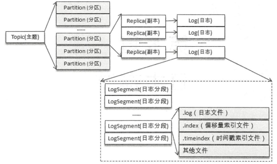

每个分区 Log 对应了一个命名为 <topic\>-<partition\> 的文件夹。向 Log 中追加消息时时顺序写入的，只有最后一个 LogSegment 才能执行写入操作，随着消息的不断写入，当满足一定条件时，就会创建新的 LogSegment，之后追加的消息将写入新的 LogSegment。

**为了提高消息检索的效率，每个 LogSegment 中的日志文件都有对应的两个索引文件（以 .log 为文件后缀）：偏移量索引文件（以 .index 为文件后缀）和时间戳索引文件（以 .timeindex 为文件后缀）**。每个 LogSegment 都有一个基准偏移量 baseOffset，用来表示当前 LogSegment 中第一条消息的 offset。偏移量是一个 64 位的长整型数，日志文件和两个索引文件都是根据 baseOffset 命令的，名称固定为 20 位数字，没有达到的位数则用 0 填充。

```shell
# LogSegment对应的基准位移是656，说明该LogSegment的第一条消息的偏移量为656
[maomao@hadoop102 kafka]$ ls -l datas/first-1
total 143500
-rw-rw-r--. 1 maomao maomao  10485760 Aug 13 11:21 00000000000000000656.index
-rw-rw-r--. 1 maomao maomao 146767828 Aug 11 23:26 00000000000000000656.log
-rw-rw-r--. 1 maomao maomao  10485756 Aug 13 11:21 00000000000000000656.timeindex
-rw-rw-r--. 1 maomao maomao        10 Aug 11 23:51 00000000000000142159.snapshot
-rw-rw-r--. 1 maomao maomao        21 Aug 13 11:21 leader-epoch-checkpoint
-rw-rw-r--. 1 maomao maomao        43 Jun  6 10:50 partition.metadata
```

除了上面提及的文件，消费者提交的位移保存在 Kafka 内部主题 __consumer_offsets 中，初始情况下这个主题并不存在，当第一次有消费者消费消息时会自动创建这个主题。另外，Kafka 还有一些检查点文件，当 Kafka 服务第一次启动时，默认的根目录下就会创建最基本的 4 个检查点文件（xxx-checkpoint）和 meta.properties 文件。

```shell
[maomao@hadoop102 kafka]$ ls datas/
cleaner-offset-checkpoint		recovery-point-offset-checkpoint	meta.properties
log-start-offset-checkpoint		replication-offset-checkpoint
__consumer_offsets-25			first-1
__consumer_offsets-28			first-4 
```


## 5.2 日志索引

偏移量索引文件用来建立消息偏移量 offset 到物理地址之间的映射关系，方便快速定位消息所在的物理文件位置；时间戳索引文件则根据指定的时间戳 timestamp 来查找对应的偏移量信息。Kafka 中的索引文件以稀疏索引的方式构造消息的索引，它不保证每个消息在索引文件中都有对应的索引项。每当写入一定量的消息时（由 broker 端参数 log.index.interval.bytes 指定，默认为 4K），偏移量索引文件和时间戳索引文件分别增加一个偏移量索引项和时间戳索引项。

稀疏索引将索引文件映射到内存中，以加快索引的查询速度。**偏移量索引文件中的偏移量时单调递增的，查询指定偏移量时，使用二分查找快速定位**，如果指定的偏移量不在索引文件中，则返回小于指定偏移量的最大偏移量。时间戳索引文件的实现类似，稀疏索引的方式是在磁盘空间、内存空间、查找速度等多方面之间的一个折中。

### 5.2.1 偏移量索引

偏移量索引的每个索引项占用 8 个字节，分为两部分。

1. **relativeOffset**：相对偏移量，表示消息相对于 baseOffset 的偏移量，占用 4 个字节，当前索引文件的文件名即为 baseOffset 的值。
2. **position**：物理地址，即消息在日志分段文件中对应的物理位置，占用 4 个字节。

消息的偏移量（offset）占用 8 个字节，也称为绝对偏移量。为了减少索引文件占用的空间，索引项使用只占用 4 个字节的相对偏移量 **relativeOffset = offset - baseOffset**。

假设要查找偏移量为 23 的消息，那么首先定位到  baseOffset 为 0 的日志分段；然后计算相对偏移量 23 - 0 = 23，并通过二分法在偏移量索引文件中找到不大于 23 的最大索引项，即 [22, 656]；最后从日志分段文件中的物理位置 position = 656 开始顺序查找偏移量为 23 的消息。

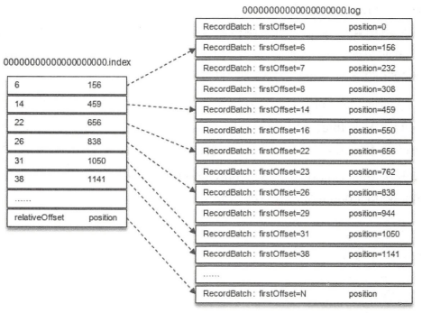

### 5.2.2 时间戳索引

时间戳索引的每个索引项占用 12 个字节，分为两个部分。

1. **timestamp**：当前日志分段最大的时间戳，占用 8 个字节。
2. **relativeOffset**：时间戳所对应的消息相对偏移量，占用 4 个字节。

时间戳索引文件包含若干时间戳索引项，每个追加的时间戳索引项中的 timestamp 必须大于之前追加的索引项的 timestamp，否则不予追加。**如果 broker 端参数 log.message.timestamp.type 设置为 LogAppendTime，则消息的时间戳必定能保持单调递增；如果是 CreateTime 类型则无法保证**，即使生产者客户端采用自动插入的时间戳，也可能因为两个不同时钟的生产者同时往一个分区中插入消息，造成当前分区的时间戳乱序。

假设要查找指定时间戳 targetTimeStamp = 1526384718288 开始的消息，首先将 targetTimeStamp 和每个日志分段中的最大时间戳逐一对比，直到找到不小于 targetTimeStamp 的日志分段；然后在时间戳索引文件中使用二分法查找不大于 targetTimeStamp 的最大索引项，即 [1526384718283, 28]；接着在偏移量索引文件中使用二分法查找不大于 28 的最大索引项，即 [26, 838]；最后从第一步中找到的日志分段文件中的 838 物理位置开始查找不小于 targetTimeStamp 的消息。

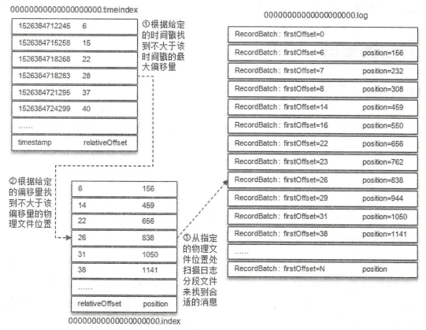

## 5.3 日志清理

为了控制磁盘占用空间不断增加，Kafka 提供了两种日志清理策略：日志删除和日志压缩。可以通过 broker 端参数 log.cleanup.policy 来设置日志清理策略，默认为日志删除 delete，若要采用日志压缩，需要将其设置为 compact，也可以同时设置，即支持日志删除和日志压缩两种。

1. **日志删除（Log Retention）**：**按照一定的保留策略（基于时间、基于日志大小和基于起始偏移量）直接删除不符合条件的日志分段**。在 Kafka 日志管理器中有一个专门的日志删除任务来周期性地检测和删除不符合保留条件的日志分段，这个周期通过 broker 端参数 log.retention.check.interval.ms 来配置，默认 5 分钟。

   * **基于时间**：日志删除任务会检查当前日志文件中是否有保留时间超过设定的阈值（retentionMs），从而寻找可删除的日志分段文件集合。可通过 broker 端参数 log.retention.hours 等设置，默认保留时间为 7 天。
   * **基于日志大小**：日志删除任务会检查当前日志大小是否超过设定的阈值（retentionSize），从而寻找可删除的日志分段文件集合。可通过 broker 端参数 log.retention.bytes 设置，默认值为 -1，即无穷大。注意这里配置的是所有日志文件的总大小，如果是单个日志分段（.log 日志文件），可通过参数 log.segment.bytes 来限制，默认 1G。
   * **基于日志起始偏移量**：一般情况下，日志文件的起始偏移量 logStartOffset 等于第一个日志分段的 baseOffset，但这并不是绝对的。若某个日志分段的下一个日志分段的起始偏移量 baseOffset 小于等于 logStartOffset，则删除此日志分段。

   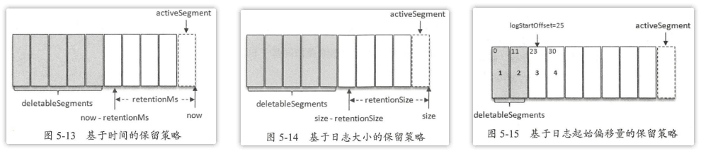

2. **日志压缩（Log Compaction）**：**针对每个消息的 key 进行整合，对于相同 key 的不同 value 值，只保留最后一个版本**。注意区分日志压缩（Compaction）与消息压缩（Compression），这是两个不同的概念。


# 6. 深入服务端

## 6.1 协议设计


## 6.2 时间轮


## 6.3 延时操作


## 6.4 控制器

### 6.4.1 控制器的选举及异常恢复


### 6.4.2 优雅关闭


### 6.4.3 分区 leader 的选举


## 6.5 参数解密


# 7. 深入客户端

## 7.1 分区分配策略

### 7.1.1 RangeAssignor 分配策略

RangeAssignor 分配策略是默认的分区分配策略，它**对于每一个主题**，RangeAssignor 策略会将消费组内所有订阅这个主题的消费者按照名称的字典序排序，然后为每个消费者划分固定的分区范围，如果不够平均，那么字典序靠前的消费者会被多分配一个分区。**假设 n = 分区数/消费者数量，m = 分区数%消费者数量，那么前 m 个消费者每个分配 n+1 个分区，后面的（消费者数量 - m）个消费者每个分配 n 个分区**。

假设消费组内有 2 个消费组 C0、C1，都订阅了主题 t0、t1，且每个主题都有 3 个分区，那么订阅的所有分区可标识为 t0p0、t0p1、t0p2、t1p0、t1p1、t1p2，最终的分配结果为：

> 消费组 C0：t0p0、t0p1、t1p0、t1p1
>
> 消费组 C1：t0p2、t1p2

这种情况下，对于每个主题，消费组 C0 都多消费一个分区，当主题数很多时，将产生数据倾斜。


### 7.1.2 RoundRobinAssignor 分配策略

RoundRobinAssignor 分配策略将消费组内所有消费者及消费者订阅的**所有主题的分区**按照字典序排序，然后通过轮询方式逐个将分区依次分配给每个消费者。若同一个消费组内所有消费者订阅信息都相同，那么该分配策略的分区分配会是均匀的。上面例子的最终分配结果为：

> 消费组 C0：t0p0、t0p2、t1p1
>
> 消费组 C1：t0p1、t1p0、t1p2

若同一个消费组内的消费者订阅的信息不同，那么分区分配时就不是完全的轮询，可能导致分区分配不均。假设消费组内有 3 个消费者 C0、C1 和 C2，它们共订阅了 3 个主题 t0、t1、t2，这 3 个主题分别有 1、2、3 个分区，即整个消费组订阅了 t0p0、t1p0、tlp1、t2p0、t2p1、t2p2 这 6 个分区。其中，消费者 C0 订阅主题 t0，消费者 C1 订阅主题 t0 和 t1，消费者 C2 订阅主题 t0、t1 和 t2，那么最终的分配结果为:

> 消费者 C0：t0p0
>
> 消费者 C1：t1p0
>
> 消费者 C2：t1p1、t2p0、t2p1、 t2p2

可见该分配策略也不是十分完美，因为完全可以将分区 t1p1 分配给消费者 C1。


### 7.1.3 StickyAssignor 分配策略

**StickyAssignor 分配策略有两个目标：（1）分区的分配尽可能均匀（2）分区的分配尽可能与上次分配保持相同。当两者发生冲突时，第一个目标优先于第二个目标**。其具体实现要比前两种分配策略复杂得多。上面例子的最终分配结果为：

> 消费者 C0：t0p0
>
> 消费者 C1：t1p0、t1p1
>
> 消费者 C2：t2p0、t2p1、 t2p2

可见这是一个最优解。假如此时消费者 C0 脱离了消费组，那么 RoundRobinAssignor 分配策略的分配结果为：

> 消费者 C1：t0p0、t1p1
>
> 消费者 C2：t1p0、t2p0、t2p1、 t2p2

可见 RoundRobinAssignor 保留了消费者 C1 和 C2 原有的 3 个分区分配：t2p0、t2p1、 t2p2。如果采用 的是 StickyAssignor 分配策略，那么分配结果为：

> 消费者 C1：t1p0、t1p1、t0p0
>
> 消费者 C2：t2p0、t2p1、 t2p2

可见 StickyAssignor 分配策略保留了消费者 C1 和 C2 原有的 5 个分区分配：t1p0、t1p1、t2p0、t2p1、 t2p2。因此 **StickyAssignor 的优点就是可以使分区重分配具备“黏性”，减少不必要的分区移动**，进而减少系统资源的损耗及其它异常情况发生。


### 7.1.4 自定义分区分配策略

自定义分配策略必须实现 PartitionAssignor 接口，为了简化接口的实现，Kafka 还提供了一个抽象类 AbstractPartitionAssignor，三种分配策略都继承自该抽象类。自定义分区分配策略后，需要在消费者客户端将ConsumerConfig.PARTITION_ASSIGNMENT_STRATEGY_CONFIG 参数设置为对应的实现类。

```java
public interface ConsumerPartitionAssignor {
    // 真正的分区分配方案，参数metadata表示集群元数据信息，subscriptions表示消费组内各消费组的订阅信息，返回各消费者的分配信息
    ConsumerPartitionAssignor.GroupAssignment assign(Cluster metadata, ConsumerPartitionAssignor.GroupSubscription subscriptions);

    // 消费者收到消费组leader分配结果时的回调方法，如StickyAssignor就是通过该方法保存当前分配方法，以备下次消费组再均衡市提供分配参考
    default void onAssignment(ConsumerPartitionAssignor.Assignment assignment, ConsumerGroupMetadata metadata) {
    }
    
    // 提供分配策略的名称，注意不要与已有分配策略名称（range、roundrobin、sticky）发生冲突
    String name();
    
    // 内部类，表示消费者的订阅信息
    public static final class Subscription {
        private final List<String> topics;	// 消费者的订阅主题列表
        private final ByteBuffer userData;	// 用户自定义信息
        // ...
    }
    
    // 内部类，表示消费者的分配结果信息
    public static final class Assignment {
        private List<TopicPartition> partitions;	// 消费者分配到的分区集合
        private ByteBuffer userData;	// 用户自定义信息
        // ...
    }
}
```


## 7.2 消费者协调器和组协调器


## 7.3 __consumer_offsets 剖析


## 7.4 事务

### 7.4.1 消息传输保障


### 7.4.2 幂等


### 7.4.3 事务


# 参考

1. 《深入理解 Kakfa：核心设计与实践原理》