# 1. Spark 入门

## 1.1 Spark 介绍

### 1.1.1 Spark 核心模块

Spark 是一种**基于内存**的快速、通用、可扩展的大数据分析计算引擎，它提供 Java、Scala、Python 和 R 的高级  API，同时包括了如下核心模块：

* **Spark Core**：提供了 Spark **最基础与最核心**的功能，Spark 其他的功能，如 Spark SQL、 Spark Streaming、MLlib、GraphX 都是在 Spark Core 的基础上进行扩展的
* **Spark SQL**：Spark 用来**操作结构化数据**的组件，用户可以通过它使用 SQL 或 Apache Hive 版本的 SQL 方言（HQL）来查询数据
* **Spark Streaming**：Spark 平台上针对实时数据进行**流式计算**的组件，提供了丰富的处理数据流的 API
* **Spark MLlib**：Spark 提供的一个**机器学习**算法库，它不仅提供了模型评估、数据导入等额外的功能，还提供了一些更底层的机器学习原语
* **Spark GraphX**：Spark 面向**图计算**提供的框架与算法库

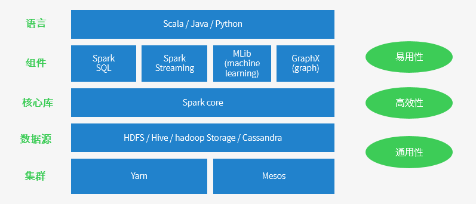


### 1.1.2 Spark 与 Hadoop

1. **Hadoop 缺点**
   * 表达能力有限，计算都必须转成 Map 和 Reduce 两个操作，并不适合所有的情况，难以描述复杂的数据处理过程
   * 磁盘 IO 开销大，每次执行时都需要从磁盘读取数据，并且在计算完成后需要将中间结果写入到磁盘中，IO 开销过大
   * 延迟高，一次计算可能需要分解成一系列按照循序执行的 MR 任务，任务之间的衔接涉及 IO 开销，会产生较高的延迟
2. **Spark 优点**
   * Spark 计算模式也属于 MR，但是不局限于 Map 和 Reduce 操作，还提供了多种数据集操作类型，编程模型比 MR 更加灵活
   * Spark 提供了内存计算，并将计算数据、中间数据都保存在内存中，大大减少了 IO 开销，带来了更高的迭代运算效率
   * Spark 基于 DAG 的任务调度执行机制，要优于 MR 的迭代执行机制，但是 Spark 不能替代 Hadoop，主要用于替代 Hadoop 中的 MR 计算模型，它可以借助 Yarn 实现资源调度管理，借助 HDFS 实现分布式存储


## 1.2 Spark 安装部署

Spark 官网提供了 Local、Standalone、Mesos、YARN、K8s 等版本部署 Spark，它们的主要区别是：Standalone 版本的资源管理和任务调度器由 Spark 系统本身负责，其他版本的资源管理和任务调度器则依赖于第三方框架，如 YARN 可以同时管理 Spark 任务和 Hadoop MR 任务。

### 1.2.1 Local 模式

1. **解压缩文件**

   * 上传 Spark 安装包到 hadoop102 的 `/opt/software/` 目录下
   * 解压 Spark 到 `/opt/module/`目录：`tar -xvf spark-3.1.3-bin-hadoop3.2.tar -C /opt/module/`

2. **启动 Local 环境**

   * 进入解压缩目录，执行命令行工具脚本：`bin/spark-shell`
   * 启动成功后，可在浏览器中访问 Web UI 监控页面：hadoop102:4040

3. **命令行工具**

   * 在 $SPARK_HOME/data 目录下，新建单词统计文件：`vim word.txt`

     ```txt
     hello spark
     hello hadoop
     hello spark
     ```

   * 在脚本执行的命令行中执行单词统计：`sc.textFile("data/word.txt").flatMap(_.split(" ")).map((_, 1)).reduceByKey(_+_).collect`

4. **提交应用**

   * 退出命令行脚本，尝试提交计算 PI 的示例程序：`bin/spark-submit --class org.apache.spark.examples.SparkPi --master local[2] ./examples/jars/spark-examples_2.12-3.1.3.jar 10`


### 1.2.2 Standalone 模式

1. **配置集群**

   * 集群部署规划：

     |       | hadoop102      | hadoop103 | hadoop104 |
     | ----- | -------------- | --------- | --------- |
     | Spark | master、worker | worker    | worker    |

   * 进入 $SPARK_HOME/conf 目录，修改 slaves.template 文件名为 slaves，并添加 work 节点：`mv workers.template workers && vim workers`

     ```
     hadoop102
     hadoop103
     hadoop104
     ```

   * 修改 spark-env.sh.template 文件名为 spark-env.sh，并添加 JDK 环境变量和集群对应的 master 节点：`mv spark-env.sh.template spark-env.sh && vim spark-env.sh`

     ```shell
     export JAVA_HOME=/opt/module/jdk1.8.0_212
     SPARK_MASTER_HOST=hadoop102
     SPARK_MASTER_PORT=7077
     ```

   * 分发 spark 目录：`xsync /opt/module/spark-3.1.3-bin-hadoop3.2/`

2. **启动集群**

   * 执行脚本启动集群：`sbin/start-all.sh`
   * 查看服务器运行进程：`jpsall`
   * 浏览器中访问 master 资源监控 Web UI 监控页面：hadoop102:8080

3. **提交应用**

   * 尝试提交计算 PI 的示例程序：`bin/spark-submit --class org.apache.spark.examples.SparkPi --master spark://hadoop102:7077 ./examples/jars/spark-examples_2.12-3.1.3.jar 10`

4. **配置历史服务**

   * 修改 spark-defaults.conf.template 文件名为 spark-defaults.conf，配置日志存储路径：`mv spark-defaults.conf.template spark-defaults.conf && vim spark-defaults.conf`

     ```shell
     # 需要启动Hadoop集群，且HDFS上的directory目录需要提前存在：
     # 启动Hadoop集群后，执行创建目录命令：hadoop fs -mkdir /directory
     spark.eventLog.enabled true
     spark.eventLog.dir hdfs://hadoop102:8020/directory
     ```

   * 修改 spark-env.sh，添加日志配置：`vim spark-env.sh`

     ```shell
     # 参数依次为：WEB UI访问的端口、历史服务器日志存储路径、保存Application历史记录的个数
     export SPARK_HISTORY_OPTS="
     -Dspark.history.ui.port=18080
     -Dspark.history.fs.logDirectory=hdfs://hadoop102:8020/directory
     -Dspark.history.retainedApplications=30"
     ```

   * 分发 conf 目录：`xsync conf`

   * 重启历史服务：`sbin/stop-history-server.sh && sbin/start-history-server.sh`

   * 重新提交计算 PI 的示例程序，查看历史服务（也可从 Hadoop 执行任务页面：hadoop103:8088，选择 history 跳转）：hadoop102:18080

5. **配置高可用**

   * 集群部署规划：由于当前集群 Master 节点只有一个，所以存在单点故障问题，需要配置多个 Master 节点，一旦活跃状态的 Master 发生故障，由备用 Master 提供服务

     |       | hadoop102          | hadoop103          | hadoop104  |
     | ----- | ------------------ | ------------------ | ---------- |
     | Spark | master、worker、zk | master、worker、zk | worker、zk |

   * 启动 zk：`zk.sh start`

   * 修改 spark-env.sh，添加日志配置：`vim spark-env.sh`

     ```shell
     # 注释如下内容
     #SPARK_MASTER_HOST=hadoop102
     #SPARK_MASTER_PORT=7077
     
     # 添加如下内容
     # Master监控页面默认访问端口为8080，但是可能会和ZK冲突，所以改成8989
     SPARK_MASTER_WEBUI_PORT=8989
     export SPARK_DAEMON_JAVA_OPTS="
     -Dspark.deploy.recoveryMode=ZOOKEEPER
     -Dspark.deploy.zookeeper.url=hadoop102,hadoop103,hadoop104
     -Dspark.deploy.zookeeper.dir=/spark"
     ```

   * 分发 conf 目录：`xsync conf`

   * 重新启动集群：`sbin/stop-all.sh && sbin/start-all.sh`

   * 在 hadoop103 上，启动单独的 Master 节点：`sbin/start-master.sh`

   * 此时 hadoop103 节点 Master 处于备用状态（STANDBY）：hadoop103:8989

   * 尝试提交计算 PI 的示例程序：`bin/spark-submit --class org.apache.spark.examples.SparkPi --master spark://hadoop102:7077,hadoop103:7077 ./examples/jars/spark-examples_2.12-3.1.3.jar 10`

   * 测试 Master 宕机，jps 命令查看 hadoop102 进程，并使用 kill 命令停止 Master 进程

   * 查看 hadoop103  的 Master 资源监控 WEB UI，稍等一段时间后，Master 状态提升为活动状态（ALIVE）


### 1.2.3 YARN 模式

独立部署（Standalone）模式由 Spark 自身提供计算资源，无需其他框架提供资源。这种方式降低了和其他第三方资源框架的耦合性，独立性非常强。但是 Spark 主要是计算框架，而不是资源调度框架，本身提供的资源调度并不是它的强项，所以和其他专业的资源调度框架集成会更靠谱一些。

1. **修改配置文件**

   * 修改 Hadoop 配置文件 $HADOOP_HOME/etc/hadoop/yarn-site.xml，并分发

     ```xml
     <!-- 是否启动一个线程检查每个任务正使用的物理内存，如果超出分配值，则直接将其杀掉，默认为true -->
     <property>
     	<name>yarn.nodemanager.pmem-check-enabled</name>
     	<value>false</value>
     </property>
     <!-- 是否启动一个线程检查每个任务正使用的虚拟内存，如果超出分配值，则直接将其杀掉，默认为true -->
     <property>
         <name>yarn.nodemanager.vmem-check-enabled</name>
         <value>false</value>
     </property>
     ```

   * 修改 $SPARK_HOME/conf/spark-env.sh：`vim spark-env.sh`

     ```shell
     # 注释如下内容
     #SPARK_MASTER_WEBUI_PORT=8989
     #export SPARK_DAEMON_JAVA_OPTS=...
     
     export JAVA_HOME=/opt/module/jdk1.8.0_212
     YARN_CONF_DIR=/opt/module/hadoop-3.2.3/etc/hadoop
     ```

2. **启动 HDFS 和 Yarn 集群，并提交应用**

   * 尝试提交计算 PI 的示例程序：`bin/spark-submit --class org.apache.spark.examples.SparkPi --master yarn --deploy-mode cluster ./examples/jars/spark-examples_2.12-3.1.3.jar 10`
   * 查看 Hadoop 执行任务，从日志中可看到计算结果：hadoop103:8088

3. **配置历史服务**

   * 在原有基础上修改 conf/spark-defaults.conf：`vim spark-defaults.conf`

     ```shell
     # 注释如下内容
     #spark.eventLog.enabled true
     #spark.eventLog.dir hdfs://hadoop102:8020/directory
     spark.yarn.historyServer.address=hadoop102:18080
     spark.history.ui.port=18080
     ```

   * 重启历史服务：`sbin/stop-history-server.sh && sbin/start-history-server.sh`

   * 重新提交计算 PI 的示例程序，查看历史服务：hadoop102:18080


## 1.3 Spark 系统架构

和 Hadoop MR 类似，Spark 也采用 Master-Worker 结构，其中 Master 节点负责管理应用和任务，Worker 节点负责执行任务。

* **Master 节点上常驻 Master 进程，该进程负责管理全部的 Worker 节点**，如将 Spark 任务分配给 Worker 节点，收集 Worker 节点上任务的运行信息，监控 Worker 节点的存活状态等。
* **Worker 节点常驻 Worker 进程，该进程除了与 Master 节点通信，还负责管理 Spark 任务的执行**，如启动 Executor 执行具体的 Spark 任务，监控任务运行状态等。


启动 Spark 集群时（start-all.sh 脚本），Master 节点会启动 Master 进程，每个 Worker 节点会启动 Worker 进程。当 Master 节点接收到应用后，首先会通知 Worker 节点启动 Executor，然后分配 Spark 计算任务（task）到 Executor 上执行，Executor 接收到 task 后，为每个 task 启动一个线程来执行。

* **Spark application**：**即 Spark 应用，指的是一个可运行的 Spark 程序**，如 WordCount.scala，该程序包含 main() 函数，其数据处理流程一般先从数据源读取数据，再处理数据，最后输出结果。同时，应用程序也包含了一些配置参数，如需要占用的 CPU 个数、Executor 内存大小等。
* **Spark Driver**：**即 Spark 驱动程序，指实际在运行 Spark 应用中 main() 函数的进程**，图中运行在 Master 节点上的 Spark 应用程序（通常由 SparkSubmit 脚本产生）就是 Spark Driver，**Driver 独立于 Master 进程，如果是 YARN 集群，那么 Driver 也可能被调度到 Worker 节点上运行**。
* **Executor**：**即 Spark 执行器，是 Spark 计算资源的一个单位**。Spark 先以 Executor 为单位占用集群资源，然后将具体的计算任务分配给 Executor 执行，**Executor 在物理上是一个 JVM 进程，可以运行多个线程（计算任务）**。在 Standalone 版本中，启动 Executor 实际上是启动了一个名为 CoarseGrainedExecutorBackend 的 JVM 进程。
* **Task**：**即 Spark 应用的计算任务，Driver 在运行 Spark 应用的 main() 函数时，会将应用拆分为多个计算任务，然后分配给多个 Executor 执行。task 是 Spark 中最小的计算单位，不能再拆分，它以线程的方式运行在 Executor 进程中，执行具体的计算任务**，如 map 算子、reduce 算子等。由于 Executor 可以配置多个 CPU，而一个 task 一般使用一个 CPU，因此当 Executor 具有多个 CPU 时，可以运行多个 task。Executor 的总内存大小由用户配置，且由多个 task 共享。

在 Hadoop MR 中，每个 map/reduce task 以一个 Java 进程运行，这种方式优点是 task 之间相互独立，每个 task 独享进程资源，不会相互干扰，且监控管理比较方便，缺点是 task 之间不方便共享数据，且效率较低。**为了数据共享和提供执行效率，Spark 采用以线程为最小执行单位，缺点是线程间会有资源竞争，且 Executor JVM 日志会包含多个并行 task 日志，较为混乱**。

* 每个 Worker 进程上存在一个或多个 ExecutorRunner 对象，每个 ExecutorRunner 对象管理一个 Executor，Executor 持有一个线程池，每个线程执行一个 task。
* Worker 进程通过持有 ExecutorRunner 对象来控制 CoarseGrainedExecutorBackend 进程的启停。
* 每个 Spark 应用启动一个 Driver 和多个 Executor，每个 Executor 里面运行的 task 都属于同一个 Spark 应用。


# 2. Spark 逻辑处理流程

Spark 在运行应用前，首先需要将应用程序转化为逻辑处理流程（Logical Plan），该流程主要包括四个部分：

1. **数据源**：即原始数据，可以存放在本地文件系统和分布式文件系统，也可以是内存数据结构，还可以是网络流
2. **数据模型**：对输入/输出、中间数据进行抽象表示，使得程序能够识别处理。Hadoop MR 将其抽象为 <K, V> record，这种方式优点是简单易操作，缺点是过于细粒度，只能使用 map(K, V) 这样固定的形式处理数据，而无法使用类似面向对象的灵活数据处理方式。Spark 认识到这个缺点，将其抽象为统一的数据模型 RDD，它可以包含各种类型的数据，如 Int、Double、<K, V> record 等
3. **数据操作**：Spark 将数据操作分为两种，**transformation() 操作（转换算子）和 action() 操作（行动算子**），两者的区别是行动算子一般是对结果数据进行后处理，产生输出结果，且**会触发 Spark 提交 job 真正执行数据处理任务**
4. **计算结果处理**：分为两种方式，一种是直接将计算结果存放到分布式文件系统中，另一种是需要在 Driver 端进行集中计算

## 2.1 RDD

Spark 计算框架为了能够进行高并发和高吞吐的数据处理，封装了三大数据结构，用于处理不同的应用场景，它们分别是：**RDD（弹性分布式数据集）、累加器（分布式共享只写变量）、广播变量（分布式共享只读变量）**。RDD（Resilient Distributed Dataset）全称弹性分布式数据集 ，它是 Spark 中最基本的数据处理模型，代码中是一个抽象类，表示一个弹性的、不可变、可分区、可并行计算的集合。

* 弹性：内存与磁盘可自动切换（存储的弹性）、数据丢失可自动恢复（容错的弹性）、计算出错重试机制（计算的弹性）、可根据需要重新分片（分片的弹性）
* 分布式：数据存储在大数据集群不同节点上，RDD 可以包含多个数据分区，不同数据分区可以由不同任务（task）在不同节点进行处理
* 数据集：RDD 封装了计算逻辑，并不保存数据，**RDD 中的数据只会在计算中产生，在计算完成后就会消失**
* 不可变：**RDD 是不可以改变的，若要改变只能产生新的 RDD**，在新的 RDD 里面封装计算逻辑

```scala
// 在RDD内部，有五个主要属性/方法
abstract class RDD[T: ClassTag](
    @transient private var _sc: SparkContext,
    @transient private var deps: Seq[Dependency[_]]
  ) extends Serializable with Logging {
    // 1.分区列表：用于执行任务时并行计算，是实现分布式计算的重要属性
  	protected def getPartitions: Array[Partition]
    // 2.分区计算函数：Spark在计算时，使用分区函数对每个分区进行计算
  	@DeveloperApi
  	def compute(split: Partition, context: TaskContext): Iterator[T]
    // 3.RDD之间的依赖关系：RDD是计算模型的封装，当需要多个计算模型组合时，就需要将多个RDD建立依赖关系
  	protected def getDependencies: Seq[Dependency[_]] = deps
    // 4.分区器（可选）：当数据为KV类型数据时，可通过设定分区器自定义数据的分区
  	@transient val partitioner: Option[Partitioner] = None
    // 5.首选位置（可选）：计算数据时，可根据计算节点的状态选择不同的节点进行计算
    protected def getPreferredLocations(split: Partition): Seq[String] = Nil
    
    // ...
}
```


### 2.1.1 RDD 创建

```xml
<dependency>
    <groupId>org.apache.spark</groupId>
    <artifactId>spark-core_2.13</artifactId>
    <version>3.3.0</version>
</dependency>
```

```scala
// RDD的创建方式主要有四种
// 1.从集合中创建，Spark提供了两个方法：parallelize()和makeRDD()，makeRDD()底层调用parallelize()
// 2.从外部存储系统创建，包括本地文件系统、所有Hadoop支持的数据集，如HDFS、HBase等
// 3.从其他RDD创建，主要是通过一个RDD运算完后，再产生新的RDD
// 4.使用new的方式直接构造，一般由Spark框架自身使用
object RDDCreate {
    def main(args: Array[String]): Unit = {
        val sparkConf = new SparkConf().setMaster("local[*]").setAppName("RDD")
        val sparkContext = new SparkContext(sparkConf)

        val seq = Seq[Int](1, 2, 3, 4)
        val rdd1: RDD[Int] = sparkContext.parallelize(seq)
        val rdd2 = sparkContext.makeRDD(seq)
        val rdd3: RDD[String] = sparkContext.textFile("input.txt")

        rdd1.collect().foreach(println)
        rdd2.collect().foreach(println)
        rdd3.collect().foreach(println)

        sparkContext.stop()
    }
}
```


### 2.1.2 RDD 依赖关系

RDD 数据依赖关系分为两大类：**窄依赖（NarrowDependency）、宽依赖（ShuffleDependency）**。如果 parent RDD 的一个或者多个分区中的数据需要**全部流入**child RDD 的某一个或者多个分区，则是窄依赖；如果 parent RDD 分区中的数据需要**一部分流入** child RDD 的某一个分区，**另外一部分流入** child RDD 的另外分区，则是宽依赖。

另外，窄依赖可以进一步细分为四种依赖，注意，多对一依赖和多对多依赖实际上在 Spark 代码中并没有这两种依赖的命名，只是统称为窄依赖，这里仅用于区分不同种类的依赖关系。

1. **一对一依赖（OneToOneDependency）**：一对一依赖表示 child RDD 和 parent RDD 中的分区个数相同，并存在一一映射关系，如 map()、fliter() 等
2. **区域依赖（RangeDependency）**：表示 child RDD 和 parent RDD 的分区经过区域化后存在一一映射关系，如 union() 等
3. **多对一依赖（ManyToOneDependency**）：表示 child RDD 中的一个分区同时依赖多个 parent RDD 中的分区，如 cogroup() 、join() 等
4. **多对多依赖（ManyToManyDependency）**：表示 child RDD 中的一个分区依赖 parent RDD 中的多个分区，同时 parent RDD 中的一个分区被 child RDD 中的多个分区依赖，如 cartesian() 等


### 2.1.3 RDD 分区方法

RDD 常用的分区方法（Partitioner）包括三种：水平划分、Hash 划分（HashPartitioner）和 Range 划分（RangePartitioner）。

1. **水平划分**：**按照 record 的索引进行划分**。如经常使用的 sparkContext.parallelize(list(1, 2, 3, 4, 5, 6, 7, 8, 9), 3)， 就是按照元素的下标划分，(1, 2, 3) 为一组，(4, 5, 6) 为一组，(7, 8, 9) 为一组。
2. **Hash划分（HashPartitioner）**：**使用 record 的 Hash 值来对数据进行划分，常被用于数据Shuffle阶段**，该划分方法的好处是只需要知道分区个数，就能将数据确定性地划分到某个分区。在水平划分中，由于每个 RDD 中的元素数目和排列顺序不固定，同一个元素在不同 RDD 中可能被划分到不同分区。而使用 HashPartitioner，可以根据元素的 Hash 值，确定性地得出该元素的分区。
3. **Range划分（RangePartitioner）**：**一般适用于排序任务，核心思想是按照元素的大小关系将其划分到不同分区，每个分区表示一个数据区域**。如对一个数组进行排序，数组里每个数字是 [0, 100] 中的随机数，Range 划分首先将上下界 [0, 100] 划分为若干份（如 10 份），然后将数组中的每个数字分发到相应的分区，如将 18 分发到 (10, 20] 的分区，最后对每个分区进行排序，这个排序过程可以并行执行，排序完成后是全局有序的结果。Range 划分需要提前划分好数据区域，因此需要统计 RDD 中数据的最大值和最小值。为了简化这个统计过程，Range 划分经常采用抽样方法来估算数据区域边界。


### 2.1.4 RDD 转换算子

1. **map() 和 mapValues()**

   * rdd1.map(func)：使用 func 对 rdd1 中的每个 record 进行处理，输出一个新的 record
   * rdd1.mapValues(func)：对于 rdd1 中每个 <K, V> record，**使用 func 对 value 进行处理**，得到新的 record

   和mapValues().png)

   ```scala
   val inputRDD = sc.parallelize(Array[(Int, Char)]((1, 'a'), (2, 'b'), (3, 'c'), (4, 'd'),  (2, 'e'), (3, 'f'), (2, 'g'), (1, 'h')), 3)
   
   val resultRDD1 = inputRDD.map(r => r._1 + "_" + r._2)
   resultRDD1.foreach(println)
   val resultRDD2 = inputRDD.mapValues(x => x + "_1")
   resultRDD2.foreach(println)
   ```
   
2. **filter() 和 filterByRange()**

   * rdd1.filter(func)：对 rdd1 中的每个 record 进行 func 操作，若结果为 true，则保留该 record
   * rdd1.filterByRange(lower, uppper)：对 rdd1 中的数据进行过滤，只保留 [lower, upper] 之间的 record

   和filterByRange().png)

   ```scala
   val inputRDD = sc.parallelize(Array[(Int, Char)]((1, 'a'), (2, 'b'), (3, 'c'), (4, 'd'),  (2, 'e'), (3, 'f'), (2, 'g'), (1, 'h')), 3)
   
   val resultRDD1 = inputRDD.filter(r => r._1 % 2 == 0)
   resultRDD1.foreach(println)
   val resultRDD2 = inputRDD.filterByRange(2, 4)
   resultRDD2.foreach(println)
   ```
   
3. **flatMap() 和 flatMapValues()**

   * rdd1.flatMap(func)：对 rdd1 中的每个元素（如 list）进行 func 操作，得到新元素，然后将所有新元素组合得到 rdd2
   * rdd1.flatMapValues(lower, uppper)：只针对 rdd1 中 <K, V> record 中的 Value 进行 flatMapValues()

   和flatMapValues().png)

   ```scala
   val inputRDD1 = sc.parallelize(Array[String]("how do you do", "are you ok", "thanks", "bye bye", "I'm ok"), 3)
   val resultRDD1 = inputRDD1.flatMap(x => x.split(" "))
   resultRDD1.foreach(println)
   
   val inputRDD2 = sc.parallelize(Array[(Int, String)]((1, "how do you do"), (2, "are you ok"), (4, "thanks"), (5, "bye bye"), (2, "I'm ok")), 3)
   val resultRDD2 = inputRDD2.flatMapValues(x => x.split(" "))
   resultRDD2.foreach(println)
   ```
   
4. **sample() 和 sampleByKey()**

   * rdd1.sample(withReplacement, fraction, seed)：对 rdd1 中的数据进行抽样，取其中 fraction * 100% 的数据，withReplacement = true 表示有放回的抽象，seed 表示随机数种子
   * rdd1.sampleByKey(withReplacement, fraction, seed)：对 rdd1 中的数据进行抽样，**它与 sample() 区别是，可以为每个 Key 设定被抽取的概率**

   sample(false) 与 sample(true) 的区别是，**前者使用伯努利抽样，也就是每个 record 有 fraction * 100% 的概率被选中，而后者使用泊松分布抽样，抽样得到的 record 个数可能大于 rdd1 中的 record 个数**。

   .png)

   ```scala
   val inputRDD1 = sc.parallelize(List((1, 'c'), (1, 'f'), (1, 'a'), (1, 'd'), (1, 'd'), (2, 'h'), (2, 'h'), (2, 'h'), (2, 'b'), (2, 'e'), (2, 'g')), 3)
   val resultRDD1 = inputRDD1.sample(true, 0.5)
   val resultRDD2 = inputRDD1.sample(false, 0.5)
   resultRDD1.foreach(println)
   resultRDD2.foreach(println)
   
   val inputRDD2 = sc.parallelize(List((1, 'c'), (1, 'f'), (1, 'a'), (1, 'd'), (1, 'd'), (2, 'h'), (2, 'h'), (2, 'h'), (2, 'b'), (2, 'e'), (2, 'g')), 3)
   // 通过Map设定在每个分区中，key=1的数据被抽取80%，key=2的数据被抽取50%
   val map = Map(1 -> 0.8, 2 -> 0.5)
   val resultRDD3 = inputRDD2.sampleByKey(true, map)
   val resultRDD4 = inputRDD2.sampleByKey(false, map)
   resultRDD3.foreach(println)
   resultRDD4.foreach(println)
   ```
   
5. **mapPartitions() 和 mapPartitionsWithIndex()**

   * rdd1.mapPartitions(func)：对 rdd1 中的每个分区进行 func 操作，它与 map() 的区别如下：

     * 数据处理角度：map 算子是分区内**一个个数据的执行，类似于串行操作**；而 mapPartitions 算子是**以分区为单位进行批处理操作**。

     和mapPartitions().png)

     * 功能角度：map 算子主要目的将数据源中的数据进行转换和改变，但是**不会减少或增多数据**；mapPartitions 算子需要传递一个迭代器，返回一个迭代器，没有要求元素的个数保持不变， 所以**可以增加或减少数据**
     * 性能角度：map 算子因为类似于串行操作，所以**性能比较低**，而 mapPartitions 算子类似于批处理，所以**性能较高**，但是 mapPartitions 算子**会长时间占用内存**，导致内存可能不够用，出现内存溢出的错误，所以**在内存有限的情况下，不推荐使用，而应使用 map 操作**。

   * rdd1.mapPartitionsWithIndex(func)：与 mapPartitions() 基本相同，只是分区中的数据带有索引（表示 record 属于哪个分区）

   和mapPartitionsWithIndex().png)

   ```scala
   val inputRDD = sc.parallelize(List(1, 2, 3, 4, 5, 6, 7, 8, 9), 3)
   val resultRDD2 = inputRDD.mapPartitionsWithIndex((pid, iter) => {
       // 计算每个分区中奇数的和与偶数的和
       var result = List[String]()
       var odd = 0
       var even = 0
   
       while (iter.hasNext) {
           val value = iter.next()
           if (value % 2 == 0) {
               even += value
           } else {
               odd += value
           }
       }
   
       result = result :+ "pid = " + pid + ", odd = " + odd
       result = result :+ "pid = " + pid + ", odd = " + even
       result.iterator
   })
   resultRDD2.foreach(println)
   ```

6. **partitionBy()**

   * rdd1.partitionBy(partitioner)：使用新的 partitioner 对 rdd1 进行重新分区，partitioner 可以是 HashPartitioner、RangePartitioner 等，要求 rdd1 是 <K, V> 类型

   .png)

   ```scala
   val inputRDD = sc.parallelize(Array[(Int, Char)]((1, 'a'), (2, 'b'), (3, 'c'), (4, 'd'), (2, 'e'), (3, 'f'), (2, 'g'), (1, 'h')), 3)
   val resultRDD1 = inputRDD.partitionBy(new HashPartitioner(2))
   val resultRDD2 = inputRDD.partitionBy(new RangePartitioner(2, inputRDD))
   resultRDD1.foreach(println)
   resultRDD2.foreach(println)
   ```

7. **groupByKey()**

   * rdd1.groupByKey(numPartitions)：将 rdd1 中的每个 <K, V> record 按照 Key 聚合在一起，形成 <K, list(V)>（实际是<K, CompactBuffer(V)>），numPartitions 表示新生成的 rdd2 分区个数，若不指定则默认为 parentRDD 的分区个数

   左图 rdd1 和 rdd2 的分区器不同，rdd1 水平划分且分区数为 3，而 rdd2 是 Hash 划分（**groupByKey() 默认使用 Hash 划分**）且分区个数为 2，**需要使用 ShuffleDependency 对数据进行重新分配**。右图 rdd1 已经提前使用 Hash 划分进行了分区，且设定 groupByKey() 生成的 RDD 分区数与 rdd1 一致，那么只需要在每个分区中进行 groupByKey() 操作，不需要使用 ShuffleDependency。

   .png)

   ```scala
   val inputRDD = sc.parallelize(Array[(Int, Char)]((2, 'b'), (3, 'c'), (1, 'a'), (4, 'd'), (5, 'e'), (3, 'f'), (2, 'b'), (1, 'h'), (2, 'i')), 3)
   val resultRDD1 = inputRDD.groupByKey(2)
   val resultRDD2 = inputRDD.partitionBy(new HashPartitioner(3))
   val resultRDD3 = resultRDD2.groupByKey(3)
   resultRDD1.foreach(println)
   resultRDD3.foreach(println)
   ```

8. **reduceByKey()**

   * rdd1.reduceByKey(func, numPartitions)：与 groupByKey() 类似，也是将 rdd1 具有相同 Key 的 record 聚合在一起，不同的是在聚合过程中，使用 func 对这些 record 的 value 进行融合计算

   与 groupByKey() 不同，reduceByKey() 实际包含两步聚合。第一步，**在 ShuffleDependency 之前对每个分区的数据进行一个本地化的 combine() 聚合操作**（也称为mini-reduce 或 map 端combine()），这一步由 Spark 自动完成，并不形成新的 RDD，**减少了数据传输量和内存用量，效率比 groupByKey() 高**。第二步，reduceByKey() 生成新的 ShuffledRDD，**将来自 rdd1 中不同分区且具有相同 key 的数据聚合在一起**，利用 func 进行 reduce() 聚合操作。整个过程中，**combine() 和reduce() 的计算逻辑一样，采用同一个 func**。需要注意的是，**func 需要满足交换律和结合律，因为 Shuffle 并不保证数据到达顺序**。另外，因为 ShuffleDependency 需要对 key 进行 Hash 划分，所以 key 不能是特别复杂的类型，如 Array。

   .png)

   ```scala
   val inputRDD = sc.parallelize(Array[(Int, String)]((1, "a"), (2, "b"), (3, "c"),  (4, "d"), (5, "e"), (3, "f"), (2, "g"), (1, "h"), (2, "i")), 3)
   inputRDD.reduceByKey((x, y) => x + "_" + y, 2).foreach(println)
   ```
   
9. **aggregateByKey()**

   * rdd1.aggregateByKey(zeroValue, numPartitions)(seqOp, combOp)：一个通用的聚合操作，可以看作是更一般的 reduceByKey()

   与 reduceByKey() 不同，**aggregateByKey() 将 combine() 和 reduce() 两个函数的计算逻辑分开，combine()使用 seqOp 将同一个分区中的 <K，V> record 聚合在一起，而 reduce() 使用 combOp 将经过 seqOp 聚合后的不同分区的 <K，V′ > record 进一步聚合**。另外，有时进行 reduce() 操作时需要一个初始值，而 reduceByKey() 没有初始值，因此，aggregateByKey() 还提供了一个 zeroValue 参数，来为 seqOp 提供初始值。另外，在 reduceByKey() 中，func 要求参与聚合的 record 和输出结果是同一类型，而在 aggregateByKey() 中，zeroValue 和 record 可以是不同类型，但 seqOp 的输出结果与 zeroValue 是同一类型，这在一定程度上提高了灵活性。

   .png)

   ```scala
   val inputRDD = sc.parallelize(Array[(Int, String)]((1, "a"), (2, "b"), (3, "c"), (4, "d"), (2, "e"), (3, "f"), (2, "g"), (1, "h"), (2, "i")), 3)
   inputRDD.aggregateByKey("x", 2)(_ + "_" + _, _ + "@" + _).foreach(println)
   ```

10. **combineByKey()**

    * rdd1.combineByKey(createComb, mergeValue, mergeComb, numPartitions)：通用的基础聚合操作，aggregateByKey() 和 reduceByKey() 都是通过 combineByKey() 实现的

    combineByKey() 与 aggregateByKey() 两者没有大的区别，aggregateByKey() 是基于combineByKey() 实现的，如 aggregateByKey() 中的 zeroValue 对应 combineByKey() 中的 createComb，seqOp 对应mergeValue，combOp 对应 mergeComb。**唯一的区别是 combineByKey() 的 createComb 是一个初始化函数，而 aggregateByKey() 包含的 zeroValue 是一个初始化值**，显然 createComb 函数的功能比一个固定的 zeroValue 值更强大，需要注意的是，createComb 函数**只会作用于相同 key 的第一个 record**。

    .png)

    ```scala
    val inputRDD = sc.parallelize(Array[(Int, Char)]((1, 'a'), (2, 'b'), (2, 'k'), (3, 'c'), (4, 'd'), (3, 'e'), (3, 'f'), (2, 'g'), (2, 'h')), 3)
    val resultRDD = inputRDD.combineByKey((v: Char) => {
        if (v == 'c') {
            v + "0"
        } else {
            v + "1"
        }
    }, (c: String, v: Char) => c + "+" + v, (c1: String, c2: String) => c1 + "_" + c2, 2)
    
    resultRDD.mapPartitionsWithIndex((pid, iter) => {
        iter.map(value => "pid = " + pid + ", value = " + value)
    }).foreach(println)
    ```

11. **flodByKey()**

    * rdd1.filter(zeroValue, numPartitions)(func)：**功能介于 reduceByKey() 和 aggregateByKey() 之间**，相比 reduceByKey()，foldByKey() 多了初始值 zeroValue；相比 aggregateByKey()，foldByKey() 要求seqOp=combOp=func

    .png)

    ```scala
    val inputRDD = sc.parallelize(Array[(Int, String)]((1, "a"), (2, "b"), (3, "c"), (4, "d"), (2, "e"), (3, "f"), (2, "g"), (1, "h"), (2, "i")), 3)
    inputRDD.foldByKey("x", 2)(_ + "_" + _).foreach(println)
    ```

12. **cogroup()/groupWith()**

    * rdd1.cogroup(rdd2, numPartitions)：也叫 groupWith()，将多个 RDD 中具有相同 key 的 value 聚合在一起。假设 rdd1 包含 <K, V> record，rdd2 包含 <K, W> record，则两者聚合结果为 <K, list(V), list(W)>

    与 groupByKey() 不同，cogroup() 可以将多个 RDD 聚合为一个 RDD，因此其生成的 RDD 与多个 parent RDD 存在依赖关系。一般来说，聚合关系需要 ShuffleDependency，但也存在特殊情况，**如果 child RDD 和 parent RDD 使用的分区器且分区个数相同，则没有必要使用 ShuffleDependency**，这样可以避免数据传输，提高执行效率。更为特殊的是，由于 cogroup() 可以聚合多个 RDD，因此可以对一部分 RDD 采用 ShuffleDependency，而对另一部分 RDD 采用 OneToOneDependency。

    cogroup() 最多支持 4 个 RDD 同时进行 cogroup()，如 rdd5 = rdd1.cogroup(rdd2，rdd3，rdd4)。cogroup() 实际生成了两个 RDD：CoGroupedRDD 将数据聚合在一起，MapPartitionsRDD 将数据类型转变为 CompactBuffer（类似于 Java 的 ArrayList）。当 cogroup() 聚合的 RDD 包含很多数据时，Shuffle 这些中间数据会增加网络传输，而且需要很大内存来存储聚合后的数据，效率较低。

    .png)

    ```scala
    var inputRDD1 = sc.parallelize(Array[(Int, Char)]((1, 'a'), (1, 'b'), (2, 'c'), (3, 'd'), (4, 'e'), (5, 'f')), 3)
    inputRDD1 = inputRDD1.partitionBy(new HashPartitioner(3))
    val inputRDD2 = sc.parallelize(Array[(Int, Char)]((1, 'f'), (3, 'g'), (2, 'h')), 2)
    
    inputRDD1.cogroup(inputRDD2, 3).foreach(println)
    ```

13. **join()**

    * rdd1.join(rdd2, numPartitions)：将两个 RDD 中的数据关联在一起，与 SQL 中的算子类似，join() 还有其它形式，如 leftOuterJoin()、rightOuterJoin()、fullOuterJoin() 等

    join() 操作实际建立在 cogroup() 之上，首先调用 cogroup() 生成 CoGroupedRDD 和 MapPartitionsRDD，然后计算 MapPartitionsRDD 中 [list(V), list(W)] 的笛卡儿积，生成 MapPartitionsRDD。

    .png)

    ```scala
    var inputRDD1 = sc.parallelize(Array[(Int, Char)]((1, 'a'), (1, 'b'), (2, 'c'), (3, 'd'), (4, 'e'), (5, 'f')), 3)
    inputRDD1 = inputRDD1.partitionBy(new HashPartitioner(3))
    var inputRDD2 = sc.parallelize(Array[(Int, Char)]((1, 'A'), (3, 'B'), (2, 'C'), (2, 'D'), (2, 'E')), 3)
    // inputRDD2 = inputRDD2.partitionBy(new HashPartitioner(3))
    
    inputRDD1.join(inputRDD2, 3).foreach(println)
    ```

14. **cartesian()**

    * rdd1.cartesian(rdd2)：计算两个 RDD 的笛卡尔积，若 rdd1 有 m 个分区，rdd2 有 n 个分区，则操作会生成 m * n 个分区，rdd1 和 rdd2 中的分区两两组合

    cartesian() 操作生成的数据依赖关系虽然比较复杂，但归属于多对多的 NarrowDependency，并不是 ShuffleDependency。

    .png)

    ```scala
    // cartesian()生成的数据依赖虽然比较复杂，但归属于多对多的NarrowDependency
    val inputRDD1 = sc.parallelize(Array[(Int, Char)]((1, 'a'), (2, 'b'), (3, 'c'), (4, 'd')), 2)
    val inputRDD2 = sc.parallelize(Array[(Int, Char)]((1, 'A'), (2, 'B')), 2)
    inputRDD1.cartesian(inputRDD2).foreach(println)
    ```

15. **sortByKey()**

    * rdd1.sortByKey(asc, numPartitions)：对 rdd1 中 <K, V> record 按照 key 进行排序（默认升序），若 key 相同，并不对 value 进行排序，即此时 value 是无序的

    与 reduceByKey() 等操作使用 Hash 划分来分发数据不同，sortByKey() 为了保证生成的 RDD 数据是全局有序（按照 key 排序），采用 Range 划分来分发数据。**Range 划分可以保证在生成的 RDD 中，partition1 中的所有 record 的 key 小于（或大于）partition2 中所有的 record 的 key**。

    **如何使得 value 也是有序的？**在 Hadoop MapReduce 中，可以使用 SecondarySort 方法，也就是通过将 value 放到 key 中， 并重新定义 key 的排序函数来达到同时排序 key 和 value 的目的。在 Spark 中有两种方法：第一种方法是像 Hadoop MapReduce 一样使用 SecondarySort，首先使用 map() 操作进行 <key，value> => <(key, value)，null>，然后将 (key, value) 定义为新的 class， 并重新定义其排序函数compare()，最后使用 sortByKey() 进行排序 ，只输出 key 即可。第二种方法是先使用 groupByKey() 将数据聚合成 <key, list(value)>，然后再使用 rdd.mapValues(sortfunction) 操作对 list(value) 进行排序。

    .png)

    ```scala
    val inputRDD = sc.parallelize(Array[(Char, Int)](('D', 2), ('B', 4), ('C', 3), ('A', 5), ('B', 2), ('C', 1), ('C', 3), ('A', 4)), 3)
    val resultRDD = inputRDD.sortByKey(true, 2)
    
    resultRDD.mapPartitionsWithIndex((pid, iter) => {
        iter.map(value => "pid = " + pid + ", value = " + value)
    }).foreach(println)
    ```

16. **sortBy()**

    * rdd1.sortBy(func)：基于 func 的计算结果，对 rdd1 中的 record 进行排序。它与 sortByKey() 不同的是， sortByKey() 要求 RDD 是 <K, V> 类型，且根据 key 进行排序，而 sortBy() 不对 RDD 类型作要求

    **sortBy(func) 基于 sortByKey() 实现**，若要对 rdd1 中的 <K, V> record 按照 value 进行排序， 那么设计的排序函数 func 为 record=>record._2，首先将 rdd1 中每个 record 转化为 <V, (K, V)> record，如将 (D, 2) 转化为 <2, (D, 2)>，然后利用 sortByKey() 对转化后的 record 进行排序，最后只保留第二项，即可得到排序后的 record。

    .png)

    ```scala
    val inputRDD = sc.parallelize(Array[(Char, Int)](('D', 2), ('B', 4), ('C', 3), ('A', 5), ('B', 2), ('C', 1), ('C', 3), ('A', 4)), 3)
    val resultRDD = inputRDD.sortBy(record => record._2, true, 2)
    
    resultRDD.mapPartitionsWithIndex((pid, iter) => {
        iter.map(value => "pid = " + pid + ", value = " + value)
    }).foreach(println)
    ```

17. **coalesce()**

    * rdd1.coalesce(numPartitions, shuffle)：将 rdd1 的分区个数降低或升高为 numPartitions
      * 减少分区个数：rdd1 分区个数为 5 ，当使用 coalesce(2) 减少为两个分区时，Spark 将相邻的分区直接合并在一起，形成的数据依赖关系是多对一的 NarrowDependency。这种方法的缺点是，当 rdd1 中不同分区中的数据量差别较大时， 直接合并**容易造成数据倾斜**。
      * 增加分区个数：当使用 coalesce(6)  将 rdd1 的分区个数增加为 6 时，会发现生成的 rdd2 的**分区个数并没有增加** ，还是 5。这是因为 coalesce() 默认使用 NarrowDependency，不能将一个分区拆分为多份。
      * 使用 Shuffle 来减少分区个数：为了**解决数据倾斜的问题**，可以使用 coalesce(2, true) 来减少 RDD 的分区个数。使用 Shuffle=true 后，Spark 可以随机将数据打乱，从而使得生成的 RDD 中每个分区中的数据比较均衡。具体采用的方法是为 rdd1 中的每个 record 添加一个特殊的 key，这样，Spark 可以根据 key 的 Hash 值将 rdd1 中的数据分发到 rdd2 的不同的分区中，然后去掉 key 即可。
      * 使用 Shuffle 来增加分区个数：通过使用 ShuffleDepedency，可以对分区进行拆分和重新组合，**解决分区不能增加的问题**。

    .png)

    打乱.png)

    ```scala
    val inputRDD = sc.parallelize(Array[(Int, Char)]((3, 'c'), (3, 'f'), (1, 'a'), (4, 'd'), (1, 'h'), (2, 'b'), (5, 'e'), (2, 'g')), 5)
    inputRDD.coalesce(2).foreach(println)
    inputRDD.coalesce(6).foreach(println)
    inputRDD.coalesce(2, true).foreach(println)
    inputRDD.coalesce(6, true).foreach(println)
    ```

18. **repartition() 和 repartitionAndSortWithinPartitions()**

    * rdd1.repartition(numPartitions)：将 RDD 中的数据进行重新分区，语义与 coalesce(numPartitions, **true**) 一致
    * rdd1.repartitionAndSortWithinPartitions(numPartitions)：与 repartition() 操作类似，不同的是，**它可以灵活使用各种分区器，而且对于结果 RDD 中的每个分区，对其中的数据按照 key 进行排序**，该操作比 repartition() + sortByKey() 效率高。由于它可定义分区器，不一定是 sortByKey() 默认的 RangePartitioner，因此其得到的**结果不能保证 key 全局有序**

    .png)

    ```scala
    val inputRDD = sc.parallelize(Array[(Char, Int)](('D', 2), ('B', 4), ('C', 3), ('A', 5), ('B', 2), ('C', 1), ('C', 3), ('A', 4)), 3)
    val resultRDD = inputRDD.repartitionAndSortWithinPartitions(new HashPartitioner(2))
    
    resultRDD.mapPartitionsWithIndex((pid, iter) => {
        iter.map(value => "pid = " + pid + ", value = " + value)
    }).foreach(println)
    ```

19. **intersection()**

    * rdd1.intersection(rdd2)：求交集，将 rdd1 和 rdd2 中共同的元素抽取出来

    **intersection() 的核心思想是先利用 cogroup() 将 rdd1 和 rdd2 的相同 record 聚合在一起，然后过滤出在 rdd1 和 rdd2 中都存在的 record**。具体方法是先将 rdd1 中的 record 转化为 <K, V> 类型 ，V 为固定值 null，然后将 rdd1 和 rdd2 中的 record 聚合在一起，过滤掉出现 () 的 record，最后只保留 key，得到交集元素。

    .png)

    ```scala
    val inputRDD1 = sc.parallelize(List(2, 2, 3, 4, 5, 6, 8, 6), 3)
    val inputRDD2 = sc.parallelize(List(2, 3, 6, 6), 2)
    inputRDD1.intersection(inputRDD2).foreach(println)
    ```

20. **union()**

    * rdd1.union(rdd2)：将 rdd1 和 rdd2 中的元素合并在一起

    若 rdd1 和 rdd2 是两个非空的 RDD，且两者的分区器或分区个数不一致，则合并后的 rdd3 为 UnionRDD，其**分区个数是 rdd1 和 rdd2 的分区个数之和**，rdd3 的每个分区也一一对应 rdd1 或 rdd2 中相应的分区。若 rdd1 和 rdd2 是两个非空的 RDD，且两者分区器和分区个数都相同，则合并后的 rdd3 为 PartitionerAwareUnionRDD，其**分区个数与 rdd1 和 rdd2 的分区个数相同**，rdd3 中每个分区的数据是 rdd1 和 rdd2 对应分区合并后的结果。

    .png)

    ```scala
    val inputRDD1 = sc.parallelize(List(2, 2, 3, 4, 5, 6, 8, 6), 3)
    val inputRDD2 = sc.parallelize(List(2, 3, 6, 6), 2)
    val resultRDD1 = inputRDD1.union(inputRDD2)
    resultRDD1.mapPartitionsWithIndex((pid, iter) => {
        iter.map(value => "pid = " + pid + ", value = " + value)
    }).foreach(println)
    
    var inputRDD3 = sc.parallelize(Array[(Int, Char)]((1, 'a'), (2, 'b'), (3, 'c'), (4, 'd'), (5, 'e'), (3, 'f'), (2, 'g'), (1, 'h'), (2, 'i')), 3)
    var inputRDD4 = sc.parallelize(Array[(Int, Char)]((1, 'A'), (2, 'B'), (3, 'C'), (4, 'D'), (6, 'E')), 2)
    inputRDD3 = inputRDD3.repartitionAndSortWithinPartitions(new HashPartitioner(3))
    inputRDD4 = inputRDD4.repartitionAndSortWithinPartitions(new HashPartitioner(3))
    val resultRDD2 = inputRDD3.union(inputRDD4)
    resultRDD2.mapPartitionsWithIndex((pid, iter) => {
        iter.map(value => "pid = " + pid + ", value = " + value)
    }).foreach(println)
    ```

21. **subtractByKey() 和 subtract()**

    * rdd1.subtractByKey(rdd2)：计算出 **key** 在 rdd1 中，而不在 rdd2 中的 record
    * rdd1.subtract(rdd2)：计算在 rdd1 中，而不在 rdd2 中的 record，可以针对非 <K, V> 类型的 RDD

    subtractByKey() 操作首先将 rdd1 和 rdd2 中的 <K,V > record 按 key 聚合在一起，得到 SubtractedRDD，该过程类似 cogroup() 。然后，只保留 [(a), (b)] 中 b 为 () 的 record，从而得到在 rdd1 中而不在 rdd2 中的元素。SubtractedRDD 结构和数据依赖模式都类似于 CoGroupedRDD，可以形成 OneToOneDependency 或者 ShuffleDependency，但实现比 CoGroupedRDD 更高效。

    **subtract() 的底层实现基于 subtractByKey()** ，先将 rdd1 和 rdd2 表示为 <K,V > record，V 为固定值 null，然后按照 key 将这些 record 聚合在一起得到 SubtractedRDD，只保留 [(a), (b)] 中b为() 的 record，从而得到在 rdd1 中但不在 rdd2 中的 record。

    .png)

    .png)

    ```scala
    val inputRDD1 = sc.parallelize(Array[(Int, Char)]((3, 'c'), (3, 'f'), (5, 'e'), (4, 'd'), (1, 'h'), (2, 'b'), (5, 'e'), (2, 'g')), 3)
    val inputRDD2 = sc.parallelize(
        Array[(Int, Char)]((1, 'A'), (2, 'B'), (3, 'C'), (4, 'D'), (6, 'E')), 2)
    inputRDD1.subtractByKey(inputRDD2).foreach(println)
    
    val inputRDD3 = sc.makeRDD(List(1, 2, 3, 3, 4, 2, 1, 5, 6), 3)
    val inputRDD4 = sc.makeRDD(List(1, 2, 3, 4, 10), 2)
    inputRDD3.subtract(inputRDD4).foreach(println)
    ```

22. **distinct()**

    * rdd1.distinct(numPartitions)：去重操作，将 rdd1 中的数据进行去重

    与 intersection() 操作类似，distinct() 操作先将数据转化为 <K, V> 类型，其中 V 为固定值 null ，然后使用 reduceByKey() 将这些 record 聚合在一起，最后使用 map() 只输出 key 就可以得到去重后的元素。

    .png)

    ```scala
    val inputRDD = sc.parallelize(List(1, 2, 2, 3, 2, 1, 4, 3, 4), 3)
    inputRDD.distinct(2).foreach(println)
    ```

23. **zip() 和 zipPartitions()**

    * rdd1.zip(rdd2)：将 rdd1 和 rdd2 中的**元素**按照一一对应关系（像拉链一样）连接在一起，构成 <K, V> record，K 来自 rdd1，V 来自 rdd2。该操作**要求 rdd1 和 rdd2 的分区个数相同，且每个分区包含的元素个数相等**
    * rdd1.zipPartitions(rdd2)：将 rdd1 和 rdd2 中的**分区**按照一一对应关系连接在一起，结果 RDD 的每个分区中的数据为 <list(records from rdd1), list(records from rdd2)>，然后可以自定义函数 func 对这些 record 进行处理。该操作**要求 rdd1 和 rdd2 的分区个数相同，但不要求每个分区包含的元素个数相同**

    zipPartitions() 最多可以同时连接 4 个 rdd，如 rdd5 = rdd1.zipPartitions(rdd2, rdd3, rdd4)。它还有一个参数是 preservePartitioning，其默认值为 false，意即 zipPartitions() 生成的 rdd 继承 parent RDD 的分区器，因为继承分区器可以提升后续操作的执行效率（如避免 Shuffle 阶段）。假设 rdd1 和 rdd2 的分区器都为 HashPartitioner(3)，那么 preservePartitioning=true，表示 rdd3 的分区器仍为 HashPartitioner(3)；**如 果 preservePartitioning=false，那么 rdd3 的分区器为 None，也就是 rdd3 被 Spark 认为是随机划分的**。

    .png)

    .png)

    ```scala
    val inputRDD1 = sc.parallelize(1 to 8, 3)
    val inputRDD2 = sc.parallelize('a' to 'h', 3)
    inputRDD1.zip(inputRDD2).foreach(println)
    
    val inputRDD3 = sc.parallelize(Array[(Int, Char)]((1, 'a'), (1, 'b'), (2, 'c'), (3, 'd'), (4, 'e'), (5, 'f')), 3)
    val inputRDD4 = sc.parallelize(Array[(Int, Char)]((1, 'f'), (3, 'g'), (2, 'h'), (4, 'i')), 3)
    inputRDD3.zipPartitions(inputRDD4)({
        (rdd1Iter, rdd2Iter) => {
            var result = List[String]()
            while (rdd1Iter.hasNext && rdd2Iter.hasNext) {
                result ::= rdd1Iter.next() + "_" + rdd2Iter.next()
            }
            result.iterator
        }
    }).foreach(println)
    ```

24. **zipWithIndex() 和 zipWithUniqueId()**

    * rdd1.zipWithIndex()：对 rdd1 中的数据进行编号，编号方式从 0 开始按序递增（跨分区）
    * rdd1.zipWithUniqueId()：对 rdd1 中的数据进行编号，编号方式为 round-robin，不可以轮空

    和zipWithUniqueId().png)

    ```scala
    val inputRDD = sc.parallelize(Array[(Int, Char)]((1, 'a'), (1, 'b'), (2, 'c'), (3, 'd'), (4, 'e'), (5, 'f'), (6, 'g')), 3)
    inputRDD.zipWithIndex().foreach(println)
    // 编号6、7分别分配给了partition1和partition2，但由于这两个分区没有了record，因此这两个编号作废
    inputRDD.zipWithUniqueId().foreach(println)
    ```

25. **glom()**

    * rdd1.glom()：将 rdd1 中每个分区的 record 合并到一个 list 中

    .png)

    ```scala
    val inputRDD = sc.parallelize(Array[(Int, Char)]((1, 'a'), (2, 'b'), (3, 'c'), (4, 'd'), (2, 'e'), (3, 'f'), (2, 'g'), (1, 'h')), 3)
    val result = inputRDD.glom()
    result.foreach(e => println(e.mkString("Array(", ", ", ")")))
    ```


### 2.1.5 RDD 行动算子

1. **count()、countByKey() 和 countByValue()**

   * rdd1.count()：统计 rdd1 中包含的 record 个数，返回一个 long 类型
   * rdd1.countByKey()：统计 rdd1 中每个 key 出现的次数，返回一个 Map，要求 rdd1 是 <K, V> 类型
   * rdd1.countByValue()：统计 rdd1 中每个 record 出现的次数，返回一个 Map

   count() 操作首先计算每个分区中 record 的数目，然后**在 Dirver 端**进行累加操作，得到最终结果。countByKey() 操作只统计每个 key 出现的次数，因此首先利用 mapValues() 操作将 <K, V> record 的 V 设置为 1（去掉原有的 V），然后利用 reduceByKey() 统计每个 key 出现的次数，最后汇总到 Driver 端，形成Map。countByValue() 操作统计每个 record 出现的次数，先将 record 变为 <record, null> 类型，这样转化是为了接下来使用 reduceByKey() 得到每个 record 出现的次数，最后汇总到 Driver 端，形成Map。

   .png)

   和countByValue().png)

   ```scala
   val inputRDD = sc.parallelize(Array[(Int, Char)]((3, 'c'), (3, 'f'), (5, 'e'), (4, 'd'), (1, 'h'), (2, 'b'), (5, 'e'), (2, 'g')), 3)
   
   println(inputRDD.count())
   println(inputRDD.countByKey())
   println(inputRDD.countByValue())
   ```

2. **collect() 和 collectAsMap()**

   * rdd1.collect()：将 rdd1 中的 record 收集到 Driver 端
   * rdd1.collectAsMap()：将 rdd1 中的 <K, V> record 收集到 Driver 端，得到 <K, V> Map

   在数据量较大时，两者都会造成 Driver 端大量内存消耗，需要注意内存用量。

3. **foreach() 和 foreachPartition()**

   * rdd1.foreach(func)：将 rdd1 中的每个 record 按照 func 进行处理
   * rdd1.foreachPartition(func)：将 rdd1 中的每个分区中的数据按照 func 进行处理

   foreach() 和 foreachPartition() 的关系类似于 map() 和 mapPartitions() 的关系。

   ```scala
   val inputRDD = sc.makeRDD(List(1,2,3,4))
   // Driver端内存集合的循环遍历方法，属于集合方法，顺序打印
   println("收集后打印: ")
   inputRDD.collect().foreach(println)
   
   // Executor端内存集合的循环遍历方法，属于RDD方法（算子），总体看乱序打印
   println("分布式打印: ")
   inputRDD.foreach(println)
   ```

4. **fold()、reduce() 和 aggregate()**

   * rdd1.fold(zeroValue)(func)：将 rdd1 中的 record 按照 func 进行聚合，func 语义与 foldByKey(func) 中的 func 相同
   * rdd1.reduce(func)：将 rdd1 中的 record 按照 func 进行聚合，func 语义与 reduceByKey(func) 中的 func 相同
   * rdd1.aggregate(zeroValue)(seqOp, combOp)：将 rdd1 中的 record 进行聚合，seqOp 和 combOp 语义与 aggregateByKey(zeroValue)(seqOp, combOp) 中的类似

   fold() 首先在 rdd1 的每个分区中计算局部结果，然后在 Driver 端将局部结果聚合成最终结果，每次聚合时初始值 zeroValue 都会参与计算，**包括聚合来自不同分区的 record，这一点区别于 foldByKey()**。reduce(func) 语义与去掉初始值的 fold(func) 相同，也可以看作是 aggregate(seqOp, combOp) 中seqOp=combOp=func 的场景。aggregate() 使用 seqOp 在每个分区中计算局部结果，然后使用 combOp 在 Driver 端将局部结果聚合成最终结果，**seqOp 和 combOp 聚合时初始值 zeroValue 都会参与计算，而在 aggregateByKey() 中，初始值只参与 seqOp 的计算**。

   、reduce()和aggregate().png)

   ```scala
   val inputRDD = sc.parallelize(Array[(String)]("a", "b", "c", "d", "e", "f", "g", "h", "i"), 3)
   val result1 = inputRDD.fold("0")((x, y) => x + "_" + y)
   val result2 = inputRDD.reduce((x, y) => x + "_" + y)
   val result3 = inputRDD.aggregate("0")((x, y) => x + "_" + y, (x, y) => x + "=" + y)
   
   println(result1)
   println(result2)
   println(result3)
   ```

5. **treeAggregate() 和 treeReduce()**

   * rdd1.treeAggregate(zeroValue)(seqOp, combOp, depth)：将 rdd1 中的 record 按照树形结构进行聚合，seqOp 和 combOp 的语义与 aggregate() 中的相同，树的高度 depth 默认为 2
   * rdd1.treeReduce(func, depth)：将 rdd1 中的 record 按照树形结构进行聚合，func 语义与 reduce(func) 中的相同

   与 aggregate() 不同，**treeAggregate() 使用树形聚合方法来优化全局聚合阶段，从而减轻 Driver 端聚合的压力（数据传输量和内存用量）**。树形聚合方法类似归并排序中的层次归并，**在树形聚合时，非根节点实际上是局部聚合，采用 foldByKey() 来实现，而只有根节点是全局聚合，使用 fold() 来实现**。

   treeAggregate() 首先对 rdd1 中的每个分区进行局部聚合，然后不断利用 foldByKey() 进行树形聚合。由于foldByKey() 需要 <K, V> 类型的数据，treeAggregate() 为每个 record 添加一个特殊的 key，使得 rdd 中的数据被均分到每个非根节点进行聚合。**foldByKey() 使用 ShuffleDependency，但实际上每个分区中只存在一个record，因此实际上数据传输时类似多对一的 NarrowDependency**。当然，如果输入数据中的分区个数本来就很少，那么即使调用了 treeAggregate() ，也会退化为类似 aggregate() 的方式进行处理，只不过 treeAggregate() 中的 zeroValue 会被多次使用。

   **treeReduce() 实际上是调用 treeAggregate() 实现的**，唯一区别是 seqOp=combOp=func，且没有初始值 zeroValue。

   .png)

   ```scala
   val inputRDD = sc.parallelize(1 to 18, 6).map(x => x + "")
   val resultRDD1 = inputRDD.treeAggregate("0")((x, y) => x + "_" + y, (x, y) => x + "=" + y)
   val resultRDD2 = inputRDD.treeReduce((x, y) => x + "_" + y)
   
   println(resultRDD1)
   println(resultRDD2)
   ```

6. **reduceByKeyLocality()**

   * rdd1.reduceByKeyLocality(func)：将 rdd1 中的 record 按照 key 进行 reduce

   与 reduceByKey() 不同，reduceByKeyLocality() 首先在 rdd1 的每个分区中对数据进行聚合，并使用 HashMap 来存储聚合结果，然后把数据汇总到 Driver 端进行全局聚合，仍然是将聚合结果存放到 HashMap 而不是 RDD 中。

   .png)

   ```scala
   val inputRDD = sc.parallelize(Array[(Int, String)]((1, "a"), (2, "b"), (3, "c"), (4, "d"), (5, "e"), (3, "f"), (2, "g"), (1, "h"), (2, "i")), 3)
   println(inputRDD.reduceByKeyLocally((x, y) => x + "_" + y))
   ```

7. **take()、first()、takeOrdered() 和 top()**

   * rdd1.take(num)：将 rdd1 中前 num 个 record 取出，形成一个数组
   * rdd1.first()：只取出 rdd1 中的第一个 record，等价于 take(1)
   * rdd1.takeOrdered(num)：取出 rdd1 中**最小**的 num 个 record，要求 rdd1 中的 record 是可比较的
   * rdd1.top(num)：取出 rdd1 中**最大**的 num 个 record，要求 rdd1 中的 record 是可比较的

   takeOrdered() 操作首先使用 map 在每个分区中寻找最小的 num 个 record，因为全局最小的 n 个元素一定是每个分区中最小的 n 个元素的子集，然后将这些 record 收集到 Driver 端进行排序，最后取出前 num 个 record。

   和takeOrdered().png)

8. **max()、min() 和 isEmpty()**

   * rdd1.max()：计算 rdd1 中 record 的最大值
   * rdd1.min()：计算 rdd1 中 record 的最小值
   * rdd1.isEmpty()：判断 rdd1 是否为空，若为空返回 true

   max() 和 min() 操作都是基于 reduce(func) 实现的，func 的语义是选取最大值或最小值。

   和min().png)

9. **lookup()**

   * rdd1.lookup(key)：找出 rdd1 中包含特定 key 的 value，将这些 value 形成 List

   lookup() 首先过滤出给定 key 的 record，然后使用 map() 得到相应的 value，最后使用 collect() 将这些 value 收集到 Driver 端形成 list。 如果 rdd1 的 partitioner 已经确定，如 HashPartitioner(3)，那么在过滤前，可以通过 Hash(Key) 直接确定需要操作的分区，这样可以减少操作的数据。

   .png)

10. **saveAsTextFile()、saveAsObjectFile()、saveAsSequenceFile() 和 saveAsHadoopFile()**

    * rdd1.saveAsTextFile(path)：将 rdd1 保存为文本文件
    * rdd1.saveAsObjectFile(path)：将 rdd1 保存为序列化对象形式的文件
    * rdd1.saveAsSequenceFile(path)：将 rdd1 保存为 SequenceFile 形式的文件，SequenceFile 用于存放序列化后的对象
    * rdd1.saveAsHadoopFile(path)：将 rdd1 保存为 Hadoop HDFS 文件系统支持的文件

    **saveAsTextFile() 针对 String 类型的 record**，将 record 转化为 <NullWriter, Text> 类型，然后一条条输出，NullWriter 意为空写 ，也就是每条输出数据只包含类型为文本的 value。**saveAsObjectFile() 针对普通对象类型**，将 record 进行序列化，并且以每 10 个 record 为一组转化为 SequenceFile<NullWritable, Array[Object]> 格式，调用 saveAsSequenceFile() 写入 HDFS 中。**saveAsSequenceFile() 针对 <K, V> 类型的 record**，将 record 进行序列化后，以 SequenceFile 形式写入分布式文件系统中。**这些操作都是基于saveAsHadoopFile() 实现的**，saveAsHadoopFile() 连接 HDFS，进行必要的初始化和配置，然后把文件写入 HDFS 中。


### 2.1.6 RDD 序列化

从计算的角度，**算子以外的代码都是在 Driver 端执行，算子里面的代码都是在 Executor 端执行**。那么在 scala 的函数式编程中，就会导致**算子内经常会用到算子外的数据**，这样就形成了闭包的效果，如果使用的算子外的数据无法序列化，就意味着无法传值给 Executor 端执行，就会发生错误，所以需要在执行任务计算前，检测闭包内的对象是否可以进行序列化，这个操作我们称之为**闭包检测**。

Java 的序列化能够序列化任何的类，但是比较重（字节多），序列化后对象的提交也比较大。Spark 出于性能的考虑，Spark 2.0 开始支持另外一种 Kryo 序列化机制，其速度是 Serializable 的 10 倍。当 RDD 在 Shuffle 数据的时候，简单数据类型、数组和字符串类型已经在 Spark 内部使用 Kryo 来序列化。注意，即使使用 Kryo 序列化，也要继承 Serializable 接口。

```scala
object RDDSerial {
    def main(args: Array[String]): Unit = {
        val sparConf = new SparkConf().setMaster("local").setAppName("RDDSerial")
        val sc = new SparkContext(sparConf)

        val rdd: RDD[String] = sc.makeRDD(Array("hello world", "hello spark", "maomao"))
        val search = new Search("h")
        search.getMatch1(rdd).collect().foreach(println)
        search.getMatch2(rdd).collect().foreach(println)

        sc.stop()
    }

    // 类的构造参数其实是类的属性，构造参数需要进行闭包检测，其实就等同于类进行闭包检测
    class Search(query: String) extends Serializable {
        def isMatch(s: String): Boolean = {
            s.contains(this.query)
        }

        // 函数序列化，需要类Search进行序列化
        def getMatch1(rdd: RDD[String]): RDD[String] = {
            rdd.filter(isMatch)
        }

        // 属性序列化，需要类Search进行序列化
        def getMatch2(rdd: RDD[String]): RDD[String] = {
            rdd.filter(x => x.contains(query))
            // 这种方式不需要类Search进行序列化，原因是tmpQuery是字符串类型，默认已经序列化
            val tmpQuery = query
            rdd.filter(x => x.contains(tmpQuery))
        }
    }
}
```


## 2.2 累加器

**累加器用来把 Executor 端变量信息聚合到 Driver 端**。在 Driver 程序中定义的变量，在 Executor 端的每个 Task 都会得到这个变量的一份新的副本，每个 Task 更新这些副本的值后， 传回 Driver 端进行 merge。

```scala
// 系统累加器
object SystemAcc {
    def main(args: Array[String]): Unit = {
        val sparConf = new SparkConf().setMaster("local").setAppName("Acc")
        val sc = new SparkContext(sparConf)
        val rdd = sc.makeRDD(List(1, 2, 3, 4))
        
        // 获取系统累加器，Spark默认提供了简单数据聚合的累加器
        val sumAcc = sc.longAccumulator("sum")
        rdd.foreach(
            num => {
                sumAcc.add(num)
            }
        )

        // 获取累加器的值
        println(sumAcc.value)
        sc.stop()
    }
}
```

```scala
// 自定义累加器，实现Word Count功能
object WordCountAcc {
    def main(args: Array[String]): Unit = {
        val sparConf = new SparkConf().setMaster("local").setAppName("Acc")
        val sc = new SparkContext(sparConf)

        val rdd = sc.makeRDD(List("hello", "spark", "hello"))
        // 创建累加器对象，并向Spark进行注册
        val wcAcc = new MyAccumulator()
        sc.register(wcAcc, "wordCountAcc")
        rdd.foreach(
            word => {
                wcAcc.add(word)
            }
        )

        // 获取累加器累加的结果
        println(wcAcc.value)
        sc.stop()
    }

    // 自定义累加器必须继承AccumulatorV2，参数分别为输入数据类型和返回数据类型，并重写方法
    class MyAccumulator extends AccumulatorV2[String, mutable.Map[String, Long]] {
        private val wcMap = mutable.Map[String, Long]()

        // 判断累加器是否初始状态
        override def isZero: Boolean = {
            wcMap.isEmpty
        }

        // 创建累加器的新副本
        override def copy(): AccumulatorV2[String, mutable.Map[String, Long]] = {
            new MyAccumulator()
        }

        // 重置累加器
        override def reset(): Unit = {
            wcMap.clear()
        }

        // 接受输入并累加
        override def add(word: String): Unit = {
            val newCnt = wcMap.getOrElse(word, 0L) + 1
            wcMap.update(word, newCnt)
        }

        // Driver合并多个相同类型的累加器，并更新其状态
        override def merge(other: AccumulatorV2[String, mutable.Map[String, Long]]): Unit = {
            val map1 = this.wcMap
            val map2 = other.value
            map2.foreach {
                case (word, count) =>
                    val newCount = map1.getOrElse(word, 0L) + count
                    map1.update(word, newCount)
            }
        }

        // 累加器的当前值
        override def value: mutable.Map[String, Long] = {
            wcMap
        }
    }
}
```


## 2.3 广播变量

闭包数据都是以 Task 为单位发送的，每个任务中包含闭包数据，这样可能会导致一个 Executor 中含有大量重复的数据，且占用大量的内存。由于 Executor 其实是一个 JVM 进程，它在启动时，会自动分配内存，因此完全可以将任务中的闭包数据放置在 Executor 内存中，达到共享的目的。

**广播变量是一个只读变量，通过它我们可以将一些共享数据集或者大变量缓存在 Spark 集群中的各个机器上而不用每个 Task 都需要复制一个副本，后续计算可以重复使用，减少了数据传输时网络带宽的使用，提高效率**。相比于Hadoop的分布式缓存，广播的内容可以跨作业共享。广播变量要求广播的数据不可变、不能太大但也不能太小（一般几十M以上）、可被序列化和反序列化、并且**必须在 Driver 端声明广播变量**，适用于广播多个 Stage 公用的数据，存储级别目前是 MEMORY_AND_DISK。

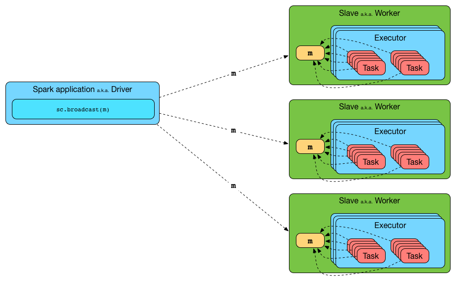

```scala
object Broadcast2 {
    def main(args: Array[String]): Unit = {
        val sparConf = new SparkConf().setMaster("local").setAppName("broadcast")
        val sc = new SparkContext(sparConf)

        val rdd = sc.makeRDD(List(("a", 1), ("b", 2), ("c", 3)))
        val map = mutable.Map(("a", 4), ("b", 5), ("c", 6))
        // 封装广播变量，如果直接使用map，则每个Task都各自持有该变量，数据重复且占用大量内存
        val bc: Broadcast[mutable.Map[String, Int]] = sc.broadcast(map)

        rdd.map {
            case (w, c) => {
                val l: Int = bc.value.getOrElse(w, 0)
                (w, (c, l))
            }
        }.collect().foreach(println)
        
        sc.stop()
    }
}
```


# 3. Spark 物理执行计划

## 3.1 执行步骤

逻辑处理流程生成后，需要将其转换为物理执行计划，使得应用程序可以被分布执行。Spark 具体采用三个步骤来生成物理执行计划。

1. **根据 action() 操作顺序将应用划分为作业 job**

   **当应用程序出现 action() 操作时，表示应用会生成一个 job**，该 job 的逻辑处理流程是从输入数据到 resultRDD 的逻辑处理流程。如果应用程序中有很多 action() 操作，那么 Spark 会按照顺序为每个 action() 操作生成一个 job，每个 job 的逻辑处理流程也都是从输入数据到最后 action() 操作的。

2. **根据逻辑处理流程中的 ShuffleDependency 依赖关系，将 job 划分为执行阶段 stage**

   **对于每个 job，从其最后的 RDD 往前回溯整个逻辑处理流程**，如果遇到 NarrowDependency，则将当前 RDD 的 parent RDD 纳入，并继续往前回溯。**当遇到 ShuffleDependency 时，停止回溯，将当前已经纳入的所有 RDD 按照其依赖关系建立一个执行阶段，命名为 stage i**。

   如图所示，首先从 results 之前的 MapPartitionsRDD 开始向前回溯，回溯到 CoGroupedRDD 时，发现其包含两个 parent RDD，其中一个是 UnionRDD。因为 CoGroupedRDD 与 UnionRDD 的依赖关系是 ShuffleDependency，对其进行划分，并继续从 CoGroupedRDD 的另一个 parent RDD 回溯，回溯到 ShuffledRDD 时，同样发现了 ShuffleDependency，对其进行划分得到了一个执行阶段 stage 2。接着从 stage 2 之前的 UnionRDD 开始向前回溯，由于都是 NarrowDependency，将一直回溯到读取输入数据的 RDD2 和 RDD3 中，形成 stage 1。最后，只剩余 RDD 1成为一个 stage 0。

   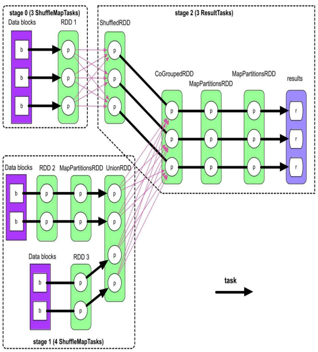

3. **根据最后生成的 RDD 分区个数，将各个 stage 划分为多个计算任务 task**

   由于每个分区上的计算逻辑相同且独立，因此每个分区上的计算可以独立成为一个 task，**Spark 根据每个 stage 中最后一个 RDD 的分区个数决定生成 task 的个数**。如图中粗箭头所示，在 stage 2 中，最后一个 MapPartitionsRDD 的分区个数为 3 ，那么 stage 2 就生成 3 个 task，每个 task 负责 ShuffledRDD => CoGroupedRDD => MapPartitionsRDD => MapPartitionsRDD 中一个分区的计算。


## 3.2 相关问题

1. **job、stage 和 task 的计算顺序**

   job 的提交时间与 action() 被调用的时间有关，**当应用程序执行到 rdd.action() 时，就会立即将 rdd.action() 形成的 job 提交给 Spark**。每个 stage 的输入数据要么是 job 的输入数据，要么是上游 stage 的输出结果。因此，计算顺序从包含输入数据的 stage 开始，从前到后依次执行，**仅当上游的 stage 都执行完成后 ，再执行下游的 stage**。在上图中，stage 0 和 stage 1 由于都包含了 job 的输入数据，两者都可以先开始计算，仅当两者都完成后，stage 2 才开始计算。**stage 中每个 task 因为是独立而且同构的，可以并行运行没有先后之分**。

2. **task 内部数据的存储与计算问题（流水线计算）**

   在第 1 个计算模式中，f() 和 g() 函数每次读取一个 record，计算并生成一个新 record，这类型的操作包括 map()、filter() 等。也就是说，在 task 计算时只需要在内存中保留当前被处理的单个 record 即可，不需要保存其他 record 或者已经被处理完的 record，可以有效地减少内存使用空间。因此，可以采用以下步骤进行“流水线”式的计算。

   > 读取 record1 => f(record1) => record1′ => g(record1′) => 输出 record1′′
   >
   > 读取 record2 => f(record2) => record2′ => g(record2′) => 输出 record2′′
   >
   > 读取 record3 => f(record3) => record3′ => g(record3′) => 输出 record3′′

   在第 2 个计算模式中，f() 函数仍然是一一映射的，所以仍然可以采用“流水线”式计算，不过 g() 函数需要在内存中保存这些中间计算结果，并在输出时将中间结果依次输出。

   > 读取 record1 => f(record1) => record1′ => g(record1′) => record1′ 进入 g() 函数中的 iter.next() 进行计算（iter 是读取上游分区中 record 的迭代器） => g() 函数将计算结果存入 g() 函数中的 list
   >
   > 读取 record1 => f(record1) => record1′ => g(record1′) => record1′ 进入 g() 函数中的 iter.next() 进行计算 => g() 函数将计算结果存入 g() 函数中的 list
   >
   > 读取 record1 => f(record1) => record1′ => g(record1′) => record1′ 进入 g() 函数中的 iter.next() 进行计算 => g() 函数将计算结果存入 g() 函数中的 list 
   >
   > g() 函数一条条输出 list 中的 record

   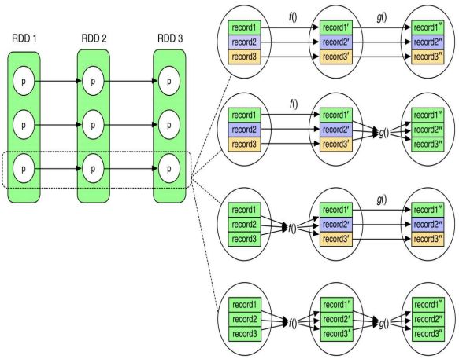

   在第 3 个模式中，由于 f() 函数需要将 [record1, record2, record 3] 都算出后才能计算，因此会先执行 f() 函数，完成后再计算 g() 函数。实际的执行过程：首先执行 f() 函数算出 [record1′, record2′, record3′]，然后使用 g() 函数依次计算 g(record1′) => record1′′，g(record2′) => record2′′，g(record3′) => record3′′。也就是说，f() 函数的输出结果需要保存在内存中 ，而 g() 函数计算完每个 record′ 并得到 record′′ 后，可以对 record′ 进行回收。

   在第 4 个模式中，不能进行 record 的“流水线”式计算，f() 函数需要一次性读取 [record1, record2, record3] 后才能算出 [record1′, record2′, record3′]，同样，g() 函数需要一次性读取 [record1′, record2′, record3′] 后才能输出 [record1′′, record2′′, record3′′]。这两个函数只是依次执行，“流水线” 式计算退化到“计算-回收”模式：每执行完一个操作，回收之前的中间计算结果。

   总结：**Spark 采用“流水线”式计算来提高 task 的执行效率，减少内存使用量**，这也是 Spark 可以在有限内存中处理大规模数据的原因。然而 ，对于某些需要聚合中间计算结果的操作，还是需要占用一定的内存空间，也会在一定程度上影响流水线计算的效率。

3. **task 间的数据传递与计算问题**

   ShuffleDependency 的数据划分方法包括 Hash 划分 、Range 划分等，也就是要求上游 stage 预先将输出数据进行划分，按照分区存放，这个过程被称为 **Shuffle Write**。按照分区存放完成后，下游的 task 将属于自己分区的数据通过网络传输获取，然后将来自上游不同分区的数据聚合在一起进行处理，这个过程被称为 **Shuffle Read**。总的来说，不同 stage 的 task 之间通过 Shuffle Write + Shuffle Read 传递数据。

4. **stage 和 task 命名方法**

   **在 MR 中，stage 只包含两类：map stage 和 reduce stage**，map stage 中包含多个执行 map() 函数的任务，被称为 map task；reduce stage 中包含多个执行 reduce() 函数的任务，被称为 reduce task。而**在 Spark 中，stage 可以有多个，有些 stage 既包含类似 reduce() 的聚合操作又包含 map() 操作，所以一般不区分是 map stage 还是 reduce stage，而直接使用 stage i 来命名**，只有当生成的逻辑处理流程类似 MR 的两个执行阶段时，才会依据习惯区分 map/reduce stage，但是 Spark 可以对 stage 中的 task 使用不同的命名， 如果 task 的输出结果需要进行 Shuffle Write，以便传输给下一个 stage，那么这些 task 被称为 ShuffleMapTasks；而如果 task 的输出结果被汇总到 Driver 端或者直接写入分布式文件系统，那么这些 task 被称为 ResultTasks。


# 4. Shuffle 机制

## 4.1 Shuffle 设计思想

### 4.1.1 数据聚合问题

数据聚合的本质是将相同 Key 的 record 放在一起，并进行必要的计算，该过程可以利用 Java 语言中的 HashMap 实现。方法是使用两步聚合，先将不同 tasks 获取到的 <K, V> record 存放到 HashMap 中，其中的 Key 是 K，Value 是 list(V)。然后，对于 HashMap 中每一个 <K, list(V)> record，使用 func 计算得到 <K, func(list(V))> record。

以 reduceByKey(func) 为例，如左图所示，两步聚合的第 1 步是将 record 存放到 HashMap 中，第 2 步是使用 func() 函数对 list(V) 进行计算，得到最终结果。这种方式的缺点是**所有 record 都会先被存放在 HashMap 中，然后执行 func() 聚合函数**，占用内存空间较大，且效率较低。因此，可以优化采用在线聚合的方式，如右图所示，**在每个 record 加入 HashMap 时， 同时进行 func() 聚合操作，并更新相应的聚合结果**。不过，对于不包含聚合函数的操作，如 groupByKey() 等，在线聚合和两步聚合没有差别，因为这些操作不包含聚合函数，无法减少中间数据规模。

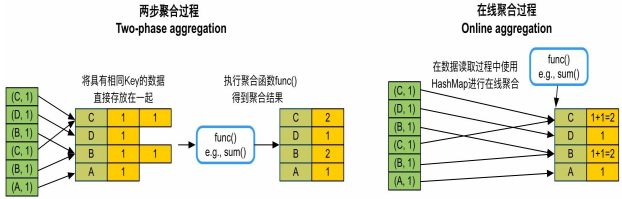


### 4.1.2 排序问题

首先，在 Shuffle Read 端必须执行 sort，因为从每个 task 获取的数据组合起来以后不是全局按 Key 进行排序的。其次，理论上，在 Shuffle Write 端不需要排序，但如果进行了排序，那么 Shuffle Read 获取到（来自不同task）的数据是已经部分有序的数据，可以减少 Shuffle Read 端排序的复杂度。关于排序和聚合的顺序，有如下三种方案：

1. **先排序再聚合**：先使用线性数据结构，如 Array 来存储 Shuffle Read 的 <K, V> record，然后对 Key 进行排序，排序后的数据可以直接从前到后进行扫描聚合，不需要再使用 HashMap 进行聚合。**这种方案也是 Hadoop MapReduce 采用的方案**，其优点是可以同时满足排序和聚合要求；缺点是需要较大内存空间来存储线性数据结构，排序和聚合过程不能同时进行，即不能使用在线聚合，效率较低。
2. **排序和聚合同时进行**：使用带有排序功能的 Map，如 TreeMap 来对中间数据进行聚合，每次 Shuffle Read 获取到一个 record，就将其放入 TreeMap 与现有的 record 进行聚合。这种方案的优点是排序和聚合可以同时进行；缺点是相比 HashMap，TreeMap 的排序复杂度较高，插入时间复杂度是O(nlogn)，且需要不断调整树的结构，不适合数据规模非常大的情况。
3. **先聚合再排序**：**当前 Spark 采用的方案**，即维持现有基于 HashMap 的聚合方案不变，将 HashMap 中的 record 或 record 的引用放入线性数据结构中进行排序。这种方案的优点是聚合和排序过程独立，灵活性较高，且之前的在线聚合方案不需要改动；缺点是需要复制数据或引用，空间占用较大。


## 4.2 Shuffle 框架设计

在 Shuffle Write 端，目前只支持 combine 功能，并不支持按 Key 排序功能。当然，未来有些数据操作可能同时需要这两个功能，所以，Shuffle 框架还是需要支持全部的功能。

| 包含 ShuffleDependency 的操作                                | Shuffle Write 端 combine | Shuffle Write 端按 Key 排序 | Shuffle Read 端 combine | Shuffle Read 端按 Key 排序 |
| ------------------------------------------------------------ | :----------------------: | :-------------------------: | :---------------------: | :------------------------: |
| partitionBy                                                  |            Ⅹ             |              Ⅹ              |            Ⅹ            |             Ⅹ              |
| groupByKey、cogroup、join、coalesce、intersection、subtract、subtractByKey |            Ⅹ             |              Ⅹ              |            √            |             Ⅹ              |
| reduceByKey、aggregateByKey、combineByKey、foldByKey、distinct |            √             |              Ⅹ              |            √            |             Ⅹ              |
| sortByKey、sortBy、repartitionAndSortWithinPartitions        |            Ⅹ             |              Ⅹ              |            Ⅹ            |             √              |
| 未来系统可能支持的或用户自定义的数据操作                     |            √             |              √              |            √            |             √              |

### 4.2.1 Shuffle Write 

Spark 为了支持所有的情况，设计了一个通用的 Shuffle Write 框架，框架的计算顺序为“**map() 输出 → 数据聚合 → 排序 → 分区输出**”。 map task 每计算出一个 record 及其 partitionId（PID），就将 record 放入类似 HashMap 的数据结构中进行聚合；聚合完成后，再将 HashMap 中的数据放入类似 Array 的数据结构中进行排序，既可按照 partitionId ，也可以按照 partitionId+Key 进行排序；最后根据 partitionId 将数据写入不同的数据分区中，存放到本地磁盘上。其中，聚合（aggregate，即 combine）和排序（sort）过程是可选的。


1. **不需要 map() 端聚合和排序**

   这种情况最简单，只需要实现分区功能。map() 依次输出 <K, V> record，并计算其 partitionId，Spark 根据 partitionId，将 record 依次输出到不同的 buffer 中，每当 buffer 填满就将 record 溢写到磁盘上的分区文件中。分配 buffer 的原因是 map() 输出 record 的速度很快，需要进行缓冲来减少磁盘 I/O。这种 Shuffle Write 方式称为 BypassMergeSortShuffleWriter。

   优点：速度快，**直接将 record 输出到不同的分区文件中**。

   缺点：资源消耗过高，**每个分区都需要一个 buffer**（大小由 spark.Shuffle.file.buffer 控制，默认为 32 KB），且同时**需要建立多个分区文件进行溢写**。当分区个数太大，如 10000 时，每个 map task 需要约 320 MB 的内存，会造成内存消耗过大，而且每个 task 需要同时建立和打开 10000 个文件，造成资源不足。因此，该 Shuffle 方案**适合分区个数较少的情况（< 200）**。

   

2. **不需要 map() 端聚合，但需要排序**

   在这种情况下，需要**按照 partitionId + Key 进行排序**。实现方法是建立一个 Array 来存放 map() 输出的 record，并对 Array 中元素的 Key 进行精心设计，将每个 <K, V> record 转化为 <(PID, K), V> record 存储；然后按照 partitionId + Key 对 record 进行排序；最后**将所有 record 写入一个文件中，通过建立索引来标示每个分区**。

   如果 Array 存放不下，则会先扩容，如果还存放不下，就将 Array 中的 record 排序后溢写到磁盘上，等待 map() 输出完以后，再将 Array 中的 record 与磁盘上已排序的 record 进行全局排序，得到最终有序的 record，并写入文件中。 该 Shuffle 模式被命名为 SortShuffleWriter（KeyOrdering=true），使用的 Array被命名为 PartitionedPairBuffer。

   优点：只需要一个 Array 结构就可以支持按照 partitionId + Key 进行排序，Array 大小可控，且具有扩容和溢写到磁盘上的功能，支持从小规模到大规模数据的排序。同时，输出的数据已经按照 partitionId 进行排序，因此**只需要一个分区文件存储，即可标示不同的分区数据，适用于分区个数很大的情况**。如果将“按 PartitionId + Key 排序”改为“只按 PartitionId 排序”，就可以克服 BypassMergeSortShuffleWriter 中建立文件数过多的问题，从而支持分区个数很大的操作。

   缺点：**排序增加计算时延**。

   

3. **需要 map() 端聚合，需要或不需要按 key 进行排序**

   在这种情况下，需要实现按 Key 进行聚合（combine）。实现方法是建立一个类似 HashMap 的数据结构对 map() 输出的 record 进行聚合，Key 是“partitionId + Key”，Value 是经过相同 combine 的聚合结果。**聚合完成后，对 HashMap 中的 record 进行排序**，如果不需要按 Key 进行排序，如上图所示，那么只按 partitionId 进行排序；如果需要按 Key 进行排序，如下图所示，那么按 partitionId + Key 进行排序。最后，将排序后的 record 写入一个分区文件中。此处的 HashMap 被命名为 PartitionedAppendOnlyMap，可以同时支持聚合和排序操作，相当于 HashMap 和 Array 的合体。

   优点：只需要一个 HashMap 结构就可以支持 map() 端的聚合功能，HashMap 同样具有扩容和溢写到磁盘上的功能 ，支持小规模到大规模数据的聚合，**也适用于分区个数很大的情况**。

   缺点：在内存中进行聚合，**内存消耗较大**，需要额外的数组进行排序，如果有数据溢写到磁盘上，还需要再次进行聚合。

   


### 4.2.2 Shuffle Read

Spark 为了支持所有的情况，设计了一个通用的 Shuffle Read 框架，框架的计算顺序为“**跨节点数据获取 → 聚合 → 排序输出**”。reduce task 不断从各个 map task 的分区文件中获取数据（Fetch records），然后使用类似 HashMap 的结构来对数据进行聚合 （aggregate），该过程是边获取数据边聚合。聚合完成后，将 HashMap 中的数据放入类似 Array 的数据结构中按照 Key 进行排序，最后将排序结果输出或者传递给下一个操作。**总体来说，Shuffle Read 使用的技术和数据结构与 Shuffle Write 过程类似，且由于不需要分区，过程比 Shuffle Write 更为简单**。


1. **不需要聚合，不需要按 key 进行排序**

   这种情况最简单，只需要实现数据获取功能即可。等所有的 map task 结束后，reduce task 开始不断从各个 map task 获取 <K, V> record，并将 record 输出到一个 buffer 中（大小为 spark.reducer.maxSizeInFlight = 48MB），下一个操作直接从 buffer 中获取数据即可

   优点：逻辑和实现简单，内存消耗很小。

   缺点：不支持聚合、排序等复杂功能。

   

2. **不需要聚合，需要按 key 进行排序**

   在这种情况下，需要实现数据获取和按 Key 排序。获取数据后，将 buffer 中的 record 依次输出到一个 Array 结构中。由于这里采用了本来用于 Shuffle Write 端的 PartitionedPairBuffer 结构，所以还保留了每个 record 的 partitionId。然后对 Array 中的 record 按照 Key 进行排序，并将排序结果输出或者传递给下一步 操作。 

   当内存无法存下所有的 record 时，PartitionedPairBuffer 将 record 排序后溢写到磁盘上，最后将内存中和磁盘上的 record 进行全局排序，得到最终排序后的 record。优点和缺点与 Shuffle Write 第二种模式相同。

   

3. **需要聚合，需要或不需要按 key 进行排序**

   在这种情况下，需要实现按照 Key 进行聚合，并根据需要按 Key 进行排序。如上图所示，获取 record 后，Spark 建立一个类似 HashMap 的数据结构（ExternalAppendOnlyMap）对 buffer 中的 record 进行聚合，Key 是 record 中的 Key，Value 是经过相同聚合函数计算后的结果。 之后，如果需要按照 Key 进行排序，如下图所示，排序完成后，将结果输出或者传递给下一步操作。

   优点：支持 reduce 端的聚合和排序功能，边获取数据边聚合， 效率较高。

   缺点：在内存中进行聚合，内存消耗较大。

   


## 4.3 相关数据结构

Shuffle 机制中使用的数据结构有两个特征：一是只需要支持 record 的插入和更新操作，不需要支持删除操作，这样我们可以对数据结构进行优化，减少内存消耗； 二是只有内存放不下时才需要溢写到磁盘上，因此数据结构设计以内存为主，磁盘为辅。

### 4.3.1 AppendOnlyMap

Spark 中的 PartitionedAppendOnlyMap 和 ExternalAppendOnlyMap 都基于 AppendOnlyMap 实现。AppendOnlyMap 实际上是一个只支持 record 添加和对 Value 进行更新的 HashMap。与 Java HashMap 采用“数组+链表”实现不同，它**只使用数组来存储元素，根据元素的 Hash 值确定存储位置**，如果存储元素时发生 Hash 值冲突，则使用二次地址探测法解决。如果数组利用率达到 70%，则扩张一倍，此时原来的 Hash 失效， 因此需要对所有 Key 进行 rehash。

由于 AppendOnlyMap 采用数组作为底层存储结构，可以支持快速排序等排序算法。它先将数组中所有的 <K, V> record 转移到数组的前端，用 begin 和 end 来标示起始位置，然后调用排序算法对 [begin, end] 中的 record 进行排序。对于需要按 Key 进行排序的操作，可以按照 Key 值进行排序；对于其他操作，只按照 Key 的 Hash 值进行排序即可。

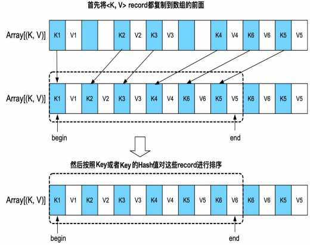

### 4.3.2 ExternalAppendOnlyMap

AppendOnlyMap 优点是能将聚合和排序结合在一起 ，缺点是只能使用内存，难以适用于内存不足的情况。为了解决这个问题，**Spark 基于 AppendOnlyMap 设计实现了基于内存+磁盘的 ExternalAppendOnlyMap**，用于 Shuffle Read 端大规模数据聚合。同时，由于 Shuffle Write 端聚合需要考虑 partitionId，Spark 也设计了带有 partitionId 的 ExternalAppendOnlyMap，名为 PartitionedAppendOnlyMap，这两个数据结构功能类似。

ExternalAppendOnlyMap 工作原理是，先持有一个 AppendOnlyMap 来不断接收和聚合新来的 record，AppendOnlyMap 快被装满时检查一下内存剩余空间是否可以扩展，可以则直接在内存中扩展，否则对其中的 record 进行排序，然后将 record 都溢写到磁盘上。因为 record 不断到来，可能会多次填满 AppendOnlyMap，所以这个溢写过程可以出现多次，最终形成多个溢写文件。等 record 都处理完，ExternalAppendOnlyMap 将内存中 AppendOnlyMap 的数据与磁盘上溢写文件中的数据进行全局聚合，得到最终结果。

1. AppendOnlyMap 的大小估计：AppendOnlyMap 数组里存放的是 Key 和 Value 的引用，并不是它们实际对象（object）的大小，且 Value 会不断被更新，实际大小不断变化。Spark 设计了一个增量式的高效估算算法，复杂度是 O(1)，它会定期对当前 AppendOnlyMap 中的 record 进行抽样，然后精确计算这些 record 的总大小、总个数 、更新个数及平均值等，并作为历史统计值。之后，每当有 record 插入或更新时，会根据历史统计值和历史平均的变化值，增量估算 AppendOnlyMap 的总大小，详见 Spark 源码中的 SizeTracker.estimateSize() 方法。
2. 全局聚合：建立一个最小堆或最大堆，每次从各个溢写文件中读取前几个具有相同 Key（或相同 Key 的 Hash值）的 record，然后与 AppendOnlyMap 中的 record 进行聚合，并输出聚合后的结果。图中，Spark 分别从 4 个溢写文件中提取第 1 个 <K, V> record，与还留在 AppendOnlyMap 中的第 1 个 record 组成最小堆，然后不断从最小堆中提取具有相同 Key 的 record 进行聚合。接着，Spark 继续读取溢写文件及 AppendOnlyMap 中的 record 填充最小堆，直到所有 record 处理完成。由于每个溢写文件中的 record 是经过排序的，按顺序读取和聚合可以保证对每个 record 进行全局聚合。 

总结：ExternalAppendOnlyMap 是一个高性能的 HashMap，只支持数据插入和更新，但可以同时利用内存和磁盘对大规模数据进行聚合和排序，满足了 Shuffle Read 阶段数据聚合、排序的需求。

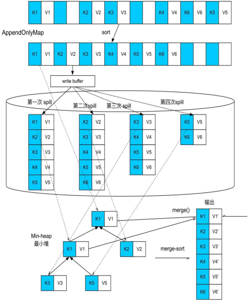


### 4.3.3 PartitionedAppendOnlyMap

PartitionedAppendOnlyMap 用于在 Shuffle Write 端对 record 进行聚合 （combine），它的功能和实现与 ExternalAppendOnlyMap 的功能和实现基本一样，唯一区别是它的 Key 是“PartitionId + Key”，这样既可以根据 partitionId 进行排序，也可以根据 partitionId + Key进行排 序，从而在 Shuffle Write 阶段可以进行聚合、排序和分区。

### 4.3.4 PartitionedPairBuffer

PartitionedPairBuffer 本质上是一个基于内存+磁盘的 Array，随着数据添加，不断地扩容，当到达内存限制时，就将 Array 中的数据按照 partitionId 或 partitionId + Key 进行排序，然后溢写到磁盘上，该过程可以进行多次，最后对内存中和磁盘上的数据进行全局排序，输出或者提供给下一个操作。


# 5. 数据缓存机制

RDD 通过 cache() 或 persist() 方法将前面的计算结果缓存，但这两个方法被调用时并不是立即缓存，而是**触发后面的 action 算子时，该 RDD 才会被缓存在计算节点的内存中**，并供后面重用。缓存机制实际是以空间换时间，如果数据会被重复使用，就可以进行缓存，但**缓存的数据不宜过大**，否则会导致内存不足，另外，如果缓存了某个 RDD，那么该 RDD 通过 OneToOneDependency 连接的 parent RDD 就不需要被缓存了。

**缓存级别针对的是 RDD 中的全部分区**，对于 MEMORY_ONLY 级别来说，只使用内存进行缓存，如果某个分区在内存中存放不下，就不对该分区进行缓存，当后续 job 中的 task 计算需要这个分区中的数据时，**需要重新计算得到该分区**。对于 MEMORY_AND_DISK 缓存级别，如果内存不足，则会将部分数据存放到磁盘上。而 DISK_ONLY 级别只使用磁盘进行缓存。MEMORY_ONLY_SER 和 MEMORY_AND_DISK_SER 将数据按照序列化方式存储，以减少存储空间，但需要序列化/反序列化，会增加计算延时。 因为**存储到磁盘前需要对数据进行序列化**，所以 DISK_ONLY 级别也需要序列化存储。

| 缓存级别              | 存储位置            | 序列化存储 | 内存不足放磁盘 |
| --------------------- | ------------------- | ---------- | -------------- |
| NONE                  | 不存储              | Ⅹ          | —              |
| MEMORY_ONLY、cache()  | 内存                | Ⅹ          | Ⅹ（重新计算）  |
| MEMORY_AND_DISK       | 内存 + 磁盘         | Ⅹ          | √              |
| MEMORY_ONLY_SER       | 内存                | √          | Ⅹ              |
| MEMORY_AND_DISK_SER   | 内存 + 磁盘         | √          | √              |
| DISK_ONLY             | 磁盘                | √          | —              |
| OFF_HEAP              | 堆外内存            | √          | Ⅹ              |
| MEMORY_ONLY_2         | 多台机器内存        | Ⅹ          | Ⅹ（双副本）    |
| MEMORY_AND_DISK_2     | 多台机器内存 + 磁盘 | Ⅹ          | √（双副本）    |
| MEMORY_ONLY_SER_2     | 多台机器内存        | √          | Ⅹ（双副本）    |
| MEMORY_AND_DISK_SER_2 | 多台机器内存 + 磁盘 | √          | √（双副本）    |
| DISK_ONLY_2           | 多台机器磁盘        | √          | —（双副本）    |

## 5.1 缓存数据写入

当需要进行数据缓存时，Spark 既要将数据写入内存或磁盘，也要执行下一步数据操作，那么如何决定它们的先后顺序呢？根据流水线机制，map() 每计算出一个 record，就将其放入 HashMap 进行 combine 聚合，之后 mappedRDD 中的 record 就可以被清除了。假设先执行 combine()，再执行 persist()，那么当 combine() 执行后，mappedRDD 中的数据就已经被清除，无法再进行 persist()。因此，**正确的执行顺序是 map() 每计算出 mappedRDD 中的一个 record 后，就执行 persist() 将该 record 写入内存或磁盘，然后再执行下一步操作**。

在实现中，Spark 在每个 Executor 进程中分配一个区域，以进行数据缓存，该区域由 BlockManager 来管理。在图中，task0 和 task1 运行在同一个 Executor 进程中，对于 task0，当计算出 mappedRDD 中的 partition0 后，将 partition0 存放到 BlockManager 中的 memoryStore 内。**memoryStore 包含了一个基于双向链表实现的 LinkedHashMap，用来存储 RDD 的分区**，该 LinkedHashMap 中的 Key 是 blockId，即 rddId + partitionId，Value 是分区中的数据。

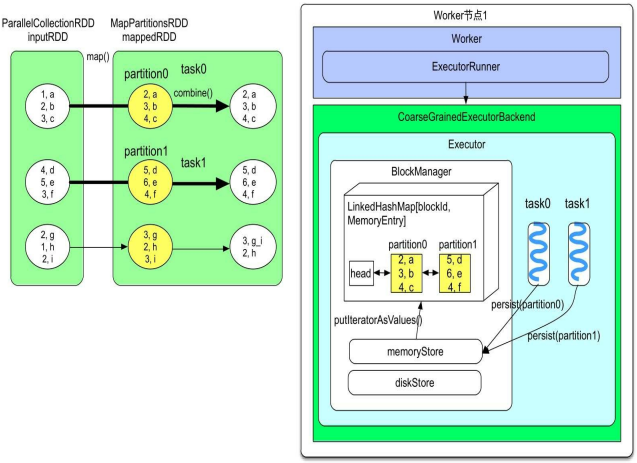


## 5.2 缓存数据读取

**当某个 RDD 被缓存后，该 RDD 的分区成为 CachedPartitions**，Spark 由此判断 job 是否需要读取缓存数据。如图所示，假设 mappedRDD 的 partition 0 和 partition1 被 Worker 节点 1 中的 BlockManager 缓存，而 partition2 被 Worker 节点 2 中的 BlockManager 缓存。当第 2 个 job 的 3 个 task 都被分到了 Worker 节点 1 上，其中 task3 和 task4 对应的 CachedPartition 在本地，因此直接通过 Worker 节点 1 的 memoryStore 读取即可。而 task5 对应的 CachedPartition 在 Worker 节点 2 上，需要通过远程访问，也就是通过 getRemote()  读取。远程访问需要对数据进行序列化和反序列化，读取时是一条条 record 读取，并得到及时处理。

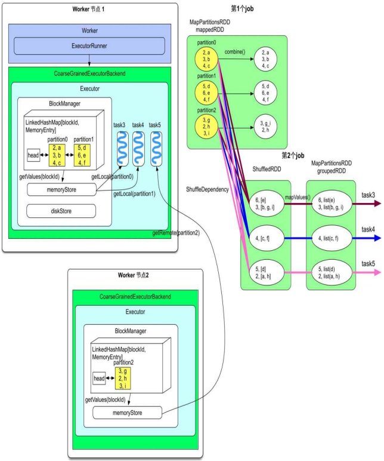


## 5.3 缓存数据替换与回收

**缓存替换指的是当需要缓存的 RDD 大于当前可利用的空间时，使用新的 RDD 替换旧的 RDD（可能有多个**），该过程由系统自动完成，对用户来说是无感知的。Spark 采用 LRU 替换算法，即优先替换掉当前最长时间没有被使用过的 RDD，并采用 LinkedHashMap 自带的 LRU 功能实现。

由于 Spark 每计算一个 record，就对其进行缓存，因此在缓存结束前，不能预知该 RDD 需要的存储空间，也就无法判断需要替换多少个旧的 RDD。为了解决这个问题，Spark 采用动态替换策略，每次通过 LRU 替换一个或多个 RDD，然后开始存储新的 RDD，如果中途存放不下，就暂停，继续使用 LRU 替换一个或多个 RDD，依此类推，直到存放完新的 RDD。如果替换掉所有旧的 RDD 都存不下新的 RDD，那么就将新的 RDD 存放到磁盘，或者不存储该 RDD。

由于 Spark 难以精确智能地进行缓存替换，为了弥补这个缺点，Spark 允许用户自己设置 RDD 回收的时间。方法是使用 unpersist()，不同于 persist() 的延时生效，**unpersist() 操作是立即生效的**。用户**还可以设定 unpersist() 是同步阻塞的还是异步执行的**，如 unpersist(blocking=true) 表示同步阻塞，即程序需要等待 unpersist() 结束后再进行下一步操作，这也是默认设定。而 unpersist(blocking=false) 表示异步执行，即边执行 unpersist() 边进行下一步操作。

```scala
val inputRDD = sc.parallelize(Array[(Int, String)]((1, "a"), (2, "b"), (3, "c"), (4, "d"), (5, "e"), (3, "f"), (2, "g"), (1, "h")), 3).map(r => (r._1 + 1, r._2))
val mappedRDD = inputRDD
mappedRDD.cache()
val reducedRDD = mappedRDD.reduceByKey((x, y) => x + "_" + y, 2)
// 位置不当，reducedRDD遇到行动算子时才进行计算，而unpersist()立即生效，取消了缓存
// mappedRDD.unpersist()
reducedRDD.foreach(println)
mappedRDD.unpersist()
```


# 6. 错误容忍机制

在大数据处理时，不可避免会受到软硬件故障的影响，如节点宕机、磁盘损坏、网络阻塞、内存溢出等，Spark 错误容忍机制的核心方法有以下两种：

1. **通过重新执行计算任务来容忍错误**。当 job 抛出异常不能继续执行时，重新启动计算任务，再次执行。 
2. **通过采用 checkpoint 机制，对一些重要的输入/输出、中间数据进行持久化**。这可以在一定程度上解决数据丢失问题，而且能够提高任务重新计算时的效率。

## 6.1 重新计算机制

### 6.1.1 重新计算结果一致

**重新计算机制的前提条件是：task 重新执行时能够读取与上次一致的数据，并且计算逻辑具有确定性和幂等性**。

1. 对于 map task，其输入数据一般来自分布式文件系统或上一个 job 的输出。由于分布式文件系统上的数据是静态可靠的，且可以对上一个 job 的输出进行持久化，那么 task 再次执行时可以获得相同的数据。对于 reduce task，其输入数据通过 Shuffle 获取，由于计算和网络延迟，在 Shuffle Read 过程中不能保证接收到的 record 的顺序性，可能先接收到来自 map task2 的 record，后接收到来自 map task1 的 record，因此，reduce task 再次运行时的输入数据与之前的数据是部分一致的，即**接收到的数据集合与上次 task 一样，只是里面的 record 顺序可能不一样，这时需要 task 满足确定性和幂等性**。

2. **确定性是指如果输入数据是确定的，那么计算得到的结果也是确定的**。假设 task 在计算时调用了一个随机函数，这个结果就是不确定的，会导致 task 重新执行时得到不一致的结果。

3. **幂等性是指对同样数据进行多次运算，结果都是一致的**。task 的处理逻辑需要满足交换律和结合律才能得到一致的结果。


### 6.1.2 重新计算从哪开始

如图所示，stage0 和 stage1中的 task 的输入数据来自分布式文件系统，这些 task 在重新计算时，直接读取分布式文件系统上的数据计算即可。而下游 stage2 中的 task 的输入数据是通过 Shuffle Read 读取上游 stage 输出数据的，此时 **Spark 采用了“延时删除策略”，即将上游 stage 的 Shuffle Write 的结果写入本地磁盘，只有在当前 job 完成后，才删除 Shuffle Write 写入磁盘的数据**。

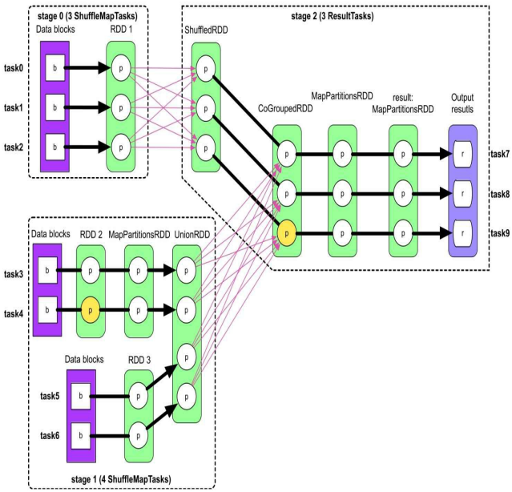

一个 task 一般会连续计算多个 RDD，对于没有缓存数据的情况，每个 RDD 都需要重新被计算。对于有缓存的情况，如 stage2 中，CoGroupedRDD 的第 3 个分区数据已经被缓存，则 task9 直接从 CoGroupedRDD 计算即可。但是，如果缓存数据丢失也需要重新计算，为此，**Spark 采用了一种称为 lineage 的数据溯源方法，该方法的核心思想是在每个 RDD 中记录其上游数据是什么，以及当前 RDD 是如何通过上游数据（parent RDD）计算得到的**。例如，CoGroupedRDD 的 parent RDD 是通过 Shuffle Read + 聚合得到的 ShuffleRDD 和 UnionRDD。这样在错误发生时，可以根据 lineage 追根溯源，找到计算当前 RDD 所需的数据和操作。


## 6.2 checkpoint 机制

**重新计算存在一个缺点是，如果某个数据（RDD）的计算链过长，那么重新计算该数据的代价非常高**。 例如，对于迭代型应用，假设迭代了 100 轮才计算出的中间数据突然丢失了，那么重新计算该数据的代价太高了。为了提高重新计算机制的效率，也为了更好地解决数据丢失问题，Spark 采用了**检查点（checkpoint）机制，其核心思想是将计算过程中某些重要数据进行持久化，这样再次执行时可以从检查点执行，从而减少重新计算的开销**。

为什么有了数据缓存，还需要 checkpoint 呢？一个原因是**数据缓存使用的本地磁盘并不可靠，一旦节点宕机，缓存的数据就丢失了**，需要重新计算，因此对于数据依赖较多、经过复杂计算才能得到的 RDD，可以使用 checkpoint 对其进行持久化。

### 6.2.1 checkpoint 数据写入

checkpoint 目的是对重要数据进行持久化，在节点宕机时也能够恢复，因此需要可靠地存储。另外，checkpoint 的数据量可能很大，因此需要大的存储空间。所以，**一般采用分布式文件系统，如 HDFS 来存储**。当然也可以选择基于内存的分布式文件系统 Alluxio 来加速存储与读取过程。

```scala
// 设置持久化路径，一般是HDFS
sc.setCheckpointDir("hdfs://checkpoint")
val pairs = sc.parallelize(Array[(Int, Char)]((1, 'a'), (2, 'b'), (3, 'c'), (4, 'd'), (5, 'e'), (3, 'f'), (2, 'g'), (1, 'h')), 3).map(r => (r._1 + 10, r._2))
// 对中间数据pairs进行checkpoint
pairs.checkpoint()
pairs.count()
val result = pairs.groupByKey(2)
// result.checkpoint()
result.foreach(println)
```

查看 checkpoint 目录，可以发现 pairs 的 3 个分区以文件 part-0000\* 的形式存放，Spark 在 checkpoint 时对 RDD 数据进行了序列化，所以用文本编辑器打开的 part-0000* 文件乱码。

查看应用生成的 job 信息，会发现实际生成了 3 个 job。假设 checkpoint 仍然采用类似缓存机制的计算顺序，即每计算出一个 record， 就将其持久化到分布式文件系统 HDFS 上，等所有 record 持久化完毕后，再从 HDFS 上读取 record 进行计算。这种方案效率很低，checkpoint 将数据持久化到分布式文件系统 HDFS 时需要写入磁盘，且一般需要复制 3 份进行跨节点存储，写入时延高，同时后续操作需要从 HDFS 中读取数据，这将会严重影响 job 的执行时间，造成很高的磁盘 I/O 代价。

Spark 采用的方案是：**用户设置 rdd.checkpoint() 后只标记某个 RDD 需要持久化，计算过程也像正常一样计算，等到当前 job 计算结束时再重新启动该 job 计算一遍，对其中需要 checkpoint 的 RDD 进行持久化**。也就是说，当前 job 结束后会另外启动专门的 job 去完成 checkpoint，需要 checkpoint 的 RDD 会被计算两次。为了减少 checkpoint 启动额外 job 的计算开销，Spark 推荐用户将需要被 checkpoint 的数据先进行缓存， 这样额外启动的任务只需要将缓存数据进行 checkpoint 即可，不需要再重新计算 RDD。


### 6.2.2 checkpoint 数据读取

checkpoint 读取方式与从分布式文件系统读取输入数据没什么太大区别，都是启动 task 读取，且每个 task 读取一个分区。只不过 checkpoint 数据经过了序列化，且存放了 RDD 的分区信息，因此重新读取时需要进行反序列化，也可以恢复 RDD 分区信息。若同时对某个 RDD 进行了缓存和 checkpoint，则先进行缓存，然后再 checkpoint，读取时读取缓存数据，而非 checkpoint 数据。

另外，**checkpoint 会切断 RDD 的 lineage**，将该 RDD 与持久化到磁盘上的 Checkpointed RDD 进行关联，这样，读取该 RDD 时，即读取 Checkpointed RDD。打开上面代码第二个 checkpoint 的注释，运行后发现只有 result 被 checkpoint 了，原因是目前 checkpoint 的实现机制是从后往前扫描的，先碰到 result 对其进行 checkpoint，同时将其上游依赖关系 lineage 设置为空，表示重新运行时从这里读取数据即可，不需要再回溯到parent RDD，从而导致 pairs 没有被checkpoint。


### 6.2.3 checkpoint 与数据缓存区别

1. **目的不同**。数据缓存的目的是加速计算，即**加速后续运行的 job**。而 checkpoint 的目的是在 job 运行失败后能够快速恢复，也就是说**加速当前需要重新运行的 job**。
2. **存储性质和位置不同**。数据缓存是为了读写速度快，因此**主要使用内存**，偶尔使用磁盘作为存储空间。而 checkpoint 是为了能够可靠读写，因此**主要使用分布式文件系统**作为存储空间。
3. **写入速度和规则不同**。数据缓存速度较快，对 job 的执行时间影响较小，因此可以**在 job 运行时进行缓存**。而 checkpoint 写入速度慢， 为了减少对当前 job 的时延影响，会额**外启动专门的 job 进行持久化**。
4. **对 lineage 的影响不同**。对某个 RDD 进行缓存后，**对该 RDD 的 lineage 没有影响**，这样如果缓存后的 RDD 丢失还可以重新计算得到。而对某个 RDD 进行 checkpoint 以后，**会切断该 RDD 的 lineage**，因为该 RDD 已经被可靠存储，所以不需要再保留该 RDD 是如何计算得到的。
5. **应用场景不同**。数据缓存适用于会**被多次读取、占用空间不是非常大的 RDD**，而 checkpoint 适用于**数据依赖关系比较复杂、重新计算代价较高的 RDD**，如关联的数据过多、计算链过长、被多次重复使用等。


# 7. 内存管理机制

## 7.1 内存管理模型

### 7.1.1 静态内存管理


### 7.1.2 统一内存管理


## 7.2 执行内存消耗与管理

### 7.2.1 Shuffle Write 内存消耗及管理


### 7.2.2 Shuffle Read 内存消耗及管理


# 8. Spark SQL

## 8.1 Spark SQL 介绍

**Spark SQL 是 Spark 用于结构化数据（structured data）处理的 Spark 模块**，其前身是 Shark，它给熟悉关系型数据库但又不理解 MR 的技术人员提供了快速上手的工具。为了简化 RDD 的开发， 提高开发效率，**Spark SQL 提供了两个编程抽象 DataFrame 和 DataSet**。

Hive 是早期唯一运行在 Hadoop 上的 SQL-on-Hadoop 工具，但是 MR 计算过程中大量的中间磁盘落地过程消耗了大量 I/O，降低了运行效率，为了提高 SQL-on-Hadoop 的效率，大量的 SQL-on-Hadoop 工具开始产生，其中 Drill、Impala 和 Shark 表现较为突出。

Shark 是伯克利实验室 Spark 生态环境的组件之一，是基于 Hive 所开发的工具，它修改了内存管理、物理计划、执行三个模块，并使之能运行在 Spark 引擎上，使得 SQL-on-Hadoop 的性能比 Hive 有了 10-100 倍的提高。但是 Shark 对于 Hive 的太多依赖（如采用 Hive 的语法解析器、查询优化器等）制约了 Spark 各个组件的相互集成，所以提出了 SparkSQL 项目。SparkSQL 抛弃了原有 Shark 的代码，汲取 Shark 的一些优点，如内存列存储、Hive 兼容性等，由于摆脱了对 Hive 的依赖性，SparkSQL 在数据兼容、性能优化、组件扩展方面都得到了极大的提升。

由此，Shark 发展出两个支线：SparkSQL 和 Hive on Spark。其中 SparkSQL 作为 Spark 生态的一员继续发展，不再受限于 Hive，只是兼容 Hive；而 Hive on Spark 是一个 Hive 的发展计划，该计划将 Spark 作为 Hive 的底层引擎之一，Hive 将不再受限于一个引擎，可以采用 Map-Reduce、Tez、Spark 等引擎。


## 8.2 Spark Session

Spark Core 中，如果想要执行应用程序，需要首先构建上下文环境对象 SparkContext， Spark SQL 其实可以理解为对 Spark Core 的一种封装，不仅仅在模型上进行了封装，上下文环境对象也进行了封装。

在老版本中，SparkSQL 提供两种 SQL 查询起始点：一个叫 SQLContext，用于 Spark 自己提供的 SQL 查询；一个叫 HiveContext，用于连接 Hive 的查询。**在新版本中，SparkSession 是 SQL 查询起始点，它实质上是  SQLContext 和 HiveContext 的组合**，所以在 SQLContext 和 HiveContext 上可用的 API 在 SparkSession 上同样适用。SparkSession 内部封装了 SparkContext，计算实际上是由 sparkContext 完成的，当我们使用 spark-shell 时，Spark 框架会自动创建一个名为 spark 的 SparkSession 对象，就像我们之前可以自动获取到一个 sc 来表示 SparkContext 对象一样。

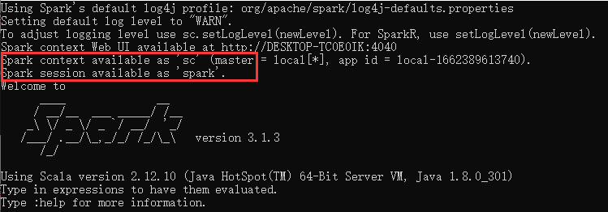


## 8.3 DataFrame

在 Spark 中，DataFrame 是一种以 RDD 为基础的分布式数据集，**类似于传统数据库中的二维表格**。DataFrame 与 RDD 的主要区别在于，**前者带有 schema 元信息，即 DataFrame 所表示的二维表数据集的每一列都带有名称和类型**，这使得 Spark SQL 得以洞察更多的结构信息，从而对藏于 DataFrame 背后的数据源以及作用于 DataFrame 之上的变换进行了针对性的优化，最终达到大幅提升运行时效率的目标。反观 RDD，由于无从得知所存数据元素的具体内部结构，Spark Core 只能在 Stage 层面进行简单、通用的流水线优化。

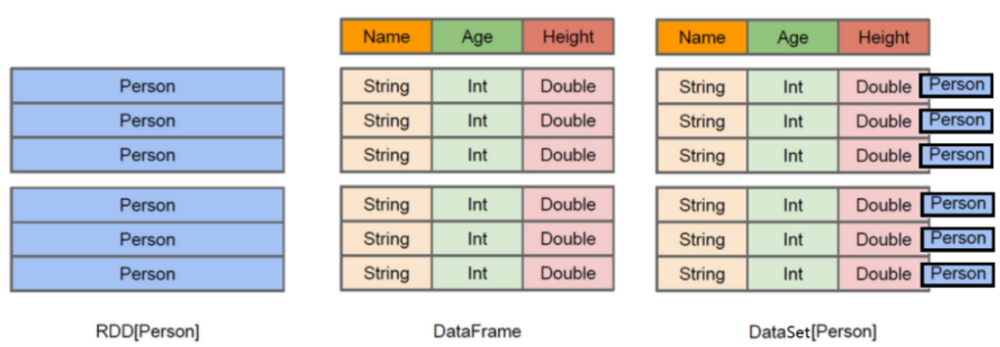

图中左侧的 RDD[Person] 虽然以 Person 为类型参数，但 Spark 框架本身不了解 Person 类的内部结构。而右侧的 DataFrame 却提供了详细的结构信息，使得 Spark SQL 可以清楚地知道该数据集中包含哪些列，每列的名称和类型各是什么。

与 Hive 类似，DataFrame 也支持嵌套数据类型（struct、array 和 map）。从 API 易用性的角度看，DataFrame API 提供的是一套高层的关系操作，比函数式的 RDD API 更加友好，门槛更低，同时它还为数据提供了 Schema 的视图，可以将其当做数据库中的一张表来对待。DataFrame 也是懒执行的，但性能上比 RDD 要高，主要原因：优化了执行计划，即查询计划通过 Spark catalyst optimiser 进行优化。

### 8.3.1 创建 DataFrame

在 Spark SQL 中，SparkSession 是创建 DataFrame 和执行 SQL 的入口，创建 DataFrame 有三种方式：通过 Spark 的数据源进行创建，从一个存在的 RDD 进行转换，以及从 HiveTable 进行查询返回。

```json
{"username":"zhangsan","age":20}
{"username":"lisi","age":30}
{"username":"wangwu","age":40}
```

```shell
# 查看Spark支持创建文件的数据源格式（Tab键提示）
scala> spark.read.
csv   format   jdbc   json   load   option   options   orc   parquet   schema   table   text   textFile

# 首先在Spark的bin/data目录中创建user.json文件，然后读取json文件创建DataFrame
# 注意，如果从内存中获取数据，spark可以知道数据类型具体是什么。如果是数字，默认作为Int处理，但是从文件中读取的数字，不能确定是什么类型，所以用bigint接收，可以和Long类型转换，但是和Int不能进行转换
scala> val df = spark.read.json("data/user.json")
df: org.apache.spark.sql.DataFrame = [age: bigint, username: string]

# 展示结果
scala> df.show
+---+--------+
|age|username|
+---+--------+
| 20|zhangsan|
| 30|    lisi|
| 40|  wangwu|
+---+--------+
```


### 8.3.2 SQL 语法

SQL 语法风格是指查询数据时使用 SQL 语句来查询，这种风格的**查询必须要有临时视图或者全局视图来辅助**。

```shell
# 对DataFrame创建一个临时表，也可使用createOrReplaceTempView
scala> df.createTempView("user")
# SQL查询结果展示
scala> spark.sql("select avg(age) from user").show
+--------+
|avg(age)|
+--------+
|    30.0|
+--------+

# 普通临时表是Session范围内的，若想应用范围内有效，可以使用全局临时表
scala> df.createGlobalTempView("people")
# 使用全局临时表时需要全路径访问，如：global_temp.people
scala> spark.newSession().sql("select * from global_temp.people").show()
+---+--------+
|age|username|
+---+--------+
| 20|zhangsan|
| 30|    lisi|
| 40|  wangwu|
+---+--------+
```


### 8.3.3 DSL 语法

DataFrame 提供一个特定领域语言（domain-specific language，DSL）去管理结构化的数据。可以在 Scala、 Java、Python 和 R 中使用 DSL，使用 DSL 语法风格不必创建临时视图。

```shell
# 查看DataFrame的Schema信息（查看DataFrame提供的方法，控制台输出“df.”，然后Tab键提示）
scala> df.printSchema
root
 |-- age: long (nullable = true)
 |-- username: string (nullable = true)
# 只查看username列数据
scala> df.select("username").show()
+--------+
|username|
+--------+
|zhangsan|
|    lisi|
|  wangwu|
+--------+
# 查看username列数据以及age+1数据，注意涉及到运算时, 每列都必须使用$, 或采用引号表达式：单引号+字段名
scala> df.select($"username", $"age" + 1).show
scala> df.select('username, 'age + 1 as "newage").show
+--------+------+
|username|newage|
+--------+------+
|zhangsan|    21|
|    lisi|    31|
|  wangwu|    41|
+--------+------+
# 按照age分组，查看数据条数
scala> df.groupBy("age").count.show
+---+-----+
|age|count|
+---+-----+
| 30|    1|
| 20|    1|
| 40|    1|
+---+-----+
```


### 8.3.4 RDD 与 DataFrame 转换

在 IDEA 中开发程序时，若需要 RDD 与 DataFrame 或者 DataSet 之间互相转换，那么需要引入`import spark.implicits._`，这里的 spark 不是 Scala 中的包名，而是创建的 SparkSession 对象的变量名称，所以必须先创建 SparkSession 对象再导入，且 Spark 对象不能使用 var 声明，因为 Scala 只支持 val 修饰的对象引入。在 spark-shell 中无需导入，自动完成此操作。

```shell
scala> val rdd = sc.makeRDD(List(1, 2, 3))
rdd: org.apache.spark.rdd.RDD[Int] = ParallelCollectionRDD[29] at makeRDD at <console>:24
# 通过toDF()将RDD转换为DataFrame
scala> rdd.toDF("id").show
+---+
| id|
+---+
|  1|
|  2|
|  3|
+---+
# 实际开发中，一般通过样例类将RDD转换为DataFrame
scala> case class User(name:String, age:Int)
defined class User
# toDF()参数若省略，则默认使用样例类的属性
scala> val df = sc.makeRDD(List(("zhangsan",30), ("lisi",40))).map(t => User(t._1, t._2)).toDF
df: org.apache.spark.sql.DataFrame = [name: string, age: int]
scala> df.show
+--------+---+
|    name|age|
+--------+---+
|zhangsan| 30|
|    lisi| 40|
+--------+---+

# DataFrame其实就是对RDD的封装，所以可以直接通过rdd()获取内部的RDD
scala> val rdd = df.rdd
rdd: org.apache.spark.rdd.RDD[org.apache.spark.sql.Row] = MapPartitionsRDD[51] at rdd at <console>:25
# 注意此时得到的RDD存储类型为Row
scala> val array = rdd.collect
array: Array[org.apache.spark.sql.Row] = Array([zhangsan,30], [lisi,40])
scala> array(0)
res13: org.apache.spark.sql.Row = [zhangsan,30]
scala> array(0)(0)
res14: Any = zhangsan
scala> array(0).getAs[String]("name")
res15: String = zhangsan
```


## 8.4 DataSet

DataSet 是 DataFrame 的一个扩展， 是 Spark 1.6 中新添加的一个数据抽象，它提供了 RDD 的优势，如强类型（需要提供对应的类型信息），lambda 函数等，同时提供了 Spark SQL 优化执行引擎的优点，也可以使用功能性的转换（操作 map，flatMap，filter 等）。

### 8.4.1 创建 DataSet

```shell
# 使用基本类型的序列创建DataSet。实际开发中，很少用到把序列转换成DataSet，更多是通过RDD来得到DataSet
scala> val baseTypeDS = Seq(1, 2, 3).toDS
ds: org.apache.spark.sql.Dataset[Int] = [value: int]
scala> baseTypeDS.show
+-----+
|value|
+-----+
|    1|
|    2|
|    3|
+-----+

# 使用样例类序列创建DataSet，样例类中每个属性的名称直接映射到DataSet中的字段名称
scala> case class Person(name: String, age: Long)
defined class Person
scala> val caseClassDS = Seq(Person("zhangsan", 2), Person("lisi", 3)).toDS()
caseClassDS: org.apache.spark.sql.Dataset[Person] = [name: string, age: bigint]
scala> caseClassDS.show
+--------+---+
|    name|age|
+--------+---+
|zhangsan|  2|
|    lisi|  3|
+--------+---+
```


### 8.4.2 RDD 与 DataSet 转换

SparkSQL 能够自动将包含有样例类的 RDD 转换成 DataSet，样例类定义了 table 的结构，其属性通过反射变成了表的列名，样例类可以包含诸如 Seq 或者 Array 等复杂的结构。

```shell
# 通过toDS()可以将RDD转换为DataSet
scala> case class User(name:String, age:Int)
defined class User
scala> val userDS = sc.makeRDD(List(("zhangsan",30), ("lisi",49))).map(t=>User(t._1, t._2)).toDS
userDS: org.apache.spark.sql.Dataset[User] = [name: string, age: int]

# DataSet其实也是对RDD的封装，所以可以直接通过rdd()获取内部的RDD
scala> userDS.rdd
res20: org.apache.spark.rdd.RDD[User] = MapPartitionsRDD[58] at rdd at <console>:26
# res20即为上一语句的默认结果名，也可以自己命名
scala> res20.collect
res21: Array[User] = Array(User(zhangsan,30), User(lisi,49))
```


### 8.4.3 DataFrame 与 DataSet 转换

DataFrame 其实是 DataSet 的特例，所以它们之间是可以互相转换的。源码中，DataFrame = DataSet[Row]，Row 是一个类型，所有的表结构信息都用 Row 来表示，因此 DataFrame 获取数据时需要指定顺序。

```shell
# 通过as[样例类]可以将DataFrame转换为DataSet
scala> case class User(name:String, age:Int)
defined class User
scala> val df = sc.makeRDD(List(("zhangsan",30), ("lisi",49))).toDF("name","age")
df: org.apache.spark.sql.DataFrame = [name: string, age: int]
scala> val ds = df.as[User]
ds: org.apache.spark.sql.Dataset[User] = [name: string, age: int]

# 通过toDF()可以将DataSet转换为DataFrame
scala> val df = ds.toDF
df: org.apache.spark.sql.DataFrame = [name: string, age: int]
```


### 8.4.4 RDD、DataFrame、DataSet 三者关系

在 SparkSQL 中，Spark 为我们提供了两个新的抽象，分别是 DataFrame 和 DataSet。RDD、DataFrame 、DataSet 产生的版本分别是 Spark 1.0、Spark 1.3、Spark 1.6，若这三个数据结构分别计算相同的数据，则会给出相同的结果，不同是的他们的执行效率和执行方式。在后期的 Spark 版本中，DataSet 有可能会逐步取代 RDD和 DataFrame 成为唯一的 API 接口。

1. **三者的共性**
   
   *  RDD、DataFrame、DataSet 都是 Spark 平台下的分布式弹性数据集，为处理超大型数据提供便利
   * 三者都有惰性机制，在进行创建、转换时不会立即执行，只有在遇到 Action 时，三者才会开始遍历运算
   * 三者都有 partition 的概念，且有许多共同的函数，如 filter、排序等;
   * 在对 DataFrame 和 Dataset 进行操作时，都需要这个包：import spark.implicits._（在创建 SparkSession 对象后尽量直接导入）
   * 三者都会根据 Spark 的内存情况自动缓存运算，这样即使数据量很大，也不用担心会内存溢出
   * DataFrame 和 DataSet 均可使用模式匹配获取各个字段的值和类型
   
2. **三者的区别**
   
   * RDD 一般和 Spark Mllib 同时使用，不支持 Spark SQL 操作
   * 与 RDD 和 Dataset 不同，DataFrame 每一行的类型固定为 Row，每一列的值没法直接访问，只有通过解析才能获取各个字段的值。DataFrame 与 DataSet 一般不与 Spark Mllib 同时使用，且两者均支持 Spark SQL 操作，还能注册临时表/视窗，进行 SQL 语句操作。DataFrame 与 DataSet 支持一些特别方便的保存方式，如保存为 CSV 可以带上表头，这样每一列的字段名一目了然。
   * Dataset 和 DataFrame 拥有完全相同的成员函数，区别只是每一行的数据类型不同。DataFrame 不解析每一行究竟有哪些字段，各个字段又是什么类型都无从得知，只能通过 getAS() 方法或模式匹配拿出特定字段。而 Dataset 中，每一行是什么类型是不一定的，在自定义样例类后可以获得每一行的信息。
   
3. **三者相互转换**

   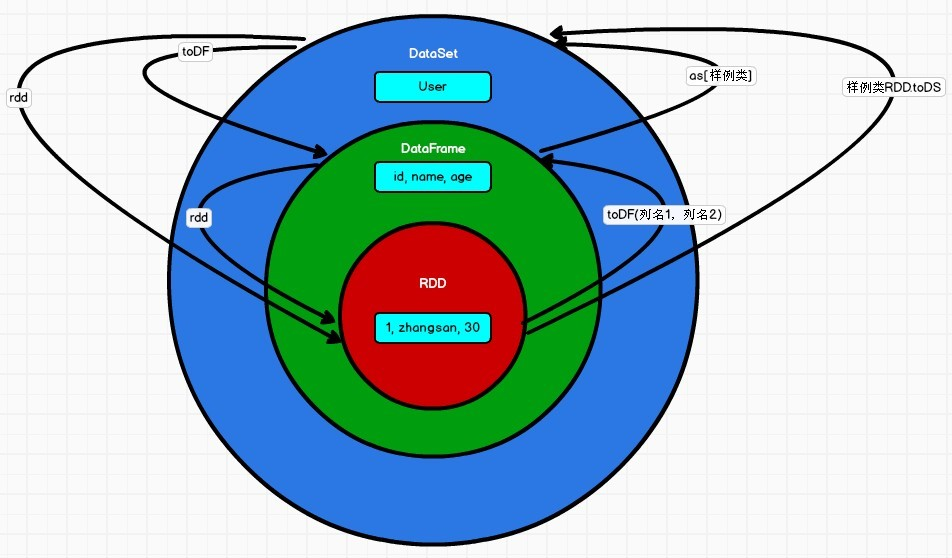


## 8.5 Spark SQL 开发

```xml
<!-- Spark SQL相关依赖 -->
<dependency>
    <groupId>org.apache.spark</groupId>
    <artifactId>spark-sql_2.13</artifactId>
    <version>3.3.0</version>
</dependency>
```

```java
object SparkSqlBasic {
    def main(args: Array[String]): Unit = {
        // 创建上下文环境配置对象
        val sparkConf = new SparkConf().setMaster("local[*]").setAppName("SparkSQL")
        // 创建SparkSession对象
        val spark = SparkSession.builder().config(sparkConf).getOrCreate()
        // RDD<=>DataFrame<=>DataSet转换需要引入隐式转换规则，否则无法转换，这里spark不是包名，是上下文环境对象名
        import spark.implicits._

        // 读取json文件创建DataFrame
        val df: DataFrame = spark.read.json("user.json")
        df.show()
            
        // SQL风格语法
        df.createOrReplaceTempView("user")
        spark.sql("select * from user").show

        // DSL风格语法
        df.select("age", "username").show
        df.select($"username", $"age" + 1 as "newage").show

        // DataFrame其实是特定泛型的DataSet
        val seq = Seq(1, 2, 3)
        val ds: Dataset[Int] = seq.toDS()
        ds.show()

        // RDD <=> DataFrame
        val rdd = spark.sparkContext.makeRDD(List((1, "zhangsan", 30), (2, "lisi", 40)))
        val df1: DataFrame = rdd.toDF("id", "name", "age")
        df1.show()
        val rdd1: RDD[Row] = df1.rdd
        rdd1.collect().foreach(println)

        // DataFrame <=> DataSet
        val ds1: Dataset[User] = df1.as[User]
        ds1.show()
        val df2: DataFrame = ds1.toDF()
        df2.show()

        // RDD <=> DataSet
        val ds2: Dataset[User] = rdd.map {
            case (id, name, age) => {
                User(id, name, age)
            }
        }.toDS()
        ds2.show()
        val rdd2: RDD[User] = ds2.rdd
        rdd2.collect().foreach(println)

        spark.close()
    }

    case class User(id: Int, name: String, age: Int)
}
```


## 8.6 用户自定义函数

### 8.6.1 UDF

用户可以通过 spark.udf 功能添加自定义函数，实现自定义功能。

```java
object SparkSqlUDF {
    def main(args: Array[String]): Unit = {
        val sparkConf = new SparkConf().setMaster("local[*]").setAppName("SparkSQL")
        val spark = SparkSession.builder().config(sparkConf).getOrCreate()
            
        val df = spark.read.json("user.json")
        df.createOrReplaceTempView("user")       
        // 注册UDF，功能是给字段username的值加一个前缀
        spark.udf.register("prefixName", (name: String) => {
            "Name: " + name
        })
        spark.sql("select age, prefixName(username) from user").show
        spark.close()
    }
}
```


### 8.6.2 UDAF

强类型的 Dataset 和弱类型的 DataFrame 都提供了相关的聚合函数， 如 count()、countDistinct()、avg() 等。除此之外，用户可以自定义聚合函数。通过继承 UserDefinedAggregateFunction 来实现用户自定义弱类型聚合函数。从 Spark3.0 版本后，UserDefinedAggregateFunction 已经不推荐使用，可以统一采用强类型聚合函数 Aggregator。

```java
object SparkSqlUDAF1 {
    def main(args: Array[String]): Unit = {
        val sparkConf = new SparkConf().setMaster("local[*]").setAppName("SparkSQL")
        val spark = SparkSession.builder().config(sparkConf).getOrCreate()
        
        val df = spark.read.json("user.json")
        df.createOrReplaceTempView("user")
        spark.udf.register("ageAvg", new MyAvgUDAF())
        spark.sql("select ageAvg(age) from user").show
        spark.close()
    }

    // 自定义聚合函数类计算年龄的平均值，继承UserDefinedAggregateFunction，并重写方法
    class MyAvgUDAF extends UserDefinedAggregateFunction{
        // 输入数据的结构：In
        override def inputSchema: StructType = {
            StructType(
                Array(
                    StructField("age", LongType)
                )
            )
        }
        
        // 缓冲区数据的结构：Buffer
        override def bufferSchema: StructType = {
            StructType(
                Array(
                    StructField("total", LongType),
                    StructField("count", LongType)
                )
            )
        }

        // 函数计算结果的数据类型：Out
        override def dataType: DataType = LongType

        // 函数的稳定性
        override def deterministic: Boolean = true

        // 缓冲区初始化
        override def initialize(buffer: MutableAggregationBuffer): Unit = {
            buffer.update(0, 0L)
            buffer.update(1, 0L)
        }

        // 根据输入的值更新缓冲区数据
        override def update(buffer: MutableAggregationBuffer, input: Row): Unit = {
            buffer.update(0, buffer.getLong(0) + input.getLong(0))
            buffer.update(1, buffer.getLong(1) + 1)
        }

        // 缓冲区数据合并
        override def merge(buffer1: MutableAggregationBuffer, buffer2: Row): Unit = {
            buffer1.update(0, buffer1.getLong(0) + buffer2.getLong(0))
            buffer1.update(1, buffer1.getLong(1) + buffer2.getLong(1))
        }

        // 计算平均值
        override def evaluate(buffer: Row): Any = {
            buffer.getLong(0)/buffer.getLong(1)
        }
    }
}
```

```java
object SparkSqlUDAF2 {
    def main(args: Array[String]): Unit = {
        val sparkConf = new SparkConf().setMaster("local[*]").setAppName("SparkSQL")
        val spark = SparkSession.builder().config(sparkConf).getOrCreate()

        val df = spark.read.json("user.json")
        df.createOrReplaceTempView("user")
        spark.udf.register("ageAvg", functions.udaf(new MyAvgUDAF()))
        spark.sql("select ageAvg(age) from user").show
        spark.close()
    }

    // 自定义聚合函数类计算年龄的平均值，继承Aggregator, 定义In、Buffer、Out泛型，并重写方法
    case class Buff(var total: Long, var count: Long)

    class MyAvgUDAF extends Aggregator[Long, Buff, Long] {
        // 缓冲区的初始化
        override def zero: Buff = {
            Buff(0L, 0L)
        }

        // 根据输入的数据更新缓冲区的数据
        override def reduce(buff: Buff, in: Long): Buff = {
            buff.total = buff.total + in
            buff.count = buff.count + 1
            buff
        }

        // 合并缓冲区
        override def merge(buff1: Buff, buff2: Buff): Buff = {
            buff1.total = buff1.total + buff2.total
            buff1.count = buff1.count + buff2.count
            buff1
        }

        // 计算结果
        override def finish(buff: Buff): Long = {
            buff.total / buff.count
        }

        // 缓冲区的编码操作，自定义类型一般为Encoders.product
        override def bufferEncoder: Encoder[Buff] = Encoders.product

        // 输出的编码操作，基本类型一般为Encoders.scalaxxx
        override def outputEncoder: Encoder[Long] = Encoders.scalaLong
    }
}
```


## 8.7 数据加载和保存

### 8.7.1 通用方式

SparkSQL 提供了通用的保存数据和数据加载的方式，这里的通用指的是使用相同的 API，根据不同的参数读取和保存不同格式的数据，**SparkSQL 默认读取和保存的文件格式为 parquet**。另外，保存操作可以使用一个枚举类 SaveMode，用来指明如何处理数据，这些 SaveMode 都是没有加锁的, 也不是原子操作。

| Scala/Java                      | Any Language     | Meaning                    |
| ------------------------------- | ---------------- | -------------------------- |
| SaveMode.ErrorIfExists(default) | "error"(default) | 如果文件已经存在则抛出异常 |
| SaveMode.Append                 | "append"         | 如果文件已经存在则追加     |
| SaveMode.Overwrite              | "overwrite"      | 如果文件已经存在则覆盖     |
| SaveMode.Ignore                 | "ignore"         | 如果文件已经存在则忽略     |

```shell
# 1.加载数据：spark.read.load
# format("format")：指定加载的数据类型，包括csv、jdbc、json、orc、parquet和textFile等
# load("path")：在csv、jdbc、json、orc、parquet和textFile格式下需要传入加载数据的路径
# option("options")：不同格式下需要传入的相应参数
# 以JSON格式为例，read.format("json").load("path")与read.json("path")等价
scala> spark.read.format("format")[.option("options")].load("path")

# 上面使用read API把文件加载到DataFrame再查询，其实也可以直接在文件上进行查询：文件格式.`文件路径`
scala> spark.sql("select * from json.`data/user.json`").show

# 2.保存数据：df.write.save
# 以JSON格式为例，write.format("json").save("path")与write.json("path")等价
scala> df.write.format("format")[.option("options")].save("path")

# 使用mode()方法来设置SaveMode
scala> df.write.mode("append").json("data/output")
```


### 8.7.2 Parquet、JSON 和 CSV

1. **Parquet**

   Spark SQL 的默认数据源为 Parquet 格式，它是一种能够有效存储嵌套数据的列式存储格式。当数据源为 Parquet 文件时，Spark SQL 可以方便地执行所有操作，不需要使用 format。修改配置项 spark.sql.sources.default 可修改默认数据源格式。

   ```shell
   # 加载Parquet数据
   scala> val df = spark.read.load("examples/src/main/resources/users.parquet")
   df: org.apache.spark.sql.DataFrame = [name: string, favorite_color: string ... 1 more field]
   scala> df.show
   +------+--------------+----------------+                                        
   |  name|favorite_color|favorite_numbers|
   +------+--------------+----------------+
   |Alyssa|          null|  [3, 9, 15, 20]|
   |   Ben|           red|              []|
   +------+--------------+----------------+
   
   # 保存Parquet数据
   scala> df.write.mode("append").save("data/output")
   ```

2. **JSON**

   Spark SQL 能够自动推测 JSON 数据集的结构，并将它加载为一个 Dataset[Row]，注意，Spark 读取的 JSON 文件不是传统的 JSON 文件，但每一行都应该是一个 JSON 串。

   ```shell
   # 加载JSON数据
   scala> val df = spark.read.json("examples/src/main/resources/employees.json")
   df: org.apache.spark.sql.DataFrame = [name: string, salary: bigint]
   scala> df.show
   +-------+------+
   |   name|salary|
   +-------+------+
   |Michael|  3000|
   |   Andy|  4500|
   | Justin|  3500|
   |  Berta|  4000|
   +-------+------+
   
   # 保存JSON数据
   scala> df.write.mode("overwrite").json("data/output")
   ```

3. **CSV**

   Spark SQL 可以配置 CSV 文件的列表信息，读取 CSV 文件时，第一行设置为数据列。

   ```shell
   # 加载CSV数据
   scala> val df = spark.read.format("csv").option("sep", ";").option("inferSchema", "true").option("header", "true").load("examples/src/main/resources/people.csv")
   df: org.apache.spark.sql.DataFrame = [name: string, age: int ... 1 more field]
   scala> df.show
   +-----+---+---------+
   | name|age|      job|
   +-----+---+---------+
   |Jorge| 30|Developer|
   |  Bob| 32|Developer|
   +-----+---+---------+
   
   # 保存CSV数据
   scala> df.write.mode("append").csv("data/output")
   ```


### 8.7.3 MySQL

Spark SQL 可以通过 JDBC 从关系型数据库中读取数据并创建 DataFrame，通过对 DataFrame 一系列的计算后，还可以将数据再写回关系型数据库。如果使用 spark-shell 操作，可在启动时指定相关的数据库驱动路径，如 `bin/spark-shell --jars mysql-connector-java-5.1.27-bin.jar`，或将相关的数据库驱动放到 Spark 的类路径下。

```xml
<dependency>
    <groupId>mysql</groupId>
    <artifactId>mysql-connector-java</artifactId>
    <version>5.1.27</version>
</dependency>
```

```scala
object SparkSqlJDBC {
    def main(args: Array[String]): Unit = {
        val sparkConf = new SparkConf().setMaster("local[*]").setAppName("SparkSQL")
        val spark = SparkSession.builder().config(sparkConf).getOrCreate()

        // 读取MySQL数据
        val df = spark.read
                .format("jdbc")
                .option("url", "jdbc:mysql://hadoop102:3306/spark_sql")
                .option("driver", "com.mysql.jdbc.Driver")
                .option("user", "root")
                .option("password", "111111")
                .option("dbtable", "user")
                .load()
        df.show
        
        // 保存MySQL数据
        df.write.format("jdbc")
                .option("url", "jdbc:mysql://hadoop102:3306/spark_sql")
                .option("driver", "com.mysql.jdbc.Driver")
                .option("user", "root")
                .option("password", "111111")
                .option("dbtable", "new_user")
                .mode(SaveMode.Append)
                .save()
        spark.close()
    }
}
```


### 8.7.4 Hive

1. **内嵌的 Hive**

   如果使用 Spark 内嵌的 Hive，则什么都不用做，直接使用即可。Hive 的元数据存储在 derby 中，默认仓库地址时是 $SPARK_HOME/spark-warehouse。

   ```shell
   scala> spark.sql("create table user(id int, name string, age int) row format delimited fields terminated by '\t'")
   scala> spark.sql("load data local inpath 'data/user.txt' into table user")
   
   scala> spark.sql("show tables").show
   +--------+---------+-----------+
   |database|tableName|isTemporary|
   +--------+---------+-----------+
   | default|     user|      false|
   +--------+---------+-----------+
   scala> spark.sql("select * from user").show
   +---+--------+---+
   | id|    name|age|
   +---+--------+---+
   |  1|zhangsan| 30|
   |  2|    lisi| 40|
   |  3|  wangwu| 50|
   +---+--------+---+
   ```

2. **外部的 Hive**

   如果想连接外部已经部署好的 Hive，需要通过以下几个步骤：

   * Spark 要接管 Hive 需要把 $HIVE_HOME/conf/hive-site.xml 拷贝到 $SPARK_HOME/conf/ 目录下
   * 把 MySQL 的驱动拷贝到 $SPARK_HOME/jars/目录下
   * 如果访问不到 HDFS，则需要把 $HADOOP_HOME/bin/hadoop目录下的 core-site.xml 和 hdfs-site.xml 拷贝到 $SPARK_HOME/conf/目录下
   * 后台启动 Hive 元数据服务：`nohup hive --service metastore &`
   * 重启 spark-shell 进行命令行操作：`spark.sql("show tables").show`

   ```xml
   <dependency>
       <groupId>mysql</groupId>
       <artifactId>mysql-connector-java</artifactId>
       <version>5.1.27</version>
   </dependency>
   <dependency>
       <groupId>org.apache.spark</groupId>
       <artifactId>spark-hive_2.13</artifactId>
       <version>3.3.0</version>
   </dependency>
   <dependency>
       <groupId>org.apache.hive</groupId>
       <artifactId>hive-exec</artifactId>
       <version>1.2.1</version>
   </dependency>
   ```

   ```scala
   // 使用SparkSQL连接外置的Hive，需要首先增加对应的依赖关系（包含MySQL驱动），然后拷贝hive-size.xml文件到classpath下（即resource目录下），最后启用Hive的支持
   object SparkSqlHive {
       def main(args: Array[String]): Unit = {
           System.setProperty("HADOOP_USER_NAME", "maomao")
           val sparkConf = new SparkConf().setMaster("local[*]").setAppName("SparkSQL")
           // enableHiveSupport()启用Hive的支持
           val spark = SparkSession.builder().enableHiveSupport().config(sparkConf).getOrCreate()
           spark.sql("show tables").show
           spark.close()
       }
   }
   ```

3. **运行 Spark SQL CLI**

   Spark SQL CLI 可以很方便的在本地运行 Hive 元数据服务，以及从命令行执行查询任务。在 Spark 目录下执行如下命令启动 Spark SQL CLI，直接执行 SQL 语句，类似 Hive 窗口

   ```shell
   [maomao@hadoop102 spark-3.1.3-bin-hadoop3.2]$ bin/spark-sql
   spark-sql (default)> show tables;
   ```

4. **运行 Spark beeline**

   Spark Thrift Server 是 Spark 社区基于 HiveServer2 实现的一个 Thrift 服务，旨在无缝兼容 HiveServer2。因为 Spark Thrift Server 的接口和协议都和 HiveServer2 完全一致，因此我们部署好 Spark Thrift Server 后，可以直接使用 Hive 的 beeline 访问 Spark Thrift Server 执行相关语句。由于 Spark Thrift Server 目的也只是取代 HiveServer2，因此它依旧可以和 Hive Metastore 进行交互，获取到 Hive 的元数据。

   ```shell
   [maomao@hadoop102 spark-3.1.3-bin-hadoop3.2]$ sbin/start-thriftserver.sh
   [maomao@hadoop102 spark-3.1.3-bin-hadoop3.2]$ bin/beeline -u jdbc:hive2://hadoop102:10000 -n root
   0: jdbc:hive2://hadoop102:10000> show tables;
   ```


# 9. Spark Streaming

## 9.1 Spark Streaming 介绍

从处理方式划分，可以将数据处理分为流式处理和批量（batch）处理；从处理延迟划分，可以将数据处理分为实时处理（毫秒级别）和离线处理（小时、天级别）。**Spark Streaming 是准实时、微批次的数据处理框架，用于流式数据的处理**，其支持的数据输入源很多，如 Kafka、 Flume、Twitter、ZeroMQ 和简单的 TCP 套接字等，数据输入后可以用 Spark 的高度抽象原语，如 map、reduce、join、window 等进行运算，而结果也能保存在很多地方，如 HDFS、数据库等。

与 Spark 基于 RDD 的概念相似，**Spark Streaming 使用离散化流（discretized stream）作为抽象表示，叫作DStream**。在内部实现上，DStream 由一系列连续的 RDD 来表示，每个 RDD 含有一段时间间隔内的数据，因此得名”离散化“，换句话说，DStream 其实是对 RDD 在实时数据处理场景的一种封装。


Spark 1.5 版本以前，用户若要限制接收器 Receiver 的数据接收速率，可以通过设置静态参数 spark.streaming.receiver.maxRate 来实现，此举虽然可以通过限制接收速率，来适配当前的处理能力，防止内存溢出，但也会引入其它问题，如 producer 数据生产高于 maxRate，当前集群处理能力也高于 maxRate，就会造成资源利用率下降等问题。为了更好的协调数据接收速率与资源处理能力，Spark 1.5 开始，Spark Streaming 可以动态控制数据接收速率来适配集群数据处理能力，称为**背压机制（Backpressure）**，它根据 JobScheduler 反馈作业的执行信息来动态调整 Receiver 数据接收率，可以设置属性 spark.streaming.backpressure.enabled 控制是否启用背压机制，默认不启用。


## 9.2 DStream 创建

### 9.2.1 RDD 队列

在测试过程中，可以通过 RDD 队列来创建 DStream，每一个推送到该队列中的 RDD，都会作为一个 DStream 进行处理。

```scala
object RDDQueueDS {
    def main(args: Array[String]): Unit = {
        val sc = new SparkConf().setMaster("local[*]").setAppName("SparkStreaming")
        // 创建StreamingContext时，需要传递两个参数，分别是环境配置、批量处理的周期（采集周期）
        val ssc = new StreamingContext(sc, Seconds(3))

        val rddQueue = new mutable.Queue[RDD[Int]]()
        val rddDS = ssc.queueStream(rddQueue, oneAtATime = false)
        val mappedStream = rddDS.map((_, 1))
        val reducedStream = mappedStream.reduceByKey(_ + _)
        reducedStream.print()

        // 启动采集器
        ssc.start()
        // 循环创建RDD，并将其向加入RDD队列
        for (_ <- 1 to 5) {
            rddQueue += ssc.sparkContext.makeRDD(1 to 10, 10)
            Thread.sleep(2000)
        }
        // 由于SparkStreaming采集器是长期执行的任务，所以不能直接关闭，需要等待采集器的关闭
        ssc.awaitTermination()
    }
}
```


### 9.2.2 自定义数据源

```scala
object CustomDS {
    def main(args: Array[String]): Unit = {
        val sc = new SparkConf().setMaster("local[*]").setAppName("SparkStreaming")
        val ssc = new StreamingContext(sc, Seconds(3))

        val messageDS: ReceiverInputDStream[String] = ssc.receiverStream(new MyReceiver())
        messageDS.print()

        ssc.start()
        ssc.awaitTermination()
    }

    // 自定义数据采集器，需要继承Receiver，定义泛型, 传递参数，并重写方法
    class MyReceiver extends Receiver[String](StorageLevel.MEMORY_ONLY) {
        private var flag = true

        override def onStart(): Unit = {
            new Thread(() => {
                while (flag) {
                    val message = "采集的数据为：" + new Random().nextInt(10).toString
                    store(message)
                    Thread.sleep(500)
                }
            }).start()
        }

        override def onStop(): Unit = {
            flag = false;
        }
    }
}
```


### 9.2.3 Kafka 数据源

Kafka 数据源有两种版本选型，一种是 ReceiverAPI，它需要一个专门的 Executor 去接收数据，然后发送给其他的 Executor 做计算，这种方式接收数据的 Executor 和计算的 Executor 速度有所不同，当接收数据的 Executor 速度大于计算的 Executor 速度，就会导致计算数据的节点内存溢出，早期版本中提供此方式，当前版本不适用。另一种选型是 DirectAPI，它由计算的 Executor 来主动消费 Kafka 的数据，速度由自身控制。

```xml
<dependency>
    <groupId>org.apache.spark</groupId>
    <artifactId>spark-streaming-kafka-0-10_2.13</artifactId>
    <version>3.3.0</version>
</dependency>
```

```scala
object KafkaDS {
    def main(args: Array[String]): Unit = {
        val sparkConf = new SparkConf().setMaster("local[*]").setAppName("SparkStreaming")
        val ssc = new StreamingContext(sparkConf, Seconds(3))

        // 定义Kafka参数
        val kafkaParam: Map[String, Object] = Map[String, Object](
            ConsumerConfig.BOOTSTRAP_SERVERS_CONFIG -> "hadoop102:9092,hadoop103:9092,hadoop104:9092",
            ConsumerConfig.GROUP_ID_CONFIG -> "spark-topic-group",
            "key.deserializer" -> "org.apache.kafka.common.serialization.StringDeserializer",
            "value.deserializer" -> "org.apache.kafka.common.serialization.StringDeserializer"
        )

        // 读取Kafka数据创建DStream
        val kafkaDS: InputDStream[ConsumerRecord[String, String]] = KafkaUtils.createDirectStream[String, String](
            ssc,
            LocationStrategies.PreferConsistent,
            ConsumerStrategies.Subscribe[String, String](Set("spark-topic"), kafkaParam)
        )
        kafkaDS.map(_.value()).print()
        
        ssc.start()
        ssc.awaitTermination()
    }
}
```


## 9.3 DStream 转换

DStream 上的操作与 RDD 类似，分为 Transformations（转换）和 Output Operations（输出）两种，此外，转换操作中还有一些比较特殊的原语，如 updateStateByKey()、transform() 以及各种 Window 相关的原语。

### 9.3.1 无状态转换

无状态转化操作就是把简单的 RDD 转化操作应用到每个批次上，也就是转化 DStream 中的每一个 RDD。注意，针对键值对的 DStream 转化操作，如 reduceByKey()，要添加 import StreamingContext._ 才能在 Scala 中使用。

1. **Transform**

   Transform 允许 DStream 上执行任意的 RDD-to-RDD 函数，即使这些函数并没有在 DStream API 中暴露出来，通过该函数可以方便的扩展 Spark API。该函数每批次调度一次，其实也就是对 DStream 中的 RDD 应用转换。

   ```scala
   object TransformState {
       def main(args: Array[String]): Unit = {
           val sparkConf = new SparkConf().setMaster("local[*]").setAppName("SparkStreaming")
           val ssc = new StreamingContext(sparkConf, Seconds(3))
           // 服务端使用netcat工具产生流式数据，启动命令为：nc -lp 9999
           val lines = ssc.socketTextStream("hadoop102", 9999)
   
           // transform方法可以获取到底层RDD后进行操作，适用场景有：DStream功能不完善、需要代码周期性的执行（相比传统代码，多了Code2处的周期性执行）
           // Code1：Driver端
           val ds1: DStream[String] = lines.transform(
               rdd => {
                   // Code2：Driver端，周期性执行
                   rdd.map(
                       str => {
                           // Code3：Executor端
                           str
                       }
                   )
               }
           )
           
           val ds2: DStream[String] = lines.map(
               str => {
                   str
               }
           )
   
           ssc.start()
           ssc.awaitTermination()
       }
   }
   ```

2. **join**

   两个流之间的 join 需要两个流的批次大小一致，这样才能做到同时触发计算，计算过程就是对当前批次的两个流中各自的 RDD 进行 join，与两个 RDD 的 join 效果相同。

   ```scala
   object JoinState {
       def main(args: Array[String]): Unit = {
           val sc = new SparkConf().setMaster("local[*]").setAppName("SparkStreaming")
           val ssc = new StreamingContext(sc, Seconds(3))
   
           val ds1 = ssc.socketTextStream("hadoop102", 9999)
           val ds2 = ssc.socketTextStream("hadoop102", 8888)
           val map1: DStream[(String, Int)] = ds1.map((_, 9))
           val map2: DStream[(String, Int)] = ds2.map((_, 8))
           
           // 所谓的DStream的Join操作，其实就是两个RDD的join
           val joinDS: DStream[(String, (Int, Int))] = map1.join(map2)
           joinDS.print()
   
           ssc.start()
           ssc.awaitTermination()
       }
   }
   
   ```


### 9.3.2 有状态转换

1. **UpdateStateByKey**

   UpdateStateByKey 原语用于记录历史记录，有时我们需要在 DStream 中跨批次维护状态，如流计算中累加WordCount。针对这种情况，updateStateByKey() 为我们提供了对一个状态变量的访问，用于键值对形式的 DStream。给定一个由（键，事件）对构成的 DStream，并传递一个指定如何根据新事件更新每个键对应状态的函数，它可以构建出一个新的 DStream，其内部数据为（键，事件） 对。

   ```scala
   object UpdateStateByKeyState {
       def main(args: Array[String]): Unit = {
           val sc = new SparkConf().setMaster("local[*]").setAppName("SparkStreaming")
           val ssc = new StreamingContext(sc, Seconds(3))
           // 使用有状态操作时，需要设定检查点路径
           ssc.checkpoint("checkpoint_path")
           val ds = ssc.socketTextStream("hadoop102", 9999)
           val wordToOne = ds.map((_, 1))
   
           // 无状态数据操作，只对当前采集周期内的数据进行处理
           // val wordToCount = wordToOne.reduceByKey(_+_)
   
           // 在某些场合下，需要保留数据统计结果（状态），实现数据的汇总，如统计从运行开始以来单词的总次数
           // updateStateByKey根据key对数据状态进行更新，传递的两个参数分别表示数据流和缓冲区中相同key的value值
           val state = wordToOne.updateStateByKey(
               (seq: Seq[Int], buff: Option[Int]) => {
                   val newCount = buff.getOrElse(0) + seq.sum
                   Option(newCount)
               }
           )
           state.print()
   
           ssc.start()
           ssc.awaitTermination()
       }
   }
   ```
   
2. **Window**

   Window 操作可以设置窗口的大小和滑动窗口的间隔来动态地获取当前 Steaming 的允许状态，所有基于窗口的操作都需要两个参数，分别为窗口时长（计算内容的时间范围）以及滑动步长（隔多久触发一次计算），这两者都必须为采集周期大小的整数倍。

   ```scala
   object WindowState {
       def main(args: Array[String]): Unit = {
           val sparkConf = new sc().setMaster("local[*]").setAppName("SparkStreaming")
           val ssc = new StreamingContext(sc, Seconds(3))
   
           val lines = ssc.socketTextStream("hadoop102", 9999)
           val wordToOne = lines.map((_, 1))
           // window的两个参数分别表示窗口时长和滑动步长
           val windowDS: DStream[(String, Int)] = wordToOne.window(Seconds(6), Seconds(6))
           val wordToCount = windowDS.reduceByKey(_ + _)
           wordToCount.print()
   
           ssc.start()
           ssc.awaitTermination()
       }
   }
   ```


## 9.4 DStream 输出

输出操作指定了对流数据经转化操作得到的数据所要执行的操作，如把结果推入外部数据库或输出到屏幕上。与 RDD 中的惰性求值类似，如果一个 DStream 及其派生出的 DStream 都没有被执行输出操作，那么这些 DStream 就都不会被求值，如果 StreamingContext 中没有设定输出操作，整个 Context 就都不会启动。

1. print()：在运行流程序的驱动结点上打印 DStream 中每批次数据的最开始 10 个元素，常用于开发和调试
2. saveAsTextFiles(prefix, [suffix])：以 text 文件形式存储这个 DStream 的内容，每批次的存储文件名基于参数命名为 prefix-TIME_IN_MS[.suffix]
3. saveAsObjectFiles(prefix, [suffix])：以 Java 对象序列化的方式将 Stream 中的数据保存为 SequenceFiles，每批次的存储文件名基于参数命名为 prefix-TIME_IN_MS[.suffix]
4. saveAsHadoopFiles(prefix, [suffix])：将 Stream 中的数据保存为 Hadoop files，每批次的存储文件名基于参数命名为 prefix-TIME_IN_MS[.suffix]
5. foreachRDD(func)：这是最通用的输出操作，即将函数 func 用于产生于 stream 的每一个RDD，其中参数传入的函数 func 应该实现将每一个 RDD 中数据推送到外部系统，如将 RDD 存入文件或者通过网络将其写入数据库


## 9.5 DStream 优雅关闭

流式任务需要 7 x 24 小时执行，但是有时涉及到升级代码需要主动停止程序，但是分布式程序，没办法做到一个个进程去杀死，所以配置优雅关闭就显得至关重要了。

```scala
object CloseDS {
    def main(args: Array[String]): Unit = {
        // 从检查点恢复上次运行，可选操作
        val ssc = StreamingContext.getActiveOrCreate("checkpoint_path", () => {
            val sc = new SparkConf().setMaster("local[*]").setAppName("SparkStreaming")
            val ssc = new StreamingContext(sc, Seconds(3))
            val lines = ssc.socketTextStream("hadoop103", 9999)
            lines.map((_, 1)).print()
            ssc
        })

        ssc.checkpoint("checkpoint_path")
        ssc.start()

        // 优雅地关闭指的是计算节点不再接收新数据，而将现有数据处理完毕，然后关闭
        // 想要关闭采集器，需要创建新的线程，实际开发中，在第三方程序中增加关闭状态，此处直接睡眠模拟
        new Thread(() => {
            Thread.sleep(5000)
            val state: StreamingContextState = ssc.getState()
            if (state == StreamingContextState.ACTIVE) {
                ssc.stop(true, true)
            }
            System.exit(0)
        }).start()

        ssc.awaitTermination()
    }
}
```


# 参考

1. 《大数据处理框架 Apache Spark 设计与实现》
2. [Spark 官网](https://spark.apache.org/)
3. [b 站 - 大数据 Spark](https://www.bilibili.com/video/BV11A411L7CK?spm_id_from=333.337.search-card.all.click&vd_source=03ee00a529e3c4f9c2d8c6f412586123)