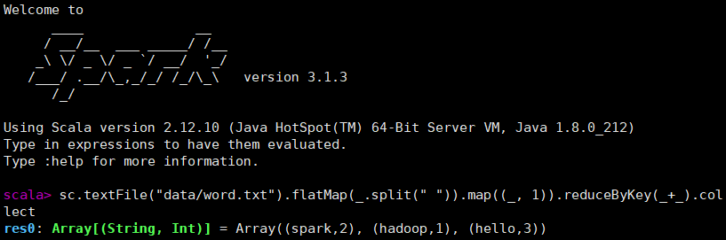

# 1. Spark 介绍

## 1.1 Spark 运行环境

### 1.1.1 Local 模式

1. **解压缩文件**

   * 上传 Spark 安装包到 hadoop102 的 `/opt/software/` 目录下
   * 解压 Spark 到 `/opt/module/`目录：`tar -xvf spark-3.1.3-bin-hadoop3.2.tar -C /opt/module/`

2. **启动 Local 环境**

   * 进入解压缩目录，执行命令行工具脚本：`bin/spark-shell`
   * 启动成功后，可在浏览器中访问 Web UI 监控页面：http://hadoop102:4040

3. **命令行工具**

   * 在 $SPARK_HOME/data 目录下，新建单词统计文件：`vim word.txt`

     ```txt
     hello spark
     hello hadoop
     hello spark
     ```

   * 在脚本执行的命令行中执行单词统计：`sc.textFile("data/word.txt").flatMap(_.split(" ")).map((_, 1)).reduceByKey(_+_).collect`

     

4. **提交应用**

   * 退出命令行脚本，尝试提交计算 PI 的示例程序：`bin/spark-submit --class org.apache.spark.examples.SparkPi --master local[2] ./examples/jars/spark-examples_2.12-3.1.3.jar 10`


### 1.1.2 Standalone 模式

1. **配置集群**

   * 集群部署规划：

     |       | hadoop102      | hadoop103 | hadoop104 |
     | ----- | -------------- | --------- | --------- |
     | Spark | master、worker | worker    | worker    |

   * 进入 $SPARK_HOME/conf 目录，修改 slaves.template 文件名为 slaves，并添加 work 节点：`mv workers.template workers && vim workers`

     ```
     hadoop102
     hadoop103
     hadoop104
     ```

   * 修改 spark-env.sh.template 文件名为 spark-env.sh，并添加 JDK 环境变量和集群对应的 master 节点：`mv spark-env.sh.template spark-env.sh && vim spark-env.sh`

     ```shell
     export JAVA_HOME=/opt/module/jdk1.8.0_212
     SPARK_MASTER_HOST=hadoop102
     SPARK_MASTER_PORT=7077
     ```

   * 分发 spark 目录：`xsync /opt/module/spark-3.1.3-bin-hadoop3.2/`

2. **启动集群**

   * 执行脚本启动集群：`sbin/start-all.sh`
   * 查看服务器运行进程：`jpsall`
   * 浏览器中访问 master 资源监控 Web UI 监控页面：http://hadoop102:8080

3. **提交应用**

   * 尝试提交计算 PI 的示例程序：`bin/spark-submit --class org.apache.spark.examples.SparkPi --master spark://hadoop102:7077 ./examples/jars/spark-examples_2.12-3.1.3.jar 10`

4. **配置历史服务**

   * 修改 spark-defaults.conf.template 文件名为 spark-defaults.conf，配置日志存储路径：`mv spark-defaults.conf.template spark-defaults.conf && vim spark-defaults.conf`

     ```shell
     # 需要启动Hadoop集群，且HDFS上的directory目录需要提前存在：
     # 启动Hadoop集群后，执行创建目录命令：hadoop fs -mkdir /directory
     spark.eventLog.enabled true
     spark.eventLog.dir hdfs://hadoop102:8020/directory
     ```

   * 修改 spark-env.sh，添加日志配置：`vim spark-env.sh`

     ```shell
     # 参数依次为：WEB UI访问的端口、历史服务器日志存储路径、保存Application历史记录的个数
     export SPARK_HISTORY_OPTS="
     -Dspark.history.ui.port=18080
     -Dspark.history.fs.logDirectory=hdfs://hadoop102:8020/directory
     -Dspark.history.retainedApplications=30"
     ```

   * 分发 conf 目录：`xsync conf`

   * 重新历史服务：`sbin/start-history-server.sh`

   * 重新提交计算 PI 的示例程序，查看历史服务：http://hadoop102:18080

5. **配置高可用**

   * 集群部署规划：由于当前集群 Master 节点只有一个，所以存在单点故障问题，需要配置多个 Master 节点，一旦活跃状态的 Master 发生故障，由备用 Master 提供服务

     |       | hadoop102          | hadoop103          | hadoop104  |
     | ----- | ------------------ | ------------------ | ---------- |
     | Spark | master、worker、zk | master、worker、zk | worker、zk |

   * 启动 zk：`zk.sh start`

   * 修改 spark-env.sh，添加日志配置：`vim spark-env.sh`

     ```shell
     # 注释如下内容
     #SPARK_MASTER_HOST=hadoop102
     #SPARK_MASTER_PORT=7077
     
     # 添加如下内容
     # Master监控页面默认访问端口为8080，但是可能会和ZK冲突，所以改成8989
     SPARK_MASTER_WEBUI_PORT=8989
     export SPARK_DAEMON_JAVA_OPTS="
     -Dspark.deploy.recoveryMode=ZOOKEEPER
     -Dspark.deploy.zookeeper.url=hadoop102,hadoop103,hadoop104
     -Dspark.deploy.zookeeper.dir=/spark"
     ```

   * 分发 conf 目录：`xsync conf`

   * 重新启动集群：`sbin/stop-all.sh && sbin/start-all.sh`

   * 在 hadoop103 上，启动单独的 Master 节点：`sbin/start-master.sh`

   * 此时 hadoop103 节点 Master 处于备用状态（STANDBY）：http://hadoop103:8989

   * 尝试提交计算 PI 的示例程序：`bin/spark-submit --class org.apache.spark.examples.SparkPi --master spark://hadoop102:7077,hadoop103:7077 ./examples/jars/spark-examples_2.12-3.1.3.jar 10`

   * 测试 Master 宕机，jps 命令查看 hadoop102 进程，并使用 kill 命令停止 Master 进程

   * 查看 hadoop103  的 Master 资源监控 WEB UI，稍等一段时间后，Master 状态提升为活动状态（ALIVE）


### 1.1.3 Yarn 模式


### 1.1.4 K8s 模式


