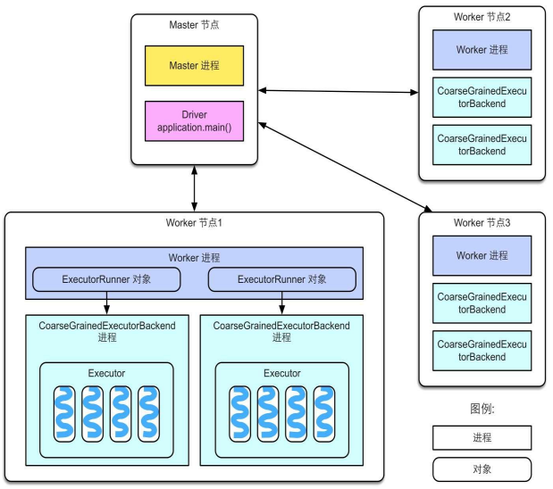
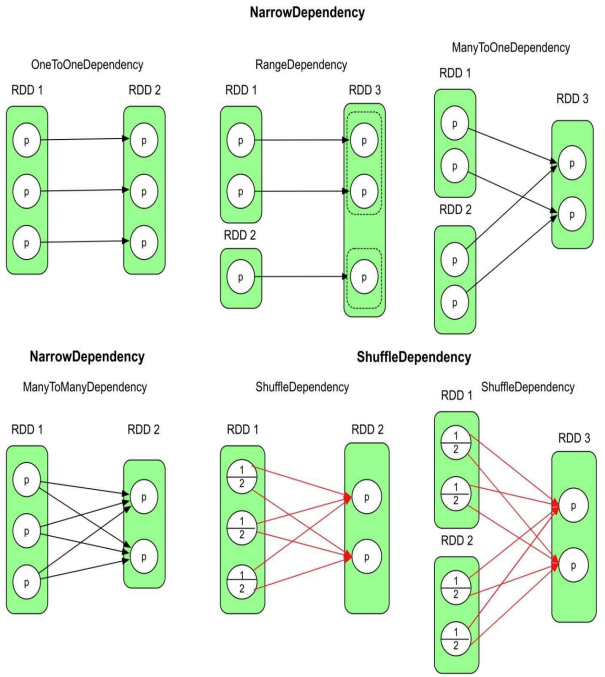

# 1. Spark 入门

## 1.1 Spark 介绍

### 1.1.1 大数据框架四层结构

大数据处理框架答大体可以分为四层结构：用户层、分布式数据并行处理层、资源管理与任务调度层、物理执行层。

1. 用户层
   * 输入数据：对于批式大数据处理框架，如 Hadoop、Spark，用户在提交作业之前，需要提前准备好输入数据。输入数据一般以分块（如以 128M 为一块）的形式预先存储，可以存放在分布式文件系统（如 HDFS）和分布式 KV 数据库（如 HBase）上，也可以存放在关系数据库中。对于流式大数据处理框架，如 Spark Streaming、Flink，输入数据可以来自网络流（Socket）、消息队列（Kafka），数据以微批或者连续的形式进入流式大数据处理框架
   * 用户代码：可以是用户手写的 MR 代码，或是基于其他大数据处理框架的具体应用的处理流程代码。
   * 配置参数：分为两类，一类是与资源相关的配置参数，如 buffer size 定义框架缓冲区的大小，影响 MR 任务的内存用量。另一类是与数据流相关的配置参数，如 Hadoop 和 Spark 中都可以设置 partition() 函数、数据分块大小。
2. 分布式数据并行处理层
3. 资源管理与任务调度层
4. 物理执行层


### 1.1.2 Spark 核心模块

Spark 是一种**基于内存**的快速、通用、可扩展的大数据分析计算引擎。


## 1.2 Spark 安装部署

Spark 官网提供了 Local、Standalone、Mesos、YARN、K8s 等版本部署 Spark，它们的主要区别是：Standalone 版本的资源管理和任务调度器由 Spark 系统本身负责，其他版本的资源管理和任务调度器则依赖于第三方框架，如 YARN 可以同时管理 Spark 任务和 Hadoop MR 任务。

### 1.2.1 Local 模式

1. **解压缩文件**

   * 上传 Spark 安装包到 hadoop102 的 `/opt/software/` 目录下
   * 解压 Spark 到 `/opt/module/`目录：`tar -xvf spark-3.1.3-bin-hadoop3.2.tar -C /opt/module/`

2. **启动 Local 环境**

   * 进入解压缩目录，执行命令行工具脚本：`bin/spark-shell`
   * 启动成功后，可在浏览器中访问 Web UI 监控页面：hadoop102:4040

3. **命令行工具**

   * 在 $SPARK_HOME/data 目录下，新建单词统计文件：`vim word.txt`

     ```txt
     hello spark
     hello hadoop
     hello spark
     ```

   * 在脚本执行的命令行中执行单词统计：`sc.textFile("data/word.txt").flatMap(_.split(" ")).map((_, 1)).reduceByKey(_+_).collect`

4. **提交应用**

   * 退出命令行脚本，尝试提交计算 PI 的示例程序：`bin/spark-submit --class org.apache.spark.examples.SparkPi --master local[2] ./examples/jars/spark-examples_2.12-3.1.3.jar 10`


### 1.2.2 Standalone 模式

1. **配置集群**

   * 集群部署规划：

     |       | hadoop102      | hadoop103 | hadoop104 |
     | ----- | -------------- | --------- | --------- |
     | Spark | master、worker | worker    | worker    |

   * 进入 $SPARK_HOME/conf 目录，修改 slaves.template 文件名为 slaves，并添加 work 节点：`mv workers.template workers && vim workers`

     ```
     hadoop102
     hadoop103
     hadoop104
     ```

   * 修改 spark-env.sh.template 文件名为 spark-env.sh，并添加 JDK 环境变量和集群对应的 master 节点：`mv spark-env.sh.template spark-env.sh && vim spark-env.sh`

     ```shell
     export JAVA_HOME=/opt/module/jdk1.8.0_212
     SPARK_MASTER_HOST=hadoop102
     SPARK_MASTER_PORT=7077
     ```

   * 分发 spark 目录：`xsync /opt/module/spark-3.1.3-bin-hadoop3.2/`

2. **启动集群**

   * 执行脚本启动集群：`sbin/start-all.sh`
   * 查看服务器运行进程：`jpsall`
   * 浏览器中访问 master 资源监控 Web UI 监控页面：hadoop102:8080

3. **提交应用**

   * 尝试提交计算 PI 的示例程序：`bin/spark-submit --class org.apache.spark.examples.SparkPi --master spark://hadoop102:7077 ./examples/jars/spark-examples_2.12-3.1.3.jar 10`

4. **配置历史服务**

   * 修改 spark-defaults.conf.template 文件名为 spark-defaults.conf，配置日志存储路径：`mv spark-defaults.conf.template spark-defaults.conf && vim spark-defaults.conf`

     ```shell
     # 需要启动Hadoop集群，且HDFS上的directory目录需要提前存在：
     # 启动Hadoop集群后，执行创建目录命令：hadoop fs -mkdir /directory
     spark.eventLog.enabled true
     spark.eventLog.dir hdfs://hadoop102:8020/directory
     ```

   * 修改 spark-env.sh，添加日志配置：`vim spark-env.sh`

     ```shell
     # 参数依次为：WEB UI访问的端口、历史服务器日志存储路径、保存Application历史记录的个数
     export SPARK_HISTORY_OPTS="
     -Dspark.history.ui.port=18080
     -Dspark.history.fs.logDirectory=hdfs://hadoop102:8020/directory
     -Dspark.history.retainedApplications=30"
     ```

   * 分发 conf 目录：`xsync conf`

   * 重启历史服务：`sbin/stop-history-server.sh && sbin/start-history-server.sh`

   * 重新提交计算 PI 的示例程序，查看历史服务（也可从 Hadoop 执行任务页面：hadoop103:8088，选择 history 跳转）：hadoop102:18080

5. **配置高可用**

   * 集群部署规划：由于当前集群 Master 节点只有一个，所以存在单点故障问题，需要配置多个 Master 节点，一旦活跃状态的 Master 发生故障，由备用 Master 提供服务

     |       | hadoop102          | hadoop103          | hadoop104  |
     | ----- | ------------------ | ------------------ | ---------- |
     | Spark | master、worker、zk | master、worker、zk | worker、zk |

   * 启动 zk：`zk.sh start`

   * 修改 spark-env.sh，添加日志配置：`vim spark-env.sh`

     ```shell
     # 注释如下内容
     #SPARK_MASTER_HOST=hadoop102
     #SPARK_MASTER_PORT=7077
     
     # 添加如下内容
     # Master监控页面默认访问端口为8080，但是可能会和ZK冲突，所以改成8989
     SPARK_MASTER_WEBUI_PORT=8989
     export SPARK_DAEMON_JAVA_OPTS="
     -Dspark.deploy.recoveryMode=ZOOKEEPER
     -Dspark.deploy.zookeeper.url=hadoop102,hadoop103,hadoop104
     -Dspark.deploy.zookeeper.dir=/spark"
     ```

   * 分发 conf 目录：`xsync conf`

   * 重新启动集群：`sbin/stop-all.sh && sbin/start-all.sh`

   * 在 hadoop103 上，启动单独的 Master 节点：`sbin/start-master.sh`

   * 此时 hadoop103 节点 Master 处于备用状态（STANDBY）：hadoop103:8989

   * 尝试提交计算 PI 的示例程序：`bin/spark-submit --class org.apache.spark.examples.SparkPi --master spark://hadoop102:7077,hadoop103:7077 ./examples/jars/spark-examples_2.12-3.1.3.jar 10`

   * 测试 Master 宕机，jps 命令查看 hadoop102 进程，并使用 kill 命令停止 Master 进程

   * 查看 hadoop103  的 Master 资源监控 WEB UI，稍等一段时间后，Master 状态提升为活动状态（ALIVE）


### 1.2.3 YARN 模式

独立部署（Standalone）模式由 Spark 自身提供计算资源，无需其他框架提供资源。这种方式降低了和其他第三方资源框架的耦合性，独立性非常强。但是 Spark 主要是计算框架，而不是资源调度框架，本身提供的资源调度并不是它的强项，所以和其他专业的资源调度框架集成会更靠谱一些。

1. **修改配置文件**

   * 修改 Hadoop 配置文件 $HADOOP_HOME/etc/hadoop/yarn-site.xml，并分发

     ```xml
     <!-- 是否启动一个线程检查每个任务正使用的物理内存，如果超出分配值，则直接将其杀掉，默认为true -->
     <property>
     	<name>yarn.nodemanager.pmem-check-enabled</name>
     	<value>false</value>
     </property>
     <!-- 是否启动一个线程检查每个任务正使用的虚拟内存，如果超出分配值，则直接将其杀掉，默认为true -->
     <property>
         <name>yarn.nodemanager.vmem-check-enabled</name>
         <value>false</value>
     </property>
     ```

   * 修改 $SPARK_HOME/conf/spark-env.sh：`vim spark-env.sh`

     ```shell
     # 注释如下内容
     #SPARK_MASTER_WEBUI_PORT=8989
     #export SPARK_DAEMON_JAVA_OPTS=...
     
     export JAVA_HOME=/opt/module/jdk1.8.0_212
     YARN_CONF_DIR=/opt/module/hadoop-3.2.3/etc/hadoop
     ```

2. **启动 HDFS 和 Yarn 集群，并提交应用**

   * 尝试提交计算 PI 的示例程序：`bin/spark-submit --class org.apache.spark.examples.SparkPi --master yarn --deploy-mode cluster ./examples/jars/spark-examples_2.12-3.1.3.jar 10`
   * 查看 Hadoop 执行任务，从日志中可看到计算结果：hadoop103:8088

3. **配置历史服务**

   * 在原有基础上修改 conf/spark-defaults.conf：`vim spark-defaults.conf`

     ```shell
     # 注释如下内容
     #spark.eventLog.enabled true
     #spark.eventLog.dir hdfs://hadoop102:8020/directory
     spark.yarn.historyServer.address=hadoop102:18080
     spark.history.ui.port=18080
     ```

   * 重启历史服务：`sbin/stop-history-server.sh && sbin/start-history-server.sh`

   * 重新提交计算 PI 的示例程序，查看历史服务：hadoop102:18080


## 1.3 Spark 系统架构

和 Hadoop MR 类似，Spark 也采用 Master-Worker 结构，其中 Master 节点负责管理应用和任务，Worker 节点负责执行任务。

* **Master 节点上常驻 Master 进程，该进程负责管理全部的 Worker 节点**，如将 Spark 任务分配给 Worker 节点，收集 Worker 节点上任务的运行信息，监控 Worker 节点的存活状态等。
* **Worker 节点常驻 Worker 进程，该进程除了与 Master 节点通信，还负责管理 Spark 任务的执行**，如启动 Executor 执行具体的 Spark 任务，监控任务运行状态等。



启动 Spark 集群时（start-all.sh 脚本），Master 节点会启动 Master 进程，每个 Worker 节点会启动 Worker 进程。当 Master 节点接收到应用后，首先会通知 Worker 节点启动 Executor，然后分配 Spark 计算任务（task）到 Executor 上执行，Executor 接收到 task 后，为每个 task 启动一个线程来执行。

* **Spark application**：**即 Spark 应用，指的是一个可运行的 Spark 程序**，如 WordCount.scala，该程序包含 main() 函数，其数据处理流程一般先从数据源读取数据，再处理数据，最后输出结果。同时，应用程序也包含了一些配置参数，如需要占用的 CPU 个数、Executor 内存大小等。
* **Spark Driver**：**即 Spark 驱动程序，指实际在运行 Spark 应用中 main() 函数的进程**，图中运行在 Master 节点上的 Spark 应用程序（通常由 SparkSubmit 脚本产生）就是 Spark Driver，**Driver 独立于 Master 进程，如果是 YARN 集群，那么 Driver 也可能被调度到 Worker 节点上运行**。
* **Executor**：**即 Spark 执行器，是 Spark 计算资源的一个单位**。Spark 先以 Executor 为单位占用集群资源，然后将具体的计算任务分配给 Executor 执行，**Executor 在物理上是一个 JVM 进程，可以运行多个线程（计算任务）**。在 Standalone 版本中，启动 Executor 实际上是启动了一个名为 CoarseGrainedExecutorBackend 的 JVM 进程。
* **Task**：**即 Spark 应用的计算任务，Driver 在运行 Spark 应用的 main() 函数时，会将应用拆分为多个计算任务，然后分配给多个 Executor 执行。task 是 Spark 中最小的计算单位，不能再拆分，它以线程的方式运行在 Executor 进程中，执行具体的计算任务**，如 map 算子、reduce 算子等。由于 Executor 可以配置多个 CPU，而一个 task 一般使用一个 CPU，因此当 Executor 具有多个 CPU 时，可以运行多个 task。Executor 的总内存大小由用户配置，且由多个 task 共享。

在 Hadoop MR 中，每个 map/reduce task 以一个 Java 进程运行，这种方式优点是 task 之间相互独立，每个 task 独享进程资源，不会相互干扰，且监控管理比较方便，缺点是 task 之间不方便共享数据，且效率较低。**为了数据共享和提供执行效率，Spark 采用以线程为最小执行单位，缺点是线程间会有资源竞争，且 Executor JVM 日志会包含多个 并行 task 日志，较为混乱**。

* 每个 Worker 进程上存在一个或多个 ExecutorRunner 对象，每个 ExecutorRunner 对象管理一个 Executor，Executor 持有一个线程池，每个线程执行一个 task。
* Worker 进程通过持有 ExecutorRunner 对象来控制 CoarseGrainedExecutorBackend 进程的启停。
* 每个 Spark 应用启动一个 Driver 和多个 Executor，每个 Executor 里面运行的 task 都属于同一个 Spark 应用。


# 2. Spark 逻辑处理流程

## 2.1 逻辑处理流程概览

Spark 在运行应用前，首先需要将应用程序转化为逻辑处理流程（Logical Plan），该流程主要包括四个部分：

1. **数据源**：即原始数据，可以存放在本地文件系统和分布式文件系统，也可以是内存数据结构，还可以是网络流
2. **数据模型**：对输入/输出、中间数据进行抽象表示，使得程序能够识别处理。Hadoop MR 将其抽象为 <K, V> record，这种方式优点是简单易操作，缺点是过于细粒度，只能使用 map(K, V) 这样固定的形式处理数据，而无法使用类似面向对象的灵活数据处理方式。Spark 认识到这个缺点，将其抽象为统一的数据模型 RDD，它可以包含各种类型的数据，如 Int、Double、<K, V> record 等
3. **数据操作**：Spark 将数据操作分为两种，**transformation() 操作（转换算子）和 action() 操作（行动算子**），两者的区别是行动算子一般是对结果数据进行后处理，产生输出结果，且**会触发 Spark 提交 job 真正执行数据处理任务**
4. **计算结果处理**：分为两种方式，一种是直接将计算结果存放到分布式文件系统中，另一种是需要在 Driver 端进行集中计算


## 2.2 RDD

Spark 计算框架为了能够进行高并发和高吞吐的数据处理，封装了三大数据结构，用于处理不同的应用场景，它们分别是：**RDD（弹性分布式数据集）、累加器（分布式共享只写变量）、广播变量（分布式共享只读变量）**。RDD（Resilient Distributed Dataset）全称弹性分布式数据集 ，它是 Spark 中最基本的数据处理模型，代码中是一个抽象类，表示一个弹性的、不可变、可分区、可并行计算的集合。

* 弹性：内存与磁盘可自动切换（存储的弹性）、数据丢失可自动恢复（容错的弹性）、计算出错重试机制（计算的弹性）、可根据需要重新分片（分片的弹性）
* 分布式：数据存储在大数据集群不同节点上，RDD 可以包含多个数据分区，不同数据分区可以由不同任务（task）在不同节点进行处理
* 数据集：RDD 封装了计算逻辑，并不保存数据，**RDD 中的数据只会在计算中产生，在计算完成后就会消失**
* 不可变：**RDD 是不可以改变的，若要改变只能产生新的 RDD**，在新的 RDD 里面封装计算逻辑

```scala
// 在RDD内部，有五个主要属性
abstract class RDD[T: ClassTag](
    @transient private var _sc: SparkContext,
    @transient private var deps: Seq[Dependency[_]]
  ) extends Serializable with Logging {
    // 1.分区列表：用于执行任务时并行计算，是实现分布式计算的重要属性
  	protected def getPartitions: Array[Partition]
    // 2.分区计算函数：Spark在计算时，使用分区函数对每个分区进行计算
  	@DeveloperApi
  	def compute(split: Partition, context: TaskContext): Iterator[T]
    // 3.RDD之间的依赖关系：RDD是计算模型的封装，当需要多个计算模型组合时，就需要将多个RDD建立依赖关系
  	protected def getDependencies: Seq[Dependency[_]] = deps
    // 4.分区器（可选）：当数据为KV类型数据时，可通过设定分区器自定义数据的分区
  	@transient val partitioner: Option[Partitioner] = None
    // 5.首选位置（可选）：计算数据时，可根据计算节点的状态选择不同的节点进行计算
    protected def getPreferredLocations(split: Partition): Seq[String] = Nil
    
    // ...
}
```


### 2.2.1 RDD 创建

```scala
// RDD的创建方式主要有四种
// 1.从集合中创建，Spark提供了两个方法：parallelize()和makeRDD()，makeRDD()底层调用parallelize()
// 2.从外部存储系统创建，包括本地文件系统、所有Hadoop支持的数据集，如HDFS、HBase等
// 3.从其他RDD创建，主要是通过一个RDD运算完后，再产生新的RDD
// 4.使用new的方式直接构造，一般由Spark框架自身使用
object RDDCreate {
    def main(args: Array[String]): Unit = {
        val sparkConf = new SparkConf().setMaster("local[*]").setAppName("RDD")
        val sparkContext = new SparkContext(sparkConf)

        val seq = Seq[Int](1, 2, 3, 4)
        val rdd1: RDD[Int] = sparkContext.parallelize(seq)
        val rdd2 = sparkContext.makeRDD(seq)
        val rdd3: RDD[String] = sparkContext.textFile("input.txt")

        rdd1.collect().foreach(println)
        rdd2.collect().foreach(println)
        rdd3.collect().foreach(println)

        sparkContext.stop()
    }
}
```


### 2.2.2 RDD 依赖关系

RDD 数据依赖关系分为两大类：**窄依赖（NarrowDependency）、宽依赖（ShuffleDependency）**。如果 parent RDD 的一个或者多个分区中的数据需要**全部流入**child RDD 的某一个或者多个分区，则是窄依赖 ；如果 parent RDD 分区中的数据需要**一部分流入** child RDD 的某一个分区，**另外一部分流入** child RDD 的另外分区，则是宽依赖。

另外，窄依赖可以进一步细分为四种依赖，注意，多对一依赖和多对多依赖实际上在 Spark 代码中并没有这两种依赖的命名，只是统称为窄依赖，这里仅用于区分不同种类的依赖关系。

1. **一对一依赖（OneToOneDependency）**：一对一依赖表示 child RDD 和 parent RDD 中的分区个数相同，并存在一一映射关系，如 map()、fliter() 等
2. **区域依赖（RangeDependency）**：表示 child RDD 和 parent RDD 的分区经过区域化后存在一一映射关系，如 union() 等
3. **多对一依赖（ManyToOneDependency**）：表示 child RDD 中的一个分区同时依赖多个 parent RDD 中的分区，如 cogroup() 、join() 等
4. **多对多依赖（ManyToManyDependency）**：表示 child RDD 中的一个分区依赖 parent RDD 中的多个分区，同时 parent RDD 中的一个分区被 child RDD 中的多个分区依赖，如 cartesian() 等




### 2.2.3 RDD 分区方法

RDD 常用的分区方法（Partitioner）包括三种：水平划分、Hash 划分（HashPartitioner）和 Range 划分（RangePartitioner）。

1. **水平划分**：**按照 record 的索引进行划分**。如经常使用的 sparkContext.parallelize(list(1, 2, 3, 4, 5, 6, 7, 8, 9), 3)， 就是按照元素的下标划分，(1, 2, 3) 为一组，(4, 5, 6) 为一组，(7, 8, 9) 为一组。
2. **Hash划分（HashPartitioner）**：**使用 record 的 Hash 值来对数据进行划分，常被用于数据Shuffle阶段**，该划分方法的好处是只需要知道分区个数，就能将数据确定性地划分到某个分区。在水平划分中，由于每个 RDD 中的元素数目和排列顺序不固定，同一个元素在不同 RDD 中可能被划分到不同分区。而使用 HashPartitioner，可以根据元素的 Hash 值，确定性地得出该元素的分区。
3. **Range划分（RangePartitioner）**：**一般适用于排序任务，核心思想是按照元素的大小关系将其划分到不同分区，每个分区表示一个数据区域**。如对一个数组进行排序，数组里每个数字是 [0, 100] 中的随机数，Range 划分首先将上下界 [0, 100] 划分为若干份（如 10 份），然后将数组中的每个数字分发到相应的分区，如将 18 分发到 (10, 20] 的分区，最后对每个分区进行排序，这个排序过程可以并行执行，排序完成后是全局有序的结果。Range 划分需要提前划分好数据区域，因此需要统计 RDD 中数据的最大值和最小值。为了简化这个统计过程，Range 划分经常采用抽样方法来估算数据区域边界。


### 2.2.4 转换算子

1. **map() 和 mapValues()**

   * rdd1.map(func)：使用 func 对 rdd1 中的每个 record 进行处理，输出一个新的 record
   * rdd1.mapValues(func)：对于 rdd1 中每个 <K, V> record，**使用 func 对 value 进行处理**，得到新的 record

   和mapValues().png)

   ```scala
   val inputRDD = sc.parallelize(Array[(Int, Char)]((1, 'a'), (2, 'b'), (3, 'c'), (4, 'd'),  (2, 'e'), (3, 'f'), (2, 'g'), (1, 'h')), 3)
   
   val resultRDD1 = inputRDD.map(r => r._1 + "_" + r._2)
   resultRDD1.foreach(println)
   val resultRDD2 = inputRDD.mapValues(x => x + "_1")
   resultRDD2.foreach(println)
   ```
   
2. **filter() 和 filterByRange()**

   * rdd1.filter(func)：对 rdd1 中的每个 record 进行 func 操作，若结果为 true，则保留该 record
   * rdd1.filterByRange(lower, uppper)：对 rdd1 中的数据进行过滤，只保留 [lower, upper] 之间的 record

   和filterByRange().png)

   ```scala
   val inputRDD = sc.parallelize(Array[(Int, Char)]((1, 'a'), (2, 'b'), (3, 'c'), (4, 'd'),  (2, 'e'), (3, 'f'), (2, 'g'), (1, 'h')), 3)
   
   val resultRDD1 = inputRDD.filter(r => r._1 % 2 == 0)
   resultRDD1.foreach(println)
   val resultRDD2 = inputRDD.filterByRange(2, 4)
   resultRDD2.foreach(println)
   ```
   
3. **flatMap() 和 flatMapValues()**

   * rdd1.flatMap(func)：对 rdd1 中的每个元素（如 list）进行 func 操作，得到新元素，然后将所有新元素组合得到 rdd2
   * rdd1.flatMapValues(lower, uppper)：只针对 rdd1 中 <K, V> record 中的 Value 进行 flatMapValues()

   和flatMapValues().png)

   ```scala
   val inputRDD1 = sc.parallelize(Array[String]("how do you do", "are you ok", "thanks", "bye bye", "I'm ok"), 3)
   val resultRDD1 = inputRDD1.flatMap(x => x.split(" "))
   resultRDD1.foreach(println)
   
   val inputRDD2 = sc.parallelize(Array[(Int, String)]((1, "how do you do"), (2, "are you ok"), (4, "thanks"), (5, "bye bye"), (2, "I'm ok")), 3)
   val resultRDD2 = inputRDD2.flatMapValues(x => x.split(" "))
   resultRDD2.foreach(println)
   ```
   
4. **sample() 和 sampleByKey()**

   * rdd1.sample(withReplacement, fraction, seed)：对 rdd1 中的数据进行抽样，取其中 fraction * 100% 的数据，withReplacement = true 表示有放回的抽象，seed 表示随机数种子
   * rdd1.sampleByKey(withReplacement, fraction, seed)：对 rdd1 中的数据进行抽样，**它与 sample() 区别是，可以为每个 Key 设定被抽取的概率**

   sample(false) 与 sample(true) 的区别是，**前者使用伯努利抽样，也就是每个 record 有 fraction * 100% 的概率被选中，而后者使用泊松分布抽样，抽样得到的 record 个数可能大于 rdd1 中的 record 个数**。

   .png)

   ```scala
   val inputRDD1 = sc.parallelize(List((1, 'c'), (1, 'f'), (1, 'a'), (1, 'd'), (1, 'd'), (2, 'h'), (2, 'h'), (2, 'h'), (2, 'b'), (2, 'e'), (2, 'g')), 3)
   val resultRDD1 = inputRDD1.sample(true, 0.5)
   val resultRDD2 = inputRDD1.sample(false, 0.5)
   resultRDD1.foreach(println)
   resultRDD2.foreach(println)
   
   val inputRDD2 = sc.parallelize(List((1, 'c'), (1, 'f'), (1, 'a'), (1, 'd'), (1, 'd'), (2, 'h'), (2, 'h'), (2, 'h'), (2, 'b'), (2, 'e'), (2, 'g')), 3)
   // 通过Map设定在每个分区中，key=1的数据被抽取80%，key=2的数据被抽取50%
   val map = Map(1 -> 0.8, 2 -> 0.5)
   val resultRDD3 = inputRDD2.sampleByKey(true, map)
   val resultRDD4 = inputRDD2.sampleByKey(false, map)
   resultRDD3.foreach(println)
   resultRDD4.foreach(println)
   ```
   
5. **mapPartitions() 和 mapPartitionsWithIndex()**

   * rdd1.mapPartitions(func)：对 rdd1 中的每个分区进行 func 操作，它与 map() 的区别如下：

     * 数据处理角度：map 算子是分区内**一个个数据的执行，类似于串行操作**；而 mapPartitions 算子是**以分区为单位进行批处理操作**。

     和mapPartitions().png)

     * 功能角度：map 算子主要目的将数据源中的数据进行转换和改变，但是**不会减少或增多数据**；mapPartitions 算子需要传递一个迭代器，返回一个迭代器，没有要求元素的个数保持不变， 所以**可以增加或减少数据**
     * 性能角度：map 算子因为类似于串行操作，所以**性能比较低**，而 mapPartitions 算子类似于批处理，所以**性能较高**，但是 mapPartitions 算子**会长时间占用内存**，导致内存可能不够用，出现内存溢出的错误，所以**在内存有限的情况下，不推荐使用，而应使用 map 操作**。

   * rdd1.mapPartitionsWithIndex(func)：与 mapPartitions() 基本相同，只是分区中的数据带有索引（表示 record 属于哪个分区）

   和mapPartitionsWithIndex().png)

   ```scala
   val inputRDD = sc.parallelize(List(1, 2, 3, 4, 5, 6, 7, 8, 9), 3)
   val resultRDD2 = inputRDD.mapPartitionsWithIndex((pid, iter) => {
       // 计算每个分区中奇数的和与偶数的和
       var result = List[String]()
       var odd = 0
       var even = 0
   
       while (iter.hasNext) {
           val value = iter.next()
           if (value % 2 == 0) {
               even += value
           } else {
               odd += value
           }
       }
   
       result = result :+ "pid = " + pid + ", odd = " + odd
       result = result :+ "pid = " + pid + ", odd = " + even
       result.iterator
   })
   resultRDD2.foreach(println)
   ```

6. **partitionBy()**

   * rdd1.partitionBy(partitioner)：使用新的 partitioner 对 rdd1 进行重新分区，partitioner 可以是 HashPartitioner、RangePartitioner 等，要求 rdd1 是 <K, V> 类型

   .png)

   ```scala
   val inputRDD = sc.parallelize(Array[(Int, Char)]((1, 'a'), (2, 'b'), (3, 'c'), (4, 'd'), (2, 'e'), (3, 'f'), (2, 'g'), (1, 'h')), 3)
   val resultRDD1 = inputRDD.partitionBy(new HashPartitioner(2))
   val resultRDD2 = inputRDD.partitionBy(new RangePartitioner(2, inputRDD))
   resultRDD1.foreach(println)
   resultRDD2.foreach(println)
   ```

7. **groupByKey()**

   * rdd1.groupByKey(numPartitions)：将 rdd1 中的每个 <K, V> record 按照 Key 聚合在一起，形成 <K, list(V)>（实际是<K, CompactBuffer(V)>），numPartitions 表示新生成的 rdd2 分区个数，若不指定则默认为 parentRDD 的分区个数

   左图 rdd1 和 rdd2 的分区器不同，rdd1 水平划分且分区数为 3，而 rdd2 是 Hash 划分（**groupByKey() 默认使用 Hash 划分**）且分区个数为 2，**需要使用 ShuffleDependency 对数据进行重新分配**。右图 rdd1 已经提前使用 Hash 划分进行了分区，且设定 groupByKey() 生成的 RDD 分区数与 rdd1 一致，那么只需要在每个分区中进行 groupByKey() 操作，不需要使用 ShuffleDependency。

   .png)

   ```scala
   val inputRDD = sc.parallelize(Array[(Int, Char)]((2, 'b'), (3, 'c'), (1, 'a'), (4, 'd'), (5, 'e'), (3, 'f'), (2, 'b'), (1, 'h'), (2, 'i')), 3)
   val resultRDD1 = inputRDD.groupByKey(2)
   val resultRDD2 = inputRDD.partitionBy(new HashPartitioner(3))
   val resultRDD3 = resultRDD2.groupByKey(3)
   resultRDD1.foreach(println)
   resultRDD3.foreach(println)
   ```

8. **reduceByKey()**

   * rdd1.reduceByKey(func, numPartitions)：与 groupByKey() 类似，也是将 rdd1 具有相同 Key 的 record 聚合在一起，不同的是在聚合过程中，使用 func 对这些 record 的 value 进行融合计算

   与 groupByKey() 不同，reduceByKey() 实际包含两步聚合。第一步，**在 ShuffleDependency 之前对每个分区的数据进行一个本地化的 combine() 聚合操作**（也称为mini-reduce 或 map 端combine()），这一步由 Spark 自动完成，并不形成新的 RDD，**减少了数据传输量和内存用量，效率比 groupByKey() 高**。第二步，reduceByKey() 生成新的 ShuffledRDD，**将来自 rdd1 中不同分区且具有相同 key 的数据聚合在一起**，利用 func 进行 reduce() 聚合操作。整个过程中，**combine() 和reduce() 的计算逻辑一样，采用同一个 func**。需要注意的是，**func 需要满足交换律和结合律，因为 Shuffle 并不保证数据到达顺序**。另外，因为 ShuffleDependency 需要对 key 进行 Hash 划分，所以 key 不能是特别复杂的类型，如 Array。

   .png)

   ```scala
   val inputRDD = sc.parallelize(Array[(Int, String)]((1, "a"), (2, "b"), (3, "c"),  (4, "d"), (5, "e"), (3, "f"), (2, "g"), (1, "h"), (2, "i")), 3)
   inputRDD.reduceByKey((x, y) => x + "_" + y, 2).foreach(println)
   ```
   
9. **aggregateByKey()**

   * rdd1.aggregateByKey(zeroValue, numPartitions)(seqOp, combOp)：一个通用的聚合操作，可以看作是更一般的 reduceByKey()

   与 reduceByKey() 不同，**aggregateByKey() 将 combine() 和 reduce() 两个函数的计算逻辑分开，combine()使用 seqOp 将同一个分区中的 <K，V> record 聚合在一起，而 reduce() 使用 combOp 将经过 seqOp 聚合后的不同分区的 <K，V′ > record 进一步聚合**。另外，有时进行 reduce() 操作时需要一个初始值，而 reduceByKey() 没有初始值，因此，aggregateByKey() 还提供了一个 zeroValue 参数，来为 seqOp 提供初始值。另外，在 reduceByKey() 中，func 要求参与聚合的 record 和输出结果是同一类型，而在 aggregateByKey() 中，zeroValue 和 record 可以是不同类型，但 seqOp 的输出结果与 zeroValue 是同一类型，这在一定程度上提高了灵活性。

   .png)

   ```scala
   val inputRDD = sc.parallelize(Array[(Int, String)]((1, "a"), (2, "b"), (3, "c"), (4, "d"), (2, "e"), (3, "f"), (2, "g"), (1, "h"), (2, "i")), 3)
   inputRDD.aggregateByKey("x", 2)(_ + "_" + _, _ + "@" + _).foreach(println)
   ```

10. **combineByKey()**

    * rdd1.combineByKey(createComb, mergeValue, mergeComb, numPartitions)：通用的基础聚合操作，aggregateByKey() 和 reduceByKey() 都是通过 combineByKey() 实现的

    combineByKey() 与 aggregateByKey() 两者没有大的区别，aggregateByKey() 是基于combineByKey() 实现的，如 aggregateByKey() 中的 zeroValue 对应 combineByKey() 中的 createComb，seqOp 对应mergeValue，combOp 对应 mergeComb。**唯一的区别是 combineByKey() 的 createComb 是一个初始化函数，而 aggregateByKey() 包含的 zeroValue 是一个初始化值**，显然 createComb 函数的功能比一个固定的 zeroValue 值更强大，需要注意的是，createComb 函数**只会作用于相同 key 的第一个 record**。

    .png)

    ```scala
    val inputRDD = sc.parallelize(Array[(Int, Char)]((1, 'a'), (2, 'b'), (2, 'k'), (3, 'c'), (4, 'd'), (3, 'e'), (3, 'f'), (2, 'g'), (2, 'h')), 3)
    val resultRDD = inputRDD.combineByKey((v: Char) => {
        if (v == 'c') {
            v + "0"
        } else {
            v + "1"
        }
    }, (c: String, v: Char) => c + "+" + v, (c1: String, c2: String) => c1 + "_" + c2, 2)
    
    resultRDD.mapPartitionsWithIndex((pid, iter) => {
        iter.map(value => "pid = " + pid + ", value = " + value)
    }).foreach(println)
    ```

11. **flodByKey()**

    * rdd1.filter(zeroValue, numPartitions)(func)：**功能介于 reduceByKey() 和 aggregateByKey() 之间**，相比 reduceByKey()，foldByKey() 多了初始值 zeroValue；相比 aggregateByKey()，foldByKey() 要求seqOp=combOp=func

    .png)

    ```scala
    val inputRDD = sc.parallelize(Array[(Int, String)]((1, "a"), (2, "b"), (3, "c"), (4, "d"), (2, "e"), (3, "f"), (2, "g"), (1, "h"), (2, "i")), 3)
    inputRDD.foldByKey("x", 2)(_ + "_" + _).foreach(println)
    ```

12. **cogroup()/groupWith()**

    * rdd1.cogroup(rdd2, numPartitions)：也叫 groupWith()，将多个 RDD 中具有相同 key 的 value 聚合在一起。假设 rdd1 包含 <K, V> record，rdd2 包含 <K, W> record，则两者聚合结果为 <K, list(V), list(W)>

    与 groupByKey() 不同，cogroup() 可以将多个 RDD 聚合为一个 RDD，因此其生成的 RDD 与多个 parent RDD 存在依赖关系。一般来说，聚合关系需要 ShuffleDependency，但也存在特殊情况，**如果 child RDD 和 parent RDD 使用的分区器且分区个数相同，则没有必要使用 ShuffleDependency**，这样可以避免数据传输，提高执行效率。更为特殊的是，由于 cogroup() 可以聚合多个 RDD，因此可以对一部分 RDD 采用 ShuffleDependency，而对另一部分 RDD 采用 OneToOneDependency。

    cogroup() 最多支持 4 个 RDD 同时进行 cogroup()，如 rdd5 = rdd1.cogroup(rdd2，rdd3，rdd4)。cogroup() 实际生成了两个 RDD：CoGroupedRDD 将数据聚合在一起，MapPartitionsRDD 将数据类型转变为 CompactBuffer（类似于 Java 的 ArrayList）。当 cogroup() 聚合的 RDD 包含很多数据时，Shuffle 这些中间数据会增加网络传输，而且需要很大内存来存储聚合后的数据，效率较低。

    .png)

    ```scala
    var inputRDD1 = sc.parallelize(Array[(Int, Char)]((1, 'a'), (1, 'b'), (2, 'c'), (3, 'd'), (4, 'e'), (5, 'f')), 3)
    inputRDD1 = inputRDD1.partitionBy(new HashPartitioner(3))
    val inputRDD2 = sc.parallelize(Array[(Int, Char)]((1, 'f'), (3, 'g'), (2, 'h')), 2)
    
    inputRDD1.cogroup(inputRDD2, 3).foreach(println)
    ```

13. **join()**

    * rdd1.join(rdd2, numPartitions)：将两个 RDD 中的数据关联在一起，与 SQL 中的算子类似，join() 还有其它形式，如 leftOuterJoin()、rightOuterJoin()、fullOuterJoin() 等

    join() 操作实际建立在 cogroup() 之上，首先调用 cogroup() 生成 CoGroupedRDD 和 MapPartitionsRDD，然后计算 MapPartitionsRDD 中 [list(V), list(W)] 的笛卡儿积，生成 MapPartitionsRDD。

    .png)

    ```scala
    var inputRDD1 = sc.parallelize(Array[(Int, Char)]((1, 'a'), (1, 'b'), (2, 'c'), (3, 'd'), (4, 'e'), (5, 'f')), 3)
    inputRDD1 = inputRDD1.partitionBy(new HashPartitioner(3))
    var inputRDD2 = sc.parallelize(Array[(Int, Char)]((1, 'A'), (3, 'B'), (2, 'C'), (2, 'D'), (2, 'E')), 3)
    // inputRDD2 = inputRDD2.partitionBy(new HashPartitioner(3))
    
    inputRDD1.join(inputRDD2, 3).foreach(println)
    ```

14. **cartesian()**

    * rdd1.cartesian(rdd2)：计算两个 RDD 的笛卡尔积，若 rdd1 有 m 个分区，rdd2 有 n 个分区，则操作会生成 m * n 个分区，rdd1 和 rdd2 中的分区两两组合

    cartesian() 操作生成的数据依赖关系虽然比较复杂，但归属于多对多的 NarrowDependency，并不是 ShuffleDependency。

    .png)

    ```scala
    // cartesian()生成的数据依赖虽然比较复杂，但归属于多对多的NarrowDependency
    val inputRDD1 = sc.parallelize(Array[(Int, Char)]((1, 'a'), (2, 'b'), (3, 'c'), (4, 'd')), 2)
    val inputRDD2 = sc.parallelize(Array[(Int, Char)]((1, 'A'), (2, 'B')), 2)
    inputRDD1.cartesian(inputRDD2).foreach(println)
    ```

15. **sortByKey()**

    * rdd1.sortByKey(asc, numPartitions)：对 rdd1 中 <K, V> record 按照 key 进行排序（默认升序），若 key 相同，并不对 value 进行排序，即此时 value 是无序的

    与 reduceByKey() 等操作使用 Hash 划分来分发数据不同，sortByKey() 为了保证生成的 RDD 数据是全局有序（按照 key 排序），采用 Range 划分来分发数据。**Range 划分可以保证在生成的 RDD 中，partition1 中的所有 record 的 key 小于（或大于）partition2 中所有的 record 的 key**。

    **如何使得 value 也是有序的？**在 Hadoop MapReduce 中，可以使用 SecondarySort 方法，也就是通过将 value 放到 key 中， 并重新定义 key 的排序函数来达到同时排序 key 和 value 的目的。在 Spark 中有两种方法：第一种方法是像 Hadoop MapReduce 一样使用 SecondarySort，首先使用 map() 操作进行 <key，value> => <(key, value)，null>，然后将 (key, value) 定义为新的 class， 并重新定义其排序函数compare()，最后使用 sortByKey() 进行排序 ，只输出 key 即可。第二种方法是先使用 groupByKey() 将数据聚合成 <key, list(value)>，然后再使用 rdd.mapValues(sortfunction) 操作对 list(value) 进行排序。

    .png)

    ```scala
    val inputRDD = sc.parallelize(Array[(Char, Int)](('D', 2), ('B', 4), ('C', 3), ('A', 5), ('B', 2), ('C', 1), ('C', 3), ('A', 4)), 3)
    val resultRDD = inputRDD.sortByKey(true, 2)
    
    resultRDD.mapPartitionsWithIndex((pid, iter) => {
        iter.map(value => "pid = " + pid + ", value = " + value)
    }).foreach(println)
    ```

16. **sortBy()**

    * rdd1.sortBy(func)：基于 func 的计算结果，对 rdd1 中的 record 进行排序。它与 sortByKey() 不同的是， sortByKey() 要求 RDD 是 <K, V> 类型，且根据 key 进行排序，而 sortBy() 不对 RDD 类型作要求

    **sortBy(func) 基于 sortByKey() 实现**，若要对 rdd1 中的 <K, V> record 按照 value 进行排序， 那么设计的排序函数 func 为 record=>record._2，首先将 rdd1 中每个 record 转化为 <V, (K, V)> record，如将 (D, 2) 转化为 <2, (D, 2)>，然后利用 sortByKey() 对转化后的 record 进行排序，最后只保留第二项，即可得到排序后的 record。

    .png)

    ```scala
    val inputRDD = sc.parallelize(Array[(Char, Int)](('D', 2), ('B', 4), ('C', 3), ('A', 5), ('B', 2), ('C', 1), ('C', 3), ('A', 4)), 3)
    val resultRDD = inputRDD.sortBy(record => record._2, true, 2)
    
    resultRDD.mapPartitionsWithIndex((pid, iter) => {
        iter.map(value => "pid = " + pid + ", value = " + value)
    }).foreach(println)
    ```

17. **coalesce()**

    * rdd1.coalesce(numPartitions, shuffle)：将 rdd1 的分区个数降低或升高为 numPartitions
      * 减少分区个数：rdd1 分区个数为 5 ，当使用 coalesce(2) 减少为两个分区时，Spark 将相邻的分区直接合并在一起，形成的数据依赖关系是多对一的 NarrowDependency。这种方法的缺点是，当 rdd1 中不同分区中的数据量差别较大时， 直接合并**容易造成数据倾斜**。
      * 增加分区个数：当使用 coalesce(6)  将 rdd1 的分区个数增加为 6 时，会发现生成的 rdd2 的**分区个数并没有增加** ，还是 5。这是因为 coalesce() 默认使用 NarrowDependency，不能将一 个分区拆分为多份。
      * 使用 Shuffle 来减少分区个数：为了**解决数据倾斜的问题**，可以使用 coalesce(2, true) 来减少 RDD 的分区个数。使用 Shuffle=true 后，Spark 可以随机将数据打乱，从而使得生成的 RDD 中每个分区中的数据比较均衡。具体采用的方法是为 rdd1 中的每个 record 添加一个特殊的 key，这样，Spark 可以根据 key 的 Hash 值将 rdd1 中的数据分发到 rdd2 的不同的分区中，然后去掉 key 即可。
      * 使用 Shuffle 来增加分区个数：通过使用 ShuffleDepedency，可以对分区进行拆分和重新组合，**解决分区不能增加的问题**。

    .png)

    打乱.png)

    ```scala
    val inputRDD = sc.parallelize(Array[(Int, Char)]((3, 'c'), (3, 'f'), (1, 'a'), (4, 'd'), (1, 'h'), (2, 'b'), (5, 'e'), (2, 'g')), 5)
    inputRDD.coalesce(2).foreach(println)
    inputRDD.coalesce(6).foreach(println)
    inputRDD.coalesce(2, true).foreach(println)
    inputRDD.coalesce(6, true).foreach(println)
    ```

18. **repartition() 和 repartitionAndSortWithinPartitions()**

    * rdd1.repartition(numPartitions)：将 RDD 中的数据进行重新分区，语义与 coalesce(numPartitions, **true**) 一致
    * rdd1.repartitionAndSortWithinPartitions(numPartitions)：与 repartition() 操作类似，不同的是，**它可以灵活使用各种分区器，而且对于结果 RDD 中的每个分区，对其中的数据按照 key 进行排序**，该操作比 repartition() + sortByKey() 效率高。由于它可可定义分区器，不一定是 sortByKey() 默认的 RangePartitioner，因此其得到的**结果不能保证 key 全局有序**

    .png)

    ```scala
    val inputRDD = sc.parallelize(Array[(Char, Int)](('D', 2), ('B', 4), ('C', 3), ('A', 5), ('B', 2), ('C', 1), ('C', 3), ('A', 4)), 3)
    val resultRDD = inputRDD.repartitionAndSortWithinPartitions(new HashPartitioner(2))
    
    resultRDD.mapPartitionsWithIndex((pid, iter) => {
        iter.map(value => "pid = " + pid + ", value = " + value)
    }).foreach(println)
    ```

19. **intersection()**

    * rdd1.intersection(rdd2)：求交集，将 rdd1 和 rdd2 中共同的元素抽取出来

    **intersection() 的核心思想是先利用 cogroup() 将 rdd1 和 rdd2 的相同 record 聚合在一起，然后过滤出在 rdd1 和 rdd2 中都存在的 record**。具体方法是先将 rdd1 中的 record 转化为 <K, V> 类型 ，V 为固定值 null，然后将 rdd1 和 rdd2 中的 record 聚合在一起，过滤掉出现 () 的 record，最后只保留 key，得到交集元素。

    .png)

    ```scala
    val inputRDD1 = sc.parallelize(List(2, 2, 3, 4, 5, 6, 8, 6), 3)
    val inputRDD2 = sc.parallelize(List(2, 3, 6, 6), 2)
    inputRDD1.intersection(inputRDD2).foreach(println)
    ```

20. **union()**

    * rdd1.union(rdd2)：将 rdd1 和 rdd2 中的元素合并在一起

    若 rdd1 和 rdd2 是两个非空的 RDD，且两者的分区器或分区个数不一致，则合并后的 rdd3 为 UnionRDD，其**分区个数是 rdd1 和 rdd2 的分区个数之和**，rdd3 的每个分区也一一对应 rdd1 或 rdd2 中相应的分区。若 rdd1 和 rdd2 是两个非空的 RDD，且两者分区器和分区个数都相同，则合并后的 rdd3 为 PartitionerAwareUnionRDD，其**分区个数与 rdd1 和 rdd2 的分区个数相同**，rdd3 中每个分区的数据是 rdd1 和 rdd2 对应分区合并后的结果。

    .png)

    ```scala
    val inputRDD1 = sc.parallelize(List(2, 2, 3, 4, 5, 6, 8, 6), 3)
    val inputRDD2 = sc.parallelize(List(2, 3, 6, 6), 2)
    val resultRDD1 = inputRDD1.union(inputRDD2)
    resultRDD1.mapPartitionsWithIndex((pid, iter) => {
        iter.map(value => "pid = " + pid + ", value = " + value)
    }).foreach(println)
    
    var inputRDD3 = sc.parallelize(Array[(Int, Char)]((1, 'a'), (2, 'b'), (3, 'c'), (4, 'd'), (5, 'e'), (3, 'f'), (2, 'g'), (1, 'h'), (2, 'i')), 3)
    var inputRDD4 = sc.parallelize(Array[(Int, Char)]((1, 'A'), (2, 'B'), (3, 'C'), (4, 'D'), (6, 'E')), 2)
    inputRDD3 = inputRDD3.repartitionAndSortWithinPartitions(new HashPartitioner(3))
    inputRDD4 = inputRDD4.repartitionAndSortWithinPartitions(new HashPartitioner(3))
    val resultRDD2 = inputRDD3.union(inputRDD4)
    resultRDD2.mapPartitionsWithIndex((pid, iter) => {
        iter.map(value => "pid = " + pid + ", value = " + value)
    }).foreach(println)
    ```

21. **subtractByKey() 和 subtract()**

    * rdd1.subtractByKey(rdd2)：计算出 **key** 在 rdd1 中，而不在 rdd2 中的 record
    * rdd1.subtract(rdd2)：计算在 rdd1 中，而不在 rdd2 中的 record，可以针对非 <K, V> 类型的 RDD

    subtractByKey() 操作首先将 rdd1 和 rdd2 中的 <K,V > record 按 key 聚合在一起，得到 SubtractedRDD，该过程类似 cogroup() 。然后，只保留 [(a), (b)] 中 b 为 () 的 record，从而得到在 rdd1 中而不在 rdd2 中的元素。SubtractedRDD 结构和数据依赖模式都类似于 CoGroupedRDD，可以形成 OneToOneDependency 或者 ShuffleDependency，但实现比 CoGroupedRDD 更高效。

    **subtract() 的底层实现基于 subtractByKey()** ，先将 rdd1 和 rdd2 表示为 <K,V > record，V 为固定值 null，然后按照 key 将这些 record 聚合在一起得到 SubtractedRDD，只保留 [(a), (b)] 中b为() 的 record，从而得到在 rdd1 中但不在 rdd2 中的 record。

    .png)

    .png)

    ```scala
    val inputRDD1 = sc.parallelize(Array[(Int, Char)]((3, 'c'), (3, 'f'), (5, 'e'), (4, 'd'), (1, 'h'), (2, 'b'), (5, 'e'), (2, 'g')), 3)
    val inputRDD2 = sc.parallelize(
        Array[(Int, Char)]((1, 'A'), (2, 'B'), (3, 'C'), (4, 'D'), (6, 'E')), 2)
    inputRDD1.subtractByKey(inputRDD2).foreach(println)
    
    val inputRDD3 = sc.makeRDD(List(1, 2, 3, 3, 4, 2, 1, 5, 6), 3)
    val inputRDD4 = sc.makeRDD(List(1, 2, 3, 4, 10), 2)
    inputRDD3.subtract(inputRDD4).foreach(println)
    ```

22. **distinct()**

    * rdd1.distinct(numPartitions)：去重操作，将 rdd1 中的数据进行去重

    与 intersection() 操作类似，distinct() 操作先将数据转化为 <K, V> 类型，其中 V 为固定值 null ，然后使用 reduceByKey() 将这些 record 聚合在一起，最后使用 map() 只输出 key 就可以得到去重后的元素。

    .png)

    ```scala
    val inputRDD = sc.parallelize(List(1, 2, 2, 3, 2, 1, 4, 3, 4), 3)
    inputRDD.distinct(2).foreach(println)
    ```

23. **zip() 和 zipPartitions()**

    * rdd1.zip(rdd2)：将 rdd1 和 rdd2 中的**元素**按照一一对应关系（像拉链一样）连接在一起，构成 <K, V> record，K 来自 rdd1，V 来自 rdd2。该操作**要求 rdd1 和 rdd2 的分区个数相同，且每个分区包含的元素个数相等**
    * rdd1.zipPartitions(rdd2)：将 rdd1 和 rdd2 中的**分区**按照一一对应关系连接在一起，结果 RDD 的每个分区中的数据为 <list(records from rdd1), list(records from rdd2)>，然后可以自定义函数 func 对这些 record 进行处理。该操作**要求 rdd1 和 rdd2 的分区个数相同，但不要求每个分区包含的元素个数相同**

    zipPartitions() 最多可以同时连接 4 个 rdd，如 rdd5 = rdd1.zipPartitions(rdd2, rdd3, rdd4)。它还有一个参数是 preservePartitioning，其默认值为 false，意即 zipPartitions() 生成的 rdd 继承 parent RDD 的分区器，因为继承分区器可以提升后续操作的执行效率（如避免 Shuffle 阶段）。假设 rdd1 和 rdd2 的分区器都为 HashPartitioner(3)，那么 preservePartitioning=true，表示 rdd3 的分区器仍为 HashPartitioner(3)；**如 果 preservePartitioning=false，那么 rdd3 的分区器为 None，也就是 rdd3 被 Spark 认为是随机划分的**。

    .png)

    .png)

    ```scala
    val inputRDD1 = sc.parallelize(1 to 8, 3)
    val inputRDD2 = sc.parallelize('a' to 'h', 3)
    inputRDD1.zip(inputRDD2).foreach(println)
    
    val inputRDD3 = sc.parallelize(Array[(Int, Char)]((1, 'a'), (1, 'b'), (2, 'c'), (3, 'd'), (4, 'e'), (5, 'f')), 3)
    val inputRDD4 = sc.parallelize(Array[(Int, Char)]((1, 'f'), (3, 'g'), (2, 'h'), (4, 'i')), 3)
    inputRDD3.zipPartitions(inputRDD4)({
        (rdd1Iter, rdd2Iter) => {
            var result = List[String]()
            while (rdd1Iter.hasNext && rdd2Iter.hasNext) {
                result ::= rdd1Iter.next() + "_" + rdd2Iter.next()
            }
            result.iterator
        }
    }).foreach(println)
    ```

24. **zipWithIndex() 和 zipWithUniqueId()**

    * rdd1.zipWithIndex()：对 rdd1 中的数据进行编号，编号方式从 0 开始按序递增（跨分区）
    * rdd1.zipWithUniqueId()：对 rdd1 中的数据进行编号，编号方式为 round-robin，不可以轮空

    和zipWithUniqueId().png)

    ```scala
    val inputRDD = sc.parallelize(Array[(Int, Char)]((1, 'a'), (1, 'b'), (2, 'c'), (3, 'd'), (4, 'e'), (5, 'f'), (6, 'g')), 3)
    inputRDD.zipWithIndex().foreach(println)
    // 编号6、7分别分配给了partition1和partition2，但由于这两个分区没有了record，因此这两个编号作废
    inputRDD.zipWithUniqueId().foreach(println)
    ```

25. **glom()**

    * rdd1.glom()：将 rdd1 中每个分区的 record 合并到一个 list 中

    .png)

    ```scala
    val inputRDD = sc.parallelize(Array[(Int, Char)]((1, 'a'), (2, 'b'), (3, 'c'), (4, 'd'), (2, 'e'), (3, 'f'), (2, 'g'), (1, 'h')), 3)
    val result = inputRDD.glom()
    result.foreach(e => println(e.mkString("Array(", ", ", ")")))
    ```


### 2.2.5 行动算子

1. **count()、countByKey() 和 countByValue()**

   * rdd1.count()：统计 rdd1 中包含的 record 个数，返回一个 long 类型
   * rdd1.countByKey()：统计 rdd1 中每个 key 出现的次数，返回一个 Map，要求 rdd1 是 <K, V> 类型
   * rdd1.countByValue()：统计 rdd1 中每个 record 出现的次数，返回一个 Map

   count() 操作首先计算每个分区中 record 的数目，然后**在 Dirver 端**进行累加操作，得到最终结果。countByKey() 操作只统计每个 key 出现的次数，因此首先利用 mapValues() 操作将 <K, V> record 的 V 设置为 1（去掉原有的 V），然后利用 reduceByKey() 统计每个 key 出现的次数，最后汇总到 Driver 端，形成Map。countByValue() 操作统计每个 record 出现的次数，先将 record 变为 <record, null> 类型，这样转化是为了接下来使用 reduceByKey() 得到每个 record 出现的次数，最后汇总到 Driver 端，形成Map。

   .png)

   和countByValue().png)

   ```scala
   val inputRDD = sc.parallelize(Array[(Int, Char)]((3, 'c'), (3, 'f'), (5, 'e'), (4, 'd'), (1, 'h'), (2, 'b'), (5, 'e'), (2, 'g')), 3)
   
   println(inputRDD.count())
   println(inputRDD.countByKey())
   println(inputRDD.countByValue())
   ```

2. **collect() 和 collectAsMap()**

   * rdd1.collect()：将 rdd1 中的 record 收集到 Driver 端
   * rdd1.collectAsMap()：将 rdd1 中的 <K, V> record 收集到 Driver 端，得到 <K, V> Map

   在数据量较大时，两者都会造成 Driver 端大量内存消耗，需要注意内存用量。

3. **foreach() 和 foreachPartition()**

   * rdd1.foreach(func)：将 rdd1 中的每个 record 按照 func 进行处理
   * rdd1.foreachPartition(func)：将 rdd1 中的每个分区中的数据按照 func 进行处理

   foreach() 和 foreachPartition() 的关系类似于 map() 和 mapPartitions() 的关系。

   ```scala
   val inputRDD = sc.makeRDD(List(1,2,3,4))
   // Driver端内存集合的循环遍历方法，属于集合方法，顺序打印
   println("收集后打印: ")
   inputRDD.collect().foreach(println)
   
   // Executor端内存集合的循环遍历方法，属于RDD方法（算子），总体看乱序打印
   println("分布式打印: ")
   inputRDD.foreach(println)
   ```

4. **fold()、reduce() 和 aggregate()**

   * rdd1.fold(zeroValue)(func)：将 rdd1 中的 record 按照 func 进行聚合，func 语义与 foldByKey(func) 中的 func 相同
   * rdd1.reduce(func)：将 rdd1 中的 record 按照 func 进行聚合，func 语义与 reduceByKey(func) 中的 func 相同
   * rdd1.aggregate(zeroValue)(seqOp, combOp)：将 rdd1 中的 record 进行聚合，seqOp 和 combOp 语义与 aggregateByKey(zeroValue)(seqOp, combOp) 中的类似

   fold() 首先在 rdd1 的每个分区中计算局部结果，然后在 Driver 端将局部结果聚合成最终结果，每次聚合时初始值 zeroValue 都会参与计算，**包括聚合来自不同分区的 record，这一点区别于 foldByKey()**。reduce(func) 语义与去掉初始值的 fold(func) 相同，也可以看作是 aggregate(seqOp, combOp) 中seqOp=combOp=func 的场景。aggregate() 使用 seqOp 在每个分区中计算局部结果，然后使用 combOp 在 Driver 端将局部结果聚合成最终结果，**seqOp 和 combOp 聚合时初始值 zeroValue 都会参与计算，而在 aggregateByKey() 中，初始值只参与 seqOp 的计算**。

   、reduce()和aggregate().png)

   ```scala
   val inputRDD = sc.parallelize(Array[(String)]("a", "b", "c", "d", "e", "f", "g", "h", "i"), 3)
   val result1 = inputRDD.fold("0")((x, y) => x + "_" + y)
   val result2 = inputRDD.reduce((x, y) => x + "_" + y)
   val result3 = inputRDD.aggregate("0")((x, y) => x + "_" + y, (x, y) => x + "=" + y)
   
   println(result1)
   println(result2)
   println(result3)
   ```

5. **treeAggregate() 和 treeReduce()**

   * rdd1.treeAggregate(zeroValue)(seqOp, combOp, depth)：将 rdd1 中的 record 按照树形结构进行聚合，seqOp 和 combOp 的语义与 aggregate() 中的相同，树的高度 depth 默认为 2
   * rdd1.treeReduce(func, depth)：将 rdd1 中的 record 按照树形结构进行聚合，func 语义与 reduce(func) 中的相同

   与 aggregate() 不同，**treeAggregate() 使用树形聚合方法来优化全局聚合阶段，从而减轻 Driver 端聚合的压力（数据传输量和内存用量）**。树形聚合方法类似归并排序中的层次归并，**在树形聚合时，非根节点实际上是局部聚合，采用 foldByKey() 来实现，而只有根节点是全局聚合，使用 fold() 来实现**。

   treeAggregate() 首先对 rdd1 中的每个分区进行局部聚合，然后不断利用 foldByKey() 进行树形聚合。由于foldByKey() 需要 <K, V> 类型的数据，treeAggregate() 为每个 record 添加一个特殊的 key，使得 rdd 中的数据被均分到每个非根节点进行聚合。**foldByKey() 使用 ShuffleDependency，但实际上每个分区中只存在一个record，因此实际上数据传输时类似多对一的 NarrowDependency**。当然，如果输入数据中的分区个数本来就很少，那么即使调用了 treeAggregate() ，也会退化为类似 aggregate() 的方式进行处理，只不过 treeAggregate() 中的 zeroValue 会被多次使用。

   **treeReduce() 实际上是调用 treeAggregate() 实现的**，唯一区别是 seqOp=combOp=func，且没有初始值 zeroValue。

   .png)

   ```scala
   val inputRDD = sc.parallelize(1 to 18, 6).map(x => x + "")
   val resultRDD1 = inputRDD.treeAggregate("0")((x, y) => x + "_" + y, (x, y) => x + "=" + y)
   val resultRDD2 = inputRDD.treeReduce((x, y) => x + "_" + y)
   
   println(resultRDD1)
   println(resultRDD2)
   ```

6. **reduceByKeyLocality()**

   * rdd1.reduceByKeyLocality(func)：将 rdd1 中的 record 按照 key 进行 reduce

   与 reduceByKey() 不同，reduceByKeyLocality() 首先在 rdd1 的每个分区中对数据进行聚合，并使用 HashMap 来存储聚合结果，然后把数据汇总到 Driver 端进行全局聚合，仍然是将聚合结果存放到 HashMap 而不是 RDD 中。

   .png)

   ```scala
   val inputRDD = sc.parallelize(Array[(Int, String)]((1, "a"), (2, "b"), (3, "c"), (4, "d"), (5, "e"), (3, "f"), (2, "g"), (1, "h"), (2, "i")), 3)
   println(inputRDD.reduceByKeyLocally((x, y) => x + "_" + y))
   ```

7. **take()、first()、takeOrdered() 和 top()**

   * rdd1.take(num)：将 rdd1 中前 num 个 record 取出，形成一个数组
   * rdd1.first()：只取出 rdd1 中的第一个 record，等价于 take(1)
   * rdd1.takeOrdered(num)：取出 rdd1 中**最小**的 num 个 record，要求 rdd1 中的 record 是可比较的
   * rdd1.top(num)：取出 rdd1 中**最大**的 num 个 record，要求 rdd1 中的 record 是可比较的

   takeOrdered() 操作首先使用 map 在每个分区中寻找最小的 num 个 record，因为全局最小的 n 个元素一定是每个分区中最小的 n 个元素的子集，然后将这些 record 收集到 Driver 端进行排序，最后取出前 num 个 record。

   和takeOrdered().png)

8. **max()、min() 和 isEmpty()**

   * rdd1.max()：计算 rdd1 中 record 的最大值
   * rdd1.min()：计算 rdd1 中 record 的最小值
   * rdd1.isEmpty()：判断 rdd1 是否为空，若为空返回 true

   max() 和 min() 操作都是基于 reduce(func) 实现的，func 的语义是选取最大值或最小值。

   和min().png)

9. **lookup()**

   * rdd1.lookup(key)：找出 rdd1 中包含特定 key 的 value，将这些 value 形成 List

   lookup() 首先过滤出给定 key 的 record，然后使用 map() 得到相应的 value，最后使用 collect() 将这些 value 收集到 Driver 端形成 list。 如果 rdd1 的 partitioner 已经确定，如 HashPartitioner(3)，那么在过滤前，可以通过 Hash(Key) 直接确定需要操作的分区，这样可以减少操作的数据。

   .png)

10. **saveAsTextFile()、saveAsObjectFile()、saveAsSequenceFile() 和 saveAsHadoopFile()**

    * rdd1.saveAsTextFile(path)：将 rdd1 保存为文本文件
    * rdd1.saveAsObjectFile(path)：将 rdd1 保存为序列化对象形式的文件
    * rdd1.saveAsSequenceFile(path)：将 rdd1 保存为 SequenceFile 形式的文件，SequenceFile 用于存放序列化后的对象
    * rdd1.saveAsHadoopFile(path)：将 rdd1 保存为 Hadoop HDFS 文件系统支持的文件

    **saveAsTextFile() 针对 String 类型的 record**，将 record 转化为 <NullWriter, Text> 类型，然后一条条输出，NullWriter 意为空写 ，也就是每条输出数据只包含类型为文本的 value。**saveAsObjectFile() 针对普通对象类型**，将 record 进行序列化，并且以每 10 个 record 为一组转化为 SequenceFile<NullWritable, Array[Object]> 格式，调用 saveAsSequenceFile() 写入 HDFS 中。**saveAsSequenceFile() 针对 <K, V> 类型的record**，将 record 进行序列化后，以 SequenceFile 形式写入分布式文件系统中。**这些操作都是基于saveAsHadoopFile() 实现的**，saveAsHadoopFile() 连接 HDFS，进行必要的初始化和配置，然后把文件写入 HDFS 中。


## 2.3 累加器


## 2.4 广播变量

### 


# 3. Spark 物理执行计划


# 4. Shuffle 机制


# 5. 数据缓存机制


# 6. 错误容忍机制


# 7. 内存管理机制


# 8. Spark SQL


# 9. Spark Streaming

