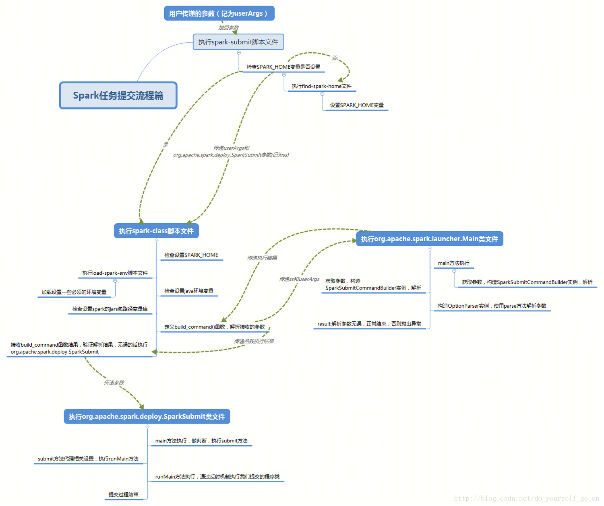
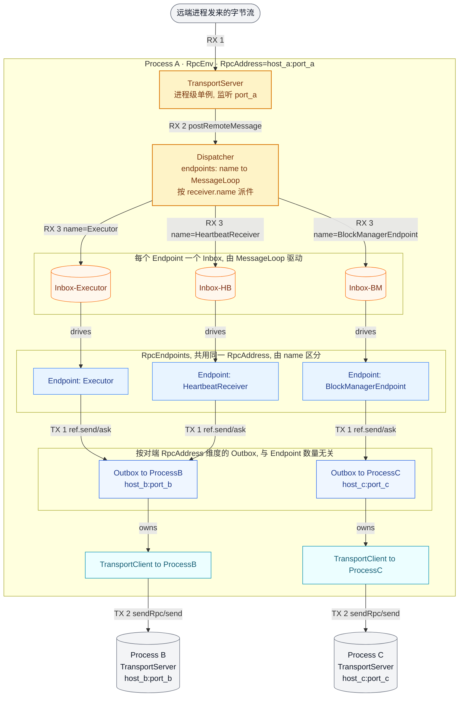
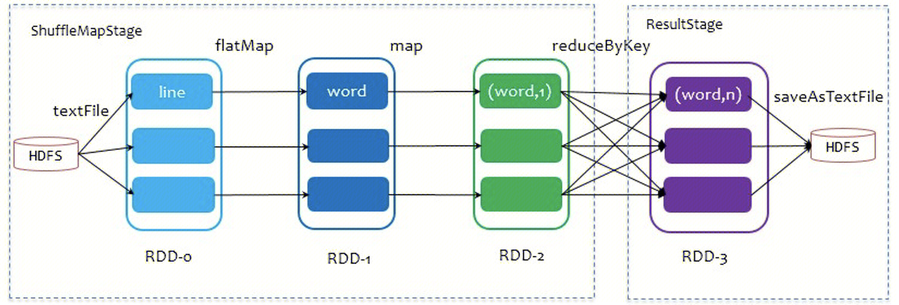

说明：代码部分以 spark 3.4.2 为例讲解，辅以 spark 2.3.2。

# 1. Spark on Yarn 提交流程

## 1.1 源码分析

1、命令行提交命令：`bin/spark-submit --master yarn --deploy-mode cluster --class org.apache.spark.examples.SparkPi examples/jars/spark-examples_2.12-3.1.3.jar`

脚本调用过程如下图所示，具体可参考链接 1。最后执行的命令类似：`java -cp ${class_path} org.apache.spark.deploy.SparkSubmit ${args}`，其中 class_path 包括了 spark conf、spark jars、hadoop conf，args 即用户在 spark-submit 指定的参数。此时脚本启动了一个 Java 进程，该进程从 SparkSubmit 类的 main() 方法开始执行，故**进程名也是 SparkSubmit**。



2、从 SparkSubmit 类的 main() 方法开始。注意，在 Client 模式下，childMainClass = org.apache.spark.examples.SparkPi。而在 Cluster 模式下，childMainClass = org.apache.spark.deploy.yarn.YarnClusterApplication。下面先以 Cluster 模式为例，讲解后续流程。

```scala
SparkSubmit
  main(args)
    super.doSubmit(args)
      // 解析参数，args是命令行参数
      val appArgs = parseArguments(args)
        new SparkSubmitArguments(args)
          // 例如，解析--master得到：master=yarn、解析--class得到：mainClass=org.apache.spark.examples.SparkPi
          parse(args.asJava)

      case SparkSubmitAction.SUBMIT => submit(appArgs, uninitLog)
        doRunMain()
          // 使用提交的参数运行子类的main方法
          runMain(args, uninitLog)
            // 【Cluster】childMainClass => org.apache.spark.deploy.yarn.YarnClusterApplication
            // 【Client】 childMainClass => org.apache.spark.examples.SparkPi
            (childArgs, childClasspath, sparkConf, childMainClass) = prepareSubmitEnvironment(args)
            // 通过反射获取Class类对象
            mainClass = Utils.classForName(childMainClass)
            // 判断条件：mainClass是否为SparkApplication实现类
            if (classOf[SparkApplication].isAssignableFrom(mainClass))
              // 【Cluster】通过反射调用YarnClusterApplication构造方法，生成实例
              mainClass.getConstructor().newInstance().asInstanceOf[SparkApplication]
              // 【client】在本地通过反射执行main方法，即此时即生成了Driver
              new JavaMainApplication(mainClass)
            app.start(childArgs.toArray, sparkConf)
```

3、从 YarnClusterApplication 类的 start() 方法开始。注意，在 Cluster 模式下，createContainerLaunchContext() 设置的启动 AM 命令类似 bin/java org.apache.spark.deploy.yarn.ApplicationMaster，**对应的进程名是 ApplicationMaster**。而在 Client 模式下，生成的启动 AM 命令类似 bin/java org.apache.spark.deploy.yarn.ExecutorLauncher，**对应的进程名是 ExecutorLauncher**。**无论是 Client 模式，还是 Cluster 模式，都是通过 Java 命令启动的一个 Java 进程，因此接下来就是在 AM 中执行对应类的 main() 方法** 。实际上，ExecutorLauncher 在 main() 方法中直接调用了 ApplicationMaster.main(args)，因此**两者逻辑相同，只不过进程名不一样（默认情况下，进程名即类名）**。

```scala
YarnClusterApplication
  start(args, conf)
    // 解析参数，如解析--class得到userClass=org.apache.spark.examples.SparkPi
    new ClientArguments(args)
    // 该Client包含属性yarnClient，也即rmClient
    new Client(...)
      private val yarnClient = YarnClient.createYarnClient
        YarnClient client = new YarnClientImpl()
          protected ApplicationClientProtocol rmClient
    // 将应用程序提交给RM
    new Client(...).run()
      submitApplication()
        // 设置AM容器的启动环境、Java选项和启动AM的命令
        // 【Cluster】 commands = bin/java org.apache.spark.deploy.yarn.ApplicationMaster
        // 【Client】  commands = bin/java org.apache.spark.deploy.yarn.ExecutorLauncher
        val containerContext = createContainerLaunchContext()
          // 设置启动AM容器的环境
          val launchEnv = setupLaunchEnv(stagingDirPath, pySparkArchives)
          // 根据需要将资源上传到分布式缓存，如将本地JARS文件、配置文件打成ZIP压缩包上传
          val localResources = prepareLocalResources(stagingDirPath, pySparkArchives)
          val amClass = if (isClusterMode) {
            Utils.classForName("org.apache.spark.deploy.yarn.ApplicationMaster").getName
          } else { 
            Utils.classForName("org.apache.spark.deploy.yarn.ExecutorLauncher").getName
          }
        val appContext = createApplicationSubmissionContext(newApp, containerContext)
        yarnClient.submitApplication(appContext)
          YarnClientImpl.submitApplication()
            rmClient.submitApplication(request)
```

```scala
// 该对象并不提供任何特殊功能。它的存在是为了在使用诸如ps或jps等工具时，能够轻松区分Client模式的AM和Cluster模式的AM。
object ExecutorLauncher {
  def main(args: Array[String]): Unit = {
    ApplicationMaster.main(args)
  }
}
```

4、从 ApplicationMaster 类的 main() 方法开始。注意，Cluster 模式这里有两个线程：主线程、用户线程（Driver 线程）。**首先主线程阻塞，等待用户线程初始化 SparkContext；用户线程通过反射执行用户代码，在创建完 SparkContext 后，通知主线程不再阻塞，并等待主线程向 RM 申请和分配资源；于是主线程继续执行，注册 AM 后，申请并分配资源，然后在分配的容器中启动 YarnCoarseGrainedExecutorBackend（spark 2.3.2 CoarseGrainedExecutorBackend）进程，之后恢复用户线程，并等待其完成；于是用户线程继续执行，生成并转换 RDD，划分 Stage，切分 Task（详见第 3 节），之后将其序列化通过 RPC 协议从 Driver 发送给 Executor 执行**。

```scala
ApplicationMaster
  main(args)
    // 解析参数，如解析--class得到userClass=org.apache.spark.examples.SparkPi
    val amArgs = new ApplicationMasterArguments(args)
    master = new ApplicationMaster(amArgs, sparkConf, yarnConf)
    master.run()
      // 【Cluster】 runDriver()会创建Driver线程
      // 【Client】  runExecutorLauncher()不会创建Driver线程
      runDriver()
        // 用户线程：在单独的线程中启动包含Spark driver的用户类
        userClassThread = startUserApplication()
          val mainMethod = userClassLoader.loadClass(args.userClass).getMethod("main", classOf[Array[String]])
          // Driver实际是ApplicationMaster进程中的一个线程
          val userThread = new Thread {...}
          userThread.setName("Driver")
          userThread.start()
            run()
              // 通过反射执行用户代码，执行入口即main()函数
              mainMethod.invoke(null, userArgs.toArray)
                org.apache.spark.examples.SparkPi main()
                  // 按照规范，用户代码中需要先创建SparkContext
                  new SparkContext(）
                    // 继承关系：YarnClusterScheduler -> YarnScheduler -> TaskSchedulerImpl -> TaskScheduler，实际执行YarnClusterScheduler.postStartHook()
                    _taskScheduler.postStartHook()
                      // 初始化SparkContext，通知主线程不再阻塞（=====2=====）
                      ApplicationMaster.sparkContextInitialized(sc)
                      super.postStartHook()
                        // 用户线程阻塞，等待主线程向RM申请和分配资源（=====3=====）
                        waitBackendReady()
				
        // 主线程：阻塞，等待用户线程初始化SparkContext（=====1=====）
        val sc = ThreadUtils.awaitResult(...)
          // 注册AM
          registerAM(...)
            // client即YarnRMClient
            client.register(...)
          createAllocator(...)
            // 申请资源
            allocator = client.createAllocator(...)
            // 分配资源，这里allocator实际类型是YarnAllocator
            allocator.allocateResources()
              // 通过在容器上启动executors来处理由RM授予的容器
              handleAllocatedContainers(allocatedContainers.asScala.toSeq)
                // 在分配的容器中启动executors
                runAllocatedContainers(containersToUse)
                  // 一个container启动一个executor，两者一一对应
                  new ExecutorRunnable(...).run()
                    startContainer()
                      // 将命令发送至NM，作为进程启动：bin/java org.apache.spark.executor.YarnCoarseGrainedExecutorBackend
                      // YarnCoarseGrainedExecutorBackend最终仍会调用CoarseGrainedExecutorBackend（spark 2.3.2）
                      val commands = prepareCommand()
                      nmClient.startContainer(container.get, ctx)
          // 恢复用户线程，并等待其完成（=====4=====）
          resumeDriver()
          userClassThread.join()
```

5、从 CoarseGrainedExecutorBackend 类的 main() 方法开始。注意，CoarseGrainedExecutorBackend 间接继承 RpcEndpoint，**其生命周期为：constructor -> onStart -> receive\* -> onStop**。在构造过程中，它将通过 RPC 协议向 Driver 注册 Executor，一旦收到 Driver 注册成功的消息，就向自己发送一条消息，生成 Executor 计算对象。因此，**粗看 Executor 等同 CoarseGrainedExecutorBackend 通信后台，是个进程；细看 Executor 其实是个计算对象，里面有个线程池处理 Task**。

```scala
// 直接继承IsolatedRpcEndpoint，间接继承RpcEndpoint，endpoint生命周期为：constructor -> onStart -> receive* -> onStop
CoarseGrainedExecutorBackend
  main(args)
    run(...)
      SparkEnv.createExecutorEnv(...)
        // 为driver或executor创建SparkEnv
        create(...)
          RpcEnv.create(...)
            new NettyRpcEnvFactory().create(config)
              nettyEnv = new NettyRpcEnv(...)
                outboxes = new ConcurrentHashMap[RpcAddress, Outbox]
                  // 链表结构存放消息
                  messages = new java.util.LinkedList[OutboxMessage]
                  // TransportClient可与TransportServer通信
                  client: TransportClient
              Utils.startServiceOnPort()
                // startService是个函数参数，实际调用nettyEnv.startServer(）
                val (service, port) = startService(tryPort)
                  // 创建一个服务器，尝试绑定到特定的主机和端口
                  transportContext.createServer()
                    new TransportServer()
                      init(hostToBind, portToBind)
                        // Netty API，其中ioMode = NIO/EPOLL，Linux不支持AIO，故采用EPOLL方式来模拟，默认使用NIO
                        new ServerBootstrap().group(bossGroup, workerGroup).channel(NettyUtils.getServerChannelClass(ioMode))...
                          
      // 使用指定名称注册一个RpcEndpoint，并返回其RpcEndpointRef
      env.rpcEnv.setupEndpoint("Executor", backend)
        dispatcher.registerRpcEndpoint(name, endpoint)
          new NettyRpcEndpointRef()
          new DedicatedMessageLoop()
            inbox = new Inbox(name, endpoint)
              messages = new java.util.LinkedList[InboxMessage]()
              // OnStart是要处理的第一条消息
              messages.add(OnStart)
              // process()循环处理消息，即调用CoarseGrainedExecutorBackend类的onStart()
              case OnStart => endpoint.onStart()
                // 向Driver注册Executor
                ref.ask[Boolean](RegisterExecutor())
                // 如果注册成功，向自己发送一条消息。self是父类RpcEndpoint的属性，类型是RpcEndpointRef
                case Success(_) => self.send(RegisteredExecutor)
                  // 后续CoarseGrainedExecutorBackend类的receive()处理接收的消息，这里生成Executor计算对象
                  // 粗看Executor等同CoarseGrainedExecutorBackend通信后台，是个进程；细看Executor其实是个计算对象，里面有个线程池处理Task
                  case RegisteredExecutor => executor = new Executor()
                  // 处理Task，先调用TaskDescription.decode()反序列化
                  case LaunchTask(data) => executor.launchTask()
                    tr = new TaskRunner()
                    // 计算对象Executor内部线程池处理Task
                    threadPool.execute(tr)
                      run()
                        task.run()
                          // Task类定义的抽象方法，由子类ShuffleMapTask、ResultTask实现
                          runTask()
```

```scala
SparkContext
  // 1.创建spark执行环境
  _env = createSparkEnv(_conf, isLocal, listenerBus)
    SparkEnv.createDriverEnv()
      // 为driver或executor创建SparkEnv，后续调用流程与Executor类似
      create()
  // 2.初始化心跳接收器，executor将向driver定时发送心跳
  _heartbeatReceiver = env.rpcEnv.setupEndpoint()
  // 3.创建TaskScheduler，负责Task级的调度
  val (sched, ts) = SparkContext.createTaskScheduler(this, master)
  _schedulerBackend = sched
  _taskScheduler = ts
  // 4.创建DAGScheduler，负责Stage级的调度
  _dagScheduler = new DAGScheduler(this)
  _taskScheduler.start()
```


## 1.2 流程总结

总结 1：spark-submit yarn cluster 提交过程如下图所示，具体地：

1、当使用 spark-submit 命令提交作业时，将在客户端创建一个 SparkSubmit 进程，里面有一个 Client，包含了对远程 RM 的引用 rmClient，并由它提交至远程 RM。

2、RM 选择某个 NM 启动 AM（ApplicationMaster，作用是将 Driver、Executor 与 RM 解耦合），AM 将在进程中创建一个名为 Driver 的线程，该线程将执行我们自定义的 main 方法，但是注意 main 方法不是从头到尾一次执行完成，而是在准备好环境变量 SparkContext 后就暂停了，因为此时还没有资源。所以接下来 AM 向 RM 注册并申请资源，RM 返回可用资源供 AM 选择。

3、AM 拿到资源后，挑选合适的资源，即连接对应的 NM，并在其中启动 ExecutorBackend 。ExecutorBackend 启动完成后，将告诉 AM 已准备完成，接下来就是发送 Task 任务了。

4、于是 Driver 继续执行，生成并转换 RDD，最后形成一个个 Task，并将其放入任务池（TaskPool）中，稍后从任务池中取出任务，序列化后发送给 ExecutorBackend。ExecutorBackend 将任务反序列化，再传给计算对象 Executor 来执行。Executor 中有一个线程池，每个线程都可以执行一个 Task。

5、Shuffle 分为两个阶段，前一个阶段称为 ShuffleMapStage（生成 ShuffleMapTask，负责写），后一个阶段称为 ResultStage（生成 ResultTask，负责读）。Executor 线程池执行 Task 即执行上述两种 Task 的 run 方法（父类定义了 run 方法，并使用模板方法模式，在其中定义了一个抽象的方法 runTask，由上述两种 Task 实现）。

注意：**SparkSubmit、ApplicationMaster 和 CoarseGrainedExecutorBackend（YarnCoarseGrainedExecutorBackend） 是独立的进程；Driver是独立的线程；Executor 和 YarnClusterApplication 是对象**。


总结 2：spark-submit yarn client 提交过程如下图所示。client 与 cluster 主要区别：cluster 模式 Driver 位于集群内部，是个线程；client 模式 Driver 位于本地，仅是个对象。

注意：**SparkSubmit、ExecutorLauncher（ApplicationMaster） 和 CoarseGrainedExecutorBackend（YarnCoarseGrainedExecutorBackend） 是独立的进程；Executor 和 Driver 是对象**。


# 2. 通信架构

## 2.1 基本概念

Spark 通信架构基于 Netty RPC 框架实现（位于 `core/src/main/scala/org/apache/spark/rpc/netty`），它把"消息驱动 + 邮箱模式"与底层 Netty 通道结合在一起：**上层用 `RpcEndpoint / RpcEndpointRef` 屏蔽进程内/进程间差异，中层用 `Dispatcher + Inbox + Outbox` 做消息排队与路由，底层用 `TransportServer / TransportClient` 真正收发字节**。

1、**RpcEnv**：**每个进程一个的 RPC 上下文环境，当前实现是 NettyRpcEnv**。它持有 `Dispatcher`、`TransportServer`、`outboxes`、`clientFactory` 等核心字段，是 Endpoint 注册、消息收发的统一入口（`setupEndpoint`、`setupEndpointRef`、`asyncSetupEndpointRefByURI`）。

2、**RpcEndpoint**：RPC 通信终端。Spark 把每一个需要对外提供 RPC 服务的对象（Driver、Executor、BlockManagerMaster、MapOutputTracker 等）都抽象成一个 RpcEndpoint，由它定义"我能处理哪些消息"。所有终端都遵循同一生命周期：**constructor → onStart → receive\* → onStop**。其中 `receive` 处理 send 单向消息，`receiveAndReply` 处理 ask 请求-应答消息。

3、**RpcEndpointRef**：**对一个 RpcEndpoint 的引用（无论本地还是远端）**，内部封装了 `RpcEndpointAddress = RpcAddress + name`。要向某个 Endpoint 发消息，必须先拿到它的 ref，通过 `ref.send(...)` 或 `ref.ask(...)` 发起调用。

4、**RpcAddress**：**远端进程的网络地址，只含 host + port**。**一个进程只起一个 `NettyRpcEnv`，`NettyRpcEnv` 只起一个 `TransportServer`，只监听一个端口，所以一个进程只对外暴露一个 `RpcAddress`，同一进程内所有 Endpoint 共用这个监听端口**。真正用于寻址某个 Endpoint 的是 `RpcEndpointAddress = RpcAddress + name`（例如 `spark://Executor@host:port`、`spark://HeartbeatReceiver@host:port`），区分目标 Endpoint 完全靠消息里携带的 `receiver.name`，由进程内的 `Dispatcher` 按名字路由到对应 `Inbox`。

5、**Dispatcher**：**进程内唯一的"收件总枢纽"**。它维护两张表：`endpoints: Map[String, MessageLoop]`（按 Endpoint 名路由）和 `endpointRefs: Map[RpcEndpoint, RpcEndpointRef]`（反查 ref）。**`Dispatcher` 只负责"把要进入本进程 Inbox 的消息按 `name` 派到对应 Inbox"**，具体出场的三种场景：① `TransportServer` 收到远端字节流后调 `postRemoteMessage`；② 同进程内 Endpoint 互发单向消息走 `postOneWayMessage`；③ 同进程内 Endpoint 互发 ask 走 `postLocalMessage`。**注意，跨进程发消息时，本端 `Dispatcher` 不参与，由对端的 `Dispatcher` 把消息派到对端 `Inbox`**。

6、**MessageLoop / Inbox**：**`Inbox` 是每个 Endpoint 独占的收件箱（`LinkedList[InboxMessage]`）**，构造时第一条消息固定是 `OnStart`，保证 `onStart()` 最先执行。`MessageLoop` 是驱动 Inbox 消费的线程池：

   - `IsolatedRpcEndpoint`（如 `CoarseGrainedExecutorBackend`）：独占一个 `DedicatedMessageLoop`，独占线程池；
   - 普通 `RpcEndpoint` ：共用一个 `SharedMessageLoop`（每个 Endpoint 仍有自己的 Inbox，但线程池共享）。

7、**Outbox**：**发件箱，按目标 `RpcAddress` 维度维护**，存放在 `NettyRpcEnv.outboxes: ConcurrentHashMap[RpcAddress, Outbox]` 里。同一进程要给"远端进程"发的所有消息，无论目标是哪个 Endpoint，都会进入同一个 Outbox。Outbox 内部用 `LinkedList[OutboxMessage]` 排队，并通过 `drainOutbox()` 触发发送。

8、**TransportClient**：**Netty 客户端。一个 Outbox 持有一个 `TransportClient`（`Outbox.client` 字段）**，首次发消息时由 `nettyEnv.clientConnectionExecutor` 异步建连，之后复用。`OneWayOutboxMessage` 走 `client.send(content)`，`RpcOutboxMessage` 走 `client.sendRpc(content, callback)`。

9、**TransportServer**：**Netty 服务端。一个 `RpcEnv`（即一个进程）只有一个 `TransportServer`，监听一个端口，所有 Endpoint 共享**。收到字节后由 `NettyRpcHandler.receive() → internalReceive() → dispatcher.postRemoteMessage()` 按消息中的 `receiver.name` 路由到对应 Endpoint 的 Inbox。

| 关系                                           | 数量比                            | 说明                                                    |
| ---------------------------------------------- | --------------------------------- | ------------------------------------------------------- |
| `RpcEnv` : `Dispatcher` : `TransportServer`    | **1 : 1 : 1**                     | 进程内单例，监听同一端口                                |
| `RpcEndpoint` : `RpcEndpointRef`               | **1 : 1（本进程视角）**           | `Dispatcher.endpointRefs` 中一一映射                    |
| `RpcEndpoint` : `Inbox`                        | **1 : 1**                         | 每注册一个 Endpoint，新建一个 Inbox，初始塞入 `OnStart` |
| `RpcEndpoint` : `MessageLoop`                  | **N : 1（共享）或 1 : 1（独占）** | 取决于是否实现 `IsolatedRpcEndpoint`                    |
| `Outbox` : 远端 `RpcAddress`                   | **1 : 1**                         | 与 Endpoint 数量无关，同一进程对同一对端只有一个 Outbox |
| `Outbox` : `TransportClient`                   | **1 : 1**                         | `Outbox.client` 字段，按需异步建连后复用                |
| 进程内 `RpcEndpoint` 数 : `TransportServer` 数 | **N : 1**                         | 多 Endpoint 共享一个监听端口，按 `receiver.name` 路由   |



注 1：**`RX 1/2/3`** 标识"收消息链路"的先后顺序（外部字节流 → `TransportServer` → `Dispatcher` → 按 name 投递到对应 `Inbox` → `MessageLoop` 驱动 Endpoint 处理）；**`TX 1/2`** 标识"发消息链路"（`Endpoint` 通过 `RpcEndpointRef` → 按对端 `RpcAddress` 找 `Outbox` → `TransportClient` → 对端 `TransportServer`）。重点关注三个"共用"：

- 进程 A 内的 `Executor / BlockManagerEndpoint / HeartbeatReceiver` 共用同一个 `RpcAddress = host_a:port_a`，靠 name 区分；
- 共用同一个 `TransportServer`（进程级单例端口）；
- 共用同一个 `Dispatcher`（按 `receiver.name` 路由）。而 `Outbox` 是按对端 `RpcAddress` 划分的，`Executor` 和 `HeartbeatReceiver` 都给进程 B 发消息时，复用同一个 `Outbox`，并不会因为是不同 Endpoint 就开两个 Outbox。

注 2：消息收发链路如下：

- **收消息**：`TransportServer` → `NettyRpcHandler.receive` → `Dispatcher.postRemoteMessage` → 目标 Endpoint 的 `Inbox` → `MessageLoop.process` → `endpoint.receive / receiveAndReply`。
- **发消息（跨进程）**：`RpcEndpointRef.send/ask` → `NettyRpcEnv.postToOutbox` → 目标 `RpcAddress` 对应的 `Outbox` → `TransportClient.send / sendRpc` → 对端 `TransportServer`，**本端不经过 `Dispatcher`**。
- **发消息（同进程内 Endpoint 互发）**：`RpcEndpointRef.send/ask` 发现 `receiver.address == 本进程 address` → 直接走 `dispatcher.postOneWayMessage / postLocalMessage` → 本地目标 Inbox，**不进 `Outbox`、不走 Netty**。


## 2.2 源码分析

下面结合源码进一步说明 RpcEndpoint 注册、消息接收、消息发送流程。核心是：**每个 RpcEndpoint 注册时，Dispatcher 都会为其创建一个 Inbox 并放入 MessageLoop 中循环消费；远程消息经 TransportServer 接收后由 Dispatcher 投递到对应 Inbox；本地发送的消息则通过 RpcEndpointRef 写入 Outbox，由 TransportClient 推送到对端**。过程中各角色作用是：**Inbox 与 Endpoint 一一对应，处理"我收到的"消息；Outbox 与远端地址一一对应，处理"我要发出的"消息；Dispatcher 是收件总枢纽（决定消息进哪个 Inbox），TransportClient/TransportServer 则是底层 Netty 通道**。

1、RpcEndpoint 注册源码如下。**注册过程生成了 3 个 ConcurrentMap：①  endpointRefs 类型为 ConcurrentMap[RpcEndpoint, RpcEndpointRef]，维护 RpcEndpoint 与 RpcEndpointRef 的映射关系；② endpoints 类型为 ConcurrentHashMap[String, Inbox]，维护 EndpointName 与 Inbox 的映射关系；③ endpoints（与前面同名，但作用不同）类型为 ConcurrentMap[String, MessageLoop]，维护 EndpointName 与 MessageLoop 的映射关系**。

```scala
// 继承关系：NettyRpcEnv -> RpcEnv
NettyRpcEnv
  // 注册RpcEndpoint：以Executor端CoarseGrainedExecutorBackend为例
  setupEndpoint(name, endpoint)
    // 由Dispatcher进行注册管理
    dispatcher.registerRpcEndpoint(name, endpoint)
      // 1.构造该Endpoint的引用RpcEndpointRef，含地址RpcEndpointAddress
      val addr = RpcEndpointAddress(nettyEnv.address, name)
      val endpointRef = new NettyRpcEndpointRef(nettyEnv.conf, addr, nettyEnv)
      // endpointRefs类型为ConcurrentMap[RpcEndpoint, RpcEndpointRef]，维护RpcEndpoint与RpcEndpointRef的映射关系
      endpointRefs.put(endpoint, endpointRef)

      // 2.根据是否实现IsolatedRpcEndpoint，决定使用独占/共享MessageLoop
      messageLoop = endpoint match
        // 2.1 一个Endpoint独占一个Inbox与一个线程池（如CoarseGrainedExecutorBackend）
        case e: IsolatedRpcEndpoint => new DedicatedMessageLoop(name, e, this)
          // 独占一个Inbox与一个线程池
          private val inbox = new Inbox(name, endpoint)
          // receiveLoopRunnable来自父类MessageLoop，见下面分析
          threadpool.execute(receiveLoopRunnable)
        // 2.2 普通Endpoint共享同一个消息循环（SharedMessageLoop内部按endpointName路由到不同Inbox）
        case _ => sharedLoop.register(name, endpoint)
          // endpoints类型为ConcurrentHashMap[String, Inbox]，维护EndpointName与Inbox的映射关系
          private val endpoints = new ConcurrentHashMap[String, Inbox]()
          // receiveLoopRunnable来自父类MessageLoop，见下面分析
          pool.execute(receiveLoopRunnable)
      // endpoints（与前面同名，但作用不同）类型为ConcurrentMap[String, MessageLoop]，
      // 维护EndpointName与MessageLoop的映射关系
      endpoints.put(name, messageLoop)
```

2、消息接收和处理源码如下。调用链是：**接收端 `TransportServer` → `NettyRpcHandler.receive` → `Dispatcher.postRemoteMessage` → `Inbox.post` → `MessageLoop` 处理 → `endpoint.receiveAndReply`**。

```scala
// 继承关系：DedicatedMessageLoop、SharedMessageLoop -> MessageLoop
MessageLoop
  // 消息循环任务，由子类通过线程/线程池执行（见上面分析）
  protected val receiveLoopRunnable = new Runnable() { ... receiveLoop() }
    while (true)
      // active类型为LinkedBlockingQueue[Inbox]，表示待处理消息的收件箱列表，通过消息循环处理
      val inbox = active.take()
      // 不断调用process，处理存储的消息
      inbox.process(dispatcher)
        while (true)
          message match
            // 远程/本地的ask消息（带回调context）
            case RpcMessage(_sender, content, context) => endpoint.receiveAndReply(context)
            // 单向send消息
            case OneWayMessage(_sender, content) => endpoint.receive
            // 生命周期消息
            case OnStart => endpoint.onStart()
            case OnStop => endpoint.onStop()
            // 网络事件
            case RemoteProcessConnected(remoteAddress) => endpoint.onConnected(remoteAddress)
            case RemoteProcessDisconnected(addr) => endpoint.onDisconnected(remoteAddress)
            case RemoteProcessConnectionError(cause, remoteAddress) => endpoint.onNetworkError(...)
          // 取下一条消息
          inbox.synchronized { ... message = messages.poll() ... }


// Netty服务端，提供高效、低层的流式服务
TransportServer
  // 构造函数调用，创建TransportServer，绑定到指定的主机和端口
  init(hostToBind, portToBind)
    bootstrap = new ServerBootstrap()
    // 初始化客户端或服务端Netty Channel Pipeline，该管道编码/解码消息，并带有TransportChannelHandler处理请求或响应消息
    bootstrap.childHandler(... context.initializePipeline(ch, rpcHandler) ...)
      // 创建服务端和客户端Handler，用于处理请求消息和响应消息
      TransportChannelHandler channelHandler = createChannelHandler(channel, channelRpcHandler)
        // 继承关系：TransportChannelHandler -> SimpleChannelInboundHandler（Netty类）
        // 单一的传输级通道Handler，用于将请求委托给TransportRequestHandler，并将响应委托给TransportResponseHandler
        new TransportChannelHandler(...)
          // 复写Netty SimpleChannelInboundHandler方法
          channelRead0(ChannelHandlerContext ctx, Message request)
            // 处理单个消息，消息类型共有：ChunkFetchRequest、RpcRequest（以此为例）、OneWayMessage、
            // StreamRequest、UploadStream、MergedBlockMetaRequest
            requestHandler.handle((RequestMessage) request)
              processRpcRequest((RpcRequest) request)
                // 接收一个RPC消息，rpcHandler为NettyRpcHandler
                rpcHandler.receive(...)
                  // 反序列化为RequestMessage
                  val messageToDispatch = internalReceive(client, message)
                  // Dispatcher是进程内唯一的"收件总枢纽"，由它分发消息，其中：
                  // ① postRemoteMessage：处理远程消息
                  // ② postLocalMessage：处理本地消息（同进程内Endpoint互相调用）
                  // ③ postOneWayMessage：处理单向消息（不需要回复）
                  dispatcher.postRemoteMessage(messageToDispatch, callback)
                    // 向特定Endpoint发布消息
                    postMessage(message.receiver.name, rpcMessage, (e) => callback.onFailure(e))
                      // 找到EndpointName对应的MessageLoop，将消息发布到对应Inbox
                      val loop = endpoints.get(endpointName)
                      loop.post(endpointName, message)
                        inbox.post(message)
```

3、消息发送源码如下。**一个典型的远端 send 调用链是：发送端 `RpcEndpointRef.send` → `Outbox.send` → `TransportClient.sendRpc` → 接收端 `TransportServer` → `NettyRpcHandler.receive` → `Dispatcher.postRemoteMessage` → `Inbox.post` → `MessageLoop` 处理 → `endpoint.receiveAndReply`**。

```scala
// 继承关系：NettyRpcEndpointRef -> RpcEndpointRef
NettyRpcEndpointRef
  // send表示发送one-way异步消息，ask表示向对应的RpcEndpoint.receiveAndReply发送消息，并返回Future
  // 两者最终都会走到postToOutbox，这里以send为例
  send(message: Any)
    if (remoteAddr == address)
      // 1.向本地RPC端点发送消息
      dispatcher.postOneWayMessage(message)
    else
      // 2.向远程RPC端点发送消息
      postToOutbox(message.receiver, OneWayOutboxMessage(message.serialize(this)))
        // outboxes类型为ConcurrentHashMap[RpcAddress, Outbox]，按目标RpcAddress维度，每个对端一个Outbox
        val outbox = outboxes.get(receiver.address)
        // 发消息，若没有活跃连接，就缓存消息并重新发起连接
        targetOutbox.send(message)
          // 排空消息队列。若无连接，则调用launchConnectTask异步建连
          drainOutbox()
            // 没有连接时，由nettyEnv.clientConnectionExecutor提交建连任务
            launchConnectTask()
              nettyEnv.clientConnectionExecutor.submit(...)
                // 返回TransportClient
                val _client = nettyEnv.createClient(address)
            while (true)
              // 有连接后，逐条发送消息
              message.sendWith(_client)
                // RpcOutboxMessage调用sendRpc，OneWayOutboxMessage调用send，两者底层都是调用Netty发送消息
                client.sendRpc(content, this)
              message = messages.poll()
```


# 3. 任务调度机制

Spark RDD 通过其 Transactions 操作，形成了 RDD 血缘（依赖）关系图，即 DAG，最后通过 Action 的调用，触发 Job 并调度执行，执行过程中会创建两个调度器：DAGScheduler 和 TaskScheduler。

1、**DAGScheduler 负责 Stage 级的调度**，主要是将 job 切分成若干 Stages，并将每个 Stage 打包成 TaskSet 交给 TaskScheduler 调度。

2、**TaskScheduler 负责Task 级的调度**，将 DAGScheduler 给过来的 TaskSet 按照指定的调度策略分发到 Executor 上执行，调度过程中 SchedulerBackend 负责提供可用资源，其中 SchedulerBackend 有多种实现，分别对接不同的资源管理系统

Driver  初始化 SparkContext 过程中，会分别初始化 DAGScheduler、TaskScheduler、SchedulerBackend 以及 HeartbeatReceiver，并启动 SchedulerBackend 以及 HeartbeatReceiver。SchedulerBackend 通过 ApplicationMaster 申请资源，并不断从 TaskScheduler 中拿到合适的 Task 分发到 Executor 执行。HeartbeatReceiver 负责接收 Executor 的心跳信息，监控 Executor 的存活状况，并通知到 TaskScheduler。


## 3.1 Stage 级调度

Job 由最终的 RDD 和 Action 方法封装而成。SparkContext 将 Job 交给 DAGScheduler 提交，它会根据 RDD 的血缘关系构成的 DAG 进行切分，将一个 Job 划分为若干 Stages，具体划分策略是，由最终的 RDD 不断通过依赖回溯判断父依赖是否是宽依赖，即以 Shuffle 为界，划分 Stage，窄依赖的 RDD 之间被划分到同一个 Stage 中，可以进行pipeline 式的计算。划分的 Stages 分两类，一类叫做 ResultStage ，为 DAG 最下游的 Stage ，由 Action 方法决定， 另一类叫做 ShuffleMapStage，为下游 Stage 准备数据。

一个 Stage 是否被提交，需要判断它的父 Stage 是否执行，只有在父 Stage 执行完毕才能提交当前 Stage，如果一个 Stage 没有父 Stage，那么从该 Stage 开始提交。Stage 提交时会将 Task 信息（分区信息以及方法等）序列化并被打包成 TaskSet 交给 TaskScheduler，一个 Partition 对应一个 Task，另一方面 TaskScheduler 会监控 Stage 的运行状态，只有 Executor 丢失或者 Task 由于 Fetch 失败才需要重新提交失败的 Stage 以调度运行失败的任务，其他类型的 Task 失败会在 TaskScheduler 的调度过程中重试。相对来说 DAGScheduler 做的事情较为简单，仅仅是在 Stage 层面上划分 DAG，提交 Stage 并监控相关状态信息。TaskScheduler 则相对较为复杂。




## 3.2 Task 级调度

TaskScheduler 会将 TaskSet 封装为 TaskSetManager 加入到调度队列中。**TaskSetManager 负责监控管理同一个 Stage 中的 Tasks ，TaskScheduler 就是以 TaskSetManager 为单元来调度任务**。

TaskScheduler 初始化后会启动 SchedulerBackend，SchedulerBackend 负责跟外界打交道， 接收 Executor 的注册信息，并维护 Executor 的状态，同时它在启动后会定期地去询问 TaskScheduler 有没有任务要运行。TaskScheduler 在 SchedulerBackend 询问它的时候，会从调度队列中按照指定的调度策略选择 TaskSetManager 去调度运行，大致方法调用流程如下图所示。


上图中，将 TaskSetManager 加入 rootPool 调度池中之后，调用 SchedulerBackend 的 riviveOffers 方法给 driverEndpoint 发送 ReviveOffer 消息；driverEndpoint 收到 ReviveOffer 消息后调用 makeOffers 方法，过滤出活跃状态的 Executor（这些 Executor 都是任务启动时反向注册到 Driver 的 Executor），然后将 Executor 封装成 WorkerOffer 对象；准备好计算资源（WorkerOffer）后，taskScheduler 基于这些资源调用 resourceOffer 在 Executor 上分配 task。

```scala
RDD
  // 以collect为例，行动算子将调用runJob()划分并生成stage
  collect()
    sc.runJob()
      runJob()
        runJob()
          runJob[T, U]()
            dagScheduler.runJob()
              // 提交一个action job到调度器
              submitJob()
                eventProcessLoop.post(JobSubmitted())
                  // 将event放入事件队列中，事件线程将稍后处理该事件
                  eventQueue.put(event)
                  eventThread = new Thread(name)
                    run()
                      event = eventQueue.take()
                      // DAGSchedulerEventProcessLoo类DAG调度器的主要事件循环
                      onReceive(event)
                        doOnReceive(event)
                          case JobSubmitted() => dagScheduler.handleJobSubmitted()
                            // 创建ResultStage
                            finalStage = createResultStage()
                              // 获取或创建给定shuffle依赖的父阶段stage
                              parents = getOrCreateParentStages()
                                getOrCreateShuffleMapStage()
                                  // 为所有缺失的祖先shuffle依赖创建stages
                                  getMissingAncestorShuffleDependencies()
                                  createShuffleMapStage()
                                    // 递归获取或创建父阶段stage
                                    parents = getOrCreateParentStages()
                                    // 创建ShuffleMapStage，用于生成给定shuffle依赖的分区
                                    stage = new ShuffleMapStage()
                              stage = new ResultStage()
                            // 提交阶段，但首先递归提交任何缺失的父stage
                            submitStage(finalStage)
                              missing = getMissingParentStages()
                              // 父stage不存在，则提交该stage，判断条件：if (missing.isEmpty)
                              submitMissingTasks()
                                // 确定要计算的分区ID的索引
                                partitionsToCompute = stage.findMissingPartitions()
                                  // 以ShuffleMapStage为例，其中numPartitions = rdd.partitions.length
                                  findMissingPartitions().getOrElse(0 until numPartitions)
                                // 根据不同的stage，生成不同的task：ShuffleMapTask、ResultTask
                                case stage: ShuffleMapStage => new ShuffleMapTask()
                                case stage: ResultStage => new ResultTask()
                                // 提交任务集运行，任务集与stage是一一对应关系
                                taskScheduler.submitTasks(new TaskSet())
                                  manager = createTaskSetManager()
                                    // TaskSetManager继承自Schedulable，可以被调度
                                    new TaskSetManager()
                                  manager.schedulableBuilder.addTaskSetManager()
                                    // 分为FIFOSchedulableBuilder、FairSchedulableBuilder，两者均将其放入rootPool，之后从中取出
                                    rootPool.addSchedulable(manager)
                                  backend.reviveOffers()
                                    // CoarseGrainedSchedulerBackend类，Driver给自己发了一条消息，之后在receive()中处理该消息
                                    driverEndpoint.send(ReviveOffers)
                                      case ReviveOffers => makeOffers()
                                        scheduler.resourceOffers()
                                          // rootPool通过排序进行调度
                                          rootPool.getSortedTaskSetQueue()
                                            schedulableQueue.asScala.toSeq.sortWith(taskSetSchedulingAlgorithm.comparator)
                                              // 多个判断条件，详见代码
                                              case SchedulingMode.FAIR => new FairSchedulingAlgorithm()
                                              // 先按照优先级从小到大，若优先级相同，按照stageId从小到大
                                              case SchedulingMode.FIFO => new FIFOSchedulingAlgorithm()
                                          // task的locality级别
                                          taskSet.myLocalityLevels
                                            TaskLocality.{PROCESS_LOCAL, NODE_LOCAL, NO_PREF, RACK_LOCAL, ANY}
                                        // 启动任务
                                        launchTasks()
                                          // 序列化，以便在网络中传输
                                          TaskDescription.encode(task)
                                          executorData = executorDataMap(task.executorId)
                                          // Driver向Executor发送LaunchTask，CoarseGrainedExecutorBackend在receive()中接收处理该消息
                                          executorData.executorEndpoint.send(LaunchTask())
                              // 递归提交父stage
                              submitStage(parent)
```


## 3.3 调度策略

**TaskScheduler 支持两种调度策略，一种是 FIFO，也是默认的调度策略**，另一种是 FAIR。在 TaskScheduler 初始化过程中会实例化 rootPool，表示树的根节点，是 Pool 类型。

1、**FIFO 调度策略**：如果是采用 FIFO 调度策略，则直接简单地将 TaskSetManager 按照先来先到的方式入队，出队时直接拿出最先进队的 TaskSetManager，TaskSetManager 保存在一个 FIFO 队列中。

2、**FAIR 调度策略**：FAIR 模式中有一个 rootPool 和多个子 Pool，各个子 Pool 中存储着所有待分配的 TaskSetMagager。在 FAIR 模式中，需要先对子 Pool 进行排序，再对子 Pool 里面的 TaskSetMagager 进行排序，因为 Pool 和 TaskSetMagager 都继承了 Schedulable 特质，因此使用相同的排序算法。排序过程的比较是基于 Fair-share 来比较的，每个要排序的对象包含三个属性：runningTasks 值（正在运行的 Task 数）、minShare 值、weight 值，比较时会综合考量这三个值。注意，minShare、weight 的值均在公平调度配置文件 fairscheduler.xml 中被指定，调度池在构建阶段会读取此文件的相关配置。


## 3.4 本地化调度

从调度队列中拿到 TaskSetManager 后，那么接下来的工作就是 TaskSetManager 按照一定的规则一个个取出 task 给 TaskScheduler，TaskScheduler 再交给 SchedulerBackend 去发到 Executor 上执行。前面也提到，TaskSetManager 封装了一个 Stage 的所有 Task，并负责管理调度这些 Task。根据每个 Task 的优先位置，确定 Task 的 Locality 级别，**Locality 一共有五种，优先级由高到低顺序如下表所示**。

| 名称          | 解析                                                         |
| ------------- | ------------------------------------------------------------ |
| PROCESS_LOCAL | 进程本地化，task 和数据在同一个 Executor 中，性能最好。      |
| NODE_LOCAL    | 节点本地化，task 和数据在同一个节点中，但是 task 和数据不在同一个 Executor 中，数据需要在进程间进行传输。 |
| RACK_LOCAL    | 机架本地化，task 和数据在同一个机架的两个节点上，数据需要通过网络在节点之间进行传输。 |
| NO_PREF       | 对于 task 来说，从哪里获取都一样，没有好坏之分。             |
| ANY           | task 和数据可以在集群的任何地方，而且不在一个机架中，性能最差。 |

在调度执行时，Spark 调度总是会尽量让每个 task 以最高的本地性级别来启动，当一个 task 以本地性级别启动，但是该本地性级别对应的所有节点都没有空闲资源而启动失败， 此时**并不会马上降低本地性级别启动**，而是在某个时间长度内再次以这个本地性级别来启动该 task，若超过限时时间则降级启动，去尝试下一个本地性级别，依次类推。可以通过调大每个类别的最大容忍延迟时间，在等待阶段对应的 Executor 可能就会有相应的资源去执行此 task，这就在在一定程度上提到了运行性能。


## 3.5 失败重试

除了选择合适的 Task 调度运行外，还需要监控 Task 的执行状态，前面也提到，与外部打交道的是 SchedulerBackend，Task 被提交到 Executor 启动执行后，Executor 会将执行状态上报给 SchedulerBackend，SchedulerBackend 则告诉 TaskScheduler，TaskScheduler 找到该 Task 对应的 TaskSetManager，并通知到该 TaskSetManager，这样 TaskSetManager 就知道 Task的失败与成功状态，对于失败的 Task，会记录它失败的次数，如果失败次数还没有超过最大重试次数，那么就把它放回待调度的 Task 池子中，否则整个 Application 失败。

在记录 Task 失败次数过程中，会记录它上一次失败所在的 Executor Id 和 Host，这样下次再调度这个 Task 时，会使用黑名单机制，避免它被调度到上一次失败的节点上，起到一定的容错作用。黑名单记录 Task 上一次失败所在的Executor Id 和 Host，以及其对应的“拉黑”时间，“拉黑”时间是指这段时间内不要再往这个节点上调度这个 Task 了。


# 4. 参考

1. [spark-submit 提交脚本](https://www.cnblogs.com/qingyunzong/p/8978661.html)、[spark 启动脚本](https://www.cnblogs.com/qingyunzong/p/8973892.html)

2. [视频：Spark源码与内核分析](https://www.bilibili.com/video/BV1ot4y1t7ML?p=1&vd_source=03ee00a529e3c4f9c2d8c6f412586123)


