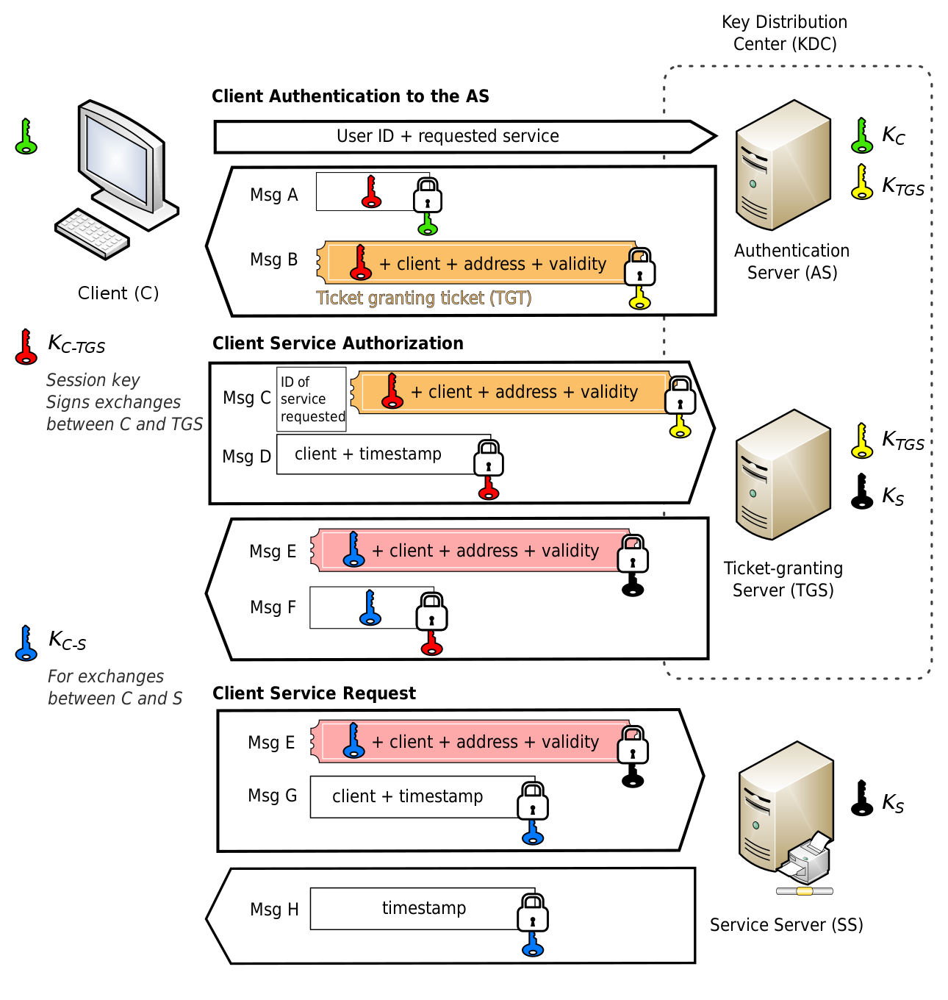

# 1. Kerberos

用户输入用户 ID 和密码到客户端，客户端程序运行一个单向函数把密码转换成密钥，这个就是客户端（用户）的“用户密钥”。接下来 Kerberos 认证流程如下：

1、**客户端认证（Client 从 AS 获取 TGT）**

- 客户端向 AS 发送 1 条明文消息，申请所应享有的服务（注意，用户不向 AS 发送“用户密钥 KC”，也不发送密码），AS 能从本地数据库中查询到该用户的密码，并通过相同途径转换成相同的“用户密钥 KC”。
- AS 检查该用户 ID 是否在于本地数据库中，如果用户存在则返回 2 条消息：
  - 消息 A：**Client/TGS 会话密钥 KC-TGS（用于将来 Client 与 TGS 通信会话上），通过“用户密钥 KC”进行加密**
  - 消息 B：**TGT（包括：KC-TGS、用户ID、用户网址、TGT 有效期），通过“TGS 密钥 KTGS”进行加密**
- 客户端收到消息 A 和 B，首先尝试用自己的“用户密钥 KC”解密消息 A，如果用户输入的密码与 AS 数据库中的密码不符，则不能成功解密消息 A。输入正确的密码并通过随之生成的“用户密钥 KC”才能解密消息 A，从而得到“Client/TGS 会话密钥 KC-TGS”。（注意，**客户端不能解密消息 B**，因为 B 是用“TGS 密钥 KTGS”加密的）。

2、**服务授权（Client 从 TGS 获取票据 client-to-server ticket）**

- 当客户端需要申请特定服务时，向 TGS 发送以下 2 条消息：
  - 消息 C：**消息 B 的内容（即使用“TGS 密钥 KTGS”加密的 TGT）和想获取的服务的服务 ID**
  - 消息 D：**认证符 Authenticator（包括：用户ID、时间戳），通过“Client/TGS 会话密钥 KC-TGS”进行加密**
- TGS 收到消息 C 和 D 后，首先检查 KDC 数据库中是否存在所需的服务，找到之后，TGS 用自己的“TGS 密钥 KTGS”解密消息 C 中的消息 B（即 TGT），从而得到之前生成的“Client/TGS 会话密钥 KC-TGS”。TGS再用这个会话密钥解密消息 D，得到包含用户 ID 和时间戳的 Authenticator，并对 TGT 和 Authenticator进行验证，验证通过之后返回 2 条消息：
  - 消息 E：**客户端-服务器票据 client-to-server ticket（包括：“Client/SS 会话密钥 KC-S”、用户 ID、用户网址、有效期），通过提供该服务的“服务器密钥 KS”进行加密**
  - 消息 F：**Client/SS 会话密钥 KC-S（该会话密钥用在将来客户端与 SS 的通信会话上），通过“Client/TGS 会话密钥 KC-TGS”进行加密**
- 客户端收到这些消息后，用“Client/TGS 会话密钥 KC-TGS”解密消息 F，得到“Client/SS会话密钥 KC-S”。（注意，**客户端不能解密消息 E**，因为 E 是用“服务器密钥 KS”加密的）。

3、**服务请求（Client 从 SS 获取服务）**

- 获得“Client/SS 会话密钥 KC-S”后，客户端就能使用服务器提供的服务了，向指定 SS 发出 2 条消息：
  - 消息 E：**即上一步中的消息E 客户端-服务器票据 client-to-server ticket，已通过“服务器密钥 KS”进行加密**
  - 消息 G：**新的 Authenticator（包括用户ID、时间戳），通过“Client/SS 会话密钥 KC-S”进行加密**
- SS 用自己的“服务器密钥 KS”解密消息 E，从而得到 TGS 提供的“Client/SS 会话密钥 KC-S”。再用这个会话密钥解密消息 G，得到 Authenticator，对票据和 Authenticator 进行验证，验证通过则返回 1 条消息：
  - 消息 H：**新时间戳（客户端发送的时间戳加1，v5 已取消这一做法），通过“Client/SS 会话密钥 KC-S”进行加密**
- 客户端通过“Client/SS 会话密钥 KC-S”解密消息 H，得到新时间戳并验证其是否正确。验证通过的话则客户端可以信赖 SS，并向 SS 发送服务请求。
- SS 向客户端提供相应的服务。

**注 1：Client 与 SS 使用的 keytab 分别对应图中的绿色钥匙 KC 与黑色钥匙 KS。**

**注 2：Kerberos KDC 服务包含两个模块，分别对应图中的 AS 与 TGS。**




# 2. Delegation Token

在集群认证开启的场景下，客户端访问集群时都需要做身份验证。但在分布式任务场景下，每个任务都做一次身份认证，会存在一些问题。**首先是身份凭证的滥用导致可能的安全问题，其次每个任务做一次身份认证，对于认证服务产生比较大的压力**。基于上述考虑，hdfs 设计实现了 token（一段时间内持有 token 的访问者，认为是可靠的访问者，无需其他凭证做身份认证）模式，专门用于分布式任务访问。 Delegation Token（DT）的工作方式如下：

- 客户端最初通过 Kerberos 与每个服务器进行身份验证，并从该服务器获取 Delegation Token。
- 客户端在后续的服务器身份验证中使用  Delegation Token，而不是使用 Kerberos。

客户端可以将 Delegation Token 传递给其他服务（如 YARN），以便其他服务（如 mappers 与 reducers）可以代表客户端进行身份验证和运行作业。换句话说，客户端可以将凭据“委托”给这些服务。**Delegation Token 具有过期时间，并需要定期续订以保持其有效性。但是，它们不能无限期地续订，存在最大生存期**。在过期之前，Delegation Token 也可以被取消。

Delegation Token 消除了分发 Kerberos TGT 或 keytab 的需要，避免其泄露授予对所有服务的访问权限。另一方面，Delegation Token 严格绑定相关服务，并最终会过期，如果暴露，造成的损害较小。此外，Delegation Token 使凭证续订更加轻量级，因为续订只涉及续订者和服务参与（**Delegation Token 认证是一个双方身份验证协议，而 Kerberos 认证是一个三方协议**），Token 本身保持不变，因此已经使用 Token 的所有方不需要更新。

**出于可用性的原因，Delegation Token 由服务器持久化**。HDFS NameNode 将 Delegation Token 持久化到其元数据（即 fsimage 和 edit logs）中；KMS 将 Delegation Token 以 ZNode 的形式持久化到 Apache ZooKeeper 中。这样，即使服务器重新启动或故障切换，Delegation Token 也可以继续使用。


运行应用程序的认证流程如上图所示，其中作业通过 YARN 提交，然后分发到集群中的多个工作节点来执行。

1. Client 在完成 Kerberos 认证后，从 HDFS NameNode 获取 HDFS Delegation Token，并从 KMS 获取 KMS Delegation Token。
2. Client 基于 Kerberos 认证将作向 YARN RM 提交作业，同时传递刚刚获取的 Delegation Token。
3. YARN RM 通过立即续订 Delegation Token 来验证其有效性，然后启动作业，并将作业（连同 Delegation Token）分发到集群中的工作节点。
4. 每个工作节点在访问 HDFS 数据时使用 HDFS Delegation Token 进行身份验证，并在解密加密区域中的 HDFS 文件时，使用 KMS Delegation Token 进行身份验证。
5. 作业完成后，RM 取消作业的 Delegation Token。


# 3. Spark Kerberos 源码

1、在《Spark Core》中介绍过，Driver 线程负责初始化 SparkContext。该线程会调用 updateTokensTask() 方法，**首先使用 principal 与 keytab 登录 KDC（前提是任务提交时设置了 principal 与 keytab 相关参数），之后获取 Delegation Token，并在原始 Token 的续订间隔过去 75％ 时，再次调用 updateTokensTask() 方法完成 Delegation Token 续订，这样就实现了无限期续订 Delegation Token**。一旦获取到 Delegation Token，Driver 线程将重新添加 Delegation Token，并将该 Token 分发给 Executor，即 Driver 向 Executor 发送 UpdateDelegationTokens 消息，Executor 在接收到消息后，重新添加 Delegation Token。注意，针对不同的组件，需要对应实现 `HadoopDelegationTokenProvider` 特质来获取 Delegation Token，目前已实现的子类包括：`HadoopFSDelegationTokenProvider`、`HiveDelegationTokenProvider`、`KafkaDelegationTokenProvider`、`HBaseDelegationTokenProvider`。

```scala
SparkContext
  // 启动TaskScheduler，继承关系：YarnClusterScheduler -> YarnScheduler -> TaskSchedulerImpl -> TaskScheduler，实际执行TaskSchedulerImpl.start()
  _taskScheduler.start()
    // 继承关系：YarnSchedulerBackend -> CoarseGrainedSchedulerBackend -> SchedulerBackend，实际执行CoarseGrainedSchedulerBackend.start()
    backend.start()
      // 创建Delegation Token管理器，YarnSchedulerBackend复写了父类CoarseGrainedSchedulerBackend的createTokenManager()方法
      delegationTokenManager = createTokenManager()
        new HadoopDelegationTokenManager(sc.conf, sc.hadoopConfiguration, driverEndpoint)
      // 参数spark.kerberos.renewal.credentials，可选值为keytab（默认）、ccache
      // 当Delegation token renewal开启时（参见renewalEnabled定义），启动Delegation Token管理器，定期获取所需的新Token
      val tokens = if (dtm.renewalEnabled) { dtm.start() }
        // 启动单独线程，续订TGT
        renewalExecutor = ThreadUtils.newDaemonSingleThreadScheduledExecutor("Credential Renewal Thread")
        renewalExecutor.scheduleAtFixedRate(tgtRenewalTask, tgtRenewalPeriod, tgtRenewalPeriod, TimeUnit.SECONDS)
          run()
            // 如果TGT已过期或接近过期，则从keytab重新登录用户
            ugi.checkTGTAndReloginFromKeytab()
        // 定期任务，用于登录到KDC并创建新的Delegation Token，在需要时重新调度自身以获取下一组Token
        updateTokensTask()
          val freshUGI = doLogin()
            // 参数spark.kerberos.principal，默认为空
            if (principal != null)
              logInfo(s"Attempting to login to KDC using principal: $principal")
              // 尝试登录KDC，principal与keytab分别来自spark.kerberos.principal与spark.kerberos.keytab的参数值
              val ugi = UserGroupInformation.loginUserFromKeytabAndReturnUGI(principal, keytab)
              logInfo("Successfully logged into KDC.")
            else if (!SparkHadoopUtil.get.isProxyUser(UserGroupInformation.getCurrentUser()))
              logInfo(s"Attempting to load user's ticket cache.")
              val ccache = sparkConf.getenv("KRB5CCNAME")
              val user = Option(sparkConf.getenv("KRB5PRINCIPAL")).getOrElse(...)
              // 尝试加载用户的ticket cache
              UserGroupInformation.getUGIFromTicketCache(ccache, user)
          val creds = obtainTokensAndScheduleRenewal(freshUGI)
            // 为配置的服务获取新的Delegation Token，并获取下一次续订的时间
            val (creds, nextRenewal) = obtainDelegationTokens()
              // provider类型为HadoopDelegationTokenProvider，子类包括：HadoopFSDelegationTokenProvider、HiveDelegationTokenProvider、KafkaDelegationTokenProvider、HBaseDelegationTokenProvider
              // 参数spark.security.credentials.%s.enabled默认均为true，设置为false可禁用获取对应token
              provider.obtainDelegationTokens(hadoopConf, sparkConf, creds)
                // 这里以HadoopFSDelegationTokenProvider为例
                val fetchCreds = fetchDelegationTokens(getTokenRenewer(sparkConf, hadoopConf), fileSystems, creds, fsToExclude)
                  logInfo(s"getting token for: $fs with renewer $renewer")
                  fs.addDelegationTokens(renewer, creds)
                // 如果未设置Token续订间隔，则获取该间隔（默认24h），该方法只会被调用一次
                tokenRenewalInterval = getTokenRenewalInterval(hadoopConf, fileSystems)
                  fetchDelegationTokens(renewer, filesystems, creds, Set.empty)
                  logInfo(s"Renewal interval is $interval for token $tokenKind")
            logInfo(s"Calculated delay on renewal is $delay, based on next renewal $nextRenewal " + s"and the ratio $ratio, and current time $now")
            scheduleRenewal(delay)
              logInfo(s"Scheduling renewal in ${UIUtils.formatDuration(_delay)}.")
              // 一旦原始Token的续订间隔过去75％（参数spark.security.credentials.renewalRatio），将创建新的Delegation Token，即重新执行一次updateTokensTask()
              renewalExecutor.schedule(renewalTask, _delay, TimeUnit.MILLISECONDS)
                run()
                  updateTokensTask()
          // 序列化得到token
          val tokens = SparkHadoopUtil.get.serialize(creds)
          logInfo("Updating delegation tokens.")
          // 向Driver发送UpdateDelegationTokens消息
          schedulerRef.send(UpdateDelegationTokens(tokens))

      // 当一组新的Delegation Token发送到Driver时调用，将Token分发给Executor（方法调用一次，接收UpdateDelegationTokens消息又调用一次）
      updateDelegationTokens(tokens)
        SparkHadoopUtil.get.addDelegationTokens(tokens, conf)
          // 反序列化token，重新添加Delegation Token
          val creds = deserialize(tokens)
          logInfo("Updating delegation tokens for current user.")
          addCurrentUserCredentials(creds)
        // Driver向Executor发送UpdateDelegationTokens消息
        ed.executorEndpoint.send(UpdateDelegationTokens(tokens))
          // CoarseGrainedExecutorBackend类receive()方法接收并处理UpdateDelegationTokens消息，重新添加Delegation Token
          case UpdateDelegationTokens(tokenBytes) => 
            logInfo(s"Received tokens of ${tokenBytes.length} bytes")
            SparkHadoopUtil.get.addDelegationTokens(tokenBytes, env.conf)
```

注：Kafka 默认没有开启 Token 认证机制，如果服务端开启，那么在 Spark 客户端提交任务需要设置如下参数，其中 `xxxx_kafka` 可以是任意标识符，用以区分不同集群，具体参考：[SPARK-27294](https://github.com/apache/spark/commit/2f558094257c38d26650049f2ac93be6d65d6d85)。

```shell
--conf spark.kafka.clusters.xxxx_kafka.auth.bootstrap.servers=broker1:9092,broker2:9092 \
--conf spark.kafka.clusters.xxxx_kafka.security.protocol=SASL_PLAINTEXT \
--conf spark.kafka.clusters.xxxx_kafka.sasl.kerberos.service.name=hadoop \
```


2、再来理解一下官网关于 Delegation Token 的描述，参考：https://spark.apache.org/docs/4.0.0/security.html#long-running-applications。如果长时间运行的应用程序的运行时间超过了其需要访问的服务中配置的最大 Delegation Token 生命周期，则可能会遇到问题。此功能并非在所有地方都可用，它仅在 YARN 和 K8s（包括 Client 和 Cluster模式）中实现。Spark 支持为这些应用程序自动创建新 Token。有两种方法可以启用此功能。

- **使用 Keytab**：通过为 Spark 提供 principal 和 keytab（例如 **spark-submit 时通过 --principal 和 --keytab 参数指定**），应用程序将维护一个有效的 Kerberos 登录，**该登录可用于无限期地获取 Delegation Token**。需要注意的是，在 Cluster 模式下使用 keytab 时，它将被复制到运行 Spark Driver 的机器上。对于 YARN 来说，这意味着需要使用 HDFS 作为 keytab 的暂存区域，因此强烈建议至少对 YARN 和 HDFS 进行加密保护。
- **使用 Ticket Cache**：通过在 Spark 配置中将 spark.kerberos.renewal.credentials 设置为 ccache，将使用本地 Kerberos 票证缓存进行身份验证。Spark 将在票证的可续订生命周期内保持其续订，但在票证过期后，需要获取新的票证（例如通**过运行 kinit**）。**用户需要维护一个 Spark 可以使用的更新后的票证缓存，票证缓存的位置可以通过设置 KRB5CCNAME 环境变量来自定义**。

 

3、Kafka 比较特殊，**Spark 支持两种方式对 Kafka 集群进行身份验证，一种是 Delegation Token，另一种是 JAAS 登录配置**，参考官网的描述：https://spark.apache.org/docs/latest/streaming/structured-streaming-kafka-integration.html#security。对于 Delegation Token，应用程序可以通过 Spark 参数进行配置，**可能（may not，看来官方也不是很严谨）**不需要 JAAS 登录配置（Spark 可以使用 Kafka 的动态 JAAS 配置功能）。

因此，在 Kafka 未开启 Delegation Token 的情况下，如果长时间运行的 Spark 任务仅涉及 Kafka，则需要使用 JAAS 登录配置，参考 Spark 源码中的例子类：`DirectKerberizedKafkaWordCount`，注意区分 Client 和 Cluster 模式。**如果 Spark 任务还涉及 Hbase、HDFS，则还需要指定 --principal 和 --keytab 参数，需要注意的是，当 keytab 文件名相同时，Kafka 使用 --files 上传 keytab 文件与 Hbase/HDFS 使用 --keytab 上传 keytab 文件是冲突的（无法提交任务），因为他们最终都会将 keytab 文件上传至 Driver 的工作目录下，因此需要将其中一个 keytab 文件进行重命名，避免文件名冲突**。


# 4. 参考

1. [wiki - Kerberos (protocol)](https://en.wikipedia.org/wiki/Kerberos_(protocol))
2. [Quick Introduction to Hadoop Security](https://blog.cloudera.com/hadoop-delegation-tokens-explained/)
3. [官网 - MIT Kerberos Documentation](https://web.mit.edu/kerberos/krb5-latest/doc/)
4. [iwiki -【literature review】Hadoop Auth（Kerberos & Delegation Token）](https://iwiki.woa.com/p/4009234823)
5. [iwiki - Spark Ozone 对接](https://iwiki.woa.com/p/4009328620)