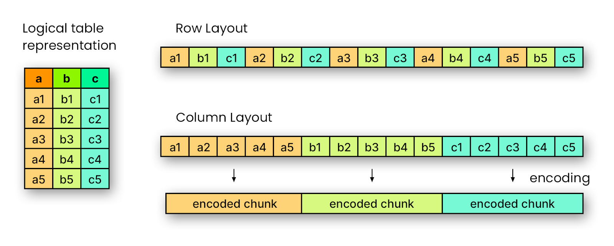
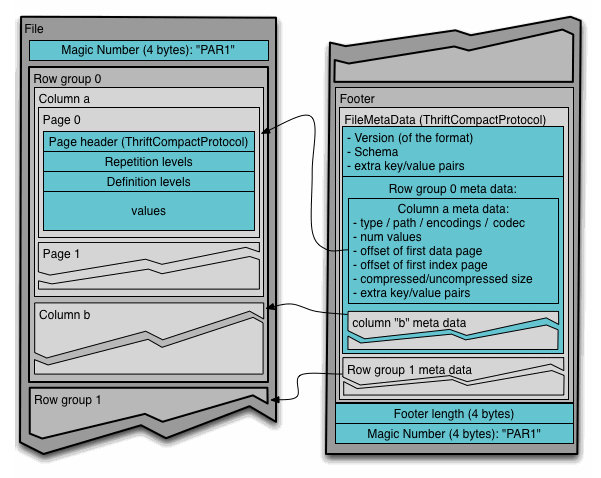
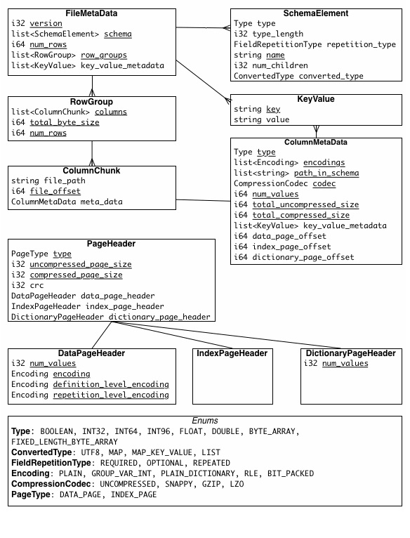
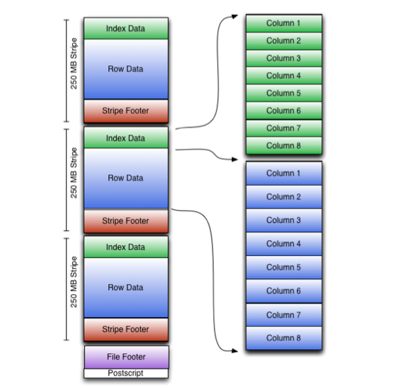
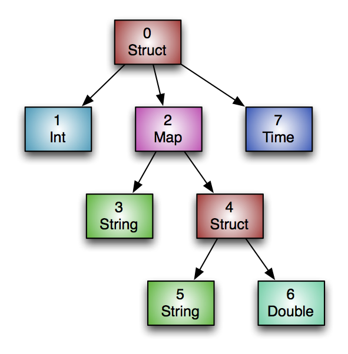

Parquet 和 ORC 都是列式存储，这意味着同一列的数据在磁盘上是顺序存放的，而不是将整行数据放在一起。如图所示，具有多列（a、b、c）的逻辑表可以有两种表示方式：在行式布局中，值按行交错存放（a1、b1、c1、a2、b2、c2…）；而在列式布局中，单列的所有值是连续存放的（a1、a2、a3…、b1、b2、b3…）。这种列式组织能对每一列分别进行压缩和编码，从而减小文件大小，并在只访问部分列的分析查询中提升读取性能。



|      | 行式存储                                                     | 列式存储                                                     |
| ---- | ------------------------------------------------------------ | ------------------------------------------------------------ |
| 优点 | 1. 更新/插入/删除便捷，因此事务处理高效                      | 1. 查询性能高，支持投影，只需读取涉及的列<br>2. 按列压缩和编码，存储和压缩效率高 |
| 缺点 | 1. 查询效率低，往往需要读取不必要的列<br/>2. 每行包含不同数据类型，存储和压缩效率低 | 1. 更新/插入开销高，因此不支持事务或处理低效                 |


# 1. Parquet

## 1.1 简介

Apache Parquet（/'pa:kei/）是一种开源的列式存储格式，最初由 Twitter 和 Cloudera 开发，后来捐赠给 Apache 软件基金会。Parquet 是一种开源的面向列的数据文件格式，旨在实现高效的数据存储与检索。它提供高性能的压缩与编码方案以批量处理复杂数据，并在多种编程语言与分析工具中得到支持。

* Parquet 从一开始就面向复杂的嵌套数据结构设计，使用 Dremel 论文中描述的[记录拆分与重组算法](https://github.com/julienledem/redelm/wiki/The-striping-and-assembly-algorithms-from-the-Dremel-paper)，这种方法优于对嵌套命名空间的简单扁平化处理。
* Parquet 旨在支持非常高效的压缩与编码方案。多个项目已经展示了为数据选择合适的压缩与编码方案所带来的性能提升。Parquet 允许按列指定压缩方案，并为将来添加更多编码留有扩展空间。
* Parquet 面向所有用户。Hadoop 生态中存在丰富的数据处理框架，不偏袒任何框架。一个高效且实现良好的列式存储底层，应当对所有框架有用，而不需要大量难以配置的外部依赖。


## 1.2 术语

- **Block（HDFS 块）**：指 HDFS 中的块，用法与描述该文件格式时的含义一致。该文件格式是为在 HDFS 之上良好运行而设计的。
- **File（文件）**：指一个 HDFS 文件，必须包含该文件的元数据。该文件不必实际包含数据本身。
- **Row group（行组）**：对数据按行进行的逻辑水平分区。行组不保证有特定的物理结构。一个行组由数据集中每一列的一个列块组成。
- **Column chunk（列块）**：某一列的数据块。列块位于特定的行组内，并保证在文件中是连续存放的。
- **Page（页）**：列块被划分为若干页。页在概念上是不可分割的单元（就压缩和编码而言）。列块中可以交错存在多种页类型。

**层次关系：file 由一个或多个 row group 组成；每个 row group 为每一列包含且仅包含一个 column chunk； column chunk 包含一个或多个 page**。

**并行化单元：MapReduce 并行化单元是 File/Row Group；IO 并行化单元是 Column chunk；编码/压缩并行化单元是 Page**。


## 1.3 文件格式

```bash
4-byte magic number "PAR1"
<Column 1 Chunk 1>
<Column 2 Chunk 1>
...
<Column N Chunk 1>
<Column 1 Chunk 2>
<Column 2 Chunk 2>
...
<Column N Chunk 2>
...
<Column 1 Chunk M>
<Column 2 Chunk M>
...
<Column N Chunk M>
File Metadata
4-byte length in bytes of file metadata (little endian)
4-byte magic number "PAR1"
```

在上面的示例中，此表有 N 列，分为 M 个行组。文件元数据包含所有列块起始位置，有关元数据包含内容的更多详细信息，请参阅 [Thrift 定义](https://github.com/apache/parquet-format/blob/master/src/main/thrift/parquet.thrift)。文件元数据在数据之后写入，以便实现单次写入。读者首先需要读取文件元数据，找到所有感兴趣的列块。然后，应按顺序读取这些列块。



元数据分为两种类型：文件元数据和页面头元数据。所有 Thrift 结构均使用 TCompactProtocol 进行序列化。



## 1.4 类型

文件格式支持的类型力求精简，重点在于这些类型对磁盘存储的影响。例如，存储格式并未显式支持 16 位整数，因为32 位整数可以通过高效的编码方式进行处理。这降低了实现该格式的读写器的复杂性。支持的基本类型包括：

- BOOLEAN：1 位布尔值
- INT32：32 位有符号整数
- INT64：64 位有符号整数
- INT96：96 位有符号整数
- FLOAT：IEEE 32 位浮点
- DOUBLE：IEEE 64 位浮点
- BYTE_ARRAY：任意长度的字节数组
- FIXED_LEN_BYTE_ARRAY：固定长度的字节数组

**逻辑类型**：用于扩展 Parquet 可存储的类型，通过指定如何解释基本类型来实现。这使得基本类型的数量保持在最低限度，并复用了 Parquet 的高效编码。例如，字符串使用带有 STRING 注解的基本类型 BYTE_ARRAY 存储，这些注解定义了如何进一步解码和解释数据。注解作为 `LogicalType` 字段存储在文件元数据中，详见[LogicalTypes.md 文件](https://github.com/apache/parquet-format/blob/master/LogicalTypes.md)。

**排序顺序**：Parquet 在多个层级（例如列块、列索引和数据页）存储最小值/最大值统计信息。这些统计信息遵循排序规则，该规则在 file footer 中为每一列定义。Parquet 支持逻辑类型和基本类型的常用排序规则。详情见 [Thrift 定义](https://github.com/apache/parquet-format/blob/master/src/main/thrift/parquet.thrift)中的 ColumnOrder 联合类型。


# 2. ORC

## 2.1 简介

ORC 是一种自描述、类型感知的列式文件格式，专为 Hadoop 工作负载而设计。它针对大型流式读取进行了优化，并集成了快速查找所需行的功能。以列式格式存储数据，使得读取器能够仅读取、解压缩和处理当前查询所需的值。由于 ORC 文件具有类型感知能力，写入器会根据数据类型选择最合适的编码，并在写入文件时构建内部索引。**谓词下推利用这些索引来确定特定查询需要读取文件中的哪些条带（stripe），而行索引可以将搜索范围缩小到特定的 10000 行集合**。ORC 支持 Hive 中的所有类型，结构体（structs）、列表（lists）、映射（maps）和联合类型（unions）。


## 2.2 术语

ORC 文件被划分为条带（stripe），条带通常很大（约 200MB）且彼此独立，是分布式计算的自然工作单元。在每个条带内部，各列彼此分离，读取器可以只读取所需的列。

ORC 在每个文件内提供三级索引：

- **文件级（file level）：关于整个文件中每列值的统计信息**
- **条带级（stripe level）：关于每个条带中每列值的统计信息**
- **行级（row level）：关于每个条带内每组 10000 行的每列值的统计信息**

文件级和条带级的列统计信息位于文件尾部（file footer），便于快速访问以判断是否需要读取文件的其余部分。行级索引不仅包含每个行组（row group）的列统计信息，还包含可用于定位到到行组起始位置的索引。

列统计信息始终包含值的计数以及是否存在空值。大多数其他基本类型包含最小值和最大值，而数值类型则包含总和。从 Hive 1.2 开始，索引可以包含布隆过滤器（bloom filters），从而提供更精细的筛选。

读取器使用搜索参数 (Search ARGuments，SARG) 来访问各个级别的索引。SARG 是一种简化的表达式，用于限制感兴趣的行。例如，如果查询要查找 100 岁以上的人，则 SARG 为“age > 100”，此时只会读取包含 100 岁以上人员的文件、条带或行组。


## 2.3 文件格式



由于 HDFS 不支持在文件写入后对其进行修改，因此 ORC 将顶级索引存储在文件末尾。文件的整体结构如上图所示，File Tail 由三部分组成：file metadata、file footer 和 postscript。

ORC 的元数据使用 [Protocol Buffers ](https://s.apache.org/protobuf_encoding)存储 ，这使得在不影响读取器的情况下添加新字段成为可能。本文档包含了 [ORC 源代码](https://github.com/apache/orc/blob/main/proto/orc_proto.proto)中的 Protobuf 定义，建议读者如果需要了解字节级编码，可以查阅 Protobuf 编码文档。文件尾部的各个部分及其对应的 Protobuf 消息类型如下：

- encrypted stripe statistics：ColumnarStripeStatistics 列表
- stripe statistics：Metadata
- footer：Footer
- postscript：PostScript
- psLen：一个字节

### 2.3.1 Postscript

Postscript 部分提供了解释文件其余内容所需的信息，包括文件 Footer 和 Metadata 部分的长度、文件的版本，以及所使用的一般压缩类型（如 none、zlib 或 snappy 等）。后记本身从不被压缩，并且位于文件末尾之前的一个字节处结束。存储在后记中的版本表示能够保证读取该文件的最低 Hive 版本，以主版号和次版号的序列形式存储，该文件版本以类似 [0,12] 的形式编码。

**读取 ORC 文件的过程是从文件末尾向前进行的。ORC 读取器通常会一次性读取文件最后 16KB 的数据，希望其中包含 Footer 和 Postscript 两部分。文件的最后一个字节包含了后记的序列化长度，该长度必须小于 256 字节。解析出 Postscript 后，就能知道 Footer 的压缩后序列化长度，进而将其解压并解析**。

```protobuf
message PostScript {
  // Footer部分的长度（以字节为单位）
  optional uint64 footerLength = 1;
  // 所使用的通用压缩类型
  optional CompressionKind compression = 2;
  // 每个压缩块的最大大小
  optional uint64 compressionBlockSize = 3;
  // writer版本
  repeated uint32 version = 4 [packed = true];
  // Metadata部分的长度（以字节为单位）
  optional uint64 metadataLength = 5;
  // 固定字符串："ORC"
  optional string magic = 8000;
}
```

```protobuf
enum CompressionKind {
  NONE = 0;
  ZLIB = 1;
  SNAPPY = 2;
  LZO = 3;
  LZ4 = 4;
  ZSTD = 5;
}
```


### 2.3.2 Footer

**Footer 部分包含文件主体的布局、类型 schema 信息、行数以及每列的统计信息**。ORC 文件分为三个部分：头部（Header）、主体（Body）和尾部（Tail）。头部包含 “ORC” 字节，用于支持需要扫描文件开头以确定文件类型的工具；主体包含行和索引；尾部提供本节所述的文件级信息。

```protobuf
message Footer {
  // 文件头的字节长度（始终为3）
  optional uint64 headerLength = 1;
  // 文件头和主体的字节长度
  optional uint64 contentLength = 2;
  // 条带（stripe）信息
  repeated StripeInformation stripes = 3;
  // 模式（schema）信息
  repeated Type types = 4;
  // 添加的用户元数据
  repeated UserMetadataItem metadata = 5;
  // 文件中的总行数
  optional uint64 numberOfRows = 6;
  // 文件中每一列的统计信息
  repeated ColumnStatistics statistics = 7;
  // 每个索引条目中的最大行数
  optional uint32 rowIndexStride = 8;
  // 每个写入 ORC 文件的实现都应注册一个代码
  // 0 = ORC Java
  // 1 = ORC C++
  // 2 = Presto
  // 3 = Scritchley Go（来自 https://github.com/scritchley/orc）
  // 4 = Trino
  // 5 = CUDF
  optional uint32 writer = 9;
  // 此文件中加密相关的信息
  optional Encryption encryption = 10;
  // 加密条带（stripe）统计信息的字节数
  optional uint64 stripeStatisticsLength = 11;
}
```

**1、Stripe 信息**

文件主体被划分为多个条带。每个条带都是自包含的，读取时只需要该条带自身的字节以及文件的 Footer 和 Postscript 即可。每个条带只包含完整的行，因此行不会跨越条带边界。**条带包含三个部分：条带内各行的索引、数据本身以及条带 footer。索引和数据部分都按列划分，因此只需读取所需列的数据即可**。

encryptStripeId 和 encryptedLocalKeys 支持列加密。它们会在每个启用列加密的 ORC 文件的第一个条带上设置，之后不再设置。对于已设置值的条带，读取器应使用这些值。后续条带使用前一个条带的 encryptStripeId + 1 和相同的密钥。

当前的 ORC 合并代码会合并整个文件，因此读取器会获取到第一个条带的正确值并继续读取。如果我们开发一个可以重新排序条带或进行部分合并的工具，则需要由该工具正确设置这些值。

```protobuf
message StripeInformation {
  // 条带在文件中的起始偏移（字节）
  optional uint64 offset = 1;
  // 索引的字节长度
  optional uint64 indexLength = 2;
  // 数据的字节长度
  optional uint64 dataLength = 3;
  // 尾部（footer）的字节长度
  optional uint64 footerLength = 4;
  // 条带中的行数
  optional uint64 numberOfRows = 5;
  // 如果存在该字段，读取器应使用此值作为加密条带 ID，用于设置加密 IV。
  // 否则，读取器应使用比前一个条带的 encryptStripeId 大 1 的值。
  // 对于未合并的 ORC 文件，第一个条带将使用 1，其余条带不会设置此字段。
  // 对于合并的文件，条带信息会从原始文件复制，因此每个输入文件的第一个条带会将其重置为 1。
  // 注意之所以选择 1，是因为 protobuf v3 不会序列化为默认值（例如 0）的原始类型。
  optional uint64 encryptStripeId = 6;
  // 对于每种加密变体，使用此新加密的本地密钥，直到找到替换密钥。
  repeated bytes encryptedLocalKeys = 7;
}
```

**2、Type 信息**

ORC 文件中的所有行必须具有相同的模式（schema），逻辑上模式以树状结构表示（详见 2.3 节），复合类型在其下有子列。类型树通过先序遍历被展平成一个列表，每个类型在遍历时被分配下一个 id。显然，类型树的根始终是 type id 0。复合类型有一个名为 subtypes 的字段，包含其子类型的 id 列表。

```protobuf
message Type {
  enum Kind {
    BOOLEAN = 0;
    BYTE = 1;
    SHORT = 2;
    INT = 3;
    LONG = 4;
    FLOAT = 5;
    DOUBLE = 6;
    STRING = 7;
    BINARY = 8;
    TIMESTAMP = 9;
    LIST = 10;
    MAP = 11;
    STRUCT = 12;
    UNION = 13;
    DECIMAL = 14;
    DATE = 15;
    VARCHAR = 16;
    CHAR = 17;
    TIMESTAMP_INSTANT = 18;
  }
  // 该类型的种类
  required Kind kind = 1;
  // list, map, struct 或 union 的子列的类型 id 列表
  repeated uint32 subtypes = 2 [packed=true];
  // struct 的字段名列表
  repeated string fieldNames = 3;
  // varchar 或 char 的最大长度（以 UTF-8 字符计）
  optional uint32 maximumLength = 4;
  // decimal 的精度和小数位数
  optional uint32 precision = 5;
  optional uint32 scale = 6;
}
```

**3、列统计**

列统计信息的目标是记录每一列的计数，并根据列类型记录其他有用的字段对于大多数基本类型，它会记录最小值和最大值，对于数值类型，从 Hive 1.1.0 开始，列统计信息还会通过设置 hasNull 标志来记录行组中是否存在空值，ORC 的谓词下推使用 hasNull 标志来更好地回答“IS NULL”查询。

```protobuf
message ColumnStatistics {
  // 值的数量
  optional uint64 numberOfValues = 1;
  // 对于任何列，至多只有其中一种统计会有值
  optional IntegerStatistics intStatistics = 2;
  optional DoubleStatistics doubleStatistics = 3;
  optional StringStatistics stringStatistics = 4;
  optional BucketStatistics bucketStatistics = 5;
  optional DecimalStatistics decimalStatistics = 6;
  optional DateStatistics dateStatistics = 7;
  optional BinaryStatistics binaryStatistics = 8;
  optional TimestampStatistics timestampStatistics = 9;
  // 是否包含 NULL 值
  optional bool hasNull = 10;
}
```

```protobuf
// 整数类型（tinyint、smallint、int、bigint）的列统计包含最小值、最大值、和。如果在计算过程中 sum 溢出 long 类型，则不记录 sum。
message IntegerStatistics {
  optional sint64 minimum = 1;
  optional sint64 maximum = 2;
  optional sint64 sum = 3;
}

// 浮点类型（float、double）的列统计包含最小值、最大值、和。如果 sum 溢出 double 类型，则不记录 sum。
message DoubleStatistics {
  optional double minimum = 1;
  optional double maximum = 2;
  optional double sum = 3;
}

// 字符串类型记录最小值、最大值以及所有字符串长度之和（sum 存储所有字符串的总长度）。
message StringStatistics {
  optional string minimum = 1;
  optional string maximum = 2;
  // sum 存储所有字符串的总长度
  optional sint64 sum = 3;
}

// 布尔值的统计使用 BucketStatistics，记录 false 和 true 的计数。
message BucketStatistics {
  repeated uint64 count = 1 [packed=true];
}

// 十进制（decimal）类型记录最小值、最大值和和（sum）。
message DecimalStatistics {
  optional string minimum = 1;
  optional string maximum = 2;
  optional string sum = 3;
}

// 日期列记录最小值和最大值，值以自 UNIX 纪元（UTC，1970-01-01）起的天数表示。
message DateStatistics {
  // 最小、最大值以自纪元起的天数保存
  optional sint32 minimum = 1;
  optional sint32 maximum = 2;
}

// 二进制列记录所有值的聚合字节数。
message BinaryStatistics {
  // sum 存储所有二进制 blob 的总长度
  optional sint64 sum = 1;
}

// 时间戳列记录最小值和最大值，以自 UNIX 纪元（1970-01-01 00:00:00）起的毫秒数表示。在 ORC-135 之前，会包含本地时区偏移并以 minimum/maximum 存储；在 ORC-135 之后，时间戳会先调整到 UTC，然后转换为毫秒并存储在 minimumUtc 和 maximumUtc 中。
message TimestampStatistics {
  // 最小、最大值以自纪元起的毫秒数保存
  optional sint64 minimum = 1;
  optional sint64 maximum = 2;
  // 最小、最大值以自 UNIX 纪元起的毫秒数（UTC）保存
  optional sint64 minimumUtc = 3;
  optional sint64 maximumUtc = 4;
}
```

**4、用户元数据**

用户可以在编写 ORC 文件时添加任意键值对，键和值的内容完全由应用程序定义，但键是字符串，值是二进制数据。应用程序应注意确保其键的唯一性，并且通常应以组织代码为前缀。

```protobuf
message UserMetadataItem {
  // 用户定义的键
  required string name = 1;
  // 用户定义的二进制值
  required bytes value = 2;
}
```

**5、文件元数据**

文件元数据部分包含条带级别粒度的列统计信息，这些统计信息能够根据每个条带评估的谓词下推来消除输入拆分。

```protobuf
message StripeStatistics {
  repeated ColumnStatistics colStats = 1;
}
message Metadata {
  repeated StripeStatistics stripeStats = 1;
}
```


### 2.3.3 Stripes

ORC 文件的主体由一系列条带（stripe）组成，条带通常很大（约 200MB）且彼此独立，常由不同任务并行处理。列式存储格式的显著特点是每列的数据被分开存储，从文件中读取的数据量应与所读取的列数成正比。

**在 ORC 文件中，每一列都被存储为若干流（stream），这些数据流在文件中彼此相邻**。例如，整数列由两个数据流表示：PRESENT（用一位表示值是否为非空）和 DATA（记录非空值）。如果某条带中某列所有值都非空，则该条带中可省略 PRESENT 流。对于二进制数据，ORC 使用三个流：PRESENT、DATA 和 LENGTH（存储每个值的长度）。

每个条带的布局如下：

- index streams
  - unencrypted
  - encryption variant 1..N
- data streams
  - unencrypted
  - encryption variant 1..N
- stripe footer

索引流和数据流通常遵循以下顺序：

- 索引流总是放在条带的开头。
- 数据流放在索引流（如果有）之后。
- 在索引流或数据流中，应首先放置未加密的流，然后按每种加密变体分组放置流。

索引和数据流中，无论未加密还是加密，每个变体内部都没有固定的顺序：

- 同一列的不同流类型可以按任意顺序放置。
- 来自不同列的数据流甚至可以按任意顺序排列。要获取条带内数据流的精确信息（即数据流类型、列 ID 和位置），下文所述的 StripeFooter 中的 streams 字段是唯一的信息来源。

以上述整数列为例，PRESENT 流和 DATA 流的顺序无法预先确定。我们需要通过 StripeFooter 获取精确信息。Stripe Footer 包含每列的编码信息以及流的目录（包括它们的位置）。

```protobuf
message StripeFooter {
  // 每个流的位置
  repeated Stream streams = 1;
  // 每一列的编码
  repeated ColumnEncoding columns = 2;
  // 写入者所在时区（字符串）
  optional string writerTimezone = 3;
  // 每个列加密变体对应的条带加密信息
  repeated StripeEncryptionVariant encryption = 4;
}
```

```protobuf
// 如果文件包含加密列，则每个加密变体对应的数据流和列编码将分别存储在各自的 StripeEncryptionVariant 中。此外，StripeFooter 还将包含两个额外的虚拟流 ENCRYPTED_INDEX 和 ENCRYPTED_DATA，用于分配加密变体存储加密索引和数据流所需的空间。
message StripeEncryptionVariant {
  // 该加密变体中的流列表
  repeated Stream streams = 1;
  // 该加密变体中的列编码
  repeated ColumnEncoding encoding = 2;
}

// 为了描述每个流，ORC 存储流的种类、列 id 和流在文件中的字节长度。流中存储的具体内容取决于列的类型和编码方式。
message Stream {
  enum Kind {
    // 是否为非空的布尔流
    PRESENT = 0;
    // 主数据流
    DATA = 1;
    // 可变长数据每个值的长度
    LENGTH = 2;
    // 字典二进制块
    DICTIONARY_DATA = 3;
    // 在 Hive 0.11 之前已弃用
    // 曾用于存储字典中每个值的出现次数
    DICTIONARY_COUNT = 4;
    // 次要数据流
    SECONDARY = 5;
    // 用于定位特定row groups的索引
    ROW_INDEX = 6;
    // ORC-101 之前使用的原始布隆过滤器
    BLOOM_FILTER = 7;
    // 一致使用 UTF-8 的布隆过滤器
    BLOOM_FILTER_UTF8 = 8;

    // 用于为加密的索引和数据分配空间的虚拟流种类
    ENCRYPTED_INDEX = 9;
    ENCRYPTED_DATA = 10;

    // 条带统计流
    STRIPE_STATISTICS = 100;
    // 用于设置加密 IV 的虚拟流种类
    FILE_STATISTICS = 101;
  }
  // 流的种类
  required Kind kind = 1;
  // 列 id
  optional uint32 column = 2;
  // 文件中的字节数
  optional uint64 length = 3;
}

// 根据列的类型，可以采用多种编码选项。编码分为直接编码或基于字典的编码，并进一步区分是否使用 RLE v1 或 RLE v2。
message ColumnEncoding {
  enum Kind {
    // 使用 RLE v1 将编码直接映射到流
    DIRECT = 0;
    // 使用唯一值字典并采用 RLE v1
    DICTIONARY = 1;
    // 使用 RLE v2 的直接编码
    DIRECT_V2 = 2;
    // 使用 RLE v2 的字典编码
    DICTIONARY_V2 = 3;
  }
  // 编码种类
  required Kind kind = 1;
  // 对于字典编码，记录字典大小
  optional uint32 dictionarySize = 2;
}
```


## 2.4 类型

ORC 文件是完全自描述的，不依赖于 Hive Metastore 或任何其它外部元数据。文件自身包含了所存对象的所有类型和编码信息。因为文件是自包含的，因此文件内容的正确解释不依赖于用户的运行环境。ORC 提供了丰富的标量类型和复合类型：

- 整数类型：boolean（1 位）、tinyint（8 位）、smallint（16 位）、int（32 位）、bigint（64 位）
- 浮点类型：float、double
- 字符串类型：string、char、varchar
- 二进制类型：binary
- 小数类型：decimal
- 日期/时间类型：timestamp、timestamp with local time zone、date
- 复合类型：struct、list、map、union

所有 ORC 文件在逻辑上都是相同类型对象的序列。Hive 总是使用一个结构体作为根对象类型，该结构体包含每个顶级列的一个字段，但这并非强制要求。ORC 中的所有类型（包括复合类型）都可以包含 null 值。

复合类型具有子列，用于保存其子元素的值。例如，结构体（struct）列的每个字段对应一个子列；列表（list）始终只有一个子列用于存储元素值；映射（map）始终有两个子列。联合类型（union）列的每个变体对应一个子列。

给定如下表 Foobar 的定义，文件中的列将构成如下的树结构：

```sql
create table Foobar (
  myInt int,
  myMap map<string, struct<myString : string, myDouble: double>>,
  myTime timestamp
);
```



ORC 包含两种来自 SQL 领域的不同时间戳形式：

- timestamp：不带时区的日期和时间，不会因读者的时区而改变。
- timestamp with local time zone：表示一个固定的时间点，它会根据读取者的时区而改变。

除非你的应用始终使用 UTC，否则在大多数用例中更推荐使用 timestamp with local time zone 而不是 timestamp。因为用户在描述某个事件为 10:00 时，通常是指某个时区的 10:00，意味着一个具体的时间点，而不是任意时区下的 10:00。

除非你的应用程序始终使用 UTC 时间，否则在大多数情况下，**使用 timestamp with local time zone 比使用 timestamp 要好得多**。当用户说某个事件发生在 10:00 时，这始终是指某个特定时区的时间点，而不是任意时区的 10:00。

| 类型                               | 美国/洛杉矶的值        | 美国/纽约的值          |
| ---------------------------------- | ---------------------- | ---------------------- |
| **timestamp**                      | 2014年12月12日 6:00:00 | 2014年12月12日 6:00:00 |
| **timestamp with local time zone** | 2014年12月12日 9:00:00 | 2014年12月12日 6:00:00 |


# 3. Parquet vs. ORC


|              | Parquet                             | ORC                                    |
| ------------ | :---------------------------------- | :------------------------------------- |
| 起源         | Twitter & Cloudera                  | Apache Hive                            |
| 存储模型     | 按行组（row groups）的列式存储      | 按条带（stripes）的列式存储            |
| 压缩算法     | Snappy、Gzip、Brotli、ZSTD          | Zlib、Snappy、ZSTD                     |
| 索引         | 页（page）级统计                    | 条带（stripes）级索引                  |
| Schema 演化  | 支持复杂且可演化的模式              | 支持复杂类型，但对模式演化的灵活性较低 |
| 嵌套数据处理 | 记录拆分（record shredding）        | 列编码                                 |
| ACID 事务    | 支持较少                            | 在 Hive 中完全支持                     |
| 生态系统支持 | 非常广泛                            | 以 Hadoop 为中心                       |
| 文件大小效率 | 良好                                | 通常更小                               |
| 性能         | 表现优异，尤其适用于 Spark 或 Arrow | 良好，尤其适用于 Hive                  |
| 适用场景     | 一次写入、多次读取；跨多种工具      | 高度选择性的查询；ACID 事务            |


# 参考

1. [Parquet 官网](https://parquet.apache.org/docs/overview/)
2. [ORC 官网](https://orc.apache.org/docs/)
3. [b 站 - Parquet](https://www.bilibili.com/video/BV1yf41z9EwH)、[b 站 - ORC](https://www.bilibili.com/video/BV1xZrKBAE6N)