说明：代码部分以 spark 3.4.2 为例讲解，辅以 spark 3.1.3。

# 1. 提交流程

1、命令行提交命令：`bin/spark-sql`，脚本内容如下所示，即调用 spark-submit 脚本提交任务，**并指定 --class = org.apache.spark.sql.hive.thriftserver.SparkSQLCLIDriver**，后续执行流程与《Spark Core 入门》类似。值得注意的是，SparkSubmit 类在 prepareSubmitEnvironment() 方法中，会检查是否 deployMode = Cluster 且 mainClass = org.apache.spark.sql.hive.thriftserver.SparkSQLCLIDriver，若是则直接抛出异常，也就是说，**spark-sql 命令必须是以 Client 模式提交**。因此，`JavaMainApplication` 类将在本地通过反射执行 SparkSQLCLIDriver 类的 main 方法，生成 Driver。

```shell
if [ -z "${SPARK_HOME}" ]; then
  source "$(dirname "$0")"/find-spark-home
fi

export _SPARK_CMD_USAGE="Usage: ./bin/spark-sql [options] [cli option]"
exec "${SPARK_HOME}"/bin/spark-submit --class org.apache.spark.sql.hive.thriftserver.SparkSQLCLIDriver "$@"
```

2、从 SparkSQLCLIDriver 类的 main() 方法开始。粗略上看，Spark SQL 依次经过 parsing 阶段生成 Unresolved LogicalPlan（未解析的逻辑算子树），经过 analysis 阶段生成 Analyzed LogicalPlan（解析后的逻辑算子树），经过 optimization 阶段生成 Optimized LogicalPlan（优化后的逻辑算子树）、经过 planning 阶段生成 SparkPlan（物理计划）。

```scala
SparkSQLCLIDriver
  main(args: Array[String])
    cli.processLine(line, true)
      // 一个小细节：SQL不能直接使用split函数，因为分号";"可能被引号引用，比如comment字段，这里自定义函数逐字符解析
      processCmd(command)
        val driver = new SparkSQLDriver
        // 【T1】SQL提交时间，此时还未将SQL解析成物理计划
        val startTimeNs: Long = System.nanoTime()
        val rc = driver.run(cmd)
          context.sql(command).logicalPlan
            sparkSession.sql(sqlText)
              sql(sqlText, Map.empty[String, Any])
                // QueryPlanningTracker类用于跟踪查询规划中的运行时间和相关统计信息
                val tracker = new QueryPlanningTracker
                  // rulesMap记录规则名到规则摘要映射关系，摘要包括：Catalyst rule调用时间、调用次数、有效调用次数
                  private val rulesMap = new java.util.HashMap[String, RuleSummary]
                  // phasesMap记录每个阶段的开始时间和结束时间；阶段包括："parsing"、"analysis"、"optimization"、"planning"
                  private val phasesMap = new java.util.HashMap[String, PhaseSummary]
                // 【1】QueryPlanningTracker.PARSING常量表示开始parsing阶段，生成Unresolved LogicalPlan（未解析的逻辑算子树）
                val plan = tracker.measurePhase(QueryPlanningTracker.PARSING) { val parsedPlan = sessionState.sqlParser.parsePlan(sqlText) ... }
                Dataset.ofRows(self, plan, tracker)
                  // QueryExecution类负责处理：逻辑计划分析（对应analyzed属性）、优化（对应optimizedPlan属性）、物理计划生成（对应sparkPlan属性）以及查询执行（对应executedPlan、toRdd方法）
                  val qe = new QueryExecution(sparkSession, logicalPlan, tracker)
                  // 【2】QueryPlanningTracker.ANALYSIS常量表示开始analysis阶段，生成Analyzed LogicalPlan（解析后的逻辑算子树）
                  qe.assertAnalyzed()
                    lazy val analyzed: LogicalPlan = executePhase(QueryPlanningTracker.ANALYSIS) { sparkSession.sessionState.analyzer.executeAndCheck(logical, tracker) }
                  new Dataset[Row](qe, RowEncoder(qe.analyzed.schema))
                    queryExecution.commandExecuted
                      eagerlyExecuteCommands(analyzed)
                        qe.executedPlan.executeCollect()
                          assertOptimized()
                            // 【3】QueryPlanningTracker.OPTIMIZATION常量表示开始optimization阶段，生成Optimized LogicalPlan（优化后的逻辑算子树）
                            executePhase(QueryPlanningTracker.OPTIMIZATION) { sparkSession.sessionState.optimizer.executeAndTrack(withCachedData.clone(), tracker) }
                          // 【4】QueryPlanningTracker.PLANNING常量表示开始planning阶段，生成SparkPlan（物理计划）
                          executePhase(QueryPlanningTracker.PLANNING) { QueryExecution.prepareForExecution(preparations, sparkPlan.clone()) }
                  
          // 最后封装成一个QueryExecution对象
          val execution = context.sessionState.executePlan(context.sql(command).logicalPlan)
          // 将结果作为与Hive兼容的字符串序列返回
          hiveResponse = SQLExecution.withNewExecutionId(execution, Some("cli")) { hiveResultString(execution.executedPlan) }
            // 【T2】记录Event事件：SparkListenerSQLExecutionStart，其中包含了SQL开始执行的时间（可查看EventLog文件），此时SQL已解析成物理计划
            sc.listenerBus.post(SparkListenerSQLExecutionStart(...)
            // 即调用上面定义的hiveResultString函数
            body
              other.executeCollectPublic()
                executeCollect()
                  getByteArrayRdd()
                    execute()
                      // 由SparkPlan的具体实现进行重写
                      doExecute()
            // 【T3】记录Event事件：SparkListenerSQLExecutionEnd，其中包含了SQL执行结束的时间（可查看EventLog文件）
            // SparkListenerSQLExecutionEnd("time") - SparkListenerSQLExecutionStart("time")为SQL执行时间，不包含SQL的解析时间
            val event = SparkListenerSQLExecutionEnd(...)

          // 后续SparkSQLCLIDriver通过它来获取SparkSQLDriver的响应码和异常信息（当响应码不为0时）
          new CommandProcessorResponse(0)
        // 【T4】endTimeNs - startTimeNs时间将显示在控制台，该时间比Spark History SQL/DataFrame页面显示的SQL Duration时间要大，因为它包含了SQL的解析时间
        val endTimeNs = System.nanoTime()
        val timeTaken: Double = TimeUnit.NANOSECONDS.toMillis(endTimeNs - startTimeNs) / 1000.0
        // 获取SparkSQLDriver的响应码
        ret = rc.getResponseCode
        // 获取SparkSQLDriver执行结果，并输出控制台
        while (!out.checkError() && driver.getResults(res)) { ... out.println(l) }
          res.asInstanceOf[JArrayList[String]].addAll(hiveResponse.asJava)
        // 执行时间、结果条数输出控制台
        var responseMsg = s"Time taken: $timeTaken seconds"
        if (counter != 0) { responseMsg += s", Fetched $counter row(s)" }
        console.printInfo(responseMsg, null)
```

 

 

# 2. 执行过程概述

## 2.1 从 SQL 到 RDD

一般来说，从 SQL 到 RDD 的执行需要经过两大阶段，分别是**逻辑计划（LogicalPlan）和物理计划（PhysicalPlan）**，两者又各自细分为三个小阶段，如图所示。

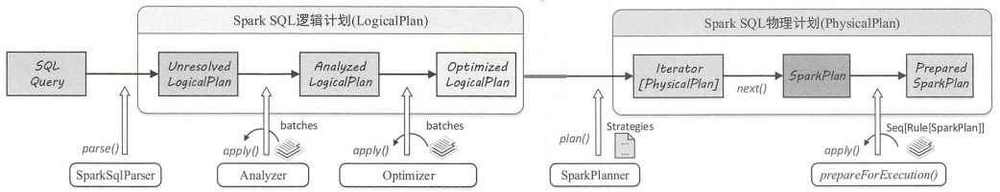

1. **由 SparkSqlParser 中的 AstBuilder 执行节点访问**，将语法树的各种 Context 节点转换成对应的 LogicalPlan 节点，生成未解析的逻辑算子树（Unresolved LogicalPlan），此时逻辑算子树是最初形态，不包含数据信息与列信息等。
2. **由 Analyzer 将一系列的规则作用在 Unresolved LogicalPlan 上**，对树上的节点绑定各种数据信息，生成解析后的逻辑算子树（Analyzed LogicalPlan）。
3. **由 Spark SQL 中的优化器（Optimizer）将一系列优化规则作用到逻辑算子树中**，在确保结果正确的前提下改写其中的低效结构，生成优化后的逻辑算子树（Optimized LogicalPlan）。  
4. **由 SparkPlanner 将各种物理计划策略（Strategy）作用于 LogicalPlan 节点上，**生成 SparkPlan 列表，PhysicalPlan 和 SparkPlan 均表示物理计划，一个 LogicalPlan 可能产生多个 SparkPlan。
5. **选取最佳的 SparkPlan**，当前版本实现较为简单，在候选列表中直接用 next() 方法获取第一个。
6. **提交前准备工作，进行一些分区排序方面的处理，**确保 SparkPlan 各节点能够正确执行，这一步通过 prepareForExecution() 方法调用若干规则（Rule）进行转换。

从 SQL 语句解析一直到提交之前，**上述整个转换过程都在 Spark 集群的 Driver 端进行，不涉及分布式环境**。本文将以 `` SELECT `name` FROM `student` WHERE `age` > 18 `` 为例进行说明，如图所示，左上角是 SQL 语句，生成的逻辑算子树中有 Relation、Filter 和 Project 节点，分别对应数据表、过滤逻辑（age > 18） 和列剪裁逻辑（只涉及了表中 2 列）。下一步物理算子树从逻辑算子树一对一映射得到，生成的物理算子树根节点是 ProjectExec， 每个物理节点中的 execute 函数都是执行调用接口，**由根节点开始递归调用，从叶子节点开始执行**。图中展示了物理算子树的执行逻辑，与直接采用 RDD 进行编程类似，其中 FileSourceScanExec 叶子构造数据源对应的 RDD，FilterExec 和 ProjectExec 中的 execute 函数对 RDD 执行相应的 transformation 操作。

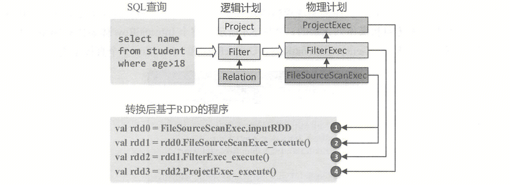

## 2.2 重要概念

**Spark SQL 内部实现基础框架称为 Catalyst**，这里先简要介绍 Catalyst 中涉及的重要概念和数据结构，主要包括 InternalRow 体系、TreeNode 体系和 Expression 体系。

### 2.2.1 InternalRow 体系

对于关系表来讲，通常操作的数据都是以“行”为单位的。在 Spark SQL 内部实现中，**InternalRow 就是用来表示一行行数据的类**，因此物理算子树节点产生和转换的 RDD 类型即为 RDD[InternalRow]。此外，InternalRow 中的每一列都是 Catalyst 内部定义的数据类型。

从类的定义来看，InternalRow 作为一个抽象类，包含 numFields 和 update 方法，以及各列数据对应的 get 与set 方法，但具体的实现逻辑体现在不同的子类中。需要注意的是，InternalRow 中都是根据下标来访问和操作列元素的。

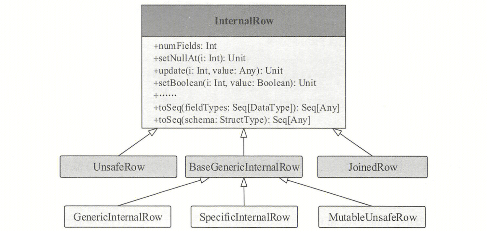

### 2.2.2 TreeNode 体系

无论是逻辑计划还是物理计划，都离不开中间数据结构。在 Catalyst 中，对应的是 TreeNode 体系。**TreeNode 类是 Spark SQL 中所有树结构的基类，定义了一系列通用的集合操作和树遍历操作接口**。

TreeNode 内部包含一个 Seq[BaseType] 类型的**变量 children 来表示孩子节点**，同时定义了 foreach、map、collect 等针对节点操作的方法，以及 transformUp 和 transformDown 等遍历节点并对匹配节点进行相应转换的方法。TreeNode 本身是 scala.Product 类型，因此可以通过 productElement 函数或 productlterator 迭代器对 Case Class 参数信息进行索引和遍历。实际上，TreeNode 一直在内存里维护，不会 dump 到磁盘以文件形式存储，树的修改都是以替换已有节点的方式进行的。

**TreeNode 包含两个子类：QueryPlan 和 Expression**。Expression 是 Catalyst 中的表达式体系，下一节会介绍。QueryPlan 又包含逻辑算子树（LogicalPlan）和物理执行算子树（SparkPlan）两个重要的子类，其中逻辑算子树在 Catalyst 中内置实现，可以剥离出来直接应用到其他系统中；而物理算子树 SparkPlan 和 Spark 执行层紧密相关，当 Catalyst 应用到其他计算模型时，可以进行相应的适配修改。

作为基础类，TreeNode 本身仅提供了最基本的操作。如不同遍历方式的 transform 系列方法、用于替换新的子节点的 withNewChildren 方法等、能够将 TreeNode 以树型结构展示的 treeString 方法，这在查看表达式、逻辑算子树和物理算子树时经常用到。此外，Catalyst 中还提供了节点位置功能，能够根据 TreeNode 定位到对应的 SQL 字符串中的行数和起始位置，该功能在 SQL 解析发生异常时能够方便用户迅速找到出错的地方（代码详见 Origin 和 CurrentOrigin 类）。

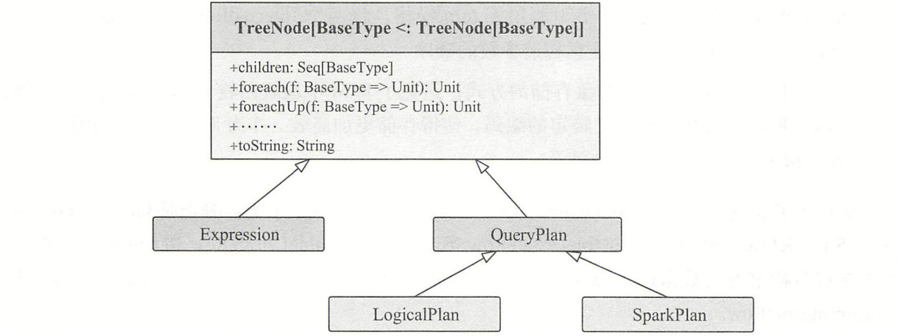

### 2.2.3 Expression 体系

**表达式一般指的是不需要触发执行引擎而能够直接进行计算的单元，例如四则运算、转换操作、过滤操作等**。Catalyst 实现了完善的表达式（Expression）体系，与各种算子（QueryPlan）占据同样的地位。算子执行前通常都会进行“绑定”操作，将表达式与输入的属性对应起来，同时算子也能够调用各种表达式处理相应的逻辑。在 Expression 类中，主要定义了 5 个方面的操作，包括基本属性、核心操作、输入输出、字符串表示和等价性判断。

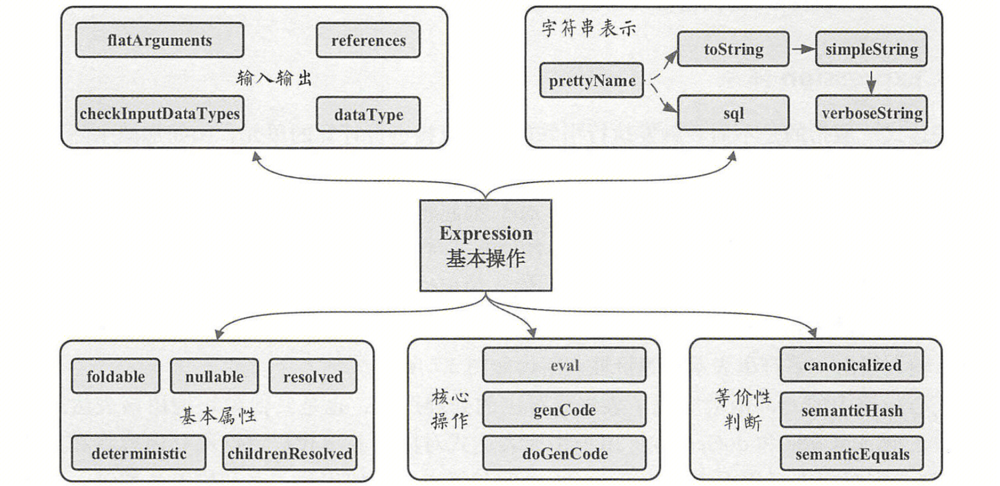

核心操作中的 eval 函数实现了表达式对应的处理逻辑，也是其他模块调用该表达式的主要接口，而 genCode 和 doGencode 用于生成表达式对应的 Java 代码，下面对 Expression 包含的基本属性和操作进行简单介绍。

```scala
abstract class Expression extends TreeNode[Expression] {
  // 该属性用来标记表达式能否在查询执行之前直接静态计算。当foldable为true时，在算子树中，表达式可以预先直接处理（折叠）。
  // 目前，foldable为true的情況有两种，第一种是该表达式为Literal类型（字面值，如常量等），第二种是当且仅当其子表达式中foldable都为true时。
  def foldable: Boolean = false
  
  // 该属性用来标记表达式是否为确定性的，即每次执行eval函数的输出是否都相同。考虑到Spark分布式执行环境中数据Shuffle操作带来的不确定性，
  // 以及某些表达式（如Rand等）本身具有不确定性，该属性对于算子树优化中判断谓词能否下推等很有必要。
  lazy val deterministic: Boolean = children.forall(_.deterministic)
  
  // 该属性用来标记表达式是否可能输出null值，一般在生成的Java代码中对相关条件进行判断。
  def nullable: Boolean

  def eval(input: InternalRow = null): Any
  
  // 返回经过规范化（Canonicalize）处理后的表达式。规范化处理会在确保输出结果相同的前提下通过一些规则对表达式进行重写，具体逻辑可以参见Canonicalize工具类。
  lazy val canonicalized: Expression = withCanonicalizedChildren
  
  // 判断两个表达式在语义上是否等价。基本的判断条件是两个表达式都是确定性的（deterministic为true）且两个表达式经过规范化处理后（Canonicalized）仍然相同。
  def semanticEquals(other: Expression): Boolean =
    deterministic && other.deterministic && canonicalized == other.canonicalized
  
  // ...
}
```

在 Spark SQL中，Expression 本身也是 TreeNode 类的子类，因此能够调用所有 TreeNode 的方法，也可以通过多级的子 Expression 组合成复杂的 Expression。 Expression 涉及范围广且数目庞大，相关的类或接口将近 300个。

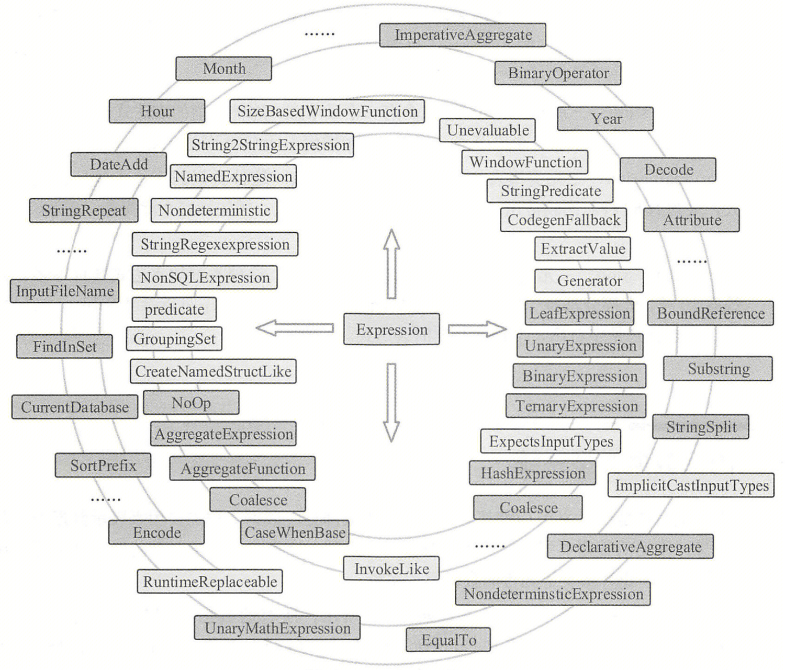

# 3. 逻辑计划

## 3.1 抽象语法树

SQL 可以被看作是一种领域特定语言（Domain Specific Language，简称 DSL），通常情况下，一个系统中 DSL 模块的实现需要涉及两方面的工作：

- 设计语法和语义，定义 DSL 中具体的元素。
- 实现词法分析器（Lexer）和语法分析器（Parser），完成对 DSL 的解析，最终转换为底层逻辑来执行。

**ANTLR（ANother Tool for Language Recognition）**是目前非常活跃的语法生成工具，用 Java 语言编写，基于 LL(*) 解析方式，使用自上而下的递归下降分析方法。ANTLR 可以用来产生词法分析器、语法分析器和树状分析器等各个模块。此外，它还支持生成基于监听器（Listener）模式和访问者（Visitor）模式的树遍历器，其中访问者模式遍历语法树更加灵活，可以避免在文法文件中嵌入烦琐的动作，使解析与应用代码分离。ANTLR 应用广泛，Hibernate 使用 ANTLR 解析 HQL 语言，NetBeans IDE 基于 ANTLR 解析 C++，Hive、Presto 和 Spark SQL 等大数据引擎的 SQL 编译模块也都是基于 ANTLR 构建的。

**为了查看 Spark SQL 语法解析后生成的抽象语法树（Abstract Syntax Tree，简称 AST），我们按照如下步骤将 Parser 模块剥离**：

- 参考 [Idea 中使用 Antlr4](https://blog.csdn.net/waiting971118/article/details/124307642)，在 IDEA 中安装 ANTLR 插件。
- 新建一个 Maven 项目，将 Spark 3.4.2 目录 spark/sql/catalyst/src/main/antlr4/org/apache/spark/sql/catalyst/parser 下的 **SqlBaseLexer.g4（词法文件）、SqlBaseParser.g4（语法文件）**拷贝到新项目中，如下图。
- 选中 SqlBaseParser.g4，右击选择 Generate ANTLR Recognizer，将在项目根目录下生成一个 gen 目录，其中 SqlBaseLexer.tokens 和 SqlBaseParser.tokens 是内部的 Token 定义，SqlBaseLexer.java 和 SqlBaseParser.java 是生成的词法分析器和语法分析器，剩下的 Java 文件代表两种访问语法树的方式，SqlBaseParserBaseListener.java 和 SqlBaseParserListener.java 对应监听器模式，SqlBaseParserBaseVisitor.java 和 SqlBaseParserVisitor.java 对应访问者模式。
- 打开 SqlBaseParser.g4 文件，在语法定义所在行（如图中第 45 行），右击选择 Test Rule，然后在弹出框左侧输入 SQL，即可检验语法，将在右侧生成对应的抽象语法树。

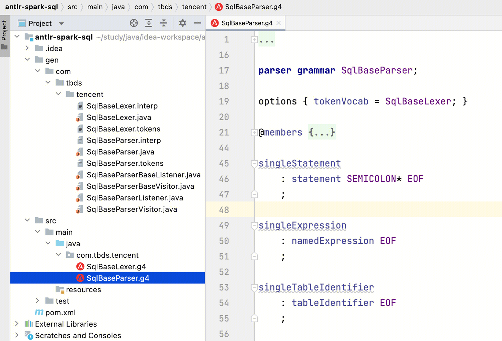

以 `` SELECT `name` FROM `student` WHERE `age` > 18 `` 为例，对应生成的抽象语法树如下图。其中 SingleStatement 是根节点（Spark 源码中所有 AST 节点均以 Context 结尾，即对应 SingleStatementContext），在访问该节点时一般什么都不做，只递归访问子节点。整个遍历访问操作中比较重要的是包含多个子节点的节点，例如 RegularQuerySpecification 节点，左边的一系列节点对应 Select 表达式中选择的列，中间的 FromClause 为根节点的系列节点对应数据表，右边的一系列节点则对应 Where 条件中的表达式。

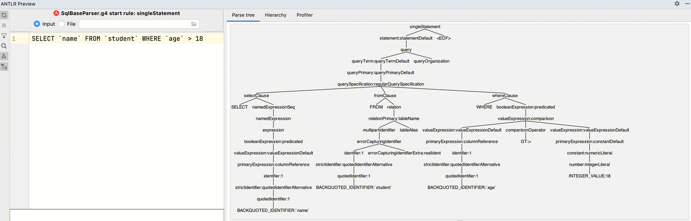


## 3.2 Unresolved LogicalPlan

### 3.2.1 LoginPlan 简介

LogicalPlan 属于 TreeNode 体系，继承自 QueryPlan。QueryPlan 的主要操作分为 6 个模块：输入输出、宇符串、规范化、表达式操作、基本属性和约束，如下图所示，有些属性或函数随版本迭代稍有不同。注意，**字符串操作中 statePrefix 方法用来表示节点对应计划状态的前缀字符串，在 QueryPlan 默认实现中，如果该计划不可用（invalid），则前缀会用感叹号（**`!`**）标记；LogicalPlan 重载了该方法，如果该逻辑算子树节点未经过解析，则输出的字符串前缀会加上单引号（**`'`**）**。

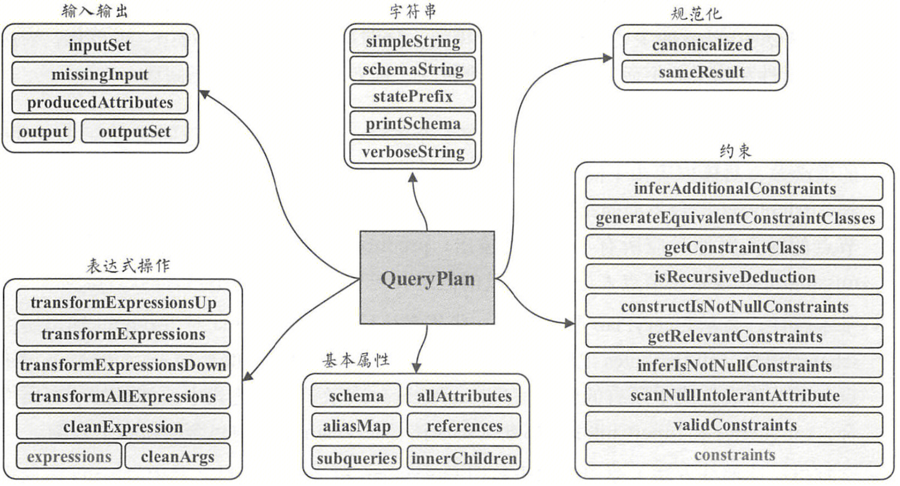

LogicalPlan 仍然是抽象类，根据子节点数目，**绝大部分的 LogicalPlan 可以分为 3 类，即叶子节点 LeafNode 类型（不存在子节点）、一元节点 UnaryNode 类型（仅包含一个子节点）和二元节点 BinaryNode 类型（包含两个子节点）**。此外，还有几个子类直接继承自 LogicalPlan，不属于这 3 种类型。如下表所示，表中加粗字体表示例子中涉及的 Node 类型。

| Node 类型      | Node 包含子类                                                |
| :------------- | ------------------------------------------------------------ |
| **LeafNode**   | CommandResult、UnresolvedTable、UnresolvedTableOrView、CTERelationRef、UnresolvedTableValuedFunction、Range、UnresolvedCatalogRelation、UnresolvedNamespace、MemoryPlan、DataSourceV2Relation、DummyExpressionHolder、UnresolvedFunctionName、LocalRelation、DataSourceV2ScanRelation、**UnresolvedRelation**、HiveTableRelation、InMemoryRelation、OneRowRelation、OffsetHolder、ScanBuilderHolder、UnresolvedIdentifier、StreamingExecutionRelation、ExternalRDD、RelationTimeTravel、TemporaryViewRelation、UnresolvedInlineTable、LeafNodeWithoutStats（ResolvedPersistentFunc、ResolvedIdentifier、ResolvedNonPersistentFunc、ResolvedTempView、ResolvedTable、ResolvedPersistentView、ResolvedNamespace）、LogicalRDD、UnresolvedView、StreamingRelation、StreamingDataSourceV2Relation、StreamingRelationV2、LogicalQueryStage、LogicalQueryStage |
| **UnaryNode**  | CTERelationDef、ResolvedHint、WriteToStreamStatement、WriteToContinuousDataSource、PythonMapInArrow、FlatMapGroupsInR、DomainJoin、TypedFilter、MapInPandas、WriteFiles、Distinct、WithWindowDefinition、ObjectConsumer（AppendColumnsWithObject、MapPartitions、MapElements、SerializeFromObject、MapPartitionsInR）、UnresolvedHaving、WriteToStream、UnresolvedHint、LateralJoin、MapPartitionsInRWithArrow、ScriptTransformation、Expand、Pivot、Sort、InsertIntoDir、UnresolvedSubqueryColumnAliases、RepartitionOperation（Repartition、RepartitionByExpression）、View、Unpivot、ReturnAnswer、WriteToMicroBatchDataSource、FlatMapGroupsInPandasWithState、CollectMetrics、RebalancePartitions、Aggregate、BaseEvalPython（ArrowEvalPython、BatchEvalPython）、UnresolvedTVFAliases、DeserializeToObject、WriteToMicroBatchDataSourceV1、EventTimeWatermark、AppendColumns、FlatMapGroupsInRWithArrow、Deduplicate、UnresolvedWith、WriteToDataSourceV2、AttachDistributedSequence、Generate、ParameterizedQuery、OrderPreservingUnaryNode（Subquery、SubqueryAlias、Offset、**Project**、**Filter**、Tail、LocalLimit）、GlobalLimit、Window、FlatMapGroupsInPandas、Sample、MapGroups |
| **BinaryNode** | SetOperation（Except、Intersect）、AsOfJoin、OrderedJoin、CoGroup、FlatMapGroupsWithState、FlatMapCoGroupsInPandas、Join |
| **其他**       | SupportsSubquery（DeleteFromTable、RowLevelWrite（ReplaceData、WriteDelta）、MergeIntoTable、UpdateTable）、ParsedStatement（UnaryParsedStatement（InsertIntoStatement）、LeafParsedStatement）、CreateTable、V2CreateTablePlan（ReplaceTable、CreateTableAsSelect、ReplaceTableAsSelect、CreateTable）、ExposesMetadataColumns（StreamingRelation、DataSourceV2Relation、LogicalRelation）、IgnoreCachedData（ResetCommand、ClearCacheCommand）、ObjectProducer（ExternalRDD、FlatMapGroupsInR、MapPartitions、MapElements、MapGroups、MapPartitionsInR、CoGroup、FlatMapGroupsWithState、DeserializeToObject）、Union、Command（KeepAnalyzedQuery、AnalysisOnlyCommand、LeafCommand、UnaryCommand、BinaryCommand、RunnableCommand）、WithCTE、NamedRelation（DataSourceV2ScanRelation、UnresolvedRelation、DataSourceV2Relation） |

 

### 3.2.2 AstBuilder 机制

Catalyst 提供了直接面向用户的 ParserInterface 接口，该接口中包含了对 SQL 语句、Expression 表达式和 Tableldentifier 数据表标识符的解析方法。AbstractSqlParser 是实现了 ParserInterface 的抽象类，其中定义了返回 AstBuilder 的函数。整个 SQL 解析相关的实现如图所示，其中 CatalystSqlParser 仅用于 Catalyst 内部，而 SparkSqlParser 用于外部调用。**比较核心的是 AstBuilder， 它继承了 ANTLR4 生成的 SqlBaseParserBaseVisitor，用于将抽象语法树转换为 Unresolved LogicalPlan；SparkSqlAstBuilder 继承 AstBuilder，并在其基础上定义了一些 DDL 语句的访问操作，主要在 SparkSqlParser 中调用**。

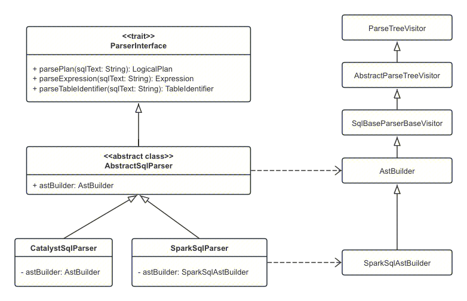

仍以 `` SELECT `name` FROM `student` WHERE `age` > 18 `` 为例。在第 1 节“提交流程”中已经分析，SparkSession 将在 sql() 方法中调用 `sessionState.sqlParser.parsePlan(sqlText)` 生成 Unresolved LogicalPlan。

```scala
SparkSession
  sessionState.sqlParser.parsePlan(sqlText)
    // 构建整棵抽象语法树
    parser.singleStatement()
    // AstBuilder访问者类对抽象语法树进行访问
    astBuilder.visitSingleStatement(ctx)
      // ctx.statement返回SingleStatementContext子节点，即StatementDefaultContext(对照第3.1节的抽象语法树)
      visit(ctx.statement).asInstanceOf[LogicalPlan]
        // tree类型为StatementDefaultContext，this实际类型为AstBuilder，继承关系：AstBuilder -> SqlBaseParserBaseVisitor -> AbstractParseTreeVisitor -> ParseTreeVisitor
        // 也就是说，AstBuilder将首先调用自身的visitXXX()方法访问抽象树节点，若自身没有该方法，则调用父类SqlBaseParserBaseVisitor的方法
        tree.accept(this)
          // StatementDefaultContext类accept()方法 -> SqlBaseParserBaseVisitor类visitStatementDefault()方法 -> 访问子节点
          // QueryContext类accept()方法 ->  AstBuilder类visitQuery方法 -> 访问子节点 -> ...
          // 当解析到RegularQuerySpecificationContext节点时，首先访问FromClauseContext生成名为from的LogicalPlan，然后在from基础上完成后续扩展
          visitRegularQuerySpecification
            // 【1】生成数据表对应的LogicalPlan
            val from = OneRowRelation().optional(ctx.fromClause) { visitFromClause(ctx.fromClause) }
            withSelectQuerySpecification(..., from)
              visitCommonSelectQueryClausePlan()
                // 【2】生成加入了过滤逻辑的LogicalPlan
                val withFilter = withLateralView.optionalMap(whereClause)(withWhereClause)
                // 【3】生成加入列剪裁后的LogicalPlan
                val withProject = if (aggregationClause == null && havingClause != null) {
                  // 根据SQL标准，没有GROUP BY的HAVING子句表示全局聚合
                  withHavingClause(havingClause, Aggregate(Nil, namedExpressions, withFilter))
                } else if (aggregationClause != null) {
                  // 如果有聚合子句，则将[[Aggregate]]节点添加到逻辑计划中
                  val aggregate = withAggregationClause(aggregationClause, namedExpressions, withFilter)
                } else {
                  // 当进入这个分支，having必须为空
                  createProject()
                }
```

总的来看，AstBuilder 生成 Unresolved LogicalPlan 的过程如图所示，从 RegularQuerySpecificationContext 节点开始，分为以下 3 个步骤：


- **生成数据表对应的 LogicalPlan**：对应 SQL 中 from 语句，访问 FromClauseContext 并递归访问（visitFromClause），一直到匹配 TableNameContext 节点（visitTableName）时，直接生成 UnresolvedRelation，此时不再继续递归访问子节点，构造名为 from 的 LogicalPlan 并返回。
- **生成加入了过滤逻辑的 LogicalPlan**：对应 SQL 中 where 语句， 访问 WhereClauseContext 并递归访问（visitWhereClause)，下表按照子节点为先顺序，列出了构造 Filter 逻辑算子树节点中的 condition 表达式，其树型结构如上图（左）所示。当执行 visitColumnReference 时，会根据 ColumnReferenceContext 节点信息生成 UnresolvedAttribute 表达式，其中的常数会统一封装为 Literal 表达式。在 visitPredicated 中会检查该谓词逻辑中是否包含 predicate 语句（按照文法定义，predicate 主要表示 BETWEEN-AND、IN 和 LIKE/RLIKE 等语句），这里 SQL 不包含 predicate，因此直接返回访问其子节点（visitComparison）得到的结果，生成 Filter LogicalPlan 节点的 condition 构造参数为 GreaterThan 表达式。最后，由此 LogicalPlan 和上一步中的 UnresolvedRelation 构造名为 withFilter 的 LogicalPlan，其中 Filter 节点为根节点。

| **访问操作**         | **返回的 Expression**           |
| :------------------- | :------------------------------ |
| visitColumnReference | UnresolvedAttribute(Seq("AGE")) |
| visitIntegerLiteral  | Literal(18, IntegerType)        |
| visitComparison      | GreaterThan(left, right)        |
| visitPredicated      | GreaterThan(left, right)        |

- **生成加入列剪裁后的 LogicalPlan**：对应 SQL 中 select 语句对 name 列的选择操作，下表按照子节点为先顺序，列出了构造 Project 逻辑算子树节点中所选取列对应的表达式，其树型结构如上图（右）所示。当执行 visitColumnReference 时，会对 name 列生成 UnresolvedAttribute 表达式；此时 visitPredicated 中同样不包含 predicate，因此直接返回子节点生成的表达式；最后，执行 visitNamedExpression 访问操作，该操作用于对选取的列进行命名，因为不涉及别名，这里也是直接返回子节点生成的表达式。最后，由此 LogicalPlan 和上一步中的 withFilter 构造名为 withProject 的 LogicalPlan，其中 Project 成为整棵逻辑算子树的根节点。

| **访问操作**         | **返回的 Expression**            |
| :------------------- | :------------------------------- |
| visitColumnReference | UnresolvedAttribute(Seq("NAME")) |
| visitPredicated      | UnresolvedAttribute(Seq("NAME")) |
| visitNamedExpression | UnresolvedAttribute(Seq("NAME")) |

 

## 3.3 Analyzed LogicalPlan

### 3.3.1 Catalog 体系

**Catalog 主要用于元数据信息（库、表、视图、分区与函数等）的统一管理**。**在 DataSource V1 中，Catalog 体系实现以 SessionCatalog 为主体**，通过 SparkSession 提供给外部调用，一般一个 SparkSession 对应一个 SessionCatalog。SessionCatalog 封装了 ExternalCatalog，ExternalCatalog 是一个 Trait 类型，提供了对库、表、分区和函数的增删改查基本接口，对外部数据源的访问都是通过 ExternalCatalog 实现的。对 Hive 数据源来讲，分别继承上述两个类，提供了具体的实现：HiveSessionCatalog 和 HiveExternalCatalog。

**随着新数据源（DataSource V2）的出现，原来的 SessionCatalog 暴露出弊端和不足，为了适应新的数据源特性，Spark 3.0.0 推出了新的接口 CatalogPlugin（即 Spark 3.0.0 开始支持 multi-catalog，并逐步完善）**。实现自定义 Catalog，既可以直接实现 CatalogPlugin，也可以扩展 TableCatalog 接口，因为 TableCatalog 扩展了 CatalogPlugin 并提供了表操作相关功能的接口。同理，实现函数相关的 Catalog，也可以直接扩展 FunctionCatalog，因为它提供了函数管理相关的接口。同 SessionCatalog 相对应，CatalogPlugin 接口体系也实现了 V2SessionCatalog，V2SessionCatalog 是 SessionCatalog 的代理实现，它将 SessionCatalog 作为其属性。

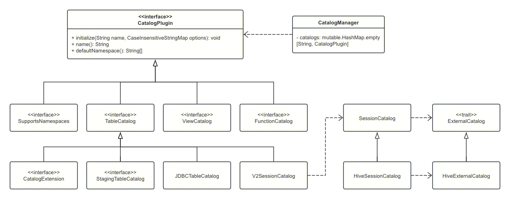

**Spark 提供了 CatalogManager，其内部通过一个 Map 类型的数据结构来维护注册的 Catalog 实例**。CatalogManager 能够根据 Catalog 名称返回对应的 Catalog 实例，**其中有一个名为 spark_catalog，用于当前默认的 Catalog 实例实现，该实例就是 V2SessionCatalog，代理了普通的 SessionCatalog**。因此在使用时，即使什么 Catalog 都不注册，Spark 也会根据默认的 Catalog 实例加载 Hive 数据源。但是 V2SessionCatalog 只是对 SessionCatalog 的简单代理，那么如何实现复杂的数据源元数据管理功能呢？这就需要扩展 V2SessionCatalog，这里以 Iceberg 为例，其提供两种实现方式：

- `org.apache.iceberg.spark.SparkCatalog` 支持将 Hive Metastore 或 Hadoop warehouse 作为 Catalog。
- `org.apache.iceberg.spark.SparkSessionCatalog` 在 Spark 内置 Catalog 中添加了对 Iceberg 表的支持，并将非 Iceberg 表委托给内置 Catalog。

**SparkSessionCatalog 有两个属性：icebergCatalog 和 sessionCatalog。其中 icebergCatalog 就是 SparkCatalog，而 sessionCatalog 是默认的名为 spark_catalog 的 V2SessionCatalog**。以 createTable() 方法为例，如果是 Iceberg 表，它使用 icebergCatalog 创建表，否则使用 sessionCatalog 创建表。

```scala
// org.apache.iceberg.spark.SparkSessionCatalog[iceberg]
public class SparkSessionCatalog<T extends TableCatalog & FunctionCatalog & SupportsNamespaces>
    extends BaseCatalog implements CatalogExtension {
  // 实际是 org.apache.iceberg.spark.SparkCatalog[iceberg]
  // 继承关系：SparkCatalog[iceberg] -> BaseCatalog[iceberg] -> StagingTableCatalog[spark] -> TableCatalog[spark]
  private TableCatalog icebergCatalog = null;
  // 实际是org.apache.spark.sql.execution.datasources.v2.V2SessionCatalog[spark]
  private T sessionCatalog = null;
  // ...
}
```

 

### 3.3.2 **Analyzer 机制**

仍以 `` SELECT `name` FROM `student` WHERE `age` > 18 `` 为例。在第 1 节“提交流程”中已经分析，QueryExecution 将调用 `sparkSession.sessionState.analyzer.executeAndCheck(logical, tracker)` 生成 Analyzed LogicalPlan。

```scala
QueryExecution
  sparkSession.sessionState
    // 如果设置了spark.sql.catalogImplementation="hive"，这里SparkSession.sessionStateClassName根据配置返回：org.apache.spark.sql.hive.HiveSessionStateBuilder
    SparkSession.instantiateSessionState(SparkSession.sessionStateClassName(...), self)
      // 通过反射生成[Hive]SessionStateBuilder，HiveSessionStateBuilder主要重写了三个对象：Catalog、Analyzer和SparkPlanner
      val clazz = Utils.classForName(className)
      val ctor = clazz.getConstructors.head
      // 继承关系：SessionStateBuilder、HiveSessionStateBuilder -> BaseSessionStateBuilder
      ctor.newInstance(sparkSession, None).asInstanceOf[BaseSessionStateBuilder].build()
        // 这里analyzer为Analyzer，但optimizer为SparkOptimizer（Optimizer子类）。注意，BaseSessionStateBuilder及其子类分别重写了某些规则和策略
        new SessionState(..., () => analyzer, () => optimizer, planner, ...)
  sessionState.analyzer.executeAndCheck(logical, tracker)
    // 继承关系：Analyzer、Optimizer -> RuleExecutor
    val analyzed = executeAndTrack(plan, tracker)
      execute(plan)
        // batches是RuleExecutor抽象方法（由Analyzer、Optimizer重写），该方法返回Seq[Batch]，每个Batch代表一套规则，配备一个策略，策略说明了选代次数（一次还是多次）
        // RuleExecutor会按照batches中的batch顺序，以及batch内的rules顺序，对传入的plan里的节点进行迭代处理，处理逻辑由具体Rule子类实现
        batches.foreach { batch => ...}
    // 检查生成的Analyzed LogicalPlan
    checkAnalysis(analyzed)
      checkAnalysis0(inlineCTE(plan))
        // 额外的检查规则列表，默认为空，复写该值即可扩展
        extendedCheckRules.foreach(_(plan))
```

**在 Spark 3.4.2 中，Analyzer 默认定义了 16 个 Batch，每个 Batch 包含若干规则**，**这些规则都继承自抽象类 Rule，并复写 apply() 方法来制定处理逻辑**。如下表所示，策略 Once 表示规则只运行一次；策略 FixedPoint 表示规则运行多次（不超过 spark.sql.analyzer.maxIterations 参数值，默认 100），表中加粗字体表示例子中涉及的规则。

| **Batch 名称**                   | **说明**                                                     | **策略（Strategy）** | **包含的规则（Rule）**                                       |
| :------------------------------- | :----------------------------------------------------------- | :------------------- | :----------------------------------------------------------- |
| Substitution                     | 类似替换操作                                                 | FixedPoint           | OptimizeUpdateFields、CTESubstitution、BindParameters、WindowsSubstitution、EliminateUnions、SubstituteUnresolvedOrdinals |
| Disable Hints                    | 关闭Hints                                                    | Once                 | ResolveHints.DisableHints                                    |
| Hints                            | 处理Hints                                                    | FixedPoint           | ResolveHints.ResolveJoinStrategyHints、ResolveHints.ResolveCoalesceHints |
| Simple Sanity Check              | 简单健全性检查，如函数标识符是否在函数注册表中定义           | Once                 | LookupFunctions                                              |
| Keep Legacy Outputs              | 保留SQL命令的传统输出                                        | Once                 | KeepLegacyOutputs                                            |
| Resolution                       | 包含了最多也最常用的解析规则，以及一个 extendedResolutionRules 扩展规则列表。涉及常见的数据源、数据类型、数据转换和处理操作 | FixedPoint           | ResolveCatalogs(catalogManager)、ResolveUserSpecifiedColumns、ResolveInsertInto、**ResolveRelations**、ResolvePartitionSpec、ResolveFieldNameAndPosition、AddMetadataColumns、DeduplicateRelations、**ResolveReferences**、ResolveLateralColumnAliasReference、ResolveExpressionsWithNamePlaceholders、ResolveDeserializer、ResolveNewInstance、ResolveUpCast、 ResolveGroupingAnalytics、ResolvePivot、ResolveUnpivot、ResolveOrdinalInOrderByAndGroupBy、ExtractGenerator、ResolveGenerate、ResolveFunctions、ResolveAliases、ResolveSubquery、ResolveSubqueryColumnAliases、ResolveWindowOrder、ResolveWindowFrame、ResolveNaturalAndUsingJoin、ResolveOutputRelation、ExtractWindowExpressions、GlobalAggregates、ResolveAggregateFunctions、TimeWindowing、SessionWindowing、ResolveWindowTime、ResolveDefaultColumns(ResolveRelations.resolveRelationOrTempView)、ResolveInlineTables、ResolveLambdaVariables、ResolveTimeZone、ResolveRandomSeed、ResolveBinaryArithmetic、ResolveUnion、RewriteDeleteFromTable、**typeCoercionRules**、Seq(ResolveWithCTE)、extendedResolutionRules |
| Remove TempResolvedColumn        | 移除TempResolvedColumn                                       | Once                 | RemoveTempResolvedColumn                                     |
| Post-Hoc Resolution              | 后期解析规则                                                 | Once                 | Seq(ResolveCommandsWithIfExists)、postHocResolutionRules     |
| Remove Unresolved Hints          | 移除无效Hints                                                | Once                 | ResolveHints.RemoveAllHints                                  |
| Nondeterministic                 | 处理非确定性表达式                                           | Once                 | PullOutNondeterministic                                      |
| UDF                              | 处理UDF函数                                                  | Once                 | HandleNullInputsForUDF、ResolveEncodersInUDF                 |
| UpdateNullability                | 更新可空性                                                   | Once                 | UpdateAttributeNullability                                   |
| Subquery                         | 处理子查询                                                   | Once                 | UpdateOuterReferences                                        |
| Cleanup                          | 清理无用信息，如LogicalPlan中无用的别名                      | FixedPoint           | CleanupAliases                                               |
| HandleSpecialCommand             | 处理在解析完成时需要通知的特殊命令                           | Once                 | HandleSpecialCommand                                         |
| Remove watermark for batch query | 移除批处理查询的watermark                                    | Once                 | EliminateEventTimeWatermark                                  |

**逻辑算子树的解析是一个不断的迭代过程**，用户可以通过参数 spark.sql.analyzer.maxIterations 设定 RuleExecutor 选代的轮数，对于某些嵌套较深的特殊 SQL，可以适当增加轮数。下面介绍示例中 Analyzer 生成 Analyzed LogicalPlan 的大致过程：

- 第 1 步，对于 3.2.2 节的 Unresolved LogicalPlan， **Analyzer 首先匹配的是 ResolveRelations 规则**。当遍历逻辑算子树匹配到 UnresolvedRelation 节点时，会从 SessionCatalog 中查表。需要注意的是，**在 Catalog 查表后，Relation 节点上会插入一个别名节点**。此外，Relation 中列后面的数字表示下标，age 和 id 都默认为 Long 类型（L 字符）。
- 第 2 步，**执行 ResolveReferences 规则**。其他节点都不发生变化，主要是 Filter 节点中的 age 信息从 Unresolved 状态变成了 Analyzed 状态（表示 Unresolved 状态的前缀字符单引号被去掉）。在对 Filter 表达式中的 age 属性进行分析时，因为 Filter 的子节点 Relation 已经处于 resolved 状态，因此可以成功；而在对 Project 中的表达式 name 属性进行分析时，因为 Project 的子节点 Filter 此时仍然处于 unresolved 状态（虽然 age 列完成了分析，但整个 Filter 节点中还有 18 这个 Literal 常数表达式未被分析），因此解析操作无法成功，留待下一轮规则调用时再进行解析。
- 第 3 步，**调用 TypeCoercion 规则集中的 ImplicitTypeCasts 规则**，对表达式中的数据类型进行隐式转换。因为在 Relation 中，age 列的数据类型为 Long，而 Filter 中的数值 18 在 Unresolved LogicalPlan 中生成的类型为 IntegerType， 所以需要将 18 这个常数转换为 Long 类型。经过该规则的解析操作，Filter 节点变成了 Analyzed 状态（节点字符前缀字符单引号已经被去掉）。
- 第 4 步，经过上述 3 个规则的解析后，剩下的规则对逻辑算子树不起作用，此时逻辑算子树中仍然存在 Project  节点未被解析，接下来会进行下一轮规则的应用。**再次执行 ResolveReferences 规则**，经过上一步 Filter 节点已经处于 resolved 状态，因此逻辑算子树中的 Project 节点能够完成解析。


## 3.4 Optimized LogicalPlan

仍以 `` SELECT `name` FROM `student` WHERE `age` > 18 `` 为例。在第 1 节“提交流程”中已经分析，QueryExecution 将调用 `sparkSession.sessionState.optimizer.executeAndTrack(withCachedData.clone(), tracker)` 生成 Optimized LogicalPlan。

```scala
QueryExecution
  // 在3.3.2节已经分析，这里optimizer实际为SparkOptimizer（Optimizer子类）
  sparkSession.sessionState.optimizer.executeAndTrack(withCachedData.clone(), tracker)
    // 调用流程与Analyzer类似，继承关系：SparkOptimizer -> Optimizer -> RuleExecutor
    execute(plan)
      // batches是RuleExecutor抽象方法（由Analyzer、Optimizer重写），该方法返回Seq[Batch]，每个Batch代表一套规则，配备一个策略，策略说明了选代次数（一次还是多次）
      // RuleExecutor会按照batches中的batch顺序，以及batch内的rules顺序，对传入的plan里的节点进行迭代处理，处理逻辑由具体Rule子类实现
      batches.foreach { batch => ...}
```

**在 Spark 3.4.2 中，Optimizer 默认定义了 24 个 Batch，SparkOptimizer 默认定义了 11 个 Batch（不含父类定义的） ，每个 Batch 包含若干规则**，**这些规则都继承自抽象类 Rule，并复写 apply() 方法来制定处理逻辑**。如下表所示，分别为 Optimizer 和 SparkOptimizer 定义的 Batch，策略 Once 表示规则只运行一次；策略 FixedPoint 表示规则运行多次（不超过 spark.sql.optimizer.maxIterations 参数值，默认 100），表中加粗字体表示例子中涉及的规则。

| **Batch 名称**                        | **说明**                                                     | **策略（Strategy）** | **包含的规则（Rule）**                                       |
| :------------------------------------ | :----------------------------------------------------------- | :------------------- | :----------------------------------------------------------- |
| Finish Analysis                       | 严格来讲，该Batch不涉及优化操作，更适合放在Analyzer，但由于我们还使用Analyzer来规范化查询，因此不会在Analyzer中消除子查询或计算当前时间 | Once                 | FinishAnalysis（EliminateResolvedHint、**EliminateSubqueryAliases**、EliminateView、ReplaceExpressions、RewriteNonCorrelatedExists、PullOutGroupingExpressions、ComputeCurrentTime、ReplaceCurrentLike、SpecialDatetimeValues、RewriteAsOfJoin） |
| Eliminate Distinct                    | 消除无用的Distinct                                           | Once                 | EliminateDistinct                                            |
| Inline CTE                            | 内联CTE，CTE（common table expression）定义了一个临时结果集，用户可以在SQL语句范围内多次引用该结果集 | Once                 | InlineCTE                                                    |
| Union                                 | 处理Union                                                    | FixedPoint           | RemoveNoopOperators、CombineUnions、RemoveNoopUnion          |
| LocalRelation early                   | LocalRelation Batch提前，可能简化计划并减少Optimizer成本     | FixedPoint           | ConvertToLocalRelation、PropagateEmptyRelation、UpdateAttributeNullability |
| Pullup Correlated Expression          | 提取相关表达式                                               | Once                 | OptimizeOneRowRelationSubquery、PullupCorrelatedPredicates   |
| Subquery                              | 处理子查询                                                   | FixedPoint(1)        | OptimizeSubqueries                                           |
| Replace Operators                     | 算子替换操作，某些查询算子可以直接改写为已有算子，避免进行重复的逻辑转换 | FixedPoint           | RewriteExceptAll、RewriteIntersectAll、ReplaceIntersectWithSemiJoin、ReplaceExceptWithFilter、ReplaceExceptWithAntiJoin、ReplaceDistinctWithAggregate、ReplaceDeduplicateWithAggregate |
| Aggregate                             | 处理Aggregate，其中operatorOptimizationRuleSet包含三类规则和一个扩展规则列表，分别是：①算子下推 Operator Push Down、②算子组合 Operator Combine、③常量折叠与长度削减 Constant Folding and Strength Reduction、④扩展规则列表extendedOperatorOptimizationRules | FixedPoint           | RemoveLiteralFromGroupExpressions、RemoveRepetitionFromGroupExpressions、operatorOptimizationBatch（包含如下 4 个子 Batch）Operator Optimization before Inferring Filters：operatorOptimizationRuleSet（包含三类规则和一个扩展规则列表：①PushProjectionThroughUnion、PushProjectionThroughLimit、ReorderJoin、EliminateOuterJoin、PushDownPredicates、PushDownLeftSemiAntiJoin、PushLeftSemiLeftAntiThroughJoin、LimitPushDown、LimitPushDownThroughWindow、ColumnPruning、GenerateOptimization、②CollapseRepartition、CollapseProject、OptimizeWindowFunctions、CollapseWindow、CombineFilters、EliminateOffsets、EliminateLimits、CombineUnions、③OptimizeRepartition、TransposeWindow、NullPropagation、NullDownPropagation、ConstantPropagation、FoldablePropagation、OptimizeIn、OptimizeRand、**ConstantFolding**、EliminateAggregateFilter、ReorderAssociativeOperator、LikeSimplification、BooleanSimplification、SimplifyConditionals、PushFoldableIntoBranches、RemoveDispensableExpressions、SimplifyBinaryComparison、ReplaceNullWithFalseInPredicate、PruneFilters、SimplifyCasts、SimplifyCaseConversionExpressions、RewriteCorrelatedScalarSubquery、RewriteLateralSubquery、EliminateSerialization、RemoveRedundantAliases、RemoveRedundantAggregates、UnwrapCastInBinaryComparison、RemoveNoopOperators、OptimizeUpdateFields、SimplifyExtractValueOps、OptimizeCsvJsonExprs、CombineConcats、PushdownPredicatesAndPruneColumnsForCTEDef、④extendedOperatorOptimizationRules）Infer Filters：InferFiltersFromGenerate、**InferFiltersFromConstraints**Operator Optimization after Inferring Filters：operatorOptimizationRuleSetPush extra predicate through join：PushExtraPredicateThroughJoin、PushDownPredicates |
| Clean Up Temporary CTE Info           | 清理临时CTE信息                                              | Once                 | CleanUpTempCTEInfo                                           |
| Pre CBO Rules                         | CBO之前的规则，子类复写                                      | Once                 | preCBORules                                                  |
| Early Filter and Projection Push-Down | 早期Filter和Projection下推，子类复写                         | Once                 | earlyScanPushDownRules                                       |
| Update CTE Relation Stats             | 更新CTE统计信息                                              | Once                 | UpdateCTERelationStats                                       |
| Join Reorder                          | Join重排                                                     | FixedPoint(1)        | CostBasedJoinReorder                                         |
| Eliminate Sorts                       | 消除排序                                                     | Once                 | EliminateSorts                                               |
| Decimal Optimizations                 | Decimal优化                                                  | FixedPoint           | DecimalAggregates                                            |
| Distinct Aggregate Rewrite            | 去重聚合重写                                                 | Once                 | RewriteDistinctAggregates                                    |
| Object Expressions Optimization       | 对象表达式优化                                               | FixedPoint           | EliminateMapObjects、CombineTypedFilters、ObjectSerializerPruning、ReassignLambdaVariableID |
| LocalRelation                         | 优化与LocalRelation相关的逻辑算子树                          | FixedPoint           | ConvertToLocalRelation、PropagateEmptyRelation、UpdateAttributeNullability |
| Optimize One Row Plan                 | 优化单行计划                                                 | FixedPoint           | OptimizeOneRowPlan                                           |
| Check Cartesian Products              | 检查笛卡尔积                                                 | Once                 | CheckCartesianProducts                                       |
| RewriteSubquery                       | 重写子查询                                                   | Once                 | RewritePredicateSubquery、PushPredicateThroughJoin、LimitPushDown、ColumnPruning、CollapseProject、RemoveRedundantAliases、RemoveNoopOperators |
| NormalizeFloatingNumbers              | 标准化浮点数                                                 | Once                 | NormalizeFloatingNumbers                                     |
| ReplaceUpdateFieldsExpression         | 替换更新字段表达式                                           | Once                 | ReplaceUpdateFieldsExpression                                |

| **Batch 名称**                             | **说明**                         | **策略（Strategy）** | **包含的规则（Rule）**                                       |
| :----------------------------------------- | :------------------------------- | :------------------- | :----------------------------------------------------------- |
| preOptimizationBatches                     | 常规优化之前的Batch              |                      | 空                                                           |
| super.defaultBatches                       | 父类Optimizer定义的Batch         |                      | 见上表                                                       |
| Optimize Metadata Only Query               | 优化只需查找分区级别元数据的语句 | Once                 | OptimizeMetadataOnlyQuery                                    |
| PartitionPruning                           | 分区裁剪                         | Once                 | PartitionPruning、RowLevelOperationRuntimeGroupFiltering     |
| InjectRuntimeFilter                        | 注入运行时Filter                 | FixedPoint(1)        | InjectRuntimeFilter                                          |
| MergeScalarSubqueries                      | 合并标量子查询                   | Once                 | MergeScalarSubqueries、RewriteDistinctAggregates             |
| Pushdown Filters from PartitionPruning     | 从分区裁剪中下推Filters          | FixedPoint           | PushDownPredicates                                           |
| Cleanup filters that cannot be pushed down | 清理无法下推的Filters            | Once                 | CleanupDynamicPruningFilters、BooleanSimplification、PruneFilters |
| postHocOptimizationBatches                 | 常规优化之后的Batch              |                      | 空                                                           |
| Extract Python UDFs                        | 提取Python UDF函数               | Once                 | ExtractPythonUDFFromJoinCondition、CheckCartesianProducts、ExtractPythonUDFFromAggregate、ExtractGroupingPythonUDFFromAggregate、ExtractPythonUDFs、ColumnPruning、LimitPushDown、PushPredicateThroughNonJoin、PushProjectionThroughLimit、RemoveNoopOperators |
| User Provided Optimizers                   | 用户提供的Optimizers             | FixedPoint           | experimentalMethods.extraOptimizations                       |
| Replace CTE with Repartition               | 用重分区替换CTE                  | Once                 | ReplaceCTERefWithRepartition                                 |

对上述规则中常见的规则做进一步说明：

- **算子下推（Operator Push Down）**：数据库中常用的优化方式，主要是**将逻辑算子树中上层的算子节点尽量下推，使其靠近叶子节点，这样能够在不同程度上减少后续处理的数据量，甚至简化后续的处理逻辑**。以常见的列剪裁（ColumnPruning）为例，假设数据表中有 A、B、C 三列，但是查询语句中只涉及 A、B 两列，那么 ColumnPruning 将会在读取数据后剪裁出这两列；又如 LimitPushDown 规则，能够将 LocalLimit 算子下推到 Union All、OFFSET 和 Join 操作算子的下方，减少这些算子在计算过程中需要处理的数据量。
- **算子组合（Operator Combine）：将逻辑算子树中能够进行组合的算子尽量整合在一起，避免多次计算，以提高性能。**这些规则涉及重分区（Repartition）、投影（Project）、过滤（Filter）、窗口函数（Window）、Offset、Limit 和 Union 等算子，主要针对的是算子相邻的情况。
- **常量折叠与长度削减（Constant Folding and Strength Reduction）**：**对于逻辑算子树中涉及某些常量的节点，可以在实际执行之前就完成静态处理**。例如，PruneFilters 规则会详细分析过滤条件，对总是能够返回 true 或 false 的过滤条件进行特别的处理。

 

**逻辑算子树的优化同样是一个不断的迭代过程**，用户可以通过参数 spark.sql.optimizer.maxIterations 设定 RuleExecutor 选代的轮数，对于某些嵌套较深的特殊 SQL，可以适当增加轮数。下面介绍示例中 Optimizer 生成 Optimized LogicalPlan 的大致过程：

- 第 1 步，对于 3.3.2 的 Analyzed LogicalPlan，**执行 EliminateSubqueryAliases 规则，用来消除子查询别名的情形**。该规则实现非常简单，直接将 SubqueryAlias 逻辑算子树节点替换为其子节点。如图所示，SubqueryAlias 节点被删除，Fiter 节点直接作用于 Relation 节点。
- 第 2 步，**执行 InferFiltersFromConstraints 规则，用来增加过滤条件**。该规则会对当前节点的约束条件进行分析，生成额外的过滤条件列表，这些过滤条件不会与当前算子或其子节点现有的过滤条件重叠。如图所示，Filter 逻辑算子树节点中多了 isnotnull(age#0L) 这个过滤条件，该过滤条件来自于 Filter 中的约束信息，用来确保筛选出来的数据 age 字段不为 null。
- 第 3 步，**执行 ConstantFolding 规则**，**对 LogicalPlan 中可以折叠的表达式进行静态计算直接得到结果**，**简化表达式**。如图所示，Filter 过滤条件中的 cast(18 as bigint) 表达式经过计算成为 Literal(18, bigint) 表达式，即输出的结果为 18。


# 4. 物理计划

## 4.1 SparkPlan 简介

在物理算子树中，**叶子类型的 SparkPlan 节点负责从无到有地创建 RDD，非叶子类型的 SparkPlan 节点等价于在 RDD上进行一次 transformation，即通过调用 execute() 函数转换成新的 RDD，最终执行 collect() 操作触发计算，返回结果给用户**。SparkPlan 除实现 execute() 方法外，还有一种情况是直接执行 executeBroadcast() 方法，将数据广播到集群上。SparkPlan 主要功能可以划分为三大块：

- 每个 SparkPlan 节点会记录其**元数据（Metadata）与指标（Metric）信息**，这些信息以 KV 形式保存在 Map 数据结构中。其中**元数据主要用于描述数据源的一些基本信息，如数据文件的格式、存储路径等**，Spark 3.4.2 将其定义在子类 DataSourceScanExec 中；而**指标在 Spark 执行过程中能够记录各种信息，为应用的诊断和优化提供基础**，如 FilterExec 中添加了 numOutputRows 指标，记录输出的数据数目，该指标会随着对应的 SparkPlan 执行而计算。
- 在对 RDD 进行 transformation 操作时，会涉及数据**分区（Partitioning）与排序 （Ordering）**的处理。
- SparkPlan 作为物理计划，支持提交到 Spark Core 去执行，即 SparkPlan 的执行操作部分，**以 execute() 和 executeBroadcast() 方法为主**，它们分别调用 **doExecute() 和 doExecuteBroadcast() 方法，这两个方法由 SparkPlan 具体子类去实现**。

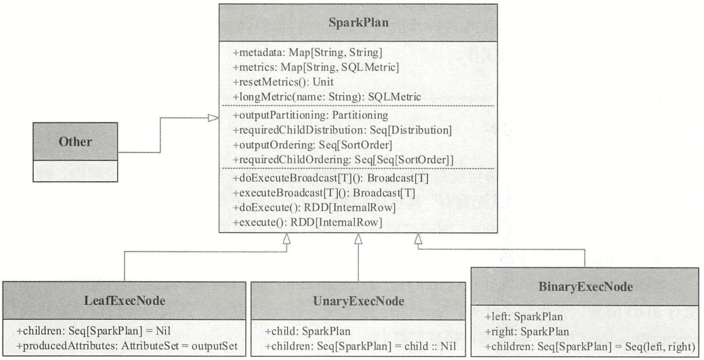

SparkPlan 仍然是抽象类，其具体实现可以大致将其分为 4 类：**LeafExecNode、 UnaryExecNode、BinaryExecNode 和其他不属于这三种子节点的类型**。如下表所示，表中加粗字体表示例子中涉及的 Node 类型。

| **LeafExecNode**   | ShowPartitionsExec、StreamingRelationExec、SkewJoinChildWrapper、LocalTableScanExec、DataSourceScanExec（FileSourceScanLike（**FileSourceScanExec**）、RowDataSourceScanExec）、ReusedExchangeExec、AdaptiveSparkPlanExec、PlanLater、QueryStageExec（BroadcastQueryStageExec、ShuffleQueryStageExec）、RangeExec、CommandResultExec、ShowCreateTableExec、HiveTableScanExec、ShowFunctionsExec、ShowTablesExec、DataSourceV2ScanExecBase（BatchScanExec、ContinuousScanExec、MicroBatchScanExec）、ExternalRDDScanExec、ShowNamespacesExec、ReusedSubqueryExec、InMemoryTableScanExec、RDDScanExec、ExecutedCommandExec |
| :----------------- | ------------------------------------------------------------ |
| **UnaryExecNode**  | InputAdapter、SampleExec、SessionWindowStateStoreRestoreExec、PartitioningPreservingUnaryExecNode（ProjectExec、BaseAggregateExec（AggregateCodegenSupport（HashAggregateExec、SortAggregateExec）、ObjectHashAggregateExec、MergingSessionsExec））、MapInBatchExec（MapInPandasExec、PythonMapInArrowExec）、ObjectConsumerExec（AppendColumnsWithObjectExec、MapPartitionsExec、MapElementsExec、SerializeFromObjectExec）、EvalPythonExec（ArrowEvalPythonExec、BatchEvalPythonExec）、MapGroupsExec、CoalesceExec、DataWritingCommandExec、DeserializeToObjectExec、SubqueryExec、FlatMapGroupsInPandasExec、**FilterExec**、SubqueryBroadcastExec、ColumnarToRowTransition（ColumnarToRowExec）、RowToColumnarTransition（RowToColumnarExec）、AQEShuffleReadExec、SortExec、EventTimeWatermarkExec、WriteToContinuousDataSourceExec、AttachDistributedSequenceExec、BaseScriptTransformationExec（HiveScriptTransformationExec、SparkScriptTransformationExec）、GenerateExec、StateStoreRestoreExec、DebugExec、LimitExec（CollectTailExec、CollectLimitExec、BaseLimitExec（LocalLimitExec、GlobalLimitExec）、StreamingLocalLimitExec）、AppendColumnsExec、StateStoreSaveExec、StreamingGlobalLimitExec、SessionWindowStateStoreSaveExec、Exchange（ShuffleExchangeLike（ShuffleExchangeExec）、BroadcastExchangeLike（BroadcastExchangeExec））、**ProjectExec**、BaseAggregateExec（AggregateCodegenSupport（HashAggregateExec、SortAggregateExec）、ObjectHashAggregateExec、MergingSessionsExec）、SubqueryAdaptiveBroadcastExec、CollectMetricsExec、StreamingDeduplicateExec、OrderPreservingUnaryExecNode（ProjectExec、TakeOrderedAndProjectExec、SortAggregateExec）、FlatMapGroupsInRExec、V2TableWriteExec（WriteToDataSourceV2Exec、TableWriteExecHelper（AtomicCreateTableAsSelectExec、ReplaceTableAsSelectExec、AtomicReplaceTableAsSelectExec、CreateTableAsSelectExec）、V2ExistingTableWriteExec（OverwritePartitionsDynamicExec、OverwriteByExpressionExec、WriteDeltaExec、AppendDataExec、ReplaceDataExec））、AggregateInPandasExec、UpdatingSessionsExec、FlatMapGroupsInRWithArrowExec、WholeStageCodegenExec、MapPartitionsInRWithArrowExec、WindowExecBase（WindowInPandasExec、WindowExec）、FlatMapGroupsInPandasWithStateExec、WriteFilesExec、ExpandExec |
| **BinaryExecNode** | CoGroupExec、BaseJoinExec（CartesianProductExec、JoinCodegenSupport（HashJoin（ShuffledHashJoinExec、BroadcastHashJoinExec）、ShuffledJoin（SortMergeJoinExec、ShuffledHashJoinExec）、BroadcastNestedLoopJoinExec））、StreamingSymmetricHashJoinExec、FlatMapCoGroupsInPandasExec、FlatMapGroupsWithStateExec |
| **其他**           | WatermarkSupport、CodegenSupport、FlatMapCoGroupsInPandasExec、UnionExec、SupportsV1Write、StatefulOperator、ObjectProducerExec、BaseSubqueryExec、FlatMapGroupsInPandasExec、V2CommandExec |

 

 

## 4.2 SparkPlan 生成

仍以 `` SELECT `name` FROM `student` WHERE `age` > 18 `` 为例。在第 1 节“提交流程”中已经分析，QueryExecution 将调用 `QueryExecution.prepareForExecution(preparations, sparkPlan.clone())` 生成 SparkPlan。

```scala
QueryExecution
  // QueryExecution内部属性，构建一系列规则，用于生成Prepared SparkPlan
  // 这些规则将确保子查询被计划、数据分区和排序的正确、插入整个阶段的代码生成，并尝试通过重用交换和子查询来减少工作量
  preparations = { QueryExecution.preparations(...) }

  // sparkPlan属性lazy关键字修饰，在第一次访问时初始化
  sparkPlan.clone()
    QueryExecution.createSparkPlan(sparkSession, planner, optimizedPlan.clone())
      // 【1】SparkPlanner将各种物理计划策略（Strategy）作用于LogicalPlan，生成Iterator[PhysicalPlan]
      // 【2】选取最佳的SparkPlan，当前版本实现较为简单，在候选列表中直接用next()方法获取第一个
      planner.plan(ReturnAnswer(plan)).next()
        // 继承关系：SparkPlanner -> SparkStrategies -> QueryPlanner
        self: SparkPlanner => 
        super.plan(plan)
          // 收集物理计划候选列表，注意SparkPlanner重写了物理计划策略列表strategies
          val candidates = strategies.iterator.flatMap(_(plan))
            // 匹配FileSourceStrategy物理计划策略，调用其apply()方法
            case ScanOperation(projects, stayUpFilters, filters, l @ LogicalRelation(...)) =>
            val scan = FileSourceScanExec(...)
            val withFilter = ... { execution.FilterExec(cond, plan) }
            val withProjections = ... { execution.ProjectExec(projects, withFilter) }
          // 候选项可能包含标记为[[planLater]]的占位符，因此尝试用它们的子计划替换它们
          val plans = candidates.flatMap { candidate => ... }
            // 保留候选项，因为它不包含占位符
            if (placeholders.isEmpty) { Iterator(candidate) }
            // 递归调用plan()方法，替换为子节点的物理计划
            else { val childPlans = this.plan(logicalPlan) ... }
          // 修剪不良计划以防止组合爆炸，当前版本未实现
          val pruned = prunePlans(plans)
  // 【3】提交前进行准备工作，进行一些分区排序方面的处理，确保SparkPlan各节点能够正确执行
  QueryExecution.prepareForExecution(preparations, sparkPlan.clone())
    val preparedPlan = preparations.foldLeft(plan) { ... }
```

**在 Spark 3.4.2 中，SparkPlanner 默认定义了 14 个物理计划策略，这些策略都继承自抽象类 Strategy（Strategy 是 SparkStrategy 类的别名，直接继承自 GenericStrategy），并在 apply() 方法中制定处理逻辑**。如下表所示，表中加粗字体表示例子中涉及的策略。

| **物理计划策略**                    | **说明**                                                     |
| :---------------------------------- | :----------------------------------------------------------- |
| experimentalMethods.extraStrategies | 允许在运行时注入额外的策略，此API为实验性的，不保证在不同版本之间保持稳定 |
| extraPlanningStrategies             | 重写此方法以添加额外的策略                                   |
| LogicalQueryStageStrategy           | 针对包含[[LogicalQueryStage]]节点的策略                      |
| PythonEvals                         | 将EvalPython逻辑运算符转换为物理运算符                       |
| DataSourceV2Strategy                | V2版本数据源扫描策略                                         |
| **FileSourceStrategy**              | 数据文件扫描策略                                             |
| DataSourceStrategy                  | 数据源扫描策略                                               |
| SpecialLimits                       | 特殊Limit操作策略                                            |
| Aggregation                         | 聚合算子相关策略                                             |
| Window                              | Window操作相关策略                                           |
| JoinSelection                       | Join操作相关策略                                             |
| InMemoryScans                       | 内存数据表扫描策略                                           |
| SparkScripts                        | 针对包含[[ScriptTransformation]]节点的策略                   |
| BasicOperators                      | 基本算子相关策略，涉及范围最广，通常一对一进行映射即可，如Sort逻辑节点映射为SortExec物理计划 |

在实现上，**各种 Strategy 会匹配传入的 LogicalPlan 节点，根据节点或节点组合的不同情形进行一对一或多对一的映射**。一对一的映射方式比较直观，以 BasicOperators 为例，该策略实现了各种基本操作的转换，其中列出了大量的映射关系，包括 Sort 对应 SortExec、Union 对应 UnionExec 等。多对一的情况涉及对多个 LogicalPlan 节点进行组合转换，这里称为**逻辑算子树的模式匹配**。例如，PhysicalOperation 是一个匹配任意数量的投影（Project）或过滤（Filter）操作的模式，即使它们是非确定性的，只要它们满足 CollapseProject 和 CombineFilters 的要求，所有的过滤算子都会被收集起来，且它们的条件会被拆分并与顶层投影算子一起返回。

例子中对应物理计划的生成如图所示。Project 节点加上 Filter 节点对应 ScanOperation 模式，该模式是 PhysicalOperation 模式的一种变体，可以匹配一系列相邻的 Projects/Filters 以应用列剪裁；加上 LogicalRelation 节点，正好匹配到 FileSourceStrategy 策略。因此，整个转换逻辑都在 FileSourceStrategy 中完成，最终的物理计划包括 ProjectExec、FilterExec 和 FileSourceScanExec 共 3 个节点。实际上，在 SparkPlanner 中最为复杂的策略是 Aggregation 和 JoinSelection，需要处理各种情况，上述案例中没有涉及这些操作，考虑到其复杂性，这两种策略后续介绍。

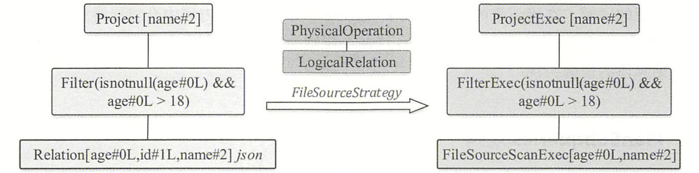

得到 SparkPlan 之后，还需要完成若干准备工作，对树型结构的物理计划进行全局的整合处理或优化，其处理过程仍然基于若干规则。**在 Spark 3.4.2 中，QueryExecution 默认定义了 12 个规则，这些规则都继承自抽象类 Rule，并复写 apply() 方法来制定处理逻辑**。如下表所示，表中加粗字体表示例子中涉及的规则。

| **执行准备规则**                           | **说明**                                                     |
| :----------------------------------------- | :----------------------------------------------------------- |
| **InsertAdaptiveSparkPlan**                | 使用[[AdaptiveSparkPlanExec]]将查询计划包装起来，在执行过程中根据运行时数据统计重新优化计划 |
| CoalesceBucketsInJoin                      | 满足条件时，合并SortMergeJoin和ShuffledHashJoin的一侧        |
| PlanDynamicPruningFilters                  | 重写动态剪枝谓词，以便重用广播的结果                         |
| PlanSubqueries                             | 处理特殊子查询的物理计划                                     |
| RemoveRedundantProjects                    | 满足条件时，删除冗余的ProjectExec节点                        |
| EnsureRequirements                         | 通过在必要的位置插入[[ShuffleExchangeExec]]操作符，确保执行计划分区与排序的正确性 |
| ReplaceHashWithSortAgg                     | 满足条件时，用排序聚合替换基于哈希的聚合                     |
| RemoveRedundantSorts                       | 删除冗余的SortExec节点，当其子节点满足其排序顺序和所需的子节点分布时，排序节点是冗余的 |
| DisableUnnecessaryBucketedScan             | 基于实际的物理查询计划，禁用不必要的分桶表扫描               |
| **ApplyColumnarRulesAndInsertTransitions** | 应用任何用户定义的[[ColumnarRule]]，并找到插入到列式格式数据转换的正确位置 |
| **CollapseCodegenStages**                  | 代码生成相关                                                 |
| ReuseExchangeAndSubquery                   | Exchange节点及子查询重用                                     |


# 5. 参考

1. 《Spark SQL 内核剖析》

2. [Idea 中使用 Antlr4](https://blog.csdn.net/waiting971118/article/details/124307642)

3. [Spark Catalog 深入理解与实战](https://zhuanlan.zhihu.com/p/554232822)

4. [Iceberg 官网](https://iceberg.apache.org/docs/latest/spark-configuration/#catalogs)

   