说明：代码部分以 spark 3.4.2 为例讲解，辅以 spark 3.1.3。

# 1. Spark SQL Aggregation

## 1.1 文法定义

在 Catalyst 的 SqlBaseParser.g4 文法文件中，聚合语句的文法定义如下。**在常见的聚合查询中，通常包括分组语句（group by）和聚合函数 (aggregate function)**。聚合函数出现在 select 语句中的情形较多，定义在 functionCall 标签的 primaryExpression 表达式文法中，functionName 对应函数名，括号内部是该函数的参数列表。分组语句 group by 后面可以是一个或多个分组表达式（groupingExpressions)，除简单的分组操作外，聚合查询还支特 OLAP 场景下的多维分析，包括 ROLLUP、CUBE 和 GROUPING SETS 三种操作。

```
primaryExpression
    : ...
    | functionName LEFT_PAREN (setQuantifier? argument+=expression (COMMA argument+=expression)*)? RIGHT_PAREN
       (FILTER LEFT_PAREN WHERE where=booleanExpression RIGHT_PAREN)?
       (nullsOption=(IGNORE | RESPECT) NULLS)? ( OVER windowSpec)?                             #functionCall
       
aggregationClause
    : GROUP BY groupingExpressionsWithGroupingAnalytics+=groupByClause
        (COMMA groupingExpressionsWithGroupingAnalytics+=groupByClause)*
    | GROUP BY groupingExpressions+=expression (COMMA groupingExpressions+=expression)* (
      WITH kind=ROLLUP
    | WITH kind=CUBE
    | kind=GROUPING SETS LEFT_PAREN groupingSet (COMMA groupingSet)* RIGHT_PAREN)?
    ;       
```

下面以 `` SELECT `id`, COUNT(`name`) FROM `student` GROUP BY `id` `` 为例进行说明。经过 ANTLR4 编译器的处理，查询语句生成下图所示的抽象语法树。相对非聚合查询，该语法树除 id 列外，还有对 name 的 count 操作所产生的新列，因此 NamedExpressionSeqContext 节点包含两个子节点。最重要的是 FunctionCallContext 和 AggregationClauseContext 节点，其中 AggregationClauseContext 的子节点 GroupByClauseContext 对应 group by 语句后面的 id 列；而用来表示聚合函数的 FunctionCallContext 节点比较好理解，其子节点 FunctionNameContext 代表函数名，ExpressionContext 表示函数的参数表达式，对应 SQL 语句中的 name 列。

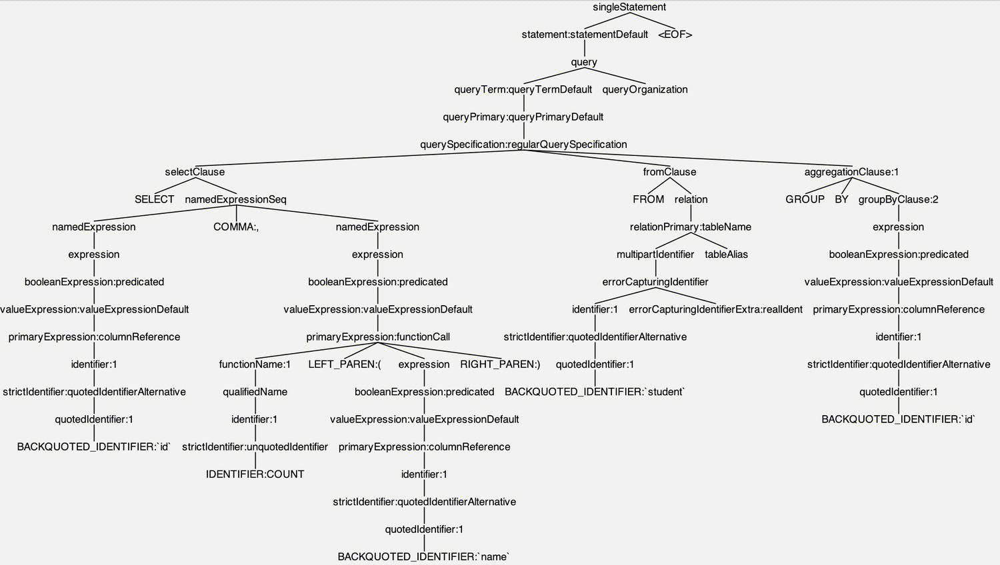


## 1.2 逻辑计划

1、在《Spark SQL 入门》介绍过，AstBuilder 负责生成 Unresolved LogicalPlan。区别是 AstBuilder 执行的不是 createProject 分支方法，而是 withAggregationClause 方法，这将在 UnresolveRelation 节点上生成 Aggregate 逻辑算子树节点，最终生成的 Unresolved LogicalPlan 如下图所示。

2、从 Unresolved LogicalPlan 到 Analyzed LogicalPlan 经过了 4 条规则的处理。对于聚合查询来说，比较重要的是 **ResolveFunctions 规则**，用来分析聚合函数。对于 UnresolvedFunction 表达式，Analyzer 会根据函数名和函数参数去 SessionCatalog 中查找，而 SessionCatalog 会根据 FunctionRegistry 中已经注册的函数信息得到对应的聚合函数，最终生成的 Analyzed LogicalPlan 如下图所示。

```scala
// 将[[UnresolvedFunctionName]]、[[UnresolvedTableValuedFunction]]替换为具体的[[LogicalPlan]]
// 将[[UnresolvedFunction]]、[[UnresolvedGenerator]]替换为具体的[[Expression]]
ResolveFunctions
  apply(plan: LogicalPlan)
    case u @ UnresolvedFunction(nameParts, arguments, _, _, _) => 
      resolveBuiltinOrTempFunction(nameParts, arguments, Some(u))
        // 如果存在这样的函数，通过名称查找内置或临时标量函数，并将其解析为Expression
        v1SessionCatalog.resolveBuiltinOrTempFunction(name.head, arguments)
          resolveBuiltinOrTempFunctionInternal(name, arguments, FunctionRegistry.builtin.functionExists, functionRegistry)
            // 检查是否存在具有给定名称的函数
            registry.functionExists(funcIdent)
              lookupTempFuncWithViewContext(name, isBuiltin, ident => Option(registry.lookupFunction(ident, arguments)))
                // 调用上面传递的函数形参
                lookupFunc(funcIdent)
                  registry.lookupFunction(ident, arguments)
                    // functionBuilders类型为mutable.HashMap，继承关系：SimpleFunctionRegistryBase -> FunctionRegistryBase
                    // 在Spark SQL启动时，会调用internalRegisterFunction方法执行函数注册，往functionBuilders中添加元素
                    functionBuilders.get(normalizeFuncName(name)).map(_._2)
```

3、从 Analyzed LogicalPlan 到 Optimized LogicalPlan 分别经过了**别名消除（EliminateSubqueryAliases）与列剪裁（ColumnPruning）规则**的处理，最终生成的 Optimized LogicalPlan 如下图所示。

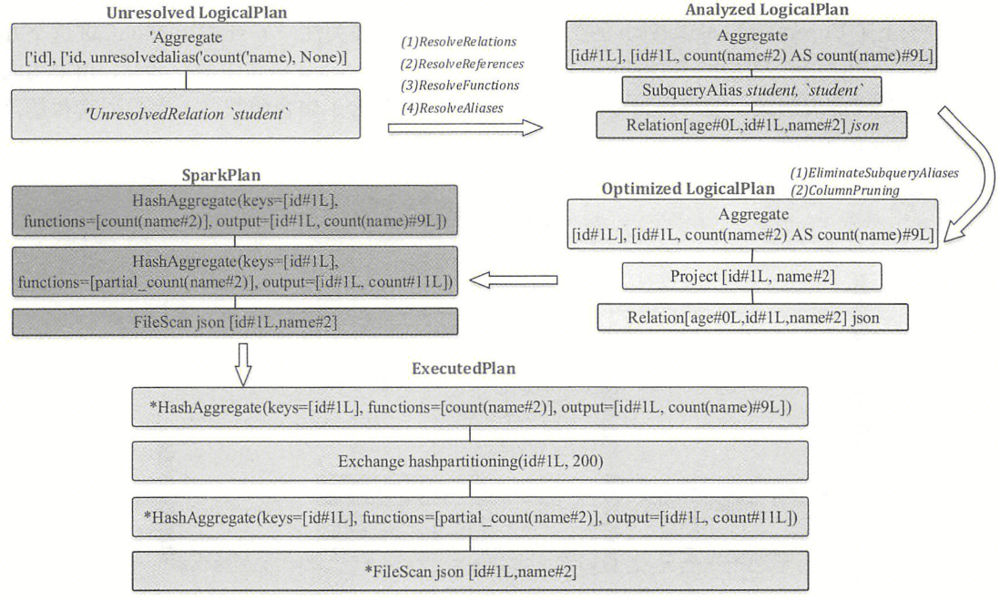


## 1.3 物理计划

1、从 Optimized LogcialPlan 到物理执行计划 SparkPlan，主要经过了 **FileSourceStrategy 和 Aggregation 两个策略**的处理。FileSourceStrategy 策略在《Spark SQL 入门》中介绍过，其中用到了 PhysicalOperation 匹配模式来合并 Relation 上方的 Project 与 Filter 算子。而 Aggregation 策略基于 PhysicalAggregation 匹配模式，该模式用来匹配逻辑算子树中的 Aggregate 节点并提取该节点中的相关信息，它在提取信息时会进行去重、命名、分离的转换。得到聚合信息之后，Aggregation 策略会根据这些信息生成相应的物理计划。**如果聚合表达式都不包含 DISTINCT 函数，调用 planAggregateWithoutDistinct 方法，否则聚会表达式中存在 DISTINCT 函数，调用 planAggregateWithOneDistinct 方法，无论哪种方法，它们都会先创建一个用于部分聚合的聚合操作符，然后创建一个用于最终聚合的聚合操作符**。例子中 count 函数不包含 DISTINCT 关键字，因此调用的是 planAggregateWithoutDistinct 方法，生成了上图中的两个 HashAggregate（聚合执行方式中的一种，后面介绍）物理节点，**分别进行局部聚合与最终聚合**。最后，在生成的 SparkPlan 中添加 Exchange 节点，统一排序与分区信息，生成物理执行计划（ExecutedPlan）。

```scala
Aggregation
  apply(plan: LogicalPlan)
    // 在规划聚合的物理执行时使用的提取器。与逻辑聚合相比，执行以下转换：
    // 1.命名：为无名称的分组表达式命名（套上Alias表达式），以便在聚合的各个阶段中引用
    // 2.去重：对出现多次的聚合进行去重
    // 3.分离：将聚合本身的计算与最终结果分离。例如，在count + 1中的count将被拆分为一个[[AggregateExpression]]和一个最终计算，计算count.resultAttribute + 1
    PhysicalAggregation(groupingExpressions, aggExpressions, resultExpressions, child)
      // 去重：将每个表达式添加到此数据结构中，并与现有的等效表达式进行分组。如果已经存在匹配的表达式，则返回true
      equivalentAggregateExpressions.addExpr(a)
      // 命名：如果表达式不是NamedExpressions，添加一个别名。因此当生成运算符的结果时，聚合运算符可以直接获取表示分组表达式的属性序列
      case other => val withAlias = Alias(other, other.toString)()
      // 分离：最终聚合缓冲区的属性将是finalAggregationAttributes，因此将每个聚合表达式替换为集合中对应的属性
      case ae: AggregateExpression => 
        equivalentAggregateExpressions.getExprState(ae).map(_.expr).getOrElse(ae).asInstanceOf[AggregateExpression].resultAttribute

    // 即上面介绍的PhysicalAggregation匹配模式
    case PhysicalAggregation(...)
      // 聚合表达式按照是否指定了DISTINCT关键字进行分组
      val (functionsWithDistinct, functionsWithoutDistinct) = aggregateExpressions.partition(_.isDistinct)
      // 如果聚合表达式都不包含DISTINCT函数，调用planAggregateWithoutDistinct
      if (functionsWithDistinct.isEmpty)
        AggUtils.planAggregateWithoutDistinct(...)
          // 1.创建一个用于部分（Partial）聚合的聚合操作符
          val partialAggregateExpressions = aggregateExpressions.map(_.copy(mode = Partial))
          val partialAggregate = createAggregate(...)
          // 2.创建一个用于最终（Final）聚合的聚合操作符
          val finalAggregateExpressions = aggregateExpressions.map(_.copy(mode = Final))
          val finalAggregate = createAggregate(...)
      // 否则聚会表达式中存在DISTINCT函数，调用planAggregateWithOneDistinct
      else
        AggUtils.planAggregateWithOneDistinct(...)
          // 1.创建一个用于部分（Partial）聚合的聚合操作符
          val partialAggregate: SparkPlan = {
            val aggregateExpressions = functionsWithoutDistinct.map(_.copy(mode = Partial))
            createAggregate(...)
          }
          // 2.创建一个用于部分合并（PartialMerge）聚合的聚合操作符
          val partialMergeAggregate: SparkPlan = {
            val aggregateExpressions = functionsWithoutDistinct.map(_.copy(mode = PartialMerge))
            createAggregate(...)
          }
          // 3.创建一个用于部分合并（PartialMerge）聚合的聚合操作符（针对distinct）
          val partialDistinctAggregate: SparkPlan = {
            val mergeAggregateExpressions = functionsWithoutDistinct.map(_.copy(mode = PartialMerge))
            createAggregate(...)
          }
          // 4.创建一个用于最终（Final）聚合的聚合操作符
          val finalAndCompleteAggregate: SparkPlan = {
            val finalAggregateExpressions = functionsWithoutDistinct.map(_.copy(mode = Final))
            createAggregate(...)
          }
```

 

## 1.4 聚合函数

### 1.4.1 聚合缓冲区与聚合模式

**聚合函数（AggregateFunction）**是聚合查询中非常重要的元素。在实现上，聚合函数是表达式（Expression）中的一种，和 Catalyst 中定义的**聚合表达式（AggregationExpression）**紧密关联。无论是在逻辑算子树还是物理算子树中，聚合函数都是以聚合表达式的形式进行封装的，同时聚合函数中也定义了直接生成聚合表达式的方法。
**聚合查询在计算聚合值时，通常需要保存中间计算结果**，例如 max 函数需要保存当前最大值，avg 求平均值函数需要同时保存 count 和 sum 的值。这些中间结果会临时保存在聚合函数缓冲区，聚合函数缓冲区针对的是处于同一个分组内（例子中属于同一个 id）的数据。注意，**查询中可能包含多个聚合函数，因此聚合函数缓冲区是多个聚合函数所共享的**。在 AggregateFunction 定义中，与聚合缓冲区相关的基本信息包括：聚合缓冲区的 Schema 信息 aggBufferSchema；聚合缓冲区的数据列信息 aggBufferAttributes。显然，聚合函数缓冲区中的值会随着数据处理而不断更新，因此该缓冲区是可变的。此外，当聚合函数处理新的数据行时，需要知道该数据行的列构成信息，inputAggBufferAttributes 函数用来获取聚合缓冲区中字段的属性，这些属性是通过克隆 aggBufferAttributes 自动创建的。

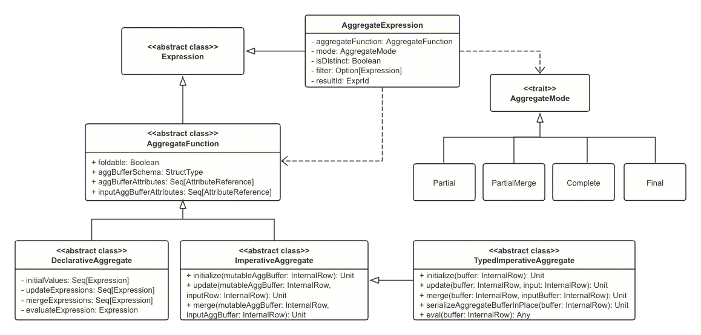

**聚合函数有 4 种聚合模式（AggregateMode），分别是：Partial 模式、ParitialMerge 模式、Final 模式和 Complete 模式**。

1、Final 模式一般和 Partial 模式组合在一起使用。Partial 模式可以看作是局部数据的聚合，在具体实现中，Partial 模式的聚合函数在执行时会根据读入的原始数据更新对应的聚合缓冲区，当处理完所有的输入数据后，返回的是聚合缓冲区中的中间数据。而 Final 模式所起到的作用是将聚合缓冲区的数据进行合并，然后返回最终的结果。

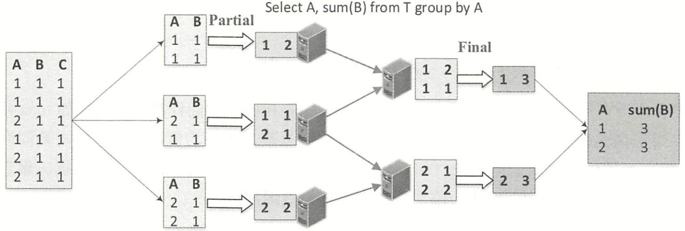

2、Complete 模式和上述的 Partial/Final 组合方式不一样，不进行局部聚合计算。一般来说，Complete 模式应用在不支持 Partial 模式的聚和函数中。

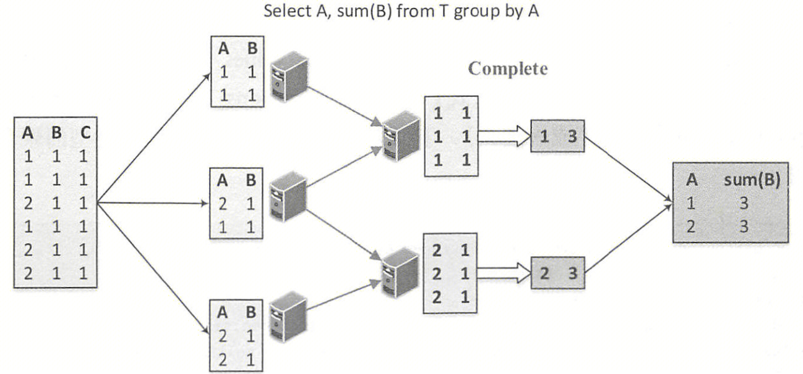

3、PartialMerge 模式的聚合函数主要是对聚合缓冲区进行合并，但此时仍然不是最终的结果。ParitialMerge 主要应用在 distinct 语句中，如图所示，聚合语句针对同一张表进行 sum 和 count(distinct) 查询。第 1 步按照（A，C）分组，对 sum 两数进行 Partial 模式聚合计算；第 2 步是 PartialMerge 模式，对上一步计算之后的聚合缓冲区进行合并，但此时仍然不是最终的结果；第 3 步分组的列发生变化，再一次进行 Partial 模式的 count 计算；第 4 步完成 Final 模式的最终计算。

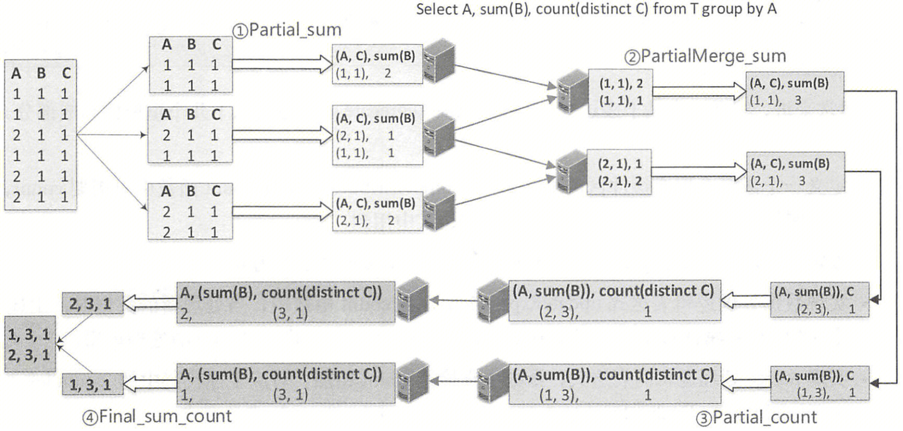


### 1.4.2 DeclarativeAggregate

**DeclarativeAggregate 继承自 AggregateFunction，它是一类直接由 Catalyst 中的表达式（Expressions）构建的聚合函数**，主要逻辑通过调用 4 个表达式完成，分别是：initialvalues（聚合缓冲区初始化表达式）、updateExpressions （聚合缓冲区更新表达式）、mergeExpressions（聚合缓冲区合并表达式）和 evaluateExpression（最终结果生成表达式）。下面以 Count 函数为例对这种类型的聚合函数的实现进行说明。

```scala
case class Count(children: Seq[Expression]) extends DeclarativeAggregate
  with QueryErrorsBase {

  override def nullable: Boolean = false
  final override val nodePatterns: Seq[TreePattern] = Seq(COUNT)
  override def dataType: DataType = LongType

  // 定义聚合属性，count函数只需要count，这些属性会在updateExpressions等各种表达式中用到
  protected lazy val count = AttributeReference("count", LongType, nullable = false)()
  override lazy val aggBufferAttributes = count :: Nil

  // 设定初始值，count函数的初始值为0
  override lazy val initialValues = Seq(
    /* count = */ Literal(0L)
  )

  // 实现merge处理逻辑的表达式，count函数直接把count相加
  override lazy val mergeExpressions = Seq(
    /* count = */ count.left + count.right
  )
  // 实现结果输出的表达式evaluateExpression，返回count值
  override lazy val evaluateExpression = count
  override def defaultResult: Option[Literal] = Option(Literal(0L))

  // 实现数据处理逻辑表达式updateExpressions，count函数处理新数据时，count+1L，注意其中对Null的处理逻辑
  override lazy val updateExpressions = {
    val nullableChildren = children.filter(_.nullable)
    if (nullableChildren.isEmpty) {
      Seq(
        /* count = */ count + 1L
      )
    } else {
      Seq(
        /* count = */ If(nullableChildren.map(IsNull).reduce(Or), count, count + 1L)
      )
    }
  }
}
```

 

### 1.4.3 ImperativeAggregate

**ImperativeAggregate 继承自 AggregateFunction**，不同于 DeclarativeAggregate 聚合函数基于 Catalyst 的实现方式，ImperativeAggregate 聚合函数需要显式地实现 initialize、update 和 merge 方法来操作聚合缓冲区中的数据。**一个显著的不同是，ImperativeAggregate 聚合函数所处理的聚合缓冲区本质上是基于行（InternalRow）的**。

**聚合缓冲区是共享的，可能对应多个聚合函数，因此可变聚合缓冲区（MutableAggBuffer）会通过偏移量进行定位**。例如，数据表有 3 列，分别是 key、x、y，查询语句中有两个求平均值的函数 avg(x) 和 avg(y)（假设这里用 ImperativeAggregate 方式来实现平均值函数）。这两个函数共享聚合缓冲区 [sum1, count1, sum2, count2]，如图所示，那么第一个 avg 函数的缓冲区偏移量为 0，第二个 avg 函数的缓冲区偏移量为 2，可以通过 mutableAggBufferOffset + fieldNumber 方式来访问具体的中间变量。

**与可变聚合缓冲区（MutableAggBuffer）类似，输入聚合缓冲区（InputAggBuffer）也通过偏移量进行定位**。InputAggBuffer 是不可变的，当合并 InputAggBuffer 和 MutableAggBuffer 时，将新的缓冲值存储到 MutableAggBuffer 中。除不可变外，**InputAggBuffer 相对 MutableAggBuffer 还可能包含额外的字段**，例如 group by 语句中的列，对应的缓冲区即 [key, sum1, count1, sum2, count2]，如图所示，那么位置 0 用于 key 值，第一个 avg 函数的缓冲区偏移量为 1，第二个 avg 函数的缓冲区偏移量为 3，因此 inputAggBufferOffset 和 mutableAggBufferOffset 通常是不同的，可以通过 inputAggBufferOffset + fieldNumber 方式来访问具体的中间变量。

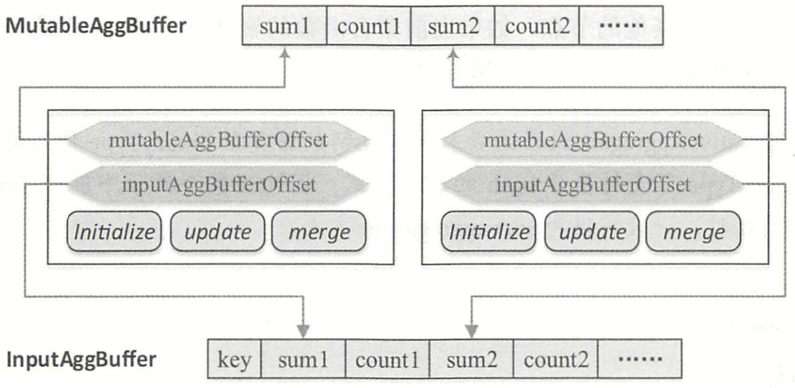

```scala
abstract class ImperativeAggregate extends AggregateFunction with CodegenFallback {
  // 该函数在底层共享的可变聚合缓冲区中的第一个缓冲值的偏移量
  // 例如，有两个聚合函数avg(x)和avg(y)，它们共享同一个聚合缓冲区。在这个共享缓冲区中，avg(x)的第一个缓冲值的位置将为0，而avg(y)的第一个缓冲值的位置将为2
  protected val mutableAggBufferOffset: Int
  // 返回一个具有更新的mutableAggBufferOffset的ImperativeAggregate副本，这个新副本的属性可能与原始属性具有不同的ID
  def withNewMutableAggBufferOffset(newMutableAggBufferOffset: Int): ImperativeAggregate
  
  // 该函数在底层共享的输入聚合缓冲区中的起始缓冲值的偏移量。在update()函数中，当合并两个聚合缓冲区时，会使用输入聚合缓冲区，并且它是不可变的（将输入聚合缓冲区和可变聚合缓冲区合并，然后将新的缓冲值存储到可变聚合缓冲区中）。输入聚合缓冲区可能包含额外的字段，例如分组键，位于其起始位置，因此mutableAggBufferOffset和inputAggBufferOffset通常是不同的
  // 例如，假设我们有一个分组表达式key和两个聚合函数avg(x)和avg(y)。在共享的输入聚合缓冲区中，avg(x)的第一个缓冲值的位置将为1，而avg(y)的第一个缓冲值的位置将为3（位置0用于key的值）
  protected val inputAggBufferOffset: Int
  // 返回一个具有更新的inputAggBufferOffset的ImperativeAggregate的副本，这个新副本的属性可能与原始属性具有不同的ID
  def withNewInputAggBufferOffset(newInputAggBufferOffset: Int): ImperativeAggregate
  
  // 初始化位于mutableAggBuffer中的可变聚合缓冲区，使用fieldNumber + mutableAggBufferOffset来访问mutableAggBuffer的字段
  def initialize(mutableAggBuffer: InternalRow): Unit
  // 根据给定的inputRow更新其位于mutableAggBuffer中的聚合缓冲区，使用fieldNumber + mutableAggBufferOffset来访问mutableAggBuffer的字段
  def update(mutableAggBuffer: InternalRow, inputRow: InternalRow): Unit
  // 将inputAggBuffer中的新中间结果与mutableAggBuffer中的现有中间结果合并
  // 使用fieldNumber + mutableAggBufferOffset来访问mutableAggBuffer的字段，使用fieldNumber + inputAggBufferOffset来访问inputAggBuffer的字段
  def merge(mutableAggBuffer: InternalRow, inputAggBuffer: InternalRow): Unit
}
```


### 1.4.4 TypedImperativeAggregate

**TypedImperativeAggregate[T] 继承自 ImperativeAggregate，它允许使用用户自定义的 Java 对象 T 作为内部的聚合缓冲区，因此这种类型的聚合函数是最灵活的**。不过需要注意，TypedImperativeAggregate 聚合缓冲区容易带来与内存相关的问题，其工作流程一般分为三步：初始化聚合缓冲区对象、处理输入行、输出结果。

```scala
/**
* aggregation buffer for normal aggregation function `avg`            aggregate buffer for `sum`
*            |                                                                  |
*            v                                                                  v
*          +--------------+---------------+-----------------------------------+-------------+
*          |  sum1 (Long) | count1 (Long) | generic user-defined java objects | sum2 (Long) |
*          +--------------+---------------+-----------------------------------+-------------+
*                                           ^
*                                           |
*            aggregation buffer object for `TypedImperativeAggregate` aggregation function
*/
abstract class TypedImperativeAggregate[T] extends ImperativeAggregate {
  // 1.创建空的聚合缓冲区，聚合执行框架（后面介绍）会调用由子类实现的createAggregationBuffer方法获得初始缓冲区对象，并将其设置在全局的缓冲区中
  final override def initialize(buffer: InternalRow): Unit = {
    buffer(mutableAggBufferOffset) = createAggregationBuffer()
  }
  
  // 2.如果聚合函数的聚合模式是Partial或Complete，则聚合执行框架会调用由子类实现的update方法处理输入行，从全局缓冲区获得缓冲对象，然后对其数据进行更新
  final override def update(buffer: InternalRow, input: InternalRow): Unit = {
    buffer(mutableAggBufferOffset) = update(getBufferObject(buffer), input)
  }
  // 2.如果聚合函数的聚合模式是PartialMerge或Final，则聚合执行框架会调用merge方法处理从其他节点传输的序列化缓冲区对象，
  // 将二进制数据反序列化成对应的Java对象，然后调用由子类实现的merge方法来合并这两个缓冲区对象
  final override def merge(buffer: InternalRow, inputBuffer: InternalRow): Unit = {
    val bufferObject = getBufferObject(buffer)
    // inputBuffer存储由部分聚合生成的序列化聚合缓冲区对象
    val inputObject = deserialize(inputBuffer.getBinary(inputAggBufferOffset))
    buffer(mutableAggBufferOffset) = merge(bufferObject, inputObject)
  }
  
  // 3.如果聚合函数的聚合模式是Partial或PartialMerge，则聚合执行框架会调用serializeAggregateBufferInPlace方法，
  // 将全局聚合缓冲区中的Java对象替换序列化后的二进制数据（调用由子类实现的serialize方法），并将它们Shufle到其他的节点。
  final def serializeAggregateBufferInPlace(buffer: InternalRow): Unit = {
    buffer(mutableAggBufferOffset) = serialize(getBufferObject(buffer))
  }
  // 3.如果聚合函数的聚合模式是Final或Complete，则聚合执行框架会调用eval方法，从全局缓冲行获取缓冲区对象，
  // 然后调用由子类实现的eval方法，来计算最终的结果并将结果返回
  final override def eval(buffer: InternalRow): Any = {
    eval(getBufferObject(buffer))
  }
}
```

 

## 1.5 聚合执行

### 1.5.1 聚合执行框架

聚合执行本质上是将 RDD 的每个 Partition 中的数据进行处理。如图所示，对于每个 Partition 中的输入数据，通过 InputIterator 进行读取，经过聚合执行计算之后，得到相应的结果数据，通过 AggregationIterator 来访问。**聚合查询最终执行有三个物理算子：HashAggregateExec、ObjectHashAggregateExec（Spark 2.2.0 加入）、SortAggregateExec，这三个算子效率依次降低，根据聚合表达式的属性进行选择，并分别调用 AggregationIterator 的三个子类 TungstenAggregationIterator、ObjectAggregationIterator、SortBasedAggregationIterator 进行实现**。

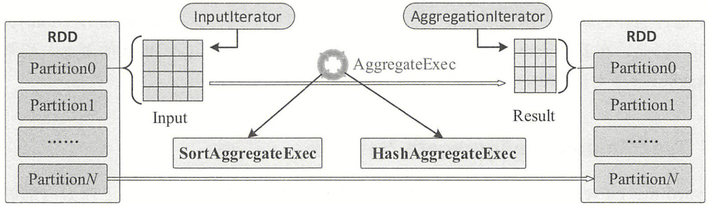

```scala
AggUtils
  // 从上面分析的createAggregate方法继续执行
  createAggregate
    // 聚合缓冲区的数据列信息aggBufferAttributes是否都属于以下类型：mutableFieldTypes（包括：NullType、BooleanType、ByteType、
    // ShortType、IntegerType、LongType、FloatType、DoubleType、DateType、TimestampType、TimestampNTZType）、
    // DecimalType、CalendarIntervalType、DayTimeIntervalType、YearMonthIntervalType
    val useHash = Aggregate.supportsHashAggregate(aggregateExpressions.flatMap(_.aggregateFunction.aggBufferAttributes))
      val aggregationBufferSchema = StructType.fromAttributes(aggregateBufferAttributes)
      isAggregateBufferMutable(aggregationBufferSchema)
        schema.forall(f => UnsafeRow.isMutable(f.dataType))
          if (dt instanceof UserDefinedType)
            return isMutable(((UserDefinedType) dt).sqlType())
          return mutableFieldTypes.contains(dt) || dt instanceof DecimalType ||
            dt instanceof CalendarIntervalType || dt instanceof DayTimeIntervalType ||
            dt instanceof YearMonthIntervalType;
    // 强制应用SortAggregate，参数spark.sql.test.forceApplySortAggregate硬编码，仅用于测试
    val forceSortAggregate = forceApplySortAggregate(child.conf)
    if (useHash && !forceSortAggregate)
      HashAggregateExec(...)
    else
      // 参数spark.sql.execution.useObjectHashAggregateExec，默认true
      val objectHashEnabled = child.conf.useObjectHashAggregation
      // 获取聚合表达式列表对应的聚合函数，判断聚合函数是否包含TypedImperativeAggregate类型
      val useObjectHash = Aggregate.supportsObjectHashAggregate(aggregateExpressions)
        aggregateExpressions.map(_.aggregateFunction).exists {
          case _: TypedImperativeAggregate[_] => true
          case _ => false
        }
      if (objectHashEnabled && useObjectHash && !forceSortAggregate)
        ObjectHashAggregateExec(...)
      else
        SortAggregateExec(...)
```

**聚合执行框架** **AggregationIterator** **主要包含三个部分，分别是：初始化聚合函数 initializeAggregateFunctions，以及根据聚合函数的聚合模式创建的两个函数，用于处理输入的 processRow 和用于生成结果 generateOutput**。

```scala
// 继承关系：SortBasedAggregationIterator、TungstenAggregationIterator、ObjectAggregationIterator -> AggregationIterator
AggregationIterator
  // 1.如果需要，通过绑定引用来初始化所有的AggregateFunctions，并设置inputBufferOffset和mutableBufferOffset
  initializeAggregateFunctions(...): Array[AggregateFunction]

  // 2.该方法后面介绍会被调用，参数分别表示当前的聚合缓冲区和输入数据行，核心操作是获取各聚合函数中的update或merge方法，
  // 对于Partial和Complete聚合模式，处理的是原始输入数据，因此采用的是update方法；对于Final和PartialMerge聚合模式，处理的是聚合缓冲区，因此采用的是merge方法
  processRow: (InternalRow, InternalRow) => Unit
    generateProcessRow(...)
      
  // 3.对于聚合模式为Partial或PartialMerge的聚合函数，因为只是中间结果，所以需要保存grouping语句与buffer中所有的属性；
  // 对于Final和Complete聚合模式，直接对应resultExpressions表达式。注意，如果不包含任何聚合函数且只有分组操作，则直接创建projection
  generateOutput: (UnsafeRow, InternalRow) => UnsafeRow
    generateResultProjection()
```

 

### 1.5.2 SortAggregateExec

**SortAggregateExec 在进行聚合之前，会根据 grouping key 进行分区并在分区内排序（效率低的原因），将具有相同 grouping key 的记录分布在同一个 partition 内且前后相邻。聚合时只需要顺序遍历整个分区内的数据，即可得到聚合结果**。在 SortAggregateExec 类的 requiredChildOrdering 方法中对输入数据的有序性做了约束，分组表达式列表（groupingExpressions）中的每个表达式都必须满足升序排列，**因此在 SortAggregateExec 节点之前通常都会添加一个 SortExec 节点**。SortBasedAggregationIterator 是 SortAggregateExec 实现的关键，由于数据已经预先排好序，因此按照分组进行聚合即可。

```scala
// 继承关系：SortAggregateExec -> AggregateCodegenSupport -> BaseAggregateExec、BlockingOperatorWithCodegen
SortAggregateExec
  // 重写父类SparkPlan的该方法，为输入数据的每个分区指定排序顺序
  requiredChildOrdering
    // groupingExpressions中的每个表达式都必须满足升序排列
    groupingExpressions.map(SortOrder(_, Ascending))
  
  // 物理算子从重写的doExecute方法开始执行
  doExecute()
    // 每个分区依次迭代处理
    child.execute().mapPartitionsWithIndexInternal { (partIndex, iter) => ... }
      // 继承关系：SortBasedAggregationIterator -> AggregationIterator -> Iterator[UnsafeRow]
      new SortBasedAggregationIterator(...)
        // 初始化基本信息
        initialize()
        // 复写scala.collection.Iterator父类的hasNext及next方法
        next()
          if (hasNext)
            // 处理当前分组中的行，当找到一个新的分组时，它将停止处理
            processCurrentSortedGroup()
              // currentGroupingKey和nextGroupingKey分别表示当前分组key和下一个分组key
              currentGroupingKey = nextGroupingKey
              // 将开始查找属于该分组的所有行，创建变量跟踪是否遇到了下一个分组
              var findNextPartition = false
              // firstRowInNextGroup是该组的第一行，首先调用父类AggregationIterator方法，同上
              processRow(sortBasedAggregationBuffer, firstRowInNextGroup)
              // 当看到下一个分组或迭代器中没有剩余的输入行时，循环停止
              while (!findNextPartition && inputIterator.hasNext)
                // 获取当前行及其分组key
                val currentRow = inputIterator.next()
                val groupingKey = groupingProjection(currentRow)
                // currentGroupingkey和groupingKey相同，意味着当前输入数据仍属于同一个分组内部
                if (currentGroupingKey == groupingKey)
                  processRow(sortBasedAggregationBuffer, currentRow)
                else
                  // 找到一个新的分组
                  findNextPartition = true
                  nextGroupingKey = groupingKey.copy()
                  firstRowInNextGroup = currentRow.copy()
              // 还没有看到新的分组，意味着输入迭代器中没有新的行，当前分组是迭代器的最后一个分组
              if (!findNextPartition)
                sortedInputHasNewGroup = false
```

 

### 1.5.3 HashAggregateExec

**HashAggregateExec 从逻辑上很好实现，只要构建一个 Map 类型的数据结构，以分组的属性作为 key，将数据保存到该 Map 中并进行聚合计算即可**。然而，实际上无法确定性地申请到足够的空间来容纳所有数据，底层还涉及复杂的内存管理，因此相对 SortAggregateExec 的实现反而更加复杂。类似 SortAggregateExec，HashAggregateExec 的实现关键在于 TungstenAggregationlterator 类，它首先使用基于哈希的聚合来处理输入行，即使用 UnsafeFixedWidthAggregationMap（一种特殊的 Map）来存储分组 Key 及其对应的聚合缓冲区，如果该 Map 无法从内存管理器中分配内存，则将内存数据溢写磁盘，并创建一个新的 Map。在处理完所有输入后，使用外部排序器将所有溢写的数据合并在一起，并进行基于排序的聚合，也就是说，**HashAggregateExec 可能因内存不足退化为 SortAggregateExec**。

```scala
// 继承关系：HashAggregateExec -> AggregateCodegenSupport -> BaseAggregateExec、BlockingOperatorWithCodegen
HashAggregateExec
  doExecute()
    // 每个分区依次迭代处理
    child.execute().mapPartitionsWithIndex { (partIndex, iter) => ... }
      // 继承关系：TungstenAggregationIterator -> AggregationIterator -> Iterator[UnsafeRow]
      new TungstenAggregationIterator(...)
        // 读取和处理输入行。在处理输入行时，首先使用基于哈希的聚合，将分组及其缓冲区放入hashMap中
        // 如果内存不足，它会使用多个hashMap，在每个hashMap变满后进行溢写，然后使用排序将这些溢写合并，最后进行基于排序的聚合
        processInputs(...)
          // 如果没有分组表达式，可以反复重用相同的缓冲区。请注意，将来最好完全消除hashMap
          if (groupingExpressions.isEmpty)
            while (inputIter.hasNext)
              // 调用父类AggregationIterator方法，底层由聚合函数处理，同上
              processRow(buffer, newInput)
          else
            while (inputIter.hasNext)
              // 获取输入数据及其分组key
              val newInput = inputIter.next()
              val groupingKey = groupingProjection.apply(newInput)
              // 获取hashMap中对应的聚合缓冲区，hashMap类型为UnsafeFixedWidthAggregationMap，存储groupingKey与UnsafeRow的映射关系
              buffer = hashMap.getAggregationBufferFromUnsafeRow(groupingKey)
              if (buffer == null)
                // 如果获取不到对应的buffer，意味着hashMap内存空间己满，此时调用destructAndCreateExternalSorter方法将内存数据溢写到磁盘以释放内存
                val sorter = hashMap.destructAndCreateExternalSorter()
                if (externalSorter == null) externalSorter = sorter
                // 多次溢写磁盘的数据还会进行合并操作
                else externalSorter.merge(sorter)
                // 再次从hashMap获取聚合缓冲区，此时如果无法获取，则会抛出OOM错误
                buffer = hashMap.getAggregationBufferFromUnsafeRow(groupingKey)
                if (buffer == null)
                  throw new SparkOutOfMemoryError("No enough memory for aggregation")
              processRow(buffer, newInput)
            // 检查全局externalsorter对象，如果不为空，意味着聚合操作因内存不足没能执行成功，部分数据存储在磁盘上
            if (externalSorter != null)
              // 将hashMap中最后的数据溢写到磁盘，并与externalsorter中的数据合并
              val sorter = hashMap.destructAndCreateExternalSorter()
              externalSorter.merge(sorter)
              // 调用free方法释放hashMap
              hashMap.free()
              // 切换到基于排序的聚合，其逻辑与SortAggregateExec的逻辑类似
              switchToSortBasedAggregation()
```


### 1.5.4 ObjectHashAggregateExec

**ObjectHashAggregateExec 是一个支持 TypedImperativeAggregate 聚合函数的基于哈希的聚合算子，它可以使用任意的 JVM 对象作为聚合状态，因此支持用户自定义的聚合函数（UDAFs），而 HashAggregateExec 只支持固定长度的可变原生数据类型**。与 HashAggregateExec 类似，当内部 HashMap 的大小超过阈值（参数 spark.sql.objectHashAggregate.sortBased.fallbackThreshold，默认 128）时，会回退到基于排序的聚合。两者的区别在于：

- 它使用安全行（safe rows）作为聚合缓冲区，因为它必须支持 JVM 对象作为聚合状态
- 它跟踪 HashMap 的条目数而不是字节大小，以决定何时应该回退，这是因为以轻量级方式准确估计任意 JVM 对象的大小很困难
- 每当回退到基于排序的聚合时，它将所有剩余的输入行都输入到外部排序器中，而不是像 HashAggregateExec 那样构建更多的哈希映射，这是因为在那里有太多的 JVM 对象聚合状态会对垃圾回收造成危险
- 目前不支持代码生成（CodeGen），关于代码生成参考《Spark 向量化》

```scala
// 继承关系：ObjectHashAggregateExec -> BaseAggregateExec
ObjectHashAggregateExec
  doExecute()
    // 每个分区依次迭代处理
    child.execute().mapPartitionsWithIndexInternal { (partIndex, iter) => ... }
      // 继承关系：ObjectAggregationIterator -> AggregationIterator -> Iterator[UnsafeRow]
      new ObjectAggregationIterator(...)
        // 读取和处理输入行。在处理输入行时，首先使用基于哈希的聚合，将分组及其缓冲区放入hashMap中
        // 如果内存不足，它会使用多个hashMap，在每个hashMap变满后进行溢写，然后使用排序将这些溢写合并，最后进行基于排序的聚合
        processInputs(...)
          // 存储聚合缓冲区，与HashAggregateExec使用UnsafeFixedWidthAggregationMap不同，使用ObjectAggregationMap，支持将二进制Java对象存储在聚合缓冲区
          val hashMap = new ObjectAggregationMap()
          // 如果内存Map无法存储所有的聚合缓冲区，则回退到基于排序的聚合，使用排序的物理存储作为支持
          var sortBasedAggregationStore: SortBasedAggregator = null
          if (groupingExpressions.isEmpty)
            // 如果没有分组表达式，我们可以反复重用相同的缓冲区
            while (inputRows.hasNext)
              processRow(buffer, inputRows.next())
          else
            // sortBased表示是否已经回退到基于排序的聚合
            while (inputRows.hasNext && !sortBased)
              // 获取输入数据及其分组key
              val newInput = inputRows.next()
              val groupingKey = groupingProjection.apply(newInput)
              // 获取hashMap中对应的聚合缓冲区，hashMap类型为ObjectAggregationMap，存储groupingKey与InternalRow的映射关系
              val buffer: InternalRow = getAggregationBufferByKey(hashMap, groupingKey)
              // 调用父类AggregationIterator方法，底层由聚合函数处理，同上
              processRow(buffer, newInput)
              // 当hashMap变得过大，会进行排序的溢写操作（退化为SortAggregateExec），并清空hashMap
              // fallbackCountThreshold由参数spark.sql.objectHashAggregate.sortBased.fallbackThreshold决定，默认128
              if (hashMap.size >= fallbackCountThreshold && inputRows.hasNext)
                // 回退到基于排序的聚合
                sortBased = true
            if (sortBased)
              // 将所有剩余的输入行都输入到外部排序器中，而不是像HashAggregateExec那样构建更多的hashMap，因为那里有太多的JVM对象聚合状态会对垃圾回收造成危险
              val sortIteratorFromHashMap = hashMap.dumpToExternalSorter(...).sortedIterator()
              sortBasedAggregationStore = new SortBasedAggregator(...)
              while (inputRows.hasNext)
                sortBasedAggregationStore.addInput(groupingKey, unsafeInputRow)
```

 

# 2. Spark SQL Join

## 2.1 文法定义

在 Catalyst 的 SqlBaseParser.g4 文法文件中，与 Join 相关的文法定义如下。可以看到，Join 语句主要针对的是关系数据表，一般处于 FROM 子语句中。在 FROM 关键字表示的数据源中，至少包含一个或多个 relation，以及可能的lateralView。每个 relation 包含一个主要的数据表（relationPrimary）和零个或多个参与 Join 操作的数据表 （joinRelation）。在 joinRelation 中，除参与 Join 的数据表外，比较重要的关键宇是 Join 的类型（joinType）和 Join 的条件（joinCriteria）。

```
fromClause
    : FROM relation (COMMA relation)* lateralView* pivotClause? unpivotClause?
    ;
    
relation
    : LATERAL? relationPrimary relationExtension*
    ;
    
relationExtension
    : joinRelation
    | pivotClause
    | unpivotClause
    ;
    
joinRelation
    : (joinType) JOIN LATERAL? right=relationPrimary joinCriteria?
    | NATURAL joinType JOIN LATERAL? right=relationPrimary
    ;

joinType
    : INNER?
    | CROSS
    | LEFT OUTER?
    | LEFT? SEMI
    | RIGHT OUTER?
    | FULL OUTER?
    | LEFT? ANTI
    ;

joinCriteria
    : ON booleanExpression
    | USING identifierList
    ;
```

目前，**Spark SQL 中支持的 Join 类型主要包括 [ INNER ]、CROSS、LEFT [ OUTER ]、[ LEFT ] SEMI、RIGHT [ OUTER ]、FULL [ OUTER ]、[ LEFT ] ANTI 共 7 种**，**分别对应：内连接、交叉连接、左外连接、左半连接、右外连接、全外连接、左反连接**，**中括号内的关键字可省略**，具体 SQL 语法可参考[官网](https://spark.apache.org/docs/3.4.2/sql-ref-syntax-qry-select-join.html)。

```sql
-- 以下两个SQL等价
SELECT `student`.`id` FROM `student` LEFT SEMI JOIN `exam` ON `student`.`id` = `exam`.`studentId`;
SELECT `id` FROM `student` WHERE `id` IN (SELECT `studentId` FROM `exam`);

-- 以下两个SQL等价，Anti Join的结果与Semi Join的结果相反
SELECT `student`.`id` FROM `student` LEFT ANTI JOIN `exam` ON `student`.`id` = `exam`.`studentId`;
SELECT `id` FROM `student` WHERE `id` NOT IN (SELECT `studentId` FROM `exam`);
```

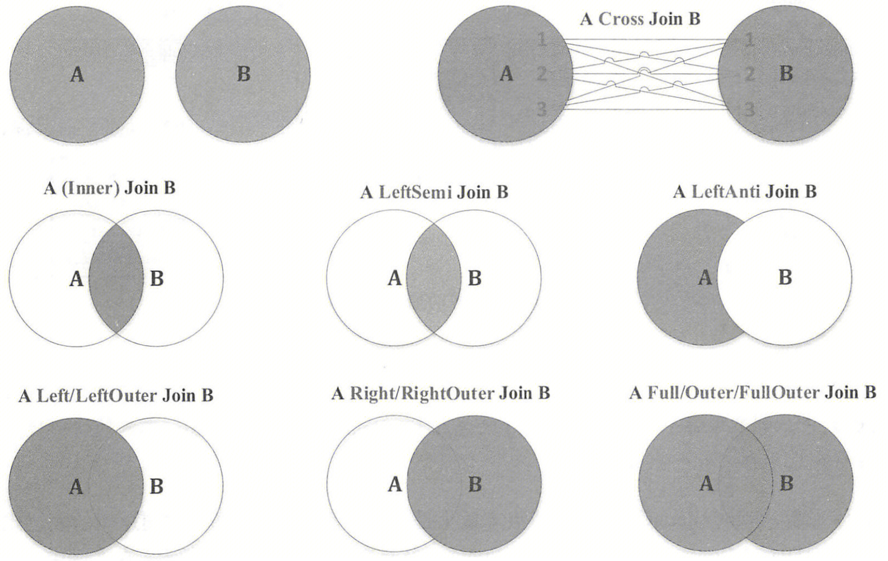

下面以 `` SELECT `name`, `score` FROM `student` JOIN `exam` ON `student`.`id` = `exam`.`studentId `` 为例进行说明。经过 ANTLR4 编译器的处理，查询语句生成下图所示的抽象语法树。对于 Join 查询，值得关注的是 FromClauseContext 节点。第一个 TableNameContext 子节点对应文法定义中的 relationPrimary，即 student 数据表；第二个 TableNameContext 子节点对应 exam 数据表，在 JoinRelationContext 节点下还包含对应 Join 类型的 JoinTypeContext 子节点和对应 Join 条件的 JoinCriteriaContext 子节点。具体来看，JoinCriteriaContext 子节点本质上是一个表示 True 和 False 谓词逻辑的表达式节点（BooleanExpressionContext），该表达式的左、右子表达式分别为 `` `student`.`id` `` 和 `` `exam`.`studentId` ``，这两个表达式都设置了数据表名，属于 DereferenceContext 类型节点，而 ComparisonOperatorContext 节点对应列之间的相等关系。

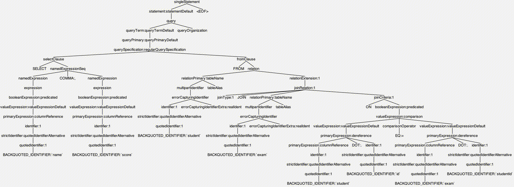


## 2.2 逻辑计划

1、在《Spark SQL 入门》介绍过，AstBuilder 负责生成 Unresolved LogicalPlan，与 Join 算子相关的部分主要在 From 子句中，因此从 visitFromClause 方法开始，这里不再介绍 Select 语句对应逻辑算子树的生成过程。最终生成的 Unresolved LogicalPlan 如下图（左）所示。

```scala
AstBuilder
  // 为给定的FROM子句创建一个逻辑计划，注意这里支持多个逗号分隔的关系（relations），这些关系通过无条件的内连接转换为单个计划
  visitFromClause
    // ctx.relation得到的是List<RelationContext>，在本例中只有一个RelationContext元素（因为没有逗号分隔relations）。根据前面文法分析：
    // 每个RelationContext中有一个主要的数据表（RelationPrimaryContext）和零个或多个需要Join的表（JoinRelationContext，包含在RelationExtensionContext节点中）
    val from = ctx.relation.asScala.foldLeft(null: LogicalPlan) { (left, relation) => ... }
      // 在本例中relationPrimary对应主要的数据表student
      val relationPrimary = relation.relationPrimary()
      // conf.ansiRelationPrecedence默认为false，详见spark.sql.ansi.enabled及spark.sql.ansi.relationPrecedence参数说明
      val right = if (conf.ansiRelationPrecedence) { visitRelation(relation) } else { plan(relationPrimary) }
      // 由于初始的LogicalPlan为null，所以join值同样为student对应的LogicalPlan
      val join = right.optionalMap(left) { (left, right) => ... }
      // 调用withRelationExtensions方法（内部调用withJoinRelation方法），将得到的LogicalPlan与数据表exam进行Join操作
      if (conf.ansiRelationPrecedence) join else withRelationExtensions(relation, join)
        // ctx.relationExtension得到的是List<RelationExtensionContext>，在本例中只有一个RelationExtensionContext元素
        ctx.relationExtension().asScala.foldLeft(query) { (left, extension) => ... }
          // 将一个或多个LogicalPlan连接到当前的逻辑计划中
          withJoinRelation(extension.joinRelation(), left)
            // 根据Join类型构造JoinType对象，即前面介绍的7种，Inner、Cross、LeftOuter、LeftSemi、RightOuter、FullOuter、LeftAnti均直接或间接继承自JoinType
            val baseJoinType = ctx.joinType match { ... }
            // 解析Join类型和Join条件
            val (joinType, condition) = Option(ctx.joinCriteria) match { ... }
            // 构造并返回Join逻辑节点，参数分别表示Join操作的左节点、右节点、Join类型、Join条件、Join Hint
            Join(base, plan(ctx.right), joinType, condition, JoinHint.NONE)
```


2、在 Analyzer 中，与 Join 相关的解析规则有很多，包括 ResolveRelations、ResolveReferences、ResolveNaturalAndUsingJoin 等，最终生成的 Analyzed LogicalPlan 如下图（右）所示。其中，**ResolveRelations 规则**从 Catalog 中找到 student 和 exam 的基本信息，包括数据表存储格式、每一列列名和数据类型等。**ResolveReferences 规则**自底向上的解析所有列信息，将所有 UnresolvedAttribute 与 UnresolvedExtractValue 类型的表达式转换成对应的列信息。ResolveNaturalAndUsingJoin 规则（实际未使用）将 NATUAL 或 USING 类型的 Join 转换为普通的 Join。Natual Join 指的是在正常 Join 前面可以加 NATUAL 关键字，此时不用写 ON 条件，Spark 会自动获取 Join 的 Left 和 Right 的输出字段，然后使用公共的字段构建 Join；Using Join 指的是如果 Join 条件中的字段名相同，可以使用 `USING (col1, col2)` 替代 `ON left.col1 = right.col1 AND left.col2 = right.col2`。

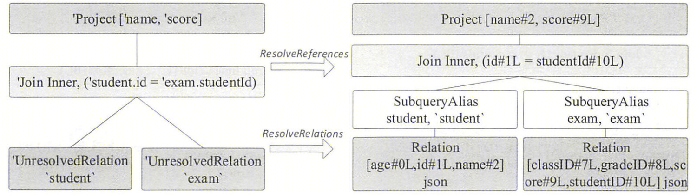

```scala
// 将未解析的relations（表和视图）替换为catalog中的具体relations
ResolveRelations
  apply(plan: LogicalPlan)
    // 处理UnresolvedRelation节点，如果表来自session catalog的v1表，则解析为v1 relation；否则解析为v2 relation
    case u: UnresolvedRelation => resolveRelation(u).map(resolveViews).getOrElse(u)
      val table = CatalogV2Util.loadTable(catalog, ident, timeTravelSpec)
      val loaded = createRelation(catalog, ident, table, u.options, u.isStreaming)
        v1SessionCatalog.getRelation(v1Table.v1Table, options)
          // 创建并返回SubqueryAlias节点，其子节点UnresolvedCatalogRelation表示表关系占位符，它将在BaseSessionStateBuilder或其子类定义的
          // extendedResolutionRules扩展规则中的FindDataSourceTable规则解析，替换为LogicalRelation或HiveTableRelation节点
          SubqueryAlias(multiParts, UnresolvedCatalogRelation(metadata, options))
```

```scala
// 解析查询计划中的列引用。基本上，它从下往上转换查询计划树，并且仅在所有子节点都已解析且子节点之间没有冲突属性时，才尝试解析计划节点的引用
ResolveReferences
  apply(plan: LogicalPlan)
    // 等待其他规则先解析子计划
    case p: LogicalPlan if !p.childrenResolved => p
    // 子逻辑计划可能会输出具有冲突属性ID的列，这可能发生在自连接等情况下。应该等待DeduplicateRelations规则消除冲突的属性ID，否则由于歧义，无法正确解析列
    // 具体做法是：如果Join操作存在重名的属性（左、右子节点的输出属性名集合有重叠），那么就调用dedupRight方法将右子节点对应的Expression
    // 用一个新的Expression ID表示，这样即使出现同名，经过处理之后Expression ID也不相同，因此可以区分Join操作中不同的数据表
    case p: LogicalPlan if hasConflictingAttrs(p) => p
```


3、在 Optimizer 中，生成的 Optimized LogicalPlan 如下图所示。第一步，**EliminateSubqueryAliases 规则**将 SubqueryAlias(_*,* child*, _*）节点直接替换为 child 节点，即 Relation 原来的 SubqueryAlias 父节点被移除，Join 成为 Relation 的父节点。第二步，由于父节点只需要用到两个数据表中的 4 列，因此 **ColumnPruning 规则**在 Relation 节点之后添加新的 Project 节点进行列裁剪操作。第三步，对于 Join 来讲，其连接条件需要保证两边的列都不为 null，因此会触发 **InferFitersFromConstraints 规则**，Join 算子中的连接条件多了两个，分别约束 student 表中的 Id 和 exam 表中的 studentId 不为 null。第四步，由于 Join 节点多了两个条件判定列不为 null，这两个条件只涉及单个数据表，因此 **PushPredicateThroughJoin 规则**可以将其下推到子节点，尽早过滤数据，Join 中的两个连接条件生成了对应的两个 Filter 节点。第五步，一般来讲，优化阶段会将过滤条件尽可能地下推，因此逻辑算子树中的 Filter 节点还会被继续处理，**PushDownPredicate 规则**将 Filter 节点下推至 Project 节点之下。至此，整个逻辑算子树的优化工作完成。

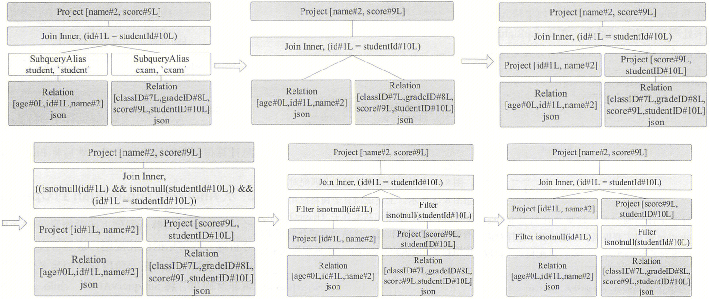


## 2.3 物理计划

1、从逻辑计划到物理计划是基于策略进行的，上述逻辑算子树将应用 3 个策略：**FileSourceStrategy、JoinSelection 和 BasicOperators**。FileSourceStrategy 与 BasicOperators 策略在《Spark SQL 入门》中介绍过，其中 FileSourceStrategy 策略中还用到了 PhysicalOperation 匹配模式来合并 Relation 上方的 Project 与 Filter 算子。这里重点关注 JoinSelection 策略，该策略主要根据 Join 逻辑算子选择对应的物理算子。在 JoinSelection 策略中，用到了 ExtractEquiJoinKeys 匹配模式来提取 Join 算子中的连接条件，如果是等值连接（equi-join），则将左、右子节点的连接 key 都提取出来，此时存在两种情况：EqualTo 和 EqualNullSafe。两者的主要区别在于对空值 null 是否敏感，其中，EqualTo 对空值敏感，即对空值没有额外的处理逻辑，而 EqualNullSafe 会对空值进行处理，即赋予相应类型的默认值。这两种情况和 SQL 语句有关，**当 SQL 语句中 Join 条件表达式为 = 或 == 时，对应 EqualTo；当 Join 条件表达式为 <=> 时，对应 EqualNullSatfe**。

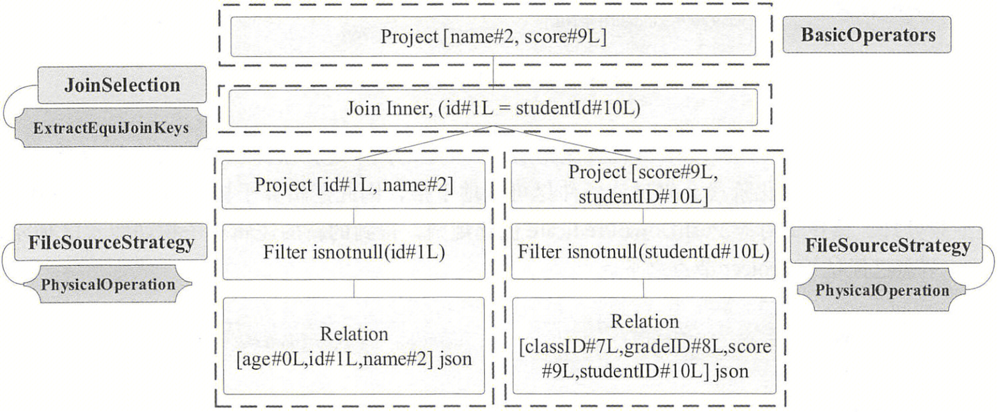

```scala
// 根据连接策略提示、等值连接键的可用性以及连接关系的大小，选择适当的连接物理计划
JoinSelection
  apply(plan: LogicalPlan)
    // 如果是等值连接（equi-join），首先根据以下顺序查看连接提示（join hints）：
    //  1. 广播提示（broadcast hint）：如果连接类型支持，选择广播哈希连接（broadcast hash join）。如果两个连接的两侧都有广播提示，选择较小的一侧（基于统计信息）进行广播
    //  2. 排序合并提示（sort merge hint）：如果连接键可排序，选择洗牌排序合并连接（shuffle sort merge join）
    //  3. 洗牌哈希提示（shuffle hash hint）：如果连接类型支持，选择洗牌哈希连接（shuffle hash join）。如果两个连接的两侧都有洗牌哈希提示，选择较小的一侧（基于统计信息）作为构建侧
    //  4. 洗牌复制嵌套循环提示（shuffle replicate NL hint）：如果连接类型类是InnerLike（即Inner或Cross），选择笛卡尔积（cartesian product）
    // 如果没有提示或提示不适用，按照以下规则逐个选择：
    //  1. 如果一侧足够小且连接类型支持，选择广播哈希连接（broadcast hash join）。如果两侧都很小，选择较小的一侧（基于统计信息）进行广播
    //  2. 如果一侧足够小以构建本地哈希映射，并且远小于另一侧，并且spark.sql.join.preferSortMergeJoin为false，选择洗牌哈希连接（shuffle hash join）
    //  3. 如果连接键可排序，选择洗牌排序合并连接（shuffle sort merge join）
    //  4. 如果连接类型是InnerLike，选择笛卡尔积（cartesian product）
    //  5. 选择广播嵌套循环连接（broadcast nested loop join）作为最后的解决方案。这可能会导致内存溢出，但我们没有其他选择
    case j @ ExtractEquiJoinKeys(...) => 
      def createBroadcastHashJoin(onlyLookingAtHint: Boolean) = {
        // 若BuildLeft与BuildRight都可以，选择较小的一侧（基于统计信息）进行广播。继承关系：BuildLeft、BuildRight -> BuildSide
        // BuildLeft条件：连接类型是InnerLike、RightOuter && (Left广播提示 || (Left足够小 && 没有AQE内部提示阻止Left广播))
        // BuildRight条件：连接类型是InnerLike、LeftOuter、LeftSemi、LeftAnti && (Right广播提示 || (Right足够小 && 没有AQE内部提示阻止Right广播))
        // 注：这里足够小参见JoinSelectionHelper特质的canBroadcastBySize方法，判断条件：0 <= 统计数据大小 <= autoBroadcastJoinThreshold，
        // 其中autoBroadcastJoinThreshold为spark.sql.adaptive.autoBroadcastJoinThreshold参数值（AQE）或spark.sql.autoBroadcastJoinThreshold参数值
        val buildSide = getBroadcastBuildSide(...)
        checkHintBuildSide(...)
        buildSide.map { buildSide => Seq(joins.BroadcastHashJoinExec(...)) }
      }

      def createShuffleHashJoin(onlyLookingAtHint: Boolean) = {
        // 若BuildLeft与BuildRight都可以，选择较小的一侧（基于统计信息）作为构建侧。继承关系：BuildLeft、BuildRight -> BuildSide
        // BuildLeft条件：连接类型是InnerLike、RightOuter、FullOuter && (Left洗牌哈希提示 || (AQE内部提示鼓励使用Left洗牌哈希连接 || 
        // (spark.sql.join.preferSortMergeJoin参数为false，默认为true && Left足够小 && Left数据大小 * spark.sql.shuffledHashJoinFactor，默认为3 <= Right数据大小)))
        // BuildRight条件：连接类型不是RightOuter && (Right洗牌哈希提示 || (AQE内部提示鼓励使用Right洗牌哈希连接 || 
        // (spark.sql.join.preferSortMergeJoin参数为false，默认为true && Right足够小 && Right数据大小 * spark.sql.shuffledHashJoinFactor，默认为3 <= Left数据大小)))
        // 注：这里足够小参见JoinSelectionHelper特质的canBuildLocalHashMapBySize方法，判断条件：表的大小 < spark.sql.autoBroadcastJoinThreshold * numShufflePartitions
        // 当spark.sql.adaptive.enabled=true（默认true）且spark.sql.adaptive.coalescePartitions.enabled=true（默认true）时，
        // numShufflePartitions为sql.adaptive.coalescePartitions.initialPartitionNum，否则为spark.sql.shuffle.partitions
        val buildSide = getShuffleHashJoinBuildSide(...)
        checkHintBuildSide(...)
        buildSide.map { buildSide => Seq(joins.ShuffledHashJoinExec(...)) }
      }

      def createSortMergeJoin() = {
        // SortMergeJoin连接键必须可排序，支持所有连接类型
        if (RowOrdering.isOrderable(leftKeys)) { Some(Seq(joins.SortMergeJoinExec(...))) }
        else { None }
      }

      def createCartesianProduct() = {
        // CartesianProductExec连接类型必须是InnerLike，继承关系：Inner、Cross -> InnerLike
        if (joinType.isInstanceOf[InnerLike]) { Some(Seq(joins.CartesianProductExec(...))) }
        else { None }
      }

      // 没有提示或提示不适用，依次尝试BroadcastHashJoin、ShuffleHashJoin、SortMergeJoin、CartesianProduct、BroadcastNestedLoopJoin
      def createJoinWithoutHint() = {
        createBroadcastHashJoin(false)
          .orElse(createShuffleHashJoin(false))
          .orElse(createSortMergeJoin())
          .orElse(createCartesianProduct())
          .getOrElse {
            // BroadcastNestedLoopJoin可能会非常慢或OOM
            val buildSide = getSmallerSide(left, right)
            Seq(joins.BroadcastNestedLoopJoinExec(...))
          }
      }
      
      if (hint.isEmpty)
        // 没有连接提示
        createJoinWithoutHint()
      else
        // 有连接提示，依次尝试BroadcastHashJoin、SortMergeJoin、ShuffleHashJoin、CartesianProduct，若提示均不适用，和上面一样处理
        createBroadcastHashJoin(true)
          .orElse { if (hintToSortMergeJoin(hint)) createSortMergeJoin() else None }
          .orElse(createShuffleHashJoin(true))
          .orElse { if (hintToShuffleReplicateNL(hint)) createCartesianProduct() else None }
          .getOrElse(createJoinWithoutHint())
    
    // 如果不是等值连接（equi-join），首先根据以下顺序查看连接提示（join hints）：
    //  1.广播提示（broadcast hint）：选择广播嵌套循环连接（broadcast nested loop join）。如果两边都有广播提示，
    //    连接类型为InnerLike和FullOuter时选择较小的一边（基于统计信息）广播；为InnerLike、RightOuter时选择Left广播；否则选择Right来广播
    //  2.洗牌复制嵌套循环提示（shuffle replicate NL hint）：如果连接类型类是InnerLike（即Inner或Cross），选择笛卡尔积（cartesian product）
    // 如果没有提示或提示不适用，按照以下规则逐个选择：
    //  1.如果一边足够小以进行广播，则选择广播嵌套循环连接（broadcast nested loop join）。如果只有Left足够小可以广播，选择Left广播，或者只有Right足够小可以广播，选择Right广播。
    //    如果两边都很小，连接类型为InnerLike和FullOuter时选择较小的一边（基于统计信息）广播；为InnerLike、RightOuter时选择Left广播；否则选择Right广播
    //    注：这里足够小参见JoinSelectionHelper特质的canBroadcastBySize方法（前面已经介绍）
    //  2.如果连接类型是InnerLike，选择笛卡尔积（cartesian product）
    //  3.选择广播嵌套循环连接（broadcast nested loop join）作为最后的解决方案。这可能会导致内存溢出，但我们没有其他选择。
    //    连接类型为InnerLike和FullOuter时选择较小的一边（基于统计信息）广播；为InnerLike、RightOuter时选择Left广播；否则选择Right来广播
    case logical.Join(left, right, joinType, condition, hint) => 
```

2、在生成物理计划的过程中，JoinSelection 根据若干条件判断采用何种类型的 Join 执行策略。目前在 Spark SQL 中，Join 的执行策略有 5 种：**广播哈希连接（Broadcast hash join，BHJ）、洗牌哈希连接（Shuffle hash join）、洗牌排序合并连接（Shuffle sort merge join，SMJ）、广播嵌套循环连接（Broadcast nested loop join，BNLJ）、洗牌复制嵌套循环连接（Shuffle-and-replicate nested loop join），也称为笛卡尔积连接（Cartesian Product Join，CPJ）**。这些策略选择的原则是尽量避免性能开销大的 Shuffle 和 Sort 操作，具体选择的影响因素有：

- **连接类型是否为等值连接（equi-join）**：等值连接的连接条件只包含 =、== 、<=>，而非等值连接的连接条件包含 <、>、>=、<= 等，由于非等值连接是对不确定值的范围比较，需要嵌套循环，所以**只有 CPJ 和 BNLJ 两种连接策略支持非等值连接，而对于等值连接，所有连接策略都支持**。
- **连接提示（join hints）**：Spark 为用户提供了连接提示，通过它可以对连接策略进行选择，共支持 4 种连接提示：BROADCAST、MERGE（SHUFFLE_MERGE）、SHUFFLE_HASH、SHUFFLE_REPLICATE_NL，详见[官网](https://spark.apache.org/docs/3.4.2/sql-ref-syntax-qry-select-hints.html#join-hints)。
- **连接数据集的大小**：涉及 spark.sql.autoBroadcastJoinThreshold 等参数，后面介绍。


## 2.4 Join 执行

### 2.4.1 Join 执行框架

在 Spark SQL 中，Join 的实现都基于一个基本流程，如图所示。根据角色的不同，**参与 Join 操作的两张表分別被称为流式表（StreamTable）和构建表（BuildTable），不同表的角色会通过一定的策略进行设定。通常来讲，系统会默认将大表设定为流式表，将小表设定为构建表**。流式表的迭代器为 streamedIter，构建表的迭代器为 buildlter。遍历 streamedIter 中每条记录，然后在 buildlter 中查找相匹配的记录。这个查找过程称为 Build 过程，每次 Build 操作的结果为一条 JoinedRow(A, B)，其中 A 来自 streamedlter， B 来自 buildIter，这个过程为 BuildRight 操作；而如果 B 来自 streamedlter， A 来自 buildIter，则为 BuildLeft 操作。

**对于 LeftOuter、RightOuter、LeftSemi 和 LeftAnti，它们的 Build 类型是确定的，即 LeftOuter、LeftSemi、LefAnti 为 BuildRight，RightOuter 为 BuildLeft 类型。对于 Inner，BuildLeft 和 BuildRight 两种都可以，选择不同，可能有着很大的性能区别。**

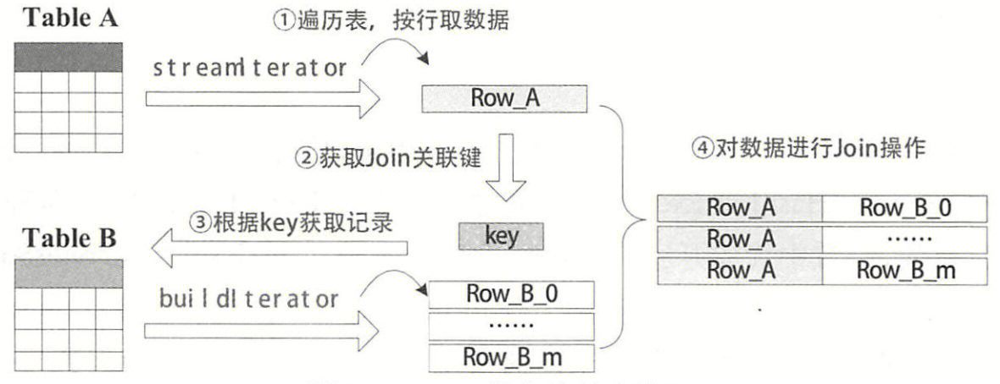

### 2.4.2 广播哈希连接（Broadcast hash join，BHJ）

**基本原理**：主要分为两个阶段，①**广播阶段**：通过 collect 算子将小表数据拉到 Driver，再把整体的小表广播至每个 Executor 一份  ②**关联阶段**：在每个 Executor 上进行 hash join，为小表通过连接键（join key）创建 HashedRelation 作为 BuildTable，循环大表 StreamTable 通过 join key 关联 BuildTable

**限制条件**：①**仅支持等值连接，连接键不需要可排序，支持除 FullOuter 之外的所有连接类型**  ②**被广播的小表大小必须小于：spark.sql.autoBroadcastJoinThreshold（默认 10M，设置 -1 可以关闭 BHJ）** ③**基表不能被广播，比如 LeftOuter、LeftSemi、LefAnti 只能广播右表，RightOuter 只能广播左表**

**其他说明**：当广播表较小时，BHJ 通常比其他连接策略执行速度更快，因为它可以避免数据 Shuffle。然而，广播表是一种网络密集型操作，在某些情况下可能导致 OOM 或性能不佳，特别是在构建表/广播表较大时。

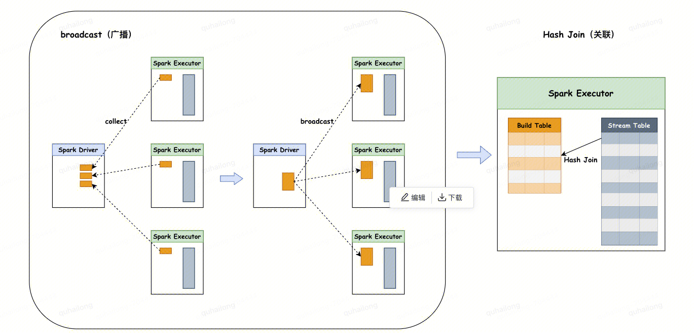

```scala
// 继承关系：BroadcastHashJoinExec -> HashJoin -> JoinCodegenSupport -> CodegenSupport、BaseJoinExec -> SparkPlan
BroadcastHashJoinExec
  doExecute()
    // 广播构建表。特质HashedRelation具体实现包括UnsafeHashedRelation和LongHashedRelation两种
    // UnsafeHashedRelation是常用的类型，内部依赖BytesToBytesMap；LongHashedRelation内部依赖LongToUnsafeRowMap，它是一种只追加的HashMap，键值对为(Long, UnsafeRow)
    val broadcastRelation = buildPlan.executeBroadcast[HashedRelation]()
    // 对每个RDD分区，遍历流式表
    streamedPlan.execute().mapPartitions { streamedIter =>
      // 获取构建表对应的HashedRelation的只读副本
      val hashed = broadcastRelation.value.asReadOnlyCopy()
      // 调用父类HashJoin的方法，根据Join类型完成遍历和Join操作
      join(streamedIter, hashed, numOutputRows)
        // 以innerJoin为例
        innerJoin(streamedIter, hashed)
          // 通过streamIter遍历
          streamIter.flatMap { srow =>
            // JoinedRow左侧为流式表的InternalRow，右侧为Join上的构建表的InternalRow
            joinRow.withLeft(srow)
            val matched = hashedRelation.getValue(joinKeys(srow))
            Some(joinRow.withRight(matched)).filter(boundCondition)
          }
    }
```

 

### 2.4.3 洗牌哈希连接（Shuffle hash join）

**基本原理**：利用分治的思想，主要分为两个阶段，①**洗牌阶段**：对两张表分别按照 join key 进行分区洗牌，目的是让相同 join key 的数据分配到同一个分区中（对应物理计划的 Exchange 节点） ②**关联阶段**：在每个 Executor 上进行本地 hash join，为小表哈希后的分区通过 join key 创建 HashedRelation 作为 BuildTable，循环大表 StreamTable 通过 join key 关联 BuildTable

**限制条件**：①**仅支持等值连接，连接键不需要可排序，支持所有连接类型**  ②**spark.sql.join.preferSortMergeJoin = false（默认 true，即默认选择 SMJ） ③小表的大小 < spark.sql.autoBroadcastJoinThreshold（默认 10M） \* numShufflePartitions，**当 spark.sql.adaptive.enabled = true（默认 true） 且 spark.sql.adaptive.coalescePartitions.enabled = true（默认 true）时，numShufflePartitions 为 sql.adaptive.coalescePartitions.initialPartitionNum，否则为 spark.sql.shuffle.partitions ④**小表的大小 \* spark.sql.shuffledHashJoinFactor（默认 3）<= 大表的大小，否则性能收益未必大于 SMJ**

**其他说明**：从表中构建 hash map 是一种内存密集型操作，当构建侧较大时可能会导致 OOM

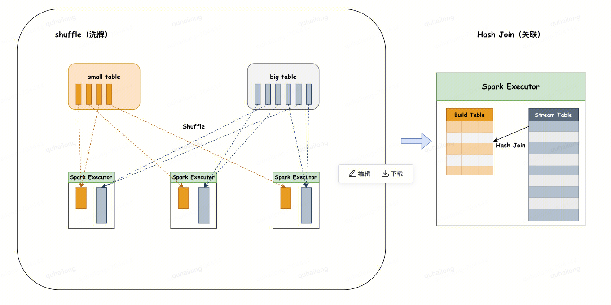

```scala
// 继承关系：ShuffledHashJoinExec -> HashJoin、ShuffledJoin -> JoinCodegenSupport -> CodegenSupport、BaseJoinExec -> SparkPlan
ShuffledHashJoinExec
  doExecute()
    // rdd1.zipPartitions(rdd2)含义：将rdd1和rdd2中的分区按照一一对应关系连接在一起，结果RDD的每个分区中的数据为<list(records from rdd1), list(records from rdd2)>，
    // 然后可以自定义函数func对这些record进行处理。该操作要求rdd1和rdd2的分区个数相同，但不要求每个分区包含的元素个数相同
    streamedPlan.execute().zipPartitions(buildPlan.execute()) { (streamIter, buildIter) =>
      // 为构建表创建HashedRelation
      val hashed = buildHashedRelation(buildIter)
      joinType match {
        case FullOuter => fullOuterJoin(streamIter, hashed, numOutputRows)
        // 调用父类HashJoin的方法，根据Join类型完成遍历和Join操作
        case _ => join(streamIter, hashed, numOutputRows)
      }
    }
```

 

### 2.4.4 洗牌排序合并连接（Shuffle sort merge join，SMJ）

**基本原理**：主要分为三个阶段，①**洗牌阶段**：将两张大表分别按照 join key 进行分区洗牌，目的是让相同 join key 的数据分配到同一个分区中（对应物理计划的 Exchange 节点） ②**排序阶段**：对单个分区的两张表分别按照 join key 进行排序 ③**关联阶段**：两张有序表都可以作为 StreamTable 或 BuildTable，顺序迭代 StreamTable 行，在 BuildTable 顺序逐行搜索，相同 key 关联。由于 StreamTable 或 BuildTable 都是按 join key 排序的，当连接过程转移到下一个 StreamTable 行时，在 BuildTable 中不必从第一个行搜索，只需从与上一个 StreamTable 匹配行继续搜索即可

**限制条件**：①**仅支持等值连接，连接键必须可排序，支持所有连接类型**

**其他说明**：Shuffle hash join 将一侧的数据完全加载到内存，这对于小表比较适用。然而，当两个表的数据量都非常大时，会对内存造成很大压力，此时 Spark 会采用 SMJ，这也是大多数连接采用的策略

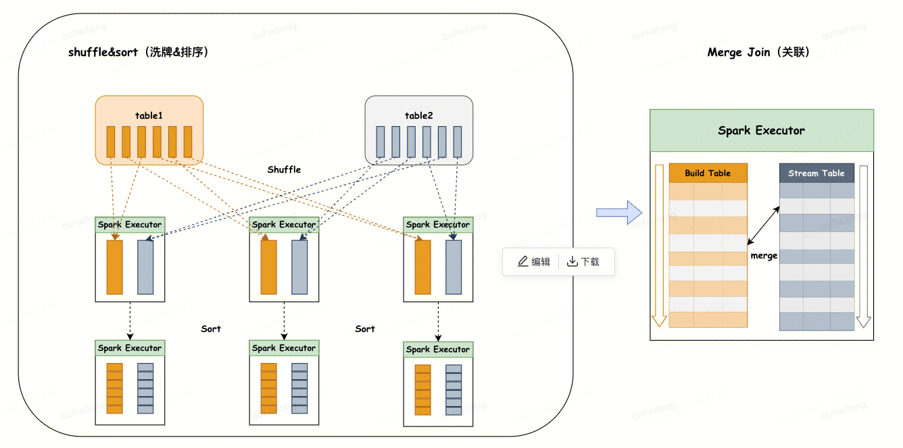

```scala
// 继承关系：SortMergeJoinExec -> ShuffledJoin -> JoinCodegenSupport -> CodegenSupport、BaseJoinExec -> SparkPlan
SortMergeJoinExec
  doExecute()
    // 参数spark.sql.sortMergeJoinExec.buffer.spill.threshold，默认spark.shuffle.spill.numElementsForceSpillThreshold，即Integer.MAX_VALUE
    val spillThreshold = getSpillThreshold
    // 参数spark.sql.sortMergeJoinExec.buffer.in.memory.threshold，默认Integer.MAX_VALUE - 15
    val inMemoryThreshold = getInMemoryThreshold
    // zipPartitions函数作用同上
    left.execute().zipPartitions(right.execute()) { (leftIter, rightIter) => ... }
      // 额外的过滤条件
      val boundCondition: (InternalRow) => Boolean = { ... }
      // 用来比较两侧key的排序方式
      val keyOrdering = RowOrdering.createNaturalAscendingOrdering(leftKeys.map(_.dataType))
      // 输出投影
      val resultProj: InternalRow => InternalRow = UnsafeProjection.create(output, output)
      joinType match 
        // 以InnerLike为例
        case _: InnerLike =>
          // RowIterator是个内部迭代器接口，其API比[[scala.collection.Iterator]]更为严格，主要区别是将hasNext()和next()调用合并在一起：
          // Scala的迭代器允许用户调用hasNext()而不立即推进迭代器以消耗下一行，而RowIterator将这些调用合并为一个单独的[[advanceNext()]]方法
          // 这里重写了RowIterator抽象类中的advanceNext、getRow方法（后面介绍），前者将迭代器推进一行，后者从迭代器中获取行
          new RowIterator { ... }.toScala
            // RowIteratorToScala继承自Iterator，重写了hasNext、next方法
            new RowIteratorToScala(this)
              hasNext
                // 即上面重写的advanceNext方法
                rowIter.advanceNext()
                  // 同时推进两个输入迭代器，当找到具有匹配join key的行时停止。如果没有找到连接行，则尝试进行及时的资源清理
                  if (smjScanner.findNextInnerJoinRows())
                  // 更新此JoinedRow，使其指向两个新的基础行，并返回自身
                  joinRow(currentLeftRow, rightMatchesIterator.next())
              next
                // 即上面重写的getRow方法
                rowIter.getRow
                  resultProj(joinRow)
```

 

### 2.4.5 笛卡尔积连接（Cartesian Product Join，CPJ）

**基本原理**：主要分为两个阶段，①**分区阶段**：将两张大表分别进行分区，再将两个父分区 a，b 进行笛卡尔积组装子分区，子分区数量 a * b ②**关联阶段**：会对 StreamTable 和 BuildTable 两个表使用内、外两个嵌套的 for 循环依次扫描，通过相同 key 进行关联

**限制条件**：①**支持等值连接和非等值连接，仅支持 Inner、Cross 连接类型**

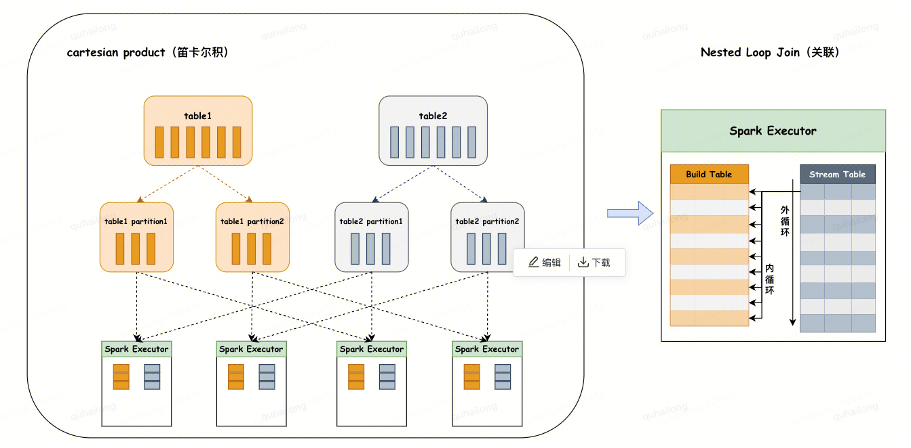

```scala
// 继承关系：CartesianProductExec -> BaseJoinExec -> BinaryExecNode -> SparkPlan、BinaryLike
CartesianProductExec
  doExecute()
    // 左、右物理子节点分别执行，执行结果作为RDD[UnsafeRow]
    val leftResults = left.execute().asInstanceOf[RDD[UnsafeRow]]
    val rightResults = right.execute().asInstanceOf[RDD[UnsafeRow]]
    // UnsafeCartesianRDD是针对UnsafeRow优化的CartesianRDD，它将缓存来自第二个子RDD的行，比为左侧RDD中的每一行构建右侧分区要快得多，它还会实例化右侧RDD（如果右侧RDD是非确定性的）
    // 第3个形参由参数spark.sql.cartesianProductExec.buffer.in.memory.threshold决定，第4个形参由参数spark.sql.cartesianProductExec.buffer.spill.threshold决定
    val pair = new UnsafeCartesianRDD(leftResults, rightResults, conf.cartesianProductExecBufferInMemoryThreshold, conf.cartesianProductExecBufferSpillThreshold)
    // mapPartitionsWithIndexInternal是Spark内部的mapPartitionsWithIndex方法，跳过闭包清理。这是一个性能API，只有在确定RDD元素是可序列化的并且不需要闭包清理时才应谨慎使用
    pair.mapPartitionsWithIndexInternal { (index, iter) =>
      // GenerateUnsafeRowJoiner是一个用于将两个[[UnsafeRow]]连接成一个[[UnsafeRow]]的代码生成器（code generator）
      val joiner = GenerateUnsafeRowJoiner.create(left.schema, right.schema)
      // 如果有连接条件，过滤iter，这里iter类型为Iterator[(UnsafeRow, UnsafeRow)]
      val filtered = if (condition.isDefined) 
        iter.filter { r => boundCondition.eval(joined(r._1, r._2)) }
      // 输出行数的累加器指标加1，并通过代码生成（code generation）完成Join操作
      filtered.map { r =>
        numOutputRows += 1
        joiner.join(r._1, r._2)
      }
    }
```

 

### 2.4.6 广播嵌套循环连接（Broadcast nested loop join，BNLJ）

**基本原理**：主要分为两个阶段，①**广播阶段**：通过 collect 算子将小表数据拉到 Driver，再把整体的小表广播至每个 Executor 一份 ②**关联阶段**：会对 StreamTable 和 BuildTable 两个表使用内、外两个嵌套的 for 循环依次扫描，通过相同 key 进行关联

**限制条件**：①**支持等值连接和非等值连接，支持所有连接类型**，但实现针对以下情况进行了小表广播优化，以减少表的扫描次数：在 RightOuter 中广播左侧；在 LeftOuter、LeftSemi、LefAnti 中广播右侧；在 Inner、Cross 中广播任一侧。对于其他情况，需要多次扫描数据，这可能会导致较慢的执行速度

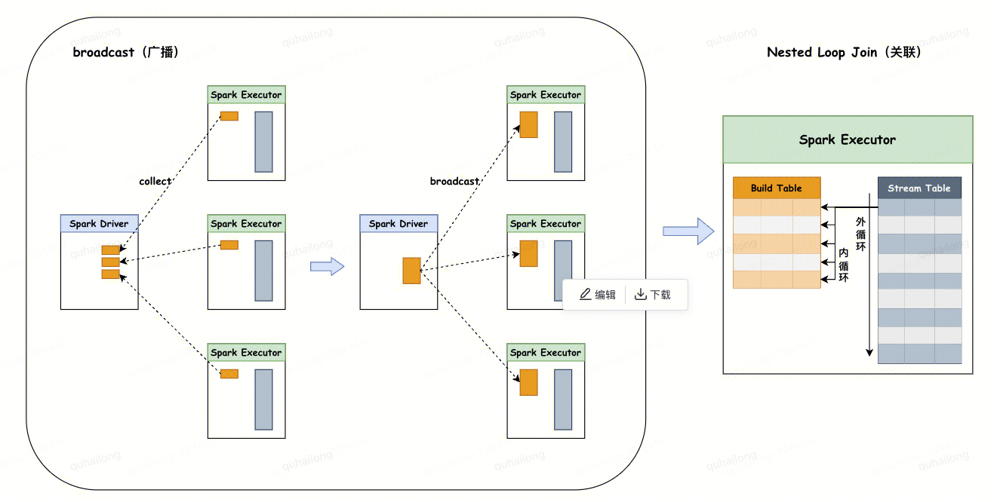

```scala
// 继承关系：BroadcastNestedLoopJoinExec -> JoinCodegenSupport -> CodegenSupport、BaseJoinExec -> SparkPlan
BroadcastNestedLoopJoinExec
  doExecute()
    // 广播构建表
    val broadcastedRelation = broadcast.executeBroadcast[Array[InternalRow]]()
    // 根据Join类型和BuildSide进行选择
    val resultRdd = (joinType, buildSide) match {
      // 继承关系：Inner、Cross -> InnerLike
      case (_: InnerLike, _) =>
        innerJoin(broadcastedRelation)
      case (LeftOuter, BuildRight) | (RightOuter, BuildLeft) =>
        outerJoin(broadcastedRelation)
      case (LeftSemi, _) =>
        leftExistenceJoin(broadcastedRelation, exists = true)
      case (LeftAnti, _) =>
        leftExistenceJoin(broadcastedRelation, exists = false)
      // ExistenceJoin连接类型仅在optimizer和物理计划的最后使用，不会为这种连接类型生成SQL
      case (_: ExistenceJoin, _) =>
        existenceJoin(broadcastedRelation)
      // 三种情况：①LeftOuter with BuildLeft ②RightOuter with BuildRight ③FullOuter
      case _ =>
        defaultJoin(broadcastedRelation)
    }
```

 

# 3. Spark SQL 连接 Hive

## 3.1 连接 Hive 概述

从 Spark 2.0 开始，连接 Hive 不再需要创建单独的 HiveContex，而是**在 SparkSession 中通过 enableHiveSupport 方法开启 Hive 的支持，其本质是增加一个配置：spark.sql.catalogImplementation = hive，该配置默认为 in-memory**。在 《Spark SQL 入门》介绍过，QueryExecution 调用 sparkSession.sessionState.analyzer.executeAndCheck(logical, tracker) 生成 Analyzed LogicalPlan。该过程首先会通过反射生成 BaseSessionStateBuilder 抽象类的具体子类，由于前面设置了 spark.sql.catalogImplementation = hive，因此这里实例化的是 HiveSessionStateBuilder。**HiveSessionStateBuilder 继承自 BaseSessionStateBuilder，主要重写了三个对象：Catalog、Analyzer 和 SparkPlanner**。其中，Catalog 具体实现为 HiveSessionCatalog，Analyzer 中加入了 Hive 相关的分析规则，SparkPlanner 中加入了 Hive 相关的策略，其他的部分（如 Parser 等）则直接复用 SparkSQL 本身的对象。

```scala
// 在SparkSession中通过enableHiveSupport方法开启Hive的支持，包括连接到Hive Metastore、支持Hive序列化器和Hive用户自定义函数
SparkSession.builder.enableHiveSupport()
  // 判读是否可以加载Hive类，包括：org.apache.spark.sql.hive.HiveSessionStateBuilder、org.apache.hadoop.hive.conf.HiveConf
  if (hiveClassesArePresent) 
    // 参数spark.sql.catalogImplementation，可选值包括："hive"、"in-memory"，默认"in-memory"
    // 这里将Catalog信息设置“hive”，这样SparkSession在根据配置信息反射获取SessionState对象时，就能得到与Hive相关的对象
    config(CATALOG_IMPLEMENTATION.key, "hive")
QueryExecution
  sparkSession.sessionState
    // 由于设置了spark.sql.catalogImplementation="hive"，这里SparkSession.sessionStateClassName根据配置返回：org.apache.spark.sql.hive.HiveSessionStateBuilder
    SparkSession.instantiateSessionState(SparkSession.sessionStateClassName(...), self)
      // 通过反射生成[Hive]SessionStateBuilder，HiveSessionStateBuilder主要重写了三个对象：Catalog、Analyzer和SparkPlanner
      val clazz = Utils.classForName(className)
      val ctor = clazz.getConstructors.head
      // 这里实例化的是HiveSessionStateBuilder，继承关系：SessionStateBuilder、HiveSessionStateBuilder -> BaseSessionStateBuilder
      ctor.newInstance(sparkSession, None).asInstanceOf[BaseSessionStateBuilder].build()
        // 这里analyzer为Analyzer，但optimizer为SparkOptimizer（Optimizer子类）。注意，BaseSessionStateBuilder及其子类分别重写了某些规则和策略
        new SessionState(..., () => analyzer, () => optimizer, planner, ...)
```

 

## 3.2 Hive 相关规则和策略

### 3.2.1 HiveSessionCatalog 体系

HiveSessionStateBuilder 重写了父类 BaseSessionStateBuilder catalog 属性，实际创建 HiveSessionCatalog。在 《Spark SQL 入门》介绍过 Spark SQL 中默认的 Catalog 体系，对于其他模块，SessionCatalog 提供调用的接口，而 ExternalCatalog 则是实际存储与操作数据的根本所在。**在 Hive 场景下，HiveSessionCatalog 继承了 SessionCatalog，HiveExternalCatalog 则继承了 ExternalCatalog**。 

```scala
HiveSessionStateBuilder
  // 重写父类BaseSessionStateBuilder catalog属性，创建HiveSessionCatalog
  override protected lazy val catalog: HiveSessionCatalog
    val catalog = new HiveSessionCatalog(..., resourceLoader, HiveUDFExpressionBuilder)
      // 创建Hive资源加载器
      override protected lazy val resourceLoader: HiveSessionResourceLoader
        externalCatalog.unwrapped.asInstanceOf[HiveExternalCatalog].client
          // 创建HiveClient，用于从Hive Metastore中检索元数据。在这里使用的Hive客户端版本必须与hive-site.xml文件中配置的Metastore版本匹配
          HiveUtils.newClientForMetadata(conf, hadoopConf)
            newClientForMetadata(conf, hadoopConf, configurations)
              // isolatedLoader根据参数spark.sql.hive.metastore.jars的值生成不同的实例。该参数有四个选项：
              // ①"builtin"（默认值）：使用与Spark程序集捆绑的Hive 2.3.9版本。当选择此选项时，spark.sql.hive.metastore.version必须为2.3.9或未定义
              // ②"maven"：使用从Maven仓库下载的指定版本的Hive jar包
              // ③"path"：使用以逗号分隔格式配置的Hive jar包路径，支持本地或远程路径。提供的jar包应与spark.sql.hive.metastore.version版本相同
              // ④以标准格式提供的Hive和Hadoop的类路径：提供的jar包应与spark.sql.hive.metastore.version版本相同
              isolatedLoader.createClient()
                // isolationOn为false时，直接创建HiveClientlmpl对象并返回
                if (!isolationOn) { return new HiveClientImpl(...) }
                // isolationOn为true时，HiveClientImpl通过创建的MutableURLClassLoader加载，以此达到隔离的目的
                classLoader.loadClass(classOf[HiveClientImpl].getName)...asInstanceOf[HiveClient]
                  // 用于加载Hive独立版本的类加载器
                  private[hive] val classLoader: MutableURLClassLoader
                    // isolationOn为true时，根据不同的种类，选择不同的ClassLoader加载
                    if (isolationOn)
                      // 桥梁类（Barrier Classes）：包括基本的Java、Scala、Logging和Spark中的类
                      if (isBarrierClass(name)) { defineClass(...) }
                      // 共享类（Shared Classes）：通过加载Hive的相关Jar包得到的类
                      else if (!isSharedClass(name)) { super.loadClass(name, resolve) }
                      // Hive 类（Hive Classes）：一般包括HiveClientImpl与Shim类
                      else { baseClassLoader.loadClass(name) }
                    // isolationOn为false时，采用当前上下文环境的ClassLoader加载
                    else { baseClassLoader }
```

在 HiveExternalCatalog 中，对数据库、数据表、数据分区和注册函数等信息的读取与操作都通过 HiveClient 完成。**HiveClient 是用来与 Hive 进行交互的客户端，其中定义了各种基本操作的接口，具体实现为 HiveClientimpl 类**。然而因为历史遗留的原因，往往会涉及多种 Hive 版本，为了有效支持不同版本，Spark SQL 对 HiveClient 的实现由 HiveShim 通过适配 Hive 版本号来完成，参见 HiveClientImpl 类的 shim 属性。其中，Shim_v0_12 继承自 Shim，Shim_v0_13 继承自 Shim_v0_12，依此类推。另外，Hive 版本均默认对应最后一个版本号，如 hive.v13 默认对应 0.13.1 版本。

真正创建 HiveClient 的操作位于 IsolatedClientLoader 类中。一般情况下，Spark SQL 只会通过 HiveClient 访问 Hive 中的类，为了更好地隔离，IsolatedClientLoader 将不同的类分成三种，不同种类的加载和访问规则各不相同。

- **共享类（Shared Classes）**：包括基本的 Java、Scala、Logging 和 Spark 中的类，这些类通过当前上下文的 ClassLoader 加载，调用 HiveClient 返回的结果对于外部来说是可见的。
- **Hive 类（Hive Classes）**：通过加载 Hive 的相关 Jar 包得到的类，默认情况下，加载这些类的 ClassLoader 和加载共享类的 ClassLoader 并不相同，因此，无法在外部访问这些类。
- **桥梁类（Barrier Classes）**：一般包括 HiveClientImpl 与 Shim 类，在共享类与 Hive 类之间起到了桥梁的作用，Spark SQL 能够通过这个类访问 Hive 中的类。每个新的 HiveClientImpl 实例都对应一个特定的 Hive 版本。

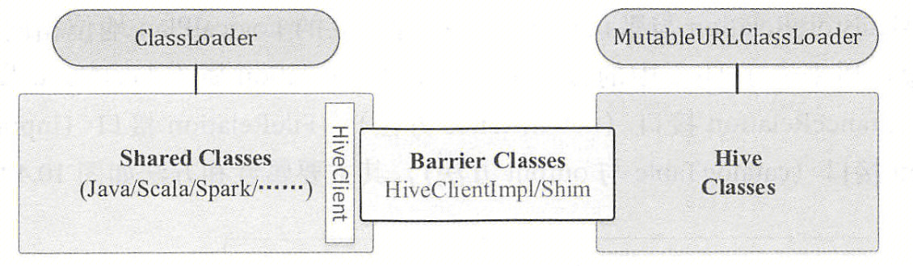


### 3.2.2 **Hive Analyzer 规则**

**HiveSessionStateBuilder 重写了父类 BaseSessionStateBuilder analyzer 属性，相比父类，其增加/减少了一些规则**。

```scala
HiveSessionStateBuilder
  // 重写父类BaseSessionStateBuilder analyzer属性
  override protected def analyzer: Analyzer = new Analyzer(catalogManager)
    // 重写Analyzer extendedResolutionRules规则。相比父类，增加了ResolveHiveSerdeTable规则
    // ResolveHiveSerdeTable规则：根据存储属性，确定Hive serde表的数据库、serde/format、schema
    override val extendedResolutionRules: Seq[Rule[LogicalPlan]] = new ResolveHiveSerdeTable(session) +: ...
    // 重写Analyzer postHocResolutionRules规则。相比父类，增加了DetermineTableStats、RelationConversions、HiveAnalysis规则
    // DetermineTableStats规则：获取Hive表的大小，用于广播操作。若获取失败，取参数spark.sql.defaultSizeInBytes的值（默认Long.MaxValue）
    // RelationConversions规则：将metastore relations转换为data source relations，以提高性能
    // HiveAnalysis规则：用专为Hive设计的特定变体替换通用操作
    override val postHocResolutionRules: Seq[Rule[LogicalPlan]] =  ... new DetermineTableStats(session) +: RelationConversions(catalog) ... HiveAnalysis +: ...
    // 重写extendedCheckRules规则。相比父类，减少了HiveOnlyCheck规则
    // HiveOnlyCheck规则：会遍历逻辑算子树，如果发现CreateTable类型的节点且对应的Catalog Table是Hive才能够提供的，则抛出AnalysisException异常，因此在Hive场景下，这条规则不再需要
    override val extendedCheckRules: Seq[LogicalPlan => Unit] = ...
```

Spark SQL 连接 Hive，最重要的是读数据与写数据，即 HiveTableScanExec 物理节点（后面介绍）与 InsertIntoHiveTable 逻辑节点。其中，InsertIntoHiveTable 类定义了一个 run 方法，该方法首先在 Hive 表目录下创建暂存目录**；然后依次调用 HadoopMapReduceCommitProtocol 类及子类的 setupJob、setupTask、commitTask、commitJob 方法完成数据文件的写入暂存目录，若中间 Task/Job 失败，则分别调用 abortTask、abortJob 中止**，**实际上，这些方法是通过调用 Hadoop API 中 OutputCommitter 类及子类的同名方法实现的（后面介绍）**；最后将暂存目录移动到表目录，移动前会清空表目录，但会排除其中的暂存目录。

实际上，**Spark 内部的插入有两种实现：InsertIntoHadoopFsRelationCommand、InsertIntoHiveTable，分别对应 Datasource 表和 Hive 表，一个表的类型取决于建表时的语法，若使用 using data_source 形式建表，则创建的是 DataSource 表；若使用 stored as file_format 形式建表，则创建的是 Hive 表，详见**[**官网**](https://spark.apache.org/docs/latest/sql-ref-syntax-ddl-create-table.html)**。另外如果是 orc/parquet 格式的 Hive 表，且开启了 spark.sql.hive.convertMetastoreParquet 或 spark.sql.hive.convertMetastoreOrc（两者默认均为 true）**，则会执行 Analyzer postHocResolutionRules 中的 RelationConversions 规则，该规则将元数据 Relation 转换为数据源 Relation，代表使用 Spark 内置的 Writer 和 Reader 进行序列化和反序列化，它具有更好的性能，因此**实际上还是使用 InsertIntoHadoopFsRelationCommand 来实现 orc/parquet 表的写入**。

```scala
// 这里详细介绍HiveAnalysis，从apply方法开始执行
HiveAnalysis
  apply()
    case InsertIntoStatement(...) => InsertIntoHiveTable(...)
      // 获取Hive表的存储路径
      val tableLocation = hiveQlTable.getDataLocation
      val hiveTempPath = new HiveTempPath(sparkSession, hadoopConf, tableLocation)
      // 用于将数据写入Hive表的命令。由于历史原因，这个类在很大程度上是一团糟（因为它以有机的方式演变，并且必须紧密遵循Hive的内部实现，而Hive本身也是一团糟）
      new InsertIntoHiveTable(..., hiveTempPath)
        // 将表中的所有行插入到Hive中，行对象会使用表定义提供的org.apache.hadoop.hive.serde2.SerDe和org.apache.hadoop.mapred.OutputFormat进行正确的序列化
        // 该方法的执行实际是由DataWritingCommandExec物理节点在doExecute方法中间接调用
        run(sparkSession: SparkSession, child: SparkPlan)
          // 在Hive 1.1之前，当向表中插入数据时，Hive会在一个公共的临时目录下创建一个暂存目录（参数hive.exec.scratchdir），在写入完成后，Hive会清空表目录并将暂存目录移动到其中
          // 在Hive 1.1之后，Hive会在表目录下创建暂存目录（参数hive.exec.stagingdir），并在将暂存目录移动到表目录时，仍然会清空表目录，但会排除其中的暂存目录
          val tmpLocation = hiveTmpPath.externalTempPath
            lazy val externalTempPath: Path = getExternalTmpPath(path)
               val stagingDir = hadoopConf.get("hive.exec.stagingdir", ".hive-staging")
               val scratchDir = hadoopConf.get("hive.exec.scratchdir", "/tmp/hive")
          // 创建暂存目录，即Hive表的存储目录
          hiveTmpPath.createTmpPath()
          // 处理插入
          processInsert(sparkSession, externalCatalog, hadoopConf, tmpLocation, child)
            val writtenParts = saveAsHiveFile(...)
              // 通过反射实例化FileCommitProtocol子类，抽象类FileCommitProtocol主要定义了6个子类应该实现的方法，方法用途下面介绍：
              // ①setupJob ②commitJob ③abortJob ④setupTask ⑤commitTask ⑥abortTask
              // 这里的类名由参数spark.sql.sources.commitProtocolClass决定，默认org.apache.spark.sql.execution.datasources.SQLHadoopMapReduceCommitProtocol
              // 继承关系：SQLHadoopMapReduceCommitProtocol -> HadoopMapReduceCommitProtocol -> FileCommitProtocol
              val committer = FileCommitProtocol.instantiate(...)
                val clazz = Utils.classForName[FileCommitProtocol](className)
              // 这个命令的基本工作流程如下：
              // ①Driver端的设置，包括output committer的初始化以及为即将发布的写入Job进行数据源特定的准备工作
              // ②发布一个写入Job，该Job由一个或多个Executor端Task组成，每个Task都会写入RDD分区中的所有行
              // ③如果Task没有抛出异常，则调用commitTask方法提交该Task；否则调用abortTask方法中止该Task；如果在Task提交过程中抛出任何异常，也会中止该Task
              // ④如果所有Task都已提交，则调用commitJob方法提交Job；否则调用abortJob方法中止Job；如果在Job提交过程中抛出任何异常，也会中止Job
              // ⑤如果Job成功提交，则执行后续的提交后操作，例如处理统计信息
              FileFormatWriter.write(..., committer = committer, ...)
                executeWrite(...)
                  writeAndCommit(job, description, committer) { ... }
                    // 子类复写，这里调用HadoopMapReduceCommitProtocol类的setupJob方法。注意这里有两层committer（其他方法类似）：
                    // 外层是HadoopMapReduceCommitProtocol，里层是Hadoop OutputCommitter，外层实际调用里层Hadoop API实现
                    committer.setupJob(job)
                      // 设置配置参数，用于Hadoop OutputCommitter提交Job或Task
                      jobContext.getConfiguration.set("mapreduce.job.id", jobId.toString)
                      jobContext.getConfiguration.set("mapreduce.task.id", taskAttemptId.getTaskID.toString)
                      jobContext.getConfiguration.set("mapreduce.task.attempt.id", taskAttemptId.toString)
                      jobContext.getConfiguration.setBoolean("mapreduce.task.ismap", true)
                      jobContext.getConfiguration.setInt("mapreduce.task.partition", 0)
                      // 子类复写，这里调用SQLHadoopMapReduceCommitProtocol类的setupCommitter方法
                      committer = setupCommitter(taskAttemptContext)
                        // 先调用父类HadoopMapReduceCommitProtocol获取committer
                        var committer = super.setupCommitter(context)
                        // 参数spark.sql.sources.outputCommitterClass，默认null，注意parquet格式会将该参数设置为ParquetOutputCommitter
                        val clazz = configuration.getClass(SQLConf.OUTPUT_COMMITTER_CLASS.key, null, classOf[OutputCommitter])
                        logInfo(s"Using user defined output committer class ${clazz.getCanonicalName}")
                        // 继承关系：ParquetOutputCommitter -> FileOutputCommitter，因此parquet格式符合判断条件，而textfile、orc格式不符合
                        if (classOf[FileOutputCommitter].isAssignableFrom(clazz))
                          val ctor = clazz.getDeclaredConstructor(classOf[Path], classOf[TaskAttemptContext])
                          // 动态分区时，committerOutputPath = {path}/.spark-staging-{jobId}，否则为{path}，其中{path}为Hive表的存储目录
                          val committerOutputPath = if (dynamicPartitionOverwrite) stagingDir else new Path(path)
                          // committerOutputPath作为参数传给Hadoop OutputCommitter
                          committer = ctor.newInstance(committerOutputPath, context)
                        // 日志中输出了使用的Hadoop OutputCommitter全限定类名
                        // parquet格式：org.apache.parquet.hadoop.ParquetOutputCommitter
                        // textfile、orc格式：org.apache.hadoop.mapreduce.lib.output.FileOutputCommitter
                        logInfo(s"Using output committer class ${committer.getClass.getCanonicalName}")
                      committer.setupJob(jobContext)
                    val ret = f
                      committer.onTaskCommit(res.commitMsg)
                    logInfo(s"Start to commit write Job ${description.uuid}.")
                    committer.commitJob(job, commitMsgs)
                    logInfo(s"Write Job ${description.uuid} committed. Elapsed time: $duration ms.")

            if (partition.nonEmpty)
              if (numDynamicPartitions > 0)
                // 加载数据到动态分区，HiveExternalCatalog重写了父类ExternalCatalog的方法
                externalCatalog.loadDynamicPartitions(...)
                  // 将新的动态分区加载到现有表中，HiveClientImpl重写了父类HiveClient的方法
                  client.loadDynamicPartitions(...)
                    shim.loadDynamicPartitions(...)
                      // 通过反射调用org.apache.hadoop.hive.ql.metadata.Hive类的loadDynamicPartitions方法，该方法将{finalTargetDir}目录（下面介绍）移动到Hive表的真正目录下
                      loadDynamicPartitionsMethod.invoke(...)
              // 加载数据到静态分区，HiveExternalCatalog重写了父类ExternalCatalog的方法，后续调用过程与上面类似
              else externalCatalog.loadPartition(...)
            // 加载数据到Hive表，HiveExternalCatalog重写了父类ExternalCatalog的方法，后续调用过程与上面类似
            else externalCatalog.loadTable(...)
          // 尝试删除暂存目录和其中的文件，如果删除失败，由于使用了deleteOnExit，这些文件在虚拟机正常终止时预计会被删除
          hiveTmpPath.deleteTmpPath()
```

**Hadoop FileOutputCommitter 有 V1 和 V2 两种不同的文件提交机制，由参数 [mapreduce.fileoutputcommitter.algorithm.version](https://hadoop.apache.org/docs/current/hadoop-mapreduce-client/hadoop-mapreduce-client-core/mapred-default.xml) 决定，该参数在 Hadoop 3.0 之前默认为 1，在 Hadoop 3.0 及之后默认为 2，详见[默认值说明](https://issues.apache.org/jira/browse/SPARK-32701)。注意，上层 Spark 为了保持兼容性，默认为 1，参考 [SPARK-33019](https://issues.apache.org/jira/browse/SPARK-33019)**。下面以 textfile 格式为例进行说明，其他格式类似，如 parquet、orc。

**1、FileOutputCommitter V1 文件提交机制：**需要经历两次 Rename 过程，每个 Task 先将数据写入到 Task 临时目录：`{finalTargetDir}/_temporary/{appAttemptId}/_temporary/{taskAttemptId}/`。等到 Task 完成数据写入后，执行 commitTask 方法做第一次 Rename，将数据文件从 Task 临时目录移动到 Task 最终输出目录：`{finalTargetDir}/_temporary/{appAttemptId}/{taskId}/`。最后，当所有 Task 都执行完 commitTask 方法后，由 Driver 负责执行 commitJob 方法做第二次 Rename，依次将 Job 临时目录下的各个 Task 目录中的数据文件，移动到 Job 最终输出目录：`{finalTargetDir}/`。

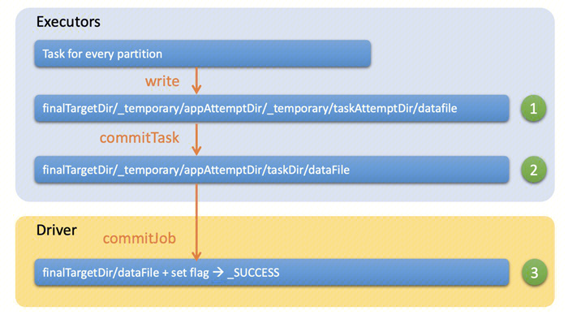

2、**FileOutputCommitter V2 文件提交机制：**只需要经历一次 Rename 过程，每个 Task 先将数据写入到 Task 临时目录：`{finalTargetDir}/_temporary/{appAttemptId}/_temporary/{taskAttemptId}/`。等到 Task 完成数据写入后，执行 commitTask 方法做一次 Rename，将数据文件从 Task 临时目录移动到 Job 最终输出目录：`{finalTargetDir}/`。最后，当所有 Task 都执行完 commitTask 方法后，由 Driver 负责执行 commitJob 方法，此时不需要做 Rename，只需要创建 _SUCCESS 标识文件，因为数据文件在 Task 执行完后就已经移动到 Job 最终输出目录了。

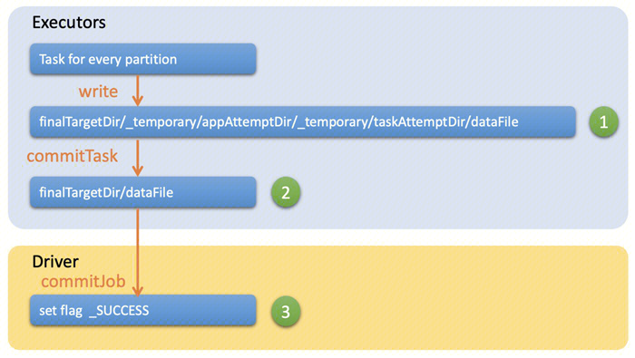

**FileOutputCommitter V1 和 V2 版本对比**：**V2 性能强于 V1，但 V1 数据一致性强于 V2，必要时根据场景进行选择**。

在性能上，V1 在 Task 结束后只是将输出文件拷到临时目录，然后在 Job 结束后才由 Driver 把这些文件再拷到输出目录。如果文件数量很多，Driver 就需要不断和 NameNode 做交互，而且这个过程是单线程的，因此势必会增加耗时。**如果碰到 Spark 所有 Task 结束，但是整体 Spark 作业还没结束，很可能就是 Driver 还在不断拷文件**。而 V2 在 Task 结束后直接将输出文件拷贝到输出目录，后面 Job 结束后 Driver 就不用再去拷贝了。因此，V2 性能强于 V1。

在数据一致性上，V1 在 Job 结束后才批量拷文件，其实就是两阶段提交，它可以保证数据要么全部展示给用户，要么都不展示（**当然，在拷贝过程中也无法保证完全的数据一致性，但是这个时间一般来说不会太长**），如果 Job/Task 失败，可以直接删除 _temporary 目录，较好的保证数据一致性。而 V2 在 Task 结束后就拷文件，如果部分 Task 执行成功，而此时 Job 执行失败，就会出现一部分数据对外可见，也就是出现了脏数据，需要数据消费者根据是否新生成了 _SUCCESS 标识文件来判断数据的完整性。 因此，V1 数据一致性强于 V2。

```scala
// 以下是Hadoop代码，继承关系：FileOutputCommitter -> PathOutputCommitter -> OutputCommitter
// 抽象类OutputCommitter同样定义了6个子类应该实现的方法：①setupJob ②commitJob ③abortJob ④setupTask ⑤commitTask ⑥abortTask
FileOutputCommitter
  // 设置Job临时输出目录
  setupJob(...)
    // 创建Job临时目录，该目录是所有Task工作目录的根目录：{finalTargetDir}/_temporary/{appAttemptId}/
    // 动态分区时，{finalTargetDir} = {path}/.spark-staging-{jobId}，否则为{path}，其中{path}为Hive表的存储目录
    Path jobAttemptPath = getJobAttemptPath(context)
      getJobAttemptPath(context, getOutputPath())
        getJobAttemptPath(getAppAttemptId(context), out)
          new Path(getPendingJobAttemptsPath(out), String.valueOf(appAttemptId))
            new Path(out, PENDING_DIR_NAME)
              final String PENDING_DIR_NAME = "_temporary"
    fs.mkdirs(jobAttemptPath)

  // 设置Task临时输出目录。这里不执行任何操作，因为Task临时目录是在Task写入时按需创建的
  setupTask(...)

  // 将Task临时输出目录提交为Task最终输出目录
  commitTask(...)
    // 获取Task临时输出目录：{finalTargetDir}/_temporary/{appAttemptId}/_temporary/{taskAttemptId}/
    taskAttemptPath = getTaskAttemptPath(context)
      new Path(getPendingTaskAttemptsPath(context), String.valueOf(context.getTaskAttemptID()))
        getPendingTaskAttemptsPath(context, getOutputPath())
          new Path(getJobAttemptPath(context, out), PENDING_DIR_NAME)
    // algorithmVersion由参数mapreduce.fileoutputcommitter.algorithm.version决定，
    // Hadoop 3.0之前默认为1，Hadoop 3.0及之后默认为2。注意，上层Spark为了保持兼容性，默认为1，参考SPARK-33019
    if (algorithmVersion == 1)
      // 获取Task最终输出目录：{finalTargetDir}/_temporary/{appAttemptId}/{taskId}/
      Path committedTaskPath = getCommittedTaskPath(context)
        getCommittedTaskPath(getAppAttemptId(context), context)
          new Path(getJobAttemptPath(appAttemptId), String.valueOf(context.getTaskAttemptID().getTaskID()))
      // 删除Task最终输出目录
      fs.delete(committedTaskPath, true)
      // 将Task临时目录重命名为最终输出目录
      // 即：{finalTargetDir}/_temporary/{appAttemptId}/_temporary/{taskAttemptId}/ => {finalTargetDir}/_temporary/{appAttemptId}/{taskId}/
      fs.rename(taskAttemptPath, committedTaskPath)
    // algorithmVersion不为1，直接将Task临时目录中的所有内容合并到Job最终输出目录，这里outputPath即为{finalTargetDir}
    // 即：{finalTargetDir}/_temporary/{appAttemptId}/_temporary/{taskAttemptId}/ => {finalTargetDir}/
    else mergePaths(fs, taskAttemptDirStatus, outputPath, context, null)

  // 将Job临时输出目录提交为Job最终输出目录
  commitJob(...)
    commitJobInternal(context)
      // 仅当algorithmVersion为1时，将所有已提交的Task的内容移动到Job最终输出目录
      // 即：{finalTargetDir}/_temporary/{appAttemptId}/{taskId}/ => {finalTargetDir}/
      if (algorithmVersion == 1)
        // 获取Job临时目录
        getAllCommittedTaskPaths(context)
          Path jobAttemptPath = getJobAttemptPath(context)
        // 将Job临时目录下的所有内容合并到Job最终输出目录，mergePaths递归实现，如果源路径是目录，则递归取其中文件
        mergePaths(fs, stat, finalOutput, context, null)
      // 删除{finalTargetDir}/_temporary/临时目录
      cleanupJob(context)
      // 如果Job要求在成功完成后标记output.dir，则返回true（默认）
      if (context.getConfiguration().getBoolean(SUCCESSFUL_JOB_OUTPUT_DIR_MARKER, true))
        // 创建{finalTargetDir}/_SUCCESS文件，标记Job成功完成
        Path markerPath = new Path(outputPath, SUCCEEDED_FILE_NAME)
        fs.create(markerPath)
```

上面介绍使用的变量 `{finalTargetDir}` 在不同格式中略有不同，在 textfile 格式中，`{finalTargetDir} = /usr/hive/warehouse/{database}/{table}/.hive-staging_hive_*/-ext-10000/`；在 parquet 和 orc 格式中，`{finalTargetDir} = /usr/hive/warehouse/{database}/{table}/.spark-staging-{jobId}/`。那么 `{finalTargetDir}` 是如何被移动到 Hive 表的真正目录下呢？这个工作是在 processInsert 方法调用完 saveAsHiveFile 方法之后，最终通过反射调用 org.apache.hadoop.hive.ql.metadata.Hive 类的 loadDynamicPartitions 方法完成的，这里不再详细介绍。**最后以 textfile 格式为例，展示动态插入 Hive 分区表时目录的变化，便于理解**。

```scala
// 每个Task写Task临时目录：{finalTargetDir}/_temporary/{appAttemptId}/_temporary/{taskAttemptId}/
// dt=2023-01-07表示Hive分区目录（其中之一），part-00199-c062f3ab-2472-4da3-ac77-4fa8d7c199dd.c000表示数据文件（其中之一）
/usr/hive/warehouse/poc.db/sample_ec/.hive-staging_hive_2024-06-02_08-25-29_012_5427557028335802730-1/-ext-10000/_temporary/0/_temporary/attempt_202406020826136965231695911815854_0002_m_000199_399/dt=2023-01-07/part-00199-c062f3ab-2472-4da3-ac77-4fa8d7c199dd.c000

// V1版本Task提交至Task最终目录：{finalTargetDir}/_temporary/{appAttemptId}/{taskId}/
/usr/hive/warehouse/poc.db/sample_ec/.hive-staging_hive_2024-06-02_08-25-29_012_5427557028335802730-1/-ext-10000/_temporary/0/task_202406020826136965231695911815854_0002_m_000199/dt=2023-01-07/part-00199-c062f3ab-2472-4da3-ac77-4fa8d7c199dd.c000

// V1版本Job提交至Job最终目录（V2版本Task直接提交至Job最终目录）：{finalTargetDir}/
/usr/hive/warehouse/poc.db/sample_ec/.hive-staging_hive_2024-06-02_08-25-29_012_5427557028335802730-1/-ext-10000/dt=2023-01-07/part-00199-c062f3ab-2472-4da3-ac77-4fa8d7c199dd.c000

// 反射调用org.apache.hadoop.hive.ql.metadata.Hive类的loadDynamicPartitions方法
/usr/hive/warehouse/poc.db/sample_ec/dt=2023-01-07/part-00199-c062f3ab-2472-4da3-ac77-4fa8d7c199dd.c000
```

 

### 3.2.3 Hive Optimizer 规则

**HiveSessionStateBuilder 重写了父类 BaseSessionStateBuilder customEarlyScanPushDownRules 方法，该方法返回的规则由父类添加到 SparkOptimizer 的 earlyScanPushDownRules 规则中**。

```scala
HiveSessionStateBuilder
  // 重写父类BaseSessionStateBuilder customEarlyScanPushDownRules方法，该方法返回的规则由父类添加到SparkOptimizer的earlyScanPushDownRules规则中
  override def customEarlyScanPushDownRules: Seq[Rule[LogicalPlan]]
    // 使用[[HiveTableRelation]]上的分区过滤器来裁剪Hive表的分区，被裁剪的分区将保留在[[HiveTableRelation.prunedPartitions]]中，并且基于裁剪的分区更新Hive表关系的统计信息
    // 这对于某些Spark策略（例如[[org.apache.spark.sql.execution.SparkStrategies.JoinSelection]]）非常有用
    Seq(new PruneHiveTablePartitions(session))
```

 

### 3.2.4 Hive SparkPlanner 策略

**HiveSessionStateBuilder 重写父类BaseSessionStateBuilder planner属性，相比父类，其增加一些策略**。

```scala
HiveSessionStateBuilder
  // 重写父类BaseSessionStateBuilder planner属性
  override protected def planner: SparkPlanner
    new SparkPlanner(session, experimentalMethods) with HiveStrategies
      // 重写SparkPlanner extraPlanningStrategies策略。相比父类，增加了HiveTableScans、HiveScripts策略
      override def extraPlanningStrategies: Seq[Strategy]
        // HiveTableScans策略：使用HiveTableScan检索Hive表数据，还会检测和应用分区裁剪谓词
        // HiveScripts策略：应用于SQL脚本的场景，比较少见
        super.extraPlanningStrategies ++ customPlanningStrategies ++ Seq(HiveTableScans, HiveScripts)
```

其中，HiveTableScans 策略生成负责读 Hive 表数据的 HiveTableScanExec 叶子节点，该节点最终调用 HadoopTableReader 类的相关方法生成 HadoopRDD/NewHadoopRDD 来处理输入数据。HadoopRDD/NewHadoopRDD 继承自 RDD 抽象类，重写了其中的 getPartitions 方法，以 HadoopRDD 为例，该方法首先调用 Hadoop API 获取目录下所有文件的切片列表，然后过滤掉空切片，最后一对一构造 RDD 分区。HadoopRDD FileInputFormat 切片大小计算公式为 `Math.max(minSize, Math.min(maxSize, blockSize))`，**默认切片大小等于数据块大小，如果需要调小切片，则将 maxSize（参数 mapreduce.input.fileinputformat.split.maxsize）设置比 blockSize 小；如果需要调大切片，则将 minSize（参数 mapreduce.input.fileinputformat.split.minsize）设置比 blockSize 大**。

也就是说，**初始 HadoopRDD 的分区个数 = 目录下所有文件的切片个数 - 空切片的个数 ≈ 目录下所有文件的 Block 数据块个数（文件可切片时） 或目录下所有文件的个数（文件不可切片时）**。注意，**切片时不考虑数据集整体，而是针对每一个文件单独切片，如果小文件很多（小于 blockSize 的文件将直接作为一个 RDD 分区），那么初始 RDD 的分区数也会很多，进而影响性能**。

**NewHadoopRDD 略有不同，FileInputFormat 切片大小计算公式为 `Math.max(minSize, Math.min(goalSize, blockSize))`，其中 `goalSize = totalSize / numSplits`，totalSize 表示当前 JobConf input paths 下所有文件长度，注意不是全表。numSplits 表示调用方传进来的目标 split 数，默认为 2（参考：Spark HadoopTableReader 类 _minSplitsPerRDD 属性计算）**。

```scala
// 这里详细介绍HiveTableScans，从apply方法开始执行
HiveTableScans
  apply()
    // Hive表扫描操作符，列和分区裁剪都会被处理
    HiveTableScanExec(...)
      doExecute()
        // 若Hive表没有定义分区，则调用makeRDDForTable方法
        if (!relation.isPartitioned)
          // 注意hadoopReader对象，实例化时有个TableDesc参数。TableDesc是Hive中的类，指定了表的inputFormatClass、outputFormatClass
          // 可简单理解对应desc formatted <table>语句输出的表描述属性InputFormat、OutputFormat，详见Hive中Table类的getInputFormatClass方法
          hadoopReader.makeRDDForTable(hiveQlTable)
            // 创建一个HadoopRDD，从目标表的数据目录中读取数据，返回一个包含反序列化行的转换后的RDD
            makeRDDForTable(...)
              // 创建RDD的入口，使用哪个HadoopRDD将由表的输入格式决定，表的输入格式可使用：DESCRIBE FORMATTED table 查看
              // NewHadoopRDD的输入格式来自org.apache.hadoop.mapreduce包，而HadoopRDD的输入格式来自org.apache.hadoop.mapred包
              val hadoopRDD = createHadoopRDD(localTableDesc, inputPathStr)
                createNewHadoopRDD(localTableDesc, inputPathStr)
                  createNewHadoopRDD(inputFormatClass, newJobConf)
                    // 继承关系：NewHadoopRDD -> RDD。抽象类RDD定义了5个子类应该实现的方法：①compute方法：用于计算给定的分区 
                    // ②getPartitions方法：返回此RDD中的分区集合，该方法只会被调用一次，因此可以在其中实现耗时的计算 ③getDependencies方法：返回此RDD依赖于哪些父RDD
                    // ④getPreferredLocations方法：根据节点状态，选择合适的节点放置给定的分区 ⑤当数据为KV类型数据时，可通过设定分区器自定义数据的分区
                    val rdd = new NewHadoopRDD(...)
                      // 这里详细介绍getPartitions方法，探究初始NewHadoopRDD的分区是如何生成的
                      getPartitions
                        // 实例化inputFormatClass，以org.apache.hadoop.mapreduce.lib.input.TextInputFormat为例，注意区分老版本org.apache.hadoop.mapred.TextInputFormat
                        val inputFormat = inputFormatClass.getConstructor().newInstance()
                        // 实际调用父类FileInputFormat的getSplits方法，继承关系：TextInputFormat -> FileInputFormat -> InputFormat
                        val allRowSplits = inputFormat.getSplits(new JobContextImpl(_conf, jobId)).asScala
                          // 以下是Hadoop代码，以org.apache.hadoop.mapreduce.lib.input.FileInputFormat类的getSplits方法为例
                          getSplits()
                            // max函数，前者直接返回1，后者由参数mapreduce.input.fileinputformat.split.minsize决定，默认1
                            long minSize = Math.max(getFormatMinSplitSize(), getMinSplitSize(job))
                            // 参数mapreduce.input.fileinputformat.split.maxsize，默认Long.MAX_VALUE
                            long maxSize = getMaxSplitSize(job)
                            // 对目录下的每一个文件尝试切片
                            for (FileStatus file: files)
                              // 由子类TextInputFormat复写，若文件未压缩，或文件压缩类是SplittableCompressionCodec子类，则可切片
                              if (isSplitable(job, path))
                                // 获取Block块的大小，默认128M
                                long blockSize = file.getBlockSize()
                                // 切片大小计算公式：Math.max(minSize, Math.min(maxSize, blockSize))，默认切片大小=数据块大小
                                long splitSize = computeSplitSize(blockSize, minSize, maxSize)
                                // 对于每个文件，每次切片时，判断剩余部分（初始为文件大小）是否大于切片大小的1.1倍，如果不大于则划分为一个切片
                                // 如果划分为两个，Hadoop则需要开启两个MapTask任务，它们处理数据不均，很可能比划分为一个切片效率低
                                while (((double) bytesRemaining)/splitSize > SPLIT_SLOP) { splits.add(makeSplit(...)) }
                              // 文件不可切片，整个文件作为一个切片
                              else splits.add(makeSplit(...))
                        // 初始NewHadoopRDD的分区个数，即上面Hadoop切片过滤掉空切片后的个数
                        val result = new Array[Partition](rawSplits.size)
                        
        // 否则，Hive表定义了分区，调用makeRDDForPartitionedTable方法
        else hadoopReader.makeRDDForPartitionedTable(prunedPartitions)
          // 为查询中指定的每个分区键创建一个HadoopRDD。注意，对于存储在磁盘上的Hive表，为每个使用PARTITION BY指定的分区键创建一个数据目录
          makeRDDForPartitionedTable(...)
            // 逻辑与上面相同
            createHadoopRDD(...)
```

与上面的写数据类似，**如果是 orc/parquet 格式的 Hive 表，且开启了 spark.sql.hive.convertMetastoreParquet 或 spark.sql.hive.convertMetastoreOrc（两者默认均为 true），则会使用 FileSourceScanExec 生成 FileScanRDD，而非使用 HiveTableScanExec 生成 HadoopRDD/NewHadoopRDD。这里 FileScanRDD 每个 RDD 分区对应 maxSplitBytes 大小的数据，文件不足 maxSplitBytes 直接作为一个 RDD 分区**，maxSplitBytes 计算方式为 `Math.min(defaultMaxSplitBytes, Math.max(openCostInBytes, bytesPerCore))`，可通过参数 spark.sql.files.maxPartitionBytes（默认 128M）、spark.sql.files.openCostInBytes（默认 4M）、spark.default.parallelism（默认为所有 Executor Core 总数）进行调整。注意，**一个 RDD 包括多个分区（区别于 Hive 分区，不是一个概念），每个分区对应一个 Task，一个 Executor 并行处理多个 Task，线程数决定并行度**。

以 ORC 格式为例，文件切分 RDD 分区后，**Spark 底层调用原生的 ORC API（参考** [**https://orc.apache.org/docs/core-java.html**](https://orc.apache.org/docs/core-java.html)**）读取数据，ORC 继续调用 Hadoop 抽象接口进行读取，其具体实现可以是 JuiceFs、HDFS、COS 等**。具体地，第一步，Spark 调用 OrcColumnarBatchReader 类的 initialize 方法创建 ReaderImpl，它在读取完整个 ORC 文件的元数据后，就会调用 rows 方法返回 RecordReader，负责读取里面的数据。第二步，Spark 调用 OrcColumnarBatchReader 类的 initBatch 方法，通过设置所需的 schema 和分区信息来初始化列批（columnarBatch），列批将在第四步的 next 方法中返回并进行后续处理。第三步，Spark 调用 RecordReader 的 nextBatch方法，负责实际的数据读取，具体的读取细节就需要查看 ORC 原生代码，建议先了解 ORC 格式的存储原理，参考以下两篇文章：[深入理解 ORC 文件结构](https://blog.csdn.net/qq_33588730/article/details/122930638)、[ORC 官网](https://orc.apache.org/specification/ORCv2/)。

注意，ORC JAR 分为 Hive ORC 和原生 ORC，默认原生 ORC（参数 `spark.sql.orc.impl`，默认 native）。Hive ORC 可以适应 Hive 中的所有数据类型和复杂嵌套结构，这是原生 ORC 没法实现的。但在性能方面，比如数据读取和过滤操作上，原生 ORC 更具优势。

```scala
// 继承关系：FileSourceScanExec -> FileSourceScanLike -> DataSourceScanExec -> LeafExecNode -> SparkPlan
FileSourceScanExec
  // orc/parquet列式存储，调用doExecuteColumnar；行式存储调用doExecute，相比少了scanTime指标
  doExecuteColumnar()
    // 监控指标（number of output rows）：输出行
    val numOutputRows = longMetric("numOutputRows")
    // 监控指标（scan time）：扫描数据耗时
    val scanTime = longMetric("scanTime")
    // inputRDD实际是列批ColumnarBatch
    inputRDD.asInstanceOf[RDD[ColumnarBatch]]
      lazy val inputRDD: RDD[InternalRow] = { ... }
        // readFile函数实际是OrcFileFormat/ParquetFileFormat类的buildReaderWithPartitionValues方法
        val readFile: (PartitionedFile) => Iterator[InternalRow] = relation.fileFormat.buildReaderWithPartitionValues(...)
        // 表分桶时，返回的每个RDD分区应包含所有给定的Hive分区中具有相同桶ID的所有文件，即RDD分区数为桶个数
        val readRDD = if (bucketedScan) createBucketedReadRDD(...)
        // 表不分桶时
        else createReadRDD(readFile, ...)
          // 参数：spark.sql.files.openCostInBytes，默认4M
          val openCostInBytes = fsRelation.sparkSession.sessionState.conf.filesOpenCostInBytes
          // 公式：Math.min(defaultMaxSplitBytes, Math.max(openCostInBytes, bytesPerCore))
          // 真实场景下（文件大于128M且数量明显多于core时），maxSplitBytes为128M，INFO日志有输出
          val maxSplitBytes = FilePartition.maxSplitBytes(...)
            // totalBytes为分区下所有文件的(length + opencostbyte)
            val totalBytes = selectedPartitions.flatMap(_.files.map(_.getLen + openCostInBytes)).sum
            // minPartitionNum依次选择的为spark.sql.files.minPartitionNum（默认空）、spark.sql.leafNodeDefaultParallelism（默认空）
            // spark.default.parallelism（默认空）、max(totalCoreCount.get(), 2)，totalCoreCount为所有Executor Core总数
            val bytesPerCore = totalBytes / minPartitionNum
            // defaultMaxSplitBytes为参数spark.sql.files.maxPartitionBytes，默认128M
            Math.min(defaultMaxSplitBytes, Math.max(openCostInBytes, bytesPerCore))
          logInfo(s"Planning scan with bin packing, max size: $maxSplitBytes bytes, " +
            s"open cost is considered as scanning $openCostInBytes bytes.")
          // 初步划分：当文件可分割时（orc/parquet可分割），对每个文件进行分割，每一个maxSplitBytes为一个partitionedFile，
          // 若文件小于maxSplitBytes，则一个文件一个partitionedFile；若文件不可分割（如tgz），则一个文件一个partiiiton
          val splitFiles = selectedPartitions.flatMap { ... PartitionedFileUtil.splitFiles(...) }
          // 使用next fit近似算法将x个partitionedFile分配到y个partititon中
          val partitions = FilePartition.getFilePartitions(relation.sparkSession, splitFiles, maxSplitBytes)
          // 返回FileScanRDD，每个RDD分区对应maxSplitBytes大小的数据，文件不足maxSplitBytes直接作为一个RDD分区
          new FileScanRDD(..., readFile, partitions, ...)

    inputRDD.asInstanceOf[RDD[ColumnarBatch]].mapPartitionsInternal { ... }
      hasNext
        val startNs = System.nanoTime()
        // FileScanRDD返回一个迭代器，该迭代器在hasNext调用时扫描文件，即调用FileScanRDD类的hasNext方法
        val res = batches.hasNext
          // 第一次调用nextIterator方法初始化currentIterator，后面调用currentIterator.hasNext方法
          (currentIterator != null && currentIterator.hasNext) || nextIterator()
            logInfo(s"Reading File $currentFile")
            // currentIterator实际为RecordReaderIterator迭代器
            currentIterator = readCurrentFile()
              // 即上面定义的readFile，实际调用OrcFileFormat/ParquetFileFormat类的buildReaderWithPartitionValues方法
              readFunction(currentFile)
                // 以OrcFileFormat为例，传入currentFile，返回Iterator迭代器（RecordReaderIterator）
                (file: PartitionedFile) => { ... }
                  // ORC读取过滤下推，orcFilterPushDown为参数spark.sql.orc.filterPushdown，默认为true
                  if (orcFilterPushDown && filters.nonEmpty)
                    OrcInputFormat.setSearchArgument(...)
                  // 文件分片的路径、起始位置、长度等
                  val fileSplit = new FileSplit(filePath, file.start, file.length, Array.empty)
                  // capacity为参数spark.sql.orc.columnarReaderBatchSize，默认4096
                  val batchReader = new OrcColumnarBatchReader(capacity)
                  // 返回的实际迭代器为RecordReaderIterator
                  val iter = new RecordReaderIterator(batchReader)
                    // 初始化currentIterator后，后面调用currentIterator.hasNext方法，将直接执行这里
                    hasNext
                      // rowReader实际为OrcColumnarBatchReader
                      rowReader.nextKeyValue
                        // 通过从ORC VectorizedRowBatch列复制到Spark ColumnarBatch列来准备下一批批次
                        nextBatch()
                          // 【3】底层调用原生ORC API进行读取，读取细节查看RecordReaderImpl实现类的nextBatch方法
                          // 底层会调用Hadoop抽象接口，调用链：advanceToNextRow -> advanceStripe -> readStripe -> pickRowGroups
                          // -> readCurrentStripeRowIndex -> planner.readRowIndex -> dataReader.readFileData -> 
                          // RecordReaderUtils.readDiskRanges -> chunkReader.readRanges -> file.readFully -> read
                          // 最后的file类型为：org.apache.hadoop.fs.FSDataInputStream，子类可实现自己的read方法
                          recordReader.nextBatch(wrap.batch())
                  // 【1】初始化ORC文件reader和batch record reader，可参考ORC官网：https://orc.apache.org/docs/core-java.html
                  batchReader.initialize(...)
                    // 读取操作从ReaderImpl类开始，它在读取完整个文件的元数据后，就会调用rows返回RecordReader，负责读取里面的数据
                    Reader reader = OrcFile.createReader(...)
                    // 初始化recordReader，实际为org.apache.orc.impl.RecordReaderImpl
                    recordReader = reader.rows(options)
                      LOG.info("Reading ORC rows from " + path + " with " + options)
                      return new RecordReaderImpl(this, options)
                  // 【2】通过设置所需的schema和分区信息来初始化列批（columnarBatch）
                  batchReader.initBatch(...)
                    orcVectorWrappers[i] = OrcColumnVectorUtils.toOrcColumnVector(dt, wrap.batch().cols[colId])
                    columnarBatch = new ColumnarBatch(orcVectorWrappers)
        // 监控指标累加计数
        scanTime += NANOSECONDS.toMillis(System.nanoTime() - startNs)
      next()
        // 与hasNext一样，实际调用FileScanRDD类的next方法
        val batch = batches.next()
          // currentIterator实际为hasNext定义的RecordReaderIterator迭代器
          val nextElement = currentIterator.next()
            // 【4】rowReader实际为OrcColumnarBatchReader，返回读取的列批（columnarBatch）
            rowReader.getCurrentValue
              return columnarBatch
        // 监控指标累加计数
        numOutputRows += batch.numRows()
```

 

 

## 3.3 Spark SQL 与 Hive 数据类型

当不同系统之间涉及数据交互时，数据类型的映射和转换是一个不可避免的问题。同样的，在 Spark SQL 连接 Hive 的场景下，Catalyst 中定义的数据类型与 Hive 中数据类型的互相转换是一个重要的需求。在 Spark SQL 的 Hive 模块下，**由 Hivelnspectors 负责 Catalyst 与 Hive 数据类型的转换，具体包括四个方面的功能**：

- **数据解封（Data Unwrapping），将 Hive 中的数据类型转换为 Catalyst 中的数据类型，称为 unwrap 操作**
- **数据封装（Data Wrapping），将 Catalyst 中的数据类型转换为 Hive 中的数据类型，称为 wrap 操作**
- **将 Catalyst 中的数据绑定相应的 Objectlnspector 对象，对应 DataTypeTolnspector 操作**
- **从 ObjectInspector 对象中提取 Catalyst 数据，对应 InspectorToDataType 操作**

总的来讲，**目前 Spark SQL 与 Hive 之间的数据映射转换在功能上除不支持 Hive 中的 HiveVarchar/HiveChar 类型和 Union 类型外**，基本能够满足各种场景的需求。

### 3.3.1 DataTypeTolnspector 与 Data Wrapping

Hive 中的数据类型比较完善，不仅支持基本的数据类型，还支持集合数据类型（如 Map、Struct 和 Array 等）。SerDe 是 Hive 中用来实现数据序列化和反序列化的框架，构建在数据存储和执行引擎之间，能够实现数据存储与执行引擎之间的解耦。**SerDe 体系中提供了一个辅助类 Objectlnspector，可帮助使用者访问需要序列化或反序列化的对象**。因此，**从 Catalyst 数据类型转换为 Hive 数据类型，需要得到对应的 Objectlnspector 对象，然后实现数据封装操作**。

1、数据类型（DataType）到 Objectlnspector 的映射过程，在 Hivelnspectors 类中由 toInspector(dataType: DataType) 方法完成，例如，Catalyst 中的 MapType 数据类型，对应 Hive 中的 StandardMapObjectlnspector 对象。除支持直接从 DataType 得到 Objectlnspector 对象外，Hivelnspectors 类还实现了 toInspector(expr: Expression) 方法，支持从 Expression 得到 Objectinspector 对象，对应三种不同的情况。

- Literal 类型的表达式，例如 expr 为 Literal(value, DoubleType)，那么可以确定数据类型为 DoubleType。
- 可折叠（foldable）表达式，用 expr 执行后的结果创建 Literal，然后重复上面的情况。
- 非常量表达式，根据 expr.dataType 进行判断。

2、当有了 Datalype 与 Objectlnspector 后，就可以得到数据封装的函数了。在 HiveInspectors 类中具体实现为 wrapperFor(oi: ObjectInspector, dataType: DataType) 方法，返回类型为 Any => Any 的函数。wrapperFor 根据 ObjectInspector 与 DataType 的类型进行相应处理。最后 wrap(a: Any, oi: ObjectInspector, dataType: DataType)  基于 wrapperFor 进行 Spark SQL 的数据封装，直接根据 oi 与 dataType 得到对应的封装函数，然后将 a 作为封装函数的输入。

 

### 3.3.2 InspectorToDataType 与 Data Unwrapping

从 Hive 数据转换为 Spark SQL 数据对应数据的解封装，具体有两种操作：

1、根据 Hive 中的 ObjectInspector 确定 Spark SQL 中的数据类型，直接枚举所有情况即可，具体实现参见 inspectorToDataType 方法。

2、根据 Hive 中的 Objectlnspector 得到数据解封装函数，在 Hivelnspectors 类中实现为 unwrapperFor(objectInspector: ObjectInspector)  方法，返回类型同样是 Any => Any 的函数，该方法严格遵循以下顺序：

- 常量（ConstantObjectInspector） 且为 null，返回 null。
- 常量（ConstantObjectInspector），根据 ObjectInspector 提取其中的数据。
- 如果 Objectlnspector 倾向于获取 Writable 类型（preferWritable），那么首先得到 Writable 类型的数据，然后转换为 Catalyst 中的数据，否则直接由 ObjectInspector 得到 Java 数据类型。

 

## 3.4 Hive UDF 管理机制

**Hive UDF、UDAF 和 UDTF 与 Spark SQL 表达式的对应关系如表所示**。以 HiveSimpleUDF 类为例，其构造参数有三个，分别是函数名、根据 UDF 类 clazz 得到的 HiveFunctionWrapper 和 UDF 输入参数。HiveFunctionWrapper 实现了对 Hive 中 UDF 函数的封装，在 Spark SQL 的 Hive UDF 管理中起着重要作用。为何要用 FunctionWrapper 呢？这和 Hive 不同版本 UDF 的实现机制有关。Hive 0.12.0 及其之前的版本，都可以直接在 Executor 节点上创建一个新的 UDF 对象，而从 Hive 0.13.1 版本开始，**UDF 对象需要在 Driver 节点上创建完成初始化，然后进行序列化，最后在 Executor 节点上执行反序列化操作**。然而，并非所有的对象都是可序列化的，例如，GenericUDF 类就没有实现 Serializable 接口。在 Hive 中，为解决这个问题，引入了 Kryo 和 XML 序列化的方式。相应的，在 Spark SQL 中，FunctionWrapper 负责完成这部分功能。

| **Hive**                    | **Spark SQL**    | **对应父类**        |
| :-------------------------- | :--------------- | :------------------ |
| UDF                         | HiveSimpleUDF    | Expression          |
| GenericUDF                  | HiveGenericUDF   |                     |
| UDTF                        | HiveGenericUDTF  | Generator           |
| AbstractGenericUDAFResolver | HiveUDAFFunction | ImperativeAggregate |
| UDAF                        |                  |                     |

如图所示，HiveFunctionWrapper 主要实现了三个方法。其中，writeExternal 与 readExternal 方法对应 Externalizable 接口，用于 Driver 端序列化与 Executor 反序列化操作。基于性能的考虑，序列化与反序列化功能的实现使用的是 Kryo 框架。需要注意的是，由于实现层面的考虑，这里的 Kryo 直接采用 Hive 中的 Utilities.runtimeSerializationKryo，而并非 Spark 本身的。另一个比较重要的方法是 createFunction，用来加载 UDF 相应的类，该方法在 HiveSimpleUDF、HiveGenericUDF、HiveGenericUDTF 和 HiveUDAFFunction 类中都用到了。以 HiveSimpleUDF 为例，通过 createFunctionUDF 得到对应的 function 对象。在 HiveSimpleUDF 执行的 eval 方法中，直接通过 Hive 中的 FunctionRegistry 调用 function 处理传入的数据。

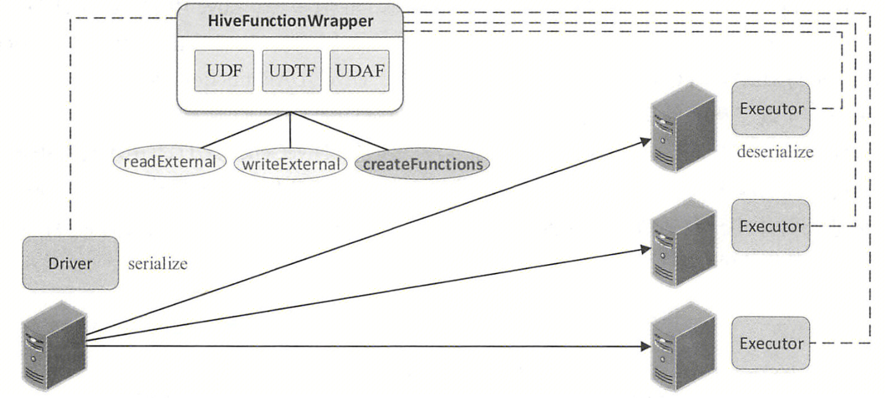


 

# 参考

1. 《Spark SQL 内核剖析》
2. [每个 Spark 工程师都应该知道的五种 Join 策略](https://www.iteblog.com/archives/9870.html)
3. [Spark SQL 五大关联策略](https://developer.jdcloud.com/article/3580)
4. [Spark 源码分析之分区（Partition）](https://blog.csdn.net/oTengYue/article/details/106134533)
5. [剖析 Spark 数据分区之 Spark RDD 分区](https://segmentfault.com/a/1190000021297920)
6. [Spark 读取 orc 文件原理解析](https://blog.csdn.net/qq_37527921/article/details/107939482)
7. [Spark 小文件合并功能在 AWS S3 上的应用与实践](https://aws.amazon.com/cn/blogs/china/application-and-practice-of-spark-small-file-merging-function-on-aws-s3/)
8. [Hadoop 官网 - mapred-default.xml](https://hadoop.apache.org/docs/current/hadoop-mapreduce-client/hadoop-mapreduce-client-core/mapred-default.xml)
9. [Spark InsertIntoHiveTable 如何 commit 结果数据](https://www.jianshu.com/p/01ab5f0f22df)


