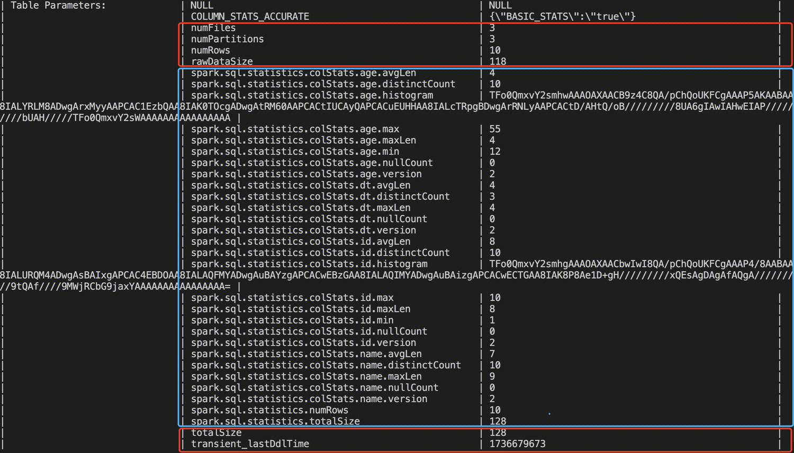
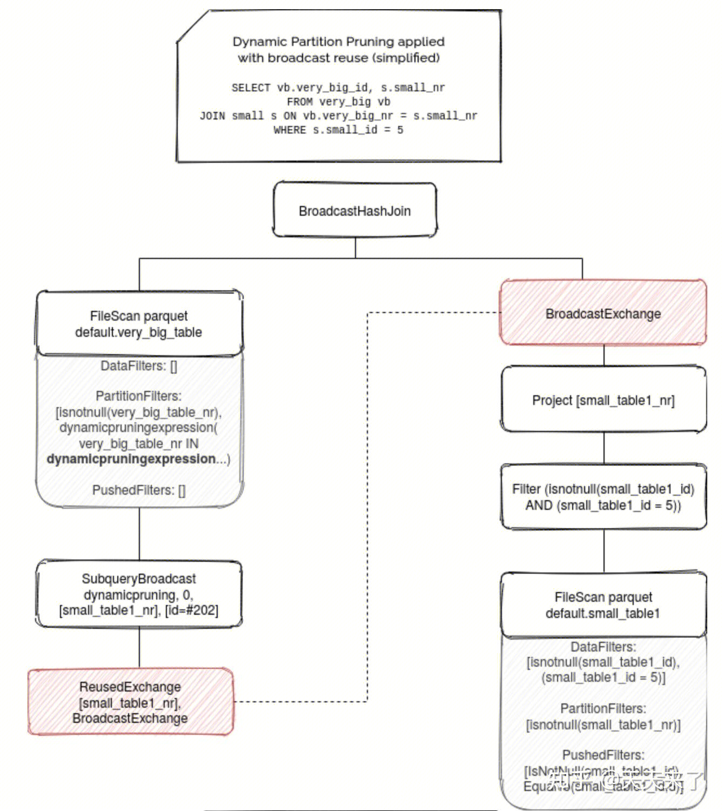
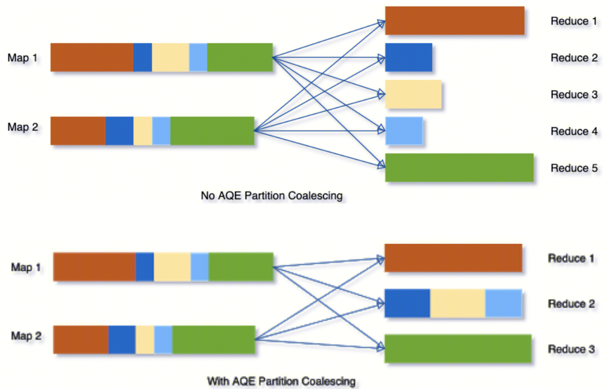
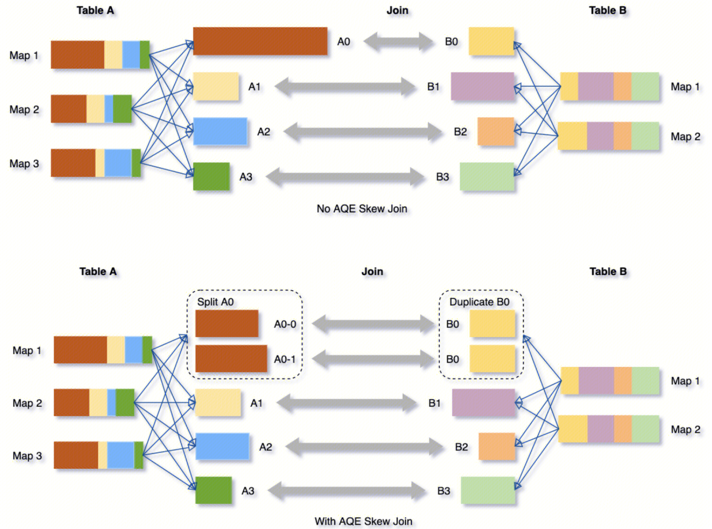
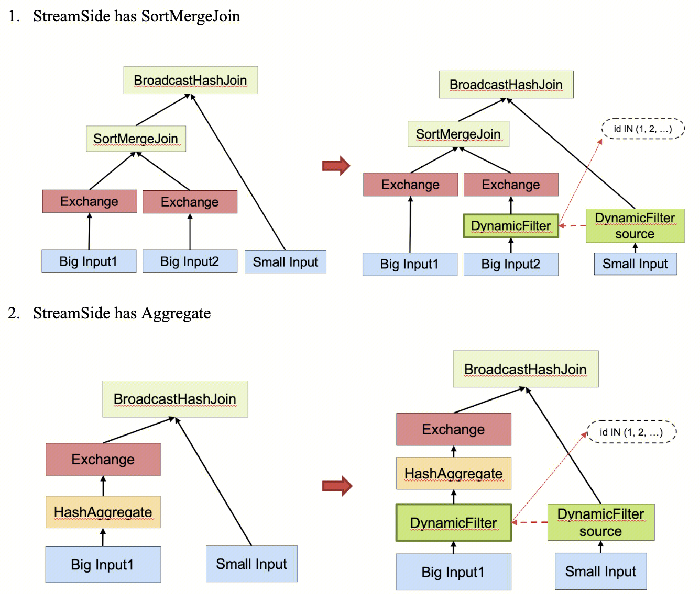

说明：代码部分以 spark 3.4.2、 kyuubi 1.9.0 为例讲解。

# 1. Spark Ranger

参考：[Kyuubi官网 - Kyuubi Spark AuthZ Plugin](https://kyuubi.readthedocs.io/en/master/security/authorization/spark/index.html)、[Kyuubi 官网 - Auxiliary Optimization Rules](https://kyuubi.readthedocs.io/en/v1.9.0/extensions/engines/spark/rules.html)

1、从 SparkSession 类的 getOrCreate() 方法开始，该方法是 Dataset 和 DataFrame API 编程的 Spark 入口点。

```scala
SparkSession
  getOrCreate()
    // 读取spark-default.conf配置：spark.sql.extensions=org.apache.kyuubi.plugin.spark.authz.ranger.RangerSparkExtension
    // 规定扩展类必须实现(SparkSessionExtensions => Unit)接口，且具有无参构造函数。如果指定了多个扩展类，将按照指定的顺序应用
    applyExtensions(sparkContext.getConf.get(StaticSQLConf.SPARK_SESSION_EXTENSIONS).getOrElse(Seq.empty), extensions)
      // 通过反射调用扩展类的无参构造函数，并作为(SparkSessionExtensions => Unit)接口的实例
      val extensionConfClass = Utils.classForName(extensionConfClassName)
      val extensionConf = extensionConfClass.getConstructor().newInstance().asInstanceOf[SparkSessionExtensions => Unit]
        // kyuubi开源的spark auth代码，目录位于kyuubi/extensions/spark/kyuubi-spark-authz
        // Spark Ranger插件初始化，继承关系：SparkRangerAdminPlugin -> RangerBasePlugin
        SparkRangerAdminPlugin.initialize()
          this.init()
            // Ranger开源代码，调用父类RangerBasePlugin的init方法初始化
            // Driver启动后台线程PolicyRefresher，定期从Ranger中拉取策略
            refresher = new PolicyRefresher(this)
            LOG.info("Created PolicyRefresher Thread(" + refresher.getName() + ")")
            refresher.setDaemon(true)
            refresher.startRefresher()
      // 调用扩展类的apply方法
      extensionConf(extensions)
        // kyuubi开源的spark auth代码，目录位于kyuubi/extensions/spark/kyuubi-spark-authz
        apply(v1: SparkSessionExtensions)
          // 【1】注入检查Analyzer规则，注入的规则将在Analyzer阶段之后执行
          v1.injectCheckRule(AuthzConfigurationChecker)
            checkRuleBuilders += builder
          // 【2】注入Analyzer自定义规则
          v1.injectResolutionRule(_ => RuleReplaceShowObjectCommands)
            resolutionRuleBuilders += builder
          // 【3】注入Optimizer自定义规则
          v1.injectOptimizerRule(_ => RuleEliminateMarker)
            optimizerRules += builder
          // 【4】注入SparkPlanner自定义策略
          v1.injectPlannerStrategy(FilterDataSourceV2Strategy)
            plannerStrategyBuilders += builder
```

2、Spark Ranger 插件注入自定义规则后，如何使用呢？在 QueryExecution 中，将调用 BaseSessionStateBuilder 类的 build() 方法生成 SessionState，**其中复写了 Analyzer、Optimizer、SparkPlanner 中的扩展规则和扩展策略**，**这些规则和策略将在对应的阶段执行**，具体可参考《Spark SQL 入门》，这样就完成了插件的扩展。

```scala
QueryExecution
  sparkSession.sessionState
    SparkSession.instantiateSessionState()
      asInstanceOf[BaseSessionStateBuilder].build()
        // 这里analyzer为Analyzer，但optimizer为SparkOptimizer（Optimizer子类）
        new SessionState(..., () => analyzer, () => optimizer, planner, ...)
          // Analyzer阶段
          analyzer: Analyzer = new Analyzer(catalogManager)
            // 【2】Analyzer中的扩展规则列表extendedResolutionRules，包含上面注入的Analyzer自定义规则
            override val extendedResolutionRules: Seq[Rule[LogicalPlan]] = ... +: customResolutionRules
              extensions.buildResolutionRules(session)
                resolutionRuleBuilders.map(_.apply(session)).toSeq
            // 【1】额外的检查规则列表，检查生成的Analyzed LogicalPlan，包含上面注入的检查Analyzer规则
            override val extendedCheckRules: Seq[LogicalPlan => Unit] = ... +: customCheckRules
              extensions.buildCheckRules(session)
                checkRuleBuilders.map(_.apply(session)).toSeq
          // Optimizer阶段
          optimizer: Optimizer = { new SparkOptimizer(catalogManager, catalog, experimentalMethods) { ... } }
            // 【3】Optimizer中的扩展规则列表extendedOperatorOptimizationRules，包含上面注入的Optimizer自定义规则
            override def extendedOperatorOptimizationRules: Seq[Rule[LogicalPlan]] = ... ++ customOperatorOptimizationRules
              extensions.buildOptimizerRules(session)
                optimizerRules.map(_.apply(session)).toSeq
          // SparkPlanner阶段
          planner: SparkPlanner = { new SparkPlanner(session, experimentalMethods) { ...} }
            // 【4】SparkPlanner中的额外策略extraPlanningStrategies，包含上面注入的SparkPlanner自定义策略
            override def extraPlanningStrategies: Seq[Strategy] = ... ++ customPlanningStrategies
              extensions.buildPlannerStrategies(session)
                plannerStrategyBuilders.map(_.apply(session)).toSeq
```

3、下面具体说明 Spark Ranger 注入了哪些规则和策略，如下表所示，表中加粗规则/策略需要重点关注，相同的字母表示规则/策略配套使用。

| **注入阶段（从属规则/策略）**                     | **规则/策略类名**                                  | **引入 PR**                                                  | **说明**                                                     |
| :------------------------------------------------ | :------------------------------------------------- | :----------------------------------------------------------- | :----------------------------------------------------------- |
| Analyzer 阶段后检查(extendedCheckRules)           | AuthzConfigurationChecker                          | [3564](https://github.com/apache/kyuubi/pull/3564)           | 禁止终端用户设置受限的 Spark 配置，如设置参数 `spark.sql.optimizer.excludedRules = org.apache.kyuubi.plugin.spark.authz.ranger.xxx`，这将在 Optimizer 阶段禁用 Ranger 规则，导致授权校验失效 |
| Analyzer 阶段(extendedResolutionRules)            | [A1] RuleReplaceShowObjectCommands                 | [2476](https://github.com/apache/kyuubi/pull/2476)           | 替换 ShowObjectCommand，对于 DataSource V1 中的 `ShowTablesCommand`、`ShowFunctionsCommand`、`ShowColumnsCommand`，过滤未授权的输出数据；对于 DataSource V2 中的 `ShowTables`、`ShowNamespaces`，将其作为 [[ObjectFilterPlaceHolder]] 子节点，类似占位标记作用，将在稍后的 FilterDataSourceV2Strategy 中处理 |
| [B1] RuleApplyPermanentViewMarker                 | [3326](https://github.com/apache/kyuubi/pull/3326) | 为永久视图添加 [[PermanentViewMarker]] 节点，用于标记进行权限检查的视图的 CatalogTable，[[PermanentViewMarker]] 标记的 CatalogTable 属性将在 CatalogTableTableExtractor 类中处理，且必须在稍后的 RuleEliminatePermanentViewMarker 优化器中进行移除 |                                                              |
| [C1] RuleApplyTypeOfMarker                        | [5678](https://github.com/apache/kyuubi/pull/5678) | 修复 [typeof](https://spark.apache.org/docs/latest/sql-ref-functions-builtin.html#conversion-functions) 表达式缺失列信息，添加 [[TypeOfPlaceHolder]] 标记，在稍后的 RuleEliminateTypeOf 优化器中进行处理 |                                                              |
| **[D1] RuleApplyRowFilter**                       | [4358](https://github.com/apache/kyuubi/pull/4358) | **行过滤**，在 Scan 叶子节点上添加 Filter 表达式节点，并在叶子节点与 Filter 节点之间添加 [[RowFilterMarker]] 标记，将在稍后的 RuleEliminateMarker 优化器中进行移除 |                                                              |
| **[D2] RuleApplyDataMaskingStage0**               | [4358](https://github.com/apache/kyuubi/pull/4358) | **数据脱敏第一阶段**：①查找支持 Scan 的完整计划 ②一旦找到，从 Ranger 逐列获取脱敏器配置 ③使用 Spark SQL 解析器为每个脱敏器生成一个未解析的表达式 ④如果输出发生了变化，在原始 Scan 节点右上方添加一个带有新输出的 Project 投影 ⑤添加 [[DataMaskingStage0Marker]] 标记来跟踪原始表达式及其脱敏器表达式在第一阶段后，Spark 原生的规则将解析我们新添加的脱敏器，然后进入第二阶段 |                                                              |
| **[D3] RuleApplyDataMaskingStage1**               | [4358](https://github.com/apache/kyuubi/pull/4358) | **数据脱敏第二阶段**，填充由 [[DataMaskingStage0Marker]] 缓冲的具有相关脱敏器表达式的缺失属性 |                                                              |
| Optimizer 阶段(extendedOperatorOptimizationRules) | [D4] RuleEliminateMarker                           | [4358](https://github.com/apache/kyuubi/pull/4358)           | 移除前面 RuleApplyRowFilter、RuleApplyDataMaskingStage0、RuleApplyDataMaskingStage1 添加的 [[RowFilterMarker]]、[[DataMaskingStage0Marker]]、[[DataMaskingStage1Marker]] 节点 |
| **RuleAuthorization**                             | [2267](https://github.com/apache/kyuubi/pull/2267) | **最基本的用户权限校验**，对所有不允许的权限抛出异常         |                                                              |
| [B2] RuleEliminatePermanentViewMarker             | [3326](https://github.com/apache/kyuubi/pull/3326) | 移除前面 RuleApplyPermanentViewMarker 规则添成的 [[PermanentViewMarker]] 节点 |                                                              |
| [C2] RuleEliminateTypeOf                          | [5678](https://github.com/apache/kyuubi/pull/5678) | 处理前面 RuleApplyTypeOfMarker 规则添成的 [[TypeOfPlaceHolder]] 节点，还原为 TypeOf 节点 |                                                              |
| SparkPlanner 阶段(extraPlanningStrategies)        | [A2] FilterDataSourceV2Strategy                    | [2613](https://github.com/apache/kyuubi/pull/2613)           | 处理前面 RuleReplaceShowObjectCommands 规则添成的 [[ObjectFilterPlaceHolder]] 节点，即对于 DataSource V2 中的 `ShowTables`、`ShowNamespaces`，过滤未授权的输出数据 |

 

# 2. Kyuubi Spark Hive Connector

参考：[Kyuubi 官网 - KSHC](https://kyuubi.readthedocs.io/en/master/connector/spark/hive.html)

Kyuubi Spark Hive Connector (简称 KSHC) 基于 Spark DataSource V2 API 实现，支持在单个 Spark 应用程序中访问多个 Hive Metastore。**注意，目前 KSHC 尚未实现对 Parquet/ORC 格式的 Hive 表的读写优化，换言之，它始终使用 Hive SerDe 来访问 Hive 表，因此在性能上可能不如 Spark 的内置 Hive 数据源，尤其是缺少向量化读取支持**。启用 KSHC，需要设置如下配置：

```properties
spark.sql.catalog.hive_catalog  org.apache.kyuubi.spark.connector.hive.HiveTableCatalog
spark.sql.catalog.hive_catalog.hive.metastore.uris  thrift://metastore-host:port
spark.sql.catalog.hive_catalog.<other.hive.conf>    <value>
spark.sql.catalog.hive_catalog.<other.hadoop.conf>  <value>
```

1、在《Spark SQL 入门》介绍过，HiveSessionCatalog 和 HiveExternalCatalog 是 DataSource V1 中用于处理 Hive 数据源的具体实现，它们分别继承自 SessionCatalog、ExternalCatalog。而在 DataSource V2 中，Spark 推出了新的接口 CatalogPlugin，并提供了 CatalogManager，其内部通过一个名为 catalogs 的 Map 类型的数据结构来维护注册的 Catalog 实例。

```scala
CatalogManager
  // 当执行use hive_catalog，物理计划为SetCatalogAndNamespaceExec；
  // 当执行set catalog hive_catalog，物理计划为SetCatalogCommand；
  // 两者都会调用setCurrentCatalog
  setCurrentCatalog
    catalog(catalogName)
      // catalogs类型为mutable.HashMap，注意，默认catalog是懒加载的，详见listCatalogs方法。
      // 直接执行show catalogs，并不会展示hive_catalog，因为此时catalogs还未保存hive_catalog，
      // 只有执行use hive_catalog后，show catalogs才会展示hive_catalog
      catalogs.getOrElseUpdate(name, Catalogs.load(name, conf))
        // 从参数中获取自定义catalog的实现类名，即HiveTableCatalog
        val _pluginClassName = conf.getConfString(s"spark.sql.catalog.$name")
        val pluginClass = loader.loadClass(pluginClassName)
        // 通过反射调用HiveTableCatalog的无参构造函数，并作为CatalogPlugin接口的实例
        val plugin = pluginClass.getDeclaredConstructor().newInstance().asInstanceOf[CatalogPlugin]
        // 调用HiveTableCatalog的initialize方法，完成自定义catalog的初始化
        // 注意，只传递spark.sql.catalog.xxx配置，并将去除spark.sql.catalog.前缀
        plugin.initialize(name, catalogOptions(name, conf))
          // KSHC代码，底层复用DataSource V1 HiveSessionCatalog、HiveExternalCatalog实现类
          // 继承关系：HiveTableCatalog -> TableCatalog/SupportsNamespaces -> CatalogPlugin
          catalog = new HiveSessionCatalog(... () => externalCatalog ...)
            // 参数spark.sql.kyuubi.hive.connector.externalCatalog.share.policy，默认为OneForAllPolicy
            externalCatalogManager.take(...)
              new HiveExternalCatalog(...)
```

2、**HiveTableCatalog 作为 KSHC 入口类，底层通过直接/间接复用 DataSource V1 中 HiveSessionCatalog、HiveExternalCatalog 来实现 DataSource V2 中的 TableCatalog/SupportsNamespaces/CatalogPlugin 接口**。以 loadTable 为例，KSHC 调用 HiveSessionCatalog 类 `getTableMetadata` 方法获取 Hive MetaStore 中的表元数据，**然后转换成 Spark V2 能识别的 `Table` 对象，后续无论是查询、插入还是删表，都会围绕这个 `HiveTable`（继承自 `Table`） 展开**。

```scala
// 继承关系：HiveTableCatalog -> TableCatalog/SupportsNamespaces -> CatalogPlugin
HiveTableCatalog
  // 1.以下方法直接复用DataSource V1 HiveSessionCatalog、HiveExternalCatalog实现类
  // 表相关
  listTables(...)
    catalog.listTables(db)
  dropTable(...)
    catalog.dropTable(...)
  renameTable(...)
    catalog.renameTable(...)
  // 库相关
  listNamespaces()
    catalog.listDatabases().map(Array(_)).toArray
  loadNamespaceMetadata(...)
    catalog.getDatabaseMetadata(db).toMetadata
  createNamespace(...)
    catalog.createDatabase(...)
  alterNamespace(...)
    catalog.alterDatabase(...)
  dropNamespace(...)
    catalog.dropDatabase(db, ignoreIfNotExists = false, cascade)
  // 分区相关
  listPartitionsByFilter(...)
    catalog.listPartitionsByFilter(tableName, predicates)
  listPartitions(...)
    catalog.listPartitions(tableName, partialSpec)
  

  // 2.以下方法间接复用DataSource V1 HiveSessionCatalog、HiveExternalCatalog实现类
  loadTable(...)
    // 继承关系：HiveTable -> Table/SupportsRead/SupportsWrite
    // HiveTable自定义实现了读（newScanBuilder）、写（newWriteBuilder）Hive表
    HiveTable(sparkSession, catalog.getTableMetadata(ident.asTableIdentifier), this)
  createTable(...)
    // 将Transform对象转换为Hive兼容的分区规范格式
    val (partitionColumns, maybeBucketSpec) = partitions.toSeq.convertTransforms
    // 获取CatalogStorageFormat目录存储格式和HiveSerDe序列化/反序列化工具。其中，
    // CatalogStorageFormat包含：locationUri（表位置）、inputFormat/outputFormat（输入输出格式）、serde（序列化器）、properties（其他属性）
    val (storage, provider) = getStorageFormatAndProvider(...)
    // 通过反射生成CatalogTable实例，兼容不同Spark版本
    val tableDesc = newCatalogTable(...)
    catalog.createTable(tableDesc, ignoreIfExists = false)
  alterTable(...)
    // 处理表Schema变更，包括：增加列、重命名列、 更新列（类型/可空性/注释/位置）、删除列，必要时递归修改嵌套数据结构
    val schema = HiveConnectorUtils.applySchemaChanges(...)
    catalog.alterTable(...)
```

3、**KSHC 写入流程本质上是一个“V2 规划层 + V1 文件写执行层”的实现** 。前半段走 Spark V2 的写入规划接口；中间用 `HiveWrite` 组装 Spark 文件写参数；后半段复用 Spark 现成的文件写入器（`SingleDirectoryDataWriter`、`DynamicPartitionDataSingleWriter`）实现真正的写入；最后由 `HiveBatchWrite` 负责把 staging 数据提交到 Hive Metastore 并刷新元数据。

```scala
// 继承关系：HiveTable -> Table/SupportsRead/SupportsWrite
HiveTable
  // 返回表的能力集合，这里支持BATCH_READ（批处理读）、BATCH_WRITE（批处理写）、
  // OVERWRITE_BY_FILTER（静态分区覆盖）、OVERWRITE_DYNAMIC（动态分区覆盖）。
  // 不同的能力需要实现不同的接口，例如BATCH_READ需要实现SupportsRead接口，BATCH_WRITE需要实现SupportsWrite接口，TRUNCATE需要实现SupportsTruncate接口（暂未实现）
  capabilities
    util.EnumSet.of(BATCH_READ, BATCH_WRITE, OVERWRITE_BY_FILTER, OVERWRITE_DYNAMIC)

  // 写入构造关系：HiveWriteBuilder -> HiveWrite -> HiveBatchWrite -> FileWriterFactory
  // HiveTable实现SupportsWrite接口方法，在逻辑计划阶段，该方法将被
  // org.apache.spark.sql.execution.datasources.v2.V2Writes调用生成Write（写入器）
  newWriteBuilder(...)
    // 继承关系：HiveWriteBuilder -> WriteBuilder（支持批处理写）/SupportsOverwrite（支持静态分区覆盖）/SupportsDynamicOverwrite（支持动态分区覆盖）
    HiveWriteBuilder(sparkSession, catalogTable, info, hiveTableCatalog)
      // HiveWriteBuilder实现WriteBuilder接口方法
      build()
        // 继承关系：HiveWrite -> Write，注意参数：
        // forceOverwrite属性：在SupportsOverwrite/SupportsDynamicOverwrite时为true
        // dynamicPartitionSpec方法：所有分区列都采用动态分区模式，不会细分静态分区列/动态分区列
        HiveWrite(..., forceOverwrite, dynamicPartitionSpec())
          // HiveWrite实现Write接口方法
          toBatch
            // 继承关系：HiveBatchWrite ->BatchWrite
            new HiveBatchWrite(...)
              // HiveBatchWrite实现BatchWrite接口方法
              createBatchWriterFactory(...)
                // 继承关系：FileWriterFactory -> DataWriterFactory
                FileWriterFactory(description, committer)
                  // FileWriterFactory实现DataWriterFactory接口方法
                  createWriter(...)
                    // 0.非分区表使用SingleDirectoryDataWriter写入，分区表使用DynamicPartitionDataSingleWriter写入
                    // 注意：DynamicPartitionDataSingleWriter在写入前，要求必须在分区/桶列上进行排序
                    if (description.partitionColumns.isEmpty)
                      new SingleDirectoryDataWriter(...)
                    else
                      new DynamicPartitionDataSingleWriter(...)
              commit(...)
                // 1.调用Spark内置的FileBatchWrite.commit，将Task写入的临时文件移动到staging目录
                fileBatchWrite.commit(messages)
                // 2.通知Hive Metastore加载staging目录的数据
                commitToMetastore(writtenPaths)
                // 3.删除staging目录，释放存储空间
                deleteExternalTmpPath(hadoopConf)
                // 4.缓存失效与统计信息更新
                hiveTableCatalog.catalog.invalidateCachedTable(table.identifier)
                catalog.alterTableStats(...)
```

```scala
// 用于追加到V2表物理计划节点。这里以insert into为例，从Spark角度看写入流程，执行explain extended insert into xxx可看到对应的物理计划节点为AppendDataExec
// 继承关系：AppendDataExec -> V2ExistingTableWriteExec -> V2TableWriteExec -> V2CommandExec -> SparkPlan
AppendDataExec
  // 物理算子从重写的doExecute方法开始执行，这里实际调用V2CommandExec.doExecute
  doExecute()
    sparkContext.parallelize(result, 1)
      // 子类V2ExistingTableWriteExec复写
      run()
        // 调用父类V2TableWriteExec方法，实际传入参数为：HiveWrite.toBatch，即HiveBatchWrite
        val writtenRows = writeWithV2(write.toBatch)
          // 实际调用HiveBatchWrite.createBatchWriterFactory，即返回：FileWriterFactory
          val writerFactory = batchWrite.createBatchWriterFactory(...)
          // 日志将输出batchWrite类型，即HiveBatchWrite
          logInfo(s"Start processing data source write support: $batchWrite. " +
            s"The input RDD has ${messages.length} partitions.")

          // 继承关系：DataWritingSparkTask -> WritingSparkTask
          task.run(writerFactory, ...)
            // 实际调用FileWriterFactory.createWriter，即返回：
            // SingleDirectoryDataWriter/DynamicPartitionDataSingleWriter
            val dataWriter = writerFactory.createWriter(partId, taskId).asInstanceOf[W]
            // 0.具体写入过程
            while (iter.hasNext)
              // 实际调用DataWritingSparkTask.write
              write(dataWriter, iter.next())
                // 调用SingleDirectoryDataWriter/DynamicPartitionDataSingleWriter完成写入
                writer.write(row)
            logInfo(s"Committed partition $partId (task $taskId, attempt $attemptId, " +
              s"stage $stageId.$stageAttempt)")

          logInfo(s"Data source write support $batchWrite is committing.")
          // 1.实际调用HiveBatchWrite.commit，完成写入提交
          batchWrite.commit(messages)
          logInfo(s"Data source write support $batchWrite committed.")
```

4、KSHC 的读取流程是：通过 Spark V2 的 `SupportsRead` 接口接入，然后在 `HiveTable` 中判断能否使用 Spark 原生的 ORC/Parquet 优化路径，否则使用 KSHC 自实现的读取路径。自实现的读取实现为：`HiveScanBuilder/HiveScan` 负责裁剪与分片，`HivePartitionReaderFactory` 负责把 Hive 的 `InputFormat + SerDe` 适配成 Spark 的 `PartitionReader[InternalRow]`，最后由 `BatchScanExec + DataSourceRDD` 驱动整个批读取执行。

```scala
// 继承关系：HiveTable -> Table/SupportsRead/SupportsWrite
HiveTable
  newScanBuilder(...)
    // 如果是HiveQL语法创建的ORC表，使用Spark原生实现OrcScanBuilder，性能更好
    // 参数spark.sql.kyuubi.hive.connector.read.convertMetastoreOrc，默认为true
    OrcScanBuilder(...)
    // 如果是HiveQL语法创建的Parquet表，使用Spark原生实现ParquetScanBuilder，性能更好
    // 参数spark.sql.kyuubi.hive.connector.read.convertMetastoreParquet，默认为true
    ParquetScanBuilder(...)

    // 否则使用KSHC自实现的HiveScanBuilder，继承关系：HiveScanBuilder -> FileScanBuilder
    // 读取构造关系：HiveScanBuilder -> HiveScan -> HivePartitionReaderFactory -> SparkFilePartitionReader
    HiveScanBuilder(...)
      // HiveScanBuilder实现FileScanBuilder/ScanBuilder接口方法
      build()
        // 继承关系：HiveScan -> FileScan
        HiveScan(...)
          // 1.HiveScan复写FileScan接口方法，规划输入分片
          partitions
            // 通过HiveCatalogFileIndex列出分区和文件
            fileIndex.listHiveFiles(partitionFilters, dataFilters)
            // 把文件切成PartitionedFile
            HiveConnectorUtils.splitFiles(...)
            // 把多个PartitionedFile打包成FilePartition，作为Spark Task输入
            FilePartition.getFilePartitions(...)

          // 2.HiveScan实现FileScan接口方法，创建Reader工厂
          createReaderFactory()
            // 继承关系：HivePartitionReaderFactory -> PartitionReaderFactory
            HivePartitionReaderFactory(...)
              // HivePartitionReaderFactory实现PartitionReaderFactory接口方法
              createReader(...)
                // 继承关系：SparkFilePartitionReader -> PartitionReader
                // 构建了一个多层嵌套的Reader装饰器链，每一层职责单一：
                // ①最底层：NextIterator[Writable]读取Hadoop原始数据
                // ②格式转换层：HivePartitionedReader用于SerDe反序列化，将Writable转换为InternalRow
                // ③分区补全层：PartitionReaderWithPartitionValues追加分区列值，补全完整行
                // ④文件封装层：HivePartitionedFileReader绑定文件元信息
                // ⑤聚合层：SparkFilePartitionReader聚合成一个Task级Reader
                new SparkFilePartitionReader[InternalRow](iter)
                  // SparkFilePartitionReader实现PartitionReader接口方法
                  next()
```

```scala
// 用于读取V2表数据的物理计划节点。这里以select为例，从Spark角度看读取流程，执行explain extended select xxx可看到对应的物理计划节点为BatchScanExec
// 继承关系：BatchScanExec -> DataSourceV2ScanExecBase -> LeafExecNode -> SparkPlan
BatchScanExec
  // 物理算子从重写的doExecute方法开始执行，实际调用DataSourceV2ScanExecBase.doExecute
  doExecute()
    // 子类BatchScanExec复写
    inputRDD
      // finalPartitions初始值为filteredPartitions，然后根据outputPartitioning进行调整
      var finalPartitions = filteredPartitions
        // 有运行时过滤，对scan应用过滤，重新获取分区
        if (dataSourceFilters.nonEmpty)
          // 实际调用FileScan.planInputPartitions
          val newPartitions = scan.toBatch.planInputPartitions()
            // 1.最后KSHC HiveScan复写FileScan接口partitions方法，获取输入分片InputPartition
            partitions.toArray
        // 无过滤，直接用父类DataSourceV2ScanExecBase.partitions
        else partitions
          inputPartitions.map(Seq(_))
            // BatchScanExec复写，实际调用FileScan.planInputPartitions
            lazy val inputPartitions: Seq[InputPartition] = batch.planInputPartitions()
              // 1.最后KSHC HiveScan复写FileScan接口partitions方法（与上面相同）
              partitions.toArray

      // 2.这里readerFactory实际为HivePartitionReaderFactory，创建Reader工厂
      lazy val readerFactory: PartitionReaderFactory = batch.createReaderFactory()
        // 这里scan实际为HiveScan/OrcScan/ParquetScan，下面以HiveScan为例
        lazy val batch: Batch = scan.toBatch

      // 3.把InputPartition和ReaderFactory交给DataSourceRDD
      new DataSourceRDD(..., finalPartitions, readerFactory, ...)
        // DataSourceRDD在Executor侧逐个分片创建reader
        compute(split: Partition, context: TaskContext)
          hasNext
            currentIter.exists(_.hasNext) || advanceToNextIter()
              // 实际调用HivePartitionReaderFactory.createReader
              partitionReaderFactory.createReader(inputPartition)
```


# 3. Spark 小文件合并

参考：[Spark 小文件合并功能在 AWS S3 上的应用与实践](https://aws.amazon.com/cn/blogs/china/application-and-practice-of-spark-small-file-merging-function-on-aws-s3/)、[如何优化 Spark 小文件，Kyuubi 一步搞定](https://www.modb.pro/db/423478)、[Hadoop集群小文件治理方案](https://iwiki.woa.com/p/4009138690)

小文件通常是指文件大小显著小于 HDFS Block 块（默认 128MB）的文件，小文件过多会给 HDFS 带来严重的性能瓶颈（主要表现在 NameNode 节点元数据的管理以及客户端的元数据访问请求），并且对用户作业的稳定性和集群数据的维护也会带来很大的挑战。

在《Spark SQL 进阶》介绍过，Spark 调用 Hadoop API 完成 Hive 表的数据写入，Hadoop FileOutputCommitter 有 V1 和 V2 两种不同的文件提交机制，无论哪种，Executor 端的每个 Task 都会对应写入一个文件。因此，**Spark 程序产生的文件数量直接取决于 RDD 中 Partition 分区的数量和表分区的数量，注意这里提到的两个分区，概念并不相同，RDD 的 Partition 分区与任务并行度高度相关，而表分区则是指的 Hive 表分区（对于 Hive，一个分区对应一个目录，主要用于数据的归类存储），产生的文件数目一般是最后一个 Stage 的 RDD 分区数和表分区数的乘积。因此，当 Spark 任务并行度过高或表分区数目过大时，非常容易产生大量的小文件**。

对于 Spark 来说，由于静态分区写入，Hive 表分区只有 1 个，而动态分区写入，Hive 表分区字段一般是固定的业务字段，因此减少最后一个 Stage 的 RDD 分区数是 Spark 小文件合并的主要手段。然而，**RDD 分区数的减少意味着任务并行度的减少，因此需要权衡小文件的个数与任务的并行度**。

1、**降低并行度**：调整 spark.sql.shuffle.partitions 和 spark.default.parallelism，默认值 200，该参数只在 shuffle 时才会生效，需要根据集群大小和数据量来调整，从小文件角度，可设置为输出数据量 / (128M ~ 1G) 作为初始值；从资源利用角度，可设置为核心数的 2-3 倍作为初始值，然后根据实际效果进行调整。

2、**重分区**：Spark RDD 使用 coalesce 与 repartition 算子，两者均是将 RDD 中的数据进行重新分区，repartition(numPartitions) 语义与 coalesce(numPartitions, true) 一致（第二个参数表示是否 shuffle），即 repartition 一定会进行 shuffle。而 coalesce 将相邻的分区直接合并在一起，形成的依赖关系是多对一的窄依赖，不会触发数据的 shuffle，因此性能更好。在不进行 shuffle 的情况下，coalesce 不能将一个分区拆分为多份，且当 RDD 中不同分区中的数据量差别较大时，直接合并容易造成数据倾斜。为了增加分区或解决数据倾斜问题，可以指定 shuffle=true 将数据打乱。

自 Spark 2.4 开始，Spark SQL 可使用 Coalesce Hints 控制输出文件的数量，就像 Dataset API 中的 coalesce、repartition 和 repartitionByRange 一样，它们可用于性能调整和减少输出文件的数量。其中，COALESCE 只有一个分区数作为参数；REPARTITION 参数包括分区数、列或两者。REPARTITION_BY_RANGE 必须包含列名，分区数是可选参数。

```sql
INSERT ... SELECT /*+ COALESCE(3) */ * FROM t
INSERT ... SELECT /*+ REPARTITION(3) */ * FROM t
INSERT ... SELECT /*+ REPARTITION(c) */ * FROM t
INSERT ... SELECT /*+ REPARTITION(3, c) */ * FROM t
INSERT ... SELECT /*+ REPARTITION_BY_RANGE(c) */ * FROM t
INSERT ... SELECT /*+ REPARTITION_BY_RANGE(3, c) */ * FROM t
```

3、**distribute by：**通过控制 map 输出结果的分发，相同字段的 map 输出会发到一个 reduce 节点处理，如果字段均匀随机，能能保证每个分区的数量基本一致，用法一般为：

```sql
INSERT ... SELECT ... FROM ... DISTRIBUTE BY 分区, ceil(rand() * 15))
```

4、**自适应查询 AQE**：通过设置 Spark shuffle partition 的上限和下限对不同作业不同阶段的 reduce 个数进行动态调整，也可以通过参数对 join 和数据倾斜问题进行优化，针对小文件合并，主要设置以下几个参数。需要注意的是此方法并不会严格保证按每个文件 128M 进行合并，也不能指定最终合成多少个文件。

```sql
-- 是否开启AQE，默认false，Spark 3.2默认true
set spark.sql.adaptive.enabled=true;

-- 当启用AQE且该值为true时，Spark将根据目标大小（由spark.sql.adaptive.advisoryPartitionSizeInBytes指定）合并连续的Shuffle分区，以避免过多的小任务，默认true
set spark.sql.adaptive.coalescePartitions.enabled=true;

-- 自适应优化期间Shuffle分区的建议大小，默认64M，Spark 3.0使用spark.sql.adaptive.advisoryPartitionSizeInBytes
set spark.sql.adaptive.shuffle.targetPostShuffleInputSize=128M;
set spark.sql.adaptive.advisoryPartitionSizeInBytes=128M;

-- 合并后，建议（但不保证）的Shuffle分区的最小数量，Spark 3.2使用spark.sql.adaptive.coalescePartitions.minPartitionSize，合并后Shuffle分区的最小大小，其值最多为spark.sql.adaptive.advisoryPartitionSizeInBytes的20%，默认1M
set spark.sql.adaptive.coalescePartitions.minPartitionNum=1;
set spark.sql.adaptive.coalescePartitions.minPartitionSize=10M;

-- 仅Spark 3.2，该值为true（默认）时，Spark在合并Shuffle分区时会忽略spark.sql.adaptive.advisoryPartitionSizeInBytes指定的目标大小，而只尊重spark.sql.adaptive.coalescePartitions.minPartitionSize指定的最小分区大小，以最大化并行性。这是为了避免在启用AQE执行时出现性能下降
set spark.sql.adaptive.coalescePartitions.parallelismFirst=false;
```

5、**集成 Kyuubi 插件**：**实现机制与 Spark Ranger 类似，注入自定义规则来添加额外的 Shuffle，然后通过 AQE 合并小文件**。需要将 Kyuubi Spark SQL 扩展 kyuubi-extension-spark-*.jar 放入 $SPARK_HOME/jars 目录，并在 $SPARK_HOME/conf/spark-defaults.conf 中添加配置 spark.sql.extensions=org.apache.kyuubi.sql.KyuubiSparkSQLExtension，详见 [Kyuubi 官网 - Auxiliary Optimization Rules](https://kyuubi.readthedocs.io/en/v1.9.0/extensions/engines/spark/rules.html)。

```sql
-- 在查询计划的顶部添加repartition节点，默认true
set spark.sql.optimizer.insertRepartitionBeforeWrite.enabled=true

-- 当设置为true时，即使原始计划没有Shuffle操作，也会添加repartition，默认false
set spark.sql.optimizer.insertRepartitionBeforeWriteIfNoShuffle.enabled=true;

-- AQE相关参数
set spark.sql.adaptive.advisoryPartitionSizeInBytes=128M;
set spark.sql.adaptive.coalescePartitions.minPartitionSize=10M;
```

下面具体说明 Spark 小文件合并注入了哪些规则和策略，如下表所示，表中加粗规则/策略需要重点关注。

| **注入阶段（从属规则/策略）**                                | **规则/策略类名**                                            | **说明**                                                     |
| :----------------------------------------------------------- | :----------------------------------------------------------- | :----------------------------------------------------------- |
| Analyzer 阶段后检查(extendedCheckRules)                      | KyuubiUnsupportedOperationsCheck                             | 检查不支持的算子，如不允许使用 ScriptTransformation          |
| Analyzer 阶段(postHocResolutionRules)                        | **RebalanceBeforeWritingDatasource**                         | 该规则在写入和查询之间添加一个 RebalancePartitions 节点。对于数据源表，有两个命令可以将数据写入表中：InsertIntoHadoopFsRelationCommand、CreateDataSourceTableAsSelectCommand |
| **RebalanceBeforeWritingHive**                               | 该规则在写入和查询之间添加一个RebalancePartitions节点。对于 Hive 表，有两个命令可以将数据写入表中：InsertIntoHiveTable、CreateHiveTableAsSelectCommand |                                                              |
| DropIgnoreNonexistent                                        | 如果 DROP DATABASE/TABLE/VIEW/FUNCTION/PARTITION 指定了一个不存在的数据库/表/视图/函数/分区，则不报告错误 |                                                              |
| Optimizer 阶段(extendedOperatorOptimizationRules)            | ForcedMaxOutputRowsRule                                      | 为了限制输出行数，添加了 ForcedMaxOutputRows 规则，以避免非限制查询的巨大输出行数出现意外情况。该规则在根项目之前添加一个 GlobalLimit 节点 |
| SparkPlanner 阶段(extraPlanningStrategies)                   | MaxScanStrategy                                              | 添加 MaxScanStrategy 以避免扫描过多的分区或文件：检查扫描是否超过分区表的最大分区数，以及检查扫描是否超过最大文件大小（由 Hive 表和分区统计计算得出）。 该策略在逻辑优化器之后添加了一个 Planner 策略 |
| SparkPlanner 阶段(针对 AQE 扩展规则，Batch 名称为 AQE Replanning) | FinalStageResourceManager                                    | 该规则假设最后的写入 Stage 对 Core 核心数的需求较低，否则该规则将不起作用。它提供以下功能：在运行最终的写入 Stage 之前，终止多余的 Executor |
| InjectCustomResourceProfile                                  | 为最后的写入 Stage 注入自定义资源配置文件，这样我们就可以指定自定义的 Executor 资源配置 |                                                              |

 

# 4. 统计信息（Statistics）

参考：[关于 Spark 和 Hive 的 statistics](https://www.fanyilun.me/2022/08/02/关于Spark和Hive的statistics/)、[[SPARK\][SQL] SparkSQL中的统计信息可能和你想象的不一样](https://mp.weixin.qq.com/s?__biz=MzIxNzIyNzY3MA==&mid=2651693680&idx=1&sn=3bc4a8a1c5d6dc1a8cf4533bf6878e01&chksm=8c040a89bb73839fb90413e347d8c29bc12d61fd55c7892a59f4f3de5b9e4cf40a1b9b728d68&version=4.1.31.99548&platform=mac&nwr_flag=1#wechat_redirect)

1、**Hive Statistics**：根据 [Statistics in Hive 官网](https://cwiki.apache.org/confluence/display/hive/statsdev)介绍，Hive 会在表、分区、列字段级别记录各自的统计信息，**并尽可能地在每次变更数据时，更新 Statistics 以保证其准确性**。当然用户也可以为了提高性能关掉开关。Hive Statistics 会用于 CBO（hive.cbo.enable）查询计划优化，选择出代价最低的查询计划。另外，如果开启了 hive.compute.query.using.stats，诸如 count(1)、min、max 的查询会直接走 Hive Statistics 快速返回结果，而不进行文件扫描。

| **统计级别**                                                 | **统计信息**                                                 | **含义**                                                     | **何时更新**                                                 |
| :----------------------------------------------------------- | :----------------------------------------------------------- | :----------------------------------------------------------- | :----------------------------------------------------------- |
| 表和分区（存储于 Hive Metastore 数据库 TABLE_PARAMS 表或 PARTITION_PARAMS 表） | numPartitions                                                | 分区数                                                       | 在显示分区表属性时计算得出                                   |
| numFiles                                                     | 文件数                                                       | 在 Metastore 操作期间自动计算                                |                                                              |
| totalSize                                                    | 在文件系统级别看到的数据集总大小                             |                                                              |                                                              |
| rawDataSize                                                  | 未经压缩的数据集大小                                         | 启用 hive.stats.autogather（Hive 3 默认开启）时会自动计算。或通过以下方式手动收集： ANALYZE TABLE ... COMPUTE STATISTICS |                                                              |
| numRows                                                      | 行数                                                         |                                                              |                                                              |
| 列（存储于 PART_COL_STATS 表或 TAB_COL_STATS 表）            | min、max、num_nulls、distinct_count、avg_col_len、max_col_len、num_trues、num_falses、bitVector | 最小值、最大值、空值数、唯一值数、平均列长度、最大列长度、真值数、假值数、位向量 | 启用 hive.stats.column.autogather（Hive 3 默认开启）时自动计算。或通过以下方式手动收集：ANALYZE TABLE ... COMPUTE STATISTICS FOR COLUMNS |

 

2、**Spark Statistics**：通常来说，Spark 也会使用 Hive Metastore 来管理库表元数据，Spark 本身也兼容 Hive 表的读写。不过 Spark 对于 Hive Statistics 的使用与 Hive 有所不同，**Spark 定义了自己的一组参数（spark.sql.statistics.xxx），并不依赖于 Hive 本身的 Statistics 字段，这也意味着 Spark 写入的 Statistics 不会被其他引擎使用和共享**。另外可以看出，Spark 对于 Statistics 的写入相对于 Hive 要谨慎很多，在默认的配置下，Spark 不会在数据写入时有效地更新 Statistics，意味着 Hive Metastore 里的统计信息不再能准确反映表的实际情况。

| **统计级别**                                                 | **统计信息**                                                 | **含义**                                                     | **何时更新**                                                 |
| :----------------------------------------------------------- | :----------------------------------------------------------- | :----------------------------------------------------------- | :----------------------------------------------------------- |
| 表和分区（存储于 Hive Metastore 数据库 TABLE_PARAMS 表或 PARTITION_PARAMS 表） | spark.sql.statistics.totalSize                               | 在文件系统级别看到的数据集总大小                             | 若 spark.sql.statistics.size.autoUpdate.enabled 开启（默认 false），则一旦表数据发生更改，则自动更新。或使用 ANALYZE 命令时更新，基本语法请参阅[说明](https://spark.apache.org/docs/3.4.2/sql-ref-syntax-aux-analyze-table.html) |
| spark.sql.statistics.numRows                                 | 行数                                                         | 仅当使用 ANALYZE 命令时更新（不能加 NOSCAN 关键字）          |                                                              |
| 列（只存储于 TAB_COL_STATS 表）                              | spark.sql.statistics.colStats.[col_name].min、max、nullCount、distinctCount、avgLen、maxLen | 最小值、最大值、空值数、唯一值数、平均列长度、最大列长度     | 仅当使用 ANALYZE 命令时更新（需要加 FOR COLUMNS col 或 FOR ALL COLUMNS 关键字） |
| spark.sql.statistics.[col_name].histogram                    | 等高直方图，表示列值按 bin 序列的分布。每个 bin 都有一个值范围，并且包含大约相同数量的行 | 仅当 spark.sql.statistics.histogram.enabled 开启（默认 false），并执行 ANALYZE 命令时更新（需要加 FOR COLUMNS col 或 FOR ALL COLUMNS 关键字） |                                                              |



```scala
case class CatalogStatistics(
    sizeInBytes: BigInt,
    rowCount: Option[BigInt] = None,
    colStats: Map[String, CatalogColumnStat] = Map.empty) {
  // ...
}

case class CatalogColumnStat(
    distinctCount: Option[BigInt] = None,
    min: Option[String] = None,
    max: Option[String] = None,
    nullCount: Option[BigInt] = None,
    avgLen: Option[Long] = None,
    maxLen: Option[Long] = None,
    histogram: Option[Histogram] = None,
    version: Int = CatalogColumnStat.VERSION) {
  // ...
}
```

 

3、**更新表级别 Statistics**：针对常规的 SQL，Spark 主要通过 CommandUtils.updateTableStats() 这个方法来更新写入后的 Statistics，该方法被CreateDataSourceTableAsSelectCommand、AlterTableAddPartitionCommand、AlterTableDropPartitionCommand、AlterTableSetLocationCommand、LoadDataCommand、TruncateTableCommand、InsertIntoHadoopFsRelationCommand、InsertIntoHiveTable 类调用，覆盖了所有数据更新或表更新的场景。**即当参数 spark.sql.statistics.size.autoUpdate.enabled = true 时，将自动更新表级别的 spark.sql.statistics.totalSize 统计数据。注意，若是分区表，还将自动更新分区的 totalSize 统计数据（SPARK-38573）**。

```scala
CommandUtils
  // 通过命令更新数据后，更新统计数据
  updateTableStats
    // 参数spark.sql.statistics.size.autoUpdate.enabled，默认false
    if (sparkSession.sessionState.conf.autoSizeUpdateEnabled)
      val (newSize, newPartitions) = CommandUtils.calculateTotalSize(sparkSession, newTable)
        // 若是非分区表，递归Location存储路径下的所有文件（不包括以.hive-staging、下划线、点开头的文件），将每个文件大小求和
        if (catalogTable.partitionColumnNames.isEmpty)
          calculateSingleLocationSize(...)
        // 若是分区表，则先拿到表所有分区的路径，然后每个分区大小并行计算，表大小即为可见分区的总和
        else
          val partitions = sessionState.catalog.listPartitions(catalogTable.identifier)
          val paths = partitions.map(_.storage.locationUri)
          val sizes = calculateMultipleLocationSizes(spark, catalogTable.identifier, paths)
      // 仅更新表级别的spark.sql.statistics.totalSize统计数据
      catalog.alterTableStats(table.identifier, Some(newStats))
        externalCatalog.alterTableStats(db, table, newStats)
          // 底层调用HiveClient更新
          client.alterTableProps(rawHiveTable, newProps)
      // 若是分区表，还将自动更新分区的totalSize统计数据
      // 这有助于了解哪些分区是倾斜分区，在分区裁剪时，查询优化器使用分区级统计信息效果更好，详见SPARK-38573
      catalog.alterPartitions(table.identifier, newPartitions)
```

当使用 ANALYZE 命令更新表级别 Statistics 时，将计算表级别的 spark.sql.statistics.totalSize，且无 NOSCAN 关键字时，才计算 spark.sql.statistics.numRows。

```scala
// AnalyzeTableCommand分析给定的表以生成统计信息，这些统计信息将用于查询优化
// AnalyzeTablesCommand分析给定数据库中的所有表，对每个表调用CommandUtils.analyzeTable
AnalyzeTableCommand
  run(sparkSession: SparkSession)
    CommandUtils.analyzeTable(sparkSession, tableIdent, noScan)
      // 调用过程同上，计算表级别的spark.sql.statistics.totalSize，但未获取分区的totalSize
      val (newTotalSize, _) = CommandUtils.calculateTotalSize(sparkSession, tableMeta)
      // 若ANALYZE命令无NOSCAN关键字，则计算spark.sql.statistics.numRows，有则不计算
      val newRowCount = if (noScan) None else Some(BigInt(sparkSession.table(tableIdentWithDB).count()))
      // 更新Metastore中的Spark Statistics
      sessionState.catalog.alterTableStats(tableIdentWithDB, newStats)
```

 

4、**更新分区级别 Statistics**：当使用 `ANALYZE TABLE xxx PARTITION (xxx = xxx) COMPUTE STATISTICS` 更新分区级别 Statistics 时，将调用 AnalyzePartitionCommand 类计算分区级别的 spark.sql.statistics.totalSize 和 spark.sql.statistics.numRows（无 NOSCAN 关键字时）。有一种情况需要注意，对于 RepairTableCommand（即 `ALTER TABLE table RECOVER PARTITIONS`），如果新创建了分区，则新分区会带上 numFiles、totalSize 这两个 Statistics，注意这里写入的 Statistics 没有以 spark.sql.statistics 开头，而是写入了 Hive Statistics，目的是为了性能优化做的一次写入，毕竟这个命令在执行时已经扫描过一次分区目录了。

```scala
// 分析给定的分区以生成每个分区的统计信息，默认情况下，计算总行数和总大小，当noscan=true时，仅计算总大小
// 当partitionSpec为空时，将收集并存储所有分区的统计信息在元数据存储中；
// 当partitionSpec仅提及一些分区列时，将处理具有指定列匹配值的所有分区；
// 如果 partitionSpec 提及了未知的分区列，则会引发AnalysisException。
AnalyzePartitionCommand
  run(sparkSession: SparkSession)
    // 列出表的所有分区的元数据
    val partitions = sessionState.catalog.listPartitions(...)
    // 若ANALYZE命令无NOSCAN关键字，计算各个分区的spark.sql.statistics.numRows
    val rowCounts: Map[TablePartitionSpec, BigInt] = 
      if (noscan) Map.empty
      else calculateRowCountsPerPartition(sparkSession, tableMeta, partitionValueSpec)
    // 列出每个分区路径中的所有叶文件，并计算总大小
    val sizes = CommandUtils.calculateMultipleLocationSizes(...)
    // 如果新计算的统计数据与metastore中记录的统计数据不同，则更新metastore
    if (newPartitions.nonEmpty)
      sessionState.catalog.alterPartitions(tableMeta.identifier, newPartitions)
```

 

5、**更新列级别 Statistics**：当使用 `ANALYZE TABLE xxx COMPUTE STATISTICS FOR COLUMNS xxx` 更新列级别 Statistics 时，将调用 AnalyzeColumnCommand 类计算 min、max 等列级别的统计信息 。注意，将同时更新表级别的统计信息 spark.sql.statistics.totalSize 和 spark.sql.statistics.numRows，以使其与列级别统计信息保持一致。

```scala
// 分析给定表的给定列以生成统计信息，可以指定参数allColumns来生成给定表的所有列的统计信息
AnalyzeColumnCommand
  run(sparkSession: SparkSession)
    analyzeColumnInCatalog(sparkSession)
      // 调用过程同上，计算表级别的spark.sql.statistics.totalSize
      val (sizeInBytes, _) = CommandUtils.calculateTotalSize(sparkSession, tableMeta)
      // 判断指定列是否存在，且支持收集统计信息（支持的类型包括：Int、Decimal、Double、Float、Boolean、Datetime、Binary、String）
      val columnsToAnalyze = getColumnsToAnalyze(...)
      // 计算指定列的统计信息
      val (rowCount, newColStats) = CommandUtils.computeColumnStats(sparkSession, relation, columnsToAnalyze)
        // 参数spark.sql.statistics.histogram.enabled为true时，计算每个属性的百分位数
        val attributePercentiles = computePercentiles(columns, sparkSession, relation)
        // 构造表达式来计算列统计信息：结果中的第一个元素将是总行数，接下来的元素将是包含所有列统计信息的结构体
        val expressions = Count(Literal(1)).toAggregateExpression() +: columns.map(statExprs(...))
        // 执行上面构造的聚合表达式
        new QueryExecution(sparkSession, Aggregate(...)).executedPlan.executeTake(1).head
      // 同时更新表级别的统计信息，以使其与列级别统计信息保持一致
      val statistics = CatalogStatistics(
        sizeInBytes = sizeInBytes,
        rowCount = Some(rowCount),
        colStats = ... ++ newColCatalogStats)
      sessionState.catalog.alterTableStats(tableIdent, Some(statistics))
```

 

6、**Spark 更新 Hive Statistics（待验证，来源网络）**：Spark 更新的 Statistics 都会以 spark.sql.statistics 开头，看似不会更新 Hive Statistics。**但实际情况下，Spark 变更元数据时 createTable、alterTable、addPartition 会连接到 Hive Metastore，此时在 Hive Metastore 内部依然会更新表和分区的 Hive Statistics，包括 numFiles 和 totalSize**。那么问题是 Spark 写入表的时候，是否会触发 createTable、alterTable、addPartition 这些 DDL 命令。类似于 CTAS 的语句，在创建元数据的同时进行插入肯定没问题会触发。如果只是普通的 INSERT [OVERWRITE] 命令，是否更新则要取决于 Spark 内部实现，Spark 内部的插入有两种实现 InsertIntoHadoopFsRelationCommand、InsertIntoHiveTable，分别对应 Datasource 表和 Hive 表，表的类型取决于 create table 命令时候的语法。另外如果是 orc/parquet 格式的 Hive 表，并且开启了 spark.sql.hive.convertMetastoreParquet 或 spark.sql.hive.convertMetastoreOrc（默认开启），则会做 RelationConversion，实际上还是用 InsertIntoHadoopFsRelationCommand 来实现 orc/parquet 表的写入。**如果是 InsertIntoHiveTable 命令，则会在写入非分区表时触发 alterTable，然后在 Hive Metastore 里计算 Statistics，同时也会更新 transient_lastDdlTime。如果是 InsertIntoHadoopFsRelationCommand 命令，则不会触发 alterTable，也不会计算 Statistics**。

| 表类型                     | 新增表/分区（CTAS、插入新分区） 是否更新 Hive Statistics | 普通 INSERT 插入表 是否更新 Hive Statistics | 普通 INSERT 插入分区 是否更新 Hive Statistics |
| :------------------------- | :------------------------------------------------------- | :------------------------------------------ | :-------------------------------------------- |
| Datasource 表              | 是                                                       | 否                                          | 否                                            |
| Hive 表（除了orc/parquet） | 是                                                       | 是                                          | 否                                            |
| Hive 表（orc/parquet）     | 是                                                       | 否                                          | 否                                            |

数据湖格式（delta、hudi、iceberg）通常不太依赖 Hive Metastore 的元数据，而是自己维护一份文件来记录表的元数据和统计信息。不同的格式对 Hive Statistics 的使用我做了一下测试，由于版本等原因，这里的结论仅做一个参考。总体来说，湖格式对 Hive Statistics 的使用有几个特点：

- **当数据写入时，默认会主动更新 Hive Statistics**，无需开启其他参数（可能是由于触发 Metastore 的 alterTable 更新，此处未验证）。
- 写入的是 Hive Statistics，而不是 Spark Statistics。
- 几乎不支持 Analyze 命令，因为 Spark Datasource v2 表暂不支持 Analyze 命令，而且即使运行了也是按照 Spark 逻辑在执行，没有真正统计出湖格式的 Statistics。
- 真正的统计信息，通常都放在湖格式自己的元数据文件内。

| 格式    | 写入数据是否更新 Statistics         | Analyze 是否更新 Statistics                                  |
| :------ | :---------------------------------- | :----------------------------------------------------------- |
| delta   | 会更新 totalSize、numFiles          | Spark3 不支持 Analyze Spark2 Analyze 会更新 spark.sql.statistics.numRows、spark.sql.statistics.totalSize |
| hudi    | 会更新 totalSize、numFiles          | 会更新 spark.sql.statistics.numRows 和 spark.sql.statistics.totalSize |
| iceberg | 会更新 totalSize、numFiles、numRows | Spark3 不支持 Analyze Spark2 不支持 spark-sql                |

 

7、**使用 Spark Statistics**：在 Spark 内部实现里，会先从 Hive Metastore 中拿到的原始的 Statistics，构造出 CatalogStatistics，随后在执行阶段会转换成 Statistics。
**Spark 在构造 CatalogStatistics 时，若是表或分区级别的 Statistics，会先读取 Hive Statistics，再读取 Spark Statistics（如果存在，则 Spark Statistics 优先覆盖 Hive Statistics）；若是列级别的 Statistics，则只读取 Spark Statistics**。最终在每个 LogicalPlan 节点都会有一个名为 stats 的 Statistics 属性，表示计划执行到此处预估的数据量。Statistics 最重要的用处就是判断表是否可以进行 Broadcast Join。因为 Broadcast Join 可以把小表广播出去，性能要远优于 Sort Merge Join。

- CBO 未开启时（默认不开启），调用 SizeInBytesOnlyStatsPlanVisitor 估算 stats。执行计划中，如果不是叶子节点，会根据操作类型从子节点的 stats 估算出本节点的 stats，如 Filter、Project、Aggregate 等，但是估算的方式简单且保守，Filter 也没有真正减少 stats，**只是根据输出字段的不同来估算一下总大小的差异。可以认为经过若干算子之后，stats 最终取值几乎还是表级别的 totalSize 值**。如果是叶子节点，也就是真正的数据源，会根据不同表类型拿到 stats 信息，详细说明如下：
  - **对于 Hive 表（HiveTableRelation），会直接取 CatalogStatistics，也就是原始的 Hive Statistics totalSize**。这里的 CatalogStatistics 不会是空，因为除了从 Hive Metastore 获取之外，在 Analyzer 阶段，Hive 表还有一个专门的规则（Rule）：DetermineTableStats 会更新 CatalogStatistics。
  - **对于 Datasource 表（LogicalRelation），会先取 CatalogStatistics，若取不到还会从 datasource relation 里尝试拿 totalSize**。对于 HadoopFsRelation 类型的 datasource，如果是非分区表，则调用 Hadoop API，totalSize 为表路径下所有文件的和；如果是分区表，则视情况而定，例如在 Optimize 阶段有一个规则PruneFileSourcePartitions 在一些情况下会更新分区表的统计信息。
- CBO 开启时，调用 BasicStatsPlanVisitor 估算 stats。叶子节点 stats 的读取逻辑和上述一致，不同的是 Filter、Aggregate、Join 之类的一些算子估算会更准确。比如 Filter会拿子节点的 rowCount，以及列级别的 stats（min/max/distinctCount/histogram）来做估算。

```scala
JoinSelectionHelper
  getBroadcastBuildSide(...)
    // 匹配一个计划，其输出应足够小以用于Broadcast Join
    canBroadcastBySize(...)
      // plan.stats返回当前逻辑计划节点的预估统计信息。在内部，该方法会缓存返回值，该返回值是基于第一次传入的配置计算得出的。
      // 如果配置发生更改，可以通过调用 invalidateStatsCache() 来使缓存失效。autoBroadcastJoinThreshold为
      // spark.sql.adaptive.autoBroadcastJoinThreshold参数值（AQE）或spark.sql.autoBroadcastJoinThreshold参数值
      plan.stats.sizeInBytes >= 0 && plan.stats.sizeInBytes <= autoBroadcastJoinThreshold
        // 继承关系：BasicStatsPlanVisitor（CBO场景）、SizeInBytesOnlyStatsPlanVisitor -> LogicalPlanVisitor
        if (conf.cboEnabled)
          statsCache = Option(BasicStatsPlanVisitor.visit(self))
            // 不同算子计算统计信息略有不同，以Aggregate为例，BasicStatsPlanVisitor复写该方法
            case p: Aggregate => visitAggregate(p)
              // 根据分组列的列统计信息估计输出行数，并传播聚合表达式的列统计信息。计算为空时回退到非CBO场景
              AggregateEstimation.estimate(p).getOrElse(fallback(p))
        else
          statsCache = Option(SizeInBytesOnlyStatsPlanVisitor.visit(self))
            // 不同算子计算统计信息略有不同，以Aggregate为例，SizeInBytesOnlyStatsPlanVisitor复写该方法
            case p: Aggregate => visitAggregate(p)
              // 计算每个UnaryNode统计信息的通用方法
              visitUnaryNode(p)
                // 计算子节点输出的每行大小
                val childRowSize = EstimationUtils.getSizePerRow(p.child.output)
                  // getSizePerRow计算一行的大小：8（假设Row对象通用开销）+ 各列数据类型的大小（计算方式如下）
                  // 若avgLen未定义，取dataType.defaultSize；否则取avgLen（特殊的，String类型为：avgLen + 8 + 4）
                  8 + attributes.map { attr => ... }.sum
                // 计算当前节点输出的每行大小
                val outputRowSize = EstimationUtils.getSizePerRow(p.output)
                // 非叶子节点计算统计信息公式：childPhysicalSize * outputRowSize / childRowSize
                var sizeInBytes = (p.child.stats.sizeInBytes * outputRowSize) / childRowSize
            case p: LogicalPlan => default(p)
              // 对于叶节点，使用其computeStats
              case p: LeafNode => p.computeStats()
                // 对于Hive表（HiveTableRelation）：若开启CBO，大小为行数 * 行大小；否则为Hive Statistics totalSize
                // 这里tableMeta.stats不会是空，因为除了从Hive Metastore获取之外，在Analyzer阶段，Hive表还有一个专门的规则（Rule）：
                // DetermineTableStats会更新CatalogStatistics，下面介绍
                tableMeta.stats.map(_.toPlanStats(output, conf.cboEnabled || conf.planStatsEnabled)).orElse(tableStats)
                  if (planStatsEnabled && rowCount.isDefined)
                    EstimationUtils.getOutputSize(planOutput, rowCount.get, attrStats)
                  else 
                    Statistics(sizeInBytes = sizeInBytes)
                // 对于Datasource表（LogicalRelation）：若存在CatalogStatistics，则计算方式与HiveTableRelation相同；
                // 否则为relation.sizeInBytes，不同的数据源可以重写该方法，默认为spark.sql.defaultSizeInBytes，即Long.MaxValue
                catalogTable.flatMap(...).getOrElse(Statistics(sizeInBytes = relation.sizeInBytes))
                  // HadoopFsRelation类sizeInBytes方法，compressionFactor对应参数spark.sql.sources.fileCompressionFactor
                  (location.sizeInBytes * compressionFactor).toLong
                    // 如果是非分区表，调用Hadoop API，大小为表路径下所有文件的和
                    allFiles().map(_.getLen).sum
              // 对于其他节点，大小是所有子节点computeStats的乘积
              case _: LogicalPlan => Statistics(sizeInBytes = p.children.map(_.stats.sizeInBytes).filter(_ > 0L).product)
// 继承关系：DetermineTableStats -> Rule，在Analyzer阶段的postHocResolutionRules规则中使用
DetermineTableStats
  apply(plan: LogicalPlan)
    hiveTableWithStats(relation)
      // 参数spark.sql.statistics.fallBackToHdfs（默认false）为true，且为非分区表，调用Hadoop API计算totalSize
      // 对于分区表，分区目录可能位于表目录之外，获得表大小的成本很高，可查看在AnalyzeTable中如何实现
      if (conf.fallBackToHdfsForStatsEnabled && partitionCols.isEmpty)
        fs.getContentSummary(tablePath).getLength
      // 参数spark.sql.defaultSizeInBytes，默认Long.MaxValue
      else conf.defaultSizeInBytes
```

 

# 5. 动态分区裁剪（Dynamic Partition Pruning, DPP）

参考：[聊一聊 Spark 3.0 中的 DPP 特性](https://zhuanlan.zhihu.com/p/548757324)、[图文理解 Spark 3.0 的动态分区裁剪优化](https://www.iteblog.com/archives/9921.html)

1、动态分区剪裁（Dynamic Partition Pruning，DPP）指的是在**大表 Join 小表的场景**中，可以充分利用过滤之后的小表，在运行时动态的大幅削减大表的数据扫描量，从整体上提升关联计算的执行性能。

**分区剪裁是谓词下推的一种特例，它指的是在分区表中下推谓词，并以文件系统目录为单位对数据集进行过滤，即 Spark SQL 对分区表做扫描的时候，是完全可以跳过（剪掉）不满足谓词条件的分区目录，这就是分区剪裁。**例如，在我们的查询语句中，对日志表设置过滤谓词 `dt >= '2022-08-01'`，日志表一般是以 dt 作为分区的，那么在扫描 Hive 分区表时，可以直接过滤掉小于 '2022-08-01' 文件目录。从这里可以看出相比于分区过滤，谓词下推只能算是“小巫见大巫”了。 

 

2、那么动态分区剪裁又是怎么实现的呢？举个例子，想象你在仓库里找货物，有两张表：

- **大表（事实表）**：订单明细，按“日期”分区存放，有几百个分区目录，共 1TB
- **小表（维度表）**：日期维表，总共就 10MB，里面有一列 is_holiday（是否节假日）

你要查询的是：所有节假日的订单，SQL 如下所示：

```sql
SELECT o.*
  FROM orders o JOIN dim_date d ON o.dt = d.dt
  WHERE d.is_holiday = true;
```

**没有 DPP 会怎样？**Spark 只会把 `is_holiday = true` 这个过滤条件下推到小表上（静态谓词下推），对大表只能说“我不知道要哪些 dt，先全读吧”，于是 1TB 全扫一遍，再跟过滤后的小表 join，浪费。

**有了 DPP 会怎样？**DPP 的思路很朴素：**小表已经被过滤了，它里面剩下的那些 `dt` 值，就是大表真正需要读的分区**！于是 DPP 干两件事：

* **先执行小表**：`select dt from dim_date where is_holiday = true`，得到一个小集合，比如 `{2026-01-01, 2026-05-01, 2026-10-01, ...}`。
* **把这个集合回注到大表的分区过滤条件里**：大表变成 `where dt in (2026-01-01, 2026-05-01, ...)`，这样在读数据之前就把不需要的分区目录整个跳过了。

一句话概括：**DPP = 用小表过滤后的 Join Key 值，去裁剪大表要读的分区**。

 

3、**在逻辑计划中，DPP 主要使用 `DynamicPruningSubquery` 作为占位符**，因为此时 Spark 还不知道物理计划最终会用哪种 join，但它能看出这个地方有机会做 DPP。它在大表上方插入一个**带子查询的 Filter**，含义相当于：`where orders.dt in (select dt from dim_date where is_holiday = true)`，这个子查询的形式叫 `DynamicPruningSubquery`，但它只是一个占位符，此时并没有决定这个子查询最终要怎么算。插入前有门槛：

| 门槛                 | 解释                                                         |
| -------------------- | ------------------------------------------------------------ |
| 大表"可被分区列过滤" | 要么 v1/Hive 的分区列就是 join key；要么 v2 数据源主动声明支持运行时过滤 |
| 等值 Join            | 只有 `a.key = b.key` 这种等号连接，值集合才能直接回灌过去    |
| Join 类型对          | 比如 `LeftAnti` 的语义要求必须扫完左表所有行，无法裁剪       |
| 小表"看起来会被过滤" | 小表必须有个看起来有选择性的 `where` 条件，否则无法裁剪（小表不过滤，等于把大表全部 dt 倒回去） |
| 有收益               | 省下的大表读取量 > 小表可能被多扫一次的开销，才值得干        |

```scala
// 应用于SparkOptimizer优化器的名为“PartitionPruning”的Batch中
PartitionPruning
  apply(plan: LogicalPlan)
    // 跳过Subquery子查询
    case s: Subquery if s.correlated => plan
    // 参数spark.sql.optimizer.dynamicPartitionPruning.enabled，默认为true
    case _ if !conf.dynamicPartitionPruningEnabled => plan
    case _ => prune(plan)
      // 提取等值Join的左右join keys
      val (leftKeys, rightKeys) = j match { case ExtractEquiJoinKeys(...) ... }
      // 遍历查询条件谓词（例如有多个and条件），使用DPP优化
      splitConjunctivePredicates(condition).foreach
        // 在逻辑计划中搜索可以针对给定列进行过滤的table scan
        // 此方法尝试找到给定分区列的v1或Hive serde分区扫描，或者支持在给定属性上进行运行时过滤的v2 scan
        var filterableScan = getFilterableTableScan(l, left)
          // 对于V1（HadoopFsRelation）和Hive（HiveTableRelation），要求Join Key是分区列
          case (resExp, l: LogicalRelation) => ... case fs: HadoopFsRelation => ...
          case (resExp, l: HiveTableRelation) =>
          // 对于V2数据源，条件放宽为：数据源实现了SupportsRuntimeV2Filtering接口
          // 且Join Key在scan.filterAttributes 集合中，不一定是分区列
          case (resExp, r @ DataSourceV2ScanRelation(_, scan: SupportsRuntimeV2Filtering, _, _, _)) =>
        // 左表进行剪裁，canPruneLeft判断左表剪裁只有：Inner、LeftSemi、RightOuter，不包括LeftAnti，因为它必须扫描左表的全部分区
        if (filterableScan.isDefined && canPruneLeft(joinType) && hasPartitionPruningFilter(right))
          // 用连接另一侧的filter，在连接的一侧插入动态分区裁剪（DPP）谓词
          newLeft = insertPredicate(l, newLeft, r, right, rightKeys, filterableScan.get)
            // 参数：spark.sql.exchange.reuse，默认true
            val reuseEnabled = conf.exchangeReuseEnabled
            // 判断剪裁是否有收益，计算公式：fallbackRatio * 大表大小 > 小表大小
            // 假设Join的右侧表有10MB数据，且过滤比是默认值0.5，那么如果Join的左侧大于20MB，则使用DPP将被视为有益，
            // 当然如果CBO的统计信息可用时，会使用统计信息计算过滤比
            lazy val hasBenefit = pruningHasBenefit(pruningKey, partScan, filteringKey, filteringPlan)
              // 参数：spark.sql.optimizer.dynamicPartitionPruning.fallbackFilterRatio，默认0.5
              // 当统计信息不可用或配置为不使用时，此配置将作为DPP计算分区表数据大小的回退过滤比例，
              // 以评估如果广播（broadcast）重用不适用时，是否值得添加额外的子查询作为裁剪过滤器
              val fallbackRatio = conf.dynamicPartitionPruningFallbackFilterRatio
              val estimatePruningSideSize = filterRatio * partPlan.stats.sizeInBytes.toFloat
              val overhead = calculatePlanOverhead(otherPlan)
              estimatePruningSideSize > overhead
            // 如果开启重用exchange或有收益，则插入一个Filter的过滤子查询算子
            if (reuseEnabled || hasBenefit)
              // DynamicPruningSubquery属性onlyInBroadcast含义：当onlyInBroadcast为false时，表示剪枝过滤器可能是有益的，因此即使
              // 不能通过ReuseExchange重用广播结果，也应执行剪枝过滤器；否则，仅当它可以通过ReuseeExchange重用广播结果时，才会使用过滤器
              // 参数spark.sql.optimizer.dynamicPartitionPruning.reuseBroadcastOnly，默认true
              Filter(DynamicPruningSubquery(..., conf.dynamicPartitionPruningReuseBroadcastOnly || !hasBenefit), pruningPlan)
        else 
          // 右表进行剪裁，与左表进行剪裁逻辑类似
          filterableScan = getFilterableTableScan(r, right)
          // canPruneRight判断右表剪裁只有：Inner、LeftSemi、LeftOuter
          if (filterableScan.isDefined && canPruneRight(joinType) && hasPartitionPruningFilter(left))
            newRight = insertPredicate(r, newRight, l, left, leftKeys, filterableScan.get)
```

 

4、**物理计划决定怎么实现 `DynamicPruningSubquery` 占位符**，此时 Spark 已经知道 join 的物理算法了，于是把占位符替换为真正可执行的东西。分三种情况：

* **Join 恰好是 Broadcast Hash Join（最理想）**：BHJ 本来就会把小表广播到每个 Executor（先算出小表所有行，打包成 HashedRelation 广播出去），于是 DPP 把大表的分区过滤条件绑到这份广播结果上（`SubqueryBroadcastExec` + `ReuseExchange`）。这种情况成本几乎为 0，小表反正要广播，顺便把 key 集合提取出来给大表用，这也是 Spark 默认只在此场景启用 DPP 的原因 `reuseBroadcastOnly=true`。
* **Join 不是 BHJ，但收益足够大**：比如 Sort Merge Join，这时没有现成的广播可复用，**DPP 要生效就得单独为大表多跑一次小表子查询**，单独跑意味着小表要被扫两次（一次给 join，一次给 DPP），代价不小。所以必须满足：用户主动设置 `spark.sql.optimizer.dynamicPartitionPruning.reuseBroadcastOnly=false` ，并且 `hasBenefit` 判断通过（省下的大表读 > 重扫小表的开销）。这时 DPP 会在小表上套一个 Aggregate（取 distinct 的 join key，相当于 `select distinct dt from dim_date where ...`），再以独立子查询形式下发到大表 scan。
* **既不是 BHJ，又不划算**：DPP 把占位符替换成 true，相当于什么都没做，这保证了 **DPP 在最坏情况下不会拖慢查询**，它是纯收益优化。

```scala
// 此规则旨在重写动态裁剪谓词，以便重用广播的结果。对于没有计划作为broadcast hash join的连接，我们保留带有子查询重复的回退机制。
PlanDynamicPruningFilters
  apply(plan: SparkPlan)
    // 前面逻辑计划中插入的DynamicPruningSubquery（类似占位符）
    case DynamicPruningSubquery(...) =>
      // 能否重用exchange：spark.sql.exchange.reuse=true，同时plan中存在BroadcastHashJoinExec
      val canReuseExchange = conf.exchangeReuseEnabled && buildKeys.nonEmpty && plan.exists { ... }
      // [1] 如果可以重用Exchange，则重用当前的BroadcastExchangeExec，并封装为InSubqueryExec，再包装为DynamicPruningExpression
      if (canReuseExchange)
        // 计划对join的构建侧（build side）进行广播交换（broadcast exchange）
        val exchange = BroadcastExchangeExec(mode, executedPlan)
        // 在probe侧放置广播适配器，以便重用广播结果
        val broadcastValues = SubqueryBroadcastExec(name, broadcastKeyIndex, buildKeys, exchange)
        DynamicPruningExpression(InSubqueryExec(value, broadcastValues, exprId))
      // [2] 如果onlyInBroadcast为true, 执行动态剪裁查询是不值得的，回退到true字面量表达式
      else if (onlyInBroadcast)
        DynamicPruningExpression(Literal.TrueLiteral)
      // [3] 如果onlyInBroadcast为false，要么spark.sql.optimizer.dynamicPartitionPruning.reuseBroadcastOnly=false，要么是有收益
      // 则先在buildPlan上应用聚合，以便进行列修剪，并封装为InSubqueryExec，再包装为DynamicPruningExpression
      else
        val aggregate = Aggregate(Seq(alias), Seq(alias), buildPlan)
        DynamicPruningExpression(expressions.InSubquery(Seq(value), ListQuery(aggregate, ...)))
```

物理计划 PlanDynamicPruningFilters 规则中的情况一类似于下面的场景，通过重用 Exchange 来消除重复的子查询，从而提高执行效率。



 

5、谈谈 runtime filter 和 DPP 的区别：**首先，runtime filter 是对 DPP 的补充，DPP 通过对大表直接进行 partition 级别的裁剪，相当于直接减少从存储中读取的数据量，可以大大提高查询速度，但 DPP 的适用条件也相对严格，需要大表的分区列参与 join。**

**其次，如果能在大表 shuffle 前根据非分区列的 join 列对其进行过滤，即使无法像 DPP 一样直接减少从存储中读取的数据量，但减小了其参与 shuffle 以及后续操作的数据量，也能获得比较不错的收益**，这就是 runtime filter 的动机，即运行时预先扫描小表获取 join 列的值，构造 bloom filter 对大表进行过滤。另外需要注意的是，如果 join 可以被转化为 BroadcastHashJoin，则不会应用 runtime filter。可以看出 runtime filter 实现思路和 DPP 是大致一致的。

 

# 6. 自适应查询（Adaptive Query Execution, AQE）

参考：[Spark 3.0 自适应查询优化介绍](https://www.iteblog.com/archives/9820.html)、[Spark 官网 - adaptive-query-execution](https://spark.apache.org/docs/3.4.2/sql-performance-tuning.html#adaptive-query-execution)、[每个 Spark 工程师都应该知道的五种 Join 策略](https://www.iteblog.com/archives/9870.html)

Spark 使用基于成本的优化（Cost-Based Optimization，CBO）收集表的统计数据（如行数、不同值的数量、NULL 值、最大/最小值等）来选择更好的查询计划，最好的例子就是选择正确的 Join 类型（broadcast hash join vs. sort merge join），以及在 hash join 时选择正确的连接顺序，或在多个 join 中调整 join 顺序。**然而，过时的统计信息和不完善的基数估计可能导致次优的查询计划**。因此，**在 Spark 3.0 中，引入了自适应查询执行（Adaptive Query Execution，AQE），根据查询执行过程中收集的运行时统计信息，重新优化和调整查询计划来解决这些问题，对应 SparkPlan 中的规则 InsertAdaptiveSparkPlan**。Spark SQL 可以通过配置 spark.sql.adaptive.enabled 打开或关闭 AQE，自 Spark 3.2 起默认启用。**AQE 有三大功能：动态合并 Shuffle 分区、动态调整 Join 策略、动态优化数据倾斜的 Join**。

那么 AQE 何时进行重新优化呢？Spark 算子通常是以 Pipeline 形式进行，且并行执行。然而，Shuffle 或 Broadcast Exchange 打破了这个 Pipeline，我们称它们为物化点（Materialization Points），并使用查询阶段（Query Stages）来表示查询中由这些物化点限定的子部分。每个查询阶段都会物化它的中间结果，只有当运行物化的所有并行进程都完成时，才能继续执行下一个阶段。这为重新优化提供了一个绝佳的机会，**因为此时所有分区上的数据统计都是可用的，并且后续操作还没有开始**。

1、**动态合并 Shuffle 分区**。分区数是 Shuffle 的一个关键属性，它的最佳值取决于数据，但是数据大小可能在不同阶段、不同查询之间有很大的差异。如果分区数太少，那么每个分区处理的数据可能非常大，处理这些大分区的任务可能需要将数据溢写到磁盘，从而减慢查询速度。如果分区数太多，那么每个分区处理的数据可能非常小，并且将有大量的网络连接来读取 Shuffle Blocks，这也会由于低效的 I/O 模式而减慢查询速度。

**当配置 spark.sql.adaptive.enabled 和 spark.sql.adaptive.coalescePartitions.enabled 均为 true 时，Spark 会根据 Map 输出统计数据来动态合并 Shuffle 分区**。该功能简化了运行查询时调整 Shuffle 分区数的工作，无需根据数据集设置合适的 Shuffle 分区数，只要通过配置 spark.sql.adaptive.coalescePartitions.initialPartitionNum 设置足够大的初始 Shuffle 分区数，Spark 就能将相邻的小分区合并为较大的分区。 




2、**动态调整 Join 策略**。**当任何 Join 方的运行时统计数据小于自适应 Broadcast Hash Join 阈值时，AQE 会将 Sort-Merge Join 连接转换为 Broadcast Hash Join**，这种方式虽然不如一开始就使用 Broadcast Hash Join 高效，但总比继续使用 Sort-Merge Join 要好，因为我们可以节省连接双方的排序操作，并通过读取本地 Shuffle 文件来节省网络流量（如果 spark.sql.adaptive.localShuffleReader.enabled 为 true）。另外，当配置 spark.sql.adaptive.maxShuffledHashJoinLocalMapThreshold 不小于 spark.sql.adaptive.consultablePartitionSizeInBytes，**并且所有 Shuffle 后的分区大小都不大于该配置时，AQE 会将 Sort-Merge Join 转换为 Shuffle Hash Join**。关于上述三种 Join 策略可参考[介绍](https://www.iteblog.com/archives/9870.html)。

3、**动态优化数据倾斜的 Join**。数据倾斜会严重降低 Join 查询的性能，**当配置 spark.sql.adaptive.enabled 和 spark.sql.adaptive.skewJoin.enabled 均为 true 时，Spark 通过将倾斜任务拆分为大小大致均匀的任务（如有需要可进行复制），动态处理 Sort-Merge Join 中的倾斜问题**。




 

# 7. 布隆过滤器（Bloom Filter）

参考：[Spark Jira - [SPARK-32268] Bloom Filter Join](https://issues.apache.org/jira/browse/SPARK-32268)、[Bloom Filter Design Document](https://docs.google.com/document/d/1ndwynp1RPxaQ0dxykCWD-KW4MYxFWv-ojJzOMAei1S8/edit)、[[SPARK][SQL] 聊聊 Spark 3.3 中的 Runtime Filter Joins](https://zhuanlan.zhihu.com/p/542468151)

前面已经介绍过，基于成本的优化（CBO）旨在选择最佳的执行计划，但由于过时或缺失的统计信息引起的过滤条件，或涉及用户自定义函数（UDFs）的谓词，或非内连接类型的连接，它的效果并不好。因此**，Spark 3.3.0 提出运行时过滤（Runtime Filter），它可以根据需要在查询计划中注入和下推 Filter，以便在早期过滤数据，减少 Shuffle 和后期计算的数据大小，这有点类似于 DPP 可以过滤 Shuffle 数据，主要区别在于使用布隆过滤器（Bloom Filter）来过滤数据，对应 Optimized LogicalPlan 中的规则 InjectRuntimeFilter**。

Runtime Filter 是如何工作的呢？它首先找到 Broadcast Join 和有 Shuffle 操作的流侧（Stream Side）；然后根据 Join Key 收集构建侧（Build Side）的值，并为流侧生成动态过滤器。 最后，将此动态过滤器下推到数据源。Runtime Filter 的主要思想是减少数据的 Shuffle，因此它适用于图中的两种情况。注意，CBO 需要列统计信息，仅支持 Inner Join 和 Cross Join，而 Runtime Filter 只需要表数据大小，并且支持 Left Join、Right Join、Inner Join、Cross Join 和 Left Semi Join。



**实际上，Runtime Filter 目前引入了两种不同的优化，分别是 Bloom Filter 和带有 IN 子查询的 Semi-Join Filter，分别对应配置 spark.sql.optimizer.runtime.bloomFilter.enabled（自 Spark 3.4 起默认为 true）和 spark.sql.optimizer.runtimeFilter.semiJoinReduction.enabled（默认为 false）**，未来，Runtime Filter 还可能是其他形式的过滤器。为什么有了 Bloom Filter，还需要 Semi-Join Filter 呢？这是因为 **Bloom Filter 有假阳性的问题，即当 Bloom Filter 说某个值存在时，这个值可能不存在，当它说不存在时，那就肯定不存在**，当数据量比较大，其结果可能会出现误判。所有如果构造表数据量较大，但其 Join Key 足够小（或经过滤后）可以进行广播，那么使用 Semi-Join 可能会带来更多的收益。