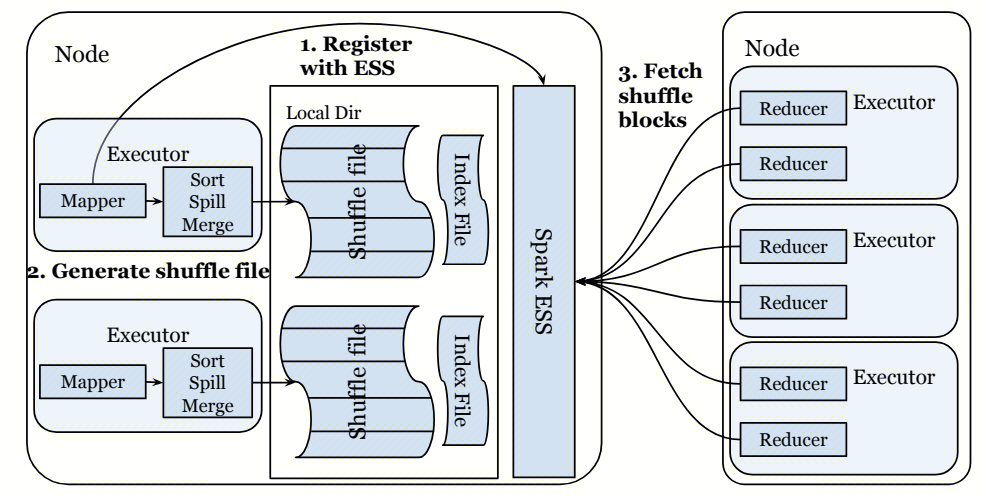
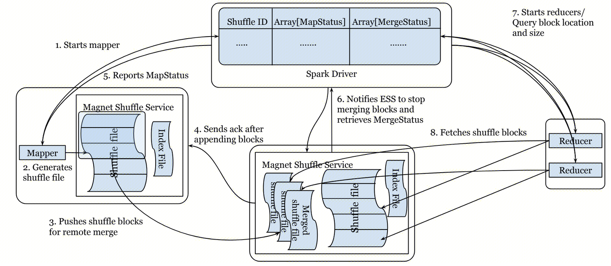
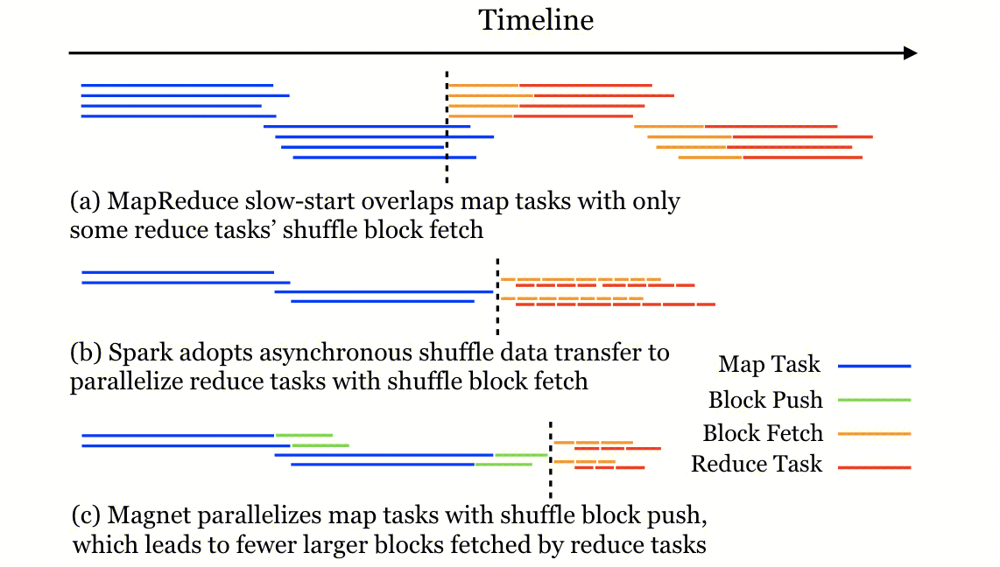
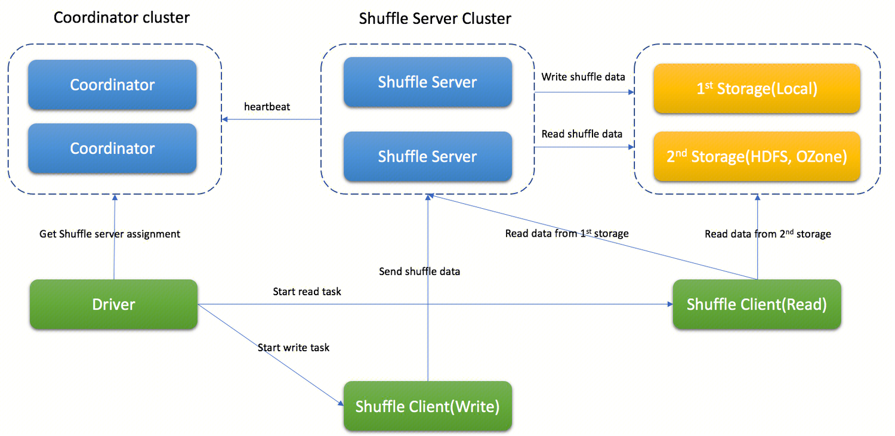
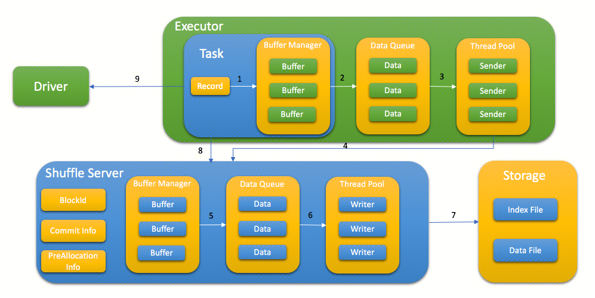
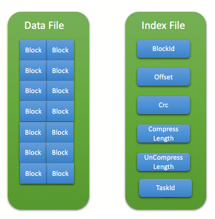

说明：代码部分以 spark 3.4.2 为例讲解，辅以 spark 3.1.3。

# 1. External Shuffle Service（ESS）

## 1.1 ESS 背景

**首先介绍动态资源分配（Dynamic Resource Allocation），它可以根据工作负载动态调整应用程序占用的资源**。这意味着，如果不再使用资源，应用程序可以将资源交还给集群，并在以后有需求时再次请求资源。如果多个应用程序共享 Spark 集群中的资源，该功能尤其有用。使用此功能有两种方法：第一种，应用程序必须将 spark.dynamicAllocation.enabled 和 spark.dynamicAllocation.shuffleTracking.enabled 都设置为 true。第二种，在同一集群的每个工作节点上设置外部 Shuffle 服务后，应用程序必须将 spark.dynamicAllocation.enabled 和 spark.shuffle.service.enabled 都设置为 true。**Shuffle 跟踪或外部 Shuffle 服务的目的是允许删除 Executor 而不删除它们写入的 Shuffle 文件**。虽然启用 Shuffle 跟踪很简单，但在不同的集群管理器中设置外部 Shuffle 服务的方式各不相同，这里以 Yarn 为例：

1. 编译 Spark，将生成的 spark-\<version>-yarn-shuffle.jar 添加到集群中所有 NodeManager 的类路径（share/hadoop/yarn/lib/）中；
2. 在每个节点的 yarn-site.xml 中，将 spark_shuffle 添加到 yarn.nodemanager.aux-services，然后将 yarn.nodemanager.aux-services.spark_shuffle.class 设置为 org.apache.spark.network.yarn.YarnShuffleService；
3. 通过在 etc/hadoop/yarn-env.sh 中设置 YARN_NODEMANAGER_HEAPSIZE（默认为 1000）来增加 NodeManager 的堆大小，以避免在洗牌过程中出现垃圾回收问题；
4. 重新启动集群中的所有 NodeManager。
5. 额外配置参数 spark.yarn.shuffle.stopOnFailure 默认为 false，表示当 Spark Shuffle 服务初始化失败时，是否停止 NodeManager，这可以防止在 Spark Shuffle 服务未运行的 NodeManager 上运行容器导致的应用程序故障。

为什么动态资源分配需要开启 ESS 呢？在动态分配之前，Spark Executor 在失败或关联的应用程序退出时退出。在这两种情况下，与 Executor 相关的所有状态都不再需要，并且可以安全地丢弃。**然而，在动态分配中，当显式删除 Executor 时，应用程序仍在运行。如果应用程序尝试访问 Executor 中存储或写入的状态，它将需要重新计算该状态**。因此，Spark 需要一种机制，在删除 Executor 之前优雅地停用它并保留其状态，这个要求对于 Shuffle 特别重要。**在 Shuffle 过程中，Spark Executor 首先将自己的 Map 输出写入本地磁盘，然后在其他 Executor 尝试获取这些文件时充当服务器**。如果出现滞后任务（即运行时间比同级任务长很多的任务），动态分配可能在 Shuffle 完成之前删除 Executor，在这种情况下，必须对该 Executor 写入的 Shuffle 文件进行不必要的重新计算。

保留 Shuffle 文件的解决方案是使用外部 Shuffle 服务，也在 Spark 1.2 中引入。**该服务指的是一个长期运行的进程**，它独立于 Spark 应用程序及其 Executor 在集群的每个节点上运行。如果启用了该服务，Spark Executor 将从该服务而不是从其他 Executor 获取 Shuffle 文件。**这意味着由 Executor 写入的任何 Shuffle 状态可能会在 Executor 的生命周期之外继续提供服务**。

**除了写入 Shuffle 文件，Executor 还会将数据缓存到磁盘或内存中。然而，当删除 Executor 时，所有缓存数据都将无法再访问。为了缓解这个问题，默认情况下，包含缓存数据的 Executor 永远不会被删除，可以使用 spark.dynamicAllocation.cachedExecutorIdleTimeout 配置此行为**。在未来的版本中，缓存的数据可能会通过类似于外部 Shuffle 服务的非堆存储来保留。

 

## 1.2 ESS 架构

Shuffle 操作是 MapReduce 计算范式的关键，其中中间数据通过 Map 和 Reduce 任务之间的全对全（all-to-all）连接进行传输。尽管 Shuffle 操作的基本概念很简单，但不同框架采用了不同的实现方法。**一些框架如 Presto 和 Flink 流处理将中间 Shuffle 数据存储在内存中以满足低延迟需求，而其他框架如 Spark 和 Flink 批处理将其存储在本地磁盘上以获得更好的容错性。在将中间 Shuffle 数据存储在磁盘上时，有基于哈希的解决方案，其中每个 Map 任务为每个 Reduce 任务生成单独的文件，也有基于排序的解决方案，其中 Map 任务的输出按分区键的哈希值进行排序，并作为单个文件存储。虽然基于排序的 Shuffle 会产生排序的开销，但当中间 Shuffle 数据的大小较大时，它是一种性能更好、可扩展的解决方案**。Spark 和 Flink 等框架采用了 ESS 来提供已存储的中间 Shuffle 数据，以实现更好的容错性和性能隔离。随着网络和存储硬件的不断改进，一些解决方案将 Shuffle 洗牌数据存储在非本地存储中，替代本地存储；其他解决方案则绕过了中间 Shuffle 数据的存储，直接将 Map 任务的输出推送给 Reduce 任务，以实现低延迟。这种洗牌实现的多样性为这些计算引擎中的洗牌操作提供了丰富的优化空间。

### 1.2.1 Pull-based Shuffle Service

**Spark 3.2 之前采用的是拉取式洗牌服务（Pull-based Shuffle Service）**，其工作方式如下：

1. 每个 Spark Executor 在启动时向位于同一节点上的 Spark ESS 注册，同步其本地 Map 任务的 Shuffle 数据位置。注意，Spark ESS 独立于 Spark Executor，且在多个 Spark 应用程序之间共享。
2. Shuffle Map 阶段中的每个任务处理其所负责的数据部分。在 Map 任务结束时，它会生成两个文件，一个用于 Shuffle 数据，另一个用于索引前者的 Shuffle Blocks。为此，Map 任务根据分区键的哈希值对所有转换后的记录进行排序，在此过程中，如果 Map 任务无法在内存中将整个数据排序，就可能会将中间数据溢写到磁盘上。一旦排序完成，将生成 Shuffle 数据文件，其中将属于同一 Shuffle 分区的所有记录分组到一个 Shuffle Block 中，同时生成匹配的 Shuffle 索引文件，记录 Block 边界偏移量。
3. 当下一个阶段的 Reduce 任务开始运行时，它们将向 Spark Driver 查询其输入 Shuffle Block 的位置。一旦这些信息可用，每个 Reduce 任务将建立与相应的 Spark ESS 的连接，以获取其输入数据。Spark ESS 在收到此类请求时，利用 Shuffle 索引文件跳转到 Shuffle 数据文件中的相应 Block 数据，从磁盘中读取，并将其发送回 Reduce 任务。



1、Pull-based Shuffle Service 的优点在于：

- 即使 Spark Executor 遇到 GC 暂停，ESS 仍可提供 Shuffle Block。 
- 即使 Spark Executor 消失，仍可提供 Shuffle Block。 
- 空闲的 Spark Executor 可以释放，以节省集群计算资源。 

2、Pull-based Shuffle Service 的缺点在于：

- **磁盘 I/O 效率低**。虽然 Map 任务最终会将 Shuffle 结果合并成一个文件，但是每个 Reduce 任务在请求 Shuffle 数据时，一次只会请求一个 Block 数据。ESS 在接收到无序的 Shuffle 数据请求时，只能重复通过随机 I/O 读取大量大小在数十 KB 的 Block 数据，因此磁盘 I/O 效率低。即使有索引文件帮助定位数据，但 Reduce 任务所需的数据分布可能是非连续的，所以仍然需要进行随机 I/O。注意，在 Spark 集群中主要使用 HDD 来存储中间 Shuffle 数据，因为与 SSD 相比，HDD 在大规模存储具有成本优势，且 SSD 在用于临时数据存储（如 Shuffle 数据）时容易磨损。
- **Shuffle 网络连接可靠性问题**。Spark Executor 使用连接池来管理不同机器间的网络连接，对于相同地址的请求，会复用同一个连接。当 Map 任务的 Shuffle 结果存储在 S 个 ESS 服务上，Reduce 任务分布在 E 个 Executors 上，那么理论上会建立 E * S 个网络连接，生产环境中 E 和 S 都可能会超过 1000，那么网络出现问题的概率就会比较大。即使 Spark 内部通过重试，恢复网络连接，重新获取到了 Shuffle 数据，但这些任务的执行时间也会变长，从而影响作业执行时间。
- **Shuffle 数据的本地性不好**。如果 Shuffle 数据在 Reduce 任务本地可用，任务可以直接从磁盘中读取它，绕过 ESS，这也有助于减少 Shuffle 期间 RPC 的连接数量。但由于 Reduce 任务计算需要的 Shuffle 数据分散在不同的节点上，导致数据本地性不好，虽然拉取 Shuffle 数据和 Reduce 任务计算可以同时进行，但是 Reduce 任务的计算一般还是快于 Shuffle 数据的获取过程，从而限制了 Reduce 任务计算速度。

 

### 1.2.2 Push-based Shuffle Service

**自 Spark 3.2 开始，采用的是推送式洗牌服务（Push-based Shuffle Service）**，该方案最初由 LinkedIn 三位大佬提出，称为 Magnet，后来 Spark 社区参考他们的论文进行了实现，其工作方式如下：

1. Executor 启动时向位于同一节点的 ESS 服务进行注册，同步 Shuffle 目录配置等信息。
2. **Map Stage 在启动前，DAG Scheduler 会尝试给该 Stage 选择一组 ESS 服务作为 ShufflePushMergerLocations**。Map 任务执行完后，将计算结果写到本地磁盘，包括数据文件和索引文件。
3. **Map 任务会启动一个线程池读取本地的 Shuffle 数据，将 Shuffle Block 数据推送到 Block 所属的 Reduce 任务对应的 Remote ESS 服务**。
4. **ESS 服务接收自不同 Executor 推送过来的 Shuffle Blocks，相同 Reduce 的 Shuffle 数据会合并到同一文件中，多个 Shuffle Blocks 会合并成一个 Chunk 进行存储，此外还会有 Index 文件和 Meta 文件来保证数据的可靠性**。
5. Map 任务向 Driver 上报所有 Blocks 信息和 MapStatus 元数据信息。
6. Reduce 阶段在启动前会有一个等待，让更多的 Map 结果被 Push 到 Remote ESS，然后 Spark Driver 会向所有 ShufflePushMergerLocations 的 ESS 发送一个 FinalizeShuffleMerge 请求，ESS 服务收到请求后，停止接收 Pushed Shuffle 数据，并持久化所有缓存数据到文件中，最后向 Driver 返回最终 Merged Shuffle Blocks 信息。
7. Reduce 任务启动后，向 Driver 获取 Shuffle MapStatus 元数据和 MergeStatus 元数据。
8. **对于已经 Merge 好的 Shuffle 数据，Reduce 任务先向 ESS 服务请求获取 Merged Shuffle Blocks 的 Meta 数据，然后获取对应的 Merged Shuffle 数据；对于还没有被 Merge 的 Shuffle 数据，直接从原来的 Map 任务所在节点的 ESS 服务请求读取 Shuffle 数据**。获取到 Shuffle 数据后，继续执行 Reduce 任务。



Push-based Shuffle Service 的优点在于：

- **推送并合并 Shuffle 数据，I/O 效率高，网络连接更可靠**。Map 生成的 Shuffle 数据被推送到 Remote ESS 服务，并按 Shuffle 分区进行合并，**即将对小洗牌块的随机读取转换为对以 MB 为单位的顺序读取，避免大量网络传输**。与 HDD 的小规模随机读取不同，小规模随机写入可以从多级缓存（如操作系统页面缓存和磁盘缓冲区）中受益，这些缓存将多个写操作组合成一个，减少了放置在磁盘上的写操作次数，因此小规模随机写入可以实现比小规模随机读取更高的吞吐量。此外，Shuffle Push 操作与 Map 解耦，因此如果操作失败，它不会增加 Map 任务的运行时间，也不会导致 Map 任务失败。
- **灵活的部署策略，数据本地性更好**。在存算一体环境中，**由于每个 Reduce 任务的大部分输入在一个位置合并，Magnet 根据 Shuffle 服务的位置来启动 Spark Executor 执行 Reduce 任务**，而不是根据 Spark Executor 的位置选择 Shuffle 服务，实现了更好的数据本地性。在存算分离环境中，Reduce 任务的数据本地性不再重要，**Magnet 可以通过选择负载较轻的远程 Shuffle 服务，实现负载均衡**，同时通过在网络上读取较大的数据 Block 而不是小的碎片化 Block，更好地利用网络带宽。
- **提高 Shuffle 可靠性，处理任务执行时间过长和数据倾斜**：**Magnet 采取尽力而为的方法，它有效地复制了 Shuffle 数据，允许 Reduce 获取合并和未合并的洗牌数据作为任务输入，这使得 Magnet 能够容忍 Blocks 推送操作部分完成**。因此，在 Blocks 推送/合并操作期间的任何故障都不会导致致命错误，通过停止慢速推送操作或跳过推送大型/倾斜的 Blocks 可以缓解任务执行时间过长和数据倾斜问题。另外，虽然 Magnet 维护了 Shuffle 数据的两个副本，提高 Shuffle 的可靠性，但也增加了 Shuffle 数据的存储需求和写操作。在实践中，前者并不是一个主要问题，因为 Shuffle 数据只在磁盘上临时存储，一旦应用程序完成，所有 Shuffle 数据都会被删除。
- **Push Shuffle 数据与 Map 任务并行**。如下图 (a) 所示，Hadoop MapReduce 通过一种称为“慢启动”的技术实现了有限的并行，它允许一些 Reduce 任务在一些 Map 任务仍在运行时开始获取 Shuffle 数据，这样只有一些 Reduce 任务的 Shuffle 数据获取时间与 Map 任务的执行时间重叠。如下图 (b) 所示，Spark 原始方式通过异步 RPC 实现并行，使用单独的线程来获取远程 Shuffle Blocks 并在获取的 Block 上执行 Reduce 任务，这两个线程就像一对生产者和消费者，允许 Shuffle 数据获取和 Reduce 任务执行之间更好地重叠。**如下图 (c) 所示，Magnet 通过利用专用线程池，将 Shuffle Blocks 推送操作与 Map 任务的执行解耦，Map 任务执行时并行推送 Blocks**，虽然 Shuffle 任务可能更加 CPU/内存密集，但 Blocks 推送操作更加磁盘/网络密集。另外，将整个合并的 Shuffle 文件作为单个 Block 获取可能会导致不希望的获取延迟，因为这样无法在 Shuffle 数据获取和 Reduce 任务执行之间实现很大的并行化。为了解决这个问题，**Magnet 在 Block 附加到合并的 Shuffle文件时，将每个合并的 Shuffle 文件划分为多个大小为 MB 的片段**。Spark Driver 只需要以合并的 Shuffle 分区为粒度跟踪信息，合并的 Shuffle 文件如何进一步划分为片段只由 Magnet Shuffle 服务通过索引文件跟踪，**这样 Reduce 任务可以将对合并的 Shuffle 文件的单个获取转换为对多个大小为 MB 的片段的多次获取**，这有助于在优化磁盘 I/O、并行化数据传输、任务执行之间实现更好的平衡。

 

 

## 1.3 动态资源分配源码

1、这里以 Spark on Yarn Cluster 模式讲解。Spark 动态分配初始 Executor 个数为：max("spark.dynamicAllocation.minExecutors", "spark.dynamicAllocation.initialExecutors", "spark.executor.instances")，并启动一个线程，每隔 100 毫秒周期性执行调度任务。该任务首先检查空闲的 Executor，**判定规则是 Executor 未缓存 Data Blocks 和 Shuffle Data，且空闲时间超过参数 "spark.dynamicAllocation.executorIdleTimeout"**。然后根据当前负载，计算实际所需的最大 Executor 数量，以满足所有正在运行和挂起的任务，当目标数量超过实际需要的数量，停止向 Yarn 申请新的 Executor；否则，当目标数量少于实际需要的数量，则分轮请求 Executor，当有待处理 Task 的时间达到 spark.dynamicAllocation.schedulerBacklogTimeout 时，就会触发实际请求，此后如果待处理任务队列持续存在，就会每隔 spark.dynamicAllocation.sustainedSchedulerBacklogTimeout 再次触发请求，**每轮请求的 Executor 数量都会比上一轮呈指数增长**，例如，应用程序会在第一轮增加 1 个 Executor，然后在随后的几轮中增加 2、4、8 个 Executor，依此类推。最后 Spark 向 Yarn 请求移除之前判定的空闲 Executor。

```scala
SparkContext
  // 创建TaskScheduler，负责Task级的调度
  val (sched, ts) = SparkContext.createTaskScheduler(this, master)
    // 返回类型ExternalClusterManager，其有3个子类：KubernetesClusterManager、MesosClusterManager、YarnClusterManager，后面调用的都是YarnClusterManager重写的方法
    case masterUrl => val cm = getClusterManager(masterUrl)
    // Cluster模式返回YarnClusterScheduler实例，Client模式返回YarnScheduler实例
    val scheduler = cm.createTaskScheduler(sc, masterUrl)
    // Cluster模式返回YarnClusterSchedulerBackend实例，Client模式返回YarnClientSchedulerBackend实例
    val backend = cm.createSchedulerBackend(sc, masterUrl, scheduler)
    // 初始化backend，SchedulerBackend是TaskScheduler重要成员，用于和外部组件进行通信交互
    cm.initialize(scheduler, backend)
      // 这里还构建了任务调度池，分为FIFOSchedulableBuilder（默认）、FairSchedulableBuilder两种
      scheduler.asInstanceOf[TaskSchedulerImpl].initialize(backend)
  
  // 是否开启动态分配，配置参数spark.dynamicAllocation.enabled
  val dynamicAllocationEnabled = Utils.isDynamicAllocationEnabled(_conf)
  // schedulerBackend即上面创建的YarnClientSchedulerBackend实例
  // 继承关系：YarnClusterSchedulerBackend -> YarnSchedulerBackend -> CoarseGrainedSchedulerBackend -> ExecutorAllocationClient & SchedulerBackend
  schedulerBackend match { case b: ExecutorAllocationClient => Some(new ExecutorAllocationManager(...)) }
  // 注册调度器回调以决定何时添加和移除Executor，并启动调度任务
  _executorAllocationManager.foreach(_.start())
    // listener类型ExecutorAllocationListener
    listenerBus.addToManagementQueue(listener)
      // 将监听器添加到特定队列中，如果需要则创建新队列，队列彼此独立（每个队列使用单独的线程传递事件），允许较慢的监听器在某种程度上与其他监听器隔离开来
      // 有四种异步事件队列，名称分别为：shared、appStatus、executorManagement、eventLog，这里是executorManagement
      addToQueue(listener, EXECUTOR_MANAGEMENT_QUEUE)
        val newQueue = new AsyncEventQueue(queue, conf, metrics, this)
        newQueue.addListener(listener)
    // executorMonitor类型ExecutorMonitor，调用逻辑同上
    listenerBus.addToManagementQueue(executorMonitor)
    // 线程周期性执行调度任务，默认100毫秒
    executor.scheduleWithFixedDelay(scheduleTask, 0, intervalMillis, TimeUnit.MILLISECONDS)
      run()
        schedule()
          // 1.返回当前被认为已超时的ExecutorID及其ResourceProfileID的列表
          val executorIdsToBeRemoved = executorMonitor.timedOutExecutors()
            case (_, exec) => val deadline = exec.timeoutAt
              // 有3种情况会更新timeoutAt属性值：①当调用onExecutorAdded方法时，此时还没有Task运行，Executor空闲，timeoutAt更新为：当前时间 + timeout（timeout见下面说明）
              // ②当调用onTaskStart方法时，此时有Task运行，timeoutAt直接更新为：Long.MaxValue ③当调用onTaskEnd方法时，此时也没有Task运行，timeoutAt更新为：当前时间 + timeout
              updateTimeout()
                // 如果Executor缓存了数据块，值为spark.dynamicAllocation.cachedExecutorIdleTimeout（默认为Integer.MAX_VALUE秒），否则为0
                val _cacheTimeout = if (cachedBlocks.nonEmpty) storageTimeoutNs else 0
                // 如果spark.shuffle.service.enabled=false（内部环境为true），且spark.dynamicAllocation.shuffleTracking.enabled=true，且Executor缓存了Shuffle数据，
                // 值为spark.dynamicAllocation.shuffleTracking.timeout（默认为Long.MaxValue毫秒），否则为0
                val _shuffleTimeout = if (shuffleIds != null && shuffleIds.nonEmpty) { shuffleTimeoutNs } else { 0 }
                // idleTimeoutNs即参数spark.dynamicAllocation.executorIdleTimeout（默认为60秒）
                val timeout = Seq(_cacheTimeout, _shuffleTimeout, idleTimeoutNs).max
                val deadline = idleStart + timeout
          // 2.更新每个ResourceProfile的目标Executor数量，然后将结果与集群管理器同步   
          updateAndSyncNumExecutorsTarget(clock.nanoTime())
            // 在当前负载下，为指定的ResourceProfile ID获取所需的最大Executor数量，以满足所有正在运行和挂起的任务，结果向上取整
            val maxNeeded = maxNumExecutorsNeededPerResourceProfile(rpId)
              // 未调度的任务数
              val unschedulableTaskSets = listener.pendingUnschedulableTaskSetsPerResourceProfile(rpId)
              // 运行中或待处理的任务数 = pending的任务数 + pending的推测任务数 + 正在运行的任务数
              val numRunningOrPendingTasks = pendingTask + pendingSpeculative + running
              // executorAllocationRatio即参数spark.dynamicAllocation.executorAllocationRatio，tasksPerExecutor即在Executor上可以执行的最大任务数
              val maxNeeded = math.ceil(numRunningOrPendingTasks * executorAllocationRatio / tasksPerExecutor).toInt
              // 如果unschedulableTaskSets > 0，计算未调度的任务所需的Executor数量
              val maxNeededForUnschedulables = math.ceil(unschedulableTaskSets * executorAllocationRatio / tasksPerExecutor).toInt
              // 如果unschedulableTaskSets > 0，返回max(maxNeeded, 当前已分配的Executor数量 + 未调度的任务所需的Executor数量)；否则直接返回maxNeeded
              math.max(maxNeededWithSpeculationLocalityOffset, executorMonitor.executorCountWithResourceProfile(rpId) + maxNeededForUnschedulables)
            // 目标数量超过实际需要的数量，停止添加新的Executor，并通知集群管理器取消额外的pending请求
            // 这里只降低目标Executor数量，暂时不主动终止任何Executor，终止由空闲超时单独控制，减少目标数量仍然有帮助，以防Executor丢失  
            if (maxNeeded < targetExecs) { decrementExecutorsFromTarget(maxNeeded, rpId, updatesNeeded) }
              updateTargetExecs(decrementExecutors, maxNeeded, rpId, updatesNeeded)
                // 获取增加或减少的Executor数量
                val delta = updateTargetFn(maxNeeded, rpId)
                  // 需要减少的Executor数量 = maxNeeded - oldNumExecutorsTarget
                  decrementExecutors
                    val oldNumExecutorsTarget = numExecutorsTargetPerResourceProfileId(rpId)
                    numExecutorsTargetPerResourceProfileId(rpId) = math.max(maxNeeded, minNumExecutors)
                    numExecutorsTargetPerResourceProfileId(rpId) - oldNumExecutorsTarget
            // 目标数量少于实际需要的数量，且当前时间达到addTime。当Task提交时，addTime初始化为：当前时间 + spark.dynamicAllocation.schedulerBacklogTimeout
            else if (addTime != NOT_SET && now >= addTime) { addExecutorsToTarget(maxNeeded, rpId, updatesNeeded) }
              updateTargetExecs(addExecutors, maxNeeded, rpId, updatesNeeded)
                // 获取增加或减少的Executor数量（同上）
                val delta = updateTargetFn(maxNeeded, rpId)
                  // 需要增加的Executor数量 = numExecutorsTarget - oldNumExecutorsTarget
                  addExecutors
                    // 目标Executor数量至少与当前分配的数量一样多
                    var numExecutorsTarget = math.max(numExecutorsTargetPerResourceProfileId(rpId), executorMonitor.executorCountWithResourceProfile(rpId))
                    // 目标Executor数量加上本轮需要增加的数量（每轮请求的Executor数量都会比上一轮呈指数增长，后面介绍）
                    numExecutorsTarget += numExecutorsToAddPerResourceProfileId(rpId)
                    // 目标Executor数量不超过当前所需的数量maxNeeded
                    numExecutorsTarget = math.min(numExecutorsTarget, maxNumExecutorsNeeded)
                    // 目标Executor数量必须在参数spark.dynamicAllocation.minExecutors与spark.dynamicAllocation.maxExecutors之间
                    numExecutorsTarget = math.max(math.min(numExecutorsTarget, maxNumExecutors), minNumExecutors)
                    val delta = numExecutorsTarget - oldNumExecutorsTarget
            doUpdateRequest(updatesNeeded.toMap, now)
              // 实际调用CoarseGrainedSchedulerBackend类的方法，向集群管理器更新调度需求（同下）
              client.requestTotalExecutors(...)
              if (delta > 0)
                // 每轮请求的Executor数量都会比上一轮呈指数增长，例如，第一轮增加1个Executor，然后在随后的几轮中增加2、4、8个Executor，依此类推
                numExecutorsToAddPerResourceProfileId(rpId) = ... numExecutorsToAddPerResourceProfileId(rpId) * 2}
                // 即每隔spark.dynamicAllocation.sustainedSchedulerBacklogTimeout秒再次触发请求
                addTime = now + TimeUnit.SECONDS.toNanos(sustainedSchedulerBacklogTimeoutS)
          // 3.请求集群管理器移除给定的Executor，返回被移除的Executor列表
          removeExecutors(executorIdsToBeRemoved)
            // 实际调用CoarseGrainedSchedulerBackend类的方法，向集群管理器请求杀死给定的Executors
            client.killExecutors(executorIdsToBeRemoved.toSeq, adjustTargetNumExecutors = false, countFailures = false, force = false)
              // YarnSchedulerBackend重写了该方法
              doKillExecutors(executorsToKill)
                // 继承关系：KillExecutors -> CoarseGrainedClusterMessage -> Serializable
                yarnSchedulerEndpointRef.ask[Boolean](KillExecutors(executorIds))
            // [SPARK-21834] killExecutors减少了目标Executor的数量，因此需要使用所需的值更新目标数量
            client.requestTotalExecutors(...)
            // 将给定的Executor标记为待删除状态
            executorMonitor.executorsKilled(executorsRemoved.toSeq)
    
    // numExecutorsTargetPerResourceProfileId类型为mutable.HashMap[Int, Int]，表示每个ResourceProfile当前所需的Executor数量
    // ResourceProfile是一个类，表示与RDD关联的资源配置文件，它允许用户为一个RDD指定Executor和Task的需求，并在一个Stage中应用这些需求
    val numTarget = numExecutorsTargetPerResourceProfileId.toMap
      numExecutorsTargetPerResourceProfileId(defaultProfileId) = initialNumExecutors
        // 动态分配初始Executor个数为：max("spark.dynamicAllocation.minExecutors", "spark.dynamicAllocation.initialExecutors", "spark.executor.instances")
        private val initialNumExecutors = Utils.getDynamicAllocationInitialExecutors(conf)
          val initialExecutors = Seq(conf.get(DYN_ALLOCATION_MIN_EXECUTORS), conf.get(DYN_ALLOCATION_INITIAL_EXECUTORS), conf.get(EXECUTOR_INSTANCES).getOrElse(0)).max
    // numLocalityAwareTasksPerResourceProfileId类型为mutable.HashMap[Int, Int]，表示每个ResourceProfile的本地感知任务数量，用于决定Executor哪里执行
    val numLocality = numLocalityAwareTasksPerResourceProfileId.toMap
      numLocalityAwareTasksPerResourceProfileId(defaultProfileId) = 0
    // 实际调用CoarseGrainedSchedulerBackend类的方法，向集群管理器更新调度需求
    client.requestTotalExecutors(numExecutorsTarget, numLocalityAware, rpIdToHostToLocalTaskCount)
      // YarnSchedulerBackend重写了该方法，向Yarn请求Executor数量（包括现有挂起和运行的Executor）
      doRequestTotalExecutors(requestedTotalExecutorsPerResourceProfile.toMap)
        yarnSchedulerEndpointRef.ask[Boolean](prepareRequestExecutors(resourceProfileToTotalExecs))
          // 继承关系：RequestExecutors -> CoarseGrainedClusterMessage -> Serializable
          RequestExecutors(...)
```

 

## 1.4 ESS 源码

1、在《Spark Core 入门》中介绍过，Spark on Yarn 的 Executor 的启动类是 org.apache.spark.executor.YarnCoarseGrainedExecutorBackend，并最终调用 CoarseGrainedExecutorBackend 向 Driver 注册 Executor。

```scala
YarnCoarseGrainedExecutorBackend
  main()
    // 最终仍会调用CoarseGrainedExecutorBackend（与上一篇文章相同，直接复制）
    CoarseGrainedExecutorBackend.run(backendArgs, createFn) 
      // 使用指定名称注册一个RpcEndpoint，并返回其RpcEndpointRef
      env.rpcEnv.setupEndpoint("Executor", backend)
        dispatcher.registerRpcEndpoint(name, endpoint)
          new NettyRpcEndpointRef()
          new DedicatedMessageLoop()
            inbox = new Inbox(name, endpoint)
              messages = new java.util.LinkedList[InboxMessage]()
              // OnStart是要处理的第一条消息
              messages.add(OnStart)
              // process()循环处理消息，即调用CoarseGrainedExecutorBackend类的onStart()
              case OnStart => endpoint.onStart()
                // 向Driver注册Executor
                ref.ask[Boolean](RegisterExecutor()）
                // 如果注册成功，向自己发送一条消息。self是父类RpcEndpoint的属性，类型是RpcEndpointRef
                case Success(_) => self.send(RegisteredExecutor)
                  // 后续CoarseGrainedExecutorBackend类的receive()处理接收的消息，这里生成Executor计算对象
                  // 粗看Executor等同CoarseGrainedExecutorBackend通信后台，是个进程；细看Executor其实是个计算对象，里面有个线程池处理Task
                  case RegisteredExecutor => executor = new Executor()
```

2、**Executor 向 ESS 注册流程**。**Executor 首先会在环境变量 LOCAL_DIRS 配置的本地目录下创建名为“blockmgr-{UUID}”的子目录**，在 Yarn 集群下，LOCAL_DIRS 环境变量为 ${yarn.nodemanager.local-dirs}/usercache/${user}/appcache/application_${appid}/，然后通过 RPC 向 ESS 同步注册，注册是为了通知 ESS 其存储 Shuffle 文件的位置和方式。

```scala
Executor
  // 使用给定的appId初始化BlockManager
  env.blockManager.initialize(conf.getAppId)
    // 参数spark.shuffle.service.enabled
    if (externalShuffleServiceEnabled)
      logInfo(s"external shuffle service port = $externalShuffleServicePort")
        val externalShuffleServicePort = StorageUtils.externalShuffleServicePort(conf)
          // Shuffle端口配置参数spark.shuffle.service.port，默认7337
          val tmpPort = Utils.getSparkOrYarnConfig(conf, config.SHUFFLE_SERVICE_PORT.key, config.SHUFFLE_SERVICE_PORT.defaultValueString).toInt
      // Executor Shuffle文件的服务器地址，这里是ESS服务器的地址。若ESS未开启，则是Executor自己的BlockManager
      shuffleServerId = BlockManagerId(executorId, blockTransferService.hostName, externalShuffleServicePort)
      // 向ESS注册Executor，注册是为了通知Shuffle Server我们存储Shuffle文件的位置和方式
      registerWithExternalShuffleServer()
        logInfo("Registering executor with local external shuffle service.")
        // Executor正在使用的Shuffle管理器，如果开启了Push-based Shuffle，则还以JSON格式包含元信息
        val shuffleManagerMeta = if (Utils.isPushBasedShuffleEnabled(...)) { s"${shuffleManager.getClass.getName}:" +
          s"${diskBlockManager.getMergeDirectoryAndAttemptIDJsonString()}}}" } else { shuffleManager.getClass.getName }
        // 第一个参数表示存储Shuffle文件的本地目录；第二参数表示每个本地目录创建的子目录个数；第三个参数表示Executor正在使用的Shuffle管理器（SortShuffleManager），
        // 如果此字符串包含冒号，它还将以JSON格式包含Push-based Shuffle的元信息，带有冒号的字符串示例如下：SortShuffleManager:{"mergeDir": "mergeDirectory_1", "attemptId": 1}
        val shuffleConfig = new ExecutorShuffleInfo(diskBlockManager.localDirsString, diskBlockManager.subDirsPerLocalDir, shuffleManagerMeta)
          val localDirsString: Array[String] = localDirs.map(_.toString)
            // 在配置的每个本地目录中创建多个子目录，我们将文件哈希到这些子目录中，以避免在顶层具有非常大的inode
            val localDirs: Array[File] = createLocalDirs(conf)
              // 返回配置的本地目录，若是Yarn Container则获取LOCAL_DIRS环境变量，否则依次使用SPARK_EXECUTOR_DIRS、SPARK_LOCAL_DIRS、spark.local.dir、java.io.tmpdir
              // 在Yarn集群下，LOCAL_DIRS环境变量为${yarn.nodemanager.local-dirs}/usercache/${user}/appcache/application_${appid}/
              Utils.getConfiguredLocalDirs(conf)
              // 每个配置的本地目录，在其下创建名为“blockmgr-{UUID}”的子目录
              val localDir = Utils.createDirectory(rootDir, "blockmgr")
              logInfo(s"Created local directory at $localDir")
          // 参数spark.diskStore.subDirectories，默认64
          val subDirsPerLocalDir = conf.get(config.DISKSTORE_SUB_DIRECTORIES)
        // 同步注册Executor，如果无法连接，默认等待5秒，重试spark.shuffle.registration.maxAttempts次，重试失败将抛出异常
        blockStoreClient.asInstanceOf[ExternalBlockStoreClient].registerWithShuffleServer(...)
          // 通过RPC发送RegisterExecutor消息，继承关系：RegisterExecutor -> BlockTransferMessage -> Encodable
          ByteBuffer registerMessage = new RegisterExecutor(appId, execId, executorInfo).toByteBuffer();
          client.sendRpcSync(registerMessage, registrationTimeoutMs);
```

3、**ESS 启动流程。启动入口是 org.apache.spark.network.yarn.YarnShuffleService，该类继承自由 NodeManager 启动的通用服务类 AuxiliaryService，并复写了其中的方法**。ESS 一旦接收到 Executor 通过 RPC 发送的 BlockTransferMessage 消息，将根据消息的类型分 7 种情况进行处理。若消息类型是 RegisterExecutor，将在 ExternalShuffleBlockResolver 类中保存 ExecutorInfo（包括存储 Shuffle 文件的本地目录、 每个本地目录创建的子目录个数、Executor正在使用的Shuffle管理器），并在 LEVELDB 数据库中也保存一份，若开启了 Push-based Shuffle Service，还将在 MergedShuffleFileManager 类中保存 AppPathsInfo（包括 appId、存储 Shuffle 文件的本地目录、Shuffle 合并目录、每个本地目录创建的子目录个数），并同样在 LEVELDB 数据库中也保存一份。

```scala
// 继承关系：YarnShuffleService -> AuxiliaryService
YarnShuffleService
  serviceInit(Configuration externalConf)
    // 继承关系：ExternalBlockHandler -> RpcHandler，RpcHandler提供了相关接口，用于处理TransportClient调用sendRPC()发送的消息
    blockHandler = new ExternalBlockHandler(transportConf, registeredExecutorFile, shuffleMergeManager)
      // ExternalBlockHandler复写了receive()方法，该方法将接收并处理Executor通过RPC发送的RegisterExecutor消息
      receive(...)
        // 反序列化为BlockTransferMessage
        BlockTransferMessage msgObj = BlockTransferMessage.Decoder.fromByteBuffer(message)
        // BlockTransferMessage消息处理分为如下7种，这里先重点关注RegisterExecutor
        handleMessage(msgObj, client, callback)
          // ①获取Shuffle Blocks和Chunks（用于Push-based Shuffle Service），或请求读取一组Blocks
          if (msgObj instanceof AbstractFetchShuffleBlocks || msgObj instanceof OpenBlocks)
            // 具体处理的消息分为三类：FetchShuffleBlockChunks、FetchShuffleBlocks、OpenBlocks（见下面向ESS获取Shuffle数据流程说明）
            if (msgObj instanceof AbstractFetchShuffleBlocks)... else ...
          // ②Executor与其本地Shuffle服务器之间的初始注册消息
          else if (msgObj instanceof RegisterExecutor)
            // ExternalShuffleBlockResolver类将Shuffle Block ID转换为本地文件的物理段
            blockManager.registerExecutor(msg.appId, msg.execId, msg.executorInfo)
              AppExecId fullId = new AppExecId(appId, execId)
              logger.info("Registered executor {} with {}", fullId, executorInfo)
              // 数据库中保存一份ExecutorShuffleInfo，DB类型由参数spark.shuffle.service.db.backend指定，支持LEVELDB（默认）、ROCKSDB
              db.put(key, value)
              // 内存中保存一份ExecutorShuffleInfo，executors类型为ConcurrentMap<AppExecId, ExecutorShuffleInfo>
              executors.put(fullId, executorInfo)
            // MergedShuffleFileManager类在开启Push-based Shuffle Service时，处理远程推送的Shuffle Blocks，并将它们合并为Shuffle文件。MergedShuffleFileManager目前实现有两个：
            // NoOpMergedShuffleFileManager（方法实现直接抛出异常）、RemoteBlockPushResolver，可由参数spark.shuffle.push.server.mergedShuffleFileManagerImpl指定，默认前者
            mergeManager.registerExecutor(msg.appId, msg.executorInfo)
              // RemoteBlockPushResolver类，shuffleManagerMeta中包含冒号，表示以JSON格式包含Push-based Shuffle的元信息
              if (shuffleManagerMeta.contains(SHUFFLE_META_DELIMITER))
                // 属性attemptId、mergeDir是从JSON字符串中解析出的"attemptId"、"mergeDir"对应的字段值
                if (attemptId == UNDEFINED_ATTEMPT_ID)
                  // 只有第一个RegisterExecutor消息才能注册合并目录，此时ExecutorShuffleInfo中没有存储attemptId
                  // appsShuffleInfo类型为ConcurrentMap<String, AppShuffleInfo>，同样数据库也保存一份
                  appsShuffleInfo.computeIfAbsent(appId, id -> {...})
                // ExecutorShuffleInfo中存储了attemptId，来自同一应用程序attempt的任何后续RegisterExecutor消息将不会覆盖合并目录，
                // 但是，它可以被来自较新应用程序attempt的RegisterExecutor消息覆盖，并且之前尝试的Shuffle分区信息也将被清除
                else appsShuffleInfo.compute(appId, (id, appShuffleInfo) -> {...})
          // ③请求移除一组Blocks
          else if (msgObj instanceof RemoveBlocks)
          // ④请求获取给定Executor的本地目录
          else if (msgObj instanceof GetLocalDirsForExecutors)
          // ⑤请求对给定的Shuffle进行最终合并（用于Push-based Shuffle Service）
          else if (msgObj instanceof FinalizeShuffleMerge)
          // ⑥移除给定Shuffle的合并数据（用于Push-based Shuffle Service）
          else if (msgObj instanceof RemoveShuffleMerge)
          // ⑦请求获取损坏Block的原因
          else if (msgObj instanceof DiagnoseCorruption)

    // Shuffle端口配置参数spark.shuffle.service.port，默认7337
    int port = _conf.getInt(SPARK_SHUFFLE_SERVICE_PORT_KEY, DEFAULT_SPARK_SHUFFLE_SERVICE_PORT)
    // TransportContext包含创建TransportServer、TransportClientFactory以及使用TransportChannelHandler设置Netty Channel管道的上下文
    transportContext = new TransportContext(transportConf, blockHandler, true)
    // 创建Server，尝试绑定到特定的端口
    shuffleServer = transportContext.createServer(port, bootstraps)
      new TransportServer(this, null, port, rpcHandler, bootstraps)
        init(hostToBind, portToBind)
          // Netty API，其中ioMode = NIO/EPOLL，Linux不支持AIO，故采用EPOLL方式来模拟，默认使用NIO
          bootstrap = new ServerBootstrap().group(bossGroup, workerGroup).channel(NettyUtils.getServerChannelClass(ioMode))...
    // 参数spark.yarn.shuffle.stopOnFailure，默认false。即当Spark Shuffle服务初始化失败时，默认不会停止NodeManager
    if (stopOnFailure) { throw e; }
```

4、**MapTask 写 Shuffle 数据流程**。在《Spark Core 入门》中介绍过，ShuffleMapTask 负责写，因此从 ShuffleMapTask 类的 runTask() 方法开始，这里主要关注 ESS 相关部分，忽略 Shuffle 写内存，排序，溢写等详细过程。以 SortShuffleWriter 为例，**它将 Shuffle 数据文件（.data）与索引文件（.index）均写到目录 ${LOCAL_DIRS}/blockmgr-{UUID}/xx/，${LOCAL_DIRS} 在 Yarn 集群下为：${yarn.nodemanager.local-dirs}/usercache/${user}/appcache/application_${appid}/，其中 xx 表示十六进制的两位字符，$yarn.nodemanager.local-dirs 为 yarn-site.xml 中参数**。如果开启了 Push-based Shuffle Service，还会将 Shuffle 数据文件转换为 PushRequest 列表，并使用固定线程池尽力而为地将其推送至 ESS。

```scala
ShuffleMapTask
  runTask(context: TaskContext)
    // 特定分区的写入过程，它控制从ShuffleManager获取的ShuffleWriter的生命周期，并触发RDD计算，最后返回该任务的MapStatus
    dep.shuffleWriterProcessor.write(...)
      // 根据不同的ShuffleHandle，获取不同Writer。SortShuffleManager重写了该方法，新版本已经不存在HashShuffleManager
      writer = manager.getWriter[Any, Any](...)
        case SerializedShuffleHandle => new UnsafeShuffleWriter(...)
        case BypassMergeSortShuffleHandle => new BypassMergeSortShuffleWriter(...)
        case BaseShuffleHandle => new SortShuffleWriter(...)
      // 继承关系：UnsafeShuffleWriter、BypassMergeSortShuffleWriter、SortShuffleWriter -> ShuffleWriter，这里以SortShuffleWriter为例
      writer.write(...)
        // 写入内存缓冲区，必要时溢写文件
        sorter.insertAll(records)
        // 合并溢写文件
        sorter.writePartitionedMapOutput(dep.shuffleId, mapId, mapOutputWriter)
        // 提交分区写入的数据，并返回每个分区写入的字节数。继承关系：LocalDiskShuffleMapOutputWriter -> ShuffleMapOutputWriter
        mapOutputWriter.commitAllPartitions(sorter.getChecksums)
          // 将数据和元数据文件作为原子操作进行提交，元数据文件包括索引文件、校验和文件（可选）
          blockResolver.writeIndexFileAndCommit(...)
            // 获取Shuffle索引文件
            val indexFile = getIndexFile(shuffleId, mapId)
              // 索引文件名为：shuffle_${shuffleId}_${mapId}_${reduceId}.index
              val blockId = ShuffleIndexBlockId(shuffleId, mapId, NOOP_REDUCE_ID)
                override def name: String = "shuffle_" + shuffleId + "_" + mapId + "_" + reduceId + ".index"
              blockManager.diskBlockManager.getFile(blockId)
                // 通过将文件名哈希为本地子目录来查找文件
                getFile(blockId.name)
                  // 索引文件所在的目录名为：${LOCAL_DIRS}/blockmgr-{UUID}/xx/，其中${LOCAL_DIRS}在Yarn集群下为：${yarn.nodemanager.local-dirs}/usercache/${user}/appcache/application_${appid}/
                  // 其中xx表示十六进制的两位字符，$yarn.nodemanager.local-dirs为yarn-site.xml中参数
                  val newDir = new File(localDirs(dirId), "%02x".format(subDirId))
                    // localDirs即为之前Executor向ESS注册时创建的目录：${LOCAL_DIRS}/blockmgr-{UUID}/
                    val localDirs: Array[File] = createLocalDirs(conf)
            // 获取Shuffle数据文件
            val dataFile = getDataFile(shuffleId, mapId)
              getDataFile(shuffleId, mapId, None)
                // 数据文件名为：shuffle_${shuffleId}_${mapId}_${reduceId}.data
                val blockId = ShuffleDataBlockId(shuffleId, mapId, NOOP_REDUCE_ID)
                  override def name: String = "shuffle_" + shuffleId + "_" + mapId + "_" + reduceId + ".data"
                // 与上面索引文件相同，数据文件（.data）与索引文件（.index）在相同目录
                blockManager.diskBlockManager.getFile(blockId)
        // ShuffleMapTask向Scheduler返回的结果，包括任务在Block Manager上存储的Shuffle文件的地址，以及每个Reducer的输出大小，用于传递给Reduce任务
        mapStatus = MapStatus(blockManager.shuffleServerId, partitionLengths, mapId)

      // 关闭ShuffleWriter，并获取MapTask写入状态MapStatus
      val mapStatus = writer.stop(success = true)
      if (mapStatus.isDefined)
        // 如果启用了Push-based Shuffle Service，则启动Shuffle推送过程。Map任务只负责将Shuffle数据文件转换为多个Block推送请求，而将Block的推送委托给不同的线程池
        if (!dep.shuffleMergeFinalized)
          logInfo(s"Shuffle merge enabled with ${dep.getMergerLocs.size} merger locations " + s" for stage ${context.stageId()} with shuffle ID ${dep.shuffleId}")
          // 初始化Block推送
          new ShuffleBlockPusher(SparkEnv.get.conf).initiateBlockPush(...)
            // 将当前Mapper的Shuffle数据文件转换为PushRequest列表
            val requests = prepareBlockPushRequests(...)
              for (reduceId <- 0 until numPartitions)
                // 分区Block进行合并并非直接按分区发送，而是通过以下公式，同时会跳过空的分区Block
                val mergerId = math.min(math.floor(reduceId * 1.0 / numPartitions * numMergers), numMergers - 1).asInstanceOf[Int]
                // 如果当前请求超过最大批处理大小（spark.shuffle.push.maxBlockSizeToPush），或者当前请求中的块数超过每个目标位置的限制（spark.reducer.maxBlocksInFlightPerAddress），
                // 或者下一个块推送位置是不同的Shuffle服务，或者下一个块超过了最大块大小推送限制（spark.shuffle.push.maxBlockSizeToPush），则开始一个新的PushRequest。
                // 这样可以确保每个PushRequest表示要推送到同一Shuffle服务的Shuffle文件中的连续块，并且不超出现有的限制。
                if (currentReqSize + blockSize <= maxBlockBatchSize && blocks.size < maxBlocksInFlightPerAddress && mergerId == currentMergerId && blockSize <= maxBlockSizeToPush)
                  // 将当前Block添加到当前批处理中
                  currentReqSize += blockSize.toInt
                // 将先前的批处理转换为PushRequest
                else requests += PushRequest(...)
            // 随机化PushRequest的顺序，这样同时推送Block的不同Mappers就不会推送相同范围的Shuffle分区
            pushRequests ++= Utils.randomize(requests)
            // 固定线程池，名称前缀为“shuffle-block-push-thread”，线程个数由参数spark.shuffle.push.numPushThreads指定，若未指定，默认spark.executor.cores
            submitTask(() => { tryPushUpToMax() })
              // 尽力而为的推送Shuffle数据到ESS
              pushUpToMax()
```

5、**向 ESS 获取 Shuffle 数据流程**。在《Spark Core 入门》中介绍过，ResultTask 负责读，因此从 ResultTask 类的 runTask() 方法开始，这里主要关注 ESS 相关部分。按照获取模式划分，Block 可以分为 local、host-local、push-merged-local、remote blocks，针对后面两类，Executor 通过 RPC 以随机顺序向 ESS 发送消息，消息的类型是 FetchShuffleBlockChunks、FetchShuffleBlocks、OpenBlocks 其中之一，之后 ESS 将在 ExternalBlockHandler 中处理上述三种消息，最后 Executor 调用回调函数来处理 ESS 响应。

```scala
ResultTask
  runTask(context: TaskContext)
    // 如果数据已经缓存在RDD中，将从缓存中读取数据。否则，将计算数据并返回结果
    rdd.iterator(partition, context)
      // 计算一个RDD分区或从checkpoint读取
      computeOrReadCheckpoint(split, context)
        // RDD抽象方法，用于计算指定分区，由子类实现，这里以ShuffledRDD为例
        compute(split, context)
          // 继承关系：BlockStoreShuffleReader -> ShuffleReader
          SparkEnv.get.shuffleManager.getReader(...).read()
            // 获取多个Blocks的迭代器。对于本地Block，它从本地Block管理器获取；对于远程块，它使用提供的BlockTransferService进行获取
            // 这将创建一个(BlockID, InputStream)元组的迭代器，以便调用者可以在接收到Block时以流水线方式处理它们。该实现对远程获取进行限流，以确保不超过maxBytesInFlight的限制，避免使用过多的内存
            new ShuffleBlockFetcherIterator(...)
              initialize()
                // 按照不同的获取模式对Block进行划分：local、host-local、push-merged-local、remote blocks
                val remoteRequests = partitionBlocksByFetchMode(blocksByAddress, localBlocks, hostLocalBlocksByExecutor, pushMergedLocalBlocks)
                // 以随机顺序将远程请求添加到队列中
                fetchRequests ++= Utils.randomize(remoteRequests)
                // 发送初始Block请求，最多达到maxBytesInFlight限制
                fetchUpToMaxBytes()
                  send(remoteAddress, request)
                    // 发送获取push-merged meta(推送合并块元数据)的请求
                    if (request.forMergedMetas) { pushBasedFetchHelper.sendFetchMergedStatusRequest(request) }
                    // 发送常规或shuffle chunks的请求
                    else sendRequest(request)
                      // 继承关系：ExternalBlockStoreClient -> BlockStoreClient
                      shuffleClient.fetchBlocks(...)
                        new OneForOneBlockFetcher(...)
                          // 参数spark.shuffle.useOldFetchProtocol为false，且blockIds全部以shuffle_开头或全部以shuffleChunk_开头
                          if (!transportConf.useOldFetchProtocol() && areShuffleBlocksOrChunks(blockIds))
                            this.message = createFetchShuffleBlocksOrChunksMsg(appId, execId, blockIds)
                              // 继承关系：FetchShuffleBlockChunks、FetchShuffleBlocks -> AbstractFetchShuffleBlocks -> BlockTransferMessage
                              if (blockIds[0].startsWith(SHUFFLE_CHUNK_PREFIX))
                                // 返回FetchShuffleBlockChunks，表示请求读取一组Block Chunks，并返回StreamHandle
                                createFetchShuffleChunksMsg(appId, execId, blockIds)
                              // 返回FetchShuffleBlocks，表示请求读取一组Blocks，并返回StreamHandle
                              else createFetchShuffleBlocksMsg(appId, execId, blockIds)
                          // 返回OpenBlocks，表示请求读取一组Blocks，并返回StreamHandle。继承关系：OpenBlocks -> BlockTransferMessage
                          else this.message = new OpenBlocks(appId, execId, blockIds)
                        new OneForOneBlockFetcher(...).start()
                          // 向服务端的RpcHandler发送消息，这里message即前面创建的FetchShuffleBlockChunks、FetchShuffleBlocks、OpenBlocks其中之一
                          // 之后ESS将在ExternalBlockHandler中处理上述三种消息（见上面ESS启动流程说明），最后调用回调函数来处理ESS响应
                          client.sendRpc(message.toByteBuffer(), new RpcResponseCallback() {...})
                            onSuccess(ByteBuffer response)
                              // StreamHandle用于从由"open blocks"消息创建的流中读取固定数量Chunks的标识符。继承关系：StreamHandle -> BlockTransferMessage
                              streamHandle = (StreamHandle) BlockTransferMessage.Decoder.fromByteBuffer(response)
                                // DownloadFileManager用于把Shuffle数据写入临时的本地文件，当这些文件不再使用时，会清理这些文件。
                                if (downloadFileManager != null) 
                                  // 请求从远程端流式传输具有给定流ID的数据，这种方式可以减少内存使用
                                  client.stream(...)
                                // 从预先协商的streamId中请求远程端的单个Chunk，Chunk索引从0开始，可以多次请求相同的Chunk，尽管某些流可能不支持此操作
                                else client.fetchChunk(...)
                // 获取local blocks
                fetchLocalBlocks(localBlocks)
                // 获取host-local blocks
                fetchAllHostLocalBlocks(hostLocalBlocksByExecutor)
```

 

# 2. Remote Shuffle Service（RSS）

## 2.1 RSS 背景

在云原生环境中，存算分离是常见的部署模式，为此各大厂商实现了 Remote Shuffle Service（RSS），其实就是 Push-based Shuffle Service 的一种变种，**它将 Spark Shuffle 的计算与存储分离，以适配 Spark on K8s 云原生环境**。虽然 Spark 社区已经基于 Magnet 实现了 Push-based Shuffle Service，但是它在 Shuffle 过程中依赖本地磁盘，**所以目前仅支持在 YARN 模式使用 ESS 的情况下使用**。下表展示了各大厂商实现的 RSS。

| **项目**   | **Magnet**                                | **Zeus**                                                     | **Cosco**                       | **Celeborn**                                                 | **Uniffle（Firestorm）**                                     | **CloudShuffleService**                                      |
| :--------- | :---------------------------------------- | :----------------------------------------------------------- | :------------------------------ | :----------------------------------------------------------- | :----------------------------------------------------------- | :----------------------------------------------------------- |
| 公司       | LinkedIn                                  | Uber                                                         | Facebook                        | Alibaba                                                      | Tencent                                                      | ByteDance                                                    |
| 是否开源   | 是                                        | 是                                                           | 否                              | 是                                                           | 是                                                           | 是                                                           |
| 支持的引擎 | Spark                                     | Spark                                                        | Spark、MapReduce                | Spark、MapReduce、Flink                                      | Spark、MapReduce、Tez                                        | Spark、MapReduce、Flink                                      |
| 存储       | 计算节点本地盘                            | Shuffle Service 节点本地 SSD                                 | DFS                             | 本地存储、远程存储（HDFS）                                   | 本地存储、远程存储（HDFS、OZONE 等）                         | 本地存储、远程存储（HDFS）                                   |
| 优势       | 现有 Spark Shuffle 的增强，不引入新的服务 | 独立的 Shuffle 服务，存算分离                                | 支持 Spark、MapReduce，存算分离 | 支持多种引擎、多种存储，存算分离                             | 支持多种引擎、多种存储，存算分离，支持数据完整性校验         | 支持多种引擎、多种存储                                       |
| 劣势       | 强依赖计算节点本地磁盘，不适合云原生场景  | 社区不活跃，最高适配到 Spark 3.2。对于大量 Partition 的场景支持不足，写入模式对于磁盘性能要求高（SSD） |                                 |                                                              |                                                              | 社区不活跃，部署依赖 ZK                                      |
| 参考       |                                           | [GitHub - uber](https://github.com/uber/RemoteShuffleService) |                                 | [GitHub - Apache Celeborn](https://github.com/apache/celeborn) | [GitHub - incubator-uniffle](https://github.com/apache/incubator-uniffle) | [GitHub - CloudShuffleService](https://github.com/bytedance/CloudShuffleService) |

 

## 2.2 incubator-uniffle

Uniffle 原名 Firestorm，由 Tencent 开源，它是一种高性能的通用远程 Shuffle 服务，用于分布式计算引擎。它能将 Shuffle 数据推送到集中式存储服务，**将 Shuffle 方式从“本地文件拉式”转变为“远程块推式”**。它具有多种优势，如支持分离式存储部署、超大型 Shuffle 作业和高弹性。目前，它支持 Apache Spark、Apache Hadoop MapReduce 和 Apache Tez。

### 2.2.1 架构

Uniffle 集群由三个组件组成：协调器集群（Coordinator Cluster）、洗牌服务器集群（Shuffle Server Cluster）和可选的远程存储（例如 HDFS）。

- 协调器（Coordinator）将收集 Shuffle Server 的状态（如负载状况），并根据某种策略分配任务。
- 洗牌服务器（Shuffle Server）将接收 Shuffle 数据，合并它们并写入存储，同时向 Coordinator 定时上报心跳（可用内存等指标）。
- 根据不同的情况，Uniffle 支持内存和本地存储、内存和远程存储（例如 HDFS）、内存和本地和远程存储（推荐用于生产环境）。




### 2.2.2 Shuffle 过程

Spark Driver 向 Coordinator 请求获取 Shuffle Server 以进行 Shuffle 过程，Coordinator 会基于 Shuffle Server 负载信息，分配 Shuffle Server，Driver 将分配信息存储在 ShuffleHandler，之后并通过以下步骤将 Shuffle 数据写入 Shuffle Server：

1. 将 KV 数据发送到缓冲区（Buffer）；
2. 当缓冲区（Buffer）已满或缓冲区管理器（Buffer Manager）已满时，将缓冲区刷新到队列（Queue）；
3. 线程池（Thread Pool）从队列中获取数据；
4. 向 Shuffle Server 请求内存，然后发送 Shuffle 数据；
5. Shuffle Server 先将数据缓存在内存中，当 Buffer 或 Buffer Manager 已满时刷新到 Queue；
6. 线程池从队列中获取数据；
7. 通过索引文件和数据文件将数据写入存储；
8. 写入数据后，任务将所有 BlockId 报告给 Shuffle Server，这一步用于后续的数据验证；
9. 将 taskAttemptId 存储在 MapStatus 中，以支持 Spark 推测执行。

注意，在图中步骤 8 中，假设有 N 个 Task，那么前 N-1 个 Task 都不用关心 Shuffle Server 是否已将 Shuffle 数据落盘，但是最后一个 Task 必须关心。因为最后一个 Task 结束后，就要开始 Shuffle Read 过程，在读取数据之前，所有 Shuffle 数据都必须落盘，因此**最后一个 Task 除了发送 Commit 请求，还将发送一个同步请求，通知 Shuffle Read 将数据落盘**，**这就是为什么最后一个 Task 的网络请求时间一般都要比前面 Task 的请求时间长**。

Shuffle Read 过程则相对简单，Executor 会向 Driver 获取有效 Task 信息（推测执行中成功的 Task），然后根据不同的存储类型，从 Shuffle Server、远程存储、或两者同时读取 Shuffle 数据。



Shuffle 数据存储在索引文件（index file）和数据文件（data file）中，如下图所示。其中，数据文件包含特定分区的所有 Blocks，索引文件则包含每个 Block 的元数据，其中涉及到 Shuffle 的数据校验：

- 写任务为每个 Block 数据计算 CRC 校验值，读任务会对每个 Block 基于 CRC 进行校验，避免数据不一致；
- 每个 Blockld 存储在 Shuffle Server 侧，读取数据时，将验证所有 Blockld 都被处理，避免数据丟失；
- 成功的 Task 信息将记录在 Driver 侧，读取时过滤冗余 Block，避免推测执行导致的数据不一致问题；
- 读取时过滤重复读取的 Block，避免多备份场景下的数据不一致问题。




 

## 2.3 uniffle 源码

说明：代码部分以 uniffle 0.10.0 为例讲解。

### 2.3.1 Coordinator 启动

1、当执行 start-coordinator.sh 脚本启动时，将从 `org.apache.uniffle.coordinator.CoordinatorServer` 类的 main() 方法开始。

```java
CoordinatorServer
  main()
    // 脚本启动时，通过--conf参数设置了配置文件路径
    LOG.info("Start to init coordinator server using config {}", configFile);
    // 初始化Coordinator
    final CoordinatorServer coordinatorServer = new CoordinatorServer(coordinatorConf);
      initialization();
        // ip动态获取，port来自参数：rss.rpc.server.port，默认19999
        id = ip + "-" + port;
        LOG.info("Start to initialize coordinator {}", id);
        // ApplicationManager主要用于管理App生命周期（注册/注销/心跳/元信息），管理远程存储（存储路径/存储策略）
        this.applicationManager = new ApplicationManager(coordinatorConf);
        // 初始化Grpc服务器，继承关系：GrpcServer -> ServerInterface。注意，Coordinator目前只支持Grpc，
        // 不过即使类型为GRPC_NETTY，我们也应该支持创建Grpc服务器。否则，无法用统一配置同时启动Coordinator和ShuffleServer
        server = coordinatorFactory.getServer();
        // 初始化Jetty http服务器
        jettyServer = new JettyServer(coordinatorConf);

    // 启动Coordinator
    coordinatorServer.start();
      // 启动Jetty http服务器，参数rss.jetty.http.port，默认19998
      jettyServer.start();
      // 启动Grpc服务器（GrpcServer），参数：rss.rpc.server.port，默认19999
      rpcListenPort = server.start();
        RssUtils.startServiceOnPort(...);
          service.startOnPort(actualPort);
            server.start();
```

 

### 2.3.2 ShuffleServer 启动

1、当执行 start-shuffle-server.sh 脚本启动时，将从 `org.apache.uniffle.server.ShuffleServer` 类的 main() 方法开始。

```java
ShuffleServer
  main()
    // 脚本启动时，通过--conf参数设置了配置文件路径
    LOG.info("Start to init shuffle server using config {}", configFile);
    // 初始化ShuffleServer
    final ShuffleServer shuffleServer = new ShuffleServer(shuffleServerConf);
      initialization();
        LOG.info("Start to initialize shuffle server.");
        // 初始化Jetty http服务器
        jettyServer = new JettyServer(shuffleServerConf);
        // 当参数：rss.rpc.server.type=GRPC_NETTY（默认GRPC）时，初始化Netty服务器，继承关系：StreamServer -> ServerInterface
        if (nettyServerEnabled)
          streamServer = new StreamServer(this);
        // shuffleTaskManager主要用于管理Shuffle操作，如注册/销毁Shuffle任务、提供Shuffle读写接口、检测/清理Shuffle数据、管理缓存等
        shuffleTaskManager.start();
        // 初始化Grpc服务器，继承关系：GrpcServer -> ServerInterface。注意ShuffleServer支持GRPC和GRPC_NETTY
        setServer();
          server = shuffleServerFactory.getServer();
        
    // 启动ShuffleServer
    shuffleServer.start();
      // 启动Jetty http服务器，参数rss.jetty.http.port，默认19998（需重新设置，不能与Coordinator同一端口）
      jettyServer.start();
      // 启动Grpc服务器（GrpcServer），参数：rss.rpc.server.port，默认19999（需重新设置，不能与Coordinator同一端口）
      grpcPort = server.start();
      // 启动Netty服务器（StreamServer），参数：rss.server.netty.port，默认-1
      nettyPort = streamServer.start();
      // 当使用GRPC时，id = ip + "-" + grpcPort；当使用GRPC_NETTY时，id = ip + "-" + grpcPort + "-" + nettyPort
      LOG.info("Start to shuffle server with id {}", id);
```

 

### 2.3.3 Shuffle 过程

1、Spark 提供了可插拔的洗牌接口 ShuffleManager，在 Driver 和每个 Executor 上，根据参数 `spark.shuffle.manager` 配置，在 SparkEnv 中创建一个 ShuffleManager。Driver 向其注册洗牌操作，Executors 可以请求读取和写入数据。因此自定义的 ShuffleManager 需要实现 ShuffleManager 特质中的所有方法。

```java
// 以Driver为例，Executor类似
SparkContext
  // 创建spark执行环境
  _env = createSparkEnv(_conf, isLocal, listenerBus)
    SparkEnv.createDriverEnv()
      // 为driver或executor创建SparkEnv，后续调用流程与Executor类似
      create()
        // 参数spark.shuffle.manager，这里为org.apache.spark.shuffle.RssShuffleManager
        val shuffleMgrName = conf.get(config.SHUFFLE_MANAGER)
        // 通过反射创建Serializer或ShuffleManager实例，构造参数为：SparkConf、isDriver（boolean类型）
        val shuffleManager = Utils.instantiateSerializerOrShuffleManager[ShuffleManager](shuffleMgrClass, conf, isDriver)
          val cls = Utils.classForName(className)
 private[spark] trait ShuffleManager {
   // 向ShuffleManager注册一个洗牌操作，并获取一个handler，以便将其传递给tasks
   def registerShuffle[K, V, C](...): ShuffleHandle
   
   // 获取给定分区的writer，此方法由map任务在executor上调用
   def getWriter[K, V](...): ShuffleWriter[K, V]
   
   // 获取一个reader，用于读取指定范围的reduce分区（从startPartition到endPartition-1，包含），以读取指定范围的map输出（从startMapIndex到endMapIndex-1，包含)
   // 如果endMapIndex等于Int.MaxValue，则实际的endMapIndex将在`getMapSizesByExecutorId`方法中被更改为该shuffle操作中所有map输出的总长度
   // 此方法由reduce任务在executor上调用
   final def getReader[K, C](...) ShuffleReader[K, C]
   
   // 从ShuffleManager中移除某个shuffle的元数据
   def unregisterShuffle(shuffleId: Int): Boolean
   
   // 返回一个能够根据block坐标检索洗牌block数据的resolver
   def shuffleBlockResolver: ShuffleBlockResolver
   
   // 关闭ShuffleManager
   def stop(): Unit
 }
```

 

2、`RssShuffleManager` 实现了 `ShuffleManager` 特质，是 Spark RSS 客户端的入口。

```java
// 继承关系：RssShuffleManager -> RssShuffleManagerBase -> RssShuffleManagerInterface、ShuffleManager
RssShuffleManager
  // 构造方法，初始化入口
  RssShuffleManager(SparkConf conf, boolean isDriver)
    // 当Driver且spark.rss.dynamicClientConf.enabled=true（默认为true）时，通过Grpc向Coordinator拉取客户端配置，
    // 即rss.coordinator.dynamicClientConf.path参数对应文件的配置内容
    fetchAndApplyDynamicConf(sparkConf);

  
```

 

 

# 3. 参考

1. [Spark 官网 - 动态资源分配](https://spark.apache.org/docs/3.4.2/job-scheduling.html#configuration-and-setup)
2. [Spark 官网 - Push-based shuffle overview](https://spark.apache.org/docs/3.4.2/configuration.html#push-based-shuffle-overview)
3. [面试问题之什么是 external shuffle service](https://zhuanlan.zhihu.com/p/526685828)
4. [Spark Shuffle Service 简介与测试](https://zhuanlan.zhihu.com/p/681458996)
5. [Push-based Shuffle 源码解析](https://cloud.tencent.com/developer/article/2024033)
6. [Magnet: Push-based Shuffle Service for Large-scale Data Processing](https://issues.apache.org/jira/secure/attachment/13010327/vldb_magnet_final.pdf)
7. [Spark Jira - [SPARK-30602\] SPIP: Support push-based shuffle to improve shuffle efficiency](https://issues.apache.org/jira/browse/SPARK-30602)
8. [视频 - 腾讯 RSS 项目 Firestorm 原理、实践与开源](https://www.bilibili.com/video/BV1Ah411x7ay)