# 1. Volcano 基础

## 1.1 引入背景

1、K8s 默认调度器 Kube-scheduler 调度 Spark 作业会有如下问题：

- **没有 Job 概念，以 pod 为单位调度**。由于 Spark on K8s 先拉起 Driver Pod，再由 Driver 拉起 Executor Pod，因此极端情况下，一瞬间提交大量作业，资源可能全部被 Driver Pod 占满，而都无法拉起 Executor Pod，形成死锁。
- **多租户场景支持不佳，通过 namespace 做多租户资源配额**。namespace 不支持动态配额，超过配额的请求会被拒绝，无法形成队列。不支持多层级的树状结构配额设置，也不支持租户之间弹性调度和资源抢占。
- **调度策略单一，只支持节点亲和性、pod 间亲和性、pod 优先级**。不支持类似 Yarn 的多种调度算法，如队列内公平调度、优先级调度，队列间抢占等。

2、Volcano v1.9.0 与 Yunikorn v1.5.2 区别：

- Volcano 由华为开源，Yunikorn 由 Cloudera 开源。**Volcano 发展早，社区较活跃；YuniKorn 更符合 Yarn 用户使用习惯**。
- **两者功能特性相差不大**，均支持 gang 调度、公平调度、队列调度、抢占调度、优先级调度、资源预留等，均支持 Spark、Flink 等作业。
- **Yunikorn 支持多层级队列，Volcano 目前不支持，社区规划中，参考** [**issue**](https://github.com/volcano-sh/volcano/issues/1033)**（Volcano v1.11.0 已支持，参考** [**hierarchical_queue**](https://volcano.sh/zh/docs/hierarchical_queue/)**）。**

 

## 1.2 基本架构

Volcano 由 Scheduler、ControllerManager、Admission 和 Vcctl 组成：

1、**Scheduler 通过一系列的 action 和 plugin 调度 Job**，并为它找到一个最适合的节点。与 K8s 默认调度器相比，Volcano 与众不同的地方是它支持针对 Job 的多种调度算法。

2、**ControllerManager 管理 CRD 资源的生命周期**。它主要由 Queue ControllerManager、 PodGroup ControllerManager、 VCJob ControllerManager 构成。

3、**Admission 负责对 CRD API 资源进行校验**。

4、**Vcctl 是 Volcano 的命令行客户端工具**。

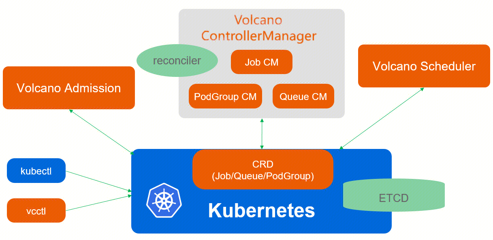

 

## 1.3 基本概念

Volcano 自定义资源（Custom Resource Definition，CRD）包括：PodGroup、Queue、VolcanoJob。

### 1.3.1 PodGroup

[**PodGroup**](https://volcano.sh/zh/docs/podgroup/) **是一组强关联 pod 的集合**，主要用于批处理工作负载场景，比如 Spark 中的一组 Driver Pod 和 Executor Pod，它是 Volcano 自定义资源类型。yaml 关键字段如下：

- **minMember**：表示该 podgroup下**最少**需要运行的 pod 或任务数量。如果集群资源不满足 miniMember 数量任务的运行需求，调度器将不会调度任何一个该 podgroup 内的任务。
- **queue**：表示该 podgroup 所属的 queue。queue 必须提前已创建且状态为 open。
- **priorityClassName**：表示该 podgroup 的优先级，用于调度器为该 queue 中所有 podgroup 进行调度时进行排序。**system-node-critical** 和 **system-cluster-critical** 是 2 个预留的值，表示最高优先级。不特别指定时，默认使用 default 优先级或 zero 优先级。
- **minResources**：表示运行该 podgroup 所需要的最少资源。当集群可分配资源不满足 minResources 时，调度器将不会调度任何一个该 podgroup 内的任务。


### 1.3.2 Queue

[**Queue**](https://volcano.sh/zh/docs/queue/) **是容纳一组 PodGroup 的队列**，也是该组 PodGroup 获取集群资源的划分依据。Volcano 启动后，**会默认创建名为 default 的 Queue，weight 为 1**，后续下发的 job，若未指定 Queue，默认属于 default 队列。注意，**Queue 是集群级别资源对象，目的是为了与用户和 namespace 解耦**。yaml 关键字段如下：

- **weight**：表示该 queue 在集群资源划分中所占的**相对**比重，该 queue 应得资源总量为 **(weight/total-weight) \* total-resource**。其中， total-weight 表示所有的 queue 的 weight 总和，total-resource 表示集群的资源总量。weight 是一个**软约束**，取值范围为 [1, 2^31-1]。
- **guarantee**：表示队列的**预留资源**，它是一个**硬约束**。
- **capability**：表示该 queue 内所有 podgroup 使用资源量之和的上限，它是一个**硬约束。**
- **reclaimable**：表示该 queue 在资源使用量超过该 queue 所**应得的资源份额**时，是否允许其他 queue 回收该 queue 使用超额的资源，默认值为 **true。**

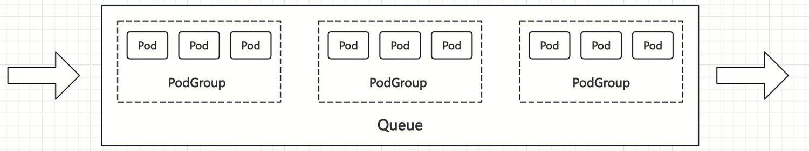

假设集群包含 30 个 CPU 和 3 个队列，并已知这 3 个队列的 guarantee、capability、weight，对应的 real capability、deserved 限制如下表：

| **queue** | **guarantee** | **capability** | **weight** | **real capability** | **deserved** |
| :-------- | :------------ | :------------- | :--------- | :------------------ | :----------- |
| queue 1   | 5             | null           | 2          | 30                  | 12           |
| queue 2   | null          | null           | 1          | 25                  | 6            |
| queue 3   | null          | 10             | 2          | 10                  | 12           |

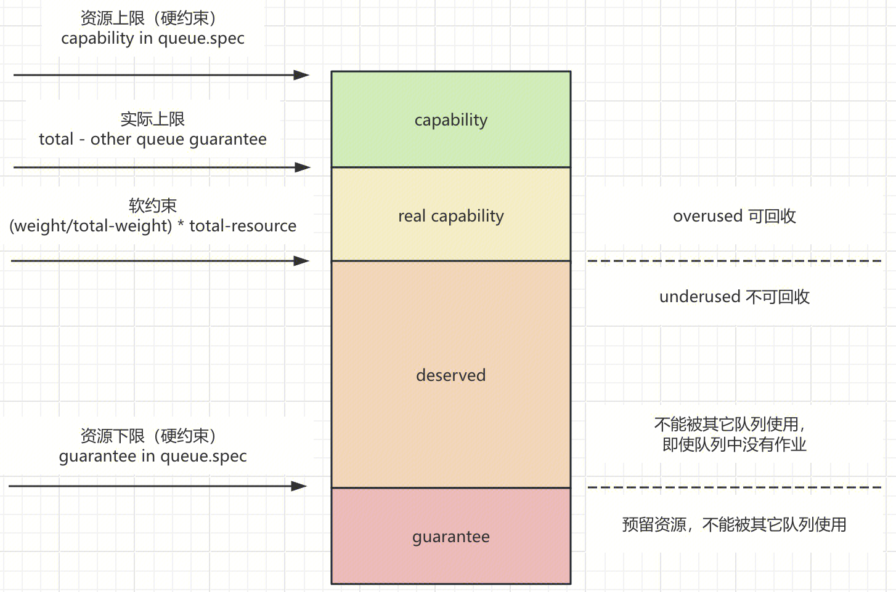


### 1.3.3 VolcanoJob

[**Volcano Job**](https://volcano.sh/zh/docs/vcjob/) **简称 vcjob，是 Volcano 自定义的 Job 资源类型**。区别于 Kubernetes Job，vcjob 提供了更多高级功能，如可指定调度器、支持最小运行 pod 数、支持 task、支持生命周期管理、支持指定队列、支持优先级调度等。Volcano Job 更加适用于机器学习、大数据、科学计算等高性能计算场景。当创建 vcjob 时，若没有指定该 vcjob 所属的 PodGroup，**默认会为该 vcjob 创建同名的 PodGroup**。


## 1.4 Volcano 部署

Volcano 手动部署：从 [DockerHub](https://hub.docker.com/u/volcanosh) 仓库下载 Volcano 镜像：vc-controller-manager、vc-scheduler、vc-webhook-manager。注意下载[版本与 K8s 的兼容性](https://github.com/volcano-sh/volcano#kubernetes-compatibility)（TCS 235 K8s 版本为 v1.22），以及系统架构（x86、arm），将上述镜像导入 TCS 集群。

```shell
# 1、镜像load、tag、push
docker load -i vc-controller-manager-1.9.0.tar
docker load -i vc-scheduler-1.9.0.tar
docker load -i vc-webhook-manager-1.9.0.tar
docker tag volcanosh/vc-controller-manager:v1.9.0 registry-bj.xxxx.te-first-dev.fsphere.cn/library/volcanosh/vc-controller-manager:v1.9.0
docker tag volcanosh/vc-scheduler:v1.9.0 registry-bj.xxxx.te-first-dev.fsphere.cn/library/volcanosh/vc-scheduler:v1.9.0
docker tag volcanosh/vc-webhook-manager:v1.9.0 registry-bj.xxxx.te-first-dev.fsphere.cn/library/volcanosh/vc-webhook-manager:v1.9.0
docker push registry-bj.xxxx.te-first-dev.fsphere.cn/library/volcanosh/vc-controller-manager:v1.9.0
docker push registry-bj.xxxx.te-first-dev.fsphere.cn/library/volcanosh/vc-scheduler:v1.9.0
docker push registry-bj.xxxx.te-first-dev.fsphere.cn/library/volcanosh/vc-webhook-manager:v1.9.0

# 2、下载yaml文件（最新版本不区分系统架构）
https://raw.githubusercontent.com/volcano-sh/volcano/master/installer/volcano-development.yaml

# 3、yaml导入TCS集群，将镜像名改为环境中对应的镜像名（共4处），如将：
# volcanosh/vc-controller-manager:v1.9.0修改为registry-bj.xxxx.te-first-dev.fsphere.cn/library/volcanosh/vc-controller-manager:v1.9.0
vim volcano-development.yaml

# 4、安装，会自动创建两个namespace：volcano-system与volcano-monitoring
# 若要删除，执行：kubectl delete -f volcano-development.yaml
kubectl apply -f volcano-development.yaml

# 5、查看是否安装成功
kubectl get podgroup -n volcano-system
```

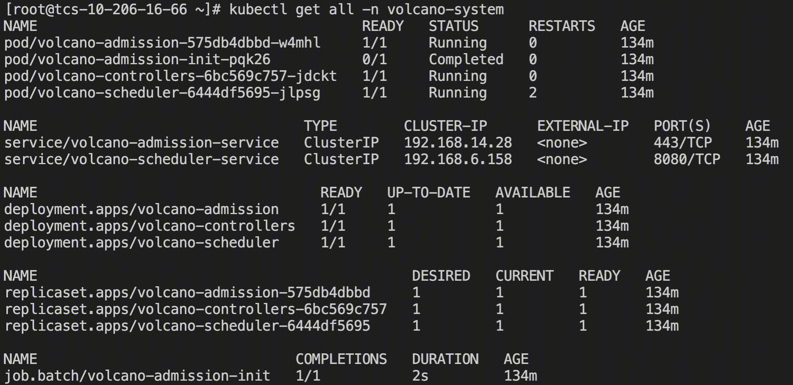


## 1.5 Volcano Scheduler

### 1.5.1 概览

Volcano Scheduler 是负责 Pod 调度的组件，它由一系列 action 和 plugin 组成。**action 定义了调度各环节中需要执行的动作；plugin 根据不同场景提供了 action 中算法的具体实现细节**。Volcano Scheduler 具有高度的可扩展性，可以根据需要实现自己的 action 和 plugin。Volcano Scheduler 的工作流程如下：

- 客户端提交的 Job 被 Scheduler 观察到并缓存起来。
- 周期性的开启会话，一个调度周期开始。
- 将没有被调度的 Job 发送到会话的待调度队列中。
- 遍历所有的待调度 Job，按照定义的次序依次执行 enqueue、allocate、preempt、reclaim、backfill 等动作，为每个 Job 找到一个最合适的节点，将该 Job 绑定到这个节点。action 中执行的具体算法逻辑取决于注册的 plugin 中各函数的实现。
- 关闭本次会话。

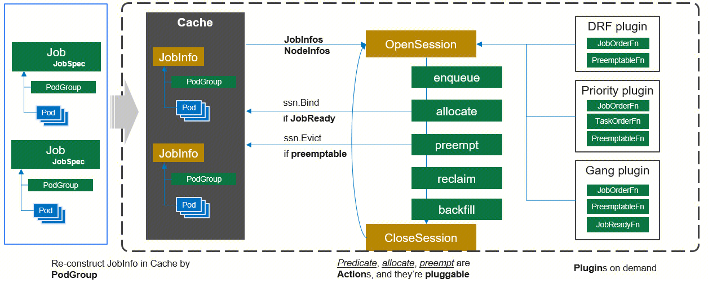


### 1.5.2 Actions

[Actions](https://volcano.sh/zh/docs/actions/) 实现了调度的主要逻辑，Volcano 允许用户进行自定义操作。Volcano 1.9.0 提供了 6 个内置操作，详细信息如下。

| **ID** | **名称**     | **是否必须** | **描述**                                                     |
| :----- | :----------- | :----------- | :----------------------------------------------------------- |
| 1      | **enqueue**  | Y            | **筛选符合要求的作业进入待调度队列**。当一个 Job 下的最小资源申请量不能得到满足时，即使为 Job 下的 Pod 执行调度动作，Pod 也会因为 gang 约束没有达到而无法进行调度；只有当 job 的最小资源量得到满足，状态由 Pending 刷新为 Inqueue 才可以进行。一般来说 enqueue action 是调度器配置必不可少的 action。 |
| 2      | **allocate** | Y            | 处理待调度 Pod 列表中**具有资源申请量**的 Pod 调度，是调度过程必不可少的 action。**这个过程包括作业的预选（predicate）和优选（prioritize）。使用 predicateFn 预选，过滤掉不能分配作业的 node；使用 NodeOrderFn 打分来找到最适合的分配节点**。allocate 遵循 commit 机制，当一个 Pod 的调度请求得到满足后，最终并不一定会为该 Pod 执行绑定动作，这一步骤还取决于 Pod 所在 Job 的 gang 约束是否得到满足。只有 Pod 所在 Job 的 gang 约束得到满足，Pod 才可以被调度，否则，Pod 不能够被调度。 |
| 3      | **backfill** | N            | 处理待调度 Pod 列表中**没有指明资源申请量**的 Pod 调度，在对单个 Pod 执行调度动作的时候，遍历所有的节点，只要节点满足了 Pod 的调度请求，就将 Pod 调度到这个节点上。 |
| 4      | preempt      | N            | **用于处理高优先级调度问题**，同一个 Queue 中 Job 之间的抢占，或同一 Job 下 Task 之间的抢占。 |
| 5      | reclaim      | N            | **选出资源被其他队列借用的队列，并将其回收**。               |
| 6      | shuffle      | N            | 旨在不同节点间进行负载再平衡，配合 rescheduling 和 tdm 插件使用，它会遍历所有 Pods，筛选出不符合要求的 Pod 并尝试驱逐它们，被选定为受害者的 Pod 将被调度到负载合适的节点上。 |

 

### 1.5.3 Plugins

[Plugins](https://volcano.sh/zh/docs/plugins/) 通过注册一系列函数来提供调度算法的实现细节，这些函数将在执行操作期间被调用。一般来说，一个插件主要由 3 个函数组成：`Name`、`OnSessionOpen`、`OnSessionClose`。`Name` 提供插件的名称。`OnSessionOpen` 在会话启动时执行一些操作并注册一些有关调度详细信息的函数。 `OnSessionClose` 在会话结束时清理一些资源。一些插件为用户提供参数来匹配他们的自定义场景，不同的插件可能会用不同的逻辑注册相同的功能，配置插件时需确保它们可以协同工作。Volcano 1.9.0 提供 22 个内置插件，详细信息如下，表中加粗的名字插件为 Volcano 默认配置插件。

| **ID** | **名字**        | **参数**                                                     | **注册函数**                                                 | **描述**                                                     |
| :----- | :-------------- | :----------------------------------------------------------- | :----------------------------------------------------------- | :----------------------------------------------------------- |
| 1      | **binpack**     | binpack.weightbinpack.cpubinpack.memorybinpack.resources     | nodeOrderFn                                                  | **将 Pod 调度到资源利用率较高的节点上（尽量不往空白节点分配），以减少资源碎片**。具体实现上，binpack 给可以投递的节点打分，分数越高表示节点的资源利用率越高。binpack 算法能够尽可能填满节点，将应用负载靠拢在部分节点，这非常有利于 K8s 集群节点的自动扩缩容功能。 |
| 2      | capacity        | /                                                            | queueOrderFnreclaimableFnpreemptiveFnallocatableFnjobEnqueueableFn | **capacity 插件是 proportion 插件的替代，但不是按权重划分队列应得资源，而是通过指定队列每个维度资源应得资源量来实现弹性队列容量管理，即队列的资源借入和借出机制**。一个队列可以使用其他队列的空闲资源，当其他队列提交作业时，可以回收已借出的资源，回收的资源量就是该队列应得的资源量。参考 [Capacity Plugin User Guide](https://github.com/volcano-sh/volcano/blob/master/docs/user-guide/how_to_use_capacity_plugin.md)。 |
| 3      | cdp             | /                                                            | preemptableFn                                                | 全称 Cooldown Protection，在弹性训练、推理的场景，弹性的 Pod 容易被无限制的抢占，可能刚获得资源启动，就被其他作业抢占，导致 Pod 状态稳定性不足。Volcano 允许用户配置一个时间值，这个时间值代表 Pod 的冷静期，在冷静期内，Pod 将不会被抢占。目前 cdp 插件仅支持冷却时间保护。 |
| 4      | **conformance** | /                                                            | preemptableFnreclaimableFn                                   | 跳过关键 Pod，防止这些 Pod 被抢占。**认为优先级为 system-cluster-critical、system-node-critical 的任务，以及命名空间为 kube-system 下的任务具有更高的优先级，这些任务不能被抢占**。 |
| 5      | deviceshare     | deviceshare.GPUSharingEnabledeviceshare.NodeLockEnabledeviceshare.GPUNumberEnabledeviceshare.VGPUEnabledeviceshare.SchedulePolicydeviceshare.ScheduleWeight | predicateFnnodeOrderFn                                       | 动机：为了支持其他异构人工智能计算设备，将设备共享逻辑从 predicate 插件移动到 deviceshare 独立插件中。 |
| 6      | **drf**         | /                                                            | preemptableFnqueueOrderFnreclaimFnjobOrderFnnamespaceOrderFn | 全称 Dominant Resource Fairness，是基于容器组 Dominant Resource 的调度算法。volcano-scheduler 观察每个 Job 请求的主导资源，并将其作为对集群资源使用的一种度量，根据 Job 的主导资源，计算 Job 的 share 值，在调度的过程中，具有较低 share 值的 Job 将具有更高的调度优先级。这样能够满足更多的作业，不会因为一个胖业务，饿死大批小业务。**DRF 调度算法能够确保在多种类型资源共存的环境下，尽可能满足分配的公平原则**。场景：DRF 插件优先考虑集群中业务的吞吐量，适用单次 AI 训练、单次大数据计算以及查询等批处理小业务场景。 |
| 7      | extender        | extender.urlPrefixextender.httpTimeoutextender.onSessionOpenVerbextender.onSessionCloseVerbextender.predicateVerbextender.prioritizeVerbextender.preemptableVerbextender.reclaimableVerbextender.queueOverusedVerbextender.jobEnqueueableVerbextender.ignorable | predicateFnbatchNodeOrderFnpreemptableFnreclaimableFnjobEnqueueableFnoverusedFn | 添加外部 http server，用来执行自定义 action。动机：目前，基于 Volcano 实现调度策略的唯一方法是修改 Volcano 代码并重新编译。这种方式需要开发者深入了解 Volcano 的工作原理以及相关架构，对于初学者来说并不友好。通过添加其他进程并基于网络通信，会带来一定的性能下降，但也会提高可扩展性，用户可以在两者之间做出权衡。 |
| 8      | **gang**        | /                                                            | jobValidFnreclaimableFnpreemptableFnjobOrderFnJobReadyFnjobPipelineFnjobStarvingFn | 核心调度算法之一，**执行“All or nothing”的调度策略，重点考虑 Job 的最低资源要求和 Pod 最小运行数量**，当条件满足时，为 Job 下的所有 Pod 执行调度动作，否则不执行，避免 Pod 任意调度导致集群资源的浪费。 |
| 9      | nodegroup       | /                                                            | nodeOrderFnpredicateFn                                       | 通过为节点分配标签并在队列上设置节点标签亲和力来隔离资源。   |
| 10     | **nodeorder**   | nodeaffinity.weightpodaffinity.weightleastrequested.weightbalancedresource.weightmostrequested.weighttainttoleration.weightimagelocality.weight | nodeOrderFnbatchNodeOrderFn                                  | **优选节点策略，通过模拟分配从各个维度为节点打分，找到最适合当前作业的节点**。打分参数由用户来配置，参数包含了 Affinity、reqResource、LeastReqResource、MostReqResource、balanceReqResouce。场景：提供多个维度的打分标准，不同维度的组合，能够让用户根据自身需求灵活的配置合适的调度策略。 |
| 11     | numaaware       | weight                                                       | predicateFnbatchNodeOrderFn                                  | 在将 Pod 绑定到节点时，将 CPU Numa 视为关键因素，支持 CPU 资源的拓扑调度、以及 Pod 级别的拓扑协议。场景：对 CPU 参数敏感/调度延迟敏感的计算密集型作业。 |
| 12     | **overcommit**  | overcommit-factor                                            | jobEnqueueableFnjobEnqueuedFn                                | **将可用资源设置为集群整体资源的给定倍数（扩大因子 overcommit-factor 默认为 1.2），确保 preempt、reclaim action 正常生效，不会被 enqueue action 阻塞**；同时避免后面的小作业被阻塞，充分利用碎片化的空闲资源。 |
| 13     | pdb             | /                                                            | victimTasksFnreclaimableFnpreemptableFn                      | 当用户将作业应用到 Volcano 时，他们可能会限制同时销毁的 Pod 副本数量。这种限制通常由用户创建的 PDB 资源所限制。因此，提供了 PDB 插件来满足用户在 Volcano 调度过程中设置的 PDB 约束。 |
| 14     | **predicates**  | predicate.NodeAffinityEnablepredicate.NodePortsEnablepredicate.TaintTolerationEnablepredicate.PodAffinityEnablepredicate.NodeVolumeLimitsEnablepredicate.VolumeZoneEnablepredicate.PodTopologySpreadEnablepredicate.CacheEnablepredicate.ProportionalEnablepredicate.resources | predicateFn                                                  | **预选节点策略**，自定义如何为 Pod 调度过滤节点的函数，包括节点亲和、Pod 亲和、污点容忍、Node 重复，volume limits，volume zone 匹配等一系列基础算法。场景：在 AI 的应用场景下，GPU 资源是必需，Predicate 插件可以快速筛选出来需要 GPU 的进行集中调度。 |
| 15     | **priority**    | /                                                            | taskOrderFnjobOrderFnpreemptableFnjobStarvingFn              | **自定义调度作业的优先级，提供 Job、Task 排序的实现，以及计算牺牲作业的函数 preemptableFn**。job 的排序根据 priorityClassName，task 的排序依次根据 priorityClassName、createTime、id。 |
| 16     | **proportion**  | /                                                            | queueOrderFnreclaimableFoverusedFnallocatableFnjobEnqueueableFn | **用来控制 queue 的可用资源，包括硬性指标：资源下限 guarantee、资源上限 capability，以及弹性指标 weight**。例如，有 3 个团队，共享一个集群上的资源池：A 团队最多使用总集群的 40%，B 团队最多使用 30%，C 团队最多使用 30%。如果投递的作业量超过团队最大可用资源，就需要排队。 |
| 17     | rescheduling    | /                                                            | victimTasksFn                                                | 动机：不合理的调度策略和作业生命周期的动态变化导致资源利用率不平衡；以及节点状态变化，如添加删除节点、pod/node taint/affinity 变化。 |
| 18     | resourcequota   | /                                                            | jobEnqueueableFn                                             | **在 podgroup enqueue 过程中考虑命名空间中的 resourceQuota，当 ResourceQuota 不足时，podgroup 不能入队**。参考 [delay pod creation feature not consider resourcequota](https://github.com/volcano-sh/volcano/issues/1014)。 |
| 19     | sla             | sla-waiting-time                                             | jobOrderFnjobEnqueueableFnJobPipelinedFn                     | 全称 Service Level agreement，在集群中大、小作业并存的场景，会产生资源竞争，资源如果持续紧张，有可能会发生大、小作业饿死。Volcano 允许用户为大作业配置最长等待时间 sla-waiting-time，一旦条件满足，插件会强制作业通过 enqueue action，并为作业进行资源预留，防止作业饿死。SLA plugin 可以为单个作业/整个集群配置 SLA 参数。 |
| 20     | task-topology   | /                                                            | taskOrderFnnodeOrderFn                                       | 一种根据 Job 内 task 之间亲和性和反亲和性配置计算 task 优先级和 Node 优先级的算法。通过在 Job 内配置 task 之间的亲和性和反亲和性策略，并使用 task-topology 算法，可优先将具有亲和性配置的 task 调度到同一个节点上，将具有反亲和性配置的 Pod 调度到不同的节点上。场景：在一些大数据、AI 场景下，Job 内 Task 之间的数据传输，尤其是跨节点的数据拷贝性能损耗很高，甚至成为整个作业的性能瓶颈。Volcano 允许用户配置 Task 的拓扑关系，调度器依据拓扑关系实现最优调度，减少节点间数据的拷贝，提升作业整体性能。 |
| 21     | tdm             | tdm.revocable-zone.rz1tdm.revocable-zone.rz2tdm.evict.period | predicateFnnodeOrderFnpreemptableFnvictimTasksFnjobOrderFnjobPipelinedFnjobStarvingFn | 全称 Time Division Multiplexing，在一些场景中，一些节点既属于 K8s 集群也属于 Yarn 集群。tdm 插件需要管理员为这些节点标记为 revocable node，它会在该类节点可被撤销的时间段内尝试把 preemptable task 调度给 revocable node，并在该时间段之外清除 revocable node 上的 preemptable task。tdm 插件提高了 Volcano 在调度过程中节点资源的分时复用能力。场景：适用于 ToB 业务中，云厂商为商家提供云化资源，不同的商家采取不同的容器编排框架（Kubernetes/Yarn等），Tdm 插件提高公共节点资源的分时使用效率，进一步提升资源的利用率。 |
| 22     | usage           | usage.weightcpu.weightmemory.weightthresholds                | predicateFnnodeOrderFn                                       | 动机：目前 Pod 是根据资源请求和节点可分配资源而不是节点使用情况来调度的，这导致计算节点的资源使用不平衡。Pod 被调度到使用率较高、分配率较低的节点，这不是用户所期望的，用户期望各个节点的使用能够均衡。 |

 

### 1.5.4 默认配置

1、所有配置都在 configmap volcano-scheduler-configmap 中，位于 namespace volcano-system 下。**配置由两部分组成：actions 和 tiers**。

- actions 定义了调度管道，它们将在每个会话中按顺序执行。 
- tiers 将插件分为几个类别，插件中定义的所有函数将在会话打开时注册，并在执行 action 时调用。另外，Options 定义了每个插件的详细行为，例如，是否禁用该插件的抢占逻辑，如果没有特别指定，默认不禁用，目前支持的控制行为有：preemptable、jobOrder、taskOrder。

2、在某些场景下，用户可能会配置不同的插件来注册相同的功能。如何组合这些功能将取决于业务需求，这就是为什么需要层级（tier）。

**情况一：两层插件都需要工作**。以 BatchNodeOrderFn 为例，该函数是为 Task 匹配节点打分的一个辅助函数，它会调用所有注册该函数的插件，并执行他们的逻辑，得到每一个插件的打分情况，最后返回一个总分。

**情况二：如果前序层级的插件没有得到投票结果，action 将调用后续层级的插件，否则不会调用后续层级的插件**，以 enqueue action 为例：

- 同层 tier 内，任一插件**否决**，作业将保持 pending 状态直到下一 session。
- 同层 tier 内，任一插件**通过**，同时没有插件否决，作业将忽略下一层 tier 的插件，直接通过 enqueue action。
- 同层 tier 内，所有插件均**弃权**，交给下一层 tier 判断；所有 tier 的插件均弃权，作业通过 enqueue action。

在大多数场景下，用户可以不用关心如何将 plugin 划分到不同的 tier，可以在单个层中配置所有 plugin。**只有在与驱逐相关的情况下，才需要考虑如何将 plugin 组织在不同的 tier**。例如，当启用 reclaim action 时，调度程序将尝试收集一组驱逐目标。为了减少对用户业务的影响，尽量少的驱逐目标才是合理的，可以在第一层中配置驱逐目标较少的 plugin，在第二层配置目标较多的 plugin。如果第一层可以挑选出目标，就不会调用注册在第二层的 plugin。目前来说，一般配置两层就足够了。

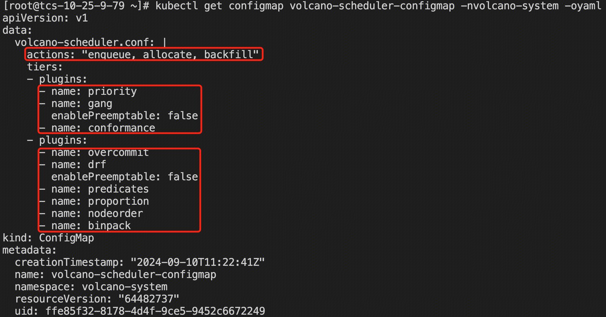


## 1.6 Volcano 源码

1、Volcano 启动大致分为三步：**加载配置、初始化缓存、周期调度**。

- Volcano 启动时，通过参数传入配置文件的路径，之后读取并加载配置。注意，Volcano 还会监视调度器配置文件的变化，一旦文件内容发生变化，会重新读取并加载配置。
- **Volcano 周期性调度会话（默认 1 秒），它首先遍历每层 tier 下的所有 plugin 插件，依次调用插件的 OnSessionOpen 方法，将自身算法函数注册到 Session 中（此时函数还未执行）；然后遍历配置的 actions，依次调用 Execute 方法，执行之前 plugin 插件注册到 Session 中的算法函数**。

```go
// cmd/scheduler/main.go
main()
  app.Run(s)
    // cmd/scheduler/app/options/options.go
    // 加载Volcano启动参数，例如，scheduler-conf表示调度器配置文件绝对路径；schedule-period表示调度周期，默认1秒；
    // default-queue表示作业的默认队列，默认default。开源volcano-controllers镜像启动命令如下，-v=3用于设置日志级别：
    // /vc-scheduler --logtostderr --scheduler-conf=/volcano.scheduler/volcano-scheduler.conf --enable-healthz=true --enable-metrics=true --leader-elect=false -v=3 2>&1
    s.AddFlags(pflag.CommandLine)
    // cmd/scheduler/app/server.go
    sched, err := scheduler.NewScheduler(config, opt)
      // pkg/scheduler/scheduler.go
      // 初始化cache，传入参数即上面Volcano的启动参数
      cache := schedcache.New(...)
        // pkg/scheduler/cache/cache.go
        newSchedulerCache(...)
          // 创建默认队列
          newDefaultQueue(vcClient, defaultQueue)
          // SchedulerCache即kube批处理的缓存
          sc := &SchedulerCache{...}
      // Scheduler即调度器核心对象“Volcano Scheduler”，传入SchedulerConf（配置文件）、cache、SchedulePeriod（调度周期）等参数
      // 它监视Volcano中新的未调度 pods（PodGroup），尝试找到可以容纳这些Pods的节点，并将绑定信息写回API server
      scheduler := &Scheduler{...}

    // 加载配置、初始化缓存并开始调度过程
    sched.Run(ctx.Done())
      // 1.加载调度器配置
      pc.loadSchedulerConf()
        // 解析默认调度器配置(参见pkg/scheduler/util.go)，只会执行一次
        pc.once.Do(func() { ... UnmarshalSchedulerConf(DefaultSchedulerConf) ...})
        // 读取配置文件，即参数：--scheduler-conf=/volcano.scheduler/volcano-scheduler.conf
        confData, err := os.ReadFile(pc.schedulerConf)
        // 解析自定义调度器配置，即上面文件内容
        actions, plugins, configurations, metricsConf, err := UnmarshalSchedulerConf(config)
      // 监视调度器配置文件的变化
      go pc.watchSchedulerConf(stopCh)

      // 2.启动schedulerCache
      pc.cache.Run(stopCh)

      // 3.定期调用runOnce方法，默认间隔1秒
      go wait.Until(pc.runOnce, pc.schedulePeriod, stopCh)
        // 启动会话
        ssn := framework.OpenSession(pc.cache, plugins, configurations)
          // pkg/scheduler/framework/framework.go
          ssn := openSession(cache)
            // Session代表当前会话信息
            ssn := &Session{...}
          // 遍历每层tier下的所有plugin插件，依次调用OnSessionOpen方法，将自身算法函数注册到Session中（此时函数还未执行），例如：
          // gang插件在OnSessionOpen方法中调用ssn.AddPreemptableFn()方法，将自身算法函数保存到Session的preemptableFns属性中
          // 所有插件均实现Plugin接口（参见pkg/scheduler/framework/interface.go）
          for _, tier := range tiers
            for _, plugin := range tier.Plugins
              plugin.OnSessionOpen(ssn)
        // 遍历配置的actions，依次调用Execute方法，执行之前plugin插件注册到Session中的算法函数，例如：
        // preempt action在Execute方法中调用ssn.PredicateFn()方法，从Session的preemptableFns属性中取出算法函数，并执行
        for _, action := range actions {... action.Execute(ssn) ...}
```


# 2. Spark 集成 

## 2.1 Spark 示例

### 2.1.1 批调度

1、虚拟集群当前通过 namespace 进行资源限额，通过 Kuyybi 同时向虚拟集群提交两个 Spark 作业，结果两个作业的 Driver Pod 均被拉起，但 Executor Pod 由于资源不足均无法被 Driver Pod 拉起，形成死锁。

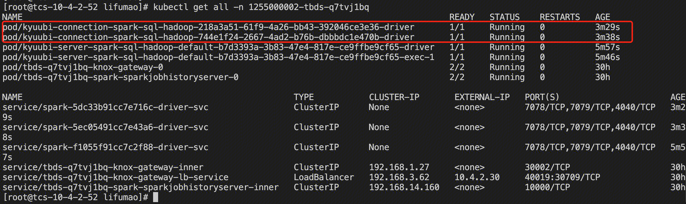

2、Volcano 安装时默认会创建 default 队列，该队列没有资源限制。因此这里创建一个新队列 test，并限制只能运行一个 Spark 作业的资源。

```shell
# 创建队列：kubectl apply -f queue.yaml（queue.yaml文件内容如下）
# 查看队列：kubectl describe queue test
# 删除队列：kubectl delete queue test
apiVersion: scheduling.volcano.sh/v1beta1
kind: Queue
metadata:
  name: test
spec:
  weight: 1
  reclaimable: false
  capability:
    # Spark任务默认启动1个Driver、2个Executor，各占用1个CPU，共3个CPU
    cpu: 3
    memory: 8Gi
```

 3、Spark 集成 Volcano 需要重新编译，编译加上 `-Pvolcano` 参数，提供新的镜像。Kyuubi 在提交 Spark 作业时指定以下配置，并提供 PodGroup yaml 文件模版（作业提交到 test 队列）。同时提交两个作业，结果只有一个作业 Driver Pod 和 Executor Pod 被正常拉起（另一个 Executor Pod 无法拉起，因为 namespace 本身限额导致）；**另一个作业 Driver Pod 一直处于 Pending 状态，直到上一个作业运行结束，当前作业才会继续运行，不会形成死锁**。

```shell
# 指定Volcano调度和PodGroup模版（示例如下）
--conf spark.kubernetes.scheduler.name=volcano
--conf spark.kubernetes.scheduler.volcano.podGroupTemplateFile=/path/to/podgroup-template.yaml
# 指定Driver/Executor VolcanoFeatureStep，VolcanoFeatureStep可创建一个Volcano PodGroup，并设置Driver/Executor pod注解与该PodGroup链接
# 注意，目前VolcanoFeatureStep仅支持Driver/Job级别的 PodGroup
--conf spark.kubernetes.driver.pod.featureSteps=org.apache.spark.deploy.k8s.features.VolcanoFeatureStep
--conf spark.kubernetes.executor.pod.featureSteps=org.apache.spark.deploy.k8s.features.VolcanoFeatureStep
apiVersion: scheduling.volcano.sh/v1beta1
kind: PodGroup
spec:
  # 将minMember指定为1，以创建一个driver pod
  minMember: 1
  # 指定minResources以支持资源预留（应考虑driver pod和executors pod资源）。这有助于确保可用资源满足Spark作业的最低要求，避免出现已调度drivers，但却无法调度足够的executors以取得进展的情况。
  minResources:
    cpu: "2"
    memory: "3Gi"
  # 指定优先级，帮助用户在调度时指定队列中作业的优先级
  priorityClassName: system-node-critical
  # 指定队列，表示作业应提交给哪个资源队列
  queue: test
```

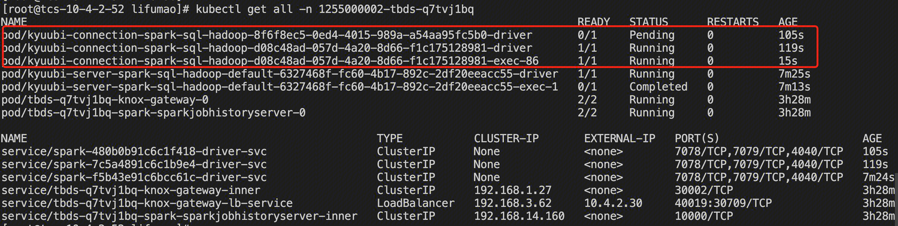


### 2.1.2 优先级调度

1、沿用上面“批调度”例子中的 test 队列，并在 TCS 集群创建 3 个 [PriorityClass](https://kubernetes.io/zh-cn/docs/concepts/scheduling-eviction/pod-priority-preemption/)，用于设置 Spark 作业优先级。

```shell
# priority.yaml文件内容如下
kubectl create -f priority.yaml

# 查看priorityClass，K8s默认提供了2个PriorityClass：system-cluster-critical和system-node-critical
kubectl get priorityClass
apiVersion: scheduling.k8s.io/v1
kind: PriorityClass
metadata:
  name: high-priority
value: 20
globalDefault: false
description: "high priority"

---
apiVersion: scheduling.k8s.io/v1
kind: PriorityClass
metadata:
  name: middle-priority
value: 10
globalDefault: false
description: "middle priority & default priority"

---
apiVersion: scheduling.k8s.io/v1
kind: PriorityClass
metadata:
  name: low-priority
value: 0
globalDefault: true
description: "low priority"
```

2、修改 PodGroup 文件模版，并指定作业低优先级 `priorityClassName: low-priority`，通过 Kyuubi 提交一个 Spark 作业到 test 队列。此时 Spark 作业正常运行。

3、修改 PodGroup 文件模版，并指定作业中优先级 `priorityClassName: middle-priority`，通过 Kyuubi 提交一个 Spark 作业到 test 队列。由于 test 队列资源已达到上限，此时中优先级作业入队等待调度，Driver Pod Pending。

4、修改 PodGroup 文件模版，并指定作业高优先级 `priorityClassName: high-priority`，通过 Kyuubi 提交一个 Spark 作业到 test 队列。由于 test 队列资源已达到上限，此时高优先级作业入队等待调度，Driver Pod Pending。

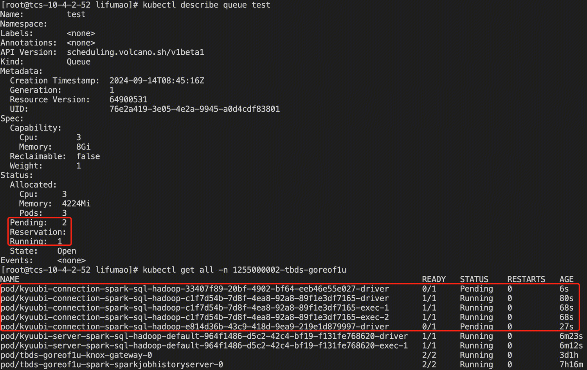

5、停止低优先级作业（方便演示，这里使用 kubectl delete pod），**待 test 队列资源释放后，结果后提交至 test 队列的高优先级作业反而先调度运行**。

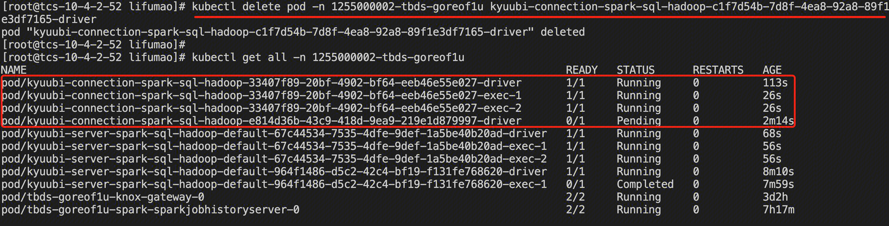


### 2.1.3 队列内抢占

1、**将 preempt action 加入 Volcano 默认配置，并修改扩大因子 overcommit-factor 为 2.0（默认 1.2），防止后续作业无法入队**。然后删除原有队列 test，并重新创建一个 cpu = 6、memory = 10Gi 的新队列 test，限制只能运行两个 Spark 作业的资源。

```shell
# 1、增加preempt action，如下：
# actions: "enqueue, allocate, preempt, backfill"
# 2、overcommit插件修改扩大因子overcommit-factor为2.0
kubectl edit cm -n volcano-system volcano-scheduler-configmap
```

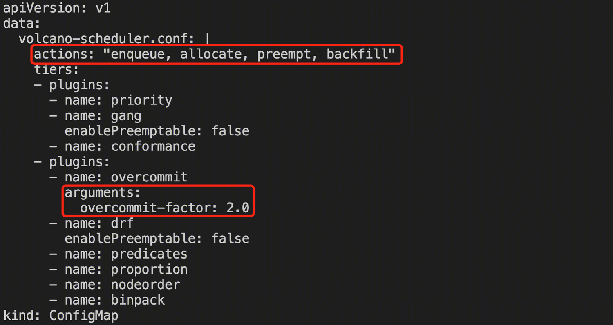

2、修改 PodGroup 文件模版，并指定作业中优先级 `priorityClassName: middle-priority`，通过 Kyuubi 提交一个 Spark 作业到 test 队列。此时 Spark 作业正常运行。

3、修改 PodGroup 文件模版，并指定作业低优先级 `priorityClassName: low-priority`，通过 Kyuubi 提交一个 Spark 作业到 test 队列。此时 Spark 作业正常运行。

4、修改 PodGroup 文件模版，并指定作业高优先级 `priorityClassName: high-priority`，通过 Kyuubi 提交一个 Spark 作业到 test 队列。由于 test 队列资源已达到上限，此时高优先级作业尝试抢占，**结果中/低优先级作业的 Driver/Executor Pod 被抢占（Running → Terminating），高优先级作业的 Driver/Executor Pod Running。注意，Executor Pod 被抢占会有重试机制，但是 Driver Pod 被抢占，整个作业将直接结束，非常影响用户体验**，参考 [Fix reclaim or preempt action may preempt driver of spark job](https://github.com/volcano-sh/volcano/pull/2735) 以及 [Add preemmptable attribute into PodGroup](https://github.com/volcano-sh/volcano/issues/2141)。

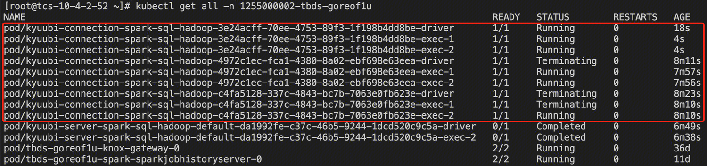

5、kubectl logs 查看 volcano-scheduler Pod 日志，有关于抢占的详细日志。

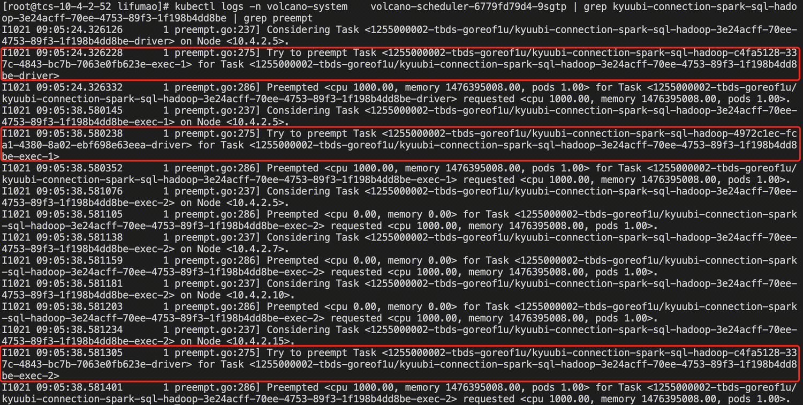


## 2.2 Spark 源码

在《Spark on K8s 入门》介绍过，Spark 包含了多个 FeatureStep，它们都实现了 KubernetesFeatureConfigStep 特质，并通过调用 K8s Client API 来写 YAML 文件。其中，userFeatures 即用户自定义扩展的 KubernetesFeatureConfigStep 子类，这里实际为 VolcanoFeatureStep。

```java
KubernetesClientApplication
  start(args, conf)
    // 解析参数
    ClientArguments.fromCommandLineArgs(args)
    run(parsedArguments, conf)
      // 生成spark.app.id，以”spark-{UUID}”为模板。之所以重新生成而不直接使用提交的作业name，是因为pod需要打上label——spark-app-selector:{appId}，label的值有长度限制
      KubernetesConf.getKubernetesAppId()
      KubernetesConf.createDriverConf()
      // 启动Pod时，会给Pod添加一个watcher：LoggingPodStatusWatcher用来监听Pod事件，当Pod状态到达完成状态时，触发当前进程退出
      new LoggingPodStatusWatcherImpl(kubernetesConf)
      SparkKubernetesClientFactory.createKubernetesClient()
      new Client().run()
        // KubernetesDriverBuilder构建driver pod，与之类似，KubernetesExecutorBuilder构建executor pod
        resolvedDriverSpec = builder.buildFromFeatures(conf, kubernetesClient)
          // spark.kubernetes.driver.podTemplateFile参数配置driver pod模版文件
          initialPod = conf.get(Config.KUBERNETES_DRIVER_PODTEMPLATE_FILE)
          // 【1】参数：spark.kubernetes.driver.pod.featureSteps，即实例化org.apache.spark.deploy.k8s.features.VolcanoFeatureStep
          val userFeatures = conf.get(Config.KUBERNETES_DRIVER_POD_FEATURE_STEPS).map { className => ... }
          // features包含了多个FeatureStep，它们都实现了KubernetesFeatureConfigStep特质，可以理解为通过K8s的API来写YAML文件。KubernetesFeatureConfigStep特质定义了4个抽象方法：
          // ①configurePod：根据当前特性对给定的Pod进行修改，包括附加卷、添加环境变量、标签、注解 ②getAdditionalPodSystemProperties：返回根据当前特性在JVM上设置的任何系统属性
          // ③getAdditionalPreKubernetesResources：返回应添加的额外K8s资源，资源将在Pod创建之前进行设置/刷新 ④getAdditionalKubernetesResources：同上，不过资源将在Pod创建后进行设置/刷新。
          features = Seq(new BasicDriverFeatureStep(conf)...) ++ userFeatures
            // 基础设置：设置driver容器名称、镜像、拉取策略、三个端口（driver-rpc-port、blockmanager、spark-ui，仅提供声明）、部分环境变量、资源（CPU、内存）
            // 以及driver pod元数据（名称、标签、注解）、描述（重启策略、节点选择器、镜像拉取密码）、调度器
            new BasicDriverFeatureStep(conf)
              // 【2】参数spark.kubernetes.scheduler.name，这里设置为volcano
              conf.schedulerName.foreach(driverPod.getSpec.setSchedulerName)
            // 【3】这里重点关注userFeatures，继承关系：VolcanoFeatureStep -> KubernetesDriverCustomFeatureConfigStep -> KubernetesFeatureConfigStep
            userFeatures
              // VolcanoFeatureStep重写
              getAdditionalPreKubernetesResources
                // 参数spark.kubernetes.scheduler.volcano.podGroupTemplateFile
                val template = kubernetesConf.getOption(POD_GROUP_TEMPLATE_FILE_KEY)
                // 读取PodGroup YAML文件模版，并设置
                val pg = template.map(client.podGroups.load(_).item).getOrElse(new PodGroup())
              // VolcanoFeatureStep重写
              configurePod
                // 通过注解"scheduling.k8s.io/group-name"绑定PodGroup，PodGroup名为：${appId}-podgroup
                new PodBuilder(pod.pod).editMetadata().addToAnnotations(POD_GROUP_ANNOTATION, podGroupName)
```


## 2.3 虚拟集群集成

1、集成目标：批调度，支持队列，包括：队列资源限制、队列间资源共享、队列内优先级调度

2、集成要点：**Queue 资源限额（何时生成，与 Namespace/虚拟集群的关系）、PodGroup 模版（何时生成，与虚拟集群/用户的关系）、Volcano 中的 actions、plugins 众多，如何组合符合预期设计**

- **Queue 属于集群级别，不属于 Namespace，两者是多对多的关系，不同 Namespace 的作业可以提交到相同 Queue，参考：**[**support get queue from namespace**](https://github.com/volcano-sh/volcano/pull/1530)**。如果两者均设置资源限额，任务提交将受两者同时限制。可以理解为，Queue 从逻辑层面进行限制，Namespace 从物理层面进行限制**，因为 Spark 作业实际还是运行在 Namespace 中。不推荐设置 Namespace 资源限额，如果一定要设置，则 Queue 资源限额必须设置小于 Namespace，否则队列没有任何作用。
- **默认的比例插件，按照权重划分集群资源，参考：**[**Using proportional in namespaced scope**](https://github.com/volcano-sh/volcano/issues/2498)，queue 应得资源总量为 (weight/total-weight) * total-resource。其中， total-weight 表示所有的 queue 的 weight 总和，**total-resource 表示集群的资源总量。由于集群资源不是 Volcano 独占的，因此很难通过比例确认 Queue 的软限制资源，对应的队列间资源抢占/回收很难细粒度实现。既然确认需要按照 Namespace 隔离资源，那队列间资源共享意义不大，因为即使通过抢占其他队列获取了资源，作业运行的上限仍受限于 Namespace，并且队列属于集群级别，无法确认具体抢占哪个队列**。
- **Volcano 默认不支持 Spark on K8s Client 模式**。因为在 Client 模式下，所有 Driver FeatureStep 都会跳过，意味着 PodGroup 没有机会创建。 因此，用户需要手动创建 PodGroup，并确保客户端 pod 和 Executor pod 注解绑定到手动创建的 PodGroup（就像 FeatureStep 行为一样）。参考：[Does VolcanoFeatureStep works with deploy-mode client in Kubernetes](https://github.com/volcano-sh/volcano/issues/3250)。

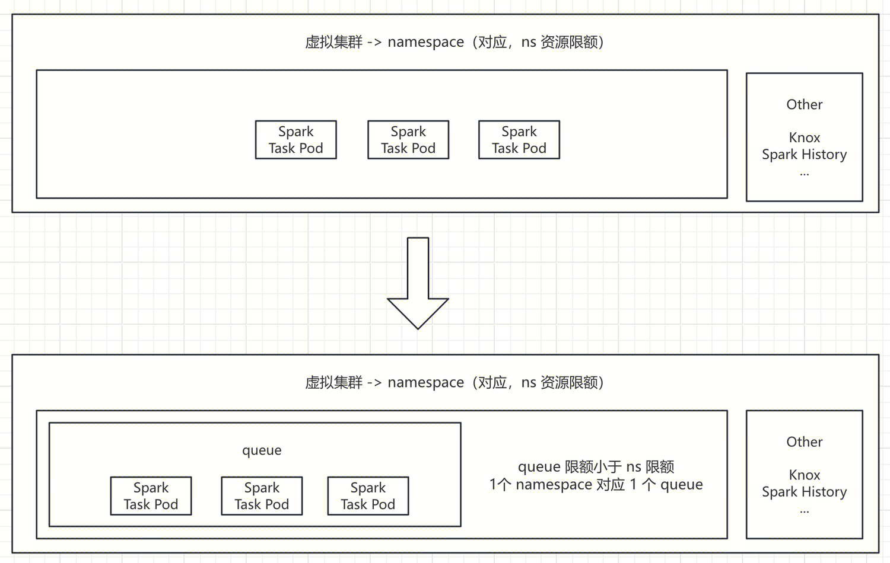

3、代码提交：编译 Volcano 模块；自定义 podgroup 字段参数及默认值，避免生成 podgroup yaml 模块。


# 3. 参考

1. [Spark 官网 - 自定义 K8s 调度器](https://spark.apache.org/docs/3.4.2/running-on-kubernetes.html#customized-kubernetes-schedulers-for-spark-on-kubernetes)
2. [Volcano 官网](https://volcano.sh/zh/docs/)
3. [Yunikorn 官网](https://yunikorn.apache.org/docs/)
4. [Volcano 原理、源码分析](https://www.cnblogs.com/daniel-hutao/p/17935624.html)