# 1. 向量化背景

**1、CPU 成为性能瓶颈**

随着计算机硬件发展，存储和网络都有进一步的提升，但是 CPU 却并没有什么变化。按照如今硬件的发展趋势，当内存与 IO 不再成为瓶颈后，CPU 成为了性能瓶颈的关键。

|      | **2010**       | **2015**        | **2020**        |
| :--- | :------------- | :-------------- | :-------------- |
| 存储 | 50 MB/s（HDD） | 500 MB/s（SSD） | 16 GB/s（NVMe） |
| 网络 | 1 Gbps         | 10 Gbps         | 100 Gbps        |
| CPU  | ~3 GHz         | ~3 GHz          | ~3 GHz          |

那么如何让 CPU 计算更快呢？当前有三种方式：**线程级并行、指令级并行、数据级并行**。其中，指令级并行指的是一个程序中的多条指令操作同时执行，指令流水线（Instruction pipelining）是其常见的实现方式，它利用执行指令操作之间的并行性，实现多条指令重叠执行。下表是经典的 RISC 流水线，在这个流水线中一条指令的执行时间是 5 个时钟周期，但执行 5 个指令也只需要 7 个时钟周期，相对不做指令级并行时 5 * 5 = 25 个时钟周期而言，并行效果不言而喻。

| Clock cycleInstr. No. | 1    | 2    | 3    | 4       | 5    | 6    | 7    |
| :-------------------- | :--- | :--- | :--- | :------ | :--- | :--- | :--- |
| 1                     | IF   | ID   | EX   | **MEM** | WB   |      |      |
| 2                     |      | IF   | ID   | **EX**  | MEM  | WB   |      |
| 3                     |      |      | IF   | **ID**  | EX   | MEM  | WB   |
| 4                     |      |      |      | **IF**  | ID   | EX   | MEM  |
| 5                     |      |      |      |         | IF   | ID   | EX   |

注 1：IF = 指令获取（Instruction Fetch），ID = 指令解码（Instruction Decode），EX = 执行（Execute），MEM = 访问内存（Memory access），WB = 寄存器回写（Register write back）。

注 2：在第四个时钟周期（绿色列）中，最早的指令处于 MEM 阶段，而最新的指令尚未进入流水线。

**然而有些操作会破坏指令级并行，如分支预测、指令间前后依赖、虚函数调用**。分支预测指的是，处理器根据判定条件的真/假不同，有可能会产生跳转，而这会打断流水线中指令的处理，因为处理器无法确定该指令的下一条指令，一旦分支预测错误，处理器需要丢弃已经进入流水线的指令，按真实分支执行，从而导致性能损失。同理，虚函数调用是通过动态绑定实现的，直到方法调用之前，处理器都不知道要调用的实际函数（Java 中的多态）。

 

**2、Volcano 迭代模型**

当今绝大多数数据库系统处理 SQL 查询的方式都是将其翻译成一系列的关系代数算子或表达式，然后依赖这些关系代数算子逐条处理输入数据并产生结果。从本质上看，这是一种迭代的模式，某些时候也被称为 Volcano 形式的处理方式，由 Graefe 在 1993 年提出。

该模式可以概括为：每个物理关系代数算子反复不断地调用 next 函数来读入数据元组作为算子的输入，经过表达式处理后输出一个数据元组的流。这种模式简单而强大，能够通过任意组合算子来表达复杂的查询。**这种迭代处理模式提出的背景是减轻查询处理的 IO 瓶颈，对 CPU 的消耗则考虑较少**。首先，每次处理一个数据元组时，next 函数都会被调用，在数据量非常大时，调用的次数会非常多。最重要的是，**next 函数通常实现为虚函数或函数指针，这样每次调用都会引起 CPU 中断并使得 CPU 分支预测（Branch Prediction）下降，因此相比常规函数的调用代价更大**。此外，迭代处理模式通常会导致很差的代码本地化能力，并且需要保存复杂的处理信息。例如，表扫描算子在处理一个压缩的数据表时，在迭代模式下，需要每次产生一个数据元组，因此表扫描算子中需要记录当前数据元组在压缩数据流中的位置，以便根据压缩方式跳转到下一条数据元组的位置。

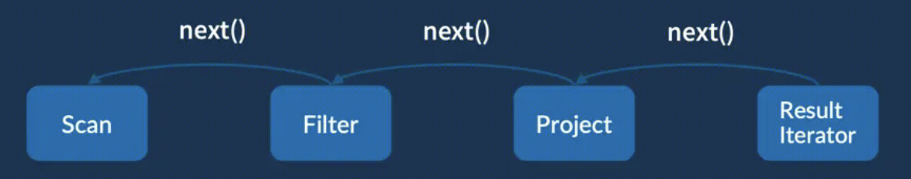

基于上述性能的考虑，**Spark 将查询编译成中间可执行的格式，即动态代码生成（Code generation），来取代解释性的结构，参考论文《Efficiently Compiling Efficient Query Plans for Modern Hardware》**。代码生成技术在大数据中应用非常广泛，例如，Impala 中采用 LLVM （Low-Level Virtual Machine）作为中间代码加速数据处理、Spark SQL 生成 Java 中间代码来提升效率。总的来讲，动态代码生成能够有效解决 3 个方面的问题：

- 大量虚函数调用，生成的实际代码不再需要执行表达式系统中统一定义的虚函数（如 Eval、Evaluate 等) 。
- 判断数据类型和操作算子等内容的大型分支选择语句。
- 常数传播（Constants propagation）限制，生成的代码中能够确定性地折叠常量。

**另一个思路则是 MonetDB 系列数据库采用的面向数据块（Block）的方式，一次读取一批数据，来获得数据向量化的处理优势，参考论文《MonetDB/X100: Hyper-Pipelining Query Execution》**。具体包含两方面，一方面是每次解压一批数据元组，然后每次迭代读取数据时只在这批数据中读取；另一方面是直接在 next 函数读取数据时就读取多个数据元组，甚至一次性读取所有的数据元组。上述面向数据块的处理方式在一定程度上确实能够消除在大数据量情况下的调用代价，然而却丢掉了迭代模式一个重要优点，即所谓的能够按照管道方式传输数据（Pipelining data）。管道方式意味着数据从一个算子传输到另一个算子不需要进行额外复制或序列化处理，然而在面向数据块的处理方式中，一次产生多条数据元组往往需要序列化保存，虽然能够带来向量化处理的优势，但是破坏了管道方式的优点，并且在通常情况下会消耗更多的内存与网络带宽。总的来讲，向量化的优势在于：

- 减少虚函数调用，促进 CPU 乱序并发执行。
- 使用 SIMD 等技术优化数据级并行。
- 以块为单位，增加 CPU Cache 命中率。

 

**3、SIMD 指令集**

**SIMD 是 Single Instruction Multiple Data 的缩写，指单个指令可以操作多个数据流**，与之相对的是传统的 SISD，单指令单数据流。如图所示，对于最简单的 A + B = C，假如我们要计算 4 组加法，传统的 SISD 需要执行 8 次 Load 指令 (A 和 B 分别 4 次)、4 次 Add 指令、4 次 Store 指令。但当我们使用 128 位宽的 SIMD， 我们只需要 2 次 Load 指令、1 次 Add 指令、1 次 Store 指令，这样理论上就可以获得 4 倍的性能提升。而目前的向量化寄存器位宽已经发展到 512 位，理论上 Int 的加法操作就可以加速 16 倍。

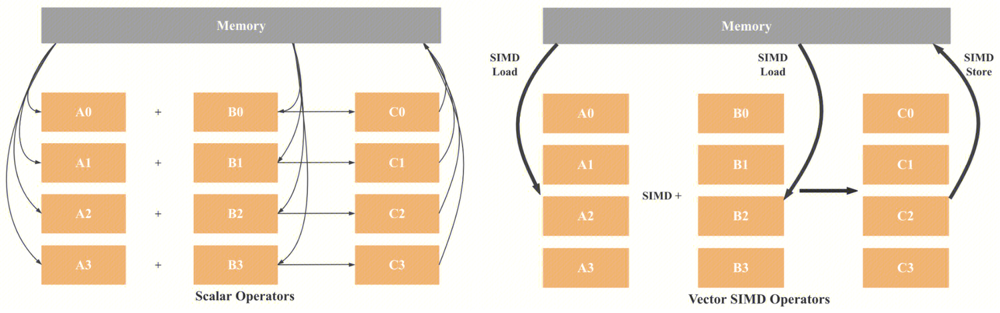

 

**4、JVM 向量化**

在计算密集型应用中，使用 CPU 提供的 SIMD 指令加速是目前常见的一种思路。Java 作为大数据领域中最主要的语言，它不像 C 或 C++ 能够直接调用操作系统底层的命令（如分配内存或调用 CPU 指令），只能通过曲线救国的方法实现。曲线救国大致分为两类，一类是用 C++ 代码将计算密集的算子进行实现，然后通过 JNI 的方式包装到 Java 中；第二类是利用 JIT 的热点代码编译机制，例如使用循环将两个向量相加，当 JIT 发现这是一段热点代码之后，就会尝试把它编译为 native code，并在其中使用 SIMD 指令。

上面两种方案都有其不足，**前者可能需要针对不同平台写不同的代码，失去了 Java 通用性的优势，JNI 也会带来一定的额外开销；后者不能手动控制，整个向量化过程是隐式的，且 JIT 能优化成什么样子是不可靠的**。例如，对两个向量的加法，如果调用的次数是 1000 次，JIT 就不会在 native code 中使用 SIMD 指令；如果循环的次数是 10w 次，JIT 则会使用 SIMD 指令。当代码被调用的次数不够多，或者算法实现的比较复杂，那么 JIT 就很可能不会使用 SIMD 来编译函数。

为了让 Java 也可以充分利用硬件的性能，JDK16 首次引入了 Vector API（JEP 338），支持了 x64、arm neon、POWER PC 平台的向量化。JDK17 （JEP414）对 Vector API 进行了改进，主要集成了 Intel 的 Short Vector Math Library（SVML），并在性能上进行了改进。在支持 SIMD 指令的平台上运行带有 Vector API 的代码时，Hotspot 会把对应的代码编译成 SIMD 指令；如果平台不支持，那么 Hotspot 会将对应的代码退化成普通的循环，仍然保持 Java 良好的跨平台特性。

 

# 2. Tungsten

**Tungsten 是开源社区专门用于提升 Spark 性能的计划**。因为 Spark 是用 Scala 语言开发的，所以最终运行在 JVM 上的代码存在着各方面的限制和弊端（例如 GC 上的 overhead），使得 Spark 在性能上有很大的提升空间，基于此考虑，Tungsten 计划应运而生。**Tungsten 的优化主要包括 3 个方面：内存管理与二进制处理（Memory management and binary processing）、缓存敏感计算（Cache-aware computation）和动态代码生成（Code generation）**。

## 2.1 内存管理与二进制处理

催生 Tungsten 内存管理优化的原因主要来自两个方面：**Java 对象占用内存空间大（如额外的对象头占用）、JVM 垃圾回收的开销大**。为此，Spark 利用 sun.misc.Unsafe API，间接调用 native 方法，直接在操作系统内存分配空间，利用这些空间， Spark 就能通过一些地址和偏移量的信息来表达一个对象的内容，当然这些堆外内存的回收也需要 Spark 来完成。

Spark 为数据缓存和计算执行提供了统一的内存管理接口 MemoryManager，其子类包括：StaticMemoryManager（静态内存管理机制，已弃用）与 UnifiedMemoryManager（ 统一内存管理机制）。 统一内存管理机制将 Executor JVM 内存空间划分以下 3 个部分。

1、**系统保留内存（Reserved Memory）**：用于存储 Spark 产生的内部对象，默认 300 M

2、**用户代码空间（User Memory）**：用于存储用户代码生成的对象，大小约为 40% 内存空间

3、**框架内存空间（Framework Memory）**：**包括数据缓存空间和框架执行空间，总大小为 spark.memory.fraction（默认 0.6）x （heap - Reserved Memory）**，约为 60% 内存空间。两者共享这个空间，其中一方空间不足可以动态向另一方借用。当数据缓存空间不足时，可以向框架执行空间借用其空闲空间，后续当框架执行空间需要更多空间时，数据缓存空间需要“归还”借用的空间。同样，当框架执行空间不足时，可以向数据缓存空间借用，但至少要保证数据缓存空间具有约 spark.memory.storageFraction（默认 0.5）x Framework Memory 空间，且框架执行空间借走的空间不会“归还”，因为需要考虑 Shuffle 过程中的很多因素，实现起来较为复杂

Framework Memory 堆外空间：**为了减少 GC 开销，Spark 也允许使用堆外内存，该空间不受 JVM 垃圾回收机制管理，在结束使用时需要手动释放空间**。堆外空间大小通过 spark.memory.offHeap.size 设置，只用于数据缓存空间和框架执行空间，比例仍通过 spark.memory.storageFraction 设置。

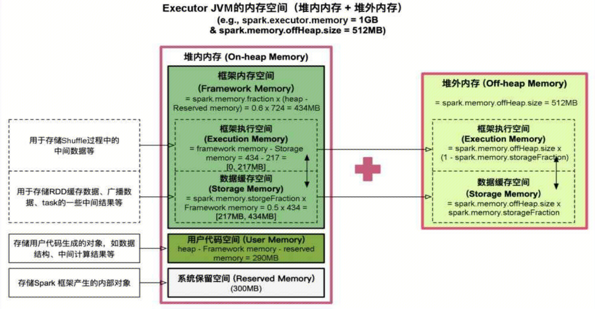

注意，在 JVM 中，对象可以以序列化的方式存储，序列化的过程是将对象转换为二进制字节流，其占用的内存大小可直接计算，而对于非序列化的对象，其占用的内存是通过周期性地采样近似估算而得的，并不是每次新增数据项都会计算一次占用的内存大小，这种方法降低了时间开销，但是有可能误差较大，导致某一时刻的实际内存有可能远远超出预期。此外，被 Spark 标记为释放的对象实例，实际上很有可能并没有被 JVM 回收，导致实际可用的内存大小小于 Spark 记录的可用内存大小。所以，**Spark 并不能准确记录实际可用的堆内内存，也就无法完全避免内存溢出 （Out of Memory）的异常**。

 

## 2.2 缓存敏感计算

缓存敏感计算（Cache-aware computation）主要对比的是普通的内存计算。**在硬件层面，访问 CPU 的 L1/L2/L3 级缓存比访问内存速度快，大数据处理系统可以利用这个特性优化性能**。而要将数据存储在 L1/L2/L3 中，数据大小需要满足特定条件。基于该目标，Tungsten 缓存敏感计算机制通过设计缓存友好的数据结构，来提高缓存命中率（Cache hit）和本地化（Cache locality）的特性。目前，Spark 缓存敏感计算优化针对的主要是排序操作，相应的实现是 UnsafeExternalSorter 和 UnsafeInMemorySorter 类。

Cache-aware 排序原理如图所示，常规的做法是每个 record（<key, value>）中有一个指针指向该 record，对两个 record 排序先根据指针定位到实际数据，然后对实际数据进行比较，这个操作涉及的都是内存的随机访问，缓存本地化会变得很低。针对该缺陷，**缓存友好的存储方式会将 key 和 record 指针放在一起，以 key 为前缀，排序操作按照线性方式查询 key-pointer 对，避免内存的随机访问**。以 UnsafelnMemorySorter 为例，它存储数据指针和数据前缀，对两条记录进行排序时，首先判断两条记录的 prefix 是否相等，如果根据 prefix 就可以判断出两条记录的大小，那么直接返回结果；否则根据数据指针得到实际数据再进行进一步的比较。相对于实际数据，pointer 和 prefix 占用的空间都比较小，在比较时遍历较小的数据结构更有利于提高 cache 命中率。

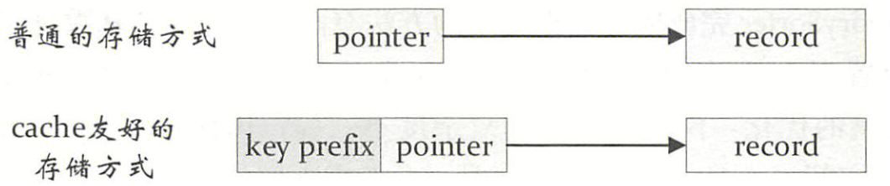


 

## 2.3 动态代码生成

### 2.3.1 Janino 编译器

**在 Spark 中，生成的代码由 Janino 进行编译**。Janino 是一个小且快的 Java 编译器，它不仅能像 javac 工具那样将一组源文件编译成字节码文件，还可以对一些 Java 表达式、代码块、类中的文本（Class body）或内存中的源文件进行编译，并把编译后的字节码直接加载到同一个 JVM 中运行。Janino 不是一个开发工具，而是运行时的嵌入式编译器，比如作为表达式求值的翻译器。典型案例如下，method1 和 method2 都是静态方法，ScriptEvaluator 执行 cook 方法来编译整个代码模块，然后调用 evaluate 执行该模块的处理逻辑。

```xml
<dependency>
    <groupId>org.codehaus.janino</groupId>
    <artifactId>janino</artifactId>
    <version>3.1.2</version>
</dependency>
```

```java
import org.codehaus.commons.compiler.CompileException;
import org.codehaus.janino.ScriptEvaluator;

import java.lang.reflect.InvocationTargetException;

public class JaninoTest {
    public static void main(String[] args) throws CompileException, InvocationTargetException {
        ScriptEvaluator se = new ScriptEvaluator();
        se.cook("static void method1() {\n"
                + "    System.out.println(\"run in method1()\");\n"
                + "}\n"
                + "\n"
                + "static void method2() {\n"
                + "    System.out.println(\"run in method2()\");\n"
                + "}\n"
                + "\n"
                + "method1();\n"
                + "method2();\n"
        );
        se.evaluate(null);
    }
}
```

 

### 2.3.2 基本表达式代码生成

**Tungsten 代码生成分为两部分，一部分是最基本的表达式代码生成，另一部分称为全阶段代码生成，用来将多个处理逻辑整合到单个代码模块中**。代码生成的实现中 CodegenContext 算是最重要的类，它作为代码生成的上下文，记录了将要生成的代码中的各种元素，包括变量、函数等。

```scala
class CodegenContext extends Logging {
  // 类型为二元字符串，分别表示Java类型、变量名称。例如，二元组("int", "count")将在生成的类中作为成员变量，即：private int count
  private[catalyst] val inlinedMutableStates: mutable.ArrayBuffer[(String, String)] =
    mutable.ArrayBuffer.empty[(String, String)]
  // 添加变量，需要指定Java类型、变量名称和变量初始化函数
  def addMutableState(...): String = { ... }
  // 添加缓冲变量，用来存储来自InternalRow中的数据，比如一行数据中的某些列等，因此，这些变量仅在类中声明，但是不会在初始化函数中执行
  def addBufferedState(): ExprCode = { ... }
  // 用来在生成的Java类中声明这些变量（默认均private类型）
  def declareMutableStates(): String = { ... }
  // 用来在类的初始化函数中生成变量的初始化代码，输出的元素都是每行一个
  def initMutableStates(): String = { ... }
  
  // 用于保存RDD分区的下标，可以通过addPartitionInitializationStatement方法添加
  val partitionInitializationStatements: mutable.ArrayBuffer[String] = mutable.ArrayBuffer.empty
  // 用来保存生成代码中的对象（objects），可以通过addReferenceObj方法添加
  val references: mutable.ArrayBuffer[Any] = new mutable.ArrayBuffer[Any]()
  // 嵌套的映射，包含每个类所属的函数名和函数代码的映射，可以通过addNewFunction方法添加函数，并通过declareAddedFunctions方法声明函数
  private val classFunctions: mutable.Map[String, mutable.Map[String, String]] =
    mutable.Map(outerClassName -> mutable.Map.empty[String, String])
  
  // ...
}
```

代码生成的过程由代码生成器 CodeGenerator 完成，它是一个抽象类，对外提供生成代码的接口是 generate。CodeGenerator 共有 7 个子类，如生成 SpecificOrdering 的 GenerateOrdering 类、生成 Predicate 用于谓词处理的 GeneratePredicate 类等。经过 CodeGenerator 类生成后的代码，由其伴生对象提供的 compile 方法进行编译，得到 GeneratedClass 的子类。GeneratedClass 仅仅起到封装生成类的作用，在具体应用时会调用 generate 方法显示强制转换得到生成的类。

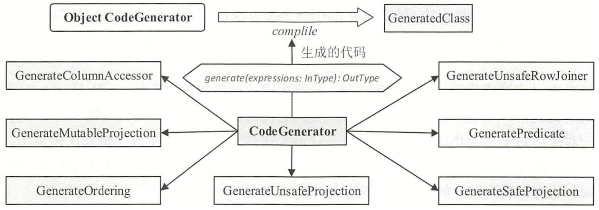

在《Spark SQL 入门》中介绍过，查询语句 `SELECT `name` FROM `student` WHERE `age` > 18` 生成的物理计划包括 FileSourceScanExec、FilterExec 和 ProjectExec 三个节点。为了考察基本的代码生成功能，需要关闭全阶段代码生成，即将 spark.sql.codegen.wholeStage 设置为 false。从各个不同节点的 doExecute 方法可知，执行计划中的 FiterExec 节点最终会调用 GeneratePredicate 对象的 generate 方法生成 Predicate 类，完成过滤算子的逻辑；ProjectExec 节点则最终会调用 GenerateUnsafeProjection 对象的 generate 方法生成 UnsafeProjection 类，完成投影算子的逻辑。

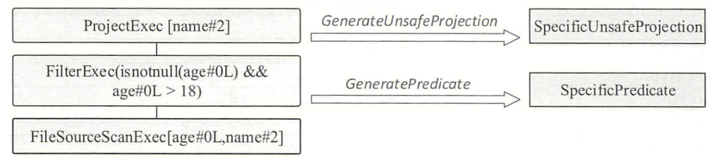

以 GeneratePredicate 的代码生成为例，代码生成先构造一个 CodegenContext 对象，然后 FilterExec 算子的谓词表达式直接调用 Expression 的 genCode 方法。案例中的谓词表达式是 `isnotnull(age） && age > 18`，其根节点为 And 表达式，两个子节点分别力 IsNotNull 和 GreaterThan 表达式，因此最终调用的是 And 类的 doGenCode 方法，代码生成逻辑详见源码。而对于 IsNotNull 和 GreaterThan 这两个表达式，其代码生成逻辑 doGenCode 都比较简单，这里不再赘述。GeneratePredicate 代码生成后，FilterExec 类将在 doExecute 方法中继续调用生成代码的 eval 方法（这里减少了虚函数的调用），执行过滤逻辑。

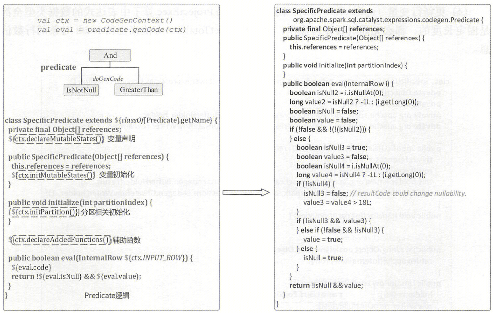


 

### 2.3.3 全阶段代码生成

**Catalyst 全阶段代码生成的入口是 CollapseCodegenStages 规则（参见 QueryExectution），当参数 spark.sql.codegen.wholeStage 为 true（默认）时，CollapseCodegenStages 规则会将物理计划中支持代码生成的节点生成的代码整合成一段，因此称为全阶段代码生成（WholeStageCodegen）**。

仍以查询语句 `SELECT `name` FROM `student` WHERE `age` > 18` 为例，其生成的物理计划包括 FileSourceScanExec、FilterExec 和 ProjectExec 三个节点。这三个节点都支持代码生成，因此 CollapseCodegenStages 规则会在三个物理算子节点上添加一个 WholeStageCodegenExec 节点，其主要功能就是将这三个节点生成的代码整合在一起。此外，**在加入了 WholeStageCodegenExec 物理节点后，物理计划打印输出时不会打印该节点本身，其所囊括的所有子节点在打印输出字符串（generateTreeString）时，都会统一加入特定的（“\*”）字符作为前缀，用来区别不支持代码生成的物理计划节点**。

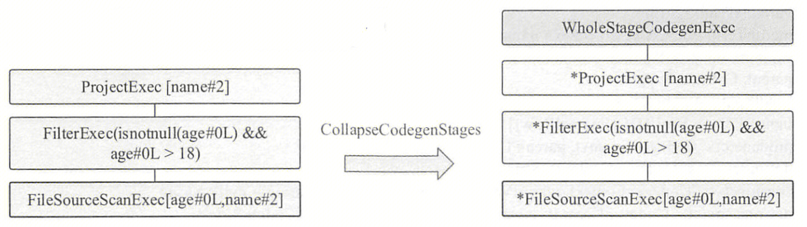

一般来讲，对于物理算子树，CollapseCodegenStages 规则会根据节点是否支持代码生成采用不同的处理方式。在遍历物理算子树时，当碰到不支持代码生成的节点时，会在其上插入一个名为 InputAdapter 的物理节点对其进行封装。在某种程度上，这些不支持代码生成的节点可以看作是分隔的点，可将整个物理计划拆分成多个代码段。而 InputAdapter 节点可以看作是对应 WholeStageCodegenExec 所包含子树的叶子节点，起到 InternalRow 的数据输入作用。

在 Spark 中，CodegenSupport 接口代表支持代码生成的物理节点，它本身也是 SparkPlan 的子类。其中，variablePrefix 方法返回 String 类型，表示对应的物理算子节点生成的代码中变量名的前缀，不同的节点类型其前缀不同。比较重要的是 consume/doConsume 和 produce/doProduce 这两对方法，**consume 方法消费当前 SparkPlan 生成的列或行，并调用其父节点的 doConsume 方法；而 produce 方法返回用于处理输入 RDD 中行的 Java 源代码，并调用由子类重写的 doProduce 方法**。

下图展示了 WholeStageCodegenExec 的主要逻辑，可以看到其 execute 方法具体分为数据获取与代码生成两部分。假设物理算子节点 A 支持代码生成，物理算子节点 B 不支持代码生成，因此 B 会采用 InputAdapter 封装（图中的 Fakelnput，起到了数据源的作用）。数据的获取比较直接，调用 inputRDDs 递归得到整段代码的输入数据。代码生成可以看作是两个方向相反的递归过程：代码的整体框架由 produce/doProduce 方法负责，父节点调用子节点；代码具体处理逻辑由 consume/doConsume 方法负责，由子节点调用父节点。

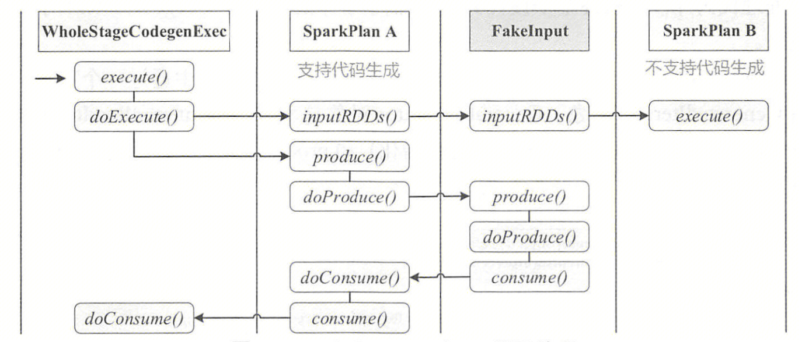

```scala
WholeStageCodegenExec
  doExecute()
    // 生成WholeStageCodegenExec子树的代码
    val (ctx, cleanedSource) = doCodeGen()
      // 构造一个CodegenContext对象
      val ctx = new CodegenContext
      // 调用CodegenSupport类的produce方法，返回用于处理输入RDD中行的Java源代码
      val code = child.asInstanceOf[CodegenSupport].produce(ctx, this)
        // 由子类复写实现
        doProduce(ctx)
      // 实际的代码
      ctx.addNewFunction("processNext", ... ${code.trim} ... )
    // 尽管rdds是一个RDD[InternalRow]，但它实际上可能是一个RDD[ColumnarBatch]，只是类型擦除隐藏了这一点。这允许代码生成阶段的输入是列式存储的，但输出必须是行式存储的
    val rdds = child.asInstanceOf[CodegenSupport].inputRDDs()
    // 生成的Java代码，交给Janino编译器进行编译
    try { CodeGenerator.compile(cleanedSource) }
      // 如果编译失败且配置回退机制（参数spark.sql.codegen.fallback，默认为true），则代码生成将被舍弃转而执行Spark原生的逻辑
      catch { case NonFatal(_) if !Utils.isTesting && conf.codegenFallback => return child.execute() }
    // 如果顺利编译成功，得到生成的对象clazz
    val (clazz, _) = CodeGenerator.compile(cleanedSource)
    // 这里的buffer实际是BufferedRowIterator子类GeneratedIterator，GeneratedIterator由WholeStageCodegenExec代码框架生成
    val buffer = clazz.generate(references).asInstanceOf[BufferedRowIterator]
```

节点的 produce 方法调用 doProduce 方法，而 doProduce 中递归调用子节点的 produce 方法，如果是叶子节点或 InputAdapter 节点，doProduce 方法会生成具体的代码框架，因此图中在 Fakeinput 节点的 doProduce 方法中构造代码生成的框架，具体代码如下，**可以看到生成的代码框架基于 while 语句循环，不断地读入数据行（row），并将数据行的处理理交给 consume 方法完成**。每个物理算子节点的 consume 方法将生成相应的代码来完成该节点的数据处理逻辑，consume 方法将递归调用其父节点的 doConsume 方法，这样正好对应了子节点处理逻辑先于父节点处理逻辑的顺序关系。

```scala
// 从单个RDD读取的叶子代码生成节点，InputAdapter继承自InputRDDCodegen
trait InputRDDCodegen extends CodegenSupport {
  override def doProduce(ctx: CodegenContext): String = {
    val input = ctx.addMutableState("scala.collection.Iterator", "input", v => s"$v = inputs[0];",
      forceInline = true)
    val row = ctx.freshName("row")
    // ...
    
    s"""
       | while ($limitNotReachedCond $input.hasNext()) {
       |   InternalRow $row = (InternalRow) $input.next();
       |   ${updateNumOutputRowsMetrics}
       |   ${consume(ctx, outputVars, if (createUnsafeProjection) null else row).trim}
       |   ${shouldStopCheckCode}
       | }
     """.stripMargin
  }
}
```

WholeStageCodegenExec 生成代码的入口在 doCodeGen 方法中，首先构造一个 CodegenContext 对象；然后将此对象作为 CodegenSupport 中 produce 方法的参数，直接调用 produce 方法生成具体的处理代码片段；最终基于该代码片段和代码生成之后的 CodegenContext 对象，构造完整的代码段。WholeStageCodegenExec 的代码框架如图所示，生成的代码中通过 generate 静态方法来构造 GeneratedIterator 对象，GeneratedIterator 对象是 BufferedRowIterator 对象的子类，重载实现了 init 方法（负责相关变量的初始化）和 processNext 方法（用于循环处理 RDD 中的数据行）。

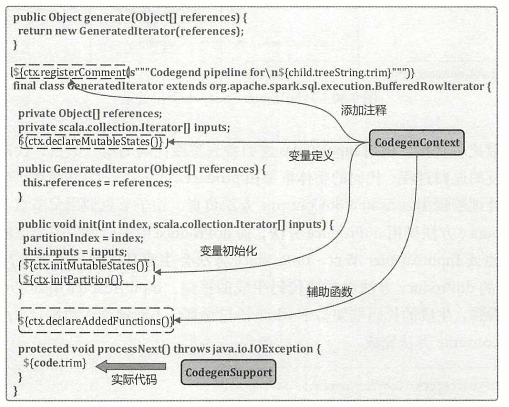

最后介绍一下全阶段代码生成中的向量化是如何实现的。Spark 中有个 ColumnarToRowExec 物理节点，它可以**将 ColumnarBatch 的 RDD 转换为 InternalRow 的 RDD（列转行）**，ColumnarBatch（列批）用于高效处理列式存储的数据，它是一组列向量（ColumnVector）的集合，每个列向量表示一个列的数据。Spark 向量化实现依靠三步：首先需要一个列式存储，如 Parquet、ORC；然后需要一个列存储的读取器，如 VectorizedParquetRecordReader、OrcColumnarBatchReader，它在读取数据时返回 ColumnarBatch 类型；最后通过上面介绍的全阶段代码生成逻辑，**调用 ColumnarToRowExec 类的 doProduce 方法，代码如下，该方法将列转成行，将 while(input.hasNext()) 转成一个 for 循环，从而利用 JVM 向量化加速处理**。可见 Spark 动态生成的代码依赖 JVM 向量化，而 JVM 向量化不能手动控制，优化效果不可靠，由此引出下面介绍的向量化项目。

```scala
// ColumnarBatch表示列式存储的数据，它的每列数据由ColumnVector表示
public class ColumnarBatch implements AutoCloseable {
  protected int numRows;
  // ColumnVector是抽象类，存储了具体的数据，它有多种实现方式，每种方式对应着不同的格式
  // 例如，Spark内置的ArrowColumnVector子类对应arrow格式，OrcColumnVector子类对应orc格式等
  protected final ColumnVector[] columns;
  // ...
}
// 提供一个通用的执行器，将[[ColumnarBatch]]的[[RDD]]转换为[[InternalRow]]的[[RDD]]，当确定需要进行这样的转换时，会插入该执行器
case class ColumnarToRowExec(child: SparkPlan) extends ColumnarToRowTransition with CodegenSupport {
  // 生成代码，将输入迭代器作为[[ColumnarBatch]]处理。对于每个批次中的每一行，将生成一个[[org.apache.spark.sql.catalyst.expression.UnsafeRow]]
  override protected def doProduce(ctx: CodegenContext): String = {
    // ...
    
    s"""
       |if ($batch == null) {
       |  $nextBatchFuncName();
       |}
       |while ($limitNotReachedCond $batch != null) {
       |  int $numRows = $batch.numRows();
       |  int $localEnd = $numRows - $idx;
       |  for (int $localIdx = 0; $localIdx < $localEnd; $localIdx++) {
       |    int $rowidx = $idx + $localIdx;
       |    ${consume(ctx, columnsBatchInput).trim}
       |    $shouldStop
       |  }
       |  $idx = $numRows;
       |  $batch = null;
       |  $nextBatchFuncName();
       |}
     """.stripMargin
  }
}
```

 

# 3. Gluten

早期社区使用了 Code Generation、Tungsten 内存优化等技术，大幅提升了 Spark 执行性能，自 Spark 2.4 以后， Spark 中物理执行优化的相关工作较少。近年来，Databricks 推出了 Photon 本地向量化执行引擎，某些计算场景下性能可提升 10x，但是并不开源，与之类似的有 Facebook 开源的 Velox 执行引擎，但是其初衷是为了给 Presto 加速，缺乏与 Spark 的集成配套。为此，Intel 领衔开发并开源了 Gluten 项目，其参考了 Photon 的设计思想，以插件的方式给 Spark 提供了本地向量化执行的能力。

不同于大多数 Spark SQL 的优化工作，**Gluten 主要工作是在 Spark SQL 物理计划阶段进行优化，借助已有的本地向量化引擎（如 Velox、Clickhouse），将计算操作转换到本地向量化引擎上执行，以此来提升性能**。对应地，Velox 本身不能解析 SQL 语句，也不做计划的优化，通常用法是接受一个物理计划作为输入，调用相关接口执行物理计划，Velox 通过实现列式的存储（Vector）以支持向量化的表达式计算，由于使用了列式存储，相同类型的数据在内存中紧密排列，所以可以运用 SIMD 指令集提升性能。

## 3.1 架构

自 Spark 2.0 引入全阶段代码生成来取代火山迭代模型，从而实现了 2-10 倍的速度提升（参见 [spark-release-2-0-0](https://spark.apache.org/releases/spark-release-2-0-0.html)），从那以后，大多数优化都是在查询计划层面进行的，单个操作符的性能几乎不再增长。另一方面，SQL 引擎已被研究多年。有一些库，如 Clickhouse、Arrow 和 Velox 等，通过使用本地实现、列数据格式和向量化数据处理等功能，这些库可以超越 Spark 基于 JVM 的 SQL 引擎。

Gluten 在拉丁语中是胶水的意思，其作用也正像胶水一样，**主要用于粘合 Spark 和作为后端（Backend）的本地向量化引擎（Native Vectorized Engine）。Gluten 设计的基本原则是尽可能重用 Spark 的整个控制流程和尽可能多的 JVM 代码，但将计算密集型的数据处理部分卸载到本地代码中，其目标用户是任何希望从根本上加速 Spark SQL 的人，作为 Spark 的插件，Gluten 无需对 dataframe API 或 SQL 查询进行任何更改，只需用户进行正确配置即可**，有关 Gluten 配置属性参见[配置说明](https://github.com/apache/incubator-gluten/blob/main/docs/Configuration.md)。

Gluten 架构图如下，[Substrait](https://substrait.io/) 为数据计算操作提供了一个明确定义的跨语言规范，**Spark 物理计划被转换为 Substrait 计划，然后通过 JNI 调用将 Substrait 计划传递给 Native Engine。在 Native Engine，本地算子链将被构建出来并卸载到本地引擎**。Gluten 将向 Spark 返回 Columnar Batch，并在执行时使用 Spark Columnar API。由于 Gluten 使用 Apache Arrow 数据格式作为其基本数据格式，因此返回给 Spark JVM 的数据是 ArrowColumnarBatch。

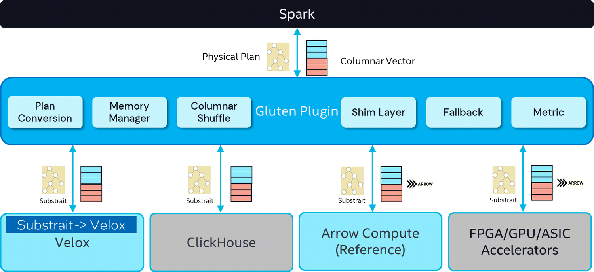

目前，Gluten 仅支持 Clickhouse 后端和 Velox 后端，还可以扩展以支持更多的后端。Gluten 有以下几个关键组件：

**1、Query Plan Conversion（查询计划转换）**

**Gluten 最核心的能力，即通过 Spark Plugin 的机制，把 Spark 查询计划拦截并下发给 Native Engine 来执行，跳过原生 Spark 不高效的执行路径**。整体的执行框架仍沿用 Spark 既有实现，包括消费接口、资源和执行调度、查询计划优化、上下游集成等。一般来讲，Native Engine 的能力，无法 100% 覆盖 Spark 查询执行计划中的算子，因此 Gluten 必须分析 Spark 查询执行计划中哪些算子是可以下推给 Native Engine，并将这些相邻的、可下推的算子封装成一个 Pipeline，序列化并发送给 Native Engine 来执行并返回结果。Gluten 依赖一个独立的名为 Substrait 的开源项目，其使用 protobuf 来实现引擎中立的查询计划的序列化。在线程模型的角度，Gluten 使用以 JNI 调用 Library 的形式，在 Spark Executor Task 线程中直接调用 Native 代码，并且严格控制 JNI 调用的次数。因此，Gluten 并不会引入复杂的线程模型。 

**2、Unified Memory Management（统一内存管理）**

由于 Native 代码和 Spark Java 代码在同一个进程中运行，因此 Gluten 具备了统一管理 Native 空间和 JVM 空间内存的条件。在 Gluten 中，Native 空间的代码在申请内存时，会先向本地的 Memory Pool 申请内存，如果内存不足，会进一步向 JVM 中 Task Memory Manager 申请内存配额，得到相应配额后才会在 Native 空间成功申请下内存。通过这种方式，**Native 空间的内存申请也受到 Task Memory Manager 的统一管理**。当发生内存不足的现象时，Task Memory Manager 会触发 Spill，不管是 Native 还是 JVM 中的 operator 在收到 Spill 通知时都会释放内存。

**3、Columnar Shuffle（列式洗牌）**

Shuffle 本身是影响性能的重要一环，由于 Native Engine 大多采用列式（Columnar）数据结构暂存数据，如果简单沿用 Spark 的基于行数据模型的 Shuffle，则会在 Shuffle Write 阶段引入数据列转行的环节，在 Shuffle Read 阶段引入数据行转列的环节，才能使数据流畅周转。但是无论行转列，还是列转行的成本都不低，因此，**Gluten 必须提供完整的 Columnar Shuffle 机制以避开这里的转化开销**。和原生 Spark 一样，Columnar Shuffle 也需要支持内存不足时的 Spill 操作，优先保证查询的健壮性。

**4、Fallback Mechanism（回退机制）**

**对于 Native Engine 无法承接的算子，Gluten 安排回退到正常的 Spark 执行路径**。Databricks 的 Photon 目前也只支持了部分 Spark 算子，应该是采用了类似的做法。

**5、Metrics（指标）**

从 Gluten Native Engine 收集的指标，用于帮助识别错误、性能瓶颈等，这些指标显示在 Spark UI 中。

**6、Shim Layer（适配层）**

用户出于所在公司技术栈的考虑，可能会偏向使用兼容不同的 Native Engine。因此，Gluten 有必要定义清晰的 JNI 接口，作为 Spark 框架和底层 Backend 通信的桥梁。这些接口用来满足请求传递、数据传输、能力检测等多个方面的需求。开发者只需要实现这些接口，并满足相应的语义保障，就能利用 Gluten 完成 Spark 和 Native Engine 的粘合工作。**在 Spark 一侧，预留的 Shim Layer 就是用来适配支持不同版本的 Spark**，目前支持 Spark 3.2、3.3、3.4、3.5。

 

## 3.2 源码

说明：代码部分以 spark 3.5.7、gluten 1.4.0 为例讲解。

### 3.2.1 Plugin 入口

1、Spark 提供了 [SparkPlugin](https://spark.apache.org/docs/latest/api/java/org/apache/spark/api/plugin/SparkPlugin.html) 开发者 API，可动态加载 Spark 应用程序中的插件。插件有两个可选组件：[DriverPlugin](https://spark.apache.org/docs/latest/api/java/org/apache/spark/api/plugin/DriverPlugin.html)、[ExecutorPlugin](https://spark.apache.org/docs/latest/api/java/org/apache/spark/api/plugin/ExecutorPlugin.html)，在 Spark 启动 Driver 和每个 Executor 时会创建一个实例，子类需要实现 DriverPlugin、ExecutorPlugin 接口中定义的抽象方法，详见开发者 API。

```scala
// 以Driver为例，Executor类似
SparkContext
  // 在初始化task scheduler之前初始化插件
  _plugins = PluginContainer(this, _resources.asJava)
    // Executor调用PluginContainer(Right(env), resources)
    PluginContainer(Left(sc), resources)
      // 创建插件实例，PLUGINS即参数：spark.plugins
      val plugins = Utils.loadExtensions(classOf[SparkPlugin], conf.get(PLUGINS).distinct, conf)
        // 通过反射创建插件实例
        val klass = classForName[T](name)
      // 继承关系：DriverPluginContainer、ExecutorPluginContainer -> PluginContainer
      // PluginContainer抽象类定义了5个方法：①shutdown、②registerMetrics、③onTaskStart、④onTaskSucceeded、⑤onTaskFailed
      // DriverPluginContainer、ExecutorPluginContainer子类复写，在其中分别调用DriverPlugin、ExecutorPlugin插件的对应方法
      // DriverPlugin、ExecutorPlugin同样也是接口，同样定义了上面的5个方法，由子类实现，详见开发者API
      case Left(sc) => Some(new DriverPluginContainer(sc, resources, plugins))
        // 调用DriverPlugin API子类复写的init方法初始化插件，ExecutorPlugin类似
        driverPlugin.init(sc, ctx)
        logInfo(s"Initialized driver component for plugin $name.")
```

 

2、Gluten 通过参数 `--conf spark.plugins=org.apache.gluten.GlutenPlugin` 将自身插件的类名添加到 Spark 配置中，这个类即为插件的入口。Driver、Executor 插件初始化流程类似，这里以 Driver 为例：

- 设置一些预定义参数，例如修改参数 `spark.sql.extensions`，在原有基础上新增 `org.apache.gluten.extension.GlutenSessionExtensions` 扩展，**即通过注入了一系列规则 Rule 和策略 Strategy，从而影响 Catalyst 从 SQL 语句的解析到最终执行计划的生成多个阶段**。
- 初始化后端库，以 Velox 为例，具体包括：初始化 Gluten 的本地目录，注册列式 shuffle 管理器 `org.apache.spark.shuffle.GlutenShuffleManager`，加载自身及依赖的 .so 共享依赖文件，最后调用 native 方法初始化 Velox 后端。

```scala
// Gluten插件入口，继承关系：GlutenPlugin -> SparkPlugin
GlutenPlugin
  driverPlugin()
    // 继承关系：GlutenDriverPlugin -> DriverPlugin，重写父类的init、registerMetrics、shutdown方法
    new GlutenDriverPlugin()
      // 初始化driver plugin
      init(...)
        // 设置预定义参数
        setPredefinedConfigs(conf)
          // 设置spark.sql.extensions，在原有基础上加入：org.apache.gluten.extension.GlutenSessionExtensions
          conf.set(SPARK_SESSION_EXTENSIONS.key, extensions)
        // 初始化Backend
        Component.sorted().foreach(_.onDriverStart(sc, pluginContext))
          // 继承关系：VeloxBackend、CHBackend -> SubstraitBackend -> Backend，这里以Velox为例，复写listenerApi方法
          listenerApi().onDriverStart(sc, pc)
            // 为libhdfs生成HDFS配置：hdfs-client.xml，参考：https://github.com/apache/incubator-gluten/pull/5661
            HdfsConfGenerator.addHdfsClientToSparkWorkDirectory(sc)
            // 初始化Gluten的本地目录（容器工作目录下创建gluten子目录），用于存储jar、lib、spill文件或其他临时内容
            SparkDirectoryUtil.init(conf)
            // 初始化Velox
            initialize(conf, isDriver = true)
              // 注册列式shuffle管理器，以便正常使用org.apache.spark.shuffle.GlutenShuffleManager
              ShuffleManagerRegistry.get().register(...)
              // 初始化库加载器
              val loader = JniWorkspace.getDefault.libLoader
              // 加载Velox后端库依赖的共享本地库
              SharedLibraryLoader.load(conf, loader)
                // 根据操作系统（如：CentOS、Debian、Kylin、Ubuntu等）加载不同依赖
                loadLibWithLinux(conf, jni)
                  loader.loadLib(jni)
              // 加载Velox后端库
              loader.load(s"$platformLibDir/${System.mapLibraryName(baseLibName)}", false)
              loader.load(s"$platformLibDir/${System.mapLibraryName(VeloxBackend.BACKEND_NAME)}", false)
              // 解析配置，并初始化Velox后端
              NativeBackendInitializer.forBackend(VeloxBackend.BACKEND_NAME).initialize(...)
                initialize0(rl, conf)
                  // native方法
                  initialize(rl, ConfigUtil.serialize(nativeConfMap))

  executorPlugin()
    // 继承关系：GlutenExecutorPlugin -> ExecutorPlugin，重写父类的init、shutdown、onTaskStart、onTaskSucceeded、onTaskFailed方法
    new GlutenExecutorPlugin()
      // 初始化executor plugin
      init(...)
        // 初始化Backend
        Component.sorted().foreach(_.onExecutorStart(ctx))
          // 继承关系：VeloxBackend、CHBackend -> SubstraitBackend -> Backend，这里以Velox为例，复写listenerApi方法
          listenerApi().onExecutorStart(pc)
            // 初始化Gluten的本地目录（容器工作目录下创建gluten子目录），用于存储jar、lib、spill文件或其他临时内容
            SparkDirectoryUtil.init(conf)
            // 初始化Velox，流程与Driver基本相同
            initialize(conf, isDriver = false)
      // Task执行前初始化操作，注册失败/成功Listener，用于释放资源、获取指标等
      onTaskStart()
        taskListeners.foreach(_.onTaskStart())
          tc.addTaskFailureListener(...)
          tc.addTaskCompletionListener(...)
```

 

### 3.2.2 规则注入

Gluten 通过参数 `spark.sql.extensions=org.apache.gluten.extension.GlutenSessionExtensions` 向 Spark 注入了若干规则，这里以 Velox 为例说明。如下表所示，表中加粗规则/策略需要重点关注。

```scala
// SparkSession在初始化完SparkContext之后，调用applyExtensions()方法，通过反射调用extensions的构造器
GlutenSessionExtensions
  apply(exts: SparkSessionExtensions)
    // 向Spark注入规则（规则说明下一节介绍）
    Component.sorted().reverse.foreach(_.injectRules(injector))
      // 继承关系：VeloxBackend、CHBackend -> SubstraitBackend，这里以Velox为例，复写ruleApi方法
      ruleApi().injectRules(injector)
        injectSpark(injector.spark)
        injectLegacy(injector.gluten.legacy)
        injectRas(injector.gluten.ras)
    // 常规Spark规则上面已经注入，这里只注入Spark columnar rule
    injector.inject()
      gluten.inject(extensions)
        extensions.injectColumnar(...new GlutenColumnarRule(...))
```

|                                         | **规则类名**                                                 | **说明**                                                     |
| :-------------------------------------- | :----------------------------------------------------------- | :----------------------------------------------------------- |
| 常规 Spark 规则                         | CollectRewriteRule                                           | Velox 的 collect_list、collect_set 使用数组作为中间数据类型，因此与 Spark 不兼容。这里将两个函数替换为 velox_collect_list、velox_collect_set 来区分。 |
| HLLRewriteRule                          | Velox 中间类型中的 HLL（hyperLogLog）是二进制的，这与 Spark HLL 不同。添加此规则来对齐 HLL 函数的中间类型。 |                                                              |
| CollapseGetJsonObjectExpressionRule     | 将嵌套的 get_json_object 函数合并为一个函数以实现优化，例如：get_json_object(get_json_object(d, '$.a'), '$.b') => get_json_object(d, '$.a.b')。 |                                                              |
| ArrowConvertorRule                      | 实验性规则，必要时使用 Arrow columnar csv reader。           |                                                              |
| Gluten columnar 转换规则                | RemoveTransitions                                            | 移除 Spark/Gluten C2R（ColumnarToRowLike）、R2C（RowToColumnarLike）、C2C（ColumnarToColumnarLike）。 |
| PushDownInputFileExpression.PreOffload  | Spark 中 input_file_name/input_file_block_start/input_file_block_length 函数的实现使用了 thread local 来保存文件名，并从函数中检索它。如果在 project input_file_function 和 scan 之间存在一个 transformer 节点，那么 input_file_name 的结果将是一个空字符串。因此，我们应该将 input_file_function 下推到 transformer scan，或者在 fallback scan 之前添加 input_file_function 的 fallback project。涉及到两个规则：1、在卸载之前，在叶节点之前添加新的 project，并将输入文件表达式下推到新的 project 中。2、在卸载之后，将输入文件表达式下推到 scan 中，并且如果 scan 被卸载，则移除 project；如果 scan 是 fallback，并且 outer project 是廉价的或 fallback，则合并 project。 |                                                              |
| FallbackOnANSIMode                      | 为 ansi mode 添加 fallback。当参数 spark.sql.ansi.enabled 为 true，Spark SQL 将使用 ANSI 方言，而不是 Hive 方言。 |                                                              |
| FallbackMultiCodegens                   | 当参数 spark.gluten.sql.columnar.physicalJoinOptimizeEnable 为 true，尝试为多个 Codegen 添加 fallback。 |                                                              |
| RewriteSubqueryBroadcast                | 将子查询使用的所有 SubqueryBroadcastExec 替换为 ColumnarSubqueryBroadcastExec。这可以防止查询失败，原因是回退的 SubqueryBroadcastExec 的子计划有列式输出（例如，一个自适应的 Spark 计划产生的最终计划是完全卸载的）。ColumnarSubqueryBroadcastExec 与基于行和列的子计划兼容，因此始终有效。 |                                                              |
| BloomFilterMightContainJointRewriteRule | 与普通 Spark 相比，Velox 的布隆过滤器实现在内部使用不同的算法，因此会产生不同的中间聚合数据。因此，我们使用了不同的过滤函数/聚合函数类型来区分 Velox 版本和原生 Spark 的实现。 |                                                              |
| ArrowScanReplaceRule                    | 与 ArrowConvertorRule 规则配合，必要时将 FileSourceScanExec 替换为 ArrowFileSourceScanExec；将 BatchScanExec 替换为 ArrowBatchScanExec。 |                                                              |
| RewriteSparkPlanRulesManager            | 包含一批 Rule 的规则，用于重写 Spark 计划。当一个操作符不能被卸载到本地时，我们尝试重写它，例如，提取出复杂的表达式，这样我们就有更多的机会将其卸载。如果重写后的计划仍然不能被卸载，那么就回退到原始计划。注意，这个规则不会触及和标记那些不需要重写的操作符。 |                                                              |
| AddFallbackTagRule                      | 该规则尝试将 plan 转换为 plan transformer，将调用 doValidate 函数来检查是否支持转换，如果返回 false 或引发任何不支持的异常，则会在该计划的顶部添加行保护以防止实际转换。 |                                                              |
| **TransformPreOverrides**               | 该规则将 Spark plan 算子转换为 transformer 算子。            |                                                              |
| PartialProjectRule                      | 该规则将不可卸载的 project 改为 ProjectExecTransformer + ColumnarPartialProjectExec 的组合。 |                                                              |
| RemoveNativeWriteFilesSortAndProject    | 移除项目中添加的 V1Writes 排序和 Empty2Null 转换，原因是：Velox 表的写入不要求数据按分区列排序；且 Velox 表的写入将空字符串视为 __HIVE_DEFAULT_PARTITION__，因此不需要进行 Empty2Null 转换。 |                                                              |
| RewriteTransformer                      | 重写 transformer，该规则由子类（当前只有 Delta）继承并重写。 |                                                              |
| PushDownFilterToScan                    | Spark 只能将部分过滤条件下推到扫描操作中，而 Gluten 可以将所有的过滤条件下推。 |                                                              |
| PushDownInputFileExpression.PostOffload | 见 PushDownInputFileExpression.PreOffload 说明。             |                                                              |
| EnsureLocalSortRequirements             | 该规则与 EnsureRequirements 类似，但只处理本地的 SortExec 操作。原因是在将 SparkPlan 转换为 GlutenPlan 的过程中，一些操作符不再需要本地排序，例如将 SortAggregate 转换为 HashAggregateTransformer 时，我们会主动移除本地排序。然而，这可能会破坏其他操作符的要求，例如在相同键上的 SortAggregate 之上的 SortMergeJoin。因此，这个规则会根据需要重新添加本地排序。 |                                                              |
| EliminateLocalSort                      | 该规则用于消除不必要的本地排序。                             |                                                              |
| CollapseProjectExecTransformer          | 将两个列式投影操作符合并为一个，并执行别名替换。             |                                                              |
| FlushableHashAggregateRule              | 将常规聚合转换为内部启用优化（如刷新和放弃）的中间聚合。例如，如果输入数据按键 (a，b) 进行哈希分区，并且聚合节点请求 "group by a、b、c"，那么聚合操作不应该进行刷新，因为 (a，b，c) 的分组集只会在整个集群中的单个分区上创建。Spark 可以利用这个信息来执行优化，例如直接在输出数据上执行 partial_count(a, b, c) 等操作。 |                                                              |
| InsertTransitions                       | 使用新的转换工具重新设计规划器的 C2R/R2C 代码。              |                                                              |
| Gluten columnar 回退策略                | ExpandFallbackPolicy                                         | 只有在没有任何损害的情况下，该规则才应回退到基于行的计划。以下情况应谨慎处理：1、如果存在一个 BHJ（Broadcast Hash Join）操作，并且前一个广播交换是列式的，我们仍然应该使 BHJ 操作保持列式，否则如果普通的 BHJ 操作接受列式广播交换，将会失败。2、如果前一个洗牌交换阶段是列式洗牌交换，我们应该使用 VeloxColumnarToRow 而不是普通的 Spark ColumnarToRowExec。 |
| Gluten columnar 后置规则                | RemoveTopmostColumnarToRow                                   | 移除最顶层的列到行转换，否则 AQE 会抛出错误。该规则基本上是一个解决方案，因为 Spark 的 AQE 和列式 API 之间的兼容性有限。 |
| **ColumnarCollapseTransformStages**     | 参考 Spark 的 CollapseCodegenStages 实现，找到支持转换的链接 plan，并将它们合并为 WholeStageTransformer。 |                                                              |
| Gluten columnar 最终规则                | RemoveGlutenTableCacheColumnarToRow                          | InMemoryTableScanExec 内部支持 ColumnarToRow，因此移除 ColumnarToRowLike。 |
| GlutenFallbackReporter                  | 该规则用于收集所有 fallback 原因。打印每个 plan 节点 fallback 原因，并使用一个事件（event）发布所有 fallback 原因。 |                                                              |
| RemoveFallbackTagRule                   | 移除所有 FallbackTags。                                      |                                                              |

 

Star Schema Benchmark（ssb）是一个轻量级的数仓场景性能测试集，可参考附件（ssb-poc-1.0.zip、ssb.sql）生成 ssb 表和数据。由于向量化需要借助列式存储提升性能，因此这里先将 ssb 表存储为 txt 格式，最终导入为 parquet 格式。

```bash
# 下载 ssb-poc 工具包并编译
wget https://starrocks-public.oss-cn-zhangjiakou.aliyuncs.com/ssb-poc-1.0.zip
unzip ssb-poc-1.0.zip
cd ssb-poc-1.0/
make && make install

# 编译完成后，所有相关工具都安装在 output 目录下，后续所有操作都在 output 目录下进行
cd output/
mkdir -p /tmp/ssb_bench
# size=1、10、100、1000 表示分别生成 600M、6G、60G、600G 数据，参考脚本内容
# /tmp/ssb_bench 表示数据生成的本地目录，后续需要导入到 HDFS /tmp/ssb_bench 目录
sh bin/gen-ssb.sh 1 /tmp/ssb_bench
```

下面以 ssb-q1.1 为例，分别在 Gluten 关闭和开启的情况下运行，观察物理计划的 DAG 视图（详见附件 gluten-dag.zip），并进行对比。

```sql
select sum(lo_extendedprice * lo_discount) as revenue
  from lineorder
  join date on lo_orderdatekey = d_datekey 
  where d_year = 1993
  and lo_discount between 1 and 3
  and lo_quantity < 25;
```

相同点在于：SQL 语句中过滤条件 `lo_discount between 1 and 3 and lo_quantity < 25` 可以下推到扫描 lineorder 表时操作，过滤条件 `d_year = 1993` 可以下推到扫描 date 表时操作。由于过滤后的 date 表很小，所以将使用广播 Join，将表广播到每个 Executor。

不同点在于：原生 Spark 中的大部分算子都被替换成列式计算的算子。在聚合之后，对比不用向量化的方案还需要一个 ColumnarToRow 的操作，因为数据最终在 Spark 中还是以 Row 的形式存储。另一方面，开启 Gluten 后，由于 parquet 文件是列式存储，NativeScan 是直接列式读取的，并且后续也是列式计算，所以不需要 Scan 之后的 ColumnarToRow 操作。最为明显的不同点是：WholeStageCodegen 被替换为 WholeStageCodegenTransformer。当看到 WholeStageCodegenTransformer算子时，表示卸载到 native 的方法能正常工作。

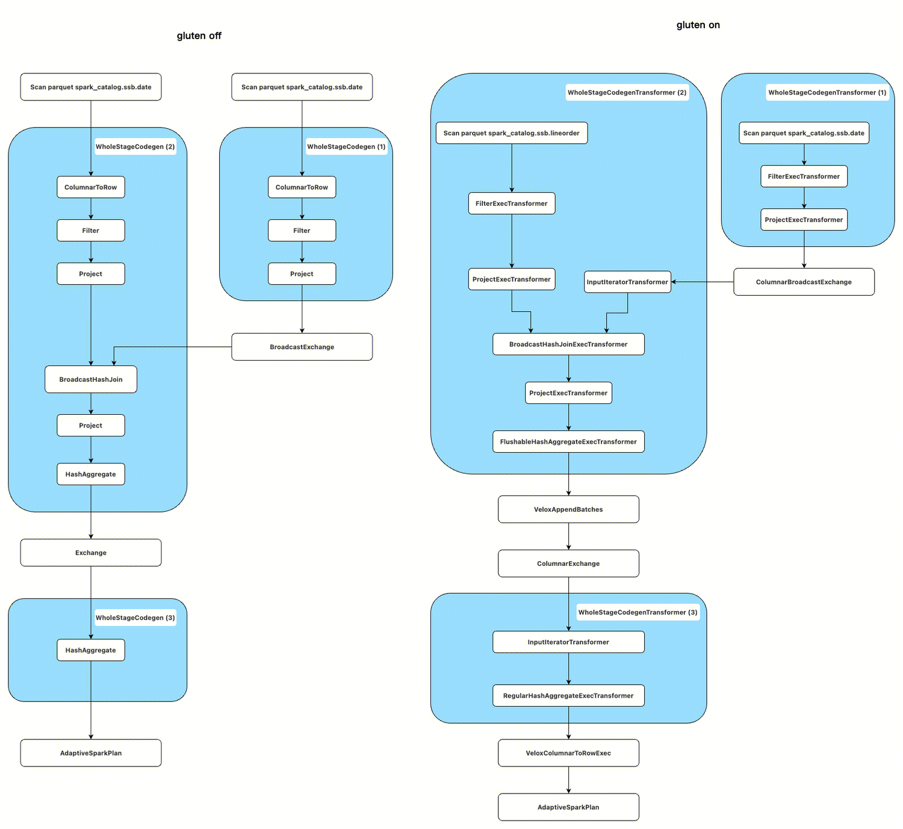

上一节介绍过“全阶段代码生成”，这是一项用于优化 Spark 执行效率的技术。当算子执行时，会调用 RDD 中的 compute 函数，Stage 中所有支持 codegen 的算子（实现了 CodegenSupport 接口） 会生成一个 Java 函数，利用 JIT 在运行时编译生成的代码并执行。**在物理计划被执行的准备阶段，Spark 中的 CollapseCodegenStages 规则将多个支持 CodeGen 的算子折叠为 WholeStageCodegen。而 WholeStageCodegenTransformer 的作用是将整个 Stage 的计划转化为 substrait，交给 native 执行**。

WholeStageCodegenTransformer 对比 WholeStageCodegen，原理和实现上有相似的地方，但区别在于：

- 数据基于列式存储而不是行式存储。
- 没有真正的代码生成，而是将支持 WholeStageTransformer 的整个 Spark Plan 子树生成一个 Substrait Plan，生成一个 GlutenWholeStageColumnar RDD，最终这个 RDD 会被 Spark 调用并执行计算。
- RDD 的计算调用了 Gluten 后端的 Velox API，API 又将 Substrait 通过 JNI 传递到本地的 Velox 库进行计算并返回结果。在上述的例子中，将生成 3 个 Substrait Plan 通过 JNI 交给后端执行，后端接收到 Substrait Plan 后的运算过程会在后面介绍。

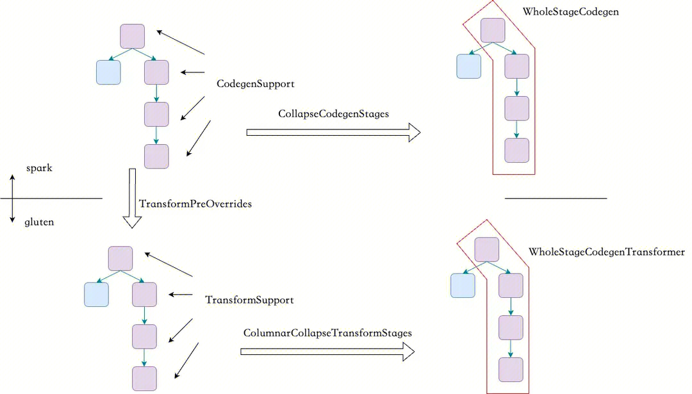

在开启 Gluten 后，主要有两个重要的规则将 WholeStageCodegen 转化为 WholeStageCodegenTransformer，分别是：

- TransformPreOverrides：Spak Plan 算子转化为 Transformer 算子。
- ColumnarCollapseTransformStages：它先插入一个 WholeStageTransformer ，并折叠子节点中支持转化的算子。算子的 execute 方法被调用时，返回GlutenWholeStageColumnarRDD，RDD 的 compute 包含 partition 的信息和 Spark 物理计划。调用 JNI 卸载到 native 的过程发生在此处。

 

### 3.2.3 列式 Shuffle

1、Spark 提供了可插拔的洗牌接口 ShuffleManager，在 Driver 和每个 Executor 上，根据参数 `spark.shuffle.manager` 配置，在 SparkEnv 中创建一个 ShuffleManager。Driver 向其注册洗牌操作，Executors 可以请求读取和写入数据。因此自定义的 ShuffleManager 需要实现 ShuffleManager 特质中的所有方法。

```scala
// 以Driver为例，Executor类似
SparkContext
  // 创建spark执行环境
  _env = createSparkEnv(_conf, isLocal, listenerBus)
    SparkEnv.createDriverEnv()
      // 为driver或executor创建SparkEnv，后续调用流程与Executor类似
      create()
        // 参数spark.shuffle.manager，这里为org.apache.spark.shuffle.RssShuffleManager
        val shuffleMgrName = conf.get(config.SHUFFLE_MANAGER)
        // 通过反射创建Serializer或ShuffleManager实例，构造参数为：SparkConf、isDriver（boolean类型）
        val shuffleManager = Utils.instantiateSerializerOrShuffleManager[ShuffleManager](shuffleMgrClass, conf, isDriver)
          val cls = Utils.classForName(className)
 private[spark] trait ShuffleManager {
   // 向ShuffleManager注册一个洗牌操作，并获取一个handler，以便将其传递给tasks
   def registerShuffle[K, V, C](...): ShuffleHandle
   
   // 获取给定分区的writer，此方法由map任务在executor上调用
   def getWriter[K, V](...): ShuffleWriter[K, V]
   
   // 获取一个reader，用于读取指定范围的reduce分区（从startPartition到endPartition-1，包含），以读取指定范围的map输出（从startMapIndex到endMapIndex-1，包含)
   // 如果endMapIndex等于Int.MaxValue，则实际的endMapIndex将在`getMapSizesByExecutorId`方法中被更改为该shuffle操作中所有map输出的总长度
   // 此方法由reduce任务在executor上调用
   final def getReader[K, C](...) ShuffleReader[K, C]
   
   // 从ShuffleManager中移除某个shuffle的元数据
   def unregisterShuffle(shuffleId: Int): Boolean
   
   // 返回一个能够根据block坐标检索洗牌block数据的resolver
   def shuffleBlockResolver: ShuffleBlockResolver
   
   // 关闭ShuffleManager
   def stop(): Unit
 }
```

 

2、Spark 原生的 Shuffle 是基于行的，所以当使用列式计算时，Gluten 定义了 ColumnarShuffle 算子，通过参数 `--conf spark.shuffle.manager=org.apache.spark.shuffle.sort.ColumnarShuffleManager` 实现自定义的 ColumnarShuffleManager。ColumnarShuffleManager 会分割列式数据并写入到磁盘中，Shuffle 数据的读取也是由对应的 native 后端完成。

```scala
// 列式Shuffle入口，继承关系：ColumnarShuffleManager -> ShuffleManager
ColumnarShuffleManager
  // 重写父类方法，获取给定分区的Writer，由Executor Map Task调用
  getWriter[K, V](...)
    GlutenShuffleWriterWrapper.genColumnarShuffleWriter(...)
      // 继承关系：VeloxSparkPlanExecApi、CHSparkPlanExecApi -> SparkPlanExecApi
      BackendsApiManager.getSparkPlanExecApiInstance.genColumnarShuffleWriter(...)
        ShuffleUtil.genColumnarShuffleWriter(parameters)
          // 继承关系：ColumnarShuffleWriter -> ShuffleWriter
          new ColumnarShuffleWriter[K, V](...)
            // 重写父类write方法，写入records
            write(...)
              internalWrite(records)
                // native方法，从内存溢写磁盘分区数据
                jniWrapper.nativeEvict(nativeShuffleWriter, size, false)
                // native方法，将bufAddrs和bufSizes表示的一个记录批次拆分为多个批次，该批次根据第一列作为分区id进行拆分
                jniWrapper.write(nativeShuffleWriter, rows, handle, availableOffHeapPerTask())
                // native方法，将Native Shuffle Writer保留的缓冲区中剩余的数据写入每个分区的临时文件，返回结果包含各类指标
                splitResult = jniWrapper.stop(nativeShuffleWriter)

  // 重写父类方法，获取一系列Reduce分区的Reader，由Executor Reduce Task调用
  getReader[K, C](...)
    // bypassDecompressionSerializerManger绕过Shuffle Read解压，不支持解密
    new BlockStoreShuffleReader(..., serializerManager = bypassDecompressionSerializerManger, ...)
```

 

在上述例子中，使用两阶段完成聚合，在执行算子 ColumnarExchange 时，局部聚合的结果数据写入磁盘，使用 Gluten 中定义的列式数据写入磁盘的方式完成。 对于回退，由于原生 Spark 和向量化的存储方式不同，必然要进行行列的互转。例如，若读取的数据源不是 parquet，而是当前 native 不支持的某种列式存储的数据源，执行计划则先使用原生的 scan，数据读完后再执行一次列转行和一次行转 Velox 列，并使用向量化执行。这会带来较多的转化代价，因此对各种数据源的的 native 读取支持能带来性能提升，这也是未来的工作之一。

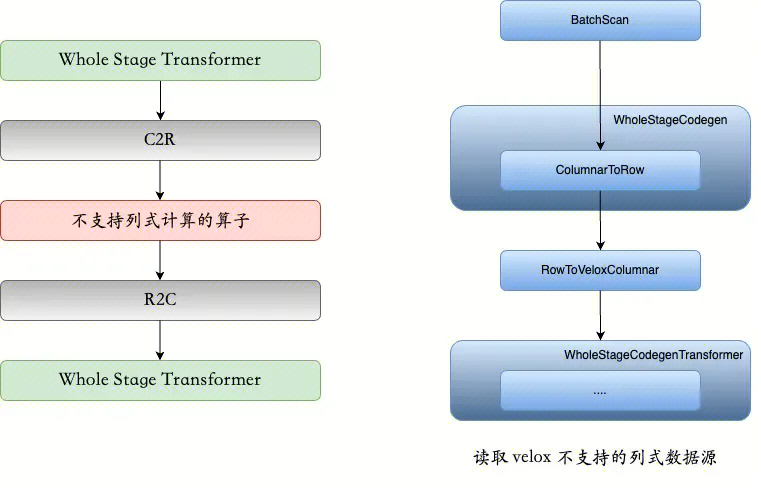


### 3.2.4 Velox 后端

Velox 是一个 C++ 数据库加速库，提供可重用、可扩展和高性能的数据处理组件。这些组件可重复使用，以构建专注于不同分析工作负载的计算引擎，包括批处理、交互式处理、流处理和 AI/ML。Velox 由 Facebook 创建，目前正与 Intel、ByteDance 和 Ahana 合作开发。**在常见的使用场景中，Velox 将完全优化的查询计划作为输入，并执行所述计算。考虑到 Velox 不提供 SQL 解析器、dataframe 层或查询优化器，通常不直接面向最终用户使用；相反，它主要供集成和优化计算引擎的开发人员使用**。

 

 

 

 

# 参考

1. 《Spark SQL 内核剖析》
2. [视频 - 国内外大厂对 Spark 向量化改造的探索](https://www.bilibili.com/video/BV1Rq4y1g7dg)
3. [深度解读 Spark 中 CodeGen 与向量化技术的研究](https://cn.kyligence.io/blog/spark-codegen-vectorization-technology/)
4. [wiki - Instruction pipelining](https://en.wikipedia.org/wiki/Instruction_pipelining)
5. [JDK 新特性体验：向量化计算](https://zhuanlan.zhihu.com/p/676227467)
6. [Gemini-2.0：Spark 向量化引擎简介](https://km.woa.com/articles/show/590839?from=iSearch)
7. [GiiHub - Gluten](https://github.com/apache/incubator-gluten)
8. [Substrait 官网](https://substrait.io/tutorial/sql_to_substrait/)
9. [Velox 官网](https://facebookincubator.github.io/velox/index.html)
10. [向量化执行引擎框架 Gluten](https://cn.kyligence.io/blog/gluten-spark/)