# 1. Spark Core

## 1.1 利用缓存复用RDD

RDD 中的数据只会在计算中产生，在计算完成后就会消失，这意味着对同一个 RDD 执行算子操作时，都需要从头开始计算。可以使用 persist() 或 cache() 函数将 RDD 缓存在内存或磁盘中，以便在后续的计算中复用，这使得后面的操作速度大大加快（通常快 10 倍以上）。

Spark 缓存级别如下表所示。注意：在 Python 中，存储对象总是被 Pickle 库序列化，所以是否选择序列化级别并不重要。

| **缓存级别**                           | **含义**                                                     |
| :------------------------------------- | :----------------------------------------------------------- |
| MEMORY_ONLY                            | 在JVM中将RDD存储为反序列化的Java对象。如果内存中没有足够的RDD，某些分区将不会被缓存，而是在每次需要时重新计算。这是默认级别，cache() 函数使用的就是这种缓存策略。 |
| MEMORY_AND_DISK                        | 在JVM中将RDD存储为反序列化的Java对象。如果内存中容纳不下RDD，则将容纳不下的部分存储在磁盘上，需要时从磁盘上读取。 |
| MEMORY_ONLY_SER(Java and Scala)        | 将RDD存储为序列化的Java对象（每个分区一个字节数组）。这通常比反序列化对象更节省空间，特别是在使用快速序列化器时，但读取时更耗费CPU。 |
| MEMORY_AND_DISK_SER(Java and Scala)    | 类似于MEMORY_ONLY_SER，但是将内存中无法容纳的分区溢出到磁盘，而不是在每次需要时重新计算。 |
| DISK_ONLY                              | 仅在磁盘上存储 RDD 分区。                                    |
| MEMORY_ONLY_2, MEMORY_AND_DISK_2, etc. | 与上述级别相同，但在两个群集节点上复制每个分区。             |
| OFF_HEAP (experimental)                | 与MEMORY_ONLY_SER类似，但将数据存储在堆外内存中。这要求启用堆外内存。 |

Spark 的存储级别是为了在内存使用和 CPU 效率之间提供不同的权衡。建议通过以下过程来选择一个：

1. 如果 RDD 适合默认存储级别 MEMORY_ONLY，保持该级别。这是最节省 CPU 的选项，可使 RDD 上的操作尽可能快地运行。
2. 如果不行，尝试使用 MEMORY_ONLY_SER，并选择一个快速序列化库，使对象更节省空间，但访问速度仍相当快。
3. 不要溢出到磁盘，除非计算数据集的函数非常昂贵，或者过滤了大量数据。否则，重新计算一个分区可能和从磁盘读取数据一样快。
4. 如果希望快速故障恢复，使用复制存储级别（例如，如果使用 Spark 来服务来自 Web 应用程序的请求）。所有存储级别都通过重新计算丢失的数据提供完全容错，但复制存储级别可让你继续在 RDD 上运行任务，而无需等待重新计算丢失的分区。

 

## 1.2 合理选择RDD算子

**1、mapPartitions 替换 map**

map 算子是分区内一个个数据的执行，类似于串行操作，所以性能较低；而 mapPartitions 算子是以分区为单位进行批处理操作，所以性能较高。但是 mapPartitions 算子会长时间占用内存，导致内存可能不够用，出现 OOM，所以在内存有限的情况下，不推荐使用，而应使用 map 操作。

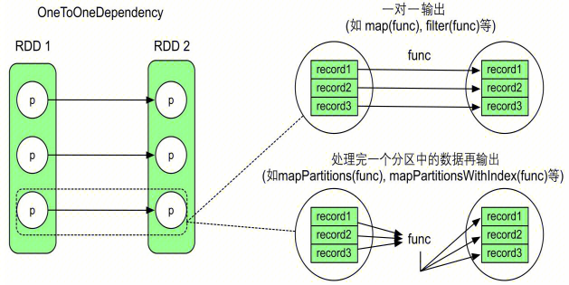

**2、foreachPartition 替换 foreach**

foreachPartition 和 foreach 的关系类似于 mapPartitions 和 map 的关系。

**3、reduceByKey、aggregateByKey 替换 groupByKey**

与 groupByKey 不同，reduceByKey(func, numPartitions) 实际包含两步聚合。第一步，在 Shuffle 之前对每个分区的数据进行一个本地化的 combine() 聚合操作，也称为mini-reduce 或 map 端 combine，这一步由 Spark 自动完成，并不形成新的 RDD，减少了数据传输量和内存用量，效率比 groupByKey 高。第二步，reduceByKey 生成新的 ShuffledRDD，将来自不同分区且具有相同 key 的数据聚合在一起，利用 func 进行 reduce() 聚合操作。整个过程中，combine() 和reduce() 的计算逻辑一样，采用同一个 func。

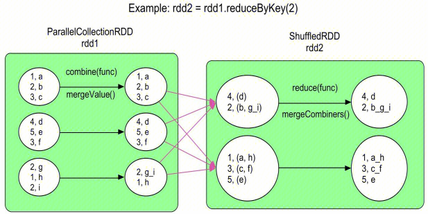

**4、coalesce 与 repartition 重分区**

两者均是将 RDD 中的数据进行重新分区，repartition(numPartitions) 语义与 coalesce(numPartitions, true) 一致（第二个参数表示是否 shuffle），即 repartition 一定会进行 shuffle。而 coalesce 将相邻的分区直接合并在一起，形成的数据依赖关系是多对一的窄依赖，不会触发数据的 shuffle。因此在不进行 shuffle 的情况下，coalesce 不能将一个分区拆分为多份，且当 RDD 中不同分区中的数据量差别较大时，直接合并容易造成数据倾斜。为了增加分区或解决数据倾斜问题，可以指定 shuffle=true 将数据打乱。

当数据集较小，而分区数量较多时，可以使用 coalesce 来减少分区数量，从而减少资源消耗和网络传输开销。例如，使用 filter 算子过滤掉 RDD 较多数据后，可以使用 coalesce 减少分区数，根据经验值，分区数一般是核心数的 2-3 倍。

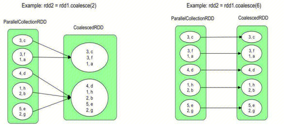

**5、repartitionAndSortWithinPartitions 替换 repartition 与 sortByKey**

repartitionAndSortWithinPartitions 可以灵活使用各种分区器，且对于结果 RDD 中的每个分区，对其中的数据按照 key 进行排序**，**该操作比 repartition + sortByKey 效率高，因为它可以将排序下放到 shuffle 机制中。不过由于 repartitionAndSortWithinPartitions 可定义分区器，不一定是 sortByKey 默认的 RangePartitioner，因此它得到的结果不能保证 key 全局有序。

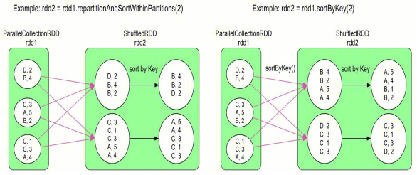


 

## 1.3 减少不必要的action算子

Spark 将数据操作分为两种，transformation 操作（转换算子）和 action 操作（行动算子），两者的区别是行动算子一般是对结果数据进行后处理，产生输出结果，且会触发 Spark 提交 job 真正执行数据处理任务。

当应用程序出现 action 操作时，表示应用会生成一个 job。如果应用程序中有很多 action 操作，那么 Spark 会按照顺序为每个 action 操作生成一个 job，每个 job 的逻辑处理流程都是从输入数据到最后 action 操作。 因此，减少不必要的 action 算子可以提高 Spark 的性能和效率。

 

## 1.4 尽量避免使用shuffle算子

Spark 作业运行过程中，最消耗性能的地方就是 shuffle。shuffle 分为 shuffle write 和 shuffle read 两个阶段，前者将 map 端的输出数据按照 key 进行分区，并将输出数据写入到本地磁盘或者网络中，后者读取 shuffle write 阶段输出的数据，并进行合并和计算，最终生成结果。由此可见，磁盘 IO 和网络数据传输是 shuffle 性能较差的主要原因。

因此，应该尽量避免使用 shuffle 算子，如 repartition、reduceByKey、join 等，尽量使用非 shuffle 类算子。

 

## 1.5 广播大变量

广播变量是一个只读变量，通过它可以将一些共享数据集或者大变量缓存在 Spark 集群中的各个机器上，而不用每个 Task 都需要复制一个副本，后续计算可以重复使用，减少了数据传输时网络带宽的使用，提高效率。相比于 Hadoop 的分布式缓存，广播的内容可以跨作业共享。广播变量要求广播的数据不可变、不能太大但也不能太小（一般几十M以上）、可被序列化和反序列化、并且必须在 Driver 端声明广播变量，适用于广播多个 Stage 公用的数据，存储级别目前是 MEMORY_AND_DISK。

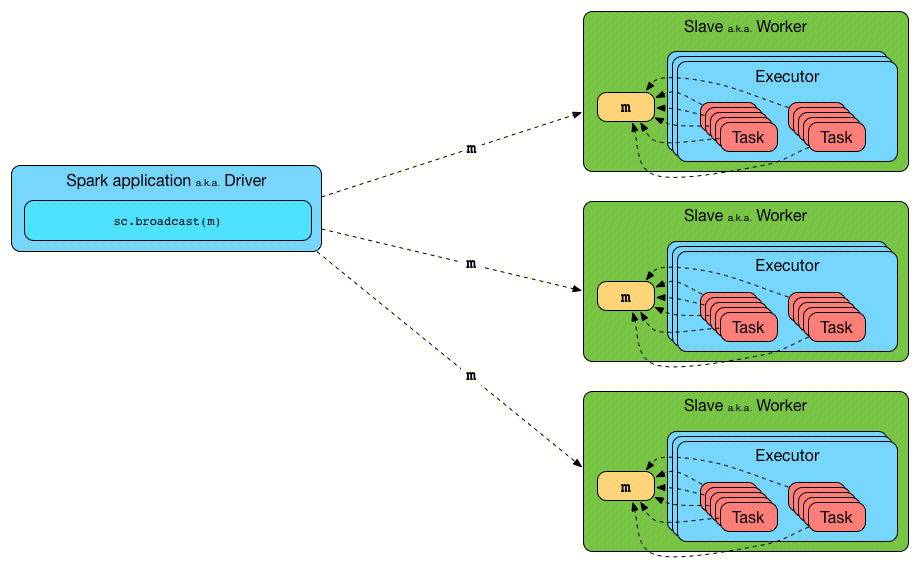

```scala
val rdd = sc.makeRDD(List(("a", 1), ("b", 2), ("c", 3)))
val map = mutable.Map(("a", 4), ("b", 5), ("c", 6))
// 封装广播变量，如果直接使用map，则每个Task都各自持有该变量，数据重复且占用大量内存
val bc: Broadcast[mutable.Map[String, Int]] = sc.broadcast(map)
rdd.map {
    case (w, c) => {
        val l: Int = bc.value.getOrElse(w, 0)
        (w, (c, l))
    }
}.collect().foreach(println)
```

 

## 1.6 使用Kryo序列化

序列化在任何分布式应用程序的性能中都起着重要作用，序列化对象速度慢或消耗大量字节的格式将大大降低计算速度。Spark 的目标是在便利性（允许在操作中使用任何 Java 类型）和性能之间取得平衡，它提供了两个序列化库：

1. Java序列化：默认情况下，Spark 使用 Java 的 ObjectOutputStream 框架对对象进行序列化，并可与创建的任何实现 java.io.Serializable 的类协同工作。还可以通过扩展 java.io.Externalizable 更紧密地控制序列化的性能。Java 序列化非常灵活，但通常相当缓慢，而且会导致许多类的序列化格式过大。
2. Kryo序列化：Spark 还可以使用 Kryo 库更快地序列化对象。Kryo 比 Java 序列化要快得多，也更紧凑（通常是 Java 序列化的 10 倍），但不支持所有可序列化类型，而且需要提前注册程序中使用的类，以获得最佳性能。

通过使用 SparkConf 初始化作业，并调用 conf.set("spark.serializer", "org.apache.spark.serializer.KryoSerializer") 可以切换到使用 Kryo。该设置不仅可以配置在worker 节点间 shuffle 数据时使用的序列化器，还可以配置将 RDD 序列化到磁盘时使用的序列化器。Kryo 不是默认设置的唯一原因是需要自定义注册，但建议在任何网络密集型应用中尝试使用。自 Spark 2.0.0 以来，在内部使用 Kryo 序列化器来处理简单类型、简单类型数组或字符串类型的 RDD。

如果对象较大，可能还需要增加 spark.kryoserializer.buffer 配置。这个值必须足够大，以容纳你要序列化的最大对象。最后，如果你不注册自定义类，Kryo 仍然可以工作，但它必须在每个对象中存储完整的类名，这就造成了浪费。

```scala
val conf = new SparkConf().setMaster(...).setAppName(...)
// 设置序列化器为KryoSerializer
conf.set("spark.serializer", "org.apache.spark.serializer.KryoSerializer")
// 向Kryo注册自己的自定义类
conf.registerKryoClasses(Array(classOf[MyClass1], classOf[MyClass2]))
val sc = new SparkContext(conf)
```

 

## 1.7 优化数据结构

默认情况下，Java 对象的访问速度很快，但占用的空间却比其字段中的“原始”数据多出 2-5 倍。原因如下：

1. 每个不同的 Java 对象都有一个约 16 字节的“对象头”，其中包含指向其类的指针等信息。对于数据量极少的对象（例如一个 Int 字段）来说，这个头可能比数据量还大。
2. Java 字符串与原始字符串数据相比有大约 40 个字节的开销（因为它们将数据存储在一个 Chars 数组中，并保留了额外的数据，如长度），并且由于字符串内部使用 UTF-16 编码，每个字符存储为两个字节。因此，一个 10 个字符的字符串可以轻松占用 60 个字节。
3. 常见的集合类，如 HashMap 和 LinkedList，使用链接数据结构，其中每个条目都有一个”封装“对象（如 Map.Entry）。这个对象不仅有一个标头，还有指向列表中下一个对象的指针（通常每个指针 8 字节）。
4. 原始类型的集合通常将它们存储为“包装”对象，如 java.lang.Integer。

减少内存消耗的第一种方法是避免使用会增加开销的 Java 特性，Spark 官方建议：

1. 设计数据结构时，优先选择对象数组和原始类型，而不是标准的 Java 或 Scala 集合类（如 HashMap）。
2. 尽可能避免使用包含大量小对象和指针的嵌套结构。
3. 考虑使用数字 ID 或枚举对象代替字符串作为键。

 

 

# 2. Spark SQL

## 2.1 注意null的特殊性

SQL 对 null 的处理比较特殊，一些计算逻辑中经常会直接跳过 null。但用户经常将 null 当作一个具体的值，因此会出现一些困惑的情况。例如，null 既不参与 in 表达式计算，也不参与 not in 表达式计算，若数据中存在 null，则两个表达式得到的结果之和并不等于总的数据结果。

另外，需要注意过滤 key 为空字符串和 null 的情形，因为如果空字符串或 null 的记录数较多，就可能导致大量数据分配到同一个 task 执行，引起数据倾斜，进而导致任务执行时间变长。

 

## 2.2 多表join顺序调整

多表 join 场景中，数据表的顺序对性能影响比较大，例如，A join B join C 与 A join C join B，两者中间产生的数据量可能差别很大。实际上，多表 join 一直都是数据库中基于代价优化机制（Cost-Based Optimization，简称 CBO）的重要针对对象，如果是针对数据相对固定的表进行 SQL 查询，建议打开该配置，相关参数说明如下表所示。不过要使用该功能，需确保相关表和列的统计信息已经生成，并定期更新和维护。

| 参数                              | 默认值 | 参数说明                |
| :-------------------------------- | :----- | :---------------------- |
| spark.sql.cbo.enabled             | false  | 是否启用 CBO            |
| spark.sql.cbo.joinReorder.enabled | false  | 在 CBO 中启用 join 重排 |

```sql
-- 生成表级别统计信息
ANALYZE TABLE 表名 COMPUTE STATISTICS
-- 生成列级别统计信息
ANALYZE TABLE 表名 COMPUTE STATISTICS FOR COLUMNS 列 1, 列 2, 列 3
 
-- 显示表统计信息
DESC FORMATTED 表名
-- 显示列统计信息
DESC FORMATTED 表名 列名
```

 

## 2.3 复用数据

数据复用的场景较多，绝大部分以 union 操作为主。如果读取同一份数据的两个任务之间没有依赖关系，可以想办法合并任务逻辑，使得只需要读取一次数据，减少 IO 代价。

```sql
-- 数据表t被读取两次，当表数据量非常大时，对性能影响大
select * 
from (
    select value form t where key = k1
    union all
    select value form t where key = k2
)
-- 优化后，只需要读取一次数据表，减少IO代价
select * 
from (
    select value form t where key = k1 or key = k2
)
```

 

## 2.4 处理数据倾斜

数据倾斜是经常碰到的一类问题，可通过以下方法来优化或规避：

1、过滤无关数据：大量的 null 数据没有过滤，参与了 join 的执行；存在“脏数据”，不满足原有的数据类型。

2、广播小表：若参与 join 操作的两个表是大小表，可以采用 BroadcastJoin 方式，即将小表广播到大表所在的 Executor 上，避免数据倾斜。Spark 支持在 SQL 中通过添加 Hint 的方式强制采用 BroadcastJoin，不过需要注意，对于外连接，基表不能被广播，因此左外连接中左表不可以是小表，右外连接中右表不可以是小表。

```sql
-- 将小表t1广播到大表t2所在的Executor上
select /*+ BROADCAST(t1) */ * from t1, t2 where t1.key = t2.key
```

3、分离倾斜数据：假设参加 join 操作的两个表分别为 t1、t2，其中表 t1 有数据倾斜。可以将 t1 的数据分为两部分：不含倾斜数据的 t11、只包含倾斜数据的 t12。数据表 t11 和 t12 分别与 t2 进行 join 操作，然后将结果合并。首先，t11 与 t2 的 join 操作不存在数据倾斜；其次，由于 t12 通常不会很大，所以 t12 与 t2 的 join 操作可以采用第二种方法执行 BroadcastJoin。

```sql
select * from (
    select * from t11, t2 where t11.key = t2.key
    union all
    select /*+ BROADCAST(t12) */ * from t12, t2 where t12.key = t2.key
)
```

4、打散数据：假设表 A 和表 B 都有 id、value 字段，现在对这两个表按照 id 进行 join 操作，即 A.id = B.id。此时，因为 id 都为 a，所有数据会在一个 task 上进行关联操作，这样就出现了数据倾斜。处理方法就是将大表 A 中的 id 加上后缀 0 - n，起到打散的作用，为了结果正确，小表 B 中的 id 需要将每条数据都复制 n 份。如下图所示，正是由于小表 B 复制了多份，所以无论大表 A 打上哪个随机后缀，都可以保证能跟小表 B 中的某一条数据 join 上。此时再进行 join 操作，将会产生 3 个 task，每个 task 只需要关联一条数据，起到分散的作用。 

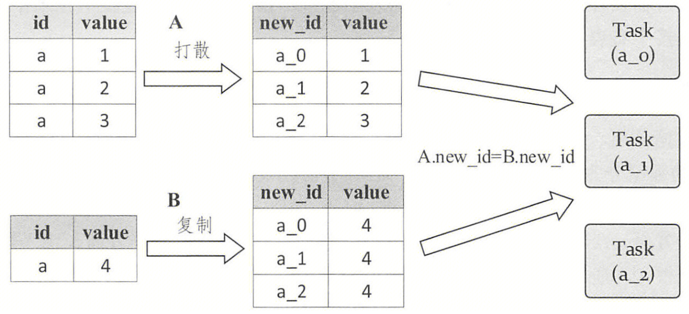

```sql
-- 表A
select id, value, concat(id, (rand() * 10000) % 3) as new_id
from A
-- 表B
select id, value, concat(id, suffix) as new_id
form (
    select id, value, suffix
    from B Lateral View explode(array(0, 1, 2)) tmp  as suffix
)
```

 

## 2.5 自适应查询执行AQE

Spark 3.0 优化查询性能的另一利器是自适应查询执行（Adaptive Query Execution，简称 AQE），它可以在查询执行过程中动态地调整查询计划，以提高查询性能。一旦启用 AQE（spark.sql.adaptive.enabled=true），Spark SQL 会采用以下策略来优化查询：

1. 动态调整 shuffle 分区数：在执行 shuffle 操作时，Spark SQL 会根据数据量和集群资源动态调整 shuffle 分区数，以避免资源浪费和数据倾斜。
2. 动态调整 join 策略：Spark SQL 会根据数据大小和 join 条件的复杂度动态选择 join 策略，以提高查询性能。
3. 动态调整 Broadcast Join 阈值：Spark SQL 会根据数据大小和集群资源动态调整 Broadcast Join 的阈值，以避免数据倾斜和 OOM。
4. 动态调整数据倾斜处理策略：当查询出现数据倾斜时，Spark SQL 会自动调整数据倾斜处理策略，以避免查询失败。

总之，启用 AQE 可以大大提高 Spark SQL 查询的性能和稳定性。但需要注意的是，自适应查询优化器可能会造成一些额外的开销，因此在使用时需要根据实际情况进行权衡。

 

# 3. 参数调优

参数优先级说明：直接在 SparkConf 中设置的属性优先，然后是传递给 spark-submit 或 spark-shell 的参数，最后是 spark-defaults.conf 文件中的选项参数。

## 3.1 基本参数

1. **num-executors**
   - **参数说明：**指定在 yarn 集群上启动的 Executor 数量，默认值为 2。
   - **调优建议：**见第 2、3点。
2. **executor-cores**
   - **参数说明：**指定每个 Executor 可使用的 CPU 核心数量，在 yarn 模式下，参数默认值为 1。
   - **调优建议：**num-executors * executor-cores < yarn 资源队列最大 vCores，若与其他用户共享 yarn 队列，则最好不要超过 yarn 资源队列的 1/3 - 1/2。通常设置 2 - 4 个较为合适。
3. **executor-memory**
   - **参数说明：**指定每个 Executor 可使用的内存大小，默认值为 1G。
   - **调优建议：**num-executors * executor-memory < yarn 资源队列最大内存，若与其他用户共享 yarn 队列，则最好不要超过 yarn 资源队列的 1/3 - 1/2。通常设置 4G - 8G 较为合适。
4. **driver-memory**
   - **参数说明：**指定 Driver 可使用的内存大小，默认值为 1G。
   - **调优建议：**一般保持默认值即可，但当使用 collect 等算子将数据收集到 Driver 端，需要加大内存，否则容易造成 OOM。
5. **spark.default.parallelism**
   - **参数说明：**当用户未设置时，由 join、reduceByKey 和 parallelize 等算子转换返回的 RDD 默认分区数。对于 reduceByKey 和 join 等分布式 shuffle 操作，参数默认值为父 RDD 中分区的最大数量；对于 parallelize 等无父 RDD 的操作，参数取决于集群管理器，在 yarn 模式下，参数为所有 executor 节点的内核数与 2 的最大值。
   - **调优建议：**参数值为 num-executors * executor-cores 的 2-3 倍较为合适。

 

## 3.2 动态分配相关参数

1. **spark.dynamicAllocation.enabled**
   - **参数说明：**是否使用动态资源分配，这会根据工作负载上下调整此应用程序注册的 Executor 数量，默认值为 false。
   - **调优建议：**该参数可以让用户免于烦琐的 Executor 数目的预估和设置，增加业务运行的稳定性，建议设置为 true。注意，在设置了 Executor 动态调整后，还需要在同一集群的每个 worker 节点上设置外部洗牌服务（不同集群管理器设置该项服务的方法各不相同，更多详细的说明参见[官网](https://spark.apache.org/docs/2.3.2/job-scheduling.html#configuration-and-setup)），并在应用程序中将 spark.shuffle.service.enabled 设置为 true，用来保留被移除的 Executor 产生的 Shuffle 文件，而保留的 Shuffle 文件可用于 Stage 失败的恢复。
2. **spark.dynamicAllocation.executorIdleTimeout**
   - **参数说明：**如果启用了动态分配，且某个 Executor 的空闲时间超过了这一期限，则该 Executor 将被移除，默认值为 60s。
   - **调优建议：**该参数值较小时，利于集群资源共享，但会影响业务的执行时间（在 Executor 被删除后，可能需要重新申请新的 Executor 来执行 Task）；该参数值较大时，不利于资源共享，若一些较大的任务占用资源，迟迟不释放，就会造成其他任务得不到资源。该参数值的选取需要权衡用户业务的执行时间和等待时间，建议保持默认值。
3. **spark.dynamicAllocation.minExecutors**
   - **参数说明：**如果启用动态分配，Executor 数量的下限，默认值为 0。
   - **调优建议：**建议与 spark.dynamicAllocation.initialExecutors 保持一致，见第 5 点。
4. **spark.dynamicAllocation.maxExecutors**
   - **参数说明：**如果启用动态分配，Executor 数量的上限，默认值为 infinity（无穷大）。
   - **调优建议：**为了防止大业务独占大部分资源，造成小任务没有资源的情况，需要将该参数值设置为一个合理值（如 200）。
5. **spark.dynamicAllocation.initialExecutors**
   - **参数说明：**如果启用了动态分配，要运行的 Executor 的初始数量，默认值为 spark.dynamicAllocation.minExecutors。
   - **调优建议：**该参数值较小时，任务需要等待向 yarn 申请资源，造成任务运行有比较长的爬坡阶段；该参数值较大时，对于不需要那么多 Executor 的任务来说，会造成资源浪费。该参数值的选取可以根据历史任务的 Executor 数目的统计，按照二八原则来设置，例如 80% 的历史业务的 Executor 数目都不大于参数值。若无法确认历史任务的 Executor ，建议先设置为 1。

 

## 3.3 Shuffle相关参数

1. **spark.shuffle.file.buffer**

   - **参数说明：**每个 shuffle 文件输出流的内存缓冲区大小，这些缓冲区可减少创建中间 shuffle 文件时的磁盘寻道和系统调用次数，默认值为 32k。
   - **调优建议：**若内存资源充足，可适当调大该参数（如 64k、128k），从而减少 shuffle write 溢写磁盘的次数，进而提升性能。

2. **spark.reducer.maxSizeInFlight**

   - **参数说明：**从每个 reduce 任务同时获取的 map 输出的最大大小，默认值为 48m。
   - **调优建议：**若内存资源充足，可适当调大该参数（如 96m），从而减少 shuffle read 拉取数据的次数，进而提升性能。

3. **spark.shuffle.io.maxRetries**

   - **参数说明：**(仅限 Netty）自动重试因 IO 相关异常而失败的最大拉取次数，默认值为 3。
   - **调优建议：**对于特别耗时的大型 shuffle 操作，可适当调大该参数（如 60），有助于在出现长时间 GC 停顿或瞬时网络连接问题时增加 shuffle 稳定性。

4. **spark.shuffle.io.retryWait**

   - **参数说明：**(仅限 Netty）重试拉取之间的等待时间，默认值为 5s。因此，重试造成的最大延迟默认为 15s，计算公式为 maxRetries * retryWait。
   - **调优建议：**对于特别耗时的大型 shuffle 操作，可适当调大该参数（如 60s），有助于在出现长时间 GC 停顿或瞬时网络连接问题时增加 shuffle 稳定性。

5. **spark.memory.storageFraction**

   - **参数说明：**Spark 统一内存管理模型将 Executor JVM 内存空间划分以下 3 个部分。

     - 系统保留内存（Reserved Memory）：用于存储 Spark 产生的内部对象，大小默认 300 M。
     - 用户代码空间（User Memory）：用于存储用户代码生成的对象，大小约为 40% 内存空间。
     - 框架内存空间（Framework Memory）：包括数据缓存空间和框架执行空间，总大小为 spark.memory.fraction（default 0.6）x （heap - Reserved Memory），约为 60% 内存空间。两者共享这个空间，其中一方空间不足可以动态向另一方借用。当数据缓存空间不足时，可以向框架执行空间借用其空闲空间，后续当框架执行空间需要更多空间时，数据缓存空间需要“归还”借用的空间。同样，当框架执行空间不足时，可以向数据缓存空间借用，但至少要保证数据缓存空间具有约 spark.memory.storageFraction（default 0.5）x Framework Memory 空间，且框架执行空间借走的空间不会“归还”，因为需要考虑 shuffle 过程中的很多因素，难以代码实现。

     Framework Memory 堆外空间：为了减少 GC 开销，Spark 也允许使用堆外内存，该空间不受 JVM 垃圾回收机制管理，在结束使用时需要手动释放空间。堆外空间大小通过 spark.memory.offHeap.size 设置，只用于数据缓存空间和框架执行空间，比例仍通过 spark.memory.storageFraction 设置。

     

   - **调优建议：**一般保持默认值即可，对于特别耗时的大型 shuffle 操作，可适当调小该参数（如 0.35）。

 

 

# 4. Spark Streaming

## 4.1 Spark Streaming vs. Structured Streaming

**Spark Streaming 是 Spark 的上一代流引擎，目前已不再更新，是一个遗留项目。Spark 中有一个更新且更易于使用的流引擎，名为 Structured Streaming，建议使用 Structured Streaming 处理流式应用**。

|              | **Spark Streaming**                                          | **Structured Streaming**                                     |
| :----------- | :----------------------------------------------------------- | :----------------------------------------------------------- |
| 架构         | 微批处理，每个批次都作为 RDD 进行处理                        | 支持微批处理和连续处理                                       |
| 编程模型     | DStream，在 Spark 3.4.0 中 API 被标记为过时                  | Dataset/DataFrame，批流代码统一，API 更简单易用              |
| 端到端语义   | 只能保证自己的一致性语义是 exactly-once 的，而 input 接入 Spark Streaming 和 Spark Straming 输出到外部存储的语义往往需要用户自己来保证 | 微批处理端到端延迟低至 100 毫秒，并提供 exactly-once 语义；连续处理端到端延迟低至 1 毫秒，并提供 at-least-once 语义 |
| 容错和检查点 | 容错基于 RDD lineage；使用 checkpoint 恢复有状态的转换，用户需要启用和配置 checkpoint 功能；使用 processing time，即数据到达 Spark 被处理的时间 | 内置容错；在大多数情况下，不需要显式 checkpoint；支持带水印的 event-time 处理，即数据产生于数据源的时间 |
| 性能         | 性能取决于批处理间隔，延迟相对较高                           | 性能更优，延迟更低                                           |

注 1：端到端（end-to-end）指的是直接 input 到 out，比如 Kafka 接入 Spark Streaming，然后再导出到 HDFS 中。

注 2：Processing Time 是数据到达 Spark 被处理的时间，而 Event Time 是数据自带的属性，一般表示数据产生于数据源的时间。比如 IoT 中，传感器在 12:00:00 产生一条数据，然后在 12:00:05 数据传送到 Spark，那么 Event Time 就是 12:00:00，而 Processing Time 就是 12:00:05。

注 3：消息传递容错层次，如下表所示。

| **容错层次**  | **定义**                                       | **优点**     | **缺点**     | **适用场景**                                     |
| :------------ | :--------------------------------------------- | :----------- | :----------- | :----------------------------------------------- |
| At least once | 消息至少处理一次，可能多次                     | 数据不丢失   | 数据可能重复 | 不能容忍数据丟失，**可容忍数据重复**             |
| At most once  | 消息至多处理一次                               | 处理速度快   | 数据可能丢失 | 对处理速度要求高，**且对数据丢失容忍度高**       |
| Exactly once  | 消息只处理一次或者处理**多次但保证最终一致性** | 数据不丢不重 | 处理速度稍慢 | 要求数据不丢不重，**且速度要求不高，如金融行业** |

 

 

## 4.2 基本规范

1、在本地运行 Spark Streaming 程序时，请勿使用 local 或 local[1] 作为 master URL。 这两种情况都意味着本地运行任务时将只使用一个线程。 如果使用的是基于接收器的输入 DStream（如 Sockets、Kafka 等），那么单线程将用于运行接收器，而没有线程用于处理接收到的数据。 因此，在本地运行时，应始终使用 local[n] 作为 master URL，其中 n > 要运行的接收器数量。**将这个逻辑扩展到集群上运行，分配给 Spark Streaming 应用程序的核心数必须大于接收器的数量。 否则，系统将接收到数据，但无法对其进行处理**。

2、dstream.foreachRDD 是一个强大的算子，允许将数据发送到外部系统。然而，正确高效地使用这个算子非常重要，以下是一些常见的错误需要避免。

```scala
// 错误1：通常，将数据写入外部系统需要创建一个连接对象（例如，与远程服务器的TCP连接），并使用它将数据发送到远程系统。
// 为此，开发人员可能会不经意地尝试在Spark Driver中创建连接对象，然后在Spark Worker中使用它来保存RDD中的记录。
// 这是不正确的，因为这需要将连接对象序列化并从Driver发送到Worker，这样的连接对象很少能够在不同的机器之间传输。
// 错误可能表现为序列化错误（连接对象不可序列化）、初始化错误（连接对象需要在Worker节点上初始化）等。正确的解决方法是。
dstream.foreachRDD { rdd =>
  val connection = createNewConnection()  // 在driver中执行
  rdd.foreach { record =>
    connection.send(record) // 在worker中执行
  }
}

// 错误2：虽然连接对象在Worker节点上创建，但是为每条记录都创建一个新的连接。通常，创建连接对象会带来时间和资源开销。
// 因此，为每条记录创建和销毁连接对象会产生不必要的高开销，并且会显著降低系统的整体吞吐量。
dstream.foreachRDD { rdd =>
  rdd.foreach { record =>
    val connection = createNewConnection()  // 为每条记录都创建一个新连接
    connection.send(record)
    connection.close()
  }
}

// 正确：使用rdd.foreachPartition为每个分区创建一个连接对象，并使用该连接对象发送RDD分区中的所有记录，这样可以将连接创建的开销分摊到多个记录上。
// 还可以通过在多个RDD/批次之间重用连接对象来进一步优化：维护一个静态连接对象池，当多个RDD的批次被推送到外部系统时，可以重复使用这些连接对象，进一步减少开销。
// 注意，连接池中的连接应该按需进行延迟创建，并在一段时间内未使用时进行超时处理，这样可以实现对外部系统最高效的数据发送。
dstream.foreachRDD { rdd =>
  rdd.foreachPartition { partitionOfRecords =>
    val connection = ConnectionPool.getConnection()  // ConnectionPool是一个静态的、延迟初始化的连接池
    partitionOfRecords.foreach(record => connection.send(record))
    ConnectionPool.returnConnection(connection)  // 将连接返回到ConnectionPool，以供将来重用
  }
}
```

3、与 RDD 不同，**DStreams 的默认持久化级别将数据序列化存储在内存中**。也就是说，在 DStream 上使用 persist() 方法将自动将该 DStream 的每个 RDD 持久化到内存中。如果 DStream 中的数据将被多次计算（例如，对同一数据进行多个操作），这将非常有用。对于基于窗口的操作（如 reduceByWindow、reduceByKeyAndWindow）和基于状态的操作（如 updateStateByKey），这是隐式的。因此，由窗口操作生成的 DStreams 会自动在内存中持久化，无需开发人员调用 persist()。对于通过网络接收数据的输入流（例如 Kafka、Sockets 等），默认的持久化级别设置为将数据复制到两个节点以实现容错性。

4、checkpoint

5、配置预写日志 - 自 Spark 1.2 以来，我们引入了预写日志以实现强大的容错保证。如果启用了预写日志，从接收器接收到的所有数据都会被写入配置检查点目录中的预写日志中。这可以防止在驱动程序恢复时丢失数据，从而确保零数据丢失（在容错语义部分详细讨论）。可以通过将配置参数 spark.streaming.receiver.writeAheadLog.enable 设置为 true 来启用此功能。然而，这种更强的语义可能会以单个接收器的接收吞吐量为代价。可以通过并行运行更多的接收器来增加总吞吐量来纠正这一点。此外，建议在启用预写日志时禁用Spark内部接收到的数据的复制，因为日志已经存储在一个复制的存储系统中。可以通过将输入流的存储级别设置为StorageLevel.MEMORY_AND_DISK_SER来实现。

6、设置最大接收速率--如果集群资源不够大，流媒体应用程序处理数据的速度跟不上接收数据的速度，可以通过设置最大速率限制（以记录/秒为单位）来限制接收器的速率。 请参阅针对接收器的配置参数 spark.streaming.receiver.maxRate，以及针对直接 Kafka 方法的配置参数 spark.streaming.kafka.maxRatePerPartition。 在 Spark 1.5 中，我们引入了一项名为 "反向压力"（backpressure）的功能，无需设置速率限制，因为 Spark Streaming 会自动计算速率限制，并在处理条件发生变化时动态调整。 可以通过将配置参数 spark.streaming.backpressure.enabled 设置为 true 来启用这种反向压力。

7、当使用 StreamingContext 时，Spark Web UI 会显示一个额外的 Streaming 选项卡，显示有关正在运行的接收器（接收器是否活动、接收到的记录数量、接收器错误等）和已完成的批次（批处理时间、排队延迟等）的统计信息，这可以用于监视流式应用程序的进度。Web UI 中的以下两个指标尤为重要：

- 处理时间（Processing Time）：处理每个数据批次所需的时间。
- 调度延迟（Scheduling Delay）：批次在队列中等待前面批次处理完成的时间。

如果批处理时间始终超过批处理间隔，或排队延迟不断增加，则表示系统无法以生成速度快速处理批次，并且正在落后。在这种情况下，考虑减少批处理时间。

 

## 4.3 性能调优

 

 

 

 

# 5. Spark监控

## 5.1 Job、Stage与Task关系

1. 根据 action 操作顺序将应用划分为作业 job。

   当应用程序出现 action 操作时，表示应用会生成一个 job。如果应用程序中有很多 action 操作，那么 Spark 会按照顺序为每个 action 操作生成一个 job，每个 job 的逻辑处理流程都是从输入数据到最后 action 操作。

2. 根据逻辑处理流程中的宽依赖关系，将 job 划分为执行阶段 stage。

   RDD 数据依赖关系分为两大类：窄依赖（NarrowDependency）、宽依赖（ShuffleDependency）。如果 parent RDD 的一个或多个分区中的数据全部流入child RDD 的某一个或者多个分区，则是窄依赖；如果 parent RDD 分区中的数据需要一部分流入 child RDD 的某一个分区，另外一部分流入 child RDD 的另外分区，则是宽依赖。

   对于每个 job，从其最后的 RDD 往前回溯整个逻辑处理流程，如果遇到窄依赖，则将当前 RDD 的 parent RDD 纳入，并继续往前回溯。当遇到宽依赖时，停止回溯，将当前已经纳入的所有 RDD 按照其依赖关系建立一个执行阶段，命名为 stage i。

   如图所示，首先从 results 之前的 MapPartitionsRDD 开始向前回溯，回溯到 CoGroupedRDD 时，发现其包含两个 parent RDD，其中一个是 UnionRDD。因为 CoGroupedRDD 与 UnionRDD 的依赖关系是宽依赖，对其进行划分，并继续从 CoGroupedRDD 的另一个 parent RDD 回溯，回溯到 ShuffledRDD 时，同样发现了宽依赖，对其进行划分得到了一个执行阶段 stage 2。接着从 stage 2 之前的 UnionRDD 开始向前回溯，由于都是窄依赖，将一直回溯到读取输入数据的 RDD2 和 RDD3 中，形成 stage 1。最后，只剩余 RDD 1成为一个 stage 0。

   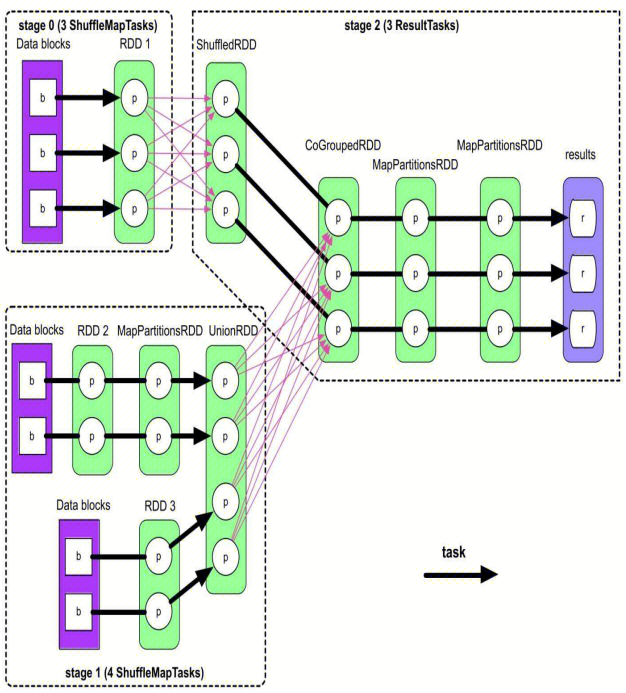

3. 根据最后生成的 RDD 分区个数，将各个 stage 划分为多个计算任务 task。

   由于每个分区上的计算逻辑相同且独立，因此每个分区上的计算可以独立成为一个 task，Spark 根据每个 stage 中最后一个 RDD 的分区个数决定生成 task 的个数。如图中粗箭头所示，在 stage 2 中，最后一个 MapPartitionsRDD 的分区个数为 3 ，那么 stage 2 就生成 3 个 task，每个 task 负责 ShuffledRDD => CoGroupedRDD => MapPartitionsRDD => MapPartitionsRDD 中一个分区的计算。

 

## 5.2 监控页面简介

Spark 监控包括 SparkUI 和 HistoryServer，其中 SparkUI 只能显示当前正在运行的 Spark 应用程序的信息，默认端口为 4040；而 HistoryServer 可以显示历史 Spark 应用程序的信息，默认端口为 18080。更多说明详见[官网](https://spark.apache.org/docs/3.0.0-preview/web-ui.html)。

1. **Jobs**

   展示 Spark 应用程序中所有 Job 的摘要页面和每个 Job 的详情页面。摘要页面展示的高级信息包括：

   - 当前 Spark 用户
   - Spark 应用程序启动后的时间
   - 调度模式，如 FIFO（先进先出）、FAIR（公平）
   - 每个状态下的 Job 数量：Active、Completed、Failed
   - 事件时间线：按时间顺序显示与 Executors（添加、删除）和 Job 相关的事件
   - 按状态分组的 Job 详情：显示 Job 的详细信息，包括 Job ID、描述（带有 Job 详细页面链接）、提交时间、持续时间、Stage 摘要和任务进度条

   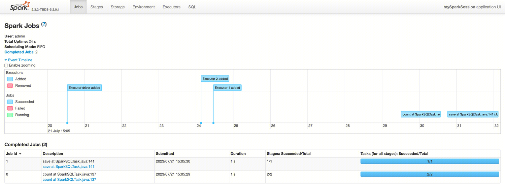

   点击某个 Job 详细页面链接，可以看到该 Job 的详细信息，包括：

   - Job 状态：running、succeeded、failed
   - 每个状态的 Stage 数量：active、pending、completed、skipped、failed
   - 事件时间线：按时间顺序显示与 Executors（添加、删除）和 Job 相关的事件
   - DAG 可视化：该 Job 的有向无环图的可视化表示，其中顶点代表 RDD 或 DataFrame，边代表要应用于 RDD 的操作
   - 按状态划分的 Stage 列表，包括：Stage ID、描述（带有 Stage 详细页面链接）、提交时间戳、Stage 持续时间、Task 进度条、当前 Stage 从存储读取的字节数、当前 Stage 写入存储的字节数、shuffle 读取的字节和记录数，包括本地读取和从远程 Executor 读取的数据、shuffle 写入磁盘的字节和记录数

   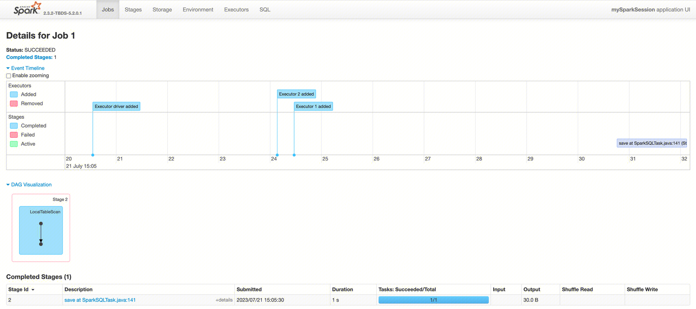

2. **Stages**

   展示 Spark 应用程序中所有 Stage 的摘要页面和每个 Stage 的详情页面。摘要页面展示的信息包括：

   - 每个状态下的 Stage 数量：active、pending、completed、skipped、failed
   - 按状态分组的 Stage 详情，其中 active 状态的 Stage 可以通过链接 kill 掉该 Stage，failed 状态的 Stage 会展示失败的原因

   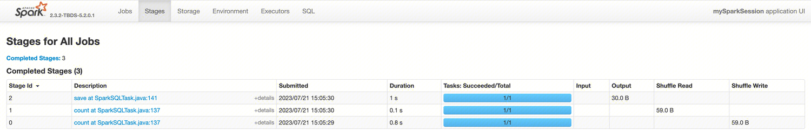

   点击某个 Stage 详细页面链接，可以看到该 Stage 的详细信息，包括：

   - 所有 Task 的总时间
   - Locality 级别摘要
   - shuffle 读取的大小和记录数
   - 相关联的 Job ID
   - DAG 可视化：该 Stage 的有向无环图的可视化表示，其中顶点代表 RDD 或 DataFrame，边代表要应用于 RDD 的操作
   - 所有 Task 的汇总指标均以表格和时间线的形式展示，包括：
     - Tasks deserialization time：任务反序列化时间
     - Duration of tasks：任务持续时间
     - GC time：GC时间
     - Result serialization time：Executor 序列化任务结果，然后再发送给 Driver 的时间
     - Getting result time：Driver 从 Worker 拉取任务结果所花费的时间
     - Scheduler delay：任务等待调度执行的时间
     - Peak execution memory：在 shuffle、聚合和 join 过程中创建的内部数据结构所使用的最大内存
     - Shuffle Read Size / Records：包括本地读取和从远程 Executor 读取的数据
     - Shuffle Read Blocked Time：Task 在等待从远程机器读取 shuffle 数据时被阻塞的时间
     - Shuffle Remote Reads：从远程 Executor 读取的 shuffle 字节总数
     - Shuffle spill memory：内存中数据反序列化的大小
     - Shuffle spill disk：磁盘上数据序列化的大小
   - 按 Executor 汇总的信息。
   - Task 详细信息基本上包括与摘要部分相同的信息，但按 Task 进行了详细说明。它还包括查看日志的链接，以及任务因故失败时的尝试次数。如果有已命名的累加器，在这里可以看到每个任务结束时的累加器值。

   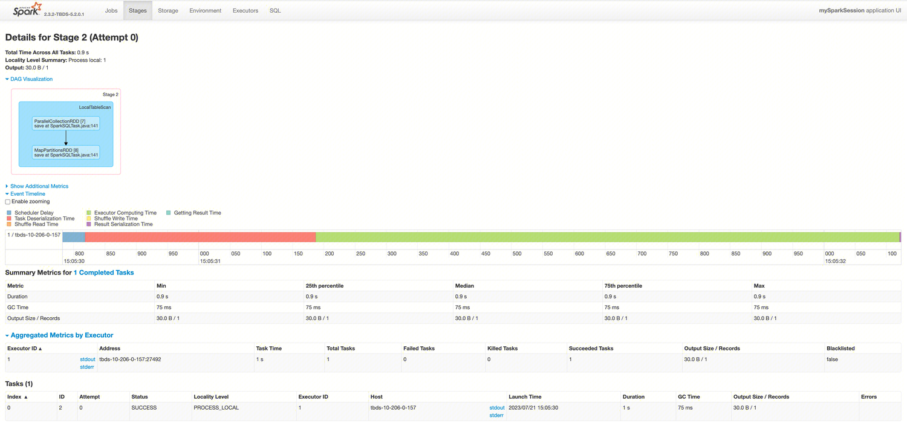

3. **Storage**

   展示应用程序中的持久化 RDD 和 DataFrame（如有）。摘要页面展示所有 RDD 的存储级别、大小和分区，详细信息页面展示 RDD 或 DataFrame 中所有分区的大小和使用的 Executor。

4. **Environment**

   展示不同环境和配置变量的值，由五部分组成，包括：

   - Runtime Information：包含运行时属性，如 Java 和 Scala 的版本
   - Spark Properties：列出了应用程序属性，如 [spark.app.name](http://spark.app.name/)、spark.driver.memory
   - Hadoop Properties：与 Hadoop 和 YARN 相关的属性。注意，spark.hadoop.* 等属性不显示在这一部分，而显示在 Spark Properties 中
   - System Propertie：有关 JVM 的更多详细信息
   - Classpath Entries：列出了从不同来源加载的类，对解决类冲突非常有用

5. **Executors**

   展示应用程序创建的 Executor 摘要信息，包括内存、磁盘、内核数使用情况，以及 Task 和 Shuffle 信息。其中 Storage Memory 列表示已使用和预留用于缓存数据的内存量。

   - 点击 stderr 链接，会在其控制台展示详细的标准错误日志。
   - 点击 Thread Dump 链接，可展示 Executor JVM 的线程转储，对性能分析非常有用。

   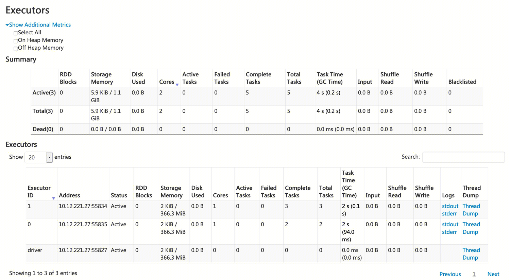

6. **SQL**

   如果应用程序执行 Spark SQL 查询，这里将展示查询的持续时间、Job、物理和逻辑计划等信息。

7. **Streaming**

   如果应用程序使用 Spark Streaming，这里将展示数据流中每个微批次的调度延迟和处理时间，有助于对流应用程序进行故障诊断。

 

 

# 6. 自助排障指南

## 6.1 基本排查步骤

1. 若是运行中的任务，进入 SparkUI。若任务已结束，则只能进入 HistoryServer。

   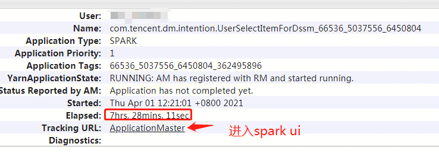

2. 查看 Jobs 页面，找到执行慢或执行失败的 Job。点击该 Job 详细页面链接，进一步找到执行慢或状态异常（pending、skipped、failed）的 Stage。若没有明显慢的 Stage，但是整体很慢，可能会有很多失败重试的 Stage；若 Stage 状态异常，可点击 details 查看状态异常发生的业务代码。

   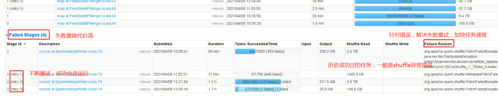

3. 点击该 Stage 详细页面链接，查看 Task 统计信息，若 GC 时间过长，则可以考虑加大内存。点击 DAG 图，并结合代码，可以猜测导致执行慢的算子。点击 Event Timeline，查看各类事件占用的时间，例如，序列化和反序列化时间过长，则可以考虑使用 Kryo 提升序列化性能。

   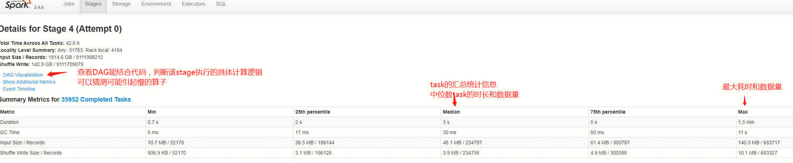

4. 进一步查看 Task 信息，找到执行慢或状态异常的 Task，并重要关注数据量之间的差异。若 Task 执行慢，则可能发生了数据倾斜；若 Task 执行失败，点击右侧 details 可查看失败发生的堆栈信息。

   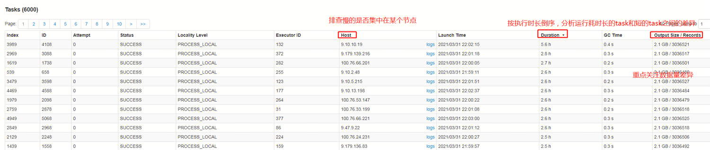

 

## 6.2 常见问题排查

1. 资源不足：Stage 页面是否有等待的 Task，Executors 界面是否有分配足够的 Cores。如果大量 Task 等待，Cores 很少，就是资源不足；如果大量 Task 等待，Cores 充足，但是 Active Tasks 远小于 Cores，这种情况很少见，可能是Driver 调度性能不足，也可能是每个 Task 执行时间太短，秒级别返回，来不及下发新 Task，建议调整 RDD。

   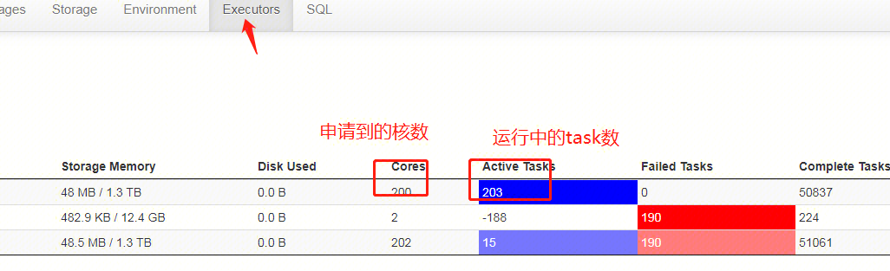

2. 大量失败重试：Stage 页面有大量 retry，一定要先进行错误定位，即使最后运行成功，也会浪费大量计算资源。最常见的失败原因就是 shuffle，因此需要尽量避免和优化 shuffle。

   

3. 数据倾斜：执行慢的 Stage详细页面，某个 Task 处理的记录数远大于其他 Task，可按照 2.4 节做相关优化。

   

4. 节点异常：执行慢的 Stage 详细页面，按运行时间排序，看执行慢的 Task 是否集中在同个 IP。如果是，一般加推测执行规避，可以找计算集群运维排查机器情况。

   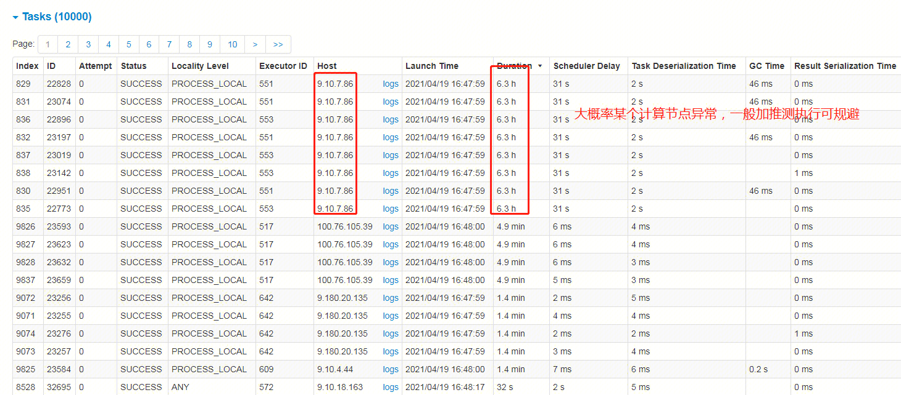

5. 代码段卡住：Executors 页面找到有执行 Task 的 Executor，点击 Thread Dump，查看堆栈信息，根据堆栈信息进一步排查。

   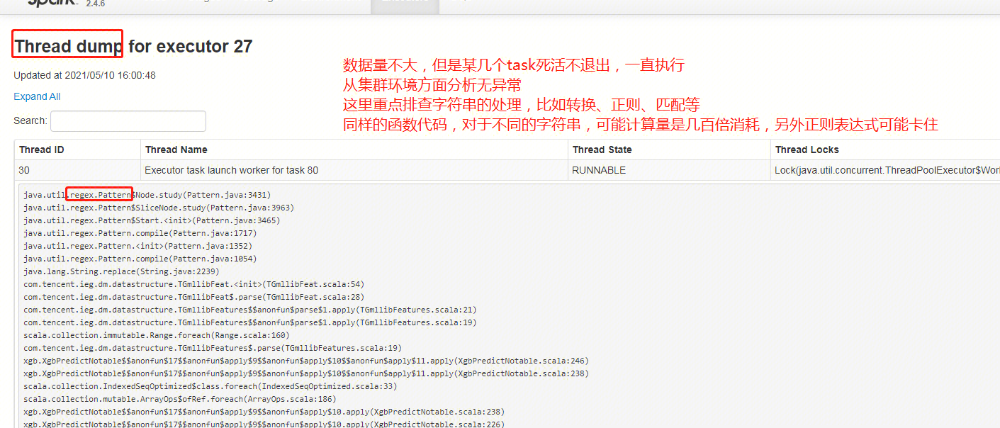

   