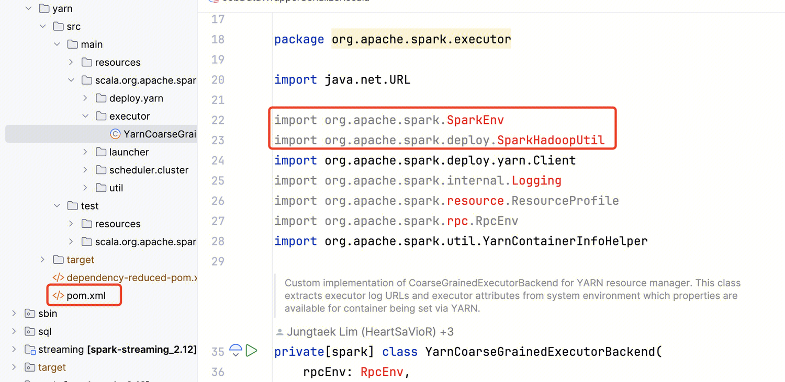
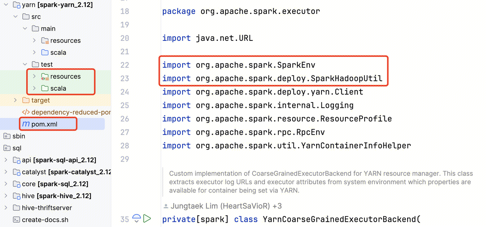
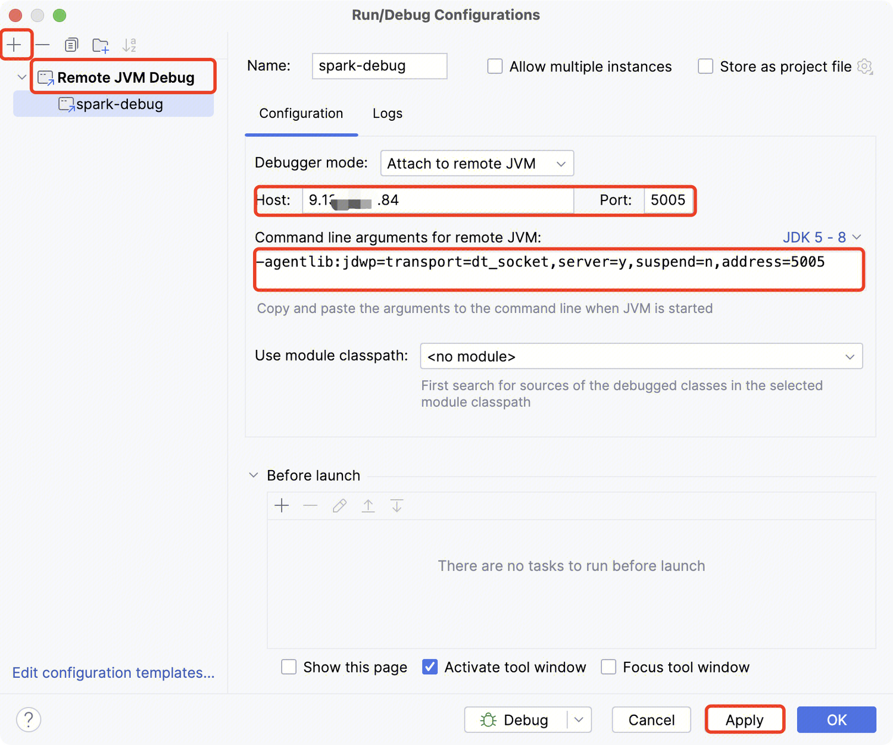
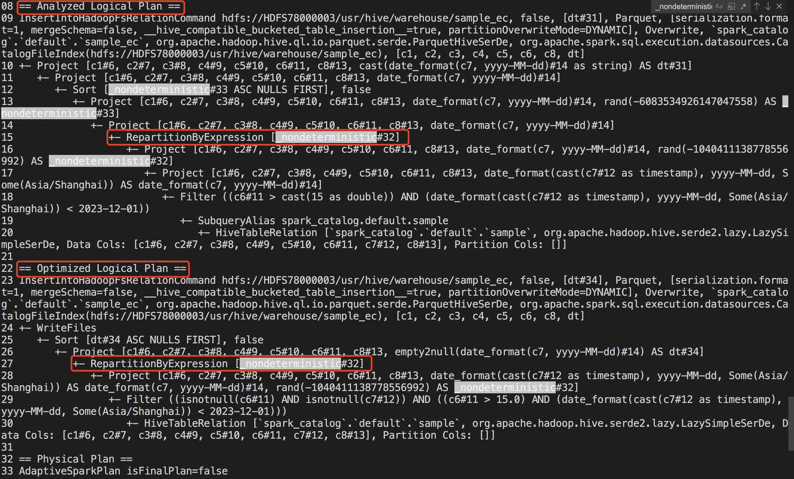
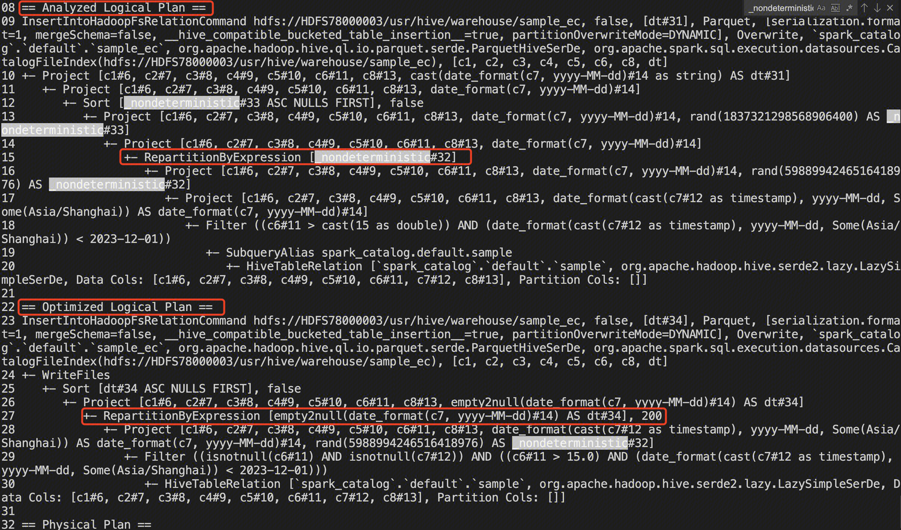

# 1. IDEA 环境配置

1、使用 IDEA 打开 Spark 项目后，代码多处标红，无法跳转类/方法，且无法运行单元测试（运行单元测试前，需要将整个 Spark 项目编译）。




2、需要右击黄色 pom.xml，选择 Add as Maven Project，将其加入 Maven 项目。此时 pom.xml 变成蓝色，测试目录显示绿色，代码不再标红。



 

# 2. 远程 Debug

1、配置 IDEA：点击 Edit Configurations；添加一个 Remote JVM Debug 配置，其中 Host、Port 分别填写 Spark Driver IP 和端口，**注意不要和其他端口冲突**；最后将下面的命令行参数拷贝，作为 Spark Driver 启动参数 spark.driver.extraJavaOptions。



2、启动 Spark SQL 会话，**确保 5005 端口外部可以访问，注意 suspend=y**：`bin/spark-sql --master local --conf spark.driver.extraJavaOptions=-agentlib:jdwp=transport=dt_socket,server=y,suspend=y,address=5005`

3、启动 IDEA Debug：**在对应代码处打上断点**，启动 IDEA Debug；然后在 Spark SQL 终端输出 SQL，此时程序会自动执行到断点处。

 

# 2. 修改优化规则

1、假设有两张表 sample、sample_ec，其中 sample_ec 表分区，现在需要从 sample insert overwrite sample_ec，**由于规定使用 cluster by rand()，因此执行过程较慢，且会产生很多小文件**，现在需要自定义一条优化规则，**从执行计划层面将 Shuffle 字段从 rand 修改为分区字段 dt**。

```sql
CREATE TABLE `sample`(`c1` string, `c2` string, `c3` string, `c4` int, `c5` int, `c6` double, `c7` string, `c8` string);

INSERT INTO `sample` VALUES ('a', 'b', 'c', 1, 2, 18, '2022-12-12', 'e'), ('a', 'b', 'c', 1, 2, 18, '2024-12-12', 'e');

CREATE TABLE `sample_ec`(`c1` string, `c2` string, `c3` string, `c4` int, `c5` int, `c6` double, `c8` string) 
    PARTITIONED BY(dt string); stored as parquet;

EXPLAIN EXTENDED insert overwrite table sample_ec partition(dt) select c1, c2, c3, c4, c5, c6, c8, date_format(c7, 'yyyy-MM-dd') 
    from sample where c6 > 15 and date_format(c7, 'yyyy-MM-dd') < '2023-12-01' cluster by rand();
```

2、使用 spark-shell 调试，优化前 Optimized Logical Plan 按照 rand 进行 shuffle。

```shell
[root@10 spark]# bin/spark-shell --master local
scala> val df1 = spark.sql("EXPLAIN EXTENDED insert overwrite table sample_ec partition(dt) select c1, c2, c3, c4, c5, c6, c8, date_format(c7, 'yyyy-MM-dd') from sample where c6 > 15 and date_format(c7, 'yyyy-MM-dd') < '2023-12-01' cluster by rand();")

scala> println(df1.queryExecution.optimizedPlan.numberedTreeString)
```




3、优化后 Optimized Logical Plan 按照分区字段 dt 进行 shuffle，剩下就是代码集成工作。

```scala
# 先复制执行下面的优化规则代码（包括import），然后通过Spark提供的接口注册该优化规则
scala> spark.experimental.extraOptimizations = Seq(RemoveRandRule)

scala> val df2 = spark.sql("EXPLAIN EXTENDED insert overwrite table sample_ec partition(dt) select c1, c2, c3, c4, c5, c6, c8, date_format(c7, 'yyyy-MM-dd') from sample where c6 > 15 and date_format(c7, 'yyyy-MM-dd') < '2023-12-01' cluster by rand();")

scala> println(df2.queryExecution.optimizedPlan.numberedTreeString)
import org.apache.spark.sql.catalyst.plans.logical._
import org.apache.spark.sql.catalyst.rules.Rule

object RemoveRandRule extends Rule[LogicalPlan] {
  def apply(plan: LogicalPlan): LogicalPlan = plan transform {
    case p @ Project(_, child @ RepartitionByExpression(expressions, _, _)) =>
      if (expressions.forall(_.toString.contains("_nondeterministic"))) {
        logDebug(s"projectList is ${p.projectList}")
        // 从右往左找Project表达式，如果不是_nondeterministic返回
        val lastColumn =
          p.projectList.reverseIterator.find(!_.toString.contains("_nondeterministic"))
            .getOrElse(p.projectList.last)
        logDebug(s"lastColumn is $lastColumn")

        val replacedExpressions =
          RepartitionByExpression(Seq(lastColumn), child.child, child.numPartitions)
        Project(p.projectList, replacedExpressions)
      } else {
        p
      }
  }
}
```




  

# 3. 其他

1、备份带分区的 iceberg 表：`CREATE TABLE backup_table using iceberg PARTITIONED BY (dt) AS SELECT * FROM origin_table`

2、造数：

 

 

 

# 参考

1. [实现自定义 Spark 优化规则](https://blog.csdn.net/wankunde/article/details/104646000)