# 1. Spark SQL 执行全过程概述

## 1.1 从 SQL 到 RDD

一般来说，从 SQL 到  Spark 中 RDD 的执行需要经过两个大阶段，分别是**逻辑计划（LogicalPlan）和物理计划（PhysicalPlan）**。

逻辑计划阶段会将用户所写的 SQL 语句转换成树型数据结构（逻辑算子树），SQL 语句中蕴含的逻辑映射到逻辑算子树的不同节点。逻辑计划阶段生成的逻辑算子树并不会直接提交执行，仅作为中间阶段。最终逻辑算子树的生成过程经历了 3 个子阶段，分别对应**未解析的逻辑算子树（Unresolved LogicalPlan， 仅仅是数据结构，不包含任何数据信息等）、解析后的逻辑算子树（Analyzed LogicalPlan，节点中绑定各种信息）和优化后的逻辑算子树（Optimized LogicalPlan，应用各种优化规则对一些低效的逻辑计划进行转换）**。

物理计划阶段将上一步逻辑计划阶段生成的逻辑算子树进行进一步转换，生成物理算子树。**物理算子树的节点会直接生成 RDD 或对 RDD 进行 transformation 操作**（注：每个物理计划节点中都实现了对 RDD 进行转换的 execute 方法）。同样地，物理计划阶段也包含了个 3 个子阶段：首先，根据逻辑算子树，生成**物理算子树的列表 Iterator[PhysicalPlan]**（同样的逻辑算子树可能对应多个物理算子树）；然后，从列表中按照一定的策略选取**最优的物理算子树（SparkPlan）**；最后，对选取的物理算子树进行提交前的准备工作，例如，确保分区操作正确、物理算子树节点重用、执行代码生成等，得到**“准备后”的物理算子树（Prepared SparkPlan）**。经过上述步骤后，物理算子树生成的 RDD 执行 action 操作（如例子中的 show），即可提交执行。

从 SQL 语句的解析一直到提交之前，**上述整个转换过程都在 Spark 集群的 Driver 端进行，不涉及分布式环境**。SparkSession 类的 sql 方法调用 SessionState 中的各种对象，包括上述不同阶段对应的 SparkSqlParser 类、Analyzer 类、Optimizer 类和 SparkPlanner 类等，最后封装成一个 QueryExecution 对象。因此，在进行 Spark SQL 开发时，可以很方便地将每一步生成的计划单独剥离出来分析。

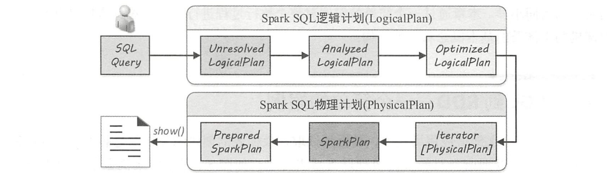

如图所示，左上角是 SQL 语句，生成的逻辑算子树中有 Relation、 Filter 和 Project 节点，分别对应数据表、过滤逻辑（age>18） 和列剪裁逻辑（只涉及了列中的 2 列）。下一步的物理算子树从逻辑算子树一对一映射得到，Rlation 逻辑节点转换为 FileSourceScanExec 执行节点，Filter 逻辑节点转换为 FilterExec 执行节点，Project 逻辑节点转换为 ProjectExec 执行节点。

生成的物理算子树根节点是 ProjectExec， 每个物理节点中的 execute 函数都是执行调用接口，**由根节点开始递归调用，从叶子节点开始执行**。下图展示了物理算子树的执行逻辑，与直接采用 RDD 进行编程类似。需要注意的是，FileSourceScanExec 叶子执行节点中需要构造数据源对应的 RDD，FilterExec 和 ProjectExec 中的 execute 函数对 RDD 执行相应的 transformation 操作。

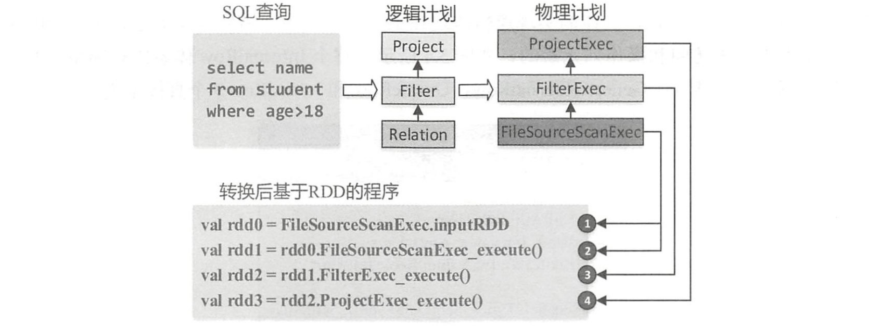


## 1.2 重要概念

Spark SQL 内部实现上述流程中平台无关部分的基础框架称为 Catalyst。在深入分析流程每个阶段的原理之前，先简要介绍 Catalyst 中涉及的重要概念和数据结构，主要包括 InternalRow 体系、TreeNode 体系和 Expression 体系。

### 1.2.1 InternalRow 体系

对于关系表来讲，通常操作的数据都是以“行”为单位的。在 Spark SQL 内部实现中，**InternalRow 就是用来表示一行行数据的类**，因此物理算子树节点产生和转换的 RDD 类型即为 RDD[InternalRow]。此外，InternalRow 中的每一列都是 Catalyst 内部定义的数据类型。

从类的定义来看，InternalRow 作为一个抽象类，包含 numFields 和 update 方法，以及各列数据对应的 get 与set 方法，但具体的实现逻辑体现在不同的子类中。需要注意的是，InternalRow 中都是根据下标来访问和操作列元素的。整个 InternalRow 体系比较简单，其具体的实现不多，包括 BaseGenericInternalRow、UnsateRow 和JoinedRow 3 个直接子类。

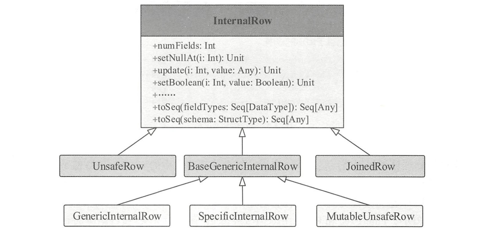

* BaseGenericInternalRow：同样是抽象类，实现了 InternalRow 中定义的所有 get 类型方法，这些方法的实现都通过调用类中定义的 genericGet 虚函数进行，该函数的实现在下一级子类中。
* JoinedRow：该类主要用于 Join 操作，将两个 InternalRow 放在一起形成新的 InternalRow。使用时需要注意构造参数的顺序。
* UnsafeRow：不采用 Java 对象存储的方式，避免了 JVM 中垃圾回收（GC）的代价。此外，UnsafeRow 对行数据进行了特定的编码，使得存储更加高效。

从直接子类继续往下，BaseGenericInternalRow 也衍生出 3 个子类。其中，MutableUnsafeRow 和 UnsafeRow 相关，用来支持对特定的列数据进行修改，这里暂时不作介绍。GenericInternalRow 构造参数是 Array[Any] 类型，**采用对象数组进行底层存储，genericGet 也是直接根据下标访问的**。这里需要注意，**数组是非拷贝的，因此一旦创建，就不允许通过 set 操作进行改变**。而 SpecificInternalRow 则是以 Array [MutableValue] 为构造参数的，**允许通过 set 操作进行修改**。

```scala
class GenericInternalRow(val values: Array[Any]) extends BaseGenericInternalRow {
  /** No-arg constructor for serialization. */
  protected def this() = this(null)

  def this(size: Int) = this(new Array[Any](size))

  override protected def genericGet(ordinal: Int) = values(ordinal)

  override def toSeq(fieldTypes: Seq[DataType]): Seq[Any] = values.clone()

  override def numFields: Int = values.length

  override def setNullAt(i: Int): Unit = { values(i) = null}

  override def update(i: Int, value: Any): Unit = { values(i) = value }
}
```


### 1.2.2 TreeNode 体系

无论是逻辑计划还是物理计划，都离不开中间数据结构。在 Catalyst 中，对应的是 TreeNode 体系。**TreeNode 类是 Spark SQL 中所有树结构的基类，定义了一系列通用的集合操作和树遍历操作接口**。

TreeNode 内部包含一个 Seq[BaseType] 类型的变量 children 来表示孩子节点。TreeNode 定义了 foreach、map、collect 等针对节点操作的方法，以及 transformUp 和 transformDown 等遍历节点并对匹配节点进行相应转换的方法。TreeNode 本身是 scala.Product 类型，因此可以通过 productElement 函数或 productlterator 迭代器对 Case Class 参数信息进行索引和遍历。实际上，TreeNode 一直在内存里维护，不会 dump 到磁盘以文件形式存储，且无论在映射逻辑执行计划阶段，还是优化逻辑执行计划阶段，树的修改都是以替换已有节点的方式进行的。

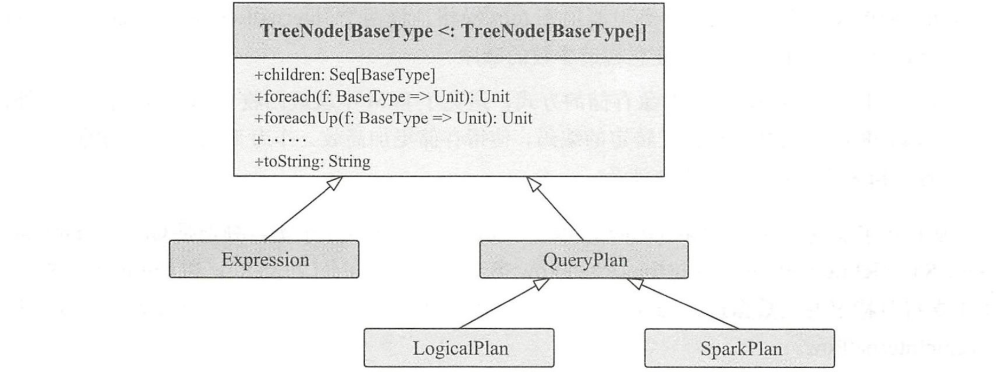

TreeNode 提供的仅仅是一种泛型，实际上包含了两个子类继承体系，即图中的 QueryPlan 和 Expression 体系。Expression 是 Catalyst 中的表达式体系，下一节会介绍。QueryPlan 类又包含逻辑算子树（LogicalPlan）和物理执行算子树（SparkPlan）两个重要的子类，其中逻辑算子树在 Catalyst 中内置实现，可以剥离出来直接应用到其他系统中；而物理算子树 SparkPlan 和 Spark 执行层紧密相关，当 Catalyst 应用到其他计算模型时，可以进行相应的适配修改。

作为基础类，TreeNode 本身仅提供了最简单和最基本的操作。例如不同遍历方式的 transform 系列方法、用于替换新的子节点的 withNewChildren 方法等。此外，treeString 函数能够将 TreeNode 以树型结构展示，在查看表达式、逻辑算子树和物理算子树时经常用到。

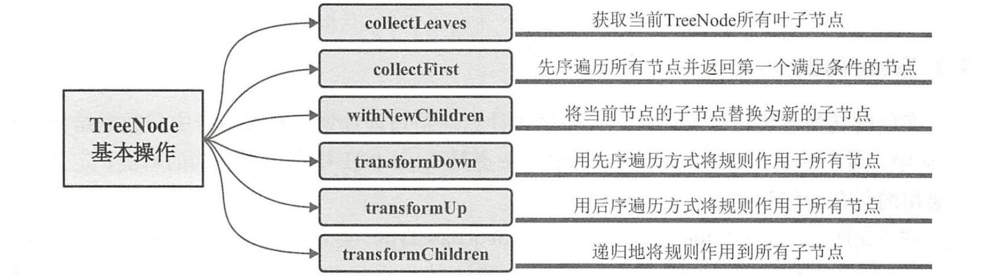

除上述操作外，Catalyst 中还提供了节点位置功能，即能够根据 TreeNode 定位到对应的 SQL 字符串中的行数和起始位置。该功能在 SQL 解析发生异常时能够方便用户迅速找到出错的地方，具体参见如下代码。Origin 提供了line 和 startPosition 两个构造参数，分别代表行号和偏移量。在 CurrentOrigin 对象中，提供了各种 set 和 get 操作。其中，比较重要的是 withOrigin 方法，支持在 TreeNode 上执行操作的同时修改当前 origin 信息。

```scala
case class Origin(
  line: Option[Int] = None,
  startPosition: Option[Int] = None)

object CurrentOrigin {
  private val value = new ThreadLocal[Origin]() {
    override def initialValue: Origin = Origin()
  }

  def get: Origin = value.get()
  def set(o: Origin): Unit = value.set(o)

  def reset(): Unit = value.set(Origin())

  def setPosition(line: Int, start: Int): Unit = {
    value.set(
      value.get.copy(line = Some(line), startPosition = Some(start)))
  }

  def withOrigin[A](o: Origin)(f: => A): A = {
    set(o)
    val ret = try f finally { reset() }
    ret
  }
}
```


### 1.2.3 Expression 体系

**表达式一般指的是不需要触发执行引擎而能够直接进行计算的单元，例如四则运算、转换操作、过滤操作等**。Catalyst 实现了完善的表达式（Expression）体系，与各种算子（QueryPlan）占据同样的地位。算子执行前通常都会进行”绑定“操作，将表达式与输入的属性对应起来，同时算子也能够调用各种表达式处理相应的逻辑。在 Expression 类中，主要定义了 5 个方面的操作，包括基本属性、核心操作、输入输出、字符串表示和等价性判断，如图所示。

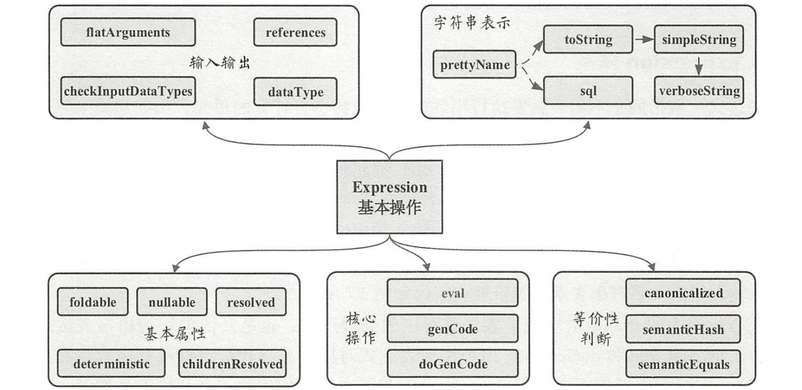

核心操作中的 eval 函数实现了表达式对应的处理逻辑，也是其他模块调用该表达式的主要接口，而 genCode 和 doGencode 用于生成表达式对应的 Java 代码。字符串表示用于查看该 Expression 的具体内容，如表达式名和输入参数等。下面对 Expression 包含的基本属性和操作进行简单介绍。

```scala
abstract class Expression extends TreeNode[Expression] {
  // 该属性用来标记表达式能否在查询执行之前直接静态计算。目前，foldable 为 true 的情況有两种，第一种是该表达式为 Literal 类型 （字面值，例如常量等），第二种是当且仅当其子表达式中 foldable 都为 true 时。当 foldable 为 true 时，在算子树中，表达式可以预先直接处理（“折叠”）。
  def foldable: Boolean = false
  
  // 该属性用来标记表达式是否为确定性的，即每次执行 eval 函数的输出是否都相同。考虑到 Spark 分布式执行环境中数据的 Shuffle 操作带来的不确定性，以及某些表达式（如 Rand 等）本身具有不确定性，该属性对于算子树优化中判断谓词能否下推等很有必要。
  lazy val deterministic: Boolean = children.forall(_.deterministic)
  
  // 该属性用来标记表达式是否可能输出 Null 值，一般在生成的 Java 代码中对相关条件进行判断。
  def nullable: Boolean

  def eval(input: InternalRow = null): Any
  
  // 返回经过规范化 (Canonicalize）处理后的表达式。规范化处理会在确保输出结果相同的前提下通过一些规则对表达式进行重写，具体逻辑可以参见 Canonicalize 工具类。
	lazy val canonicalized: Expression = {
    val canonicalizedChildren = children.map(_.canonicalized)
    Canonicalize.execute(withNewChildren(canonicalizedChildren))
  }
  
  // 判断两个表达式在语义上是否等价。基本的判断条件是两个表达式都是确定性的 (deterministic 为 true）且两个表达式经过规范化处理后 (Canonicalized）仍然相同。
  def semanticEquals(other: Expression): Boolean =
    deterministic && other.deterministic && canonicalized == other.canonicalized
  
  // ...
}
```

在 Spark SQL中，Expression 本身也是 TreeNode 类的子类，因此能够调用所有 TreeNode 的方法，也可以通过多级的子 Expression 组合成复杂的 Expression。 Expression 涉及范围广且数目庞大，相关的类或接口将近 300个，这里列举一些比较常用的 Expression 来介绍。

* Nondeterministic 接口：具有不确定性的 Expression，其中 deterministic 和 foldable 属性都默认返回false，典型的实现包括 MonotonicallyIncreasingID 表达式、Rand 和 Randn 表达式等。
* Unevaluable 接口：非可执行的表达式，即调用其 eval 函数会抛出异常。该接口主要用于生命周期不超过逻辑计划解析和优化阶段的表达式，例如星号表达式在解析阶段就会被展开成具体的列集合。
* CodegenFallback 接口：不支持代码生成的表达式。某些表达式涉及第三方实现（例如 Hive 的 UDF） 等情况，无法生成 Java 代码，此时通过 CodegenFallback 直接调用，该接口中实现了具体的调用方法。
* LeafExpression：叶子节点类型的表达式，即不包含任何子节点，因此其 children 方法通常默认返回 Nil 值。该类型的 Expression 目前大约有30个，包括 Star、 CurrentDate、Pi 表达式等。
* UnaryExpression：一元类型表达式，只含有一个子节点。这种类型的表达式总量 110 多种，较为庞大。其输入涉及一个子节点，例如，Abs 操作、UpCast 表达式等。
* BinaryExpression：二元类型表达式，包含两个子节点。这种类型的表达式数目也比较庞大，大约有 80 种。比较常用的是一些二元的算数表达式，例如加减乘除操作、RLike 函数等。
* TernaryExpression：三元类型表达式，包含了 3 个子节点。这种类型的表达式数目不多，大约有 10 种，大部分都是一些字符串操作的函数，非常典型的例子可以参考 Substring 函数，其子节点分别是字符串、下标和长度的表达式。

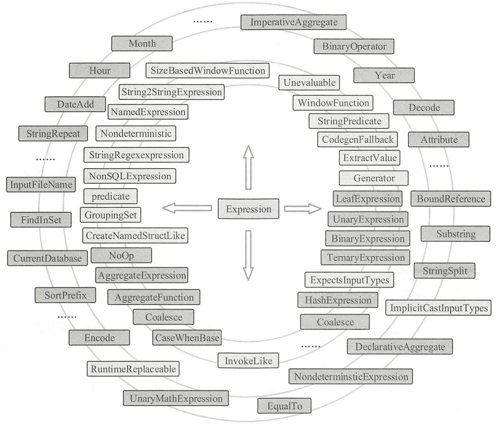


## 1.3 内部数据类型系统

数据类型系统是任何 SQL 引擎都必不可少的组成部分，**主要用来表示数据表中存储的列信息**，在 Spark SQL 中，Catalyst 实现了完善的数据类型系统。

数据类型系统中类的相互继承关系如图所示，所有的数据类型都继承自 AbstractDataType 抽象类。比较常用的是各种 NumericType 类型，包括 ByteType（表示一字节的整数，范围是 -128 ~ 127)、ShortType（表示两字节的整数，范围是 -32768 ~ 32767)、IntegerType（表示 4 字节的整数）、LongType（表示 8 字节的整数）、FloatType（表示 4 字节的单精度浮点数）和 DoubleType（表示 8 字节的双精度浮点数）等。另外，DecimalType 可以用来表示不可变的任意精度的十进制数字，依托内部的 java.math.BigDecimal，支持常规的四则运算和UDF（例如 round 和 floor 等)。使用 DecimalType 进行转换操作时需要注意 precision 和 scale 值的选取，其中 scale 表示小数部分位数，precision-scale 表示整数部分的位数。

常用的复合数据类型有数组类型（ArrayType）、字典类型（MapType）和结构体类型（StructType）3 种。其中，数组类型中要求数组元素类型一致；字典类型中既要求所有 key 类型一致，也要求所有的 value 类型一致。

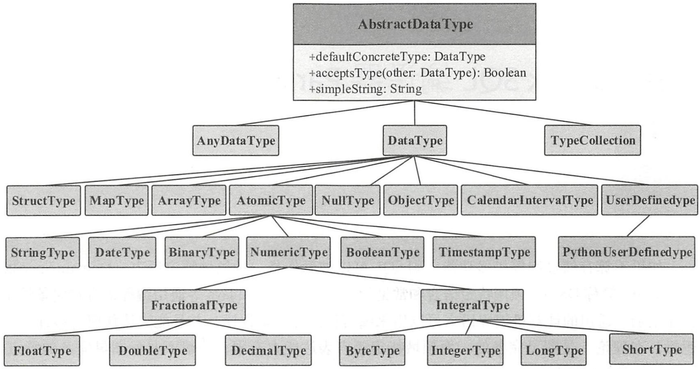


# 2. Spark SQL 编译器 Parser

## 2.1 DSL 工具之 ANTLR 简介

SQL 可以被看作是一种领域特定语言（Domain Specific Language，简称 DSL），DSL 的构建与通用编程语言的构建类似，主要的过程仍然是指定语法和语义，然后实现编译器或解释器。通常情况下，一个系统中 DSL 模块的实现需要涉及两方面的工作。

* 设计语法和语义，定义 DSL 中具体的元素。
* 实现词法分析器（Lexer）和语法分析器（Parser），完成对 DSL 的解析，最终转换为底层逻辑来执行。

ANTLR（Another Tool for Language Recognition）是目前非常活跃的语法生成工具，用 Java 语言编写，基于 LL（*）解析方式，使用自上而下的递归下降分析方法。ANTLR 可以用来产生词法分析器、语法分析器和树状分析器（Tree Parser）等各个模块，其文法定义使用类似 EBNF（Extended Backus-Naur Form）的方式，简洁直观。

ANTLR 已经升级到 ANTLR4，ANTLR4 除了能够自动构建语法分析树外，**还支持生成基于监听器（Listener）模式和访问者（Visitor）模式的树遍历器**。访问者模式遍历语法树是一种更加灵活的方式，可以避免在文法文件中嵌入烦琐的动作，使解析与应用代码分离。

ANTLR 应用非常广泛，Hibernate 与 WebLogic 都使用 ANTLR 解析 HQL 语言，NetBeansIDE 中基于 ANTLR 解析 C++，Hive、 Presto 和 Spark SQL 等大数据引擎的 SQL 编译模块也都是基于 ANTLR 构建的。

### 2.1.1 基于 ANTLR4 的计算器

ANTIR4 是进行 Spark SQL 开发的基础，以简单的四则运算为例，使用 ANTIR4 构建计算器。在 ANTLR4 中，词法和语法可以放在同一个 G4 文件中，词法单元以大写字母开头，语法单元以小写字母开头，以作区分。

```
grammar Calculator;

line : expr EOF ;
expr : '(' expr ')' 			# parentExpr
		| expr ('*'|'/') expr 	# multOrDiv
		| expr ('+'|'-') expr 	# addOrSub
		| FLOAT 			    # float ;

WS : [ \t\n\r]+ -> skip ;
FLOAT : DIGIT+ '.' DIGIT* EXPONENT?
		| '.' DIGIT+ EXPONENT?
		| DIGIT+ EXPONENT? ;
fragment DIGIT : '0'..'9';
fragment EXPONENT : ('e'|'E') ('+'|'-')? DIGIT+ ;
```

grammar Calculator 表示文件是一个词法、语法混合文件，名称必须和文件名相同，即该文法文件名应该是Calculator.g4。文法规则比较简单，仅支持加减乘除和括号的写法。需要注意的是，expr 每条规则后面的 # 是产生式标签名 (Alternative Label Name)，起到标记不同规则的作用。词法单元 DIGIT 前的 fragment 表示这是个词片段，不会生成对应的 Token。'0'..'9' 表示 0～9 的字符，和 [0-9] 的意义一样。词法规则 WS 定义了空格，其中的 -> skip 是 ANTLR4 中特殊的命令，表示直接跳过不做任何处理。整个文法是与目标语言无关的，同样的文件可以生成 Java、JavaScript、Python 等不同语言的代码。

基于 Calculator 文法文件，可以直接在命令行或 MAVEN 中调用 ANTLR4 生成相应的代码，IDEA 等集成开发环境也提供了 ANTLR4 的插件支持，具体的操作步骤可以参考 [Idea中使用Antlr4](https://blog.csdn.net/waiting971118/article/details/124307642)。完整的生成代码如图所示，其中 Calculator.tokens 和 CalcultorLexer.tokens 是内部的 Token 定义，**CalculatorLexer 和 CalculatorParser 是生成的词法分析器和语法分析器。剩下的 Java 文件代表着两种访问语法树的方式，CalculatoListener 和 CalculatorBaseListener 对应监听器模式，CalculatorVisitor 和 CalculatorBaseVisitor 对应访问者模式**。

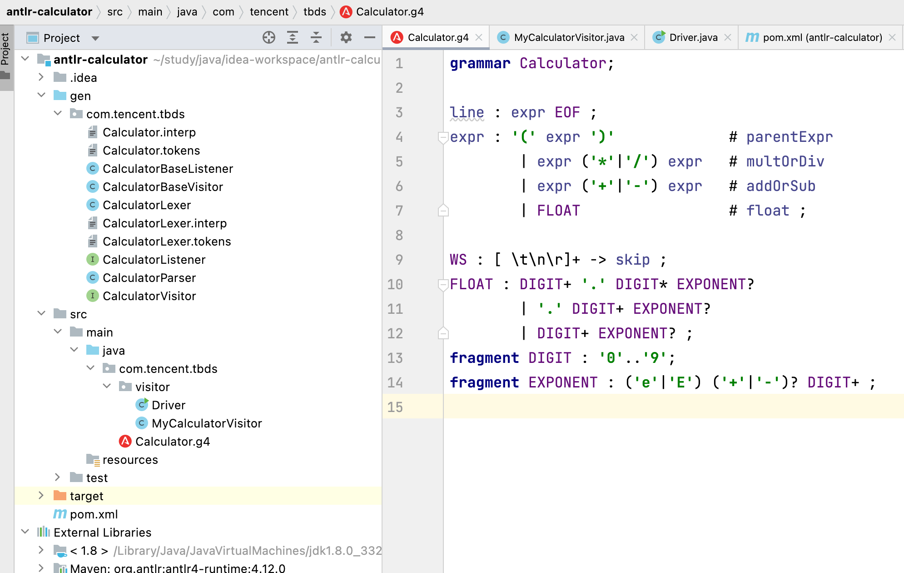

基于生成的代码，开发人员只要实现语法树遍历过程中的核心逻辑即可，可以在监听器模式和访问者模式中任意选择。考虑到 Spark SQL 编译器中主要采用 Visitor 方式，这里在 CalculatorBaseVisitor 的基础上继承自己的类，重载其中的关键方法。代码如下，可以看到文法文件中的 addOrSub、multOrDiv 标签分别对应于 visitAddOrSub、visitMultOrDiv 方法，在其中实现加减、乘除的逻辑，而 visitFloat 方法和 float 标签一一对应，完成浮点数的解析。

```java
public class MyCalculatorVisitor extends CalculatorBaseVisitor<Object> {
    @Override
    public Object visitMultOrDiv(CalculatorParser.MultOrDivContext ctx) {
        Object obj1 = ctx.expr(0).accept(this);
        Object obj2 = ctx.expr(1).accept(this);
        if ("*".equals(ctx.getChild(1).getText())) {
            return (Float) obj1 * (Float) obj2;
        } else if ("/".equals(ctx.getChild(1).getText())) {
            return (Float) obj1 / (Float) obj2;
        }
        return 0f;
    }

    @Override
    public Object visitAddOrSub(CalculatorParser.AddOrSubContext ctx) {
        Object obj1 = ctx.expr(0).accept(this);
        Object obj2 = ctx.expr(1).accept(this);
        if ("+".equals(ctx.getChild(1).getText())) {
            return (Float) obj1 + (Float) obj2;
        } else if ("-".equals(ctx.getChild(1).getText())) {
            return (Float) obj1 - (Float) obj2;
        }
        return 0f;
    }

    @Override
    public Object visitFloat(CalculatorParser.FloatContext ctx) {
        return Float.parseFloat(ctx.getText());
    }
}
```

实现了 Visitor 中的关键逻辑后，就可以直接调用 ANTLR4 生成的各个模块了，驱动程序如下，根据输入的字符流相继构造词法分析器（Lexer）和语法分析器（Parser），然后创建相应的 Visitor 来访问语法分析器解析得到的语法树，最后返回结果。

```java
public class Driver {
    public static void main(String[] args) {
        String query = "3.1 * 6.3 - 4.51";
        CalculatorLexer lexer = new CalculatorLexer(new ANTLRInputStream(query));
        CalculatorParser parser = new CalculatorParser(new CommonTokenStream(lexer));
        MyCalculatorVisitor visitor = new MyCalculatorVisitor();
        System.out.println(visitor.visit(parser.expr()));	// 15.02
    }
}
```


## 2.2 SparkSqlParser 之 AstBuilder

Catalyst 中提供了直接面向用户的 ParserInterface 接口，该接口中包含了对 SQL 语句、Expression 表达式和 Tableldentifier 数据表标识符的解析方法。AbstractSqlParser 是实现了 ParserInterface 的虚类，其中定义了返回 AstBuilder 的函数。

整个 SQL 解析相关的实现如图所示，其中 CatalystSqlParser 仅用于 Catalyst 内部，而 SparkSqlParser 用于外部调用。其中，**比较核心的是 AstBuilder， 它继承了 ANTLR4 生成的默认 SqlBaseBaseVisitor，用于生成 SQL 对应的抽象语法树 AST；SparkSqlAstBuilder 继承 AstBuilder，并在其基础上定义了一些 DDL 语句的访问操作，主要在 SparkSqlParser 中调用**。

当面临开发新的语法支持时，首先需要改动的是 ANTLR4 文件（在 SqlBase.g4 中添加文法），重新生成词法分析器（SqlBaseLexer）、语法分析器（SqlBaseParser）和访问者类（SqlBaseVisitor 接口与 SqlBaseBaseVisitor 类），然后在 AstBuilder 等类中添加相应的访问逻辑，最后添加执行逻辑。

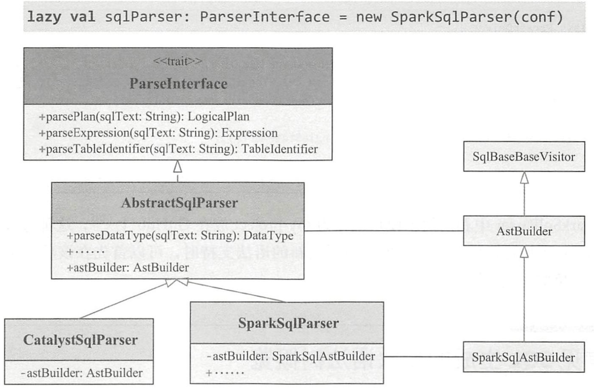


## 2.3 常见 SQL 生成的抽象语法树

在 Catalyst 中，SQL 语向经过解析，生成的抽象语法树节点都以 Context 结尾来命名。如图所示为第 1 章案例中的 SQL 查询语句 `select name from student where age > 18` 生成的抽象语法树。

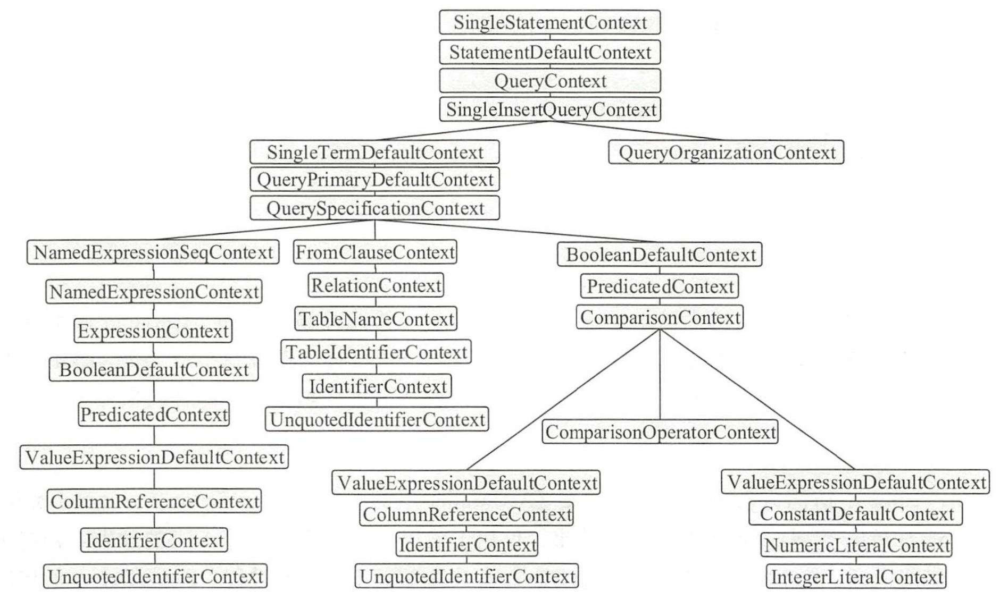

从语法树可以看到，SingleStatementContext 是根节点，但是在访问该节点时一般什么都不做，只递归访问子节点。整个遍历访问操作中比较重要的是包含多个子节点的节点。例如 QuerySpecificationContext 节点，一般将数据表和具体的查询表达式整合在一起。左边的一系列节点对应 select 表达式中选择的列，中间的FromClauseContext 为根节点的系列节点对应数据表，右边的一系列节点则对应 where 条件中的表达式。

假设上述语句加入排序操作：`select name from student where age > 18 order by id desc`，生成的语法树如图所示。可以看到新的语法树在 QueryOrganizationContext 节点下面加入了 SortltemContext 节点，代表数据查询之后所进行的排序操作。一般来讲，QueryOrganizationContext 为根节点所代表的子树中包含了各种对数据组织的操作，例如 Sort、Limit 和 Window 算子等。

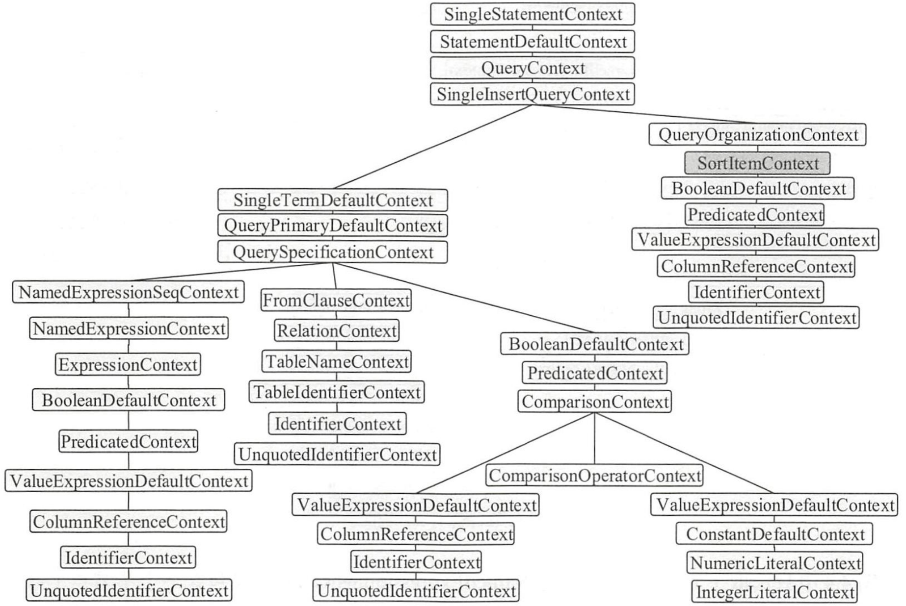

假设加入聚合操作：`select id, count(name) from student group by id`，生成的语法树如图所示。图中只选取了 name 一列，除 id 外，还有对 name 的 count 操作所产生的新列，因此 NamedExpressionSeqContext 节点包含两个子节点。在 SqlBase.g4 文法文件中表示聚合操作的关键宇是 group by、cube、 grouping sets 和 roll up 这 4 种。反映在语法树中就是 AggregationContext 节点。表示聚合函数的 FunctionCallContext 节点很好理解，其子节点 QualifiedNameContext 代表函数名，ExpressionContext 表示函数的参数表达式（对应 SQL 语向中的 name 列）。

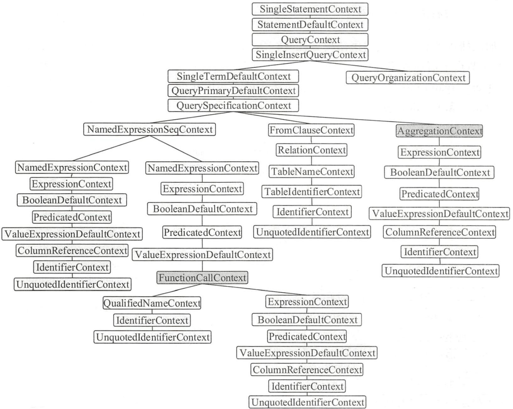


# 3. Spark SQL 逻辑计划

逻辑计划阶段承前启后，在此阶段，字符串形态的 SQL 语句转换为树结构形态的逻辑算子树，SQL 中所包含的各种处理逻辑（过滤、剪裁等）和数据信息都会被整合在逻辑算子树的不同节点中。**逻辑计划本质上是一种中间过程表示，与 Spark 平合无关**，后续阶段会进一步将其映射为可执行的物理计划。

## 3.1 逻辑计划概述

**Spark SQL 逻辑计划在实现层面被定义为 LogicalPlan 类**。从 SQL 语向经过 SparkSqlParser 解析生成 Unresolved LogicalPlan，到最终优化成为 Optimized LogicalPlan，这个流程主要经过了 3 个阶段。

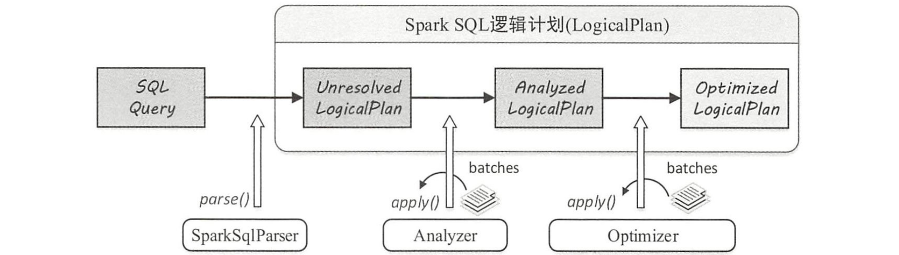

1. **由 SparkSqlParser 中的 AstBuilder 执行节点访问**，将语法树的各种 Context 节点转换成对应的 LogicalPlan 节点，从而成为一棵未解析的逻辑算子树（Unresolved LogicalPlan），此时的逻辑算子树是最初形态，不包含数据信息与列信息等。
2. **由 Analyzer 将一系列的规则作用在 Unresolved LogicalPlan 上**，对树上的节点绑定各种数据信息，生成解析后的逻辑算子树（Analyzed LogicalPlan）。
3. **由 Spark SQL 中的优化器（Optimizer）将一系列优化规则作用到逻辑算子树中**，在确保结果正确的前提下改写其中的低效结构，生成优化后的逻辑算子树（Optimized LogicalPlan）。


## 3.2 LogicalPlan 简介

LogicalPlan 作为数据结构记录了对应逻辑算子树节点的基本信息和基本操作，包括输入输出和各种处理逻辑等。LogicalPlan 属于 TreeNode 体系，继承自 QueryPlan 父类。

### 3.2.1 QueryPlan 概述

QueryPlan 的主要操作分为 6 个模块：输入输出、宇符串、规范化、表达式操作、基本属性和约束。

1. **输入输出**：定义了 5 个方法，其中 output 是返回值为 Seq[Attribute] 的虚函数，具体内容由不同子节点实现，而 outputSet 是将 output 的返回值进行封装，得到 AttributeSet 集合类型的结果。获取输入属性的方法 inputSet 的返回值也是 AttributeSet，节点的输入属性对应所有子节点的输出，producedAttributes 表示该节点所产生的属性；missingInput 表示该节点表达式中涉及的，但是其子节点输出中并不包含的属性。
2. **基本属性**：表示 QueryPlan 节点中的一些基本信息，其中 schema 对应 output 输出属性的 schema 信息，allAttributes 记录节点所涉及的所有属性（Attribute）列表，aliasMap 记录节点与子节点表达式中所有的别名信息，references 表示节点表达式中所涉及的所有属性集合，subqueries 和 innerChildren 都默认实现该 QueryPlan 节点中包含的所有子查询。
3. **字符串**：这部分方法主要用于输出打印 QueryPlan 树型结构信息，其中 schema 信息也会以树状展示。需要注意的一个方法是 statePrefix，用来表示节点对应计划状态的前缀字符串。**在 QueryPlan 的默认实现中，如果该计划不可用（invalid），则前缀会用感叹号标记**。


4. **规范化**：类似 Expression 中的方法定义，对 QueryPlan 节点类型也有规范化（Canonicalize）的概念。在 QueryPlan 的默认实现中，canonicalized 直接赋值为当前的 QueryPlan 类；此外，在 sameResult 方法中会利用 canonicalized 来判断两个 QueryPlan 的输出数据是否相同。
5. **表达式操作**：在 QueryPlan 各个节点中，包含了各种表达式对象，各种逻辑操作一般也都是通过表达式来执行的。在 QueryPlan 的方法定义中，表达式相关的操作占据重要的地位，其中 expressions 方法能够得到该节点中的所有表达式列表，其他方法很容易根据命名了解对应功能。
6. **约束（Constraints）**：本质上也属于数据过滤条件的一种，同样是表达式类型。相对于显式的过滤条件，约束信息可以“推导”出来，例如，对于“a＞5”这样的过滤条件，显然 a 的属性不能为 null，这样就可以对应地构造 isNotNull(a) 约束。在实际情況下，SQL 语句中可能会涉及很复杂的约束条件处理，如约束合并、等价性判断等。在 QueryPlan 类中，提供了大量方法用于辅助生成 constraints 表达式集合以支持后续优化操作。例如，validConstraints 方法返回该 QueryPlan 所有可用的约束条件，constructIsNotNullConstraints 方法会针对特定的列构造 isNotNull 的约束条件。


### 3.2.2 LogicalPlan 基本操作与分类

LogicalPlan 继承自 QueryPlan，包含了两个成员变量和 17 个方法。两个成员变量一个是 resolved，用来标记该 LogicalPlan 是否为经过了解析的布尔类型值；另一个是 canonicalized，重载了QueryPlan 中的对应赋值，默认实现消除了子查询别名之后的 LogicalPlan。

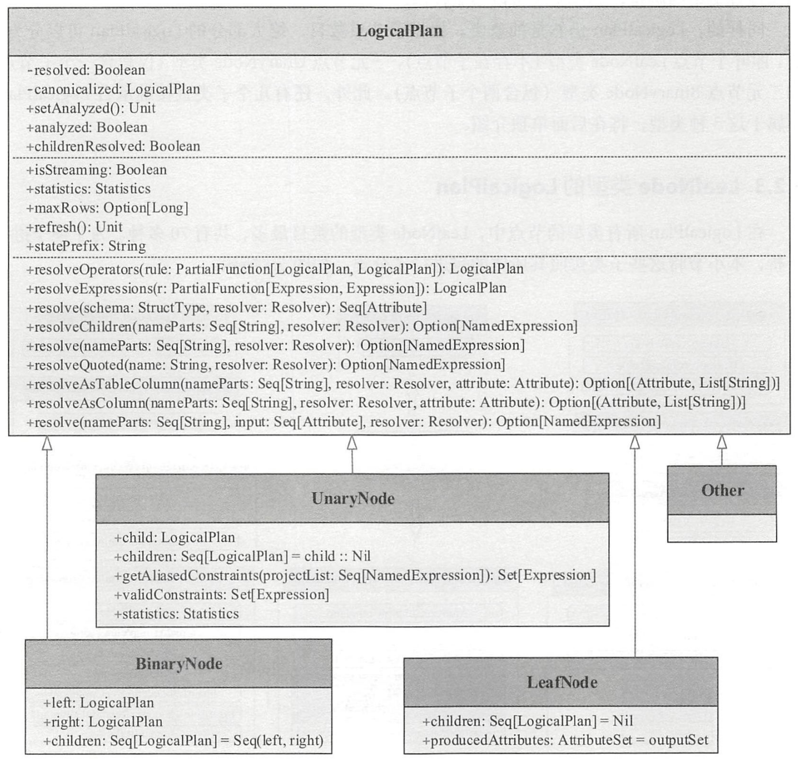

方法根据操作的内容进行了分类，前 3 个方法与 resolved 成员变量相关，其中 childrenResolved 标记子节点是否已经被解析。中间的 5 个方法设定了该 LogicalPlan 中的一些基本信息，**其中 statePrefix 重载了 QueryPlan 中的实现，如果该逻辑算子树节点未经过解析，则输出的字符串前缀会加上单引号**；isStreaming 方法用来表示当前逻辑算子树中是否包含流式数据源；statistics 记录了当前节点的统计信息，例如默认实现的 sizelnBytes 信息，一般来讲如果当前节点不包含子节点，则必须重载实现该方法；maxRows 记录了当前节点可能计算的最大行数，一般常用于 Limit 算子；refresh 方法会递归地刷新当前计划中的元数据等信息。剩下的则是 LogicalPlan 中定义的与 resolve 相关的分析方法，用来执行对数据表、表达式、schema 和列属性等类型的解析。

同样的，LogicalPlan 仍然是抽象类，根据子节点数目，**绝大部分的 LogicalPlan 可以分为 3 类，即叶子节点 LeafNode 类型（不存在子节点）、一元节点 UnaryNode 类型（仅包含一个子节点）和二元节点 BinaryNode 类型（包含两个子节点）**。此外，还有几个子类直接继承自 LogicalPlan，不属于这 3 种类型。


### 3.2.3 LeafNode 类型 LogicalPlan

在 LogicalPlan 所有类型的节点中，LeafNode 类型的数目最多，共有 70 多种，图中按照子类所属的包进行了分类。这些 LeafNode 子类中有很大一部分属于 datasources 包（对应数据表）和 command 包（对应命令），其中实现 RunnableCommand 特质的类共有 40 多个，是数量最多的 LogicalPlan 类型。

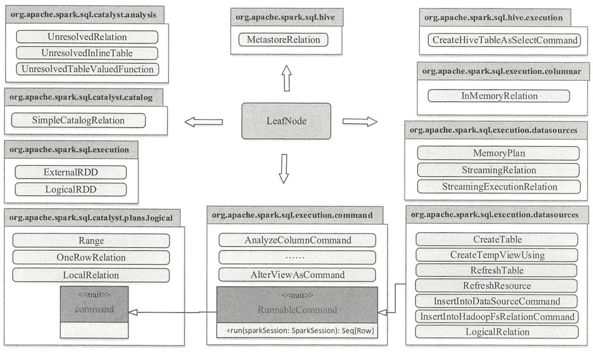

RunnableCommand 是直接运行的命令，主要涉及 12 种情形，包括 Database、Table、View、DDL、Function 和 Resource 相关命令等。以 CreateTableCommand 创建表命令为例，该命令直接调用的是 Catalog 中的 createTable 方法。

```scala
case class CreateTableCommand(
    table: CatalogTable,
    ignoreIfExists: Boolean) extends RunnableCommand {

  override def run(sparkSession: SparkSession): Seq[Row] = {
    sparkSession.sessionState.catalog.createTable(table, ignoreIfExists)
    Seq.empty[Row]
  }
}
```


### 3.2.4 UnaryNode 类型 LogicalPlan

根据节点所起的不同作用，将 UnaryNode 节点可以分为 4 个类别。

- 用来定义重分区（repartitioning）操作的 3 个 UnaryNode，即 RedistributeData 及其两个子类 SortPartitions 和 RepartitionByExpression，主要针对现有分区和排序的特点不满足的场景。
- 脚本相关的转换操作 ScriptTransformation，用特定的脚本对输入数据进行转换。
- Object 相关的操作，即 ObjectConsumer 这个特质和其他 10 个类，包括 DeserializeToObject、SerializeFromObject 和 FlatMapGroupsInR 等。
- 基本操作算子，数量最多，共有 19 种，涉及 Project、 Filter、 Sort 等各种常见的关系算子。

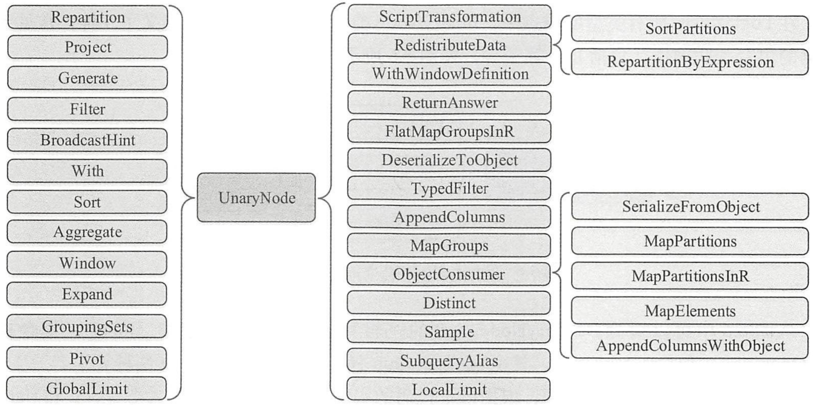

以 Sort 节点为例，其实现同样非常简单，基本上只保存了 Sort 操作中所需要的相关信息，包括排序的规则（升序或降序表达式）、是否全局等。类似的，其他基本操作对应逻辑算子的实现也比较简单。

```scala
case class Sort(
    order: Seq[SortOrder],
    global: Boolean,
    child: LogicalPlan) extends UnaryNode {
  override def output: Seq[Attribute] = child.output
  override def maxRows: Option[Long] = child.maxRows
  override def outputOrdering: Seq[SortOrder] = order
}
```


### 3.2.5 BinaryNode 类型 LogicalPlan

BinaryNode 类型的节点包括连接（Join）、集合操作（SetOperation）和 CoGroup 3 种，其中 SetOperation 包括 Except 和 Intersect 两种算子。BinaryNode 类型节点中比较复杂且重要的是 Join 算子，这部分内容会在后面单独介绍。

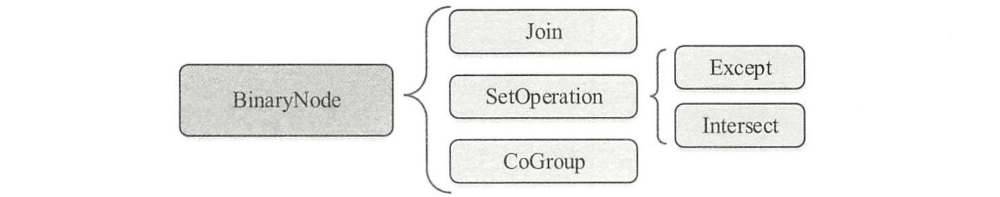


### 3.2.6 其他类型 LogicalPlan

还有 3 种直接继承自 LogicalPlan 逻辑算子节点，分别是 ObjectProducer、Union 和 EventTimeWatermark 逻辑算子。其中，EventTimeWatermark 主要针对 Spark Streaming 中的 watermark 机制，一般在 SQL 中用得不多；ObjectProducer 为特质，与前面的 ObjectConsumer 相对应，用于产生只包含 Object 列的行数据；Union 算子的使用场景比较多，其子节点数目不限，是一系列 LogicalPlan 的列表。


## 3.3 AstBuilder 机制：Unresolved LogicalPlan 生成

仍以第 1 章案例中的 SQL 语句为例，Spark SQL 首先会在 ParserDriver 中通过调用语法分析器中的 singleStatement() 方法构建整棵语法树，然后通过 AstBuilder 访问者类对语法树进行访问，其访问入口即是visitSingleStatement 方法，该方法也是访问整棵抽象语法树的启动接口。

```scala
override def visitSingleStatement(
  ctx: SingleStatementContext): LogicalPlan = withOrigin(ctx) {
    visit(ctx.statement).asInstanceOf[LogicalPlan]
}
```

从逻辑上来看，**对根节点的访问操作会递归访问其子节点**（ctx.statement，默认为 StatementDefaultContext 节点，即根节点的子节点)。这样逐步向下递归调用，直到访问某个子节点时能够构造 LogicalPlan，然后传递给父节点，因此返回的结果可以转换为 LogicalPlan 类型（注：AstBuilder 类继承基础 Visitor 类基于 AnyRef 类型，即 SglBaseBaseVisitor[AnyRef]，原因是 visit 操作既可能返回 Expression 类型，也可能返回 LogicalPlan 类型）。

当整个解析过程访问到 QuerySpecificationContext 节点时，执行逻辑可以看作两部分，如代码所示：首先访问 FromClauseContext 子树，生成名为 from 的 LogicalPlan；接下来，调用 withQuerySpecifcation 方法在 from 的基础上完成后续扩展。

```scala
// Spark 3.1.3 使用新方法：visitRegularQuerySpecification
override def visitQuerySpecification(
    ctx: QuerySpecificationContext): LogicalPlan = withOrigin(ctx) {
  val from = OneRowRelation.optional(ctx.fromClause) {
    visitFromClause(ctx.fromClause)
  }
  withQuerySpecification(ctx, from)
}
```

总的来看，生成 Unresolved LogicalPlan 的过程如图所示，从 QuerySpecificationContext 节点开始，分为以下 3 个步骤：

1. **生成数据表对应的 LogicalPlan**：访问 FromClauseContext 并递归访问，一直到匹配 TableNameContext 节点（visitTableName）时，直接根据 TableNameContext 中的数据信息生成 UnresolvedRelation，此时不再继续递归访问子节点，构造名为 from 的 LogicalPlan 并返回。
2. **生成加入了过滤逻辑的 LogicalPlan**：过滤逻辑对应 SQL 中的 where 语句，在 QuerySpecificationContext 中包含了名称为 where 的 BooleanExpressionContext 类型，对应上图中的 BooleanDefaultContext 节点。AstBuilder 会对该子树进行递归访问（如碰到 ComparisonContext 节点时会生成 GreaterThan 表达式），生成 expression 并返回作为过滤条件，然后基于此过滤条件表达式生成 Filter LogicalPlan 节点。最后，由此  LogicalPlan 和第 1 步中的 UnresolvedRelation 构造名称为 withFilter 的 LogicalPlan，其中 Filter 节点为根节点。
3. **生成加入列剪裁后的 LogicalPlan**：列剪裁逻辑对应 SQL 中 select 语句对 name 列的选择操作，即图中的最后一步操作。AstBuilder 在访问过程中会获取 QuerySpecificationContext 节点所包含的 NamedExpressionSeqContext 成员，并对其所有子节点对应的表达式进行转换，生成 NameExpression 列表（namedExpressions）；然后基于 namedExpressions 生成 Project LogicalPlan；最后，由此 LogicalPlan 和第 2 步中的 withFilter 构造名称为 withProject 的 LogicalPlan，其中 Project 最终成为整棵逻辑算子树的根节点。

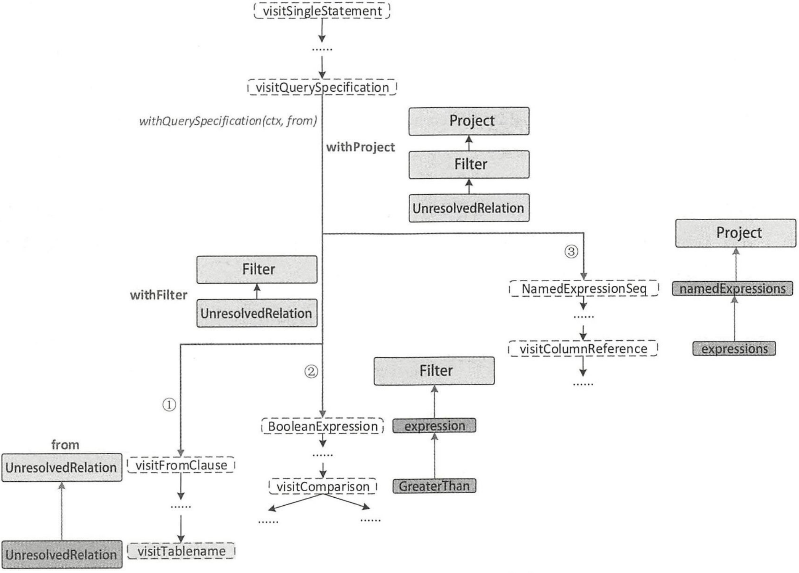

下表按照子节点为先的顺序，列出了构造 Filter 逻辑算子树节点中的 condition 表达式（where 语句）。当执行 visitColumnReference 时，会根据 ColumnReferenceContext 节点信息生成 UnresolvedAttribute 表达式，其中的常数会统一封装为 Literal 表达式。在 visitPredicated 中会检查该谓词逻辑中是否包含 predicate 语句（按照文法文件中的定义，predicate 主要表示 BETWEEN-AND、IN 和 LIKE/RLIKE 等语句），这里 SQL 不包含 predicate，因此直接返回访问其子节点（visitComparison）得到的结果。最终生成逻辑算子树 Filter 节点的 condition 构造参数为 GreaterThan 表达式，其树型结构如图（左）所示。

| 访问操作             | 返回的 Expression               |
| -------------------- | ------------------------------- |
| visitColumnReference | UnresolvedAttribute(Seq("AGE")) |
| visitIntegerLiteral  | Literal(18, IntegerType)        |
| visitComparison      | GreaterThan(left, right)        |
| visitPredicated      | GreaterThan(left, right)        |

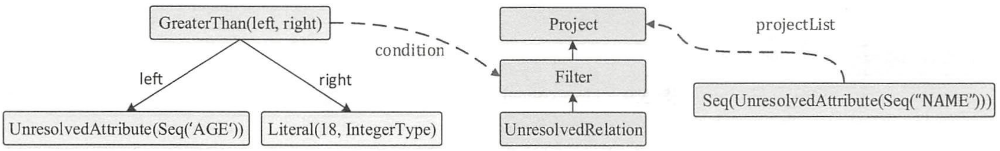

下表按照子节点为先的顺序，列出了构造 Project 逻辑算子树节点中所选取列对应的表达式。当执行 visitColumnReference 时，会对 name 列生成 UnresolvedAttribute 表达式；此时 visitPredicated 中同样不包含 predicate，因此直接返回子节点生成的表达式；最后，执行 visitNamedExpression 访问操作，该操作用于对选取的列进行命名，因为不涉及别名，这里也是直接返回子节点生成的表达式。如图 5.10（右）所示。

| 访问操作             | 返回的 Expression                |
| -------------------- | -------------------------------- |
| visitColumnReference | UnresolvedAttribute(Seq("NAME")) |
| visitPredicated      | UnresolvedAttribute(Seq("NAME")) |
| visitNamedExpression | UnresolvedAttribute(Seq("NAME")) |

总的来看，最终生成的 Unresolved LogicalPlan 完整地涵盖了 SQL 语句中的信息，对应的源码如下。

```scala
// 叶子节点UnresolvedRelation继承自LeafNode，对应未绑定元数据信息的student数据表
case class UnresolvedRelation(
    multipartIdentifier: Seq[String],
    options: CaseInsensitiveStringMap = CaseInsensitiveStringMap.empty(),
    override val isStreaming: Boolean = false)
  extends LeafNode with NamedRelation {
  import org.apache.spark.sql.connector.catalog.CatalogV2Implicits._

  // 案例中这里返回student字符串
  def tableName: String = multipartIdentifier.quoted
  override def name: String = tableName
  // output输出设定为空
  override def output: Seq[Attribute] = Nil
  // resolved属性设定为false
  override lazy val resolved = false
}
```

```scala
// 过滤节点Filter继承自UnaryNode，主要的方法都是直接调用子节点中的方法
case class Filter(condition: Expression, child: LogicalPlan)
  extends OrderPreservingUnaryNode with PredicateHelper {
  
  override def output: Seq[Attribute] = child.output
  override def maxRows: Option[Long] = child.maxRows

  // 将condition表达式中的谓词逻辑与子节点中的约束整合
  override protected lazy val validConstraints: ExpressionSet = {
    val predicates = splitConjunctivePredicates(condition)
      .filterNot(SubqueryExpression.hasCorrelatedSubquery)
    child.constraints.union(ExpressionSet(predicates))
  }
}
```

```scala
// 列剪裁节点Project继承自UnaryNode，projectList代表要选取列的列表，表达式的类型都是NamedExpression
case class Project(projectList: Seq[NamedExpression], child: LogicalPlan)
    extends OrderPreservingUnaryNode {
      
  // 直接输出projectList中的列，不需要考虑子节点的相关信息
  override def output: Seq[Attribute] = projectList.map(_.toAttribute)
  override def metadataOutput: Seq[Attribute] = Nil
  override def maxRows: Option[Long] = child.maxRows
	
  // 判断Project节点是否resolved的条件：所有表达式都已经解析，且所有子节点已经解析，且不包含特殊的表达式
  override lazy val resolved: Boolean = {
    val hasSpecialExpressions = projectList.exists ( _.collect {
        case agg: AggregateExpression => agg
        case generator: Generator => generator
        case window: WindowExpression => window
      }.nonEmpty
    )

    !expressions.exists(!_.resolved) && childrenResolved && !hasSpecialExpressions
  }

  // 将projectList对应的别名约束与子节点中的约束整合
  override lazy val validConstraints: ExpressionSet =
    getAllValidConstraints(projectList)
}
```


## 3.4 Analyzer 机制：Analyzed LogicalPlan 生成

经过上一阶段 AstBuilder 的处理，已经得到了 Unresolved LogicalPlan。 从上图中可以看到，该逻辑算子树中未被解析的有 UnresolvedRelation 和 UnresolvedAttribute 两种对象。实际上，**Analyzer 所起到的主要作用就是将这两种节点或表达式解析成有类型的（Typed）对象**。在此过程中，需要用到 Catalog 的相关信息，这也可以从 Analyzer 的构造参数看出。

### 3.4.1 Catalog 体系

在关系数据库中，Catalog 是一个宽泛的概念，通常可以理解为一个容器或数据库对象命名空间中的一个层次，主要用来解决命名冲突等问题。**在 Spark SQL 中，Catalog 主要用于各种函数资源信息和元数据信息（数据库、数据表、数据视图、数据分区与函数等）的统一管理**。Spark SQL 的 Catalog 体系涉及多个方面，不同层次所对应的关系如下图所示。

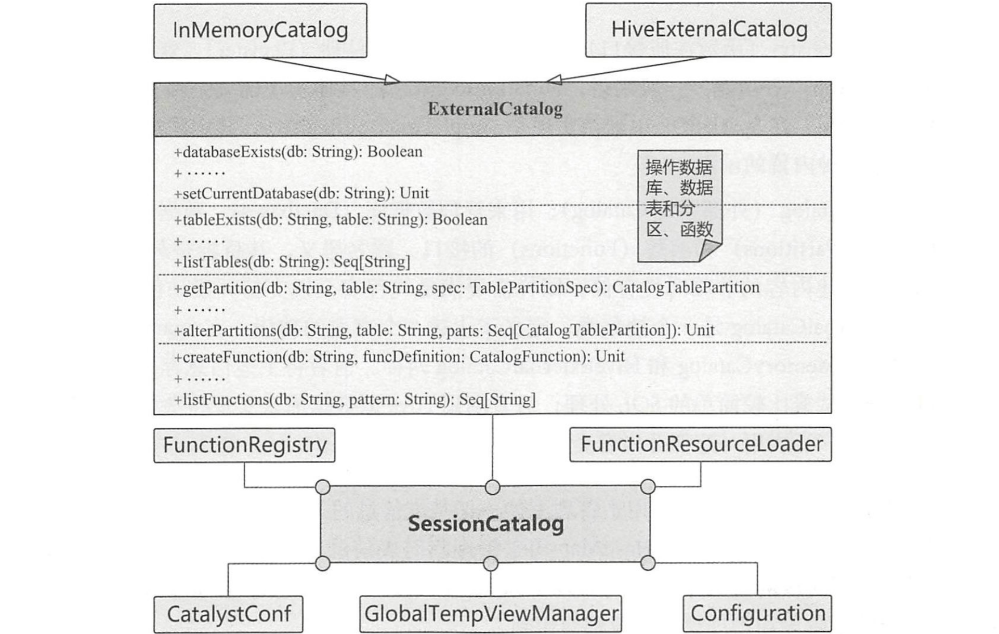

Spark SQL 中的 Catalog 体系实现以 SessionCatalog 为主体，通过 SparkSession（Spark 程序入口）提供给外部调用。一般一个 SparkSession 对应一个 SessionCatalog。 **本质上，SessionCatalog 起到了一个代理的作用，对底层的元数据信息、临时表信息、视图信息和函数信息进行了封装**。其构造参数包括 6 部分，除传入 Spark SQL 和 Hadoop 配置信息的 CatalystConf 与 Configuration 外，还涉及以下 4 方面的内容。

* **GlobalTempViewManager（全局的临时视图管理）**：**对应 DataFrame 中的 createGlobalTempView 方法，进行跨 Session 的视图管理**。GlobalTempViewManager 是一个线程安全的类，提供了对全局视图的原子操作，包括创建、更新、删除和重命名等。在 GlobalTempViewManager 内部实现中，主要功能依赖一个mutable 类型的 HashMap 来对视图名和数据源进行映射，其中的 key 是视图名的字符串，value 是视图所对应的 LogicalPlan（一般在创建该视图时生成）。需要注意的是，GlobalTempViewManager 对视图名是大小写敏感的。
*  **FunctionResourceLoader（函数资源加载器）**：在 Spark SQL 中除内置实现的各种函数外，还支持用户自定义的函数和 Hive 中的各种函数。这些函数往往通过 Jar 包或文件类型提供，**FunctionResourceLoader 主要就是用来加载这两种类型的资源以提供函数的调用**。需要注意的是，对于 Archive 类型的资源，目前仅支持在 YARN 模式下以 spark-submit 方式提交时进行加载。
* **FunctionRegistry（函数注册接口）**：**用来实现对函数的注册（Register）、查找（Lookup）和删除（Drop）等功能**。一般来讲，FunctionRegistry 的具体实现需要是线程安全的，以支持并发访问。在 Spark SQL 中默认实现是 SimpleFunctionRegistry，其中采用 Map 数据结构注册了各种内置的函数。
* **ExternalCatalog（外部系统 Catalog）**：**用来管理数据库（Databases）、数据表（Tables）、数据分区（Partitions）和函数（Functions）的接口**。其目标是与外部系统交互，并做到上述内容的非临时性存储，同样需要满足线程安全以支持并发访问。ExternalCatalog 是个抽象类，定义了上述 4 个方面的功能。在 Spark SQL 中，具体实现有 InMemoryCatalog 和 HiveExternalCatalog 两种。前者将上述信息存储在内存中，一般用于测试或比较简单的 SQL 处理；后者利用 Hive 原数据库来实现持久化的管理，在生产环境中广泛应用。

总体来看，SessionCatalog 是用于管理上述一切基本信息的入口。除上述的构造参数外，其内部还包括一个 mutable 类型的 HashMap 用来管理临时表信息，以及 currentDb 变量用来指代当前操作所对应的数据库名称。SessionCatalog 在 Spark SQL 的整个流程中起着重要的作用，在后续逻辑算子阶段和物理算子阶段都会用到。


### 3.4.2 Rule 体系

**在 Unresolved LogicalPlan 逻辑算子树的操作（如绑定、解析、优化等）中，主要方法都是基于规则（Rule）的，通过 Scala 语言模式匹配机制进行树结构的转换或节点改写**。Rule 是一个抽象类，子类需要复写 apply() 方法来制定特定的处理逻辑，基本定义如下。

```scala
abstract class Rule[TreeType <: TreeNode[_]] extends SQLConfHelper with Logging {
  // 根据类名自动推断的规则名称
  val ruleName: String = {
    val className = getClass.getName
    if (className endsWith "$") className.dropRight(1) else className
  }

  def apply(plan: TreeType): TreeType
}
```

有了各种具体规则后，还需要驱动程序来调用这些规则，在 Catalyst 中这个功能由 RuleExecutor 提供。**凡是涉及树型结构的转换过程（如 Analyzer 逻辑算子树分析过程、Optimizer 逻辑算子树的优化过程和后续物理算子树的生成过程等)，都要实施规则匹配和节点处理，都继承自 RuleExecutor[TreeType] 抽象类**，如图所示。

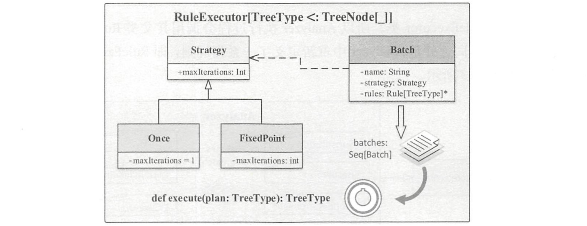

RuleExecutor 内部提供了一个 Seq[Batch]，里面定义该 RuleExecutor 的处理步骤。每个 Batch 代表一套规则，配备一个策略，该策略说明了选代次数（一次还是多次）。RuleExecutor 的 apply(plan: TreeType) 方法会按照 batches 顺序和 batch 内的 Rules 顺序，对传入的 plan 里的节点进行迭代处理，处理逻辑由具体 Rule 子类实现。

```scala
def execute(plan: TreeType): TreeType = {
  var curPlan = plan
  // ...
  
  batches.foreach { batch =>
      val batchStartPlan = curPlan
      var iteration = 1
      var lastPlan = curPlan
      var continue = true
    	curPlan = batch.rules.foldLeft(curPlan) {
          case (plan, rule) =>
        		val result = rule(plan)
        		// ...
      }
    	iteration += 1
    	if (iteration > batch.strategy.maxIterations) {
        // ...
        continue = false
      }
    	if (curPlan.fastEquals(lastPlan)) {
        continue = false
      }
    	lastPlan = curPlan
  }
  // ...
  curPlan
}
```


### 3.4.3 Analyzed LogicalPlan 生成过程

因为继承自 RuleExecutor 类，所以 Analyzer 执行过程会调用其父类 RuleExecutor 中实现的 run 方法，主要的不同之处是 Analyzer 中重新定义了一系列规则，即 RuleExecutor 类中的成员变量 batches。

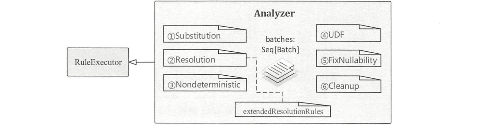

在 Spark 2.1 版本中，Analyzer 默认定义了 6 个 Batch，共有 34 条内置的规则外加额外实现的扩展规则：

1. **Batch Substitution**：作用类似于替换操作。例如，CTESubstitution 处理 With 语句，在遍历逻辑算子树的过程中，当匹配到 With(child, relations) 节点时，将子 LogicalPlan 替换成解析后的 CTE。EliminateUnions 在 Union 算子节点只有一个子节点时，消除该 Union 节点，当匹配到 Union(children) 且 children 的数目只有 1 个时，将 Union(children) 替换为 children.head 节点。
2. **Batch Resolution**：包含了 Analyzer 中最多也最常用的解析规则，以及一个 extendedResolutionRules 扩展规则列表用来支持 Analyzer 子类添加新的分析规则。这些规则涉及了常见的数据源、数据类型、数据转换和处理操作等。根据规则名称很容易看出，这些规则都针对特定的算子节点，例如 ResolveUpCast 规则用于 DataType 向 DataType的数据类型转换。
3. **Batch Nondeterministic**：仅包含 PullOutNondeterministic 一条规则，主要用来将 LogicalPlan 中非 Project 或非 Filter 算子的不确定的表达式提取出来，然后将这些表达式放在内层的 Project 算子中或最终的Project 算子中。
4. **Batch UDF**：主要用来对用户自定义函数进行一些特别的处理。例如，HandleNullInputsForUDF 规则用来处理输入数据为 Null 的情形，从上至下进行表达式的遍历，当匹配到 ScalaUDF 类型的表达式时，会创建 if 表达式来进行 Null 值的检查。
5. **Batch FixNullability**：仅包含 FixNullability 一条规则，用来统一设定 LogicalPlan 中表达式的 nullable 属性。在 DataFrame 或 Dataset 等编程接口中，用户代码对于某些列（AttribtueReference）可能会改变其 nullability 属性，导致后续的判断逻辑（如 isNull 过滤等）中出现异常结果。在 FixNullability 规则中，对解析后的 LogicalPlan 执行 transformExpressions 操作，如果某列来自于其子节点，则其 nullability 值根据子节点对应的输出信息进行设置。
6. **Batch Cleanup**：仅包含 CleanupAliases 一条规则，用来删除 LogicalPlan 中无用的别名信息。一般情況下，逻辑算子树中仅 Project、Aggregate 或 Window 算子的最高一层表达式（分别对应 project list、 aggregate expressions 和 window expressions）才需要别名。CleanupAliases 通过 trimAliases 方法对表达式执行中的别名进行删除。

第 1 步，对于上一节的 Unresolved LogicalPlan， **Analyzer 中首先匹配的是 ResolveRelations 规则**，如图所示。当遍历逻辑算子树匹配到 UnresolvedRelation 节点时，会从 SessionCatalog 中查表。实际上，该表在 SQL 查询的上一步中就已经创建好并以 LogicalPlan 类型存储在InMemoryCatalog 中，因此直接根据其表名即可得到分析后的 LogicalPlan。需要注意的是，**在 Catalog 查表后，Relation 节点上会插入一个别名节点**。此外，Relation 中列后面的数字表示下标，注意其数据类型，age 和 id 都默认设定为 Long 类型（L 字符）。

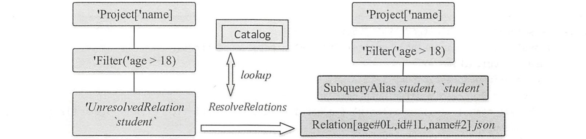

第 2 步，**执行 ResolveReferences 规则**，得到的逻辑算子树如图所示。其他节点都不发生变化，主要是 Filter 节点中的 age 信息从 Unresolved 状态变成了 Analyzed 状态（表示 Unresolved 状态的前缀字符单引号已经被去掉）。在对 Filter 表达式中的 age 属性进行分析时，因为 Filter 的子节点 Relation 已经处于 resolved 状态，因此可以成功；而在对 Project 中的表达式 name 属性进行分析时，因为 Project 的子节点 Filter 此时仍然处于 unresolved 状态（注：虽然 age 列完成了分析，但是整个 Filter 节点中还有 18 这个 Literal 常数表达式未被分析），因此解析操作无法成功，留待下一轮规则调用时再进行解析。

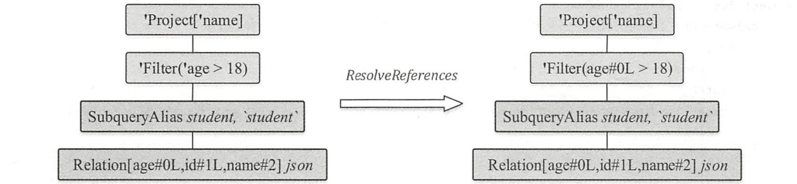

第 3 步，**调用 TypeCoercion 规则集中的 ImplicitTypeCasts 规则**，对表达式中的数据类型进行隐式转换，如图所示。因为在 Relation 中，age 列的数据类型为 Long，而 Filter 中的数值 18 在 Unresolved LogicalPlan 中生成的类型为 IntegerType， 所以需要将 18 这个常数转换为 Long 类型。经过该规则的解析操作，Filter 节点变成了 Analyzed 状态（节点字符前缀字符单引号已经被去掉）。

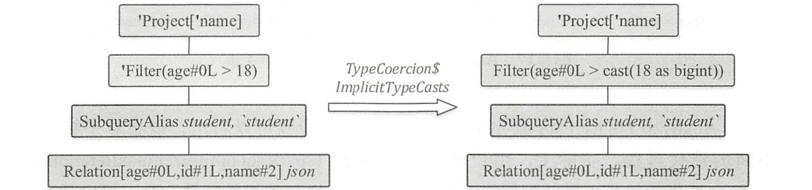

第 4 步，经过上述 3 个规则的解析之后，剩下的规则对逻辑算子树不起作用。此时逻辑算子树中仍然存在 Project  节点未被解析，接下来会进行下一轮规则的应用。**再次执行 ResolveReferences 规则**。如图所示，经过上一步 Filter 节点已经处于 resolved 状态，因此逻辑算子树中的 Project 节点能够完成解析。Project 节点的”name“被解析为”name#2“，其中 2 表示 name 在所有列中的下标。

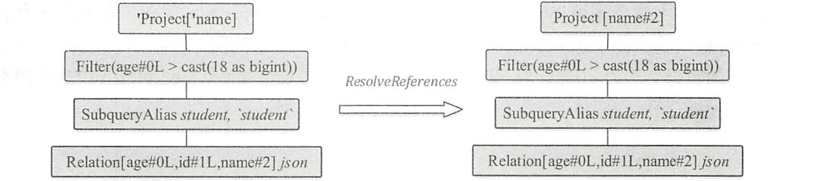

至此，Analyzed LogicalPlan 就完全生成了。从上述步骤可以看出，**逻辑算子树的解析是一个不断的迭代过程**，用户可以通过参数 (spark.sql.optimizer.maxIterations） 设定 RuleExecutor 选代的轮数，默认为 100 轮，对于某些嵌套较深的特殊 SQL，可以适当地增加轮数。


## 3.5 Spark SQL 优化器 Optimizer

### 3.5.1 Optimizer 概述

Optimizer 同样继承自 RuleExecutor 类，本身没有重载 RuleExecutor 中的 execute 方法，因此其执行过程仍然是调用其父类 RuleExecutor 中实现的 execute 方法。**与 Analyzer 类似，Optimizer 的主要机制也依赖重新定义的一系列规则，同样对应 RuleExecutor 类中的成员变量 batches**， 因此在 RuleExecutor 执行 execute 方法时会直接利用这些规则 Batch。

如图所示，Optimizer 继承自 RuleExecutor，而 SparkOptimizer 又继承自 Optimizer。Optimizer 本身定义了 12 个规则 Batch，在 SparkOptimizer 类中又添加了 4 个 Batch。

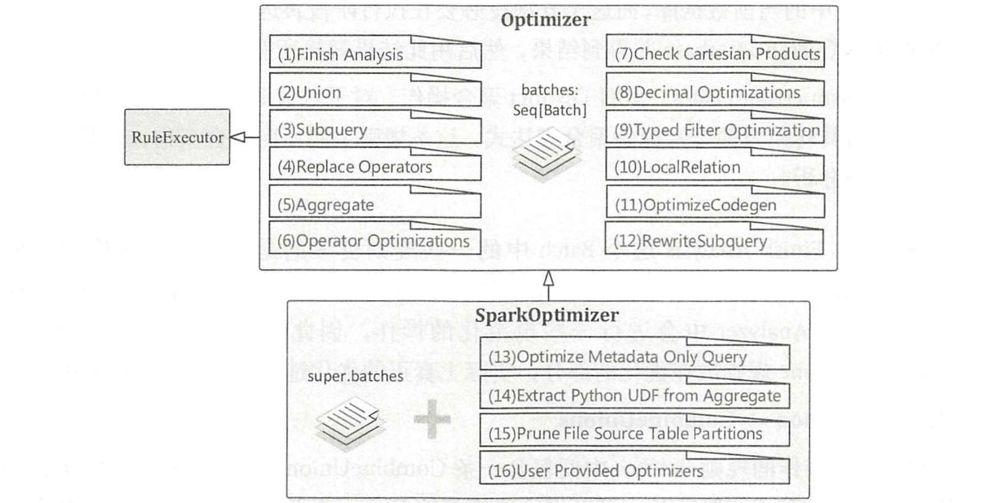


### 3.5.2 Optimizer 规则体系

1. **Batch Finish Analysis**：严格来讲，Finish Analysis Batch 中的一些规则更多是为了得到正确的结果，并不涉及优化操作，从逻辑上更应该归于 Analyzer 的分析规则中。但是考虑到 Analyzer 中会进行一些规范化的操作，因此将 EliminateSubqueryAliases 和 ComputeCurrentTime 规则放在优化的部分，实际上真正的优化过程从下一个 Batch 开始。
2. **Batch Union**：只有 CombineUnions 一条优化规则。在逻辑算子树中，当相邻的节点都是 Union 算子时，可以将这些相邻的 Union 节点合并为一个 Union 节点。在该规则中，flattenUnion 是核心方法，用栈实现子节点的合并。需要注意的是，后续的优化操作可能会将原来不相邻的 Union 节点变得相邻，因此在后面的规则 Batch 中又加入了 CombineUnions 这条规则。
3. **Batch Subquery**：只包含 OptimizeSubqueries 一条优化规则。当 SQL 语句包含子查询时，会在逻辑算子树上生成 SubqueryExpression 表达式。该优化规则在遇到SubqueryExpression 表达式时，进一步递归调用 Optimizer 对该表达式的子计划并进行优化。
4. **Batch Replace Operators**：主要用来执行算子的替换操作。在 SQL 语向中，某些查询算子可以直接改写为已有的算子，避免进行重复的逻辑转换。
5. **Batch Aggregate**：主要用来处理聚合算子中的逻辑。RemoveLiteralFromGroupExpressions 规则用来删除 Group By 语句中的常数，这些常数对于结果无影响，但会导致分组数目变多。此外，如果 Group By 语句中全部是常数，则会将其替换为一个简单的常数 0 表达式。RemoveRepetitionFromGroupExpressions 规则将重复的表达式从 Group By 语向中删除，同样对结果无影响。
6. **Batch Operator Optimizations**：包含了 Optimizer 中数量最多且最常用的各种优化规则。从整体来看，可以分为 3 个模块：算子下推（Operator Push Down）、算子组合（Operator Combine）、常量折叠与长度削减（Constant Folding and Strength Reduction）。
   * **算子下推**：数据库中常用的优化方式，所执行的优化操作主要是**将逻辑算子树中上层的算子节点尽量下推，使其靠近叶子节点，这样能够在不同程度上减少后续处理的数据量甚至简化后续的处理逻辑**。以常见的列剪裁（ColumnPruning） 优化为例，假设数据表中有 A、B、C 3 列，但是查询语句中只涉及 A、B两列，那么 ColumnPruning 将会在读取数据后剪裁出这两列。又如 LimitPushDown 优化规则，能够将LocalLimit 算子下推到 Union All 和 Outer Join 操作算子的下方，减少这两种算子在实际计算过程中需要处理的数据量。
   * **算子组合**：**将逻辑算子树中能够进行组合的算子尽量整合在一起，避免多次计算，以提高性能**。这些规则主要针对的是重分区（Repartition）、投影（Project）、过滤（Filter）、Window 、Limit 和 Union 等算子，其中 CombineUnions 在之前已经提到过。注意，这些规则主要针对的是算子相邻的情况。
   * **常量折叠与长度削减**：**对于逻辑算子树中涉及某些常量的节点，可以在实际执行之前就完成静态处理**。例如，ConstantFolding 规则对于能够 foldable（可折叠）的表达式会直接在 EmptyRow 上执行 evaluate 操作，从而构造新的 Literal 表达式；PruneFilters 规则会详细地分析过滤条件，对总是能够返回 true 或false 的过滤条件进行特别的处理。
7. **Batch Check Cartesian Products**：只有 CheckCartesianProducts 一条优化规则。用来检测逻辑算子树中是否存在笛卡儿积类型的 Join 操作。如果存在，而 SQL 语句中没有显示地使用 cross join 表达式，则会抛出异常。该规则必须在 ReorderJoin 规则执行之后才能执行，确保所有的 Join 条件收集完毕。需要注意的是，当 spark.sql.crossJoin.enabled 参数设置为 true 时，该规则会被忽略。
8. **Batch Decimal Optimizations**：只有 DecimalAggregates 一条优化规则，用于处理聚合操作中与 Decimal 类型相关的问题。一般情况下，如果聚合查询中涉及浮点数的精度处理，性能就会受到很大影响。对于固定精度的 Decimal 类型，该规则将其当作 unscaled Long 类型来执行，这样可以加速聚合操作的速度。
9. **Batch Typed Filter Optimization**：只有 CombineTypedFilters 一条优化规则，用求对特定情况下的过滤条件进行合并。当逻辑算子树中存在两个 TypedFilter 过滤条件且针对同类型的对象条件时，该规则会将它们合并到同一个过滤函数中。
10. **Batch LocalRelation**：主要用来优化与 LocalRelation 相关的逻辑算子树。 ConvertToLocalRelation 优化规则将 LocalRelation 上的本地操作（不涉及数据交互）转换为另一个 LocalRelation，目前该规则实现较为简单，仅处理 Project 投影操作。PropagateEmptyRelation 优化规则会将包含空的 LocalRelation 进行折叠。
11. **Batch OptimizeCodegen**：只有 OptimizeCodegen 一条优化规则，用来对生成的代码进行优化。该规则主要针对的是 case when 语句，当 case when 语句中的分支数目不超过配置中的最大数目时，该表达式才能执行代码生成。
12. **Batch RewriteSubquery**：主要用来优化子查询。例如，RewritePredicateSulbquery 将特定的子查询谓词逻辑转换为 left-semi/anti join 操作。其中，EXISTS 和 NOT EXISTS 算子分别对应 semi 和 anti 类型的 Join，过滤条件会被当作 Join 的条件；IN 和 NOT IN 也分别对应 semi 和 anti 类型的 Join，过滤条件和选择的列都会被当作 join 的条件。
13. **Batch Optimize Metadata Only Query**：该 Batch 仅执行一次，只有 OptimizeMetadataOnlyQuery 一条规则，用来优化执行过程中只需查找分区级别元数据的语句。需要注意的是，该规则适用于扫描的所有列都是分区列且包含聚合算子的情形，而且聚合算子需要满足以下情况之一：聚合表达式是分区列；分区列的聚合函数有 DISTINCT 算子；分区列的聚合函数中是否有 DISTINCT 算子不影响结果。
14. **Batch Extract Python UDF From Aggregate**：仅执行一次，只有 ExtractPythonUDFFromAggregate 一条规则，用来提取出聚合操作中的 Python UDF 函数。该规则主要针对的是采用 PySpark 提交查询的情形，将参与聚合的 Pyhon 自定义函数提取出来，在聚合操作完成之后再执行。
15. **Batch Prune File Source Table Partitions**：仅执行一次，只有 PruneFileSourcePartitions 一条规则，用来对数据文件中的分区进行剪裁操作。当数据文件中定义了分区信息且逻辑算子树中的 LogicalRelation 节点上方存在过滤算子时，该规则会尽可能地将过滤算子下推到存储层，这样可以避免读入无关的数据分区。
16. **Batch User Provided Optimizers**：用于支持用户自定义的优化规则，其中 experimentalMethods 的 extraOptimizations 队列默认为空。可以看到，Spark SQL 在逻辑算子树的转换阶段是高度可扩展的，用户只需要继承 Rule[LogicalPlan] 虚类，实现相应的转换逻辑就可以注册到优化规则队列中执行。


### 3.5.3 Optimized LogicalPlan 生成过程

第 1 步，对于上一节的 Analyzed LogicalPlan，执行 Finish Analysis Batch 中的 EliminateSubqueryAliases 优化规则，用来消除子查询别名的情形。该规则实现非常简单，直接将 SubqueryAlias 逻辑算子树节点替换为其子节点。经过优化后的逻辑算子树如图所示，可见 SubqueryAlias 节点被删除，Fiter 节点直接作用于 Relation 节点。

```scala
// 从计划中删除[[SubqueryAlias]]操作符。子查询仅需要为属性提供作用域信息，并且在分析完成后可以删除。
object EliminateSubqueryAliases extends Rule[LogicalPlan] {
  def apply(plan: LogicalPlan): LogicalPlan = AnalysisHelper.allowInvokingTransformsInAnalyzer {
    plan transformUp {
      case SubqueryAlias(_, child) => child
    }
  }
}
```

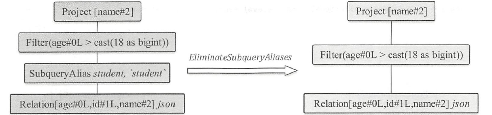

第 2 步，执行 Operator Optimizations Batch 中的 InferFiltersFromConstraints 优化规则，用来增加过滤条件。该规则会对当前节点的约束条件进行分析，生成额外的过滤条件列表，这些过滤条件不会与当前算子或其子节点现有的过滤条件重叠。经过优化后的逻辑算子树如图所示，Filter 逻辑算子树节点中多了 isnotnull(age#0L) 这个过滤条件。该过滤条件来自于 Filter 中的约束信息，用来确保筛选出来的数据 age 字段不为 null。

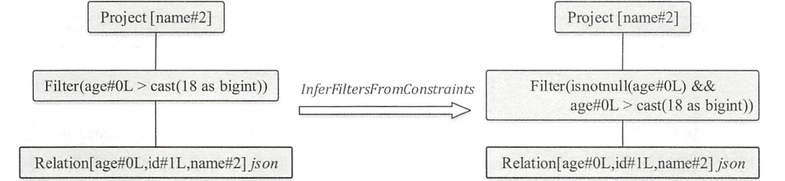

第 3 步，执行 Operator Optimizations Batch 中的 ConstantFolding 优化规则，对 LogicalPlan 中可以折叠的表达式进行静态计算直接得到结果，简化表达式。经过优化后的逻辑算子树如图所示，Filter 过滤条件中的 cast(18, bigint) 表达式经过计算成为 Literal(18, bigint) 表达式，即输出的结果为 18。

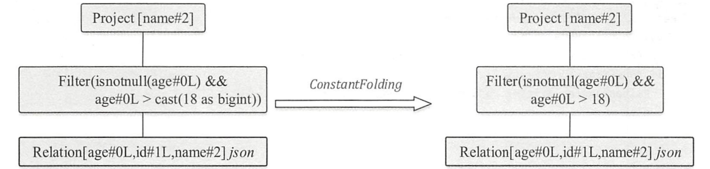

经过上述步骤，Spark SQL 逻辑算子树生成、分析与优化的整个阶段都执行完毕。最终生成的逻辑算子树包含 Relation、Filter 和 Project 节点，同时每个节点中又包含了由对应表达式构成的树。该逻辑算子树将作为 Spark SQL 中生成物理算子树的输入，开始下一个阶段。


# 4. Spark SQL 物理计划

物理计划阶段是 Spark SQL 整个查询处理流程的最后一步。**不同于逻辑计划的平合无关性，物理计划是与底层平合紧密相关的**。在此阶段，Spark SQL 会对生成的逻辑算子树进行进一步处理，得到物理算子树，并将 LogicalPlan 节点及其所包含的各种信息映射成 Spark Core 计算模型的元素，如 RDD、Transformation 和 Action 等，以支特其提交执行。

## 4.1 物理计划概述

从 Optimized LogicalPlan 传入到 Spark SQL 物理计划提交并执行，主要经过 3 个阶段。这 3 个阶段分别产生 Iterator[PhysicalPlan]、SparkPlan 和 Prepared SparkPlan，其中 Prepared SparkPlan 可以直接提交并执行（PhysicalPlan 和 SparkPlan 均表示物理计划）。

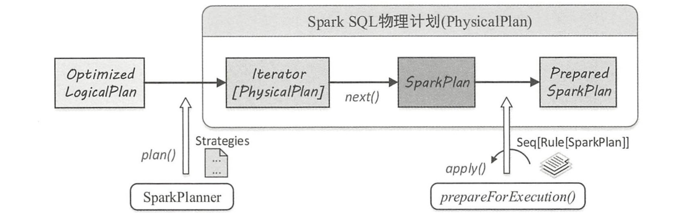

1. **由 SparkPlanner 将各种物理计划策略 (Strategy）作用于对应的 LogicalPlan 节点上，生成 SparkPlan 列表（一个 LogicalPlan 可能产生多种 SparkPlan)**。
2. **选取最佳的 SparkPlan**，在 Spark 2.1 版本中的实现较为简单，在候选列表中直接用 next() 方法获取第一个。
3. **提交前进行准备工作，进行一些分区排序方面的处理，确保 SparkPlan 各节点能够正确执行，这一步通过 prepareForExecution() 方法调用若干规则（Rule）进行转换**。


## 4.2 SparkPlan 简介

在物理算子树中，**叶子类型的 SparkPlan 节点负责“从无到有”地创建RDD，每个非叶子类型的 SparkPlan 节点等价于在 RDD上进行一次 Transformation，即通过调用 execute() 函数转换成新的 RDD，最终执行 collect() 操作触发计算，返回结果给用户**。如图所示，SparkPlan 在对 RDD 做 Transformation 的过程中除对数据进行操作外，还可能对 RDD 的分区做调整。此外，**SparkPlan 除实现 execute 方法外，还有一种情况是直接执行 executeBroadcast 方法，将数据广播到集群上**。

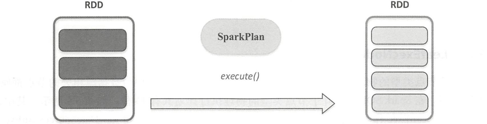

SparkPlan 的主要功能可以划分为 3 大块。首先，每个 SparkPlan 节点必不可少地会记录其元数据（Metadata）与指标（Metric）信息，这些信息以 KV 的形式保存在 Map 数据结构中，统称为 SparkPlan 的 **Metadata 与 Metric 体系**。其次，在对 RDD 进行 Transformation 操作时，会涉及数据分区（Partitioning）与排序 （Ordering）的处理，称为 SparkPlan 的 **Partitioning 与 Ordering 体系**。最后，SparkPlan 作为物理计划，支持提交到 Spark Core 去执行，即 SparkPlan 的执行操作部分，**以 execute 和 executeBroadcast 方法为主**。此外，SparkPlan 中还定义了一些辅助函数，如创建新谓词的 newPredicate 等。

SparkPlan 的具体实现，涉及数据源 RDD 的创建和各种数据处理等，可以大致将其分为 4 类：LeafExecNode、 UnaryExecNode、BinaryExecNode 和其他不属于这 3 种子节点的类型。

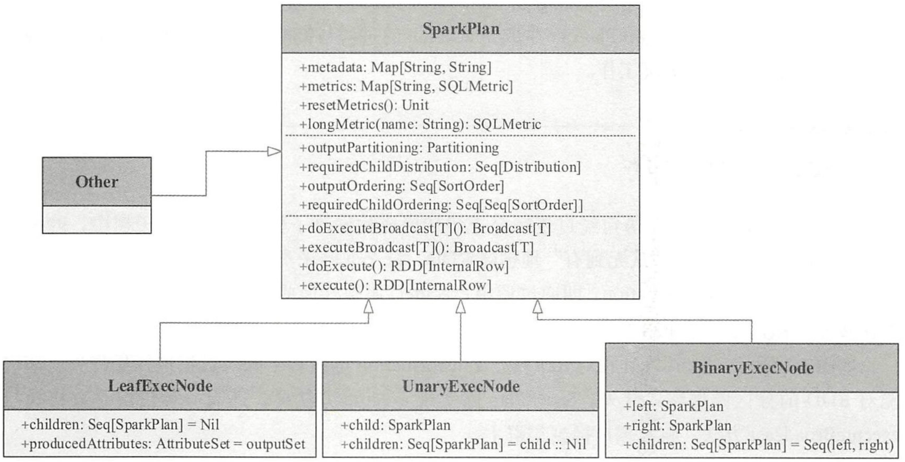


### 4.2.1 LeafExecNode 类型

叶子节点类型的物理执行计划不存在子节点，**物理执行计划中与数据源相关的节点都属于该类型**。如图所示。其中，DataSourceScanExec 作为基类，具体的实现包括 FileSourceScanExec 和 RawDataSourceScanExec 两种。

LeafExecNode 类型的 SparkPlan **负责对初始 RDD 的创建**。例如，RangeExec 会利用 SparkContext 中的 parallelize 方法生成给定范围内的 64 位数据的 RDD，HiveTableScanExec 会根据 Hive 数据表存储的 HDFS 信息直接生成 HadoopRDD，FileSourceScanExec 根据数据表所在的源文件生成 FileScanRDD。

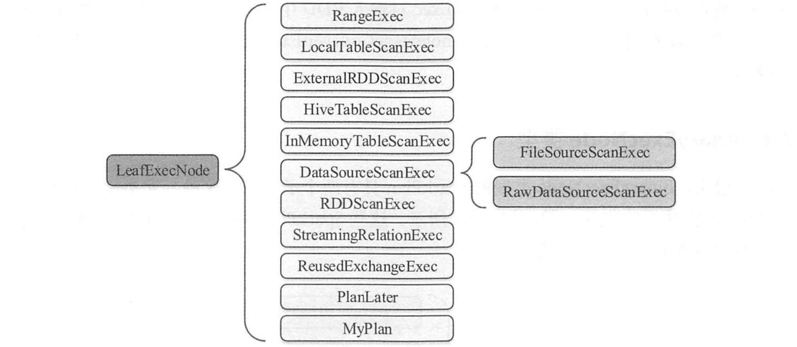


### 4.2.2 UnaryExecNode 类型

UnaryExecNode 类型的物理执行计划的节点是一元的，意味着只包含 1 个子节点。如图所示，UnaryExecNode 类型的物理计划是数量最多的类型，**主要作用是对 RDD 进行转换操作**。例如，ProjectExec 和 FilterExec 分别对子节点产生的 RDD 进行列剪裁与行过滤操作。Exchange 负责对数据进行重分区，SampleExec 对输入 RDD 中的数据进行采样，SortExec 按照一定条件对输入 RDD 中数据进行排序，WholeStageCodegenExec 将生成的代码整合成单个 Java 函数。

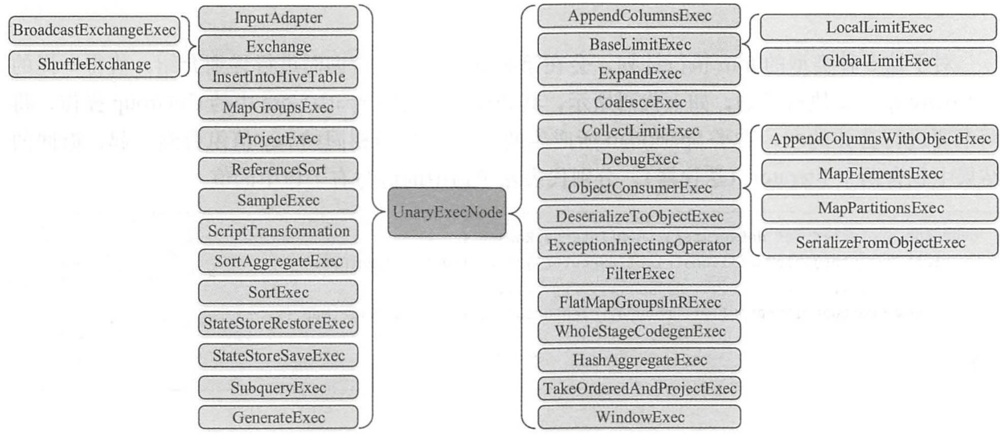


### 4.2.3 BinaryExecNode 类型

BinaryExecNode 类型的 SparkPlan 具有两个子节点。如图所示，除 CoGroupExec 外，其余的都是不同类型的 Join 执行计划（后续介绍）。CoGroupExec 处理逻辑类似 Spark Core 中的 CoGroup 操作，将两个要进行合并的左、右子 SparkPlan 所产生的 RDD，按照相同的 key 值组合到一起，返回的结果中包含两个 Iiterator（选代器），分别代表左子树中的值与右子树中的值。

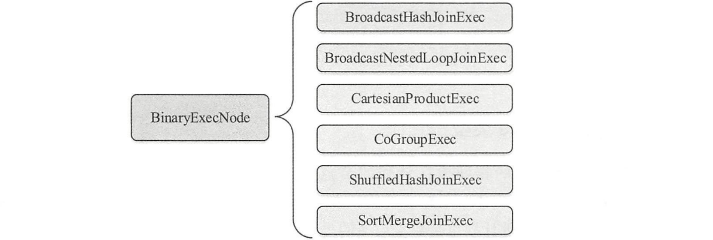


### 4.2.4 其他类型的 SparkPlan

除上述 3 种类型的 SparkPlan 外，还有其他类型的物理执行计划。如图所示，除 CodeGenSupport 和 UnionExec 外，其他几种用到的场景并不多见。例如，DummySparkPlan、 FastOperator 和 MyPlan 均出现在单元测试中，其中 DummySparkPlan 对每个成员赋予默认值，MyPlan 则用于在 Driver 端更新 Metric 信息。

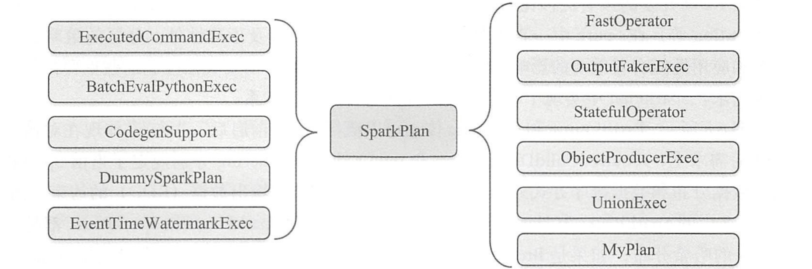


## 4.3 Metadata 与 Metrics 体系

元数据和指标信息是性能优化的基础，SparkPlan 提供了 Map 类型的数据结构来存储相关信息，以便更加详细地刻画 SparkPlan 细节。默认情况下，SparkPlan 中这两个 Map 的值均为空。

**元数据信息 Metadata 对应 Map 中的 key 和 value 都为字符串类型。一般情況下，元数据主要用于描述数据源的一些基本信息，例如数据文件的格式、存储路径等**。目前只有 FileSourceScanExec 和 RowDataSourceScanExec 两种叶子节点类型的 SparkPlan 对其进行了重载实现。

**指标信息 Metrics 对应 Map 中的 key 为字符串类型，而 value 是 SQLMetrics 类型。在 Spark 执行过程中，Metrics 能够记录各种信息，为应用的诊断和优化提供基础**。例如，FilterExec 中添加了 numOutputRows 指标，记录输出的数据数目，该指标会随着对应的 SparkPlan 执行而计算；ShuffleExchange 中添加了 dataSize 指标，能够记录进行重新分区操作过程中的数据总量。

在对 Spark SQL 进行定制时，用户可以自定义一些指标，并将这些指标显示在 UI 上。定义越多的指标会得到越详细的信息；但是指标信息要随着执行过程而不断更新，会导致额外的计算，在一定程度上影响性能。


## 4.4 Partitioning 与 Ordering 体系

Partitioning 和 Ordering 体系“承前启后”。“承前”体现在对输入数据特性的需求上，requiredChildDistribution 和requiredChildOrdering 分别规定了当前 SparkPlan 所需的数据分布和数据排序方式列表，本质上是对所有子节点输出数据（RDD）的约束。例如，假设图中 SparkPlan2 为 Hash 类型的 Join，那么就需要 SparkPlan0 和  SparkPlan1 都是基于相同 key 的哈希分布；如果是 Broadcast 类型的 Join，那么必有一个为广播变量数据分布。“启后“体现在对输出数据的操作上，outputPartitioning 定义了当前 SparkPlan 对输出数据（RDD）的分区操作，outputOrdering 则定义了每个数据分区的排序方式。考虑到 Ordering 体系仅涉及排序，实现较为简单，这里不展开分析，内容聚焦在 Partitioning 体系的实现上。

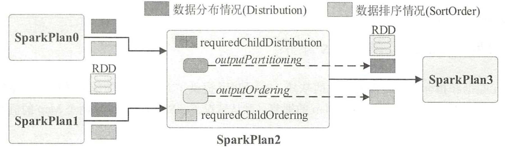


### 4.4.1 Distribution 与 Partitioning

在 SparkPlan 分区体系实现中，Partitioning 表示对数据进行分区的操作，Distribution 则表示数据的分布，两者均被定义为接口，其具体实现有多个类，如图所示。

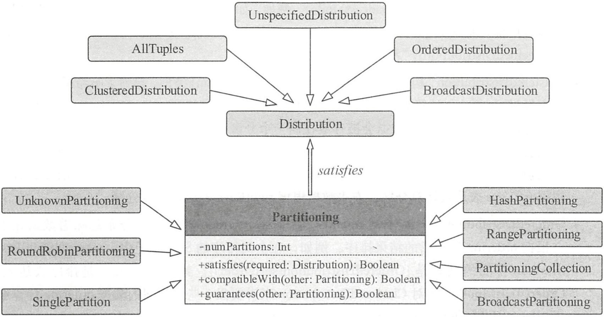

Distribution 定义了查询执行时，同一个表达式下的不同数据元组（Tuple）在集群各个节点上的分布情况。具体来讲，Distribution 可以用来描述以下两种不同粒度的数据特征。

* 节点间（Inter-node）分区信息，即数据元组在集群不同的物理节点上是如何分区的。这个特性可以用来判断某些算子（例如 Aggregate）能否进行局部计算（Partial operation），避免全局操作的代价。

* 分区数据内（Intra-partition）排序信息，即单个分区内数据是如何分布的。

Distribution 接口的主要实现如下：

* **UnspecifiedDistribution**：未指定分布，无需确定数据元组之间的位置关系。
* **AIlTuples**：只有一个分区，所有的数据元组存放在一起 。例如，选取全局前 K 条数据的 GlobalLimit 算子，requiredChildDistribution 得到的列表就是 [AIlTuples]，表示执行该算子需要全部的数据参与。
* **BroadcastDistribution**： 广播分布，数据会被广播到所有书点上，构造参数 mode 为广播模式（BroadcastMode)，广播模式可以为原始数据（Identity BroadcastMode） 或转换为 HashedRelation 对象(HashedRelation BroadcastMode）。
* **ClusteredDistribution**：构造参数 clustering 是 Seq[Expression] 类型，起到了哈希函数的效果，数据经过 clustering 计算后，相同 value 的数据元组会被存放在一起。如果有多个分区的情况，则相同数据会被存放在同一个分区中；如果只能是单个分区，则相同的数据会在分区内连续存放。
* **OrderedDistribution**：构造参数 ordering 是 Seq[SortOrder] 类型，意味着数据元组会根据 ordering 计算后的结果排序。OrderedDistribution 相对 ClusteredDistribution 来讲要强一些，相同的数据 ordering 计算结果相同，因此能够保持连续性并被划分到相同分区中。


Partitioning 定义了一个物理算子输出数据的分区方式，具体包括子 Partitioning 之间、目标 Partitioning 和 Distribution 之间的关系。具体来讲，Partitioning 描述了 SparkPlan 中进行分区的操作，类似直接采用 API 进行 RDD 的 repartition 操作。如图所示，Partitioning 接口中包含 1 个成员变量和 3 个函数来进行分区操作。

* **numPartitions**：指定该 SparkPlan 输出 RDD 的分区数目。
* **satisfies(required: Distribution)**：当前的 Partitioning 操作能否得到所需的数据分布。当不满足时（结果为 false），一般需要进行 repartition 操作，对数据进行重新组织。
* **compatibleWith(other: Partitioning)**：当存在多个子节点时，需要判断不同的子节点的分区操作是否兼容。直观地看，只有当两个 Partitioning 能够将相同 key 的数据分发到相同的分区时，才能够兼容。
* **guarantees(other: Partitioning)**：如果 A.gurantees(B) 能够为真，那么任何 A 进行分区操作所产生的数据行也能够被 B 产生。这样，B 就不需要再进行重分区操作。该方法主要用求避免冗余的重分区操作带来的性能代价。在默认情况下，一个 Partitioning 仅能够保证等于它本身的 Partitioning（相同的分区数目和相同的分区策略等）。

Partitioning 接口的具体实现也有多种，如表所示。

| 分区方式               | 操作描述                              |
| ---------------------- | ------------------------------------- |
| UnknownPartitioning    | 不进行分区                            |
| RoundRobinPartitioning | 在 1 - numPartitions 范围内轮询式分区 |
| HashPartitioning       | 基于哈希的分区方式                    |
| RangePartitioning      | 基于范围的分区方式                    |
| PartitioningCollection | 分区方式的集合，描述物理算子的输出    |


### 4.4.2 SparkPlan 常用分区排序操作

作为抽象类，在 SparkPlan 默认实现中，将 outputPartitioning 设置为 UnknownPartitioning(0)，将 requiredChildDistribution 设置为 Seq[UnspecifiedDistribution]，且在数据有序性和排序操作方面不涉及任何动作。本小节对案例中涉及的几个 SparkPlan 的分区排序操作进行简要介绍。

1. **数据文件扫描执行算子（FileSourceScanExec）**

   作为物理执行树中的叶子节点，FileSourceScanExec 中的分区排序信息会根据数据文件构造的初始 RDD 进行设置。如果没有 bucket 信息，则分区与排序操作将分别为最简单的 UnknownPartitioning 与 Nil；当且仅当输入文件信息中满足特定的条件（代码中 sortColumns 非空等）时，才会构造 HashPartitioning 与 Sortorder 类。

2. **过滤执行算子（FilterExec）与列剪裁执行算子（ProjectExec）**

   ```scala
   case class FilterExec(condition: Expression, child: SparkPlan)
     extends UnaryExecNode with CodegenSupport with PredicateHelper {
       // ...
     override def outputOrdering: Seq[SortOrder] = child.outputOrdering
     override def outputPartitioning: Partitioning = child.outputPartitioning
   }
   
   case class ProjectExec(projectList: Seq[NamedExpression], child: SparkPlan)
     extends UnaryExecNode with CodegenSupport {
     // ...
     override def outputOrdering: Seq[SortOrder] = child.outputOrdering
     override def outputPartitioning: Partitioning = child.outputPartitioning
   }
   ```

   在过滤执行算子与列剪裁执行算子中，分区与排序的方式仍然沿用其子节点的方式，即不对 RDD 的分区与排序进行任何的重新操作。

   通常情况下，LeafExecNode 类型 SparkPlan 会根据数据源本身的特点（包括分块信息和数据有序性特征）构造 RDD 与对应的 Partitioning 和 Ordering 方式， UnaryExecNode 类型 SparkPlan 大部分会沿用其子节点的 Partitioning 与 Ordering 方式（SortExec 等本身具有排序操作的执行算子例外），而 BinaryExecNode 往往会根据两个子节点的情况综合考虑，具体可以参见 SortMergeJoinExec 等执行算子的源码实现。


## 4.5  SparkPlan 生成

在 Spark SQL 中，当逻辑计划处理完毕后，会构造 SparkPlanner 并执行 plan() 方法对 LogicalPlan 进行处理，得到对应的物理计划。实际上，一个逻辑计划可能会对应多个物理计划，因此，SparkPlanner 得到的是一个物理计划的列表（Iterator[SparkPlan]）。

如图所示，SparkPlanner 继承自 SparkStrategies 类，而 SparkStrategies 类则继承自 QueryPlanner 基类，重要的 plan() 方法实现就在 QueryPlanner 类中。**SparkStrategies 类本身不提供任何方法，而是在内部提供一批 SparkPlanner 会用到的各种策略（Strategy）实现。最后，在 SparkPlanner 层面将这些策略整合在一起，通过 plan() 方法进行逐个应用**。

类似逻辑计划阶段的 Anaylzer 和 Optimizer， SparkPlanner 本身只是一个逻辑的驱动，各种策略的 apply 方法把逻辑执行计划算子映射成物理执行计划算子。在 SparkPlanner 的调用逻辑和各种策略中，PlanLater 随处可见。根据其实现，**PlanLater 本身也是 SparkPlan 的一种，区别在于 doExecute() 方法没有实现，表示不支持执行，所起到的作用仅仅是占位，等待后续步骤处理**。

```scala
case class PlanLater(plan: LogicalPlan) extends LeafExecNode {
  
  override def output: Seq[Attribute] = plan.output

  protected override def doExecute(): RDD[InternalRow] = {
    throw new UnsupportedOperationException()
  }
}
```

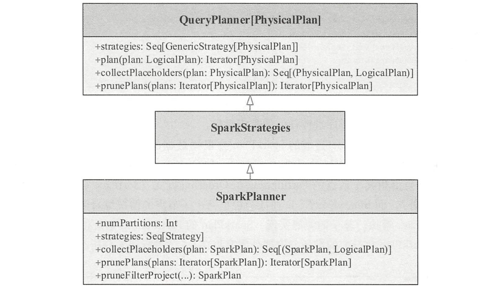

生成物理计划的实现代码如下，plan() 方法传入 LogicalPlan 作为参数，将 strategies 应用到 LogicalPlan，生成物理计划候选集合（Candidates）。如果该集合中存在 PlanLater 类型的 SparkPlan，则通过 placeholder 中间变量取出对应的 LogicalPlan 后，递归调用 plan() 方法，将 PlanLater 替换为子节点的物理计划。最后，对物理计划列表进行过滤，去掉一些不够高效的物理计划。

```scala
abstract class QueryPlanner[PhysicalPlan <: TreeNode[PhysicalPlan]] {
  // planner可以使用的执行策略列表 
  def strategies: Seq[GenericStrategy[PhysicalPlan]]

  def plan(plan: LogicalPlan): Iterator[PhysicalPlan] = {
    // 收集物理计划候选项
    val candidates = strategies.iterator.flatMap(_(plan))

    // 候选项可能包含标记为[[planLater]]的占位符，因此尝试用它们的子计划替换它们
    val plans = candidates.flatMap { candidate =>
      val placeholders = collectPlaceholders(candidate)

      if (placeholders.isEmpty) {
        // 保留候选项，因为它不包含占位符
        Iterator(candidate)
      } else {
        // 计划标记为[[planLater]]的逻辑计划，并替换占位符
        placeholders.iterator.foldLeft(Iterator(candidate)) {
          case (candidatesWithPlaceholders, (placeholder, logicalPlan)) =>
            // 为占位符Plan逻辑计划
            val childPlans = this.plan(logicalPlan)

            candidatesWithPlaceholders.flatMap { candidateWithPlaceholders =>
              childPlans.map { childPlan =>
                // 用子计划替换占位符
                candidateWithPlaceholders.transformUp {
                  case p if p.eq(placeholder) => childPlan
                }
              }
            }
        }
      }
    }

    val pruned = prunePlans(plans)
    assert(pruned.hasNext, s"No plan for $plan")
    pruned
  }

  // 通过[[strategies]]收集使用[[GenericStrategy#planLater planLater]]标记的占位符
  protected def collectPlaceholders(plan: PhysicalPlan): Seq[(PhysicalPlan, LogicalPlan)]

  // 修剪不良计划以防止组合爆炸
  protected def prunePlans(plans: Iterator[PhysicalPlan]): Iterator[PhysicalPlan]
}
```

实际上，Spark SQL 在物理计划生成方面还有很多工作要做，例如，对生成的物理计划列表进行过滤筛选(prunePlans） 在当前版本中并没有实现，生成多个物理计划后，仅仅是直接选取列表中的第一个作为最终结果（参见 QueryExecution 类中 sparkPlan 的生成代码）。


### 4.5.1 物理计划 Strategy 体系

物理计划执行策略的构成如图所示。所有的策略都继承自 GenericStrategy 类，其中定义了 planLater 和 apply 方法；SparkStrategy 继承自 GenericStrategy 类，对其中的 planLater 进行了实现，根据传入的 LogicalPlan 直接生成前述提到的 PlanLater 节点。此外，在 Spark SQL 中，**Strategy 是 SparkStrategy 类的别名**。

最后，各种具体的 Strategy 都实现了apply 方法，将传入的 LogicalPlan 转换为 SparkPlan 的列表。如果当前的执行策略无法应用于该 LogicalPlan 节点，则返回的物理执行计划列表为空。因此，Strategy 是生成物理算子树的基础。

```scala
// 给定一个[[LogicalPlan]]，返回可以用于执行的PhysicalPlan列表。如果该策略不适用于给定的逻辑操作，则应返回一个空列表
abstract class GenericStrategy[PhysicalPlan <: TreeNode[PhysicalPlan]] extends Logging {
  // 返回一个执行plan的物理计划的占位符，这个占位符将由QueryPlanner自动使用其他可用的执行策略来填充
  protected def planLater(plan: LogicalPlan): PhysicalPlan

  def apply(plan: LogicalPlan): Seq[PhysicalPlan]
}

// 将逻辑计划转换为零个或多个SparkPlans
abstract class SparkStrategy extends GenericStrategy[SparkPlan] {
  override protected def planLater(plan: LogicalPlan): SparkPlan = PlanLater(plan)
}

case class PlanLater(plan: LogicalPlan) extends LeafExecNode {
  override def output: Seq[Attribute] = plan.output

  protected override def doExecute(): RDD[InternalRow] = {
    throw new UnsupportedOperationException()
  }
}
```

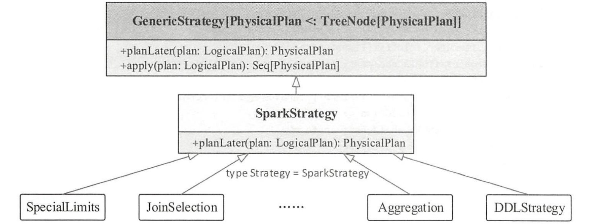

在实现上，**各种 Strategy 会匹配传入的 LogicalPlan 节点，根据节点或节点组合的不同情形实行一对一的映射或多对一的映射**。一对一的映射方式比较直观，以 BasicOperators 为例，该 Strategy 实现了各种基本操作的转换，其中列出了大量的映射关系，包括 Sort 对应 SortExec、Union 对应 UnionExec 等。多对一的情况涉及对多个 LogicalPlan 节点进行组合转换，这里称为逻辑算子树的模式匹配。目前在Spark SQL 中，逻辑算子树的节点模式共有 4 种，如图所示。

* **ExtractEquiJoinKeys**：针对具有相等条件的 Join 操作的算子集合，提取出其中的 Join 条件、左子节点和右子节点等信息。
* **ExtractFiltersAndInnerJoins**：收集 Inner 类型 Join 操作中的过滤条件，目前仅支持对左子树进行处理。
* **PhysicalAggregation**：针对聚合操作，提取出聚合算子中的各个部分，并对一些表达式进行初步的转换。
* **PhysicalOperation**：匹配逻辑算子树中的 Project 和 Filter 等节点，返回投影列、过滤条件集合和子节点。

图中对 PhysicalOperation 模式进行了展示，如果匹配到 Project、 Filter 或 BroadcastHint 3 种类型之一的 LogicalPlan 时，就会递归查找子节点。若子节点也是这 3 种类型之一，则收集节点中的投影列或过滤条件。依此类推，直到碰到其他类型的 LogicalPlan 节点为止。

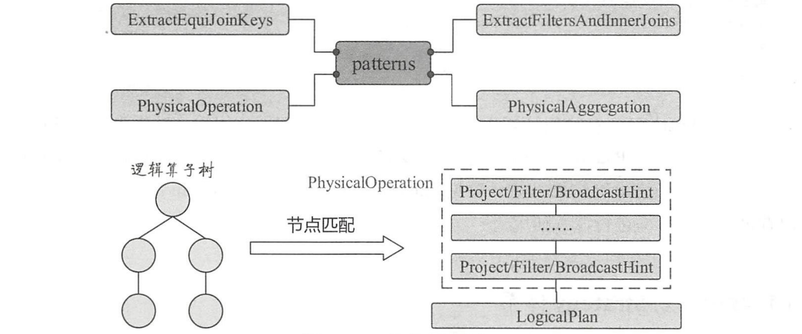


### 4.5.2 常见 Strategy 分析

在 SparkPlanner 中默认添加了 8 种 Strategy 来生成物理计划。FileSourceStrategy 与 DataSourceStrategy 主要针对数据源，Aggregation 与 JoinSelection 分别针对聚合与关联操作，BasicOperators 涉及范围最广，包含了过滤、投影等各种操作。

| 物理计划生成策略   | 策略描述                  |
| ------------------ | ------------------------- |
| FileSourceStrategy | 数据文件扫描计划          |
| DataSourceStrategy | 各种数据源相关的计划      |
| DDLStrategy        | DDL 操作执行计划          |
| SpecialLimits      | 特殊 limit 操作的执行计划 |
| Aggregation        | 聚合算子相关的执行计划    |
| JoinSelection      | Join 操作相关的执行计划   |
| InMemoryScans      | 内存数据表扫描计划        |
| BasicOperators     | 对基本算子生成的执行计划  |

1. **文件数据源策略（FileSourceStrategy）**：该策略面向的是来自文件的数据源，针对的典型模式是：能够匹配 PhysicalOperation 的节点集合加上 LogicalRelation 节点。在这种情况下，该策略会根据数据文件信息构建 FileSourceScanExec 这样的物理执行计划，并在此物理执行计划后添加过滤（FilterExec）与列剪裁（ProjectExec）物理计划。注意，即使在逻辑算子树上 LogicalRelation 节点往上存在多个过滤算子与投影算子，经过 PhysicalOperation 模式匹配，也会整合成为一个。
2. **内存数据表扫描策略（InMemoryScans）**：该策略主要针对的是 InMemoryRelation LogicalPlan 节点，其逻辑同样是匹配 PhysicalOperation 这个模式，最终生成 InMemoryTableScanExec，并调用 SparkPlanner 中的 pruneFilterProject 方法对其进行过滤和列剪裁。
3. **DDL 操作策略（DDLStrategy）**：该策略在 Spark SQL 中仅针对 CreateTable 与 CreateTempViewUsing 这两种类型的节点，这两种情况都直接生成 ExecutedCommandExec 类型的物理计划。
4. **基本操作策略（BasicOperators）**：该策略专门针对各种基本操作类型的 LogicalPlan 节点，例如排序、过滤等，这种情况下，一般一对一地进行映射即可（例如，Sort 逻辑节点映射为 SortExec 物理计划）。

案例对应的物理计划的生成如图所示。Project 节点加上 Filter 节点对应 PhysicalOperation 模式，加上 LogicalRelation 节点，正好匹配到 FileSourceStrategy 策略。因此，整个转换逻辑都在 FileSourceStrategy 中完成，最终的物理计划包括 ProjectExec、FilterExec 和 FileSourceScanExec 共 3 个节点。

实际上，在 SparkPlanner 中最为复杂的策略是 Aggregation 和 JoinSelection，需要处理各种情况。上述案例中没有涉及这些操作，考虑到其复杂性，这两种策略后续介绍。

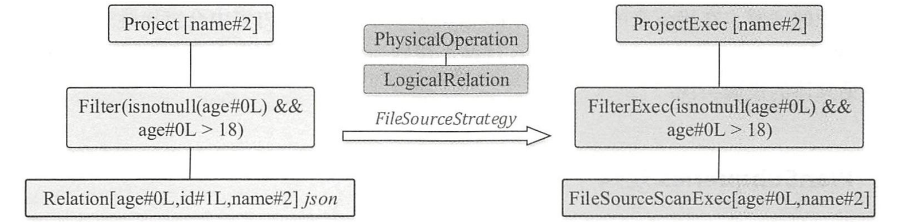


## 4.6 执行前的准备

得到 SparkPlan 之后，还需要完成若干的准备工作，对树型结构的物理计划进行全局的整合处理或优化。在QueryExection 中，最后阶段由 prepareforExecution 方法对传入的 SparkPlan 进行处理而生生成executedPlan， 处理过程仍然基于若干规则。

```scala
lazy val executedPlan: SparkPlan = {
  // ...
  QueryExecution.prepareForExecution(preparations, sparkPlan.clone())
}

private[execution] def prepareForExecution(
    preparations: Seq[Rule[SparkPlan]],
    plan: SparkPlan): SparkPlan = {
  val planChangeLogger = new PlanChangeLogger[SparkPlan]()
  val preparedPlan = preparations.foldLeft(plan) { case (sp, rule) =>
    val result = rule.apply(sp)
    planChangeLogger.logRule(rule.ruleName, sp, result)
    result
  }
  planChangeLogger.logBatch("Preparations", plan, preparedPlan)
  preparedPlan
}
```

| 执行准备规则             | 规则描述                     |
| ------------------------ | ---------------------------- |
| python.ExtractPythonUDFs | 提取 Python 中的 UDF 函数    |
| PlanSubqueries           | 特殊子查询物理计划处理       |
| EnsureRequirements       | 确保执行计划分区与排序正确性 |
| CollapseCodegenStages    | 代码生成相关                 |
| ReuseExchange            | Exchange 节点重用            |
| ReuseSubquery            | 子查询重用                   |


### 4.6.1 PlanSubqueries 规则

子查询是指嵌套在一个查询内部的完整查询，常见的子查询通常作为数据源出现在 SQL 的 From 关键字之后。spark 2.0 版本及更高版本能够支持两种特殊情形的子查询，即 Scalar 类型和 Predicate 类型。

Scalar 类型的子查询返回单个值，具体又分为相关的（Correlated）类型和不相关的（Uncorrelated） 类型。Uncorrelated 意味着子查询和主查询不存在相关性，该类型的 Scalar 子查询对于所有的数据行都返回相同的值。因此，在主查询执行之前，Uncorrelated 子查询会首先执行。例如：`select name, age, (select max(age) from student) max_age from student`。Correlated 类型的 Scalar 子查询意味着该子查询中包含了外层主查询中的相关属性，在 Spark SQL 中会等价转换为 Left Join 算子。Predicate 类型的子查询表示子查询作为过滤谓词，在 Spark SQL 中可以出现在 EXISTS 和 IN 语句中。

PlanSubqueries 规则就是处理物理计划中的 ScalarSubquery 和 PredicateSubquery 这两种特殊的子查询，遍历物理算子树中的所有表达式，碰到 ScalarSubguery 或 PredicateSubquery 表达式时，进入子查询中的逻辑，递归得到子查询的物理执行计划（executedPlan)，然后封装为 ScalarSubquery 和 InSubquery 表达式。


### 4.6.2 EnsureRequirements 规则

EnsureRequirements 用来确保物理计划能够执行所需要的前提条件，包括对分区和排序逻辑的处理。在特定情形下，SparkPlan 对输入数据的分布（Distribution）情况和排序（Ordering）特性有着一定的要求。例如，SortMerge 类型的 Join 算子，要求输入数据已经按照 Hash 方式分区且处于有序状态。

如果输入数据的分布或有序性无法满足当前节点的处理逻辑，则 EnsureRequirements 规则会在物理计划中添加一些  Shuffle 操作或排序操作来达到要求，体现在物理算子树上就是加入 Exchange 或 SortExec 节点。此外，该过程还涉及依赖信息 （ShuffleDependcency）的创建、ShuffledRowRDD 的构造等，其处理逻辑可以算是整个物理计划阶段最为复杂的部分。

从 EnsureRequirements 规则的 apply 方法可知，在遍历 SparkPlan 的过程中，当匹配到 Exchange 节点（ShuffleExchange）且其子节点也是 Exchange 类型时，会检查两者的 Partitioning 方式，判断能否消除多余的 Exchange 节点。除此情况外，遍历过程中会逐个调用 ensureDistributionAndOrdering 方法来确保每个节点的分区与排序需求。因此，该规则的核心逻辑体现在 ensureDistributionAndOrdering 方法中，可以将其大致过程分为以下 3 步。

```scala
object EnsureRequirements extends Rule[SparkPlan] {
  def apply(plan: SparkPlan): SparkPlan = plan.transformUp {
    case operator @ ShuffleExchangeExec(upper: HashPartitioning, child, _) =>
      child.outputPartitioning match {
        case lower: HashPartitioning if upper.semanticEquals(lower) => child
        case _ => operator
      }
    case operator: SparkPlan =>
      ensureDistributionAndOrdering(reorderJoinPredicates(operator))
  }
}
```

1. **添加 Exchange 节点**

   Exchange 本身也是UnaryExecNode 类型的 SparkPlan，在Spark SQL 中被定义为抽象类，如图所示。继承 Exchange 的子类有 BroadcastExchangeExec 和 ShuffleExchange 两种。很明显，ShufleExchange 会通过 shuffle 操作进行重分区处理，而 BroadcastExchangeExec 则对应广播操作。

   Exchange 节点是实现数据并行化的重要算子，用于解决数据分布（Distribution）相关问题。具体来讲，需要添加 Exchange 节点的情形有以下两种。

   * 数据分布不满足：子节点的物理计划输出数据无法满足当前物理计划处理逻辑中对数据分布的要求，例如子节点输出数据分布为 UnspecifedDistribution，而当前物理计划对输入数据分布的需求是 OrderedDistribution。
   * 数据分布不兼容：当前物理计划为 BinaryExecNode 类型，即存在两个子物理计划时，两个子物理计划的输出数据可能不兼容 （Compatile）。例如，Hash 的方式不同，导致应该在同一个分区的数据最终落到不同的节点上。在这种情况下，也需要创建 Exchange 节点重新进行 Shuffle 操作。

   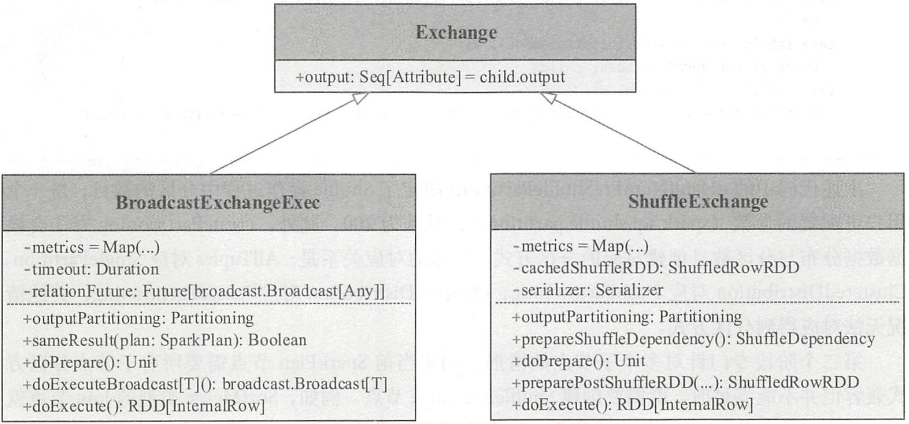

   在 ensureDistributionAndOrdering 方法中，添加 Exchange 节点过程可以分为两个阶段，分别针对单个节点和多个节点。**第一个阶段是判断每个子节点的分区方式是否可以满足对应所需的数据分布**。如果满足，则不需要创建 Exchange 节点；否则根据是否广播来决定添加何种类型的 Exchange 节点，代码所下。代码中的numShufflePartitions 决定了 Shuffle 操作过程中分区的数目，该参数（spark.sql.shuffle.partitions）可配置，默认为 200。createPartitioning 方法会根据数据分布与分区数目创建对应的分区方式，具体对应关系是：AIlTuples 对应 SinglePartition，ClusteredDistribution 对应 HashPartitioning，OrderedDistribution 对应 RangePartitioning，其他情况无法对应得到分区方式。

   ```scala
   children = children.zip(requiredChildDistributions).map {
     case (child, distribution) if child.outputPartitioning.satisfies(distribution) =>
       child
     case (child, BroadcastDistribution(mode)) =>
       BroadcastExchangeExec(mode, child)
     case (child, distribution) =>
       val numPartitions = distribution.requiredNumPartitions
         .getOrElse(conf.numShufflePartitions)
       ShuffleExchangeExec(distribution.createPartitioning(numPartitions), child)
   }
   ```

   **第二个阶段专门针对多个子节点的情形**，如果当前 SparkPlan 节点需要所有子节点分区方式兼容但并不能满足时，就需要创建 ShuffleExchange 节点。例如，SortMerge 类型的 Join 节点就需要两个子节点的 Hash 计算方式相同。这个步骤的逻辑较为复杂，可以简单描述为：如果所有的子节点 outputPartitioning 能够保证由最大分区数目创建新的 Partitioning，则子节点输出的数据并不需要重新 Shuffle，那么只需要使用已有的 outputPartitioning 方式即可，没有必要重新创建新的 Exchange 节点；否则，至少有一个子节点的输出数据需要重新进行 Shuffle 操作。重分区的数目根据是否所有的子节点输出都需要 Shuffle 来判断，若是，则采用默认的 Shuffle 分区配置数目；否则，取子节点中最大的分区数目。

   第二个阶段的最后会根据创建的 Partitioning 对当前 SparkPlan 节点进行操作。因为在第一个阶段针对单个子节点进行处理时有可能已经创建了 ShuffleExchange 节点，那么这种情况下会对其进行替换，其他情况下直接创建新的 ShuffleExchange 节点即可。

2. **应用 ExchangeCoordinator 协调分区**

   ExchangeCoordinator 用来确定物理计划生成的 Stage 之间如何进行 Shuffle 的行为。其作用在于协助 ShuffleExchange 节点更好地执行。在 Spark 2.1 版本中，ExchangeCoordinator 功能较简单，仅用于确定数据 Shuffle 后的分区数目。

3. **添加 SortExec 节点**

   排序的处理在分区处理（创建完 Exchange）之后，其逻辑相对简单，不用考虑子节点彼此之间的兼容问题，只需要对每个子节点单独处理。当且仅当所有子节点的输出数据的排序信息满足当前节点所需时，才不需要添加 SortExec 节点；否则，需要在当前节点上添加 SortExec 为父节点。至此，EnsureRequirements 规则的处理逻辑结束，调用 TreeNode 中的 withNewChildren 将 SparkPlan 中原有的子节点替换为新的子节点。

   ```scala
   children = children.zip(requiredChildOrderings).map { case (child, requiredOrdering) =>
     // 如果子操作符的输出顺序(child.outputOrdering)已经满足所需的顺序(requiredOrdering)，那么不需要进行排序。
     if (SortOrder.orderingSatisfies(child.outputOrdering, requiredOrdering)) {
       child
     } else {
       SortExec(requiredOrdering, global = false, child = child)
     }
   }
   ```

   


# 5. Spark SQL 之 Aggregation 实现

## 5.1 Aggregation 执行概述

### 5.1.1 文法定义

在 Catalyst 的 SqlBase.g4 文法文件中，聚合语句定义如下：**在常见的聚合查询中，通常包括分组语句（group by）和聚合函数 (aggregate function)**；聚合函数出现在 Select 语句中的情形较多，定义在 functionCall 标签的 primaryExpression 表达式文法中，functionName 对应函数名，括号内部是该函数的参数列表。

从文法定义中可以看到，完整聚合查询的**关键字包括 group by、cube、grouping sets 和 rollup 4 种**。分组语句 group by 后面可以是一个或多个分组表达式（groupingExpressions)。除简单的分组操作外，聚合查询还支特 OLAP 场景下的多维分析，包括 rollup、cube 和 grouping sets 3 种操作。

```
primaryExpression: 
	functionName '(' (setQuantifier? argument+=expression (',' argument+=expression)*)? ')'
   (FILTER '(' WHERE where=booleanExpression ')')? (OVER windowSpec)?				#functionCall

aggregationClause
    : GROUP BY groupingExpressions+=expression (',' groupingExpressions+=expression)* (
      WITH kind=ROLLUP
    | WITH kind=CUBE
    | kind=GROUPING SETS '(' groupingSet (',' groupingSet)* ')')?
    | GROUP BY kind=GROUPING SETS '(' groupingSet (',' groupingSet)* ')'
    ;
```

以查询语句 `select id, count(name) from student group by id` 为例，生成的语法树如图所示。相对非聚合查询，该语法树除 id 列外，还有对 name 的 count 操作所产生的新列，因此 NamedExpressionSeqContext 节点包含两个子节点。最重要的元素是 FunctionCallContext 和 AggregationContext 节点。AggregationContext 子节点（从 ExpressionContext 一直到 ColumnReferenceContext）对应 group by 语句后面的 id 列。用来表示聚合函数的 FunctionCallContext 节点的结构比较好理解，其子节点 QualifedNameContext 代表函数名，ExpressionContext 表示函数的参数表达式（对应 SQL 语句中的 name 列) 。

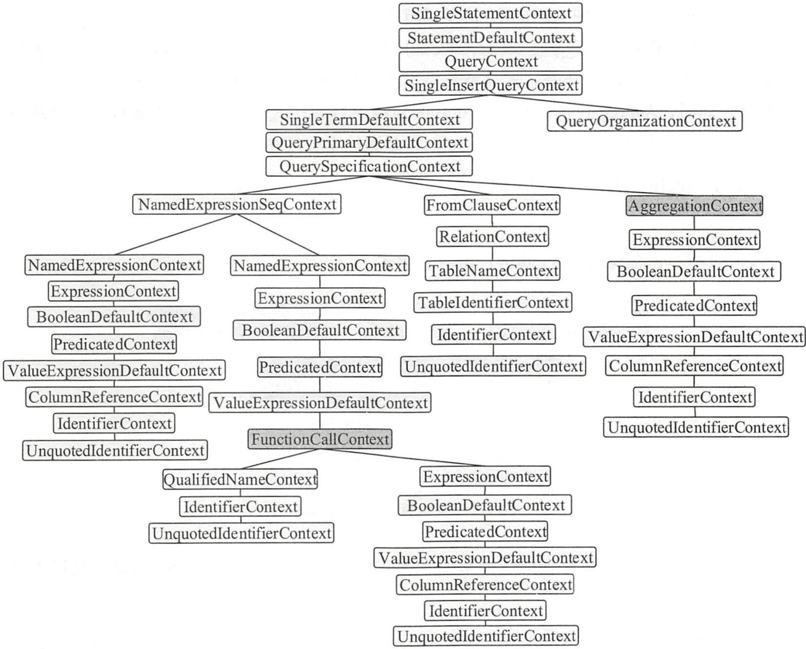


### 5.1.2 Unresolved LogicalPlan 生成

在 Spark SQL 中， Aggregate 逻辑算子树节点是 UnaryNode 中的一种，属于基本的逻辑算子。如图所示，该逻辑算子树节点通过**分组表达式列表（groupingExpressions）、聚合表达式列表（aggregateExpressions）和子节点（child）**构造而成，其中分组表达式类型都是 Expression，而聚合表达式类型都是 NamedExpression， 意味着聚合表达式一般都需要设置名字。同时，Aggregate 的输出函数 output 对应聚合表达式列表中的所有属性值。判断聚合算子是否已经被解析过需要满足 3 个条件：该算子中的所有表达式都已经被解析过了、其子节点已经被解析过了、该节点中不包含窗口函数表达式。

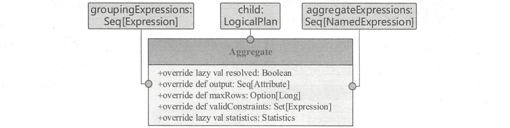

如图所示，上述聚合查询从抽象语法树生成 Unresolved LogicalPlan 主要涉及以下 3 个函数的调用，该过程主要由 AstBuilder 完成。

* 针对 QuerySpecificationContext 节点，执行 visitQuerySpecification，会先后调用 visitFromClause 和 withQuerySpecification 函数。
* 在 visitFromClause 函数中，针对 FromClauseContext 节点生成 UnresolvedRelation 逻辑算子节点，对应数据表。
* 在返回的 UnresolvedRelation 节点上，执行 visitQuerySpecification 函数，具体执行的是 withAggregation 函数，在 UnresolveRelation 节点上生成 Aggregate 逻辑算子树节点，返回完整的逻辑算子树。

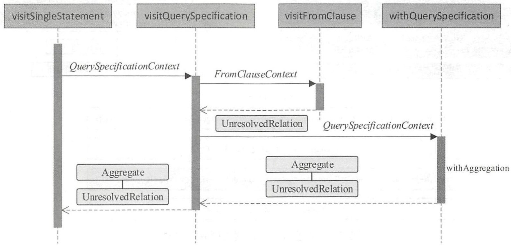


### 5.1.3 从逻辑算子树到物理算子树

从 Unresolved LogicalPlan 到 Analyzed LogicalPlan 经过了 4 条规则的处理。对于聚合查询来说，比较重要的是  ResolveFunctions 规则，用来分析聚合函数。对于 UnresolvedFunction 表达式，Analyzer 会根据函数名和函数参数去 SessionCatalog 中查找，而 SessionCatalog 会根据 FunctionRegistry 中已经注册的函数信息得到对应的聚合函数。

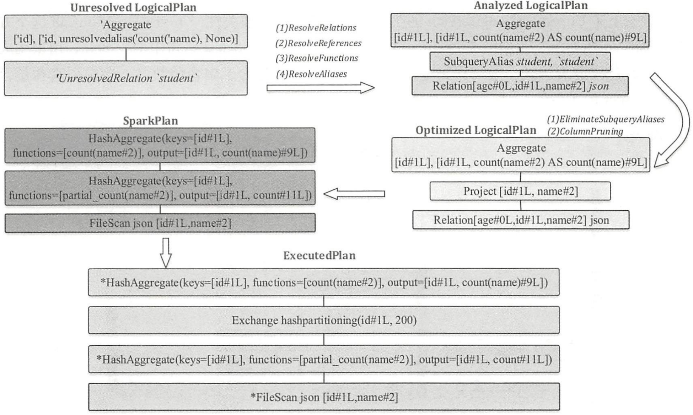

从 Analyzed LogicalPlan 到 Optimized LogicalPlan 分别经过了别名消除（EliminateSubqueryAliases）规则与列剪裁（ColumnPruning）规则的处理。而从 Optimized LogcialPlan 到物理执行计划 SparkPlan 进行转换时，主要经过了 FileSourceStrategy 和 Aggregation 两个策略的处理。FileSourceStrategy 会应用到 Project 和 Relation 节点，匹配过程在上面已经分析过。Aggregation 策略基于 PhysicalAggregation，PhysicalAggregation 用来匹配逻辑算子树中的 Aggregate 节点并提取该节点中的相关信息，它在提取信息时会进行以下转换。

* **去重**：对 Aggregate 逻辑算子节点中多次重复出现的聚合操作进行去重，参见 PhysicalAggregation 中 aggregateExpressions 表达式的逻辑，收集 resultExpressions 中的聚合函数表达式，然后执行 distinct 操作。
* **命名**：参见代码中 namedGroupingExpressions 的操作，对未命名的分组表达式（groupingExpressions） 进行命名（套上一个 Alias 表达式），这样方便在后续聚合过程中进行引用。
* **分离**：对应 rewrittenResultExpressions 中的操作逻辑，从最后结果中分离出聚合计算本身的值，例如 count+1 会被拆分为 count(aggregateExpression) 和 count.resultAttribute＋1 的最终计算。

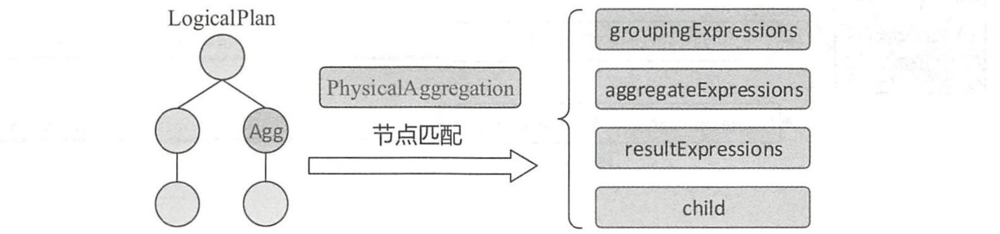

经过上述处理，PhysicalAggregation 模式返回的聚合操作相关表达式如表所示，其中 aggregateExpressions 对应聚合函数，而 resultExpressions 则包含了 select 语句中选择的所有列信息。

| 访问操作             | 返回到 Expression                           |
| -------------------- | ------------------------------------------- |
| groupingExpressions  | [id#1L]                                     |
| aggregateExpressions | [count(name#2)]                             |
| resultExpressions    | [id#1L, count(name#2)#8L AS count(name)#9L] |

得到上述各种聚合信息之后，Aggregation 策略会根据这些信息生成相应的物理计划。如图所示，不同情况下生成的物理计划不相同。当聚合表达式中存在不支持 Partial 方式且不包含 Distinct 函数时，调用的是 planAggregateWithoutPartial 方法；当聚合表达式都支持 Partial 方式且不包含 Distinct 函数时，调用的是 planAggreeateWithoutDistinct 方法：当聚合表达式都支持 Partial 方式且存在 Distinct 函数时，调用的是 planAggregateWithOneDistinct 方法。

**Partial 方式表示聚合函数的模式，能够支持预先局部聚合**。因为实例中 count 函数支持 Partial 方式，因此调用的是 planAggreeateWithoutDistinct 方法，生成了上图中的两个 HashAggregate（聚合执行方式中的一种）物理算子树节点，**分别进行局部聚合与最终的聚合**。最后，在生成的 SparkPlan 中添加 Exchange 节点，统一排序与分区信息，生成物理执行计划（ExecutedPlan）。

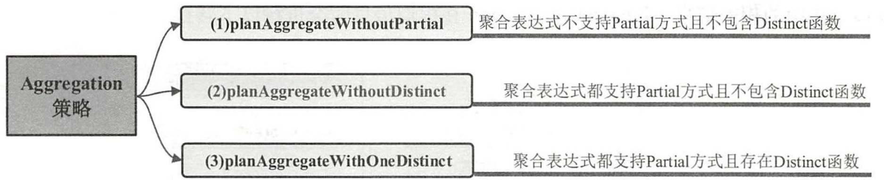


## 5.2 聚合函数

聚合函数（AggregateFunction）是聚合查询中非常重要的元素。在实现上，聚合函数是表达式中的一种，和  Catalyst 中定义的聚合表达式（AggregationExpression）紧密关联。无论是在逻辑算子树还是物理算子树中，聚合函数都是以聚合表达式的形式进行封装的，同时聚合函数表达式中也定义了直接生成聚合表达式的方法。

聚合表达式的成员变量和函数如图所示。resultAttribute 表示聚合结果，获取子节点的 children 方法并返回聚合函数表达式；dataType 函数直接调用聚合函数中的 dataType 函数获取数据类型。在默认情况下，聚合表达式的  foldable 函数返回 false，因为聚合表达式一般无法静态得到最终结果，需要经过进一步的计算。

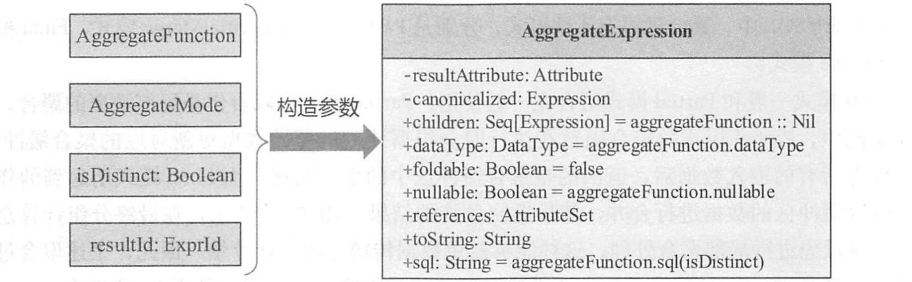

### 5.2.1 聚合缓冲区与聚合模式

1. **聚合函数缓冲区**

   聚合查询在计算聚合值的过程中，通常都需要保存相关的中间计算结果，例如 max 函数需要保存当前最大值，求平均值的 avg 函数需要同时保存 count 和 sum 的值。聚合查询计算过程中产生的这些中间结果会临时保存在聚合函数缓冲区。

   聚合函数缓冲区的定义有一个前提条件，即聚合函数缓冲区针对的是处于同一个分组内（实例中属于同一个 id）的数据。注意，查询中可能包含多个聚合函数，因此**聚合函数缓冲区是多个聚合函数所共享的**。

   在聚合函数的定义中，与聚合缓冲区相关的基本信息包括：聚合缓冲区的 Schema 信息（aggBufferSchema），返回为 StructType 类型；聚合缓冲区的数据列信息（aggBufferAttributes)，返回 Seq[AttributeReference]，对应缓冲区数据列名。显然，聚合函数缓冲区中的值会随着数据处理而不断进行更新，因此该缓冲区是可变的。此外，当聚合函数处理新的数据行时，需要知道该数据行的列构成信息，在 AggregateFunction 中也定义了 inputAggBufferAttributes 函数来获得输入数据的组成情况。通常情况下，inputAggBuffereAttributes 返回的都是自动从 aggBufferAttributes 获得的结果。

2. **聚合模式**

   聚合过程有 4 种模式，分别是：**Partial 模式、ParitialMerge 模式、Final 模式和 Complete 模式**。

   Final 模式一般和 Partial 模式组合在一起使用。Partial 模式可以看作是局部数据的聚合，在具体实现中，Partial 模式的聚合函数在执行时会根据读入的原始数据更新对应的聚合缓冲区，当处理完所有的输入数据后，返回的是聚合缓冲区中的中间数据。而 Final 模式所起到的作用是将聚合缓冲区的数据进行合并，然后返回最终的结果。

   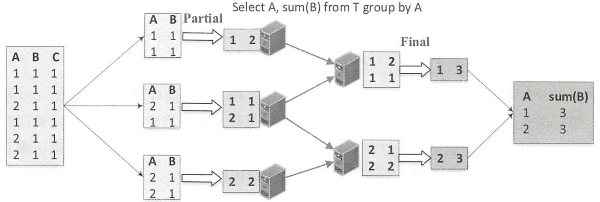

   Complete 模式和上述的 Partial/Final 组合方式不一样，不进行局部聚合计算。一般来说，Complete 模式应用在不支持 Partial 模式的聚和函数中。

   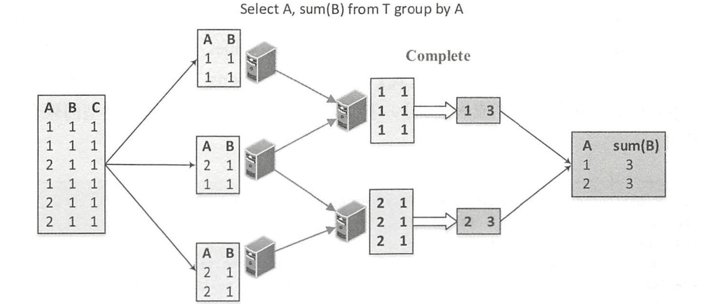

   PartialMerge 模式的聚合函数主要是对聚合缓冲区进行合并，但此时仍然不是最终的结果。ParitialMerge 主要应用在 distinct 语句中，如图所示，聚合语句针对同一张表进行 sum 和 count(distinct) 查询。第 1 步按照（A，C）分组，对 sum 两数进行 Partial 模式聚合计算；第 2 步是 PartialMerge 模式，对上一步计算之后的聚合缓冲区进行合并，但此时仍然不是最终的结果；第 3 步分组的列发生变化，再一次进行 Partial 模式的 count 计算；第 4 步完成 Final 模式的最终计算。

   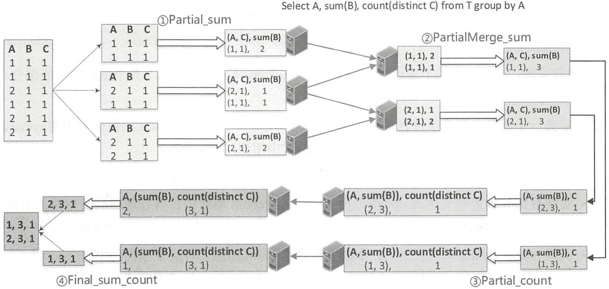


### 5.2.2 DeclarativeAggregate 聚合函数

DeclarativeAggregate 聚合函数是一类直接由 Catalyst 中的表达式（Expressions）构建的聚合函数，主要逻辑通过调用 4 个表达式完成，分别是：initialvalues（聚合缓冲区初始化表达式）、updateExpressions （聚合缓冲区更新表达式）、mergeExpressions（聚合缓冲区合并表达式）和 evaluateExpression（最终结果生成表达式）。下面以 Count 函数为例对这种类型的聚合函数的实现进行说明。

```scala
case class Count(children: Seq[Expression]) extends DeclarativeAggregate {

  override def nullable: Boolean = false
  override def dataType: DataType = LongType

  override def checkInputDataTypes(): TypeCheckResult = {
    // ...
  }

  protected lazy val count = AttributeReference("count", LongType, nullable = false)()

  // 定义聚合属性，count函数只需要count，这些属性会在updateExpressions等各种表达式中用到
  override lazy val aggBufferAttributes = count :: Nil

  // 设定初始值，count函数的初始值为0
  override lazy val initialValues = Seq(
    /* count = */ Literal(0L)
  )

  // 实现merge处理逻辑的表达式，count函数直接把count相加
  override lazy val mergeExpressions = Seq(
    /* count = */ count.left + count.right
  )

  // 实现结果输出的表达式evaluateExpression，返回count值
  override lazy val evaluateExpression = count

  override def defaultResult: Option[Literal] = Option(Literal(0L))

  // 实现数据处理逻辑表达式updateExpressions，count函数处理新数据时，count+1L，注意其中对Null的处理逻辑
  override lazy val updateExpressions = {
    val nullableChildren = children.filter(_.nullable)
    if (nullableChildren.isEmpty) {
      Seq(
        /* count = */ count + 1L
      )
    } else {
      Seq(
        /* count = */ If(nullableChildren.map(IsNull).reduce(Or), count, count + 1L)
      )
    }
  }
}
```


### 5.2.3 ImperativeAggregate 聚合函数

不同于 DeclarativeAggregate 聚合函数基于 Catalyst 的实现方式，ImperativeAggregate 聚合函数需要显式地实现 initialize、update 和 merge 方法来操作聚合缓冲区中的数据。一个显著的不同是，**ImperativeAggregate 聚合函数所处理的聚合缓冲区本质上是基于行（InternalRow 类型）的**。

聚合缓冲区是共享的，可能对应多个聚合函数，因此特定的 ImperativeAggregate 聚合函数会通过偏移量进行定位。例如，数据表有 3 列，分别是 key、x、y，查询语句中有两个求平均值的函数 avg(x) 和 avg(y)（假设这里用 ImperativeAggregate 方式来实现平均值函数）。这两个函数共享聚合缓冲区 [sum1, count1, sum2, count2]，如图所示，那么第一个 avg 函数的缓冲区偏移量为 0，第二个 avg 函数的缓冲区偏移量为2，可以通过mutableAggBufferOffset + fieldNumber 方式来访问具体的中间变量。

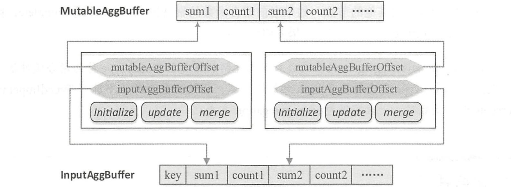

在 ImperativeAggregate 聚合函数中，还有输入聚合缓冲区（InputAggBuffer）的概念。InputAggBuffer 是不可变的，在将两个聚合缓冲区进行合并时，实现方式就是将该缓冲区的值更新到可变的聚合缓冲区中。除不可变外，InputAggBuffer 中相对聚合缓冲区还可能包含额外的属性，例如 group by 语句中的列，对应的缓冲区即 [key, sum1, count1, sum2, count2]。因此，在 ImperativeAggregate 聚合函数中还有 inputAggBufferOffset 的概念，用来访问 InputAggBuffer 中对应的中间值。


## 5.3 聚合执行

聚合执行本质上是将 RDD 的每个 Partition 中的数据进行处理。如图所示，对于每个 Partition 中的输入数据即 Input（通过 InputIterator 进行读取），经过聚合执行计算之后，得到相应的结果数据即 Result（通过 AggregationIterator 来访问）。

聚合查询最终执行有两种方式：**基于排序的聚合执行方式（SortAggregateExec）与基于 Hash 的聚合执行方式（HashAggregateExec）**。在后续版本中，又加入了 ObjectHashAggregateExec 执行方式（SPARK-17949）。常见的聚合查询语句通常采用 HashAggregate 方式，当存在以下几种情况时，会用 SortAggregate 方式。

* 查询中存在不支持 Partial 方式的聚合函数：此时会调用 AggUtils 中的 planAggregateWithoutPartial方法，直接生成 SortAggregateExec 聚合算子节点。
* 聚合函数结果不支持 Buffer 方式：如果结果类型不属于 [NullType, BooleanType, ByteType, ShortType,  IntegerType, LongType, FloatType, DoubleType, DateType, TimestampType, DecimalType] 集合中的任意一种，则需要执行 SortAggregateExec 方式，例如 collect_ set 和 collect_list 函数。
* 内存不足：若在 HashAggregate 执行过程中，内存空间已满，则会切换到 SortAggregateExec 方式。

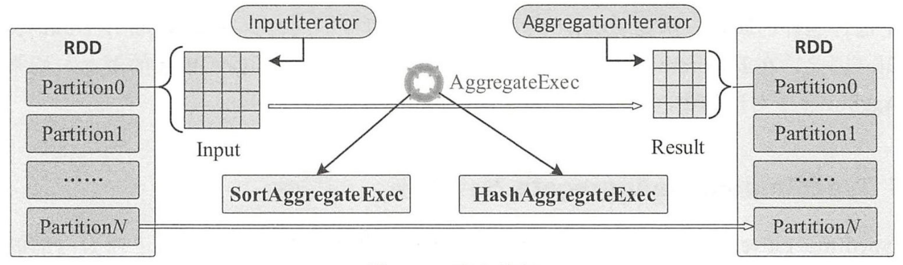

### 5.3.1 执行框架 AggregationIterator

聚合执行框架指的是聚合过程中抽象出来的通用功能，包括聚合函数的初始化、聚合缓冲区更新合并函数和聚合结果生成函数等。这些功能都在聚合选代器（AggregationIterator）中得到了实现。

如图所示，聚合迭代器定义了 3 个重要的功能，分别是：**聚合函数初始化（initializeAggregateFunctions）、数据处理函数生成（generateProcessRow）和聚合结果输出函数生成（generateResultProjection）**。 SortBasedAggregationIterator 和 TungstenAggregationIterator 继承自 AggregationIterator，实现具体的操作，分别对应 SortAggregateExec 和 HashAggregateExec 执行方式，并分别通过 processCurrentSortedGroup 与 processInputs 方法得到最终的聚合结果，而这两个方法均依赖上述 AggregationIterator 功能。

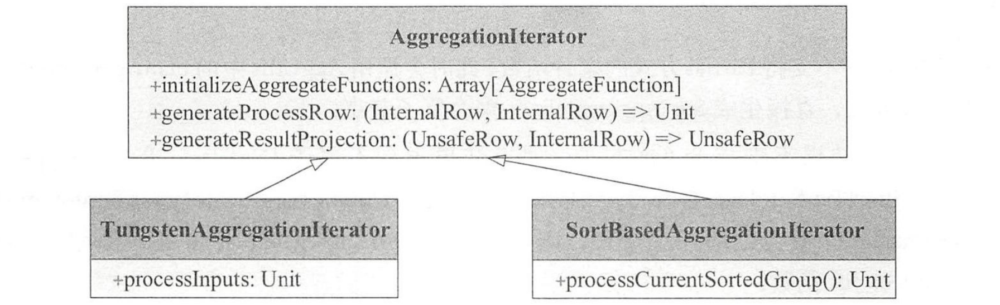

1. 聚合函数初始化可以细分为两个阶段，分别得到 funcWithBoundReference 和 funcWithUpdatedAggBufferOffset 表达式。第一阶段，针对 Partial 和 Complete 模式的 ImperativeAggregate 聚合函数，AttributeReference 表达式会转换为 BoundReference 表达式。例如，假设 Count(A) 处理的输入数据行为整型的 (A, B, C)，经过转换后，得到的是 Count(BoundReference[0, Int,  false])，提取出的是属性下标等信息；而对于 PartialMerge 和 Final 模式的 ImperativeAggregate 聚合函数，会设置输入缓冲区的偏移量（withNewInputAggBufferOffset）。第二阶段，设置 ImperativeAggregate 函数聚合缓冲区的偏移量（withNewMutableAggBufferOffset）。
2. 数据处理函数生成得到数据处理函数 processRow，其参数类型是 (InternalRow, InternalRow)，分别代表当前的聚合缓冲区 currentBufferRow 和输入数据行 row，输出是 Unit 类型。数据处理函数 processRow 的核心操作是获取各 Aggregation 中的 update 函数或 merge 函数。对于 Partial 和 Complete 模式，处理的是原始输入数据，因此采用的是 update 函数；而对于 Final 和 PartialMerge 模式，处理的是聚合缓冲区，因此采用的是 merge 函数。
3. 聚合结果输出函数生成计算最终的聚合结果，输入类型是 (UnsafeRow, InternalRow)，输出的是 UnsafeRow 数据行类型。对于 Partial 或 PartialMerge 模式的聚合函数，因为只是中间结果，所以需要保存 grouping 语句与 buffer 中所有的属性；对于 Final 和 Complete 聚合模式，直接对应 resultExpressions 表达式。特别注意，如果不包含任何聚合函数且只有分组操作，则直接创建 projection。


### 5.3.2 基于排序的聚合算子 SortAggregateExec

SortAggregateExec 在进行聚合之前，会根据 grouping key 进行分区并在分区内排序，将具有相同 grouping key 的记录分布在同一个 partition 内且前后相邻。如图所示，聚合时只需要顺序遍历整个分区内的数据，即可得到聚合结果。

通过查看 SortAggregateExec 实现可知，requiredChildOrdering 中对输入数据的有序性做了约束，分组表达式列表（groupingExpressions） 中的每个表达式 e 都必须满足升序排列，即 SortOrder(e, Ascending)，因此在 SortAggregateExec 节点之前通常都会添加一个 SortExec 节点。

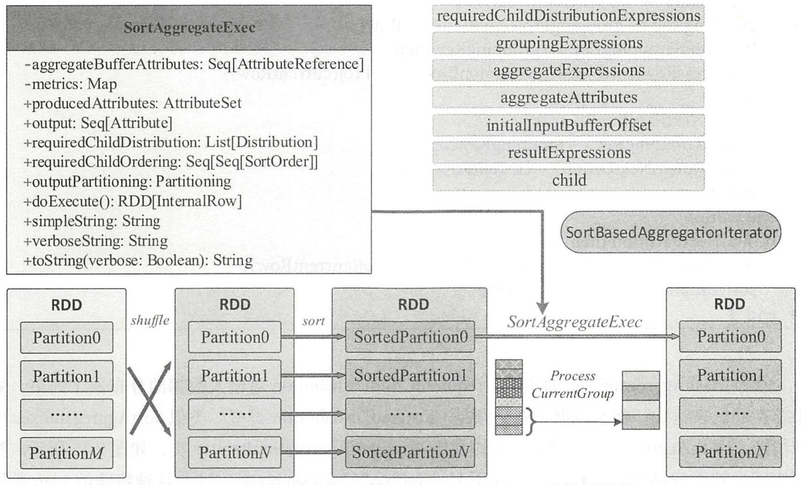

SortBasedAggregationIterator 是 SortAggregateExec 实现的关键，由于数据已经预先排好序，因此按照分组进行聚合即可。在其具体实现中，currentGroupingKey 和 nextGroupingKey 分别表示当前分组表达式和下一个分组表达式，sortBasedAggregationBuffer 为其聚合缓冲区。initialize 和 processCurrentsortedGroup 方法分别用来初始化基本信息和当前分组数据的处理。

```scala
protected def processCurrentSortedGroup(): Unit = {
  currentGroupingKey = nextGroupingKey
  // 将开始查找属于该组的所有行，创建变量跟踪是否看到了下一个分组
  var findNextPartition = false
  // firstRowInNextGroup是该组的第一行，首先处理它
  processRow(sortBasedAggregationBuffer, firstRowInNextGroup)

  // 当看到下一个分组或迭代器中没有剩余的输入行时，循环停止
  while (!findNextPartition && inputIterator.hasNext) {
    // 得到groupingkey分组表达式
    val currentRow = inputIterator.next()
    val groupingKey = groupingProjection(currentRow)

    // 当前的分组表达式currentGroupingkey和groupingKey相同，意味着当前输入数据仍属于同一个分组内部
    if (currentGroupingKey == groupingKey) {
      processRow(sortBasedAggregationBuffer, currentRow)
    } else {
      // 找到一个新分组
      findNextPartition = true
      nextGroupingKey = groupingKey.copy()
      firstRowInNextGroup = currentRow.copy()
    }
  }
  // 还没有看到新的分组，意味着输入迭代器中没有新的行，当前分组是迭代器的最后一个分组
  if (!findNextPartition) {
    sortedInputHasNewGroup = false
  }
}
```


### 5.3.2 基于 Hash 的聚合算子 HashAggregateExec

HashAggregateExec 从逻辑上很好实现，只要构建一个 Map 类型的数据结构，以分组的属性作为 key，将数据保存到该 Map 中并进行聚合计算即可。然而，在实际系统中，无法确定性地申请到足够的空间来容纳所有数据，底层还涉及复杂的内存管理，因此相对 SortAggregateExec 的实现方式反而更加复杂。类似 SortAggregateExec，HashAggregateExec 的实现关键在于 TungstenAggregationlterator 类，如图所示。整体实现机制很容易理解，核心之处在于 UnsafeFixedWidthAggregationMap 这种特殊的 Map 数据结构。

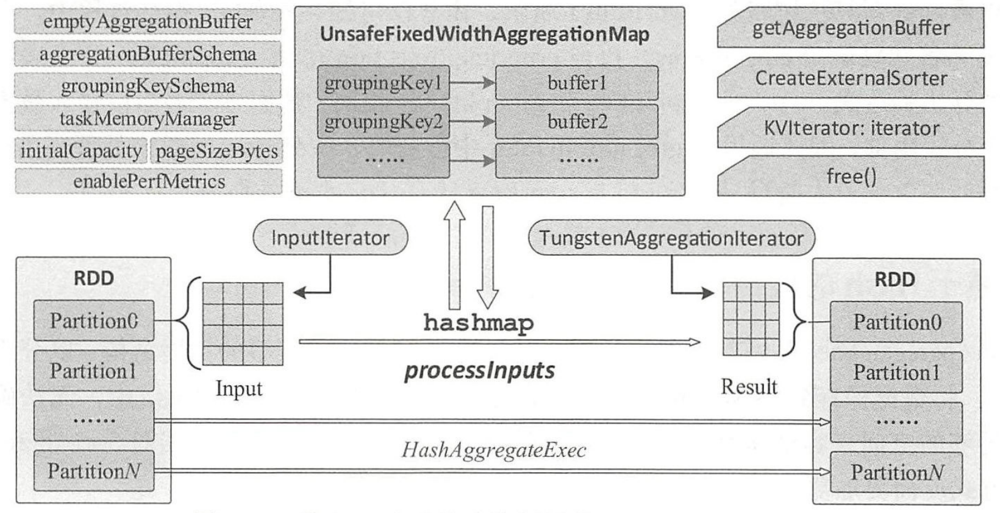

实际上，HashAggregateExec 可能因内存不足退化为 SortAggregateExec，TungstenAggregationIterator 通过执行 processInputs 方法触发聚合操作，代码如下，中间涉及一些特殊数据结构（包括 UnsafeKVExternalSorter 和 UnsafeFixedWidthAggregationMap 等）。

```scala
private def processInputs(fallbackStartsAt: (Int, Int)): Unit = {
  if (groupingExpressions.isEmpty) {
    // 如果没有分组表达式，可以一次又一次地重复使用相同的缓冲区。请注意，将来最好完全消除哈希映射。
    val groupingKey = groupingProjection.apply(null)
    val buffer: UnsafeRow = hashMap.getAggregationBufferFromUnsafeRow(groupingKey)
    while (inputIter.hasNext) {
      val newInput = inputIter.next()
      processRow(buffer, newInput)
    }
  } else {
    var i = 0
    while (inputIter.hasNext) {
      // 获取输入数据newInput，然后得到分组表达式groupingKey，并以此为key到hashMap中获取对应的聚合操作缓冲区buffer。UnsafeFixedWidthAggregationMap内部存储groupingKey与UnsafeRow的映射关系
      val newInput = inputIter.next()
      val groupingKey = groupingProjection.apply(newInput)
      var buffer: UnsafeRow = null
      if (i < fallbackStartsAt._2) {
        buffer = hashMap.getAggregationBufferFromUnsafeRow(groupingKey)
      }
      if (buffer == null) {
        // 如果获取不到对应的buffer，意味着hashMap内存空间己满
        // 这种情况调用destructAndCreateExternalSorter方法将内存数据spill到磁盘以释放内存空间
        val sorter = hashMap.destructAndCreateExternalSorter()
        if (externalSorter == null) {
          externalSorter = sorter
        } else {
          // 多次spill磁盘的数据还会进行合并操作
          externalSorter.merge(sorter)
        }
        i = 0
        // 再次从hashMap获取聚合缓冲区，此时如果无法获取，则会抛出OOM错误
        buffer = hashMap.getAggregationBufferFromUnsafeRow(groupingKey)
        if (buffer == null) {
          throw new SparkOutOfMemoryError("No enough memory for aggregation")
        }
      }
      processRow(buffer, newInput)
      i += 1
    }

    // 检查全局externalsorter对象，如果不为空，意味着聚合操作因内存不足没能执行成功，部分数据存储在磁盘上
    if (externalSorter != null) {
      // 将hashMap中最后的数据spill到磁盘，并与externalsorter中的数据合并
      val sorter = hashMap.destructAndCreateExternalSorter()
      externalSorter.merge(sorter)
      // 调用free方法释放 hashMap
      hashMap.free()
      // 切换到基于排序的聚合执行方式，其逻辑与SortAggregateExec的逻辑类似
      switchToSortBasedAggregation()
    }
  }
}
```


## 5.4 窗口函数

### 5.4.1 定义与简介

通常情况下，聚合操作会按照 Group By 子句对数据进行分组，然后在每个分组内执行聚合函数，得到一条结果。然而，这种常规的方式在面对一些复杂的分析需求时会显得捉襟见肘。例如，需要统计每个班前 5 名学生的成绩，或者需要计算每个学生的成绩与班级最高分的差距等。针对这类特殊的场景，窗口函数就有了用武之地。

具体来说，窗口和窗口函数在 Spark SQL 中的文法定义如下。窗口函数相比普通函数只不过多了 OVER 子句，其中的窗口信息（windowSpec）可以事先定义并在 SQL 中引用，也可以直接指定。在 windowDef 标签的文法中，包括两个分支，分别对应 CLUSTER BY 和 PARTITION/DISTRIBUTE BY 开头的关键字。实际上 PARTITION BY 配合 ORDER BY 关键字的使用频率最高，因此这里以此作为分析对象。

```
primaryExpression: functionName '(' (setQuantifier? argument+=expression (',' argument+=expression)*)? ')' (FILTER '(' WHERE where=booleanExpression ')')? (OVER windowSpec)?                      #functionCall

windowSpec
    : name=errorCapturingIdentifier         #windowRef
    | '('name=errorCapturingIdentifier')'   #windowRef
    | '('
      ( CLUSTER BY partition+=expression (',' partition+=expression)*
      | ((PARTITION | DISTRIBUTE) BY partition+=expression (',' partition+=expression)*)?
        ((ORDER | SORT) BY sortItem (',' sortItem)*)?)
      windowFrame?
      ')'                                   #windowDef

windowFrame
    : frameType=RANGE start=frameBound
    | frameType=ROWS start=frameBound
    | frameType=RANGE BETWEEN start=frameBound AND end=frameBound
    | frameType=ROWS BETWEEN start=frameBound AND end=frameBound

frameBound
    : UNBOUNDED boundType=(PRECEDING | FOLLOWING)
    | boundType=CURRENT ROW
    | expression boundType=(PRECEDING | FOLLOWING)
```

窗口函数涉及了了个核心元素，分别是分区 (PARTITION | DISTRIBUTE) BY 信息、排序 (ORDER | SORT) BY 信息和窗框定义 windowFrame。

* **分区信息**：分区元素由 PARTITION BY 子句定义，并被所有的窗口函数支持。类似 SparkPlan 中的 Partitioning，数据基于分区表达式执行 Hash 类型的 Shuffle 操作。在极端情况下，如果没有设定分区表达式，则所有数据都会集中到一个节点上。**分区可以算是对窗口的初步限制，只有值相同的数据才能进入同一个窗口**。例如，窗口函数中使用 PARTITION BY ID，当前数据行的 ID 为 1，那么当前行所在的窗口中必然只能包括 ID 值为 1 的数据。
* **排序信息**：排序元素定义分区内数据的顺序，在标准 SQL 中，所有函数都支持排序元素。排序子句所起的作用比较好理解，例如，对于排名函数 Rank，当使用降序排序时，排名函数返回对应分区内大于当前值的记录个数加 1；当使用升序排序时，排名函数返回小于当前值的记录个数加 1。实际上，某些窗口函数已经隐含地对数据有序性进行了要求，即使 SQL 语句中没有显示指定，Spark SQL 后续解析时也会相应地添加。
* **窗框定义**：**本质上，窗框是一个在分区内对行进行进一步限制的筛选器，适用于聚合窗口函数，也适用于 3 个偏移函数，即 FIRST_VAIUE、LAST_VALUE 和 NTH_ VAIUE**。可以把这个窗口元素想象成基于特定顺序、在当前行所在分区中定义的两个点，两点范围内的数据行才会参与计算。在标准的窗框描述中，可以用 ROWS 或 RANGE 关键字来定义如何选取开始行和结束行。**ROWS 允许用相对于当前行的偏移行数来指定窗框的起点和终点；RANGE 则更灵活，可以以窗框起点和终点的值与当前行的值的差异来定义偏移行数**。因此，ROWS 定义了窗口里有多少行，RANGE 则限定了排序之后的值在窗口里有多少行。此外，**文法中的 PRECEDING 关键字可以定义窗口的上限，窗口从当前行向前若干行处开始，UNBOUNDED PRECEDING 表示没有上限（从第一行数据开始）。FOLLOWING 关键宇定义窗口的下限，窗口从当前行向后若干行处结束，UNBOUNDED FOLLOWING 代表窗口没有下限（一直到最后一行数据）**。

下面以 row_number 函数为例讲解窗口函数的使用。假设有关系表 exam (gradeID, classID, studentID, score)，这 4 列分别代表年级 ID、班级 ID、学生 ID 和学生成绩，需要对每个年级每个班的学生按成绩排序并得到其排序号。那么，使用窗口函数 row_number() 的 SQL 语句及其执行过程如图所示。

总体来看，窗口函数除输入、输出行相等外，还包括如下特性和优势：类似 Group By 的聚合，支持非顺序的数据访问；可以对窗口函数使用分析西数、聚合函数和排名函数；简化了 SQL 代码（消除 Join）并可以避免中间表。

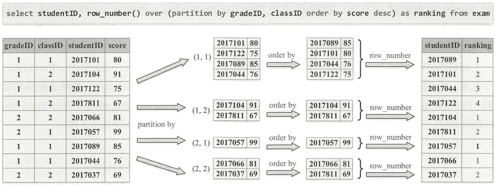


### 5.4.2 相关表达式

在 Catalyst 中，窗口表达式（WindowExpression）包含了窗口函数和窗框的定义。如图所示，窗口函数 WindowFunction 是 Expression 类型，即上述案例中的 row_number() 函数；窗口定义是 WindowSpecDefinition 类型，代表 SQL 语句中 over 关键字之后括号里边的内容。

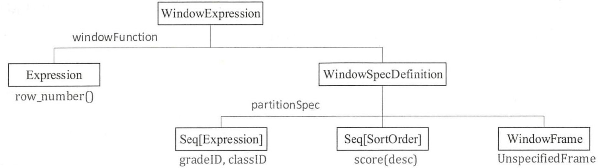

在 WindowSpecDefinition 中包含了前面提到的窗口函数的 3 个核心元素：分区信息、排序信息和窗框定义。分区信息类型为 Seq [Expression]，在上述案例中表示按照 gradeID 和 classID 这两列进行分区；排序信息类型为 Seq[SortOrder]，对应 score 列的降序；窗框（WindowFrare）定义比较重要，有 UnspecifedFrame 和 SpecifiedWindowFrame 两个子类，案例对应的是 UnspecifiedFrame 子类。

SpecifiedWindowFrame 表示一个完整的窗框定义，包含 frameType、frameStart、 frameEnd 3 个元素，分别代表窗框类型（FrameType）、起始的窗口边界（FrameBoundary）和终止的窗口边界（FrameBoundary）。如图所示，FrameBoundary 包含 UnboundedPreceding、 ValuePreceding(value: Int) 、CurrentRow、 ValueFollowing(value: Int） 和 UnboundedFollowing 5 种。

FrameType 有 RowFrame 和 RangeFrame 两种。RowFrame 针对窗口分区中的所有数据行，当 ValuePreceding 和 ValueFollowing 作为窗口边界时，**其中的 value 值代表物理偏移量**，例如“ROW BETWEEN 1  PRECEDING AND 2 FOLLOWING”表示 4 行数据构成的窗框，即从当前行的前一行到后两行。RangeFrame 针对的是用于排序的列，当 ValuePreceding 和 ValueFollowing 作为窗口边界时，**其中的 value 值代表逻辑偏移量**，例如假设当前行的 score 值为 87，而窗框的边界定义为“RANGE BETWEEN 1 PRECEDING AND 1 FOLLOWING”，那么所对应的数据窗口为 score 在 [86, 88] 范围内的数据行。

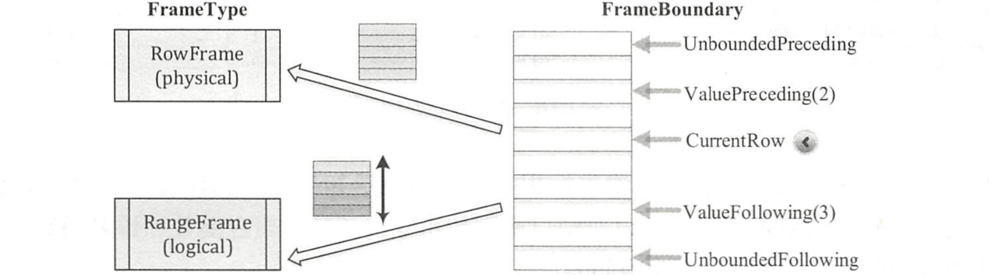

窗口函数是 Expression 的子类，需要定义 WindowFrame 来设定该函数执行的默认窗口范围。目前在 Spark SQL  中，内置实现的窗口函数共有 8 个，如表所示。其中，lead 和 lag 都属于 OffsetWindowFunction 的子类，用于计算与偏移量相关的数据；其他都属于 AggregateWindowFunction 类型，在窗框内执行聚合计算。需要注意的是，在窗口查询中，除上述窗口函数外，也支持常见的函数。

| WindowFunction | 用途                                                       |
| -------------- | ---------------------------------------------------------- |
| cume_dist      | 小于或等于当前值的行数占分组内总行数的比例                 |
| rank           | 生成的数据项在分组中的排名，排名相等会在名次中留下空位     |
| dense_rank     | 生成的数据项在分组中的排名，排名相等不会在名次中留下空位   |
| percent_rank   | （分组内当前行的 RANK 值 - 1）占（分组内总行数 - 1）的比例 |
| lead           | 统计窗口内往下第 k 行的值                                  |
| lag            | 统计窗口内往上第 k 行的值                                  |
| ntile          | 将分组数据按照顺序切分成 n 片，返回当前切片值              |
| row_number     | 从 1 开始，按照顺序生成分组内记录的序列                    |


### 5.4.3 逻辑计划和物理计划

上述 SQL 语句生成的抽象语法树和之前的简单查询语法树大同小异，这里不再全部罗列，仅重点展示窗口函数部分。如图所示，Window 函数的主要特点是 FunctionCallContext 节点下面多了一些与窗口相关的节点信息。图中的 WindowDefContext 节点代表窗口的定义，其中包含了一个 ExpressionContext 节点的列表（partition）来对应分区表达式，以及一个返回 SortItemContext 节点列表的函数（sortltem）来对应排序表达式。

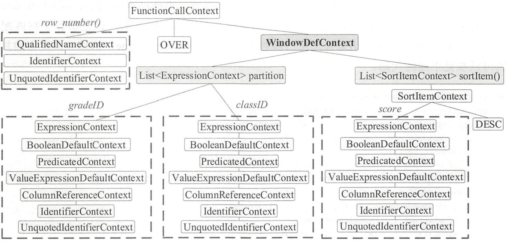

图中同时标出了函数名 row_number 和各个列所对应的子树。值得一提的是，如果 SQL 查询中涉及了窗框的相关信息，则 WindowDefContext 节点下面还会包含对应的 WindowFrameContext 节点。

当 FunctionCallContext 节点下面出现 WindowDefContext 节点时，ASTbuilder 会将该函数对应的表达式封装成 WindowExpression 表达式。如图所示为该查询生成的 Unresolved LogicalPlan 结构，有 UnresolvedRelation 和 Project 两个节点。

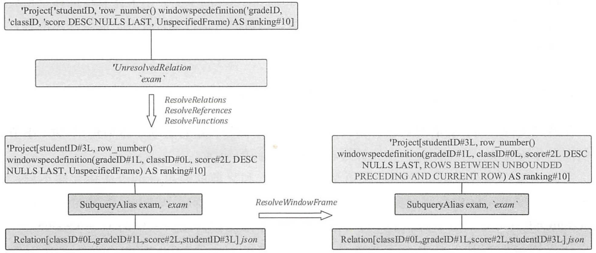

生成的 Unresolved LogicalPlan 经过 ResolveRelations、ResolveReference 和 ResolveFunctions 3 个解析规则的转换，得到的逻辑算子树如图左下方所示。接下来，该逻辑算子树匹配到 ResolveWindowFrame 规则，用来处理窗口函数中的窗框（WindowFrame）信息。该规则的具体逻辑代码如下，在解析并处理 WindowFrame 信息时有 3 种情况。

* 如果 WindowSpecDefinition 中指定了 WindowFrame（对应包含 SpecifiedWindowFrame 表达式），而窗口函数中也设置了 WindowFrame 且与该 WindowFrame 不相同，则 SQL 语句抛出分析异常。
* 如果查询中未指定 WindowFrame， 则将 WindowExpression 中的 WindowFrame 设置为窗口函数中的 WindowFrame 表达式。
* 查询中未指定 WindowFrame， 而且函数不是 WindowFunction 类型，因此不包含 WindowFrame 信息，此时会将 WindowExpression 设置为默认的 WindowFrame 表达式。

查询实例中的情况对应第二种模式， WindowSpecDefinition 表达式中未定义 WindowFrame 信息 （UnspecifiedFrame），因此直接使用窗口函数 row_number 中的 WindowFrame 设置（处理数据的范围是从开头到当前行）。生成的逻辑算子树如图右下方所示，可以看到其中 WindowExpression 表达式发生了变化。

```scala
object ResolveWindowFrame extends Rule[LogicalPlan] {
  def apply(plan: LogicalPlan): LogicalPlan = plan resolveExpressions {
    case WindowExpression(wf: FrameLessOffsetWindowFunction,
      WindowSpecDefinition(_, _, f: SpecifiedWindowFrame)) if wf.frame != f =>
      failAnalysis(s"Cannot specify window frame for ${wf.prettyName} function")
    case WindowExpression(wf: WindowFunction, WindowSpecDefinition(_, _, f: SpecifiedWindowFrame))
        if wf.frame != UnspecifiedFrame && wf.frame != f =>
      failAnalysis(s"Window Frame $f must match the required frame ${wf.frame}")
    case WindowExpression(wf: WindowFunction, s @ WindowSpecDefinition(_, _, UnspecifiedFrame))
        if wf.frame != UnspecifiedFrame =>
      WindowExpression(wf, s.copy(frameSpecification = wf.frame))
    case we @ WindowExpression(e, s @ WindowSpecDefinition(_, o, UnspecifiedFrame))
        if e.resolved =>
      val frame = if (o.nonEmpty) {
        SpecifiedWindowFrame(RangeFrame, UnboundedPreceding, CurrentRow)
      } else {
        SpecifiedWindowFrame(RowFrame, UnboundedPreceding, UnboundedFollowing)
      }
      we.copy(windowSpec = s.copy(frameSpecification = frame))
  }
}
```

从前面的分析可知，在最初生成的逻辑算子树中，与窗口相关的内容都是以表达式来表示的，而不是单独的窗口节点。例如，在案例中窗口表达式依赖 Project 节点。而要执行窗口函数相关的查询，生成窗口机制相关的逻辑算子节点 Window 乃至后续的物理算子节点 WindowExec 的步骤是必不可少的。

实际上，这一步复杂的转换过程由逻辑计划阶段的 ExtractWindowExpressions 规则完成。该规则用来从 WindowExpression 表达式中提取相关信息进行整合并生成单独的 Window 逻辑算子树节点。具体来讲，该规则处理以下 3 种情况。

* Project 节点的 projectList 表达式列表中包含的 WindowExpression 表达式。
* Aggregate 节点的 aggregateExpressions 表达式列表中包含的 WindowExpression 表达式。
* [Filter->Aggregate] 逻辑算子树结构模式。

针对每种情形，ExtractWindowExpressions 规则涉及以下两个重要的步骤。

* 表达式列表拆分：对于一个 NamedExpression 表达式列表（projectList 或 aggregateExpressions），将其分为两部分，其中一个是常规的表达式列表，另一个是所有的 WindowExpression 表达式列表。假设 select 语句中的表达式如下：`coll, sum(col2 + col3) OVER (PARTITION BY col4 ORDER BY col5)`。该规则会提取“col1”、“col2 + col3”、“col4”、“col5”，并根据列信息进行替换，那么该表达式列表会拆分为[col1, col2 + col3 as \_w0, col4 as \_w1, co15 as \_w2] 和 [sum(\_w0) OVER (PARTITIONBY_w1 ORDER BY_w2)] 两个表达式列表。
* Window 逻辑算子树节点创建：首先，对于上一步提取出来的所有 WindowExpression 表达式，根据其不同的窗口定义（WindowSpecDefnition）进行分组（注：相同的 WindowSpecDefinition 对应的窗口函数可以放在一起进行处理）；接着，针对每个不同的窗口定义（WindowSpecDefinition），创建 Window 逻辑算子树节点并将其插入到逻辑算子树中，需要注意的是每个 Window 逻辑算子节点相应地处理一个 WindowSpecDefinition 的窗口函数。

经过 ExtractWindowExpressions 规则的处理，得到的逻辑算子树如图所示。可以看到，WindowExpression 已经被提取出来生成了 Window 逻辑算子节点，同时围绕该节点添加了 3 个Project 节点。

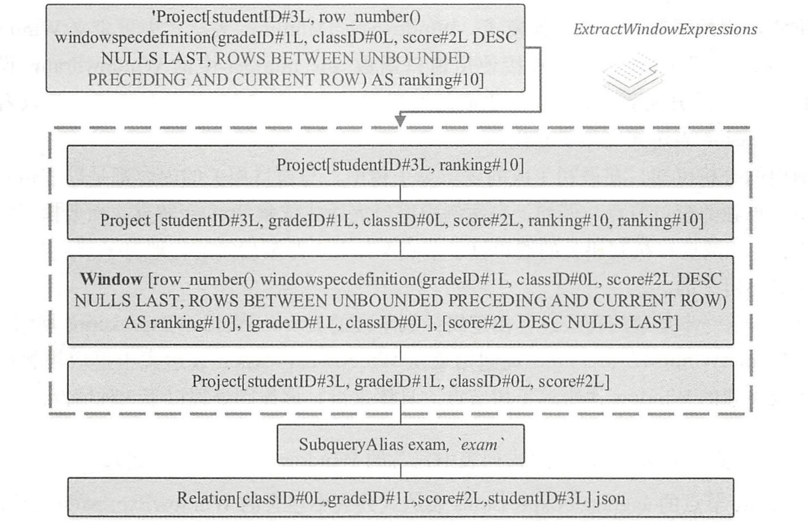

实际上，在 Analyzer 中，对于与 Window 相关的逻辑算子树，除上述两条规则外，还有 ResolveWindowOrder 规则，主要用来对排序功能进行验证，确保窗口语句中包含排序语句或 Rank 之类的窗口函数。因为本案例中已经包含了排序语句，所以上述过程没有体现出来。在上图所示的 Analyzed LogicalPlan 基础上，Optimizer 会进行进一步的优化。经过别名消除和 Project 节点整合之后，得到的逻辑算子树如图所示，有 Relation、 Project、 Window 和 Project 4 个逻辑算子节点。

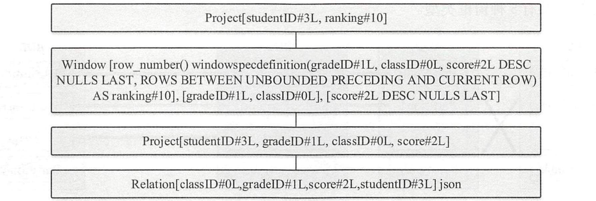

从逻辑算子树生成物理算子树的过程较简单，分别应用 BasicOperatiors 中的映射策略和 FileSourceStrategy 策略，生成对应的 SparkPlan，如图所示。在物理算子树中， WindowExec 节点对应 Window 逻辑算子节点，该节点在 Partitioning 和 Ordering 方面都有正确性的需求，因此在最后阶段的 EnsureRequirements 规则中，会添加  Exchange 节点进行 Shuffle 操作，以及添加 SortExec 节点进行排序操作，得到包含 6 个节点的物理执行计划。

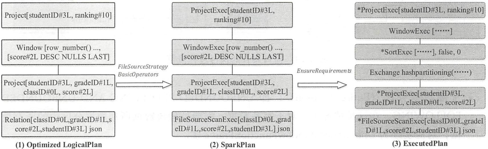


### 5.4.4 窗口函数执行

窗口函数的执行逻辑在 WindowExec 中实现。窗口聚合的执行过程如图所示， WindowExec 类的 requiredChildDistribution 和 requiredChildOrdering 方法分别规定了输入数据分布和有序性要求，因此在执行 WindowExec 之前，Exchange 和 Sort 完成重分区及分区内数据的排序。对应于本节的查询实例，Exchange 会按照（gradeID, classID） 进行分区，并按照 score 进行排序。

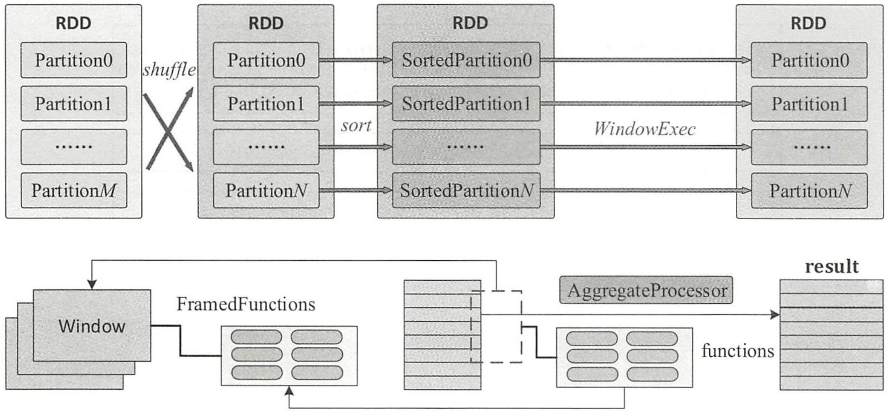

在WindowExec 执行中，有两个比较重要的概念：一个是 FramedFunctions，记录不同的窗口表达式 （WindowExpression）间的映射关系，同一个窗口可能包含多个窗口表达式，也就是多个窗口函数；另一个是AggregateProcessor，类似聚合语句中的 Aggregatelterator，通过执行具体的窗口函数进行实际的计算。

物理执行计划 WindowExec 用于在单个有序的数据分区中计算并输出窗口聚合结果，与普通聚合过程不同的是，窗口聚合会根据窗口函数的窗框等设置对每一行数据进行计算。根据前面的分析，共有 5 种窗框类型。

* **全部数据分区（Entire Partition）**：即 UNBOUNDED PRECEDING AND UNBOUNDEDFOLLOWING。 这种情况下，对于每条数据，需要处理该数据所在数据分区中的所有数据，对应实现为 UnboundedWindowFunctionFrame 类。
* **扩张框（Growing Frame）**：即 UNBOUNDED PRECEDING AND ..… 这种情况下，每次都会移动到新的数据行进行处理，并添加一些数据行扩展该框架，在这种类型的窗框中数据不会被移除，只会不停地加入新数据，窗口范围不停地“扩张”，对应的实现为 UnboundedPrecedingWindowFunctionFrame 类，案例中的row_number 函数就属于这种类型。
* **收缩框（Shrinking Frame）**：该框架只会移除数据，即 ..… AND UNBOUNDED FOLLOWING。这种情况下，每次都会移动到新的数据行进行处理，并从窗框中移除一些数据行，这种类型的窗框中不会添加数据，窗口不停地“收缩”，对应的实现为 UnboundedFollowingWindowFunctionFrame 类。
* **移动框（Moving Frame）**：每次处理到新的数据行，都会添加一些数据，同时也会删除一些数据，例如 (1 PRECEDING AND CURRENT ROW) 或 (1 FOLLOWING AND 2 FOLLOWING)，对应的实现为 SlidingWindowFunctionFrame 类。
* **偏移框（Ofset Frame）**：该窗框仅包含一行数据，即距离当前数据行特定偏移量的数据。需要注意的是，偏移框仅适用于 OffsetWindowFunction 类型的窗口函数。

这 5 种类型的窗框可以统一抽象为窗口函数执行框架，如图所示。从抽象层面来看，窗口函数执行阶段只处理两件事情，即准备数据行缓冲区（RowBuffer）和写入结果，对应的实现为 prepare 和 write 函数。

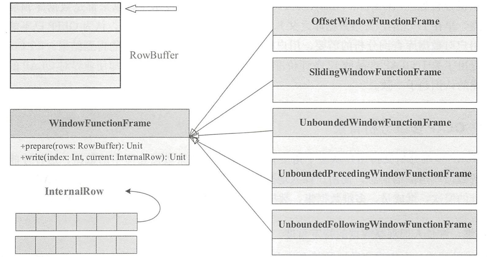

行缓冲区（RowBuffer）服务于单个窗口数据分区，实例中每个 (gradeID, classID) 分区的数据对应一个 RowBuffer。 考虑到窗口函数处理过程中需要反复扫描数据行，因此 RowBuffer 在本质上起到物化（Materialize）分区数据行的作用。RowBuffer 定义为抽象类，支持 size、next、skip 和 copy 4 种操作，具体实现包括 ArrayRowBuffer 和 ExternalRowBuffer 两种，分别对应内存和外存的情况。

根据 WindowExec 类 doExecute 方法可知，整体的执行逻辑分为两步。

* 按分区读取数据（fetchNextPartition），并将其保存在 ArrayBuffer 中，在此过程中先构造一个 ArrayRowBuffer 存储数据，如果超过阈值（默认为 4096），则切换为基于磁盘的 UnsafeExternalSorter 数据结构；当前分区数据读取结束后，根据 UnsafeExternalSorter 是否为空，判断分区数据保存在 ArrayRowBuffer 还是 ExternalRowBuffer 数据结构中。
* 遍历 RowBuffer 中的数据，逐条执行 write 操作，最终调用 AggregateProcessor（封装row_ number 函数） 中的 update 等方法完成计算。

AggregateProcessor 中的实现方式和普通的聚合操作的实现方式类似。值得一提的是，RowBuffer 在后续版本中替换成了更加安全、高效的实现（ExternalAppendOnlyUnsafeRowArray）。


## 5.5 多维分析

### 5.5.1 Spark SQL 多维查询

相比传统数据仓库，Spark SQL 中对多维分析的支持较为简单，底层也并不提供专门的存储结构。SQL 文法中多维分析的关键字有cube、rollup 和 grouping sets 3 种，下图展示了 Spark SQL 中多维分析的使用案例。

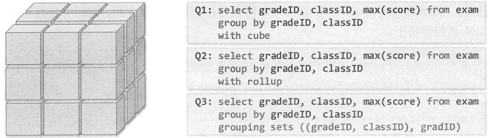

以 cube 关键字为例，上图中的 Q1 在 group by 子句中指定了维度列（案例中的 gradeID 和 classID） 和关键字 with cube。查询结果包含维度列中各维度值的所有可能组合，以及与这些维度值组合匹配的基础行中的聚合值，所以 Q1 的效果等价于以下多条 SQL 聚合查询结果的组合。

```sql
select gradeID, classID, max(score) from exam group by gradeID, classID 
union
select gradeID, null, max(score) from exam group by gradeID, null
union
select null, classID, max(score) from exam group by null, classID
union
select null, null, max(score) from exam group by null, null;
```

下图展示了含有 cube 运算符的 SQL 执行过程，根据 (gradelD, classID) 列是否为 null，共有 4 种情况，最终得到 9 条聚合结果。

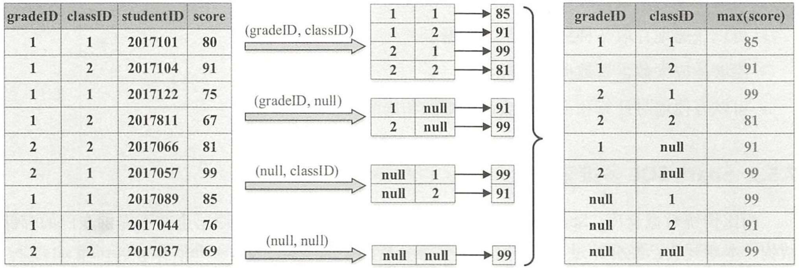

此外，rollup 和 grouping sets 与 cube 的不同之处在于列的组合方式，案例中含有 rollup 和 grouping sets 关键字的 SQL 语句分别等价于：

```sql
select gradeID, classID, max(score) from exam group by gradeID, classID 
union
select gradeID, null, max(score) from exam group by gradeID, null
union
select null, null, max(score) from exam group by null, null;
```

```sql
select gradeID, null, max(score) from exam group by gradeID, null 
union
select null, classID, max(score) from exam group by null, classID;
```

可以看到，多维分析在执行过程中一般都会产生空值（null）。在这种情况下，如何区分多维分析算子产生的 null 值和实际数据中的 null 值？常用的方法是使用 grouping 函数来区分，如果是由多维分析产生的 null 值，则函数返回 1；如果是数据本身的 null 值，则函数返回 0。


### 5.5.2 LogicalPlan 阶段

多维分析语句（cube、rollup 和 grouping sets）定义在聚合语句中。先回顾一下聚合语句对应的抽象语法树，下图展示了 cube 语句对应的树型结构。可以看到，AggregationContext 节点包含了一系列 ExpressionContext 节点列表，分别对应 group by 语句中的各列信息（案例中的 gradeID 和 classID 列）。该语句中包含 cube 关键宇，因此这里的 CUBE 子节点不为空。如果包含 rollup 关键宇，则对应的是 ROLLUP 节点；如果包含 grouping sets 关键字，则对应的是 GROUPING 节点和相关的分组表达式。

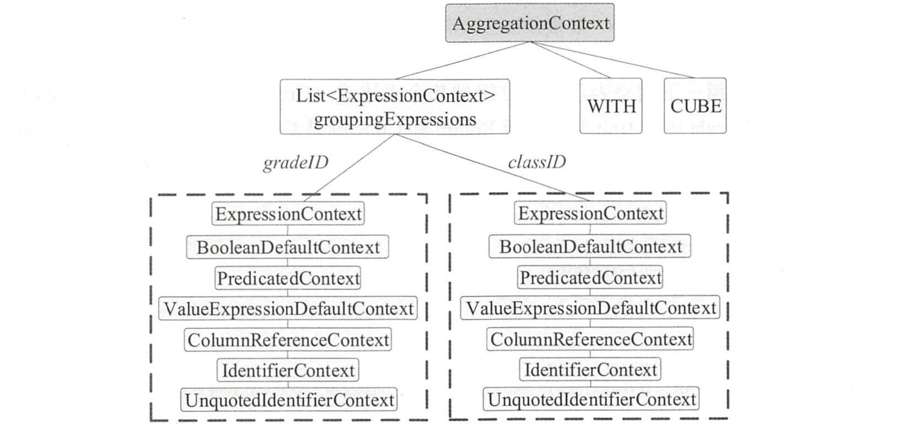

上述抽象语法树生成逻辑算子树的工作由 AstBuilder 完成。不同于一般的聚合查询，AstBuilder 对多维分析的处理多了一步针对 group by 语句的封装，具体可以参见其中的 withAggregation 函数实现。对于该案例，传递给 Aggregate 节点的 group by 表达式处理为 Seq(Cube(groupByExpressions))，生成的逻辑算子树如图所示。

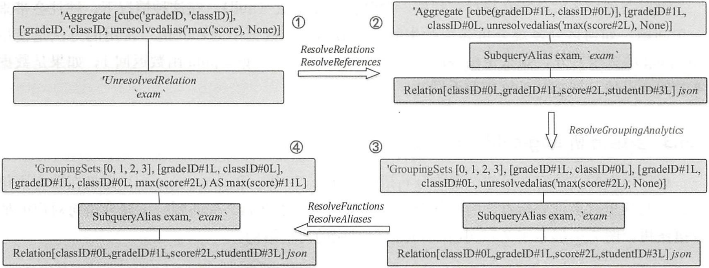

GroupingSet 是 Scala 中的 trait 类型，而 Rollup 和 Cube 则是 GroupingSet 的继承。GroupingSet 的实现如以下所示。由此可知，其主要作用在于记录聚合语句中包含了哪些分组表达式。

```scala
trait GroupingSet extends Expression with CodegenFallback {

  def groupByExprs: Seq[Expression]
  override def children: Seq[Expression] = groupByExprs

  override lazy val resolved: Boolean = false
  override def dataType: DataType = throw new UnsupportedOperationException
  override def foldable: Boolean = false
  override def nullable: Boolean = true
  override def eval(input: InternalRow): Any = throw new UnsupportedOperationException
}
```

在前面分析的过程中应用了常见的 ResolveRelations 和 ResolveReferences 规则，分别解析数据表信息和数据列信息。接下来，**对生成的逻辑算子树起作用的是 ResolveGroupingAnalytics 规则，该规则可以算是多维分析中最重要的部分**，主要进行以下 3 方面的处理或转换。

* 生成 GroupingSets 节点：针对 Aggregate 节点，如果其中 group by 语句对应的是 cube 或 rollup 表达式，计算相应的 bitmasks，将 Aggregate 节点转换为 Groupingsets 节点。需要注意的是，grouping sets 语句 在 AstBuilder 中完成了相应的转换。
* 生成 Expand + Aggregate 节点：针对 GroupingSets 节点，生成 Expand 逻辑算子树节点加上 Aggregate 逻辑算子树节点。这方面的处理是 ResolveGroupingAnalytics 规则的核心，后面将会重点分析。
* 替换多维分析函数（grouping_id 和 grouping 函数）：将逻辑算子树某些节点中（主要存在 Filter 或 Sort 节点）的表达式所包含的多维分析函数，替换为对应生成的列名（在 Expand 节点中生成）。

在替换多维分析函数的过程中，由于还存在未解析（resolved=false）的表达式，所以这里仅仅是将包含多维分析的 Aggregate 节点转换为 GroupingSets 节点。可以看到 cube 生成的 bitmasks 列表为 [0, 1, 2, 3]，正好对应 4 种情形。接下来，Analyzer 匹配 ResolveFunctions 和 ResolveAliases 规则，解析得到新的逻辑算子树。

然后，Analyzer 继续将 ResolveGroupingAnalytics 规则应用在新的逻辑算子树上，生成的结果如图所示。由此可知，GroupingSets 节点转换为 Aggregate + Expand + Project 3 个节点的组合。Expand 表示“扩展”，多维分析在本质上相当于执行多种组合的 group by 操作，因此 Expand 所起的作用就是将一条数据扩展为特定形式的多条数据，例如本案例 cube 对应 4 条数据。Expand 中有两个重要的信息，一个是表示扩展数据的 projections 列表，另一个是表示输出的 output 表达式。

为了支持 Expand 节点的操作，在 Expand 节点之前一般还会添加一个 Project 节点，所做的处理比较简单，额外添加 group by 语句中经过别名处理后的列。基于该处理，在 Expand 中还会根据对应的 bitmasks 数字生成对应的 grouping_id，同时在 output 中也会添加 spark_grouping_id 这一列。从下图中也可以看到，Aggregate 节点中的 group by 表达式也多了 spark_grouping_id 列。

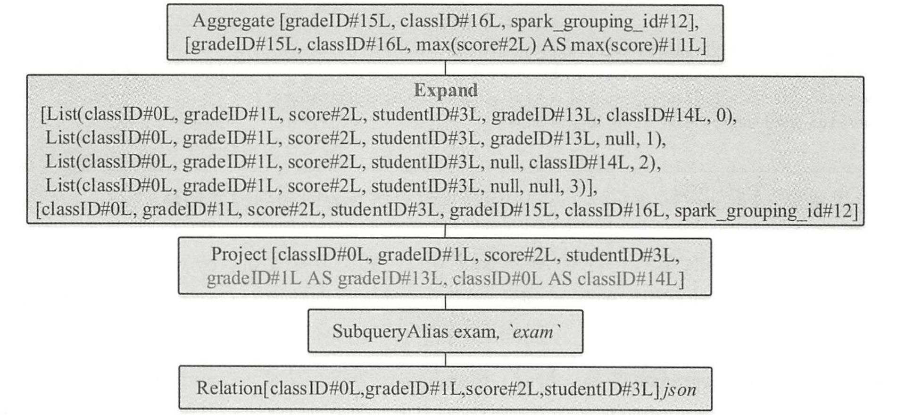

在 Analyzed LogicalPlan 生成后，如图上部分所示，进入 Optimizer 优化阶段。对于上述逻辑算子树，在Optimizer 中将会应用 EliminateSubqueryAliases（子查询别名去重）规则、ColumnPruning （列剪裁）规则、CollapseProject（投影整合）规则和 RemoveAliasOnlyProject 规则进行优化。每条规则的效果在此不再展开，最终生成的 Optimized LogicalPlan 如图下部分所示。

总体来看，Spark SQL 多维分析实现的主要思路是：在基础数据上添加特殊的分组“标签”，这样每一条基础数据都会“扩展” 成多条新的数据，然后针对新的数据执行一次聚合操作。

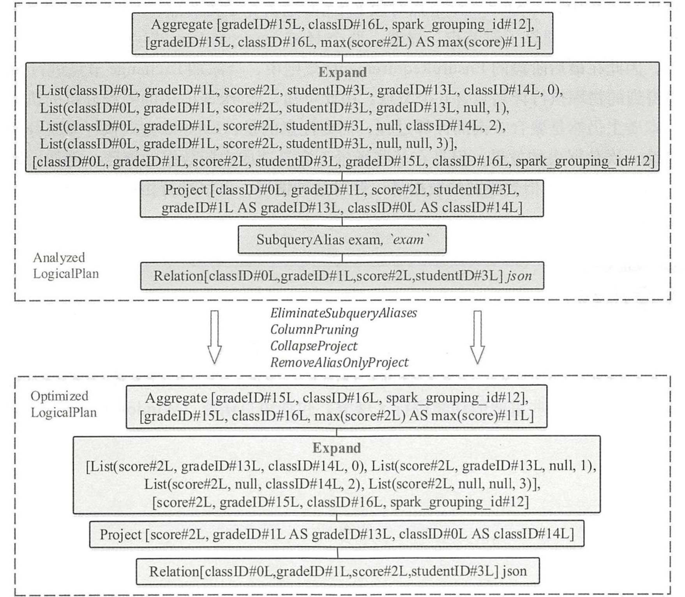


### 5.5.3 PhysicalPlan 与执行

从逻辑算子树生成物理算子树的过程比较简单，分别应用 BasicOperatiors 中的映射策略和 FileSourceStrategy 策略，生成对应的 SparkPlan，如图所示。

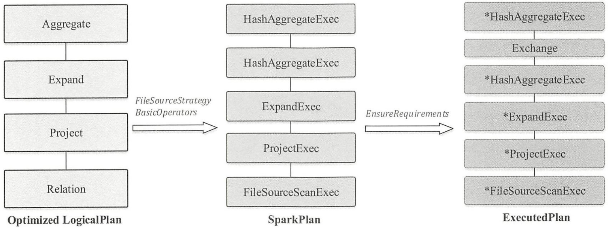

在物理算子树中，ExpandExec 节点对应 Expand 逻辑算子树节点，Aggregate 节点生成两个 HashAggregateExec 物理算子树节点。显然，两个 HashAggregateExec 节点之间需要进行分区方面的处理，因此在最后阶段的 EnsureRequirements 规则中，会添加 Exchange 节点进行 Shuffle 操作，最终得到的物理执行计划包含后 6 节点。由此可知，Spark SQL 中的多维分析的执行没有特殊之处，本质上仍然是聚合查询的计算过程。需要注意的是，Expand 方式执行多维分析虽然能够达到只读一次数据表的效果，但是在某些场景下容易造成中间数据的膨胀。例如，数据的维度太高，Expand 会产生指数级别的数据量。针对这种情况，可以进行相应的优化。


# 6. Spark SQL 之 Join 实现

## 6.1 文法定义

**在 ANSI SQL 标准中，共有 5 种 Join 方式：内连接（Inner）、全外连接（FullOuter）、左外连接（LeftOuter）、右外连接（RightOuter）和交叉连接（Cross）**。这里将 Join 查询中涉及的关系数据表称为基本表，假设除 student 基本表外，还有一个记录学生成绩的基本表 exam，包含 studentId 和 score 两列。如果想要知道每个学生的姓名和考试成绩，在查询层面就需要对 student 表和 exam 表进行连接操作，对应的 SQL 查询语句如下：`select name, score from student join exam on student.id = exam.studentId`。

在 Catalyst 的 SqlBase.g4 文法文件中，与 Join 相关的文法定义如下。可以看到，Join 语句主要针对的是关系数据表，一般处于 From 子语句中。在 FROM 关键字表示的数据源中，至少包含一个或多个 relation，以及可能的lateralView。每个 relation 包含一个主要的数据表（relationPrimary）和零个或多个参与 Join 操作的数据表 （joinRelation）。在 joinRelation 中，除参与 Join 的数据表外，比较重要的关键宇是 Join 的类型（joinType）和 Join 的条件（joinCriteria）。

```
fromClause : FROM relation (',' relation)* lateralView* pivotClause? ;
relation : relationPrimary joinRelation* ;
joinRelation : (joinType) JOIN right=relationPrimary joinCriteria?
    | NATURAL joinType JOIN right=relationPrimary ;
joinType : INNER? | CROSS | LEFT OUTER? | LEFT? SEMI | RIGHT OUTER? | FULL OUTER? | LEFT? ANTI ;
joinCriteria : ON booleanExpression | USING identifierList;
```

目前，**Spark SQL 中支持的 Join 类型主要包括 Inner、 FullOuter、 LeftOuter、RightOuter、LeftSemi、 LeftAnti 和 Cross 共 7 种**，对应的关键宇如表所示。

| 查询关键字                 | Join 类型  |
| -------------------------- | ---------- |
| inner                      | Inner      |
| outer \| full \| fullouter | FullOuter  |
| leftouter \| left          | LeftOuter  |
| rightouter \| right        | RightOuter |
| leftsemi                   | LeftSemi   |
| leftanti                   | LeftAnti   |
| cross                      | Cross      |

Inner 类型的 Join 等价于 A 和 B 参与 Join 的列数据集合求交集，Outer 类型的 Join 等价于 A 和 B 参与 Join 的列数据集合求并集，而 Cross 类型的 Join 对应 A 与 B 之间的笛卡儿积。需要特别注意 Join 操作得到的结果，Left 与 Right 在基本表的全部数据的基础上返回 Join 数据，Semi 跟 Inner 类似，区别在于 Semi 只返回左边基本表中的列，具体可参考 [Spark SQL 中不同类型的 JOIN](https://www.modb.pro/db/500030)。

```sql
-- 以下两个SQL等价
select student.id from student left semi join exam on student.id = exam.studentId
select id from student where id in (select studentId from exam)

-- 以下两个SQL等价，Anti Join 的结果与 Semi Join 的结果相反
select student.id from student left anti join exam on student.id = exam.studentId
select id from student where id not in (select studentId from exam)
```

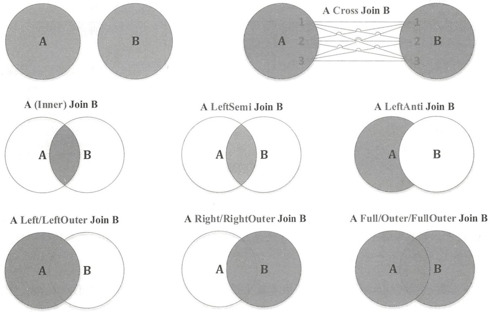

经过 ANTLR4 编译器的处理，该查询语句生成下图所示的抽象语法树。对于 Join 查询，值得关注的是 FromClauseContext 节点。第一个 TableNameContext 子节点对应文法定义中的 relationPrimary，即 student 数据表；第二个 TableNameContext 子节点对应 exam 数据表，在 JoinRelationContext 节点下还包含对应 Join 类型的 JoinTypeContext 子节点和对应 Join 条件的 JoinCriteriaContext 子节点。

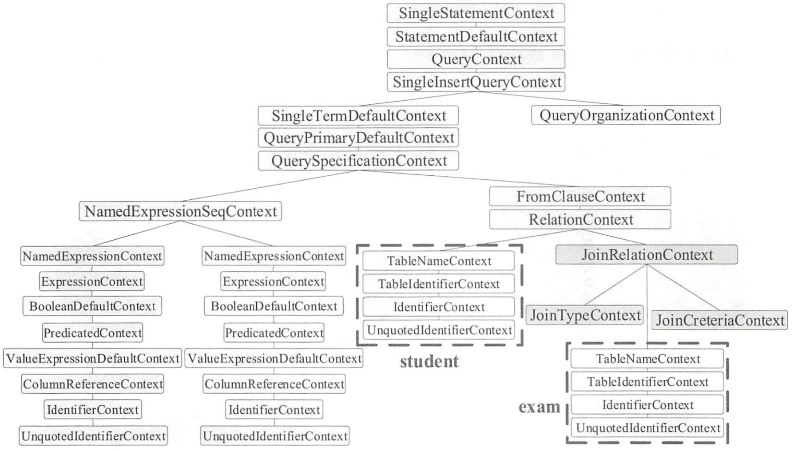

具体来看，JoinCriteriaContext 子节点本质上是一个表示 True 和 False 谓词逻辑的表达式节点 （BooleanDefaultContext），该子节点内容展开如图所示。在本例中，该表达式的左、右子表达式分别为 student.id 和 exam.studentId，这两个表达式都设置了数据表名，属于 DereferenceContext 类型。图中的 ComparisonOperatorContext 节点对应列之间的相等关系。

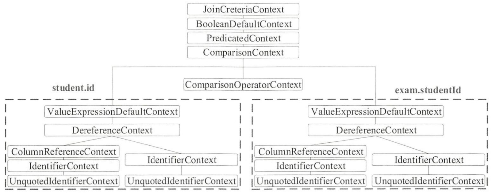


## 6.2 Join 查询逻辑计划

### 6.2.1 Unresolved LogicalPlan

与 Join 算子相关的部分主要在 From 子句中，这里不再展开介绍 Select 语句对应的逻辑算子树生成过程。具体来看，逻辑计划生成过程由 AstBuilder 类定义的 visitFromClause 方法开始，其核心代码如下。

```scala
override def visitFromClause(ctx: FromClauseContext): LogicalPlan = withOrigin(ctx) {
  val from = ctx.relation.asScala.foldLeft(null: LogicalPlan) { (left, relation) =>
    val right = plan(relation.relationPrimary)
    val join = right.optionalMap(left)(Join(_, _, Inner, None, JoinHint.NONE))
    withJoinRelations(join, relation)
  }
  if (ctx.pivotClause() != null) {
    if (!ctx.lateralView.isEmpty) {
      throw new ParseException("LATERAL cannot be used together with PIVOT in FROM clause", ctx)
    }
    withPivot(ctx.pivotClause, from)
  } else {
    ctx.lateralView.asScala.foldLeft(from)(withGenerate)
  }
}
```

从 FromClauseContext 中得到的 relation 是 RelationContext 的列表。根据前面的文法分析可知，每个RelationContext 代表一个通过 Join 连接的数据表集合，每个 RelationContext 中有一个主要的数据表（RelationPrimaryContext）和多个需要 Join 连接的表（JoinRelationContext），如图所示。

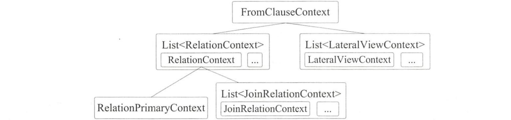

代码中针对 RelationContext 对象列表进行 foldLeft 操作，将已经生成的逻辑计划与新的 RelationContext 中的主要数据表（relationPrimary）结合得到 Join 算子（optionalMap 方法），然后将生成的 Join 算子加入新的逻辑计划中。对于本例来说，FromClauseContext 对应的 RelationContext 列表中只有一个元素，其 relationPrimary 为 student 数据表。由于初始的 LogicalPlan 为 null，所以上述代码中的 join 值同样为 student 对应的 LogicalPlan。然后调用 withJoinRelations 方法，将得到的 LogicalPlan 与数据表 exam 进行 Join 操作。

在进一步考察 witbJoinRelations 的实现逻辑之前，有必要介绍几个重要的对象。首先，用来表示 Join 操作类型的 JoinType，其 UML 如图所示。JoinType 实现为抽象类，里面定义了返回 Join 类型字符串的函数，共实现了 11 个子类，其中 InnerLike 又细分为 Inner 和 Cross 类型。

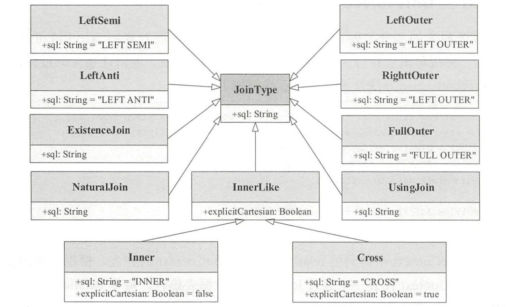

其次，用来表示 Join 操作的逻辑算子节点是 Join 类，如图所示，其中 left、right、 joinType 和 condition 作为构造参数，分别表示 Join 操作的左节点、右节点、Join 类型和 Join 条件。作为 BinaryNode 节点类型，Join 类中重载了 resolved 属性和 statistics 属性，同时也重载了output 函数和 validConstraints 函数，这两个函数逻辑决定了不同 Join 类型输出的列和内部约束条件的整合。注意 duplicateResolved 函数在 Join 操作中涉及两个数据表，因此可能存在相同 ID 的表达式，该函数用来确保不会因为这种重复而出现表达式歧义。

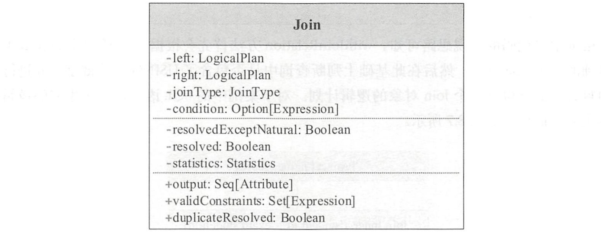

接下来回到 AstBuilder 中的逻辑，在 visitFromClause 方法中生成 primaryRelation（student 表）对应的 LogicalPlan 之后，进入 withJoinRelation 方法中对 JoinRelationContext 中的表进行处理，其实现逻辑如下。

```scala
// 将一个或多个逻辑计划（LogicalPlan）连接到当前的逻辑计划中
private def withJoinRelations(base: LogicalPlan, ctx: RelationContext): LogicalPlan = {
  ctx.joinRelation.asScala.foldLeft(base) { (left, join) =>
    withOrigin(join) {
      val baseJoinType = join.joinType match {
        case null => Inner
        case jt if jt.CROSS != null => Cross
        case jt if jt.FULL != null => FullOuter
        case jt if jt.SEMI != null => LeftSemi
        case jt if jt.ANTI != null => LeftAnti
        case jt if jt.LEFT != null => LeftOuter
        case jt if jt.RIGHT != null => RightOuter
        case _ => Inner
      }

      // 解析join类型和join条件
      val (joinType, condition) = Option(join.joinCriteria) match {
        case Some(c) if c.USING != null =>
          (UsingJoin(baseJoinType, visitIdentifierList(c.identifierList)), None)
        case Some(c) if c.booleanExpression != null =>
          (baseJoinType, Option(expression(c.booleanExpression)))
        case Some(c) =>
          throw new ParseException(s"Unimplemented joinCriteria: $c", ctx)
        case None if join.NATURAL != null =>
          if (baseJoinType == Cross) {
            throw new ParseException("NATURAL CROSS JOIN is not supported", ctx)
          }
          (NaturalJoin(baseJoinType), None)
        case None =>
          (baseJoinType, None)
      }
      Join(left, plan(join.right), joinType, condition, JoinHint.NONE)
    }
  }
}
```

withJoinRelation 方法首先会根据 SQL 语句中的 Join 类型构造基础的 JoinType 对象，然后在此基础上判断查询中是否包含了 USING 等关键字，并进行进一步的封装，最终得到一个 Join 对象的逻辑计划。对于案例中的 SQL 语句，最终生成的逻辑计划如图所示。

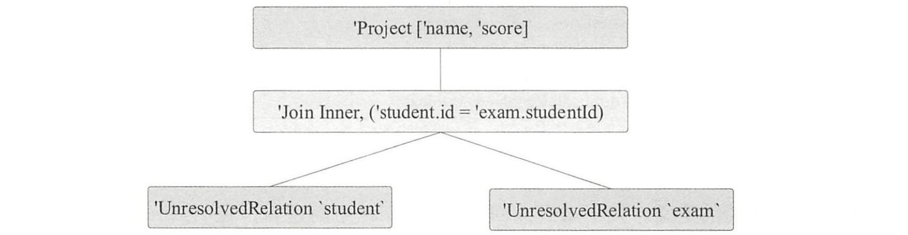


### 6.2.2 Analyzed LogicalPlan

在 Analyzer 中，与 Join 相关的解析规则有很多，包括 ResolveReferences 和 ResolveNaturalAndUsingJoin 等。对于上图中的逻辑算子树，整个解析过程如下图所示。可以看到，ResolveRelations 和 ResolveReferences 两条规则产生了影响。ResolveRelations 规则的作用是从 Catalog 中找到 student 和 exam 的基本信息，包括数据表存储格式、每一列列名和数据类型等。ResolveReferences 规则负责解析所有列信息，对于上面的逻辑算子树，ResolveReferences 的解析是一个自底向上的过程，将所有 UnresolvedAttribute 与 UnresolvedExtractValue 类型的表达式转换成对应的列信息。

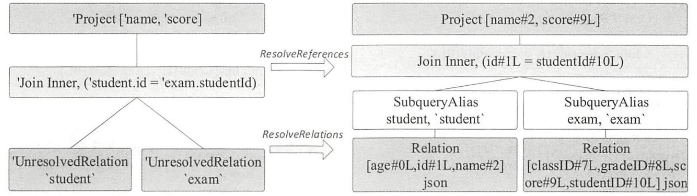

在 ResolveReferences 规则中，如果传入的逻辑算子树根节点为 Join 类型，则还存在如下逻辑来处理 Join 中冲突的列。在 dedupRight 方法中，针对存在冲突的表达式会创建一个新的逻辑计划，通过增加别名 （Alias） 的方式来避免列属性的冲突。根据该逻辑，如果 Join 操作存在重名的属性（左、右子节点的输出属性名集合有重叠），那么就调用 dedupRight 方法将右子节点对应的 Expression 用一个新的 Expression ID 表示，这样即使出现同名，经过处理之后 Expression ID 也不相同，因此可以区分 Join 操作中不同的数据表。

```scala
// 为右侧子节点生成一个新的逻辑计划，其中所有冲突属性的表达式ID都不同
private def dedupRight (left: LogicalPlan, right: LogicalPlan): LogicalPlan = {
  val conflictingAttributes = left.outputSet.intersect(right.outputSet)
  // ...
}
```

在 Analyzer 中，还有一个和 Join 操作直接相关的 ResolveNaturalAndUsingJoin 规则。该规则将 NATUAL 或 USING 类型的 Join 转换为普通的 Join。其主要处理逻辑是根据 Join 两边的输出列信息计算得到总的输出列信息，然后将 Project 算子添加到常规的 Join 算子上。


### 6.2.3 Optimized LogicalPlan

逻辑算子树优化的第一阶段就是消除多余的别名，对应 EliminateSubqueryAliases 优化规则。该规则将 SubqueryAlias(\_, child, \_）节点直接替换为 child 节点，如图所示。可以看到，Relation 原来的 SubqueryAlias 父节点已经被移除，Join 成为 Relation 的父节点。

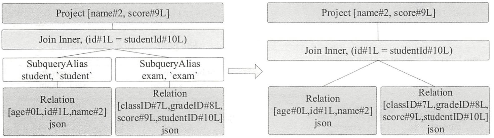

经过别名消除之后，接下来的优化是常用的列剪裁（ColumnPruning），在上述逻辑算子树中，父节点只需要用到两个数据表中的 4 列，因此可以在 Relation 节点之后添加新的 Project 节点进行列剪裁的操作，如图所示。

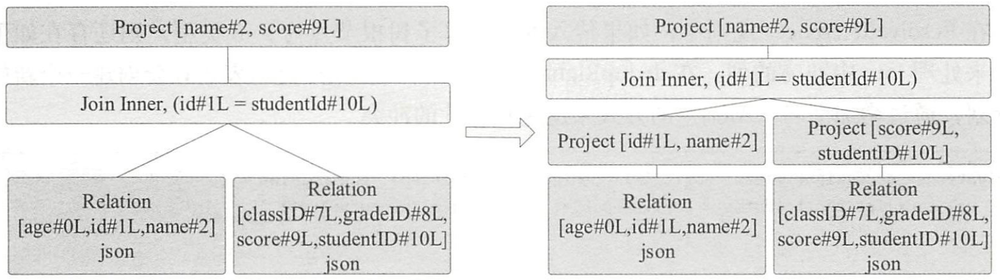

然后，优化过程将考虑相关算子中的过滤条件。对于 Join 来讲，其连接条件需要保证两边的列都不为 null，因此会触发 InferFitersFromConstraints 优化规则。如图所示，经过该规则的处理，Join 算子中的连接条件多了两个，分别约束 student 表中的 ID 和 exam 表中的 studentId 不为 null。

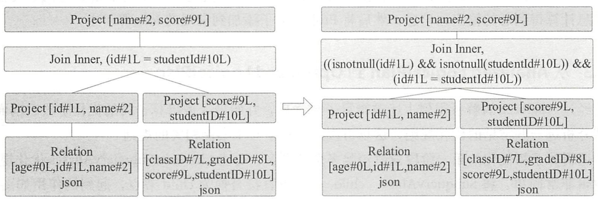

在 Optimizer 阶段，有一条专门针对 Join 算子的 PushPredicateThroughJoin 优化规则。**该规则对 Join 中连接条件可以下推到子节点的谓词进行下推操作**。因为经过上一步的优化规则，逻辑算子树中 Join 节点多了两个条件用来判定列不为 null，这两个条件只涉及单个数据表，因此可以下推到对应的子节点中，尽早过滤数据，如图所示。

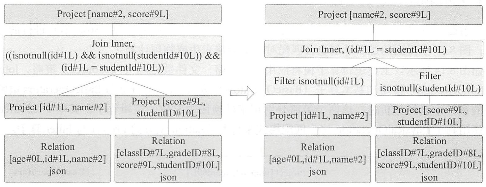

经过 PushPredicateThroughJoin 优化规则后，Join 中的两个连接条件生成了对应的两个 Filter 节点。一般来讲，优化阶段会将过滤条件尽可能地下推，因此逻辑算子树中的 Filter 节点还会被继续处理。该逻辑对应 PushDownPredicate 优化规则，得到的新的逻辑算子树如图所示，Filter 节点已经位于 Project 节点之下。至此，整个逻辑算子树的优化工作完成。

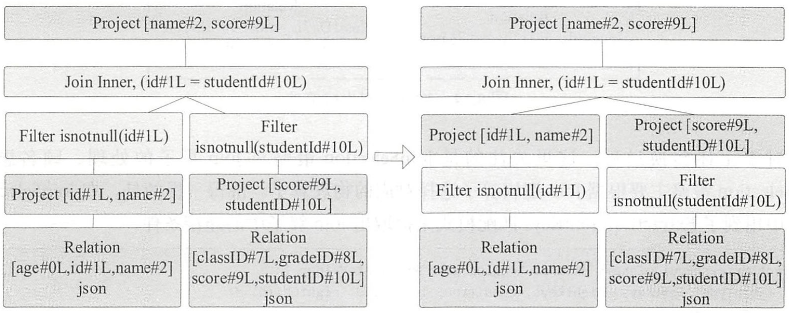


## 6.3 Join 查询物理计划

### 6.3.1 Join 物理计划生成

前面介绍过，从逻辑计划到物理计划的生成是基于策略（Strategy）进行的，如图所示，上述逻辑算子树将应用 3 个策略：**文件数据源（FileSource）策略、Join 选择（JoinSelection）策略和基本算子（BasicOperators）策略**。FileSource 与 BasicOperators 策略在前面章节中已经分析过，分别用来转换图中对应的逻辑算子，其中 FileSource 策略中还用到了 PhysicalOperation 这个匹配模式来合并 Relation 上方的 Project 与 Filter 算子。

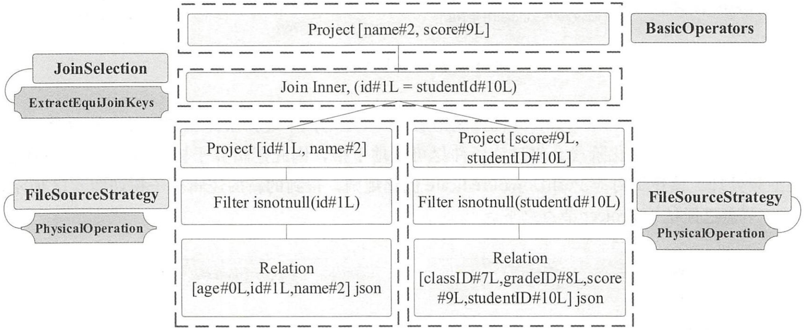

对于上述转换过程，这里关注 JoinSelection 策略对 Join 算子的处理。该策略主要根据 Join 逻辑算子选择对应的物理算子。值得一提的是，在 JoinSelection 策略中用到了 ExtractEquiJoinKeys 匹配模式来提取出 Join 算子中的连接条件。其主要逻辑如下：如果是等值连接（Egui-Join），则将左、右子节点的连接 key 都提取出来。此时存在两种情况：EqualTo 和 EqualNullSafe。两者的区别在于对空值 null 是否敏感，其中，EqualTo 对空值是敏感的，对空值没有额外的处理逻辑，EqualNullSafe 在一般情况下的处理逻辑基本与 EqualTo 一样，但是它会对空值做处理，即赋予相应类型的默认值。这两种情况和用户编写的 SQL 语句有关，**当 SQL 语句中 Join 条件表达式为 = 或 == 时，会对应 EqualTo 模式；当 Join 条件表达式为 <=> 时，会对应 EqualNullSatfe 模式**。此外，在 ExtractEguijoinKeys 中还通过 otherPredicates 记录除 EqualTo 和 EqualNullSafe 类型外的其他条件表达式，这些谓词基本上可以在 Join 算子执行 Shuffle 操作之后在各个数据集上分别处理。

```scala
object ExtractEquiJoinKeys extends Logging with PredicateHelper {
  // ...

  def unapply(join: Join): Option[ReturnType] = join match {
    case Join(left, right, joinType, condition, hint) =>
      logDebug(s"Considering join on: $condition")
      val predicates = condition.map(splitConjunctivePredicates).getOrElse(Nil)
      val joinKeys = predicates.flatMap {
        case EqualTo(l, r) if l.references.isEmpty || r.references.isEmpty => None
        case EqualTo(l, r) if canEvaluate(l, left) && canEvaluate(r, right) => Some((l, r))
        case EqualTo(l, r) if canEvaluate(l, right) && canEvaluate(r, left) => Some((r, l))
        case EqualNullSafe(l, r) if canEvaluate(l, left) && canEvaluate(r, right) =>
          Seq((Coalesce(Seq(l, Literal.default(l.dataType))),
            Coalesce(Seq(r, Literal.default(r.dataType)))),
            (IsNull(l), IsNull(r))
          )
        case EqualNullSafe(l, r) if canEvaluate(l, right) && canEvaluate(r, left) =>
          Seq((Coalesce(Seq(r, Literal.default(r.dataType))),
            Coalesce(Seq(l, Literal.default(l.dataType)))),
            (IsNull(r), IsNull(l))
          )
        case other => None
      }
      val otherPredicates = predicates.filterNot {
        // ...
      }

      // ...
  }
}
```


### 6.3.2 Join 物理计划选取

基于上述分析，该案例对应生成的物理计划如图所示。可以看到，物理计划的节点和逻辑计划的节点基本上一一对应。在生成物理计划的过程中，JoinSelection 根据若干条件判断采用何种类型的 Join 执行方式。目前在 Spark SQL 中，**Join 的执行方式主要有 BroadcastHashJoinExec、ShuffledHashJoinExec、SortMergeJoinExec、BroadcastNestedLoopJoinExec 和 CartesianProductExec 这 5 种**。

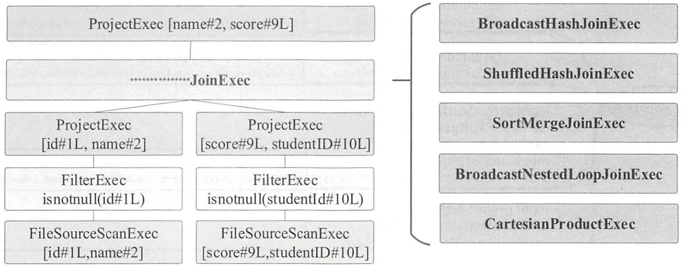

先介绍 Join 实现中会用到的一些基本概念和针对数据表的一些特点的定义。

* **数据表能否广播**：在两个表的 Join 操作中，如果一个数据表的数据量非常小，则可以将这个表广播到另一个表数据所在的所有节点上。在 JoinSelection 中通过 canBroadcast 方法来判断一个数据表对应的逻辑计划能否广播。在 Spark SQL 中，可以通过 spark.sql.autoBroadcastJoinThreshold 参数设置自动广播的阈值（单位为 Byte），当某个表的数据量小于这个阈值时，这个表将自动进行广播操作，默认值为 10 MB。
* **Join 操作的 BuildSide**：参与 Join 操作的左右两个数据表起到的作用是不一样的，例如，在
   BroadcastHashJoin 中需要决定广播哪个数据表等。这里的 BuildSide 可以简单理解为“构建的一边”，具体含义会在后面的执行阶段分析。目前，在 Catalyst 中 BuildSide 作为一个抽象类，包含 BuildLeft 和 BuildRight 两个子类，一般在构造 Join 的执行算子时，都会传入一个 BuildSide 构造参数。在 JoinSelection 中通过 canBuildRight 和 canBuildLeaf 判断一个 Join 类型能否“构建” 右表和左表，根据源码可知，只有 InnerLike 或 RightOuter 类型的 Join 时，左表才能够被“构建”。
* **建立 HashMap（BuildLocallashMap）**：某些 Join 在执行过程中需要创建 HashMap 以在内存中保存相关的数据，当数据量大的时候，单个分区上创建 HashMap 可能导致内存溢出。在 JoinSelection 中实现了一个比较粗粒度的方法 canBuildLocalHashMap 来判断某个逻辑计划能否满足创建本地 HashMap 的条件，主要思想是当前逻辑计划的数据量小于数据广播阈值与 Shuffle 分区数目的乘积。

如图所示，对于 5 种不同类型的 Join 执行方式，JoinSelection 中有着先后的匹配逻辑。

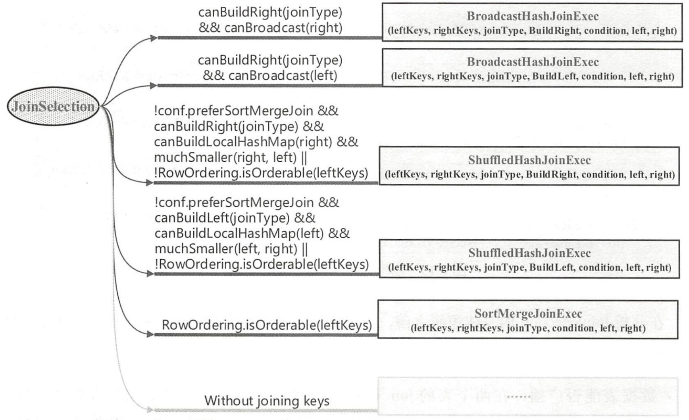

**优先级最高的是 BroadcastHashJoinExec**， 这种 Join 执行方式相对来讲效率最高，因此也是最先进行判断的。具体来讲，它包含两种情况。

* 能够广播右表（canBroadcast） 且右表能够“构建”（canBuildRight)，那么构造参数中传入的是 BuildRight
* 能够广播左表（canBroadcast） 且左表能够“构建”（canBuildtLeft），那么构造参数中传入的是 BuildLeft

**优先级次之的是 ShuffledHashJoinExec**，该类型的 Join 执行方式需要满足多种条件。ShuffledHashJoinExec 的构造同样分为 BuildLeft 和 BuildRight 两种情况，以 BuildRight 为例。首先，配置中优先开启 SortMergeJoin 的参数 spark.sql.join.preferSortMergeJoin 设置为 false，且右表需要满足能够“构建”（canBuildRight）和能够建立 HashMap（canBuildLocalHashMap），同时右表的数据量要比左表的数据量小很多（3 倍以上）。此外，还有一种生成 ShuffledHashJoinExec 的情况是参与连接的 key 不具有排序的特性。

**最常见的 Join 执行方式就是 SortMergeJoinExec**，参与 Join 的 key 满足可排序的特性即可。所以，在实际生产环境中，绝大部分 Join 的执行都是采用 SortMergeJoinExec 方式进行的。

**剩下的情况都是不包含 Join 条件的语句**，大致逻辑如下：首先判断是否执行数据表广播操作，对应 BuildLeft 和 BuildRight 两种情况，生成 BroadcastNestedLoopJoinExec 类型的 Join 物理算子。如果不满足数据表广播操作，而 Join 类型是 InnerLike，那么就会生成 CartesianProductExec 类型的 Join 物理算子。如果上述情況都不满足，那么只能选择两个数据表中数据量相对较少的数据表来做广播，同样生成 BroadcastNestedLoopJoinExec 类型的 Join 物理算子。


## 6.4 Join 查询执行

### 6.4.1 Join 执行基本框架

在 Spark SQL 中，Join 的实现都基于一个基本流程，如图所示。根据角色的不同，**参与 Join 操作的两张表分別被称为流式表（StreamTable）和构建表（BuildTable）**，不同表的角色在 Spark SQL 中会通过一定的策略进行设定。通常来讲，系统会默认将大表设定为流式表，将小表设定为构建表。流式表的迭代器为 streamedIter，构建表的迭代器为 buildlter。遍历 streamedlter 中每条记录，然后在 buildlter 中查找相匹配的记录。这个查找过程称为 Build 过程，每次 Build 操作的结果为一条 JoinedRow(A, B)，其中 A 来自 streamedlter， B 来自 buildIter，这个过程为 BuildRight 操作；而如果 B 来自 streamedlter， A 来自 buildIter，则为 BuildLeft 操作。

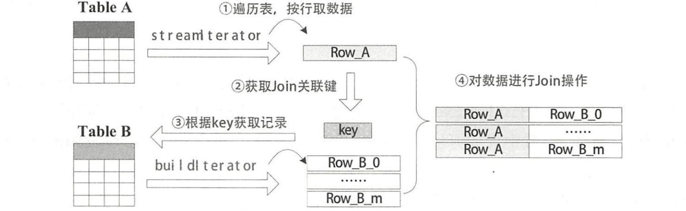

对于 LeftOuter、RightOuter、LeftSemi 和 LeftAnti，它们的 Build 类型是确定的，即 LeftOuter、LeftSemi、LefAnti 为 BuildRight，RightOuter 为 BuildLeft 类型。对于 Inner，BuildLeft 和 BuildRight 两种都可以，选择不同，可能有着很大的性能区别。

在具体 Join 实现层面，Spark SQL 提供了 BroadcastJoinExec、ShuffleHashJoinExec 和 SortMergeJoinExec 这 3 种机制，以下 3 个小节分别进行介绍。


### 6.4.2 BroadcastJoinExec 执行机制

**该 Join 实现的主要思想是对小表进行广播操作，避免大量 Shuffle 的产生**，这也是一种常见的思路。Join 操作是对两个表中 key 值相同的记录进行连接，在 Spark SQL 中，对两个表做 Join 操作最直接的方式是先根据 key 分区，然后在每个分区中把 key 值相同的记录提取出来进行连接操作。这种方式不可避免地涉及数据的 Shuffle，而 Shuffe 是比较耗时的操作。因此，当一个大表和一个小表进行 Join 操作时，为了避免数据的 Shuffle，可以将小表的全部数据分发到每个节点上，供大表直接使用。

在 Spark SQL 中，BroadcastJoinExec 可以进行用户设置，触发的场景有两个。

* 被广播的表需要小于参数（spark.sql.autoBroadcastJoinThreshold）所配置的值，默认 10 MB
* 在 SQL 语句中人为添加了 Hint（MAPJOIN、BROADCASTJOIN 或 BROADCAST）

需要注意的是，**在 Outer 类型的 Join 中，基表不能被广播**，例如当 A left outer join B 时，只能广播右表 B。一般 BroadcastJoinExec 只适用于广播较小的表，否则数据的冗余传输远大于 Shuffle 的开销。另外，**广播时需要将被广播的表读取到 Driver 端**，当频繁有广播出现时，对 Driver 端的内存也会造成较大压力。基于广播的 Join 的物理执行计划和最终执行计划如图所示。

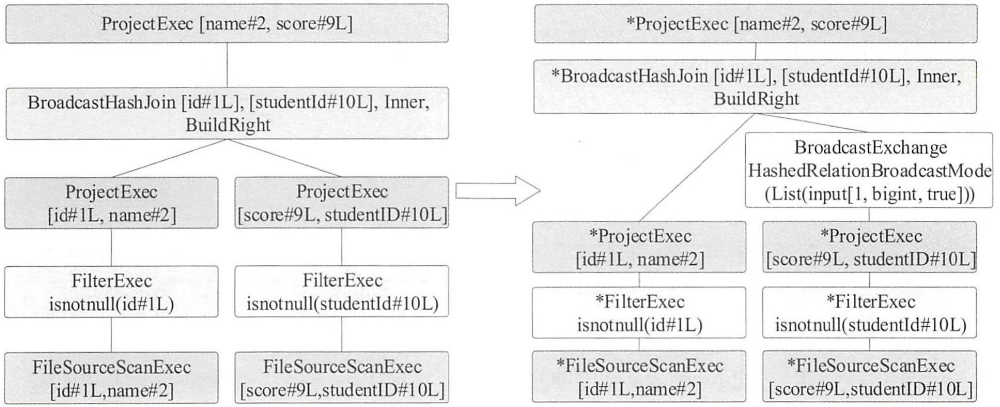

具体执行过程如图所示。BroadcastExchange 将广播表广播到每个节点上进行 Join 操作。

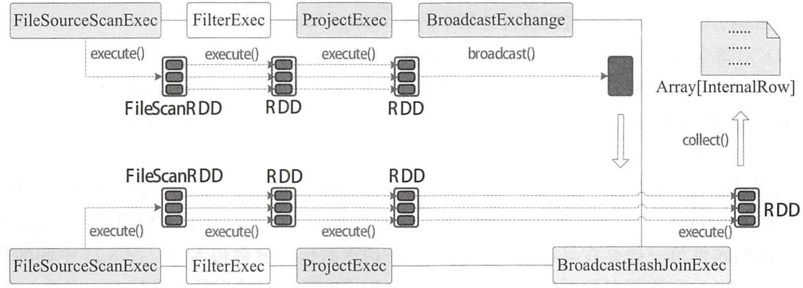


### 6.4.3 ShuffledHashJoinExec 执行机制

ShuffledHashJoinExec 物理执行计划和最终执行计划如图所示，其执行机制分为两步：

* 对两张表分别按照 Join key 进行重分区，即 Shuffle，目的是为了让有相同 key 值的记录分到对应的分区中，这一步对应执行计划中的 Exchange 节点。
* 对每个对应分区中的数据进行 Join 操作，此处先将小表分区构造为一张 Hash 表，然后根据大表分区中记录的 key 值进行匹配，即执行计划中的 ShuffledHashJoinExec 节点。

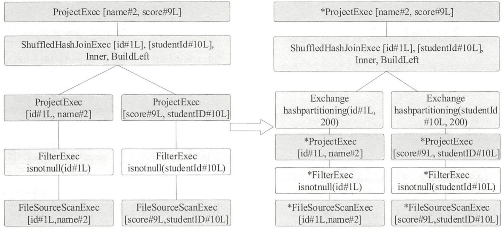

ShuffledHashJoinExec 父类 HashJoin 操作框架如图所示。其基本属性包括连接左键（leftKeys）、连接右键（rightKeys）、连接类型（joinType）、构建侧（buildSide）、连接条件（condition）、左表物理计划（left）和右表物理计划（right）共 7 个，这些属性值一般是在具体的 Join 物理算子构造时作为参数传入的。中间的属性 boundCondition 和连接条件属性 condition 等价，用来判断一行数据是否满足 Join 条件。此外，图中还有两个属性对 (buildPlan, streamedPlan) 与 (buildkeys, streamedKeys)，用来区分参与 Join 的两个数据表（构建表和流式表）的角色。构建表在 Join 过程中会创建一个 HashMap，用来支持数据的查找，属于“静态”的一方。流式表在 Join 过程中，一行一行地在构建表对应的 HashMap 中查找数据，属于”动态“的一方。

在 HashJoin 中，已经在构造的时候确定了Buildside 是 BuildLeft 还是 BuildRight，因此两个表的角色也就很容易确定了。通常情况下，会将数据量较小的表作为构建表，将数据量较大的表作为流式表。考虑到 Stream 表属于动态的一方，会涉及数据的分区，因此其 outputPartitioning 由 StreamPlan 中的输出分区决定。

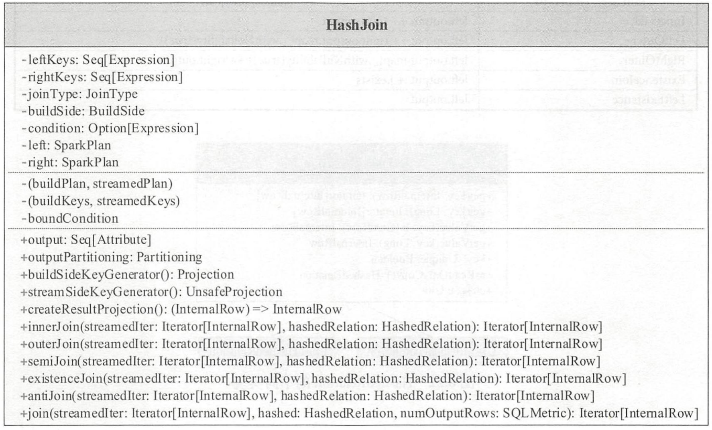

HashJoin 中的 output 函数表示输出的列，由 Join 类型决定。同样的，在 createResultProjection 方法中，逻辑也和 Join 类型相关。当 Join 类型为 LeftExistence 时，创建的 Projection 的 schema 和 output 相同；否则，采用的 schema 为 streamedPlan 的输出加上 buildPlan 的输出。

在 HashJoin 中最核心的部分就是图中的 6 个 Join 函数了。从这些函数的输入参数中可以看到，都包含了一个 HashedRelation 类型。实际上，HashedRelation 就对应了上面提到的构建表，起到了 HashMap 的作用。

如图所示，HashedRelation 实际上是 KnownSizeEstimation 之上的一个接口，该接口支持根据 key 获取匹配到的 InternalRow 选代器或单行数据。Key 的类型除常见的 InternalRow 外，还支持 Long 类型。HashedRelation 具体实现包括 UnsafeHashedRelation 和 LongHashedRelation 两种。UnsafeHashedRelation 是常用的类型，内部依赖 BytesToBytesMap 数据结构，而 LongHashedRelation 类型的 HashedRelation 是一种基于追加方式的  HashMap，其键值对形式为 (Long, UnsafeRow)。

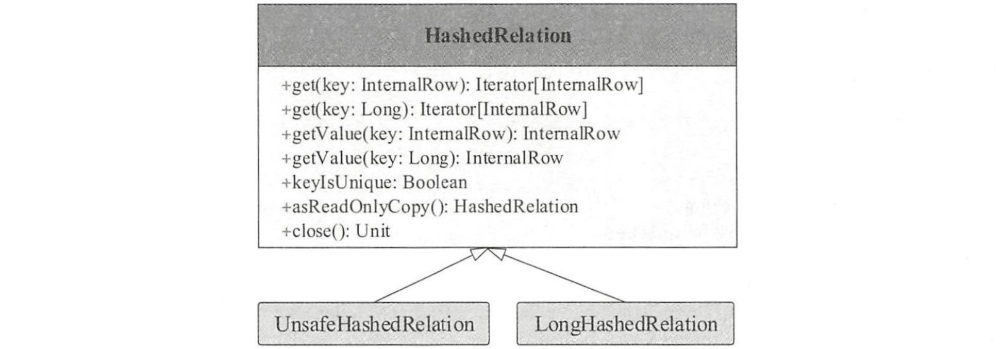

ShuffledHashJoinExec 是 HashJoin 的子类，核心代码如下。首先，对构建表建立 HashedRelation，然后调用 HashJoin 中的 Join 方法，对当前流式表中的数据行在 HashedRelation 中查找数据进行 Join 操作。

```scala
protected override def doExecute(): RDD[InternalRow] = {
  val numOutputRows = longMetric("numOutputRows")
  streamedPlan.execute().zipPartitions(buildPlan.execute()) { (streamIter, buildIter) =>
    val hashed = buildHashedRelation(buildIter)
    joinType match {
      case FullOuter => fullOuterJoin(streamIter, hashed, numOutputRows)
      case _ => join(streamIter, hashed, numOutputRows)
    }
  }
}
```


### 6.4.4 SortMergeJoinExec 执行机制

在 Spark SQL 中，SortMergeJoinExec 是 Join 查询的主要实现方式。Hash 系列的 Join 实现中将一侧的数据完全加载到内存中，这对于一定大小的表比较适用。然而，当两个表的数据量都非常大时，无论使用哪种方法都会对计算内存造成很大压力。**通常情况下，特别是当两个表数据量都非常大时，Spark SQL 会采用 SortMergeJoinExec 的方式来执行**。SortMergeJoinExec 物理执行计划和最终执行计划如图所示。

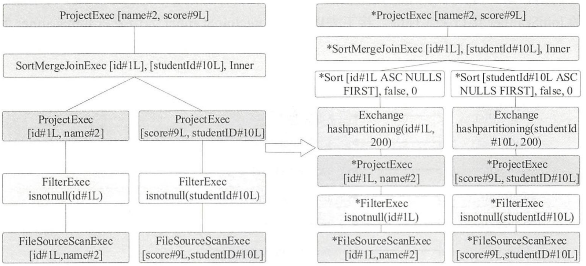

根据其原理，SortMergeJoinExec 实现方式并不用将一侧数据全部加载后再进行 Join 操作，其前提条件是需要在 Join 操作前将数据排序。如图所示，为了让两条记录能连接到一起，需要将具有相同 key 的记录分发到同一个分区，因此一般会进行一次 Shuffle 操作（物理执行计划中的 Exchange 节点），根据 Join 条件确定每条记录的 key，并且基于该 key 进行分区，将可能连接到一起的记录分发到同一个分区中，这样在后续的 Shuffle 读阶段就可以将两个表中具有相同 key 的记录分到同一个分区处理。

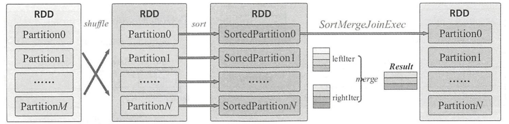

经过 Exchange 节点操作之后，分别对两个表中每个分区里的数据按照 key 进行排序，然后在此基础上进行 mergesort 操作。在遍历流式表时，对于每条记录，都采用顺序查找的方式从构建查找表中查找对应的记录。由于排序的特性，每次处理完一条记录后只需要从上一次结束的位置开始继续查找，SortMergeJoinExec 执行时就能够避免大量无用的操作，对于性能的提升很有帮助。

SortMergeJoinExec 的整体实现如图所示，不同 Join 类型返回不同的 Rowlterator 作为 Join 结果。RowIterator 主要实现了 advanceNext 和 getRow 两个方法，其中 advanceNext 是将 Iterator 向前移动一行，而 getRow 用来获取当前行。在具体方法实现中，RowIterator 是通过调用对应的 JoinScanner 接口来实现的。

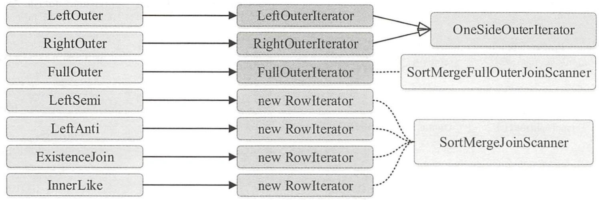

以 SortMergeJoinScanner 为例，它是查找匹配数据的核心类，如图所示。在构造参数中会传递 streamedTable 的迭代器（streamedlter）和 bufferedTable 的迭代器（bufferedIter），考虑到 streamedTable 与 bufferedTable 都是已经排好序，因此在匹配满足条件数据的过程中只需要不断移动迭代器，得到新的数据行进行比较即可。在 SortMergeJoinScanner 中，两个表迭代器所指向的数据行分别用 streamedRow 和 bufferedRow 表示。数据行对应的 Join 操作的 key 分别为 streamedRowKey 与 bufferedRowKey，这些对象都属于 InternalRow 类型。

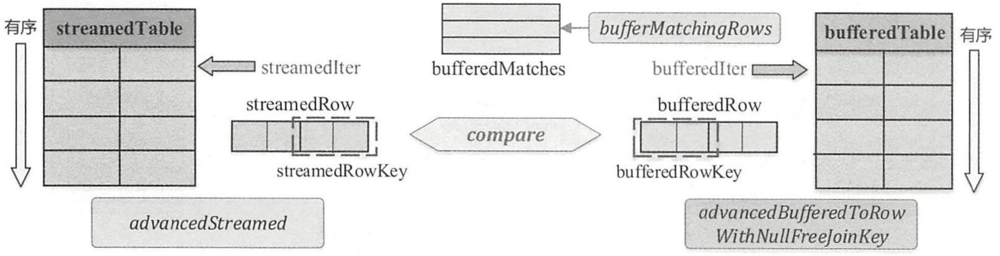

对于 streamedTable，选代器移动得到新的 streamedRow 由 advancedStreamed 函数完成。该函数返回的 Boolean 值表示 streamedTable 是否还有数据。函数每次调用 streamedlter 执行 advanceNext 操作，重新对 streamedRow 赋值，并生成新的 streamedRowKey，如果 streamedTable 中的数据已经选代完，则均设置为null。

对于 bufferedTable，迭代器移动得到新的 bufferedRow 由 advancedBufferedToRowWithNullFreeJoinkey 方法完成。顾名思义，该方法会跳过包含 null 的数据行，具体实现代码如下。可以看到，其迭代逻辑和 advancedStreamed 函数的迭代逻辑类似，主要区别在于如果 bufferedRowKey 中任何字段包含 null（调用 InternalRow 的 anyNull 方法），则迭代操作会继续进行，一直到得到不包含 null 的 bufferedRowKey 或bufferedTable 数据处理完。

```scala
private def advancedBufferedToRowWithNullFreeJoinKey(): Boolean = {
  var foundRow: Boolean = false
  while (!foundRow && bufferedIter.advanceNext()) {
    bufferedRow = bufferedIter.getRow
    bufferedRowKey = bufferedKeyGenerator(bufferedRow)
    foundRow = !bufferedRowKey.anyNull
  }
  if (!foundRow) {
    bufferedRow = null
    bufferedRowKey = null
    false
  } else {
    true
  }
}
```

SortMergeJoinScanner 供其他模块获取数据的接口是 getStreamedRow 与 getBufferedMatches，分别用来获取当前满足 Join 条件的单个 streamedRow 和多个 bufferedRow（类型为 ArrayBuffer[InternalRow]，以数组形式缓存）。在 streamedTable 与 bufferedTable 两个数据表进行迭代时，如果当前 streamedRow 和 bufferedRow 能够满足 Join 条件，那么将继续移动 bufferedlter，将 bufferedTable 中满足条件的所有数据行一次性找出，存储到 bufferedMatches 中，其实现逻辑如下。可以看到，执行 bufferMatchingRows 时，仍然会再一次地检查相关的 null 情形。

```scala
private def bufferMatchingRows(): Unit = {
  assert(streamedRowKey != null)
  assert(!streamedRowKey.anyNull)
  assert(bufferedRowKey != null)
  assert(!bufferedRowKey.anyNull)
  assert(keyOrdering.compare(streamedRowKey, bufferedRowKey) == 0)
  // join key可能是由可变投影生成的，因此我们需要进行复制
  matchJoinKey = streamedRowKey.copy()
  bufferedMatches.clear()
  do {
    if (!onlyBufferFirstMatch || bufferedMatches.isEmpty) {
      bufferedMatches.add(bufferedRow.asInstanceOf[UnsafeRow])
    }
    advancedBufferedToRowWithNullFreeJoinKey()
  } while (bufferedRow != null && keyOrdering.compare(streamedRowKey, bufferedRowKey) == 0)
}
```

在 SortMergeJoinScanner 中，最重要的是 findNextInnerJoinRows 与 findNextOuterJoinRows 两个函数，它们是不断得到满足 Join 条件数据（streamedRow 与 bufferedMatches 数组）的主要驱动逻辑所在。在这两个函数中，findNextInnerJoinRows 用来得到满足 Inner Join 条件的数据，而 findNextOuterJoinRows 用来得到满足 Outer Join 条件的数据。

SortMergeFullOuterJoinScanner 是专门用于 Full Outer 类型的 Join 执行时查找匹配数据的核心类，如图所示。不同于 SortMergeJoinScanner 中存在 streamedTable 和 bufferedTable，SortMergeFullOuterJoinScanner 中两个数据表的地位是相同的，分别称为 leftTable 和 rightTable。在其构造参数中，除左右表的选代器（leftlter 和rigbtlter）外，还有 leftNullRow 与 rightNullRow 用于原始表中数据无法匹配时填充的 null 数据行。

左表和右表分别前移的方法为 advancedLeft 和 advancedRight，在遍历数据过程中会构造两个缓冲区（leftMatches 和 rightMatches），用来缓存匹配右表当前数据行的数据与缓存匹配左表当前数据行的数据。因此，要得到 Join 之后的数据，在这两个缓冲区中查找即可，这个操作即 scanNextInBuffered 方法。

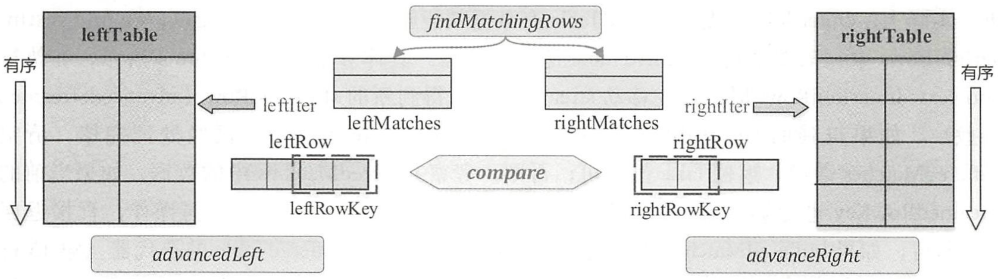


# 参考

1. 《Spark SQL 内核剖析》
1. [Idea中使用Antlr4](https://blog.csdn.net/waiting971118/article/details/124307642)
