# 1. 从 spark-submit 开始

说明：代码部分以 spark 3.1.3 为例讲解，辅以 spark 2.3.2。

## 1.1 Yarn Cluster/Client 提交流程

1. 命令行提交命令：`bin/spark-submit --master yarn --deploy-mode cluster --class org.apache.spark.examples.SparkPi examples/jars/spark-examples_2.12-3.1.3.jar`

   脚本调用过程如下图所示，具体可参考链接 1。注意，`org.apache.spark.launcher.Main` 是提供给 Spark 内部脚本调用的工具类，并不是真正的执行入口，它被 spark-class 脚本调用，**负责调用其他类，对参数进行解析，并生成执行命令，最后将命令返回给 spark-class 执行**。最后执行的命令类似：`java -cp ${class_path} org.apache.spark.deploy.SparkSubmit ${args}`，其中 class_path 包括了 spark conf、spark jars、hadoop conf，args 即用户在 spark-submit 指定的参数。此时脚本启动了一个 Java 进程，该进程从 SparkSubmit 类的 main() 方法开始执行，故**进程名也是 SparkSubmit**。

   

2. 从 SparkSubmit 类的 main() 方法开始。注意，在 Client 模式下，childMainClass = org.apache.spark.examples.SparkPi。而在 Cluster 模式下，childMainClass = org.apache.spark.deploy.yarn.YarnClusterApplication。下面先以 Cluster 模式为例，讲解后续流程。

   ```scala
   SparkSubmit
     main(args)
       doSubmit(args)
         // 解析参数，args是命令行参数
         parseArguments(args)
           // 例如，解析--master得到：master=yarn、解析--class得到：mainClass=org.apache.spark.examples.SparkPi
           parse(args.asJava)    				
         submit()
           doRunMain()
             // 使用提交的参数运行子类的main方法
             runMain()
               // 【Cluster】childMainClass => org.apache.spark.deploy.yarn.YarnClusterApplication
               // 【Client】 childMainClass => org.apache.spark.examples.SparkPi
               (childArgs, childClasspath, sparkConf, childMainClass) = prepareSubmitEnvironment(args)
               // 通过反射获取Class类对象
               mainClass = Utils.classForName(childMainClass)
               // 判断条件：mainClass是否为SparkApplication实现类
               if (classOf[SparkApplication].isAssignableFrom(mainClass))
                 // 【Cluster】通过反射调用YarnClusterApplication构造方法，生成实例
                 mainClass.getConstructor().newInstance().asInstanceOf[SparkApplication]
                 // 【client】在本地通过反射执行main方法，即此时即生成了Driver
                 new JavaMainApplication(mainClass)
               app.start(childArgs.toArray, sparkConf)
   ```

3. 从 YarnClusterApplication 类的 start() 方法开始。注意，在 Cluster 模式下，createContainerLaunchContext() 设置的启动 AM 命令类似 bin/java org.apache.spark.deploy.yarn.ApplicationMaster，**对应的进程名是 ApplicationMaster**。而在 Client 模式下，生成的启动 AM 命令类似 bin/java org.apache.spark.deploy.yarn.ExecutorLauncher，**对应的进程名是 ExecutorLauncher**。**无论是 Client 模式，还是 Cluster 模式，都是通过 Java 命令启动的一个 Java 进程，因此接下来就是在 AM 中执行对应类的 main() 方法** 。实际上，ExecutorLauncher 在 main() 方法中直接调用了 ApplicationMaster.main(args)，因此**两者逻辑相同，只不过进程名不一样（默认情况下，进程名即类名）**。

   ```scala
   YarnClusterApplication
     start(args, conf)
       // 解析参数，如解析--class得到userClass=org.apache.spark.examples.SparkPi
       new ClientArguments(args)
       // 该Client包含属性yarnClient，也即rmClient
       new Client()
         YarnClient.createYarnClient
           YarnClientImpl
             rmClient
   
       // 将应用程序提交给RM
       client.run()
         submitApplication()
           // 设置AM容器的启动环境、Java选项和启动AM的命令
           // 【Cluster】 command = bin/java org.apache.spark.deploy.yarn.ApplicationMaster
           // 【Client】  command = bin/java org.apache.spark.deploy.yarn.ExecutorLauncher
           createContainerLaunchContext()
           createApplicationSubmissionContext()
           yarnClient.submitApplication(appContext)
             YarnClientImpl.submitApplication
               rmClient.submitApplication(request);
   ```

   ```scala
   // 该对象并不提供任何特殊功能。它的存在是为了在使用诸如ps或jps等工具时，能够轻松区分Client模式的AM和Cluster模式的AM。
   object ExecutorLauncher {
     def main(args: Array[String]): Unit = {
       ApplicationMaster.main(args)
     }
   }
   ```

4. 从 ApplicationMaster 类的 main() 方法开始。注意，Cluster 模式这里有两个线程：主线程、用户线程（Driver 线程）。**首先主线程阻塞，等待用户线程初始化 SparkContext；用户线程通过反射执行用户代码，在创建完 SparkContext 后，通知主线程不再阻塞，并等待主线程向 RM 申请和分配资源；于是主线程继续执行，注册 AM 后，申请并分配资源，然后在分配的容器中启动 CoarseGrainedExecutorBackend（spark 3.1.3 YarnCoarseGrainedExecutorBackend）进程，之后恢复用户线程，并等待其完成；于是用户线程继续执行，生成并转换 RDD，划分 Stage，切分 Task（详见第 3 节），之后将其序列化通过 RPC 协议从 Driver 发送给 Executor 执行**。

   ```scala
   ApplicationMaster
     main(args)
       // 解析参数，如解析--class得到userClass=org.apache.spark.examples.SparkPi
       new ApplicationMasterArguments
       master = new ApplicationMaster
       master.run()
         // 【Cluster】 runDriver()会创建Driver线程
         // 【Client】  runExecutorLauncher()不会创建Driver线程
         runDriver()
           // 用户线程：在单独的线程中启动包含Spark driver的用户类
           userClassThread = startUserApplication()
             mainMethod = userClassLoader.loadClass(args.userClass).getMethod("main", classOf[Array[String]])
             // Driver实际是ApplicationMaster进程中的一个线程
             userThread = new Thread
             userThread.setName("Driver")
             userThread.start()
               run()
                 // 通过反射执行用户代码，执行入口即main()函数
                 mainMethod.invoke(null, userArgs.toArray)
                   org.apache.spark.examples.SparkPi main()
                     // 按照规范，用户代码中需要先创建SparkContext
                     new SparkContext(）
                       // 继承关系：YarnClusterScheduler -> YarnScheduler -> TaskSchedulerImpl -> TaskScheduler，实际执行YarnClusterScheduler.postStartHook()
                       _taskScheduler.postStartHook()
                         // 初始化SparkContext，通知主线程不再阻塞（=====2=====）
                         ApplicationMaster.sparkContextInitialized(sc)
                         super.postStartHook()
                           // 用户线程阻塞，等待主线程向RM申请和分配资源（=====3=====）
                           waitBackendReady()
   				
           // 主线程：阻塞，等待用户线程初始化SparkContext（=====1=====）
           sc = ThreadUtils.awaitResult()
             // 注册AM
             registerAM()
               // client即YarnRMClient
               client.register()
             createAllocator()
               // 申请资源
               allocator = client.createAllocator()
               // 分配资源，这里allocator实际类型是YarnAllocator
               allocator.allocateResources()
                 handleAllocatedContainers()
                   // 在分配的容器中启动executors
                   runAllocatedContainers()
                     // 一个container启动一个executor，两者一一对应
                     new ExecutorRunnable().run()
                       startContainer()
                         // 将命令发送至NM，作为进程启动：bin/java org.apache.spark.executor.YarnCoarseGrainedExecutorBackend
                         // YarnCoarseGrainedExecutorBackend最终仍会调用CoarseGrainedExecutorBackend（spark 2.3.2）
                         prepareCommand()
                         nmClient.startContainer()
             // 恢复用户线程，并等待其完成（=====4=====）
             resumeDriver()
             userClassThread.join()
   ```

5. 从 CoarseGrainedExecutorBackend 类的 main() 方法开始。注意，CoarseGrainedExecutorBackend 间接继承 RpcEndpoint，**其生命周期为：constructor -> onStart -> receive\* -> onStop**。在构造过程中，它将通过 RPC 协议向 Driver 注册 Executor，一旦收到 Driver 注册成功的消息，就向自己发送一条消息，生成 Executor 计算对象。因此，**粗看 Executor 等同 CoarseGrainedExecutorBackend 通信后台，是个进程；细看 Executor 其实是个计算对象，里面有个线程池处理 Task**。

   ```scala
   // 直接继承IsolatedRpcEndpoint，间接继承RpcEndpoint，endpoint生命周期为：constructor -> onStart -> receive* -> onStop
   CoarseGrainedExecutorBackend
     main(args)
       run()
         SparkEnv.createExecutorEnv
           // 为driver或executor创建SparkEnv
           create()
             RpcEnv.create()
               new NettyRpcEnvFactory().create(config)
                 nettyEnv = new NettyRpcEnv()
                   outboxes = new ConcurrentHashMap[RpcAddress, Outbox]
                     // 链表结构存放消息
                     messages = new java.util.LinkedList[OutboxMessage]
                     // TransportClient可与TransportServer通信
                     client: TransportClient
                 Utils.startServiceOnPort()
                   // startService是个函数参数，实际调用nettyEnv.startServer(）
                   val (service, port) = startService(tryPort)
                     // 创建一个服务器，尝试绑定到特定的主机和端口
                     transportContext.createServer()
                       new TransportServer()
                         init(hostToBind, portToBind)
                           // Netty API，其中ioMode = NIO/EPOLL，Linux不支持AIO，故采用EPOLL方式来模拟，默认使用NIO
                           new ServerBootstrap().group(bossGroup, workerGroup).channel(NettyUtils.getServerChannelClass(ioMode))...
                             
         // 使用指定名称注册一个RpcEndpoint，并返回其RpcEndpointRef
         env.rpcEnv.setupEndpoint("Executor", backend)
           dispatcher.registerRpcEndpoint(name, endpoint)
             new NettyRpcEndpointRef()
             new DedicatedMessageLoop()
               inbox = new Inbox(name, endpoint)
                 messages = new java.util.LinkedList[InboxMessage]()
                 // OnStart是要处理的第一条消息
                 messages.add(OnStart)
                 // process()循环处理消息，即调用CoarseGrainedExecutorBackend类的onStart()
                 case OnStart => endpoint.onStart()
                   // 向Driver注册Executor
                   ref.ask[Boolean](RegisterExecutor()）
                   // 如果注册成功，向自己发送一条消息。self是父类RpcEndpoint的属性，类型是RpcEndpointRef
                   case Success(_) => self.send(RegisteredExecutor)
                     // 后续CoarseGrainedExecutorBackend类的receive()处理接收的消息，这里生成Executor计算对象
                     // 粗看Executor等同CoarseGrainedExecutorBackend通信后台，是个进程；细看Executor其实是个计算对象，里面有个线程池处理Task
                     case RegisteredExecutor => executor = new Executor()
                     // 处理Task，先调用TaskDescription.decode()反序列化
                     case LaunchTask(data) => executor.launchTask()
                       tr = new TaskRunner()
                       // 计算对象Executor内部线程池处理Task
                       threadPool.execute(tr)
                         run()
                           task.run()
                             // Task类定义的抽象方法，由子类ShuffleMapTask、ResultTask实现
                             runTask()
   ```

   ```scala
   SparkContext
     _env = createSparkEnv()
       SparkEnv.createDriverEnv()
         // 为driver或executor创建SparkEnv，后续调用流程与Executor类似
         create()
   ```


总结：spark-submit yarn cluster 提交过程如下图所示，具体地：

1、当使用 spark-submit 命令提交作业时，将在客户端创建一个 SparkSubmit 进程，里面有一个 Client，包含了对远程 RM 的引用 rmClient，并由它提交至远程 RM。

2、RM 选择某个 NM 启动 AM（ApplicationMaster，作用是将 Driver、Executor 与 RM 解耦合），AM 将在进程中创建一个名为 Driver 的线程，该线程将执行我们自定义的 main 方法，但是**注意 main 方法不是从头到尾一次执行完成，而是在准备好环境变量 SparkContext 后就暂停了，因为此时还没有资源**。所以接下来 AM 向 RM 注册并申请资源，RM 返回可用资源供 AM 选择。

3、AM 拿到资源后，挑选合适的资源，即连接对应的 NM，并在其中启动 ExecutorBackend 。ExecutorBackend 启动完成后，将告诉 AM 已准备完成，接下来就是发送 Task 任务了。

4、于是 Driver 继续执行，生成并转换 RDD，最后形成一个个 Task，并将其放入任务池（TaskPool）中，稍后从任务池中取出任务，序列化后发送给 ExecutorBackend。ExecutorBackend 将任务反序列化，再传给计算对象 Executor 来执行。Executor 中有一个线程池，每个线程都可以执行一个 Task。

5、Shuffle 分为两个阶段，前一个阶段称为 ShuffleMapStage（生成 ShuffleMapTask，负责写），后一个阶段称为 ResultStage（生成 ResultTask，负责读）。Executor 线程池执行 Task 即执行上述两种 Task 的 run 方法（父类定义了 run 方法，并使用模板方法模式，在其中定义了一个抽象的方法 runTask，由上述两种 Task 实现）。

注意：**SparkSubmit、ApplicationMaster 和 CoarseGrainedExecutorBackend（YarnCoarseGrainedExecutorBackend） 是独立的进程；Driver是独立的线程；Executor 和 YarnClusterApplication 是对象**。

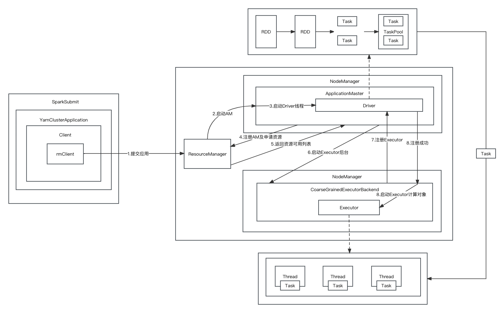

总结：spark-submit yarn client 提交过程如下图所示。client 与 cluster 主要区别：cluster 模式 Driver 位于集群内部，是个线程；client 模式 Driver 位于本地，仅是个对象。

注意：**SparkSubmit、ExecutorLauncher（ApplicationMaster） 和 CoarseGrainedExecutorBackend（YarnCoarseGrainedExecutorBackend） 是独立的进程；Executor 和 Driver 是对象**。

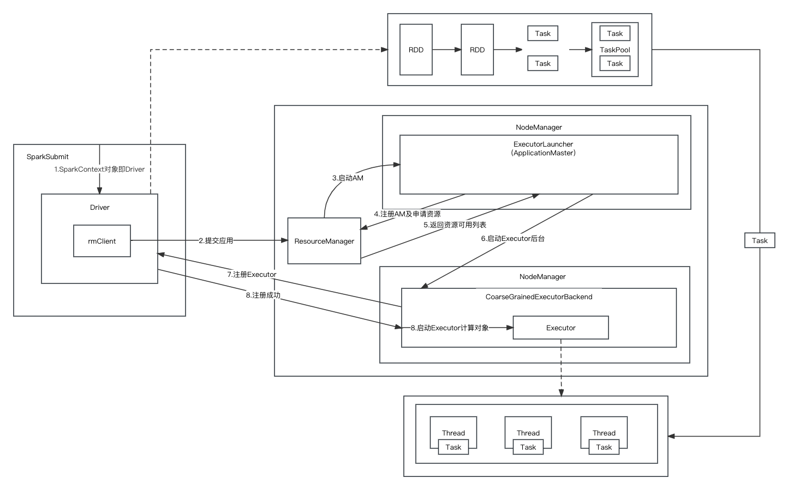


## 1.2 通信架构

Spark 通信架构如下图所示，代码详见上一节第 5 点，具体地：

1. **RpcEndpoint**：RPC 通信终端。Spark 针对每个节点（Client/Master/Worker）都称之为一个 RPC 终端，且都实现 RpcEndpoint 接口，内部根据不同端点的需求，设计不同的消息和不同的业务处理，如果需要发送/询问，则调用 Dispatcher。在 Spark 中，所有的终端都存在生命周期：**constructor -> onStart -> receive\* -> onStop**。
2. **RpcEnv**：RPC 上下文环境，每个 RPC 终端运行时依赖的上下文环境称为 RpcEnv，当前 Spark 版本中使用的是 NettyRpcEnv。
3. **Dispatcher**：消息调度（分发）器，针对于 RPC 终端需要发送远程消息或者从远程 RPC 接收到的消息，分发至对应的指令收件箱（发件箱）。如果指令接收方是自己则存入收件箱，如果指令接收方不是自己，则放入发件箱。
4. **RpcEndpointRef**：**对远程 RpcEndpoint 的一个引用**，当我们需要向一个具体的 RpcEndpoint 发送消息时，一般我们需要获取到该 RpcEndpoint 的引用，然后通过该引用发送消息。
5. **RpcAddress**：表示远程的 RpcEndpointRef 的地址，Host + Port。
6. **Inbox**：指令消息收件箱。一个本地 RpcEndpoint 对应一个收件箱，Dispatcher 在每次向 Inbox 存入消息时，都将对应 EndpointData 加入内部 ReceiverQueue 中，另外 Dispatcher 创建时会启动一个单独线程进行轮询 ReceiverQueue，进行收件箱消息消费。
7. **OutBox**：指令消息发件箱。对于当前 RpcEndpoint 来说，一个目标 RpcEndpoint 对应一个发件箱，如果向多个目标 RpcEndpoint 发送信息，则有多个 OutBox。当消息放入 Outbox 后，紧接着通过 TransportClient 将消息发送出去。消息放入发件箱以及发送过程是在同一个线程中进行。
8. **TransportClient**：Netty 通信客户端，一个 OutBox 对应一个 TransportClient，TransportClient 不断轮询 OutBox，根据 OutBox 消息的 receiver 信息，请求对应的远程 TransportServer。
9. **TransportServer**：Netty 通信服务端，一个 RpcEndpoint 对应一个 TransportServer，接受远程消息后调用 Dispatcher 分发消息至对应收发件箱。

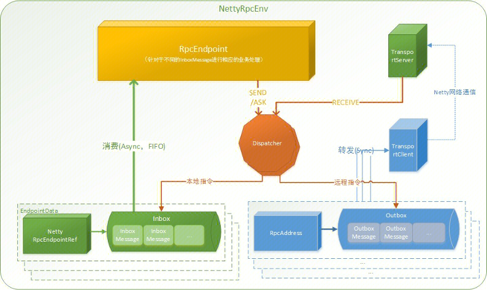


## 1.3 任务调度机制

Spark RDD 通过其 Transactions 操作，形成了 RDD 血缘（依赖）关系图，即 DAG，最后通过 Action 的调用，触发 Job 并调度执行，执行过程中会创建两个调度器：DAGScheduler 和 TaskScheduler。

1、**DAGScheduler 负责 Stage 级的调度**，主要是将 job 切分成若干 Stages，并将每个 Stage 打包成 TaskSet 交给 TaskScheduler 调度。

2、**TaskScheduler 负责Task 级的调度**，将 DAGScheduler 给过来的 TaskSet 按照指定的调度策略分发到 Executor 上执行，调度过程中 SchedulerBackend 负责提供可用资源，其中 SchedulerBackend 有多种实现，分别对接不同的资源管理系统

Driver  初始化 SparkContext 过程中，会分别初始化 DAGScheduler、TaskScheduler、SchedulerBackend 以及 HeartbeatReceiver，并启动 SchedulerBackend 以及 HeartbeatReceiver。SchedulerBackend 通过 ApplicationMaster 申请资源，并不断从 TaskScheduler 中拿到合适的 Task 分发到 Executor 执行。HeartbeatReceiver 负责接收 Executor 的心跳信息，监控 Executor 的存活状况，并通知到 TaskScheduler。


### 1.3.1 Stage 级调度

Job 由最终的 RDD 和 Action 方法封装而成。SparkContext 将 Job 交给 DAGScheduler 提交，它会根据 RDD 的血缘关系构成的 DAG 进行切分，将一个 Job 划分为若干 Stages，具体划分策略是，由最终的 RDD 不断通过依赖回溯判断父依赖是否是宽依赖，即以 Shuffle 为界，划分 Stage，窄依赖的 RDD 之间被划分到同一个 Stage 中，可以进行pipeline 式的计算。划分的 Stages 分两类，一类叫做 ResultStage ，为 DAG 最下游的 Stage ，由 Action 方法决定， 另一类叫做 ShuffleMapStage，为下游 Stage 准备数据。

一个 Stage 是否被提交，需要判断它的父 Stage 是否执行，只有在父 Stage 执行完毕才能提交当前 Stage，如果一个 Stage 没有父 Stage，那么从该 Stage 开始提交。Stage 提交时会将 Task 信息（分区信息以及方法等）序列化并被打包成 TaskSet 交给 TaskScheduler，一个 Partition 对应一个 Task，另一方面 TaskScheduler 会监控 Stage 的运行状态，只有 Executor 丢失或者 Task 由于 Fetch 失败才需要重新提交失败的 Stage 以调度运行失败的任务，其他类型的 Task 失败会在 TaskScheduler 的调度过程中重试。相对来说 DAGScheduler 做的事情较为简单，仅仅是在 Stage 层面上划分 DAG，提交 Stage 并监控相关状态信息。TaskScheduler 则相对较为复杂。


### 1.3.2 Task 级调度

TaskScheduler 会将 TaskSet 封装为 TaskSetManager 加入到调度队列中。**TaskSetManager 负责监控管理同一个 Stage 中的 Tasks，TaskScheduler 就是以 TaskSetManager 为单元来调度任务**。

TaskScheduler 初始化后会启动 SchedulerBackend，SchedulerBackend 负责跟外界打交道， 接收 Executor 的注册信息，并维护 Executor 的状态，同时它在启动后会定期地去询问 TaskScheduler 有没有任务要运行。TaskScheduler 在 SchedulerBackend 询问它的时候，会从调度队列中按照指定的调度策略选择 TaskSetManager 去调度运行，大致方法调用流程如下图所示。

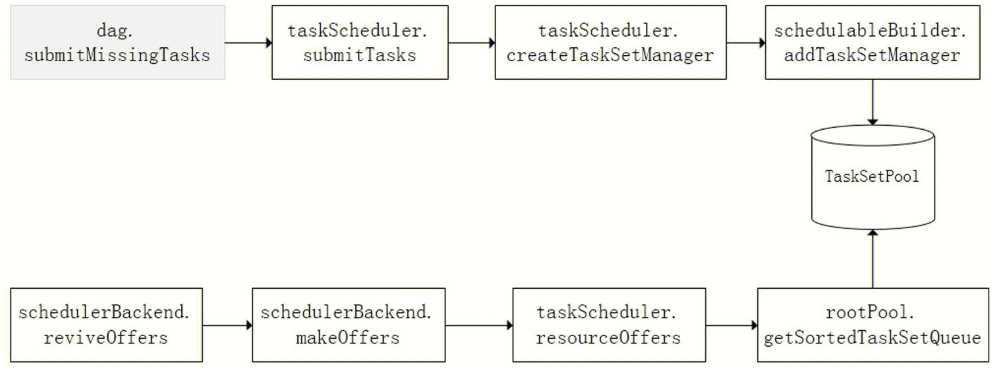

上图中，将 TaskSetManager 加入 rootPool 调度池中之后，调用 SchedulerBackend 的 riviveOffers 方法给 driverEndpoint 发送 ReviveOffer 消息；driverEndpoint 收到 ReviveOffer 消息后调用 makeOffers 方法，过滤出活跃状态的 Executor（这些 Executor 都是任务启动时反向注册到 Driver 的 Executor），然后将 Executor 封装成 WorkerOffer 对象；准备好计算资源（WorkerOffer）后，taskScheduler 基于这些资源调用 resourceOffer 在 Executor 上分配 task。

```scala
RDD
  // 以collect为例，行动算子将调用runJob()划分并生成stage
  collect()
    sc.runJob()
      runJob()
        runJob()
          runJob[T, U]()
          dagScheduler.runJob()
            // 提交一个action job到调度器
            submitJob()
              eventProcessLoop.post(JobSubmitted())
                // 将event放入事件队列中，事件线程将稍后处理该事件
                eventQueue.put(event)
                eventThread = new Thread(name)
                  run()
                    event = eventQueue.take()
                    // DAGSchedulerEventProcessLoo类DAG调度器的主要事件循环
                    onReceive(event)
                      doOnReceive(event)
                        case JobSubmitted() => dagScheduler.handleJobSubmitted()
                          // 创建ResultStage
                          finalStage = createResultStage()
                            // 获取或创建给定shuffle依赖的父阶段stage
                            parents = getOrCreateParentStages()
                              getOrCreateShuffleMapStage()
                                // 为所有缺失的祖先shuffle依赖创建stages
                                getMissingAncestorShuffleDependencies()
                                createShuffleMapStage()
                                  // 递归获取或创建父阶段stage
                                  parents = getOrCreateParentStages()
                                  // 创建ShuffleMapStage，用于生成给定shuffle依赖的分区
                                  stage = new ShuffleMapStage()
                            stage = new ResultStage()
                          // 提交阶段，但首先递归提交任何缺失的父stage
                          submitStage(finalStage)
                            missing = getMissingParentStages()
                            // 父stage不存在，则提交该stage，判断条件：if (missing.isEmpty)
                            submitMissingTasks()
                              // 确定要计算的分区ID的索引
                              partitionsToCompute = stage.findMissingPartitions()
                                // 以ShuffleMapStage为例，其中numPartitions = rdd.partitions.length
                                findMissingPartitions().getOrElse(0 until numPartitions)
                              // 根据不同的stage，生成不同的task：ShuffleMapTask、ResultTask
                              case stage: ShuffleMapStage => new ShuffleMapTask()
                              case stage: ResultStage => new ResultTask()
                              // 提交任务集运行，任务集与stage是一一对应关系
                              taskScheduler.submitTasks(new TaskSet())
                                manager = createTaskSetManager()
                                  // TaskSetManager继承自Schedulable，可以被调度
                                  new TaskSetManager()
                                manager.schedulableBuilder.addTaskSetManager()
                                  // 分为FIFOSchedulableBuilder、FairSchedulableBuilder，两者均将其放入rootPool，之后从中取出
                                  rootPool.addSchedulable(manager)
                                backend.reviveOffers()
                                  // CoarseGrainedSchedulerBackend类，Driver给自己发了一条消息，之后在receive()中处理该消息
                                  driverEndpoint.send(ReviveOffers)
                                    case ReviveOffers => makeOffers()
                                      scheduler.resourceOffers()
                                        // rootPool通过排序进行调度
                                        rootPool.getSortedTaskSetQueue()
                                          schedulableQueue.asScala.toSeq.sortWith(taskSetSchedulingAlgorithm.comparator)
                                            // 多个判断条件，详见代码
                                            case SchedulingMode.FAIR => new FairSchedulingAlgorithm()
                                            // 先按照优先级从小到大，若优先级相同，按照stageId从小到大
                                            case SchedulingMode.FIFO => new FIFOSchedulingAlgorithm()
                                        // task的locality级别
                                        taskSet.myLocalityLevels
                                          TaskLocality.{PROCESS_LOCAL, NODE_LOCAL, NO_PREF, RACK_LOCAL, ANY}
                                      // 启动任务
                                      launchTasks()
                                        // 序列化，以便在网络中传输
                                        TaskDescription.encode(task)
                                        executorData = executorDataMap(task.executorId)
                                        // Driver向Executor发送LaunchTask，CoarseGrainedExecutorBackend在receive()中接收处理该消息
                                        executorData.executorEndpoint.send(LaunchTask())
                            // 递归提交父stage
                            submitStage(parent)
```


### 1.3.3 调度策略

**TaskScheduler 支持两种调度策略，一种是 FIFO，也是默认的调度策略**，另一种是 FAIR。在 TaskScheduler 初始化过程中会实例化 rootPool，表示树的根节点，是 Pool 类型。

1、**FIFO 调度策略**：如果是采用 FIFO 调度策略，则直接简单地将 TaskSetManager 按照先来先到的方式入队，出队时直接拿出最先进队的 TaskSetManager，TaskSetManager 保存在一个 FIFO 队列中。

2、**FAIR 调度策略**：FAIR 模式中有一个 rootPool 和多个子 Pool，各个子 Pool 中存储着所有待分配的 TaskSetMagager。在 FAIR 模式中，需要先对子 Pool 进行排序，再对子 Pool 里面的 TaskSetMagager 进行排序，因为 Pool 和 TaskSetMagager 都继承了 Schedulable 特质，因此使用相同的排序算法。排序过程的比较是基于 Fair-share 来比较的，每个要排序的对象包含三个属性：runningTasks 值（正在运行的 Task 数）、minShare 值、weight 值，比较时会综合考量这三个值。注意，minShare、weight 的值均在公平调度配置文件 fairscheduler.xml 中被指定，调度池在构建阶段会读取此文件的相关配置。


### 1.3.4 本地化调度

从调度队列中拿到 TaskSetManager 后，那么接下来的工作就是 TaskSetManager 按照一定的规则一个个取出 task 给 TaskScheduler，TaskScheduler 再交给 SchedulerBackend 去发到 Executor 上执行。前面也提到，TaskSetManager 封装了一个 Stage 的所有 Task，并负责管理调度这些 Task。根据每个 Task 的优先位置，确定 Task 的 Locality 级别，**Locality 一共有五种，优先级由高到低顺序如下表所示**。

| 名称          | 解析                                                         |
| ------------- | ------------------------------------------------------------ |
| PROCESS_LOCAL | 进程本地化，task 和数据在同一个 Executor 中，性能最好。      |
| NODE_LOCAL    | 节点本地化，task 和数据在同一个节点中，但是 task 和数据不在同一个 Executor 中，数据需要在进程间进行传输。 |
| RACK_LOCAL    | 机架本地化，task 和数据在同一个机架的两个节点上，数据需要通过网络在节点之间进行传输。 |
| NO_PREF       | 对于 task 来说，从哪里获取都一样，没有好坏之分。             |
| ANY           | task 和数据可以在集群的任何地方，而且不在一个机架中，性能最差。 |

在调度执行时，Spark 调度总是会尽量让每个 task 以最高的本地性级别来启动，当一个 task 以本地性级别启动，但是该本地性级别对应的所有节点都没有空闲资源而启动失败， 此时**并不会马上降低本地性级别启动**，而是在某个时间长度内再次以这个本地性级别来启动该 task，若超过限时时间则降级启动，去尝试下一个本地性级别，依次类推。可以通过调大每个类别的最大容忍延迟时间，在等待阶段对应的 Executor 可能就会有相应的资源去执行此 task，这就在在一定程度上提到了运行性能。


### 1.3.5 失败重试

除了选择合适的 Task 调度运行外，还需要监控 Task 的执行状态，前面也提到，与外部打交道的是 SchedulerBackend，Task 被提交到 Executor 启动执行后，Executor 会将执行状态上报给 SchedulerBackend，SchedulerBackend 则告诉 TaskScheduler，TaskScheduler 找到该 Task 对应的 TaskSetManager，并通知到该 TaskSetManager，这样 TaskSetManager 就知道 Task 的失败与成功状态，对于失败的 Task，会记录它失败的次数，如果失败次数还没有超过最大重试次数，那么就把它放回待调度的 Task 池子中，否则整个 Application 失败。

在记录 Task 失败次数过程中，会记录它上一次失败所在的 Executor Id 和 Host，这样下次再调度这个 Task 时，会使用黑名单机制，避免它被调度到上一次失败的节点上，起到一定的容错作用。黑名单记录 Task 上一次失败所在的Executor Id 和 Host，以及其对应的“拉黑”时间，“拉黑”时间是指这段时间内不要再往这个节点上调度这个 Task 了。


## 1.4 Spark Shuffle

在 Spark的 源码中，负责 shuffle 过程的执行、计算和处理的组件主要就是 ShuffleManager，也即 shuffle 管理器。而随着 Spark 的版本的发展，ShuffleManager 也在不断迭代，变得越来越先进。

**在 Spark 1.2 以前，默认的 shuffle 计算引擎是 HashShuffleManager**。该 ShuffleManager 即 HashShuffleManager 有着一个非常严重的弊端，就是会产生大量的中间磁盘文件，进而由**大量的磁盘 IO 操作影响了性能**。

因此**在 Spark 1.2 以后的版本中，默认的 ShuffleManager 改成了 SortShuffleManager**。SortShuffleManager 相较于 HashShuffleManager 来说，有了一定的改进。主要就在于，每个 Task 在进行 shuffle 操作时，虽然也会产生较多的临时磁盘文件，但是**最后会将所有的临时文件合并（merge）成一个磁盘文件，因此每个 Task 就只有一个磁盘文件**。在下一个 stage 的 shuffle read task 拉取自己的数据时，只要根据索引读取每个磁盘文件中的部分数据即可。

### 1.4.1 HashShuffleManager 运行原理

#### **未经优化的 HashShuffleManager**

下图说明了未经优化的 HashShuffleManager 的原理。这里我们先明确一个假设前提：每个 Executor 只有 1 个 CPU core，也就是说，无论这个 Executor 上分配多少个 task 线程，同一时间都只能执行一个 task 线程。

我们先从 shuffle write 开始说起。shuffle write 阶段，主要就是在一个 stage 结束计算之后，为了下一个 stage 可以执行 shuffle 类的算子（比如 reduceByKey），而将每个 task 处理的数据按 key 进行“分类”。所谓“分类”，就是对相同的 key 执行 hash 算法，从而将相同 key 都写入同一个磁盘文件中，而每一个磁盘文件都只属于下游 stage 的一个 task。在将数据写入磁盘之前，会先将数据写入内存缓冲中，当内存缓冲填满之后，才会溢写到磁盘文件中去。

那么每个执行 shuffle write 的 task，要为下一个 stage 创建多少个磁盘文件呢？很简单，**下一个 stage 的 task 有多少个，当前 stage 的每个 task 就要创建多少份磁盘文件**。比如下一个 stage 总共有 100 个 task，那么当前 stage 的每个 task 都要创建 100 份磁盘文件。如果当前 stage 有 50 个 task，总共有 10 个Executor，每个 Executor 执行 5 个Task，那么每个 Executor 上总共就要创建 500 个磁盘文件，所有 Executor 上会创建 5000 个磁盘文件。由此可见，**未经优化的 shuffle write 操作所产生的磁盘文件的数量是极其惊人的**。

接着我们来说说 shuffle read。shuffle read，通常就是一个 stage 刚开始时要做的事情。此时该 stage 的每一个 task 就需要将上一个 stage 的计算结果中的所有相同 key，从各个节点上通过网络都拉取到自己所在的节点上，然后进行 key 的聚合或连接等操作。由于 shuffle write 的过程中，task 给下游 stage 的每个 task 都创建了一个磁盘文件，因此 shuffle read 的过程中，每个 task 只要从上游 stage 的所有 task 所在节点上，拉取属于自己的那一个磁盘文件即可。

shuffle read 的拉取过程是一边拉取一边进行聚合的。每个 shuffle read task 都会有一个自己的 buffer 缓冲，每次都只能拉取与 buffer 缓冲相同大小的数据，然后通过内存中的一个 Map 进行聚合等操作。聚合完一批数据后，再拉取下一批数据，并放到 buffer 缓冲中进行聚合操作。以此类推，直到最后将所有数据到拉取完，并得到最终的结果。

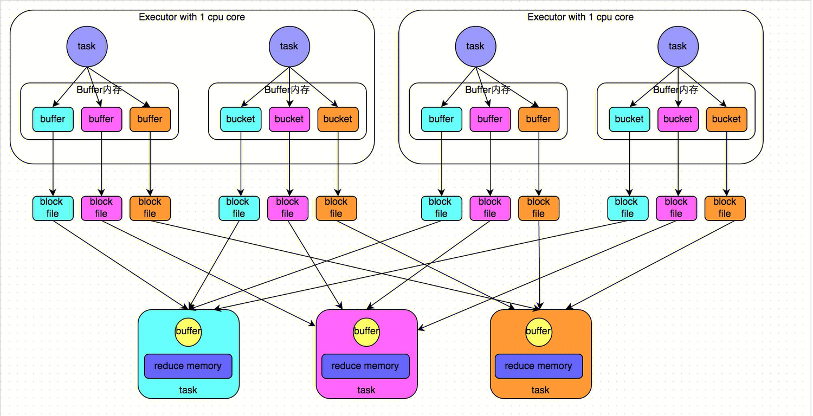


#### 优化后的 HashShuffleManager

下图说明了优化后的 HashShuffleManager 的原理。这里说的优化，是指我们可以设置一个参数，spark.shuffle.consolidateFiles。该参数默认值为 false，将其设置为 true 即可开启优化机制。通常来说，如果我们使用 HashShuffleManager，那么都建议开启这个选项。

开启 consolidate 机制之后，在 shuffle write 过程中，task 就不是为下游 stage 的每个 task 创建一个磁盘文件了。此时会出现 shuffleFileGroup 的概念，**每个 shuffleFileGroup 会对应一批磁盘文件，磁盘文件的数量与下游 stage 的 task 数量是相同的**。一个 Executor 上有多少个 CPU core，就可以并行执行多少个 task。而第一批并行执行的每个 task 都会创建一个 shuffleFileGroup，并将数据写入对应的磁盘文件内。

当 Executor 的 CPU core 执行完一批 task，接着执行下一批 task 时，下一批 task 就会复用之前已有的 shuffleFileGroup，包括其中的磁盘文件。也就是说，此时 task 会将数据写入已有的磁盘文件中，而不会写入新的磁盘文件中。因此，consolidate 机制允许不同的 task 复用同一批磁盘文件，这样就可以有效将多个 task 的磁盘文件进行一定程度上的合并，从而大幅度减少磁盘文件的数量，进而提升 shuffle write 的性能。

假设第二个 stage 有 100 个 task，第一个 stage 有 50 个 task，总共还是有 10 个 Executor，每个 Executor 执行 5 个 task。那么原本使用未经优化的 HashShuffleManager 时，每个 Executor 会产生 500 个磁盘文件，所有  Executor 会产生 5000 个磁盘文件的。但是此时经过优化之后，每个 Executor 创建的磁盘文件的数量的计算公式为：**CPU core 的数量 \* 下一个 stage 的 task 数量**。也就是说，每个 Executor 此时只会创建 100 个磁盘文件，所有 Executor 只会创建 1000 个磁盘文件。

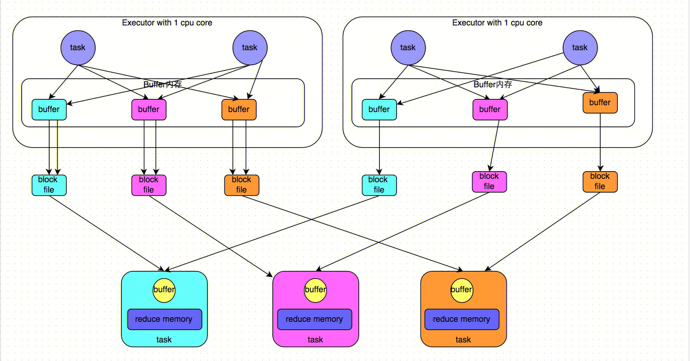


### 1.4.2 SortShuffleManager 运行原理

#### 普通运行机制

下图说明了普通的 SortShuffleManager 的原理。在该模式下，数据会先写入一个内存数据结构中，此时根据不同的 shuffle 算子，可能选用不同的数据结构。如果是 reduceByKey 这种聚合类的 shuffle 算子，那么会选用 Map 数据结构，一边通过 Map 进行聚合，一边写入内存；如果是 join 这种普通的 shuffle 算子，那么会选用 Array 数据结构，直接写入内存。接着，**每写一条数据进入内存数据结构之后，就会判断一下，是否达到了某个临界阈值。如果达到临界阈值的话，那么就会尝试将内存数据结构中的数据溢写到磁盘，然后清空内存数据结构**。

**在溢写到磁盘文件之前，会先根据 key 对内存数据结构中已有的数据进行排序**。排序过后，会分批将数据写入磁盘文件。默认的 batch 数量是 10000 条，也就是说，排序好的数据，会以每批 1 万条数据的形式分批写入磁盘文件。写入磁盘文件是通过 Java 的 BufferedOutputStream 实现的。BufferedOutputStream 是 Java 的缓冲输出流，首先会将数据缓冲在内存中，当内存缓冲满溢之后再一次写入磁盘文件中，这样可以减少磁盘 IO 次数，提升性能。

一个 task 将所有数据写入内存数据结构的过程中，**会发生多次磁盘溢写操作，也就会产生多个临时文件。最后会将之前所有的临时磁盘文件都进行合并，这就是 merge 过程**，此时会将之前所有临时磁盘文件中的数据读取出来，然后依次写入最终的磁盘文件之中。此外，由于一个 task 就只对应一个磁盘文件，也就意味着该 task 为下游 stage 的 task 准备的数据都在这一个文件中，因此**还会单独写一份索引文件，其中标识了下游各个 task 的数据在文件中的 start offset 与 end offset**。

SortShuffleManager 由于有一个磁盘文件 merge 的过程，因此大大减少了文件数量。比如第一个 stage 有 50 个 task，总共有 10 个 Executor，每个 Executor 执行 5 个 task，而第二个 stage 有 100 个 task。由于**每个 task 最终只有一个磁盘文件**，因此此时每个 Executor 上只有 5 个磁盘文件，所有 Executor 只有 50 个磁盘文件。

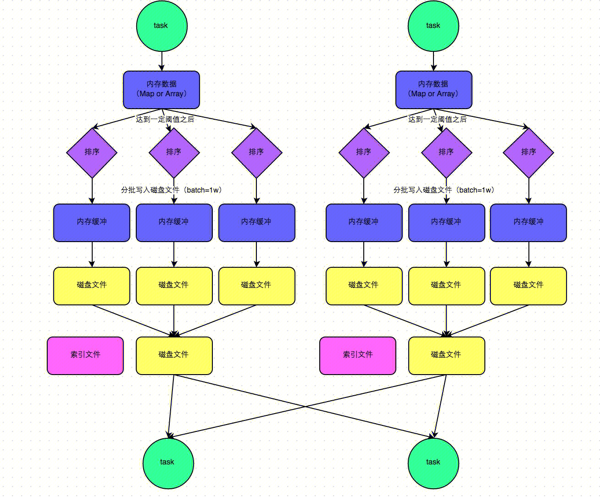


#### bypass 运行机制

下图说明了 bypass SortShuffleManager 的原理。bypass 运行机制的触发条件如下： **shuffle map task 数量小于等于 spark.shuffle.sort.bypassMergeThreshold 参数的值，且不是聚合类的 shuffle  算子（比如 reduceByKey）**。

此时 task 会为每个下游 task 都创建一个临时磁盘文件，并将数据按 key 进行 hash，然后根据 key 的 hash 值，将 key 写入对应的磁盘文件之中。当然，写入磁盘文件时也是先写入内存缓冲，缓冲写满之后再溢写到磁盘文件的。最后，同样会将所有临时磁盘文件都合并成一个磁盘文件，并创建一个单独的索引文件。

该过程的**磁盘写机制其实跟未经优化的 HashShuffleManager 是一模一样的，因为都要创建数量惊人的磁盘文件，只是在最后会做一个磁盘文件的合并而已**。因此少量的最终磁盘文件，也让该机制相对未经优化的 HashShuffleManager 来说，shuffle read 的性能会更好。

而**该机制与普通 SortShuffleManager 运行机制的不同在于：第一，磁盘写机制不同；第二，不会进行排序**。也就是说，启用该机制的最大好处在于，**shuffle write 过程中，不需要进行数据的排序操作，也就节省掉了这部分的性能开销**。

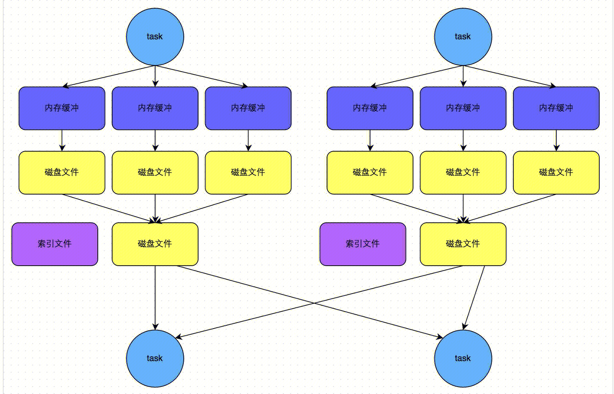


#### SortShuffleManager 实现原理

Spark 作业运行过程中，最消耗性能的地方就是 shuffle，而 shuffle 的性能主要取决于落盘机制。由第 1 节可知，ShuffleMapTask 负责写，因此从 ShuffleMapTask 类的 runTask() 方法开始。注意，针对不同的 shuffleHandle，获取的是不同 Writer，它们分别是：

1. **不能有预聚和、且下游 RDD 的分区数小于等于 200**：BypassMergeSortShuffleHandle => BypassMergeSortShuffleWriter
2. **支持序列化的重定向操作、且不能有预聚和、且分区数量不能大于 16777216**：SerializedShuffleHandle => UnsafeShuffleWriter
3. **以上均不满足**：BaseShuffleHandle => SortShuffleWriter

```scala
ShuffleMapTask
  runTask()
    dep.shuffleWriterProcessor.write()
      dep.shuffleHandle
        shuffleHandle: ShuffleHandle = registerShuffle()
          // 不能有预聚和、且下游RDD的分区数小于等于200（spark.shuffle.sort.bypassMergeThreshold配置参数指定）
          if (SortShuffleWriter.shouldBypassMergeSort(conf, dependency))
            new BypassMergeSortShuffleHandle[K, V]()
          // 支持序列化的重定向操作、且不能有预聚和、且分区数量不能大于16777216
          else if (SortShuffleManager.canUseSerializedShuffle(dependency))
            new SerializedShuffleHandle[K, V]()
          // 以上均不满足
          else 
            new BaseShuffleHandle()
      // 根据不同的shuffleHandle，获取不同Writer
      writer = manager.getWriter[Any, Any]()
        // SortShuffleManager类，新版本已经不存在HashShuffleManager
        case SerializedShuffleHandle => new UnsafeShuffleWriter()
        case BypassMergeSortShuffleHandle => new BypassMergeSortShuffleWriter()
        case BaseShuffleHandle => new SortShuffleWriter() 
      writer.write()
```

```scala
SortShuffleWriter
  write()
    // 注意，若有map端预聚合，传参dep.aggregator（聚合器）、dep.keyOrdering（排序方式）；否则传参None
    sorter = new ExternalSorter[K, V, C]()
    sorter.insertAll()
      shouldCombine = aggregator.isDefined
      // 若有map端预聚合，map类型是PartitionedAppendOnlyMap，根据key=(分区号, key)更新value
      if (shouldCombine)
        map.changeValue((getPartition(kv._1), kv._1), update)
        maybeSpillCollection(usingMap = true)
          maybeSpill(map, estimatedSize)
            spill()
              // ExternalSorter类，先按照分区排序，分区相同，再按照key排序
              destructiveSortedWritablePartitionedIterator()
                partitionedDestructiveSortedIterator()
              spillMemoryIteratorToDisk()
                // 生成临时溢写文件
                diskBlockManager.createTempShuffleBlock()
              // 记录临时溢写文件
              spills += spillFile
            releaseMemory()
      // 若没有map端预聚合，buffer类型是PartitionedPairBuffer，写入缓冲区
      else
        buffer.insert(getPartition(kv._1), kv._1, kv._2.asInstanceOf[C])
        // 后续调用流程与map端预聚合类似
        maybeSpillCollection(usingMap = false)
    // 合并溢写文件
    sorter.writePartitionedMapOutput()
      // 若存在溢写文件，判断条件：if (spills.isEmpty)
      this.partitionedIterator
        // 合并溢写和内存中的数据
        merge()
          // 使用归并排序，实现上使用优先队列PriorityQueue
          mergeSort()
    mapOutputWriter.commitAllPartitions()
      // LocalDiskShuffleMapOutputWriter类
      blockResolver.writeIndexFileAndCommit()
        // 获取临时数据/索引文件，改名为正式数据/索引文件
        indexFile = getIndexFile(shuffleId, mapId)
        dataFile = getDataFile(shuffleId, mapId)
        indexTmp.renameTo(indexFile)
        dataTmp.renameTo(dataFile)
```

```scala
BypassMergeSortShuffleWriter
  write()
    // 针对每个分区，对应写一个临时文件
    partitionWriters = new DiskBlockObjectWriter[numPartitions]
    partitionWriters[i] = blockManager.getDiskWriter()
    partitionWriters[partitioner.getPartition(key)].write()
    // 将所有分区文件合并为一个单独的组合文件
    writePartitionedData()
      // 后续调用流程与SortShuffleWriter相同
      mapOutputWriter.commitAllPartitions()
```


# 2. Spark on K8s

说明：代码部份以 spark 3.4.2 为例讲解，辅以 spark 3.1.3。

## 2.1 作业提交流程

1. 命令行提交命令：与上一篇文章《从 spark-submit 开始》类似。

2. 从 SparkSubmit 类的 main() 方法开始。注意，在 Client 模式下，childMainClass = org.apache.spark.examples.SparkPi。而在 Cluster 模式下，childMainClass = org.apache.spark.deploy.k8s.submit.KubernetesClientApplication。下面先以 Cluster 模式为例，讲解后续流程。由于 SparkPi 任务运行后就立马结束了，没有足够的时间进入 Driver/Executor Pod 观察进程等情况，因此这里以 Kyuubi 提交 Spark 任务作为演示。

   ```scala
   SparkSubmit
     main(args)
       doSubmit(args)
         // 解析参数，args是命令行参数
         parseArguments(args)
           // 例如，解析--master得到：maybeMaster=k8s://https://kubernetes.default.svc、解析--class得到：mainClass=org.apache.spark.examples.SparkPi
           parse(args.asJava)
           				
         submit()
           doRunMain()
             // 使用提交的参数运行子类的main方法
             runMain()
               // 【Cluster】childMainClass => org.apache.spark.deploy.k8s.submit.KubernetesClientApplication
               // 【Client】 childMainClass => org.apache.spark.examples.SparkPi
               (childArgs, childClasspath, sparkConf, childMainClass) = prepareSubmitEnvironment(args)
               // 通过反射获取Class类对象
               mainClass = Utils.classForName(childMainClass)
               // 判断条件：mainClass是否为SparkApplication实现类
               if (classOf[SparkApplication].isAssignableFrom(mainClass))
                 // 【Cluster】通过反射调用KubernetesClientApplication构造方法，生成实例
                 mainClass.getConstructor().newInstance().asInstanceOf[SparkApplication]
                 // 【client】在本地通过反射执行main方法，即此时即生成了Driver
                 new JavaMainApplication(mainClass)
               app.start(childArgs.toArray, sparkConf)
   ```

   通过 Kyuubi 提交 Spark 任务后，新开一个窗口重新进入 Kyuubi Pod，查看 Pod 内执行的进程，如下图所示。Client 端确实启动了一个 Java 进程，且主方法是 org.apache.spark.deploy.SparkSubmit，即**进程名为 SparkSubmit**。

   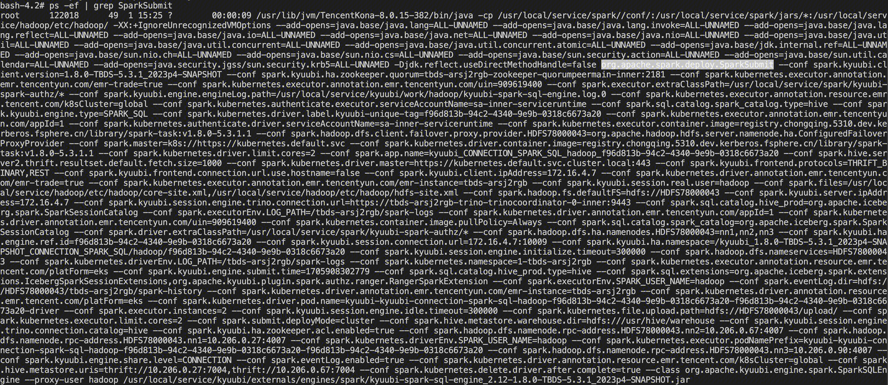

3. 从 KubernetesClientApplication 类的 start() 方法开始。这里大致的处理逻辑就是，Client 通过 K8s 的 API 来写 Driver YAML 文件，然后向 K8s 集群申请创建 Driver Pod，最后通过 K8s Watch 机制监控 Driver Pod 的状态，一直等待作业完成才会退出。

   ```scala
   KubernetesClientApplication
     start(args, conf)
       // 解析参数
       ClientArguments.fromCommandLineArgs(args)
       run(parsedArguments, conf)
         // 生成spark.app.id，以”spark-{UUID}”为模板。之所以重新生成而不直接使用提交的作业name，是因为pod需要打上label——spark-app-selector:{appId}，label的值有长度限制
         KubernetesConf.getKubernetesAppId()
         KubernetesConf.createDriverConf()
         // 启动Pod时，会给Pod添加一个watcher：LoggingPodStatusWatcher用来监听Pod事件，当Pod状态到达完成状态时，触发当前进程退出
         new LoggingPodStatusWatcherImpl(kubernetesConf)
         SparkKubernetesClientFactory.createKubernetesClient()
         new Client().run()
           // KubernetesDriverBuilder构建driver pod，与之类似，KubernetesExecutorBuilder构建executor pod
           resolvedDriverSpec = builder.buildFromFeatures(conf, kubernetesClient)
             // spark.kubernetes.driver.podTemplateFile参数配置driver pod模版文件
             initialPod = conf.get(Config.KUBERNETES_DRIVER_PODTEMPLATE_FILE)
             // features包含了多个FeatureStep，它们都实现了KubernetesFeatureConfigStep特质，可以理解为通过K8s的API来写YAML文件。KubernetesFeatureConfigStep特质定义了4个抽象方法：
             // ①configurePod：根据当前特性对给定的Pod进行修改，包括附加卷、添加环境变量、标签、注解 ②getAdditionalPodSystemProperties：返回根据当前特性在JVM上设置的任何系统属性
             // ③getAdditionalPreKubernetesResources：返回应添加的额外K8s资源，资源将在Pod创建之前进行设置/刷新 ④getAdditionalKubernetesResources：同上，不过资源将在Pod创建后进行设置/刷新。
             features = Seq(new BasicDriverFeatureStep(conf)...) ++ userFeatures
               // 基础设置：设置driver容器名称、镜像、拉取策略、三个端口（driver-rpc-port、blockmanager、spark-ui，仅提供声明）、部分环境变量、资源（CPU、内存）
               // 以及driver pod元数据（名称、标签、注解）、描述（重启策略、节点选择器、镜像拉取密码）
               new BasicDriverFeatureStep(conf)
               // K8s安全认证设置：必要时设置driver容器及driver pod卷，卷的类型为Secret，保存K8s安全相关的文件
               new DriverKubernetesCredentialsFeatureStep(conf)
               // service设置：service名为”{作业名前缀}-driver-svc”，暴露上面提到的driver-rpc-port、blockmanager、spark-ui三个端口，用于executor连接driver进行通信
               new DriverServiceFeatureStep(conf)
               // 挂载Secrets设置：解析参数--conf spark.kubernetes.driver.secrets.[SecretName]，将名为SecretName的Secret添加到driver pod指定路径上
               new MountSecretsFeatureStep(conf)
               // Secrets环境变量设置：解析参数--conf spark.kubernetes.driver.secretKeyRef.[EnvName]，在driver容器中添加名为EnvName（区分大小写）的环境变量
               new EnvSecretsFeatureStep(conf)
               // 挂载Volumes设置：解析参数--conf spark.kubernetes.driver.volumes.[VolumeType].[VolumeName].xxx，处理挂载路径/子路径、是否只读、卷选项、卷名称、卷类型（支持：HostPath、PVC、EmptyDir、NFS）
               new MountVolumesFeatureStep(conf)
               // Driver命令设置：创建drive运行命令，并传播所需的配置，driver容器参数依次为：driver --proxy-user xxx --properties-file xxx --class xxx {resource} {appArgs}
               new DriverCommandFeatureStep(conf)
               // Hadoop配置设置：以ConfigMap形式挂载hadoop配置，如core-site.xml、hdfs-site.xml
               // 若设置了HADOOP_CONF_DIR环境变量，则从指定的路径获取文件并挂载，否则使用参数spark.kubernetes.hadoop.configMapName指定的已存在的configmap
               new HadoopConfDriverFeatureStep(conf)
               // Kerberos配置设置：以ConfigMap形式挂载krb5.conf，若设置了spark.kubernetes.kerberos.krb5.configMapName，则直接使用已存在的configmap，否则创建名为“krb5-file”的configmap，挂载路径为“/etc/krb5.conf”
               // 以Secret形式挂载keytab（token），挂载卷名称为“hadoop-secret”，默认挂载路径为“/mnt/secrets/hadoop-credentials”，其中token secret名为“{作业名前缀}-delegation-tokens”
               new KerberosConfDriverFeatureStep(conf)
               // Pod模版设置：解析参数：--conf spark.kubernetes.executor.podTemplateFile，以ConfigMap形式挂载executor pod模版
               new PodTemplateConfigMapStep(conf)
               // LocalDirs设置：以EmptyDir形式挂载临时数据（shuffle数据、广播变量等）存储目录，卷名称为“spark-local-dir-${index}”，默认挂载路径为“/var/data/spark-{UUID}”
               new LocalDirsFeatureStep(conf)
             features.foldLeft(spec) { case (spec, feature) => val configuredPod = feature.configurePod(spec.pod) ...}
           
           // driver configmap名称为“spark-drv-{UUID}-conf-map”，executor configmap名称为“spark-exec-{UUID}-conf-map”
           KubernetesClientUtils.configMapNameDriver
           // 构建以key为文件名、value为文件内容的映射，其中包含了在SPARK_CONF_DIR中选择的所有文件
           // ConfigMap不支持存储二进制内容，因此排除jar、tar、gzip、zip等文件；同时排除所有模板文件和用户提供的Spark配置或属性，Spark属性将在不同的步骤中解析
           KubernetesClientUtils.buildSparkConfDirFilesMap()
           // 构建ConfigMap，保存上面SPARK_CONF_DIR中文件的内容
           KubernetesClientUtils.buildConfigMap()
           // 构建driver容器，新增一个环境变量SPARK_CONF_DIR=/opt/spark/conf；新增一个挂载卷，名为spark-conf-volume-driver，挂载路径为/opt/spark/conf
           val resolvedDriverContainer = new ContainerBuilder(resolvedDriverSpec.pod.container)....build()
           // 构建driver pod，新增上面构建的driver容器；新增一个名为spark-conf-volume-driver的卷，卷的类型为configmap
           // configmap名仍为“spark-drv-{UUID}-conf-map”，每个item的key与path保持一致，mode为420（420是十进制表示的八进制字面量0644）
           val resolvedDriverPod = new PodBuilder(resolvedDriverSpec.pod.pod)....build()
           
           // 在创建driver pod之前设置资源
           kubernetesClient.resourceList(preKubernetesResources: _*).createOrReplace()
           // 创建driver pod
           createdDriverPod = kubernetesClient.pods().inNamespace(conf.namespace).resource(resolvedDriverPod).create()
           // 刷新所有预先资源的所有者引用。创建的额外resource（如configmap/service/secret）通过k8s的OwnerReference关联到driver pod，以便于driver pod删除时这些资源一起回收掉
           addOwnerReference(createdDriverPod, preKubernetesResources)
           // 在创建driver pod之后设置资源，并刷新所有资源的所有者引用
           addOwnerReference(createdDriverPod, otherKubernetesResources)
           kubernetesClient.resourceList(otherKubernetesResources: _*).createOrReplace()
   
           // 如果spark.kubernetes.submission.waitAppCompletion没有设置成false（默认true），SparkSubmit进程会一直等待作业完成才会退出
           if (conf.get(WAIT_FOR_APP_COMPLETION))
             // 这里的watcher即之前创建的LoggingPodStatusWatcherImpl，可以实时监视driver pod的状态变化
             podWithName.watch(watcher)
             // watchOrStop在synchronized代码块中，循环判断podCompleted状态变量，直到pod完成，并返回podCompleted
             if (watcher.watchOrStop(sId))
               // 新增功能，当spark.kubernetes.delete.driver.after.complete设置为true时（默认false），将睡眠30s（spark.kubernetes.delete.driver.pod.delay）后，删除driver pod
               if (conf.get(KUBERNETES_SHOULD_DELETE_AFTER_DRIVER_COMPLETE))
                 kubernetesClient.pods().withName(driverPodName).delete()
   ```

   通过 Kyuubi 提交 Spark 任务，执行 `kubectl get pods -n  1-tbds-2jaylvrp kyuubi-kyuubi-connection-spark-sql-hadoop-4c6b364a-cf5e-4bd0-878e-5784b7b31836-4c6b364a-cf5e-4bd0-878e-5784b7b31836-driver  -o yaml` 导出的 driver yaml 文件示例如下。

   ```yaml
   apiVersion: v1
   kind: Pod
   metadata:
     annotations:
       emr.tencentyun.com/appId: "1"
       emr.tencentyun.com/emr-instance: tbds-2jaylvrp
       emr.tencentyun.com/emr-trade: "true"
       emr.tencentyun.com/uin: "909619400"
       ipip.ipv4.network.infra.tce.io/address: 10.0.2.67
       ipip.ipv4.network.infra.tce.io/attributes: "null"
       network.infra.tce.io/ipam-allocation-error: ""
       network.infra.tce.io/ipv4: 10.0.2.67
       network.infra.tce.io/type: ipip
       resource.emr.tencent.com/k8sCluster: global
       resource.emr.tencent.com/platForm: eks
       v1.multus-cni.io/default-network: ipip
     creationTimestamp: "2024-01-18T02:07:05Z"
     labels:
       kyuubi-unique-tag: 4c6b364a-cf5e-4bd0-878e-5784b7b31836
       spark-app-name: kyuubi-connection-spark-sql-hadoop-4c6b364a-cf5e-4bd0-878e-5784
       spark-app-selector: spark-c3bfa25751d24f5abe6193f0ff1d12f2
       spark-role: driver
       spark-version: 3.4.2-TBDS-5.3.1_2023p4-SNAPSHOT
     name: kyuubi-kyuubi-connection-spark-sql-hadoop-4c6b364a-cf5e-4bd0-878e-5784b7b31836-4c6b364a-cf5e-4bd0-878e-5784b7b31836-driver
     namespace: 1-tbds-2jaylvrp
     resourceVersion: "22169640"
     selfLink: /api/v1/namespaces/1-tbds-2jaylvrp/pods/kyuubi-kyuubi-connection-spark-sql-hadoop-4c6b364a-cf5e-4bd0-878e-5784b7b31836-4c6b364a-cf5e-4bd0-878e-5784b7b31836-driver
     uid: 55285a1e-ef0a-431e-9379-1cfaf48262cc
   spec:
     containers:
     - args:
       - driver
       - --proxy-user
       - hadoop
       - --properties-file
       - /opt/spark/conf/spark.properties
       - --class
       - org.apache.kyuubi.engine.spark.SparkSQLEngine
       - spark-internal
       env:
       - name: SPARK_USER
         value: hadoop
       - name: SPARK_APPLICATION_ID
         value: spark-c3bfa25751d24f5abe6193f0ff1d12f2
       - name: LOG_PATH
         value: /tbds-2jaylvrp/spark-logs
       - name: SPARK_USER_NAME
         value: hadoop
       - name: SPARK_DRIVER_BIND_ADDRESS
         valueFrom:
           fieldRef:
             apiVersion: v1
             fieldPath: status.podIP
       - name: SPARK_DRIVER_POD_NAME
         valueFrom:
           fieldRef:
             apiVersion: v1
             fieldPath: metadata.name
       - name: SPARK_NAMESPACE
         valueFrom:
           fieldRef:
             apiVersion: v1
             fieldPath: metadata.namespace
       - name: HADOOP_CONF_DIR
         value: /opt/hadoop/conf
       - name: HADOOP_TOKEN_FILE_LOCATION
         value: /mnt/secrets/hadoop-credentials/hadoop-tokens
       - name: SPARK_LOCAL_DIRS
         value: /var/data/spark-cd11787d-09dd-4b8a-8fbb-82a40b852676
       - name: SPARK_CONF_DIR
         value: /opt/spark/conf
       image: registry.chongqing.standard.dev-self-test.fsphere.cn/library/spark-task:v1.8.0-5.3.1.1
       imagePullPolicy: Always
       name: spark-kubernetes-driver
       ports:
       - containerPort: 7078
         name: driver-rpc-port
         protocol: TCP
       - containerPort: 7079
         name: blockmanager
         protocol: TCP
       - containerPort: 4040
         name: spark-ui
         protocol: TCP
       resources:
         limits:
           cpu: "2"
           memory: 1408Mi
         requests:
           cpu: "1"
           memory: 1408Mi
       terminationMessagePath: /dev/termination-log
       terminationMessagePolicy: File
       volumeMounts:
       - mountPath: /opt/hadoop/conf
         name: hadoop-properties
       - mountPath: /etc/krb5.conf
         name: krb5-file
         subPath: krb5.conf
       - mountPath: /mnt/secrets/hadoop-credentials
         name: hadoop-secret
       - mountPath: /var/data/spark-cd11787d-09dd-4b8a-8fbb-82a40b852676
         name: spark-local-dir-1
       - mountPath: /opt/spark/conf
         name: spark-conf-volume-driver
       - mountPath: /var/run/secrets/kubernetes.io/serviceaccount
         name: sa-inner-serviceruntime-token-rswmr
         readOnly: true
     dnsPolicy: ClusterFirst
     enableServiceLinks: true
     nodeName: 172.16.0.37
     priority: 0
     restartPolicy: Never
     schedulerName: default-scheduler
     securityContext: {}
     serviceAccount: sa-inner-serviceruntime
     serviceAccountName: sa-inner-serviceruntime
     terminationGracePeriodSeconds: 30
     tolerations:
     - effect: NoExecute
       key: node.kubernetes.io/not-ready
       operator: Exists
       tolerationSeconds: 300
     - effect: NoExecute
       key: node.kubernetes.io/unreachable
       operator: Exists
       tolerationSeconds: 300
     volumes:
     - configMap:
         defaultMode: 420
         items:
         - key: core-site.xml
           path: core-site.xml
         - key: hdfs-site.xml
           path: hdfs-site.xml
         name: kyuubi-connection-spark-sql-hadoop-4c6b364a-cf5e-4bd0-878e-5784b7b31836-bd310d8d1a525155-hadoop-config
       name: hadoop-properties
     - configMap:
         defaultMode: 420
         items:
         - key: krb5.conf
           path: krb5.conf
         name: kyuubi-connection-spark-sql-hadoop-4c6b364a-cf5e-4bd0-878e-5784b7b31836-bd310d8d1a525155-krb5-file
       name: krb5-file
     - name: hadoop-secret
       secret:
         defaultMode: 420
         secretName: kyuubi-connection-spark-sql-hadoop-4c6b364a-cf5e-4bd0-878e-5784b7b31836-bd310d8d1a525155-delegation-tokens
     - emptyDir: {}
       name: spark-local-dir-1
     - configMap:
         defaultMode: 420
         items:
         - key: hbase-site.xml
           mode: 420
           path: hbase-site.xml
         - key: ranger-spark-audit.xml
           mode: 420
           path: ranger-spark-audit.xml
         - key: ranger-spark-security.xml
           mode: 420
           path: ranger-spark-security.xml
         - key: spark.properties
           mode: 420
           path: spark.properties
         name: spark-drv-f49a1d8d1a526a04-conf-map
       name: spark-conf-volume-driver
     - name: sa-inner-serviceruntime-token-rswmr
       secret:
         defaultMode: 420
         secretName: sa-inner-serviceruntime-token-rswmr
   status:
     conditions:
     - lastProbeTime: null
       lastTransitionTime: "2024-01-18T02:07:05Z"
       status: "True"
       type: Initialized
     - lastProbeTime: null
       lastTransitionTime: "2024-01-18T02:07:08Z"
       status: "True"
       type: Ready
     - lastProbeTime: null
       lastTransitionTime: "2024-01-18T02:07:08Z"
       status: "True"
       type: ContainersReady
     - lastProbeTime: null
       lastTransitionTime: "2024-01-18T02:07:05Z"
       status: "True"
       type: PodScheduled
     containerStatuses:
     - containerID: docker://6f163c85e2b940ded064d4df6e497fc6f7d3032e7de22ef1097020dee9e71096
       image: registry.chongqing.standard.dev-self-test.fsphere.cn/library/spark-task:v1.8.0-5.3.1.1
       imageID: docker-pullable://registry.chongqing.standard.dev-self-test.fsphere.cn/library/spark-task@sha256:29c39d29269a0689c37808c4e762ed2fcbafd31666c4e73e8b65d2518ffeef05
       lastState: {}
       name: spark-kubernetes-driver
       ready: true
       restartCount: 0
       started: true
       state:
         running:
           startedAt: "2024-01-18T02:07:07Z"
     hostIP: 172.16.0.37
     phase: Running
     podIP: 10.0.2.67
     podIPs:
     - ip: 10.0.2.67
     qosClass: Burstable
     startTime: "2024-01-18T02:07:05Z"
   ```

   

## 2.2 Driver 启动

1. Driver Pod 被拉起后，将执行 Driver 容器的 ENTRYPOINT 入口点。将 args 参数传递给 spark-submit，然后**以 client 模式再次启动一个 SparkSubmit 进程**，参数 spark.driver.bindAddress 用于处理和查看作业运行过程中的 driver 日志（扩展功能）。这里也可以看出 cluster 模式与 client 模式的区别，**cluster 模式 driver 位于 K8s 集群内，而 client 模式 driver 位于 K8s 集群外**。

   ```shell
   case "$1" in
     driver)
       mkdir -p /usr/local/service/hadoop/etc
       ln -sf /opt/hadoop/conf /usr/local/service/hadoop/etc/hadoop
       shift 1
       CMD=(
         "$SPARK_HOME/bin/spark-submit"
         --conf "spark.driver.bindAddress=$SPARK_DRIVER_BIND_ADDRESS"
         --deploy-mode client
         "$@"
       )
       ;;
     # ...
   esac
   ```

   执行 `kubectl exec -it -n  1-tbds-2jaylvrp kyuubi-kyuubi-connection-spark-sql-hadoop-4c6b364a-cf5e-4bd0-878e-5784b7b31836-4c6b364a-cf5e-4bd0-878e-5784b7b31836-driver  -- bash` 进入 Driver Pod，查看 Pod 内执行的进程，如下图所示。Driver 确实启动了一个 Java 进程，且主方法是 org.apache.spark.deploy.SparkSubmit，参数 deploy-mode 为 client，即**进程名为 SparkSubmit**。

   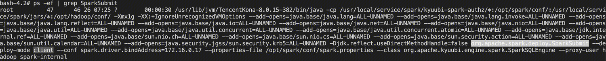

2. 启动 SparkSubmit 的源码，和上文分析的一样，只不过这次是以 client 模式提交的，所以不会再调用到 org.apache.spark.deploy.k8s.submit.KubernetesClientApplication，而是直接调用到 --class 指定的作业类名的 main 方法，在当前例子中就是直接执行 org.apache.spark.examples.SparkPi 的 main 方法。按照规范，用户代码中需要先创建 SparkContext，因此接下来从 SparkContext 开始分析。

   ```scala
   SparkContext
     // 1.创建spark执行环境
     _env = createSparkEnv(_conf, isLocal, listenerBus)
       SparkEnv.createDriverEnv()
         // 为driver或executor创建SparkEnv
         create()
           RpcEnv.create()
             new NettyRpcEnvFactory().create(config)
               nettyEnv = new NettyRpcEnv()
                 // RpcAddress -> Outbox映射。当连接到远程的RpcAddress时，只需将消息放入其Outbox中，以实现非阻塞的send方法
                 val outboxes = new ConcurrentHashMap[RpcAddress, Outbox]()
                   // Outbox成员，链表结构存放消息，TransportClient可与TransportServer通信
                   val messages = new java.util.LinkedList[OutboxMessage]
                   var client: TransportClient = null
               Utils.startServiceOnPort()
                 // startService是个函数参数，实际调用nettyEnv.startServer(）
                 val (service, port) = startService(tryPort)
                   // 创建一个服务器，尝试绑定到特定的主机和端口
                   transportContext.createServer()
                     new TransportServer()
                       // hostToBind为driver启动参数--conf spark.driver.bindAddress指定的值，即pod ip；portToBind默认为7078。即在7078端口初始化driver rpc server，等待executor连接
                       init(hostToBind, portToBind)
                         // Netty API，其中ioMode = NIO/EPOLL，Linux不支持AIO，故采用EPOLL方式来模拟，默认使用NIO
                         new ServerBootstrap().group(bossGroup, workerGroup).channel(NettyUtils.getServerChannelClass(ioMode))...
     
     // 2.初始化心跳接收器，executor将向driver定时发送心跳
     _heartbeatReceiver = env.rpcEnv.setupEndpoint()
     // 3.创建TaskScheduler，负责Task级的调度
     val (sched, ts) = SparkContext.createTaskScheduler(this, master)
       // 返回类型ExternalClusterManager，其有3个子类：KubernetesClusterManager、MesosClusterManager、YarnClusterManager，后面调用的都是KubernetesClusterManager重写的方法
       case masterUrl => val cm = getClusterManager(masterUrl)
       // 返回TaskSchedulerImpl实例
       val scheduler = cm.createTaskScheduler(sc, masterUrl)
       // 返回KubernetesClusterSchedulerBackend实例，该类继承自CoarseGrainedSchedulerBackend
       val backend = cm.createSchedulerBackend(sc, masterUrl, scheduler)
       // 初始化backend，SchedulerBackend是TaskScheduler重要成员，用于和外部组件进行通信交互
       cm.initialize(scheduler, backend)
         // 这里还构建了任务调度池，分为FIFOSchedulableBuilder（默认）、FairSchedulableBuilder两种
         scheduler.asInstanceOf[TaskSchedulerImpl].initialize(backend)
     _schedulerBackend = sched
     _taskScheduler = ts
     // 4.创建DAGScheduler，负责Stage级的调度
     _dagScheduler = new DAGScheduler(this)
     
     _taskScheduler.start()
       // 实际执行KubernetesClusterSchedulerBackend类的start()方法
       backend.start()
         // 父类CoarseGrainedSchedulerBackend启动线程，定期获取并刷新token
         super.start()
         // AbstractPodsAllocator是一个分配不同类型Pod的抽象类，其有2个子类：StatefulSetPodsAllocator、ExecutorPodsAllocator（默认）
         podAllocator.start(applicationId(), this)
           // 启动executor之前，等待driver pod准备就绪，否则无法通过DNS解析headless service
           kubernetesClient.pods()....waitUntilReady()
           // ExecutorPodsSnapshotsStoreImpl控制executor pod状态传播给订阅者，以便对该状态做出反应。应用程序的所有executor pod的状态组合称为快照，大致遵循生产者-消费者模型：
           // 生产者以两种方式推送更新，通过updatePod()发送的增量更新表示单个executor pod的已知新状态；通过replaceSnapshot()发送的完整同步表示所有executor pod的最新状态
           // 订阅者注册希望了解executor pod的所有快照。每当存储库增量更新或完整同步替换其最新的快照时，更新后的最新快照将被发布到订阅者的缓冲区，订阅者按时间窗口分块接收生产者生成的快照
           snapshotsStore.addSubscriber(podAllocationDelay) { onNewSnapshots() }
             subscribersExecutor.scheduleWithFixedDelay(() => newSubscriber.processSnapshots(), ...)
               processSnapshotsInternal()
                 // 从订阅者缓冲区获取快照，并回调处理，onNewSnapshots即回调函数
                 onNewSnapshots(snapshots.asScala.toSeq)
                   requestNewExecutors()
                     // executor pvc重用
                     val reusablePVCs = getReusablePVCs(applicationId, pvcsInUse)
                     // KubernetesDriverBuilder构建driver pod，与之类似，KubernetesExecutorBuilder构建executor pod
                     val resolvedExecutorSpec = executorBuilder.buildFromFeatures()
                       // spark.kubernetes.executor.podTemplateFile参数配置executor pod模版文件
                       initialPod = conf.get(Config.KUBERNETES_EXECUTOR_PODTEMPLATE_FILE)
                       // 与构建driver pod类似，features包含了多个FeatureStep，它们都实现了KubernetesFeatureConfigStep特质，可以理解为通过K8s的API来写YAML文件
                       features = Seq(new BasicExecutorFeatureStep(conf, secMgr, resourceProfile)...) ++ userFeatures
                         // 基础设置：设置executor容器名称、镜像、拉取策略、部分环境变量、资源（CPU、内存）、volume、PreStop钩子
                         // 以及executor pod元数据（名称、标签、注解、OwnerReference）、描述（主机名、重启策略、节点选择器、镜像拉取密码）
                         new BasicExecutorFeatureStep(conf, secMgr, resourceProfile)
                         // K8s安全认证设置：若未通过pod模板进行设置，则使用executor service account，若executor也未设置，则使用driver service account
                         new ExecutorKubernetesCredentialsFeatureStep(conf)
                         // 挂载Secrets设置（同driver）：解析参数--conf spark.kubernetes.executor.secrets.[SecretName]，将名为SecretName的Secret添加到executor pod指定路径上
                         new MountSecretsFeatureStep(conf)
                         // Secrets环境变量设置（同driver）：解析参数--conf spark.kubernetes.executor.secretKeyRef.[EnvName]，在executor容器中添加名为EnvName（区分大小写）的环境变量
                         new EnvSecretsFeatureStep(conf)
                         // 挂载Volumes设置（同driver）：解析参数--conf spark.kubernetes.executor.volumes.[VolumeType].[VolumeName].xxx，处理挂载路径/子路径、是否只读、卷选项、卷名称、卷类型（支持：HostPath、PVC、EmptyDir、NFS）
                         new MountVolumesFeatureStep(conf)
                         // LocalDirs设置（同driver）：以EmptyDir形式挂载临时数据（shuffle数据、广播变量等）存储目录，卷名称为“spark-local-dir-${index}”，默认挂载路径为“/var/data/spark-{UUID}”
                         new LocalDirsFeatureStep(conf)
                       features.foldLeft(spec) { case (spec, feature) => val configuredPod = feature.configurePod(spec.pod) ...}
                     // 创建executor pod
                     val createdExecutorPod = kubernetesClient.pods().inNamespace(namespace).resource(podWithAttachedContainer).create()
                     // 刷新资源的所有者引用。创建的额外resource（如configmap/secret）通过k8s的OwnerReference关联到executor pod，以便于executor pod删除时这些资源一起回收掉
                     addOwnerReference(createdExecutorPod, resources)
                     // pvc重用：pvc OwnerReference为driver，因此生命周期随driver释放，这样即使executor挂掉，新拉起的executor也会复用之前的pvc，避免了pvc申请的消耗，提高性能，同时丢失的shuffle数据会自动恢复
                     addOwnerReference(driverPod.get, Seq(resource))
                     kubernetesClient.persistentVolumeClaims()....create()
         // 若开启了动态分配，executor个数取spark.dynamicAllocation.minExecutors、spark.dynamicAllocation.initialExecutors、spark.executor.instances三者最大值，默认未开启为2个
         val initExecs = Map(defaultProfile -> initialExecutors)
         // ExecutorPodsLifecycleManager订阅executor pod快照，针对executor pod不同状态打印日志，必要时删除executor pod
         lifecycleEventHandler.start(this)
           snapshotsStore.addSubscriber(eventProcessingInterval) { onNewSnapshots(schedulerBackend, _) }
         // ExecutorPodsWatchSnapshotSource实时监视executor pod，通过updatePod()发送当前executor pod的新状态
         watchEvents.start(applicationId())
           kubernetesClient.pods()....watch(new ExecutorPodsWatcher())
         // 逻辑与driver类似，构建ConfigMap，保存SPARK_CONF_DIR中文件的内容，executor configmap名称为“spark-exec-{UUID}-conf-map”，所有executor共用该configmap
         setUpExecutorConfigMap(podAllocator.driverPod)
           val confFilesMap = KubernetesClientUtils.buildSparkConfDirFilesMap()
           val labels = Map(SPARK_APP_ID_LABEL -> applicationId(), SPARK_ROLE_LABEL -> SPARK_POD_EXECUTOR_ROLE)
           KubernetesClientUtils.buildConfigMap(configMapName, confFilesMap, labels)
           kubernetesClient.configMaps().inNamespace(namespace).resource(configMap).create()
   ```

   通过 Kyuubi 提交 Spark 任务，执行 `kubectl get pods -n  1-tbds-2jaylvrp kyuubi-kyuubi-connection-spark-sql-hadoop-4c6b364a-cf5e-4bd0-878e-5784b7b31836-4c6b364a-cf5e-4bd0-878e-5784b7b31836-exec-1  -o yaml` 导出的 executor yaml 文件示例如下。

   ```yaml
   apiVersion: v1
   kind: Pod
   metadata:
     annotations:
       emr.tencentyun.com/appId: "1"
       emr.tencentyun.com/emr-instance: tbds-2jaylvrp
       emr.tencentyun.com/emr-trade: "true"
       emr.tencentyun.com/uin: "909619400"
       ipip.ipv4.network.infra.tce.io/address: 10.0.2.73
       ipip.ipv4.network.infra.tce.io/attributes: "null"
       network.infra.tce.io/ipam-allocation-error: ""
       network.infra.tce.io/ipv4: 10.0.2.73
       network.infra.tce.io/type: ipip
       resource.emr.tencent.com/k8sCluster: global
       resource.emr.tencent.com/platForm: eks
       v1.multus-cni.io/default-network: ipip
     creationTimestamp: "2024-01-18T02:07:19Z"
     labels:
       spark-app-name: kyuubi-connection-spark-sql-hadoop-4c6b364a-cf5e-4bd0-878e-5784
       spark-app-selector: spark-c3bfa25751d24f5abe6193f0ff1d12f2
       spark-exec-id: "1"
       spark-exec-resourceprofile-id: "0"
       spark-role: executor
       spark-version: 3.4.2-TBDS-5.3.1_2023p4-SNAPSHOT
       tcs_region: chongqing
       tcs_zone: cq1
     name: kyuubi-kyuubi-connection-spark-sql-hadoop-4c6b364a-cf5e-4bd0-878e-5784b7b31836-4c6b364a-cf5e-4bd0-878e-5784b7b31836-exec-1
     namespace: 1-tbds-2jaylvrp
     ownerReferences:
     - apiVersion: v1
       controller: true
       kind: Pod
       name: kyuubi-kyuubi-connection-spark-sql-hadoop-4c6b364a-cf5e-4bd0-878e-5784b7b31836-4c6b364a-cf5e-4bd0-878e-5784b7b31836-driver
       uid: 55285a1e-ef0a-431e-9379-1cfaf48262cc
     resourceVersion: "22170123"
     selfLink: /api/v1/namespaces/1-tbds-2jaylvrp/pods/kyuubi-kyuubi-connection-spark-sql-hadoop-4c6b364a-cf5e-4bd0-878e-5784b7b31836-4c6b364a-cf5e-4bd0-878e-5784b7b31836-exec-1
     uid: b2797f98-7a9a-411e-befe-d86c1f415263
   spec:
     containers:
     - args:
       - executor
       env:
       - name: SPARK_USER
         value: hadoop
       - name: SPARK_DRIVER_URL
         value: spark://CoarseGrainedScheduler@spark-4764e08d1a5257e9-driver-svc.1-tbds-2jaylvrp.svc:7078
       - name: SPARK_EXECUTOR_CORES
         value: "1"
       - name: SPARK_EXECUTOR_MEMORY
         value: 1024m
       - name: SPARK_APPLICATION_ID
         value: spark-c3bfa25751d24f5abe6193f0ff1d12f2
       - name: SPARK_CONF_DIR
         value: /opt/spark/conf
       - name: SPARK_EXECUTOR_ID
         value: "1"
       - name: SPARK_RESOURCE_PROFILE_ID
         value: "0"
       - name: SPARK_USER_NAME
         value: hadoop
       - name: LOG_PATH
         value: /tbds-2jaylvrp/spark-logs
       - name: SPARK_CLASSPATH
         value: /usr/local/service/spark/kyuubi-spark-authz/*
       - name: SPARK_JAVA_OPT_0
         value: -Djava.net.preferIPv6Addresses=false
       - name: SPARK_JAVA_OPT_6
         value: --add-opens=java.base/java.net=ALL-UNNAMED
       - name: SPARK_JAVA_OPT_13
         value: --add-opens=java.base/sun.nio.cs=ALL-UNNAMED
       - name: SPARK_JAVA_OPT_4
         value: --add-opens=java.base/java.lang.reflect=ALL-UNNAMED
       - name: SPARK_JAVA_OPT_18
         value: -Dspark.driver.port=7078
       - name: SPARK_JAVA_OPT_1
         value: -XX:+IgnoreUnrecognizedVMOptions
       - name: SPARK_JAVA_OPT_10
         value: --add-opens=java.base/java.util.concurrent.atomic=ALL-UNNAMED
       - name: SPARK_JAVA_OPT_9
         value: --add-opens=java.base/java.util.concurrent=ALL-UNNAMED
       - name: SPARK_JAVA_OPT_7
         value: --add-opens=java.base/java.nio=ALL-UNNAMED
       - name: SPARK_JAVA_OPT_17
         value: -Djdk.reflect.useDirectMethodHandle=false
       - name: SPARK_JAVA_OPT_11
         value: --add-opens=java.base/jdk.internal.ref=ALL-UNNAMED
       - name: SPARK_JAVA_OPT_2
         value: --add-opens=java.base/java.lang=ALL-UNNAMED
       - name: SPARK_JAVA_OPT_16
         value: --add-opens=java.security.jgss/sun.security.krb5=ALL-UNNAMED
       - name: SPARK_JAVA_OPT_8
         value: --add-opens=java.base/java.util=ALL-UNNAMED
       - name: SPARK_JAVA_OPT_12
         value: --add-opens=java.base/sun.nio.ch=ALL-UNNAMED
       - name: SPARK_JAVA_OPT_15
         value: --add-opens=java.base/sun.util.calendar=ALL-UNNAMED
       - name: SPARK_JAVA_OPT_3
         value: --add-opens=java.base/java.lang.invoke=ALL-UNNAMED
       - name: SPARK_JAVA_OPT_19
         value: -Dspark.driver.blockManager.port=7079
       - name: SPARK_JAVA_OPT_14
         value: --add-opens=java.base/sun.security.action=ALL-UNNAMED
       - name: SPARK_JAVA_OPT_5
         value: --add-opens=java.base/java.io=ALL-UNNAMED
       - name: SPARK_EXECUTOR_POD_IP
         valueFrom:
           fieldRef:
             apiVersion: v1
             fieldPath: status.podIP
       - name: SPARK_EXECUTOR_POD_NAME
         valueFrom:
           fieldRef:
             apiVersion: v1
             fieldPath: metadata.name
       - name: SPARK_NAMESPACE
         valueFrom:
           fieldRef:
             apiVersion: v1
             fieldPath: metadata.namespace
       - name: SPARK_LOCAL_DIRS
         value: /var/data/spark-cd11787d-09dd-4b8a-8fbb-82a40b852676
       image: registry.chongqing.standard.dev-self-test.fsphere.cn/library/spark-task:v1.8.0-5.3.1.1
       imagePullPolicy: Always
       name: spark-kubernetes-executor
       ports:
       - containerPort: 7079
         name: blockmanager
         protocol: TCP
       resources:
         limits:
           cpu: "2"
           memory: 1408Mi
         requests:
           cpu: "1"
           memory: 1408Mi
       terminationMessagePath: /dev/termination-log
       terminationMessagePolicy: File
       volumeMounts:
       - mountPath: /opt/spark/conf
         name: spark-conf-volume-exec
       - mountPath: /var/data/spark-cd11787d-09dd-4b8a-8fbb-82a40b852676
         name: spark-local-dir-1
       - mountPath: /var/run/secrets/kubernetes.io/serviceaccount
         name: sa-inner-serviceruntime-token-rswmr
         readOnly: true
     dnsPolicy: ClusterFirst
     enableServiceLinks: true
     hostname: 0-878e-5784b7b31836-4c6b364a-cf5e-4bd0-878e-5784b7b31836-exec-1
     nodeName: 172.16.0.37
     priority: 0
     restartPolicy: Never
     schedulerName: default-scheduler
     securityContext: {}
     serviceAccount: sa-inner-serviceruntime
     serviceAccountName: sa-inner-serviceruntime
     terminationGracePeriodSeconds: 30
     tolerations:
     - effect: NoExecute
       key: node.kubernetes.io/not-ready
       operator: Exists
       tolerationSeconds: 300
     - effect: NoExecute
       key: node.kubernetes.io/unreachable
       operator: Exists
       tolerationSeconds: 300
     volumes:
     - configMap:
         defaultMode: 420
         items:
         - key: hbase-site.xml
           mode: 420
           path: hbase-site.xml
         - key: ranger-spark-audit.xml
           mode: 420
           path: ranger-spark-audit.xml
         - key: ranger-spark-security.xml
           mode: 420
           path: ranger-spark-security.xml
         name: spark-exec-aba9028d1a529f87-conf-map
       name: spark-conf-volume-exec
     - emptyDir: {}
       name: spark-local-dir-1
     - name: sa-inner-serviceruntime-token-rswmr
       secret:
         defaultMode: 420
         secretName: sa-inner-serviceruntime-token-rswmr
   status:
     conditions:
     - lastProbeTime: null
       lastTransitionTime: "2024-01-18T02:07:19Z"
       status: "True"
       type: Initialized
     - lastProbeTime: null
       lastTransitionTime: "2024-01-18T02:07:21Z"
       status: "True"
       type: Ready
     - lastProbeTime: null
       lastTransitionTime: "2024-01-18T02:07:21Z"
       status: "True"
       type: ContainersReady
     - lastProbeTime: null
       lastTransitionTime: "2024-01-18T02:07:19Z"
       status: "True"
       type: PodScheduled
     containerStatuses:
     - containerID: docker://52afa43413ba8f40905cd5e3d02e0a886713db90308c0e91cdf3492569ab3b7a
       image: registry.chongqing.standard.dev-self-test.fsphere.cn/library/spark-task:v1.8.0-5.3.1.1
       imageID: docker-pullable://registry.chongqing.standard.dev-self-test.fsphere.cn/library/spark-task@sha256:29c39d29269a0689c37808c4e762ed2fcbafd31666c4e73e8b65d2518ffeef05
       lastState: {}
       name: spark-kubernetes-executor
       ready: true
       restartCount: 0
       started: true
       state:
         running:
           startedAt: "2024-01-18T02:07:21Z"
     hostIP: 172.16.0.37
     phase: Running
     podIP: 10.0.2.73
     podIPs:
     - ip: 10.0.2.73
     qosClass: Burstable
     startTime: "2024-01-18T02:07:19Z"
   ```


## 2.3 Executor 启动

1. Executor Pod 被拉起后，将执行 Executor 容器的 ENTRYPOINT 入口点，启动的主类是 org.apache.spark.executor.CoarseGrainedExecutorBackend（和 standalone/yarn 模式一样）。

   ```shell
   case "$1" in
     # ...
     executor)
       shift 1
       CMD=(
         ${JAVA_HOME}/bin/java
         "${SPARK_EXECUTOR_JAVA_OPTS[@]}"
         -Xms$SPARK_EXECUTOR_MEMORY
         -Xmx$SPARK_EXECUTOR_MEMORY
         -cp "$SPARK_CLASSPATH:$SPARK_DIST_CLASSPATH"
         org.apache.spark.executor.CoarseGrainedExecutorBackend
         --driver-url $SPARK_DRIVER_URL
         --executor-id $SPARK_EXECUTOR_ID
         --cores $SPARK_EXECUTOR_CORES
         --app-id $SPARK_APPLICATION_ID
         --hostname $SPARK_EXECUTOR_POD_IP
         --resourceProfileId $SPARK_RESOURCE_PROFILE_ID
       )
       ;;
   esac
   ```

2. 与上一篇文章《从 spark-submit 开始》类似，这里直接复制过来稍加修改，从 CoarseGrainedExecutorBackend 类的 main() 方法开始。注意，CoarseGrainedExecutorBackend 间接继承 RpcEndpoint，**其生命周期为：constructor -> onStart -> receive\* -> onStop**。在构造过程中，它将通过 RPC 协议向 Driver 注册 Executor，一旦收到 Driver 注册成功的消息，就向自己发送一条消息，生成 Executor 计算对象。因此，**粗看 Executor 等同 CoarseGrainedExecutorBackend 通信后台，是个进程；细看 Executor 其实是个计算对象，里面有个线程池处理 Task**。

   ```scala
   // 直接继承IsolatedRpcEndpoint，间接继承RpcEndpoint，endpoint生命周期为：constructor -> onStart -> receive* -> onStop
   CoarseGrainedExecutorBackend
     main(args)
       // parseArguments解析参数，即上面通过java命令启动CoarseGrainedExecutorBackend时传递的参数，如--driver-url、--executor-id
       run(parseArguments(args, ...), createFn)
         // driver是一个指向driver-url地址的RpcEndpointRef，用于向driver发送同步消息，临时获取配置（包括token）信息后关闭
         val cfg = driver.askSync[SparkAppConfig](RetrieveSparkAppConfig(arguments.resourceProfileId))
         val env = SparkEnv.createExecutorEnv
           // 为driver或executor创建SparkEnv（与上面driver创建SparkEnv类似）
           create()
             RpcEnv.create()
               new NettyRpcEnvFactory().create(config)
                 nettyEnv = new NettyRpcEnv()
                   outboxes = new ConcurrentHashMap[RpcAddress, Outbox]
                     // Outbox成员，链表结构存放消息，TransportClient可与TransportServer通信
                     val messages = new java.util.LinkedList[OutboxMessage]
                     val client: TransportClient
                 Utils.startServiceOnPort()
                   // startService是个函数参数，实际调用nettyEnv.startServer(）
                   val (service, port) = startService(tryPort)
                     // 创建一个服务器，尝试绑定到特定的主机和端口
                     transportContext.createServer()
                       new TransportServer()
                         init(hostToBind, portToBind)
                           // Netty API，其中ioMode = NIO/EPOLL，Linux不支持AIO，故采用EPOLL方式来模拟，默认使用NIO
                           new ServerBootstrap().group(bossGroup, workerGroup).channel(NettyUtils.getServerChannelClass(ioMode))...
                             
         // 使用指定名称注册一个RpcEndpoint，并返回其RpcEndpointRef。env.rpcEnv实际获取的是前面创建的NettyRpcEnv，它是RpcEnv的子类
         env.rpcEnv.setupEndpoint("Executor", backend)
           // Dispatcher是一个消息分发器，负责将RPC消息路由到适当的Endpoint
           dispatcher.registerRpcEndpoint(name, endpoint)
             // 创建一个指向driver地址的RpcEndpointRef，用于向driver发送消息
             val endpointRef = new NettyRpcEndpointRef()
             // 专用于单个RPC Endpoint的消息循环
             new DedicatedMessageLoop()
               inbox = new Inbox(name, endpoint)
                 messages = new java.util.LinkedList[InboxMessage]()
                 // OnStart是要处理的第一条消息
                 messages.add(OnStart)
               // 在线程池中运行消息循环任务
               threadpool.execute(receiveLoopRunnable)
                 receiveLoop()
                   while (true) { inbox.process(dispatcher) }
                     // process()循环处理消息，取出刚刚存放的OnStart消息
                     message = messages.poll()
                     // 调用CoarseGrainedExecutorBackend类的onStart()处理
                     case OnStart => endpoint.onStart()
                       // 向driver注册executor，发送RegisterExecutor消息
                       ref.ask[Boolean](RegisterExecutor()）
                       // 如果注册成功，向自己发送一条消息。self是父类RpcEndpoint的属性，类型是RpcEndpointRef
                       case Success(_) => self.send(RegisteredExecutor)
                         // 根据endpoint生命周期，后续CoarseGrainedExecutorBackend类的receive()处理接收的消息，这里生成Executor计算对象
                         // 粗看Executor等同CoarseGrainedExecutorBackend通信后台，是个进程；细看Executor其实是个计算对象，里面有个线程池处理Task
                         case RegisteredExecutor => executor = new Executor()
                         // 处理Task，先调用TaskDescription.decode()反序列化
                         case LaunchTask(data) => executor.launchTask()
                           val tr = createTaskRunner(context, taskDescription)
                           // 计算对象Executor内部线程池处理Task
                           threadPool.execute(tr)
                             run()
                               task.run()
                                 // Task类定义的抽象方法，由子类ShuffleMapTask、ResultTask实现
                                 runTask()
         
         // Executor的主线程会一直等待，直到Driver发来StopExecutor消息才会退出。一般来说，StopExecutor会在Driver退出或SparkContext关闭时触发
         env.rpcEnv.awaitTermination()
           dispatcher.awaitTermination()
             shutdownLatch.await()
   ```

   执行 `kubectl exec -it -n  1-tbds-2jaylvrp kyuubi-kyuubi-connection-spark-sql-hadoop-4c6b364a-cf5e-4bd0-878e-5784b7b31836-4c6b364a-cf5e-4bd0-878e-5784b7b31836-exec-1 -- bash` 进入 Executor Pod，查看 Pod 内执行的进程，如下图所示。Executor 确实启动了一个 Java 进程，且主方法是 org.apache.spark.executor.CoarseGrainedExecutorBackend，即**进程名为 CoarseGrainedExecutorBackend**。同时，我们使用 netstat 命令查看 Executor Pod 中的网络情况，图中 7078 是 Driver rpc 端口，7079 是 Driver blockmanager 端口，Executor Server 由于没有指定端口，分配到了 41415。

   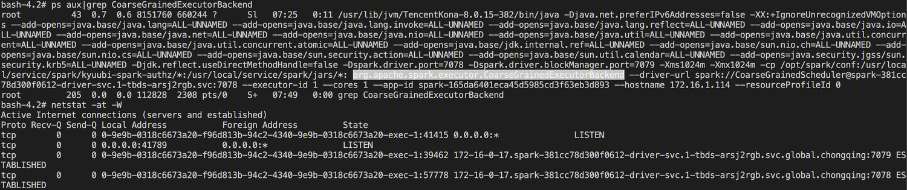


## 2.4 总结

Spark on K8s Cluster 模式提交流程图如下图所示。

1、Client 提交任务后，**在本地启动一个名为 SparkSubmit 的进程，该进程通过 K8s 的 API 来编写 Driver YAML 文件**，然后向 K8s 集群申请创建 Driver Pod，最后通过 K8s Watch 机制监控 Driver Pod 的状态，一直等待作业完成才会退出。
2、K8s 拉起 Driver Pod 后，将执行 Driver 容器的 ENTRYPOINT 入口点，**它以 Client 模式在 Driver 容器中再次启动一个名为 SparkSubmit 进程**。
3、**SparkSubmit 进程将从用户提交的作业类名的 main 方法开始执行**，依次完成：创建Spark 执行环境、初始化心跳接收器、创建TaskScheduler（负责Task级的调度）、创建DAGScheduler（负责Stage级的调度）、启动 TaskScheduler（**通过 K8s 的 API 来编写 Executor YAML 文件，然后向 K8s 集群申请创建 Executor Pod**）等。
4、K8s 拉起 Executor Pod 后，将执行 Executor 容器的 ENTRYPOINT 入口点，**它在 Executor 容器中启动一个名为 CoarseGrainedExecutorBackend 进程**。
5、CoarseGrainedExecutorBackend 进程通过 RPC 协议向 Driver 注册 Executor，一旦收到 Driver 注册成功的消息，就向自己发送一条消息，生成 Executor 计算对象。
6、之后 Driver 与 Executor 通过 inbox、outbox 进行收发消息，执行任务。

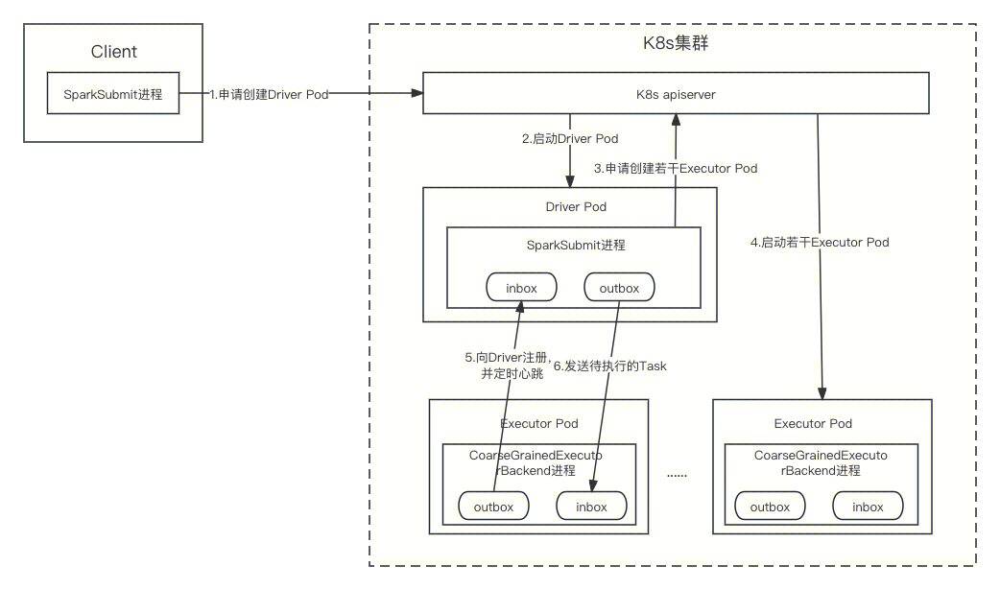


# 3. Spark History Server

## 3.1 SHS 启动流程

1. 命令行提交：start-history-server.sh 脚本用于启动 Spark History Server（简称 SHS），其调用过程与 spark-submit 类似。前面已经介绍过，spark-class 会调用 org.apache.spark.launcher.Main 工具类，将参数进行解析后，执行返回的命令。因此，整个调用过程是，start-history-server.sh 调用 spark-daemon.sh，spark-daemon.sh 再调用 spark-class 脚本，设置进程优先级，并在后台启动 Java 进程。最后执行的命令类似：`java -cp ${class_path} org.apache.spark.deploy.history.HistoryServer ${args}`。

2. 从 HistoryServer 类的 main() 方法开始，该类通过反射生成 FsHistoryProvider 类实例，之后由 FsHistoryProvider **启动两个定时任务，即日志文件解析任务和日志文件清理任务，两个任务均是由独立线程执行**。

   注意，日志文件解析任务由一个固定大小的线程池调度，它将事件日志（Event Log）每一行的 JSON 反序列化，生成对应的事件（Event），这些事件最终会被发布到所有向 ReplayListenerBus 注册过的监听器（Listener）中，由监听器处理其关心的事件。比如，这里 AppListingListener 监听器关心的事件就包括：应用启动（onApplicationStart）、应用结束（onApplicationEnd）、环境属性更新（onEnvironmentUpdate）等。以应用启动为例，首先 AppListingListener 会更新 application、attempt 的字段，之后 SHS 会通知其对应的 UI 无效，并将 application 信息和日志信息写入 listing，默认情况下，listing 直接在内存中维护，存储了所有应该出现在 SHS 的应用信息。

   ```scala
   HistoryServer
     main()
     	classOf[FsHistoryProvider]
     	provider = Utils.classForName[ApplicationHistoryProvider]().getConstructor().newInstance()
   			// 属性listing类型是KVStore，里面存储的是所有应该出现在SHS的application info，即ApplicationInfoWrapper。
   			// 若定义了spark.history.store.path，则使用LevelDB作为KVStore、HistoryServerDiskManager作为磁盘管理器。
   			// 否则，将使用InMemoryStore作为KVStore、HistoryServerMemoryManager作为内存管理器。
   			val listing: KVStore
     	server = new HistoryServer
   			// 缓存的application，最大缓存个数由spark.history.ui.maxApplications参数指定
   			appCache = new ApplicationCache()
   				// 底层使用guava的LoadingCache实现
   				val appCache: LoadingCache
   			// 初始化SHS
   			initialize()
   				ApiRootResource.getServletHandler(this)
   					// jersey自动解析org.apache.spark.status.api.v1包下面的类，用于处理/api请求
   					jerseyContext.setContextPath("/api")
   					holder.setInitParameter(ServerProperties.PROVIDER_PACKAGES, "org.apache.spark.status.api.v1")
   				attachHandler()
   					serverInfo.foreach(_.addHandler(handler, securityManager))
   						// 往ContextHandlerCollection中加入ServletContextHandler，用来处理restful api
   						val gzipHandler = new GzipHandler()
   						gzipHandler.setHandler(handler)
   						rootHandler.addHandler(gzipHandler)
     	server.bind()
   			super.bind()
   				// 启动Jetty服务器
   				server = startJettyServer()
   				// ServerInfo类包含某个属性类型ContextHandlerCollection，持有一系列Handler对象，同时能起到路由器的作用
   				serverInfo = Some(server)
     	// 实际调用的是FsHistoryProvider类
     	provider.start()
     		initThread = initialize()
     			// 启动两个定时任务，即日志文件解析任务和日志文件清理任务，两个任务均是由独立线程执行
     			startPolling()
     				pool.scheduleWithFixedDelay(getRunner(() => checkForLogs()), ...)
     				pool.scheduleWithFixedDelay(getRunner(() => cleanLogs()), ...)
   ```
   
   ```scala
   FsHistoryProvider
   	checkForLogs()
   		// 列出spark.history.fs.logDirectory参数指定目录下的文件/目录状态
   		fs.listStatus(new Path(logDir))
   		submitLogProcessTask()
   			// replayExecutor是固定大小的线程池，线程数由spark.history.fs.numReplayThreads参数指定
   			replayExecutor.submit(task)
   				mergeApplicationListing()
   					doMergeApplicationListing()
   						// 一个用于从序列化事件数据中重放事件的SparkListenerBus
   						bus = new ReplayListenerBus()
   						// 监听器，监听的事件包括：onApplicationStart、onApplicationEnd、onEnvironmentUpdate等
   						// 继承自SparkListener，该类对所有回调方法都有空操作的实现，子类只需处理其关心的事件
   						listener = new AppListingListener()
   						bus.addListener(listener)
   						parseAppEventLogs()
   							// 打开一个事件日志文件并返回包含事件数据的输入流
   							EventLogFileReader.openEventLog(file.getPath, fs)
   							Utils.tryWithResource()
   								// 按照给定流中维护的顺序重放每个事件，该流每行包含一个JSON编码的SparkListenerEvent
   								replayBus.replay()
   									replay()
   										// 将事件发布给所有已注册的监听器
   										postToAll(JsonProtocol.sparkEventFromJson(parse(currentLine)))
   											// 实际调用SparkListenerBus类，将事件发布给指定的监听器，监听器负责处理
   											doPostEvent(listener, event)
   						// 使给定application attempt的现有UI无效
   						invalidateUI()
   						// 将application的信息写入给定的存储，默认内存
   						addListing(app)
   							listing.write(newAppInfo)
   						// 同时存储事件日志的信息，跟踪有效和无效的日志，以便清理无效日志（没有application id的日志）
   						listing.write(LogInfo())
   ```
   
   ```scala
   FsHistoryProvider
   	cleanLogs()
   		// MAX_LOG_AGE_S值由spark.history.fs.cleaner.maxAge参数指定
   		maxTime = clock.getTimeMillis() - conf.get(MAX_LOG_AGE_S) * 1000
   		listing.view(classOf[ApplicationInfoWrapper])
   		deleteAttemptLogs()
   			// 删除attempt对应的日志信息
   			listing.delete(classOf[LogInfo], logPath.toString())
   			// 删除attempt对应的HDFS日志文件
   			deleteLog(fs, logPath)
   				fs.delete()
   			// 若所有attempt都过期，删除application信息
   			listing.delete(app.getClass(), app.id)
   ```


## 3.2 SHS Rest API

SHS 是基于内嵌的 jetty 来构建 HTTP 服务的，代码详见上一节。这里简单介绍一下 jetty 的架构，jetty 架构的核心是 Handler。一个请求过来时，会解析然后被封装成 Request，之后会交给 Server 对象中的 Handler 处理。Server 的 Handler 可以是各种类型的 Handler，因为 SHS 里面注入的是 ContextHandlerCollection，这里只介绍 ContextHandlerCollection。这个类也是 Handler 的一个实现类，可以理解为是 Handler 的集合，**持有一系列 Handler 对象，同时还能起到路由器的作用**。ContextHandlerCollection 基于 ArrayTernaryTrie 构造了一个字典树，用于快速匹配路径。当收到一个请求时，ContextHandlerCollection 根据 URL 找到对应的 Handler，然后把请求交给这个 Handler 去处理。Handler 里面封装了各种我们自己实现的 Servlet，最终请求就落到了具体的那个 Servlet 上执行了。

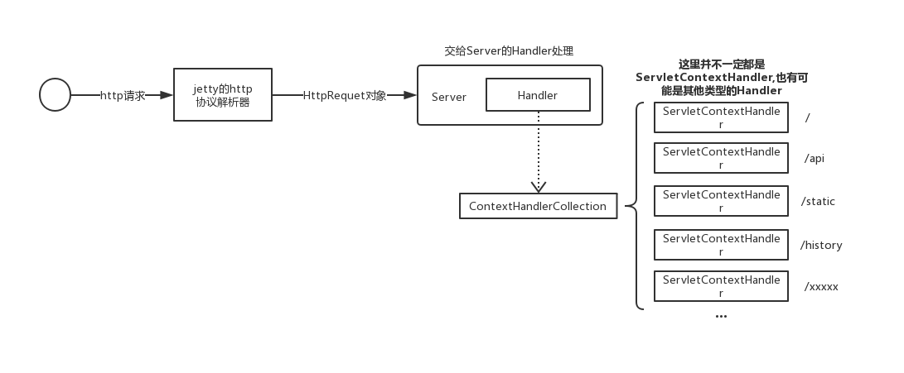

SHS 在启动时，会往 ContextHandlerCollection 中加入一个 ServletContextHandler，这里放着 jersey 的 ServletContainer 类，用来提供 restful api。**jersey 会自动解析 org.apache.spark.status.api.v1 包下面的类，然后将对应的请求转发过去**。SHS 启动时还会注册其它 Handler，这里不多做介绍。

**任务的 applications 信息是长期驻留在内存并不断更新的**。当我们在页面点击查看某个任务的运行详情时，SHS 就会重新去解析对应 EventLog 日志文件，这时就是解析整个 EventLog 文件了，然后将构建好的详情信息保存到缓存中。它的缓存使用了 guava 的 LoadingCache，在将任务信息放入缓存的同时，SHS 还会提前构建好这个任务的各种状态的 SparkUI（也就是 web 界面)，并创建好 ServletContextHandler，然后放到 ContextHandlerCollection 中去。


# 参考

1. [spark-submit 提交脚本](https://www.cnblogs.com/qingyunzong/p/8978661.html)、[spark 启动脚本](https://www.cnblogs.com/qingyunzong/p/8973892.html)
2. [Spark性能优化指南——基础篇](https://tech.meituan.com/2016/04/29/spark-tuning-basic.html)、[Spark性能优化指南——高级篇](https://tech.meituan.com/2016/05/12/spark-tuning-pro.html)
3. [视频：Spark源码与内核分析](https://www.bilibili.com/video/BV1ot4y1t7ML?p=1&vd_source=03ee00a529e3c4f9c2d8c6f412586123)
4. [Running Spark on Kubernetes 官网](https://spark.apache.org/docs/3.4.2/running-on-kubernetes.html)
5. [Spark on Kubernetes 作业执行流程](https://fanyilun.me/2021/08/22/Spark on Kubernetes作业执行流程/)
6. [Spark Kubernetes 的源码分析系列 - features](https://cloud.tencent.com/developer/article/1674888)
7. [Spark History Server和Event Log详解](https://blog.csdn.net/littlePYR/article/details/104621255)
8. [Spark History Server 架构原理介绍](https://blog.csdn.net/u013332124/article/details/88350345)


