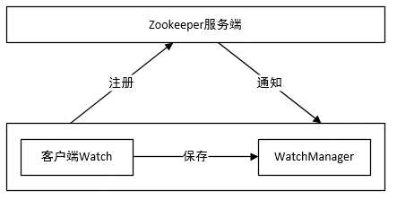
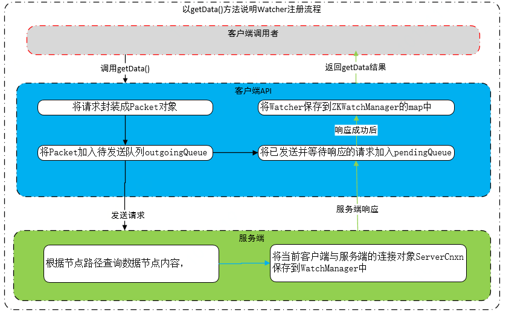
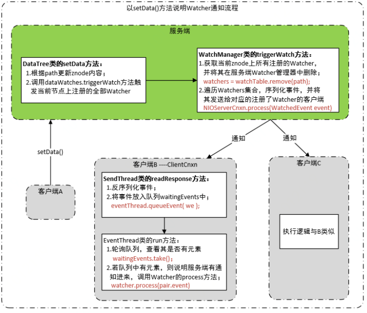
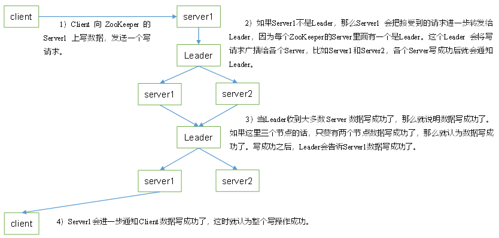
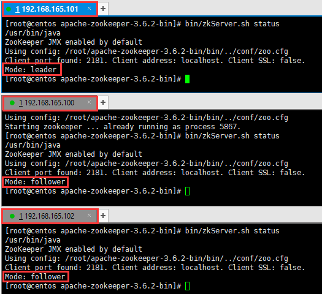
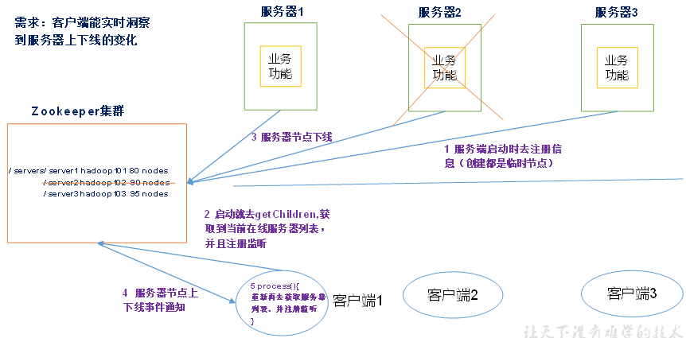
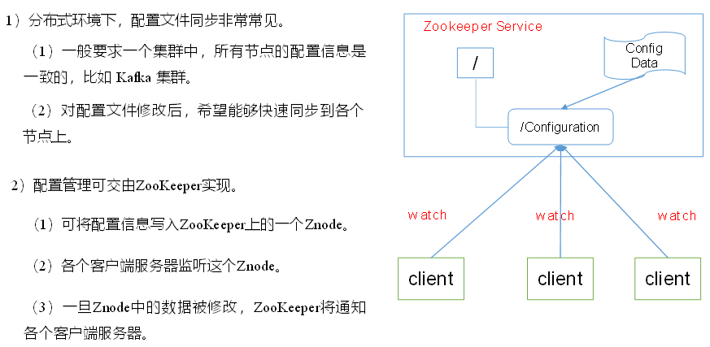
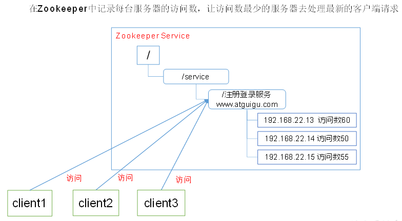
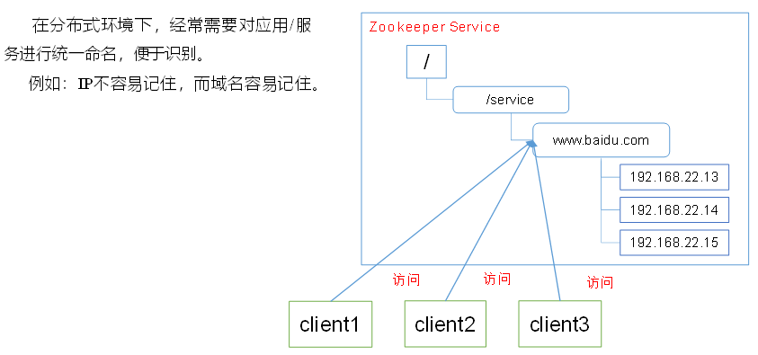
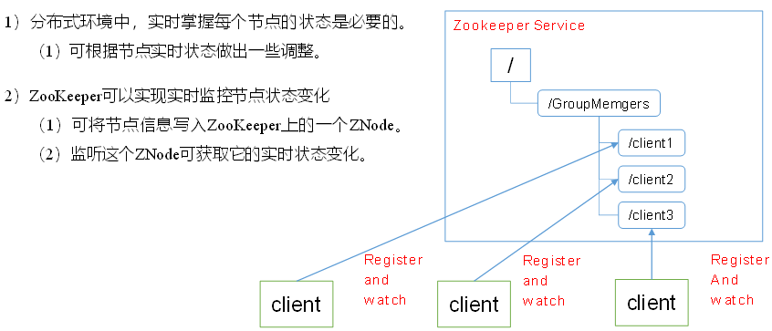

# 1. 分布式架构

## 1.1 分布式的问题

1. **通信异常**：分布式系统各个节点之间进行网络通信，因此会存在消息丢失或消息延迟的现象
2. **网络分区**：**俗称脑裂**，当网络发生异常，导致只有部分节点之间能够进行正常通信，而另一些节点则不能。当网络分区发生时，分布式系统会出现局部小集群
3. **三态**：即成功、失败和超时，传统的单机系统中只有成功或失败两种响应
4. **节点故障**：组成分布式系统的服务器节点出现的宕机或僵死现象


## 1.2 CAP 与 BASE

1. **CAP 理论：当网络分区发生时，一致性和可用性两难全**
   * **一致性（Consistency）**：指数据在多个副本之间保持一致
   * **可用性（Availability）**：系统提供的服务必须一直处于可用的状态，能够在有限的时间返回请求结果
   * **分区容错性（Partition tolerance）**：网络分区发生时，分布式系统仍能对外提供一致性和可用性服务，除非整个网络环境发生了故障
2. **BASE 理论：BASE 是对 CAP 中一致性和可用性权衡的结果，核心思想是即使无法做到强一致性，但可以采取适当方式来达到最终一致性**
   * **基本可用（Basically Available）**：指分布式系统在出现不可预知故障时，允许损失部分可用性（如响应时间增大或服务降级），但绝不等价于系统不可用
   * **软状态（Soft state）**：指允许系统中的数据存在中间状态，并认为该中间状态的存在不会影响系统的整体可用性，即允许系统在不同节点的数据副本之间进行数据同步的过程存在延时
   * **最终一致性（Eventually consistent）**：系统中所有的数据副本，在经过一段时间的同步后，最终能够达到一个一致的状态，而不需要实时保证数据的强一致性


# 2. 一致性协议

## 2.1 2PC 与 3PC

在分布式系统中，每个机器节点都知道自己在进行事务操作过程中的结果（成功/失败），但却无法直接获取到其它分布式节点的操作结果。因此，在分布式系统中，为了保证事务的 ACID 特性，引入**“协调者”**组件来统一调度所有分布式节点的执行逻辑，这些被调度的分布式节点被称为**“参与者”**。**协调者负责调度参与者的行为，并最终决定这些参与者是否要把事务真正进行提交**。

### 2.1.1 2PC

**2PC 即二阶段提交（Two-Phase Commit）**，用来保证分布式系统数据的一致性，其核心是**对每个事务都采用先尝试后提交的处理方式**，因此它是强一致性的。目前，绝大多数关系型数据库都采用该协议来完成分布式事务处理。

**阶段一：投票阶段**

1. 事务询问：协调者向所有参与者发送事务内容，询问是否可以执行事务提交操作，并开始等待各参与者的响应
2. 执行事务：各参与者节点执行事务操作，并将 Undo 和 Redo 信息记入事务日志中
3. 反馈响应：如果参与者成功执行了事务操作，那么就反馈给协调者 Yes 响应，表示事务可以执行；反之反馈给协调者 No 响应，表示事务不可执行

**阶段二：执行阶段**

协调者会根据各参与者的反馈情况来决定最终是否可以进行事务提交操作，包含以下两种可能：

* **执行事务提交**：协调者从所有参与者获得的反馈都是 Yes 响应
  1. 发送提交请求：协调者向所有参与者节点发出 Commit 请求
  2. 事务提交：参与者接收到 Commit 请求后，正式执行事务提交操作，并在完成提交后释放占用的资源
  3. 反馈事务提交结果：参与者在完成事务提交后，向协调者发送 Ack 消息
  4. 完成事务：协调者接收到所有参与者反馈的 Ack 消息后，完成事务

* **中断事务**：任何一个参与者向协调者反馈了 No 响应，或**在等待超时后，协调者无法接收到所有参与者的反馈**
  1. 发送回滚请求：协调者向所有参与者节点发出 Rollback 请求
  2. 事务回滚：参与者接收到 Rollback 请求后，利用其在阶段一中记录的 Undo 信息来执行事务回滚操作，并在完成回滚之后释放占用的资源
  3. 反馈事务回滚结果：参与者在完成事务回滚后，向协调者发送 Ack 消息
  4. 中断事务：协调者接收到所有参与者反馈的 Ack 消息后，完成事务中断

> **优点**：原理简单，实现方便
>
> **缺点**：**同步阻塞**（各个参与者在等待其它参与者响应的过程中，无法进行其它操作）、**单点故障**（协调者出现问题）、**数据不一致**（阶段二由于网络异常，导致只有部分参与者接收到了 Commit 请求）、**太过保守**（没有容错机制，任意一个节点的失败都会导致整个事务的失败）


### 2.1.2 3PC

**3PC 即三阶段提交（Three-Phase Commit）**，是 2PC 的改进版，将 2PC 的“投票阶段”一分为二，形成了 CanCommit、PreCommit、doCommit 三个阶段组成的事务处理协议

**阶段一：CanCommit**

1. 事务询问：协调者向所有参与者发送 CanCommit 请求，询问是否可以执行事务提交操作，并开始等待各参与者的响应
2. 反馈响应：参与者在接收到 CanCommit 请求后，正常情况下，如果自身认为可以顺利执行事务，那么会反馈 Yes 响应，并进入预备状态，否则反馈 No 响应

**阶段二：PreCommit**

协调者会根据各参与者的反馈情况来决定最终是否可以进行事务的 PreCommit 操作，包含以下两种可能：

* **执行事务预提交**：协调者从所有参与者获得的反馈都是 Yes 响应
  1. 发送预提交请求：协调者向所有参与者节点发出 preCommit 的请求，并进入 Prepared 阶段
  2. 事务预提交：参与者接收到 preCommit 请求后，执行事务操作，并将 undo 和 Redo 信息记录到事务日志中
  3. 反馈响应：如果参与者成功执行了事务操作，那么就会反馈给协调者 Ack 响应，同时等待最终的指令：提交或中止
* **中断事务**：任何一个参与者向协调者反馈了 No 响应，或**在等待超时后，协调者无法接收到所有参与者的反馈**
  1. 发送中断请求：协调者向所有参与者节点发出 abort 请求
  2. 中断事务：无论是收到来自协调者的 abort 请求，**或是在等待协调者请求过程中出现超时，参与者都会中断事务**

**阶段三：doCommit**

与 2PC 的阶段二类似，进行真正的事务提交，包含以下两种可能：执行事务提交、中断事务。需要注意的是，如果**该阶段协调者出现问题，或协调者与参与者之间网络出现故障**，则会导致参与者无法及时接收到来自协调者的 doCommit 或 abort 请求，此时**参与者都会在等待超时后，继续进行事务提交**

> **优点**：相较于 2PC，3PC **降低了参与者的阻塞范围，并能够在出现单点故障后继续达成一致**
>
> **缺点**：参与者接收到 preCommit 消息后，如果网络出现分区，此时协调者无法与参与者通信，在这种情况下，该参与者仍然会进行事务的提交，造成**数据不一致**


## 2.2 Paxos 算法


## 2.3 ZAB协议

ZAB 全称 ZooKeeper Atomic Broadcast（**原子消息广播协议**），它是一种通用的分布式一致性算法，其核心是：所有事务请求必须由一个全局唯一的 Leader 服务器来协调处理，Leader 负责将一个客户端事务转换成一个事务 Proposal（提议），并将该 Proposal 分发给集群中所有的 Follower，之后 Leader 需要等待所有 Follower 的反馈，一旦超过半数的 Follower 进行了正确的反馈后，那么 Leader 就会再次向所有的 Follower 分发 Commit 消息，要求其将前一个 Proposal 进行提交。


# 3. ZooKeeper 入门

## 3.1 ZK 介绍

ZK 是一个开放源码的分布式协调服务，由雅虎公司创建，是 Google Chubby 的开源实现，是 Hadoop 和 Hbase 的重要组件。ZK 可以保证如下分布式一致性特性：

1. **顺序一致性**：同一个客户端发起的事务请求，会严格地按照其发起顺序被应用到 ZK 中去
2. **原子性**：整个集群所有机器要么都成功应用了某一个事务，要么都没有应用
3. **单一视图**：无论客户端连接哪个 ZK 服务器，其看到的服务端数据模型都是一致的
4. **可靠性**：一旦服务端成功应用了一个事务，并完成对客户端的响应，那么该事务所引起的服务端状态变更将会被一致保留下来
5. **实时性**：ZK 仅保证在一定的时间段内，客户端能够从服务端上读取最新的数据

ZK 致力于提供一个高性能、高可用，且具有严格的顺序访问控制能力（主要是写操作的严格顺序性）的分布式协调服务，它有 4 个设计目标：

1. **简单的数据模型**：通过一个共享的、数型结构的名字空间（ZNode 数据节点，类似文件系统）进行相互协调
2. **可以构建集群**：ZK 集群通常由一组机器组成，只要集群中存在**超过一半**的机器能够正常工作，那么整个集群就能够正常对外提供服务
3. **顺序访问**：对于来自客户端的每个更新请求，ZK 都会分配一个全局唯一的递增编号，反映事务操作的先后顺序
4. **高性能**：ZK 将全量数据存储在内存中，并直接服务于客户端的所有非事务请求，使用于以读为主的应用场景


## 3.2 ZK 原理

1. **集群角色**：ZK 没有沿用传统的 Master/Slave 概念，而是引入了 Leader、Follower 和 Observer 三种角色。集群中所有机器通过 Leader 选举过程选定 Leader，**Leader 服务器为客户端提供读和写服务；Follower 和 Observer 都能提供读服务，唯一的区别在于，Observer 不参与 Leader 选举过程，也不参与写操作的“过半写成功”策略，因此 Observer 可以在不影响写性能的情况下提升集群的读性能**。

   * **Leader 主要工作**：事务请求的唯一调度和处理者，保证集群事务处理的顺序性；集群内部各服务器的调度者（事务是指能够改变 ZK 服务器状态的操作，一般包括数据节点创建与删除、数据节点内容更新、客户端会话创建与失效等操作）
   * **Follower 主要工作**：处理客户端非事务请求，转发事务请求给 Leader 服务器；参与事务请求 Proposal 的投票；参与 Leader 选举投票
   * **Observer 主要工作**：不参与任务形式的投票，只提供非事务服务，通常用于在不影响集群事务处理能力的前提下，提升集群的非事务处理能力

2. **会话**：客户端启动会与服务器建立一个 **TCP 长连接**，并通过心跳检测与服务器保持有效的会话。会话的 sessionTimeout 值用来设置一个客户端会话的超时时间，当服务器压力太大、网络故障**或客户端主动断开连接**等原因，导致客户端连接断开时，只要在 sessionTimeout 规定时间内能够重新连接上 ZK 集群，那么之前创建的会话仍然有效。

3. **数据节点**：ZNode 节点类型可以分为**持久节点（Persistent）、临时节点（Ephemeral）、顺序节点（Sequential）**三大类，可以生成四种组合型节点类型
   * **持久节点**：该数据节点被创建后，就会一直存在于 ZK 服务器上，除非主动清除该节点
   * **持久顺序节点**：在持久节点的基础上，添加了顺序的特性，每个父节点都会为它的第一级子节点维护一份顺序，用于记录子节点的创建顺序。在创建节点中，ZK 会自动为给定节点名加上一个数字后缀
   * **临时节点**：如果客户端会话失效，那么这个节点就会被移除，临时节点只能作为叶子节点
   * **临时顺序节点**：在临时节点的基础上，添加了顺序的特性

4. **版本**：对于每个 ZNode，ZK 都会为其维护一个叫作 **Stat 数据结构**，Stat 记录了这个 ZNode 的三个数据版本，分别是 version（当前 ZNode 版本）、cversion（当前 ZNode 子节点的版本）、aversion（当前ZNode 的 ACL 版本）。一个乐观锁控制的事务分为三个阶段：数据读取、写入校验、数据写入，其中写入校验是整个乐观锁控制的关键，而 version 属性就是用来实现写入校验的。

   | 状态属性       | 说明                                                         |
   | -------------- | ------------------------------------------------------------ |
   | czxid          | 节点被创建时的事务 ID，即时间戳                              |
   | mzxid          | 节点最后一次被更新时的事务 ID                                |
   | ctime          | 节点被创建的时间（从 1970 年开始的毫秒数）                   |
   | mtime          | 节点最后一次被更新的时间                                     |
   | pzxid          | 节点的子节点列表最后一次被修改时的事务 ID，注意，只有子节点列表变更了才会变更 pzxid，子节点内容变更不会影响 |
   | version        | 节点数据内容的版本号，即修改次数                             |
   | cversion       | 节点的子节点的版本号                                         |
   | aversion       | 节点的 ACL 版本号                                            |
   | ephemeralOwner | 创建该临时节点的会话的 sessionID，如果是持久节点，值为 0     |
   | dataLength     | 数据内容的长度                                               |
   | numChildren    | 当前节点的子节点个数                                         |

5. **Watcher**：ZK 允许用户在指定节点上注册一些 Watcher，并且在特定事件触发时，ZK 会将事件通知到感兴趣的客户端上去。Watcher 具有如下特性：

   * **一次性**：**Watcher 是一次性的，一旦被触发就会移除，再次使用时需要重新注册**。这样可以**有效减轻服务端的压力**，如果 Watcher 一直有效，那么针对更新频繁的节点，服务端会不断向客户端发送通知
   * **客户端顺序回调**：**Watcher 回调是顺序串行化执行的**，只有回调后客户端才能看到最新的数据状态。一个 Watcher 回调逻辑不应该太多，以免影响别的 watcher 执行
   * **轻量级**：WatchEvent 是最小的通信单元，结构上只包含通知状态、事件类型和节点路径，**并不会告诉数据节点变化前后的具体内容**，而是需要客户端主动重新取获取新数据
   * **时效性**：Watcher 只有在当前 session 彻底失效时才会无效，若在 session 有效期内快速重连成功，则 watcher 依然存在，仍可接收到通知

6. **ACL**：ZK 采用 ACL 策略进行权限控制，定义了如下 5 种权限，注意 CREATE 和 DELETE 针对的是子节点

   * **CREATE**：创建**子节点**的权限
   * **READ**：获取节点数据和子节点列表的权限
   * **WRITE**：更新节点数据的权限
   * **DELETE**：删除**子节点**的权限
   * **ADMIN**：设置节点 ACL 的权限


## 3.3 Leader 选举

### 3.3.1 启动时期

以 3 台机器组成的服务器集群为例，分别是 Server1、Server2、Server3，myid 分别是 1、2、3。当第一台服务器其中时，它是无法完成 Leader 选举的。当第二台机器也启动后，此时这两台机器已经能相互通信，于是进入 Leader 选举流程。

1. **每个Server 发出一个投票**：初始情况，Server1 和 Server2 都会将自己作为 Leader 服务器进行投票，**投票的基本的元素包括：所推举的服务器 myid 和 ZXID**，我们以（myid, ZXID）形式来表示。即 Server1 的投票为（1, 0），Server2 的投票为（2, 0），然后各自将投票发给集群中其它所有机器。

2. **接收来自各个服务器的投票**：集群中每个服务器在接收到投票后，首先会**判断该投票的有效性**，包括检查是否是本轮投票，是否来自 LOOKING 状态的服务器。

   > 服务器具有四种状态，分别是 LOOKING、FOLLOWING、LEADING、OBSERVING。
   >
   > * **LOOKING**：寻找 Leader 状态，当服务器处于该状态时，它会认为当前集群中没有 Leader，因此需要进入 Leader 选举状态。
   > * **FOLLOWING**：跟随者状态，表明当前服务器角色是 Follower。
   > * **LEADING**：领导者状态，表明当前服务器角色是 Leader。
   > * **OBSERVING**：观察者状态，表明当前服务器角色是 Observer。

3. **处理投票**：针对每个投票，服务器需要将别人的投票和自己的投票进行 PK，规则如下：

   * **优先检查 ZXID，ZXID 比较大的服务器优先作为 Leader；**
   * **如果 ZXID 相同，那么就比较 myid，myid 比较大的服务器作为 Leader。**

   对于 Server1 来说，自己的投票（1, 0），而接收到的投票为（2, 0），于是就会更新自己的投票为（2, 0），然后重新将投票发出去；而对于 Server2，不需要更新自己的投票信息，只是再一次发出上一次投票信息。

4. **统计投票**：每次投票后，服务器都会统计所有投票，**判断是否已经有过半的机器接收到相同的投票信息**。因此，当 Server1 和 Server2 都收到相同的投票信息（2, 0），即认为已经选出了 Leader。那么后来的 Server3  即使 myid 比较大，也只能作为 Follower。

5. **改变服务器状态**：一旦确定了 Leader，每个服务器就会更新自己的状态，如果是 Follower，则变更为 FOLLOWING，如果是 Leader，则变更为 LEADERING。


### 3.3.2 运行期间

一旦选出了 Leader，那么所有服务器的集群角色一般不会再发生变化，也就是说，**Leader 服务器将一直作为集群的 Leader，即使集群中有非 Leader 机器挂了，或是有新机器加入集群也不会影响 Leader**。但是一旦 Leader 服务器挂了，那么整个**集群将暂停对外服务**，进入新一轮 Leader 选举，其过程和启动时期的 Leader 选举过程基本一致。假设正在运行的有 Server1、Server2、Server3 三台服务器，当前 Leader 是 Server2，若某一时刻 Leader 挂了，此时便开始 Leader 选举。

1. **变更状态**：Leader 挂了后，余下的非 Observer 服务器都会将自己的服务器状态变更为 LOOKING，然后开始进入 Leader 选举过程。
2. **每个 Server 发出一个投票**：在运行期间，每个服务器上的 ZXID 可能不同，此时假定 Server1 的 ZXID 为123，Server3 的 ZXID 为 122；在第一轮投票中，Server1 和 Server3 都会投自己，产生投票（1, 123）、（3, 122），然后各自将投票发送给集群中所有机器。
3. **接收来自各个服务器的投票**
4. **处理投票**：投票处理规则与启动期间一致，因此，Server1 将会成为 Leader。
5. **统计投票**
6. **改变服务器的状态**


## 3.4 监听器原理

ZK 采用了 Watcher 机制实现数据的发布/订阅功能，该机制在被订阅对象发生变化时会异步通知客户端，因此客户端不必在 Watcher 注册后轮询阻塞，从而减轻了客户端压力。

Watcher 机制主要包括：**客户端线程、客户端 WactchManager 和服务器**三部分。客户端在向 ZK 服务器注册 Watcher 的同时，会将 Watcher 对象存储在客户端的 WactchManager 中。当 ZK 服务器触发 Watcher 时间后，会向客户端发送通知，客户端线程从 WactchManager 中取出对应的 Watcher 对象来执行回调逻辑。



Watcher是一个接口，任何实现了 Watcher 接口的类就是一个新的 Watcher。Watcher 内部包含了两个枚举类：KeeperState、EventType。KeeperState 是客户端与服务端连接状态发生变化时对应的通知类型。EventType 是数据节点 znode 发生变化时对应的通知类型。**EventType 变化时 KeeperState 永远处于 SyncConnected 通知状态下；当 KeeperState 发生变化时，EventType 永远为 None**。

| KeeperState      | EventType               | 触发条件                                  | 说明                           |
| ---------------- | ----------------------- | ----------------------------------------- | ------------------------------ |
| SyncConnected(3) | None (-1)               |                                           | 客户端和服务器处于连接状态     |
|                  | NodeCreated (1)         | Watcher监听的数据节点被创建               |                                |
|                  | NodeDeleted (2)         | Watcher监听的数据节点被删除               |                                |
|                  | NodeDataChanged (3)     | Watcher监听的数据节点内容发生变更         |                                |
|                  | NodeChildrenChanged (4) | Watcher监听的数据节点的子节点列表发生变更 |                                |
| Disconnected(0)  | None (-1)               |                                           | 客户端和服务器处于断开连接状态 |
| Expired(-112)    | None (-1)               |                                           | 客户端会话失效                 |
| AuthFailed(4)    | None (-1)               |                                           | 身份认证失败                   |

* 客户端 Watcher管理器：ZKWatchManager 数据结构

```java
// ZKWatchManager维护了三个map，key代表数据节点的绝对路径，value代表注册在当前节点上的watcher集合

// 代表节点上内容数据、状态信息变更相关监听
private final Map<String, Set<Watcher>> dataWatches = 
    new HashMap<String, Set<Watcher>>();

// 代表节点变更相关监听
private final Map<String, Set<Watcher>> existWatches = 
    new HashMap<String, Set<Watcher>>();

// 代表节点子列表变更相关监听
private final Map<String, Set<Watcher>> childWatches = 
    new HashMap<String, Set<Watcher>>();
```

* 服务端 Watcher 管理器：WatchManager 数据结构

```java
// WatchManager维护了两个map，WatchManager中的Watcher对象不是客户端用户定义的Watcher，而是服务端中实现了Watcher接口的ServerCnxn抽象类，该抽象类代表了一个客户端与服务端的连接

// 从数据节点路径的粒度来托管Watcher：key代表数据节点路径，value代表客户端连接的集合
// 该map作用为：通过一个指定znode路径可找到其映射的所有客户端，当znode发生变更时，可快速通知所有注册了当前Watcher的客户端
private final HashMap<String, HashSet<Watcher>> watchTable =
    new HashMap<String, HashSet<Watcher>>();

// 从Watcher的粒度来控制事件触发需要触发的数据节点：key代表一个客户端与服务端的连接，value代表当前客户端监听的所有数据节点路径
// 该map作用为：当一个连接彻底断开时，可快速找到当前连接对应的所有注册了监听的节点，以便移除当前客户端对节点的Watcher
private final HashMap<Watcher, HashSet<String>> watch2Paths =
    new HashMap<Watcher, HashSet<String>>();
```

* Packet对象构造函数

```java
// 参数含义：请求头、响应头、请求体、响应体、Watcher封装的注册体、是否允许只读
Packet(RequestHeader requestHeader, ReplyHeader replyHeader,
       Record request, Record response,
       WatchRegistration watchRegistration, boolean readOnly) {
    this.requestHeader = requestHeader;
    this.replyHeader = replyHeader;
    this.request = request;
    this.response = response;
    this.readOnly = readOnly;
    this.watchRegistration = watchRegistration;
}
```

**客户端注册 Watcher**：客户端发送的请求中**只包含是否需要注册 Watcher，不会将 Watcher 实体发送**，这样服务器不会出现内存紧张或其它性能问题。Packet 构造函数中的参数 WatchRegistration 是 Watcher 的封装体，用于服务响应成功后将 Watcher 保存到 ZKWatchManager 中。



**服务器处理 Watcher**：首先将通知状态、事件类型和节点路径封装成一个 WatchedEvent 对象，然后根据数据节点的节点路径从 watchTable 中取出对应的 Watcher，如果找到，则将其提取出来，同时会直接从 watchTable 和 watch2Paths 中将其删除（即一次性） ，最后调用 process 方法触发 Watcher。




## 3.5 写数据流程




# 4. ZooKeeper 使用

## 4.1 部署与运行

假设使用三台机器搭建一个 ZK 集群，IP 地址分别为 192.168.165.100、192.168.165.101、192.168.165.102。

1. 由于 ZK 使用 Java 语言编写，因此运行需要 Java 环境支持，首先准备好 Java 运行环境。

   ```bash
   yum install -y java-1.8.0-openjdk-devel.x86\_64
   java -version
   ```

2. 下载 ZK 安装包，解压得到一个目录，约定为 `$ZK_HOME`

   ```bash
   wget https://archive.apache.org/dist/zookeeper/zookeeper-3.6.2/apache-zookeeper-3.6.2-bin.tar.gz
   tar -xzvf apache-zookeeper-3.6.2-bin.tar.gz
   ```

3. 配置 zoo.cfg，将 $ZK_HOME/conf 目录下的 zoo_sample.cfg 重命名为 zoo.cfg（集群中所有机器的 zoo.cfg 文件内容应该是一致的，因此最好使用 git 进行管理）

   ```bash
   tickTime=2000
   initLimit=10
   syncLimit=5
   # zk数据目录
   dataDir=/var/lib/zookeeper/
   # zk默认端口号
   clientPort=2181
   # server.id=host:port1:port2，其中id用来标识集群中机器的序号，范围是1-255；host是服务器的ip地址；port1是服务器与leader交换信息的端口；port2是进行leader选举的通信端口
   server.1=192.168.165.100:2888:3888
   server.2=192.168.165.101:2888:3888
   server.3=192.168.165.102:2888:3888
   ```

4. 创建 myid 文件，**在 dataDir 所配置的目录下**，创建一个名为 myid 的文件，在该文件的第一行写上一个数字，**与 zoo.cfg 中当前机器的编号对应上**

5. 按照相同的步骤，为其它机器都配置上 zoo.cfg 和 myid 文件

6. 分别启动服务器，.sh 和 .cmd，分别适用于 Linux 系统和 Windows 系统，注意关闭防火墙

   ```bash
   bin/zkServer.sh start
   bin/zkServer.sh status
   bin/zkServer.sh stop
   ```




## 4.2 客户端命令行

使用 `bin/zkCli.sh -server ip:port` 命令连接指定的 zk 服务器，如果不加参数，则默认连接本地的 zk 服务器。

| 命令                             | 说明                                                         |
| -------------------------------- | ------------------------------------------------------------ |
| help                             | 显示所有操作命令                                             |
| create [-s] [-e] path data [acl] | 创建节点，-s和-e分别表示顺序或临时节点                       |
| ls [-w] path                     | 查看指定节点下的第一级的所有子节点                           |
| get [-w] path                    | 获取指定节点的数据内容和属性信息                             |
| set [-v version] path data       | 更新指定节点的数据内容，-version指定更新操作基于ZNode哪个数据版本 |
| delete [ -v version] path        | 删除指定节点（该节点必须没有子节点存在）                     |

```bash
# 192.168.165.101 创建节点、查看节点
[zk: localhost:2181(CONNECTED) 4] create /zkbook 123
Created /zkbook
[zk: localhost:2181(CONNECTED) 5] ls /
[zkbook, zookeeper]
# 192.168.165.100 监听节点值变化
[zk: localhost:2181(CONNECTED) 2] get -w /zkbook 
123
# 192.168.165.101 更新节点
[zk: localhost:2181(CONNECTED) 6] set /zkbook 321
# 192.168.165.100 触发监听事件、删除节点
[zk: localhost:2181(CONNECTED) 3] 
WATCHER::
WatchedEvent state:SyncConnected type:NodeDataChanged path:/zkbook
[zk: localhost:2181(CONNECTED) 3] delete /zkbook
[zk: localhost:2181(CONNECTED) 4] ls /
[zookeeper]
```


## 4.3 API 应用

### 4.3.1 常用 API

```xml
<dependencies>
    <dependency>
        <groupId>junit</groupId>
        <artifactId>junit</artifactId>
        <version>RELEASE</version>
    </dependency>
    <dependency>
        <groupId>org.apache.zookeeper</groupId>
        <artifactId>zookeeper</artifactId>
        <version>3.6.2</version>
    </dependency>
</dependencies>
```

```java
public class ZkTest {
    private final String connectString = "192.168.165.100:2181,192.168.165.101:2181,192.168.165.102:2181";
    private final int sessionTimeout = 2000;
    private ZooKeeper zkClient;

    @Before
    public void init() throws Exception {
        zkClient = new ZooKeeper(connectString, sessionTimeout, new Watcher() {
            @Override
            public void process(WatchedEvent event) {
                // 收到事件通知后的回调函数（用户的业务逻辑）
                System.out.println(event.getType() + "-->" + event.getPath());
                try {
                    // 再次启动监听
                    List<String> children = zkClient.getChildren("/", true);
                } catch (KeeperException | InterruptedException e) {
                    e.printStackTrace();
                }
            }
        });

        // 确保连接已经建立
        while (true) {
            if (ZooKeeper.States.CONNECTING == zkClient.getState()) {
                Thread.sleep(1000);
            } else {
                break;
            }
        }
    }

    // 1.创建节点
    @Test
    public void createNode() throws KeeperException, InterruptedException {
        // 参数分别是：要创建节点的路径、节点数据、节点权限、节点的类型
        String path = zkClient.create("/uestc", "computer".getBytes(),
                ZooDefs.Ids.OPEN_ACL_UNSAFE, CreateMode.PERSISTENT);
        System.out.println("path = " + path);
    }

    // 2.获取子节点
    @Test
    public void getData() throws KeeperException, InterruptedException {
        List<String> children = zkClient.getChildren("/", false);
        for (String child : children) {
            System.out.println("child = " + child);
        }
    }

    // 3.获取子节点，并监控数据的变化
    @Test
    public void getDataAndWatch() throws KeeperException, InterruptedException {
        List<String> children = zkClient.getChildren("/", true);
        for (String child : children) {
            System.out.println("child = " + child);
        }
        // 延时阻塞
        Thread.sleep(Long.MAX_VALUE);
    }

    // 4.判断子节点是否存在
    @Test
    public void exist() throws Exception {
        Stat stat = zkClient.exists("/uestc", false);
        System.out.println(stat == null ? "not exist" : "exist");

        stat = zkClient.exists("/abc", false);
        System.out.println(stat == null ? "not exist" : "exist");
    }
}
```


### 4.3.2 监听服务器动态上下线

某分布式系统中，主节点可以有多台，可以动态上下线，任意一台客户端都能实时感知到主节点服务器的上下线。



```java
// 服务器端向 Zookeeper 注册，需要先在集群上创建/servers节点：create /servers "servers"
public class DistributeServer {
	private static final String connectString = "192.168.165.100:2181,192.168.165.101:2181,192.168.165.102:2181";
    private static final String connectString = "127.0.0.1:2181";
    private static int sessionTimeout = 2000;
    private ZooKeeper zk;
    private String parentNode = "/servers";

    // 创建到zk的客户端连接
    public void getConnect() throws IOException {
        zk = new ZooKeeper(connectString, sessionTimeout, new Watcher() {
            @Override
            public void process(WatchedEvent event) {
            }
        });
        // 确保连接已经建立
        while (true) {
            if (ZooKeeper.States.CONNECTING == zkClient.getState()) {
                Thread.sleep(1000);
            } else {
                break;
            }
        }
    }

    // 注册服务器
    public void registServer(String hostname) throws Exception {
        String create = zk.create(parentNode + "/server", hostname.getBytes(),
                ZooDefs.Ids.OPEN_ACL_UNSAFE, CreateMode.EPHEMERAL_SEQUENTIAL);
        System.out.println(hostname + " is online " + create);
    }

    // 业务功能
    public void business(String hostname) throws Exception {
        System.out.println(hostname + " is working ...");
        Thread.sleep(Long.MAX_VALUE);
    }

    public static void main(String[] args) throws Exception {
        // 1. 获取zk连接
        DistributeServer server = new DistributeServer();
        server.getConnect();
        // 2. 利用zk连接注册服务器信息
        server.registServer(args[0]);
        // 3. 启动业务功能
        server.business(args[0]);
    }
}
```

```java
// 客户端代码，可以实时监听服务器动态上下线
public class DistributeClient {
    private static final String connectString = "192.168.165.100:2181,192.168.165.101:2181,192.168.165.102:2181";
    private static final int sessionTimeout = 2000;
    private ZooKeeper zk;
    private String parentNode = "/servers";

    // 创建到zk的客户端连接
    public void getConnect() throws IOException {
        zk = new ZooKeeper(connectString, sessionTimeout, new Watcher() {
            @Override
            public void process(WatchedEvent event) {
                try {
                    // 再次启动监听
                    getServerList();
                } catch (Exception e) {
                    e.printStackTrace();
                }
            }
        });
    }

    // 获取服务器列表信息
    public void getServerList() throws Exception {
        // 1. 获取服务器子节点信息，并且对父节点进行监听
        List<String> children = zk.getChildren(parentNode, true);
        // 2. 存储服务器信息列表
        ArrayList<String> servers = new ArrayList<>();
        // 3. 遍历所有节点，获取节点中的主机名称信息
        for (String child : children) {
            byte[] data = zk.getData(parentNode + "/" + child, false, null);
            servers.add(new String(data));
        }
        // 4. 打印服务器列表信息
        System.out.println(servers);
    }

    // 业务功能
    public void business() throws Exception {
        System.out.println("client is working ...");
        Thread.sleep(Long.MAX_VALUE);
    }

    public static void main(String[] args) throws Exception {
        // 1. 获取zk连接
        DistributeClient client = new DistributeClient();
        client.getConnect();
        // 2. 获取servers的子节点信息，从中获取服务器信息列表
//        client.getServerList();
        // 3. 业务进程启动
        client.business();
    }
}
```


# 5. ZooKeeper 应用场景

包括：发布/订阅、负载均衡、命名服务、分布式协调/通知、集群管理、Master 选举、分布式锁和分布式队列等。

## 5.1 数据发布/订阅

数据发布/订阅系统，即所谓的配置中心，即发布者将数据发布到 ZK 的一个或一系列节点上，供订阅者进行数据订阅，进而达到动态获取数据的目的。

发布/订阅系统一般有两种模式，分别是**推（Push）模式和拉（Pull）模式**。在推模式中，服务端主动将数据更新发送给所有订阅的客户端；而拉模式则是由客户端主动发起请求来获取最新数据，通常客户端都采用定时进行轮询拉取的方式。**ZK 采用的是推拉相结合的方式**：客户端向服务端注册自己需要关注的节点，一旦该节点的数据发生变更，那么服务端就会向相应的客户端发送 Watcher 事件通知，客户端接收到这个消息通知之后，需要主动到服务端获取最新的数据。

* 推模式：**（优点）**服务端有数据就推给客户端，延迟小**（缺点）**服务端推送相同数量级数据给客户端，由于客户端配置不同，可能导致处理能力弱的客户端崩溃，而处理能力强的客户端浪费资源
* 拉模式：**（优点）**客户端主动拉取数据，不会崩溃**（缺点）**客户端需要长轮询，查看服务端是否有新数据，数据延迟处理




## 5.2 软负载均衡




## 5.3 命名服务



## 5.4 集群管理




# 参考

1. 《从Paxos到ZooKeeper》
2. [简书：一文了解Zookeeper的Watcher机制](https://www.jianshu.com/p/c68b6b241943)