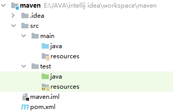

## 1. Maven 简介

### 1.1 Maven 介绍

Maven（发音：/ˈmeɪvn/） 翻译为"专家"、"内行"，是 Apache 下的一个纯 Java 开发的开源项目。Maven 是一个项目管理工具，可以对 Java 项目进行构建、依赖管理。Maven 也可被用于构建和管理各种项目，例如 C#，Ruby，Scala 和其他语言编写的项目。

### 1.2 Maven 安装

1. 确保安装了 Java 环境，因为 Maven 本身就是 Java 编写的：`java -version`
2. 下载并解压 Maven 安装程序，安装目录不要包含中文：http://maven.apache.org/download.cgi
3. 配置 Maven 的环境变量，最后验证是否安装成功：`mvn -v`


## 2. Maven 核心概念

### 2.1 约定的目录结构



* **src**：源代码
* **src/main**：主程序
* **src/main/java**：主程序的 Java 源码
* **src/main/resources**：主程序的配置文件
* **src/test**：测试程序
* **src/test/java**：测试程序的 Java 源码
* **src/test/resources**：测试程序的配置文件
* **target**：项目编译后的输出目录
* **pom.xml**：Maven 工程的核心配置文件


### 2.2 仓库管理

Maven 仓库能帮助我们管理构件（主要是 jar），它就是放置所有 jar 文件（war，zip，pom 等）的地方。Maven 仓库分三种：**本地仓库，远程仓库，中央仓库**。

* **本地仓库**：用来存储从远程仓库及中央仓库下载的插件和 jar 包，项目使用的一些插件或 jar 包优先从本地仓库获取。本地仓库的默认位置在 {user.home}/.m2/repository，{user.home} 表示 Windows 用户目录。
* **远程仓库**：如果本地仓库没有所需要的插件或 jar 包，默认去远程仓库下载。远程仓库由公司来进行维护，又可称为私服。
* **中央仓库**：中央仓库由 Maven 团队来进行维护，服务于整个互联网，其中包含了绝大多数流行的开源 Java 构件。

注：由于 Maven 中央仓库默认在国外，国内使用很慢，因此可以更换为阿里云的仓库。修改 maven 根目录下的 conf 文件夹中的 setting.xml 文件，在 mirrors 节点上，添加如下内容：

```xml
<mirrors>
    <mirror>
      <id>alimaven</id>
      <name>aliyun maven</name>
      <url>http://maven.aliyun.com/nexus/content/groups/public/</url>
      <mirrorOf>central</mirrorOf>        
    </mirror>
</mirrors>
```


### 2.3 生命周期

Maven 有以下三个标准的生命周期：

- **clean**：项目清理的处理
- **default(或 build)**：项目部署的处理
- **site**：项目站点文档创建的处理

其中一个典型的 Maven 构建（build）生命周期又由以下几个阶段的序列组成：

* **验证 validate**：验证项目是否正确且所有必须信息是可用的
* **编译 compile**：源代码编译在此阶段完成
* **测试 Test**：使用适当的单元测试框架（例如JUnit）运行测试
* **打包 package**：创建 JAR/WAR 包如在 pom.xml 中定义提及的包
* **检查 verify**：对集成测试的结果进行检查，以保证质量达标
* **安装 install**：安装打包的项目到本地仓库，以供其他项目使用
* **部署 deploy**：拷贝最终的工程包到远程仓库中，以共享给其他开发人员和工程


### 2.4 常用命令

| 命令             | 描述                                                         |
| ---------------- | ------------------------------------------------------------ |
| mvn clean        | 清理：删除原来编译和测试的目录，即 target 目录               |
| mvn compile      | 编译主程序：生成一个 target 目录，存放编译主程序后的字节码文件 |
| mvn test-compile | 编译测试程序：生成一个 target 目录，存放编译测试程序后的字节码文件 |
| mvn test         | 测试：生成一个 surefire-reports 目录，存放测试结果           |
| mvn package      | 打包：会编译程序和测试，并根据配置把主程序打包，生成 jar 或 war 包 |
| mvn install      | 安装：会把主程序打包，并根据工程的坐标保存到本地仓库中       |
| mvn deploy       | 部署：会把主程序打包，并保存到本地/远程仓库，同时将项目部署到 web 容器 |

注：以上命令必须在 pom.xml 所在目录下执行，实际的具体操作是由 **Maven 插件**来完成的，如 clean 操作就是由 maven-clean-plugin 插件来实现的


## 3. POM 文件

### 3.1 配置说明

POM（Project Object Model，项目对象模型）是 Maven 工程的基本工作单元，是一个 XML 文件，包含了项目的基本信息，用于描述项目如何构建，声明项目依赖等等。

| 配置项               | 描述                                                         |
| :------------------- | ------------------------------------------------------------ |
| project              | 工程的根标签                                                 |
| modelVersion         | Maven 模型的版本，对于 Maven 2/3 来说，只能设置为 4.0.0      |
| groupId              | 组织名称，一般是公司域名的倒写，所以是唯一的（域名唯一）     |
| artifactId           | 项目名称，也是模块名称，对应 groupId 项目中的子项目          |
| version              | 项目的版本号，通常使用三位数标识，SNAPSHOT 表示不稳定版本    |
| packaging            | 项目的打包方式，可以是 jar、war、rar、pom等，默认是 jar      |
| name                 | 项目的显示名，用于 Maven 生成文档                            |
| description          | 项目的描述信息，用于 Maven 生成文档                          |
| properties           | 配置一些属性，常用于定义版本号                               |
| dependencyManagement | 依赖管理，常用于父 POM 对于子模块的依赖管理                  |
| dependencies         | 依赖管理                                                     |
| dependency           | 依赖，配置项目依赖构件的坐标（groupId、artifactId、version） |
| parent               | 父模块信息，类似 Java 的继承机制，常用于多个模块需要相同的配置 |
| modules              | 在多模块开发中，用于聚合其它模块                             |
| build                | 与构建相关的配置，如设置编译插件的 JDK 版本                  |

1. **坐标**：坐标在仓库中可以唯一定位一个 Maven 项目，由 groupId、artifactId、version 组成

2. **全局变量**：在 pom.xml 文件中使用 properties 定义全局变量后，可以通过 `{property_name}` 的形式引用变量的值

3. **依赖范围（scope）**：包括 compile、test、provided、runtime、system，默认采用 compile

   | 依赖范围 | 编译有效 | 测试有效 | 运行有效 |          例子          |
   | :------: | :------: | :------: | :------: | :--------------------: |
   | compile  |    Y     |    Y     |    Y     |      spring-core       |
   |   test   |          |    Y     |          |         junit          |
   | provided |    Y     |    Y     |          |      servlet-api       |
   | runtime  |          |    Y     |    Y     |          jdbc          |
   |  system  |    Y     |    Y     |          | 本地 Maven仓库外的类库 |

4. **指定资源位置**：src/main/java 和 src/test/java 这两个目录中的所有 *.java 文件会分别在 compile 和 test-compile 阶段被编译，编译结果分别放到 target/classes 和 target/test-classes 目录中，但是**这两个目录中的其它文件都会被忽略掉**。如果需要把 src 目录下的其它文件放到 target 目录，作为输出 jar 的一部分，就要在<build\> 标签中指定资源文件的位置，示例如下：

   ```xml
   <build>
       <resources>
           <resource>
               <directory>src/main/java</directory>
               <includes>
                   <include>**/*.xml</include>
               </includes>
           </resource>
           <resource>
               <directory>src/main/resources</directory>
               <includes>
                   <include>**.*</include>
                   <include>**/*.*</include>
               </includes>
           </resource>
       </resources>
   </build>
   ```


### 3.2 文件示例

```xml
<project xmlns:xsi="http://www.w3.org/2001/XMLSchema-instance" xmlns="http://maven.apache.org/POM/4.0.0"
         xsi:schemaLocation="http://maven.apache.org/POM/4.0.0 http://maven.apache.org/xsd/maven-4.0.0.xsd">

    <parent>
        <groupId>org.springframework.boot</groupId>
        <artifactId>spring-boot-starter-parent</artifactId>
        <version>2.2.2.RELEASE</version>
    </parent>

    <modelVersion>4.0.0</modelVersion>
    <groupId>com.moxi</groupId>
    <artifactId>mogu_blog</artifactId>
    <version>0.0.1-SNAPSHOT</version>
    <packaging>pom</packaging>
    <name>mogu_blog</name>
    <description>a blog web</description>

    <properties>
        <maven.compiler.source>1.8</maven.compiler.source>
        <maven.compiler.target>1.8</maven.compiler.target>
        <project.build.sourceEncoding>UTF-8</project.build.sourceEncoding>
        <java.version>1.8</java.version>
        <swagger.version>2.6.1</swagger.version>
        <swagger.ui.version>2.6.1</swagger.ui.version>
        <swagger.starter.version>3.0.0</swagger.starter.version>
        <servlet.api.version>3.0-alpha-1</servlet.api.version>
        <net.sf.json.lib.version>2.4</net.sf.json.lib.version>
        <alibaba.fastjson.version>1.2.31</alibaba.fastjson.version>
        <jackson.mapper.asl.version>1.9.13</jackson.mapper.asl.version>
        <javax.mail.version>1.4</javax.mail.version>
        <aliyun.java.sdk.dysmsapi.version>1.0.0</aliyun.java.sdk.dysmsapi.version>
        <aliyun.java.sdk.core.version>3.2.5</aliyun.java.sdk.core.version>
        <mybatis.plus.boot.starter.version>3.1.2</mybatis.plus.boot.starter.version>
        <jjwt.version>0.7.0</jjwt.version>
        <druid.version>1.1.8</druid.version>
        <google.code.gson.version>2.7</google.code.gson.version>
        <lombok.version>1.18.10</lombok.version>
        <Hutool.version>4.6.4</Hutool.version>
        <log4j.version>1.2.17</log4j.version>
        <eureka.version>1.2.3.RELEASE</eureka.version>
        <startFeign.version>1.4.7.RELEASE</startFeign.version>
        <qiniu.version>[7.2.0, 7.2.99]</qiniu.version>
        <springBootAdmin.version>2.2.1</springBootAdmin.version>
        <JustAuth.version>1.15.1</JustAuth.version>
        <dyuproject.version>1.1.5</dyuproject.version>
        <flexmark.version>0.62.2</flexmark.version>
        <ip2region.version>1.7.2</ip2region.version>
        <oshi.version>3.9.1</oshi.version>
        <freemarker.version>2.3.28</freemarker.version>
        <jaxb.version>2.3.0</jaxb.version>
        <minio.version>7.1.4</minio.version>
        <spring.mock.version>2.0.8</spring.mock.version>
    </properties>

    <modules>
        <module>mogu_utils</module>
        <module>mogu_base</module>
        <module>mogu_xo</module>
        <module>mogu_admin</module>
        <module>mogu_web</module>
        <module>mogu_picture</module>
        <module>mogu_sms</module>
        <module>mogu_search</module>
        <module>mogu_monitor</module>
        <module>mogu_gateway</module>
        <module>mogu_zipkin</module>
        <module>mogu_spider</module>
        <module>mogu_commons</module>
    </modules>

    <dependencyManagement>
        <dependencies>
            <dependency>
                <groupId>org.springframework.cloud</groupId>
                <artifactId>spring-cloud-dependencies</artifactId>
                <version>Hoxton.RELEASE</version>
                <type>pom</type>
                <scope>import</scope>
            </dependency>

            <dependency>
                <groupId>com.alibaba.cloud</groupId>
                <artifactId>spring-cloud-alibaba-dependencies</artifactId>
                <version>2.1.0.RELEASE</version>
                <type>pom</type>
                <scope>import</scope>
            </dependency>
        </dependencies>
    </dependencyManagement>

</project>
```


