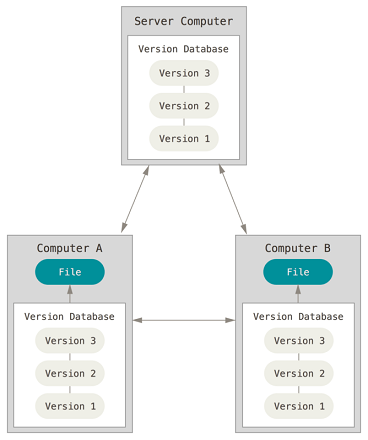

## 1. 版本控制

版本控制是一种记录一个或若干文件内容变化，以便将来查阅特定版本修订情况的系统。 除了项目源代码，你可以对任何类型的文件进行版本控制。

### 1.1 本地版本控制系统

许多人习惯用复制整个项目目录的方式来保存不同的版本，或许还会改名加上备份时间以示区别。 这么做唯一的好处就是简单，但是特别容易犯错。 有时候会混淆所在的工作目录，一不小心会写错文件或者覆盖意想外的文件。

为了解决这个问题，人们很久以前就开发了许多种本地版本控制系统，大多都是采用某种简单的数据库来记录文件的历次更新差异。

### 1.2 集中化版本控制系统

接下来人们又遇到一个问题，如何让在不同系统上的开发者协同工作？ 于是，集中化的版本控制系统（Centralized Version Control Systems，简称 CVCS）应运而生。 

集中化的版本控制系统都有一个单一的集中管理的服务器，保存所有文件的修订版本，而协同工作的人们都通过客户端连到这台服务器，取出最新的文件或者提交更新。

这么做虽然解决了本地版本控制系统无法让在不同系统上的开发者协同工作的诟病，但也还是存在下面的问题：

- **单点故障：** 中央服务器宕机，则其他人无法使用；如果中心数据库磁盘损坏没有进行备份，你将丢失所有数据。本地版本控制系统也存在类似问题，只要整个项目的历史记录被保存在单一位置，就有丢失所有历史更新记录的风险。
- **必须联网才能工作：** 受网络状况、带宽影响。

### 1.3 分布式版本控制系统

于是分布式版本控制系统（Distributed Version Control System，简称 DVCS）面世了。 git 就是一个典型的分布式版本控制系统。

这类系统，客户端并不只提取最新版本的文件快照，而是把代码仓库完整地镜像下来。 这么一来，任何一处协同工作用的服务器发生故障，事后都可以用任何一个镜像出来的本地仓库恢复。 因为每一次的克隆操作，实际上都是一次对代码仓库的完整备份。

分布式版本控制系统可以不用联网就可以工作，因为每个人的电脑上都是完整的版本库，当你修改了某个文件后，你只需要将自己的修改推送给别人就可以了。但是，在实际使用分布式版本控制系统的时候，很少会直接进行推送修改，而是使用一台充当“中央服务器”的东西。这个服务器的作用仅仅是用来方便“交换”大家的修改，没有它大家也一样干活，只是交换修改不方便而已。

## 2. git 简介

git 是一个开源的分布式版本控制工具，开发者就是 Linux 操作系统的作者 Linus Torvalds，设计的初衷是为了更好地管理 Linux 内核，现在已广泛应用于各种大中小型的项目中。

### 2.1 git 安装

Linux 系统下只需要在 Shell 界面输入一行命令就可以安装 git，如 CentOS 系统使用 `yum install git`，Ubuntu 系统使用 `sudo apt-get install git`。Windows 系统下安装与普通软件安装一样，安装包下载可访问 [git 官方下载地址](https://gitforwindows.org/)。

### 2.2 git 与其他版本控制系统的主要区别

大部分版本控制系统（CVS、Subversion、Perforce、Bazaar 等等）都是以文件变更列表的方式存储信息，这类系统**将它们保存的信息看作是一组基本文件和每个文件随时间逐步累积的差异。**

具体原理如下图所示，理解起来其实很简单，每个我们对提交更新一个文件之后，系统都会记录这个文件做了哪些更新，以增量符号 Δ(Delta) 表示。如果我们要得到文件的最终版本，只需要将原文件和这些增量进行相加就行了,但是这种方式会**耗费时间和性能**，尤其是在增量特别多的情况。

git 不按照以上方式对待或保存数据， 它使用的是**快照流**方式，就像把整个目录复制，然后再粘贴一样，但比复制粘贴优雅许多，且不会盲目地复制整个目录。 每次你提交更新，或在 git 中保存项目状态时，它主要对当时的全部文件制作一个快照并保存这个快照的索引。 为了高效，**如果文件没有修改，git 不再重新存储该文件**，而是只保留一个链接指向之前存储的文件。

### 2.3 git 的三种状态

git 有三种状态，你的文件可能处于其中之一：

1. **已提交（committed）**：数据已经安全的保存在本地数据库中。
2. **已修改（modified）**：已修改表示修改了文件，但还没保存到数据库中。
3. **已暂存（staged）**：表示对一个已修改文件的当前版本做了标记，使之包含在下次提交的快照中。

由此引入 git 项目的三个工作区域的概念：**git 仓库(.git directoty)**、**工作目录(Working Directory)** 以及 **暂存区域(Staging Area)** 。其基本工作流程如下：

1. 在工作目录中修改文件。
2. 暂存文件，将文件的快照放入暂存区域。
3. 提交更新，找到暂存区域的文件，将快照永久性存储到 Git 仓库目录。

## 3. git 常用命令

### 3.1 代码仓库

1. **创建仓库**

   * `git init`：创建/初始化仓库

     说明：需要使用 `cd` 命令切换到指定目录下，再输入命令。执行后会在根目录下生成一个**隐藏的 .git 文件夹**，记录本地所有的 git 操作，若要删除本地仓库，只要删除该文件夹。

   * `git clone [url]`：拉取远程仓库到本地

     说明：clone 是本地没有 git 仓库时，将远程仓库整个下载过来；而 pull 是本地有 git 仓库时，将远程仓库里新的提交数据下载过来，并且与本地代码合并。

2. **添加文件到仓库**

   * `git add .` 、`git add [filename]`：添加所有/单个文件到暂存区

     说明：git 在添加时会检查当前工作目录下是否存在一个名为 **.gitignore 文件**，若存在会一行行读取该文件内容，并将每一行指定的文件或目录排除在版本控制之外。

   * `git commit -m "commit message"`：提交到本地仓库

     说明：如果不加 -m 参数，那么是不能直接输入 message 的，而是会调用一个编辑器，一般是 vim 来让你输入这个message。使用命令 `git commit -amend` 可用于覆盖上一次的提交。

   * `git status`：查看工作区状态

   * `git diff`：对比工作区文件变化

3. **仓库配置**

   * `git config --global user.name "name"` 、`git config --global user.email "email"`：配置全局用户名和邮箱

     说明：若是个人开发机可以这样配置，若是公共编译机不能这样配置

   * `git config user.name "name"` 、`git config user.email "email"`：配置当前仓库用户名和邮箱

   

### 3.2 版本管理

1. **查看过去版本**

   * `git log`：查看提交记录

2. **撤销修改**

   * `git checkout -- [filename]`：工作区文件撤销（仅使用于还没有执行 add 命令的文件）

   * `git reset HEAD [filename]`：暂存区文件撤销，将暂存区文件撤销到工作区

   * `git reset --hard [commitID]`：版本库撤销

     说明：需要使用 `git log` 命令查看提交的日志，复制 commitID，然后恢复到指定版本

   

### 3.3 分支管理

1. **创建/切换分支**

   * `git branch [name]`：创建分支

   * `git checkout [name]`：切换分支

   * `git checkout -b [name]`：创建并切换分支

2. **查看分支**

   * `git branch`：查看当前分支

   * `git branch -a`：查看所有分支信息

     说明：星号 * 表明了当前位于哪个分支上，本地分支为“本地分支名”，远程分支为“远程仓库名/分支名”。

3. **合并/删除分支**

   * `git merge [name]`：合并某分支到当前分支

     说明：合并前需要先切换到 master 主干线上，合并过程中可能出现代码冲突的情况，需要手动解决。

   * `git branch -D/d [name]`：删除未合并/已合并的本地分支

     说明：删除远程分支建议使用界面操作。

4. **远程版本库**

   * `git push origin [name]`：向远程版本库推送分支

     说明：**github 的远程仓库名默认为 origin**，远程版本库其实也是一个分支，默认名为 origin/master。

   * `git fetch/pull origin [name]`：从远程版本库抓取分支

     说明：fetch 和 pull 都可以将远程版本库的代码同步到本地，区别是 fetch 命令同步下来的代码不会合并到任何分支，而是**存放在 origin/master 分支上**；pull 命令则会合并到本地，**相当于将 fetch 和 merge 命令一起执行**。
     
   * `git remote add origin [url]`：添加一个远程仓库

### 3.4 代码标签

1. **添加 tag 标签**

   * `git tag [name]`：给当前版本添加 tag

   * `git tag [name] [commitID]`：给历史版本添加 tag

     说明：当代码达到一个重要的阶段，并希望永远记住那个特别的提交快照，可以给它打上标签。tag 标签也是版本库的快照，指向某个 commit 的指针，这跟分支很像，但是分支可以移动，标签不能移动。所以，创建和删除标签都是瞬间完成的。

2. **删除 tag 标签**

   * `git tag -d [name]`：删除本地标签
   * `git push origin -d [name]`：删除远程标签
   
3. **查看/推送 tag 标签**

   * `git tag`：查看本地标签
   * `git push origin [name]`：推送本地标签至远程仓库

## 4. 代码托管到 github

github 是全球最大的代码托管网址，主要是借助 git 来进行版本控制，任何开源软件都可以免费将代码提交到 github 上。

### 4.1 准备阶段

注册登录 –> New Repositories -> 填写版本库名，勾选 Public 和 README，选择 .gitignore 文件类型和协议（可选） –> Create Repositories –> 点击 Clone or download，复制版本库的 git 地址

### 4.2 托管到 github

1. `cd` 切换到工程目录下

2. `git clone [url]` 远程版本库克隆到本地，该操作会在工程目录下生成一个目录，包括了 .gitignore 、LICENSE 、README.md 文件和一个隐藏的 .git 目录
3. 将新生成的目录中的所有文件（**包括隐藏的 .git 目录**）全部复制粘贴到上一层目录，即可将工程目录添加到版本控制中（复制完后可以删除生成的目录）
4. `git add .` -> `git commit -m "first commit"` -> `git push origin master`

## 参考

1. [知乎-图解 Git 操作](https://zhuanlan.zhihu.com/p/263050507)
2. [git 游戏](https://learngitbranching.js.org)

