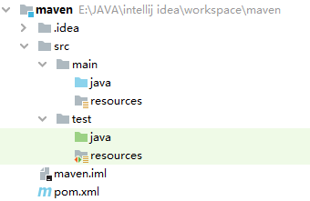
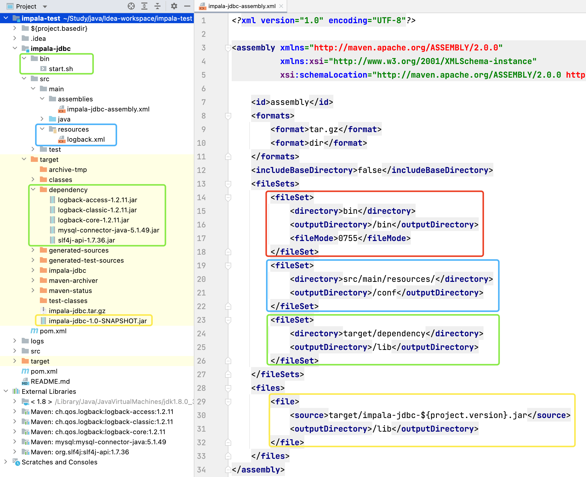

# 1. Maven 简介

## 1.1 Maven 介绍

Maven（发音：/ˈmeɪvn/） 翻译为"专家"、"内行"，是 Apache 下的一个纯 Java 开发的开源项目。Maven 是一个项目管理工具，可以对 Java 项目进行构建、依赖管理。Maven 也可被用于构建和管理各种项目，例如 C#，Ruby，Scala 和其他语言编写的项目。

## 1.2 Maven 安装

1. 确保安装了 Java 环境，因为 Maven 本身就是 Java 编写的：`java -version`
2. 下载并解压 Maven 安装程序，安装目录不要包含中文：http://maven.apache.org/download.cgi
3. 配置 Maven 的环境变量，最后验证是否安装成功：`mvn -v`


# 2. Maven 核心概念

## 2.1 约定的目录结构



* **src**：源代码
* **src/main**：主程序
* **src/main/java**：主程序的 Java 源码
* **src/main/resources**：主程序的配置文件
* **src/test**：测试程序
* **src/test/java**：测试程序的 Java 源码
* **src/test/resources**：测试程序的配置文件
* **target**：项目编译后的输出目录
* **pom.xml**：Maven 工程的核心配置文件


## 2.2 仓库管理

Maven 仓库能帮助我们管理构件（主要是 jar），它就是放置所有 jar 文件（war，zip，pom 等）的地方。Maven 仓库分三种：**本地仓库，远程仓库，中央仓库**。

* **本地仓库**：用来存储从远程仓库及中央仓库下载的插件和 jar 包，项目使用的一些插件或 jar 包优先从本地仓库获取。本地仓库的默认位置在 {user.home}/.m2/repository，{user.home} 表示 Windows 用户目录。
* **远程仓库**：如果本地仓库没有所需要的插件或 jar 包，默认去远程仓库下载。远程仓库由公司来进行维护，又可称为私服。
* **中央仓库**：中央仓库由 Maven 团队来进行维护，服务于整个互联网，其中包含了绝大多数流行的开源 Java 构件。

注：由于 Maven 中央仓库默认在国外，国内使用很慢，因此可以更换为阿里云的仓库。修改 maven 根目录下的 conf 文件夹中的 setting.xml 文件，在 mirrors 节点上，添加如下内容：

```xml
<mirrors>
    <mirror>
      <id>alimaven</id>
      <name>aliyun maven</name>
      <url>http://maven.aliyun.com/nexus/content/groups/public/</url>
      <mirrorOf>central</mirrorOf>        
    </mirror>
</mirrors>
```


## 2.3 生命周期

Maven 有以下三个标准的生命周期：

- **clean**：项目清理的处理
- **default(或 build)**：项目部署的处理
- **site**：项目站点文档创建的处理

其中一个典型的 Maven 构建（build）生命周期又由以下几个阶段的序列组成：

* **验证 validate**：验证项目是否正确且所有必须信息是可用的
* **编译 compile**：源代码编译在此阶段完成
* **测试 Test**：使用适当的单元测试框架（例如JUnit）运行测试
* **打包 package**：创建 JAR/WAR 包如在 pom.xml 中定义提及的包
* **检查 verify**：对集成测试的结果进行检查，以保证质量达标
* **安装 install**：安装打包的项目到本地仓库，以供其他项目使用
* **部署 deploy**：拷贝最终的工程包到远程仓库中，以共享给其他开发人员和工程


## 2.4 常用命令

| 命令             | 描述                                                         |
| ---------------- | ------------------------------------------------------------ |
| mvn clean        | 清理：删除原来编译和测试的目录，即 target 目录               |
| mvn compile      | 编译主程序：生成一个 target 目录，存放编译主程序后的字节码文件 |
| mvn test-compile | 编译测试程序：生成一个 target 目录，存放编译测试程序后的字节码文件 |
| mvn test         | 测试：生成一个 surefire-reports 目录，存放测试结果           |
| mvn package      | 打包：会编译程序和测试，并根据配置把主程序打包，生成 jar 或 war 包 |
| mvn install      | 安装：会把主程序打包，并根据工程的坐标保存到本地仓库中       |
| mvn deploy       | 部署：会把主程序打包，并保存到本地/远程仓库，同时将项目部署到 web 容器 |

注：以上命令必须在 pom.xml 所在目录下执行，实际的具体操作是由 **Maven 插件**来完成的，如 clean 操作就是由 maven-clean-plugin 插件来实现的


# 3. POM 文件

## 3.1 配置说明

POM（Project Object Model，项目对象模型）是 Maven 工程的基本工作单元，是一个 XML 文件，包含了项目的基本信息，用于描述项目如何构建，声明项目依赖等等。

| 配置项               | 描述                                                         |
| :------------------- | ------------------------------------------------------------ |
| project              | 工程的根标签                                                 |
| modelVersion         | Maven 模型的版本，对于 Maven 2/3 来说，只能设置为 4.0.0      |
| groupId              | 组织名称，一般是公司域名的倒写，所以是唯一的（域名唯一）     |
| artifactId           | 项目名称，也是模块名称，对应 groupId 项目中的子项目          |
| version              | 项目的版本号，通常使用三位数标识，SNAPSHOT 表示不稳定版本    |
| packaging            | 项目的打包方式，可以是 jar、war、rar、pom等，默认是 jar      |
| name                 | 项目的显示名，用于 Maven 生成文档                            |
| description          | 项目的描述信息，用于 Maven 生成文档                          |
| properties           | 配置一些属性，常用于定义版本号                               |
| dependencyManagement | 依赖管理，常用于父 POM 对于子模块的依赖管理                  |
| dependencies         | 依赖管理                                                     |
| dependency           | 依赖，配置项目依赖构件的坐标（groupId、artifactId、version） |
| parent               | 父模块信息，类似 Java 的继承机制，常用于多个模块需要相同的配置 |
| modules              | 在多模块开发中，用于聚合其它模块                             |
| build                | 与构建相关的配置，如设置编译插件的 JDK 版本                  |

1. **坐标**：坐标在仓库中可以唯一定位一个 Maven 项目，由 groupId、artifactId、version 组成

2. **全局变量**：在 pom.xml 文件中使用 properties 定义全局变量后，可以通过 `${property_name}` 的形式引用变量的值

3. **依赖范围（scope）**：包括 compile、test、provided、runtime、system，默认采用 compile

   | 依赖范围 | 编译有效 | 测试有效 | 运行有效 |          例子          |
   | :------: | :------: | :------: | :------: | :--------------------: |
   | compile  |    Y     |    Y     |    Y     |      spring-core       |
   |   test   |          |    Y     |          |         junit          |
   | provided |    Y     |    Y     |          |      servlet-api       |
   | runtime  |          |    Y     |    Y     |          jdbc          |
   |  system  |    Y     |    Y     |          | 本地 Maven仓库外的类库 |

4. **dependencyManagement 与 dependencies 区别**：dependencyManagement 里只是声明版本，并不实现引入，因此子项目需要显式的声明依赖，version 和 scope 都读取自父 pom。而 dependencies 所有声明在主 pom 的 dependencies 里的依赖都会自动引入，并默认被所有的子项目继承

5. **指定资源位置**：src/main/java 和 src/test/java 这两个目录中的所有 *.java 文件会分别在 compile 和 test-compile 阶段被编译，编译结果分别放到 target/classes 和 target/test-classes 目录中，但是**这两个目录中的其它文件都会被忽略掉**。如果需要把 src 目录下的其它文件放到 target 目录，作为输出 jar 的一部分，就要在<build\> 标签中指定资源文件的位置，示例如下：

   ```xml
   <build>
       <resources>
           <resource>
               <directory>src/main/java</directory>
               <includes>
                   <include>**/*.xml</include>
               </includes>
           </resource>
           <resource>
               <directory>src/main/resources</directory>
               <includes>
                   <include>**.*</include>
                   <include>**/*.*</include>
               </includes>
           </resource>
       </resources>
   </build>
   ```


## 3.2 打包插件

### 3.2.1 jar 包

Maven 可以使用 mvn package 对项目进行打包，若直接使用 java -jar xxx.jar 运行 jar 文件，则会出现"no main manifest attribute, in xxx.jar"（没有设置 Main-Class）、ClassNotFoundException（找不到依赖包）等错误。要想 jar 包能通过 java -jar xxx.jar 运行，需要满足两个条件：**一是在 jar 包中的 META-INF/MANIFEST.MF 中指定 Main-Class，这样才能确定程序的入口；二是要能加载到依赖包**。使用 Maven 有以下几种方法可以生成能直接运行的 jar 包，可以根据需要选择一种合适的方法。

1. **使用 maven-jar-plugin 和 maven-dependency-plugin 插件打包**

   ```xml
   <plugins>
       <plugin>
           <!-- maven-jar-plugin用于生成META-INF/MANIFEST.MF文件的部分内容 -->
           <groupId>org.apache.maven.plugins</groupId>
           <artifactId>maven-jar-plugin</artifactId>
           <version>2.6</version>
           <configuration>
               <archive>
                   <manifest>
                       <!-- 在MANIFEST.MF加上Class-Path项并配置依赖包 -->
                       <addClasspath>true</addClasspath>
                       <!-- 指定依赖包所在目录 -->
                       <classpathPrefix>lib/</classpathPrefix>
                       <!-- 指定MANIFEST.MF中的Main-Class -->
                       <mainClass>com.xxx.Main</mainClass>
                   </manifest>
               </archive>
           </configuration>
       </plugin>
       <plugin>
           <!-- maven-dependency-plugin插件用于将依赖包拷贝到指定位置 -->
           <groupId>org.apache.maven.plugins</groupId>
           <artifactId>maven-dependency-plugin</artifactId>
           <version>2.10</version>
           <executions>
               <execution>
                   <id>copy-dependencies</id>
                   <phase>package</phase>
                   <goals>
                       <goal>copy-dependencies</goal>
                   </goals>
                   <configuration>
                       <outputDirectory>${project.build.directory}/lib</outputDirectory>
                   </configuration>
               </execution>
           </executions>
       </plugin>
   </plugins>
   ```

   配置完成后，通过 mvn package 指令打包，会在 target 目录下生成 jar 包，并将依赖包拷贝到 target/lib 目录下。指定了 Main-Class，有了依赖包，那么就可以直接通过 java -jar xxx.jar 运行 jar 包。这种方式有个缺点，就是**生成的 jar 包太多，不便于管理**，下面两种方式只生成一个 jar 文件，包含项目本身的代码、资源以及所有的依赖包。

2. **使用 maven-assembly-plugin 插件打包**

   ```xml
   <plugins>
       <plugin>
           <groupId>org.apache.maven.plugins</groupId>
           <artifactId>maven-assembly-plugin</artifactId>
           <version>2.5.5</version>
           <configuration>
               <archive>
                   <manifest>
                       <mainClass>com.xxx.Main</mainClass>
                   </manifest>
               </archive>
               <descriptorRefs>
                   <descriptorRef>jar-with-dependencies</descriptorRef>
               </descriptorRefs>
           </configuration>
           <executions>
               <!-- 若不指定，需使用mvn package assembly:single打包 -->
               <execution>
                   <id>make-assembly</id>
                   <phase>package</phase>
                   <goals>
                       <goal>single</goal>
                   </goals>
               </execution>
           </executions>
       </plugin>
   </plugins>
   ```

   配置完成后，通过 mvn package 指令打包，会在 target 目录下生成一个 xxx-jar-with-dependencies.jar 文件，这个文件不但包含了自己项目中的代码和资源，还包含了所有依赖包的内容，所以可以直接通过 java -jar 来运行。不过，如果项目中用到 Spring 框架，用这种方式打包运行时会出错，使用方法三可以处理。

3. **使用 maven-shade-plugin 插件打包**

   ```xml
   <plugins>
       <plugin>
           <groupId>org.apache.maven.plugins</groupId>
           <artifactId>maven-shade-plugin</artifactId>
           <version>2.4.1</version>
           <executions>
               <execution>
                   <phase>package</phase>
                   <goals>
                       <goal>shade</goal>
                   </goals>
                   <configuration>
                       <transformers>
                           <transformer implementation="org.apache.maven.plugins.shade.resource.ManifestResourceTransformer">
                               <mainClass>com.xxx.Main</mainClass>
                           </transformer>
                           <!-- Spring多个jar包中包含相同的spring.handlers和spring.schemas文件，如果生成一个jar包会互相覆盖，为避免互相影响，使用AppendingTransformer对文件内容追加合并 -->
                           <transformer implementation="org.apache.maven.plugins.shade.resource.AppendingTransformer">
                               <resource>META-INF/spring.handlers</resource>
                           </transformer>
                           <transformer implementation="org.apache.maven.plugins.shade.resource.AppendingTransformer">
                               <resource>META-INF/spring.schemas</resource>
                           </transformer>
                       </transformers>
                   </configuration>
               </execution>
           </executions>
       </plugin>
   </plugins>
   ```

   配置完成后，通过 mvn package 指令打包，在 target 目录下会生成两个 jar 包，注意不是 original-xxx.jar 文件，而是另外一个，和 maven-assembly-plugin 一样，生成的 jar 包含了所有依赖，所以可以直接运行。


### 3.2.2 tar.gz 包

一个应用程序的目录一般包括：**存放启动脚本的 bin 目录、存放依赖包及程序本身的 lib 目录，存放配置文件的 conf 目录、存放日志文件的 log 目录**，maven-assembly-plugin 插件就可以做到这一点，它支持定制化打包方式，支持的格式包括：zip、tar、tar.gz、tar.bz2、tar.snappy、tar.xz、jar、dir、war 等。在使用 Maven Assembly 时，需要在 pom.xml 文件里面引入依赖：

```xml
<build>
    <pluginManagement>
        <plugins>
            <plugin>
                <groupId>org.apache.maven.plugins</groupId>
                <artifactId>maven-dependency-plugin</artifactId>
                <version>3.1.2</version>
                <executions>
                    <execution>
                        <id>mvn-dependencies</id>
                        <phase>package</phase>
                        <goals>
                            <goal>copy-dependencies</goal>
                        </goals>
                        <configuration>
                            <!-- 指定拷贝的程序依赖包的存放目录 -->
                            <outputDirectory>target/dependency</outputDirectory>
                            <overWriteSnapshots>true</overWriteSnapshots>
                            <includeScope>runtime</includeScope>
                        </configuration>
                    </execution>
                </executions>
            </plugin>
            <plugin>
                <groupId>org.apache.maven.plugins</groupId>
                <artifactId>maven-assembly-plugin</artifactId>
                <version>3.2.0</version>
                <executions>
                    <execution>
                        <goals>
                            <goal>single</goal>
                        </goals>
                        <phase>package</phase>
                        <configuration>
                            <skipAssembly>false</skipAssembly>
                            <descriptors>
                                <!-- 指定打包使用的描述文件位置 -->
                                <descriptor>src/main/assemblies/impala-jdbc-assembly.xml
</descriptor>
                            </descriptors>
                            <finalName>impala-jdbc</finalName>
                            <appendAssemblyId>false</appendAssemblyId>
                            <outputDirectory>./target</outputDirectory>
                            <!-- macOS: posix, linux: gnu -->
                            <tarLongFileMode>posix</tarLongFileMode>
                        </configuration>
                    </execution>
                </executions>
            </plugin>
        </plugins>
    </pluginManagement>
</build>
```

然后在上面的 descriptor 里新建 XML 描述文件，打包时需要用到这个文件描述的规则：

```xml
<?xml version="1.0" encoding="UTF-8"?>

<assembly xmlns="http://maven.apache.org/ASSEMBLY/2.0.0"
          xmlns:xsi="http://www.w3.org/2001/XMLSchema-instance"
          xsi:schemaLocation="http://maven.apache.org/ASSEMBLY/2.0.0 http://maven.apache.org/xsd/assembly-2.0.0.xsd">

    <id>assembly</id>
    <formats>
        <format>tar.gz</format>
        <format>dir</format>
    </formats>
    <includeBaseDirectory>false</includeBaseDirectory>
    <fileSets>
        <!-- 将程序的bin目录打包到bin目录下 -->
        <fileSet>
            <directory>bin</directory>
            <outputDirectory>/bin</outputDirectory>
            <fileMode>0755</fileMode>
        </fileSet>
        <!-- 将程序的src/main/resources目录打包到conf目录下 -->
        <fileSet>
            <directory>src/main/resources/</directory>
            <outputDirectory>/conf</outputDirectory>
        </fileSet>
        <!-- 将程序的target/dependency目录打包到lib目录下 -->
        <fileSet>
            <directory>target/dependency</directory>
            <outputDirectory>/lib</outputDirectory>
        </fileSet>
    </fileSets>
    <files>
        <!-- 将程序自身的jar打包到lib目录下 -->
        <file>
            <source>target/impala-jdbc-${project.version}.jar</source>
            <outputDirectory>/lib</outputDirectory>
        </file>
    </files>
</assembly>
```




## 3.3 文件示例

```xml
<project xmlns:xsi="http://www.w3.org/2001/XMLSchema-instance" xmlns="http://maven.apache.org/POM/4.0.0"
         xsi:schemaLocation="http://maven.apache.org/POM/4.0.0 http://maven.apache.org/xsd/maven-4.0.0.xsd">

    <parent>
        <groupId>org.springframework.boot</groupId>
        <artifactId>spring-boot-starter-parent</artifactId>
        <version>2.2.2.RELEASE</version>
    </parent>

    <modelVersion>4.0.0</modelVersion>
    <groupId>com.moxi</groupId>
    <artifactId>mogu_blog</artifactId>
    <version>0.0.1-SNAPSHOT</version>
    <packaging>pom</packaging>
    <name>mogu_blog</name>
    <description>a blog web</description>

    <properties>
        <maven.compiler.source>1.8</maven.compiler.source>
        <maven.compiler.target>1.8</maven.compiler.target>
        <project.build.sourceEncoding>UTF-8</project.build.sourceEncoding>
        <java.version>1.8</java.version>
        <swagger.version>2.6.1</swagger.version>
        <swagger.ui.version>2.6.1</swagger.ui.version>
        <swagger.starter.version>3.0.0</swagger.starter.version>
        <servlet.api.version>3.0-alpha-1</servlet.api.version>
        <net.sf.json.lib.version>2.4</net.sf.json.lib.version>
        <alibaba.fastjson.version>1.2.31</alibaba.fastjson.version>
        <jackson.mapper.asl.version>1.9.13</jackson.mapper.asl.version>
        <javax.mail.version>1.4</javax.mail.version>
        <aliyun.java.sdk.dysmsapi.version>1.0.0</aliyun.java.sdk.dysmsapi.version>
        <aliyun.java.sdk.core.version>3.2.5</aliyun.java.sdk.core.version>
        <mybatis.plus.boot.starter.version>3.1.2</mybatis.plus.boot.starter.version>
        <jjwt.version>0.7.0</jjwt.version>
        <druid.version>1.1.8</druid.version>
        <google.code.gson.version>2.7</google.code.gson.version>
        <lombok.version>1.18.10</lombok.version>
        <Hutool.version>4.6.4</Hutool.version>
        <log4j.version>1.2.17</log4j.version>
        <eureka.version>1.2.3.RELEASE</eureka.version>
        <startFeign.version>1.4.7.RELEASE</startFeign.version>
        <qiniu.version>[7.2.0, 7.2.99]</qiniu.version>
        <springBootAdmin.version>2.2.1</springBootAdmin.version>
        <spring.mock.version>2.0.8</spring.mock.version>
    </properties>

    <modules>
        <module>mogu_utils</module>
        <module>mogu_base</module>
        <module>mogu_xo</module>
        <module>mogu_admin</module>
        <module>mogu_web</module>
        <module>mogu_picture</module>
        <module>mogu_sms</module>
        <module>mogu_search</module>
        <module>mogu_monitor</module>
        <module>mogu_gateway</module>
        <module>mogu_zipkin</module>
        <module>mogu_spider</module>
        <module>mogu_commons</module>
    </modules>

    <dependencyManagement>
        <dependencies>
            <dependency>
                <groupId>org.springframework.cloud</groupId>
                <artifactId>spring-cloud-dependencies</artifactId>
                <version>Hoxton.RELEASE</version>
                <type>pom</type>
                <scope>import</scope>
            </dependency>

            <dependency>
                <groupId>com.alibaba.cloud</groupId>
                <artifactId>spring-cloud-alibaba-dependencies</artifactId>
                <version>2.1.0.RELEASE</version>
                <type>pom</type>
                <scope>import</scope>
            </dependency>
        </dependencies>
    </dependencyManagement>

</project>
```


# 参考

1. [Maven打包的三种方式](https://blog.csdn.net/daiyutage/article/details/53739452)