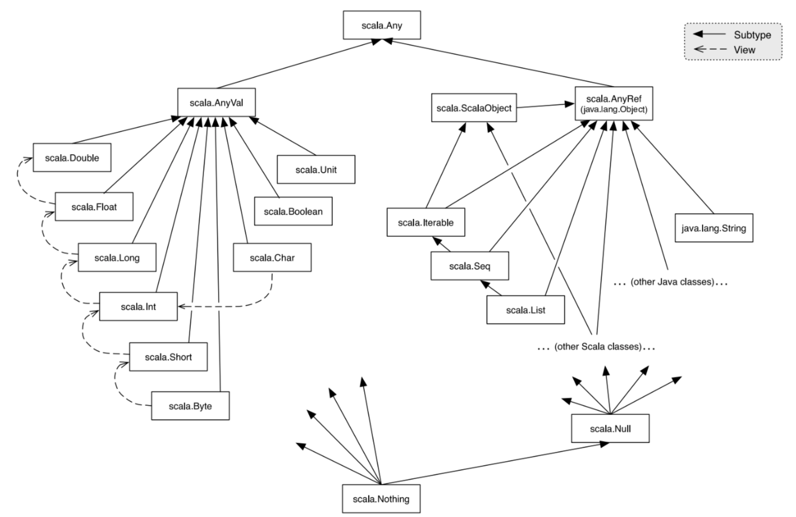
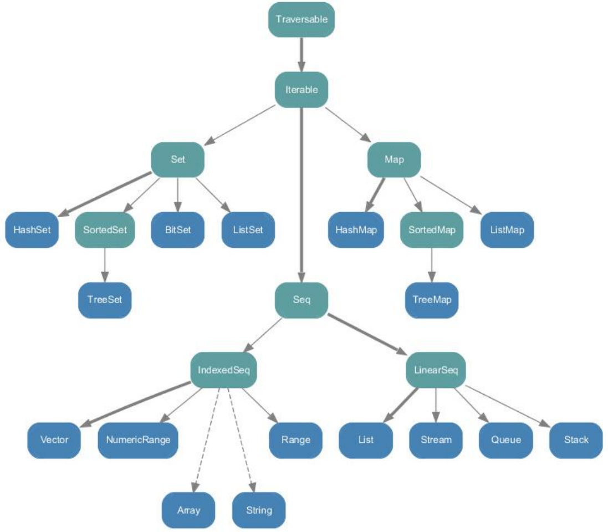
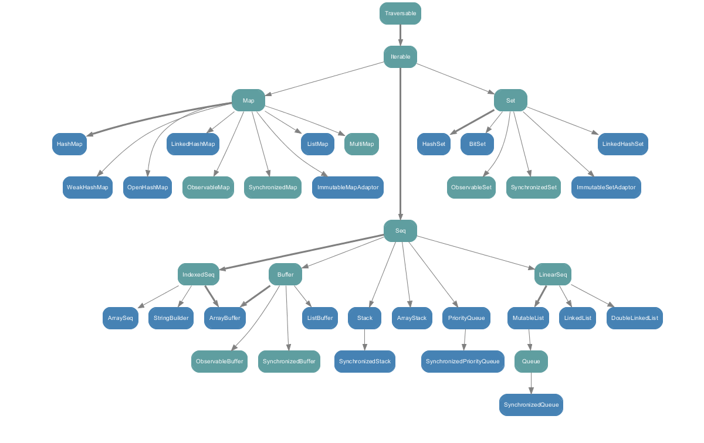

# 1. Scala 入门

## 1.1 概述

Scala 是**可扩展语言（SCAlable Language）**的缩写，由 Martin Odersky 教授和他的团队于 2003 年创建，它是一门以 JVM 为运行环境并将**面向对象和函数式编程**的最佳特性结合在一起的**静态类型编程语言**（静态语言需要提前编译，如 Java、C、C++ 等，动态语言如 JavaScript、Python 等）。

* Scala 是一门**多范式**的编程语言，支持**面向对象和函数式编程**（多范式就是多种编程方法，有面向对象、面向过程、泛型、函数式四种程序设计方法）。
* Scala 源代码（.scala）会被编译成 Java 字节码（.class），然后运行于 JVM 之上，**并可以调用现有的 Java 类库，实现两种语言的无缝对接**。
* Scala 单作为一门语言来看，非常的**简洁高效**。

```
         javac              java
.java  ---------> .class ----------> run on JVM
.scala ---------> .class ----------> run on JVM
         scalac             scala
```


## 1.2 环境搭建

作为一种 JVM 语言，Scala 要求使用 Java 运行时库，版本兼容参考：[官网-版本兼容](https://docs.scala-lang.org/overviews/jdk-compatibility/overview.html)。安装 Scala 与 安装 Java 类似，下载和解压缩包，并配置环境变量。

| JDK version | Minimum Scala versions                       |
| :---------: | :------------------------------------------- |
|     20      | 3.3.0 (soon), 2.13.11 (soon), 2.12.18 (soon) |
|     19      | 3.2.0, 2.13.9, 2.12.16                       |
|     18      | 3.1.3, 2.13.7, 2.12.15                       |
|  17 (LTS)   | 3.0.0, 2.13.6, 2.12.15                       |
|  11 (LTS)   | 3.0.0, 2.13.0, 2.12.4, 2.11.12               |
|   8 (LTS)   | 3.0.0, 2.13.0, 2.12.0, 2.11.0                |

启动 REPL，输入命令并回车。REPL 会运行命令，并在命令的下一行上输出结果，在这个输出之后的下一行会显示另一个提示符，等待运行下一个新命令。这就是 Read（读）、Evaluate（计算）、Print（打印）、Loop（循环）行为，REPL 由此得名。

```shell
[root@VM-24-2-centos ~]# scala
Welcome to Scala 2.12.17 (OpenJDK 64-Bit Server VM, Java 1.8.0_332).
Type in expressions for evaluation. Or try :help.

scala> println("hello scala")
hello scala

scala> 5 * 7
res1: Int = 35

scala> 2 * res1
res2: Int = 70

scala> :quit
```

以单文件编译执行为例，新建文件 HelloScala.scala，可通过如下三种方式编译运行。

1. 直接运行 Scala 源文件：`scala HelloScala.scala`
2. 编译为字节码后再运行：`scalac HelloScala.scala && scala HelloScala`
3. 添加 Scala 类库， 并通过 Java 执行 Scala 编译成的字节码：`java -cp $SCALA_HOME/lib/scala-library.jar; HelloScala`

```scala
object HelloScala {
    def main(args: Array[String]): Unit = {
        println("hello scala");
    }
}
```


## 1.3 IDEA 配置

使用 IDEA 开发 Scala 步骤如下：安装 Scala 插件并重启 → 创建 Maven 项目 → Maven 项目默认使用 Java，在 src/main 目录下新建目录 scala，并**将目录标记为 Source Root**，这样可以在同一项目中混用 Java 和 Scala  → 右键项目，**Add Framework Support**，并配置 Scala SDK，之后操作与 Java 类似

```scala
// object关键字创建的伴生对象，可以理解为替代Java的static关键字，
// 将静态方法用单例对象的实例方法做了替代，做到了更纯粹的面向对象。
object HelloWorld {
  def main(args: Array[String]): Unit = {
    println("hello scala")
    System.out.println("hello scala from java")
  }
}
```

再用一个等价的类定义来认识和区别一下 Java 和 Scala。

```java
public class Student {
    private String name;
    private Integer age;
    private static String school = "tencent";

    public Student(String name, Integer age) {
        this.name = name;
        this.age = age;
    }

    public void printInfo() {
        System.out.println(this.name + " " + this.age + " " + Student.school);
    }

    public static void main(String[] args) {
        Student stu = new Student("maomao", 20);
        stu.printInfo();
    }
}
```

```scala
class Student(name: String, age: Int) {
  def printInfo(): Unit = {
    println(name + " " + age + " " + Student.school)
  }
}

// 引入伴生对象，名称一致，同一个文件
object Student {
  val school: String = "tencent"

  def main(args: Array[String]): Unit = {
    val stu = new Student("maomao", 20)
    stu.printInfo()
  }
}
```


# 2. 变量和数据类型

## 2.1 变量与常量

在 Scala 中，常量优先于变量，因为不可变的常量更稳定，规则如下：

- 声明变量时，**类型可以省略，编译器会自动推导**。
- 静态类型，类型经过给定或推导确定后就不能修改。
- 变量和常量声明时，**必须有初始值**。
- 变量可变，常量不可变。
- 引用类型常量，不能改变常量指向的对象，但可以改变对象的字段。
- 不以 `;` 作为语句结尾，Scala 编译器自动识别语句结尾。

```scala
var name<: VariableType> = value	// variable
val name<: ConstantType> = value	// constant
```

Scala 中名字可以使用字母、数字和一些特殊的操作符字符，惯例使用小驼峰命名（除第一个单词之外，其他单词首字母大写），规则如下：

* 字母下划线开头，后跟字母数字下划线，和 C/C++/Java 一样。
* **操作符开头，且只包含（+-*/#! 等）**，可用于运算符重载。
* **用反引号包括的任意字符串**，即使是 Scala 保留字也可以。

```shell
# 类型推导
scala> var _abc = "hello scala"
_abc: String = hello scala

# 一个或多个操作符字符
scala> val +-*/%# = 10
+-*/%#: Int = 10

# 反引号包括的任意字符串
scala> val `if` = 20 
if: Int = 20
```


## 2.2 字符串

Scala 的 String 建立在 Java 的 String 基础上，新增了多行字面量和字符串内插等特性，规则如下：

* **`+` 号字符串连接；`*` 号字符串复制多次；`==` 号检查字符串真正的相等性，而不是对象引用相等性**，若要比较引用相等性，调用 eq()  方法。
* `printf` 格式化输出；`print` 不换行输出；`println` 换行输出。
* **`s"string${varname}"` 字符串插值，大括号可选，若引用与周围文本无法区分，可使用可选大括号；`f"string${varname}%<format>"` printf 记法，控制数据格式化；`raw"string${varname}"` 原始字符串，除替换变量外，其他字符原样输出**。
* **`"""string"""` 三重引号创建多行字符串，任何字符都原样输出，即使是反斜杠等特殊字符**。

```shell
# +号字符串连接
scala> val name = "mao" + "mao"
name: String = maomao

# ==号判断字符串真正的相等性
scala> name == "maomao"
res0: Boolean = true

scala> val age = 18
age: Int = 18

# 字符串插值
scala> println(s"${name}'s age is ${age}")
maomao's age is 18

scala> val power = 98.9072
power: Double = 98.9072

# printf 记法
scala> println(f"power is ${power}%.2f")
power is 98.91

# 原始字符串
scala> println(raw"power is ${power}%.2f")
power is 98.9072%.2f

# 三重引号创建多行字符串，stripMargin会去掉前缀|前面的空格，从控制台开头对齐输出
scala> var sql = """
     | select *
     | from
     |   student
     | where
     |   name = ${name}
     | """.stripMargin
sql: String =
"
select *
from
  student
where
  name = ${name}
"
```


## 2.3 数据类型

Scala 核心类型层次体系如下图所示。虚箭头表示隐士类型转换，实箭头表示子类，其中多个实箭头表示它们是这个系统中多个类型的子类。

* Scala 中所有数据都是对象，**都是 Any 的子类**。
* Scala 种数据类型分为两大类：**AnyVal 数值类型、AnyRef 引用类型，它们都是对象**。
* Scala 仍然遵守低精度的值类型自动转换（隐式转换）高精度的值类型。
* Java 中 String 类是 AnyRef 子类，而 Scala 中的 StringOps 是 Java 中 String 类的增强类，是 AnyVal 子类。
* Unit 对应 Java 中的 void，用于方法返回值的位置，表示方法没有返回值，**Unit 是一个数值类型，只有一个对象就是 ()**。Void 不是数值类型，只是一个关键字。
* **Null 是一个类型，只有一个对象就是 null，它是所有引用类型 AnyRef 的子类**，主要用于是与其他 JVM 语言互操作，几乎不在 Scala 代码中使用。
* **Nothing 是所有类型的子类，也称为底部类型**，主要用于一个函数没有明确返回值时使用，这样我们可以把返回值（异常）赋给任何的变量或函数（兼容性）。



```scala
object DataType {
  def main(args: Array[String]): Unit = {
    // Unit
    def unitTest(): Unit = {
      println("return type is unit")
    }

    val res1: Unit = unitTest()
    println(s"res1 = $res1")

    // Null
    var stu = new String("maomao");
    stu = null
    println(stu)

    // Nothing
    def nothingTest(num: Int): Int = {
      if (num == 0) {
        throw new NullPointerException
      } else {
        num
      }
    }

    val res2 = nothingTest(2)
    println(s"res2 = $res2")
  }
}
```

Scala 不允许从较高等级类型自动转换到较低等级类型，但**可以使用 toType 方法强制进行类型转换**，所有数值类型都有该方法，如果强制转换时类型不兼容，则可能丢失精度。除了使用显式类型，还可以**直接指定字面量数据的类型**，字面量字符不区分大小写。

| 类型名 | 描述         | 大小   | 最小值          | 最大值             |
| ------ | ------------ | ------ | --------------- | ------------------ |
| Byte   | 有符号整数   | 1 字节 | -127            | 128                |
| Short  | 有符号整数   | 2 字节 | -32768          | 32767              |
| Int    | 有符号整数   | 4 字节 | -2<sup>31</sup> | 2<sup>31</sup> - 1 |
| Long   | 有符号整数   | 8 字节 | -2<sup>63</sup> | 2<sup>63</sup> - 1 |
| Float  | 有符号浮点数 | 4 字节 | 不适用          | 不适用             |
| Double | 有符号浮点数 | 8 字节 | 不适用          | 不适用             |

```shell
# 无修饰符（前缀或后缀）的整数字面量默认为Int，0x前缀表示十六进制
scala> val rgb = 0xffff00
rgb: Int = 16776960

# 后缀L或l表示Long类型，类似的还有d（double）、f（float）
scala> val a = 20L
a: Long = 20

# 不允许从较高等级类型自动转换到较低等级类型
scala> var b: Int = a
<console>:12: error: type mismatch;
 found   : Long
 required: Int
       var b: Int = a
                    ^

# 强制转换
scala> var b: Int = a.toInt
b: Int = 20
```


## 2.4 运算符

Scala 运算符与 Java 基本一致，主要区别如下：

* Scala 没有自增 ++ 和自减 -- 操作符，统一使用 += 或 -= 实现。
* Scala 中所有运算符本质都是对象的方法调用，拥有比 C++ 更灵活的运算符重载。

```shell
# 标准加法运算
scala> println(1.+(1))
2

# 当调用对象方法时，点可以省略，用空格代替
scala> println(1 + (1))
2

# 当函数没有参数，或参数只有一个，括号可以省略
scala> println(1 + 1)
2
```


## 2.5 流程控制

Scala 条件分支 if-else 语句用法与 Java 基本一致，主要区别如下：

* **Scala 中 if-else 语句有返回值，定义为执行的最后一个语句的返回值**。
* 可以强制要求返回 Unit 类型，此时忽略最后一个表达式的值，得到 ()。
* 多种返回类型时，返回类型需要指定为公共父类，也可以自动推断。
* **Scala 中没有三元条件运算符，可以用 `if (a) b else c`  替代 `a ? b : c`**。

```scala
import scala.io.StdIn

object IfElseTest {
  def main(args: Array[String]): Unit = {
    // 读取键盘输入
    println("input age: ")
    val age: Int = StdIn.readInt()

    // if-else语句有返回值，返回类型指定为公共父类
    val res1: Any = if (age < 18) {
      println("未成年")
      age
    } else {
      println("成年")
      "成年"
    }
    println(s"res1 = $res1")

    // Scala没有三元条件运算符
    val res2 = if (age < 18) "未成年" else "未成年"
    println(s"res2 = $res2")
  }
}
```

Range 可以用来迭代处理一个数字序列，使用 to 或 until 操作符指定开始和结束整数来创建范围，其中 to 操作符会创建一个包含列表（inclusive list），而 until 操作符则创建一个不包含列表（exclusive list），**定义数值范围语法：`<start integer> [to|until] <end integer> [by increment]`**。Scala for 循环基于 Range，规则如下：

* **基本 for 循环语法：`for (<identifier> <- <iterator>) [yield] [<expression>]` ，关键字 yield 可选**，若指定了该关键字，调用的所有表达式的返回值将作为一个集合返回，否则返回值为 Unit。
* **循环守卫语法：`for (<identifier> <- <iterator> if <boolean expression>)`**，即为迭代器增加一个 if 表达式，当 if 表达式为 true 时，可以跳过一次迭代，效果类似 Java 的 continue 关键字。
* **引入变量语法：`for (<identifier> <- <iterator>; <identifier> = <expression>)`**，即基于当前迭代定义临时值和变量。
* **嵌套循环语法：`for (<identifier> <- <iterator>; <identifier> <- <iterator>)`**，也支持多行嵌套。
* **循环中断**：为了更好适应函数式编程，**Scala 去掉了 break 和 continue 关键字，而使用抛出并捕获异常的方式退出循环，同时也支持使用 breakable 结构来实现**（封装了抛出和捕获异常的逻辑）。
* 为了兼容 Java，Scala 也支持 while 和 do-while，语法与 Java 一致，返回类型为 Unit。不过 Scala 不推荐使用这种方式，因为循环内部会对外部变量造成影响。

```scala
import scala.util.control.Breaks

object ForTest {
  def main(args: Array[String]): Unit = {
    println("========范围遍历========")
    // 1-10，to不是Scala关键字，实际调用的是对象方法，即1.to(10)
    for (i <- 1 to 10) {
      println(i)
    }
    // 1-9，不包含右边界
    for (i <- 1 until 10) {
      println(i)
    }
    
    println("========循环步长========")
    // 步长不能为0，否则抛出异常
    for (i <- 1 to 10 by 2) {
      println(i)
    }
    for (i <- 10 to 1 by -2) {
      println(i)
    }
    for (i <- 1 to 10 reverse) {
      println(i)
    }
    
    println("========循环返回值========")
    // for循环默认返回值类型为Unit
    val res1: Unit = for (i <- 1 to 9) {
      i
    }
    println(s"res1 = $res1")
		// 关键字yield，所有表达式的返回值将作为一个集合返回
    val res2 = for (i <- 1 to 9) yield i
    println(s"res2 = $res2")
    
    println("========循环守卫========")
    // 效果类似Java的continue关键字
    for (i <- 1 to 10 if i != 3) {
      println(i)
    }
    
    println("========引入变量========")
    for (i <- 1 to 9; stars = 2 * i -1; spaces = 9 - i) {
      println(" " * spaces + "*" * stars)
    }

    println("========嵌套循环========")
    // 多行嵌套，九九乘法表
    for (i <- 1 to 9) {
      for (j <- 1 to i) {
        print(s"$j * $i = ${i * j} \t")
      }
      println()
    }
    // 单行嵌套循环，九九乘法表
    for (i <- 1 to 9; j <- 1 to i) {
      print(s"$j * $i = ${i * j} \t")
      if (j == i) println()
    }

    println("========循环中断========")
    // 抛出并捕获异常的方式退出循环
    try {
      for (i <- 0 to 10) {
        if (i == 3)
          throw new RuntimeException
        println(i)
      }
    } catch {
      case e: Exception => // do nothing
    }
    // 使用Breaks.break()实现异常的抛出和捕获
    Breaks.breakable(
      for (i <- 0 to 10) {
        if (i == 3)
          Breaks.break()
        println(i)
      }
    )
  }
}
```


# 3. 函数式编程

## 3.1 函数基础

Scala 是一个完全函数式编程语言，万物皆函数，函数的本质是可以将函数当作一个值进行传递。规则如下：

* **函数定义语法：`def <funName> (<arg1>: <arg1Type>[, ...]): RetType = {...}`**。
* **一般将定义在类或对象中的函数称为方法，而定义在方法中的称为函数**，广义上都是函数。方法可以重载和重写，而**函数没有重载和重写的概念**。
* 可变参数使用数组包装，**语法是在参数类型后面增加一个星号（*）**，如果参数列表存在多个参数，那么可变参数一般放在最后。
* **可以为任意参数指定默认值**，使得调用者可以忽略这个参数，定义语法：`def <funName> (<arg1>: <TypeOfArg1> = <defaultVal>): RetType = {...}`。
* **可以按名调用参数，这样就允许不按顺序指定参数**，调用语法：`funName(<arg> = <val>)`。

```scala
object ParameterTest {
  def main(args: Array[String]): Unit = {
    // 可变参数，参数类型后面增加一个星号（*），若存在多个参数，那么可变参数一般放在最后
    def f1(str1: String, str2: String*): Unit = {
      println(s"str1 = $str1, str2 = $str2")
    }

    f1("aaa")
    f1("aaa", "bbb", "ccc")

    // 为参数指定默认值
    def f2(str: String = "aaa"): Unit = {
      println(str)
    }

    f2()
    f2("bbb")

    // 按名调用参数，允许不按顺序指定参数
    def f3(name: String = "aaa", age: Int): Unit = {
      println(s"name = $name, age = $age")
    }

    f3("maomao", 18)
    f3(age = 18, name = "maomao")
    f3(age = 20)
  }
}
```

函数至简原则：能省则省。规则如下：

* 最后一行代码会作为返回值，可以省略 return。
* 函数体只有一行时，可以省略花括号。
* 如果返回值类型能够自动推断，那么可以省略。
* 如果函数体中用 return 做返回，那么返回值类型必须指定。
* 如果函数明确声明返回 Unit，那么即使函数体中使用 return 关键字也不起作用。
* 如果期望是无返回值类型，那么可以省略=，这时候没有返回值，函数也可以叫做过程。
* 如果函数无参，但是声明了参数列表，那么调用时可以省略括号()。
* 如果函数没有参数列表，那么声明时可以省略()，调用时必须省略()。
* 如果不关心函数名称，只关心逻辑处理，那么函数名称和 def 可以省略，去掉返回值类型，将 = 修改为 =>，定义为匿名函数。

```scala
object simplifyTest {
  def main(args: Array[String]): Unit = {
    // 最后一行代码会作为返回值，可以省略return
    def f1(name: String): String = {
      name
    }

    // 函数体只有一行时，可以省略花括号
    def f2(name: String): String = name

    // 如果返回值类型能够自动推断，那么可以省略
    def f3(name: String) = name

    // 如果函数体中用return做返回，那么返回值类型必须指定
    def f4(name: String): String = {
      return name
    }

    // 如果函数明确声明返回Unit，那么即使函数体中使用return关键字也不起作用
    def f5(name: String): Unit = {
      return name
    }

    // 如果期望是无返回值类型，那么可以省略=，这时候没有返回值，函数也可以叫做过程
    def f6(name: String) {
      println(name)
    }

    // 如果函数无参，但是声明了参数列表，那么调用时可以省略括号()
    def f7(): Unit = {
      println("aaa")
    }

    f7()
    f7

    // 如果函数没有参数列表，那么声明时可以省略()，调用时必须省略()
    def f8: Unit = {
      println("bbb")
    }

    f8

    // 如果不关心函数名称，只关心逻辑处理，那么函数名称和def可以省略，去掉返回值类型，将=修改为=>，定义为匿名函数
    (name: String) => {
      println(name)
    }
  }
}
```


## 3.2 函数高级

### 3.2.1 匿名函数

匿名函数即没有名称的函数，也叫 lambda 表达式，定义语法：`<arg>: <argType> => {...}`。匿名函数简化原则如下：

* 参数的类型可以省略，会根据形参自动推导。
* 类型省略之后如果只有一个参数，则括号可以省略；若没有参数或参数个数大于1，不能省略括号。
* 匿名函数如果只有一行，则大括号可以省略。
* 如果参数只出现一次，则参数省略且后面参数可以用下划线 _ 代替。
* 如果可以推断出当前传入的是一个函数体，而不是调用语句，可以直接省略下划线 _。

```scala
object LambdaTest {
  def main(args: Array[String]): Unit = {
    // 定义一个函数，以函数作为参数
    def f(func: String => Unit): Unit = {
      func("bbb")
    }

    val fun = (name: String) => {
      println(name)
    }
    f(fun)
    f((name: String) => {
      println(name)
    })

    // 参数的类型可以省略，会根据形参自动推导
    f((name) => {
      println(name)
    })

    // 类型省略之后如果只有一个参数，则括号可以省略；若没有参数或参数个数大于1，不能省略括号
    f(name => {
      println(name)
    })

    // 匿名函数如果只有一行，则大括号可以省略
    f(name => println(name))

    // 如果参数只出现一次，则参数省略且后面参数可以用_代替
    f(println(_))

    // 如果可以推断出，当前传入的是一个函数体，而不是调用语句，可以直接省略下划线_
    f(println)
  }
}
```


### 3.2.2 高阶函数

函数除了作为值传递，还以作为输入参数和返回值，这样的函数称为高阶函数。

```scala
object HighFunctionTest {
  def main(args: Array[String]): Unit = {
    def f(n: Int): Int = {
      println("f调用")
      n + 1
    }

    // 函数作为值进行传递（以下两种写法均可）
    val f1: Int => Int = f
    val f2 = f _
    println(f1(12))
    println(f2(12))

    // 函数作为参数进行传递
    def dualEval(op: (Int, Int) => Int, a: Int, b: Int): Int = {
      op(a, b)
    }

    println(dualEval(_ + _, 12, 13))

    // 函数作为函数的返回值返回
    def f3(): Int => Unit = {
      def f4(a: Int): Unit = {
        println("f4调用 " + a)
      }

      f4
    }

    println(f3())
    println(f3()(12))
  }
}
```


### 3.2.3 函数柯里化与闭包

函数柯里化（Currying）：将一个参数列表的多个参数，变成多个参数列表的过程，也即将普通多参数函数变成高阶函数的过程。

闭包：如果一个函数，访问到了它的外部（局部）变量的值，那么这个函数和他所处的环境，称为闭包。

> 因为外层调用结束返回内层函数后，经过堆栈调整，外层函数的参数已经被释放了，所以内层是获取不到外层的函数参数。为了能够将环境（函数中用到的非该函数的变量和值）保存下来，这时会将执行的环境打包保存到堆里面。

```scala
object ClosureTest {
  def main(args: Array[String]): Unit = {
    def addByA(a: Int): Int => Int = {
      def addB(b: Int): Int = {
        a + b
      }

      addB
    }

    // 闭包简写
    def addBy(a: Int): Int=>Int = a + _
    val addByFour = addBy(4)
    println(addByFour(4))
    println(addByFour(5))

    // 函数柯里化：把一个参数列表的多个参数，变成多个参数列表
    def add(a: Int)(b: Int): Int = a + b
    println(add(4)(3))

    val addFour = add(4) _
    println(addFour(3))
  }
}
```


### 3.2.4 递归函数

Scala 中递归函数必须声明返回值类型，因为无法通过推导获得。为了避免递归次数太多导致栈溢出，Scala 可以用尾递归（tail-recursion）优化一些递归函数，优化后的函数不会创建新的栈空间，而是使用当前函数的栈空间。

```scala
import scala.annotation.tailrec

object RecursionTest {
  def main(args: Array[String]): Unit = {
    // 递归实现阶乘
    def fact(n: Int): Int = {
      if (n == 0) return 1
      fact(n - 1) * n
    }

    println(fact(5))

    // 尾递归实现阶乘：每次调用都在收集结果，避免了常规递归压栈消耗内存
    def tailFact(n: Int): Int = {
      @tailrec
      def loop(n: Int, currRes: Int): Int = {
        if (n == 0) return currRes
        loop(n - 1, currRes * n)
      }

      loop(n, 1)
    }

    println(tailFact(5))
  }
}
```


### 3.2.5 控制抽象

值调用：按值传递参数，计算值后再传递。

名调用：按名称传递参数，直接用实参替换函数中使用形参的地方。

```scala
import scala.annotation.tailrec

object ControlAbstraction {
  def main(args: Array[String]): Unit = {
    // 传值参数
    def f0(a: Int): Unit = {
      println(s"a = $a")
      println(s"a = $a")
    }

    def f1(): Int = {
      println("f1调用")
      12
    }

    // 只打印一次：f1调用
    f0(f1())

    // 传名参数，传递的不再是具体的值，而是代码块
    def f2(a: => Int): Unit = {
      println(s"a = $a")
      println(s"a = $a")
    }

    f2(3)
    // 会打印两次：f1调用
    f2(f1())
		// 会打印两次：这是一个代码块
    f2({
      println("这是一个代码块")
      29
    })

    // 常规while循环
    var n = 10
    while (n >= 1) {
      println(n)
      n -= 1
    }

    // 自定义while循环：闭包实现，将代码块作为参数传入
    def myWhile(condition: => Boolean): (=> Unit) => Unit = {
      // 内层函数需要递归实现，参数就是循环体
      def doLoop(op: => Unit): Unit = {
        if (condition) {
          op
          myWhile(condition)(op)
        }
      }

      doLoop
    }

    n = 10
    // 条件（condition）和循环体（op）都作为代码块传入，传名参数
    myWhile(n >= 1) {
      println(n)
      n -= 1
    }

    // 柯里化实现
    @tailrec
    def myWhile2(condition: => Boolean)(op: => Unit): Unit = {
      if (condition) {
        op
        myWhile2(condition)(op)
      }
    }

    n = 10
    myWhile2(n >= 1) {
      println(n)
      n -= 1
    }
  }
}
```


### 3.2.6 惰性加载

当函数返回值被声明为 lazy 时，函数的执行将会被推迟，直到我们首次对此取值，该函数才会被执行，这种函数称为惰性函数。

```scala
object LazyTest {
  def main(args: Array[String]): Unit = {
    // 惰性函数，有点类似传名参数，但惰性加载只是推迟求值到第一次使用，而不是单纯替换
    lazy val res = sum(1, 2)

    println("函数调用")
    println(s"res = $res")
    println(s"res = $res")
  }

  def sum(a: Int, b: Int): Int = {
    println("sum调用")
    a + b
  }
}
```


# 4. 面向对象

## 4.1 包管理

为 Scala 文件定义包的语法：`package <packageName>`，包名只能包含字母、数字、下划线、小圆点，且不能以数字开头，也不能使用关键字。Scala 有两种包的管理风格，一种方式和 Java 的包管理风格相同，每个源文件声明一个包，但源文件位置不需要和包名目录层级一致，只代表逻辑层级关系，当然惯例是和 Java 一样按照包名目录层级来放置。另一种方式则是**通过嵌套表示层级关系**，这种方式的特点是：**一个源文件中可以声明多个 package，且子包中的类可以直接访问父包中的内容，而无需导包**，但外层是不能直接访问内层的，需要导包。

Scala 导包和 Java 一样，可以在顶部使用 import 导入，文件中的所有类都可以使用。也可以局部导入，即什么时候使用，什么时候导入，仅在其作用范围内都可以使用。注意，**Scala 中有三个默认导入**，分别是：import java.lang.\_、import scala.\_、import scala.Predef.\_

| 示例                                 | 说明                                                         |
| ------------------------------------ | ------------------------------------------------------------ |
| import com.example.\_                | **通配符导入**，引入 com.example 下的所有成员                |
| import com.example.{Fruit,Vegetable} | **导入相同包的多个类**，引入 com.example 下的 Fruit 和 Vegetable |
| import com.example.{Fruit=>Shuiguo}  | **给类起别名**，引入 com.example 包下的 Fruit 并更名为 Shuiguo |
| import com.example.{Fruit=>\_,\_}    | **屏蔽类**，引入 com.example 包除 Fruit 的所有类             |
| new \_root\_.java.util.HashMap       | **导入包的绝对路径**，引入的 Java 的绝对路径                 |

```scala
// 用嵌套风格定义包，定义的包为com，但实际文件可以放在任意包目录下
package com {
  // 外层访问内层需要显示导包
  import com.example.maoamo.Inner

  // 在外层包中定义单例对象
  object Outer {
    var out: String = "out"

    def main(args: Array[String]): Unit = {
      println(Inner.in)
      Inner.in = "inner"
      println(Inner.in)
    }
  }

  package example {
    package maoamo {
      // 在内层包中定义单例对象
      object Inner {
        var in: String = "in"
        
        def main(args: Array[String]): Unit = {
          // 内层访问外层无需显示导包
          println(Outer.out)
        }
      }
    }
  }
}
```

在 Scala 中可以为每个包定义一个**同名的包对象**，定义在包对象中的成员，作为其对应包下所有 class 和 object 的共享变量，可以被直接访问，定义语法：`package object <package-object-name> {...}`。注意，若使用 Java 的包管理风格，则包对象一般定义在其对应包下的文件中；若采用嵌套方式管理包，则包对象可与包定义在同一文件中，但要保证包对象与包声明在同一作用域中。

```scala
// Java方式定义包对象
package object chapter {
  // 定义当前包共享的属性和方法
  val commonVal = "maomao"

  def commonMethod(): Unit = {
    println(s"commonVal = $commonVal")
  }
}

// 嵌套方式定义包对象
package aaa {
  package bbb {
    object ccc {
      def main(args: Array[String]): Unit = {
        // 可以直接访问bbb同名包对象中的属性
        println(name)
      }
    }
  }

  // 包对象需要和包在同一层级下，否则无法访问包对象中的变量和方法
  package object bbb {
    val name: String = "aaa"
  }
}
```

```scala
package chapter

object PackageObjectTest {
  def main(args: Array[String]): Unit = {
    // 可以直接访问chapter同名包对象中的属性
    println(commonVal)
    commonMethod()
  }
}
```


## 4.2 类和对象

Scala 中定义方法与定义函数语法一致：`def <method-name>(arg: arg-type)[: return-type] = {...}`。与 Java 类似，同样使用 new 关键字创建对象 ，语法为：`val|var <object-name>[: object-type] = new object-type()`，注意，**val 修饰对象，不能改变对象的引用，但可以改变对象属性的值；var 修饰对象，可以同时修改对象的引用和对象的属性值；另外，自动推导变量类型不能多态，所以多态需要显示声明类型**。

Scala中没有 public 关键字，类默认就是公有，且不能加 public，一个文件可以写多个类，不要求和文件名一致。Scala 中 Bean 属性加上 @BeanPropetry 注解可以自动生成规范的 getter 和 setter 方法，**定义变量必须赋值，使用 _ 会赋默认值，若定义常量则不能用 _，必须显式指定**，因为只能初始化一次。

```scala
import scala.beans.BeanProperty

object ClassTest {
  def main(args: Array[String]): Unit = {
    val student = new Student
    // 无法访问private属性
    //    student.name
    println(student.age)
  }
}

// 定义一个类，默认public，但Scala无public关键字
class Student {
  private var name: String = "maomao"

  // 自动生成getter和setter方法
  @BeanProperty
  var age: Int = _

  // 下划线表示赋默认初始值，这里表示null
  var sex: String = _
}
```


## 4.3 封装

**Scala 中的 public 属性，底层实际为 private**，并通过 get 方法（obj.field()）和 set 方法（obj.field_=(value)）对其进行操作，所以 Scala 并不推荐将属性设为 private，再为其设置 public 的 get 和 set 方法。但由于很多 Java 框架都利用反射调用 getXXX 和 setXXX 方 法，有时为了和这些框架兼容，也会为 Scala 的属性设置 getXXX 和 setXXX 方法（通过 @BeanProperty 注解实现）。

在 Java 中，访问权限分为：public，private，protected 和默认。在 Scala 中，可以通过类似的修饰符达到同样的效果，但使用上有区别：

* Scala 中属性和方法的**默认访问权限为 public**，但 Scala 中无 public 关键字。
* private 为私有权限，**只在类的内部和伴生对象中可用**。
* protected 为受保护权限，Scala 中受保护权限比 Java 中更严格，**同类、子类可以访问，同包无法访问**。
* private [package-name] 增加**包访问权限**，包名下的其他类也可以使用。

```scala
package chapter

object AccessTest {
  def main(args: Array[String]): Unit = {
    val person = new Person
    // 无法访问person的id和name
    println(person.age)
    println(person.sex)
    person.printInfo()

    val worker = new Worker
    worker.printInfo()
  }
}

class Person {
  private var id: String = "123456"
  protected var name: String = "Alice"
  var sex: String = "female"
  private[chapter] var age: Int = 18

  def printInfo(): Unit = {
    println(s"Person[id = $id, name = $name, sex = $sex, age = $age]")
  }
}

class Worker extends Person {
  override def printInfo(): Unit = 
    // 无法访问id
    name = "Bob"
    age = 25
    sex = "male"
    println(s"Worker[name = $name, sex = $sex, age = $age]")
  }
}
```

和 Java 一样，Scala 构造对象也需要调用构造方法，并且可以有任意多个构造方法。Scala 类的构造器包括：**主构造器和辅助构造器**，特点如下：

* **主构造器写在类定义上，一定是构造时最先被调用的构造器，方法体就是类定义**。
* 若主构造器无参数，小括号可省略，构建对象时调用的构造方法的小括号也可以省略。
* **辅助构造器函数名称为 this，可以有多个**，编译器通过参数的个数及类型来区分。
* **辅助构造方法不能直接构建对象，必须直接或者间接调用主构造器**。
* **构造器调用其他另外的构造器，要求被调用构造器必须提前声明**。

```scala
class ClassName [descriptor] [([descriptor][val/var] arg1: arg1Type, [descriptor][val/var] arg2: arg2Type, ...)] {	// 主构造器，只有一个
    // 辅助构造器
    def this(argsList1) {
        this(args) // 直接调用主构造器
    }
  	// 辅助构造器，重载
    def this(argsList2) {
        this(argsList1) // 调用另一个辅助构造器，间接调用主构造器
    }
}
```

```scala
object ConstructorTest {
  def main(args: Array[String]): Unit = {
    val boss = new Boss
    boss.Boss()
    new Boss("Alice")
    new Boss("Bob", 20)
  }
}

class Boss() {
  var name: String = _
  var age: Int = _

  println("主构造方法被调用")

  // 辅助构造器一
  def this(name: String) {
    // 直接调用主构造器
    this()
    println("辅助构造方法一被调用")
    this.name = name
    println(s"name = $name, age = $age")
  }

  // 辅助构造器二
  def this(name: String, age: Int) {
    // 直接调用主构造器
    this(name)
    println("辅助构造方法二被调用")
    this.age = age
    println(s"name = $name, age = $age")
  }

  def Boss() : Unit = {
    println("一般方法被调用")
  }
}
```

Scala 类的主构造器的形参包括三种类型：未用任何修饰、var 修饰、val 修饰，说明如下：

* **未用任何修饰符修饰，该参数就是一个局部变量**。
* **var 修饰参数，作为类的成员属性使用，可以修改**。
* **val 修饰参数，作为类只读属性使用，不能修改**。

```scala
object ConstructorParamsTest {
  def main(args: Array[String]): Unit = {
    val employee1 = new Employee1("Bob", 20)
    println(s"employee1[name = ${employee1.name}, age = ${employee1.age}]")

    val employee2 = new Employee2("Bob", 19)
    employee2.printInfo()

    val employee3 = new Employee3("Bob", 18)
    println(s"employee3[name = ${employee3.name}, age = ${employee3.age}]")
    //    employee3.age = 17
  }
}

// 主构造器有var修饰，此时name和age是类的属性
class Employee1(var name: String, var age: Int)

// 主构造器无修饰，此时name和age只是形参，而不是类的属性
class Employee2(name: String, age: Int) {
  def printInfo(): Unit = {
    println(s"employee2[name = $name, age = $age]")
  }
}

// 主构造器有val修饰，此时name和age是类的属性，且赋值后不能再更改
class Employee3(val name: String, val age: Int)
```


## 4.4 继承和多态

Scala 是单继承的，子类可以继承父类的属性和方法，语法为：`class ChildClassName[(argList1)] extends BaseClassName[(args)] { ... }`。注意，调用子类构造器前会先调用父类的构造器。

Java中属性是静态绑定，根据变量的引用类型确定，而方法是动态绑定，但 **Scala 中属性和方法都是动态绑定**，且通过 override 关键字可以重写属性。

```scala
object InheritanceAndPolymorphismTest {
  def main(args: Array[String]): Unit = {
    new Son("Alice", 18)	// 父类主构造器调用 -> 父类辅助构造器调用 -> 子类主构造器调用
    new Son("Bob", 27, "male")	// 父类主构造器调用 -> 父类辅助构造器调用 -> 子类主构造器调用 -> 子类辅助构造器调用

    val parent: Parent = new Daughter	// 父类主构造器调用
    println(parent.bind)	// dynamic（Java属性静态绑定，输出static）
    parent.printInfo()	// Daughter[name = parent, age = 0, bind = dynamic]
  }
}

class Parent() {
  var name: String = "parent"
  var age: Int = _
  val bind: String = "static"

  println("父类主构造器调用")

  def this(name: String, age: Int) {
    this()
    println("父类辅助构造器调用")
    this.name = name
    this.age = age
  }

  def printInfo(): Unit = {
    println(s"Parent[name = $name, age = $age]")
  }
}

class Son(name: String, age: Int) extends Parent(name, age) {
  var sex: String = _
  println("子类主构造器调用")

  def this(name: String, age: Int, sex: String) {
    this(name, age)
    println("子类辅助构造器调用")
    this.sex = sex;
  }

  override def printInfo(): Unit = {
    println(s"Son[name = $name, age = $age, sex = $sex]")
  }
}

class Daughter extends Parent {
  // Scala属性在多态时动态绑定
  override val bind: String = "dynamic"

  override def printInfo(): Unit = {
    println(s"Daughter[name = $name, age = $age, bind = $bind]")
  }
}
```


## 4.5 抽象类

```scala
abstract class <ClassName>{} // 定义抽象类：通过 abstract 关键字标记抽象类
val|var <attributeName>: <attributeType>	// 定义抽象属性：一个属性没有初始化，就是抽象属性
def <methodName>(): <returnType>	// 定义抽象方法：只声明而没有实现的方法，就是抽象方法
```

抽象类继承和重写规则如下：

* 如果父类为抽象类，那么子类需要将抽象的属性和方法实现，否则子类也需声明为抽象类。
* **重写非抽象方法需要用 override 修饰，重写抽象方法则可以不加 override**。
* 子类中调用父类的方法使用 super 关键字。
* 子类对抽象属性进行实现，父类抽象属性可以用 var 或 val 修饰；**子类对非抽象属性重写，父类非抽象属性只支持 val 类型，而不支持 var，因为 var 修饰可变变量，子类继承之后就可以直接使用，没有必要重写**。
* 和 Java 一样，Scala 可以创建匿名的子类。

```scala
object AbstractClassTest {
  def main(args: Array[String]): Unit = {
    val dog = new Dog
    dog.sleep()	// dog sleep
    dog.eat()	// animal eat	-> dog eat

    // 匿名子类
    val animal: Animal = new Animal {
      override var age: Int = 3

      override def sleep(): Unit = {
        println("anonymous class")
      }
    }
    println(animal.age)	// 3
    animal.sleep()	// anonymous class
  }
}

// 抽象类
abstract class Animal {
  val name: String = "animal"	// 非抽象属性，重写时只支持val
  var age: Int	// 抽象属性
  
  def eat(): Unit = {	// 非抽象方法
    println("animal eat")
  }

  def sleep(): Unit	// 抽象方法
}

// 具体的实现子类
class Dog extends Animal {
  var age: Int = 2	// 实现抽象属性和方法

  def sleep(): Unit = {	// 重写抽象方法时，override可以省略
    println("dog sleep")
  }

  override val name: String = "dog"	// 重写非抽象属性和方法

  override def eat(): Unit = {	// 重写非抽象属性，override不可以省略
    super.eat()	// super关键字调用父类方法
    println("dog eat")
  }
}
```


## 4.6 单例对象

Scala语言是**完全面向对象**的语言，所以并没有静态的操作，即在 Scala 中没有静态的概念。但为了能够和 Java 语言交互（Java 中有静态概念），就产生了一种特殊的对象来**模拟类对象**，该对象为**单例对象**。**若单例对象名与类名一致，则称该单例对象是这个类的伴生对象**，这个类的所有“静态”内容都可以放置在它的伴生对象中。

* 单例对象**采用 object 关键字声明**，语法为：`object <ObjectName> {...}`。
* 单例对象对应的类称之为**伴生类**，伴生对象的名称应该和伴生类名一致。
* **单例对象中的属性和方法都可以通过伴生对象名（类名）直接访问**。
* **若想让主构造器变为私有的，可以在参数列表前加上 private 关键字**。
* **伴生对象实现 apply() 方法后，调用时可以省略 .apply，从而实现不使用 new 方法创建对象，且 apply() 方法可以重载**。
* Scala 中 obj(arg) 语句实际是在调用该对象的 apply() 方法，即 obj.apply(arg)。
* 当使用 new 关键字构建对象时，调用的其实是类的构造方法；当直接使用类名构建对象时，调用的其实是伴生对象的 apply() 方法。

```scala
object CompanionObjectTest {
  def main(args: Array[String]): Unit = {
    // 构造器共有化调用
    //    new People("Bob", 17).printInfo()

    // 构造器私有化调用
    People.newPeople("Bob", 17).printInfo()
    
    People.apply("Bob", 17).printInfo()
    // 伴生对象中调用apply()方法，apply()方法可以省略
    People("Bob", 17).printInfo()

    // 验证单例模式
    val people1 = People.getInstance()
    val people2 = People.getInstance()
    println(people1 == people2)
  }
}

// private关键字：主构造器私有化
class People private(val name: String, val age: Int) {
  def printInfo(): Unit = {
    println(s"People[name = $name, age = $age, sex = ${People.sex}]")
  }
}

// 伴生对象
object People {
  val sex: String = "male"

  def newPeople(name: String, age: Int): People = new People(name, age)

  def apply(name: String, age: Int): People = new People(name, age)

  // 饿汉式单例模式
  private val people: People = new People("Jack", 10)

  def getInstance(): People = people

  // 懒汉式单例模式
  private var people2: People = _
  def getInstance2(): People = {
    if (people2 == null) {
      people2 = new People("Jack", 10)
    }
    people2
  }
}
```


## 4.7 特质

Scala 语言中，**采用特质 trait（特征）来代替接口的概念**，也就是说，多个类具有相同的特质（特征）时，就可以将这个特质（特征）独立出来，采用关键字 trait 声明，语法为：`trait <TraitName> {...}`。Scala 中的 **trait 既可以有抽象属性和方法，也可以有具体的属性和方法，一个类可以混入（mixin）多个特质**。 Scala 之所以引入 trait，第一可以替代 Java 的接口，第二也是对单继承机制的一种补充。

一个类具有某种特质，就意味着这个类满足了这个特质的所有要素，所以在使用时也采用了 extends 关键字，如果有多个特质或存在父类，那么需要使用 with 关键字连接。

```scala
// 没有父类：当一个类去继承特质时，第一个连接词是extends，后面是with
class <ClassName> extends <TraitName1> with <TraitName2> with <TraitName3>
// 有父类：当一个类同时继承特质和父类时，应当把父类写在extends后
class <ClassName> extends <ParentClassName> with <TraitName1> with <TraitName2>
```

```scala
object TraitTest {
  def main(args: Array[String]): Unit = {
    val teacher = new Teacher
    teacher.sayHello()	// hello from Alice -> hello from teacher Alice
    teacher.teach()			// teacher Alice is teaching
    teacher.increase()	// teacher Alice knowledge increase 1

    teacher.dating()		// teacher Alice is dating
    teacher.play()			// young human Alice is playing
    teacher.increase()	// teacher Alice knowledge increase 2

    // 动态混入，无须重新定义teacherWithTalent类
    val teacherWithTalent = new Teacher with Talent {
      override def singing(): Unit = println("teacher is good at singing")
    }
    teacherWithTalent.sayHello()	// hello from Alice -> hello from teacher Alice
    teacherWithTalent.singing()		// teacher is good at singing
  }
}

class Human {
  val name: String = "human"
  var age: Int = 20

  def sayHello(): Unit = {
    println(s"hello from $name")
  }
}

trait Young {
  // 声明抽象和非抽象属性
  val name: String = "young"
  var age: Int

  // 声明抽象和非抽象方法
  def play(): Unit = {
    println(s"young human $name is playing")
  }

  def dating(): Unit
}

trait Knowledge {
  var amount: Int = _

  def increase(): Unit
}

trait Talent {
  def singing(): Unit
}

class Teacher extends Human with Young with Knowledge {
  // 父类和特质中均包含name属性，需要重写冲突的属性
  override val name: String = "Alice"

  // 实现特质中的抽象方法
  def dating(): Unit = println(s"teacher $name is dating")

  // 自定义方法
  def teach(): Unit = println(s"teacher $name is teaching")

  // 重写父类方法
  override def sayHello(): Unit = {
    super.sayHello()
    println(s"hello from teacher $name")
  }

  // 实现特质中的抽象方法
  override def increase(): Unit = {
    amount += 1
    println(s"teacher $name knowledge increase $amount")
  }
}
```

由于一个类可以混入多个 trait，且 trait 中可以有具体的属性和方法，若混入的特质中具有相同的方法（方法名、参数列表、返回值均相同），必然会出现继承冲突问题。 冲突分为以下两种：

* 一个类混入的两个 trait 中具有相同的具体方法，且**两个 trait 之间没有任何关系**，解决这类冲突问题，**直接在类中重写冲突方法**。
* 一个类混入的两个 trait 中具有相同的具体方法，且**两个 trait 继承自相同的 trait**，即所谓的“钻石问题”，解决这类冲突问题，Scala 采用了**特质叠加的策略，即将混入的多个 trait 中的冲突方法从右往左叠加起来**，若想调用指定特质的方法，可以增加约束：super[TraitName]。

```scala
object TraitOverlyingTest {
  def main(args: Array[String]): Unit = {
    println(new C().echo())	// echo B
    println(new D().echo())	// echo A

    // 钻石问题特征叠加：class MyFootBall extends CategoryBall with ColorBall
    // 1.第一个特质的继承关系，作为临时叠加顺序：CategoryBall -> Ball
    // 2.第二个特质的继承关系，将该顺序叠加到临时顺序前面，已出现特质不再重复：ColorBall -> Ball
    // 3. 将子类叠加到临时顺序最前面，得到最终顺序：MyFootBall -> ColorBall -> CategoryBall -> Ball
    // 此时super关键字不表示父类特质，而表示上述叠加顺序中的下一个特质
    println(new MyFootBall().describe())  // my ball is red-foot-ball
  }
}

// -------------------------------------------
trait A {
  def echo(): String = "echo A"
}

trait B {
  def echo(): String = "echo B"
}

class C extends A with B {
  // 从右往左叠加
  override def echo(): String = super.echo()
}

class D extends A with B {
  // 强制指定某个特质的方法
  override def echo(): String = super[A].echo()
}

// -------------------------------------------
trait Ball {
  def describe(): String = "ball"
}

trait ColorBall extends Ball {
  var color: String = "red"

  override def describe(): String = color + "-" + super.describe
}

trait CategoryBall extends Ball {
  var category: String = "foot"

  override def describe(): String = category + "-" + super.describe
}

class MyFootBall extends CategoryBall with ColorBall {
  override def describe(): String = "my ball is " + super.describe
}
```

特质自身类型可实现**依赖注入**的功能，**若一个类或特质指定了自身类型，它的对象和子类对象就会拥有这个自身类型中的所有属性和方法**，语法为：`_: SelfType =>`，其中下划线表示通配符，也可定义其他任意名字。

```scala
object TraitSelfType {
  def main(args: Array[String]): Unit = {
    val user = new RegisterUser("abcd", "1234")
    user.insert() // insert into db: abcd 1234
  }
}

class User(val name: String, val password: String)

trait UserDao {
  // 自身类型依赖注入，下划线表示通配符，任意名字均可
  _: User =>

  def insert(): Unit = {
    // 可以直接访问自身类型中的所有属性和方法
    println(s"insert into db: $name $password")
  }
}

class RegisterUser(name: String, password: String) extends User(name, password) with UserDao
```


## 4.8 扩展

1. **类型检查和转换**
   * 判断 obj 是不是 T 类型：`obj.isInstanceOf[T]`
   * 将 obj 强转成 T 类型：`obj.asInstanceOf[T]`
   * 获取对象的类名：`classOf[T]` 
   * 获取对象的类：`obj.getClass`
2. **枚举类和应用类**
   * **枚举类需要继承 Enumeration**，并调用 Value() 方法定义枚举值。
   * **应用类需要继承 App**，该特质包装了 main() 方法，不需要再显式定义，可以直接执行。
3. **Type 定义新类型**
   * **使用 type 关键字可以定义新的数据类型**，本质上就是类型的一个别名。

```scala
object EnumerationAndAppTest {
  def main(args: Array[String]): Unit = {
    println(WorkDay.MONDAY)		// Monday
    println(WorkDay.TUESDAY)	// Tuesday
  }
}

// 枚举类，需要继承自Enumeration
object WorkDay extends Enumeration {
  val MONDAY = Value(1, "Monday")
  val TUESDAY = Value(2, "Tuesday")
}

// 应用类，需要继承自App，无须自己定义main方法，可以直接执行
object TestApp extends App {
  println("app start")

  // type关键字定义新类型，本质就是起别名
  type MyString = String
  val a: MyString = "aaa"
  println(a)
}
```


# 5. 集合

## 5.1 集合简介

Scala 集合有三大类：**序列 Seq、集合 Set、映射 Map，所有的集合都扩展自 Iterable 特质**。对于几乎所有的集合类，Scala 都同时提供了可变和不可变的版本，分别位于两个包：**scala.collection.immutable（不可变集合）、scala.collection.mutable（可变集合）**。不可变集合指该集合对象不可修改，每次修改就会返回一个新对象，而不会对原对象进行修改，类似于 Java 中的 String 对象；而可变集合指该集合可以直接对原对象进行修改，而不会返回新的对象，类似于 Java 中 StringBuilder 对象。**建议在操作集合时，不可变集合用符号，可变集合用方法**。

不可变集合和可变集合继承图如下所示，其中浅蓝色表示特质或抽象类，深蓝色表示具体类；实线表示继承关系，**虚线表示通过 Perdef 中的隐式转换可以当作集合**。

* 特质 Seq 是 Java 中没有的类型，List 归属其中，因此这里的 List 和 Java 中的 List 不是一个概念。
* IndexedSeq 是通过索引来查找和定位，因此查找速度快，插入速度慢；LinearSeq 是线型的，即有头尾的概念，这种一般是通过遍历来查找，因此查找速度慢，插入速度快。





## 5.2 数组

### 5.2.1 不可变数组

* **创建数组**：通过 new 关键字或调用伴生对象的 apply() 方法，数组大小指定后不可以再变化。
* **访问数组**：使用 () 运算符。
* **遍历数组**：可使用普通 for 循环、增强 for 循环、迭代器、foreach() 方法。
* **添加元素**：**使用 :+ 在数组后面添加；使用 +: 在数组前面添加，且数组与元素位置调换**。
* **打印数组**：由于需要与 Java 对象兼容，Array 没有重写 toString() 方法，默认打印的是对象地址，若要打印 Array 每个元素可调用 mkString() 方法。

```scala
object ImmutableArrayTest {
  def main(args: Array[String]): Unit = {
    // 通过new关键字创建不可变数组
    val arr1 = new Array[Int](5)
    // 调用伴生对象的apply()方法创建不可变数组
    val arr2 = Array(1, 2, 3, 4, 5)

    // 数组访问
    arr1(1) = 1
    arr1(3) = 3

    // 数组遍历：普通for循环
    for (i <- 0 until arr1.length) println(arr1(i)) // 0 1 0 3 0
    // 普通for循环简写
    for (i <- arr1.indices) println(arr1(i)) // 0 1 0 3 0

    // 数组遍历：增强for循环
    for (elem <- arr2) println(elem) // 1 2 3 4 5

    // 数组遍历：迭代器
    val iter = arr2.iterator
    while (iter.hasNext) println(iter.next()) // 1 2 3 4 5

    // 数组遍历：调用foreach()方法
    arr2.foreach((elem: Int) => println(elem)) // 1 2 3 4 5
    // 调用foreach()方法简写
    arr2.foreach(println) // 1 2 3 4 5

    // 添加元素，生成新数组，:+是个方法名，表示在数组后面添加元素
    val newArr1 = arr2.:+(6)
    println(arr2.mkString(", ")) // 1, 2, 3, 4, 5
    println(newArr1.mkString(", ")) // 1, 2, 3, 4, 5, 6

    // +:表示在数组前面添加元素
    val newArr2 = newArr1.+:(0)
    println(newArr2.mkString(", ")) // 0, 1, 2, 3, 4, 5, 6

    // 添加元素简写：使用.调用方法时，可以去掉小圆点，用空格代替；若参数只有一个，可以去掉括号，用空格代替
    val newArr3 = newArr2 :+ 7
    println(newArr3.mkString(", ")) // 0, 1, 2, 3, 4, 5, 6, 7
    // scala为了区分，在数组前面添加元素时，将数组与元素位置调换，即元素在前，数组在后
    val newArr4 = -2 +: -1 +: newArr3
    println(newArr4.mkString(", ")) // -2, -1, 0, 1, 2, 3, 4, 5, 6, 7
  }
}
```


### 5.2.2 可变数组

* **创建数组**：通过 new 关键字或调用伴生对象的 apply() 方法，需要显式导包，在不指定大小时，底层默认大小 16。
* **访问数组**：与 Array 相同，使用 () 运算符。
* **遍历数组**：可使用普通 for 循环、增强 for 循环、迭代器、foreach() 方法。
* **添加元素**：**使用 += 在数组后面添加；使用 +=: 在数组前面添加，且数组与元素位置调换**。也可通过方法调用实现，**调用 append() 在数组后面添加；调用 prepend() 在数组前面添加；调用 insert() 方法在数组任意位置天添加；调用 insertAll() 在数组任意位置添加另一个数组全部元素，appendAll()、prependAll() 类似**。
* **删除元素**：调用 remove() 从索引 n 开始，删除 count 个元素；使用 -= 删除值等于 n 的元素，若没有则不删除，若有多个则只删除前面一个。
* **打印数组**：ArrayBuffer 重写了 toString() 方法，可以直接打印，也可以调用 mkString() 方法。
* **不可变数组与可变数组转换**：**调用 toArray() 将 ArrayBuffer 转为 Array ；调用 toBuffer() 将 Array 转为 ArrayBuffer**。

```scala
import scala.collection.mutable.ArrayBuffer

object ArrayBufferTest {
  def main(args: Array[String]): Unit = {
    // 创建可变数组，不显式指定大小时，底层默认大小16
    val arr1 = new ArrayBuffer[Int]()
    val arr2 = ArrayBuffer(1, 2, 3)

    // 可变数组继承的特质SeqLike重写了toString()
    println(arr2.mkString(", ")) // 1, 2, 3
    println(arr2.toString) // ArrayBuffer(1, 2, 3)
    println(arr2) // ArrayBuffer(1, 2, 3)

    // 添加元素：使用:+仍会生成新数组
    val newArr1 = arr1 :+ 1
    println(arr1) // ArrayBuffer()
    println(newArr1) // ArrayBuffer(1)
    println(arr1 == newArr1) // false

    // 添加元素：使用+=在原数组上追加元素，返回this引用，所以不推荐将结果赋给新值，因为修改一个数组将导致另一个数组也发生变化
    val newArr2 = arr1 += 1
    println(arr1) // ArrayBuffer(1)
    println(newArr2) // ArrayBuffer(1)
    println(arr1 == newArr2) // true

    // 往前添加元素：Scala中若调换对象和参数位置，运算符必须以冒号结尾，所以是+=:
    0 +=: arr1
    println(arr1) // ArrayBuffer(0, 1)
    println(newArr2) // ArrayBuffer(0, 1)

    // 建议在操作集合时，不可变集合用符号，可变集合用方法
    arr1.append(2, 3) // 调用append()往后添加元素
    arr1.prepend(-1) // 调用prepend()往前添加元素
    arr1.insert(1, 66, 66) // 调用insert()在任意位置添加元素
    println(arr1) // ArrayBuffer(-1, 66, 66, 0, 1, 2, 3)

    arr1.insertAll(1, arr2) // 调用insertAll()在任意位置添加数组全部元素，appendAll()、prependAll()类似
    println(arr1) // ArrayBuffer(-1, 1, 2, 3, 66, 66, 0, 1, 2, 3)

    // 删除元素：从索引n开始，删除count个元素
    arr1.remove(1, 3)
    println(arr1) // ArrayBuffer(-1, 66, 66, 0, 1, 2, 3)

    // 删除元素：删除值等于n的元素，若没有则不删除，若有多个，只删除前面一个
    arr1 -= 66
    println(arr1) // ArrayBuffer(-1, 66, 0, 1, 2, 3)

    // 可变数组转换为不可变数组
    val newArr3 = arr1.toArray
    println(arr1) // ArrayBuffer(-1, 66, 0, 1, 2, 3)
    println(newArr3.mkString(", ")) // -1, 66, 0, 1, 2, 3

    // 不可变数组转换为可变数组
    val buffer = newArr3.toBuffer
    println(buffer) // ArrayBuffer(-1, 66, 0, 1, 2, 3)
  }
}
```


### 5.2.3 多维数组

* **创建二维数组**：调用 `Array.ofDim[Type](firstDim, secondDim, ...)` 方法

```scala
object MultiArrayTest {
  def main(args: Array[String]): Unit = {
    // 创建二维数组
    val array: Array[Array[Int]] = Array.ofDim(2, 3)

    // 数组访问
    array(0)(2) = 3
    array(1)(0) = 4

    // 数组遍历：普通for循环
    for (i <- 0 until array.length; j <- 0 until array(i).length) {
      print(array(i)(j) + " ")
      if (j == array(i).length - 1) println()
    }

    // 普通for循环简写
    for (i <- array.indices; j <- array(i).indices) {
      print(array(i)(j) + " ")
      if (j == array(i).length - 1) println()
    }

    // 数组遍历：调用foreach()方法
    array.foreach(line => {
      line.foreach(elem => print(elem + " "))
      println()
    })
  }
}
```


## 5.3 列表 List

### 5.3.1 不可变 List

* **创建列表**：List 是个抽象类，无法通过 new 关键字创建，只能调用伴生对象 apply() 方法创建。
* **访问列表**：跟数组 Array 相同，使用 () 运算符，这只是 scala 底层针对列表访问做了优化，并不代表列表有索引，列表不能按索引赋值。
* **添加元素**：**使用 :+ 在列表后面添加；使用 +: 或 :: 在列表前面添加，且列表与元素位置调换**。Nil 表示空列表，因此可使用 `num1 :: num2 :: num3 :: Nil` 创建 List。
* **合并列表**：**使用 ::: 或 ++ 运算符**。

```scala
object ListTest {
  def main(args: Array[String]): Unit = {
    // 创建List：List是个抽象类，无法通过new关键字创建，只能调用伴生对象apply()方法创建
    val list1 = List(2, 3, 4)
    println(list1) // List(2, 3, 4)

    // 访问元素：方式跟数组Array相同，这只是scala底层针对列表访问做了优化，并不代表列表有索引，列表不能按索引赋值
    println(list1(1)) // 3
    // List是不可变的，值一旦赋予就不可以改变
    //    list(1) = -3

    // List遍历
    list1.foreach(println) // 2 3 4

    // 首尾添加元素
    val list2 = 1 +: list1 :+ 5
    println(list1) // 2, 3, 4
    println(list2) // 1, 2, 3, 4, 5

    // 前面添加元素另一种方式
    val list3 = list2.::(0)
    println(list3) // 0, 1, 2, 3, 4, 5

    // 创建List的另一种方式
    val list4 = Nil.::(66)
    println(list4) // List(66)
    val list5 = 2 :: 3 :: 4 :: Nil
    println(list5) // List(2, 3, 4)

    // 合并List
    val list6 = list4 :: list5
    println(list6) // List(List(66), 2, 3, 4)
    // 扁平化List，再合并两个List
    val list7 = list4 ::: list5
    println(list7) // List(66, 2, 3, 4)
    // ++效果等同于:::
    val list8 = list4 ++ list5
    println(list8) // List(66, 2, 3, 4)
  }
}
```


### 5.3.2 可变 List

* **创建列表**：通过 new 关键字或调用伴生对象的 apply() 方法，需要显式导包。
* **访问列表**：使用 () 运算符。
* **添加元素**：**使用 += 在列表后面添加；使用 +=: 在列表前面添加，且列表与元素位置调换**。也可通过方法调用实现，**调用 append() 在列表后面添加；调用 prepend() 在列表前面添加；调用 insert() 方法在列表任意位置天添加；调用 insertAll() 在列表任意位置添加另一个列表全部元素，appendAll()、prependAll() 类似**。
* **修改元素**：**通过 = 赋值修改或调用 update() 方法**。
* **删除元素**：**通过 -= 运算符或调用 remove() 方法**。
* **合并列表**：**使用 ++ 生成合并后的新列表，不改变原列表；使用 ++= 或 ++=: 将改变原列表，注意两者区别**。

```scala
import scala.collection.mutable.ListBuffer

object ListBufferTest {
  def main(args: Array[String]): Unit = {
    // 创建可变列表
    val list1 = new ListBuffer[Int]()
    val list2 = ListBuffer(2, 3)

    println(list1) // ListBuffer()
    println(list2) // ListBuffer(2, 3)

    // 添加元素：通过方法
    list2.append(4)
    list2.prepend(1)
    list2.insert(0, 0)
    println(list2) // ListBuffer(0, 1, 2, 3, 4)

    // 添加元素：通过符号
    1 +=: 2 +=: list1 += 3
    println(list1) // ListBuffer(1, 2, 3)

    // 合并ListBuffer：符号++不会改变原ListBuffer，符号++=会改变原ListBuffer
    val list3 = list1 ++ list2
    println(list1) // ListBuffer(1, 2, 3)
    println(list2) // ListBuffer(0, 1, 2, 3, 4)
    println(list3) // ListBuffer(1, 2, 3, 0, 1, 2, 3, 4)

    list1 ++= list2
    println(list1) // ListBuffer(1, 2, 3, 0, 1, 2, 3, 4)
    println(list2) // ListBuffer(0, 1, 2, 3, 4)

    list1 ++=: list2
    println(list1) // ListBuffer(1, 2, 3, 0, 1, 2, 3, 4)
    println(list2) // ListBuffer(1, 2, 3, 0, 1, 2, 3, 4, 0, 1, 2, 3, 4)

    // 修改元素
    list3(0) = -1
    list3.update(1, -2)
    println(list3) // ListBuffer(-1, -2, 3, 0, 1, 2, 3, 4)

    // 删除元素
    list3.remove(3, 2)
    println(list3) // ListBuffer(-1, -2, 3, 2, 3, 4)
    list3 -= 3
    println(list3) // ListBuffer(-1, -2, 2, 3, 4)
  }
}
```


## 5.4 集合 Set

### 5.4.1 不可变 Set

* **创建集合**：immutable.Set 只能调用伴生对象 apply() 方法创建。默认情况下，Scala 使用的是不可变集合，若要使用可变集合，需要显式导入 scala.collection.mutable.Set 包。
* **添加元素**：**使用 + 运算符**。
* **删除元素**：**使用 - 运算符**。
* **合并集合**：**使用 ++ 运算符**。

```scala
object ImmutableSetTest {
  def main(args: Array[String]): Unit = {
    // 创建Set，Set是个特质，无法通过new关键字创建，只能调用伴生对象apply()创建
    val set1 = Set(1, 2, 3, 1, 2, 3)
    println(set1) // Set(1, 2, 3)

    // 添加元素
    val set2 = set1.+(4)
    println(set1) // Set(1, 2, 3)
    println(set2) // Set(1, 2, 3, 4)
    val set3 = set1 + 4
    println(set1) // Set(1, 2, 3)
    println(set3) // Set(1, 2, 3, 4)

    // 合并Set
    val set4 = Set(2, 4, 6)
    val set5 = set1 ++ set4
    println(set5) // Set(1, 6, 2, 3, 4)

    // 删除元素
    val set6 = set5 - 1 - 6
    println(set6) // Set(2, 3, 4)
  }
}
```


### 5.4.2 可变 Set

* **创建集合**：mutable.Set 只能调用伴生对象 apply() 方法创建，需要显式导包。
* **添加元素**：**使用 += 运算符或调用 add() 方法**。
* **删除元素**：**使用 -= 运算符或调用 remove() 方法**。
* **合并集合**：**使用 ++ 生成合并后的新集合，不改变原集合；使用 ++= 将改变原集合**。

```scala
import scala.collection.mutable

object MutableSetTest {
  def main(args: Array[String]): Unit = {
    // 创建Set，无法通过new关键字创建，只能调用伴生对象apply()创建
    val set1 = mutable.Set(1, 2, 3, 1, 2, 3)
    println(set1) // Set(1, 2, 3)

    // 添加元素
    val set2 = set1 + 4
    println(set1) // Set(1, 2, 3)
    println(set2) // Set(1, 2, 3, 4)

    set1 += 4
    println(set1) // Set(1, 2, 3, 4)

    val addSuccess = set1.add(5)
    println(set1) // Set(1, 5, 2, 3, 4)
    println(addSuccess) // true

    // 删除元素
    set1 -= 4
    println(set1) // Set(1, 5, 2, 3)

    val removeSuccess = set1.remove(5)
    println(set1) // Set(1, 2, 3)
    println(removeSuccess) // true

    // 合并Set
    val set3 = Set(2, 4, 6)
    val set4 = set1 ++ set3
    println(set1) // Set(1, 2, 3)
    println(set3) // Set(2, 4, 6)
    println(set4) // Set(1, 2, 6, 3, 4)

    set1 ++= set3
    println(set1) // Set(1, 2, 6, 3, 4)
    println(set3) // Set(2, 4, 6)
  }
}
```


## 5.5 映射 Map

### 5.5.1 不可变 Map

* **创建映射**：immutable.Map 只能调用伴生对象 apply() 方法创建，KV 之间使用 -> 运算符分隔。
* **访问映射**：**使用 () 运算符或调用 get() 方法**。为防止空指针异常，引入 Some 和 None 类型，它们均继承自 Option 抽象类。

```scala
object ImmutableMapTest {
  def main(args: Array[String]): Unit = {
    // 创建Map，Map是个特质，无法通过new关键字创建，只能调用伴生对象apply()创建
    val map1: Map[String, Int] = Map("hello" -> 1, "scala" -> 2)
    println(map1) // Map(hello -> 1, scala -> 2)
    println(map1.getClass) // class scala.collection.immutable.Map$Map2

    // 遍历元素
    map1.foreach(println) // (hello,1) (scala,2)
    map1.foreach((kv: (String, Int)) => println(kv)) // (hello,1) (scala,2)

    // 取Map中的所有key和value
    for (key <- map1.keys) {
      println(s"$key --> ${map1.get(key)}") // hello --> Some(1) scala --> Some(2)
    }

    // Some和None类型继承自Option，同样是为了防止空指针异常
    val option1 = map1.get("scala")
    println(option1) // Some(2)
    if (option1.isDefined) println(option1.get) // 2

    val option2 = map1.get("java")
    println(option2) // None
    println(option2.isDefined) // false
    println(map1.getOrElse("java", 0)) // 0

    // 另一种访问方式
    println(map1("scala")) // 2
    // 抛出异常
    //    println(map1("java"))
  }
}
```


### 5.5.2 可变 Map

* **创建映射**：immutable.Map 只能调用伴生对象 apply() 方法创建，需要显式导包。
* **添加元素**：**使用 += 运算符或调用 put() 方法**。
* **更新元素**：**调用 update() 方法**，有则更新，无则添加。
* **删除元素**：**使用 -= 运算符或调用 remove() 方法**。
* **合并映射**：**使用 ++= 运算符**，有则更新，无则添加。

```scala
import scala.collection.mutable

object MutableMapTest {
  def main(args: Array[String]): Unit = {
    // 创建Map
    val map1: mutable.Map[String, Int] = mutable.Map("hello" -> 1, "scala" -> 2)
    println(map1) // Map(scala -> 2, hello -> 1)
    println(map1.getClass) // class scala.collection.mutable.HashMap

    // 添加元素
    map1.put("java", 3)
    println(map1) // Map(scala -> 2, java -> 3, hello -> 1)
    // 外层括号不可省略，若省略，编译器可能误认为参数有两个
    map1 += (("c", 4))
    println(map1) // Map(scala -> 2, java -> 3, c -> 4, hello -> 1)

    // 删除元素
    println(map1("c")) // 4
    map1.remove("c")
    println(map1.getOrElse("c", 0)) // 0

    map1 -= "java"
    println(map1) // Map(scala -> 2, hello -> 1)

    // 更新元素：有则更新，无则添加
    map1.update("java", 3)
    map1.update("scala", 4)
    println(map1) // Map(scala -> 4, java -> 3, hello -> 1)

    // 合并Map：有则更新，无则添加
    val map2: Map[String, Int] = Map("c" -> 4, "scala" -> 2)
    map1 ++= map2
    println(map1) // Map(scala -> 2, java -> 3, c -> 4, hello -> 1)
    println(map2) // Map(c -> 4, scala -> 2)
  }
}
```


## 5.6 元组

元组也可以理解为一个容器，可以存放各种**相同或不同类型**的数据，即将多个无关的数据封装为一个整体，称为元组，**元组中最大只能有 22 个元素**。Map 中的键值对其实就是元组，只不过元组的元素个数为 2，称之为二元组或对偶。

* **创建元组**：`(elem1, elem2, ...)`
* **访问元组**：**使用 `_1 _2 _3 ...` 访问或调用 productElement() 方法，下标从 0 开始**。
* **遍历元组**：**调用 productIterator() 方法获取迭代器**。
* **嵌套元组**：元组的元素也可以是元组。

```scala
object TupleTest {
  def main(args: Array[String]): Unit = {
    // 创建元组，底层支持的元组个数最多22个
    val tuple: (String, Int, Char, Boolean) = ("scala", 5, 's', true)
    println(tuple)  // (scala,5,s,true)

    // 访问元组：下划线从1开始，方法从0开始
    println(s"${tuple._1} ${tuple._2} ${tuple._3} ${tuple._4}") // scala 5 s true
    println(tuple.productElement(0)) // scala

    // 遍历元组
    for (elem <- tuple.productIterator) {
      println(elem) // scala 5 s true
    }

    // 嵌套元组
    val multiTuple = ("scala", 5, 's', ("java", 6), true)
    println(multiTuple._4._1) // java
  }
}
```


## 5.7 常用函数

### 5.7.1 衍生集合

* **获取集合的头/尾元素**：调用 head/tail 方法获取集合的第一个元素/除第一个元素的所有元素；调用 last/init 方法获取集合最后一个元素/除最后一个元素的所有元素。注意，函数声明没有 ()，那么调用时必须省略 ()。
* **反转**：调用 reverse 方法。
* **获取集合前/后 n 个元素**：调用 take()/takeRight() 方法。
* **去除集合前/后 n 个元素**：调用 drop()/dropRight() 方法。
* **并集/交集/差集**：分别调用 union()/intersect()/diff() 方法。
* **拉链和滑窗**：分别调用 zip()/sliding() 方法。

```scala
object DerivedCollectionTest {
  def main(args: Array[String]): Unit = {
    val list1 = List(1, 2, 3, 4)
    val list2 = List(2, 4, 6, 8, 10)

    // 获取集合的头
    println(list1.head) // 1

    // 获取集合除第一个元素的所有元素
    println(list1.tail) // List(2, 3, 4)

    // 获取集合最后一个元素
    println(list1.last) // 4

    // 获取集合中除最后一个元素的所有元素
    println(list1.init) // List(1, 2, 3)

    // 反转
    println(list1.reverse) // List(4, 3, 2, 1)

    // 获取前/后n个元素
    println(list1.take(3)) // List(1, 2, 3)
    println(list1.takeRight(2)) // List(3, 4)

    // 去除前/后n个元素
    println(list1.drop(3)) // List(4)
    println(list1.dropRight(2)) // List(1, 2)

    // 并集，如果是Set，将会去重
    println(list1.union(list2)) // List(1, 2, 3, 4, 2, 4, 6, 8, 10)
    println(list1 ::: list2)  // List(1, 2, 3, 4, 2, 4, 6, 8, 10)

    // 交集
    println(list1.intersect(list2)) // List(2, 4)

    // 差集
    println(list1.diff(list2)) // List(1, 3)
    println(list2.diff(list1)) // List(6, 8, 10)

    // 拉链：组成元组，多余的元素丢弃
    println(list1.zip(list2)) // List((1,2), (2,4), (3,6), (4,8))
    println(list2.zip(list1)) // List((2,1), (4,2), (6,3), (8,4))

    // 滑窗：第一个参数为窗口大小，第二个参数为步长
    for (elem <- list2.sliding(2))
      println(elem) // List(2, 4) List(4, 6) List(6, 8) List(8, 10)

    // 当窗口大小等于步长，称为滚动窗口
    for (elem <- list2.sliding(2, 2))
      println(elem) // List(2, 4) List(6, 8) List(10)
  }
}
```


### 5.7.2 集合计算简单函数

* **求和/求积**：调用 sum/product 方法。
* **最大/小值**：调用 max/maxBy 方法获取最大值，调用 min/minBy 方法获取最小值。**其中 maxBy/minBy 支持传入一个函数自定义比较方式**。
* **排序**：**调用 sorted 方法从小到达排序（传递隐式的 Ordering），调用 sorted(Ordering[Int].reverse) 方法从大到小排序，调用 sortBy 方法对一个或多个属性进行排序，调用 sortWith 方法自定义排序逻辑，类似 Java 中的 Comparator**。

```scala
object SimpleFunctionTest {
  def main(args: Array[String]): Unit = {
    val list1 = List(4, 2, 3, 1)
    val list2 = List(("a", 4), ("b", 2), ("c", 3), ("d", 1))

    // 求和
    println(list1.sum) // 10
    // 求积
    println(list1.product) // 24

    // 最大值：maxBy指定排序方式
    println(list1.max) // 4
    println(list2.max) // (d,1)
    println(list2.maxBy((tuple: (String, Int)) => tuple._2)) // (a,4)
    println(list2.maxBy(_._2)) // (a,4)

    // 最小值
    println(list1.min) // 1
    println(list2.minBy(_._2)) // (d,1)

    // 排序
    // 从小到大
    println(list1.sorted) // List(1, 2, 3, 4)
    // 从大到小，第一种相当于做了两次操作，推荐第二种
    println(list1.sorted.reverse) // List(4, 3, 2, 1)
    println(list1.sorted(Ordering[Int].reverse) // List(4, 3, 2, 1)

    // sortBy指定排序方式
    println(list2.sorted) // List((a,4), (b,2), (c,3), (d,1))
    println(list2.sortBy(_._2)) // List((d,1), (b,2), (c,3), (a,4))
    println(list2.sortBy(_._2)(Ordering[Int].reverse)) // List((a,4), (c,3), (b,2), (d,1))

    // sortWith指定排序方式，使用方式类似Java中的Comparator，表达式为false时交换位置
    println(list1.sortWith((a: Int, b: Int) => a < b)) // List(1, 2, 3, 4)
    println(list1.sortWith((a, b) => a < b)) // List(1, 2, 3, 4)
    println(list1.sortWith(_ < _)) // List(1, 2, 3, 4)
  }
}
```


### 5.7.3 集合计算高级函数

* **过滤**：**调用 filter() 方法**，遍历一个集合并从中获取满足指定条件的元素组成一个新的集合。
* **映射**：**调用 map() 方法**，将集合中的每一个元素映射到某一个函数组成一个新的集合。
* **扁平化**：**调用 flatten() 方法**，将集合中的集合元素拆开，去掉里层集合，放到外层集合。
* **扁平映射**：**调用 flatMap() 方法**，相当于先映射，再扁平化。
* **分组**：**调用 groupBy() 方法**，按照指定的规则对集合的元素进行分组。
* **规约**：**调用 reduce() 方法**，通过指定的逻辑将集合中的数据进行聚合，从而减少数据，最终获取结果。**reduceLeft 从左往右规约，reduceRight 从右往左规约，且底层使用尾递归，reduce 底层实际调用reduceLeft，区别在于 reduce 第一个参数类型和第二个参数（即操作函数）需要操作的类型一致，而 reduceLeft 可以不同**。
* **折叠**：**调用 fold() 方法（使用了函数柯里化，存在两个参数列表）**，化简的一种特殊情况。foldLeft 从左往右折叠，foldRight 从右往左规约，底层reverse 后调用 foldLeft，fold 底层实际调用 foldLeft，区别在于 fold 第一个参数类型和第二个参数（即操作函数）需要操作的类型一致，而 foldLeft 可以不同。

```scala
import scala.collection.mutable

object HighLevelFunctionTest {
  def main(args: Array[String]): Unit = {
    val list1 = List(1, 2, 3, 4, 5, 6, 7, 8, 9)

    // 过滤：选取偶数
    println(list1.filter(_ % 2 == 0)) // List(2, 4, 6, 8)

    // 映射：集合中每个元素乘2
    println(list1.map(_ * 2)) // List(2, 4, 6, 8, 10, 12, 14, 16, 18)

    // 扁平化
    val nestedList: List[List[Int]] = List(List(1, 2, 3), List(4, 5), List(6, 7, 8, 9))
    println(nestedList(0) ::: nestedList(1) ::: nestedList(2)) // List(1, 2, 3, 4, 5, 6, 7, 8, 9)
    println(nestedList.flatten) // List(1, 2, 3, 4, 5, 6, 7, 8, 9)

    // 扁平映射：word count
    val list2 = List("hello world", "hello scala", "hello java")
    val splitList: List[Array[String]] = list2.map(_.split(" "))
    val flattenList = splitList.flatten
    println(flattenList) // List(hello, world, hello, scala, hello, java)
    println(list2.flatMap(_.split(" "))) // List(hello, world, hello, scala, hello, java)

    // 分组：分成奇偶两组
    val groupMap1: Map[Int, List[Int]] = list1.groupBy(_ % 2)
    println(groupMap1) // Map(1 -> List(1, 3, 5, 7, 9), 0 -> List(2, 4, 6, 8))
    
    val groupMap2: Map[String, List[Int]] = list1.groupBy(elem => {
      if (elem % 2 == 0) "even" else "odd"
    })
    println(groupMap2) // Map(odd -> List(1, 3, 5, 7, 9), even -> List(2, 4, 6, 8))

    // 规约：reduceLeft从左往右规约，reduceRight从右往左规约，底层使用尾递归，reduce底层实际调用reduceLeft，区别是reduce第一个参数类型和第二个参数（即操作函数）需要操作的类型一致，而reduceLeft可以不同
    val list3 = List(3, 4, 5, 8, 10)
    println(list3.reduce(_ - _)) // -24
    println(list3.reduceLeft(_ - _)) // -24
    println(list3.reduceRight(_ - _)) // 6 = 3 - (4 - (5 - (8 - 10)))

    // 折叠：第一个参数为初始值，第二个参数为操作函数
    // foldLeft从左往右折叠，foldRight从右往左规约，底层reverse后调用foldLeft，fold底层实际调用foldLeft，区别是fold第一个参数类型和第二个参数（即操作函数）需要操作的类型一致，而foldLeft可以不同
    println(list3.fold(0)(_ - _)) // -30 = 0 - 3 - 4 - 5 - 8 - 10
    println(list3.foldLeft(0)(_ - _)) // -30 = 0 - 3 - 4 - 5 - 8 - 10

    // 源码reverse后结果：10 8 5 4 3
    // 源码(right, left) => op(left, right)，即右边减去左边，1作为初始值
    println(list3.foldRight(1)(_ - _)) // 5 = 3 - (4 - (5 - (8 - (10 - 1))))

    // 案例：合并Map
    val map1 = Map("a" -> 1, "b" -> 3, "c" -> 6)
    val map2 = mutable.Map("a" -> 6, "b" -> 2, "c" -> 9, "d" -> 3)
    // ++操作在元素重复时将覆盖
    println(map1 ++ map2) // Map(a -> 6, b -> 2, c -> 9, d -> 3)
    
		// 自定义合并Map方式
    val map3: mutable.Map[String, Int] = map1.foldLeft(map2)((mergeMap, kv) => {
      val key = kv._1
      val value = kv._2
      mergeMap(key) = mergeMap.getOrElse(key, 0) + value
      mergeMap
    })
    println(map3) // Map(b -> 5, d -> 3, a -> 7, c -> 15)
  }
}
```


### 5.7.4 Word Count

* **单词计数**：将集合中出现的相同单词进行计数，取计数排名前三的结果。

```scala
object WordCountTest {
  def main(args: Array[String]): Unit = {
    wordCount()
    wordCountAdvanced()
  }

  def wordCount(): Unit = {
    val stringList: List[String] = List(
      "hello",
      "hello world",
      "hello scala",
      "hello spark from scala",
      "hello flink from scala"
    )

    // 1. 对字符串切分，得到单词列表
    val wordList: List[String] = stringList.flatMap(_.split(" "))
    println(wordList) // List(hello, hello, world, hello, scala, hello, spark, from, scala, hello, flink, from, scala)

    // 2. 相同的单词进行分组
    val groupMap: Map[String, List[String]] = wordList.groupBy(word => word)
    println(groupMap) // Map(world -> List(world), flink -> List(flink), spark -> List(spark), scala -> List(scala, scala, scala), from -> List(from, from), hello -> List(hello, hello, hello, hello, hello))

    // 3. 对分组后的列表取长度，得到每个单词个数
    val countMap: Map[String, Int] = groupMap.map(kv => (kv._1, kv._2.length))
    println(countMap) // Map(world -> 1, flink -> 1, spark -> 1, scala -> 3, from -> 2, hello -> 5)

    // 4. 将Map转换为List，并排序取前三
    val countList: List[(String, Int)] = countMap.toList
      .sortWith(_._2 > _._2)
      .take(3)

    println(countList) // List((hello,5), (scala,3), (from,2))
  }

  def wordCountAdvanced(): Unit = {
    // 每个字符串都可能出现多次，且已经统计好出现次数
    val tupleList: List[(String, Int)] = List(
      ("hello", 1),
      ("hello world", 2),
      ("hello scala", 3),
      ("hello spark from scala", 1),
      ("hello flink from scala", 2)
    )

    //  基于预统计结果进行转换
    val preCountList: List[(String, Int)] = tupleList.flatMap(
      tuple => {
        val strings: Array[String] = tuple._1.split(" ")
        strings.map(word => (word, tuple._2))
      }
    )
    println(preCountList) // List((hello,1), (hello,2), (world,2), (hello,3), (scala,3), (hello,1), (spark,1), (from,1), (scala,1), (hello,2), (flink,2), (from,2), (scala,2))

    // 对二元组按单词进行分组
    val groupedMap: Map[String, List[(String, Int)]] = preCountList.groupBy(_._1)
    println(groupedMap) // Map(world -> List((world,2)), flink -> List((flink,2)), spark -> List((spark,1)), scala -> List((scala,3), (scala,1), (scala,2)), from -> List((from,1), (from,2)), hello -> List((hello,1), (hello,2), (hello,3), (hello,1), (hello,2)))

    // 叠加每个单词的预统计个数
    //    val countMap: Map[String, Int] = groupedMap.map(
    //      kv => (kv._1, kv._2.map(_._2).sum)
    //    )
    val countMap: Map[String, Int] = groupedMap.mapValues(tupleList => tupleList.map(_._2).sum)
    println(countMap) // Map(world -> 2, flink -> 2, spark -> 1, scala -> 6, from -> 3, hello -> 9)

    // 将Map转换为List，并排序取前三
    val countList = countMap.toList.sortWith(_._2 > _._2).take(3)
    println(countList) // List((hello,9), (scala,6), (from,3))
  }
}
```


## 5.8 队列

* **创建队列**：通过 new 关键字或调用伴生对象的 apply() 方法均可创建可变队列 mutable.Queue；只能通过调用伴生对象的 apply() 方法创建不可变队列 immutable.Queue。
* **入队/出队**：分别调用 enqueue()/dequeue() 方法。

```scala
import scala.collection.immutable.Queue
import scala.collection.mutable

object QueueTest {
  def main(args: Array[String]): Unit = {
    // 创建一个可变队列，通过new关键字或调用apply()方法均可创建
    val queue1: mutable.Queue[String] = new mutable.Queue[String]()

    queue1.enqueue("a", "b", "c")
    println(queue1) // Queue(a, b, c)
    println(queue1.dequeue()) // a
    println(queue1.dequeue()) // b

    // 创建一个不可变队列，只能通过调用apply()方法创建
    val queue2: Queue[String] = Queue("a", "b", "c")
    val queue3 = queue2.enqueue("d")
    println(queue2) // Queue(a, b, c)
    println(queue3) // Queue(a, b, c, d)
    println(queue2.dequeue) // (a,Queue(b, c))
    println(queue2.dequeue._1) // a
  }
}
```


## 5.9 并行计算

Scala 为了充分使用多核 CPU，**提供了并行集合（区别于前面的串行集合）**，用于多核环境的并行计算。

```scala
import scala.collection.immutable
import scala.collection.parallel.immutable.ParSeq

object ParallelTest {
  def main(args: Array[String]): Unit = {
    // 串行计算
    val res1: immutable.IndexedSeq[Long] = (1 to 100).map(
      _ => Thread.currentThread.getId
    )
    println(res1)

    // 并行计算：调用par方法
    val res2: ParSeq[Long] = (1 to 100).par.map(
      _ => Thread.currentThread.getId
    )
    println(res2)
  }
}
```


# 6. 模式匹配

## 6.1 基本语法

模式匹配语法中，**采用 match 关键字声明，每个分支采用 case 关键字进行声明**，当需要匹配时，会从第一个 case 分支开始，如果匹配成功，那么执行对应的逻辑代码，如果匹配不成功，继续执行下一个分支进行判断。

* 如果所有 case 都不匹配，那么会执行 case _ 分支， 类似于 Java 中 default 语句，若此时没有 case _ 分支，则会抛出 MatchError。
* 每个 case 中，**不需要使用 break 语句，自动中断 case**。
* match case 语句可以匹配任何类型，而不只是字面量。
* => 后面的代码块，直到下一个 case 语句之前的代码作为一个整体执行，可以使用 {} 括起来，也可以不括。
* **模式守卫**：如果想要表达匹配某个范围的数据，就需要在模式匹配中增加**条件守卫**。

```scala
value match {
    case caseVal1 => returnVal1
    case caseVal2 => returnVal2
    ...
    case _ => defaultVal
}
```

```scala
object PatternMatchTest {
  def main(args: Array[String]): Unit = {
    val a = 25
    val b = 13
    // 基本语法
    def matchDualOp(op: Char) = op match {
      case '+' => a + b
      case '-' => a - b
      case '*' => a * b
      case '/' => a / b
      case _ => "illegal"
    }

    println(matchDualOp('+')) // 38
    println(matchDualOp('[')) // illegal

    // 模式守卫
    def abs(x: Int) = x match {
      case i if i >= 0 => i
      case i if i < 0 => -i
    }

    println(abs(-5)) // 5
    println(abs(5)) // 5
  }
}
```


## 6.2 模式匹配类型

* **匹配常量**：模式匹配可以匹配所有的字面量，包括字符串，字符，数字，布尔值等等。

* **匹配类型**：需要进行类型判断时，可以使用 isInstanceOf[T] 和 asInstanceOf[T]，也可使用模式匹配实现相同的效果，注意，**List 存在泛型擦除，但 Array 可以保留泛型**。

* **匹配数组**：可以定义模糊的元素类型、元素数量或精确的某个数组元素值匹配。

* **匹配列表**：列表匹配和数组类似，同时还可使用 :: 运算符灵活匹配。

* **匹配元组**：可以匹配 n 元组、元素类型、元素值等，若只关心某个元素，其他可以使用通配符或变量。

* **在变量声明时匹配**：变量声明也可以是一个模式匹配的过程。

* **for 推导式中进行匹配**：可以指定特定元素的值，实现类似循环守卫的功能。

* **对象匹配**：**需要实现伴生对象的 unapply() 方法，用来对对象属性进行拆解**。case 中对象的 unapply() 方法返回 Some，且所有属性均一致，则匹配成功；属性不一致或返回 None，则匹配失败。

  > 若提取对象的多个属性，则提取器为：unapply(obj: Obj): Option[(T1, T2, T3…)]
  >
  > 若提取对象的可变个属性，则提取器为：unapplySeq(obj: Obj): Option[Seq[T]]

* **样例类匹配**：**使用 `case class className` 定义样例类，样例类仍然是类，和普通类相比，只是其自动生成了伴生对象，并且伴生对象中自动提供了一些常用的方法**，如 apply()、unapply()、toString()、equals()、hashCode() 和 copy()。样例类构造器中的每一个参数都是 val，除非它被显式声明为 var（不建议这样做）。

```scala
object MatchTypesTest {
  def main(args: Array[String]): Unit = {
    // 匹配常量
    def describeConst(x: Any): String = x match {
      case 1 => "Int one"
      case "scala" => "String scala"
      case true => "Boolean true"
      case '+' => "Char +"
      case _ => "default"
    }

    println(describeConst("scala")) // String scala
    println(describeConst(0.3)) // default

    // 匹配类型
    def describeType(x: Any): String = x match {
      case i: Int => "Int " + i
      case s: String => "String " + s
      case list: List[String] => "List[String] " + list
      case array: Array[Int] => "Array[Int] " + array.mkString(", ")
      case a => "Something else " + a
    }

    println(describeType(6)) // Int 6
    println(describeType(List("hello", "scala"))) // List[String] List(hello, scala)
    // List存在泛型擦除，但Array可以保留泛型
    println(describeType(List(1, 2, 3))) // List[String] List(1, 2, 3)
    println(describeType(Array("hello", "scala"))) // Something else [Ljava.lang.String;...
    println(describeType(Array(1, 2, 3))) // Array[Int] 1, 2, 3

    // 匹配数组
    for (arr <- List(
      Array(0), // 0
      Array(1, 0), // // Array(1, 0)
      Array(0, 1, 0), // 以 0 开头的数组
      Array(1, 1, 0), // 中间为 1 的三元素数组
      Array("scala", 6, 6, 6), // Something else
    )) {
      println(arr match {
        case Array(0) => "0"
        case Array(1, 0) => "Array(1, 0)"
        case Array(x, y) => s"二元素数组 $x, $y"
        case Array(0, _*) => "以 0 开头的数组"
        case Array(x, 1, z) => "中间为 1 的三元素数组"
        case _ => "Something else"
      })
    }

    // 匹配列表
    for (list <- List(
      List(1, 0, 2), // 1, 0, List(2)
      List(1), // Something else
    )) {
      println(list match {
        case first :: second :: rest => s"$first, $second, $rest"
        case _ => "Something else"
      })
    }

    // 匹配元组
    for (tuple <- List(
      (0, 1), // (0, 1)
      (0, 0), // (0, 0)
      (0, 1, 0), // (0, _, _)
      (0, 1, 1), // (0, _, _)
      (0, 23, 56), // (0, _, _)
      ("scala", true, 0.5), // Something else
    )) {
      println(tuple match {
        case (a, b) => s"($a, $b)"
        case (0, _, _) => "(0, _, _)"
        case _ => "Something else"
      })
    }

    // 在变量声明时匹配
    val (x, y) = (10, "scala")
    println(s"x = $x, y = $y") // x = 10, y = scala
    val List(first, second, _*) = List(1, 2, 3, 4)
    println(s"first = $first, second = $second") // first = 1, second = 2
    val fir :: sec :: rest = List(1, 2, 3, 4)
    println(s"fir = $fir, sec = $sec, rest = $rest") // fir = 1, sec = 2, rest = List(3, 4)

    // for推导式中进行模式匹配
    val list: List[(String, Int)] = List(("a", 6), ("b", 7), ("c", 8), ("a", 9))
    for (elem <- list) println(s"${elem._1} = ${elem._2}") // a = 6 b = 7 c = 8 a = 9
    for ((word, count) <- list) println(s"$word = $count") // a = 6 b = 7 c = 8 a = 9
    for ((word, _) <- list) println(s"$word") // a b c a
    for (("a", count) <- list) println(s"$count") // 6 9

    // 对象及样例类匹配
    val student = new Student("Alice", 18)
    // 针对对象实例的内容进行匹配
    println(student match {
      case Student("Alice", 18) => "true"
      case _ => "false"
    })  // true
    // 使用样例类简化
    val teacher = Teacher("Alice", 18)
    println(teacher match {
      case Teacher("Alice", 18) => "true"
      case _ => "false"
    }) // true
  }
}

class Student(val name: String, val age: Int)

object Student {
  def apply(name: String, age: Int): Student = new Student(name, age)

  // 必须实现unapply()方法，用来对对象属性进行拆解
  def unapply(student: Student): Option[(String, Int)] = {
    if (student == null) None else Some((student.name, student.age))
  }
}

// 定义样例类
case class Teacher(name: String, age: Int)
```


## 6.3 偏函数

偏函数也是函数的一种，通过偏函数我们可以方便的对输入参数做更精确的检查。PartialFunction 的泛型类型中，**前者是参数类型，后者是返回值类型**，函数体中用一个 case 语句来进行模式匹配。例子中返回输入 List 集合中的第二个元素。

```scala
val partialFuncName: PartialFunction[List[Int], Option[Int]] = {
    case x :: y :: _ => Some(y)
}
```

```scala
object PartialFunctionTest {
  def main(args: Array[String]): Unit = {
    val list: List[(String, Int)] = List(("a", 12), ("b", 10), ("c", 100), ("a", 5))

    // 使用map操作
    val newList1 = list.map(tuple => (tuple._1, tuple._2 * 2))
    println(newList1) // List((a,24), (b,20), (c,200), (a,10))

    // 使用模式匹配
    val newList2 = list.map(
      tuple => {
        tuple match {
          case (x, y) => (x, y * 2)
        }
      }
    )
    println(newList2) // List((a,24), (b,20), (c,200), (a,10))

    // 简化后使用偏函数
    val newList3 = list.map {
      case (x, y) => (x, y * 2)
    }
    println(newList3) // List((a,24), (b,20), (c,200), (a,10))

    // 偏函数应用：求绝对值
    val positiveAbs: PartialFunction[Int, Int] = {
      case x if x > 0 => x
    }
    val negativeAbs: PartialFunction[Int, Int] = {
      case x if x < 0 => -x
    }
    val zeroAbs: PartialFunction[Int, Int] = {
      case 0 => 0
    }

    // 将偏函数组合成一个完整函数，再传参
    def abs(x: Int): Int = (positiveAbs orElse negativeAbs orElse zeroAbs) (x)

    println(abs(-13)) // 13
    println(abs(30)) // 30
    println(abs(0)) // 0
  }
}
```


## 6.4 异常

Scala 异常的工作机制和 Java 一样，但是 Scala 没有 checked（编译期）异常，异常都是在运行时捕获处理。Scala 也是用 throw 关键字抛出异常，所有异常都是 Throwable 的子类，**throw 表达式是有类型的，就是Nothing**，因为 Nothing 是所有类型的子类型，所以 throw 表达式可以用在需要类型的地方。另外，Java 中使用throws 关键字声明方法可能引发的异常，在 Scala 中可以使用 `@throws`注解来声明异常。

```scala
object ExceptionTest {
  @throws(classOf[Exception])
  def main(args: Array[String]): Unit = {
    try {
      val n = 10 / 0
    } catch {
      case e: ArithmeticException =>
        println("发生算术异常")
      case e: Exception =>
        println("发生一般异常")
      	throw new Exception
    } finally {
      println("处理结束")
    }
  }
}
```


# 7. 隐式转换、泛型

## 7.1 隐式转换

隐式转换可以在不需改任何代码的情况下，扩展某个类的功能，**其原理是：当编译器第一次编译失败时，会在当前的环境中查找能让代码编译通过的方法，用于将类型进行转换，实现二次编译**。当调用对象功能时，如果编译错误，那么编译器首先会在当前作用域范围内查找隐式实体（**隐式函数、隐式参数、隐式类**），若查找失败，会继续在隐式参数类型的作用域（**该类型相关联的全部伴生对象以及该类型所在包的包对象**）里查找，并调用对应功能的转换规则，这个调用过程由编译器完成，所以称之为隐式转换，也称为自动转换。

* **隐式函数**：函数定义前加上 implicit  声明为隐式函数。
* **隐式参数**：方法或函数中的参数通过 implicit 关键字声明为隐式参数，调用该方法时，编译器会在相应的作用域寻找符合条件的隐式值。同一个作用域中，**相同类型的隐式值只能有一个**，因为编译器按照隐式参数的类型去寻找对应类型的隐式值，与隐式值的名称无关。注意**，隐式参数优先于默认参数**。
* **隐式类**：类定义前加上 implicit  声明为隐式类，其所带的**构造参数有且只能有一个**。隐式类必须被定义在类、伴生对象或包对象中，即隐式类不能是顶级的。

```scala
object ImplicitTest {
  def main(args: Array[String]): Unit = {
    // 隐式函数：需要在使用前定义
    implicit def convert(num: Int): MyRichInt = new MyRichInt(num)

    println(12.myMax(15)) // 15

    // 隐式类
    implicit class MyRichInt2(val self: Int) {
      // 自定义比较大小方法
      def myMax2(n: Int): Int = if (n < self) self else n

      def myMin2(n: Int): Int = if (n > self) self else n
    }

    println(12.myMin2(15)) // 12

    // 隐式参数，按照类型寻找
    implicit val str: String = "Alice"

    // 柯里化，当省略第一个()时，调用时也必须省略()
    def sayHello()(implicit name: String): Unit = {
      println(s"hello $name")
    }

    // 隐式参数优先级高于默认值
    def sayHi()(implicit name: String = "Bob"): Unit = {
      println(s"hi $name")
    }

    sayHello() // hello Alice
    sayHi() // hi Alice

    // 简写：可以省略形参，直接调用implicitly()方法
    implicit val age: Int = 18

    def getAge(): Unit = {
      println(s"age ${implicitly[Int]}")
    }

    getAge() // age 18
  }
}

// 自定义比较大小方法
class MyRichInt(val self: Int) {
  def myMax(n: Int): Int = if (n < self) self else n
  def myMin(n: Int): Int = if (n > self) self else n
}
```


## 7.2 泛型

* **协变**：`class MyList[+T] {...}`，假设 Son 是 Father 子类，则 MyList[Son] 也作为 MyList[Father] 子类。
* **逆变**：`class MyList[-T] {...}`，假设 Son 是 Father 子类，则 MyList[Son] 作为 MyList[Father] 父类。
* **不变**：`class MyList[T] {...}`，假设 Son 是 Father 子类，则 MyList[Father] 与 MyList[Son] 无父子关系。
* **泛型上限**：`class MyList[T <: Type]`，可以传入 Type 自身或子类。
* **泛型下限**：`class MyList[T >: Type]`，可以传入 Type 自身或父类。
* **上下文限定**：`def f[A : B](a: A) = println(a)` 等同于 `def f[A](a: A)(implicit arg: B[A])`，上下文限定将泛型和隐式转换结合，使用上下文限定后，方法内无法使用隐式参数名调用隐式参数，需要通过`implicitly[Ordering[A]]` 获取隐式变量，如果此时无法查找到对应类型的隐式变量，会发生出错误。

```scala
object GenericsTest {
  def main(args: Array[String]): Unit = {
    // 协变和逆变
    val childList1: MyCollection1[Parent] = new MyCollection1[Child]
    val childList2: MyCollection2[SubChild] = new MyCollection2[Child]

    // 上下限
    def fun[A <: Child](a: A): Unit = {
      println(a.getClass.getName)
    }

    fun[Child](new Child) // chapter.Child
    fun[Child](new SubChild) // chapter.SubChild
  }
}

// 定义继承关系
class Parent {}

class Child extends Parent {}

class SubChild extends Child {}

// 定义带泛型对集合类型
class MyCollection1[+T] {}

class MyCollection2[-T] {}
```


# 参考

1. 《Scala 学习手册》
2. [b 站 - Scala入门](https://www.bilibili.com/video/BV1Xh411S7bP?p=1&vd_source=03ee00a529e3c4f9c2d8c6f412586123)
